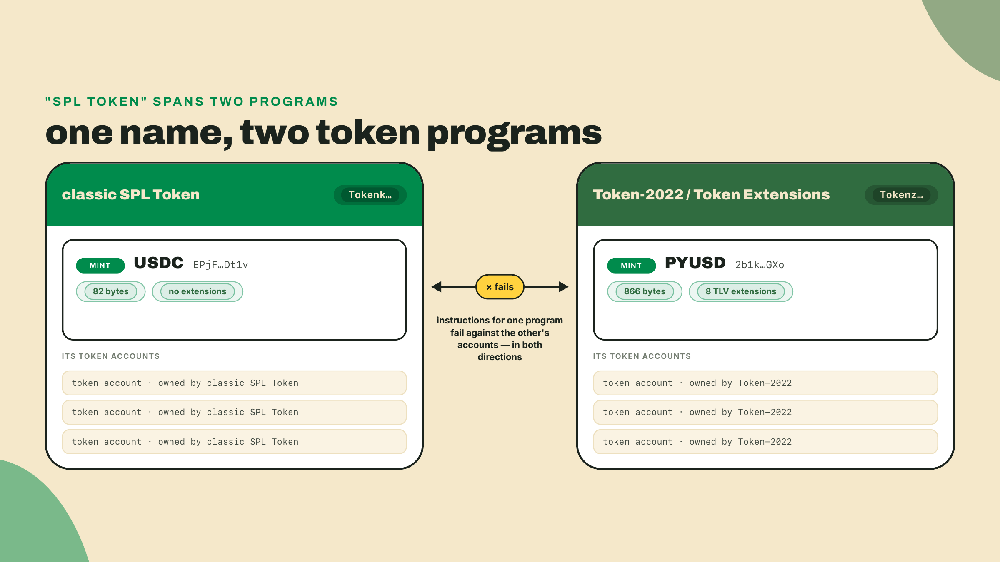
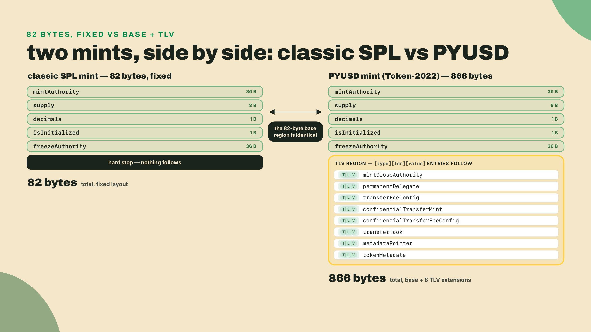
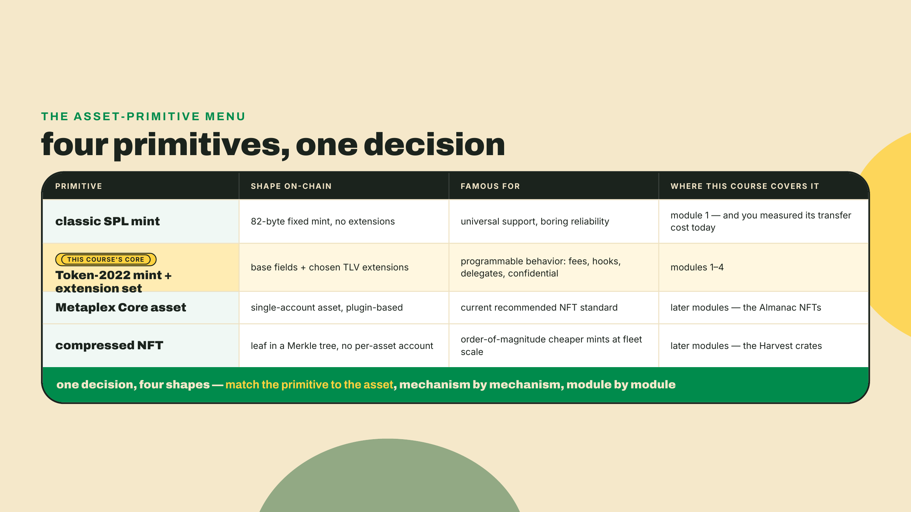
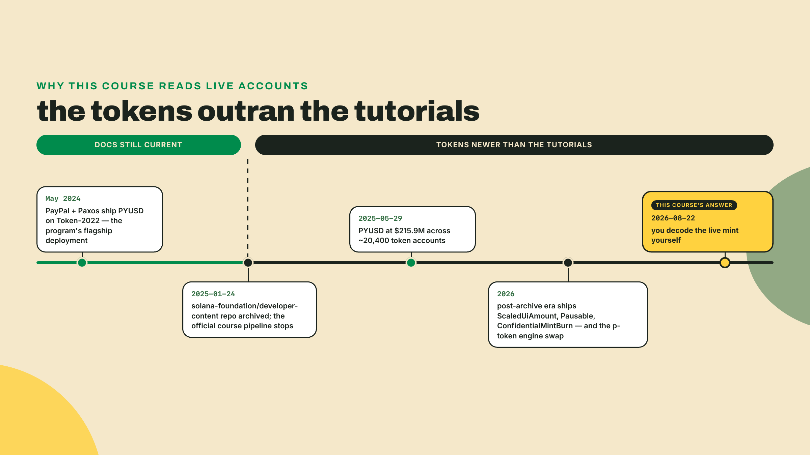
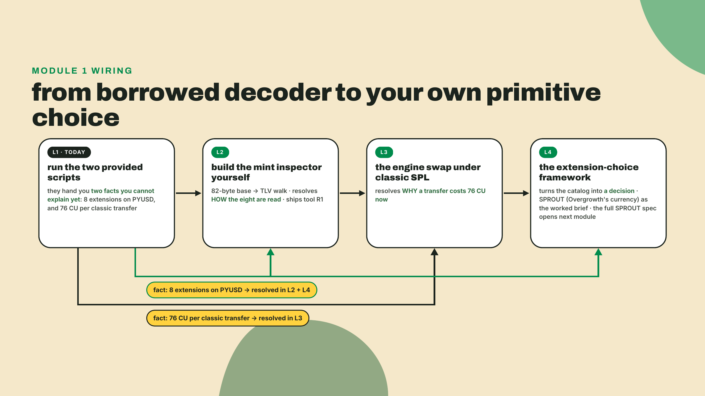
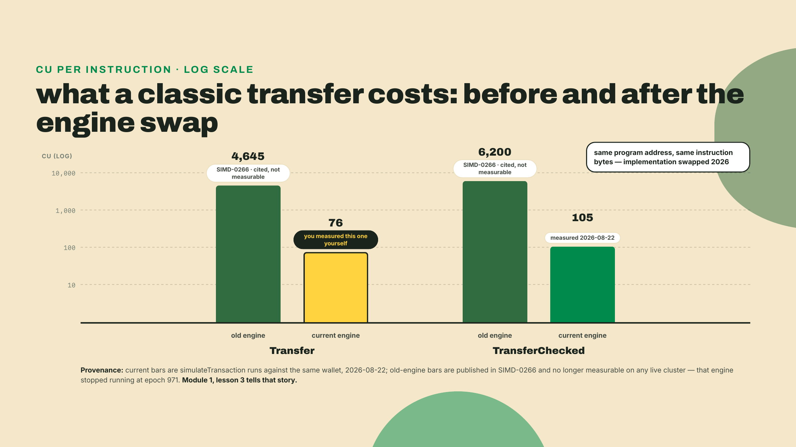

# What is this token, really?

This is lesson one, so nothing is built yet. You arrive with Solana fundamentals in your head: accounts, PDAs, transactions, fees, ATAs. You also arrive, most likely, with a belief I held for way too long: that "a token" means the classic SPL mint you already use. We are going to break that belief in the next five minutes, using a token PayPal ships to millions of people. If you arrived here from the Solana Payments and Commerce course, you have already met this mint from the paying side; now you will read every byte of it.

No toolchain install. You need Node 20 or newer (`node --version` to check; I am on 23.9) and nothing else. Save this file as `read-pyusd.ts`:

```typescript
// read-pyusd.ts - read PayPal USD's live mint account and list what it carries.
// Zero npm dependencies. Run: npx tsx@4.20.5 read-pyusd.ts
// Read-only: one RPC call against mainnet, nothing signed, nothing sent.

const RPC = "https://api.mainnet-beta.solana.com";
const PYUSD_MINT = "2b1kV6DkPAnxd5ixfnxCpjxmKwqjjaYmCZfHsFu24GXo";
const CLASSIC_MINT_SIZE = 82; // a classic SPL mint is exactly this many bytes

async function main() {
  const res = await fetch(RPC, {
    method: "POST",
    headers: { "Content-Type": "application/json" },
    body: JSON.stringify({
      jsonrpc: "2.0",
      id: 1,
      method: "getAccountInfo",
      params: [PYUSD_MINT, { encoding: "jsonParsed" }],
    }),
  });
  const { result, error } = await res.json();
  if (error) throw new Error(JSON.stringify(error));

  const account = result.value;
  const info = account.data.parsed.info;

  console.log(`mint:          ${PYUSD_MINT}`);
  console.log(`owner program: ${account.owner}`);
  console.log(`account size:  ${account.space} bytes (a classic mint is ${CLASSIC_MINT_SIZE})`);
  console.log(`decimals:      ${info.decimals}`);
  console.log(`supply:        ${info.supply} base units`);
  console.log(`mintAuthority: ${info.mintAuthority}`);
  console.log(`freezeAuth:    ${info.freezeAuthority}`);

  const extensions = info.extensions ?? [];
  console.log(`\nextensions (${extensions.length}):`);
  for (const ext of extensions) {
    console.log(`  - ${ext.extension}`);
  }

  const hook = extensions.find((e: any) => e.extension === "transferHook");
  const fee = extensions.find((e: any) => e.extension === "transferFeeConfig");
  console.log(`\ntransferHook.programId: ${hook?.state.programId}`);
  console.log(
    `transferFee: ${fee?.state.newerTransferFee.transferFeeBasisPoints} bps, ` +
    `max ${fee?.state.newerTransferFee.maximumFee}`
  );
  if (hook && hook.state.programId === null) {
    console.log(`\n=> a transfer hook slot exists, but no hook program is set.`);
    console.log(`   configured, but dormant.`);
  }
}

main().catch((e) => { console.error(e); process.exit(1); });
```

Run it:

```bash
npx tsx@4.20.5 read-pyusd.ts
# tsx pinned at 4.20.5, verified working 2026-08-22; npx fetches it on first
# run, so there is genuinely nothing to install.
```

When I ran this today, 2026-08-22, against the free public RPC, I got:

```text
mint:          2b1kV6DkPAnxd5ixfnxCpjxmKwqjjaYmCZfHsFu24GXo
owner program: TokenzQdBNbLqP5VEhdkAS6EPFLC1PHnBqCXEpPxuEb
account size:  866 bytes (a classic mint is 82)
decimals:      6
supply:        688176370728435 base units
mintAuthority: 8Jornc27vtAYPkwDzsZVgLQchAYyC8nD7aCNPCDV8Qk2
freezeAuth:    2apBGMsS6ti9RyF5TwQTDswXBWskiJP2LD4cUEDqYJjk

extensions (8):
  - mintCloseAuthority
  - permanentDelegate
  - transferFeeConfig
  - confidentialTransferMint
  - confidentialTransferFeeConfig
  - transferHook
  - metadataPointer
  - tokenMetadata

transferHook.programId: null
transferFee: 0 bps, max 0

=> a transfer hook slot exists, but no hook program is set.
   configured, but dormant.
```

Eight extensions, sitting on a mint that millions of PayPal users move around without once suspecting it is shaped differently from any other dollar token. A transfer hook that exists but points at no program. A transfer fee of zero basis points that is nonetheless sitting right there in the bytes, waiting. Your supply line will differ from mine, because this is a live account and PayPal mints and burns against it daily. Everything else should match.

Wait, hold on. You "use SPL tokens" every day. So why does this one carry a `permanentDelegate`, an authority that can move anyone's PYUSD out of anyone's account? Why is its mint ten times the size of the mints you have made? And why is there a hook slot configured but switched off?

You cannot answer yet. That gap is this course.

## Summary

You just decoded a token you did not make, using a decoder you did not write. This lesson is about what you saw: what a mint account actually is, what the eight extension entries on PYUSD's mint mean as a shape (not yet in mechanism), and why "SPL token" stopped naming one thing years ago. In the lab you will run a second zero-setup script that simulates a plain classic transfer and reads its compute cost straight from the runtime: a second number you cannot explain yet. Both numbers get resolved across this module. The thesis you leave with today is short: an asset primitive is a decision, and you cannot make a decision you cannot read.

House rules, stated once and holding for the whole course:

- **Read the theory, do not code along with it.** Your hands move in the numbered Lab, and only there. The opener you just ran is the one exception every lesson gets: something to do before anything to believe.
- **Do the Challenge alone.** No walkthrough, no solution steps. That is where the learning compounds.
- **Every tool shows its install the first time it appears**, and every version pin carries a date. Today that was `tsx@4.20.5`, verified 2026-08-22.
- **The hand-holding fades on a schedule.** Today I give you two complete scripts and you run them. Next lesson you build the decoder: the base-field slice is worked with you, and the extension walk is yours to write. By the end of the module you are choosing primitives and defending the choice. The training wheels come off deliberately, not by surprise.

## A token is a decision you cannot yet make

Let us name what you actually read, because two of the words matter enormously and Solana developers blur them daily.

A **mint account** is the account that defines the token itself: its supply, its decimals, who may create more of it, who may freeze it. One mint per token, ever. It is not where balances live. Balances live in **token accounts** (usually the associated token accounts, ATAs, you already know), one per holder per token. When you "check your PYUSD balance" you read a token account. When you ask what PYUSD *is*, you read the mint. Today we read the mint, and we will keep reading mints all module, because the mint is where a token's identity and its rules are written down.

Now the field that should have stopped you: `owner program: TokenzQdBNbLqP5VEhdkAS6EPFLC1PHnBqCXEpPxuEb`. That is not the token program you know. The classic SPL Token program lives at `TokenkegQfeZyiNwAJbNbGKPFXCWuBvf9Ss623VQ5DA`. PYUSD's mint is owned by a different program at a different address: Token-2022, also called Token Extensions. Same job, different rulebook, and the two do not mix. A classic-token instruction pointed at a Token-2022 mint fails, and vice versa.



This is footgun number one for this entire course, so I will say it plainly: **"SPL token" is not one thing.** I spent an embarrassing stretch of my early Solana work saying "SPL token" like it named a single standard, and I shipped integrations on that assumption. Guilty, big time. It cost me a weekend of debugging the first time a Token-2022 mint hit code that hardcoded `Tokenkeg`. The two programs coexist on mainnet, forever, and every wallet, DEX, and indexer has to handle both.

### The 82 bytes and the 866

Size is the fastest way to feel the difference. A classic SPL mint is exactly 82 bytes, always: mint authority, supply, decimals, initialized flag, freeze authority. Fixed layout, nothing optional, nothing else, and the same five fields whether the mint is USDC or something you spun up on a Tuesday afternoon to practice. Your script printed PYUSD at 866 bytes. Where did the other 784 bytes go?

They went into **extensions**: optional packets of extra state and behavior that Token-2022 lets an issuer attach to a mint (or to individual token accounts) at creation time. Each extension is laid down in the account's data using a scheme called **TLV**, for type-length-value: a small tag saying which extension this is, a length saying how many bytes it occupies, then the value bytes themselves. One after another, like labeled boxes in a row. A decoder walks the row: read a tag, read a length, jump ahead, repeat. That walk is exactly what the RPC's parser did for you today, and exactly what you will implement yourself next lesson.



Read PYUSD's eight entries again, this time as a story. The full set is mintCloseAuthority, permanentDelegate, transferFeeConfig, confidentialTransferMint, confidentialTransferFeeConfig, transferHook, metadataPointer, and tokenMetadata. That is a compliance-shaped loadout. A permanent delegate means Paxos, the regulated issuer, can move or burn PYUSD from any account: seizure powers, the thing a court order demands. The confidential transfer pair is privacy rails. The metadata pair puts the token's name and symbol on-chain in the mint itself instead of in a separate ecosystem's account. And two of the entries are loaded but not firing: the transfer fee is configured at 0 basis points with a maximum of 0, and the transfer hook, the extension that would let a program run on every single transfer, has `programId: null`.

**Configured, but dormant.** Hold that phrase; it does real work all course. An extension being present in the bytes is not the same as it having an active effect. PYUSD carries a hook slot and a fee schedule the way a building carries empty conduit: nothing runs through it today, but nobody has to jackhammer the walls to change that later. Present is not active, and those are two separate questions that a single glance at an extension list will happily blur together. When you evaluate any token from now on, you ask first whether an extension exists in the bytes and then, separately, whether it currently does anything at all.

One honest caveat before the thesis, because it is the trade-off this whole lesson rests on. Reading a mint tells you what a token **is**. It does not tell you what your target venue will **accept**. The same eight extensions that make PYUSD compliant enough for PayPal would get a token refused outright by some DEX programs that reject unknown Token-2022 extensions rather than risk behavior they did not model. Visibility is necessary and not sufficient. You can now decode a token and still not be able to ship one; the choose-and-verify half of that skill comes later in the course, and I am not going to pretend today's script gives it to you.

### The menu behind the question

Now, the reason this lesson exists on day one, before any building: everything you will do in this course starts from one decision that most people make by default instead of on purpose: **which asset primitive do you issue?**

On Solana in 2026 that menu has four serious entries. A classic SPL mint: 82 bytes, no extensions, boring on purpose, supported by literally everything. A Token-2022 mint with a chosen extension set: programmable behavior at the cost of venue-by-venue compatibility questions. A Metaplex Core asset: the current recommended standard for NFT work, a different program family entirely. And a compressed NFT: state that lives in a Merkle tree instead of its own account, a thousand-fold cost reduction with its own read-path consequences.



Here is the thesis, and it is the closest thing to philosophy you get today. Each of those four is not a product tier; it is a different answer to the question "what should the chain enforce about this asset?" A classic mint answers "almost nothing beyond supply and freeze." PYUSD's extension set answers "seizure, fees, privacy, and metadata, some of it pre-wired and dormant." A decision like that is only real if you can verify what was actually decided, and the only place the decision is written down is the bytes you read today. Whitepapers describe intentions. Mints are the law. You cannot choose an asset primitive you cannot read, and until this morning you could not read one. That is why decoding came before everything, including the toolchain.

### Tokens newer than the tutorials

There is a fair objection lurking here, and it is the one I would have raised a few years ago: maybe Token-2022 is mostly a specification, impressive on paper and thinly deployed in practice. The mint you decoded this morning is the counterargument, and it is a heavy one. PayPal and Paxos shipped PYUSD on Token-2022 in May 2024, the flagship deployment of the program, and by late May 2025 Solana's own PYUSD developer note counted $215.9 million of it held across just 20,400 token accounts. The supply figure your script printed today is whatever it is today; mine read about 688 million dollars' worth of base units. Live number, live account, which is exactly why the script reads it instead of me asserting it.

Meanwhile the official education about all this froze mid-plot. The solana-foundation developer-content repository, the source behind a whole generation of official courses, was archived on January 24, 2025. Every course built from it predates ScaledUiAmount, Pausable, ConfidentialMintBurn, and the p-token engine swap. Think about what that means for one beat: the tokens you decode today are newer than the tutorials that were supposed to explain them.



That archive date is why this course has a testing-thread discipline you will meet over and over: **measure, do not memorize.** Numbers about a live system rot. Which brings me to the second number I promised you, the one you will produce yourself in the lab. A plain transfer on the classic SPL Token program, the boring 82-byte-mint kind, currently costs 76 compute units. **Compute units**, CU, are Solana's meter for on-chain work: every instruction runs against a budget (200,000 by default, and you will see that exact figure in a log line shortly), and what it consumes is reported by the runtime itself. For years that same transfer cost 4,645 CU. In 2026 the implementation behind the classic token program was swapped out from under the interface, and the price collapsed. Same program address, same instruction bytes, a sixty-fold drop. How that swap was even possible without anyone's wallet breaking is lesson three of this module, and it is one of the better systems stories on Solana. Today you just measure the aftermath, and you refuse to memorize it, because a number that dropped sixty-fold once can move again.

### The road from here: Overgrowth

Everything in this course builds one thing. **Overgrowth** is a co-op farming and crafting game whose entire on-chain economy you will stand up, primitive by primitive: SPROUT, its currency, as a Token-2022 mint whose extension set you will choose and defend; Almanac NFTs, the collectible knowledge-books that gate crafting recipes; and Harvest crates, seasonal drop rewards minted as compressed NFTs because there will be far too many of them to pay per-account rent. By the final module you will have issued assets in every shape on the menu above, and the point of today is that you will do it as someone who reads bytes before trusting names.

This module is the on-ramp, and it runs deliberately backwards: concrete first, foundations second. Today you borrowed a decoder and felt two numbers you cannot explain. Next lesson you stop borrowing: you build the decoder yourself, starting from the 82-byte bare mint and working up through the TLV walk, and that inspector becomes the first real tool in the Overgrowth kit, the one later lessons call on. Lesson three explains the 76. Lesson four turns the extension catalog into a choosing framework and closes the module with SPROUT as its worked example; the actual spec-and-size decision for SPROUT opens the next module's design conversation, with the framework in your hands.



Enough theory. Go measure the second number.

## Lab: two numbers from a cold start

Code along now; this is the part you do, not read. Roughly fifteen minutes.

**1. Confirm your runtime.** You need Node 20+ for the built-in `fetch` these scripts lean on.

```bash
node --version
# v20.x or newer. Mine printed v23.9.0.
```

**2. Re-run the PYUSD reader, and this time read it like an auditor.** You ran it in the opener; now extract claims from it. Run `npx tsx@4.20.5 read-pyusd.ts` again and check off four facts against your own output: the owner program starts with `Tokenz` (Token-2022, not classic); the account is 866 bytes against the classic 82; the extension count is 8; and `transferHook.programId` is `null` while the fee reads 0 bps with max 0. Those last two are the "configured, but dormant" pair. If your extension count differs from 8, do not assume the lesson is wrong or that you are. A mint's extension set is fixed when the mint is created, give or take a narrow metadata exception (lesson four makes a whole argument out of that), so a different count almost always means your RPC's parser surfaces entries under different names, the endpoint served you a stale or partial parse, or the address got mistyped. Read the list your run printed and compare it entry by entry.

**3. Point the same decoder at a classic mint.** Copy the file to `read-usdc.ts` and change one constant, so you can see what a classic-program mint looks like through the same lens:

```typescript
// in read-usdc.ts, replace the PYUSD address with classic USDC's mint:
const PYUSD_MINT = "EPjFWdd5AufqSSqeM2qN1xzybapC8G4wEGGkZwyTDt1v";
```

```bash
npx tsx@4.20.5 read-usdc.ts
```

My run today:

```text
mint:          EPjFWdd5AufqSSqeM2qN1xzybapC8G4wEGGkZwyTDt1v
owner program: TokenkegQfeZyiNwAJbNbGKPFXCWuBvf9Ss623VQ5DA
account size:  82 bytes (a classic mint is 82)
decimals:      6
supply:        7923463957481104 base units
mintAuthority: BJE5MMbqXjVwjAF7oxwPYXnTXDyspzZyt4vwenNw5ruG
freezeAuth:    7dGbd2QZcCKcTndnHcTL8q7SMVXAkp688NTQYwrRCrar

extensions (0):

transferHook.programId: undefined
transferFee: undefined bps, max undefined
```

Owner starts with `Tokenkeg`, size is exactly 82, extension count is zero. And look at those two `undefined` lines: that is our script asking Token-2022 questions of a classic mint. Not dormant, not zero. There is no slot to be dormant in. A classic mint cannot even represent the concepts, which is the cleanest proof you will get that these are two different programs, not one program with options.

**4. Now the second cliffhanger. Save this as `transfer-cu.ts`.** It simulates a real classic-token transfer between two live mainnet accounts and asks the runtime what it cost. Nothing is signed, no fees are paid, nothing lands on chain; `simulateTransaction` with `sigVerify: false` is a free question, and it is the same measure-first discipline you will use all course. The middle of the file hand-assembles a raw transaction so that we need zero libraries; treat that part as a sealed black box today. You are the person running the instrument, not yet the person who built it.

```typescript
// transfer-cu.ts - simulate a classic SPL Token transfer and read its compute cost.
// Zero npm dependencies. Run: npx tsx@4.20.5 transfer-cu.ts
// Builds a real Transfer instruction against live mainnet accounts and asks the RPC
// to simulate it. No signatures, no fees paid, nothing lands on chain.

const RPC = "https://api.mainnet-beta.solana.com";
const USDC_MINT = "EPjFWdd5AufqSSqeM2qN1xzybapC8G4wEGGkZwyTDt1v"; // classic SPL USDC
const TOKEN_PROGRAM = "TokenkegQfeZyiNwAJbNbGKPFXCWuBvf9Ss623VQ5DA"; // classic SPL Token
// Any wallet that owns two USDC accounts and some SOL works. This is a well-known,
// long-lived exchange hot wallet; we borrow it on paper, simulation-only.
const WALLET = "5tzFkiKscXHK5ZXCGbXZxdw7gTjjD1mBwuoFbhUvuAi9";

async function rpc(method: string, params: unknown[]): Promise<any> {
  const res = await fetch(RPC, {
    method: "POST",
    headers: { "Content-Type": "application/json" },
    body: JSON.stringify({ jsonrpc: "2.0", id: 1, method, params }),
  });
  const json = await res.json();
  if (json.error) throw new Error(`${method}: ${JSON.stringify(json.error)}`);
  return json.result;
}

// base58 -> bytes (Solana address alphabet)
const ALPHABET = "123456789ABCDEFGHJKLMNPQRSTUVWXYZabcdefghijkmnopqrstuvwxyz";
function b58decode(s: string): Uint8Array {
  let n = 0n;
  for (const c of s) {
    const i = ALPHABET.indexOf(c);
    if (i < 0) throw new Error(`bad base58 char ${c}`);
    n = n * 58n + BigInt(i);
  }
  const out: number[] = [];
  while (n > 0n) { out.unshift(Number(n & 0xffn)); n >>= 8n; }
  for (const c of s) { if (c === "1") out.unshift(0); else break; }
  return new Uint8Array(out);
}

// shortvec length prefix used by the legacy transaction format
function compactU16(n: number): number[] {
  const out: number[] = [];
  do { let b = n & 0x7f; n >>= 7; if (n > 0) b |= 0x80; out.push(b); } while (n > 0);
  return out;
}

async function main() {
  // 1. Find two of the wallet's live USDC token accounts, funded one first.
  const res = await rpc("getTokenAccountsByOwner", [
    WALLET, { mint: USDC_MINT }, { encoding: "jsonParsed" },
  ]);
  const accounts = res.value
    .sort((a: any, b: any) =>
      Number(BigInt(b.account.data.parsed.info.tokenAmount.amount) -
             BigInt(a.account.data.parsed.info.tokenAmount.amount)));
  if (accounts.length < 2) throw new Error("need a wallet with two token accounts");
  const source = accounts[0].pubkey;
  const dest = accounts[1].pubkey;

  // 2. Hand-assemble a legacy transaction: one classic Transfer of 1 base unit.
  //    Keys in required order: writable signer, writables, then read-only.
  const keys = [WALLET, source, dest, TOKEN_PROGRAM].map(b58decode);
  const ixData = new Uint8Array(9);
  ixData[0] = 3; // Transfer discriminator in the classic SPL Token interface
  ixData[1] = 1; // amount = 1 as u64 little-endian (0.000001 USDC)

  const msg: number[] = [
    1, 0, 1, // header: 1 signer, 0 read-only signers, 1 read-only non-signer
    ...compactU16(keys.length), ...keys.flatMap((k) => [...k]),
    ...new Uint8Array(32), // blockhash placeholder; the RPC replaces it
    ...compactU16(1), // one instruction
    3, // program id index -> TOKEN_PROGRAM
    ...compactU16(3), 1, 2, 0, // accounts: source, dest, authority
    ...compactU16(ixData.length), ...ixData,
  ];
  const tx = new Uint8Array([...compactU16(1), ...new Uint8Array(64), ...msg]);

  // 3. Simulate. sigVerify:false means our 64 zero bytes pass as a "signature".
  const sim = await rpc("simulateTransaction", [
    Buffer.from(tx).toString("base64"),
    { sigVerify: false, replaceRecentBlockhash: true, encoding: "base64" },
  ]);

  console.log(`simulated: Transfer of 1 base unit (0.000001 USDC)`);
  console.log(`  from ${source}`);
  console.log(`  to   ${dest}`);
  console.log(`err:           ${JSON.stringify(sim.value.err)}`);
  console.log(`unitsConsumed: ${sim.value.unitsConsumed}`);
  for (const line of sim.value.logs ?? []) console.log(`  ${line}`);
}

main().catch((e) => { console.error(e); process.exit(1); });
```

**5. Run it and read the meter.**

```bash
npx tsx@4.20.5 transfer-cu.ts
```

My run, same day:

```text
simulated: Transfer of 1 base unit (0.000001 USDC)
  from 7KJjY7rArbydeLBF7gQ5LdqXRKRYyPArT99NEctsHsgU
  to   FzbcyEZ9m8xjtergWgWDq7mfPoHEbboBF791B6cTpzbq
err:           null
unitsConsumed: 76
  Program TokenkegQfeZyiNwAJbNbGKPFXCWuBvf9Ss623VQ5DA invoke [1]
  Program TokenkegQfeZyiNwAJbNbGKPFXCWuBvf9Ss623VQ5DA consumed 76 of 200000 compute units
  Program TokenkegQfeZyiNwAJbNbGKPFXCWuBvf9Ss623VQ5DA success
```

There it is, from the runtime's own mouth: `consumed 76 of 200000 compute units`. Not my claim anymore. Yours. `err: null` means the transfer would genuinely succeed if signed; the specific account addresses in your run may differ from mine, since the script picks the wallet's two largest USDC accounts live.

**6. Checkpoint.** You are done with the lab when you can point at four things in your own terminal output: the two owner programs (`Tokenz...` and `Tokenkeg...`), the 866-vs-82 size gap, the `null` hook on an extension that exists, and the line where the runtime reports 76 CU. If any of the scripts failed instead, the overwhelmingly likely causes are Node below 20 (no `fetch`) or the public RPC rate-limiting you; wait thirty seconds and re-run, or swap in any RPC endpoint you already use.



## Challenge

Solo, no walkthrough. Write the report a teammate could act on, four lines, your own words:

1. How many TLV extensions does PYUSD's mint carry, and which two are configured but dormant? State what "dormant" meant concretely in the bytes you read.
2. What does a classic SPL Transfer cost in CU, per your own simulation, and why does this course refuse to let you memorize that number?
3. Pick one more token, any mint address from your own wallet or an explorer. Point `read-pyusd.ts` at it and classify it: which program owns it, and how many extensions does it carry?
4. One sentence: why can you not choose an asset primitive you cannot read?

If line 4 comes out something like "because the primitive's actual rules live in the mint's bytes, not in its name or its docs," you have the lesson. If it comes out "because reading is generally good," run the USDC comparison again and look harder at the two `undefined` lines.

## What you decoded, and what you did not

Quick honesty about the day. You did not learn the extension mechanisms, you did not write a decoder, and you cannot yet say why a hook or a permanent delegate would make a DEX nervous. What you did do: you read a live production mint that most of its holders will never look at, you caught a program distinction that still bites working engineers, and you measured a runtime cost instead of quoting one. You produced two numbers you cannot explain, on purpose, from a cold start, in under an hour. That is a real skill, and it is the one everything else here stands on.

Next lesson, the borrowing ends. You build the decoder yourself, from the 82-byte bare mint up through the full TLV walk, and it becomes R1, the mint inspector, the first tool in the Overgrowth kit and the one the rest of the module keeps calling. Bring today's two scripts; we are going to open the black box.

If something in this lesson read wrong against what your own terminal printed, trust the terminal and tell me. That reflex is the course too.

Happy decoding! 🌱
