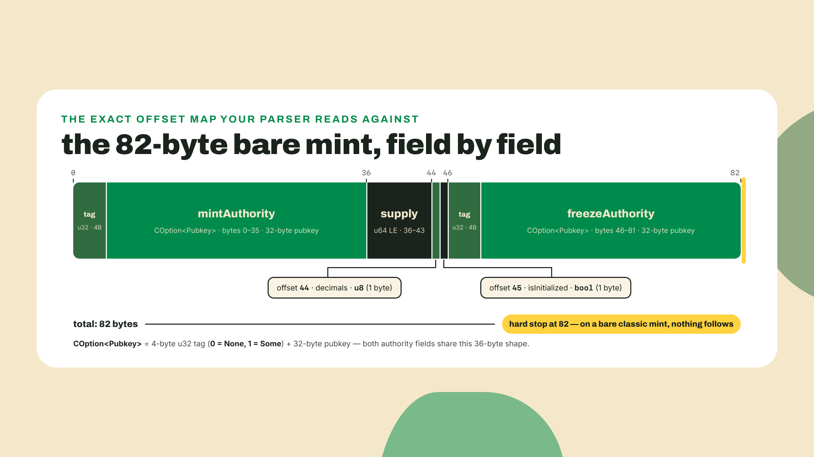
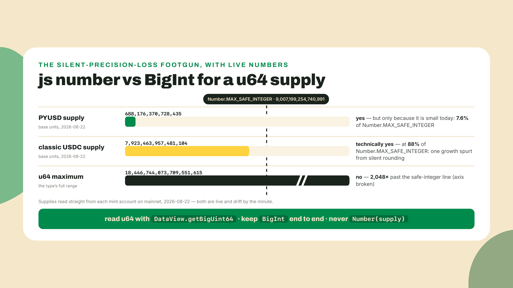
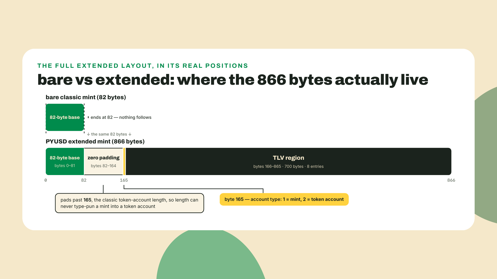
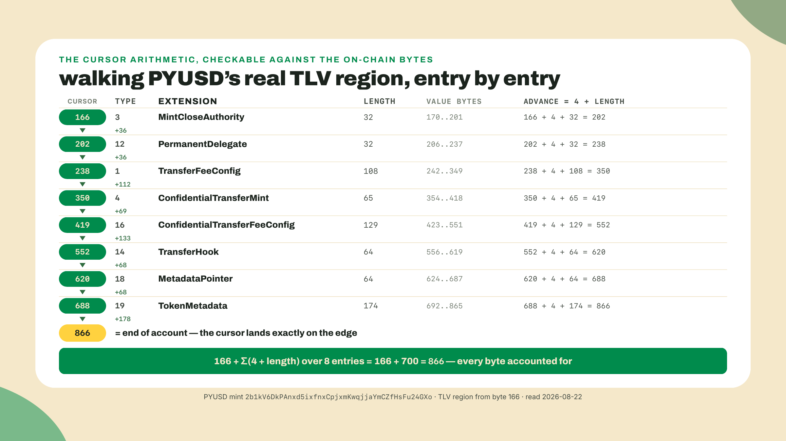
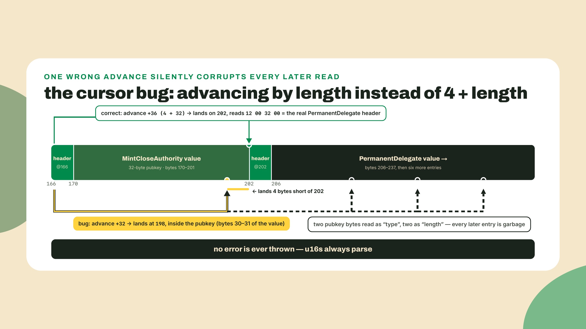
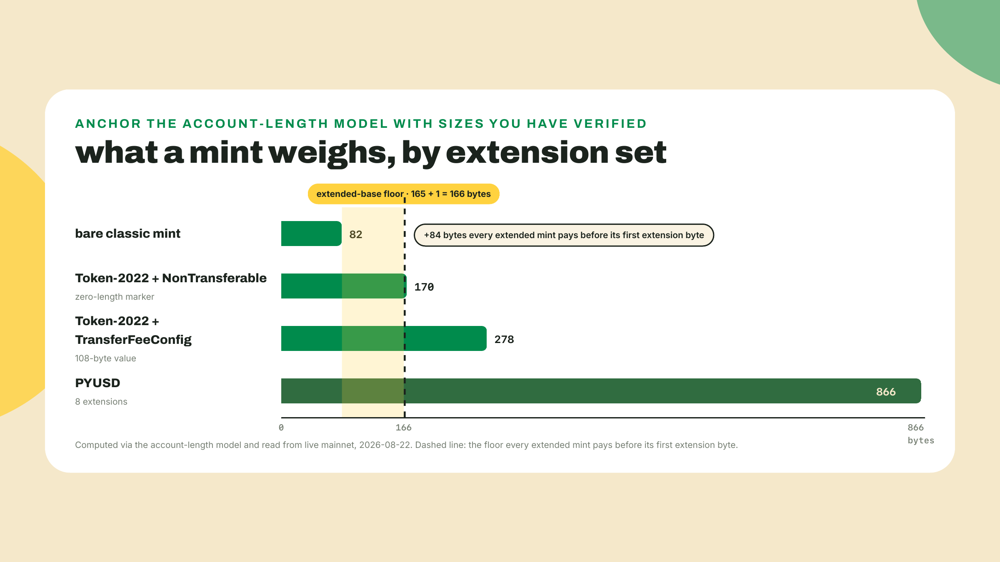
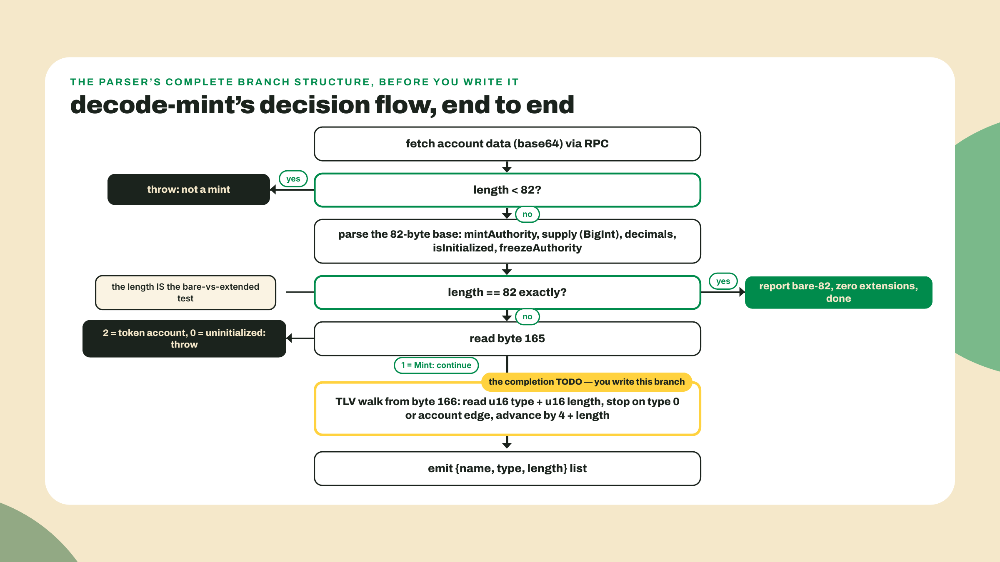

# Mint & account anatomy from raw bytes

In m01-l1 you ran a provided script that decoded PYUSD's eight extensions and watched a classic transfer cost 76 CU. You read numbers you could not yet explain. Worse, you took the decoder's word for all of it: the RPC's `jsonParsed` mode handed you a tidy list of extension names, and you had no way to check whether it was telling the truth. That is a black box, and today we open it.

Start by looking at the raw material with your own eyes. No libraries yet. Save this as `peek.ts` anywhere:

```typescript
// peek.ts - three bytes of PYUSD's mint, before any parser exists.
// Zero npm dependencies. Run: npx tsx@4.20.5 peek.ts
const RPC = "https://api.mainnet-beta.solana.com";
const PYUSD = "2b1kV6DkPAnxd5ixfnxCpjxmKwqjjaYmCZfHsFu24GXo";

async function peek() {
  const res = await fetch(RPC, {
    method: "POST",
    headers: { "Content-Type": "application/json" },
    body: JSON.stringify({
      jsonrpc: "2.0", id: 1, method: "getAccountInfo",
      params: [PYUSD, { encoding: "base64" }],
    }),
  });
  const { result } = await res.json();
  const data = Buffer.from(result.value.data[0], "base64");

  console.log(`length:        ${data.length} bytes`);
  console.log(`byte 165:      ${data[165]}   (the account-type discriminator)`);
  console.log(`bytes 166-169: ${[...data.subarray(166, 170)].join(" ")}  (first TLV header)`);
}

// Wrapped in a function deliberately: a .ts file with no imports is a script,
// not a module, and top-level await is a module-only privilege.
peek();
```

```bash
npx tsx@4.20.5 peek.ts
# tsx pinned at 4.20.5, verified 2026-08-22; npx fetches it on first run.
```

My run, today, 2026-08-22:

```text
length:        866 bytes
byte 165:      1   (the account-type discriminator)
bytes 166-169: 3 0 32 0  (first TLV header)
```

Same 866 bytes as last lesson, but this time nothing parsed them for you. That `1` sitting at byte 165 and that little `3 0 32 0` run are the entire anatomy of this lesson, and by the end of it you will read them the way you read English. The difference from last time is the difference between trusting a decoder and owning the read: when your inspector prints the exact extension set of a mint you never made, computed by your own cursor arithmetic, nobody can hand-wave you again.

## Summary

This is a build lesson, and it ships the first real tool in the Overgrowth kit: **R1, the `decode-mint` inspector**. Given a mint address and an RPC, it prints the base fields (mint authority, supply as a BigInt, decimals, freeze authority), reports whether the account is a bare 82-byte mint or a 165-plus-1-byte extended mint, and enumerates every TLV extension as `{name, type, length}`. It ships with `test-decode-mint.ts`, an assert-script that decodes a pinned known mint and fails loudly on any mismatch. That script is the first acceptance gate of the course, and the pattern it establishes, plain asserts against a pinned target, gets reused on every later rung.

The theory covers the whole raw-bytes anatomy the course stands on: the 82-byte bare mint layout, why extended mints pad to 165 bytes plus one discriminator byte, the TLV entry format, the account-length math behind `try_calculate_account_len`, and why every u64 in this course is a BigInt. The hand-holding fades on schedule: last lesson you ran finished scripts; today I show you the base slice and the is-extended check end to end, but the TLV loop is a TODO that you fill yourself. The challenge afterward is fully solo. Next rung is a concept lesson, guided end to end by design; the fade resumes in m01-l4, where four of the five validator rules are yours to port.

## The anatomy, from offset zero

An account's data is just a byte array. The program that owns the account decides what those bytes mean, and for mints the meaning is published in the program's source. Everything below is that published layout, and nothing in it is secret or clever. It is the floor plan of a building you have been living in.

### The 82-byte base

A classic SPL mint is exactly 82 bytes, and both token programs use the same five fields in the same order. Here is the map, offsets included, because you are about to write code against them:



Two of these fields deserve a closer look because they trip people.

**COption is 36 bytes, not 33.** An optional pubkey is serialized as a full u32 little-endian tag (0 for None, 1 for Some) followed by the 32-byte key, which is always present in the buffer even when the tag says None. So the mint authority spans bytes 0 through 35, and the freeze authority spans 46 through 81. If you have internalized Rust's `Option` as one tag byte, this layout will off-by-three you. The wire format spends four bytes on the tag.

**Supply is a u64, and u64 does not fit in a JavaScript number.** `Number.MAX_SAFE_INTEGER` is 2^53 minus 1, about 9.0 quadrillion; a u64 tops out around 18.4 quintillion, three orders of magnitude higher. This is not a theoretical concern you can defer. When I decoded classic USDC's mint today its supply read 7,923,463,957,481,104 base units, which is about 88 percent of the way to the largest integer JavaScript can represent exactly. One more order of magnitude of stablecoin growth, or any 9-decimals token with a large supply, and `Number(supply)` silently rounds. Silently is the operative word: no exception, no warning, just a wrong balance in production. So the rule in this course is absolute and boring: **u64 supply and amounts are BigInt end to end**, read with `DataView.getBigUint64`, printed with the `n` still conceptually attached, never bounced through `Number`. I have shipped the other version of this decision, years ago, in a dashboard that displayed token supplies. It worked in every test, because test supplies are small. That is exactly the kind of bug this is.



That is the base. On a bare classic mint, that is also the end: byte 82 is the edge of the account. The length itself is your first parser branch, and it is a complete answer on its own. An account that is exactly 82 bytes is a bare mint with no extensions, no discriminator, no TLV region, full stop. Nothing else to check.

### Why extended mints start again at byte 165

Now the strange part. PYUSD's mint is 866 bytes, and its first extension does not start at byte 82. It starts at byte 166. Between the base and the extensions sit 83 bytes of zero padding and one mystery byte. Why would a format waste 83 bytes per mint?

Because of a decision made years before extensions existed. The classic token program type-checks its accounts by length alone: a mint is 82 bytes, a token account is 165, a multisig is 355. That is the entire test. Length 82, treat the bytes as a mint; length 165, treat them as a token account; 355, a multisig; anything else, reject. Cheap, simple, and completely dependent on those three numbers never colliding.

Extensions break that. Once accounts have optional variable-length tails, lengths are no longer distinctive: some extended mint would eventually land on exactly 165 bytes, and any program using the length test would happily read a mint as if it were someone's token balance. Misreading bytes at a type boundary is how funds get stolen, so Token-2022 closed the door structurally. Every extended account, mint or token account, is padded past the collision zone: base data first, zeroes up to offset 165, then **one account-type discriminator byte at offset 165**. Value 1 means mint. Value 2 means token account. Your `peek.ts` printed that exact `1`. After the discriminator, and only after it, the extension region begins at byte 166.

The cost of this design is honest and visible: an extended mint spends 83 bytes on padding, rent paid on all of them, purely so that no length can ever be ambiguous again. The alternative was a format where type confusion is possible and every downstream program carries the burden of never making the mistake. Paying 83 bytes once, at the format level, to delete an entire bug class everywhere, is a trade the designers took without hesitation, and having spent time with the exploit literature they were right to.

This also settles a practical question about the token accounts you use daily. Your ATAs, the associated token accounts holding your balances, are 165-byte token accounts in the classic program. A Token-2022 token account with any extension gets the same treatment as a mint: padded (it is already at 165), then byte 165 carries a 2 instead of a 1. Same discriminator slot, different value. One byte, and mints and token accounts can never be confused again no matter what extensions do to their lengths.



### The TLV walk

Everything from byte 166 to the end of the account is a sequence of **TLV entries**: type, length, value, repeated. Each entry is a u16 little-endian type code saying which extension this is, a u16 little-endian length saying how many value bytes follow, and then exactly that many value bytes. Four bytes of header, then the payload. Next entry immediately after. No separators, no count field up front, no index. The list is the walk.

Your `peek.ts` output already contained a complete worked example. The four bytes at 166 were `3 0 32 0`. Read them as two little-endian u16s: type = 3, length = 32. Type 3 is MintCloseAuthority, and its value is a 32-byte pubkey. So bytes 170 through 201 are that authority, and the next entry's header begins at 166 + 4 + 32 = 202. At 202 you would find `12 0 32 0`: PermanentDelegate, another 32-byte pubkey, next header at 238. And so on, eight times, until the last entry ends exactly at byte 866, the edge of the account. When your cursor lands precisely on the account boundary with nothing left over, that is the reconciliation check that proves your walk read every byte.



Look down the type column for a second, because it quietly kills a tempting assumption. The codes run 3, 12, 1, 4, 16, 14, 18, 19. Not sorted. TLV entries appear in the order the issuer initialized them, not in type order, so your parser must never binary-search or assume position. You walk, always.

Now the footgun that earns this lesson its place in the course, the one the brief and I both refuse to let you learn in production. When you finish reading an entry, you advance the cursor to the next header. The value is `length` bytes long, but the entry is `4 + length` bytes long, because the type and length fields themselves take two bytes each. Advance by `length` alone and your cursor lands 4 bytes short, in the middle of the value you just read. The next "type" you read is two bytes of some authority's pubkey. The next "length" is two more. Both parse fine, because any two bytes parse as a u16. From that point on, every entry you decode is garbage that looks like data, and nothing throws. One wrong constant, a silently corrupted read of every following entry. This is the brittleness tax of hand-parsing, and it is why the assert-script exists.



The lengths themselves are already telling you what lives inside each value, even before we study the mechanisms. The two 32-byte entries, MintCloseAuthority and PermanentDelegate, are each a single pubkey: one authority, nothing more. TransferHook and MetadataPointer both read 64, and both are a pair of pubkeys: an authority allowed to update the entry, plus the address it points at (a hook program in one case, a metadata account in the other). ConfidentialTransferMint's odd 65 is two pubkeys plus a single approve-policy byte in the middle. And TokenMetadata's 174 is the one variable-length entry in the set: it holds actual strings (name, symbol, URI), so its length differs per mint while every other entry's length is fixed by its struct. You cannot decode the values yet, and this lesson deliberately does not: value layouts are per-extension knowledge, and module 2 takes them one mechanism at a time. But you can already do surprisingly sharp forensics with `{name, type, length}` alone, which is exactly the interface your inspector exports.

One naming note before you build, because three spellings of one extension will otherwise cost you a confused half hour. The RPC's `jsonParsed` output last lesson called PYUSD's fifth extension `confidentialTransferFeeConfig`. The Rust source calls it `ConfidentialTransferFeeConfig`. The pinned JS client's enum, which your inspector will use for names, prints `ConfidentialTransferFee`. Same extension, type code 16 in all three. The u16 is the identity; names are just per-toolchain skins over it, which is exactly why your inspector prints both the name and the number.

Nor is it the only one: at the pin above, the client also calls type 25 `ScaledUiAmountConfig` where the source says `ScaledUiAmount`, and type 26 `PausableConfig` where the source says `Pausable`. Three codes, three disagreements, one rule — compare numbers, not strings, whenever two toolchains have to agree about the same extension. m01-l4 makes you cash this in: its validator is a port of the Rust, so feeding it your inspector's client-side names is exactly how you get a correct rule to reject a mint that is perfectly legal.

### The space math: try_calculate_account_len

You can now read any existing mint. Creating one poses the inverse problem: before the account exists you must tell the system program how many bytes to allocate and fund rent for, and you cannot realloc your way out of a wrong answer later, because mint extensions are set at creation. The model for that computation lives in the Token-2022 Rust source as `ExtensionType::try_calculate_account_len`, and we read it rather than author it (no Rust is written in this lesson). What the source does: if the extension set is empty, return the bare base length. Otherwise start from 165 plus 1, the padded base plus the discriminator, and add `4 + value_length` for each requested extension, exactly the arithmetic your TLV walk just verified in reverse.

The resulting numbers are pleasingly un-round, and each one itemizes its own cost. A mint with only NonTransferable, a marker extension whose value is zero bytes, is 165 + 1 + 4 + 0 = 170 bytes. A mint with only TransferFeeConfig, whose value is 108 bytes of authorities, withheld amounts, and two fee schedules, is 165 + 1 + 4 + 108 = 278. Those two figures come straight out of the solana-developers program-examples token-2022 samples, and now they also come out of your own arithmetic. Every extension pays for itself in account rent, and the length alone tells you the bill. The lab computes these with the JS client's mirror of the same model, so you never memorize them, you regenerate them.



Here is the honest trade-off of this whole lesson, stated once before you build. Reading raw bytes gives you ground truth no wallet UI, no RPC parser, and no SDK can hide from you. It is also brittle by nature: offsets shift as extensions are added, type codes must map correctly, and you have now seen how one wrong cursor advance corrupts everything after it silently. Hand-parsing is the right teaching move and the wrong production move. The shipped clients exist precisely so you rarely do this by hand, and step 6 of the lab uses one to check your work. But when a wallet shows one thing and an explorer shows another, the bytes are the tiebreaker, and after today you are qualified to consult them. That is the point: not to replace the tools, but to stop being hostage to them.

A related honesty note, and your second color for the day: you now know each extension's exact byte cost, but nobody publishes each extension's compute cost. Per-extension CU numbers appear nowhere in the Token-2022 docs or code; I checked both (2026-08-21) and came back empty, which is why a later lesson in this course measures those costs in a lab instead of quoting a table. Anatomy you can read; runtime cost you must measure.

## Lab: build R1, the mint inspector

Hands on keyboard, roughly forty minutes. This workspace gets consumed by later lessons, so put it where the course lives.

**1. Stand up the workspace and pin the toolchain.** The course workspace convention, holding from here to the capstone, is one folder per lesson under `labs/`. Later lessons import across those folders by relative path, so the names are load-bearing rather than decorative:

```bash
mkdir -p labs/m01-l2 && cd labs/m01-l2
npm init -y
npm pkg set type=module
npm install @solana/kit@7.1.1 @solana-program/token-2022@0.15.0
npm install -D tsx@4.20.5
```

tsx moves into the workspace as a dev dependency at the same 4.20.5 pin the m01-l1 one-liners used, so the bare `npx tsx` commands below resolve to this pinned local copy instead of whatever npx would fetch today.

The pins deserve a paragraph, because I had to make a real decision here and you should see it. As of 2026-09-05, npm's `latest` for `@solana/kit` is 8.2.0, but "install latest" is not how you pin a Solana workspace. The rule that actually decides the number: pin the kit major your workspace's `@solana-program/*` clients peer against. This workspace's client is `@solana-program/token-2022`, whose current line is **0.15.0** and peers kit ^7.0.0 — 0.16.0 has already jumped its peer range to ^8, so installing that against kit 7 fails the peer check outright. The newest kit inside the ^7 range is 7.1.1, and that settles it. I verified those peer ranges against npm today rather than trusting any doc, including this one: they will drift, and `npm view @solana-program/token-2022 peerDependencies` takes ten seconds. So the pair is kit 7.1.1 plus token-2022 0.15.0, exact versions, no carets in anger. If the install above completed without an `ERESOLVE` complaint, your workspace matches mine.

**2. Write the inspector, worked part first.** Before the code, hold the whole decision flow in your head once. It is short, and every branch is something the theory just taught:



Now create `decode-mint.ts`. Everything here is shown complete except one region: the base slice and the is-extended check are yours to copy, and the TLV loop is yours to write.

```typescript
// decode-mint.ts - R1, the Overgrowth mint inspector.
// Parses a mint account's raw bytes: 82-byte base, bare-vs-extended, TLV walk.
// Run: npx tsx decode-mint.ts <MINT_ADDRESS> [RPC_URL]
// Pins (verified 2026-09-05): @solana/kit 7.1.1, @solana-program/token-2022 0.15.0

import { pathToFileURL } from "node:url";
import { createSolanaRpc, address, getBase58Decoder } from "@solana/kit";
import { ExtensionType } from "@solana-program/token-2022";

const BARE_MINT_LEN = 82; // classic mint: full layout, nothing after
const EXTENDED_BASE_LEN = 165; // extended mint: base padded to token-account length
const ACCOUNT_TYPE_LEN = 1; // one discriminator byte at offset 165
const TLV_START = EXTENDED_BASE_LEN + ACCOUNT_TYPE_LEN; // 166

export interface TlvEntry {
  name: string;
  type: number;
  length: number;
}

export interface ParsedMint {
  kind: "bare-82" | "extended-165+1";
  mintAuthority: string | null;
  supply: bigint;
  decimals: number;
  freezeAuthority: string | null;
  accountType: number | null; // 1 = Mint; null on a bare mint
  extensions: TlvEntry[];
}

const b58 = getBase58Decoder();

/** Read a COption<Pubkey>: u32 LE tag (0 = None, 1 = Some) + 32-byte pubkey. */
function readCOptionPubkey(data: Uint8Array, offset: number): string | null {
  const view = new DataView(data.buffer, data.byteOffset, data.byteLength);
  const tag = view.getUint32(offset, true);
  if (tag === 0) return null;
  return b58.decode(data.subarray(offset + 4, offset + 36));
}

/** Parse the 82-byte base + (if present) the account-type byte and TLV region. */
export function parseMint(data: Uint8Array): ParsedMint {
  if (data.length < BARE_MINT_LEN) {
    throw new Error(`account is ${data.length} bytes; a mint is at least 82`);
  }
  const view = new DataView(data.buffer, data.byteOffset, data.byteLength);

  // The 82-byte base, same in both programs:
  const mintAuthority = readCOptionPubkey(data, 0); //  0..36 COption<Pubkey>
  const supply = view.getBigUint64(36, true); // 36..44 u64 LE
  const decimals = data[44]; // 44     u8
  const isInitialized = data[45]; // 45     bool
  const freezeAuthority = readCOptionPubkey(data, 46); // 46..82 COption<Pubkey>
  if (isInitialized !== 1) throw new Error("mint is not initialized");

  // The length IS the first tell: exactly 82 bytes means bare, no TLV region.
  if (data.length === BARE_MINT_LEN) {
    return {
      kind: "bare-82",
      mintAuthority,
      supply,
      decimals,
      freezeAuthority,
      accountType: null,
      extensions: [],
    };
  }

  // Extended: base padded to 165 bytes, then one account-type byte.
  const accountType = data[EXTENDED_BASE_LEN];
  if (accountType !== 1) {
    throw new Error(`account-type byte is ${accountType}, expected 1 (Mint)`);
  }

  const extensions: TlvEntry[] = [];
  let cursor = TLV_START;
  // TODO(you): walk the TLV region.
  // While there is room for a 4-byte header (cursor + 4 <= data.length):
  //   - read type as u16 LE at cursor, and length as u16 LE at cursor + 2
  //   - a type of 0 (Uninitialized) is padding, not an entry: stop the walk
  //   - push { name: ExtensionType[type] ?? `unknown(${type})`, type, length }
  //   - advance the cursor past the header AND the value. Not by `length`.

  return {
    kind: "extended-165+1",
    mintAuthority,
    supply,
    decimals,
    freezeAuthority,
    accountType,
    extensions,
  };
}

/** The tool's interface: given a mint address and an RPC, return the parse. */
export async function decodeMint(
  mint: string,
  rpcUrl = "https://api.mainnet-beta.solana.com",
): Promise<ParsedMint & { owner: string; dataLength: number }> {
  const rpc = createSolanaRpc(rpcUrl);
  const { value: account } = await rpc
    .getAccountInfo(address(mint), { encoding: "base64" })
    .send();
  if (!account) throw new Error(`no account at ${mint}`);
  const data = Uint8Array.from(Buffer.from(account.data[0], "base64"));
  return { ...parseMint(data), owner: account.owner, dataLength: data.length };
}

async function main() {
  const [mint, rpcUrl] = process.argv.slice(2);
  if (!mint) {
    console.error("usage: npx tsx decode-mint.ts <MINT_ADDRESS> [RPC_URL]");
    process.exit(1);
  }
  const parsed = await decodeMint(mint, rpcUrl);

  console.log(`mint:          ${mint}`);
  console.log(`owner program: ${parsed.owner}`);
  console.log(`data length:   ${parsed.dataLength} bytes -> ${parsed.kind}`);
  console.log(`mintAuthority: ${parsed.mintAuthority}`);
  console.log(`supply:        ${parsed.supply} (bigint)`);
  console.log(`decimals:      ${parsed.decimals}`);
  console.log(`freezeAuth:    ${parsed.freezeAuthority}`);
  console.log(`extensions (${parsed.extensions.length}):`);
  for (const e of parsed.extensions) {
    console.log(`  { name: ${e.name}, type: ${e.type}, length: ${e.length} }`);
  }
}

// Run the CLI only when invoked directly, so tests can import parseMint.
// (String suffix checks are a trap here: "test-decode-mint.ts" also ends
// with "decode-mint.ts". Compare resolved URLs instead.)
if (process.argv[1] && import.meta.url === pathToFileURL(process.argv[1]).href) {
  main().catch((e) => {
    console.error(e);
    process.exit(1);
  });
}
```

Three design choices worth naming, then the routine parts can stay routine. `parseMint` is a pure function from bytes to structure, no network inside, which is what makes it testable and what the challenge builds on. `decodeMint` wraps it with the fetch and is the interface later lessons import; m01-l4's `check-combo` validator calls exactly this function, so its shape (`extensions` as `{name, type, length}[]`) is a contract now, not a style preference. And the name map is the pinned client's own `ExtensionType` enum rather than a hand-typed table: the package we installed for step 6 already ships the u16-to-name mapping, generated from the program source, and I am not going to maintain a worse copy of it by hand. (The last time I hand-copied an enum like that into a project, a new variant shipped upstream and my table lied to me for a month. Reuse the ecosystem's tables.)

**3. Point it at a bare mint first.** Classic USDC, the same mint you read through the RPC parser last lesson:

```bash
npx tsx decode-mint.ts EPjFWdd5AufqSSqeM2qN1xzybapC8G4wEGGkZwyTDt1v
```

My run today:

```text
mint:          EPjFWdd5AufqSSqeM2qN1xzybapC8G4wEGGkZwyTDt1v
owner program: TokenkegQfeZyiNwAJbNbGKPFXCWuBvf9Ss623VQ5DA
data length:   82 bytes -> bare-82
mintAuthority: BJE5MMbqXjVwjAF7oxwPYXnTXDyspzZyt4vwenNw5ruG
supply:        7923463957481104 (bigint)
decimals:      6
freezeAuth:    7dGbd2QZcCKcTndnHcTL8q7SMVXAkp688NTQYwrRCrar
extensions (0):
```

The 82-byte branch works end to end with the code as given: base fields decoded from raw bytes by your own offsets, `bare-82` reported off the length check alone, supply printed as a BigInt (that is the 88-percent number from the theory, live). Your supply will differ from mine; it is a live account.

**4. Now PYUSD, and hit the TODO.** Run it against the extended mint:

```bash
npx tsx decode-mint.ts 2b1kV6DkPAnxd5ixfnxCpjxmKwqjjaYmCZfHsFu24GXo
```

With the TODO unfilled you will see the base fields decode correctly, `866 bytes -> extended-165+1`, and then `extensions (0):`. The inspector sees the region and cannot read it. This is the completion problem: **fill the TLV loop.** You have everything you need: the header layout from the theory, the worked walk over these exact 866 bytes in the table above, `view.getUint16(offset, true)` for little-endian u16 reads, and the two stop conditions in the TODO comments. It is under ten lines. The one line that matters is the cursor advance, and you know why.

**5. Re-run and reconcile.** When your loop is right, the same command prints:

```text
mint:          2b1kV6DkPAnxd5ixfnxCpjxmKwqjjaYmCZfHsFu24GXo
owner program: TokenzQdBNbLqP5VEhdkAS6EPFLC1PHnBqCXEpPxuEb
data length:   866 bytes -> extended-165+1
mintAuthority: 8Jornc27vtAYPkwDzsZVgLQchAYyC8nD7aCNPCDV8Qk2
supply:        688176370728435 (bigint)
decimals:      6
freezeAuth:    2apBGMsS6ti9RyF5TwQTDswXBWskiJP2LD4cUEDqYJjk
extensions (8):
  { name: MintCloseAuthority, type: 3, length: 32 }
  { name: PermanentDelegate, type: 12, length: 32 }
  { name: TransferFeeConfig, type: 1, length: 108 }
  { name: ConfidentialTransferMint, type: 4, length: 65 }
  { name: ConfidentialTransferFee, type: 16, length: 129 }
  { name: TransferHook, type: 14, length: 64 }
  { name: MetadataPointer, type: 18, length: 64 }
  { name: TokenMetadata, type: 19, length: 174 }
```

Eight entries, unsorted type codes, lengths matching the walk table. If you instead got one correct entry followed by nonsense names like `unknown(53421)`, congratulations, you built the cursor bug from the theory section; you advanced by `length` alone. Fix the advance and watch the garbage snap back into eight clean entries. Honestly, tripping this on purpose once is worth it, just to see how plausible the wreckage looks.

**6. Cross-check against the shipped client.** Your parser agrees with the bytes; now confirm it agrees with the ecosystem. Create `crosscheck.ts`:

```typescript
// crosscheck.ts - decode the same mint with the shipped client and compare.
// Run: npx tsx crosscheck.ts
import { createSolanaRpc, address } from "@solana/kit";
import { fetchMint } from "@solana-program/token-2022";

const PYUSD = "2b1kV6DkPAnxd5ixfnxCpjxmKwqjjaYmCZfHsFu24GXo";

async function main() {
  const rpc = createSolanaRpc("https://api.mainnet-beta.solana.com");
  const mint = await fetchMint(rpc, address(PYUSD));
  console.log(`supply:   ${mint.data.supply} (${typeof mint.data.supply})`);
  console.log(`decimals: ${mint.data.decimals}`);
  const ext = mint.data.extensions;
  if (ext.__option === "Some") {
    console.log(`extensions (${ext.value.length}):`);
    for (const e of ext.value) console.log(`  - ${e.__kind}`);
  }
}
main().catch((e) => { console.error(e); process.exit(1); });
```

Run `npx tsx crosscheck.ts`. The client reports the same supply (as a bigint, note: kit made the same u64 call we did), the same decimals, and the same eight extension kinds in the same order. Two independent decoders, one of them yours, agreeing byte for byte. This is the healthy relationship with the shipped tooling: use it daily, and be able to audit it when two sources disagree.

**7. Compute account lengths instead of memorizing them.** The JS client mirrors `try_calculate_account_len` as `getMintSize`. Create `compute-len.ts`:

```typescript
// compute-len.ts - the account-length model, computed instead of memorized.
// Run: npx tsx compute-len.ts
import { address } from "@solana/kit";
import { getMintSize, type Extension } from "@solana-program/token-2022";

// A pubkey placeholder: sizes depend on the SET, never on the values.
const ANY = address("11111111111111111111111111111111");

// Bare classic mint: call it with no extension list at all.
console.log(`bare mint:              ${getMintSize()} bytes`);

// NonTransferable is a zero-length marker: 165 + 1 + (2 + 2 + 0) = 170.
const nonTransferable: Extension = { __kind: "NonTransferable" };
console.log(`+ NonTransferable:      ${getMintSize([nonTransferable])} bytes`);

// TransferFeeConfig carries 108 value bytes: 165 + 1 + (2 + 2 + 108) = 278.
const fee = { epoch: 0n, maximumFee: 0n, transferFeeBasisPoints: 0 };
const transferFee: Extension = {
  __kind: "TransferFeeConfig",
  transferFeeConfigAuthority: ANY,
  withdrawWithheldAuthority: ANY,
  withheldAmount: 0n,
  olderTransferFee: fee,
  newerTransferFee: fee,
};
console.log(`+ TransferFeeConfig:    ${getMintSize([transferFee])} bytes`);

// Both at once: one 165+1 base, then each entry pays its own 4-byte header.
console.log(`+ both:                 ${getMintSize([nonTransferable, transferFee])} bytes`);
```

```text
bare mint:              82 bytes
+ NonTransferable:      170 bytes
+ TransferFeeConfig:    278 bytes
+ both:                 282 bytes
```

The 170 and 278 from the theory, regenerated on demand, plus the combined case: 166 + (4 + 0) + (4 + 108) = 282, one shared base, each extension paying its own header. When you size SPROUT's mint in the next module's design work, this is the tool that prices each candidate extension set before you commit rent to it.

**8. The acceptance gate.** Last file: `test-decode-mint.ts`, the assert-script. This is the testing-thread pattern the whole course reuses: plain `node:assert`, a pinned target, exit 1 on the first miss.

```typescript
// test-decode-mint.ts - acceptance gate for R1, the mint inspector.
// Decodes a pinned known mint (PYUSD) and asserts the expected extension set.
// Run: npx tsx test-decode-mint.ts
import assert from "node:assert/strict";
import { createSolanaRpc, address } from "@solana/kit";
import { parseMint } from "./decode-mint.ts";

const RPC_URL = process.env.RPC_URL ?? "https://api.mainnet-beta.solana.com";
const PYUSD = "2b1kV6DkPAnxd5ixfnxCpjxmKwqjjaYmCZfHsFu24GXo";

// The pinned expectation: PYUSD's eight TLV entries, in on-chain order,
// with the exact value lengths read on 2026-08-22. The extension SET is fixed
// at mint creation, but TokenMetadata's value holds updatable strings (name,
// symbol, URI), so that one entry's length, and the account total, can
// legitimately change. If this ever fails on `length`, re-read the live
// account before blaming your parser.
const EXPECTED = [
  { name: "MintCloseAuthority", type: 3, length: 32 },
  { name: "PermanentDelegate", type: 12, length: 32 },
  { name: "TransferFeeConfig", type: 1, length: 108 },
  { name: "ConfidentialTransferMint", type: 4, length: 65 },
  { name: "ConfidentialTransferFee", type: 16, length: 129 },
  { name: "TransferHook", type: 14, length: 64 },
  { name: "MetadataPointer", type: 18, length: 64 },
  { name: "TokenMetadata", type: 19, length: 174 },
];

async function main() {
  const rpc = createSolanaRpc(RPC_URL);
  const { value: account } = await rpc
    .getAccountInfo(address(PYUSD), { encoding: "base64" })
    .send();
  assert.ok(account, "PYUSD mint account not found");

  const data = Uint8Array.from(Buffer.from(account.data[0], "base64"));
  const parsed = parseMint(data);

  // Base: correctly reported as extended, not bare.
  assert.equal(parsed.kind, "extended-165+1", "PYUSD must report extended");
  assert.equal(parsed.accountType, 1, "account-type byte must be 1 (Mint)");
  assert.equal(parsed.decimals, 6, "PYUSD has 6 decimals");

  // Supply is a bigint end to end: u64 does not fit a JS number safely.
  assert.equal(typeof parsed.supply, "bigint", "supply must be a bigint");
  assert.ok(parsed.supply > 0n, "live PYUSD supply is positive");

  // Every printed TLV entry matches the expected {name, type, length} set.
  assert.deepEqual(parsed.extensions, EXPECTED, "TLV extension set mismatch");

  // The lengths must reconcile with the account size: nothing skipped.
  const tlvBytes = parsed.extensions.reduce((n, e) => n + 4 + e.length, 0);
  assert.equal(166 + tlvBytes, data.length, "TLV walk must cover the account");

  console.log(`ok - ${parsed.extensions.length} extensions on ${PYUSD}`);
  console.log(`ok - base reported as ${parsed.kind}, supply is bigint`);
  console.log(`ok - 166 + ${tlvBytes} TLV bytes = ${data.length} bytes total`);
}

main().catch((e) => {
  console.error("FAIL:", e.message);
  process.exit(1);
});
```

**9. Checkpoint.** Run the gate:

```bash
npx tsx test-decode-mint.ts
```

```text
ok - 8 extensions on 2b1kV6DkPAnxd5ixfnxCpjxmKwqjjaYmCZfHsFu24GXo
ok - base reported as extended-165+1, supply is bigint
ok - 166 + 700 TLV bytes = 866 bytes total
```

If the run dies before any assert with a fetch error or a `429`, that is the free public RPC rate-limiting you, not your code: wait thirty seconds, or set `RPC_URL` to any endpoint you already use (the script reads it from the environment for exactly this moment). If it dies on the first assert with `account not found`, check the mint constant character by character; base58 addresses do not survive partial copy-paste, and the error is indistinguishable from the account genuinely not existing.

Three `ok` lines and a zero exit code, and R1 is real: the inspector enumerates a live mint's full TLV set, reports bare versus extended correctly, and proves it against a pinned expectation. Notice what the last assert buys you that eyeballing never will: the reduce over `4 + e.length` recomputes the account size from your own parse, so the exact cursor bug from step 5 cannot pass this gate even if the garbage names happened to look plausible. If the run fails on a `length` instead, re-read the comment above `EXPECTED` before touching your parser: pinned tests against live accounts carry a dated assumption, and the honest move is to re-verify the target, not to weaken the assert.

**10. Take it off the leash.** Before the challenge, spend five minutes pointing `decode-mint` at mints nobody assigned you: something from your own wallet, something trending on an explorer, the weirdest Token-2022 mint you can find.

```bash
# any mint, any RPC; the second argument is optional
npx tsx decode-mint.ts <MINT_ADDRESS_FROM_YOUR_WALLET>
```
 Every run is one of three outcomes, and all three teach. A `bare-82` with familiar fields: the classic world, fully legible to you now. An extended mint whose extension list explains its behavior before you ever read its docs. Or an `unknown(N)` name: a type code newer than the pinned client's enum, which is not a bug but a timestamp, proof that the catalog moves and your parser degrades gracefully instead of lying. Keep a note of the strangest set you find; m01-l4's validator will have opinions about it.

## Challenge

Solo, no walkthrough, no peeking at the lab code. This is the coding-challenge version of what you just built: the two core computations as pure functions, proven by tests, no network anywhere.

Write `tlv.ts` exporting two functions:

1. `parseTlv(data: Uint8Array, start: number): TlvEntry[]`, a pure TLV parser: walks headers from `start`, stops at the account edge or a type of 0, returns `{name, type, length}` entries. It must throw if a declared length would run past the end of the buffer (your lab loop never checked that; production parsers must).
2. `mintLen(valueLengths: number[]): number`, the account-length model as arithmetic: empty array gives 82, otherwise 166 plus the per-entry headers and values.

Then `test-tlv.ts` proving them with hand-built byte arrays, no RPC: a synthetic two-entry TLV region you construct yourself with known types and lengths; a zero-length marker entry; a truncated buffer that must throw; and the assertions that `mintLen([])` is 82, `mintLen([0])` is 170, and `mintLen([108])` is 278. Accept when both files run clean under `npx tsx test-tlv.ts` and your `parseTlv`, pointed at PYUSD's raw account bytes at offset 166 (fetch them base64 the way `peek.ts` did; `decodeMint` returns the parse, not the bytes), reproduces exactly the eight entries your inspector prints.

If your synthetic tests pass but the PYUSD reproduction differs, trust neither: diff the two entry lists and find which function is lying. That diff discipline, two independent paths to the same answer, is what step 6 taught, and it is the habit that outlives any toolchain.

## What you own now

Feedback beat, honestly scored. You built the course's first tool and its first acceptance gate. You can parse the 82-byte base blind, you know why byte 165 exists and what its two values mean, you can walk a TLV region without a library, you know the one cursor constant that separates a working parser from plausible garbage, and your supplies are BigInts because you have seen a live mainnet supply sitting at 88 percent of JavaScript's safe-integer line. What you cannot do yet: explain what any of those eight extensions actually does at transfer time, or choose a set for a mint of your own. Right on schedule; mechanisms are modules 2 and 3, and choosing is two lessons away.

You can now read any mint's bytes and see the classic 82-byte base sitting under the extensions. But here is the thing about that base: the program serving it is not the program that served it for six years. Same interface, same offsets you just memorized, a completely rewritten engine underneath, and your 76 CU measurement from m01-l1 is the receipt. That is p-token, the engine swap that happened under everyone's feet, and it is the next lesson.

Happy parsing! 🌱
