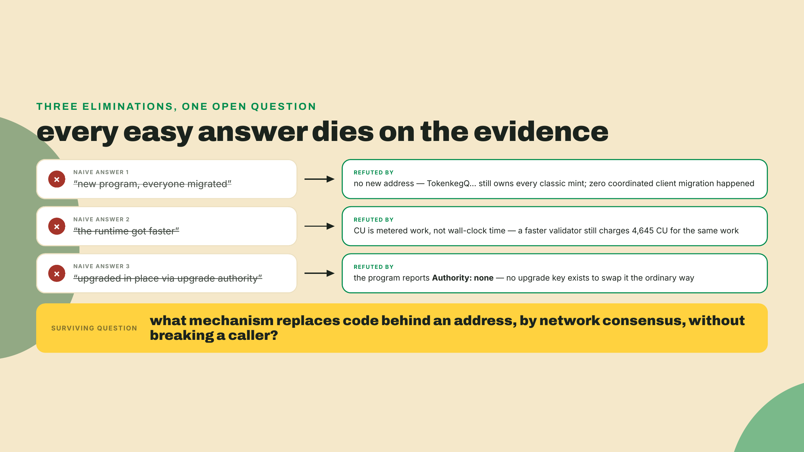
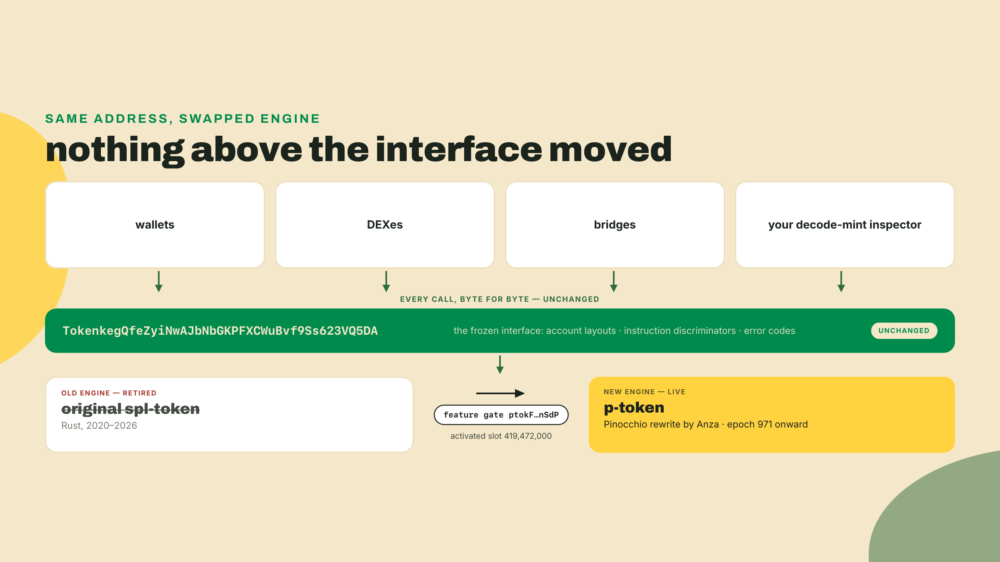
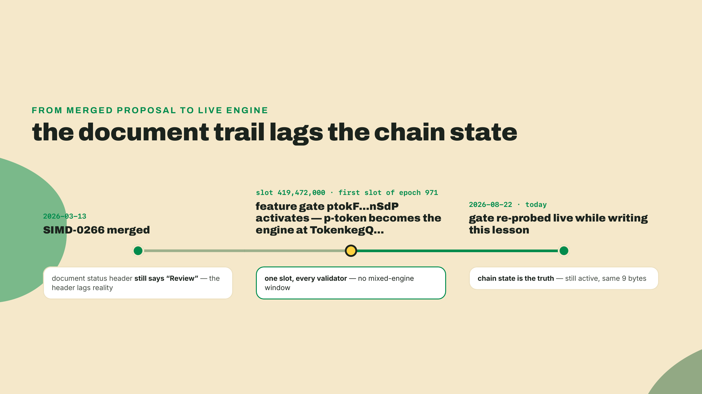
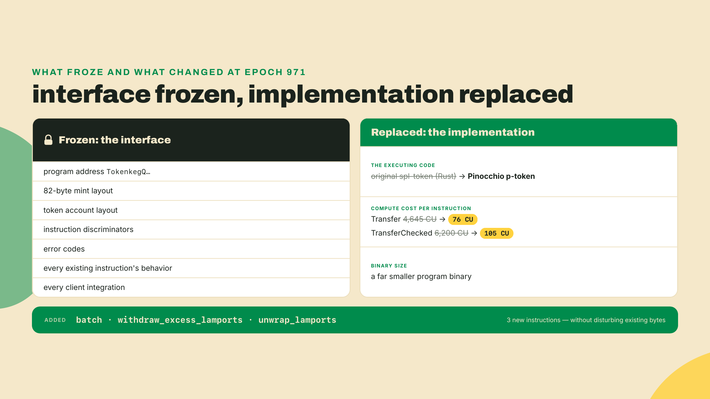
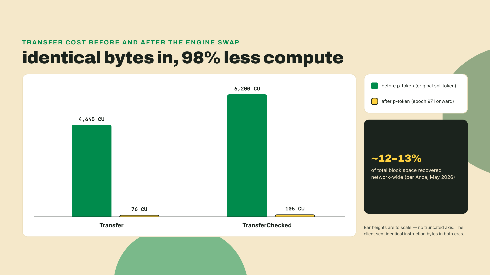
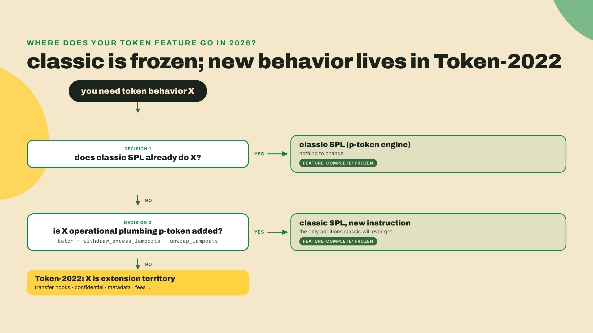
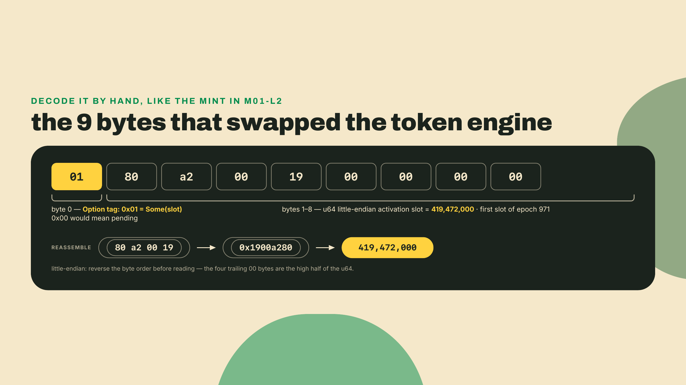

# The p-token switch: frozen interface, new engine

Last lesson you decoded a mint you never made and owned the read. Back in m01-l1 you watched a classic transfer cost 76 compute units. Here is the unsettling part, and it is the whole lesson: that same transfer used to cost 4,645 CU. The 82-byte layout you decoded did not change. Your client code did not change. Nobody's client code changed. And yet the program running at `TokenkegQfeZyiNwAJbNbGKPFXCWuBvf9Ss623VQ5DA` was quietly swapped out under everyone's feet.

Before we explain anything, go look at the switch itself: a real mainnet account, readable right now. This is the first lesson that reaches for the `solana` CLI — and let me be precise about the word "needs": every probe below is a plain RPC read, and the lab's probe 3 makes the exact same gate read with the kit code you already have, so nothing in this lesson is gated on a local install. The CLI's formatted views are the convenient way to run the other probes, though, and later labs in this course lean on the local toolchain for real, so if you want it now, one line ships the whole Agave toolchain (I am on solana-cli 3.1.10, Agave line, checked 2026-08-22):

```bash
sh -c "$(curl -sSfL https://release.anza.xyz/stable/install)"
```

Then ask mainnet about a very particular address:

```bash
solana feature status ptokFjwyJtrwCa9Kgo9xoDS59V4QccBGEaRFnRPnSdP --url mainnet-beta
```

You should see:

```text
Feature                                      | Status                  | Activation Slot | Description
ptokFjwyJtrwCa9Kgo9xoDS59V4QccBGEaRFnRPnSdP  | active since epoch 971  | 419472000       | SIMD-0266: Efficient Token program
```

That row is the engine swap. One feature gate, active since the first slot of epoch 971, and the token program that underpins every SPL balance on Solana became a different piece of software. I re-probed that gate this morning, 2026-08-22, before writing a word of this lesson; the output above is what mainnet returned. Keep that terminal open. That formatted row is the CLI's rendering of a tiny 9-byte account, and in the lab you will dump those 9 bytes raw and read them yourself.

## Summary

In m01-l2 you built the `decode-mint` inspector and read a classic 82-byte bare mint's base fields straight from the bytes. This lesson explains something strange you have already seen twice without knowing it: the program that processed your 76 CU transfer is not the program that processed everyone's transfers for the previous six years. SIMD-0266 replaced the classic SPL Token implementation at the same address with p-token, Anza's Pinocchio rewrite, and it did so without changing a single byte of the interface. You just probed the feature gate that flipped the switch; in the lab you will read the swap out of the program account itself, and walk away with the mental model that 2026 forces on "classic SPL": a frozen interface running a brand-new engine. No new rung on the artifact ladder today, and no completion TODO either: the lab is guided probes you run as shown, and the challenge is fully solo, in words rather than code. That is the fade for a concept lesson.

## Interface versus implementation

Start from the mental model you probably brought into this course, because it is the one almost every tutorial teaches. A program lives at an address. The address identifies the code. "I know the SPL Token program" means "I know what the code at TokenkegQ... does." Under that model, a 61x cost drop with zero client changes should be impossible. So something in the model is wrong, and finding out what is more valuable than the number itself.

Run the naive explanations into the ground first, because each failure sharpens the question.

**Naive answer one: they shipped a new program and everyone migrated.** They did not. There is no new address. The classic USDC mint your `decode-mint` inspector read last lesson is still owned by the same TokenkegQ... address that wallets, DEXes, and bridges have hardcoded since 2020, and none of them shipped a migration. If a migration this size had happened, you would have felt it: coordinated upgrades across every client on the chain, deprecation windows, broken integrations. The ecosystem's silence is evidence.

**Naive answer two: the runtime got faster, so everything got cheaper.** Also no, and your own numbers refute it. Compute units are not wall-clock time; they are a metered count of work the runtime charges per operation. A faster validator executes the same 4,645 CU transfer in less time, but it still charges 4,645 CU. For the metered number to fall, the work itself has to shrink. Something changed inside what executes.

**Naive answer three: the program was upgraded in place, the normal way.** Warmer, but still wrong in an instructive way. Ordinary upgradeable programs get new code through their upgrade authority. The classic token program is the single most load-bearing program on Solana; handing one keyholder the power to hot-swap it would be a security story, not an efficiency story. Whatever replaced it needed something stronger than an upgrade key: consensus.



So the real question is narrower than "why is it cheap now." It is: **what mechanism can replace the code behind an address, with the entire network's agreement, without breaking a single caller?** That question has exactly one answer on Solana, and you just probed it.



### The mechanism: a feature gate over a frozen interface

A **feature gate** is an on-chain switch. It is a tiny account, owned by the Feature program, whose existence and activation slot tell every validator "from this slot onward, behave the new way." Validators carry both behaviors in their binaries; the gate decides which one is live, and because the gate is on-chain state, every validator flips at the same slot. It is how Solana ships consensus-critical changes without a hard fork, and it is the mechanism that swapped your token engine.

To feel why that design is remarkable, hold it against the alternatives other ecosystems actually live with. Option one is the migration: deploy the new program at a new address and ask every wallet, DEX, bridge, and indexer on the planet to move, on their own schedules, with a deprecation window and a long tail of stragglers. That is naive answer one, done on purpose, and ecosystems that take this path spend years in the transition. Option two is the coordinated hard fork: every operator upgrades by a flag day or falls off the network. The feature gate is a third path that keeps the good parts of both: the new code ships inside the normal validator release, dormant, sometimes for months, and the on-chain gate picks the moment. One slot boundary, no mixed-engine window, no migration, and the address every client hardcoded stays exactly where it was.

The proposal behind the swap is **SIMD-0266**. It was merged on 2026-03-13. Say merged, and not "accepted" or "approved," and here is a precision habit worth building: merged is a Git fact you can verify (the PR landed, dated), while accepted and approved are governance claims, and the document's own front-matter status still reads "Review" today, so the paper trail supports neither. The header is a lagging label. What actually governs activation is the on-chain gate you just probed, and that gate is active. A teammate who reads "Review" and concludes p-token is not live yet has trusted a document header over chain state, which on Solana is always the wrong order.



What the gate activated is **p-token**: a ground-up rewrite of the classic SPL Token program by Anza, written in Pinocchio, a zero-dependency, zero-copy program framework built for exactly this kind of hot-path work. The rewrite's contract with the ecosystem was brutal and simple: byte-for-byte identical in account layouts, instruction discriminators, and error codes. Instruction by instruction and error by error. Every offset your `decode-mint` inspector walks, every discriminator a wallet sends, every error code an integration matches on: identical. That identical surface is the **interface**. The code that honors it is the **implementation**. SIMD-0266 replaced the implementation and froze the interface, and that separation is the entire trick.

A sharp reader should object right here, so let's take the two strongest objections in order. First: "byte-identical" is a claim, not a property you get for free, and the cost of being wrong is not a bug ticket. If p-token disagreed with the old engine on even one input, validators running one behavior would compute different state than validators running the other, on the single most-called program on the chain. That is consensus-risk territory. The frozen interface is what makes the claim checkable at all: the old engine's observable behavior IS the specification, executable and exhaustive, so for any instruction you can feed both engines the same bytes and demand the same outputs, the same state transitions, and the same error codes. Same in, same out, or the rewrite is wrong. And the gate is what makes the claim safe to act on: instead of a rolling deploy where old and new code overlap for hours, there is one unambiguous slot before which everyone runs the old engine and after which everyone runs the new one.

Second objection, and it deserves a straight answer: mechanically, nothing stops consensus from swapping in something malicious behind that same address. Do not rush past it. A feature gate activates because the validator set, weighted by stake, adopts releases carrying the change and the activation process runs; there is no cryptographic guarantee that what activates is benign. But notice this was always the trust model. Consensus has defined what the chain is since the genesis block; a supermajority of stake could always have changed any rule. The gate did not create that power. It made it visible, slot-stamped, and readable in a 9-byte account, which is strictly better than invisible. Your job as a builder is not to pretend the power away; it is to know which layer of the system holds it.

Here is where the old mental model gets corrected rather than discarded. The address never identified the code. It identified the *contract*: the byte layouts and behaviors that anyone calling that address can rely on. The code is just the current tenant honoring that contract. There is an old thought experiment about a ship whose planks are replaced one by one until none of the original wood remains, and philosophers argue about whether it is still the same ship. Solana's answer is unsentimental: if every plank of the interface is byte-identical, it is the same program, whoever wrote the wood. The analogy breaks in one place worth flagging, though: Theseus's planks were swapped gradually and by accident of maintenance. This swap happened network-wide in a single slot, by design, with the replacement tested against the original's exact behavior before the gate ever flipped. Deliberate identity, not drifted identity.



### The payoff, measured

Now the numbers can mean something. A classic Transfer cost 4,645 CU under the old engine. Under p-token it costs 76 CU. TransferChecked, the variant you will use everywhere because it validates the mint and decimals, fell from 6,200 to 105 CU. Those are not incremental optimizations; they are what happens when a 2020-era general-purpose Rust program is rewritten by people who count every syscall. And because token transfers are the single most common instruction class on the chain, the aggregate effect is macro-scale: roughly 12 to 13 percent of total block space was recovered, per Anza (their engineer Febo walked through the numbers in an interview published May 2026). Twelve percent of a blockchain's capacity, returned to the network by a rewrite nobody had to opt into.

Pause on what that recovery actually is, because the framing matters. Blocks did not get bigger, and no consensus parameter moved. The same block CU budget simply stopped spending itself on token-transfer overhead: work that used to bill 4,645 units per transfer now bills 76, and the difference is capacity every other transaction on the chain gets to use. It is the rare kind of scaling win that costs the rest of the system nothing. The percentage itself is a measured-era figure, though, not a constant: it reflects how much of the chain's traffic was token transfers when Anza measured it, so quote it as their number, with the date, the way I just did.



Be careful with the attribution, because this is the footgun that will make you look silly in a code review. The drop is the engine's doing, not yours. If you benchmarked a transfer last year at 4,645 CU and benchmark the same client code today at 76, your code did not get better. Nothing you deploy, no flag you set, no SDK upgrade you ship claims any credit for those numbers. The engine changed underneath you. Which cuts the other way too, and this is the honest caveat: the 76 is an engine-dependent measurement, not a constant of nature. Freeze "a transfer costs 76 CU" into a config or a doc and you will misquote it the next time the engine or the runtime's cost model moves. Quote it as "76 CU as of the p-token engine, epoch 971," and re-measure when it matters. The number the old engine taught everyone to memorize just became a cautionary tale; do not create the next one.

One boundary to respect, and it is a deliberate one. This lesson teaches the CU drop as a token-layer fact: what changed, when, and what it means for your mental model. It does not derive *why* 76 CU is physically achievable, because that why lives in the loader, the sBPF virtual machine, and the compute-metering machinery, and that entire layer belongs to the planned Low-Level Solana course. If you find yourself wanting to know where each of the 76 units goes, that course is the place; here, the number is evidence for the interface-versus-implementation model, and that model is the payload.

### Frozen means frozen: where new capabilities live

The word Anza uses for classic SPL now is **feature-complete**, and the working translation is: frozen. No new token functionality is planned for the classic program, ever. The p-token rewrite did add three new instructions, `batch`, `withdraw_excess_lamports`, and `unwrap_lamports`, which sounds like a contradiction until you notice what kind of instructions they are: operational conveniences that bolt onto the existing surface without disturbing a single existing byte. Batching what you could already do one at a time is not a new capability; it is plumbing. The rule that matters for you as a designer is this: **genuinely new token behavior lands only in Token-2022.** Transfer hooks, confidential balances, native metadata, transfer fees, all of it, extension territory. Classic SPL in 2026 is a frozen contract with a very fast tenant, and if you catch yourself waiting for classic SPL to grow a feature, you are waiting for a train that has been formally cancelled.



This reframing also hands you a filter for every piece of Solana content written before 2026, and you will need it, because the internet does not date-stamp its mental models. When an older tutorial, audit note, or forum answer makes a claim about "the token program," run it through one question: is this a claim about the interface, or about the implementation? Interface claims aged perfectly. The 82-byte mint layout, the instruction set, the discriminators, the error codes: all still true, byte for byte, because freezing them was the whole deal. Implementation claims aged badly overnight. Anything about the program's internal structure, its performance characteristics, its CU costs per instruction: that content now describes a program that no longer runs anywhere. The claims were fine when written. The tenant changed. One question, two buckets, and you can salvage six years of ecosystem writing instead of distrusting all of it.

The freeze is visible in the repositories and crates too, and you will trip over this in later labs if you do not hear it now. The old solana-labs SPL monorepo, the one every 2022-era tutorial links into, was dissolved; the token programs now live in the Anza-maintained solana-program organization on GitHub, one repo per program. Same interface, a new home and a new engine, and the repo split is not cosmetic: a monorepo made sense when one team shipped everything together, and a frozen, feature-complete program has no "together" left to ship. Each program now versions and releases on its own. And on the Rust side, the split has its own crate: `spl-token-2022-interface` now ships the types and layouts separately from `spl-token-2022`, which remains the program crate. Read that split with your new vocabulary: the ecosystem is literally splitting its crates to say which side of the interface/implementation line each one sits on, and the two version independently — the interface crate was at 3.1.1 and the program crate at 11.0.0 when I checked crates.io on 2026-09-06. Be precise about what that is and is not: the program crate is not yanked and carries no crate-level deprecation notice; what is deprecated is item-level, individual re-exports inside it pointing you at the interface crate. When a later lesson has you compute account sizes against Token-2022 types, the import comes from the interface crate. A dependency on the implementation is a dependency you did not need.

### The trade-off, named

Every gift in this design has a shadow, so name both honestly. A frozen interface with a swappable engine is a gift for compatibility: your code never breaks, your integrations never migrate, and the whole network inherits a 61x improvement while asleep. It is also a trap for mental models: the address you call is stable, but what runs behind it is not, so "I know the SPL Token program" now means "I know its interface," and can never again mean "I know its implementation." Anyone whose security reasoning, CU budgeting, or performance intuition silently depended on implementation details of the old engine got those assumptions invalidated at slot 419,472,000, and the chain did not send them a notification. The compatibility guarantee is real and the epistemic demotion is real, and you hold both at once. That is the 2026 model of classic SPL, and it is the differentiator almost nobody teaches: interfaces are promises, implementations are tenants, and on Solana the tenancy can change under consensus at a single slot boundary.

## Lab: read the swap out of the chain

Four probes, all guided, nothing to fill in. You are not building today; you are verifying that everything above is chain-readable rather than lore. Total time: about fifteen minutes once the Agave toolchain from the opener is installed; the install is a one-time cost that can outlast the probes. Skipped the install? Probes 1, 2 and 4 are CLI renderings of plain account reads — run probe 3, which makes the same gate read in kit, and take the CLI checkpoints printed here on trust.

1. **Probe the gate with the CLI.** If you ran the feature-status command at the top, you have already done this step; if not, run it now:

   ```bash
   solana feature status ptokFjwyJtrwCa9Kgo9xoDS59V4QccBGEaRFnRPnSdP --url mainnet-beta
   ```

   Checkpoint: the row reads `active since epoch 971` with activation slot `419472000`. If your CLI prints a connection error, you are probably behind a default RPC rate limit; wait a few seconds and retry.

2. **Dump the gate account raw.** The CLI's feature view is a convenience wrapper; the truth is 9 bytes of account data, and after m01-l2 you are qualified to read 9 bytes with your own eyes:

   ```bash
   solana account ptokFjwyJtrwCa9Kgo9xoDS59V4QccBGEaRFnRPnSdP --url mainnet-beta
   ```

   Checkpoint: owner is `Feature111111111111111111111111111111111111`, length is 9 bytes, and the hex dump reads `01 80 a2 00 19 00 00 00 00`.



3. **Decode it programmatically, kit-style.** Same read, but through the stack you built `decode-mint` on, so the skill compounds. Work inside `labs/m01-l2`, the workspace you scaffolded last lesson: kit 7.1.1 and tsx 4.20.5 are already pinned there, exact versions per that lesson's peer-range rule, and its `package.json` carries the `type=module` this script's top-level await needs. In that folder, create `read-gate.ts`:

   ```typescript
   import { createSolanaRpc, address } from '@solana/kit';

   const GATE = address('ptokFjwyJtrwCa9Kgo9xoDS59V4QccBGEaRFnRPnSdP');
   const rpc = createSolanaRpc(process.env.RPC_URL ?? 'https://api.mainnet-beta.solana.com');

   const { value: account } = await rpc
     .getAccountInfo(GATE, { encoding: 'base64' })
     .send();

   if (!account) {
     console.log('No account at the gate address: the feature is not even pending.');
     process.exit(1);
   }

   const data = Buffer.from(account.data[0], 'base64');
   console.log(`owner:  ${account.owner}`);
   console.log(`bytes:  ${data.toString('hex')} (${data.length} bytes)`);

   // Feature account layout: 1-byte Option tag, then u64 LE activation slot.
   if (data[0] === 0) {
     console.log('status: pending activation (no slot set)');
   } else {
     const activatedAt = data.readBigUInt64LE(1);
     console.log(`status: ACTIVE since slot ${activatedAt.toLocaleString('en-US')}`);
   }
   ```

   Run it:

   ```bash
   npx tsx read-gate.ts
   ```

   Checkpoint: three lines, ending in `status: ACTIVE since slot 419,472,000`. Note the `readBigUInt64LE`: same BigInt honesty as your supply field in m01-l2, because an activation slot is a u64 and JavaScript numbers are not to be trusted with one.

4. **Catch the engine in the act.** The program account itself recorded the swap:

   ```bash
   solana program show TokenkegQfeZyiNwAJbNbGKPFXCWuBvf9Ss623VQ5DA --url mainnet-beta
   ```

   Checkpoint, from my probe of 2026-08-22: `Last Deployed In Slot: 419472000`, `Authority: none`, data length 108,600 bytes. Sit with that first line for a second. The most-called program on Solana reports its last deployment at exactly the gate's activation slot, the first slot of epoch 971: the fingerprint of a consensus-driven code swap, written where anyone can read it. And `Authority: none` answers naive answer three from the theory section for good: no upgrade key exists to swap this program the ordinary way. Only a gate could have done it, and one did.

   Optional fifth probe, on the Rust side: `cargo info spl-token-2022` (cargo ships with rustup; `curl https://sh.rustup.rs -sSf | sh` if you have never installed it) shows the crate now lives under the solana-program repos, and prints its current version — 11.0.0 on my 2026-09-06 read, with no deprecation notice on the crate itself. Run `cargo info spl-token-2022-interface` beside it and you will see the separately-versioned interface crate (3.1.1 on the same read), which is what our later Rust-adjacent labs will read from. Two crates, two version lines, one interface: exactly the split this lesson has been arguing for.

## Challenge

No code today. The assessment gate for this lesson is a sentence, and it is harder than it sounds. Write, in your own words and without looking back at the text, a three-part answer a colleague could act on: one sentence separating the interface from the implementation of classic SPL, one stating its mainnet status precisely (what activated, and when, in epochs), and one attributing the transfer CU drop to the right cause. Then stress-test yourself against the two traps this lesson armed: if your status sentence says "approved" or "accepted," you made a governance claim the paper trail does not support (the PR was merged 2026-03-13, a Git fact, and the front-matter still reads "Review"); if your CU sentence lets a client-side change take any credit, re-read the payoff section. When your three sentences survive both traps, you own the model.

If a colleague pushes back with "but the SIMD page says Review," you now know the correction, and it generalizes: document headers lag, chain state does not, and you personally read the 9 bytes that settle it.

Something here not sit right, or did your probes return something mine did not? Tell me: flag it in the course feedback channel, ideally with the command and the output pasted in. A reader who catches a stale number in this lesson is doing exactly what this lesson teaches.

Next lesson, the question this whole module has been circling stops being rhetorical. Classic SPL is frozen, every genuinely new capability lives in Token-2022, and Token-2022 offers 29 extension types with real rules about which combinations are even legal. So how do you decide? You derive the decision framework from source, and your `decode-mint` inspector comes back to work.

Happy probing! 🌱
