# Classic SPL vs Token-2022: the decision framework + the conflict matrix

## Summary

In m01-l3 you learned that classic SPL is a frozen interface on the new p-token engine, and that every genuinely new capability lives in Token-2022's extensions. Which raises the question every product conversation eventually lands on: "can this mint have a transfer fee AND confidential balances?" You would expect a table somewhere in the docs that answers it. There is no complete or enforced table. A few doc pages assert claims about individual pairs (you will put one of those claims on trial at the end of this lesson), but nothing authoritative, nothing whole. The honest answer lives in a Rust function named `check_for_invalid_mint_extension_combinations`, and this lesson you go read it.

Start now, before the theory. Clone the source and pin it to the commit this whole lesson is derived from:

```bash
git clone https://github.com/solana-program/token-2022.git
cd token-2022
git checkout 426400f
```

Open `interface/src/extension/mod.rs` and scroll to line 1326. That function, fifty-ish lines of plain Rust, is the entire legal code of Token-2022 mint combinations. Keep it open in a split pane. Everything below is a walk through what you are already looking at.

Two things get built on top of that reading. First, the decision framework: when a product's requirements point at classic SPL and when they force Token-2022, framed as a choice of extension SET rather than a program preference. Second, the flagship artifact of this course: `check-combo`, a TypeScript validator that applies the five source rules to any extension set and returns a verdict with the rule that fired. It consumes the `decode-mint` inspector you built in m01-l2, which means that by the end of this lesson you can point it at any live mint and ask "is this set even legal, and why?"

The autonomy fade for this lesson, stated out loud: the reading of the source rules is worked in full, I walk every line with you. The validator is a completion exercise: rule 4 ships already implemented, rules 1, 2, 3, and 5 are yours to port. And the module's single coding challenge, at the end, is solo: the full validator proven by tests, no scaffolding.

This is a keystone lesson. Every mint we build from Module 2 onward gets gated through the artifact you write today.

## Deriving the matrix

### The framework: which extension set, not which program

The decision people argue about is usually framed wrong. "Should we use classic SPL or Token-2022?" sounds like a brand preference, like picking a database vendor. It is not. And performance is a poor differentiator to argue from: the p-token switch you read about last lesson took classic SPL's old engine off the table, and Token-2022's per-extension compute costs are unpublished, which is why a later lesson measures them in a lab instead of quoting a table. Until you have measured, the argument that actually decides is exactly one question:

Does any requirement in your product name a behavior that only an extension provides?

If no, classic SPL wins by default. It is the cheapest account to create, every wallet renders it, every DEX routes it, every integration ever written assumes it. A frozen interface is not a limitation when your requirements fit inside it. It is a guarantee.

And cheapest is measurable here, not rhetorical. Your m01-l2 inspector already printed the numbers for you: a bare classic mint is 82 bytes, and the moment a single extension exists the mint switches to the extended layout, where the smallest possible extended mint your own `mintLen` assertions measured is 170 bytes. Roughly double, for one extension, before you have configured anything. It climbs from there with every TLV entry. Rent is charged on bytes, and the mint is the cheap half of that story anyway, because the forced account extensions we get to later in this lesson put bytes on every holder account you will ever create. A few dozen bytes times a hundred thousand holders is no longer a design preference, it is a line in a treasury spreadsheet. So defaulting to classic SPL is the correct answer whenever the requirement list does not force otherwise, and "we might want a fee someday" is not a requirement.

If yes, you are on Token-2022, and the real decision starts. Fees on transfer, interest display, confidential balances, transfer hooks, non-transferability, native metadata, pausability: each of those words in a product spec is an extension name in disguise. The moment one appears, the question stops being "which program" and becomes "which extension set," because a mint's extension slots are claimed at initialization. The precise rule, which module 2 will demonstrate on live mints: every power extension on the mint side is init-only — a fee, a hook, a delegate cannot be bolted on later. The carve-outs are narrow and all of one shape. TokenMetadata's TLV is written after `initialize_mint`, but only behind a MetadataPointer you chose at creation; the group and group-member TLVs ride the same pointer-then-realloc path behind their own pointers; and the account-level extensions land on holder token accounts via reallocate, never on the mint. Notice that every one of those still starts with a pointer chosen at birth, and that not one of them is a power extension. So for design purposes a mint's extension set is a birth certificate, not a settings page.

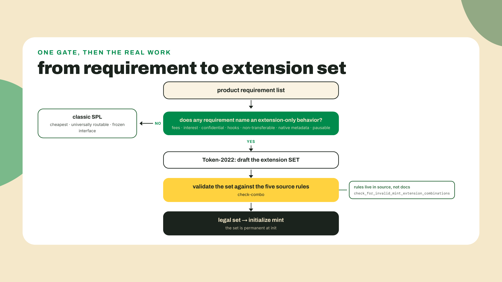

Two consequences fall out of that permanence, and they shape the whole lesson. One: the extension set must be designed up front, against the product's full roadmap, because "we'll add confidential transfers next quarter" is not a thing. The fix for a missing extension is a new mint and a migration, which is an entire lesson of pain in Module 9. Two: the set must be LEGAL, and legality is decided by the program at initialization, not by you and not by the docs. Some combinations are rejected outright. Some combinations force other extensions to come along. The full map of those interactions is what this course calls the conflict matrix.

So where is the matrix? Here is the part that earns this lesson its place in the module.

### Why there is no matrix to copy

There is no official, current conflict matrix for Token-2022's 29 extension types. I went looking, the research pass for this course went looking, and the honest result is: the five rules that decide legality live in `token-2022`'s `interface/src/extension/mod.rs`, lines 1326-1374, and nowhere else (solana-program/token-2022 @ 426400f, a commit dated 2026-08-17 and read for this lesson on 2026-08-22).

The catalogs that do exist are per-extension explainer pages, and none of them publishes the rules. They also move underneath you, which I can demonstrate with an embarrassment of my own. When the research pass for this course swept the doc sites on 2026-08-21, solana.com/docs/tokens/extensions had no page for PermissionedBurn, the newest variant, while solana-program.com already carried one. I wrote that gap into an earlier draft of this lesson as the headline example of docs drift. Re-checking both pages on 2026-08-22 before shipping: solana.com lists Permissioned Burn in its extensions sidebar, right after Pausable Mint. The gap closed inside a day, and my "current" observation about a documentation page was stale before the lesson it lived in was finished.

Keep that, because it is the more useful lesson and it is not the one I set out to teach. A copied catalog claim does not rot in years; it rotted in twenty-four hours, and the only reason you are not reading the wrong version right now is that somebody re-ran the check. The source enum is the thing that does not do this to you: `ExtensionType` has 29 production variants, PermissionedBurn among them, plus 3 test-only variants hidden behind a `cfg(test)` flag that never ship, and that statement carries a commit hash so you can tell exactly which world it describes. A doc page describes whatever it describes today, with no version stamp anywhere on it. Code is the truth, and more importantly code is the truth *at a nameable moment*.

Do not take the 29 from me either. You have the repo open at the pinned commit, so scroll up in the same file to the `ExtensionType` enum and count the variants yourself. Subtract the ones gated behind `#[cfg(test)]` attributes, and you land on 29. Thirty seconds of counting, and now you hold the number the two doc pages could not agree on, with a commit hash attached. That move, checking the enum instead of quoting a page, is the smallest possible version of everything this lesson does.

Old mapmakers had a name for this failure mode, sort of in reverse: trap streets. Cartographers would draw a fake street into their maps so that when a rival's map showed the same fake street, the copying was proven. Docs drift is the same mechanism running forward: one page omits an extension, downstream tutorials copy the page, and soon half the ecosystem's mental model is missing a real production variant. Nobody planted the error on purpose. The copying propagated it anyway. The only defense is the one the cartographers' victims never had: you can go survey the territory yourself, because the territory is a public Git repo.

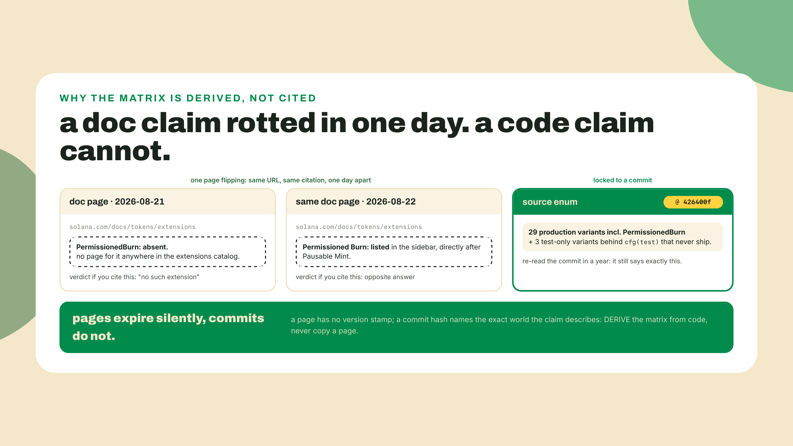

This is why the flagship skill of this course is derivation and not memorization. A copied conflict list has an expiration date printed in invisible ink. A derived one carries its own provenance: this matrix is true at commit 426400f, and here is the function it came from, and here is how to re-derive it when the commit moves.

With that in mind, let's read the function.

### Reading the five rules at the source

Here is the heart of it, verbatim from `interface/src/extension/mod.rs` at 426400f. The function collects seven booleans from the proposed mint's extension list, then runs five guards:

```rust
/// Check for invalid combination of mint extensions
pub fn check_for_invalid_mint_extension_combinations(
    mint_extension_types: &[Self],
) -> Result<(), TokenError> {
    let mut transfer_fee_config = false;
    let mut confidential_transfer_mint = false;
    let mut confidential_transfer_fee_config = false;
    let mut confidential_mint_burn = false;
    let mut interest_bearing = false;
    let mut scaled_ui_amount = false;
    let mut non_transferable = false;

    for extension_type in mint_extension_types {
        match extension_type {
            ExtensionType::TransferFeeConfig => transfer_fee_config = true,
            ExtensionType::ConfidentialTransferMint => confidential_transfer_mint = true,
            ExtensionType::ConfidentialTransferFeeConfig => {
                confidential_transfer_fee_config = true
            }
            ExtensionType::ConfidentialMintBurn => confidential_mint_burn = true,
            ExtensionType::InterestBearingConfig => interest_bearing = true,
            ExtensionType::ScaledUiAmount => scaled_ui_amount = true,
            ExtensionType::NonTransferable => non_transferable = true,
            _ => (),
        }
    }

    if confidential_transfer_fee_config && !(transfer_fee_config && confidential_transfer_mint)
    {
        return Err(TokenError::InvalidExtensionCombination);
    }

    if transfer_fee_config && confidential_transfer_mint && !confidential_transfer_fee_config {
        return Err(TokenError::InvalidExtensionCombination);
    }

    if confidential_mint_burn && !confidential_transfer_mint {
        return Err(TokenError::InvalidExtensionCombination);
    }

    if scaled_ui_amount && interest_bearing {
        return Err(TokenError::InvalidExtensionCombination);
    }

    if non_transferable && confidential_transfer_mint && !confidential_mint_burn {
        return Err(TokenError::InvalidExtensionCombination);
    }

    Ok(())
}
```

Notice what is NOT here before we number what is. Only seven of the 29 extension types even appear in the match. MetadataPointer, PermanentDelegate, TransferHook, MintCloseAuthority, PermissionedBurn: none of them participate in any conflict rule at all. The overwhelming majority of extension pairs are simply legal, which is itself a finding you could not get from a doc that never published the function. The matrix is mostly green, with five red lines through one corner of it.

Now the five guards, in source order, each with its why. The numbering is ours, the logic is theirs.

**Rule 1: ConfidentialTransferFeeConfig requires BOTH TransferFeeConfig AND ConfidentialTransferMint.** The confidential-fee extension is a bridge. It exists to make fee collection work when amounts are encrypted, so a mint carrying the bridge without both of its endpoints is incoherent: there would be either no fee to collect or no encryption to collect it under. The program refuses to initialize a bridge to nowhere.

**Rule 2: TransferFeeConfig plus ConfidentialTransferMint together REQUIRE ConfidentialTransferFeeConfig.** This is rule 1's mirror, and it is the more interesting direction. Think about what would happen without it. A fee mint's transfers must withhold a percentage of the amount. A confidential mint's transfers encrypt the amount. A transfer that is both cannot compute the withheld fee on a number it is not allowed to see, unless a dedicated mechanism handles fees in the encrypted domain. That mechanism is exactly ConfidentialTransferFeeConfig. So the pair is not forbidden, only incomplete, and the fix is additive: add the third extension and the set becomes legal. Keep that distinction, because "these two conflict" and "these two demand a third" look identical in a rejection message and mean completely different things for your product.

**Rule 3: ConfidentialMintBurn requires ConfidentialTransferMint.** ConfidentialMintBurn makes supply changes confidential. Confidential supply on a mint whose balances and transfers are all public would protect nothing: mint and burn deltas would be reconstructable from the visible account movements around them. The dependency runs one way. Confidential transfers without confidential supply is a fine product (balances hidden, issuance public, most confidential stablecoins want exactly this). Confidential supply without confidential transfers is a screen door on a submarine.

**Rule 4: ScaledUiAmount and InterestBearingConfig are mutually exclusive.** These are the only two extensions that rewrite how a raw amount is DISPLAYED, each applying its own multiplier math. Two display multipliers on one mint means every wallet and every indexer must answer "which one wins, and in what order?" and any answer would be arbitrary. The program refuses to create the ambiguity. This is the one true mutual exclusion in the entire matrix: not a missing piece, not a forced companion, just two extensions that can never share a mint.

**Rule 5: NonTransferable plus ConfidentialTransferMint is invalid UNLESS ConfidentialMintBurn is also present.** The strangest rule and my favorite, because you can feel the design conversation behind it. A non-transferable (soulbound) token with confidential balances: what would that even hide? Transfers are the thing the encryption protects, and there are none. But add ConfidentialMintBurn and the set snaps into focus: the mint and burn amounts are now the confidential surface. An issuer can operate a soulbound credential whose issuance sizes are private. So the guard is conditional: the pair alone is nonsense, the trio is a product.

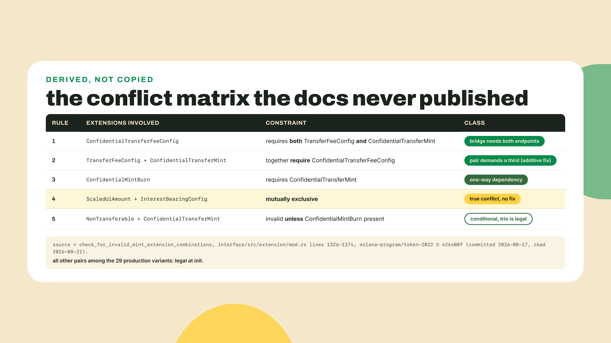

One more thing the source tells you that no doc page would have. Look at what each guard actually returns: `Err(TokenError::InvalidExtensionCombination)`, the same error, five times over. The program never tells you which rule you broke. It tells you that you broke one. On-chain that surfaces as a custom program error number inside a failed transaction, with no rule number, no extension name, and no hint about whether your set was contradictory or merely incomplete. Which is precisely the gap `check-combo` exists to close. The validator you are about to write returns a `reason` naming the guard that fired, so a design review gets a sentence instead of an error code, and gets it before anyone spends a lamport. Same logic, better diagnosis. Hold onto that when you write the reason strings in the lab: they are the whole argument for running a local validator instead of sending the transaction and reading the wreckage.

Read the five as a set and a pattern appears: four of the five orbit the confidential-transfer suite. That is not an accident. Encryption is the one capability that changes what OTHER extensions can know, so it is the one capability that generates cross-extension law. Fees need to see amounts, supply audits need to see mints and burns, soulbound needs something worth hiding. If you remember nothing else from the theory, remember: confidential is the gravitational center of the conflict matrix, and rule 4 is the lone exception, a display-math collision with no encryption anywhere near it.

### Three product briefs, run through the machine

Framework plus rules is the whole evaluation loop, so run it hot three times before we build anything. Read each brief, translate requirement phrases into extension names, then let the five rules judge the draft set. This is the exact conversation you will have in every design review from Module 2 onward.

Brief one: SPROUT, the in-game currency our Overgrowth builds start minting next module. The spec says holders pay a small tax on every transfer, balances should display the yield the co-op pays on stored grain, and the token carries its own name and symbol with no external metadata program. "Tax on every transfer" is TransferFeeConfig. "Displays yield" is one of the two display extensions, InterestBearingConfig or ScaledUiAmount, one seat by rule 4, and the pick between them is next module's design conversation. "Its own name and symbol" is MetadataPointer plus TokenMetadata, with the pointer aimed at the mint itself. Nothing else in the spec names a behavior, so the draft set is those four (with the display seat filled by exactly one occupant), and notice that classic SPL died in the first sentence: the word "tax" alone forced Token-2022. Run the rules: no guard fires against the set, so it is legal as drafted. This is the everyday case, and its fee-plus-metadata core is the `expectValid` at the top of your test file.

The translation step, written out once so you can see its shape:

```text
SPROUT spec phrase              -> extension name
"tax on every transfer"         -> TransferFeeConfig
"displays yield"                -> InterestBearingConfig OR ScaledUiAmount (rule 4: one seat)
"own name and symbol"           -> MetadataPointer + TokenMetadata (pointer aimed at the mint)
verdict: no guard fires         -> legal as drafted
```

Brief two: a payroll stablecoin for a studio paying contributors on-chain, where salaries must not be readable by every colleague, and the issuer wants a small transfer fee to fund operations. "Salaries not readable" is ConfidentialTransferMint. "Transfer fee" is TransferFeeConfig. Draft set: those two. The rules say no: rule 2 fires, because a fee cannot be computed on an amount the program is not allowed to see without a mechanism for fees in the encrypted domain. The fix is additive. Add ConfidentialTransferFeeConfig and the trio is legal. Nobody had to drop a requirement; the set was incomplete, not contradictory.

Brief three: a soulbound harvest credential, non-transferable by design, where the issuer wants issuance sizes kept private. "Non-transferable" is NonTransferable. "Issuance sizes private" pulls in the confidential suite, so the naive draft is NonTransferable plus ConfidentialTransferMint. Rule 5 rejects it, and now you know why: with no transfers to encrypt, the pair protects nothing. Add ConfidentialMintBurn, which is where the privacy actually lives for this product, and the trio passes. One more twist while we are here: if that credential also wanted to display a rebasing balance, it gets ScaledUiAmount OR InterestBearingConfig, never both. Rule 4 has no additive fix. Someone in the design review has to pick, and it is better that someone is you, today, than an `InvalidExtensionCombination` error on launch day.

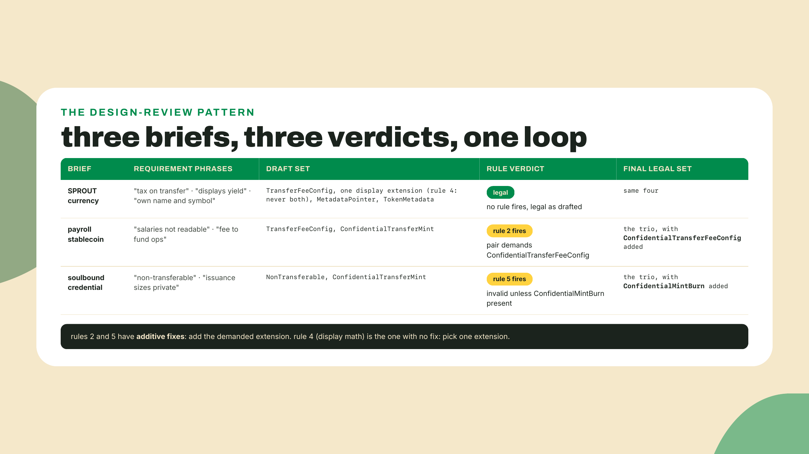

Three briefs, two rejections, zero dropped requirements. That ratio is the point. Most of what the rules do in practice is not forbidding products, it is telling you which third extension your pair forgot, and a rejection message that names its rule turns a launch-day mystery into a design-review line item.

### The forced-pair layer

The five rules answer "can these mint extensions coexist?" A second function in the same file answers a different question: "given this mint, what must every token ACCOUNT carry?" It is called `required_init_account_extensions`, it sits at line 1296, and it is a straight lookup:

```rust
fn required_init_account_extensions(&self) -> &'static [Self] {
    match self {
        ExtensionType::TransferFeeConfig => &[ExtensionType::TransferFeeAmount],
        ExtensionType::NonTransferable => &[
            ExtensionType::NonTransferableAccount,
            ExtensionType::ImmutableOwner,
        ],
        ExtensionType::TransferHook => &[ExtensionType::TransferHookAccount],
        ExtensionType::Pausable => &[ExtensionType::PausableAccount],
        #[cfg(test)]
        ExtensionType::MintPaddingTest => &[ExtensionType::AccountPaddingTest],
        _ => &[],
    }
}
```

Four production pairs. TransferFeeConfig forces TransferFeeAmount onto every account, because withheld fees have to accumulate somewhere per holder. NonTransferable forces two: NonTransferableAccount, plus ImmutableOwner so a holder cannot dodge soulbound-ness by reassigning account ownership (transfer the container instead of the token: a loophole the pair closes at birth). TransferHook forces TransferHookAccount, the per-account flag your hook program reads. Pausable forces PausableAccount. And there in the middle of production code is a `#[cfg(test)]` arm: one of the three test-only variants you excluded from the count of 29, visible exactly where the docs would never show it to you.

Put the two functions side by side and you can finally size the constraint budget of the whole program. Seven of the 29 production variants appear in the conflict guards. Four appear in the forced-pair lookup. Two of those, TransferFeeConfig and NonTransferable, appear in both, so nine distinct extensions carry any cross-extension law at all and the other twenty combine freely with everything. That is a remarkably permissive design, and it is worth saying out loud because the phrase "conflict matrix" makes people imagine a minefield. It is not a minefield. It is a mostly open field with nine marked stones in it, and you now know where every one of them is.

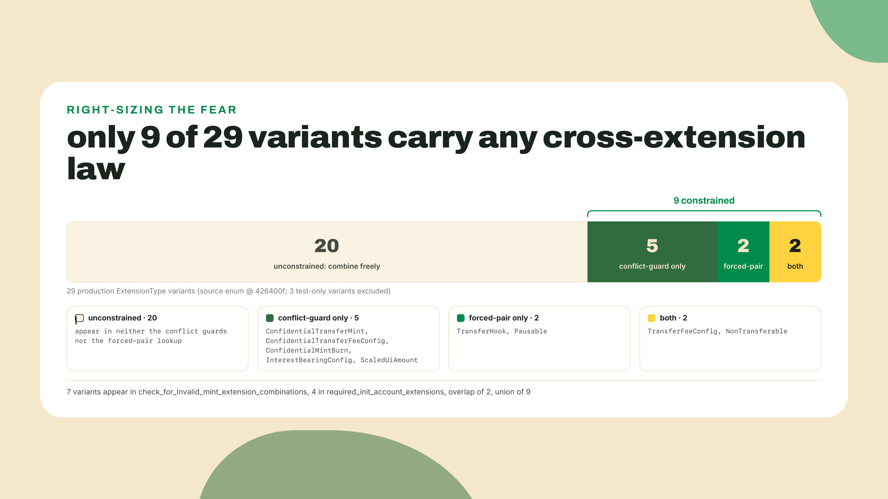

Notice that the two functions answer questions at different layers, and that the second one bites later. The five rules run at mint initialization, so an illegal set fails immediately and loudly, once, in front of the person who chose it. The forced pairs run at token-account initialization, which happens every time a new holder shows up, potentially months after the mint shipped and long after that person moved on. A client that allocates account space from a hardcoded length instead of consulting this table gets away with it for exactly as long as the mint carries no forced extensions, then starts failing on real users the day someone enables a transfer fee on a new mint and copies the old client code across. That is a support ticket with no obvious author. Read the length from the table, never from memory.

This layer matters for cost and for decoding. Every forced account extension is bytes on every single holder account, rent paid per user, forever. When m01-l2's `decode-mint` shows you a holder account fatter than you expected, this table is why. In the validator, we ship it as data rather than logic: `check-combo` exports the table so later lessons can price account creation before committing to a mint design.

### The trade-off, and what a green check does not mean

Every lesson in this course names its trade-off, and this one has two, both sharp.

First: a source-derived matrix is exactly right and exactly perishable. What you derived is correct at commit 426400f and can move the next time the enum grows or the rule function changes. Twenty-nine variants today was a smaller number not long ago, and PermissionedBurn is proof the enum still grows. So the skill you are buying in this lesson is not the matrix. The matrix is a byproduct. The skill is the derivation, repeatable against whatever commit is pinned the day you need it. When a rule changes upstream, your validator's tests fail against the new source, and that failure IS the alert the docs would never have sent you.

Because the re-derivation is the durable skill, here is the whole loop as a procedure, so six months from now it costs you an evening and not an archaeology dig:

1. Pick the new pin. In your clone: `git fetch origin && git log --oneline -3 origin/main`, choose the commit, record its hash and date next to the old one.
2. Diff only the file that matters: `git diff 426400f..<newpin> -- interface/src/extension/mod.rs`. The `--` is what tells git the rest is a path and not another revision, and leaving it out is how you get `unknown revision or path not in the working tree`. Most upstream activity never touches this file, and an empty diff means your matrix is still current, done in two minutes.
3. If the `ExtensionType` enum changed: recount the production variants (subtract the `#[cfg(test)]` ones), and check whether any new variant appears in the guard function or the forced-pair lookup.
4. If `check_for_invalid_mint_extension_combinations` changed: re-read the guards in source order, port the delta into `check-combo.ts`, and update the `reason` strings so the tags still match the rules.
5. Rerun `npx tsx test-check-combo.ts`, add a test case for anything new, and update the pinned hash in your file's header comment. The header comment is the provenance; a validator that does not say which commit it models is a doc page waiting to happen.

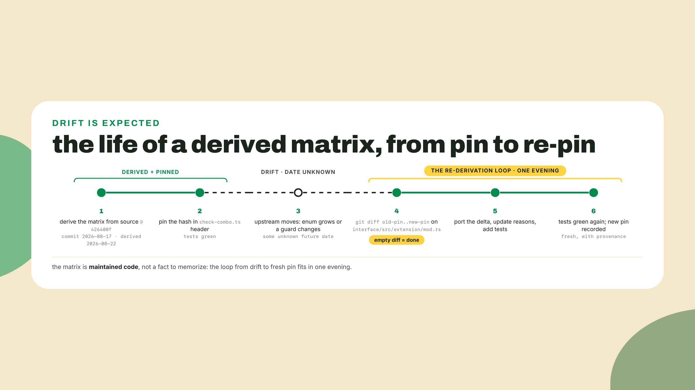

Second, and this one gates a whole module later: the code rules are necessary but not complete. The docs flag combinations the init function never rejects. NonTransferable plus TransferFeeConfig is the canonical example: doc pages call the pair incompatible (a fee on transfers that cannot happen), yet the five extracted rules say nothing about it, and rules are the only thing the program enforces at init. So which claim wins? Do not take my answer for it, and do not take the docs' answer either. This is a question with a terminal, and you have one. You will settle it yourself in the Challenge by asking the program directly, because "the docs say" and "the code enforces" are different classes of claim and the whole point of today is that you now know how to test the gap between them.

Hold the two claim classes apart with names: init-invalid means the program rejects the set, full stop, that is what check-combo detects. Makes-no-sense means a doc-level caution that may or may not correspond to any enforcement. And past both of those sits a third gate that no validator can see: venue acceptance. A set can be perfectly legal to initialize and still be unroutable, because DEX allowlists reject extensions like PermanentDelegate on policy, not legality. Legality is a floor, not routability. That sentence is the bridge to Module 5, where we take legal-but-unroutable apart properly.

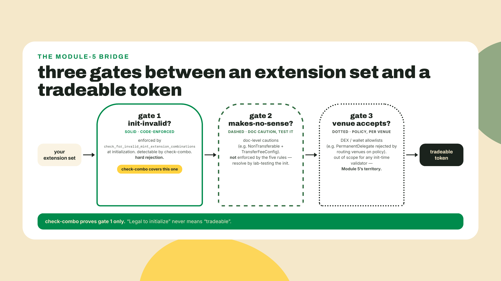

That is the whole theory. A one-gate decision framework, five rules read from source, four forced pairs, and an honest map of what the rules do not cover. Now we make it executable.

## Lab: port the five rules into check-combo

The artifact is R2 on this course's ladder: a pure function, no RPC, no chain dependencies, which is deliberate. Rules extracted from source should be testable in four milliseconds without a network. The chain enters only at the end, when R2 consumes R1.

1. Scaffold the lab next to your m01-l2 work and install the runner. Two dev dependencies, zero runtime dependencies, and that is the entire footprint (tsx 4.20.5, the same pin m01-l1 introduced, plus @types/node 26.2.0; both verified 2026-08-22, and both worth re-checking when you scaffold):

```bash
mkdir -p labs/m01-l4 && cd labs/m01-l4
npm init -y
npm pkg set type=module
npm install -D tsx@4.20.5 @types/node@26.2.0
```

tsx runs TypeScript directly with no build step; the Node type definitions are there so the `process.exit` calls in the test script typecheck in your editor instead of glowing red at you. Nothing else gets installed in this lab, and that absence is deliberate: rules extracted from source should be provable without a single package that talks to a chain.

The `type=module` line is not ceremony. The glue script in step 7 uses top-level await, `npm init -y` defaults the package to CommonJS, and tsx refuses top-level await under CommonJS with an esbuild transform error that names neither of those facts. If you ever see `Top-level await is currently not supported with the "cjs" output format` mid-course, this line is the fix.

2. Create `check-combo.ts` with the frozen interface and the forced-pair table. The signature below is a contract: later lessons import `checkCombo` by exactly this name, and m02-l1's economics mint gets gated through it. (`REQUIRED_ACCOUNT_EXTENSIONS` is exported too, but only this lesson's own gate reads it.)

```ts
// check-combo.ts: R2. The five rules of
// check_for_invalid_mint_extension_combinations, ported 1:1.
// Source of truth: solana-program/token-2022 @ 426400f,
// interface/src/extension/mod.rs (lines 1326-1374).

export interface ComboResult {
  valid: boolean;
  reason?: string;
}

// The forced-pair layer from required_init_account_extensions (same file,
// line 1296): initializing a token ACCOUNT for a mint with the left-hand
// extension forces the right-hand account extensions to exist.
export const REQUIRED_ACCOUNT_EXTENSIONS: Record<string, string[]> = {
  TransferFeeConfig: ["TransferFeeAmount"],
  NonTransferable: ["NonTransferableAccount", "ImmutableOwner"],
  TransferHook: ["TransferHookAccount"],
  Pausable: ["PausableAccount"],
};

export function checkCombo(extensions: string[]): ComboResult {
  const has = (name: string): boolean => extensions.includes(name);

  // TODO rule 1: ConfidentialTransferFeeConfig requires BOTH
  //   TransferFeeConfig AND ConfidentialTransferMint.
  // TODO rule 2: TransferFeeConfig + ConfidentialTransferMint together
  //   REQUIRE ConfidentialTransferFeeConfig.
  // TODO rule 3: ConfidentialMintBurn requires ConfidentialTransferMint.

  // Rule 4: ScaledUiAmount and InterestBearingConfig are mutually exclusive.
  if (has("ScaledUiAmount") && has("InterestBearingConfig")) {
    return {
      valid: false,
      reason:
        "rule 4: ScaledUiAmount and InterestBearingConfig are mutually exclusive",
    };
  }

  // TODO rule 5: NonTransferable + ConfidentialTransferMint is invalid
  //   UNLESS ConfidentialMintBurn is also present.

  return { valid: true };
}
```

3. Look at the shape of rule 4 before you write the others, because the whole function is that shape repeated: each rule is a guard clause that returns `{ valid: false, reason }` when its condition fires, and a set that survives all five guards falls through to `{ valid: true }`. One structural choice worth naming: the Rust original collects booleans first and then runs the guards, because it iterates a slice of enum variants once for efficiency inside the program. We are not inside a program, so the `has()` closure over `includes` reads closer to the rule statements themselves. Port the LOGIC, not the loop.

4. Now fill in rules 1, 2, 3, and 5, working directly from the Rust you have open in the split pane. Write each one where its TODO already sits: the slots are laid out in source order, three above the rule-4 guard and one below, so a completed file reads top to bottom in the same sequence the Rust does. This is the completion exercise of the lesson, so I will not hand you the four bodies, but here is the mapping discipline that makes each one a two-minute port. Take the Rust guard for rule 3: `if confidential_mint_burn && !confidential_transfer_mint`. Read it as a sentence ("mint-burn present and its dependency absent"), then write the same sentence with `has()`. Rule 1 wants a negated conjunction, watch your parentheses: the invalid state is the bridge present while NOT both endpoints are. Rule 2 and rule 5 are both three-term guards, two presences and one absence. Start each `reason` string with its rule tag, `"rule 1: ..."` through `"rule 5: ..."`, because the test file asserts on the tag: a validator that rejects the right set for the wrong reason is a validator you cannot trust to explain a product decision.

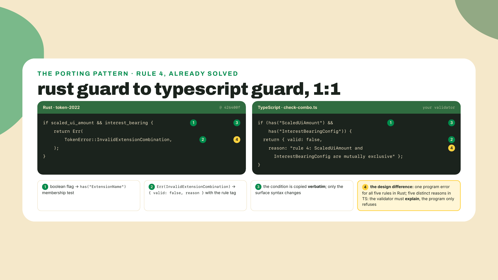

5. Write the assert-script, `test-check-combo.ts`. Same testing-thread pattern as `test-decode-mint.ts` from m01-l2: plain asserts, exit 1 on the first miss, one summary line on success. The cases below are the lesson's acceptance gate, including the rule-5 flip where adding an extension turns an illegal pair legal:

```ts
// test-check-combo.ts: the assert-script for R2.
import { checkCombo, REQUIRED_ACCOUNT_EXTENSIONS } from "./check-combo";

let passed = 0;

function expectValid(extensions: string[]): void {
  const result = checkCombo(extensions);
  if (!result.valid) {
    console.error(`FAIL: expected [${extensions}] legal, got: ${result.reason}`);
    process.exit(1);
  }
  passed += 1;
}

function expectInvalid(extensions: string[], ruleTag: string): void {
  const result = checkCombo(extensions);
  if (result.valid) {
    console.error(`FAIL: expected [${extensions}] illegal (${ruleTag}), got valid`);
    process.exit(1);
  }
  if (!result.reason?.startsWith(ruleTag)) {
    console.error(
      `FAIL: [${extensions}] rejected, but by "${result.reason}" instead of ${ruleTag}`,
    );
    process.exit(1);
  }
  passed += 1;
}

// Legal set: a fee token with metadata. The everyday case.
expectValid(["TransferFeeConfig", "MetadataPointer"]);

// Rule 4: the two rebasing-display extensions are mutually exclusive.
expectInvalid(["ScaledUiAmount", "InterestBearingConfig"], "rule 4");

// Rule 3: confidential supply without confidential transfers is nonsense.
expectInvalid(["ConfidentialMintBurn", "MetadataPointer"], "rule 3");

// Rule 2: fees + confidential balances demand the confidential-fee bridge.
expectInvalid(["TransferFeeConfig", "ConfidentialTransferMint"], "rule 2");

// Rule 5: soulbound + confidential is illegal on its own...
expectInvalid(["NonTransferable", "ConfidentialTransferMint"], "rule 5");

// ...and becomes legal once ConfidentialMintBurn joins the set.
expectValid(["NonTransferable", "ConfidentialTransferMint", "ConfidentialMintBurn"]);

// Rule 1: the confidential-fee bridge cannot stand alone.
expectInvalid(["ConfidentialTransferFeeConfig"], "rule 1");

// The forced-pair table is data, not logic. Sanity-check its shape.
if (REQUIRED_ACCOUNT_EXTENSIONS["NonTransferable"].length !== 2) {
  console.error("FAIL: NonTransferable must force two account extensions");
  process.exit(1);
}
passed += 1;

console.log(`check-combo: all ${passed} assertions passed`);
```

6. Run it:

```bash
npx tsx test-check-combo.ts
```

Before you fill in the TODOs, the run fails at the rule 3 case, and that failing starter is the point: it proves the tests can catch an incomplete validator. After your four rules land, expected output:

```
check-combo: all 8 assertions passed
```

If you are failing on a reason string rather than a verdict, that is the tag assert doing its job. Check which rule your guard order fires first: a set can violate two rules at once (add ConfidentialMintBurn to the rule 4 pair and rules 3 and 4 both apply), and source order decides which reason wins. Match the source order and the tags line up.

7. Now close the loop with R1. Everything so far validated hypothetical sets; the artifact contract says check-combo runs against a real mint's ACTUAL set, which is exactly what your m01-l2 inspector emits. And there is one seam to cross first, the one m01-l2 warned you about in its naming note: `checkCombo` is a 1:1 port of Rust, so it speaks the Rust spellings, while `decode-mint` names extensions out of the pinned JS client's `ExtensionType` enum, and on three entries the two disagree. Type 16 is `ConfidentialTransferFeeConfig` in the source and `ConfidentialTransferFee` in the client. Type 25 is `ScaledUiAmount` and `ScaledUiAmountConfig`. Type 26 is `Pausable` and `PausableConfig`. Feed the client's strings straight into the Rust rules and rule 2 fires on PYUSD, the course's own flagship mint, which is very much not what a real mint that already initialized should produce.

So the glue has one job before it hands the list over, and m01-l2 already told you which field to trust: the u16 is the identity, names are per-toolchain skins over it. Normalize on the NUMBER. Write `check-live.ts` (adjust the import path and export name to match your own decode-mint file; this snippet assumes the decoded result carries the `extensions: {name, type, length}[]` array your R1 assert-script already checks):

```ts
// check-live.ts: R1 feeds R2. Decode a live mint, judge its set.
import { decodeMint } from "../m01-l2/decode-mint";
import { checkCombo } from "./check-combo";

// The three type codes where the pinned client's enum and the Rust source
// disagree on spelling. Keyed on the u16 rather than on the client's string,
// because the number is the extension's identity and the string is a skin:
// a name-to-name table would go stale the next time a client renames one, and
// this table can only go stale if a type code changes meaning, which is a far
// louder event.
const RUST_NAME_BY_TYPE: Record<number, string> = {
  16: "ConfidentialTransferFeeConfig", // client: ConfidentialTransferFee
  25: "ScaledUiAmount", //               client: ScaledUiAmountConfig
  26: "Pausable", //                     client: PausableConfig
};

const mintAddress = process.argv[2];
if (!mintAddress) {
  console.error("usage: npx tsx check-live.ts <mint-address>");
  process.exit(1);
}

const decoded = await decodeMint(mintAddress);
const names = decoded.extensions.map((ext) => RUST_NAME_BY_TYPE[ext.type] ?? ext.name);
console.log(`extensions: [${names.join(", ")}]`);
console.log(checkCombo(names));
```

Point it at the pinned mint from m01-l2 and you should see its extension list, with type 16 now printed in the source's spelling, followed by `{ valid: true }`. Take the detour if that surprises you: comment the normalization out, re-run, and watch your brand-new validator reject PayPal's stablecoin with `rule 2: TransferFeeConfig + ConfidentialTransferMint require ConfidentialTransferFeeConfig` — a rejection that is perfectly correct about the rule and perfectly wrong about the mint. Two tools, two vocabularies, one type code, and an hour of debugging rules that were never broken. Every integration you ever write across two SDKs has a seam like this one somewhere in it. Then cash in the note you kept from m01-l2's step 10: run the strangest mint you found through the same pipeline. It will come back valid too, because it initialized, and that is the interesting part: read its list against the nine marked stones and see which cross-extension law it lives under, if any. Of course it is valid: it initialized, so it passed these same five rules inside the program the day it was born. Which is the quiet punchline of the whole lab. Every live Token-2022 mint on mainnet is a witness that already passed the function you just ported. Your validator moves that judgment from after the fact to before the design review.

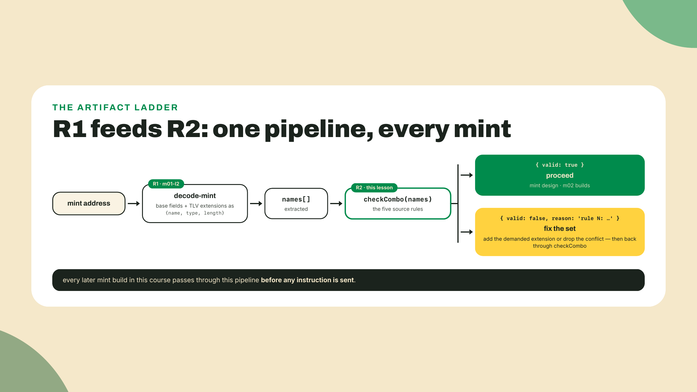

That is the lab. A confession before the challenge: the first pass of this course pinned a hand-typed conflict table in a planning doc, three rules remembered from a changelog. Writing the extraction pass against the actual function found the other two within the hour, including the rule-5 conditional the table had flattened into a plain "incompatible". A copied matrix does not just go stale. It starts stale. The validator you wrote is how it stays fresh: the tests break when the source moves, and the derivation takes an evening to redo.

## Challenge

Two parts, one solo and one empirical.

**Solo: the coding challenge.** This is the module's single coding challenge and it is this lesson's artifact proven end to end: implement `checkCombo` so all five rules fire exactly as the source function fires them. The starter is a stripped-down cousin of the lab's step-2 file: same `{ valid, reason? }` result, rule 4 already implemented and the other four missing. One deliberate difference from the lab contract: the grader calls your function with each extension name as its own string argument, so the shipped signature is `checkCombo(ext1: string, ext2?: string, ext3?: string)`, the starter's first line collects those arguments into the same `extensions` array your lab version receives, and the rule logic is identical from there down. It is deliberately leaner than the lab version, with no forced-pair table and no rule tags in its one reason string, so nothing carries over except the logic you derived. It fails the test suite as shipped. Your solution passes all of it. The acceptance criteria, straight from the gate:

- `checkCombo("TransferFeeConfig", "MetadataPointer").valid === true`
- `checkCombo("ScaledUiAmount", "InterestBearingConfig").valid === false`
- `checkCombo("ConfidentialMintBurn", "MetadataPointer").valid === false`
- `checkCombo("TransferFeeConfig", "ConfidentialTransferMint").valid === false`
- `checkCombo("NonTransferable", "ConfidentialTransferMint").valid === false`
- `checkCombo("NonTransferable", "ConfidentialTransferMint", "ConfidentialMintBurn").valid === true`

The gate checks verdicts only. Hold yourself to the higher bar anyway and make each rejection name the source rule that fired, the way your lab version does, because a validator that rejects the right set for the wrong reason passes tests and still loses a design review. If you completed the lab, you have already done the work; the challenge is where you prove it without the scaffolding in view.

**Empirical: probe the docs-vs-code delta.** This half runs on your own machine — it needs two local CLIs and a cluster to talk to; the graded gate above does not depend on it, so if you are working browser-only, read it, note the dependency, and come back when you have them. Be warned about exactly what "them" means, because module 2's standing lab environment is not it: module 2 installs npm packages and surfpool, and neither one gives you the two tools below. You need the `solana` CLI (m01-l3 hands you its one-line installer as an optional probe) and `spl-token-cli`, which is a cargo install and therefore wants a Rust toolchain — the one module 3's hook lesson sets up. So the honest deferral target is module 3, not module 2, and the cheapest way to clear it early is to run m01-l3's installer now and add `cargo install spl-token-cli` beside it. The theory section left NonTransferable plus TransferFeeConfig unresolved on purpose: docs call the pair incompatible, the five extracted rules never mention it. Your validator, faithfully following the code, accepts it. So ask the program directly. The `spl-token` CLI comes bundled with some Solana toolchain installs and not others, so check first with `spl-token --version`; if it is missing, `cargo install spl-token-cli` gets you one (5.6.1 is current on crates.io as of 2026-08-22, and the answer key below was produced on 5.5.0, so any version in that neighborhood is fine). Whatever you land on, write the number down, because it matters for how you read the result. The CLI can attempt exactly this init against devnet:

```bash
solana config set --url https://api.devnet.solana.com
solana airdrop 2   # devnet faucet; if rate-limited, use faucet.solana.com
spl-token create-token --program-2022 \
  --enable-non-transferable \
  --transfer-fee-basis-points 50 \
  --transfer-fee-maximum-fee 5000
```

If the devnet faucet rate-limits you (it does, often, and the airdrop just fails), any local validator works instead: point `--url` at a `surfpool start --no-tui --no-studio` mainnet-fork and airdrop there. surfpool is a local validator that forks mainnet state on demand (on macOS `brew install txtx/taps/surfpool`, other platforms grab it from the surfpool releases page); next module it becomes the standing lab environment, so installing it now is not wasted motion. The fork runs the same deployed Token-2022 binary, so its verdict on this question is the same verdict mainnet would give.

Record what happens: created, or rejected, and by whom. Those are three different outcomes, not two. The program can reject it. The CLI can refuse client-side before anything is sent, which would tell you the "conflict" lives in a tool rather than in consensus. Or it can go through, in which case decode the resulting mint and confirm with your own inspector that both extensions really landed, because "the command exited 0" is not the same claim as "the account carries both". Do not skip that last step; it is the difference between believing a CLI and reading the bytes, which is the entire habit this module exists to build.

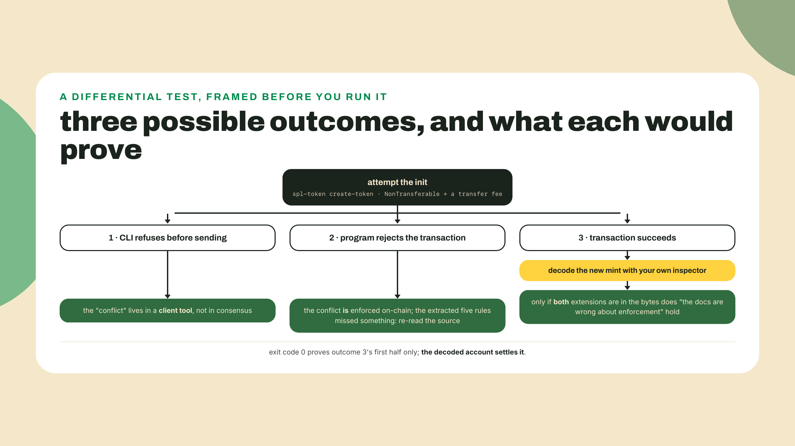

I am deliberately not printing the outcome up here. Run it first, write down what you got next to the date and your `spl-token --version`, and only then read the answer key at the end of the Checkpoint. Whatever you find, notice that check-combo stays unchanged. It models what init enforces, and adding a rule the program does not enforce would make your validator disagree with the program it exists to predict.

## Checkpoint

The gate for this lesson: your `check-combo` accepts a legal extension set and rejects each of the four illegal cases with the correct source rule, matching `check_for_invalid_mint_extension_combinations` at 426400f, and the coding-challenge tests pass, starter failing, solution green. Alongside the passing run, write the one sentence the assessment asks for: your own separation of "legal to initialize" from "accepted by a venue or wallet". If your sentence mentions allowlists or PermanentDelegate, you have already internalized Module 5's opening argument.

### Answer key: what the probe returns

Read this only after you have run it. On 2026-08-22, spl-token-cli 5.5.0 against a mainnet-fork running the deployed Token-2022 binary, the `create-token` above **succeeded**. Yes, 5.5.0: one minor behind the 5.6.1 that crates.io listed as current the same day, because my toolchain bundle lagged the registry, which is exactly why the challenge made you write your own version down. If your probe ran on 5.6.1 and any behavior below differs, your run wins; record the delta with the version attached. It printed an address and a signature like any ordinary mint creation. Decoding the new account confirms it was not a CLI illusion. Point your own m01-l2 inspector at the address the CLI printed and the read comes back shaped like this:

```text
npx tsx decode-mint.ts <THE_MINT_THE_CLI_PRINTED> <YOUR_FORK_RPC_URL>

owner program: TokenzQdBNbLqP5VEhdkAS6EPFLC1PHnBqCXEpPxuEb
data length:   282 bytes -> extended-165+1
extensions (2):
  { name: NonTransferable, type: 9, length: 0 }
  { name: TransferFeeConfig, type: 1, length: 108 }
```

282 bytes, owner `Tokenz...`, and two TLV entries, `NonTransferable` and `TransferFeeConfig` in the pinned client's spelling, sitting on the same mint: exactly the 166 + (4 + 0) + (4 + 108) your `compute-len` arithmetic prices the pair at. The program accepted it.

So the delta resolves in favor of the code, and your validator was right to accept it. The doc pages calling that pair "incompatible" are making a *semantic* claim, not a legality claim, and the semantic claim is fair: a NonTransferable mint rejects every transfer, so a fee schedule on it can never collect anything. It is dead configuration you pay rent on. That is a real thing to warn a designer about, and it is genuinely not a rule the program enforces at initialization. Both statements are true at once, which is exactly why they need separate names.

Two side findings from the same run, both worth more than the headline. First, the CLI does enforce some rules itself: ask it for `--interest-rate` and `--ui-amount-multiplier` together and it refuses before touching the network, an argument-parser conflict rather than a program error. Rule 4 is guarded twice, in two different places, and only one of them is consensus. Second, ask it for a transfer fee plus confidential transfers, the rule-2 pair your test suite expects to be illegal, and it succeeds anyway, because the CLI quietly adds `ConfidentialTransferFeeConfig` for you and initializes the legal trio. Both make the same point: a tool sitting between you and the program can add rules the program does not have, and satisfy rules you never asked it to satisfy. Neither is visible from the exit code. Only the decoded account tells you what you actually built, and you have owned that decoder since m01-l2.

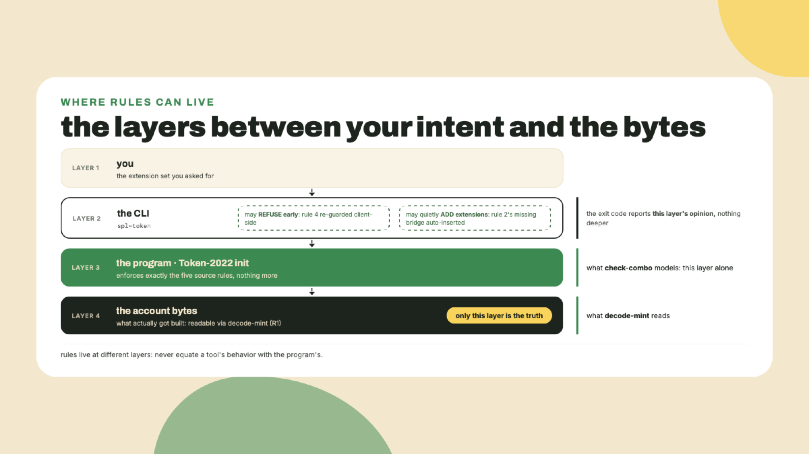

If your run disagreed with any of this, your run wins and I want to hear about it, with the version and the date attached. That is not politeness. It is the fifth step of the re-derivation loop.

Wrong-reason failures and parenthesis slips on rule 1 are the two misses I expect; if the tag assert keeps biting after a source-order check, bring the failing case and your guard order to the course discussion and we will read your port against the Rust together. That kind of diff, your derivation against the source, is precisely the review muscle this course is building.

You can now say which extension sets are LEGAL to build, and you can prove it against any live mint from the bytes up. But legal is not the same as tradeable, and before we get to that reckoning, the next module builds every extension for real, starting with the economics set: fees, interest, scaled UI. Your SPROUT mint will carry TransferFeeConfig plus one of the two display extensions, your validator will be the thing that stops you picking both, and then we chase the question check-combo cannot answer: when a transfer withholds a fee, where does the money actually sit, and who is allowed to sweep it? Happy deriving! 🌱
