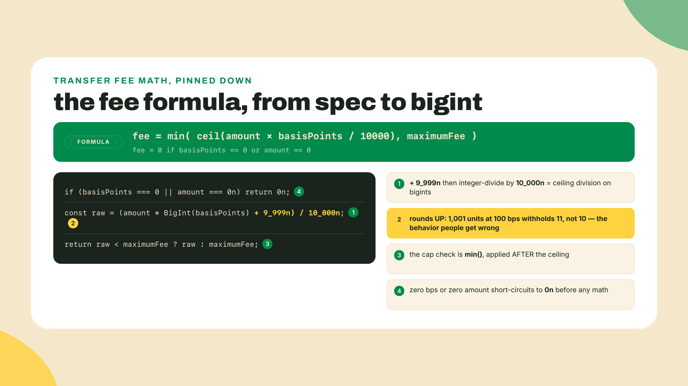
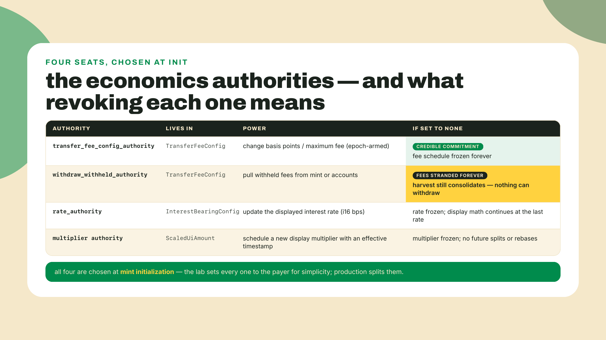
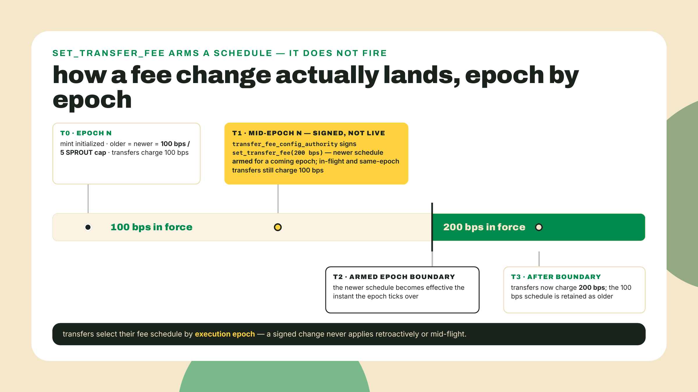
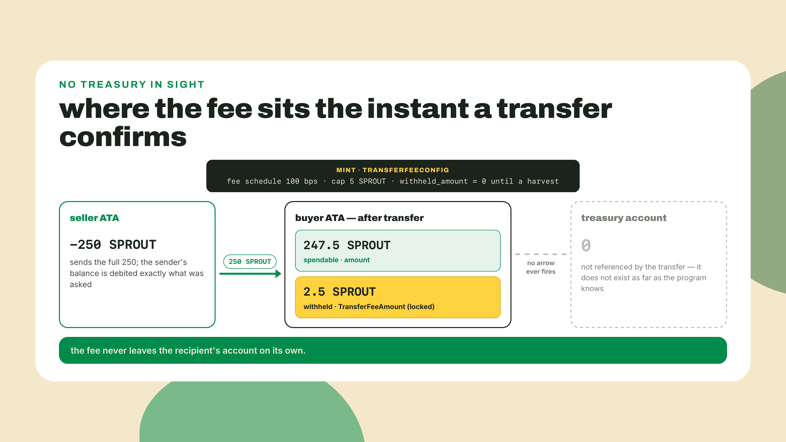
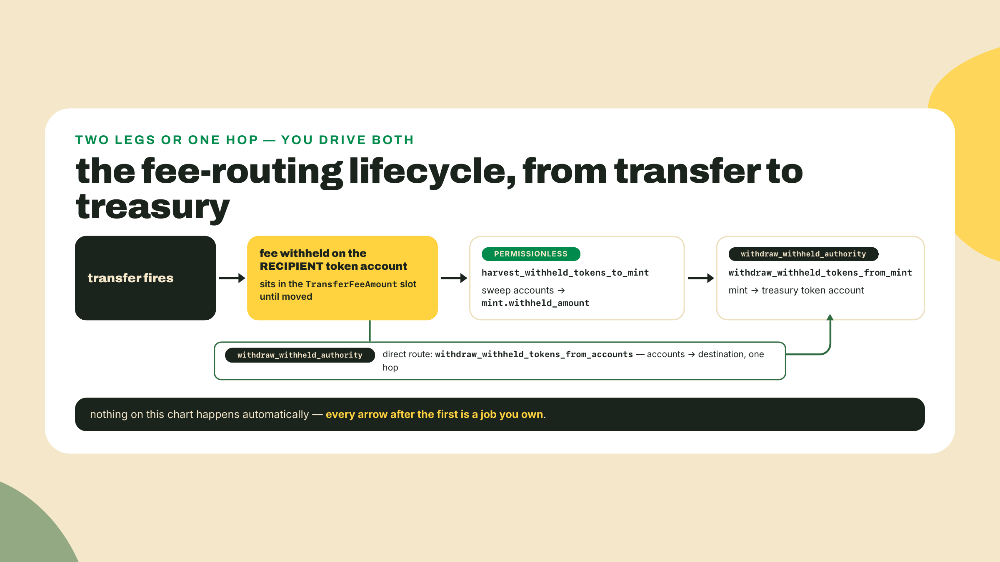
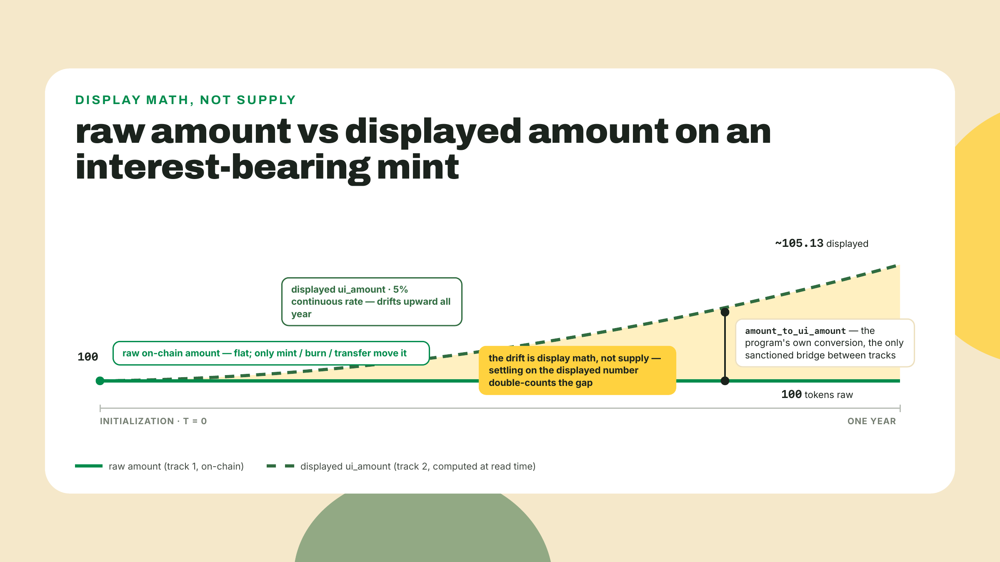
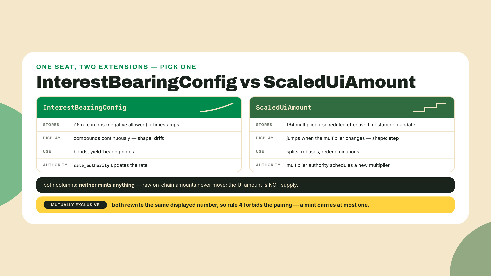
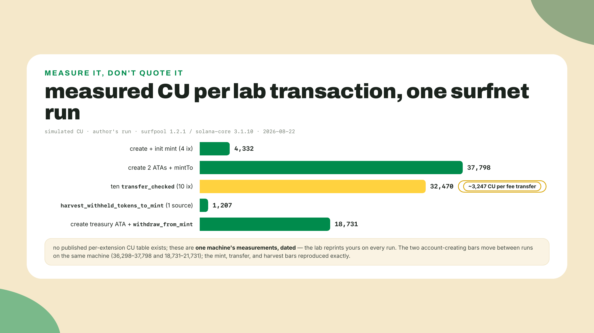

# Economics extensions: fees, interest, scaled UI, and where the fees GO

## Summary

Last lesson you derived the extension conflict matrix straight from source and built check-combo, which accepts a legal extension set and rejects an illegal one. Now you spend that matrix: you start building SPROUT for real.

Here is how my first pass at this build went. I set a 1% transfer fee on a test mint, ran ten sales, and opened the treasury account to admire the take. Zero. Not a rounding error, not a delay: zero. The fees were real, the program had collected every one of them, and they were sitting somewhere I had never thought to look. That somewhere is the whole second half of this lesson, because Token-2022 withholds transfer fees on the RECIPIENT's token account, and nothing, ever, moves them to a treasury until you do it yourself.

Today SPROUT, the currency of Overgrowth, the fictional co-op farming game whose economy this course stands up, grows its economics layer: a Token-2022 mint carrying TransferFeeConfig plus one of the two display-rewriting extensions, InterestBearingConfig or ScaledUiAmount, built from raw instructions with kit. You will run real transfers on a local surfnet, watch fees pile up where you least expect them, then sweep them home with the harvest sequence that Module 9's fee-routing rail later calls by name.

Something to do before the theory: stand up the lab. Scaffold next to your earlier work and start a local surfnet (surfpool 1.2.1 here, 2026-08-22; on macOS `brew install txtx/taps/surfpool`, other platforms grab it from the surfpool releases page):

```bash
mkdir -p labs/m02-l1 && cd labs/m02-l1
npm init -y && npm pkg set type=module
surfpool start --no-tui --no-studio
```

Leave the surfnet running in that terminal and open a second one. We will fill the folder as we go.

The autonomy fade for this lesson, stated out loud: the mint build is worked in full, I walk every instruction and you type along. The fee constants and the harvest sequence are completion exercises: the file ships with TODOs and the theory tells you exactly what goes in them. And the fee arithmetic itself is solo: the module's coding challenge hands you a broken `transferFee` and a test suite, no scaffolding.

## The fee lifecycle

### One extension that moves money, two that only talk about it

The three extensions in today's set look like siblings and are not. TransferFeeConfig changes what a transfer DOES: tokens actually move differently, someone actually receives less. InterestBearingConfig and ScaledUiAmount change what a balance LOOKS LIKE: they rewrite the number a wallet displays while the raw amount on chain sits untouched. Hold that split firmly, because every footgun in this lesson comes from blurring it.

Start with the one that moves money. TransferFeeConfig is mint-level state with two authorities and two fee schedules inside it. The fee itself is two numbers: `transfer_fee_basis_points`, the percentage in hundredths of a percent, and `maximum_fee`, a hard cap in base units. On every transfer the program computes:

fee = ceil(amount x basis_points / 10000), capped at maximum_fee

The rounding direction is not a detail. The fee rounds UP, always, so the program never undercharges itself: send 1,001 base units at 100 bps and the raw math says 10.01, the program withholds 11. And the cap is a ceiling on the absolute take: at 100 bps with a 5-token cap, a 250-token sale owes 2.5 and pays 2.5, while a 750-token sale owes 7.5 and pays exactly 5. Whales get a discount, by design, because the cap exists to keep large legitimate transfers from bleeding.



Two more shapes inside the extension deserve a look before we build, because the client library will force you to acknowledge them anyway. First, the authorities are split: `transfer_fee_config_authority` may change the fee, and `withdraw_withheld_authority` may collect it. Two keys, two jobs, separable on purpose: a DAO can hold the fee-setting power while an ops bot holds the sweeping power, and revoking one does not revoke the other. And revocation here is not symmetric in its consequences. Set the config authority to none and the fee schedule is frozen forever, which is a credible-commitment feature: holders know the 1% can never become 10%. Set the withdraw authority to none and every fee your token ever withholds, past and future, is stranded permanently, because harvesting to the mint stays permissionless but nothing can ever pull the pile out again. One of those revocations is a promise. The other is a tombstone. Decide which authority goes to a multisig, which to an ops key, and which you would ever null, before initialization, because this extension ships at birth and the authority wiring is part of the product.



Second, the config stores TWO complete fee schedules, an older and a newer. A fee change does not take effect when you sign it; `set_transfer_fee` arms the newer schedule for a future epoch, and every transfer picks the schedule that matches the epoch it executes in. Nobody gets rugged mid-flight by a fee that doubled between wallet preview and confirmation, and an integrator quoting fees can read both schedules and know exactly which applies when. When you build the extension shape in the lab and the types demand `olderTransferFee` AND `newerTransferFee`, that is not boilerplate, that is the anti-rug mechanism looking back at you.



So a transfer fires and a fee is computed. Where does it go?

### The reveal: fees live on the recipient

Nowhere near your treasury. The fee is withheld ON the recipient's token account, inside a slot the account was born with. You met the mechanism last lesson in `required_init_account_extensions`: TransferFeeConfig on a mint forces a TransferFeeAmount extension onto every token account for that mint. That slot is where fees accumulate, per holder, invisibly, forever, until someone sweeps them.

Send 250 SPROUT at 100 bps and the buyer's account receives 247.5 spendable SPROUT plus 2.5 SPROUT of withheld fees it cannot touch. Run ten sales to ten different buyers and your protocol's revenue is now scattered across ten accounts as withheld dust. Nothing routes automatically. There is no treasury in the picture at all until you introduce one.

The forced slot also has a price tag, and it is paid per holder, not by you. Every token account for a fee mint is a few dozen bytes larger than a plain one, and account bytes are rent: each new holder pays a slightly higher rent-exempt minimum at account creation, forever, whether they ever accrue a withheld fee or not. On one account it is noise. On a token with a hundred thousand holders it is a standing tax on your entire user base that you signed them up for at mint initialization. This is the same lesson m01-l2's byte math taught from the reading side, now from the issuing side: extensions are not free to the people who merely hold your token.



Why build it this way? Derive it from what you know about the runtime instead of taking it as a quirk. Suppose fees routed inline to a treasury. Then every transfer of the token would need the treasury account in its account list, writable. One hot writable account shared by every transfer means no two transfers of your token can execute in parallel, ever: you would have serialized your entire token economy through a single lock. Worse, the transfer instruction's account shape would change whenever the treasury moved. Withholding on the recipient keeps each transfer touching only the accounts it was already touching, so parallel execution survives, and it converts fee routing into what it honestly is: an asynchronous batch job. The protocol does not do the job for you. It just makes the job possible, and cheap.

That batch job has a name, three names actually, and they are the load-bearing vocabulary of this lesson. `harvest_withheld_tokens_to_mint` sweeps withheld fees from any list of token accounts onto the mint itself, into a `withheld_amount` field inside the mint's own TransferFeeConfig. It is permissionless: anyone may call it, because it only consolidates, it cannot steal. `withdraw_withheld_tokens_from_mint` then moves the consolidated pile from the mint to any destination token account, and THIS one is gated by the `withdraw_withheld_authority`. There is also a direct route, `withdraw_withheld_tokens_from_accounts`, which pulls from token accounts straight to a destination in one authority-gated hop, useful when you want fees out of specific accounts without the mint stopover.



Now the operational consequence, because this is the trade-off half of the deal. A transfer fee makes a token self-funding, which is a real capability: the fee-routing rail you build in Module 9 turns exactly this mechanic into automated buybacks. The bill for it: recipients receive less than the sender sent, which breaks every integration that assumed amount-in equals amount-out; fees accumulate invisibly across thousands of accounts; and harvesting is a recurring ops job, with real CU costs, that your protocol now owns for life. Who calls harvest, how often, and who pays for those transactions is a staffing question, not a code question. Most fee-token postmortems are not exploits. They are nobody-ran-the-cron.

The integration breakage deserves its own concrete scene, because you will be on one side of it eventually. An exchange credits deposits by the amount the sender claims to have sent, ships 100 tokens of a fee mint to a user withdrawal, and the user receives 99. Now the exchange's internal ledger and the chain disagree by one token per withdrawal, compounding, and support tickets do the accounting. The defensive patterns are boring and mandatory: credit what ARRIVED, never what was sent (read the destination's balance delta, not the instruction's amount); quote fees to users before they sign, using the exact formula above against the CURRENT epoch's schedule; and for senders that promise an exact-received amount, gross up the send so the post-fee arrival matches the promise, remembering the ceiling rounds against you. The gross-up is fiddly enough to write down once and keep:

```ts
// gross-up: smallest send amount whose post-fee arrival covers `target`.
function grossUp(target: bigint, basisPoints: number, maximumFee: bigint): bigint {
  if (basisPoints === 0 || target === 0n) return target;
  let amount = (target * 10_000n) / (10_000n - BigInt(basisPoints));
  while (amount - transferFee(amount, basisPoints, maximumFee) < target) amount += 1n;
  return amount;
}
// netting exactly 100 SPROUT at 100 bps means sending 101.010102
```

The closed form gets you within a unit and the loop absorbs the ceiling's bias; promising a user "you will receive exactly X" without this is how support queues are born. None of this is hard. All of it has to be done on purpose, and the integrations that predate Token-2022 do none of it by default, which is a large part of why venues gate fee tokens behind allowlists at all.

The crank itself has design room worth knowing before Module 9 automates it. `harvest_withheld_tokens_to_mint` takes a whole `sources` array, so a single instruction sweeps many dirty accounts at once, and my measured cost for a one-source harvest was around 1,200 CU: consolidation is nearly free, which is exactly what you want for a permissionless call. That permissionlessness is also a small gift to the ecosystem: an indexer, a bot, even a rival can tidy your fees toward the mint, and nothing is lost because only the withdraw authority can take the final hop. The direct route, `withdraw_withheld_tokens_from_accounts`, trades that division of labor away: one authority-gated call, but the authority has to sign every sweep and the account list rides in a transaction it pays for. Two-leg for routine collection at scale, direct for surgical pulls. Either way the finding-the-dirty-accounts problem is yours, and it is an indexing problem: enumerate the mint's token accounts, filter for a nonzero withheld amount, sweep. Module 9's fee-routing lesson is where this course does that enumeration properly, on its way to automating the crank.

### The two display extensions, and why they cannot coexist

Now the talkers. InterestBearingConfig stores a rate in basis points (an i16, so it can be negative: yes, you can configure decay) plus timestamps, and instructs clients to display balances as if they compounded continuously since initialization. A holder's UI balance drifts upward day by day. The raw amount in their account does not move. No tokens are minted, none ever will be by this extension, and the moment any code treats that growing display number as supply it is double-counting value that does not exist. The extension is an accounting convention with an on-chain anchor: useful for bonds and yield-bearing wrappers where the note's face value grows, dangerous the instant someone wires `ui_amount` into settlement math. The chain even ships an `amount_to_ui_amount` instruction you can simulate to get the authoritative displayed value, which is the polite way of saying: the conversion is defined by the program, not by your spreadsheet.

The rate is not even locked: the `rate_authority` can change it, and the extension's odd-looking state fields exist for exactly that moment. When a rate update lands, the program folds everything accrued so far into `pre_update_average_rate` and stamps `last_update_timestamp`, so the display math becomes piecewise: the old average applies up to the stamp, the new `current_rate` applies after. History does not get rewritten when the rate does, which is the difference between a yield knob and a time machine. When the lab's `extension()` call asks you for all five fields, that piecewise ledger is what you are initializing.

Here is the double-count in the wild, so it stops being abstract. A lending protocol lists an interest-bearing token as collateral and, to save a call, values positions by the wallet-displayed amount. The displayed number compounds; the raw tokens backing it do not. Month by month the protocol's books grow phantom collateral, precisely the gap between display math and reality, and the first liquidation cascade marks it to market all at once. Nothing was hacked. Someone read a UI convention as a balance. The rule that keeps you safe is mechanical: raw amounts settle, UI amounts render, and any number that crosses from the second world into the first must pass through the program's own conversion, at a timestamp you chose on purpose.



ScaledUiAmount is the same trick with a different shape: a single f64 multiplier applied to every displayed balance, updatable by its authority with an effective timestamp you can schedule in advance. Where InterestBearingConfig models continuous drift, ScaledUiAmount models discrete jumps: a 10-for-1 split, a rebase, a redenomination, all without touching a single holder account. One instruction updates the multiplier and every wallet on earth re-renders. The scheduling is the underrated half: an issuer can announce on Tuesday that the split takes effect Monday 00:00 UTC, sign the update immediately with that effective timestamp, and every client flips over in the same instant with no migration window, no snapshot, no claim flow. For issuers that would otherwise migrate thousands of accounts to change a denomination, this is the cheap exit. The same discipline applies as with interest: the multiplier rescales the story, not the supply, and anything that settles must settle raw.

And the two of them cannot share a mint: you derived that yourself last lesson as rule 4 of `check_for_invalid_mint_extension_combinations`, the one true mutual exclusion in the matrix. Both extensions claim ownership of the same output, the displayed amount, and two owners of one number with no defined composition order is an ambiguity the program refuses to create. Your check-combo already rejects the pairing; today it graduates from test fixture to pre-flight gate, because SPROUT gets exactly one of these and the validator is what stops you absent-mindedly initializing both.



Which one does SPROUT take? Your call, genuinely: the lab builds InterestBearingConfig on the worked path because a farming co-op paying yield on stored grain is the more natural fit, and the ScaledUiAmount swap is a two-line change I will show you at the end. Whichever you choose, the combo validator blesses TransferFeeConfig plus your pick, and would have stopped you taking both.

One market-reality beat before the lab, because it answers "will anything even trade this?" Raydium's Token-2022 support page says the quiet part out loud: its reference implementation whitelists exactly the fee, display, and accounting extensions, TransferFeeConfig, MetadataPointer, TokenMetadata, InterestBearingConfig, ScaledUiAmount, and rejects everything else, the compliance-shaped powers included (docs.raydium.io, 2026-08-21). Every extension SPROUT carries out of this lesson is on that allowlist by design, and the reasoning is exactly the split this lesson opened with: a fee or a display multiplier cannot sweep a pool vault. The extensions that can act on other people's balances are the ones venues refuse, and that story, legal-but-unroutable, is Module 5's opening argument.

And if you are wondering why your favorite tutorial never mentioned two of today's three extensions: the official Solana education froze mid-plot. The solana-foundation/developer-content repo was archived on 2025-01-24, so every course built from that canon predates ScaledUiAmount, Pausable, and ConfidentialMintBurn. The extensions you are about to initialize literally do not exist in most of the material the ecosystem still teaches from. You are learning from the program because, for this layer, the program is currently the only teacher that kept up.

## Lab: build SPROUT's economics set

The artifact is `sprout-mint-economics`: a Token-2022 mint with TransferFeeConfig plus InterestBearingConfig (or ScaledUiAmount), a transfer run that scatters withheld fees, and a harvest that sweeps them to a treasury and proves the arithmetic. It consumes both of your existing tools: check-combo gates the set before any lamport moves, and decode-mint inspects the result after.

1. Install the toolchain into the `labs/m02-l1` folder you scaffolded. The pins need one minute of honesty. npm's latest kit is 8.2.0 (published 2026-08-29), but "latest" is not the rule that decides a pin: you pin the kit major your workspace's `@solana-program/*` clients peer against, and this workspace's clients peer kit ^7, verified against the actual npm peer ranges on 2026-09-05. `@solana-program/token-2022@0.15.0` is the current minor peering kit ^7.0.0 (0.16.0 jumped to ^8), and `@solana-program/system@0.13.0` is its counterpart (0.14.0 also jumped). That token-2022 minor also peers `@solana/sysvars` at ^7.0.0 and `@solana/zk-sdk` at ^0.5.1, which npm resolves for you alongside the kit pin, so nothing else needs a hand-pin. Re-verify with `npm view <pkg> peerDependencies` the day you scaffold; this matrix moves.

```bash
npm install @solana/kit@7.1.1 @solana-program/token-2022@0.15.0 @solana-program/system@0.13.0
npm install -D tsx@4.20.5 typescript@5.9.3
```

2. Gate the extension set before building anything. This is check-combo's first day on the job it was built for. Create `gate.ts`:

```ts
// gate.ts: no SPROUT instruction is emitted until the set passes R2.
import { checkCombo } from "../m01-l4/check-combo";

const chosen = ["TransferFeeConfig", "InterestBearingConfig"];
const verdict = checkCombo(chosen);
if (!verdict.valid) {
  console.error(`illegal set: ${verdict.reason}`);
  process.exit(1);
}
console.log(`set [${chosen.join(", ")}] is legal to initialize`);

// The pairing the matrix forbids, proven rejected before we ever hit the chain:
const illegal = checkCombo(["TransferFeeConfig", "ScaledUiAmount", "InterestBearingConfig"]);
console.log(`both display extensions: ${illegal.valid ? "BUG in your R2" : illegal.reason}`);
```

Run `npx tsx gate.ts`. Legal set passes, the double-display set is rejected with the rule 4 reason, and you just used a thing you built to protect a thing you are about to build. That loop is the artifact ladder working.

3. Now the build. Create `verify-economics.ts`. It is the whole lesson in one file and I am giving it to you in three chunks; type them into the same file in order. Chunk one is setup: imports, constants, the fee formula, and a send helper that simulates before it sends. Two TODOs live here and they are yours: the theory section already told you SPROUT charges 100 bps with a 5 SPROUT cap.

```ts
// verify-economics.ts: SPROUT's economics layer, built from raw instructions.
import {
  createSolanaRpc,
  createSolanaRpcSubscriptions,
  generateKeyPairSigner,
  sendAndConfirmTransactionFactory,
  airdropFactory,
  lamports,
  pipe,
  createTransactionMessage,
  setTransactionMessageFeePayerSigner,
  setTransactionMessageLifetimeUsingBlockhash,
  appendTransactionMessageInstructions,
  signTransactionMessageWithSigners,
  assertIsTransactionWithBlockhashLifetime,
  getBase64EncodedWireTransaction,
  type Instruction,
  type KeyPairSigner,
} from "@solana/kit";
import { getCreateAccountInstruction } from "@solana-program/system";
import {
  TOKEN_2022_PROGRAM_ADDRESS,
  extension,
  getMintSize,
  getInitializeTransferFeeConfigInstruction,
  getInitializeInterestBearingMintInstruction,
  getInitializeMintInstruction,
  getCreateAssociatedTokenInstructionAsync,
  findAssociatedTokenPda,
  getMintToInstruction,
  getTransferCheckedInstruction,
  getHarvestWithheldTokensToMintInstruction,
  getWithdrawWithheldTokensFromMintInstruction,
  fetchToken,
  fetchMint,
} from "@solana-program/token-2022";

const rpc = createSolanaRpc("http://127.0.0.1:8899");
const rpcSubscriptions = createSolanaRpcSubscriptions("ws://127.0.0.1:8900");
const sendAndConfirm = sendAndConfirmTransactionFactory({ rpc, rpcSubscriptions });
const airdrop = airdropFactory({ rpc, rpcSubscriptions });

const DECIMALS = 6;
const FEE_BASIS_POINTS: number = 0; // TODO: SPROUT charges 1% on every transfer
const MAXIMUM_FEE: bigint = 0n; // TODO: capped at 5 SPROUT, expressed in base units

// Guard against the vacuous green run: with both constants at their shipped
// zeros every fee is 0n, expectedWithheld is 0, and all three headline
// assertions "pass" on a lab that never charged a fee. Fail loudly instead.
if (FEE_BASIS_POINTS === 0 || MAXIMUM_FEE === 0n) {
  throw new Error("fill in FEE_BASIS_POINTS and MAXIMUM_FEE first: a zero-fee run passes every assertion without proving anything");
}

// The on-chain formula, mirrored so the lab can assert against it.
export function transferFee(amount: bigint, basisPoints: number, maximumFee: bigint): bigint {
  if (basisPoints === 0 || amount === 0n) return 0n;
  const raw = (amount * BigInt(basisPoints) + 9_999n) / 10_000n;
  return raw < maximumFee ? raw : maximumFee;
}

async function send(feePayer: KeyPairSigner, instructions: Instruction[]) {
  const { value: latestBlockhash } = await rpc.getLatestBlockhash().send();
  const message = pipe(
    createTransactionMessage({ version: 0 }),
    (m) => setTransactionMessageFeePayerSigner(feePayer, m),
    (m) => setTransactionMessageLifetimeUsingBlockhash(latestBlockhash, m),
    (m) => appendTransactionMessageInstructions(instructions, m),
  );
  const signed = await signTransactionMessageWithSigners(message);
  // No per-extension CU table exists anywhere. So we ask the cluster, every time.
  const sim = await rpc
    .simulateTransaction(getBase64EncodedWireTransaction(signed), { encoding: "base64" })
    .send();
  console.log(`  simulated CU: ${sim.value.unitsConsumed}`);
  assertIsTransactionWithBlockhashLifetime(signed);
  await sendAndConfirm(signed, { commitment: "confirmed" });
}
```

That `simulateTransaction` call inside the send helper is the lesson's measurement policy made executable. Freezing a per-extension CU number from a blog post would be exactly the copied-map mistake m01-l4 spent a whole section burning down; the numbers below are from MY run, on MY surfnet, and the helper exists so every run of yours prints your own.

4. Chunk two, the build and the sales, appended to the same file. Watch the instruction ORDER inside the mint transaction, because it is load-bearing: extension initializers run against the allocated account BEFORE `initialize_mint`, and the program rejects any other arrangement. Most Token-2022 extensions must be enabled at mint creation and cannot be added after initialization, so this transaction is SPROUT's one and only chance to carry this set. Note also what the `extension()` shape forces on you: the full TransferFeeConfig state, both epochs of fee schedule included, because `getMintSize` cannot price an account without the real layout.

```ts
async function main() {
  const payer = await generateKeyPairSigner();
  await airdrop({
    recipientAddress: payer.address,
    lamports: lamports(2_000_000_000n),
    commitment: "confirmed",
  });
  const mint = await generateKeyPairSigner();
  const buyer = await generateKeyPairSigner();

  const feeSchedule = {
    epoch: 0n,
    maximumFee: MAXIMUM_FEE,
    transferFeeBasisPoints: FEE_BASIS_POINTS,
  };
  const transferFeeExtension = extension("TransferFeeConfig", {
    transferFeeConfigAuthority: payer.address,
    withdrawWithheldAuthority: payer.address,
    withheldAmount: 0n,
    olderTransferFee: feeSchedule, // two schedules: the epoch-armed anti-rug
    newerTransferFee: feeSchedule,
  });
  const interestExtension = extension("InterestBearingConfig", {
    rateAuthority: payer.address,
    initializationTimestamp: 0n,
    preUpdateAverageRate: 500,
    lastUpdateTimestamp: 0n,
    currentRate: 500, // 5% APR. Display only. Supply never moves.
  });

  const space = BigInt(getMintSize([transferFeeExtension, interestExtension]));
  const rent = await rpc.getMinimumBalanceForRentExemption(space).send();
  console.log(`mint account: ${space} bytes, rent ${rent} lamports`);

  console.log("create + init mint:");
  await send(payer, [
    getCreateAccountInstruction({
      payer,
      newAccount: mint,
      lamports: rent,
      space,
      programAddress: TOKEN_2022_PROGRAM_ADDRESS,
    }),
    // Extension initializers BEFORE initialize_mint. The order is the protocol.
    getInitializeTransferFeeConfigInstruction({
      mint: mint.address,
      transferFeeConfigAuthority: payer.address,
      withdrawWithheldAuthority: payer.address,
      transferFeeBasisPoints: FEE_BASIS_POINTS,
      maximumFee: MAXIMUM_FEE,
    }),
    getInitializeInterestBearingMintInstruction({
      mint: mint.address,
      rateAuthority: payer.address,
      rate: 500,
    }),
    getInitializeMintInstruction({
      mint: mint.address,
      decimals: DECIMALS,
      mintAuthority: payer.address,
    }),
  ]);

  const [sellerAta] = await findAssociatedTokenPda({
    mint: mint.address,
    owner: payer.address,
    tokenProgram: TOKEN_2022_PROGRAM_ADDRESS,
  });
  const [buyerAta] = await findAssociatedTokenPda({
    mint: mint.address,
    owner: buyer.address,
    tokenProgram: TOKEN_2022_PROGRAM_ADDRESS,
  });
  console.log("create ATAs + mint supply:");
  await send(payer, [
    await getCreateAssociatedTokenInstructionAsync({ payer, mint: mint.address, owner: payer.address }),
    await getCreateAssociatedTokenInstructionAsync({ payer, mint: mint.address, owner: buyer.address }),
    getMintToInstruction({
      mint: mint.address,
      token: sellerAta,
      mintAuthority: payer,
      amount: 1_000_000_000n, // 1,000 SPROUT
    }),
  ]);

  // Ten sales of 25 SPROUT. Accumulate what the formula SAYS should be withheld.
  const SALE = 25_000_000n;
  let expectedWithheld = 0n;
  const sales: Instruction[] = [];
  for (let i = 0; i < 10; i++) {
    sales.push(
      getTransferCheckedInstruction({
        source: sellerAta,
        mint: mint.address,
        destination: buyerAta,
        authority: payer,
        amount: SALE,
        decimals: DECIMALS,
      }),
    );
    expectedWithheld += transferFee(SALE, FEE_BASIS_POINTS, MAXIMUM_FEE);
  }
  console.log("ten transfers:");
  await send(payer, sales);

  // The reveal, in data: the fees are on the BUYER's account.
  const buyerToken = await fetchToken(rpc, buyerAta);
  const ext =
    buyerToken.data.extensions.__option === "Some"
      ? buyerToken.data.extensions.value.find((e) => e.__kind === "TransferFeeAmount")
      : undefined;
  const withheld = ext?.__kind === "TransferFeeAmount" ? ext.withheldAmount : 0n;
  console.log(`withheld on buyer account: ${withheld} (expected ${expectedWithheld})`);
  if (withheld !== expectedWithheld) throw new Error("withheld mismatch: check your fee constants");
```

A wrinkle worth naming while you type: those are plain `transfer_checked` instructions. On a fee mint the program computes and withholds the fee on its own; you do not opt in per transfer. There is also a `transfer_checked_with_fee` variant that carries YOUR expected fee and fails the transfer if the program disagrees, which is the belt-and-suspenders move for production senders that already quoted a fee to a user. We assert after the fact instead, because the point of this lab is to catch the program red-handed.

One honest simplification: all ten sales here land on a single buyer ATA, so the withheld pile sits in one place and the assertion stays one line. The theory's ten-accounts-of-scattered-dust scene is real, but you meet it in the challenge, where three buyers force you to enumerate and sweep multiple dirty accounts in one `sources` array.

5. Chunk three is the harvest, and this part is the completion exercise. The scaffold below closes `main()`; the two TODO sites are yours. Everything you need is in the theory: leg one is the permissionless sweep from token accounts onto the mint, leg two is the authority-gated pull from the mint to the treasury. The two instruction builders are already in your import list, and their inputs are exactly the accounts sitting in scope. Fill them.

```ts
  // Leg 1: sweep withheld fees from token accounts onto the mint. Permissionless.
  console.log("harvest accounts -> mint:");
  await send(payer, [
    // TODO: getHarvestWithheldTokensToMintInstruction. It wants the mint and a
    // `sources` array of token accounts to sweep. There is exactly one dirty
    // account in this lab so far. Which one holds the withheld fees?
  ]);

  const mintAfter = await fetchMint(rpc, mint.address);
  const mintExt =
    mintAfter.data.extensions.__option === "Some"
      ? mintAfter.data.extensions.value.find((e) => e.__kind === "TransferFeeConfig")
      : undefined;
  const onMint = mintExt?.__kind === "TransferFeeConfig" ? mintExt.withheldAmount : 0n;
  console.log(`withheld on mint after harvest: ${onMint}`);

  // Leg 2: pull the consolidated pile from the mint to the treasury. Gated.
  const treasury = await generateKeyPairSigner();
  const [treasuryAta] = await findAssociatedTokenPda({
    mint: mint.address,
    owner: treasury.address,
    tokenProgram: TOKEN_2022_PROGRAM_ADDRESS,
  });
  console.log("withdraw mint -> treasury:");
  await send(payer, [
    await getCreateAssociatedTokenInstructionAsync({ payer, mint: mint.address, owner: treasury.address }),
    // TODO: getWithdrawWithheldTokensFromMintInstruction. It wants the mint, a
    // `feeReceiver` token account, and the withdrawWithheldAuthority as a SIGNER.
    // We set that authority during initialization. Who was it?
  ]);

  const treasuryToken = await fetchToken(rpc, treasuryAta);
  console.log(`treasury balance: ${treasuryToken.data.amount} (expected ${expectedWithheld})`);
  if (treasuryToken.data.amount !== expectedWithheld) {
    throw new Error("treasury balance does not equal summed fees");
  }
  console.log(`SPROUT economics mint: ${mint.address}`);
  console.log("economics lab: all assertions passed");
}

await main();
```

6. Fill the two constant TODOs from step 3 (the theory section stated both values in plain words) and the two harvest TODOs, then run the gate:

```bash
npx tsx verify-economics.ts
```

My run, for calibration (surfpool 1.2.1 surfnet on solana-core 3.1.10, 2026-08-22; yours will drift and that is the point of measuring). Two of these numbers even drift between runs on the SAME machine: the account-creating steps landed anywhere from 36,298 to 37,798 CU and the treasury withdraw from 18,731 to 21,731, depending on what already existed on the surfnet. The mint, transfer, and harvest numbers reproduced to the unit every time:

```
mint account: 334 bytes, rent 3215520 lamports
create + init mint:
  simulated CU: 4332
create ATAs + mint supply:
  simulated CU: 37798
ten transfers:
  simulated CU: 32470
withheld on buyer account: 2500000 (expected 2500000)
harvest accounts -> mint:
  simulated CU: 1207
withheld on mint after harvest: 2500000
withdraw mint -> treasury:
  simulated CU: 18731
treasury balance: 2500000 (expected 2500000)
SPROUT economics mint: HfVB99cPQEPGE1vPgfy3a2ynJVK552UW1SrEGt5fFsFf
economics lab: all assertions passed
```

Read the receipts. Ten sales of 25 SPROUT at 100 bps is 250,000 base units withheld per sale, 2,500,000 total, and there it is: first stranded on the buyer's account, then consolidated on the mint, then landed in the treasury, to the base unit. And the account math checks out against m01-l2: a TransferFeeConfig-only mint is 278 bytes, and InterestBearingConfig adds its 52-byte state plus a 4-byte TLV header for 334.



Why measure instead of memorize? Because every number on that chart is a function of things that move: the program version deployed on your cluster, the feature set active there, how many extensions your accounts carry, whether the ATA already exists. A fee transfer on SPROUT costs roughly 3,200 CU on my surfnet today; on mainnet next quarter, after the next program deploy, it will cost something else. The habit this course keeps drilling, since the p-token lesson dropped a transfer from 4,645 to 76 CU overnight, is that costs are cluster facts, not documentation facts. Your send helper prints the truth for free on every run. Let it.

7. Close the loop with decode-mint. Your m01-l2 inspector reads any mint's TLV set from raw bytes; point it at the SPROUT address your run printed (adjust the import path, export name, and RPC target to your own decode-mint file, and aim it at the surfnet, `http://127.0.0.1:8899`, however your tool takes a cluster):

```ts
// inspect-economics.ts: R1 reads what this lesson built.
import { decodeMint } from "../m01-l2/decode-mint";

const decoded = await decodeMint(process.argv[2]);
console.log(decoded.extensions.map((e) => e.name));
```

Expected: `TransferFeeConfig` and `InterestBearingConfig` (or `ScaledUiAmount` if you took the other seat), and this time you can name every byte of both. The inspector that demystified PYUSD in Module 1 now audits a mint you authored.

8. The ScaledUiAmount swap, if that is your seat, is exactly two edits, plus one naming trap I hit so you do not have to. For the size calculation, the `extension()` variant is named `ScaledUiAmountConfig` (the client names the STATE, while the instruction builder names the operation, and passing `"ScaledUiAmount"` to `extension()` throws an invalid-variant error before anything reaches the chain):

```ts
const scaledExtension = extension("ScaledUiAmountConfig", {
  authority: payer.address,
  multiplier: 1,
  newMultiplierEffectiveTimestamp: 0n,
  newMultiplier: 1,
});
```

Then replace the interest initializer with `getInitializeScaledUiAmountMintInstruction({ mint: mint.address, authority: payer.address, multiplier: 1 })`. Everything else, fees included, is untouched. Run the gate first: check-combo blesses TransferFeeConfig plus either display extension alone, and rejects the two together, which is precisely why step 2 exists.

## Challenge

The solo work, no scaffolding in view.

**The coding challenge: `transferFee`, exactly.** The module's fee-calculator challenge hands you a starter that floors the division and forgets the cap, plus a test suite of transfer streams. Implement Token-2022's fee math: ceiling division, `maximumFee` cap, zero cases up front, on bigints. The grader invokes your function directly as `transferFee(amount, basisPoints, maximumFee)`, positional bigint, number, bigint, so keep it exactly the plain top-level `function transferFee(...)` the starter ships, no `export`, no imports; the grader splices your file into its own runtime, and module syntax will not parse there. The acceptance bar is the on-chain behavior to the base unit: fractional fees round UP, the fee never exceeds the cap, zero bps or zero amount withholds nothing. You already wrote this function once inside the lab with the answers in front of you; the challenge is proving you can rebuild it from the formula alone, because Module 9's routing rail will trust your arithmetic to predict what the program withholds.

**The empirical probe.** The lab asserted one buyer's withheld balance. Extend your run: three buyers, a stream of transfers of varied sizes, including at least one big enough to hit the `maximumFee` cap. Compute the expected withheld amount per account with your own `transferFee`, harvest all three accounts in one `sources` array, and assert the treasury total to the base unit. If your prediction and the program disagree, one of you is rounding down, and it is not the program.

**The rule 4 confrontation, on-chain this time.** In m01-l4 you probed a docs-vs-code delta empirically. Same discipline, opposite expectation: build a mint transaction carrying BOTH `getInitializeInterestBearingMintInstruction` and `getInitializeScaledUiAmountMintInstruction`, size the account for both, and send it at your surfnet. Your check-combo predicts the program's answer before you press enter. On my run the program delivered it at the `initialize_mint` instruction, custom program error 0x33 (decimal 51), Token-2022's `InvalidExtensionCombination`: both extension initializers happily write their TLV entries, and it is `initialize_mint`, the last instruction, that runs the five rules over the assembled set and throws the whole transaction away. Watching a rule you extracted from source fire for real, against your own transaction, is the whole point of having derived it.

## Checkpoint

The gate for this lesson is the assertion trio in your verify run: withheld-on-buyer equals your computed sum, the harvest consolidates it onto the mint, and the treasury lands the exact total. Alongside the passing run, write the one-sentence answer you would give a teammate who asks "so where do our fees go?" If your sentence contains the words "until we harvest," you have the mechanic; if it contains a cron schedule, you have the business.

The misses I expect: a withheld mismatch usually means the fee constants (100 bps is `100`, and 5 SPROUT at 6 decimals is `5_000_000n`, not `5n`); a failed withdraw usually means the authority you passed is an address where the builder wanted a signer. If the numbers refuse to reconcile after that, bring your transfer stream and your expected-fee math to the course discussion and we will find the rounding disagreement together.

You now control where value flows: SPROUT charges its cut, and you can sweep every withheld unit to the treasury on command. But nothing yet controls WHO is allowed to move it, freeze it, or claw it back. Next: the authority extensions, including the one that quietly bypasses your safety rails.
