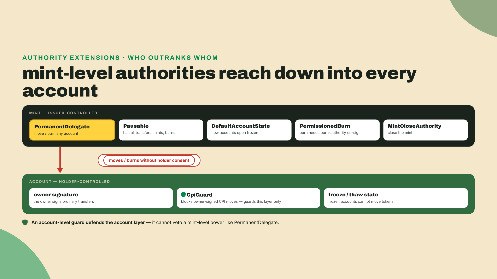
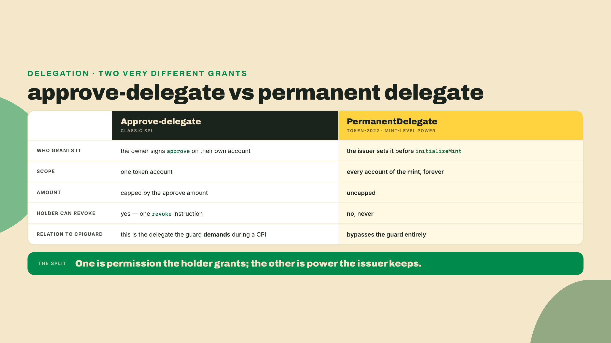
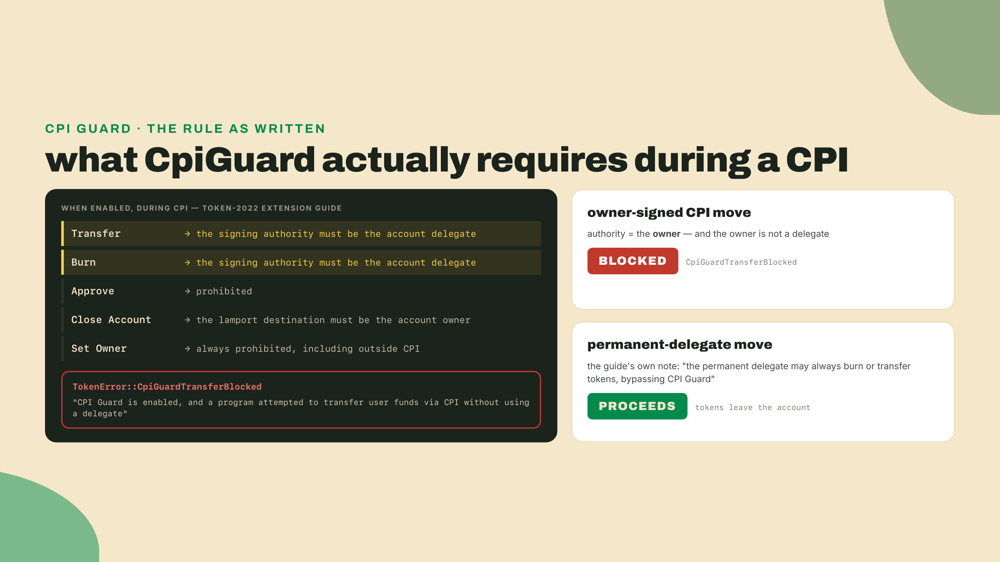
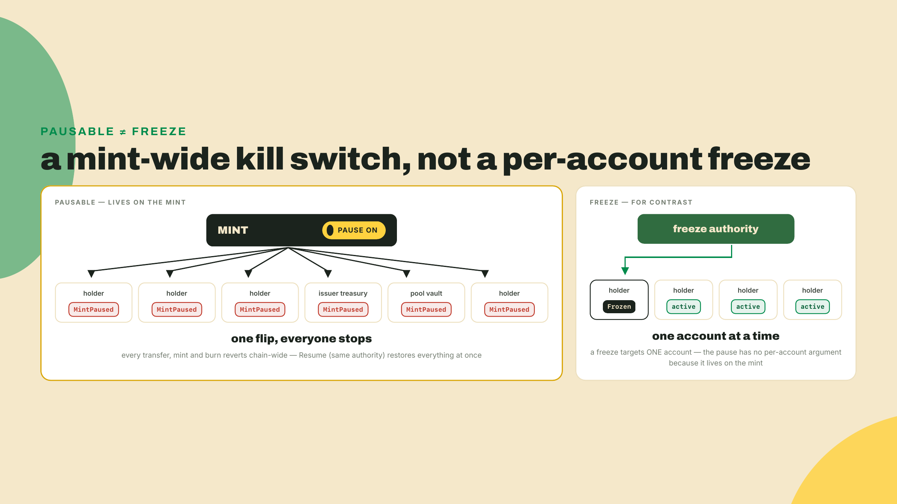
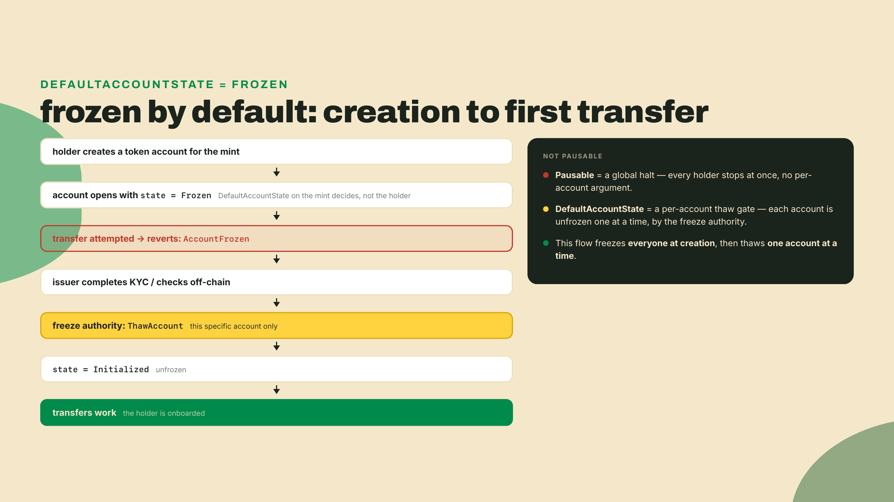
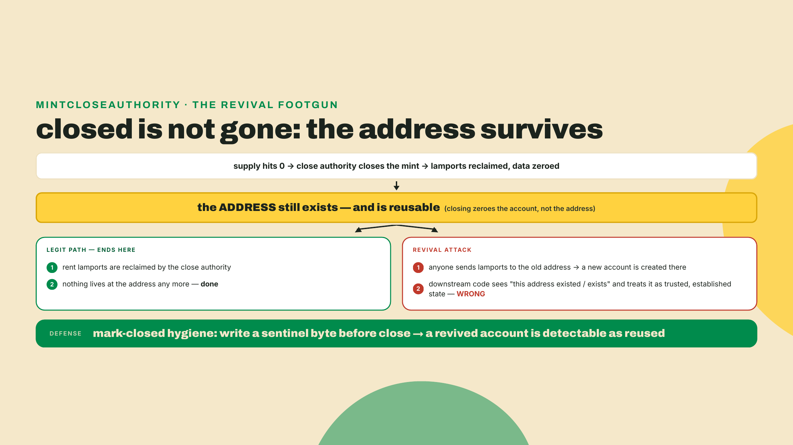
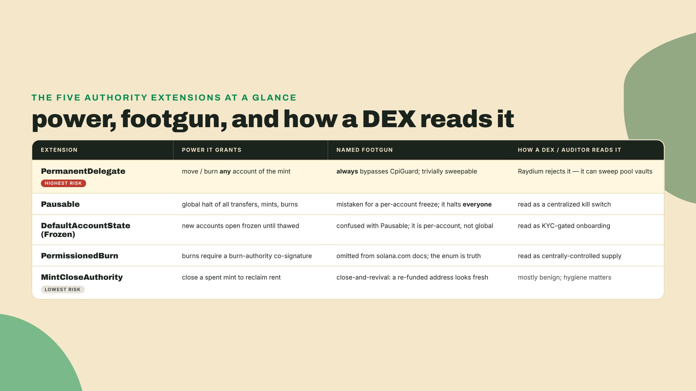
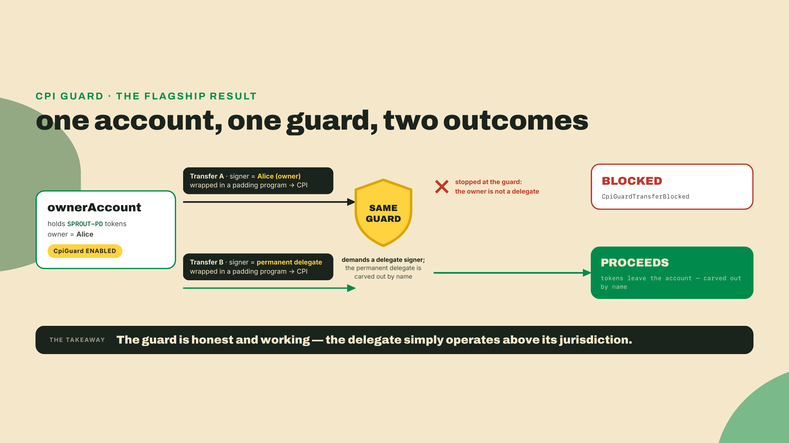

# Authority extensions: who can touch your tokens

## Summary

Last lesson you built SPROUT's economics from raw instructions and harvested its withheld fees into a treasury, so value now flows exactly where you route it. This lesson asks the harder question: who is allowed to move, freeze, or claw back that value in the first place. You will configure five authority-shaped extensions on throwaway mints (PermanentDelegate, Pausable, DefaultAccountState, PermissionedBurn, MintCloseAuthority), and for each one but MintCloseAuthority you will assert that the blocked operation actually blocks; the close authority gets decoded rather than exercised, because closing needs zero supply. One asterisk: PermissionedBurn is newer than the surfnet's bundled program build, so its proof runs as a mainnet simulation plus an optional devnet detour; step 5 explains the seam. Then the flagship demonstration: a mint carrying both a PermanentDelegate and a CpiGuard-enabled account, where you prove what the guard blocks and what the delegate slips through. The fade: every extension gets a worked config, the guard/delegate proof is worked line by line, and the closing challenge is fully solo: rebuild that proof as two transactions, no scaffold.

Now watch a value-protection assumption fail. You enable CpiGuard on a token account, the account-level rail that stops a program from moving your funds behind your back through a CPI. You are, reasonably, convinced it is sealed. Then a single instruction empties it anyway, invoked through the mint's PermanentDelegate, which CpiGuard is powerless to stop. Some authorities sit *above* the account holder.

Before any theory, go look at one of these authorities on a token you have almost certainly held. PYUSD, PayPal and Paxos's stablecoin, carries a permanent delegate on its mint right now. You have `solana` from the earlier setup; if you skipped it, install the Agave tools (solana-cli 3.1.10, checked 2026-08-22):

```bash
sh -c "$(curl -sSfL https://release.anza.xyz/stable/install)"
```

Then read PYUSD's mint straight off mainnet:

```bash
solana account 2b1kV6DkPAnxd5ixfnxCpjxmKwqjjaYmCZfHsFu24GXo --url mainnet-beta
```

What comes back is a hex dump, not a friendly listing, and the tell is on the header line: `Length: 866 (0x362) bytes` (checked 2026-08-22). A classic SPL mint is 82 bytes. Everything past that is TLV, and inside it sit a real `permanentDelegate` entry and a real `mintCloseAuthority`. If you want them named rather than counted, point your own `decode-mint` inspector at the same address; naming those entries is the job you built it for. The authorities you are about to configure on throwaway mints are the exact ones a regulated issuer reaches for on a token holding hundreds of millions of dollars. Keep that in mind. This is the compliance surface of the most institutional token on the chain, not a toy feature set.

## The authorities that sit above the account holder

Start with the mental model, because it is the thing most tutorials never draw. A token account has an owner, and your instinct says the owner is sovereign over that account. For plain SPL, that instinct is roughly right. Token-2022 breaks it on purpose. Several extensions install authorities at the *mint* level, and a mint-level authority acts on accounts the holder never consented to hand over. The account owner did not sign the mint's configuration. They opted into holding the token, and holding the token meant inheriting whatever powers the issuer baked into the mint. That asymmetry is the whole subject of this lesson.



One operational fact before the catalog, because it shapes every issuance decision you will make with these tools. All five of these extensions are pre-initialization extensions: their config instruction must run after the mint account is created and before `initializeMint`, on an account already sized for the TLV entry. You cannot bolt an authority onto a mint that is already live. There is no "add a permanent delegate later, once compliance asks for one." The authority set is decided the day the mint is born, under uncertainty, and you live with it for the token's whole life. Issuers who skip this analysis do not get a second pass at it.

### PermanentDelegate, and the guard it always defeats

A **permanent delegate** is a single address, set once on the mint, that may sign `Transfer` and `Burn` for *any* account of that mint. Not an account the holder delegated to it. Any account. It is the clawback primitive: an issuer who needs to freeze-and-seize for a court order, reverse a mistaken mint, or drain a compromised account reaches for exactly this. PYUSD carries one. And it is the sharpest authority in the whole extension catalog, because it makes every holder account trivially sweepable by whoever holds the delegate key.

Do not confuse it with the delegate you already know from classic SPL. A regular delegate is holder-granted: the owner signs an `approve` on their own account, caps it at an amount, and can `revoke` it whenever they like. Its scope is one account, its budget is finite, and it exists only as long as the owner tolerates it. The permanent delegate inverts every one of those properties. The issuer sets it at mint creation, no holder ever signs anything, there is no amount cap, there is no revoke available to the holder, and its scope is every account of the mint that will ever exist. Same word, different species. One is a permission the holder extends. The other is a power the holder inherits by choosing to hold the token.



Now the reveal, and this is the beat worth slowing down for. You would think CpiGuard stops this. CpiGuard is the account-level extension that a holder turns on to say "no program may move funds out of my account through a cross-program invocation without my direct top-level signature." It exists precisely to kill the delegate-and-close tricks that malicious programs pull. So a careful holder enables CpiGuard and assumes a permanent-delegate sweep is now blocked like any other sneaky CPI move.

It is not. And here the question is worth deriving rather than asserting, so read what the guard actually promises. The extension's own specification does not say "no funds leave during a CPI." It states a rule about *who must be signing*:



Read the rule and the answer falls out. The guard does not ask "is this a CPI move I dislike." It asks "is the signer a delegate." That inverts the naive reading: the one authority the guard refuses during a CPI is the *owner*, because an owner signature is exactly what a malicious program harvests when it gets you to sign an opaque instruction. Delegation is visible and bounded, so the guard insists on it. The owner's own blanket authority is the thing being socially engineered, so the guard revokes it inside a CPI.

Now put a permanent delegate against that rule and the outcome is overdetermined from both directions. Structurally, the permanent delegate is not the owner, so the clause that blocks the owner never applies to it. And the Token-2022 extension guide closes the door explicitly rather than leaving it to inference: if a mint carries the permanent delegate extension, that delegate may always burn or transfer tokens, bypassing CPI Guard. The guard defends the account layer honestly and completely. The permanent delegate operates one layer up, where the guard has no jurisdiction. That is the boundary of what an account-level defense can promise, not a bug in CpiGuard.

This is why the phrasing matters and why "PermanentDelegate always bypasses CpiGuard" is not a slogan but a documented, structural fact. There is no configuration of CpiGuard that changes it, because the guard's rule is about delegation and the permanent delegate is carved out by name.

Raydium is blunt about it. Its Token-2022 support policy rejects PermanentDelegate, and the stated reason is: a holder of the delegate can sweep any token account, including the pool vault. (Read the pool program, not just the docs page, and the rejection has a door in it: the check is skipped for classic SPL mints, for a short hardcoded `MINT_WHITELIST`, and for mints with an initialized mint-association account. The real policy is "none except the ones we vetted by hand.") That one sentence is the whole reason a handful of compliance stablecoins get onto that hand-vetted list by name while everyone else carrying the same extension is refused. Note which noun does the work: the TOKEN is whitelisted, one address at a time. The compliance-shaped EXTENSION is refused as hard as any other power, which is a distinction m05-l2 and the capstone both come back to. If your token can have its liquidity swept by a single key, an automated market maker that custodies liquidity in a vault account cannot safely list it. Choosing PermanentDelegate is choosing which venues will ever touch your token.

And yet PYUSD ships one anyway, which tells you the trade is deliberate, not careless. PayPal and Paxos chose a compliance-shaped extension set on purpose, and by 2025-05-29 the token held $215.9M across just 20.4k token accounts (Helius, "Solana's stablecoin landscape", 2025-05-29; Solana circulating supply, not the multi-chain total; that mint's `supply` field read 688,176,370,728,435 base units at 6 decimals on 2026-08-22). That ratio is the tell of an institutional instrument: enormous value, few holders, an issuer that needs the legal ability to freeze-and-seize on demand. A permanent delegate is a liability to a DEX and an asset to a regulated issuer answering to a compliance department, and both readings are correct at once. The extension is a knob that points your token at one kind of home and away from another. When you set it, you are not adding a feature, you are picking a side of the ecosystem to be legible to.

### Pausable: one switch halts the entire mint

**Pausable** installs a global halt. When the pause authority flips it, every transfer, mint, and burn for that mint reverts at once, chain-wide, until someone resumes. The footgun here is a category error: developers reach for Pausable expecting a per-account freeze, a way to quarantine one bad holder. It is not that. It is a kill switch for the whole token. Flip it and you have frozen every holder simultaneously, including your own liquidity, your own treasury, every honest user mid-transaction. In the processor, a paused mint makes the burn and transfer paths return `MintPaused` unconditionally. There is no "pause account X" argument, because the pause lives on the mint, not the account.



Use it for what it is: an emergency brake for the entire token, an incident-response tool, a way to stop the bleeding during an exploit. Never as targeted enforcement. If you need to stop one account, that is a freeze, which is the account-level state DefaultAccountState governs. Reach for the account tool for an account problem.

The switch is symmetric, which is its own operational burden. The same pause authority resumes the mint with a matching resume instruction, and until it does, nothing moves for anyone. That makes custody of the pause key an incident-response question, not a convenience. A leaked pause authority is a denial-of-service key against your entire token, and a pause authority sitting on one engineer's laptop is a single point of failure for every holder's liquidity. If you ship Pausable, put the key behind a multisig, and rehearse the unpause path before the day you need the pause. An emergency brake nobody can release is worse than no brake.

### DefaultAccountState: frozen-by-default onboarding

**DefaultAccountState** set to `Frozen` is the cleanest primitive for a specific compliance shape: every new account opens frozen and stays frozen until a freeze authority thaws it. This is the "no holder transacts until KYC clears" pattern, and it is genuinely elegant, because it inverts the default. Normally an account is usable the instant it exists and you have to catch bad actors after the fact. With DefaultAccountState(Frozen), the account is inert at birth and a holder becomes active only through a deliberate thaw. Onboarding is opt-in by the issuer, not opt-out.



The contrast with Pausable is the thing to lock in, because a quiz will absolutely try to swap them on you. Pausable is a global halt you flip for the whole mint. DefaultAccountState(Frozen) is a per-account gate you clear one holder at a time with a thaw. One is a kill switch. The other is a turnstile. They feel adjacent and they are completely different tools.

One more degree of freedom: the default is not forever. The freeze authority can update the mint's default state later, so an issuer can launch gated and relax to open onboarding once the compliance picture clears, without touching a single existing account. Accounts keep whatever state they already have; only accounts created after the update inherit the new default. Launch strict, loosen deliberately. That is the migration path most compliance teams actually want, and it is the one authority in this lesson whose posture can soften over the token's life instead of being frozen at birth.

### PermissionedBurn: the extension the docs forgot

**PermissionedBurn** makes every burn require the burn authority's co-signature. A standard burn, where the holder torches their own tokens, stops working the moment this extension is present. The processor rejects a standard burn against a mint carrying PermissionedBurn with `InvalidInstruction`, and forces you down the permissioned path where an extra signer, the burn authority, must sign alongside. Issuers use it when destruction of supply must be authorized centrally: think redemption flows where only the issuer may retire tokens.

The shape this serves is redemption accounting. A holder off-ramps by sending tokens to the issuer's custody account, fiat goes out a bank rail, and then the issuer, and only the issuer, retires the supply with a permissioned burn from custody. On-chain supply stays an honest mirror of off-chain liabilities because no one else can shrink it: no third party burns unilaterally, and no holder can quietly deflate the float by torching tokens the issuer's books still count as outstanding. For a token whose supply number is an audited claim, that co-signature is the difference between a ledger and a suggestion.

Here is the trap, and it is a documentation trap, not a code trap. In m01-l4 you already met the fact that solana.com's extension catalog omits PermissionedBurn entirely, while the source `ExtensionType` enum lists it as one of the 29 production variants. If you go looking for this extension in the official docs and conclude it does not exist, you have trusted a page over the code. The enum is the truth. The docs are somebody's snapshot of the truth, aging quietly. Every time you build against Token-2022, the enum in the pinned source settles what is real, and a missing doc entry settles nothing. This is the second time this course has caught the official catalog lagging the code, and it will not be the last.

### MintCloseAuthority: reclaiming rent, and the revival trap

**MintCloseAuthority** lets a designated authority close a mint once its supply is zero, reclaiming the rent lamports that were locked to keep the account alive. PYUSD carries one. It is mundane housekeeping most of the time: you spun up a mint, it served its purpose, you close it and get the rent back.

The footgun is subtle and it bites in production. When you close an account, its lamports drain and its data is zeroed, but the *address* does not vanish. Anyone can send lamports back to that address and recreate an account there. A closed-then-revived account can be mistaken for fresh, trusted state by code that assumes "this address existed before, so it is legitimate." The defense is mark-closed hygiene: write a sentinel byte into the account before closing so a revived account is recognizable as a corpse, not a newborn. If your system reads an account's mere existence as proof of provenance, a revival attack turns that assumption into a hole.



### The trade-off, named honestly

Every one of these authorities buys you the same currency: control. Freeze, pause, claw back, gate onboarding, authorize destruction. And every one of them spends the same currency in return: decentralization, which an exchange, an auditor, or a market maker will read as counterparty risk. There is no free authority. A DEX integration engineer scanning your mint's TLV entries is reading a risk profile, and each authority extension is a line item on it. PermanentDelegate is the reddest line, which is exactly why Raydium refuses it and why compliance stablecoins that carry it get whitelisted into specific venues rather than listed everywhere.

If you want the decision procedure rather than the vibe, you already built it: these five slot straight into the conflict matrix from m01-l4. The question set is short. Who must be able to act against a holder, under what legal trigger, and which venues does the token need to live in? A payroll stablecoin answering to a regulator lands on PermanentDelegate plus DefaultAccountState(Frozen) and eats the listing restrictions, because its holders are counterparties before they are users. A community token that needs Raydium liquidity cannot carry a permanent delegate at all, whatever the lawyers would prefer. Write the venue list first. Then pick only the authorities that list allows, and document the ones you deliberately left off, because "we could have taken this power and chose not to" is itself a trust signal auditors read.



That is the design lens. You are not choosing features, you are choosing a trust posture and, with it, the set of places your token can live. Now build them.

## Lab: configure the authorities, then break the guard

Seven steps, running against a local surfnet so you have the live Token-2022 program without spending real lamports. Steps 1 to 5 are worked configs you run as shown. Step 6, the flagship, is worked in full, and the challenge makes you rebuild it without the scaffold. Step 7 wires everything into the gate that later lessons assume runs green. Budget about forty-five minutes, most of it in step 6.

Surfpool gives you a simnet that lazily pulls mainnet accounts as you touch them, with the SPL programs loaded and ready. One caveat worth knowing before it bites you in step 5: the SPL programs a surfnet serves are surfpool's own bundled builds, not byte-for-byte copies of what is deployed on mainnet, so a very new instruction can be live on mainnet and absent from your simnet. Install it if you have not (I am on surfpool 1.2.1, checked 2026-08-22):

```bash
brew install txtx/taps/surfpool
```

Start a surfnet in one terminal and leave it running (same `--no-tui --no-studio` flags as last lesson, so the TUI does not take over the terminal you are leaving open):

```bash
surfpool start --no-tui --no-studio
```

One workspace note before the install, because the layout changes here and stays changed for the rest of the course. Shared dependencies now live at the workspace ROOT, the folder that contains `labs/`. Run the installs below from that root (if the root has no `package.json` yet: `npm init -y && npm pkg set type=module` first). Lesson code keeps living in per-lesson folders like `labs/m02-l2/`, and every run command from here on is given from the root. The self-contained `labs/m02-l1` package from last lesson stays exactly as it is: relative imports such as `../m01-l2/decode-mint` resolve by file location, not by where you run from, so nothing there breaks.

The pins are the same trio as m02-l1, for the reasons argued at length there (kit 7.1.1 because that is the major this workspace's clients peer against; `@solana-program/token-2022@0.15.0` and `@solana-program/system@0.13.0` are the current minors that peer kit ^7, and the next minors up jump to ^8 and hard-fail `ERESOLVE`). The 0.15.0 token client ships every builder this lesson needs (`getInitializePermanentDelegateInstruction`, `getInitializePausableConfigInstruction`, `getInitializePermissionedBurnInstruction`, and the rest). If npm complains about an unresolvable peer on `@solana/kit`, that is this exact seam: pin all three exactly rather than fighting it.

```bash
npm install @solana/kit@7.1.1 @solana-program/token-2022@0.15.0 @solana-program/system@0.13.0
npm install -D tsx@4.23.12 typescript@5.9.3
```

1. **Set up a helper that creates and initializes a Token-2022 mint with a chosen set of extensions.** Create `mkdir -p labs/m02-l2` and start the lesson file at exactly `labs/m02-l2/verify-authorities.ts`; every snippet in steps 1 through 6 appends to this one file, and step 7 turns it into the gate a later lesson re-runs by that exact path. You built the mint-creation scaffolding in the m02-l1 economics lab (allocate the account at the right size, run the pre-init extension instructions, then `initializeMint`). Reuse it. The only new thing per authority is which pre-init instruction you prepend. Here is the shape, with the plumbing your economics lab already established folded into `createExtendedMint`, plus the two signers every later step leans on: `payer`, funded by an airdrop the moment the file starts, and `mintAuthority`, which never needs lamports because `payer` fee-pays everything:

   ```typescript
   import {
     airdropFactory,
     appendTransactionMessageInstructions,
     assertIsTransactionWithBlockhashLifetime,
     createKeyPairSignerFromBytes,
     createSolanaRpc,
     createSolanaRpcSubscriptions,
     createTransactionMessage,
     generateKeyPairSigner,
     lamports,
     pipe,
     sendAndConfirmTransactionFactory,
     setTransactionMessageFeePayerSigner,
     setTransactionMessageLifetimeUsingBlockhash,
     signTransactionMessageWithSigners,
     type Instruction,
     type KeyPairSigner,
   } from '@solana/kit';
   import { readFileSync } from 'node:fs';
   import {
     getInitializeMintInstruction,
     getMintSize,
     TOKEN_2022_PROGRAM_ADDRESS,
   } from '@solana-program/token-2022';
   import { getCreateAccountInstruction } from '@solana-program/system';

   // Cluster-agnostic on purpose: step 5 will want to re-run this whole file
   // against devnet, so the endpoints yield to env vars.
   const rpc = createSolanaRpc(process.env.RPC_URL ?? 'http://127.0.0.1:8899');
   const rpcSubscriptions = createSolanaRpcSubscriptions(process.env.RPC_WS_URL ?? 'ws://127.0.0.1:8900');
   const send = sendAndConfirmTransactionFactory({ rpc, rpcSubscriptions });
   const airdrop = airdropFactory({ rpc, rpcSubscriptions });

   // The two signers the whole lab leans on. `payer` fee-pays and funds
   // everything; `mintAuthority` only ever signs, so it needs no lamports.
   //
   // The payer is env-overridable for one concrete reason. A throwaway signer
   // is perfect against a surfnet, which airdrops on demand, and useless
   // against devnet's faucet, which rate-limits: a funded address dies with
   // the process, so "top it up and retry" would fund a key the next run has
   // never heard of. Point PAYER_KEY at a file (`solana-keygen new -o
   // payer.json`), fund THAT address once, and step 5's devnet re-run works.
   const payer = process.env.PAYER_KEY
     ? await createKeyPairSignerFromBytes(
         new Uint8Array(JSON.parse(readFileSync(process.env.PAYER_KEY, 'utf8'))),
       )
     : await generateKeyPairSigner();
   const mintAuthority = await generateKeyPairSigner();
   console.log(`payer: ${payer.address}`);
   if (!process.env.PAYER_KEY) {
     await airdrop({
       recipientAddress: payer.address,
       lamports: lamports(5_000_000_000n),
       commitment: 'confirmed',
     });
   }

   async function submit(payer: KeyPairSigner, instructions: Instruction[]): Promise<void> {
     const { value: blockhash } = await rpc.getLatestBlockhash().send();
     const message = pipe(
       createTransactionMessage({ version: 0 }),
       (m) => setTransactionMessageFeePayerSigner(payer, m),
       (m) => setTransactionMessageLifetimeUsingBlockhash(blockhash, m),
       (m) => appendTransactionMessageInstructions(instructions, m),
     );
     const signed = await signTransactionMessageWithSigners(message);
     // kit needs this narrowing: the signed tx's lifetime is a union until you assert it.
     assertIsTransactionWithBlockhashLifetime(signed);
     await send(signed, { commitment: 'confirmed' });
   }

   // preInit: extension instructions that must run BEFORE initializeMint.
   async function createExtendedMint(
     payer: KeyPairSigner,
     mintAuthority: KeyPairSigner,
     decimals: number,
     sizeExtensions: Parameters<typeof getMintSize>[0],
     preInit: (mint: KeyPairSigner) => Instruction[],
   ): Promise<KeyPairSigner> {
     const mint = await generateKeyPairSigner();
     const space = BigInt(getMintSize(sizeExtensions));
     const rent = await rpc.getMinimumBalanceForRentExemption(space).send();

     const create = getCreateAccountInstruction({
       payer,
       newAccount: mint,
       lamports: rent,
       space,
       programAddress: TOKEN_2022_PROGRAM_ADDRESS,
     });
     const initMint = getInitializeMintInstruction({
       mint: mint.address,
       decimals,
       mintAuthority: mintAuthority.address,
       freezeAuthority: mintAuthority.address,
     });

     await submit(payer, [create, ...preInit(mint), initMint]);
     return mint;
   }
   ```

   Checkpoint: `createExtendedMint` returns a signer whose `.address` is a live mint on your surfnet. Nothing asserts yet; the next steps feed it real extension instructions.

2. **PermanentDelegate.** Prepend one instruction that names the delegate:

   ```typescript
   import { getInitializePermanentDelegateInstruction } from '@solana-program/token-2022';
   import { extension } from '@solana-program/token-2022';

   const delegate = await generateKeyPairSigner();
   const pdMint = await createExtendedMint(
     payer,
     mintAuthority,
     6,
     [extension('PermanentDelegate', { delegate: delegate.address })],
     (mint) => [
       getInitializePermanentDelegateInstruction({ mint: mint.address, delegate: delegate.address }),
     ],
   );
   ```

   Checkpoint: `decode-mint pdMint.address` (your inspector from m01-l2) lists a `PermanentDelegate` TLV whose `delegate` equals `delegate.address`.

3. **Pausable.** Same pattern, plus the halt itself so you can watch a transfer revert:

   ```typescript
   import {
     getInitializePausableConfigInstruction,
     getPauseInstruction,
   } from '@solana-program/token-2022';

   const pauseAuthority = mintAuthority;
   const pausableMint = await createExtendedMint(
     payer,
     mintAuthority,
     6,
     [extension('PausableConfig', { authority: pauseAuthority.address, paused: false })],
     (mint) => [
       getInitializePausableConfigInstruction({ mint: mint.address, authority: pauseAuthority.address }),
     ],
   );

   // Flip the global halt.
   await submit(payer, [getPauseInstruction({ mint: pausableMint.address, authority: pauseAuthority })]);
   ```

   Checkpoint: after the pause, any `transferChecked` against `pausableMint` reverts with `MintPaused`, custom program error 0x43 (decimal 67). Assert the revert, not a success, and note that it fires for *every* account of the mint, not one.

4. **DefaultAccountState(Frozen).** The state argument is the `AccountState` enum:

   ```typescript
   import {
     getInitializeDefaultAccountStateInstruction,
     AccountState,
   } from '@solana-program/token-2022';

   const frozenDefaultMint = await createExtendedMint(
     payer,
     mintAuthority,
     6,
     [extension('DefaultAccountState', { state: AccountState.Frozen })],
     (mint) => [
       getInitializeDefaultAccountStateInstruction({ mint: mint.address, state: AccountState.Frozen }),
     ],
   );
   ```

   Checkpoint: create a fresh token account for this mint and try to send from it. It reverts with `AccountFrozen`. Thaw that one account with `getThawAccountInstruction` signed by the freeze authority, retry, and the transfer works. You just onboarded one holder without touching any other.

5. **PermissionedBurn and MintCloseAuthority.** Configure both — on separate mints, and with the newer one behind a probe, because this is the step where the lab-top caveat bites:

   ```typescript
   import {
     getInitializePermissionedBurnInstruction,
     getInitializeMintCloseAuthorityInstruction,
     getBurnCheckedInstruction,
     getPermissionedBurnCheckedInstruction,
   } from '@solana-program/token-2022';

   const burnAuthority = await generateKeyPairSigner();

   // MintCloseAuthority on its own mint, unconditionally: every cluster's
   // Token-2022 build knows this extension, so step 7's TLV assert always
   // has a live mint to decode.
   const closableMint = await createExtendedMint(
     payer,
     mintAuthority,
     6,
     [extension('MintCloseAuthority', { closeAuthority: mintAuthority.address })],
     (mint) => [
       getInitializeMintCloseAuthorityInstruction({
         mint: mint.address,
         closeAuthority: mintAuthority.address,
       }),
     ],
   );

   // PermissionedBurn behind a probe: the newest extension in the catalog,
   // and this cluster's bundled build may predate it. On a build that does,
   // the extension initializer itself throws before the mint exists — catch
   // it, say so, and leave the mint null so step 7 can branch on it.
   let permissionedMint: KeyPairSigner | null = null;
   try {
     permissionedMint = await createExtendedMint(
       payer,
       mintAuthority,
       6,
       [extension('PermissionedBurn', { authority: burnAuthority.address })],
       (mint) => [
         getInitializePermissionedBurnInstruction({
           mint: mint.address,
           authority: burnAuthority.address,
         }),
       ],
     );
   } catch {
     console.log(
       'SKIPPED: PermissionedBurn (simnet build predates the extension; prove it on devnet with this step\'s re-run)',
     );
   }
   ```

   Checkpoint, in two halves. On any cluster: `closableMint` is live and `decode-mint closableMint.address` lists its `MintCloseAuthority` TLV. On a cluster whose Token-2022 build knows PermissionedBurn: `permissionedMint` is live too, a standard `burnChecked` against it reverts with `Error: Invalid instruction`, custom program error 0xc (decimal 12), and the permissioned burn, `getPermissionedBurnCheckedInstruction` with `burnAuthority` co-signing, succeeds. Standard burn is dead the moment PermissionedBurn is present.

   Here is why the probe sits in the worked code instead of being left to you. PermissionedBurn is the newest extension in the catalog, and on surfpool 1.2.1 the bundled Token-2022 build does not know it yet: `getInitializePermissionedBurnInstruction` comes back `Error: Invalid instruction`, 0xc, from the extension initializer itself, before the mint is ever created. That is your simnet, not your code — and since this lab is one file of top-level awaits run in order, an uncaught throw here would kill steps 6 and 7 on every surfnet run. The deployed mainnet program does support it, and you can prove that without spending a lamport, because a simulation executes against the real program: build the same instruction list and send it to `simulateTransaction` on mainnet with `sigVerify: false` and `replaceRecentBlockhash: true`, and the logs come back `Instruction: PermissionedBurnExtension` / `PermissionedBurnInstruction::Initialize` / success. To watch the full checkpoint actually run, the dead standard burn and the live co-signed burn both, re-run the whole file against devnet, the cluster where you can write with the real program — the endpoints and the payer went env-overridable in step 1 for exactly this moment. Make a payer that survives a retry first, because devnet's faucet rate-limits and step 1's throwaway signer would strand every lamport you fed it:

   ```bash
   solana-keygen new --no-bip39-passphrase -o labs/m02-l2/payer.json
   solana airdrop 2 "$(solana-keygen pubkey labs/m02-l2/payer.json)" --url devnet
   # rate-limited? paste that same address into faucet.solana.com, then retry
   PAYER_KEY=labs/m02-l2/payer.json \
     RPC_URL=https://api.devnet.solana.com RPC_WS_URL=wss://api.devnet.solana.com \
     npx tsx labs/m02-l2/verify-authorities.ts
   ``` Everything else in this lab runs on the surfnet as written; Pausable, checked on the same build, is fine.

6. **The flagship: guard versus delegate.** This is the flagship proof. You have a mint carrying a PermanentDelegate and a holder account with CpiGuard enabled. CpiGuard only acts *inside a CPI*, so both moves route through the `spl-instruction-padding` program (`iXpADd6AW1k5FaaXum5qHbSqyd7TtoN6AD7suVa83MF`), which wraps an inner instruction and re-invokes it via CPI.

   First, stand up the accounts the proof acts on, because none of the earlier steps created them: an owner, their token account holding some of `pdMint`, and a destination. `payer` funds and fee-pays everything, so neither `owner` nor `delegate` ever needs a lamport of its own, and a fee-payer failure can never masquerade as a guard verdict:

   ```typescript
   import {
     findAssociatedTokenPda,
     getCreateAssociatedTokenIdempotentInstruction,
     getMintToCheckedInstruction,
   } from '@solana-program/token-2022';

   const owner = await generateKeyPairSigner();
   const destinationOwner = await generateKeyPairSigner();

   const [ownerAccount] = await findAssociatedTokenPda({
     mint: pdMint.address,
     owner: owner.address,
     tokenProgram: TOKEN_2022_PROGRAM_ADDRESS,
   });
   const [destination] = await findAssociatedTokenPda({
     mint: pdMint.address,
     owner: destinationOwner.address,
     tokenProgram: TOKEN_2022_PROGRAM_ADDRESS,
   });

   await submit(payer, [
     getCreateAssociatedTokenIdempotentInstruction({
       payer,
       ata: ownerAccount,
       mint: pdMint.address,
       owner: owner.address,
     }),
     getCreateAssociatedTokenIdempotentInstruction({
       payer,
       ata: destination,
       mint: pdMint.address,
       owner: destinationOwner.address,
     }),
     getMintToCheckedInstruction({
       mint: pdMint.address,
       token: ownerAccount,
       mintAuthority,
       amount: 100n,
       decimals: 6,
     }),
   ]);
   ```

   Now the proof itself:

   ```typescript
   import {
     ExtensionType,
     getEnableCpiGuardInstruction,
     getReallocateInstruction,
     getTransferCheckedInstruction,
   } from '@solana-program/token-2022';
   // `Instruction` is already imported at the top of this file (step 1); this
   // is one file, so re-importing the type is a TS2300 duplicate-identifier
   // error even though tsx strips it and runs fine.
   import { type Address, AccountRole } from '@solana/kit';

   const PADDING_PROGRAM =
     'iXpADd6AW1k5FaaXum5qHbSqyd7TtoN6AD7suVa83MF' as Address;

   // Wrap an inner token instruction so the padding program re-invokes it via CPI.
   // Wire format (PadInstruction::Wrap): [1][num_accounts u32 LE][data_len u32 LE][inner data].
   // Accounts: the inner accounts, then the inner program id as a readonly account.
   function wrapForCpi(inner: Instruction): Instruction {
     const innerAccounts = inner.accounts ?? [];
     const innerData = inner.data ?? new Uint8Array();
     const header = new Uint8Array(9);
     header[0] = 1; // Wrap
     new DataView(header.buffer).setUint32(1, innerAccounts.length, true);
     new DataView(header.buffer).setUint32(5, innerData.length, true);
     const data = new Uint8Array(header.length + innerData.length);
     data.set(header, 0);
     data.set(innerData, header.length);
     return {
       programAddress: PADDING_PROGRAM,
       accounts: [
         ...innerAccounts,
         { address: inner.programAddress, role: AccountRole.READONLY },
       ],
       data,
     };
   }

   // ownerAccount holds tokens, owned by `owner`, CpiGuard enabled.
   // pdMint carries the permanent delegate `delegate`.
   // `payer` fee-pays every transaction; kit collects the other signers
   // (owner, delegate) straight off the instructions they are embedded in.
   async function proveGuardVsDelegate(
     payer: KeyPairSigner,
     owner: KeyPairSigner,
     delegate: KeyPairSigner,
     ownerAccount: Address,
     destination: Address,
     pdMint: Address,
   ): Promise<{ ownerBlocked: boolean; delegatePassed: boolean }> {
     // The ATA was created at its minimal size, and an account extension needs
     // its bytes to exist before it can be enabled. So: grow the account with
     // Reallocate naming the extension, THEN flip the guard on. Skip the grow
     // and the enable fails on account size.
     await submit(payer, [
       getReallocateInstruction({
         token: ownerAccount,
         payer,
         owner,
         newExtensionTypes: [ExtensionType.CpiGuard],
       }),
       getEnableCpiGuardInstruction({ token: ownerAccount, owner }),
     ]);

     // Proof leg 1: the owner-signed transfer, wrapped for CPI. Expect it to
     // REVERT with CpiGuardTransferBlocked; ownerBlocked is true only if it did.
     const ownerMove = getTransferCheckedInstruction({
       source: ownerAccount,
       mint: pdMint,
       destination,
       authority: owner, // the owner is NOT a delegate -> the guard's must-be-a-delegate rule blocks this inside CPI
       amount: 1n,
       decimals: 6,
     });
     let ownerBlocked = false;
     try {
       await submit(payer, [wrapForCpi(ownerMove)]);
     } catch {
       ownerBlocked = true;
     }

     // Proof leg 2: the SAME transfer authorized by the permanent delegate,
     // wrapped identically. Expect it to SUCCEED; delegatePassed is true only if it confirmed.
     const delegateMove = getTransferCheckedInstruction({
       source: ownerAccount,
       mint: pdMint,
       destination,
       authority: delegate, // the permanent delegate is carved out by name -> always passes the guard
       amount: 1n,
       decimals: 6,
     });
     let delegatePassed = false;
     try {
       await submit(payer, [wrapForCpi(delegateMove)]);
       delegatePassed = true;
     } catch {
       delegatePassed = false;
     }

     return { ownerBlocked, delegatePassed };
   }
   ```

   Checkpoint, and this is the gate: `ownerBlocked === true` and `delegatePassed === true`. The owner's own CPI transfer is stopped by the guard it enabled, and the permanent delegate's identical transfer walks straight through the same guard. On my run the blocked one came back with custom program error 0x2a (decimal 42), `CpiGuardTransferBlocked`, and the program log `CPI Guard is enabled, and a program attempted to transfer user funds via CPI without using a delegate`, the same string the rule panel above quotes; the delegate's move confirmed. Worth running the control too: send the owner's transfer WITHOUT the padding wrapper and it succeeds, because the guard is inert outside a CPI.



7. **Wire it into the gate.** The five demonstrations already live in one file, `labs/m02-l2/verify-authorities.ts`; now finish it into a gate: create each throwaway mint, decode it with your m01-l2 inspector to assert its extension TLV is actually present, then run the behavioral proofs: the Pausable transfer reverting, the DefaultAccountState freeze-then-thaw, and the guard-versus-delegate pair. The PermissionedBurn proof is conditional, because of the step-5 simnet caveat — and the probe already exists: step 5's worked code leaves `permissionedMint` null on a build that predates the extension and prints the `SKIPPED: PermissionedBurn (simnet build predates the extension; prove it on devnet with this step's re-run)` line for you. Branch on it: when `permissionedMint` is non-null, run the dead-standard-burn and live-co-signed-burn assertions against it; when it is null, the printed skip has already told the truth. A skip that names its reason keeps the gate honest on every cluster this course runs against. This file is the artifact the lesson adds to SPROUT's toolkit, `sprout-mint-authorities`, and it consumes both things you already shipped: the mint-creation plumbing from the economics lab and the `decode-mint` inspector. The assertion tail for the flagship looks like this:

   ```typescript
   const { ownerBlocked, delegatePassed } = await proveGuardVsDelegate(
     payer, owner, delegate, ownerAccount, destination, pdMint.address,
   );
   if (!ownerBlocked) throw new Error('CpiGuard failed to block the owner-signed CPI move');
   if (!delegatePassed) throw new Error('permanent delegate did not bypass CpiGuard');
   console.log('authority gate: all assertions hold');
   ```

   Run it:

   ```bash
   npx tsx labs/m02-l2/verify-authorities.ts
   ```

   Checkpoint, and this is the lesson's gate restated as a script: every authority extension is present on its mint, the PermanentDelegate move succeeds through CpiGuard while the direct owner CPI move is blocked, and the Pausable halt makes a transfer revert. When that output is green, the artifact is on the shelf and the lab is done. Keep the file exactly at that path with exactly those assertions; a later lesson calls it by name.

## Challenge

No new scaffold. Given a mint that carries a PermanentDelegate and an account with CpiGuard enabled, write the two transactions, from scratch, that prove which operation the guard blocks and which the delegate bypasses. This is the delegate-vs-guard proof, solo.

Your acceptance bar is exactly the lab's gate, but you build the whole thing yourself: the guard must block the delegate-less, owner-signed CPI move, the permanent-delegate move must succeed against that same guarded account, and your assertions must hold both ways. Two things separate a passing solo from a lucky one. First, both moves must be wrapped so they execute *inside a CPI*, because CpiGuard is inert on a top-level instruction; if you send a bare owner transfer and it succeeds, you have not tested the guard, you have bypassed the condition. Second, the only difference between your two transactions is the signing authority. Same source account, same destination, same amount, same decimals, same wrapper. If anything else differs, you have not isolated the variable, and your proof proves nothing. When the owner-signed CPI move reverts with `CpiGuardTransferBlocked` and the delegate-signed move confirms, and you can point at the one-line reason in the processor's condition, you own this.

Then stress-test yourself against the trap this lesson is built to disarm: if you catch yourself thinking "but I could tighten CpiGuard to also block the delegate," re-read the rule. There is no such setting. CpiGuard's only lever is `lockCpi`, on or off, and what it enforces when on is that the signing authority during a CPI must be a delegate. The extension guide then carves the permanent delegate out by name. Tightening is not on the menu.

Did something here return an outcome mine did not, or did your forked program refuse an init? Flag it in the course feedback channel with the extension name and the exact error, ideally with the failing instruction pasted in. A reader who catches another extension initializer the simnet build does not yet know, the way PermissionedBurn behaves in step 5, is doing real reconnaissance the rest of the cohort benefits from, and it is exactly the "verify against the live program, do not trust the tutorial" habit this course keeps drilling.

You have now handled the MINT side of authority: the powers an issuer bakes into the token itself, sitting above every holder. That leaves the other half of the story. Next lesson moves down to the account side and asks the inverted question: what can a holder's own account *refuse*, even when the mint says yes? CpiGuard was a preview of that layer. You will meet the rest of the holder-protection extensions, the guards a holder enables on their own account, plus one deliberate exception that belongs with them anyway, NonTransferable, a mint-side extension whose beneficiary is the credential's integrity rather than the issuer's control, and you will see where the holder's veto ends and the mint's authority begins. When issuers compose these primitives into real compliance rails, freeze-based gating stacked on top of permanent delegates, that is the planned DeFi and RWA Engineering course's territory; here you have built the primitives it composes.
