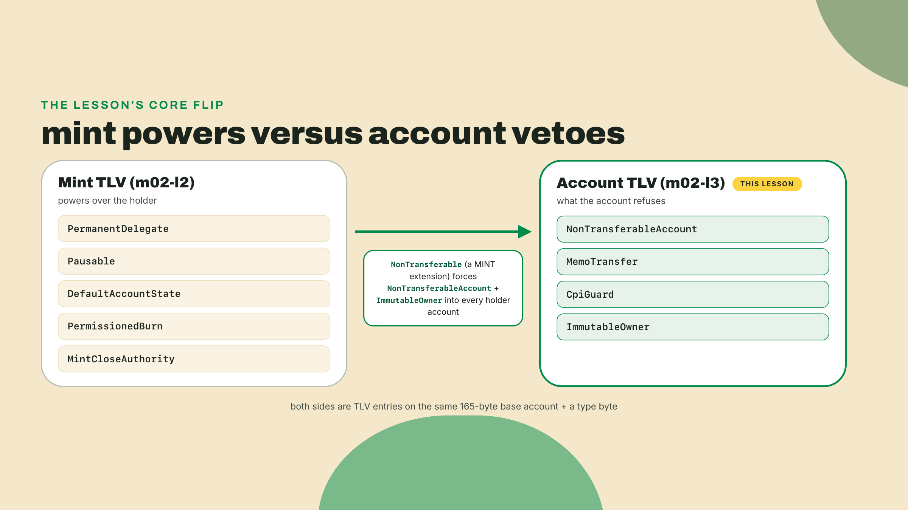
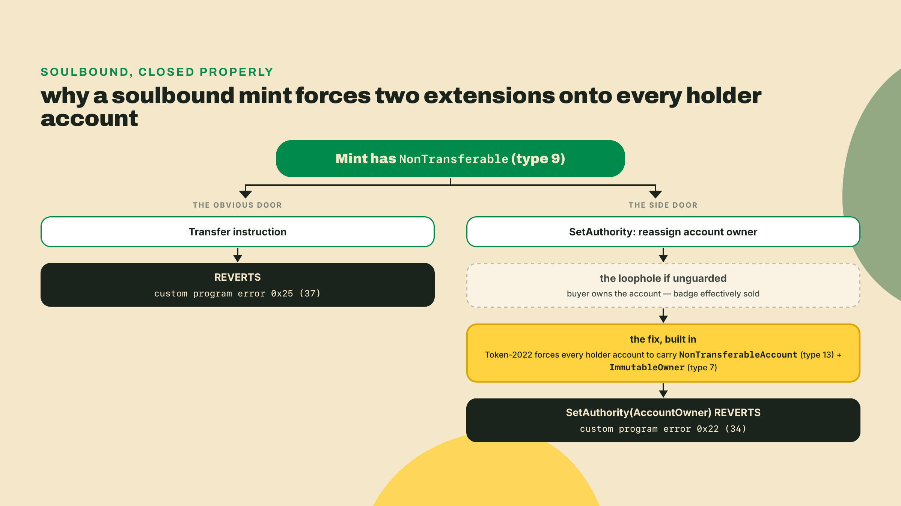
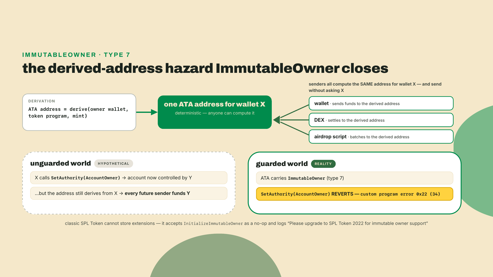
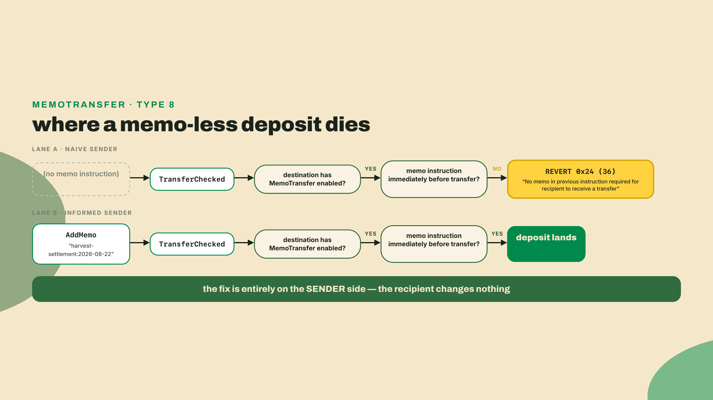
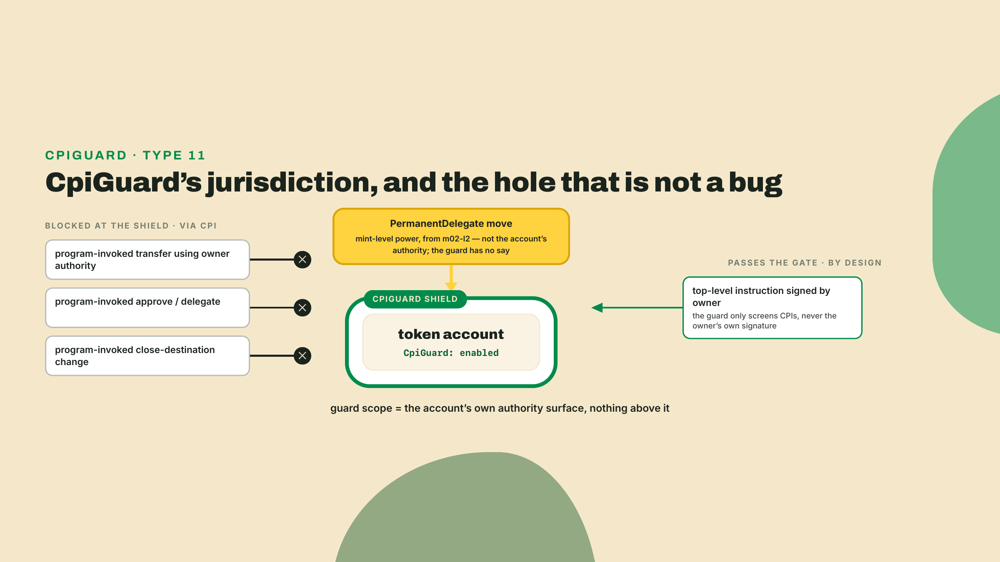
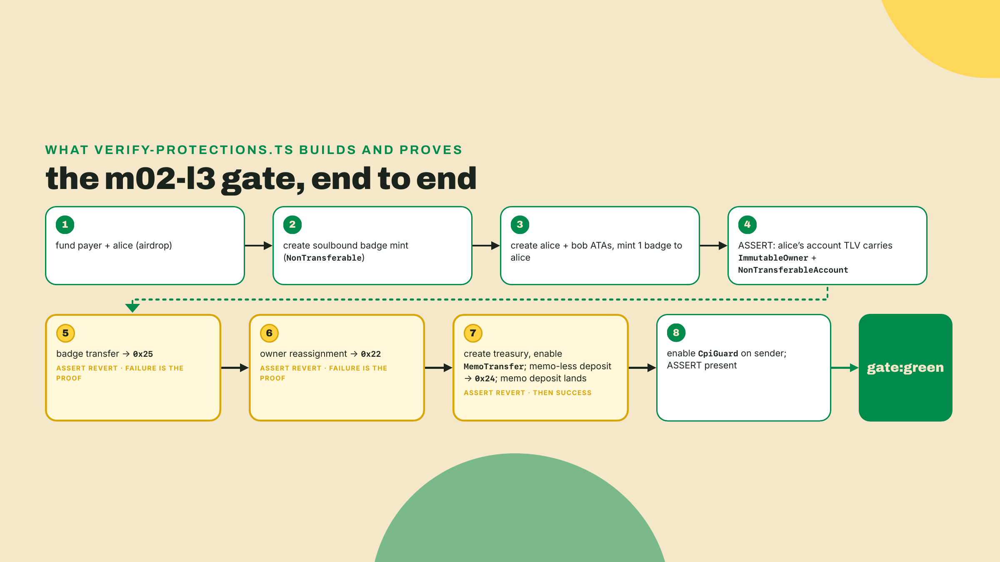
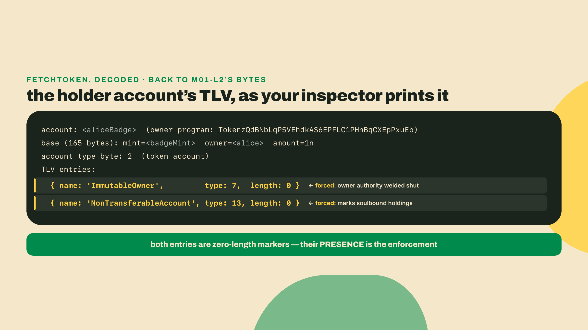

# Holder-protection extensions: what accounts can refuse

## Summary

Last lesson you configured the mint-side authorities, PermanentDelegate, Pausable, DefaultAccountState, PermissionedBurn, MintCloseAuthority, and you watched the permanent delegate walk straight past CpiGuard like the guard was not there. Those were powers the mint holds over the holder. Every one of them said: no matter what your account wants, the mint decides.

Now the mirror image. Some extensions are not powers over you. They are your account's own veto.

Before we talk about any of them, get your bench back to the state we left it in. Start your local simnet and re-run the m02-l2 gate, because this lesson stacks directly on that artifact:

```bash
# surfpool 1.2.1, installed in m02-l1 (brew install txtx/taps/surfpool if you
# skipped it; other OSes: github.com/txtx/surfpool). Checked 2026-08-22.
surfpool start --no-tui --no-studio

# in a second terminal, from your course workspace:
npx tsx labs/m02-l2/verify-authorities.ts
```

If that still prints green (on a simnet, the one named `SKIPPED: PermissionedBurn` line from the gate's cluster probe counts as green), your authority layer is intact and we can build on top of it. If it does not, fix it first; nothing in this lesson makes sense on a broken floor.

While that runs, hold the flip in your head, because it is the whole lesson. A soulbound SPROUT badge that physically cannot be transferred, by anyone, owner included. A treasury account that rejects any deposit arriving without a memo attached. An account whose owner field is welded shut forever. The memo treasury is an account-side guard a holder enables. The welded owner is account-side too, but nobody enables it: every ATA you have ever created already carries ImmutableOwner automatically, and the lesson proves that to you. The first is the deliberate exception in this lesson's taxonomy: NonTransferable is a mint-side extension the issuer sets, filed here anyway because the party it protects is the credential's integrity, not the issuer's control, and it is the holder, not the issuer, whose transfer gets refused. All of them are refusals, and today you will configure four of them and then prove, with reverting transactions, that each one actually refuses.

This lesson develops the account-side protections of Token-2022: NonTransferable, MemoTransfer, CpiGuard (revisited from the other side of the shield), and ImmutableOwner. You will learn why enabling NonTransferable on a mint forces a specific PAIR of extensions onto every holder account, why MemoTransfer quietly taxes every sender who ever transfers to you, and why every ATA you have ever created already carries ImmutableOwner without you asking. In the lab you extend the SPROUT toolkit with a soulbound badge mint and a memo-required treasury, and the gate is not "it works": the gate is that the disallowed operations revert, on purpose, with the exact error codes on the page.

Where you are on the autonomy ramp, stated out loud: in m02-l1 you filled a few TODO gaps inside an otherwise worked build, and in m02-l2 I handed you complete configuration code and you ran it. Today the config is still worked for you, but the two load-bearing assertions are completion problems: I will tell you what to prove and you write the proving line before you see mine. The Challenge at the end is fully solo, no walkthrough, and that is the shape of every lesson from here forward. The training wheels are coming off one bolt at a time, on schedule.

## The account's veto

### Two sides of the same TLV

Here is the cleanest way I know to hold the Token-2022 catalog in your head: every extension answers one of two questions. Who can act on this token even against the holder's will? That is the mint side, last lesson. And: what can this account refuse, even when everyone else says yes? That is the account side, this lesson.

The distinction is physical, not rhetorical. You saw in m01-l2 that a mint and a token account are both a 165-byte base plus a type byte plus a TLV walk. Mint-side extensions live in the mint's TLV; account-side protections live in the holder account's TLV. When your `decode-mint` inspector walks PYUSD it prints mint entries. When you point it at your own ATA later in the lab, you will see account entries. Same bytes, same walk, opposite politics.



One footnote, and a short one since m02-l1 already told the archive story: the account-side protections you are wiring today are 2026-era mechanics the frozen canonical courses never reached. The docs that do exist describe each extension in isolation; what they do not teach is the part that bites, the forced pairings and the integration taxes. So that is where we will spend our time.

### NonTransferable: soulbound by construction

The problem first. Say Overgrowth, the farming co-op whose on-chain economy this course has been building since SPROUT was specified, wants to award SPROUT badges for completing a harvest season: a fungible token, decimals 0, one unit per achievement. The whole point of a badge is that YOU earned it. The moment badges are transferable there is a market, and the moment there is a market, the badge stops meaning "this wallet did the thing" and starts meaning "this wallet paid for proof that some other wallet did the thing." For credentials, transferability is not a feature being removed. It is the attack.

The unlock is a single mint-level extension: NonTransferable, extension type 9 in the catalog your inspector already maps. Enabled at mint creation (like most extensions, it cannot be added after initialization), it makes every transfer of this token revert at the program level. Not "revert unless admin", not "revert unless you route cleverly". The token program itself refuses. Mint and burn still work, which is exactly the lifecycle a badge wants: issuer mints it to you, nobody moves it, you or the issuer can burn it to clean up.

Now derive the part the docs state but never explain. Suppose the program only blocked `transfer` and stopped there. You hold a badge in a token account. Token accounts have an owner authority, and the base token program has always let you reassign it with SetAuthority. So you "sell your badge" by selling the whole account: sign a SetAuthority handing the account to the buyer. No transfer instruction ever ran, the balance never moved between accounts, and the soulbound guarantee is dead. The token did not move; the soul did.

Which is why the pairing is forced. When you initialize a token account for a NonTransferable mint, Token-2022 refuses to create it unless the account carries ImmutableOwner, and it stamps the account with a marker extension, NonTransferableAccount (type 13), recording that this account holds soulbound tokens. The pair [NonTransferableAccount, ImmutableOwner] appears on every holder account, always, or the account cannot exist. Close the transfer door and you must weld the ownership door too, or the first door was decoration. That is not a convention you follow. The program enforces it, and in the lab you will read both entries out of your own account's TLV.



The shape has a name worth carrying: soulbound-fungible. Not an NFT with supply 1 and a metadata standard bolted on, which is where module 6 goes. An ordinary fungible mint, decimals 0, whatever supply you like, whose units are welded to whoever received them. A badge here is just a number that cannot move.

And the enforcement runs earlier than you would guess. Normal account initialization adds ImmutableOwner for you, so on the happy path the check never visibly fires. Token-2022 guards the mint side anyway: `MintTo` into an account lacking immutable ownership fails with custom program error 0x26 (decimal 38), and the message is the design decision written down, "Non-transferable tokens can't be minted to an account without immutable ownership". The program's own test suite has to work to reach that error, re-creating a mint at the same address with a different extension set. The confidential-mint path carries the identical guard, with the attack spelled out in a source comment: without it, someone could mint into a mutable-owner account and then SetAuthority their way to control of the tokens. Two independent code paths refusing the same hole is a decent signal the hole is real.

One design question you should be asking, since you built the alternative last lesson: why not just freeze? DefaultAccountState(Frozen) with a freeze authority that never thaws also produces tokens nobody can move. The Token-2022 extension guide draws the comparison itself and names the difference: NonTransferable "is very similar to issuing a token and then freezing the account, but allows the owner to burn and close the account if they want." A frozen account is inert to everyone, its holder included, so your learner is stuck paying rent on a badge they cannot even clean up. A soulbound account stays theirs to burn and close. And freezing requires a live authority you have to keep, could abuse, and might lose. NonTransferable requires nobody. For a credential the verdict is easy: put the guarantee in the mint's bytes, not in your continued good behavior.

One compatibility landmine before we move on, straight from the conflict matrix you built in m01-l4: NonTransferable with ConfidentialTransferMint is invalid unless ConfidentialMintBurn is also present. Makes sense once you say it aloud (a token that cannot transfer has no use for confidential transfers, unless the confidential machinery is there for mint and burn amounts). Your check-combo validator from that lesson already flags this as matrix rule 5; trust it when you compose.

### ImmutableOwner: the default you never noticed

ImmutableOwner deserves its own beat, because you have been using it for years without consenting to it, and that is a good thing.

The extension does one job: it locks the account's owner authority so SetAuthority can never reassign it. Why would that matter outside soulbound badges? Because of how ATAs work. An associated token account's address is derived deterministically from (owner, token program, mint). Everyone, wallets, DEXes, airdrop scripts, computes your ATA address and sends funds there without asking you. Now imagine ownership were reassignable: you re-own your ATA to someone else, the address still derives from YOUR pubkey, and every future sender computing "the ATA for wallet X" is now funding an account controlled by someone who is not X. A whole class of account-takeover and misdirected-funds tricks lives in that gap.

So the ATA program closed it: every associated token account ships ImmutableOwner by default. On Token-2022 it is a real TLV entry doing real enforcement. And here is a detail I genuinely love: the classic SPL Token program cannot store extensions at all, so when the ATA program sends it InitializeImmutableOwner, classic token accepts the instruction as a no-op and logs "Please upgrade to SPL Token 2022 for immutable owner support". A polite shrug, preserved in every classic ATA creation you have ever simulated. The derived-address invariant matters so much that one program enforces it and the other at least gestures at it. As silent defaults go, this one is a godsend.



The refusal it buys you is concrete, and you will trigger it in the lab: SetAuthority with authority type AccountOwner against an ImmutableOwner account reverts with custom program error 0x22 (decimal 34). On such an account, owner reassignment is gone rather than merely restricted.

### MemoTransfer: the account that demands a receipt

MemoTransfer flips the direction of control in a way no other extension does. Everything else we have touched configures what a mint or account can do. MemoTransfer configures what everyone ELSE must do to reach you.

The mechanics: MemoTransfer (type 8) is an account extension, enabled by the account's owner, on the account, after creation. Once enabled, any incoming transfer must be immediately preceded in the transaction by a memo instruction, the SPL Memo program writing a string into the transaction log. No memo, no deposit: the transfer reverts with custom program error 0x24 (decimal 36), and the program log spells it out in plain English: "Error: No memo in previous instruction required for recipient to receive a transfer". (The error type's own Display string carries a semicolon after "instruction"; the string the program actually logs does not. Match what the log prints when you grep for it.) The Overgrowth use case writes itself: a co-op treasury where every inbound payment must carry a settlement reference, enforced by the runtime instead of by a spreadsheet and hope. Exchanges run the same pattern for deposit tagging, and compliance desks love it because the audit trail is in the ledger itself.

But look at who pays. Not you: you flipped one instruction and got runtime-enforced bookkeeping. The cost lands on every sender, forever. A partner integrating your treasury writes a normal, correct transfer, tests it against normal accounts, ships it, and it reverts in production against yours. Nothing in the transfer API warned them; the requirement lives in YOUR account's TLV, and their code never looked. This is not hypothetical. Meteora's Token-2022 integration checklist tells integrators, verbatim, to "ensure destinations accept memo-required", which is a DEX documenting your account configuration as a hazard its partners must code around. When a live venue's checklist names your extension, believe the checklist.



Pre-empting the question you should be asking: can the owner turn it off? Yes. MemoTransfer is symmetric, enable and disable both exist, both owner-signed. It is the holder's veto in the purest sense: opt in, opt out, and while it is on, the runtime does your paperwork enforcement for you.

### CpiGuard, revisited from the other side

You met CpiGuard (type 11) last lesson as the thing PermanentDelegate embarrasses. Let me give it a fairer hearing now that we are on the account's side of the table, because within its actual jurisdiction it is a serious protection.

The threat it targets: you sign a transaction for some program, a game, a marketplace, an innocent-looking claim button, and buried in that program's execution is a CPI that calls the token program with authorities you technically signed for. Approve a delegate, change the close destination, transfer with your owner signature. You authorized ONE thing at the top level; the program spent your authority on others. CpiGuard, enabled owner-signed on the account (like MemoTransfer, toggleable either way), blocks the dangerous authority-shaped operations when they arrive via CPI rather than from a top-level instruction you visibly signed. Actions the guard covers must happen where you can see them, or not at all.

The honest caveat, and it stays load-bearing from l2: CpiGuard defends the account's own authority surface. A PermanentDelegate on the mint is not the account's authority. It is a mint-level power the account never consented to, and it walks past the guard every time, which you proved yourself with your own two transactions last lesson. So place CpiGuard correctly in your mental model: real protection against programs misusing authorities you delegated, zero protection against powers the mint reserved above you. A guard on your front door, on a house where the landlord kept a master key. If the footgun list says "assuming CpiGuard is a complete defense", the fix is to hold both facts at once, and never let a wallet-safety claim rest on the guard alone.



### What these protections cost

Every lesson in this module names its trade-off, and this one has the clearest of the course so far: holder protections make a token safer and more auditable by narrowing who can transact with it, and the cost is always pushed outward onto someone who is not you.

NonTransferable kills secondary markets by design; for a badge that is the point, for anything meant to trade it is fatal, and no DEX will ever route it. MemoTransfer makes you incompatible with every sender that does not attach memos, an integration tax collected from partners who have never read your account's TLV, which is why Meteora's checklist exists. CpiGuard narrows which programs can usefully compose with your account, and the protection is real but partial. ImmutableOwner is the cheapest of the four, near-zero cost precisely because ATAs made it universal before anyone could build on the unsafe behavior.

So here is the decision rule, as bluntly as I can put it. Reach for NonTransferable only when tradability is the threat rather than the feature, because you cannot undo it after `initializeMint`. Reach for MemoTransfer only when you control both ends of the wire, or when the counterparties are few enough that you can warn each one by hand. CpiGuard is close to free on accounts you control and a bad thing to assume on accounts you do not. ImmutableOwner you already have and did not choose. If you cannot name the exact operation you want refused and the exact person who will be inconvenienced by the refusal, you are not choosing a protection. You are decorating a mint.


Notice the theme: all four make things impossible rather than possible, selectively, and the engineering discipline they demand is proving the impossibility instead of asserting it. Which is precisely what the lab does.

## Lab: make refusal a test

The artifact this lesson adds to the Overgrowth toolkit is `sprout-mint-protections`: a soulbound badge mint with its forced account pair, and a memo-required treasury that rejects unlabeled deposits, all proven by a gate script where the assertions are reverts. It builds beside your m02-l2 authority mints; you are stacking a second layer, not replacing the first. I ran this exact gate four times while writing this lesson, on a fresh simnet each time: same three refusals, same error codes, every run. Yours should be just as boring.



1. **Workspace and pins.** Work at the workspace root, the layout m02-l2 established (shared deps in the root `package.json`, lesson code under `labs/`), with the simnet from the opener still running. The pins are the m02-l1 set plus one newcomer, memo, and the same rule from that lesson's pin paragraph decides every version here: current minor that peers kit ^7, re-verify when you read this.

   ```bash
   npm install @solana/kit@7.1.1 @solana-program/token-2022@0.15.0 \
               @solana-program/memo@0.12.0 @solana-program/system@0.13.0
   npm install -D tsx@4.23.12 typescript@5.9.3   # already there if you did the m02-l2 root install
   # memo 0.12.0 and system 0.13.0: the kit-^7-peer versions of each,
   # verified against npm 2026-09-05. Newer minors peer kit ^8.
   ```

2. **Scaffold the gate.** Create `labs/m02-l3/verify-protections.ts`. Imports and three helpers: a transaction sender (the same kit pipe you have built since m01-l3, now factored out because we will send nine transactions), an `expectRevert` that FAILS if the operation succeeds, and an ATA creator. Read `expectRevert` twice; it is the lesson's engineering stance in eight lines. The disallowed op going through is the error condition.

   ```ts
   // labs/m02-l3/verify-protections.ts
   // Gate for m02-l3: every holder-protection extension must refuse the op it exists to refuse.
   // Run against a local surfpool simnet: `surfpool start --no-tui --no-studio` in another terminal, then
   // `npx tsx labs/m02-l3/verify-protections.ts`.
   import {
     airdropFactory,
     assertIsTransactionWithBlockhashLifetime,
     appendTransactionMessageInstructions,
     createSolanaRpc,
     createSolanaRpcSubscriptions,
     createTransactionMessage,
     generateKeyPairSigner,
     lamports,
     pipe,
     sendAndConfirmTransactionFactory,
     setTransactionMessageFeePayerSigner,
     setTransactionMessageLifetimeUsingBlockhash,
     signTransactionMessageWithSigners,
     type Instruction,
     type KeyPairSigner,
   } from '@solana/kit';
   import { getCreateAccountInstruction } from '@solana-program/system';
   import { getAddMemoInstruction } from '@solana-program/memo';
   import {
     AuthorityType,
     ExtensionType,
     TOKEN_2022_PROGRAM_ADDRESS,
     extension,
     fetchToken,
     findAssociatedTokenPda,
     getCreateAssociatedTokenIdempotentInstructionAsync,
     getEnableCpiGuardInstruction,
     getEnableMemoTransfersInstruction,
     getInitializeMintInstruction,
     getInitializeNonTransferableMintInstruction,
     getMintSize,
     getMintToInstruction,
     getReallocateInstruction,
     getSetAuthorityInstruction,
     getTransferCheckedInstruction,
   } from '@solana-program/token-2022';

   const rpc = createSolanaRpc('http://127.0.0.1:8899');
   const rpcSubscriptions = createSolanaRpcSubscriptions('ws://127.0.0.1:8900');
   const sendAndConfirm = sendAndConfirmTransactionFactory({ rpc, rpcSubscriptions });
   const airdrop = airdropFactory({ rpc, rpcSubscriptions });

   async function sendTx(feePayer: KeyPairSigner, instructions: Instruction[]) {
     const { value: latestBlockhash } = await rpc.getLatestBlockhash().send();
     const tx = await pipe(
       createTransactionMessage({ version: 0 }),
       (m) => setTransactionMessageFeePayerSigner(feePayer, m),
       (m) => setTransactionMessageLifetimeUsingBlockhash(latestBlockhash, m),
       (m) => appendTransactionMessageInstructions(instructions, m),
       (m) => signTransactionMessageWithSigners(m),
     );
     assertIsTransactionWithBlockhashLifetime(tx);
     await sendAndConfirm(tx, { commitment: 'confirmed' });
   }

   async function expectRevert(label: string, run: () => Promise<void>) {
     try {
       await run();
     } catch {
       console.log(`PASS  ${label}: reverted as required`);
       return;
     }
     throw new Error(`FAIL  ${label}: the disallowed op went through`);
   }

   async function createAta(payer: KeyPairSigner, mint: KeyPairSigner, owner: KeyPairSigner) {
     const [ata] = await findAssociatedTokenPda({
       owner: owner.address,
       mint: mint.address,
       tokenProgram: TOKEN_2022_PROGRAM_ADDRESS,
     });
     await sendTx(payer, [
       await getCreateAssociatedTokenIdempotentInstructionAsync({
         payer,
         owner: owner.address,
         mint: mint.address,
         tokenProgram: TOKEN_2022_PROGRAM_ADDRESS,
       }),
     ]);
     return ata;
   }
   ```

3. **The soulbound badge mint.** Open `main()`, fund two actors, and create the mint. The order inside the creation transaction is the same rule you learned in m02-l1 and it still bites: extension initializers run BEFORE `initializeMint`, because once the mint is initialized its extension set is sealed. `getMintSize` with the extension list computes the exact TLV-inclusive space, the same math your inspector reverse-engineered from `try_calculate_account_len` in m01-l2.

   ```ts
   async function main() {
     const payer = await generateKeyPairSigner();
     const alice = await generateKeyPairSigner();
     const bob = await generateKeyPairSigner();
     await airdrop({
       commitment: 'confirmed',
       recipientAddress: payer.address,
       lamports: lamports(5_000_000_000n),
     });
     await airdrop({
       commitment: 'confirmed',
       recipientAddress: alice.address,
       lamports: lamports(1_000_000_000n),
     });

     // ---- 1. Soulbound badge mint: NonTransferable forces the account-extension pair ----
     const badgeMint = await generateKeyPairSigner();
     const badgeSpace = BigInt(getMintSize([extension('NonTransferable', {})]));
     const badgeRent = await rpc.getMinimumBalanceForRentExemption(badgeSpace).send();
     await sendTx(payer, [
       getCreateAccountInstruction({
         payer,
         newAccount: badgeMint,
         space: badgeSpace,
         lamports: badgeRent,
         programAddress: TOKEN_2022_PROGRAM_ADDRESS,
       }),
       getInitializeNonTransferableMintInstruction({ mint: badgeMint.address }),
       getInitializeMintInstruction({
         mint: badgeMint.address,
         decimals: 0,
         mintAuthority: payer.address,
       }),
     ]);
   ```

4. **Holder accounts, and the forced pair: your assertion first.** Create ATAs for alice and bob and mint alice her one badge. Then stop, because this is the first completion problem. You know from the theory that alice's account must now carry both NonTransferableAccount and ImmutableOwner or the theory is wrong. `fetchToken` returns the decoded account with `data.extensions` as an Option over an array of `{ __kind: ... }` entries. Write the assertion yourself before scrolling: fetch, unwrap the option, collect the kinds, and throw if either required kind is missing. Then compare with mine:

   ```ts
     const aliceBadge = await createAta(payer, badgeMint, alice);
     const bobBadge = await createAta(payer, badgeMint, bob);
     await sendTx(payer, [
       getMintToInstruction({
         mint: badgeMint.address,
         token: aliceBadge,
         mintAuthority: payer,
         amount: 1n,
       }),
     ]);

     // The forced pair: NonTransferableAccount + ImmutableOwner on the holder account.
     const aliceBadgeAccount = await fetchToken(rpc, aliceBadge);
     const exts = aliceBadgeAccount.data.extensions;
     const kinds = exts.__option === 'Some' ? exts.value.map((e) => e.__kind) : [];
     for (const required of ['NonTransferableAccount', 'ImmutableOwner'] as const) {
       if (!kinds.includes(required)) {
         throw new Error(`FAIL  forced pair: holder account is missing ${required}`);
       }
     }
     console.log(`PASS  forced pair: holder account carries [${kinds.join(', ')}]`);
   ```

   On my run the pass line printed the pair in creation order:

   ```text
   PASS  forced pair: holder account carries [ImmutableOwner, NonTransferableAccount]
   ```

   You never asked for either extension. You initialized a NonTransferable mint and an ordinary ATA, and the program put both entries there because the account could not legally exist without them. For a second opinion straight from the bytes, point your own inspector at the account (`npx tsx decode-mint.ts <aliceBadge address> http://127.0.0.1:8899`): the TLV walk you wrote in m01-l2 reads token accounts exactly like mints, and it will print type 7 and type 13 next to the names.



5. **Two refusals, proven.** Now make the theory falsifiable. Alice, the legitimate owner, signs a transfer of her own badge to bob: it must revert. Then she tries to hand the account itself to bob via SetAuthority: it must revert. Both go through `expectRevert`, so if either succeeds, the gate dies loudly.

   ```ts
     // A soulbound badge cannot move, even with the owner signing.
     await expectRevert('NonTransferable transfer', () =>
       sendTx(payer, [
         getTransferCheckedInstruction({
           source: aliceBadge,
           mint: badgeMint.address,
           destination: bobBadge,
           authority: alice,
           amount: 1n,
           decimals: 0,
         }),
       ]),
     );

     // ImmutableOwner refuses owner reassignment on the same account.
     await expectRevert('ImmutableOwner reassignment', () =>
       sendTx(payer, [
         getSetAuthorityInstruction({
           owned: aliceBadge,
           owner: alice,
           authorityType: AuthorityType.AccountOwner,
           newAuthority: bob.address,
         }),
       ]),
     );
   ```

   If you want to see the raw refusals instead of the catch swallowing them, simulate either transaction and read the logs. The transfer dies with `custom program error: 0x25` (decimal 37, Token-2022's non-transferable refusal) and the reassignment with `custom program error: 0x22` (decimal 34, the immutable-owner refusal). I pulled both codes from simulation logs on my own simnet run of 2026-08-22; they are worth recognizing on sight, because in production they arrive with no lesson attached.

6. **The memo-required treasury.** Second half of the artifact. Create a plain transferable mint standing in for SPROUT (decimals 6, no mint extensions: the protection we are testing lives on the ACCOUNT), a funded sender account for the payer, and a treasury ATA owned by alice. Then the owner-side opt-in, and note the two-step dance: the ATA was created at its minimal size, so alice first grows it with `Reallocate` naming the extension types she wants space for, then flips `EnableMemoTransfers`. Both instructions are hers to sign, nobody else's. That is what "holder protection" means in the bytes.

   ```ts
     // ---- 2. Memo-required treasury: MemoTransfer rejects memo-less deposits ----
     const sproutMint = await generateKeyPairSigner();
     const sproutSpace = BigInt(getMintSize());
     const sproutRent = await rpc.getMinimumBalanceForRentExemption(sproutSpace).send();
     await sendTx(payer, [
       getCreateAccountInstruction({
         payer,
         newAccount: sproutMint,
         space: sproutSpace,
         lamports: sproutRent,
         programAddress: TOKEN_2022_PROGRAM_ADDRESS,
       }),
       getInitializeMintInstruction({
         mint: sproutMint.address,
         decimals: 6,
         mintAuthority: payer.address,
       }),
     ]);

     const senderSprout = await createAta(payer, sproutMint, payer);
     const treasury = await createAta(payer, sproutMint, alice);
     await sendTx(payer, [
       getMintToInstruction({
         mint: sproutMint.address,
         token: senderSprout,
         mintAuthority: payer,
         amount: 1_000_000_000n,
       }),
     ]);

     // Holder-side opt-in: grow the account, then flip the requirement on.
     await sendTx(alice, [
       getReallocateInstruction({
         token: treasury,
         payer: alice,
         owner: alice,
         newExtensionTypes: [ExtensionType.MemoTransfer],
       }),
       getEnableMemoTransfersInstruction({ token: treasury, owner: alice }),
     ]);
   ```

7. **The naive sender fails; the informed sender pays the tax.** Second completion problem, and this one is about being the sender. First transaction: a perfectly normal `TransferChecked` of 25 SPROUT into the treasury, wrapped in `expectRevert`, because you are playing the partner who never read the TLV. Second transaction: the same transfer, fixed. Before you look at my version, answer from the theory: what exactly does the fix require, and which side of the wire does it live on? Write the fixed transaction, then compare:

   ```ts
     await expectRevert('memo-less deposit', () =>
       sendTx(payer, [
         getTransferCheckedInstruction({
           source: senderSprout,
           mint: sproutMint.address,
           destination: treasury,
           authority: payer,
           amount: 25_000_000n,
           decimals: 6,
         }),
       ]),
     );

     // Same transfer, memo attached first: the sender pays the integration tax.
     await sendTx(payer, [
       getAddMemoInstruction({ memo: 'harvest-settlement:2026-08-22' }),
       getTransferCheckedInstruction({
         source: senderSprout,
         mint: sproutMint.address,
         destination: treasury,
         authority: payer,
         amount: 25_000_000n,
         decimals: 6,
       }),
     ]);
     console.log('PASS  memo-carrying deposit landed');
   ```

   The entire fix is one `getAddMemoInstruction` placed before the transfer, in the sender's transaction. The treasury changed nothing between the failing deposit and the landing one. Simulate the failing version and the program log hands you the whole story: `Error: No memo in previous instruction required for recipient to receive a transfer`, custom program error 0x24. That log line is what Meteora's checklist is defending its integrators from.

8. **CpiGuard, enabled and verified, and run the gate.** Last layer: the payer hardens the sender account with CpiGuard, same reallocate-then-enable dance, and we assert the extension actually landed in the TLV. What we do not do is demonstrate the block itself, and I want to be straight about why: CpiGuard refuses operations arriving via CPI, so triggering it honestly needs a deployed program making the call, and you proved both the block and the PermanentDelegate bypass with exactly that setup in m02-l2. Today's assertion is presence; yesterday's was behavior; together they are the full picture.

   ```ts
     // ---- 3. CpiGuard: enabled and present (the bypass demo lives in m02-l2) ----
     await sendTx(payer, [
       getReallocateInstruction({
         token: senderSprout,
         payer,
         owner: payer,
         newExtensionTypes: [ExtensionType.CpiGuard],
       }),
       getEnableCpiGuardInstruction({ token: senderSprout, owner: payer }),
     ]);
     const guarded = await fetchToken(rpc, senderSprout);
     const guardedKinds =
       guarded.data.extensions.__option === 'Some'
         ? guarded.data.extensions.value.map((e) => e.__kind)
         : [];
     if (!guardedKinds.includes('CpiGuard')) {
       throw new Error('FAIL  CpiGuard: extension not present after enable');
     }
     console.log('PASS  CpiGuard enabled on the sender account');

     console.log('\nAll holder-protection assertions hold. m02-l3 gate: green.');
   }

   main().catch((err) => {
     console.error(err);
     process.exit(1);
   });
   ```

   Run it:

   ```bash
   npx tsx labs/m02-l3/verify-protections.ts
   ```

   Expected output, verbatim from my 2026-08-22 run:

   ```text
   PASS  forced pair: holder account carries [ImmutableOwner, NonTransferableAccount]
   PASS  NonTransferable transfer: reverted as required
   PASS  ImmutableOwner reassignment: reverted as required
   PASS  memo-less deposit: reverted as required
   PASS  memo-carrying deposit landed
   PASS  CpiGuard enabled on the sender account

   All holder-protection assertions hold. m02-l3 gate: green.
   ```

   Six passes, three of which are failures behaving correctly. That is the gate.

## Challenge

Solo, no walkthrough, and this is the holder-protection-config exercise the module has been building toward: pick one control extension we have covered in this module, any of them, mint-side or account-side, and write `labs/m02-l3/challenge-control.ts` that configures it on a throwaway mint or account and proves with an `expectRevert`-style assertion that it blocks a disallowed operation. DefaultAccountState(Frozen) rejecting a transfer into a never-thawed account is a clean pick; so is a fresh MemoTransfer variant with the disable path also asserted. Your acceptance bar, same as the lab's: the disallowed op must revert, the assertion must FAIL loudly if it ever stops reverting, and a one-line comment must name the error code you observed and what the program calls it. If your script passes on the first try, be suspicious; delete the enabling instruction and confirm the gate goes red for the right reason before you trust the green.

## What SPROUT refuses now

Take stock of the artifact ladder, because it compounds quietly. R1 reads any mint or account down to the TLV. The economics layer routes value. The m02-l2 authority layer says who can move, freeze, and claw back. And as of today, `sprout-mint-protections` adds the other voice in the conversation: a badge that cannot leave its earner, a treasury that refuses undocumented money, accounts whose ownership cannot be reassigned, and a guard whose limits you can state precisely because you measured them from both sides. You did not read that in a matrix. You made each refusal happen and caught it in a test.

If any revert did not fire on your machine, or fired with a different code than the ones on this page, that is exactly the kind of report I want to hear about, with your simnet logs attached; the toolchain train moves monthly and the gate exists to catch it moving.

SPROUT now enforces who can move it and what its accounts refuse. But look it up in any wallet and it is still a pubkey with a balance: no name, no symbol, no image, nothing a human can render. Next lesson we fix that where Token-2022 wants it fixed, native metadata stored on the mint itself, and your inspector gets to read a token that finally introduces itself.
