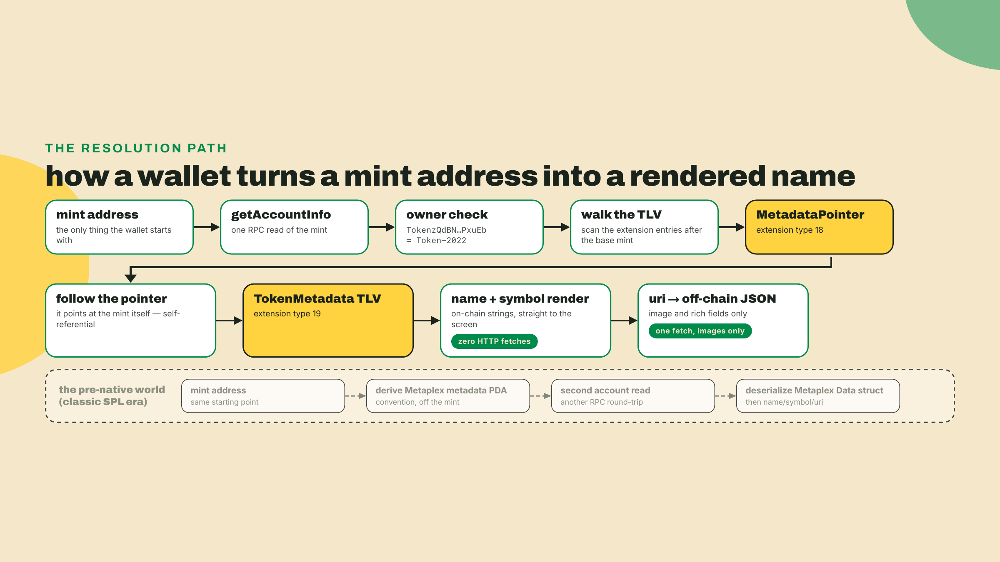
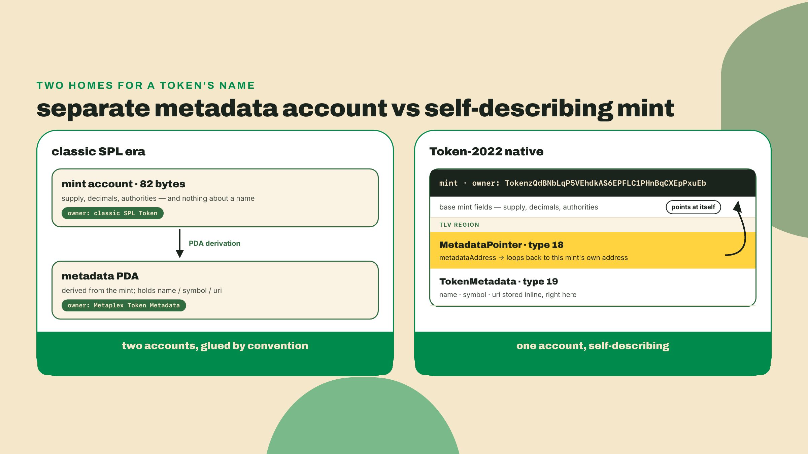
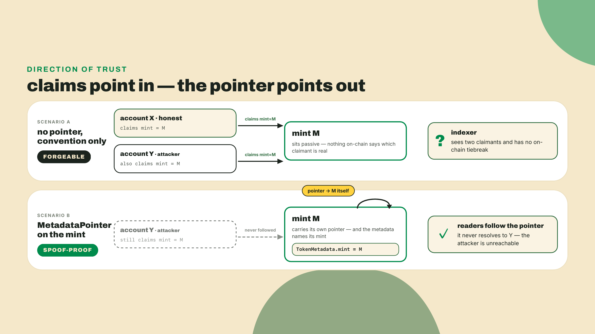
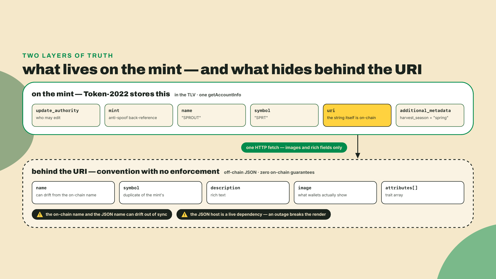
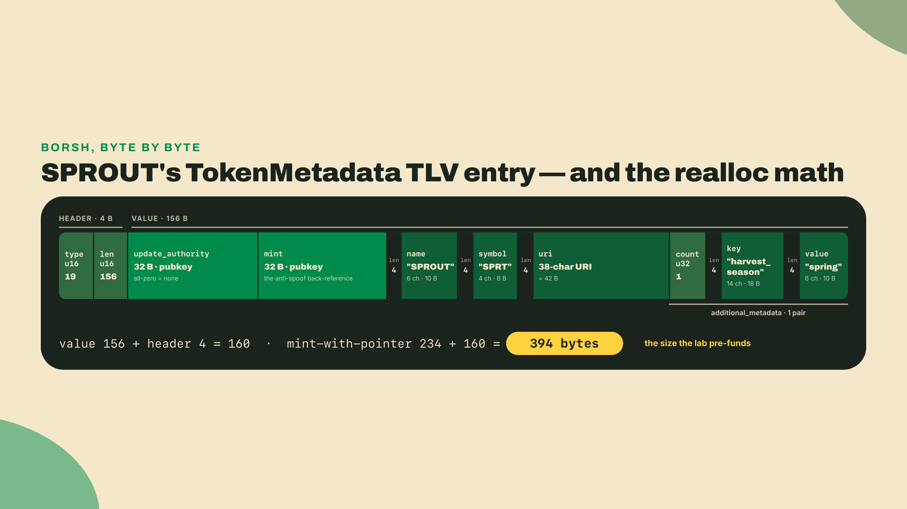
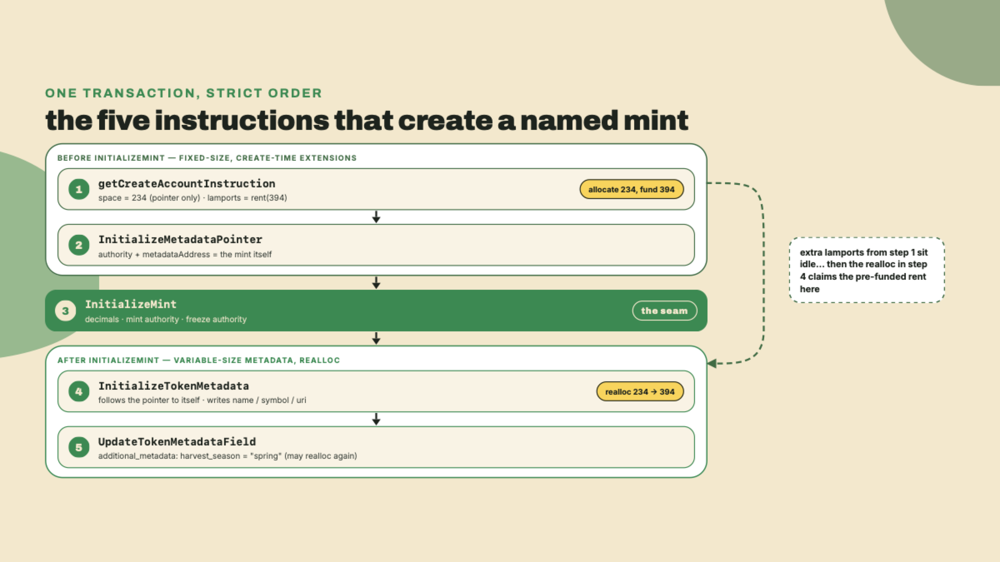
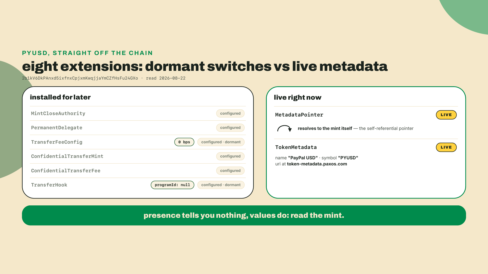
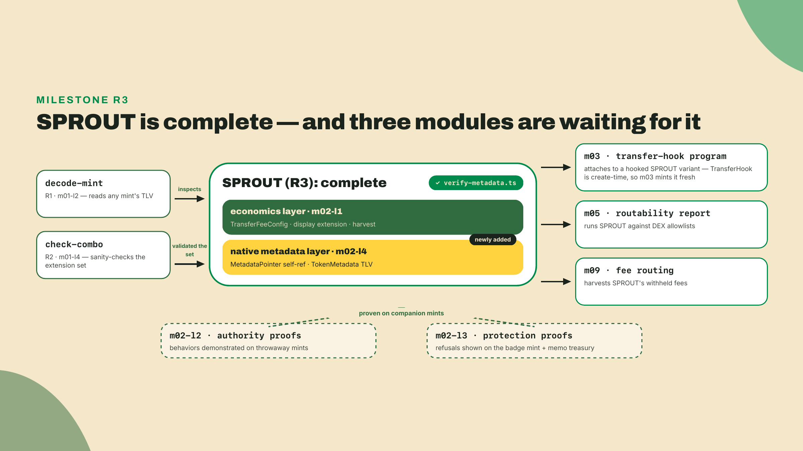

# Native metadata: MetadataPointer + TokenMetadata TLV

## Summary

You just built the protection layer: a soulbound badge mint whose forced NonTransferableAccount + ImmutableOwner pair you confirmed on every holder account, and a memo-required treasury that refuses unlabeled deposits. The mechanics are done, and they are spread across the module's artifacts on purpose: the m02-l1 economics mint charges and harvests fees, the m02-l2 throwaway mints prove who can freeze and claw back, the m02-l3 badge and treasury prove what an account can refuse. And the SPROUT a wallet actually renders is still an anonymous string of base58. A token with no name is unusable, not in the cryptographic sense but in the only sense that matters to a user staring at `6NDNZ...vBSY` and wondering if they just got rugged.

First, look at the pattern in production. With the surfnet from m02-l1 running (`surfpool start --no-tui --no-studio` in a spare terminal), drop this in `labs/m02-l4/probe-pyusd.ts` and run `npx tsx labs/m02-l4/probe-pyusd.ts`:

```typescript
import { address, createSolanaRpc } from "@solana/kit";
import { fetchMint } from "@solana-program/token-2022";

const rpc = createSolanaRpc(process.env.RPC_URL ?? "http://127.0.0.1:8899");
const PYUSD = address("2b1kV6DkPAnxd5ixfnxCpjxmKwqjjaYmCZfHsFu24GXo");
const mint = await fetchMint(rpc, PYUSD);
if (mint.data.extensions.__option === "Some") {
  for (const e of mint.data.extensions.value) {
    if (e.__kind === "MetadataPointer" && e.metadataAddress.__option === "Some")
      console.log("pointer ->", e.metadataAddress.value);
    if (e.__kind === "TokenMetadata")
      console.log("metadata:", e.name, "/", e.symbol);
  }
}
```

The pointer prints `2b1kV6DkPAnxd5ixfnxCpjxmKwqjjaYmCZfHsFu24GXo`. PYUSD's metadata pointer points at PYUSD's own mint. Hold that fact; the whole lesson is an explanation of why.

This lesson fixes that the Token-2022-native way: the name, symbol, and URI get stored ON THE MINT ITSELF, inside the same TLV region your inspector has been walking since module 1, with a pointer that guards against a spoofed metadata account. It is the last brick in R3, and since this is the rung's first appearance by name: R3 is the production SPROUT mint itself, the third artifact on the course ladder after R1 (decode-mint) and R2 (check-combo). After today R3 is complete in the form later modules consume: one mint composing the extensions that can legally share it (fee config, display extension, self-referential pointer, TokenMetadata), with the module's authority and protection behaviors proven on their own companion mints, since a soulbound or throwaway mint cannot also be the tradeable currency. Modules 5 and 9 consume this composed mint directly; module 3 cannot, because TransferHook is create-time, so it mints a fresh hooked variant beside it.

The autonomy fade, stated out loud: the wiring of the pointer and the TokenMetadata TLV is worked in full, every instruction explained. The `additional_metadata` field write is a completion problem, you build that instruction yourself before I show it. And the challenge is fully solo: a fresh mint, a round-trip assertion, no scaffolding.

## Metadata that lives on the mint

### Where a token's name actually comes from

Think about what a wallet does when it renders your balance. It has a mint address and nothing else. Somewhere it must resolve that address into "SPROUT, 6 decimals, this logo." For the entire classic-SPL era, the answer lived outside the token program: a separate metadata account, owned by a separate program (Metaplex's Token Metadata), at an address derived from the mint. The token program knew nothing about names. Two programs, two accounts, one identity, glued by convention.



Token-2022 collapses that. Two of the 29 production extensions in the ExtensionType enum exist for exactly this job:

- **MetadataPointer** (extension type 18): a small mint-side field that answers one question, "where does this mint's canonical metadata live?" It stores an optional authority (who may re-aim the pointer) and an optional metadata address.
- **TokenMetadata** (extension type 19): the metadata itself, a variable-length TLV entry holding the actual name, symbol, and URI, defined by `spl_token_metadata_interface`.

The design is two pieces instead of one on purpose. The pointer is the indirection: metadata COULD live in some other account, maintained by some other program implementing the metadata interface. But the pattern this course teaches, the pattern PYUSD ships, is the degenerate case: point the mint at itself and store the TLV inline. One account, one program, one read.



Why does the pointer exist at all, if the answer is "point at yourself"? Because the interface is bigger than the inline case. `spl_token_metadata_interface` is a specification any program can implement, and a mint created before the metadata extensions existed can still aim its pointer at an external metadata account. The pointer is the published, on-chain answer to "which account is canonical." Which brings us to the attack it was designed against.

### The anti-spoofing argument, from first principles

Suppose there were no pointer, just a convention: "metadata for mint M lives in some account that claims `mint = M`." Anyone can create an account. I can create an account tomorrow that says `mint = <PYUSD's address>`, `name = "PayPal USD"`, `symbol = "PYUSD"`, and a URI pointing at whatever JSON I like. Nothing on chain distinguishes my forgery from the real thing, because the claim lives in the forgeable account, not in the thing being claimed about. An indexer that scans for metadata accounts finds two candidates for PYUSD and has no on-chain rule for choosing. That is the spoofing surface, and it is not hypothetical: it is why NFT scam campaigns could attach official-looking metadata to garbage mints for years.

The pointer inverts the direction of trust. The mint says which account speaks for it, and only the mint's own authority set could have written that field. A third account can still claim whatever it wants; no reader will ever follow a pointer to it. And the TokenMetadata struct closes the loop from the other side with its `mint` field: the metadata names its mint, the mint names its metadata. When both live in the same account, as in SPROUT and PYUSD, the loop is one account long and there is nothing left to forge. To spoof the metadata you would need write access to the mint itself, at which point you own the token and are not spoofing anything.

This is also exactly the footgun to avoid when you wire it: point the MetadataPointer at some arbitrary account you happen to control and you have reintroduced the indirection the attack lives in. Unless you are deliberately implementing an external metadata program (you are not, and almost nobody is), self-referential is the only value you should ever write.



### What is actually in the TLV, and what is not

The TokenMetadata entry is defined by `spl_token_metadata_interface`, and its shape is worth memorizing because you will read it back for the rest of the course:

```rust
// spl_token_metadata_interface state (the shape, as stored in the TLV)
pub struct TokenMetadata {
    pub update_authority: OptionalNonZeroPubkey, // who may edit fields later
    pub mint: Pubkey,                            // the mint this speaks for (anti-spoof, other direction)
    pub name: String,                            // ON-CHAIN
    pub symbol: String,                          // ON-CHAIN
    pub uri: String,                             // link to off-chain JSON
    pub additional_metadata: Vec<(String, String)>, // arbitrary on-chain key-value pairs
}
```

Two misconceptions to kill while the struct is in front of you. First: name and symbol are on-chain strings, stored in the mint's bytes, readable with `getAccountInfo` and nothing else. The URI points at off-chain JSON for the heavy fields (image, description, whatever your product needs), but the identity fields do not live in that JSON. A wallet can render "SPROUT" without a single HTTP fetch. Second: this is not the Metaplex on-chain `Data` struct. Different program, different account model, different field layout, and code written for one will not deserialize the other. The full comparison, including when the Metaplex stack is still the right choice, is the opening lesson of module 6; for now it is enough to keep the two mentally separate.

That leaves the other end of the URI unaccounted for, and Token-2022 has nothing to say about it. The program stores a string and never fetches it. There is no on-chain schema, no validator, no content check, no enforcement of any kind. What exists instead is a convention: the off-chain JSON shape Metaplex popularized (`name`, `symbol`, `description`, `image`, and an `attributes` array), which wallets learned to parse years before native metadata existed and which native-metadata tokens inherited by default. It is what a wallet tries first when it fetches your URI. Two practical consequences follow. Your on-chain `name` and the JSON's `name` can disagree, and nothing on chain will stop them, so keep them in sync deliberately. And whatever host serves that URI is now a dependency of your token's appearance, which is one concrete argument for keeping the update authority alive rather than burning it on day one. Module 6 opens on that JSON standard properly, including which fields marketplaces actually read.



`additional_metadata` is the extensible part: arbitrary key-value string pairs, on-chain, editable by the update authority. Overgrowth will use it in the lab for a `harvest_season` field, and it is the mechanism behind every "trait on a fungible token" scheme you will meet in the wild.

That `update_authority` field is a product decision hiding in a struct, so make it consciously. It is an `OptionalNonZeroPubkey`: hold it and you can edit every field later through the interface's update instructions; set it to none and the metadata is immutable, forever, no take-backs. An issuer that may need to rotate a compromised URI host or fix a typo keeps the authority live, behind the same ops discipline as the mint authority you configured in m02-l2. A memecoin proving it can never quietly rename itself burns the authority and says so. Neither is wrong; shipping without having chosen is. SPROUT keeps its authority for now, because module 9's production-hardening pass revisits every authority on the mint at once, and this one belongs in that sweep.

### The bytes, since you can already read them

You built a TLV walker in m01-l2, so nothing about the storage should stay abstract. Each entry is a 2-byte little-endian type, a 2-byte length, then the value. The pointer's value is fixed at 64 bytes: authority pubkey, then metadata address, 32 each, zeroed when unset. The TokenMetadata value is a Borsh serialization of the struct above: two raw 32-byte pubkeys (update authority, mint), then each string as a 4-byte length prefix plus UTF-8 bytes, then the pair vector as a 4-byte count with prefixed strings inside. Variable length, exactly as the realloc story requires.

Run the arithmetic once for SPROUT and the account size stops being magic: 64 + (4 + 6) for `name = "SPROUT"`, (4 + 4) for `SPRT`, (4 + 38) for the URI, (4 + 18 + 10) for one `harvest_season = "spring"` pair. That is 156 bytes of value, 160 with its TLV header. Hold onto that 160, because the next section prices the whole account with it: a pointer-only SPROUT mint sits at 234 bytes, and 234 + 160 = 394 is the size the lab funds. Derived here, asserted there.



One more instruction rounds out the interface, and it exists for the case SPROUT never hits: `Emit`. A reader that wants metadata without knowing where the pointer leads can ask the metadata-owning program to serialize the struct into return data and read it from a simulation. For a self-referential mint it is redundant, `fetchMint` reads the TLV directly off the account with one `getAccountInfo`, no indexer in sight. But when the pointer aims at an external metadata program, `Emit` is the uniform read path that keeps every implementation of the interface readable by the same client code.

One more pair of extensions belongs in this mental map, because they mirror this design exactly: GroupPointer/TokenGroup (types 20 and 21) and GroupMemberPointer/TokenGroupMember (types 22 and 23) do for collections what the metadata pair does for identity, a self-referential pointer plus inline TLV state. They are how Token-2022 expresses "this mint belongs to that group" natively. We are not wiring them today, and this course never does; they matter for NFT-shaped assets, and when module 6 takes up collections you will see the same belongs-to-that-group problem solved on the Metaplex side instead.

### The create-time seam, and the realloc dance

Here is the part that actually bites people, and it is a rule you already know from building SPROUT three times: mint extensions are initialized BEFORE `InitializeMint`. Once a Token-2022 mint is initialized, its extension set is fixed. You cannot bolt a MetadataPointer onto yesterday's mint. That is why this lesson, like the previous three, re-creates SPROUT rather than upgrading it; the lab's mint-creation script is your m02-l3 script plus one entry in the extensions list.

But TokenMetadata breaks the pattern, and the asymmetry is the interesting design decision of this lesson. The pointer is fixed-size and create-time. The metadata is variable-length: your name today, a longer URI tomorrow, five more `additional_metadata` pairs next season. Sizing it at allocation would freeze it. So the interface makes metadata a post-init instruction: after `InitializeMint`, you call the interface's initialize, the program follows the mint's own pointer back to the mint, reallocates the account to fit the new TLV entry, and writes the fields.

Reallocation costs rent, and the program will not pay it for you. The dance, concretely, with the numbers from the lab build:

- A bare classic mint is 82 bytes. With any extension present, the base pads to 165 bytes plus one account-type byte, then TLV entries follow.
- SPROUT-with-pointer-only allocates at **234 bytes**: that is what you pass to `createAccount` as `space`.
- SPROUT's metadata entry (name `SPROUT`, symbol `SPRT`, one 38-character URI, one key-value pair) will realloc the account to **394 bytes**: that is the size you must FUND.

So you allocate space for 234 and deposit lamports for 394. The client library makes this painless: `getMintSize` accepts a phantom copy of the metadata extension purely for the arithmetic, and the resulting lamports sit idle on the mint until the realloc claims them. Underfund it and the metadata instruction fails with an insufficient-funds-for-rent error; nothing corrupts, but your create-and-name transaction dies at instruction four of five.

And the dance does not end at creation, which is the part people discover in production. Six months from now you swap the URI for a longer string, or add a second `additional_metadata` pair, and that write reallocs the mint again. The account has to be rent-exempt at its NEW size, and the update instruction will not conjure the difference out of nowhere. So a metadata update is really two operations: the interface call, and a lamport transfer to the mint that covers the growth. Shrinking runs the other way and simply leaves the mint overfunded, since nobody refunds you the slack. Budget for this the way you would budget for a schema migration, because underneath the vocabulary that is exactly what it is.



Why tolerate this complexity instead of just making metadata a create-time extension too? Trade-off, named plainly. Native metadata keeps identity on the mint: no extra account to create, no external program to trust, no PDA derivation for wallets to know, and the spoofing surface closed by construction. The costs come in three flavors.

Rent, first, and let's price it rather than wave at it. Ask the same RPC method the lab script calls, on the cluster the lab runs on. On my surfnet (2026-09-06) rent exemption for the 82-byte classic mint is 1,461,600 lamports, the 234-byte pointer-only SPROUT is 2,519,520, and the fully named 394-byte SPROUT is 3,633,120: 210, 362 and 522 total bytes at 6,960 lamports each. Mainnet charges 6,333 as of 2026-09-03 (SIMD-0437's first step) and returns 1,329,930 / 2,292,546 / 3,305,826 for the same three sizes, so a fork is not automatically quoting you mainnet's rent even when it is serving you mainnet's accounts. Either way the shape is what matters: your token's entire on-chain identity costs about 0.001 SOL over the pointer-only mint, a few tens of US cents at recent SOL prices. For one fungible mint this is nothing, which is exactly why the pattern fits fungible tokens: one mint, millions of holders, the metadata paid once. Flip the shape to an NFT collection, one mint PER item, and per-item metadata rent starts to matter, one of several reasons module 6 resolves this trade-off the other way.

Second, age. The native pattern is years younger than Metaplex's, so wallet and marketplace tooling built around "derive the Metaplex PDA" needs the pointer-follow path instead, and long-tail tooling still occasionally lacks it. The majors read it fine, PYUSD would not render otherwise, but if your token's life depends on some niche portfolio tracker, test it before launch instead of assuming.

And third, the one you now understand mechanically: variable-length data on a mint means the realloc dance, sizing rent for bytes you have not written yet. For a fungible token in 2026, native metadata is usually the right call anyway. For rich NFT collections, module 6's Metaplex Core path is, and when we get there you will see the same trade-off resolved in the opposite direction.

### PYUSD runs exactly this pattern

The probe you ran at the top was not a toy. PayPal and Paxos launched PYUSD on Solana in May 2024 as the flagship Token-2022 deployment: a regulated, KPMG-attested stablecoin (Helius's stablecoin-landscape survey put its Solana circulating supply at $215.9M across 20.4k holder accounts on 2025-05-29; today's figures are a live read away, and module 9 does that read). Its mint carries eight TLV extensions. Read them off your own probe output, they arrive in this order: MintCloseAuthority, PermanentDelegate, TransferFeeConfig, ConfidentialTransferMint, ConfidentialTransferFee, TransferHook, MetadataPointer, TokenMetadata.

You have now personally configured five of those eight on SPROUT variants, and the m01 discipline applies to the whole list: presence tells you nothing, values do. On the read of 2026-08-22, PYUSD's transfer hook was configured with a null program and its fee config sat at 0 basis points with a 0 maximum, on both the older and newer schedules. Dormant switches, installed for a future their compliance team can flip on. But the two you are wiring today are configured AND live: the pointer resolves to the mint itself, and the TLV reads back `PayPal USD / PYUSD` with a URI into `token-metadata.paxos.com`. When a wallet shows the PayPal logo next to a balance, this TLV entry, read straight off the mint, is where that render starts. The native pattern is not the experimental option. It is what a top-tier regulated issuer ships. (If you want the other side of this glass, the Solana Payments & Commerce course reads PYUSD's mint live as an integration exercise, checking what a merchant must handle before accepting it. Here you are the issuer, writing the bytes that course reads.)



One more piece of context, briefly, since you have met the 2025-01-24 archive of the official curriculum twice already: its metadata material predates the mature native pattern and still teaches the separate-account world as the default. You are learning this one from the interface and the bytes because that is currently the only place it fully lives.

## Lab: give SPROUT its name

The build: re-create SPROUT with the pointer in its extension set, write the TLV, then read everything back and assert it. By the end, R3 is complete and `verify-metadata.ts` exists at the exact interface later modules call.

1. **Workspace and pins.** In your course workspace (same one as m02-l3), make the lesson folder and confirm the dependency trio; if you are starting on a fresh machine, install them:

    ```bash
    mkdir -p labs/m02-l4
    npm install @solana/kit@7.1.1 @solana-program/token-2022@0.15.0 @solana-program/system@0.13.0
    ```

    Same pins, same reason, as m02-l1's pin paragraph argued in full: the workspace pins the kit major its `@solana-program/*` clients peer against, which today means kit 7.1.1 with each client at its current kit-^7 minor (verified against npm 2026-09-05; re-verify when you read this).

2. **Surfnet up.** The lab runs against the local surfnet you have used since m02-l1 (`surfpool start --no-tui --no-studio`; it forks mainnet lazily, which is why the PYUSD probe worked, and honors airdrops, which is why the next script funds itself). Devnet works as a fallback: `RPC_URL=https://api.devnet.solana.com WS_URL=wss://api.devnet.solana.com npx tsx ...`, with the faucet replacing the airdrop call if it rate-limits you.

3. **The worked wiring.** Create `labs/m02-l4/add-metadata.ts`. This is the full pointer-and-TLV wiring, worked; read the comments against the theory section, especially the two-size dance in the middle:

    ```typescript
    import {
      airdropFactory,
      appendTransactionMessageInstructions,
      assertIsTransactionWithBlockhashLifetime,
      createSolanaRpc,
      createSolanaRpcSubscriptions,
      createTransactionMessage,
      generateKeyPairSigner,
      getSignatureFromTransaction,
      lamports,
      pipe,
      sendAndConfirmTransactionFactory,
      setTransactionMessageFeePayerSigner,
      setTransactionMessageLifetimeUsingBlockhash,
      signTransactionMessageWithSigners,
      some,
    } from "@solana/kit";
    import { getCreateAccountInstruction } from "@solana-program/system";
    import {
      TOKEN_2022_PROGRAM_ADDRESS,
      extension,
      getInitializeMetadataPointerInstruction,
      getInitializeMintInstruction,
      getInitializeTokenMetadataInstruction,
      getMintSize,
    } from "@solana-program/token-2022";
    import { writeFileSync } from "node:fs";

    const RPC_URL = process.env.RPC_URL ?? "http://127.0.0.1:8899";
    const WS_URL = process.env.WS_URL ?? "ws://127.0.0.1:8900";

    const NAME = "SPROUT";
    const SYMBOL = "SPRT";
    const URI = "https://overgrowth.example/sprout.json";

    async function main() {
      const rpc = createSolanaRpc(RPC_URL);
      const rpcSubscriptions = createSolanaRpcSubscriptions(WS_URL);
      const sendAndConfirm = sendAndConfirmTransactionFactory({ rpc, rpcSubscriptions });

      // Payer doubles as mint authority and metadata update authority for the lab.
      const authority = await generateKeyPairSigner();
      const mint = await generateKeyPairSigner();

      await airdropFactory({ rpc, rpcSubscriptions })({
        commitment: "confirmed",
        recipientAddress: authority.address,
        lamports: lamports(2_000_000_000n),
      });

      // The pointer is a CREATE-TIME extension: it exists before InitializeMint,
      // so it belongs in the space calculation. Self-referential on purpose.
      const metadataPointer = extension("MetadataPointer", {
        authority: some(authority.address),
        metadataAddress: some(mint.address),
      });

      // The TokenMetadata TLV is POST-init: the program reallocs the mint to fit
      // it, so it never enters the allocated space. Its RENT does. This phantom
      // copy exists only to size the deposit.
      const tokenMetadata = extension("TokenMetadata", {
        updateAuthority: some(authority.address),
        mint: mint.address,
        name: NAME,
        symbol: SYMBOL,
        uri: URI,
        additionalMetadata: new Map([["harvest_season", "spring"]]),
      });

      const allocatedSpace = getMintSize([metadataPointer]);           // 234
      const fundedSpace = getMintSize([metadataPointer, tokenMetadata]); // 394
      const rent = await rpc
        .getMinimumBalanceForRentExemption(BigInt(fundedSpace))
        .send();

      const instructions = [
        // Allocate WITHOUT the metadata bytes, fund FOR them.
        getCreateAccountInstruction({
          payer: authority,
          newAccount: mint,
          space: allocatedSpace,
          lamports: rent,
          programAddress: TOKEN_2022_PROGRAM_ADDRESS,
        }),
        // Pointer before InitializeMint. Aim it at the mint itself.
        getInitializeMetadataPointerInstruction({
          mint: mint.address,
          authority: some(authority.address),
          metadataAddress: some(mint.address),
        }),
        getInitializeMintInstruction({
          mint: mint.address,
          decimals: 6,
          mintAuthority: authority.address,
          freezeAuthority: some(authority.address),
        }),
        // TLV after InitializeMint: the program follows the pointer back to the
        // mint, reallocs 234 -> 394, and writes the fields.
        getInitializeTokenMetadataInstruction({
          metadata: mint.address,
          updateAuthority: authority.address,
          mint: mint.address,
          mintAuthority: authority,
          name: NAME,
          symbol: SYMBOL,
          uri: URI,
        }),
        // COMPLETION TODO: one more instruction goes here in step 5.
      ];

      const { value: latestBlockhash } = await rpc.getLatestBlockhash().send();
      const transaction = await pipe(
        createTransactionMessage({ version: 0 }),
        (tx) => setTransactionMessageFeePayerSigner(authority, tx),
        (tx) => setTransactionMessageLifetimeUsingBlockhash(latestBlockhash, tx),
        (tx) => appendTransactionMessageInstructions(instructions, tx),
        (tx) => signTransactionMessageWithSigners(tx),
      );
      assertIsTransactionWithBlockhashLifetime(transaction);
      await sendAndConfirm(transaction, { commitment: "confirmed" });

      writeFileSync(
        new URL("./sprout-mint.json", import.meta.url),
        JSON.stringify({ mint: mint.address, name: NAME, symbol: SYMBOL, uri: URI }, null, 2),
      );
      console.log(`SPROUT mint with native metadata: ${mint.address}`);
      console.log(`tx: ${getSignatureFromTransaction(transaction)}`);
    }

    main().catch((err) => {
      console.error(err);
      process.exit(1);
    });
    ```

    One honesty note before you run it: this script carries the metadata concern only, so the worked example stays readable, and the mint it creates is a reference build, not R3. The composed mint, fees plus display plus a name, is the actual R3 the later modules mean when they say "the SPROUT mint," and step 7 makes that composition mandatory and gates it. (The m02-l3 badge and treasury stay separate on purpose: a soulbound mint cannot be the tradeable currency.) (I keep a metadata-only version around anyway. When a read-back misbehaves months later, the minimal reproduction is the debugging tool you will wish you had.)

4. **Run it.**

    ```bash
    npx tsx labs/m02-l4/add-metadata.ts
    ```

    Expected shape of the output, your addresses will differ:

    ```
    SPROUT mint with native metadata: 6NDNZ8kGXJbwg7JHyz8advCmivmoUEcEuRAVAUoWvBSY
    tx: wCgwQMAAc6azAp7jq9nbgMTpEYrAyPkxMgSi9X8vcayw8iBVp5t9ZRURn6FwT1EgE8oWpZN42YVtdh99SytaM3g
    ```

    The script also drops `labs/m02-l4/sprout-mint.json`, the address handoff the verify script and later modules read. Treat that file as provisional for now: step 7 re-points it at the composed mint, and it is the composed address later modules must find there.

5. **Completion problem: the field write.** SPROUT needs its `harvest_season` field, and that instruction is yours to build. What you know: the builder is `getUpdateTokenMetadataFieldInstruction` from the same package, its input takes `metadata` (the mint address), `updateAuthority` (a signer, ours), a `field`, and a `value`. Custom keys are expressed with the `tokenMetadataField` helper. Add the import, build the instruction, place it after the metadata initialize in the array, and re-run. Write it before you read on.

    Done? Here is the check:

    ```typescript
    import { getUpdateTokenMetadataFieldInstruction, tokenMetadataField } from "@solana-program/token-2022";

    // ... appended after getInitializeTokenMetadataInstruction(...) in `instructions`:
    getUpdateTokenMetadataFieldInstruction({
      metadata: mint.address,
      updateAuthority: authority,
      field: tokenMetadataField("Key", ["harvest_season"]),
      value: "spring",
    }),
    ```

    Note the same instruction with `tokenMetadataField("Name")` edits the name itself; initialize-then-update is the whole write API, four instructions total in the interface (initialize, update field, remove key, update authority). Every write can grow the TLV, which is why the phantom-sizing in step 3 already included this pair: the rent was on deposit before the field existed.

6. **Read it back.** The gate for R3 is a read-back that asserts, not a console log you eyeball. Create `labs/m02-l4/verify-metadata.ts`; this file is course infrastructure, later modules run it by exactly this path, so take it complete:

    ```typescript
    import { address, createSolanaRpc } from "@solana/kit";
    import { fetchMint } from "@solana-program/token-2022";
    import { readFileSync } from "node:fs";
    import assert from "node:assert/strict";

    const RPC_URL = process.env.RPC_URL ?? "http://127.0.0.1:8899";

    async function main() {
      const saved = JSON.parse(
        readFileSync(new URL("./sprout-mint.json", import.meta.url), "utf8"),
      ) as { mint: string; name: string; symbol: string; uri: string };
      const mintAddress = address(process.argv[2] ?? saved.mint);

      const rpc = createSolanaRpc(RPC_URL);
      const mint = await fetchMint(rpc, mintAddress);

      assert(mint.data.extensions.__option === "Some", "mint carries no TLV extensions");
      const extensions = mint.data.extensions.value;

      const pointer = extensions.find((e) => e.__kind === "MetadataPointer");
      assert(pointer, "MetadataPointer extension missing");
      assert(
        pointer.metadataAddress.__option === "Some" &&
          pointer.metadataAddress.value === mintAddress,
        "MetadataPointer is not self-referential",
      );

      const metadata = extensions.find((e) => e.__kind === "TokenMetadata");
      assert(metadata, "TokenMetadata TLV missing");
      assert.equal(metadata.mint, mintAddress, "TLV mint field does not match this mint");
      assert.equal(metadata.name, saved.name);
      assert.equal(metadata.symbol, saved.symbol);
      assert.equal(metadata.uri, saved.uri);

      console.log(`OK: MetadataPointer -> ${pointer.metadataAddress.value} (the mint itself)`);
      console.log(
        `OK: TokenMetadata TLV reads back name=${metadata.name} symbol=${metadata.symbol} uri=${metadata.uri}`,
      );
      for (const [key, value] of metadata.additionalMetadata) {
        console.log(`OK: additional_metadata ${key}=${value}`);
      }
    }

    main().catch((err) => {
      console.error(err);
      process.exit(1);
    });
    ```

    ```bash
    npx tsx labs/m02-l4/verify-metadata.ts
    ```

    ```
    OK: MetadataPointer -> 6NDNZ8kGXJbwg7JHyz8advCmivmoUEcEuRAVAUoWvBSY (the mint itself)
    OK: TokenMetadata TLV reads back name=SPROUT symbol=SPRT uri=https://overgrowth.example/sprout.json
    OK: additional_metadata harvest_season=spring
    ```

    Both assertions on both sides of the anti-spoofing loop just ran: the pointer resolves to the mint, and the TLV's own `mint` field points back. Note the script takes an optional address argument; `npx tsx labs/m02-l4/verify-metadata.ts <any mint>` is now a general-purpose native-metadata checker. Point it at PYUSD.

7. **Compose it into the real SPROUT, and re-point the handoff.** The metadata-only mint proved the wiring; R3 is the composed mint, so make the composition now. Open `labs/m02-l1/verify-economics.ts`, the script that builds the fee-and-display SPROUT, carry the `NAME`/`SYMBOL`/`URI` constants across, and make four changes, every one of them a lift from `add-metadata.ts`:

    - Build the same `metadataPointer` extension (self-referential, exactly as step 3 did, with `payer.address` as its authority) and the phantom `tokenMetadata` extension, then size the account twice: allocate at `getMintSize([transferFeeExtension, interestExtension, metadataPointer])` and fund at `getMintSize([transferFeeExtension, interestExtension, metadataPointer, tokenMetadata])`, passing the funded size to `getMinimumBalanceForRentExemption` and the allocated size as `space`.
    - Slot `getInitializeMetadataPointerInstruction` in with the other extension initializers, BEFORE `getInitializeMintInstruction`; the create-time rule has not changed.
    - Append `getInitializeTokenMetadataInstruction` and your step-5 field write AFTER `getInitializeMintInstruction`.
    - At the end of `main()`, write the handoff pointed at this lesson's folder, so later consumers read the composed address:

    ```typescript
    writeFileSync(
      new URL("../m02-l4/sprout-mint.json", import.meta.url),
      JSON.stringify({ mint: mint.address, name: NAME, symbol: SYMBOL, uri: URI }, null, 2),
    );
    ```

    Re-run `npx tsx labs/m02-l1/verify-economics.ts` (all its fee assertions must stay green: the composition changes the mint's identity, not its economics), then run the gate against the composed mint: `npx tsx labs/m02-l4/verify-metadata.ts`. The three OK lines must now hold against the composed address. Until they do, R3 is not complete.

8. **Close the loop with R1.** Point your `decode-mint` inspector from m01-l2 at the composed mint. Two new rows appear in its extension walk: type 18 (MetadataPointer, 64 bytes of TLV value) and type 19 (TokenMetadata, variable length). The strings you just wrote are sitting inside bytes your own decoder has been able to walk since module 1; `fetchMint` is a convenience over exactly that walk, nothing more. And run `check-combo` on the full set for the ritual's sake: MetadataPointer conflicts with nothing in the matrix.



## Challenge

Solo, no scaffolding: the metadata-pointer exercise. Create a fresh throwaway mint, any decimals, whose extension set is exactly a self-referential MetadataPointer, write a TokenMetadata TLV with a name, symbol, and URI of your choosing plus at least one `additional_metadata` pair, then write the round-trip assertion yourself: fetch the mint and assert that the pointer resolves to the mint, and that every field reads back exactly as written, character for character. No copying `verify-metadata.ts`; the point is that the assert lives in your fingers, because a round-trip you can write from nothing is the test you will actually reach for when a mainnet mint misbehaves.

Accepted when: one script, one run, the pointer assertion and every field assertion pass, and killing any one field in the write makes the corresponding assertion fail (prove it once by breaking the symbol on purpose).

## Checkpoint

The gate: `npx tsx labs/m02-l4/verify-metadata.ts` prints its three OK lines against the COMPOSED mint that `sprout-mint.json` now names, the step-7 build carrying fees, a display extension, a self-referential pointer, and TokenMetadata on one account, and the challenge's fresh-mint round-trip passes with your own assertions. With that green, SPROUT (R3) is complete for the rest of the course; a passing run against the step-3 metadata-only mint alone does not count.

The two misses I expect, so you can self-diagnose fast. First, ordering: put the pointer initialize after `InitializeMint`, or try to add metadata to a mint created without the pointer, and the program rejects you; MINT extensions are create-time, the metadata TLV is the post-init exception you are using (the group TLVs from the mental map share the same pointer-then-realloc path, and account extensions like the MemoTransfer and CpiGuard you enabled last lesson have their own post-creation path via the reallocate dance), and it only works because the pointer was there first. Second, funding: allocate AND fund at 234 and instruction four dies mid-transaction on rent; re-read the phantom-sizing lines in step 3, the deposit has to cover the post-realloc size. If your failure is neither of these, run the verify script against my failure order: extensions present at all, pointer target, then fields, and bring the first assert that fires to the course discussion with your instruction list.

Take the milestone for a second, it cost four lessons: a mint that charges and harvests fees, enforces its authorities, lets holder accounts refuse what they should refuse, and now renders as SPROUT in anything that reads the TLV. That is a production-shaped Token-2022 asset, the same pattern a KPMG-attested stablecoin ships, and you built every byte of it from raw instructions.

Next module, the extension everything so far has been preparing you to meet: the one that runs YOUR code on every single transfer. It is the only place in this course where you write a Rust program of your own, the harvest hook. One honest logistics note so the seam does not surprise you: TransferHook is a create-time mint extension, so today's finished SPROUT can never grow one. Next module you mint a hooked variant fresh, and it is deliberately minimal, TransferHook and nothing else, because that module's subject is the hook, not the recipe stack; the two mints live side by side the way a mainline token and its gated test variant do in production. Bring the toolkit. See you at the hook.
