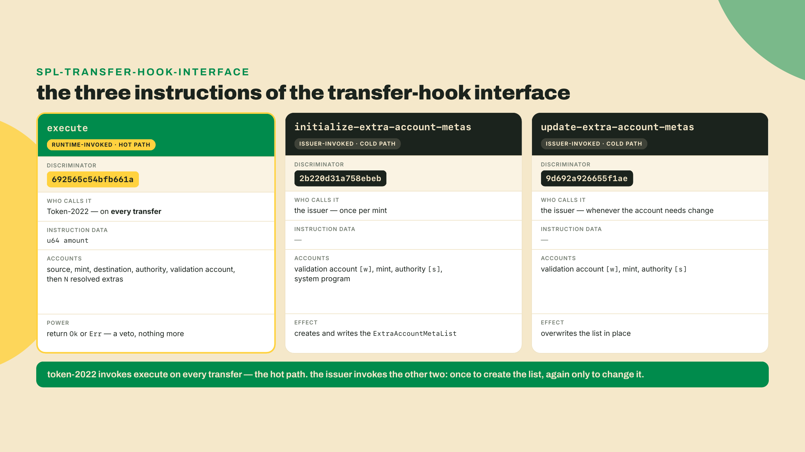
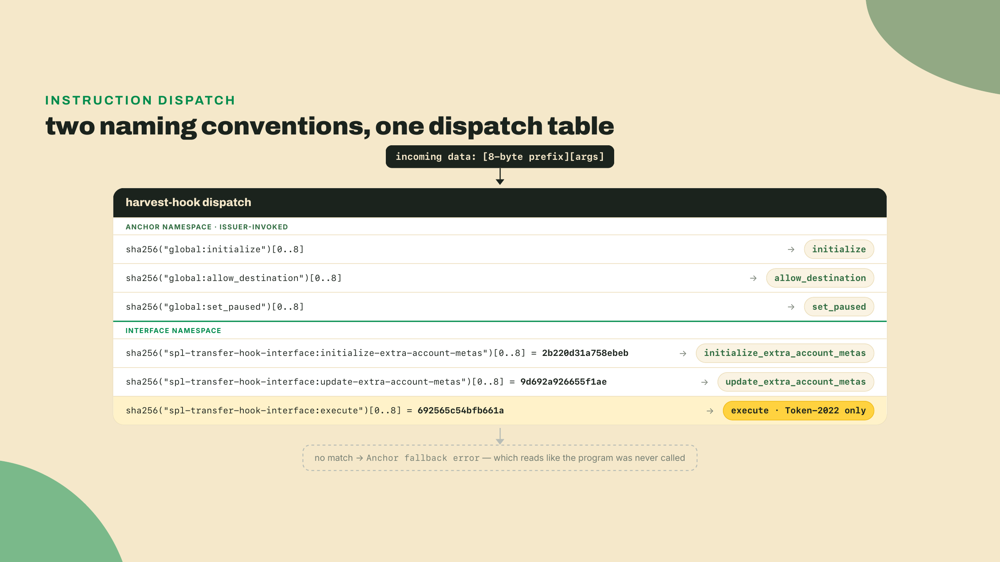
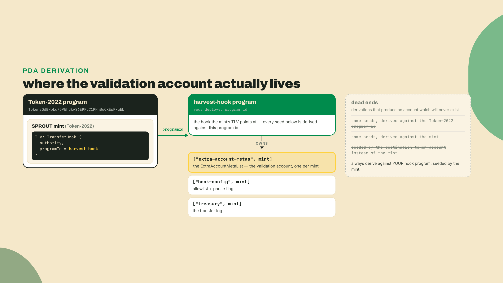
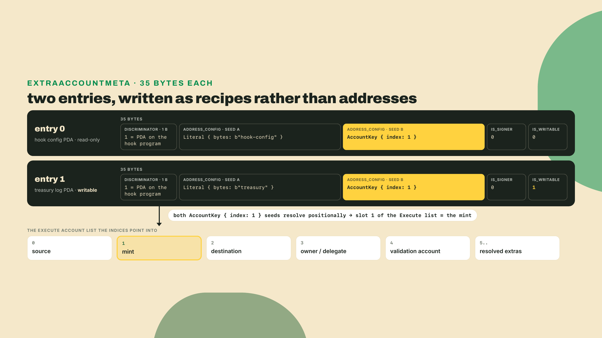
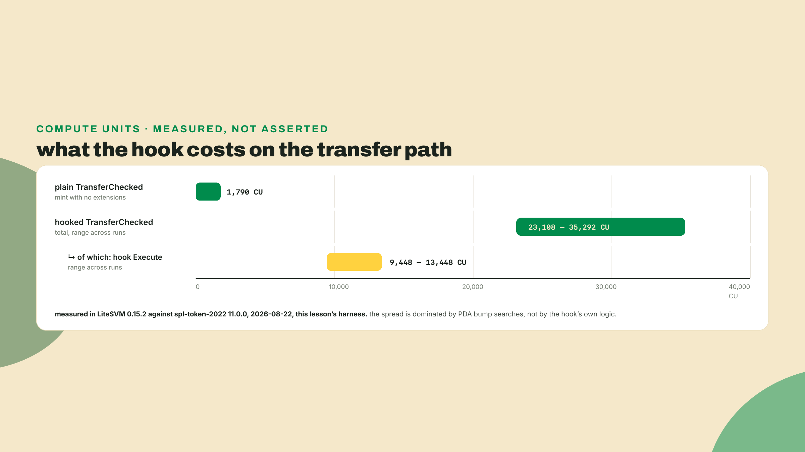
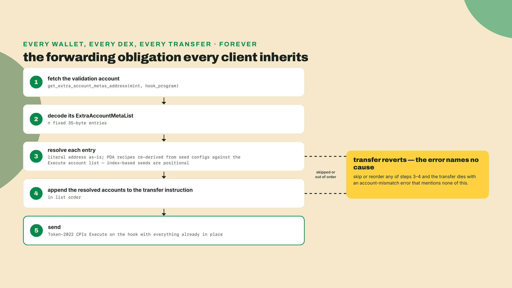
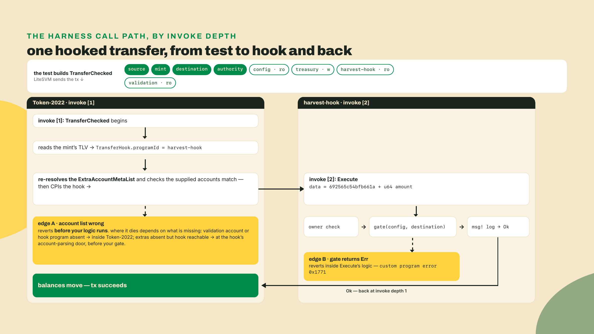
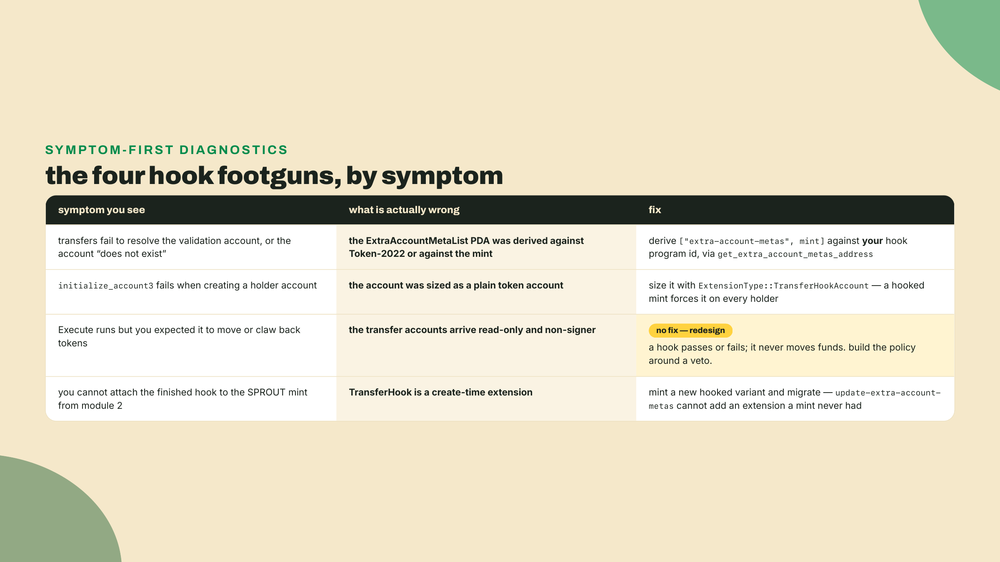
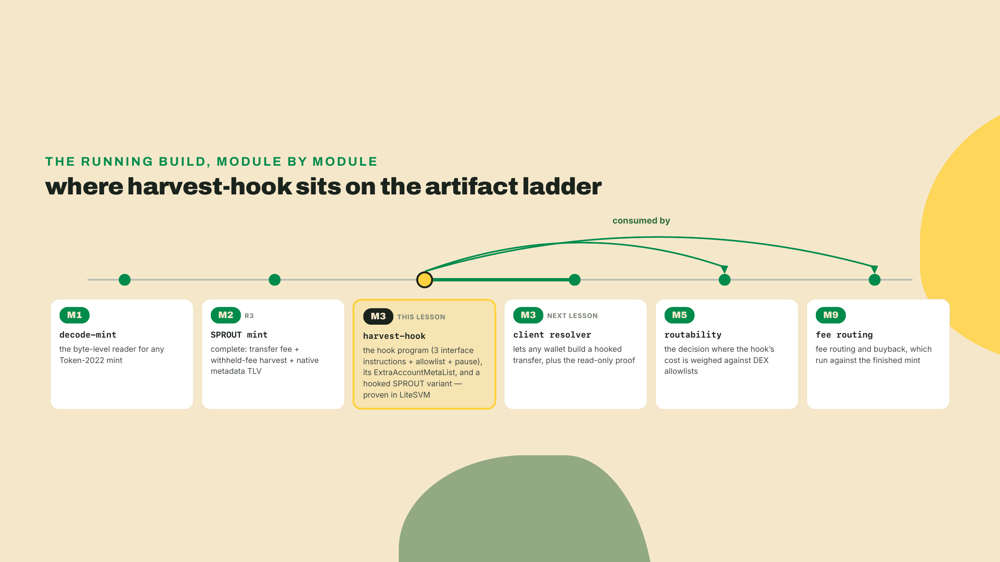

# Write the hook: the interface + your one Rust program

## Summary

Last lesson finished SPROUT: transfer fee, withheld-fee harvest, and the native metadata TLV all wired onto one mint, the R3 rung of this course's artifact ladder. Every extension so far reshapes the token passively. Fees accrue. Metadata sits in the TLV and waits to be read. Today you meet the one extension that runs YOUR code on every move of the token, and you write that code: `harvest-hook`, a small Anchor program that refuses any destination not on its allowlist and, once you finish the solo challenge, logs each transfer into a treasury ledger. (The name is about what it guards, Overgrowth's harvest flows; the fee harvesting itself stays with m02-l1's harvest sequence, because a hook can never move funds.) You author the three-instruction transfer-hook interface, initialize the validation account that tells the runtime which extra accounts to forward, mint a fresh hooked SPROUT variant, and prove it in a LiteSVM harness where one transfer lands and one reverts with your own error. Fade check: the interface, the validation PDA, and the account-meta list are built with you; the allowlist gate inside `Execute` is a TODO you fill; the treasury log is fully solo.

Before any theory, get the three byte-strings on your screen. The interface names its instructions by hashing strings, so a shell derives all three:

```bash
# macOS ships shasum, most Linux boxes ship sha256sum; take whichever is there.
sha256() { if command -v shasum >/dev/null; then shasum -a 256; else sha256sum; fi; }

for s in execute initialize-extra-account-metas update-extra-account-metas; do
  printf '%-32s ' "$s"
  printf '%s' "spl-transfer-hook-interface:$s" | sha256 | head -c 16
  echo
done
```

You should see exactly this:

```
execute                          692565c54bfb661a
initialize-extra-account-metas   2b220d31a758ebeb
update-extra-account-metas       9d692a926655f1ae
```

That is the entire contract you are about to implement. Not an ABI file, not a registry, not an interface you inherit: three eight-byte prefixes derived from three ASCII strings, and any program on Solana that answers to them is a transfer hook. Keep `692565c54bfb661a` in view for the rest of the lesson. It is the doorbell Token-2022 rings on your program, and by the end you will have watched it ring in a real log.

You have already read a TransferHook extension that pointed at nothing: PYUSD's, whose `transferHook.programId: null` line you first printed all the way back in m01-l1's opener script, configured at the mint's birth with a null program id. That shape is worth a second look before you build, because it reconciles two facts that sound contradictory. The extension itself is create-time: a mint either carries the hook slot from its first block or never will. The program id inside the slot is not: the hook authority can aim it, or null it, later. So a dormant slot is a loaded gun with an empty chamber, the slot is the gun and the program id is the round, and an issuer like Paxos installs the gun empty on purpose. The moment a program IS chambered, Token-2022 stops being a library and becomes a caller: it CPIs into that program on every transfer, forever, and if the program returns an error the transfer dies with it.

## The interface, the validation PDA, and the 35 bytes

### Three strings, hashed into eight bytes

Start from the constraint the whole design is squeezed by. Token-2022 has to invoke a program it has never seen, written by someone it has never met, without a shared crate, a registry, or a version negotiation. The only thing the two sides can agree on ahead of time is a name. So the interface hashes names: `sha256("spl-transfer-hook-interface:execute")[0..8]` prefixes the instruction data, your program matches on those eight bytes, and dispatch works. This is what a hashed-string discriminator is, and it is the same trick Anchor plays with `sha256("global:<method_name>")[0..8]` for its own instructions. Two independent conventions, one mechanism, and in a minute you will have a program that answers to both.

The three instructions split cleanly by who calls them:



Notice the asymmetry. Two of the three instructions are ordinary management calls that an issuer runs from a script, on a good day twice in the life of a mint. The third one runs on the hot path of every transfer that will ever touch the token, and it is the only one whose cost anybody else pays. That asymmetry is the whole ethical argument about hooks, and we will come back to it with numbers.

`Execute` receives the transfer amount as instruction data and a fixed prefix of accounts: source at index 0, mint at 1, destination at 2, the source's owner or delegate at 3, then the validation account, then every extra account the runtime resolved on your behalf. Hold onto those indices. They are not documentation, they are addressable positions that the account-meta encoding hashes over.

Worth being precise about what registration means here, because it is less than people expect. There is no global registry of hooks. Token-2022 does not keep a table of approved programs, there is no allowlist to get onto, and nothing validates that the program id in a mint's TransferHook extension is even a program. The mint's own extension naming your program id is the entire wiring. Which also means the failure mode when your program does not answer the interface is not a helpful error: Token-2022 hands your program eight bytes it does not recognize, dispatch falls off the end of your match, and you get a fallback error from a program that looks like it was never called at all. If you ever see a hooked transfer die inside your own program with nothing in the log but a fallback complaint, you have a discriminator problem, not a logic problem.



### The validation account lives on YOUR program

Here is the piece that trips almost everyone the first time, including me the first time I wired one of these up. The hook needs extra accounts. Token-2022 cannot possibly know which ones, because your program is arbitrary. Solana programs cannot fetch accounts at runtime, so nobody downstream can discover them either. The interface's answer is a published manifest: one on-chain account, per mint, whose data lists exactly which extra accounts an `Execute` call needs and how to derive each one.

That account is the `ExtraAccountMetaList`, it sits at a PDA seeded by the literal `extra-account-metas` and the mint, and it is owned by YOUR hook program. Not by the mint. Not by Token-2022.



The reference implementation gives you the derivation as a function, `get_extra_account_metas_address(&mint, &program_id)`, and the `program_id` argument is the one people fill in wrong. Pass Token-2022 there and you get a perfectly valid address that no account will ever occupy, so every transfer fails at resolution with an error that says nothing about the real mistake. If you take one derivation rule out of this lesson, take this one: the manifest belongs to the program that needs the accounts, because it is the only party that knows what they are.

Why one per mint rather than one per token account? Because the needs are a property of the policy, not of the holder. A hook that gates on an allowlist needs the allowlist account whether the destination is a whale or a new wallet. Per-mint keeps the list small, keeps updates atomic, and keeps the client's read path to exactly one account.

### 35 bytes for an account nobody has created yet

Each entry in that list is an `ExtraAccountMeta`, a fixed 35-byte struct. Fixed size is doing real work here: a client can walk the list without a schema, and the on-chain side can index it without allocating. One byte of discriminator selects how the address is found, thirty-two bytes carry either the address itself or a packed set of seed configurations, and two bytes carry the signer and writable flags.

The interesting case is the one your hook uses. Both of the accounts `harvest-hook` needs are PDAs of the hook program derived from the mint, and the mint is not known when you write the list, it is known when the transfer happens. So instead of an address, the entry stores a recipe: a literal seed, then "the key of the account at index 1 of the Execute account list," which is the mint.



Two consequences follow from index-based seeds, and both bite in production. First, resolution is positional: if a client resolves the list out of order or drops an entry, every later index-based seed derives a different address, silently, and the transfer reverts with a mismatch that points nowhere useful. Second, the writable flag in the entry is the entry's own, not inherited from the transfer, which is why your treasury log can be written even though everything arriving from the transfer is read-only. We prove that read-only claim in the next lesson, out of the interface crate's own instruction builder; today, take it as the reason the design is safe enough to ship at all.

### What the hook can do, and what it costs everybody else

Before the price, the boundary, because it is the thing that makes the price payable at all. Your hook receives the source account, the destination account, and the owner. It cannot spend from any of them. Not because it politely declines, but because Token-2022 strips those accounts down before the CPI: they arrive read-only and non-signer, so a write is a runtime error and a signature is not available to reuse. The hook's complete power inventory is three items. It can read anything in the accounts it was given. It can write to its own declared extras, which is why the treasury log works. And it can return an error, which aborts the entire transfer atomically.

Derive that constraint rather than memorizing it, because the reasoning generalizes. A hook is code chosen by the issuer, running inside a transaction authored by someone else, with that someone's accounts in scope. If the hook could sign or write on those accounts, then holding a token would mean granting the issuer standing permission to move your other balances mid-transfer, and every integration would have to audit an arbitrary program before quoting a swap. The only version of this feature that can exist without that audit is a veto seat: the hook sees everything and touches nothing. That is why "can a hook drain me?" has a one-line answer, and it is the shape you should look for in any hook-like design. Observe, record on your own turf, refuse. The four lines of the interface crate that set those account flags are read line by line in the next lesson.

The trade, then, is sharp and worth pricing before you write a line. What the issuer buys is real: per-transfer control, expressible as arbitrary program logic, enforced by the token program itself rather than by an app that a user can route around. What everyone else pays is also real, and it comes in two currencies.

The first is compute. I measured this harness on both paths. A plain Token-2022 `TransferChecked` on a mint with no extensions burned 1,790 CU. The same transfer through the hooked mint landed between roughly 23,000 and 35,000 CU across runs, with the hook's own `Execute` accounting for about 9,400 to 13,500 of that. Ten to twenty times the cost of the transfer it is guarding, for a hook whose entire logic is one boolean scan of an eight-entry array.



Worth pausing on that spread, because it is a lesson in itself. The variance is not the allowlist scan, which costs nothing. It is `find_program_address`: every seeds constraint that does not carry a stored bump walks the search, and each iteration costs real compute. Storing canonical bumps is the standard fix and the Master Anchor V2 course covers it as a framework pattern. I am leaving one un-stored bump in this program on purpose so the variance shows up in your own logs.

The second currency is coordination, and it is the expensive one. Because the extra accounts must be in the transaction before it is sent, every wallet, every DEX, every payment integration that ever touches your token has to fetch your validation account, decode those 35-byte entries, resolve each one, and append them in order. Forever. A hook does not just spend the issuer's compute; it pushes a permanent forwarding obligation onto strangers who never agreed to it. That is the fact the next lesson opens on, and it is why a serious slice of the ecosystem simply refuses hooked tokens.



Two receipts to place the feature in the real world before we build. PYUSD, the flagship Token-2022 launch on Solana in May 2024 from PayPal and Paxos, ships a compliance-shaped set of eight TLV extensions, and one of them is a transferHook whose `programId` is null. Configured, dormant, reserved. Issuers reach for this slot the moment compliance is on the table, even when they are not ready to use it. And the state of the official material, so you know what exists before we build: solana.com hosts a transfer-hook guide — an Anchor walkthrough with build, deploy and tests — plus an integration guide for the client send path, solana-program.com documents the interface beside a reference implementation, and solana-developers/program-examples carries transfer-hook examples. Walkthroughs to copy exist, in other words. What this lesson adds is the part copying does not give you: pinned versions, measured compute, a hook wired into the SPROUT token you have carried for two modules, and a gate you write yourself and defend against a red test suite.

## Lab: from empty crate to a reverted transfer

The plan: one crate, one program, one test file. You will build the hook, initialize its manifest, mint a hooked SPROUT variant inside the harness, and drive two transfers through it. Everything in this lab was built and run on this machine on 2026-08-22 with the exact pins below, including the compute numbers you just read.

A scope note before the first command, because it changes how you should read the code. This lab uses Anchor and does not teach it. The framework layer, the macros, the account constraints, the CPI mechanics, the testing patterns, belongs to the Master Anchor V2 course (`mastering-anchor-v2`), and if a `#[derive(Accounts)]` block here makes you want a fuller explanation of what the constraint system is doing, that is the course to take it to; if you have never read an Anchor program at all, its opening anatomy module is the right read-this-first before this lab. What you are learning here is the interface and the extension, not the framework. The program is about forty lines of logic wearing a thin Anchor coat, and everything specific to hooks would look the same in raw Rust with more ceremony.

The autonomy ladder for the lab, stated plainly so you know when you are on your own: steps 1 through 6 are worked with you, step 7 leaves the `gate` function deliberately empty for you to write, step 9 is where the test suite goes red against that empty gate, and the Challenge is unscaffolded.

**1. Get the build toolchain.** You need Rust and the Solana toolchain's SBF compiler. No Rust toolchain at all yet? The Rust & TypeScript Fundamentals course installs it from zero in its m04-l1, and its module 4 more broadly is where the Rust-reading fluency this lesson leans on comes from. If `cargo-build-sbf` is not already on your path from earlier work:

```bash
# Rust, if you do not have it
curl --proto '=https' --tlsv1.2 -sSf https://sh.rustup.rs | sh

# The Agave toolchain, which brings cargo-build-sbf and the solana CLI
sh -c "$(curl -sSfL https://release.anza.xyz/stable/install)"

cargo-build-sbf --version
```

You do not need the `anchor` CLI for this lab and it is not in the install list above. If you already have it through avm from other work, `anchor build` produces the same `.so`; everything here uses `cargo build-sbf` directly so the crate stays an ordinary Cargo package with no workspace scaffolding around it.

**2. Create the crate.** One directory, one package. Call it `hook/` next to the `labs/` folder you have been using.

```bash
mkdir -p hook/src hook/tests && cd hook
```

`hook/Cargo.toml`, in full:

```toml
[package]
name = "harvest-hook"
version = "0.1.0"
edition = "2021"

[lib]
crate-type = ["cdylib", "lib"]
name = "harvest_hook"

[dependencies]
anchor-lang = "=1.1.2"
spl-tlv-account-resolution = "=0.11.1"
spl-transfer-hook-interface = "=2.1.0"
spl-discriminator = "0.5"

[workspace]

[dev-dependencies]
litesvm = "=0.15.2"
solana-program-runtime = "=4.1.1"
solana-builtins = "=4.1.1"
solana-instruction = "3"
solana-keypair = "3"
solana-signer = "3"
solana-system-interface = "2"
solana-transaction = "4"
spl-token-2022 = "=11.0.0"
```

Four notes on those pins, all of them checked on 2026-08-22 rather than remembered, with one re-check dated 2026-09-01 where marked.

`anchor-lang` is pinned to 1.1.2, which is what this lab's code was verified against and NOT the newest release of the V1 line any more: 1.2.0 shipped on 2026-09-04, after this lesson was written and after its own versionStamp was taken. The pin still stands, because a pin is a statement about what was tested rather than about what is newest, but do not repeat "1.1.2 is current" to anyone. A 2.0.0-rc.1 also exists and it is the Master Anchor V2 course's concern, not ours; V2 changes the account-type surface enough that this file would not compile against it unchanged. `spl-transfer-hook-interface` 2.1.0 is the current release of the interface. `spl-tlv-account-resolution` is pinned at 0.11.1, the version this lab's byte-level claims were verified against; crates.io has since shipped 0.11.2/0.11.3 (re-checked 2026-09-01), which rework resolver internals without touching the wire format. The empty `[workspace]` table is not decoration: it stops a parent directory's workspace from adopting this crate and dragging in incompatible dependency resolution.

The two odd-looking dev-dependency pins are the honest kind of ugly. LiteSVM 0.15.2 does not compile against the 4.2 line of the Agave runtime crates that Cargo would otherwise pick for it, so `solana-program-runtime` and `solana-builtins` are pinned back to 4.1.1 to hold the resolver at a version LiteSVM was built against. If a future LiteSVM release fixes that, drop both lines. This is exactly the kind of thing that rots, so check it rather than trusting a course.

**3. Install the harness, and meet it.** LiteSVM is the dev-dependency you just added, so it is already installed. Worth ten seconds on what it is, because it is new to this course: LiteSVM is an in-process Solana VM. It gives you a real SBF runtime with real programs and real compute metering, in a library, with no validator process, no RPC, and no ledger. Tests run in milliseconds instead of tens of seconds. It also ships the SPL programs, which is why the harness can create a Token-2022 mint without you deploying anything. The trade is that it is not a cluster: no leader schedule, no fee market, no network. For a hook, which is pure instruction-level logic, that is the right instrument.

**4. Write the state and the errors.** Create `hook/src/lib.rs` and start with the imports, the program id, the seeds, and the accounts your hook owns:

```rust
use anchor_lang::prelude::*;
use spl_discriminator::SplDiscriminate;
use spl_tlv_account_resolution::{
    account::ExtraAccountMeta, seeds::Seed, state::ExtraAccountMetaList,
};
use spl_transfer_hook_interface::instruction::{
    ExecuteInstruction, InitializeExtraAccountMetaListInstruction,
    UpdateExtraAccountMetaListInstruction,
};

declare_id!("HookH1FQuTU21GVAjJZDLXPjXWLQFPJ5FLpwGKZLkYQ");

pub const CONFIG_SEED: &[u8] = b"hook-config";
pub const TREASURY_SEED: &[u8] = b"treasury";
pub const META_LIST_SEED: &[u8] = b"extra-account-metas";
pub const MAX_ALLOWED: usize = 8;

pub const TOKEN_2022_ID: Pubkey =
    Pubkey::from_str_const("TokenzQdBNbLqP5VEhdkAS6EPFLC1PHnBqCXEpPxuEb");

#[account]
#[derive(InitSpace)]
pub struct HookConfig {
    pub authority: Pubkey,
    pub mint: Pubkey,
    pub paused: bool,
    pub bump: u8,
    pub allowed_len: u8,
    pub allowed: [Pubkey; MAX_ALLOWED],
}

#[account]
#[derive(InitSpace)]
pub struct TreasuryLog {
    pub mint: Pubkey,
    pub bump: u8,
    pub transfers: u64,
    pub total_amount: u128,
    pub last_amount: u64,
    pub last_destination: Pubkey,
}

#[error_code]
pub enum HarvestHookError {
    #[msg("Transfers are paused by the hook authority")]
    Paused,
    #[msg("Destination is not on the hook allowlist")]
    NotAllowed,
    #[msg("The allowlist is full")]
    AllowlistFull,
    #[msg("Only the hook authority may call this")]
    Unauthorized,
    #[msg("Source account is not owned by Token-2022")]
    NotTokenAccount,
}
```

A fixed eight-slot array instead of a `Vec` is a deliberate choice: `Execute` runs on every transfer, and a fixed layout means no reallocation, no length surprises, and a scan whose cost you can reason about. A real issuer with thousands of allowlisted destinations would use one PDA per destination and let the meta list derive it from the destination key at index 2, which the encoding supports. Eight slots keeps the lesson's account count honest.

**5. Publish the manifest.** This is the function that writes those two 35-byte entries. Append to `lib.rs`:

```rust
fn harvest_metas() -> Result<Vec<ExtraAccountMeta>> {
    Ok(vec![
        ExtraAccountMeta::new_with_seeds(
            &[
                Seed::Literal { bytes: CONFIG_SEED.to_vec() },
                Seed::AccountKey { index: 1 },
            ],
            false,
            false,
        )?,
        ExtraAccountMeta::new_with_seeds(
            &[
                Seed::Literal { bytes: TREASURY_SEED.to_vec() },
                Seed::AccountKey { index: 1 },
            ],
            false,
            true,
        )?,
    ])
}
```

Read the two boolean arguments as what they are: `is_signer` then `is_writable`. The config is read-only because `Execute` only reads it. The treasury log is writable because the solo exercise is going to write to it, and declaring it now means the account is already in every transfer by the time you need it.

**6. The three interface instructions, plus the two management ones.** Now the program module. The line to stare at is the `#[instruction(discriminator = ...)]` attribute: it is how an Anchor program answers to somebody else's naming convention instead of its own.

```rust
#[program]
pub mod harvest_hook {
    use super::*;

    pub fn initialize(ctx: Context<Initialize>) -> Result<()> {
        let config = &mut ctx.accounts.config;
        config.authority = ctx.accounts.authority.key();
        config.mint = ctx.accounts.mint.key();
        config.paused = false;
        config.bump = ctx.bumps.config;
        config.allowed_len = 0;
        config.allowed = [Pubkey::default(); MAX_ALLOWED];

        let log = &mut ctx.accounts.treasury_log;
        log.mint = ctx.accounts.mint.key();
        log.bump = ctx.bumps.treasury_log;
        log.transfers = 0;
        log.total_amount = 0;
        log.last_amount = 0;
        log.last_destination = Pubkey::default();
        Ok(())
    }

    pub fn allow_destination(ctx: Context<Manage>, destination: Pubkey) -> Result<()> {
        let config = &mut ctx.accounts.config;
        let len = config.allowed_len as usize;
        require!(len < MAX_ALLOWED, HarvestHookError::AllowlistFull);
        config.allowed[len] = destination;
        config.allowed_len = config
            .allowed_len
            .checked_add(1)
            .ok_or(HarvestHookError::AllowlistFull)?;
        Ok(())
    }

    pub fn set_paused(ctx: Context<Manage>, paused: bool) -> Result<()> {
        ctx.accounts.config.paused = paused;
        Ok(())
    }

    #[instruction(discriminator = InitializeExtraAccountMetaListInstruction::SPL_DISCRIMINATOR_SLICE)]
    pub fn initialize_extra_account_metas(ctx: Context<InitializeMetas>) -> Result<()> {
        let metas = harvest_metas()?;
        let mut data = ctx.accounts.extra_account_meta_list.try_borrow_mut_data()?;
        ExtraAccountMetaList::init::<ExecuteInstruction>(&mut data, &metas)?;
        Ok(())
    }

    #[instruction(discriminator = UpdateExtraAccountMetaListInstruction::SPL_DISCRIMINATOR_SLICE)]
    pub fn update_extra_account_metas(ctx: Context<UpdateMetas>) -> Result<()> {
        let metas = harvest_metas()?;
        let mut data = ctx.accounts.extra_account_meta_list.try_borrow_mut_data()?;
        ExtraAccountMetaList::update::<ExecuteInstruction>(&mut data, &metas)?;
        Ok(())
    }

    #[instruction(discriminator = ExecuteInstruction::SPL_DISCRIMINATOR_SLICE)]
    pub fn execute(ctx: Context<Execute>, amount: u64) -> Result<()> {
        require_keys_eq!(
            *ctx.accounts.source.owner,
            TOKEN_2022_ID,
            HarvestHookError::NotTokenAccount
        );
        let config = &ctx.accounts.config;
        gate(config, &ctx.accounts.destination.key())?;
        msg!(
            "harvest-hook: allowed {} to {}",
            amount,
            ctx.accounts.destination.key()
        );
        Ok(())
    }
}
```

Three things happening in there deserve a sentence each.

`SPL_DISCRIMINATOR_SLICE` is a const on the marker types in the interface crate, and its value is the sha256 prefix you printed in your shell at the top of the lesson. You are not copying a hex literal, you are referencing the same constant the token program will compute. That is the difference between an interface and a coincidence.

`ExtraAccountMetaList::init::<ExecuteInstruction>` writes a TLV entry whose type is the execute discriminator. The list is not just "some accounts," it is "the accounts that `execute` needs," and the type tag says so. That is what makes the manifest self-describing on the client side.

The first line of `execute` checks that the source account is owned by Token-2022. Your program is publicly callable: anyone can invoke it directly with any four accounts and claim a transfer is happening. The owner check is the cheapest guard that keeps a stranger from feeding your log garbage. It is not a complete defense, and the interface offers a stronger one: `TransferHookAccount`, the small account extension a hooked mint forces onto every holder account (you will size accounts for it in step 8), carries a transferring flag that is set only while a real transfer is in flight, so a hook can check it and refuse direct calls outright. For an allowlist-and-log hook the owner check is proportionate; for a hook that moves value based on what it observed, it would not be.

**7. Wire the accounts, and leave the gate empty.** The `Execute` accounts struct must match the interface's order exactly, because Token-2022 builds that list, not you.

```rust
#[derive(Accounts)]
pub struct Initialize<'info> {
    #[account(mut)]
    pub authority: Signer<'info>,
    /// CHECK: read as a key only; the mint is validated by Token-2022 at transfer time.
    pub mint: UncheckedAccount<'info>,
    #[account(
        init,
        payer = authority,
        space = HookConfig::DISCRIMINATOR.len() + HookConfig::INIT_SPACE,
        seeds = [CONFIG_SEED, mint.key().as_ref()],
        bump
    )]
    pub config: Account<'info, HookConfig>,
    #[account(
        init,
        payer = authority,
        space = TreasuryLog::DISCRIMINATOR.len() + TreasuryLog::INIT_SPACE,
        seeds = [TREASURY_SEED, mint.key().as_ref()],
        bump
    )]
    pub treasury_log: Account<'info, TreasuryLog>,
    pub system_program: Program<'info, System>,
}

#[derive(Accounts)]
pub struct Manage<'info> {
    pub authority: Signer<'info>,
    #[account(
        mut,
        seeds = [CONFIG_SEED, config.mint.as_ref()],
        bump = config.bump,
        has_one = authority @ HarvestHookError::Unauthorized
    )]
    pub config: Account<'info, HookConfig>,
}

#[derive(Accounts)]
pub struct InitializeMetas<'info> {
    #[account(
        init,
        payer = authority,
        space = ExtraAccountMetaList::size_of(2)?,
        seeds = [META_LIST_SEED, mint.key().as_ref()],
        bump
    )]
    /// CHECK: written as raw TLV by spl-tlv-account-resolution.
    pub extra_account_meta_list: UncheckedAccount<'info>,
    /// CHECK: key only.
    pub mint: UncheckedAccount<'info>,
    #[account(mut)]
    pub authority: Signer<'info>,
    pub system_program: Program<'info, System>,
}

#[derive(Accounts)]
pub struct UpdateMetas<'info> {
    #[account(
        mut,
        seeds = [META_LIST_SEED, mint.key().as_ref()],
        bump
    )]
    /// CHECK: written as raw TLV by spl-tlv-account-resolution.
    pub extra_account_meta_list: UncheckedAccount<'info>,
    /// CHECK: key only.
    pub mint: UncheckedAccount<'info>,
    #[account(
        seeds = [CONFIG_SEED, mint.key().as_ref()],
        bump = config.bump,
        has_one = authority @ HarvestHookError::Unauthorized
    )]
    pub config: Account<'info, HookConfig>,
    pub authority: Signer<'info>,
}

#[derive(Accounts)]
pub struct Execute<'info> {
    /// CHECK: source token account, read-only by interface contract.
    pub source: UncheckedAccount<'info>,
    /// CHECK: mint, read-only by interface contract.
    pub mint: UncheckedAccount<'info>,
    /// CHECK: destination token account, read-only by interface contract.
    pub destination: UncheckedAccount<'info>,
    /// CHECK: source owner or delegate, read-only by interface contract.
    pub owner: UncheckedAccount<'info>,
    #[account(
        seeds = [META_LIST_SEED, mint.key().as_ref()],
        bump
    )]
    /// CHECK: the validation account Token-2022 resolved for us.
    pub extra_account_meta_list: UncheckedAccount<'info>,
    #[account(
        seeds = [CONFIG_SEED, mint.key().as_ref()],
        bump = config.bump
    )]
    pub config: Account<'info, HookConfig>,
    #[account(
        mut,
        seeds = [TREASURY_SEED, mint.key().as_ref()],
        bump = treasury_log.bump
    )]
    pub treasury_log: Account<'info, TreasuryLog>,
}
```

`ExtraAccountMetaList::size_of(2)` is the space for exactly two entries, which is the length of `harvest_metas`. Change one and you must change the other, and a mismatch here shows up as a serialization failure at init rather than at transfer time, which is the merciful ordering.

One design decision in `InitializeMetas` is worth flagging rather than skipping, because you will have to answer for it in review. The interface's own documentation lists the third account of initialize-extra-account-metas as the mint authority, signing. This program takes any signer and makes it the payer, and does not check it against the mint. For a lesson that is fine and for a mint you control it is fine, because the account is a PDA of your program keyed by the mint, so it can be created exactly once and whoever creates it publishes the same fixed list either way. It stops being fine the moment your program serves mints you do not own: then the first caller decides what the manifest says forever, which is a squatting problem with no fix short of a redeploy. If you ship a general-purpose hook, constrain that account against the mint's authority and store the authority in your config. Cost of the honest version: one more account and one more check.

Now the gate, which is the part you write. Add this function outside the `#[program]` module, exactly as written:

```rust
fn gate(config: &HookConfig, destination: &Pubkey) -> Result<()> {
    // TODO(you): the pause kill-switch first, then the allowlist.
    //   1. if config.paused is true, fail with HarvestHookError::Paused
    //   2. if `destination` is not among the first config.allowed_len entries
    //      of config.allowed, fail with HarvestHookError::NotAllowed
    let _ = (config, destination);
    Ok(())
}
```

That compiles and it is wrong, deliberately. Order matters in a way worth stating out loud: pause is a global kill-switch and must beat the allowlist, because the situation where you reach for pause is the situation where you no longer trust your own allowlist.

**8. Build the harness.** Create `hook/tests/hook.rs`. This is the longest file in the lesson and it is doing something specific: standing up a Token-2022 mint WITH the TransferHook extension using raw instruction builders, not Anchor constraints. Extensions are create-time and instruction-level, which is the pattern you have used all course from TypeScript; here it is the same instructions from Rust.

```rust
use anchor_lang::prelude::Pubkey;
use anchor_lang::{AccountDeserialize, InstructionData, ToAccountMetas};
use harvest_hook::{HookConfig, CONFIG_SEED, META_LIST_SEED, TREASURY_SEED};
use litesvm::{types::TransactionMetadata, LiteSVM};
use solana_instruction::{AccountMeta, Instruction};
use solana_keypair::Keypair;
use solana_signer::Signer;
use solana_transaction::Transaction;
use spl_token_2022::{
    extension::{transfer_hook, ExtensionType},
    state::{Account as TokenAccount, Mint},
    ID as TOKEN_2022_ID,
};

const SO_PATH: &str = "target/deploy/harvest_hook.so";

struct Fixture {
    svm: LiteSVM,
    payer: Keypair,
    mint: Pubkey,
    source: Pubkey,
    destination: Pubkey,
    config: Pubkey,
    treasury: Pubkey,
    validation: Pubkey,
}

fn send(
    svm: &mut LiteSVM,
    payer: &Keypair,
    ixs: &[Instruction],
    signers: &[&Keypair],
) -> Result<TransactionMetadata, String> {
    let blockhash = svm.latest_blockhash();
    let tx = Transaction::new_signed_with_payer(ixs, Some(&payer.pubkey()), signers, blockhash);
    svm.send_transaction(tx).map_err(|e| {
        for line in &e.meta.logs {
            println!("{line}");
        }
        format!("{:?}", e.err)
    })
}

fn setup() -> Fixture {
    let mut svm = LiteSVM::new();
    let payer = Keypair::new();
    svm.airdrop(&payer.pubkey(), 10_000_000_000).unwrap();
    svm.add_program_from_file(harvest_hook::ID, SO_PATH).unwrap();

    let mint_kp = Keypair::new();
    let mint = mint_kp.pubkey();
    let mint_len =
        ExtensionType::try_calculate_account_len::<Mint>(&[ExtensionType::TransferHook]).unwrap();
    let create_mint = solana_system_interface::instruction::create_account(
        &payer.pubkey(),
        &mint,
        svm.minimum_balance_for_rent_exemption(mint_len),
        mint_len as u64,
        &TOKEN_2022_ID,
    );
    let init_hook = transfer_hook::instruction::initialize(
        &TOKEN_2022_ID,
        &mint,
        Some(payer.pubkey()),
        Some(harvest_hook::ID),
    )
    .unwrap();
    let init_mint =
        spl_token_2022::instruction::initialize_mint2(&TOKEN_2022_ID, &mint, &payer.pubkey(), None, 0)
            .unwrap();
    send(&mut svm, &payer, &[create_mint, init_hook, init_mint], &[&payer, &mint_kp]).unwrap();

    let acc_len = ExtensionType::try_calculate_account_len::<TokenAccount>(&[
        ExtensionType::TransferHookAccount,
    ])
    .unwrap();
    let mut token_accounts = Vec::new();
    for _ in 0..2 {
        let kp = Keypair::new();
        let create = solana_system_interface::instruction::create_account(
            &payer.pubkey(),
            &kp.pubkey(),
            svm.minimum_balance_for_rent_exemption(acc_len),
            acc_len as u64,
            &TOKEN_2022_ID,
        );
        let init = spl_token_2022::instruction::initialize_account3(
            &TOKEN_2022_ID,
            &kp.pubkey(),
            &mint,
            &payer.pubkey(),
        )
        .unwrap();
        send(&mut svm, &payer, &[create, init], &[&payer, &kp]).unwrap();
        token_accounts.push(kp.pubkey());
    }
    let (source, destination) = (token_accounts[0], token_accounts[1]);

    let mint_to = spl_token_2022::instruction::mint_to(
        &TOKEN_2022_ID,
        &mint,
        &source,
        &payer.pubkey(),
        &[],
        1_000,
    )
    .unwrap();
    send(&mut svm, &payer, &[mint_to], &[&payer]).unwrap();

    let (config, _) = Pubkey::find_program_address(&[CONFIG_SEED, mint.as_ref()], &harvest_hook::ID);
    let (treasury, _) =
        Pubkey::find_program_address(&[TREASURY_SEED, mint.as_ref()], &harvest_hook::ID);
    let (validation, _) =
        Pubkey::find_program_address(&[META_LIST_SEED, mint.as_ref()], &harvest_hook::ID);

    let init = Instruction {
        program_id: harvest_hook::ID,
        accounts: harvest_hook::accounts::Initialize {
            authority: payer.pubkey(),
            mint,
            config,
            treasury_log: treasury,
            system_program: solana_system_interface::program::ID,
        }
        .to_account_metas(None),
        data: harvest_hook::instruction::Initialize {}.data(),
    };
    let init_metas = Instruction {
        program_id: harvest_hook::ID,
        accounts: harvest_hook::accounts::InitializeMetas {
            extra_account_meta_list: validation,
            mint,
            authority: payer.pubkey(),
            system_program: solana_system_interface::program::ID,
        }
        .to_account_metas(None),
        data: harvest_hook::instruction::InitializeExtraAccountMetas {}.data(),
    };
    send(&mut svm, &payer, &[init, init_metas], &[&payer]).unwrap();

    Fixture { svm, payer, mint, source, destination, config, treasury, validation }
}
```

Small thing with a large payoff at the bottom of that function: `harvest_hook::instruction::InitializeExtraAccountMetas {}.data()` emits the interface discriminator, not an Anchor one. The macro generated that type from your handler, saw the override, and baked `2b220d31a758ebeb` into its serialization. So the test builds an interface-standard instruction using your program's own generated types, and if you ever change the override the test breaks at compile time instead of at runtime. Free consistency, worth knowing it is there.

The mint is created with `ExtensionType::TransferHook` in its account-length calculation and `transfer_hook::instruction::initialize` before `initialize_mint2`. That ordering is not stylistic. Extensions must be initialized after the account exists and before the mint is initialized, and the TransferHook extension is create-time only, one of the four footguns the Checkpoint collects into a table, and the reason we are minting a fresh SPROUT variant instead of retrofitting the mint you finished last lesson. An existing mint without the extension can never grow one. One scope honesty about this variant: it carries TransferHook alone, decimals 0, no fees, no metadata. It is SPROUT's gated test double, not a re-mint of the full R3 stack; composing R3's extensions onto a hooked mint is the same create-time ordering with more initializers, and nothing in this module depends on that composition. If you want your live SPROUT gated, you mint a new variant and migrate holders, and no amount of `update-extra-account-metas` changes that.

Notice also that the two token accounts allocate space for `ExtensionType::TransferHookAccount`. Token-2022 requires that extension on every holder account of a hooked mint, and if you size them as plain accounts, `initialize_account3` fails before you ever reach the hook.

Now the two transfers and the assertions:

```rust
fn hooked_transfer(f: &Fixture, amount: u64) -> Instruction {
    let mut ix = spl_token_2022::instruction::transfer_checked(
        &TOKEN_2022_ID,
        &f.source,
        &f.mint,
        &f.destination,
        &f.payer.pubkey(),
        &[],
        amount,
        0,
    )
    .unwrap();
    ix.accounts.extend_from_slice(&[
        AccountMeta::new_readonly(f.config, false),
        AccountMeta::new(f.treasury, false),
        AccountMeta::new_readonly(harvest_hook::ID, false),
        AccountMeta::new_readonly(f.validation, false),
    ]);
    ix
}

fn allow(f: &mut Fixture, destination: Pubkey) {
    let ix = Instruction {
        program_id: harvest_hook::ID,
        accounts: harvest_hook::accounts::Manage {
            authority: f.payer.pubkey(),
            config: f.config,
        }
        .to_account_metas(None),
        data: harvest_hook::instruction::AllowDestination { destination }.data(),
    };
    let payer = f.payer.insecure_clone();
    send(&mut f.svm, &payer, &[ix], &[&payer]).unwrap();
}

#[test]
fn allowlisted_transfer_passes_the_hook() {
    let mut f = setup();
    let destination = f.destination;
    allow(&mut f, destination);
    let ix = hooked_transfer(&f, 100);
    let payer = f.payer.insecure_clone();
    let meta = send(&mut f.svm, &payer, &[ix], &[&payer]).expect("allowlisted transfer should land");
    for line in meta.logs.iter().filter(|l| l.contains("harvest-hook") || l.contains("consumed")) {
        println!("{line}");
    }

    let raw = f.svm.get_account(&f.config).unwrap();
    let config = HookConfig::try_deserialize(&mut raw.data.as_slice()).unwrap();
    assert_eq!(config.allowed_len, 1);
}

#[test]
fn stranger_transfer_fails_the_hook() {
    let mut f = setup();
    let ix = hooked_transfer(&f, 100);
    let payer = f.payer.insecure_clone();
    let err = send(&mut f.svm, &payer, &[ix], &[&payer])
        .expect_err("a non-allowlisted destination must be rejected by the hook");
    assert!(err.contains("Custom"), "expected the hook's own error, got {err}");
}
```

`hooked_transfer` is where the harness is quietly lying to you, and it is worth naming now so the next lesson lands. Those four appended accounts, the two extras in list order, then the hook program, then the validation account, are exactly what a client must supply, in exactly that order. Here I typed them in by hand because I know my own hook. A wallet does not. That gap is the whole subject of the next lesson.



**9. Run it, and read the red.** Build the program to SBF bytecode first, because the harness loads the compiled `.so`:

```bash
cargo build-sbf
cargo test -p harvest-hook -- --nocapture
```

Cargo runs two test binaries: the crate's own unit tests first, which depending on your toolchain may be empty or carry one trivial generated test, and either way tell you nothing, then `tests/hook.rs`, which is the one to read. With the gate still empty, that second suite comes back like this (the two tests run in parallel, so the order flips run to run):

```
running 2 tests
test allowlisted_transfer_passes_the_hook ... ok
test stranger_transfer_fails_the_hook ... FAILED

failures:
    stranger_transfer_fails_the_hook

test result: FAILED. 1 passed; 1 failed; 0 ignored; 0 measured; 0 filtered out
```

One green, one red, and the red one is your assignment. The hook is wired correctly: Token-2022 found it, resolved the accounts, called `Execute`, and your code said yes to everybody. Now go implement `gate` so it says no. Two `require!` lines, pause first. When you have it, the same command prints:

```
running 2 tests
Program log: harvest-hook: allowed 100 to BtqSbosaGCZZczgs6oAVRoRkMYLTi3v8qs6t8DzyG88Y
Program HookH1FQuTU21GVAjJZDLXPjXWLQFPJ5FLpwGKZLkYQ consumed 11948 of 184840 compute units
Program TokenzQdBNbLqP5VEhdkAS6EPFLC1PHnBqCXEpPxuEb consumed 27792 of 200000 compute units
test allowlisted_transfer_passes_the_hook ... ok
test stranger_transfer_fails_the_hook ... ok

test result: ok. 2 passed; 0 failed; 0 ignored; 0 measured; 0 filtered out
```

Your compute numbers will differ from mine by a few thousand, for the bump-search reason above. And when the stranger transfer fails, the log is the thing worth screenshotting, because it is your program's name in the middle of a token transfer:

```
Program TokenzQdBNbLqP5VEhdkAS6EPFLC1PHnBqCXEpPxuEb invoke [1]
Program log: Instruction: TransferChecked
Program HookH1FQuTU21GVAjJZDLXPjXWLQFPJ5FLpwGKZLkYQ invoke [2]
Program log: Instruction: Execute
Program log: AnchorError thrown in src/lib.rs:261. Error Code: NotAllowed. Error Number: 6001.
    Error Message: Destination is not on the hook allowlist.
Program HookH1FQuTU21GVAjJZDLXPjXWLQFPJ5FLpwGKZLkYQ failed: custom program error: 0x1771
Program TokenzQdBNbLqP5VEhdkAS6EPFLC1PHnBqCXEpPxuEb failed: custom program error: 0x1771
```

Read the last two lines again. Your error propagated out of `Execute` at invoke depth 2 and killed Token-2022's `TransferChecked` at depth 1. 0x1771 is 6001, which is Anchor's error offset plus the index of `NotAllowed` in your enum. One calibration note before you diff this log against yours: the `src/lib.rs:261` line number tracks YOUR file, not mine, because you wrote the gate, and the destination pubkey is whatever keypair your run generated. What must match exactly is the pair of instruction names, `Error Code: NotAllowed. Error Number: 6001.`, and the 0x1771 on both closing lines. The token program has no opinion about your allowlist and no way to override it. It asked, you said no, the transfer is gone.

## Challenge

Solo, no scaffolding: make the treasury log real.

Right now `Execute` writes a `msg!` and moves on. Your hook already forwards the treasury log account on every transfer, declared writable in the manifest, doing nothing. Change that. On every allowed transfer, update `TreasuryLog` in place: increment `transfers`, add `amount` into `total_amount` with checked arithmetic, and record `last_amount` and `last_destination`. Then extend the harness to prove it: after two allowed transfers of different sizes, deserialize the log account and assert all four fields. Then run one disallowed transfer and assert the log did NOT move, which is the assertion that actually matters, because it proves the revert unwound your write along with the transfer.

Accepted when: `cargo test -p harvest-hook` is green with your new assertions, the counter survives two transfers, and a rejected transfer leaves every field untouched. Break it once on purpose to be sure, by allowlisting the destination and asserting the wrong total.

There is also a focused exercise for the decision core alone: `hook-execute-gate`, this lesson's coding challenge in the course platform's challenge panel, where you implement `hook_execute(destination_allowed, is_paused, amount)` against five cases. Two of them exist specifically to catch the ordering bug: a paused hook must reject an allowlisted destination, and pause must win when both conditions are hostile. If your `gate` passed the harness but you want to be sure the precedence is right in your head, do that one first; it takes two minutes.

## Checkpoint

The gate for this lesson is a command and a claim.

```bash
cargo build-sbf && cargo test -p harvest-hook -- --nocapture
```

Green on both tests, with `harvest-hook: allowed` in the passing log and `Error Code: NotAllowed` in the failing one. If you did the challenge, plus your four log assertions. The claim you should be able to make without looking anything up: the validation account for mint M and hook program H is the PDA of seeds `["extra-account-metas", M]` on H, and there is exactly one of them per mint.

Four ways this build goes wrong, collected in one place because they are the ones that cost hours rather than minutes:



Two failures I expect during the run itself, so you can self-diagnose instead of bisecting.

If the transfer reverts before `Execute` ever logs anything, you are in failure edge A: the account list is wrong. Check the list in `hooked_transfer` first — every manifest extra present, plus the hook program and the validation account; presence is what matters, since Token-2022 resolves extras by pubkey, not position — and check that `ExtraAccountMetaList::size_of` matches the number of entries `harvest_metas` returns. A size mismatch corrupts the list quietly at init and only shows up here.

If `cargo build-sbf` succeeds but the harness cannot find the program, check `SO_PATH`. `cargo test` runs with the package root as the working directory, so `target/deploy/harvest_hook.so` is correct for the layout above and wrong if you nested the crate inside a workspace with a shared target directory. If you did nest it, point `SO_PATH` at the workspace's target instead.



Take the milestone. You have written a Solana program that other people's software is now obliged to call, and you proved it against a real token program with a real transfer. That is a different kind of artifact from everything else in this course: SPROUT is a configuration, `harvest-hook` is code with an address, and the difference is that code can say no.

Which is where it gets uncomfortable. Your hook passes its harness, but the harness handed it every account on a plate. The moment a real wallet or a DEX builds a plain four-account transfer of your hooked SPROUT, the accounts your program needs are simply not in the transaction, and the transfer reverts before your logic ever runs. So who is supposed to put them there, and why has so much of the ecosystem decided the answer is "not us"? Next lesson you sit in the integrator's chair, watch that revert happen, and write the resolver that fixes it.
