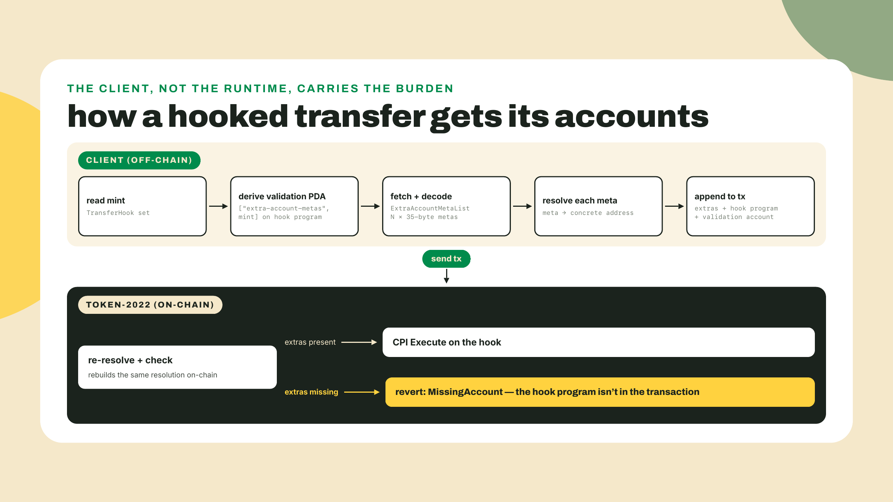
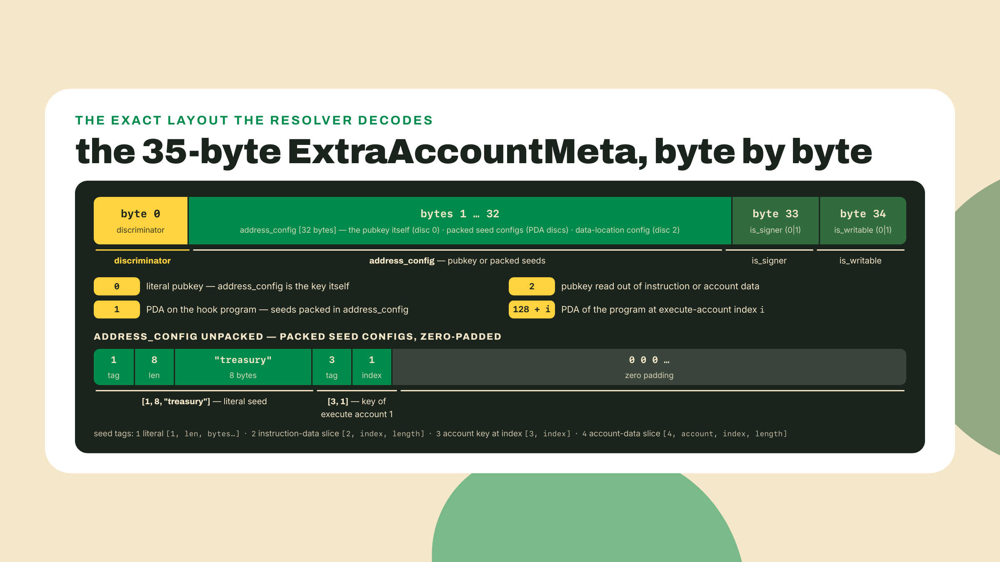
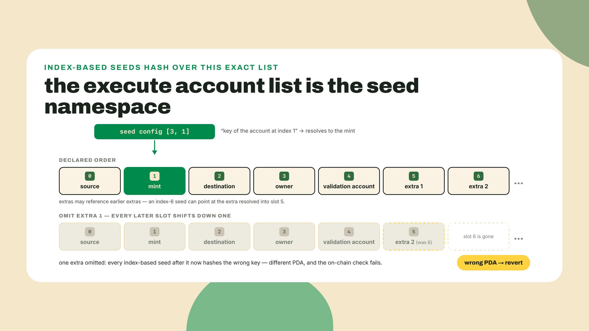
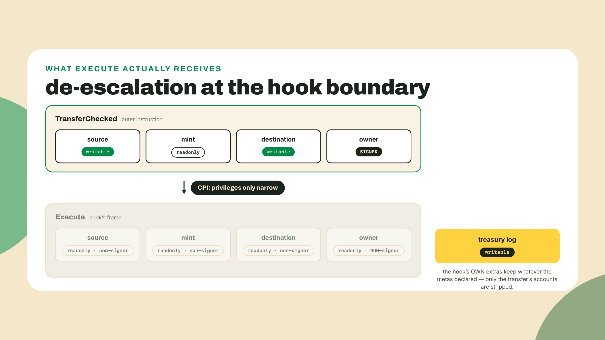
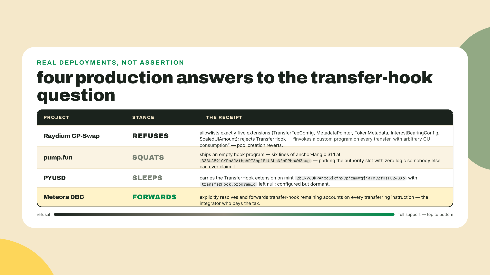
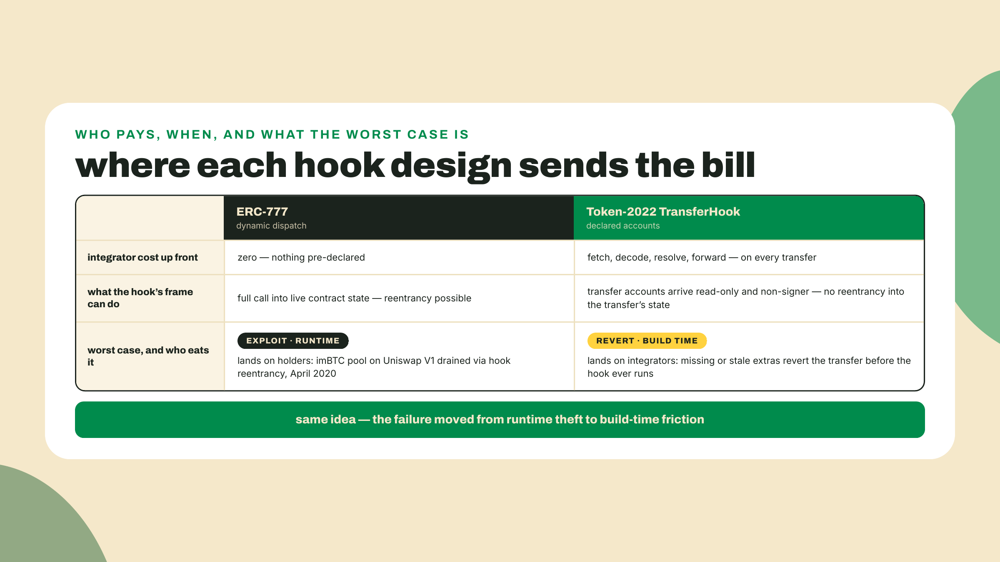
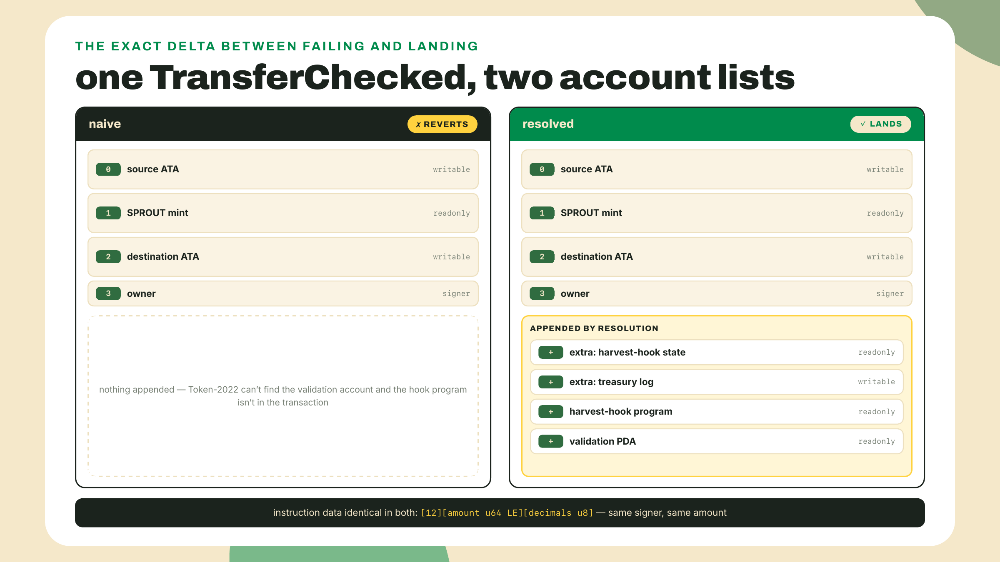

# Resolving hooks, and why they break composability

## Summary

Last lesson you authored the harvest-hook and proved it in a LiteSVM harness: an allowlisted transfer passed, a disallowed one failed. But the harness handed the hook its accounts by hand, and that is the fiction this lesson breaks. Today you sit in the consumer's chair: you build a plain Token-2022 transfer of hooked SPROUT the way a wallet would and watch it revert with a missing account, then you write the client-side resolver that reads the ExtraAccountMetaList off the hook program, rebuilds the transfer with the right accounts, and lands it. With that evidence on the table, we derive the design fact the whole composability argument hangs on: inside Execute, every account from the original transfer arrives read-only and non-signer, so a hook can never spend what it inspects. Fade check: the resolver is worked with you line by line, the transfer scripts are yours to wire and run, and the challenge is fully solo. Scope note: the transfer-hook interface is taught end to end here; sibling courses that touch hooked transfers point back rather than re-deriving it.

Your hook passed its tests. I want to ruin that feeling in the first five minutes, because the harness was lying to you politely: LiteSVM let you place every account into the transaction yourself, like a stage crew arranging props before the actor walks on. Real wallets do not know your hook exists. Real DEXes do not know your hook exists. The moment either builds a standard four-account TransferChecked for your SPROUT variant, the runtime goes looking for accounts not in the transaction, and the whole thing dies on the pad.

Before any theory, run this. It computes eight bytes you met last lesson from the program's side:

```bash
node -e 'const {createHash} = require("node:crypto");
console.log(createHash("sha256").update("spl-transfer-hook-interface:execute").digest().subarray(0, 8).toString("hex"))'
```

You should see `692565c54bfb661a`. Last lesson those bytes were the doorbell Token-2022 rings on your program. This lesson they are a debt: every single integrator who ever touches your token must find the accounts that discriminator demands, or their transfer reverts. Keep that hex in view; you will grep for it inside a real account in a few minutes.

## The resolution tax

### Who is supposed to assemble the accounts?

Start from the constraint you already own from this course's first module: a Solana transaction must declare, up front, every account it will touch. The runtime does not discover accounts mid-flight; it schedules around the declared list. Now add what you built last lesson: when a mint carries the TransferHook extension, Token-2022 CPIs into the hook program on every transfer, and your harvest-hook's Execute needs its own accounts to do its job, the allowlist state it checks and the treasury log it writes.

Put those two facts together and a question pops out with real force. The wallet building the transfer has never heard of your program. Token-2022 knows the hook's address from the mint, but not what accounts an arbitrary program might want. The hook knows its own needs, but programs cannot reach out and fetch accounts at runtime. Someone has to put the hook's accounts into the transaction before it is sent, and nothing in the stack volunteers.

Walk the naive answers, because each one fails in an instructive way. "The hook should load what it needs" fails first: on Solana there is no loading, an account not in the transaction does not exist as far as the program is concerned. "Token-2022 should hardcode the extra accounts" fails second: the entire point of the hook slot is that the program behind it is arbitrary, so no fixed list can serve every hook. "Make the sender's wallet just know" is not an answer, it is the problem restated.

The real answer is the one piece of the interface you have not touched yet: the hook publishes a machine-readable manifest of its account needs, on-chain, at a known address, and every client is expected to read it. That manifest is the ExtraAccountMetaList you initialized last lesson, living on your hook program at the PDA seeded by the literal `extra-account-metas` and the mint. The convention for reading and acting on it is called TLV Account Resolution, and the reference implementation is the Rust crate `spl-tlv-account-resolution`; this course pins 0.11.1, the same version last lesson's hook pins, and the byte layout below was read out of that crate's source and is unchanged from 0.11.0 through 0.11.3, the newest on crates.io as of 2026-09-01 (the 0.11.2/0.11.3 patches rework resolver internals, not the wire format). The flow every wallet, DEX, and script must perform:



Two words in that picture deserve precision, because the lab code depends on them.

First, the account itself. The validation account's data is TLV, the same type-length-value discipline you have been decoding since the mint lessons, but do not point your mint decoder at it: the header widths differ. A mint entry's type is a small u16 integer (your inspector printed 18 and 19) with a u16 length; this account's type is a full 8-byte hash (exactly the `692565c54bfb661a` you computed above, the execute discriminator, because this list answers the question "what does execute need") with a u32 length, then the value. The value is a little length-prefixed array: a u32 count, then count entries of exactly 35 bytes each.

Second, the entry. Each ExtraAccountMeta is a fixed 35-byte struct, and those 35 bytes are a small marvel of compression:



Read the discriminator row again, because it hides the sharpest footgun in this lesson. Discriminator 0 is easy: the 32 bytes are the address, done. Discriminator 1 says: derive a PDA on the hook program, using seeds unpacked from the config bytes. Discriminator 2 says: read the pubkey out of instruction or account data; the harvest-hook never emits it, and the resolver below refuses it loudly rather than guessing. And 128 plus i says: derive a PDA on whatever program sits at index i of the Execute instruction's account list. That last one means resolution is positional. The Execute instruction's accounts are, in order: source at 0, mint at 1, destination at 2, owner at 3, the validation account at 4, then each extra in list order. A seed config that says "key of account 1" means the mint because the mint is at index 1 of that list. Resolve the metas out of order, or drop one, and every index-based seed after it derives a different address. Nothing warns you. The derived PDA is simply wrong, the on-chain check fails, the transfer reverts. Order is not a convention here, it is an input to the hash.



There is one more consequence of storing the manifest in a mutable account: it can change. The hook's authority can call update-extra-account-metas and reshape the list, and a client that cached its resolution from last week is now forwarding last week's accounts. A stale set reverts exactly like a missing one. Resolve fresh, per transfer, or accept that your integration breaks the day the issuer touches the list. In practice that puts resolution in the same code path as fetching your blockhash: both are freshness reads against live chain state, both go stale the same way, and a transfer built from either cached value is a transfer built for a chain that no longer exists. The crate ships resolution helpers on the Rust side, and the reference JS client does the same job; in the lab you will write the resolver yourself in TypeScript, because after you have decoded those 35 bytes once by hand, every helper library you ever call stops being magic.

### The hook that can only say no

Now the other half of the question, the one your teammate asks the moment you propose shipping this: we just wired arbitrary code into every transfer of our token. What stops a malicious hook, or our own hook after a bad upgrade, from draining the sender mid-transfer? It has the source account. It has the owner. The owner signed.

The answer is not a promise, it is four lines of construction in the interface crate, and I want you to see the actual lines rather than trust my paraphrase. This is how `spl-transfer-hook-interface` builds the Execute instruction that Token-2022 sends your hook:

```rust
// spl-transfer-hook-interface, instruction.rs: the execute() builder.
let accounts = vec![
    AccountMeta::new_readonly(*source_pubkey, false),
    AccountMeta::new_readonly(*mint_pubkey, false),
    AccountMeta::new_readonly(*destination_pubkey, false),
    AccountMeta::new_readonly(*authority_pubkey, false),
    // …the builder then appends the validation account and the resolved extras.
];
```

Every account that came from the original transfer, the source, the mint, the destination, the owner who signed, is rebuilt as `AccountMeta::new_readonly(pubkey, false)`. Read the two arguments as two revoked powers. Read-only: the hook cannot debit the source, credit itself, or mutate any state the transfer touches, because the runtime enforces writability per instruction, and this instruction grants none. The `false` is the signer flag: even though the owner signed the outer transaction, that signature is not extended to the hook's frame, so the hook cannot turn around and CPI into Token-2022 pretending to act for the owner. In the CPI privilege model, permissions only ever narrow as calls descend. The interface chose the narrowest setting for every inherited account, and that choice is called de-escalation.

The narrowing runs one direction only, and the alternative shows why it has to. If a callee could escalate, then calling any program would mean trusting every program it might call, transitively, forever. So Solana's runtime lets a caller grant only privileges it already holds, and always allows it to grant fewer. The signature you handed your wallet authorizes one frame; every frame below inherits at most what the frame above chose to pass down, and Token-2022 chose to pass down nothing. The entire security argument for hooks rests on that choice, and you just read it in four lines of the interface crate.



That is last lesson's power inventory, observe, record on its own turf, and veto, now read off the interface's own lines rather than asserted; the one addition worth making is that your treasury log works because the log PDA is the hook's account, declared writable in the metas, not inherited from the transfer. When your teammate asks the drain question, the one-line answer is that the interface hands the hook every transfer account pre-stripped to read-only and non-signer, so there is nothing it can spend and no signature it can reuse.

Honesty requires the other side of the inventory, though, because "cannot steal" is not "cannot hurt". A veto is power. A hook that reverts unconditionally freezes every holder of the token, permanently if the hook is immutable, arbitrarily if its authority turns hostile. A hook can burn compute: Execute runs inside the transfer's budget with no cap of its own short of the transaction limit. And a malicious hook can absolutely move funds out of accounts its own program controls; the guarantee covers only the transfer's accounts. De-escalation makes the hook safe for the sender's balance. It does not make the hook safe for the token's liveness, and it does nothing about the cost. Hold both halves, because the ecosystem certainly does.

### The split, with receipts

So price the extension honestly, from both chairs. From the issuer's chair, a hook is per-transfer control: allowlists, logging, compliance gates, whatever policy fits in a program. From every other chair at the table, that same hook is a tax invoice. Each integrator must fetch, decode, and forward the right extra accounts on every transfer, forever, and a stale or missing account reverts a user's transaction at the worst possible moment. The de-escalation section told you the hook cannot rob the integrator. Nothing in the interface stops it from exhausting them.

Here is how the three most instructive players in production price it, and none of them is hypothetical:



Each row rewards a closer look. Raydium is the blunt one: its Token-2022 reference rejects TransferHook because it "invokes a custom program on every transfer, with arbitrary CU consumption", and rejecting PermanentDelegate in the same breath because "a holder of the delegate can sweep any token account, including the pool vault". Look at the five extensions that DID make its allowlist: a fee config, two metadata forms, interest display, scaled display. Every one of them is passive. The pattern is the course's compatibility thesis in miniature: extensions that reshape display or accrue fees get whitelisted, extensions that run code or hold power over accounts get refused, by name, in production.

pump.fun is the funny one, and then it is not funny. Their production transfer hook is literally `#[program] pub mod transfer_hook_authority {}`: six lines of anchor-lang 0.31.1, deployed at `333UA891CYPpAJAthphPT3hg1EkUBLhNFoP9HoWW3nug`, containing nothing. Be careful about WHY, because the obvious reading is wrong and m05-l1 puts the correction on the page: nobody else could ever have claimed that slot anyway. A mint's hook slot is set at ITS creation by whoever creates it, so there is no race to win and nothing to squat. What pump did is narrower and more interesting: they pointed their own mints' birth-only hook slot at a program that provably does nothing, rather than leaving the slot empty for a future version of themselves to fill with live logic. It is a commitment device aimed at their own future, and that empty chamber guards real transfer volume today: the slot is valuable enough to fill and dangerous enough to fill with nothing. And notice what even an empty hook would cost if armed: the moment a real program id lands in that slot, every integrator on the planet owes the resolution dance we just taught, even if Execute does nothing at all. A no-op hook is not free. The tax is charged on the slot, not on the logic.


PYUSD, the flagship Token-2022 launch of May 2024, runs the same play from the compliance side on a regulated stablecoin mint carrying hundreds of millions of dollars of supply (774M PYUSD on a live read, 2026-09-01): the mint carries the TransferHook extension with `transferHook.programId` set to null. The slot is configured, the gun is loaded, the chamber is empty. Issuers reach for this pattern because it preserves the option of per-transfer control without charging today's integrators the tax; in the challenge you re-read that null with your own decoder instead of the borrowed script that first printed it in m01-l1. And Meteora's DBC is the counterpoint that proves forwarding is possible at protocol scale: it explicitly forwards transfer-hook remaining accounts on every transferring instruction. The tax can be paid. Most venues have simply decided your hook is not worth the invoice.

Step back once, because the shape of this tax is not a Solana quirk, it is the bill for a design choice you already know. Solana demands every account be declared before execution; that is what makes parallel scheduling possible, and it is why the p-token transfer you measured in module one runs in double-digit CU. A chain with dynamic dispatch charges no resolution tax: Ethereum's ERC-777 let token contracts call receiver hooks with nothing pre-declared, and integrators paid zero up front. They paid later. Those hooks could reenter the calling contract mid-transfer, and the imBTC pool on Uniswap V1 was drained through exactly that door in April 2020. The transfer hook is the same idea with the failure modes moved around: the declared-accounts model exports the bookkeeping to the client, which is annoying, and in exchange the hook arrives in a frame where it can touch nothing, which is the guarantee ERC-777 never had. You pay the tax in integration code instead of in exploits. Which side of that trade looks better depends on which chair you sit in, and the table above is the market voting from every chair at once.



That is the trade-off, stated as plainly as I can: a hook buys the issuer per-transfer control and exports a resolution tax onto every integrator downstream, and the market's revealed preference is to refuse the tax. If SPROUT must trade on the major venues, the hook is the extension you will most regret. If SPROUT is a permissioned instrument where you control the venues, the hook is exactly the right tool. The Payments & Commerce course sits on the second side of that line: its subscriptions rail consumes this same hook-forwarding behavior against a merchant-controlled flow, and it points back to this lesson instead of re-deriving it.

## Lab: teach a wallet to carry your hook's accounts

The plan: stand up a local surfnet, deploy last lesson's harvest-hook, mint a fresh hooked SPROUT variant, then send the same TransferChecked twice, once naked and once resolved. Everything TypeScript below was type-checked strict against the pinned toolchain on 2026-08-22, and the resolver's decode path was additionally tested against hand-built synthetic list bytes; a handful of live-chain numbers in this lesson were re-read on 2026-09-01 during final edit, and wherever a date matters it is printed next to its number. The parts that need your deployed hook are the parts only you can run.

1. **Boot a local surfnet.** Surfpool gives you a local validator that behaves like mainnet and needs no keys; it is the same tool you installed back in m02-l1 (surfpool 1.2.1 on my machine, verified 2026-08-22; `curl -sL https://run.surfpool.run/ | bash` if this machine does not have it yet):

   ```bash
   surfpool --version
   surfpool start --no-tui --no-studio
   ```

   Leave it running. RPC lands on `http://127.0.0.1:8899`, websockets on `ws://127.0.0.1:8900`. In a second terminal, point the `solana` CLI (it arrived with last lesson's Agave toolchain install) at it and make sure your default keypair has lamports: `solana config set --url http://127.0.0.1:8899`, then `solana airdrop 100` if your balance is zero.

2. **Deploy the harvest-hook.** From last lesson's program repo (the anchor-lang 1.1.2 build; the framework layer itself is Master Anchor V2's course, we only ship the one program). One reconciliation step first, because this is the classic self-deploy trap: last lesson's source hardcodes `declare_id!("HookH1FQuTU21GVAjJZDLXPjXWLQFPJ5FLpwGKZLkYQ")`, and no keypair for that address exists on your machine. `solana program deploy` deploys at the address of the auto-generated keypair in `target/deploy/harvest_hook-keypair.json`, so the runtime id and the declared id would disagree, and Anchor's generated entrypoint rejects every call with `DeclaredProgramIdMismatch`. (Your LiteSVM harness never hit this because it loaded the `.so` at `harvest_hook::ID` directly; a real deploy has no such courtesy.) Sync the two before deploying:

   ```bash
   solana address -k target/deploy/harvest_hook-keypair.json
   # paste that address into declare_id!(...) in src/lib.rs, then:
   cargo build-sbf
   solana program deploy target/deploy/harvest_hook.so
   ```

   Copy the printed program id, which now matches your `declare_id!`; it is `$HOOK` for the rest of the lab.

3. **Mint the hooked SPROUT variant.** You proved last lesson that TransferHook is creation-only, so we mint fresh rather than retrofit. The `spl-token` CLI from m01-l4 handles the whole ceremony (spl-token-cli 5.6.1 on crates.io as of 2026-08-22):

   ```bash
   spl-token create-token --program-2022 --decimals 6 --transfer-hook $HOOK
   # copy the mint address -> $MINT
   spl-token create-account $MINT
   spl-token mint $MINT 1000
   solana-keygen new --no-bip39-passphrase -o stranger.json
   # copy the stranger's pubkey -> $DEST
   spl-token create-account $MINT --owner $DEST
   ```

   Checkpoint: `spl-token display $MINT` shows the TransferHook extension with your program id in it. Note what just happened silently: both token accounts were created with the TransferHookAccount extension, because a hooked mint forces it onto every holder.

4. **Re-arm the hook's on-chain state.** Inside LiteSVM you initialized the ExtraAccountMetaList in the harness; this surfnet has never seen it. The initialize call is interface-standard, so I can hand it to you byte for byte. Set up a client workspace first (kit pinned at 7.1.1 exactly, the same peer-range pin the course workspace rides; note the kit-^7 line of `@solana-program/token-2022` is 0.15.0, which we deliberately do not need, everything below is raw kit):

   ```bash
   mkdir sprout-client && cd sprout-client
   npm init -y && npm pkg set type=module
   npm install @solana/kit@7.1.1
   npm install -D tsx@4.20.5
   export MINT=... HOOK=... DEST=...
   ```

   Save `init-metas.ts`:

   ```typescript
   // init-metas.ts: one call to the harvest-hook's own
   // initialize-extra-account-metas instruction, so the validation account
   // exists on the surfnet the way it existed inside last lesson's harness.
   import {
     AccountRole,
     address,
     appendTransactionMessageInstruction,
     assertIsTransactionWithBlockhashLifetime,
     createKeyPairSignerFromBytes,
     createSolanaRpc,
     createSolanaRpcSubscriptions,
     createTransactionMessage,
     pipe,
     sendAndConfirmTransactionFactory,
     setTransactionMessageFeePayerSigner,
     setTransactionMessageLifetimeUsingBlockhash,
     signTransactionMessageWithSigners,
     type Instruction,
   } from '@solana/kit';
   import { createHash } from 'node:crypto';
   import { readFileSync } from 'node:fs';
   import { homedir } from 'node:os';
   import { getExtraAccountMetaAddress } from './resolve.js';

   const SYSTEM_PROGRAM = address('11111111111111111111111111111111');
   const MINT = address(process.env.MINT!);
   const HOOK = address(process.env.HOOK!);

   const rpc = createSolanaRpc('http://127.0.0.1:8899');
   const rpcSubscriptions = createSolanaRpcSubscriptions('ws://127.0.0.1:8900');

   const payer = await createKeyPairSignerFromBytes(
     new Uint8Array(JSON.parse(readFileSync(`${homedir()}/.config/solana/id.json`, 'utf8'))),
   );

   const validationAccount = await getExtraAccountMetaAddress(MINT, HOOK);

   // Same hashed-string discriminator scheme as execute:
   // sha256("spl-transfer-hook-interface:initialize-extra-account-metas")[0..8].
   const initDiscriminator = new Uint8Array(
     createHash('sha256')
       .update('spl-transfer-hook-interface:initialize-extra-account-metas')
       .digest()
       .subarray(0, 8),
   );

   const ix: Instruction = {
     programAddress: HOOK,
     accounts: [
       { address: validationAccount, role: AccountRole.WRITABLE },
       { address: MINT, role: AccountRole.READONLY },
       { address: payer.address, role: AccountRole.WRITABLE_SIGNER },
       { address: SYSTEM_PROGRAM, role: AccountRole.READONLY },
     ],
     data: initDiscriminator,
   };

   const { value: latestBlockhash } = await rpc.getLatestBlockhash().send();
   const tx = await signTransactionMessageWithSigners(
     pipe(
       createTransactionMessage({ version: 0 }),
       (m) => setTransactionMessageFeePayerSigner(payer, m),
       (m) => setTransactionMessageLifetimeUsingBlockhash(latestBlockhash, m),
       (m) => appendTransactionMessageInstruction(ix, m),
     ),
   );
   assertIsTransactionWithBlockhashLifetime(tx);
   await sendAndConfirmTransactionFactory({ rpc, rpcSubscriptions })(tx, {
     commitment: 'confirmed',
   });
   console.log('ExtraAccountMetaList initialized at', validationAccount);
   ```

   One of the imports, `getExtraAccountMetaAddress`, comes from `resolve.js`, which you write in the next step, so run nothing yet. Two more management calls are NOT interface-standard, and both must run before any transfer: your hook's own `initialize`, then its allowlist. This surfnet has never seen your hook-config or treasury-log PDAs any more than it had seen the meta list; `allow_destination` cannot run without the config (its `has_one` check deserializes it), and Act 2's Execute deserializes both PDAs with their stored bumps, so skipping `initialize` kills the resolved transfer just as surely as a missing meta list. Both instructions belong to your program's own API from last lesson, and since nothing so far has shown you how to hand-encode an Anchor instruction with an argument, this one is worked too. Two facts carry the whole script: an Anchor discriminator derives as `sha256("global:<method_name>")[0..8]`, same hashed-string trick as the interface under a different namespace, and a borsh-encoded `Pubkey` argument is just its 32 raw bytes appended after the discriminator. Mind WHICH key you allowlist: the gate you wrote compares `ctx.accounts.destination.key()`, the destination TOKEN ACCOUNT at Execute index 2, so the entry to add is the stranger's ATA, not their wallet pubkey (`spl-token address --token $MINT --owner $DEST --verbose` prints it; export it as `$DEST_ATA`). Save `init-hook.ts`:

   ```typescript
   // init-hook.ts: the two non-interface management calls, hand-encoded.
   // initialize (no args), then allow_destination(destination: Pubkey).
   import {
     AccountRole,
     address,
     appendTransactionMessageInstructions,
     assertIsTransactionWithBlockhashLifetime,
     createKeyPairSignerFromBytes,
     createSolanaRpc,
     createSolanaRpcSubscriptions,
     createTransactionMessage,
     getAddressEncoder,
     getProgramDerivedAddress,
     pipe,
     sendAndConfirmTransactionFactory,
     setTransactionMessageFeePayerSigner,
     setTransactionMessageLifetimeUsingBlockhash,
     signTransactionMessageWithSigners,
     type Instruction,
   } from '@solana/kit';
   import { createHash } from 'node:crypto';
   import { readFileSync } from 'node:fs';
   import { homedir } from 'node:os';

   const SYSTEM_PROGRAM = address('11111111111111111111111111111111');
   const MINT = address(process.env.MINT!);
   const HOOK = address(process.env.HOOK!);
   const DEST_ATA = address(process.env.DEST_ATA!); // the stranger's TOKEN ACCOUNT

   const rpc = createSolanaRpc('http://127.0.0.1:8899');
   const rpcSubscriptions = createSolanaRpcSubscriptions('ws://127.0.0.1:8900');
   const enc = getAddressEncoder();

   const payer = await createKeyPairSignerFromBytes(
     new Uint8Array(JSON.parse(readFileSync(`${homedir()}/.config/solana/id.json`, 'utf8'))),
   );

   // Anchor namespace, not the interface namespace: sha256("global:<name>")[0..8].
   const anchorDisc = (name: string): Uint8Array =>
     new Uint8Array(createHash('sha256').update(`global:${name}`).digest().subarray(0, 8));

   const pda = async (seed: string) => {
     const [addr] = await getProgramDerivedAddress({
       programAddress: HOOK,
       seeds: [seed, enc.encode(MINT)],
     });
     return addr;
   };
   const config = await pda('hook-config');
   const treasury = await pda('treasury');

   // initialize: no args; accounts in the Initialize struct's exact order.
   const initIx: Instruction = {
     programAddress: HOOK,
     accounts: [
       { address: payer.address, role: AccountRole.WRITABLE_SIGNER },
       { address: MINT, role: AccountRole.READONLY },
       { address: config, role: AccountRole.WRITABLE },
       { address: treasury, role: AccountRole.WRITABLE },
       { address: SYSTEM_PROGRAM, role: AccountRole.READONLY },
     ],
     data: anchorDisc('initialize'),
   };

   // allow_destination(destination: Pubkey): 8-byte discriminator + 32 raw
   // borsh bytes of the pubkey. The Manage struct's order: authority, config.
   const allowData = new Uint8Array(40);
   allowData.set(anchorDisc('allow_destination'), 0);
   allowData.set(new Uint8Array(enc.encode(DEST_ATA)), 8);
   const allowIx: Instruction = {
     programAddress: HOOK,
     accounts: [
       { address: payer.address, role: AccountRole.READONLY_SIGNER },
       { address: config, role: AccountRole.WRITABLE },
     ],
     data: allowData,
   };

   const { value: latestBlockhash } = await rpc.getLatestBlockhash().send();
   const tx = await signTransactionMessageWithSigners(
     pipe(
       createTransactionMessage({ version: 0 }),
       (m) => setTransactionMessageFeePayerSigner(payer, m),
       (m) => setTransactionMessageLifetimeUsingBlockhash(latestBlockhash, m),
       (m) => appendTransactionMessageInstructions([initIx, allowIx], m),
     ),
   );
   assertIsTransactionWithBlockhashLifetime(tx);
   await sendAndConfirmTransactionFactory({ rpc, rpcSubscriptions })(tx, {
     commitment: 'confirmed',
   });
   console.log('hook config + treasury initialized; allowlisted', DEST_ATA);
   ```

   Run order once `resolve.ts` exists in the next step: `npx tsx init-metas.ts`, then `npx tsx init-hook.ts`. If you renamed methods, seeds, or reordered the account structs in your own harvest-hook, adjust this script to match your program, not the other way around. Do all of it before act one, because the point of the next act is that forwarding, and only forwarding, stands between the stranger and their tokens.

5. **Write the resolver.** This is the heart of the lab, and it is a direct TypeScript transcription of what `spl-tlv-account-resolution` 0.11.1 does in Rust. Save `resolve.ts`:

   ```typescript
   // resolve.ts: client-side TLV Account Resolution for a Token-2022 transfer hook.
   // Mirrors what spl-tlv-account-resolution 0.11.1 does in Rust, byte for byte.
   import {
     AccountRole,
     getAddressDecoder,
     getAddressEncoder,
     getProgramDerivedAddress,
     type Address,
     type AccountMeta,
     type Rpc,
     type SolanaRpcApi,
   } from '@solana/kit';
   import { createHash } from 'node:crypto';

   const enc = getAddressEncoder();
   const dec = getAddressDecoder();

   // The TLV entry we are looking for is typed by the execute instruction's
   // hashed-string discriminator: sha256("spl-transfer-hook-interface:execute")[0..8].
   export const EXECUTE_DISCRIMINATOR = new Uint8Array(
     createHash('sha256')
       .update('spl-transfer-hook-interface:execute')
       .digest()
       .subarray(0, 8),
   ); // 69 25 65 c5 4b fb 66 1a

   // One validation account per mint, on the HOOK program:
   // seeds = ["extra-account-metas", mint].
   export async function getExtraAccountMetaAddress(
     mint: Address,
     hookProgram: Address,
   ): Promise<Address> {
     const [pda] = await getProgramDerivedAddress({
       programAddress: hookProgram,
       seeds: ['extra-account-metas', enc.encode(mint)],
     });
     return pda;
   }

   // The fixed 35-byte entry: discriminator u8 | address_config [u8;32] |
   // is_signer u8 | is_writable u8.
   export interface ExtraAccountMeta {
     discriminator: number;
     addressConfig: Uint8Array;
     isSigner: boolean;
     isWritable: boolean;
   }

   // Account layout: [8-byte TLV type][u32 LE length][u32 LE count][count * 35 bytes].
   export function unpackExtraAccountMetaList(data: Uint8Array): ExtraAccountMeta[] {
     const view = new DataView(data.buffer, data.byteOffset, data.byteLength);
     let offset = 0;
     while (offset + 12 <= data.length) {
       const tlvType = data.subarray(offset, offset + 8);
       const length = view.getUint32(offset + 8, true);
       if (equalBytes(tlvType, EXECUTE_DISCRIMINATOR)) {
         const count = view.getUint32(offset + 12, true);
         const entries = data.subarray(offset + 16, offset + 16 + count * 35);
         const metas: ExtraAccountMeta[] = [];
         for (let i = 0; i < count; i++) {
           const e = entries.subarray(i * 35, (i + 1) * 35);
           metas.push({
             discriminator: e[0],
             addressConfig: e.subarray(1, 33),
             isSigner: e[33] === 1,
             isWritable: e[34] === 1,
           });
         }
         return metas;
       }
       offset += 12 + length;
     }
     throw new Error('no TLV entry under the execute discriminator: is the list initialized?');
   }

   // Resolution is positional against the EXECUTE instruction, which the runtime
   // will build as: [0] source, [1] mint, [2] destination, [3] owner,
   // [4] validation account, then each extra in list order. Seeds that reference
   // "account at index N" mean N in THAT list, which is why order is not optional.
   export async function resolveTransferHookAccounts(
     rpc: Rpc<SolanaRpcApi>,
     mint: Address,
     hookProgram: Address,
     source: Address,
     destination: Address,
     owner: Address,
     amount: bigint,
   ): Promise<AccountMeta[]> {
     const validationAccount = await getExtraAccountMetaAddress(mint, hookProgram);
     const { value: account } = await rpc
       .getAccountInfo(validationAccount, { encoding: 'base64' })
       .send();
     if (!account) {
       throw new Error(`validation account ${validationAccount} does not exist on this cluster`);
     }
     const raw = Uint8Array.from(Buffer.from(account.data[0], 'base64'));
     const metas = unpackExtraAccountMetaList(raw);

     const executeKeys: Address[] = [source, mint, destination, owner, validationAccount];
     const executeData = buildExecuteData(amount);

     const resolved: AccountMeta[] = [];
     for (const meta of metas) {
       const resolvedAddress = await resolveMeta(meta, executeKeys, executeData, hookProgram);
       executeKeys.push(resolvedAddress);
       resolved.push({
         address: resolvedAddress,
         role: meta.isSigner
           ? meta.isWritable
             ? AccountRole.WRITABLE_SIGNER
             : AccountRole.READONLY_SIGNER
           : meta.isWritable
             ? AccountRole.WRITABLE
             : AccountRole.READONLY,
       });
     }

     // Canonical append order for the transferring instruction:
     // the resolved extras in list order, then the hook program, then the
     // validation account. This mirrors the reference client helper.
     return [
       ...resolved,
       { address: hookProgram, role: AccountRole.READONLY },
       { address: validationAccount, role: AccountRole.READONLY },
     ];
   }

   async function resolveMeta(
     meta: ExtraAccountMeta,
     executeKeys: Address[],
     executeData: Uint8Array,
     hookProgram: Address,
   ): Promise<Address> {
     // discriminator 0: address_config IS the pubkey.
     if (meta.discriminator === 0) {
       return dec.decode(meta.addressConfig);
     }
     // discriminator 1: PDA on the hook program.
     // discriminator 128 + i: PDA of the program whose address sits at
     // execute-instruction account index i.
     if (meta.discriminator === 1 || meta.discriminator >= 128) {
       const programAddress =
         meta.discriminator === 1 ? hookProgram : executeKeys[meta.discriminator - 128];
       if (!programAddress) {
         throw new Error(`seed program index ${meta.discriminator - 128} is out of range`);
       }
       const seeds = unpackSeeds(meta.addressConfig, executeKeys, executeData);
       const [pda] = await getProgramDerivedAddress({ programAddress, seeds });
       return pda;
     }
     // discriminator 2 (pubkey stored in account/instruction data) exists in the
     // crate but the harvest-hook never uses it; fail loudly instead of guessing.
     throw new Error(`ExtraAccountMeta discriminator ${meta.discriminator} not supported here`);
   }

   // address_config for a PDA holds packed seed configs, zero-padded to 32 bytes:
   // 1 = literal (len, bytes), 2 = instruction-data slice (index, length),
   // 3 = account key at index, 4 = account-data slice.
   function unpackSeeds(
     config: Uint8Array,
     executeKeys: Address[],
     executeData: Uint8Array,
   ): Uint8Array[] {
     const seeds: Uint8Array[] = [];
     let i = 0;
     while (i < 32) {
       const tag = config[i];
       if (tag === 0) break; // zero padding: no more seeds
       if (tag === 1) {
         const len = config[i + 1];
         seeds.push(config.subarray(i + 2, i + 2 + len));
         i += 2 + len;
       } else if (tag === 2) {
         const index = config[i + 1];
         const length = config[i + 2];
         seeds.push(executeData.subarray(index, index + length));
         i += 3;
       } else if (tag === 3) {
         const index = config[i + 1];
         const key = executeKeys[index];
         if (!key) {
           throw new Error(`seed wants account index ${index}, which is not resolved yet`);
         }
         seeds.push(new Uint8Array(enc.encode(key)));
         i += 2;
       } else {
         // tag 4 reads another account's data; the harvest-hook does not use it.
         throw new Error(`seed config tag ${tag} not implemented in this lab`);
       }
     }
     return seeds;
   }

   // The execute instruction's data, needed for instruction-data seeds:
   // [8-byte execute discriminator][u64 LE amount].
   function buildExecuteData(amount: bigint): Uint8Array {
     const data = new Uint8Array(16);
     data.set(EXECUTE_DISCRIMINATOR, 0);
     new DataView(data.buffer).setBigUint64(8, amount, true);
     return data;
   }

   function equalBytes(a: Uint8Array, b: Uint8Array): boolean {
     return a.length === b.length && a.every((byte, i) => byte === b[i]);
   }
   ```

   Three details are worth a second read. The `executeKeys` array starts as the five base accounts and grows as each extra resolves, which is exactly how index-based seeds can legally reference an earlier extra: order, again, is an input. The role mapping keeps whatever signer and writable flags the metas declared for the hook's OWN accounts, that is how your treasury log stays writable. And `resolveMeta` refuses discriminator 2 loudly instead of guessing; the crate supports a pubkey-in-data variant that the harvest-hook never uses, and a resolver that silently mis-handles an encoding is worse than one that stops.

6. **Run the tale of two transfers.** Now the payoff script, and note the on-chain revert will name the failure for you. If you did not already run `init-metas.ts` in step 4, run it now (`npx tsx init-metas.ts`; tsx runs TypeScript directly, and step 4 put the 4.20.5 pin m01-l1 introduced into this workspace's own devDependencies rather than trusting whatever `npx` finds). Running it a SECOND time is not harmless and the failure is opaque: the Anchor `init` inside it creates the validation account, so a re-run comes back as a bare `Custom program error: #0`, which is `AccountAlreadyInUse` and means the account you wanted already exists. Then save `transfer.ts`:

   ```typescript
   // transfer.ts: the same TransferChecked, twice: once the way a naive wallet
   // builds it (simulated, watch it die), once with the resolved extras appended.
   import {
     AccountRole,
     address,
     appendTransactionMessageInstruction,
     assertIsTransactionWithBlockhashLifetime,
     createKeyPairSignerFromBytes,
     createSolanaRpc,
     createSolanaRpcSubscriptions,
     createTransactionMessage,
     getAddressEncoder,
     getBase64EncodedWireTransaction,
     getProgramDerivedAddress,
     getSignatureFromTransaction,
     pipe,
     sendAndConfirmTransactionFactory,
     setTransactionMessageFeePayerSigner,
     setTransactionMessageLifetimeUsingBlockhash,
     signTransactionMessageWithSigners,
     type Address,
     type AccountMeta,
     type Instruction,
   } from '@solana/kit';
   import { readFileSync } from 'node:fs';
   import { homedir } from 'node:os';
   import { resolveTransferHookAccounts } from './resolve.js';

   const TOKEN_2022 = address('TokenzQdBNbLqP5VEhdkAS6EPFLC1PHnBqCXEpPxuEb');
   const ATA_PROGRAM = address('ATokenGPvbdGVxr1b2hvZbsiqW5xWH25efTNsLJA8knL');

   const MINT = address(process.env.MINT!);
   const HOOK = address(process.env.HOOK!);
   const DEST_OWNER = address(process.env.DEST!);
   const AMOUNT = 5_000_000n; // 5 SPROUT at 6 decimals
   const DECIMALS = 6;

   const rpc = createSolanaRpc('http://127.0.0.1:8899');
   const rpcSubscriptions = createSolanaRpcSubscriptions('ws://127.0.0.1:8900');
   const enc = getAddressEncoder();

   const payer = await createKeyPairSignerFromBytes(
     new Uint8Array(JSON.parse(readFileSync(`${homedir()}/.config/solana/id.json`, 'utf8'))),
   );

   async function ata(owner: Address): Promise<Address> {
     const [addr] = await getProgramDerivedAddress({
       programAddress: ATA_PROGRAM,
       seeds: [enc.encode(owner), enc.encode(TOKEN_2022), enc.encode(MINT)],
     });
     return addr;
   }

   const source = await ata(payer.address);
   const destination = await ata(DEST_OWNER);

   // TransferChecked is Token-2022 instruction 12: [12][amount u64 LE][decimals u8].
   const data = new Uint8Array(10);
   data[0] = 12;
   new DataView(data.buffer).setBigUint64(1, AMOUNT, true);
   data[9] = DECIMALS;

   const baseAccounts: AccountMeta[] = [
     { address: source, role: AccountRole.WRITABLE },
     { address: MINT, role: AccountRole.READONLY },
     { address: destination, role: AccountRole.WRITABLE },
     { address: payer.address, role: AccountRole.READONLY_SIGNER },
   ];

   async function buildAndSign(accounts: AccountMeta[]) {
     const ix: Instruction = { programAddress: TOKEN_2022, accounts, data };
     const { value: latestBlockhash } = await rpc.getLatestBlockhash().send();
     const message = pipe(
       createTransactionMessage({ version: 0 }),
       (m) => setTransactionMessageFeePayerSigner(payer, m),
       (m) => setTransactionMessageLifetimeUsingBlockhash(latestBlockhash, m),
       (m) => appendTransactionMessageInstruction(ix, m),
     );
     return await signTransactionMessageWithSigners(message);
   }

   // Act 1: the naive transfer. Four accounts, exactly what a hookless wallet sends.
   const naive = await buildAndSign(baseAccounts);
   const sim = await rpc
     .simulateTransaction(getBase64EncodedWireTransaction(naive), { encoding: 'base64' })
     .send();
   // kit decodes numeric RPC fields as bigints unless the field is on its
   // allowed-numeric list, and the instruction index inside InstructionError
   // is not on it. JSON.stringify throws TypeError on any bigint it meets, so
   // without this replacer act 1 dies right here with a stack trace pointing
   // at your own file, and act 2 never runs. Number() is safe for an
   // instruction index and keeps it unquoted in the output.
   //
   // Worth knowing WHY this is a kit problem specifically: m01-l1 stringified
   // the same InstructionError shape with no replacer and no crash, because it
   // spoke to the RPC with a bare fetch and JSON.parse never produces bigints.
   // The hazard arrives with the typed client, not with the JSON.
   const bigintSafe = (_key: string, value: unknown): unknown =>
     typeof value === 'bigint' ? Number(value) : value;
   console.log('naive transfer err:', JSON.stringify(sim.value.err, bigintSafe));
   for (const line of sim.value.logs ?? []) console.log('  ', line);

   // Act 2: resolve the hook's extras off-chain and forward them.
   const extras = await resolveTransferHookAccounts(
     rpc, MINT, HOOK, source, destination, payer.address, AMOUNT,
   );
   console.log('\nforwarding', extras.length, 'extra accounts:');
   for (const meta of extras) console.log('  ', meta.address, 'role', meta.role);

   const resolved = await buildAndSign([...baseAccounts, ...extras]);
   assertIsTransactionWithBlockhashLifetime(resolved);
   const sendAndConfirm = sendAndConfirmTransactionFactory({ rpc, rpcSubscriptions });
   await sendAndConfirm(resolved, { commitment: 'confirmed' });
   console.log('\nresolved transfer landed:', getSignatureFromTransaction(resolved));
   ```

   Run it: `npx tsx transfer.ts`. Checkpoint, act one: the simulation error should read `{"InstructionError":[0,"MissingAccount"]}`, with a log line naming your hook as `Unknown program $HOOK` and a final line reading `An account required by the instruction is missing`. Read which account is missing, because it is not the one most people guess. Token-2022 looks for the validation account among the accounts you sent, does not find it, and therefore never resolves anything; it then CPIs into a hook program that is also not in the transaction, and the runtime cannot invoke a program it was never handed. That is the wallet-shaped failure from this lesson's opening, reproduced on demand. Checkpoint, act two: a printed list of forwarded accounts (your hook's extras, then the hook program, then the validation account) followed by `resolved transfer landed:` and a signature. Confirm with `spl-token balance $MINT --owner $DEST`: the stranger holds 5. Same instruction, same signer, same amount; the only difference between death and landing was the account list.



7. **Watch a resolving client do it for you.** One last probe, now that you know what the machinery costs:

   ```bash
   spl-token transfer $MINT 1 $DEST --allow-unfunded-recipient
   ```

   That flag is not about hooks and it is not optional here: step 3 keygenned the stranger without funding it, and the CLI hard-errors client-side on a recipient with no SOL before it builds anything. Drop the flag and you get a refusal that has nothing to teach you about transfer hooks. With it, the transfer lands with no hook-specific flags at all, because the CLI is a well-behaved integrator that runs this same resolution online before sending (its `--transfer-hook-account` flag exists for offline signing, where no RPC is there to resolve against). Every tool that "just works" with your hooked token is quietly paying the tax you just itemized.

## Challenge

Solo, three parts, no scaffolding.

First, break the resolved transfer three ways and diagnose each one by the layer that killed it. Send the naive four-account transfer from act one again. Then send one with everything forwarded EXCEPT the last appended account, the validation PDA. Then send a fully forwarded one to a destination you have NOT allowlisted. All three die, and no two die in the same place: one never reaches your program at all, one reaches it and is rejected before your logic runs, and one is your own veto firing. Write one sentence per failure naming the layer and quoting the log line that proves it. Two warnings, because the middle case is the trap: its error message contains the phrase "not enough account keys", which sounds like the runtime complaining but is not, and the surest tell of the first case is a line that is absent rather than present. If you want a hint about why this distinction matters operationally, notice which of the three your users would blame on their wallet and which on your token.

Second, the assessment gate, in one line: from the read-only de-escalation, state why your hook, or any hook, cannot spend the sender's tokens. If your sentence does not mention both revoked powers, writability and the signature, it is not yet the whole answer.

Third, take it to mainnet. Point your m01-l2 `decode-mint` inspector at PYUSD's mint, `2b1kV6DkPAnxd5ixfnxCpjxmKwqjjaYmCZfHsFu24GXo`, walk the TLV to the TransferHook entry, and read the program id: thirty-two zero bytes, the null that makes the whole extension dormant. m01-l1's borrowed script printed this null for you on day one; today you have verified it byte by byte with a decoder you wrote, on a regulated nine-figure stablecoin, and you know exactly what would change for every PYUSD integrator on earth the day that field stops being zero.

If any checkpoint here printed something mine did not, or your hook's account layout forced you to adapt a script, flag it in the course feedback channel with the command and output pasted in. Resolution bugs are exactly the class of failure that only shows up on real machines, and a reader's broken run teaches this course more than a clean one.

Next module raises the stakes on what a transfer will even show. You just proved a hook cannot act on tokens it does not control; the next extension goes further and hides the amount itself. Confidential balances encrypt the number moving into a sealed envelope only the sender, the receiver, and an optional auditor can open, and be warned before you sketch a design that wants both: the pairing is treacherous. A confidential transfer still invokes your hook, but hands it a sentinel amount (`u64::MAX`) instead of the real number, so any hook whose logic gates on amounts goes blind exactly when the amount is hidden. That is where we go next: how Token-2022 moves value it refuses to show.
