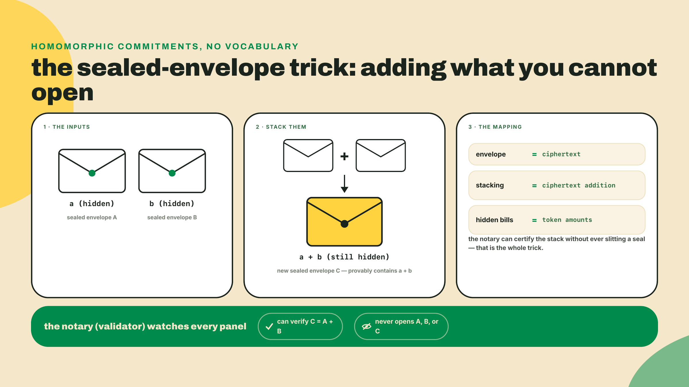
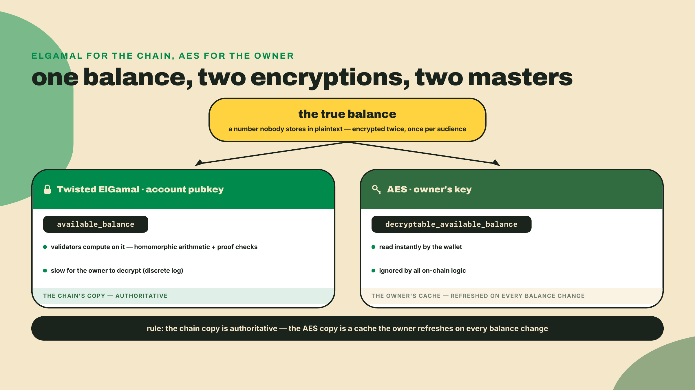
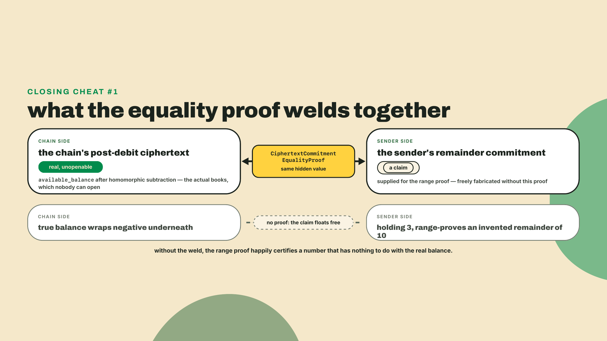
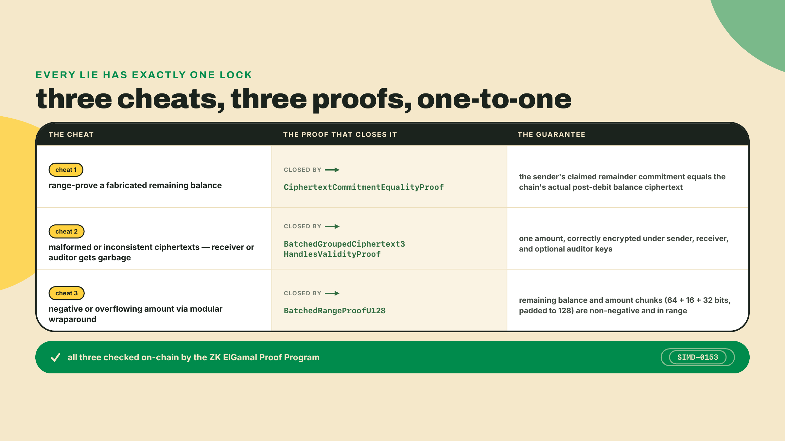
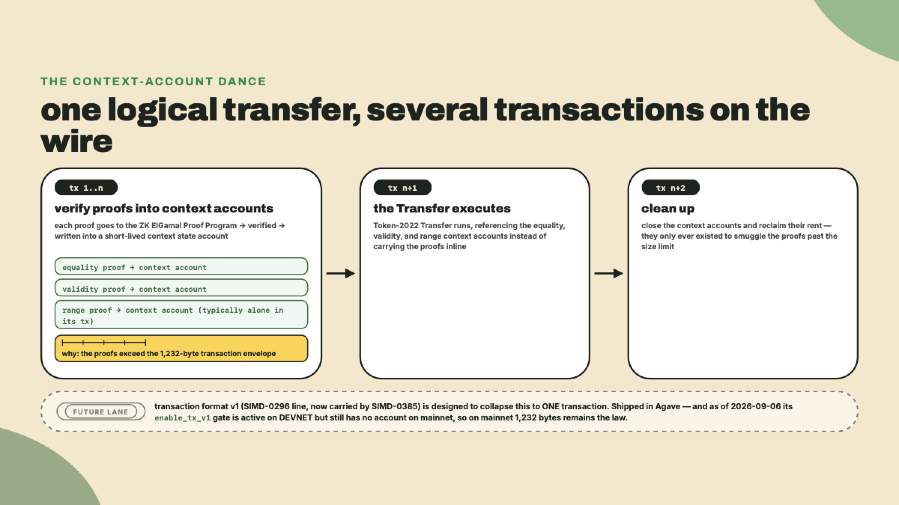
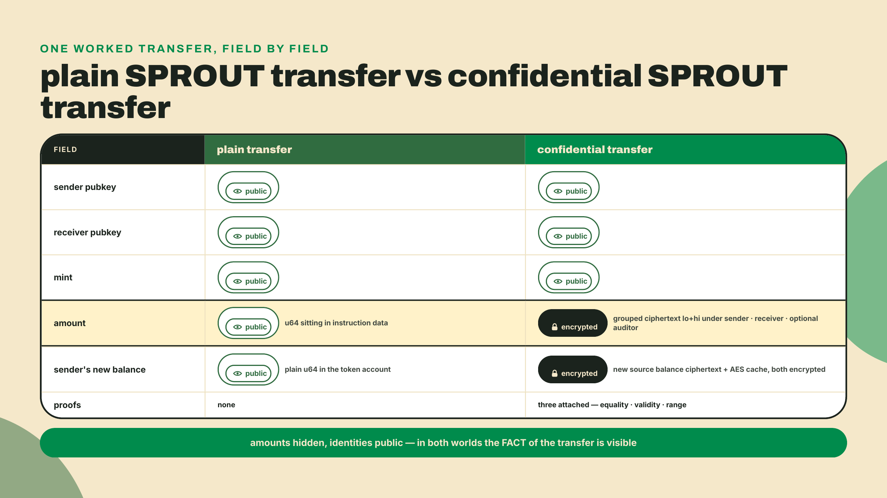
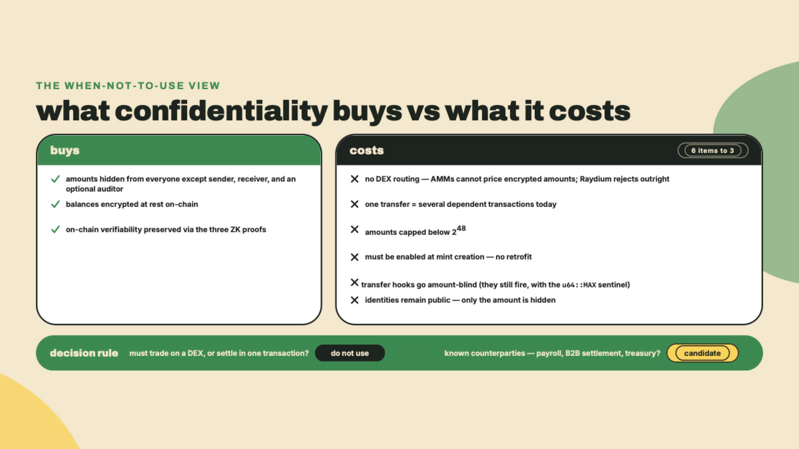

# The confidential model: encrypted balances on a public chain

## Summary

Last lesson you resolved a transfer hook's extra accounts from the client side and saw exactly why half the DEX ecosystem refuses arbitrary on-transfer code. That was code you could read. This extension hides the numbers themselves.

Because right now, you can read every byte of a SPROUT transfer: sender, receiver, amount, all in the clear. A payroll token cannot ship like that. The whole company would see every salary. So the question this lesson answers is: how do you put an amount on a public ledger that validators can verify but nobody can read?

Before any term of art, here is the 30-second intuition. You can add two sealed envelopes of cash and know the total is right without opening either one. Hold that picture. It is the whole trick, and everything else in this lesson is machinery built around it.

First, something to run. The machinery has an on-chain verifier, and it is live on mainnet right now. Probe it (curl ships with macOS and every mainstream Linux; on Debian, `apt install curl`):

```bash
curl -s https://api.mainnet-beta.solana.com -X POST \
  -H "Content-Type: application/json" \
  -d '{"jsonrpc":"2.0","id":1,"method":"getAccountInfo","params":["ZkE1Gama1Proof11111111111111111111111111111",{"encoding":"base64"}]}'
```

You should get back `"executable": true`, owner `NativeLoader1111111111111111111111111111111`, and 24 bytes of data. That account is the ZK ElGamal Proof Program, the native program that checks every zero-knowledge proof in this lesson. We will decode those 24 bytes in the lab.

The autonomy fade, stated out loud: this is a concept lesson, so the worked example is a derivation, not a program. I walk the model end to end with you, including one confidential SPROUT transfer taken apart field by field. In the lab you produce the artifact yourself: a public-versus-encrypted field table plus the three proofs, each derived from the cheat it closes. The challenge is solo: you attack the model with one proof removed and predict exactly what breaks. No new code ships today. Next lesson configures all of this for real.

## Deriving the confidential model

### Sealed envelopes, then the term of art

Imagine a notary who settles debts between people who refuse to reveal their salaries. Each person hands over a sealed envelope with cash inside. The notary cannot open any envelope. But these are special envelopes: stack two of them and the stack behaves like one envelope containing the sum. The notary can verify that envelope A plus envelope B weighs exactly what envelope C weighs, without ever seeing a single bill.

That property has a name: a homomorphic commitment. "Commitment" because the envelope locks you to a value you cannot later change. "Homomorphic" because operations on the sealed envelopes correspond to operations on the hidden values: add the ciphertexts, and you have added the amounts inside.



Token-2022's confidential transfer extension is this notary, industrialized. Every confidential balance on chain is a sealed envelope. Every confidential transfer is the validator stacking envelopes: subtract this ciphertext from the sender's balance, add that one to the receiver's pending pile. The chain does arithmetic on numbers it never sees.

The envelope construction is called Twisted ElGamal. You do not need its algebra to use it well, but you need three of its properties, because every design decision downstream falls out of them:

1. Encryption is done against a public key, so anyone can seal an envelope addressed to you. A sender encrypts the transfer amount under your key without your involvement.
2. Ciphertexts add. The homomorphic property from the intuition above is real: the program literally calls ciphertext addition and subtraction on balances (`ciphertext_arithmetic::add` and `subtract_from` in the processor).
3. Decryption is expensive. Opening your own envelope means solving a discrete logarithm, which is only tractable when the hidden number is small. This one property, decryption being the slow path, shapes more of the extension's design than any other. Keep it loaded.

### Two keys per account: one for the chain, one for you

Here is the first consequence. If decrypting an ElGamal ciphertext is slow, how does a wallet show you your own balance without grinding through a discrete-log search every time you open the app?

The extension's answer: every confidential account carries two encryptions of the same balance, under two different keys, serving two different masters. Look at the real account state, from `spl_token_2022_interface` (trimmed to the fields that matter today):

```rust
pub struct ConfidentialTransferAccount {
    /// `true` if this account has been approved for use.
    pub approved: Bool,
    /// The public key associated with ElGamal encryption
    pub elgamal_pubkey: PodElGamalPubkey,
    /// The low 16 bits of the pending balance (encrypted by `elgamal_pubkey`)
    pub pending_balance_lo: EncryptedBalance,
    /// The high 48 bits of the pending balance (encrypted by `elgamal_pubkey`)
    pub pending_balance_hi: EncryptedBalance,
    /// The available balance (encrypted by `elgamal_pubkey`)
    pub available_balance: EncryptedBalance,
    /// The decryptable available balance
    pub decryptable_available_balance: DecryptableBalance,
    /// If `false`, the account rejects incoming confidential transfers
    pub allow_confidential_credits: Bool,
    /// If `false`, the base account rejects any incoming transfers
    pub allow_non_confidential_credits: Bool,
    /// Number of Deposit and Transfer instructions that have credited pending
    pub pending_balance_credit_counter: U64,
    /// Max credits allowed before ApplyPendingBalance must run
    pub maximum_pending_balance_credit_counter: U64,
    // ...expected/actual credit counter bookkeeping trimmed
}
```

The `available_balance` is the mint's copy: a Twisted ElGamal ciphertext the chain can do arithmetic on, and the one every proof is checked against. The `decryptable_available_balance` is yours: the same number sealed with an AES key only you hold (`AeCiphertext` in the source). AES decryption is instant. Your wallet reads that field, decrypts in a microsecond, and shows you your salary. The chain never touches it; the program just stores whatever new decryptable ciphertext you hand it whenever your balance changes, because only you can produce it.

One balance, two envelopes, two audiences. The ElGamal ciphertext is the truth the chain enforces. The AES ciphertext is a convenience cache for its owner. If they ever drift apart, the chain's copy wins, and the wallet must fall back to opening the ElGamal envelope the hard way. Property 3 should make you flinch at that sentence, and rightly: a discrete-log search over the full 64-bit range is not practical. The escape hatch is that the search is bounded by what the balance can plausibly be, works in the same small chunks the rest of the extension enforces, and can be precomputed and resumed offline, so recovery is slow-but-finite for realistic balances rather than instant. Treat the AES cache as load-bearing, not decorative, and treat losing the AES key as an incident.



### Pending versus available: why incoming money sits in a waiting room

Now the second consequence, and it explains the strangest fields in that struct: why is there a `pending_balance` at all, split into `lo` and `hi` halves?

Walk it through. Someone sends you a confidential transfer. The amount arrives encrypted under your ElGamal key, and the chain homomorphically adds it to your balance. Fine. But your `decryptable_available_balance`, the AES cache, is now stale, and the sender cannot fix it: producing a new AES ciphertext requires your AES key, which the sender does not have and must never have.

Worse: if incoming transfers landed directly in `available_balance`, they would race against your own spending. You generate a proof against balance X, someone credits you mid-flight, your balance is now X plus something you cannot see, and your proof no longer matches the ciphertext on chain. Every incoming payment would invalidate every outgoing one you had in progress.

So the extension gives every account a waiting room. Incoming confidential credits land in `pending_balance`, and only the owner moves them into `available_balance` by signing an `ApplyPendingBalance` instruction, which also hands the program a freshly re-encrypted AES cache. The `pending_balance_credit_counter` counts deposits since the last apply, and `maximum_pending_balance_credit_counter` caps how many can pile up (65,536 by default) before the account stops accepting credits until the owner sweeps. The split into a `lo` and a `hi` ciphertext exists for the reason you already hold: decryption is a discrete-log search, so every encrypted chunk must stay small enough for its owner to open. Be precise about which split is which, because they differ. An incoming transfer's amount arrives as a 16-bit low chunk plus a 32-bit high chunk (that 16 + 32 shape is exactly where the sub-2^48 transfer cap later in this lesson comes from), and each chunk is added into its own pending bucket. The buckets themselves carry positional weight, `lo` for the balance's low 16 bits and `hi` for the 48 bits above them, and they are deliberately roomier than any single transfer so that up to 65,536 credits can accumulate between applies while both buckets stay within a searchable decryption range.


If you have used a bank that shows "processing" deposits separately from your spendable balance, you already have the shape of it. The difference is the reason: the bank is running fraud checks, while this account is waiting for the only person alive who can re-seal the readable envelope.

### The three proofs, derived from the three cheats

Here is where the model earns its keep, and where I want you deriving rather than memorizing. The chain is a notary doing arithmetic on envelopes it cannot open. So ask the adversarial question: if nobody can see the amounts, what stops me from lying?

Try the naive fixes first. "Have the validators decrypt and check" is self-refuting; the entire point is that they cannot. "Trust the sender's math" dies in one block; someone transfers themselves an envelope claiming minus one million and the supply silently inflates. The real answer is the one the sealed-envelope story was missing: alongside the envelopes, the sender must attach zero-knowledge proofs, statements that convince the verifier a claim about the hidden values is true while revealing nothing else about them.

Fine. But why THREE proofs? Why not one proof that says "this transfer is honest"? Because "honest" is not one claim. Sit down and actually try to cheat this system and you will find exactly three distinct lies available to a sender, and each one needs its own refutation. This is the derivation the lesson exists for, so take it slowly.

Cheat one: range-prove a fabricated remainder. Here is the subtlety that makes this cheat possible at all. The chain's homomorphic subtraction produces your new balance as a ciphertext, but a range proof (cheat three's refutation) does not run on that ciphertext directly: it proves statements about commitments the SENDER supplies, including one for the balance the sender claims to have left after the debit. The chain cannot open its own post-subtraction ciphertext to check the claim, so nothing so far ties the claimed remainder to reality. I could hold 3 SPROUT, send you 5, and hand the verifier a beautifully well-formed, comfortably in-range "remaining balance" of 10 that I invented for the occasion, while my true balance wrapped negative underneath. The refutation is an equality proof, `CiphertextCommitmentEqualityProof` in the source: it certifies that your new available-balance ciphertext, the one produced by the on-chain subtraction, commits to the same value as the remainder commitment the rest of the proof bundle is testifying about. The claimed remainder IS the real remainder, so every guarantee the other proofs give attaches to the actual books, not to a story about them.



Cheat two: send garbage. ElGamal ciphertexts are just curve points; nothing about the bytes forces them to be a well-formed encryption of anything under anyone's key. I could hand you a "ciphertext" that decrypts to nonsense under your key, or worse, encrypt the real amount for you but attach mangled bytes for the auditor, so compliance sees noise while the transfer sails through. The refutation is a grouped-ciphertext validity proof, `BatchedGroupedCiphertext3HandlesValidityProof`: the amount is correctly encrypted, as one grouped ciphertext with three handles, under the sender's key, the receiver's key, AND the mint's optional auditor key. Same number, three readers, provably. This is the proof that makes the auditor seat in `ConfidentialTransferMint` mean anything; we configure that seat next lesson.

Cheat three: go negative. Ciphertext arithmetic is arithmetic modulo a group order, and modular arithmetic does not know what a negative number is. Subtracting an "amount" that wraps around is the confidential version of an integer underflow, and you already know what an underflow buys an attacker in plaintext: subtract one from a zero balance and land on nearly 2^64. The refutation is a range proof, `BatchedRangeProofU128`: every hidden amount in the transfer is non-negative and within bounds. The U128 in the name is honest bookkeeping. One batched proof covers your remaining balance (64 bits, the sender-supplied remainder commitment that cheat one's equality proof welds to the real books) plus the transfer amount's low chunk (16 bits) and high chunk (32 bits), padded by 16 to a power of two: 128 bits of committed values, proven in range together.

Three lies, three proofs, and the assignment is exact. Drop any one and its cheat reopens; you will demonstrate that yourself in the challenge.



The checking, notably, is not done by Token-2022 itself. SIMD-0153 gave the network a dedicated native program for this, the ZK ElGamal Proof Program you probed in the summary, live at `ZkE1Gama1Proof11111111111111111111111111111`. Token-2022 confirms each proof was verified by that program and then does the envelope arithmetic. Division of labor: one program that knows cryptography, one program that knows tokens.

### Why one transfer is several transactions, and why amounts stop at 2^48

So a confidential transfer is ciphertexts plus three proofs. Now the ugly operational fact: those proofs are big. A range proof alone runs to hundreds of bytes, the trio together blows well past what fits beside a transfer instruction inside Solana's 1,232-byte transaction. The proofs are too large to ride along, so one logical transfer becomes several dependent transactions today.

The mechanism that makes this workable is the context state account: a short-lived account, owned by the proof program, that records "proof X was verified" so a later transaction can point at it instead of carrying the proof. The dance, in order:

1. Create and verify: for each proof, a transaction hands the proof to the ZK ElGamal Proof Program, which verifies it and writes a context account (the range proof usually needs a transaction to itself).
2. Transfer: the actual Token-2022 `Transfer` instruction executes, referencing the three context accounts instead of inline proofs.
3. Close: the context accounts are closed and their rent reclaimed.



This is not forever, and it is already moving. Transaction format v1 (the SIMD-0296 line, now carried by SIMD-0385) raises the envelope precisely so flows like this can collapse into a single transaction, and it has shipped in Agave. But shipped is not activated, and activated is per cluster. Agave's feature set names the gate `enable_tx_v1` and declares its address in `feature-set/src/lib.rs`:

```bash
solana account txv1aq4pp281K9um3tnPgkfX8UqtFT6wcVW3hNezGLL --url mainnet-beta
solana account txv1aq4pp281K9um3tnPgkfX8UqtFT6wcVW3hNezGLL --url devnet
```

On 2026-09-06 mainnet answered `Error: AccountNotFound` — no account, so not activated and not even staged — while devnet returned an account owned by `Feature111111111111111111111111111111111111` whose nine data bytes decode as a `1` tag followed by activation slot 492,480,000. Devnet has it. Mainnet does not. So 1,232 bytes remains the law where your users are, the multi-transaction dance remains the reality you engineer for, and devnet is now a cluster where this particular constraint quietly does not reproduce — which is its own trap if you only ever test there.

Two notes on the probe itself, because the obvious one does not work. `solana feature status` prints only the gates compiled into the CLI you are holding: 76 rows on solana-cli 3.1.10, and this gate is not among them, so both `| grep -i tx_v1` and `solana feature status <that address>` come back empty or `Unknown feature`. Reading the account directly is the probe that cannot go stale, because it asks the chain rather than the binary. And re-check it before you quote this paragraph to anyone: it flipped on one cluster between this lesson's drafting and its last review.

The last constraint is the amount cap, and by now you can derive it yourself. Amounts are encrypted in chunks small enough to decrypt (a 16-bit low chunk, a 32-bit high chunk), so a single deposit or transfer is capped below 2^48. The source states it as a constant:

```rust
/// Maximum bit length of any deposit or transfer amount
///
/// Any deposit or transfer amount must be less than 2^48
pub const MAXIMUM_DEPOSIT_TRANSFER_AMOUNT: u64 =
    (u16::MAX as u64) + (1 << 16) * (u32::MAX as u64);
```

That evaluates to 281,474,976,710,655 base units. For SPROUT at 6 decimals, one confidential transfer tops out around 281 million whole tokens, which is plenty for payroll. But it is not a full-range u64, and a mint with 9 decimals gets three fewer orders of magnitude. Ceiling math belongs in your design review, not in production incident notes.

### The worked derivation: one confidential SPROUT transfer, field by field

Now assemble the whole model by dissecting one transfer. Say I send you 5 SPROUT confidentially. Here is everything that hits the ledger, sorted by who can read it. This table is the pattern for the artifact you produce in the lab, so read it as a worked answer key.

| Field on the wire | Public or encrypted | Who can read it, and which proof gates it |
| --- | --- | --- |
| Sender token account (and owner pubkey) | Public | Everyone. No proof involved; signatures authorize as usual |
| Receiver token account (and owner pubkey) | Public | Everyone. Encrypted is not anonymous |
| Mint address, program, the fact a transfer happened | Public | Everyone. Traffic analysis sees the edge, not the weight |
| Transfer amount, grouped ciphertext (lo + hi) | Encrypted | Sender, receiver, and auditor keys only; gated by the validity proof (well-formed under all three handles) |
| Sender's new available balance ciphertext | Encrypted | Sender only; gated by the equality proof (commits to the true post-debit value) |
| Sender's new decryptable balance (AES) | Encrypted | Sender only; no proof, the chain stores it blindly |
| Non-negativity and bounds of every hidden value | Proven, not revealed | Gated by the range proof over 64 + 16 + 32 committed bits |

Notice what the public column adds up to: both identities, the token, the timing, the transaction fee paid in visible SOL. Confidentiality here is exactly one property, hidden amounts, and nothing else. An analyst can still draw your entire payment graph; they just cannot weight the edges. If your threat model needs hidden participants, this extension does not provide it, full stop, and pretending otherwise is how compliance teams get unpleasant surprises.



### What confidentiality costs

Every extension in this course has carried a price tag, and this one's is steep: confidentiality is bought with composability and simplicity.

Composability first. An AMM prices a trade by reading pool balances and amounts. Encrypted amounts mean there is nothing to read, so no AMM can price the token. This is not hypothetical caution: you have met Raydium's mint gate twice already, first as m02-l1's five-extension allowlist and again in the transfer-hook lesson, and its policy toward this extension is categorical rejection, on the stated grounds that encrypted amounts prevent pricing. Be precise about the scope of that, because Module 5 will hold you to it: what no AMM can price is an encrypted amount, not necessarily a mint that merely carries the extension. Raydium's allowlist refuses the extension itself, while Orca's published table supports such mints "for non-confidential transfers only". Either way the confidential path is the unroutable one. For payroll that is irrelevant. For anything that needs a liquid market, it is disqualifying, and no amount of engineering on your side changes it.

Simplicity second. One logical transfer is several dependent transactions with proof generation in between, which means client flows, retries, and failure states you do not have with a plain transfer. Amounts cap below 2^48. Both sides of a transfer need configured confidential accounts, with ElGamal and AES keys derived and managed. And stack four footguns on top, each one a design constraint you inherit the moment you reach for this extension:

- Confidential transfer must be enabled at mint creation. You cannot add it to an existing mint later; there is no retrofit, only a new mint and a migration.
- Encrypted is not anonymous. Sender and receiver addresses stay fully public; only the amount is hidden.
- A transfer hook cannot see or act on confidential amounts. The two extensions do compose mechanically — a confidential transfer still invokes the hook, handing it the sentinel amount `u64::MAX`, and PYUSD's own mint carries both — but your hook goes amount-blind on the confidential path. Any hook whose logic gates on amounts must be designed for that sentinel, or the pairing is a trap.
- The sub-2^48 cap means a confidential balance is not a full-range u64, and your amount validation must say so.

When NOT to reach for it, then, reduces to one test: any token that must trade on a DEX or settle in a single transaction is out. What remains is the payroll case, B2B settlement, treasury operations: flows between counterparties who already know each other and simply do not want the amounts on a billboard.

One honesty note before the lab, because this course does not overclaim adoption. There is, as of this writing, no named production issuer running confidential transfers at scale that I can point you to. The model is real and live; the flagship deployment is not. PYUSD ships the confidential suite among its eight TLV extensions, configured but dormant, and you will read its dormant config yourself in about two minutes. The ecosystem's paper trail is odd in the same way: solana.com/solutions/token-extensions, a live official page, still says confidential transfers will arrive once Agave 2.0 "has been adopted by the network, which is expected to happen by EOY 2024". Ask the network what it actually runs; one probe settles it:

```bash
curl -s https://api.mainnet-beta.solana.com -X POST \
  -H "Content-Type: application/json" \
  -d '{"jsonrpc":"2.0","id":1,"method":"getVersion"}'
```

On 2026-08-22 that returned `"solana-core": "4.2.0"`, the Agave line. Two major versions past the promise, the promise is still on the page. The same page is still useful as the citation for the five audit firms that reviewed the extension program (Halborn, Zellic, Trail of Bits, NCC Group, OtterSec). And official Solana education froze mid-plot: the solana-foundation/developer-content repo was archived read-only on 2025-01-24, so every official course predates this suite's current shape. Which is roughly why this lesson exists. You are learning material whose documentation trail stopped moving before the machinery did.



## Lab: probe the machinery, then derive the model on paper

The produced artifact for this lesson is a filled field table plus the three proofs with their guarantees, in your own hand. Steps 1 and 2 are live reads against mainnet; steps 3 to 5 are the derivation. You need `curl` (already proven working by the opener) and `python3` (ships with macOS; on Debian, `apt install python3`). The RPC responses below were captured on 2026-08-22 against a node reporting Agave 4.2.0; live accounts move, so expect your bytes to match and your slot numbers not to.

1. Decode the verifier you probed in the summary. Those 24 bytes of account data are base64; open them:

   ```bash
   echo "emtfZWxnYW1hbF9wcm9vZl9wcm9ncmFt" | base64 -d
   ```

   Expected output: `zk_elgamal_proof_program`. Native programs carry their name as their account data, so you have just read the on-chain verifier's nameplate. Note what its existence means: proof verification is a network-level primitive (SIMD-0153), not something each token program reimplements.

2. Read a dormant confidential config in the wild. PYUSD's mint carries the confidential pair among its eight TLV extensions. Pull the parsed mint and filter:

   ```bash
   curl -s https://api.mainnet-beta.solana.com -X POST \
     -H "Content-Type: application/json" \
     -d '{"jsonrpc":"2.0","id":1,"method":"getAccountInfo","params":["2b1kV6DkPAnxd5ixfnxCpjxmKwqjjaYmCZfHsFu24GXo",{"encoding":"jsonParsed"}]}' \
   | python3 -c "import json,sys; exts=json.load(sys.stdin)['result']['value']['data']['parsed']['info']['extensions']; print(json.dumps([e for e in exts if e['extension']=='confidentialTransferMint'], indent=2))"
   ```

   Expected: one `confidentialTransferMint` entry with `auditorElgamalPubkey: null`, an `authority`, and `autoApproveNewAccounts: false`. Read that against the lesson: no auditor key is set, and with the flag false, holders can still configure confidential accounts freely, but every configured account sits unusable until the issuer explicitly approves it. Configured but dormant, verified by your own read; next lesson walks that configure-then-approve flow end to end.

3. Build the field table. Take the transfer "you send 5 SPROUT confidentially to a teammate" and write a two-column table: every field that reaches the ledger in column one, `public` or `encrypted` in column two. Work from the dissection section but write it closed-book first; you are checking whether the model is in your head or still on the page. Minimum rows: sender account, receiver account, mint, the fact of the transfer, the transfer amount, the sender's new balance ciphertext, the AES cache.

4. Derive the three proofs. Under the table, write the three cheats a sender could attempt, in your own words. For each cheat, name the proof that closes it (exact type names: `CiphertextCommitmentEqualityProof`, `BatchedGroupedCiphertext3HandlesValidityProof`, `BatchedRangeProofU128`) and state the single guarantee it provides, one line each. If any guarantee takes you more than a line, you are describing the mechanism, not the guarantee; compress until it is a claim.

5. Close the loop with the counters. Add one final line to your artifact answering: why can the sender not update your decryptable balance, and which instruction fixes it? If your answer names the AES key and `ApplyPendingBalance`, the pending-balance machinery has landed.

Checkpoint: your table marks exactly one field family encrypted (the amount and balance ciphertexts) and everything identity-shaped public; your three proof lines each pair one cheat with one type name and one guarantee. That artifact is the assessment gate for this lesson, and next lesson assumes you can reproduce it from memory.

## Challenge

Solo, no scaffolding: break the model three times, on paper.

For each of the three proofs, assume the verifier skipped that proof and that proof only, and write the concrete attack a malicious sender runs: what they submit, what the chain accepts, and what the damage is (inflated supply, corrupted balance, blinded auditor). Three attacks, a short paragraph each. The exercise forces the point the lesson derived: the proofs are not defense in depth, they are three locks on three different doors, and any one open door is fatal.

Stretch, for the source divers: the transfer processor in `token-2022` accepts two additional optional proof offsets, `fee_sigma_proof` and a fee ciphertext validity proof, used when the mint also carries confidential transfer fees. Before reading further into the fee extension, predict from first principles which two new cheats a hidden fee introduces. You have every tool you need: a fee is just one more hidden amount someone might lie about.

## Checkpoint and what comes next

You can now state the confidential model without hand-waving: balances are Twisted ElGamal envelopes the chain adds without opening, owners keep an AES fast-read cache, incoming credits wait in a pending bucket until applied, and every transfer drags three zero-knowledge proofs to the ZK ElGamal Proof Program, one per available cheat. You also know the bill: no DEX will price it, one transfer is several transactions today, amounts stop below 2^48, and none of it can be bolted on after mint creation. That is a complete mental model, produced by you, on paper, and honestly that puts you ahead of most of the ecosystem's written material on this extension.

You now hold the model: commitments, three proofs, an optional auditor seat still empty. Next lesson you configure it for real: an auditor key, the ElGamal registry, confidential supply, and the multi-transaction wall you will actually hit when SPROUT goes dark. Keep the three proofs at your fingertips; the auditor's entire power next lesson hangs on the middle one.
