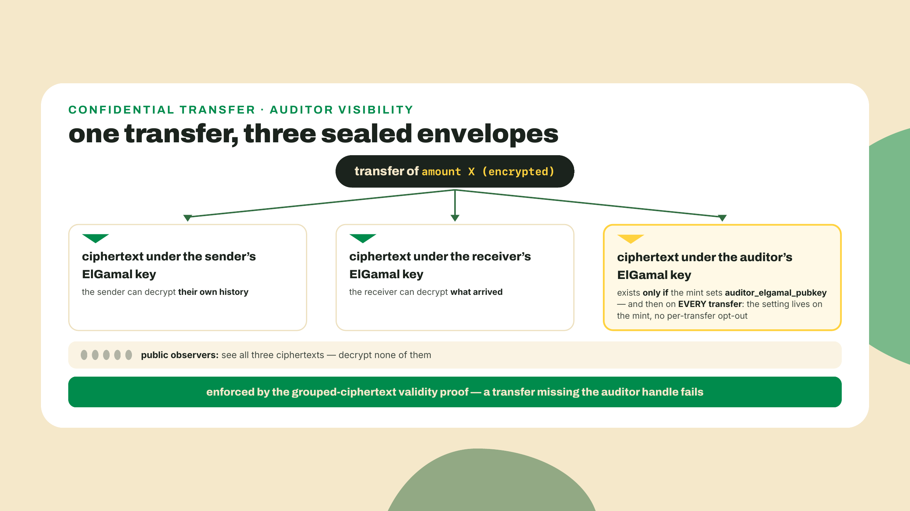
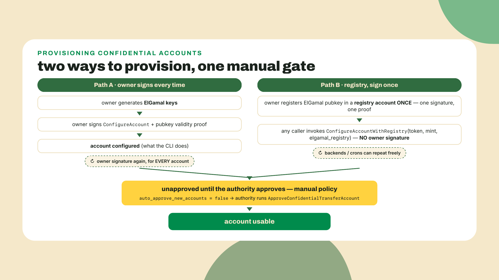
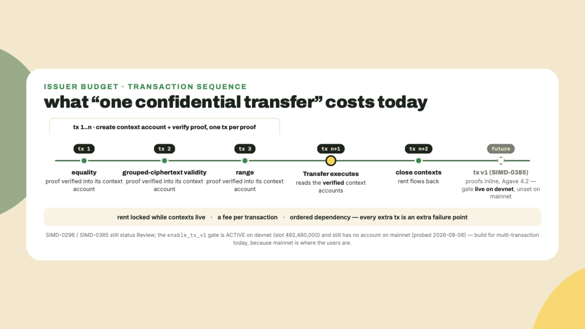
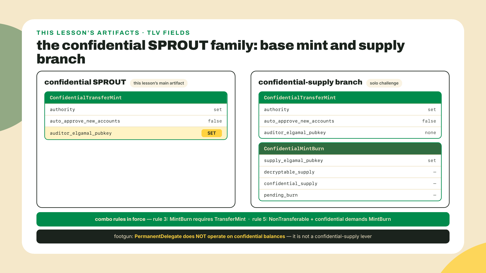
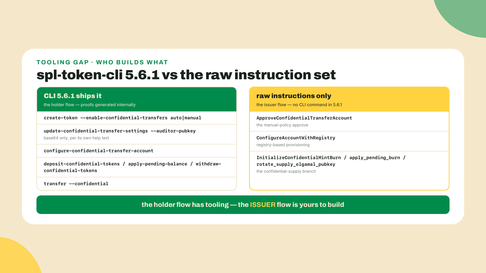
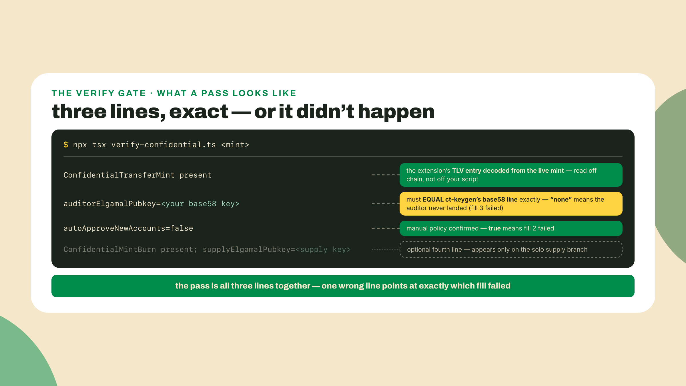
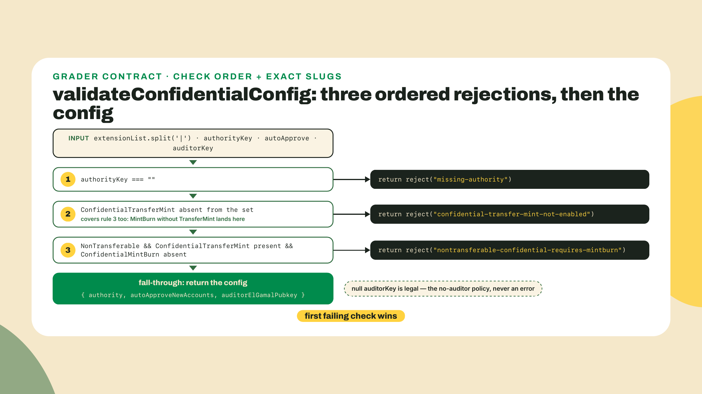

# Issuer ops: auditor, registry, and confidential supply

## Summary

In m04-l1 you built the mental model, sealed-envelope commitments, the three proofs, the optional auditor key, but wrote no code. This is where you configure it: the first confidential thing you actually build. You will create a confidential SPROUT variant carrying ConfidentialTransferMint with a real auditor ElGamal key and a manual approval policy, all from raw `@solana-program/token-2022` instructions; you will meet the ElGamal registry that provisions accounts without a per-account owner signature; you will run a deposit and one confidential transfer on devnet and watch it span several dependent transactions; and you will branch into ConfidentialMintBurn, the extension that makes supply itself confidential. The fade: the mint configuration, key generation, and deposit flow are worked end to end; the auditor and auto-approve parameters plus the ConfigureAccountWithRegistry step are completion problems you fill (the registry one as shape practice that cannot execute without a Rust-side registry account, a limit the lab states in the open); the confidential-supply branch and its proof are yours solo, with a designed degrade path if your cluster's proof gate is off. That degrade path is part of the plan rather than an apology, and you will hear it stated out loud before you need it.

Before any of that, prove the machinery you are about to lean on is actually deployed. The proofs from last lesson do not verify themselves; a dedicated native program does. Thirty seconds, no setup beyond `curl`:

```bash
curl -s https://api.devnet.solana.com -X POST -H "Content-Type: application/json" -d '
  {"jsonrpc":"2.0","id":1,"method":"getAccountInfo",
   "params":["ZkE1Gama1Proof11111111111111111111111111111",{"encoding":"base64"}]}' \
  | python3 -c "import sys,json; v=json.load(sys.stdin)['result']['value']; print('executable:', v['executable'], '| owner:', v['owner'])"
```

You should see `executable: True | owner: NativeLoader1111111111111111111111111111111`. I ran this against devnet and mainnet this morning (2026-08-22) and both answered the same: the ZK ElGamal Proof Program is present and executable on both clusters. Presence is not the whole story, and we will get to the feature gates that can still switch verification off, but you have just confirmed the verifier exists where you are about to deploy. That is more due diligence than most confidential-transfer tutorials ever do.

Your CFO wants salaries confidential. The auditors still need to reconcile every cent. The regulator wants a window nobody else has. "Confidential" and "auditable" sound like opposites, and last lesson's model already told you they are not: one optional ElGamal key on the mint, and every transfer quietly encrypts a second copy of its amount just for that auditor. Today you set that key with your own hands.

## What an issuer actually configures

Everything in this lesson hangs off one struct you have already seen the shape of. When a Token-2022 mint (program `TokenzQdBNbLqP5VEhdkAS6EPFLC1PHnBqCXEpPxuEb`, same address as every mint you have built) carries the ConfidentialTransferMint extension, its TLV entry holds exactly three fields: an `authority` that can update this configuration and approve accounts, an `auto_approve_new_accounts` flag, and an optional `auditor_elgamal_pubkey`. Three fields. The entire issuer surface of confidential transfers is those three decisions, plus a second extension for supply. Let us take them in the order they will bite you.

### The auditor key: targeted visibility, mint-wide, forever

The auditor is a single optional global ElGamal pubkey on the mint. Set it, and every confidential transfer of that token must additionally encrypt its amount under the auditor's key. Recall the middle proof from last lesson, the grouped-ciphertext validity proof: it covers three handles, sender, receiver, and auditor, and the program will not accept a transfer whose auditor ciphertext is missing or malformed when an auditor is configured. There is no per-transfer opt-out. There is no "this one is sensitive, skip the auditor" flag. The mint decides, and the mint decides for everyone, on every transfer, until the authority changes the setting.



Why one global key instead of per-transfer consent? Reason it from the failure mode. If disclosure were per-transfer, the party trying to hide something would simply not disclose, and an auditor who only sees the transfers people chose to show them is not an auditor, they are an audience. Reconciliation only means something when coverage is total, so the design puts the decision where coverage is total: on the mint, at configuration time, enforced by the same proof machinery that enforces everything else. The cost is equally structural. You have converted "nobody can read amounts" into "nobody can read amounts except the holder of one specific secret key," and that key is now the most valuable secret in your compliance stack. Rotate the setting and old ciphertexts do not re-encrypt; whoever held the old key can decrypt history forever. This is the trade at the heart of the lesson: regulator visibility is bought with a permanent, mint-wide asterisk on the privacy promise, and the honest move is to write that asterisk into your docs rather than hope nobody asks.

One reality check before you get attached to the CFO story. There are no named production users of confidential transfers today. PYUSD, the most institutional Token-2022 deployment on the chain, ships the confidentialTransferMint extension on its mint right now, and on-chain it is configured and dormant: the confidential slot present and unused, the flagship regulated stablecoin holding the door open without walking through it. So teach yourself this the way I am teaching it to you: issuer-capable, not issuer-proven. You are learning the ops because the rails are live and the door is open, not because a dozen treasuries already walked through it.

### auto_approve_new_accounts: the bouncer flag

The second field is a boolean with a compliance department inside it. When `auto_approve_new_accounts` is true, any holder who configures their account for confidential transfers can start using it immediately. When it is false, every newly configured account sits unapproved, and all confidential operations on it fail until the mint's confidential-transfer authority explicitly approves that account. False is the KYC shape: nobody moves hidden amounts until the issuer has signed off on that specific account. Our SPROUT variant sets it to false, partly because that is the issuer posture this lesson teaches, and partly because it forces you to build the approval step yourself, which turns out to be more interesting than it sounds. The CLI you will install in the lab has no confidential-approve command at all. The raw instruction exists, the tooling has not caught up, and you will bridge that gap with about forty lines of TypeScript.

### The registry: sign once, provision forever

Now the provisioning problem. Configuring an account for confidential transfers normally requires the account owner to sign, because the configuration includes the owner's ElGamal pubkey and a proof that they control it. For one hacker configuring their own wallet, fine. For an issuer provisioning ten thousand employee accounts, a per-account owner signature is an ops nightmare: every provisioning batch needs every owner online, signing, in order.

The ElGamal registry program exists to break that dependency. It ships in the same repository as Token-2022, and the flow is: an owner registers their ElGamal pubkey in a registry account once, with a validity proof, signing once. From then on, anyone, a backend, a cron job, the issuer's provisioning service, can call the `ConfigureAccountWithRegistry` instruction on Token-2022, pointing at the registry account instead of collecting a fresh owner signature. The registry account is the standing consent; the token program reads the key from it and configures the account. One signature amortized across every future provisioning action.



The fine print, because it decides what you can build today: creating the registry entry itself requires a pubkey validity proof, and that proof you can generate in pure JavaScript — `@solana/zk-sdk`, a declared peer of the very token client this lesson pins, will hand you `new PubkeyValidityProofData(new ElGamalKeypair())` without a line of Rust. What the JS stack lacks at our pins is the other half: a client builder for the registry program's own create/update instructions. The Token-2022 side of the flow, the `ConfigureAccountWithRegistry` instruction that consumes an existing registry account, has a first-class builder in the JS client, and in the lab you fill that builder call so the shape lives in your fingers; be warned now that it stays dry-docked there, because without a created registry account it cannot execute, and the lab says so rather than pretending. The registry-creation side you should know by name, `spl-elgamal-registry` in the token repository; until a JS builder for its instructions lands, the pragmatic route is its Rust CLI — a client-tooling gap, not a cryptographic one. This asymmetry, where the instruction layer is complete and the client tooling covers it unevenly, is the recurring texture of confidential transfers, and it is exactly why this lesson keeps a Rust helper in its back pocket.

### The multi-transaction reality

You derived this choreography in full last lesson; here it is in one breath, because today you re-read it from the issuer's chair, where it turns into budget lines. A confidential transfer today is a small choreography. Each of the three proofs from last lesson is verified by the ZK ElGamal Proof Program you probed in the opening, and the proofs are too large to ride along in a single transaction with the transfer itself. So the flow becomes: create a context account for a proof, verify the proof into it, repeat per proof, then execute the transfer instruction that reads those verified contexts, then close the context accounts to reclaim their rent. Several dependent transactions, ordered, each one able to fail independently.



Two budget lines fall straight out of that picture. First, context accounts are rent you front and reclaim, per proof, per transfer; at fleet scale that churn is a real line item and your ops runbook should treat closing contexts as mandatory hygiene, not cleanup. Second, freshness: the single-transaction future is real but not here, and "here" now depends on which cluster you mean. This is the same `enable_tx_v1` gate last lesson handed you the address for, shipped in Agave 4.2 with an envelope big enough to carry proofs inline. On 2026-09-06 it had no account behind it on mainnet and was active on devnet since slot 492,480,000. Build for the multi-transaction flow, because mainnet is where your users are, and re-probe the gate yourself the week you go to production — one `solana account txv1aq4pp281K9um3tnPgkfX8UqtFT6wcVW3hNezGLL --url mainnet-beta` settles it.

### Confidential supply: the ConfidentialMintBurn branch

Everything so far hides transfer amounts. Supply is still public: anyone can read how many tokens exist, and every mint and burn moves that public number. For most tokens that is fine and even desirable. For an issuer whose mint events are themselves sensitive, think a treasury that does not want redemption volumes readable in real time, there is a second extension: ConfidentialMintBurn.

It adds four fields to the mint: a `supply_elgamal_pubkey` that encrypts the supply, a decryptable supply the issuer can read back with an AES key, the encrypted confidential supply itself, and a pending-burn accumulator. Burns land in pending form and an `apply_pending_burn` instruction folds them into the confidential supply; the supply key can be rotated with `rotate_supply_elgamal_pubkey` when custody of that secret changes hands. And it composes under rules you already own. Your check-combo validator from m01-l4 encodes rule 3: ConfidentialMintBurn requires ConfidentialTransferMint on the same mint. It also encodes rule 5, the strange one: NonTransferable plus ConfidentialTransferMint is invalid unless ConfidentialMintBurn is also present. A soulbound confidential token only makes sense if supply operations are confidential too, and the program refuses the halfway house.



One footgun to disarm before you design anything on this branch. In m02-l2 you proved PermanentDelegate slips past CpiGuard and can sweep any account of its mint. Confidential balances are where that power stops: the permanent delegate does not work on confidential balances, full stop. An issuer who planned to clawback-and-burn via delegate has no confidential equivalent; supply control in the confidential world flows through ConfidentialMintBurn's own instructions, signed by the mint authority, or it does not happen. Do not reach for the delegate as a confidential-supply lever. It is not one.

### Where this runs, and the program's scar tissue

Cluster plan, designed in rather than deferred. Primary target: devnet, where the proof gate is active, so your deposits and transfers should verify. That is not a docs claim I am passing along; I read the three zk-ElGamal feature accounts on both clusters on 2026-08-22 and every one of them is activated, devnet and mainnet alike. You will see how in a moment. Secondary: a surfpool fork, which you have used since m01 and which is ideal for the configuration half of the lab. And the honest branch: if the zk-ElGamal proof gate is off on whatever cluster you target, your proofs will not verify, and the lab degrades to configure-the-extension plus prove-its-state-on-chain. Same mint, same auditor, same verify script; the only thing you lose is the live transfer, and you say so instead of faking it. That is the designed move. What you never do is force a gate on in a local fork and present the result as mainnet-grade evidence.

Why so much ceremony around one feature gate? Because this particular program has scar tissue, and unlike most scar tissue this one has timestamps you can read yourself. Agave's feature set carries three gates whose names tell the whole story: `zk_elgamal_proof_program_enabled`, `disable_zk_elgamal_proof_program`, `reenable_zk_elgamal_proof_program`. Each gate is an account; an activated one stores the slot it fired on, and `getBlockTime` turns that slot into a date. The commands, so "probe the gate" is never hand-waving: `solana feature status --url mainnet-beta` with no argument lists every gate the CLI knows, address, status, and activation slot included, so `solana feature status --url mainnet-beta | grep -i elgamal` prints all three rows in one line of shell; take a slot from that output and `solana block-time <slot>` dates it. Swap in `--url devnet` to ask the other cluster the same question. That pair of commands is the entire probe, and it is what the degrade path in the lab means by "probe the gate accounts". Do it on mainnet and the arc is stark: enabled 2025-01-23, paused 2025-06-19 for a security fix, re-enabled 2026-06-04. The verifier this entire lesson stands on was dark for roughly eleven months. This is not a demo subsystem that has never been touched under fire. It is a production program with a real incident history, and the pause machinery is load-bearing enough that it has been used for the better part of a year. Respect it in your architecture: any system you build on confidential transfers should tolerate the proof program being paused again, which is one more argument for keeping your degrade path rehearsed rather than theoretical.


That is the theory surface: three fields on one extension, a bouncer flag, a registry that amortizes consent, a transfer that is a choreography, a supply branch with its own keys, and a verifier with a history. Time to wire all of it.

## Lab: wire the auditor, the registry, and the supply branch

The artifact is `confidential-sprout`: a SPROUT variant whose mint carries ConfidentialTransferMint with a configured auditor ElGamal pubkey and `autoApproveNewAccounts: false`, a registered encryption keypair, a confidential deposit applied, and one confidential transfer completed on devnet, or the stated degrade proof if your cluster's gate is off. A second branch enables ConfidentialMintBurn. The gate at the end is the same one the course always uses: `npx tsx verify-confidential.ts` must read the extension and the auditor back from the chain.

1. Scaffold `labs/m04-l2` and install the JS toolchain. Same pin logic as m02-l1, re-verified today: pin the kit major your clients peer against, and `@solana-program/token-2022@0.15.0` is the current minor that peers kit ^7.0.0 (0.16.0 jumped to ^8), with `@solana-program/system@0.13.0` matching it. I reinstalled and type-checked this exact trio on 2026-09-05; run `npm view @solana-program/token-2022 peerDependencies` yourself the day you scaffold, because this matrix moves monthly.

```bash
npm install @solana/kit@7.1.1 @solana-program/token-2022@0.15.0 @solana-program/system@0.13.0
npm install -D tsx@4.23.12 typescript@5.9.3
```

2. Two more tools, both from the Rust world. The `spl-token` CLI you first probed with in m01-l4; as that lesson warned, it comes bundled with some Agave installs (m01-l3's one-liner, `sh -c "$(curl -sSfL https://release.anza.xyz/stable/install)"`) and not others, and `cargo install spl-token-cli` gets you the same binary standalone. Check the version, because the confidential surface changed across releases (Agave's release build installs the CLI unpinned, so your bundled copy is whatever was current the day that release was cut):

```bash
spl-token --version   # spl-token-cli 5.6.1, the crates.io release as of 2026-08-22
```

   Now read what 5.6.1 actually covers, because I went through its subcommand table line by line and the coverage map is the most instructive thing in this lab. The CLI handles the proof-heavy holder flow completely: `configure-confidential-transfer-account`, `deposit-confidential-tokens`, `apply-pending-balance`, `withdraw-confidential-tokens`, and `transfer --confidential` all generate their proofs internally. The issuer flow is another story. There is no confidential-approve command for the manual policy (`spl-token approve` is the ordinary delegation command and has nothing to do with it). There is no registry command. There is no ConfidentialMintBurn support anywhere, not on `create-token` and not even in the account display, where the source still carries a note to add it later. The raw instruction set is ahead of the flagship CLI, and that gap is not an inconvenience, it is the reason this lesson teaches raw instructions. An issuer who can only do what the CLI does cannot run a manual-approval mint today.



   The second tool generates encryption keys. Create a tiny Rust helper next to your lab folder (rustup installs cargo if you have never: `curl https://sh.rustup.rs -sSf | sh`):

```bash
cargo new ct-keygen && cd ct-keygen
cargo add solana-zk-sdk@7.0.1 bs58@0.5.1 base64@0.23.1
# Pins are what I ran on 2026-08-22. If cargo add refuses one (yanked, or the
# line moved), drop that crate's pin and take the current release; nothing in
# this helper depends on an exact version.
```

   Then `src/main.rs`. This is the whole program, and the honest accounting of why it exists: nothing here strictly requires Rust — `@solana/zk-sdk` will mint the same ElGamal keypair and the same `AeKey` AES-encrypted zero in pure JS, and re-encoding is a two-liner — but the values feed both the CLI (whose help text admits it only accepts base64 today, "more methods in a future version") and the kit client (which wants base58), and one small binary that prints every key in every encoding, built on the same `solana-zk-sdk` crate the on-chain program trusts, is the ops-shaped tool for that. Prefer TypeScript? Port it against `@solana/zk-sdk` and keep the printout format:

```rust
// ct-keygen: derive the encryption keys issuer ops needs, print every encoding.
use base64::{engine::general_purpose::STANDARD as B64, Engine};
use solana_zk_sdk::encryption::{auth_encryption::AeKey, elgamal::ElGamalKeypair};

fn main() {
    // 1. An ElGamal keypair (auditor key, or supply key for ConfidentialMintBurn).
    let elgamal = ElGamalKeypair::new_rand();
    let pubkey_bytes: [u8; 32] = (*elgamal.pubkey()).into();

    println!("elgamal pubkey (base64, for spl-token): {}", B64.encode(pubkey_bytes));
    println!("elgamal pubkey (base58, for kit code):  {}", bs58::encode(pubkey_bytes).into_string());

    // 2. An AES key + the encryption of zero (the initial decryptable supply).
    let aes = AeKey::new_rand();
    let zero_bytes = aes.encrypt(0).to_bytes();
    let listed: Vec<String> = zero_bytes.iter().map(|b| b.to_string()).collect();
    println!("decryptableSupply(0) bytes: [{}]", listed.join(", "));
}
```

   `cargo run` prints three lines. Export the base58 pubkey as `AUDITOR_ELGAMAL_PUBKEY` for the next step, and keep the other two lines for the supply branch. One honesty note on key handling: `new_rand` is right for a lab. A production auditor derives their ElGamal keypair deterministically from a wallet signature so it can be recovered, and the secret key here is the crown jewel we discussed; treat the printout accordingly and throw these lab keys away after.

3. Now the mint. Create `create-confidential-sprout.ts`, and give the completion problem its due: type the file with the three configuration values blanked, decide them yourself, then check against the filled reference below. The three lines that are yours are exactly the three fields from the theory section: the authority, the approval policy, and the auditor. Everything else is the same create-account-then-initialize dance you have run since m02-l1, with the extension initialized before `InitializeMint`, as always.

```ts
// create-confidential-sprout.ts: a SPROUT variant that carries ConfidentialTransferMint.
import {
  createSolanaRpc,
  createSolanaRpcSubscriptions,
  generateKeyPairSigner,
  createKeyPairSignerFromBytes,
  sendAndConfirmTransactionFactory,
  address,
  pipe,
  createTransactionMessage,
  setTransactionMessageFeePayerSigner,
  setTransactionMessageLifetimeUsingBlockhash,
  appendTransactionMessageInstructions,
  signTransactionMessageWithSigners,
  assertIsTransactionWithBlockhashLifetime,
  getSignatureFromTransaction,
  type Instruction,
} from "@solana/kit";
import { getCreateAccountInstruction } from "@solana-program/system";
import {
  TOKEN_2022_PROGRAM_ADDRESS,
  extension,
  getMintSize,
  getInitializeConfidentialTransferMintInstruction,
  getInitializeMintInstruction,
} from "@solana-program/token-2022";
import { readFileSync } from "node:fs";
import { homedir } from "node:os";

const rpc = createSolanaRpc(process.env.RPC_URL ?? "https://api.devnet.solana.com");
const rpcSubscriptions = createSolanaRpcSubscriptions(
  process.env.RPC_WS_URL ?? "wss://api.devnet.solana.com"
);
const sendAndConfirm = sendAndConfirmTransactionFactory({ rpc, rpcSubscriptions });

// The auditor's ElGamal pubkey, printed by ct-keygen in base58 form.
const AUDITOR_ELGAMAL_PUBKEY = address(process.env.AUDITOR_ELGAMAL_PUBKEY!);

async function main() {
  const payer = await createKeyPairSignerFromBytes(
    new Uint8Array(JSON.parse(readFileSync(`${homedir()}/.config/solana/id.json`, "utf8")))
  );
  const mint = await generateKeyPairSigner();

  // Size the account for the extension BEFORE the base mint layout.
  const confidentialTransferMint = extension("ConfidentialTransferMint", {
    authority: payer.address,            // fill 1: who updates config + approves accounts
    autoApproveNewAccounts: false,       // fill 2: manual policy, the KYC shape
    auditorElgamalPubkey: AUDITOR_ELGAMAL_PUBKEY, // fill 3: the regulator's window
  });
  const space = BigInt(getMintSize([confidentialTransferMint]));
  const rent = await rpc.getMinimumBalanceForRentExemption(space).send();

  const instructions: Instruction[] = [
    getCreateAccountInstruction({
      payer,
      newAccount: mint,
      lamports: rent,
      space,
      programAddress: TOKEN_2022_PROGRAM_ADDRESS,
    }),
    // Extension init runs BEFORE InitializeMint, same order as every mint you have built.
    getInitializeConfidentialTransferMintInstruction({
      mint: mint.address,
      authority: payer.address,
      autoApproveNewAccounts: false,
      auditorElgamalPubkey: AUDITOR_ELGAMAL_PUBKEY,
    }),
    getInitializeMintInstruction({
      mint: mint.address,
      decimals: 6,
      mintAuthority: payer.address,
      freezeAuthority: payer.address,
    }),
  ];

  const { value: latestBlockhash } = await rpc.getLatestBlockhash().send();
  const tx = await pipe(
    createTransactionMessage({ version: 0 }),
    (m) => setTransactionMessageFeePayerSigner(payer, m),
    (m) => setTransactionMessageLifetimeUsingBlockhash(latestBlockhash, m),
    (m) => appendTransactionMessageInstructions(instructions, m),
    (m) => signTransactionMessageWithSigners(m)
  );
  assertIsTransactionWithBlockhashLifetime(tx);
  await sendAndConfirm(tx, { commitment: "confirmed" });

  console.log(`confidential SPROUT mint: ${mint.address}`);
  console.log(`signature: ${getSignatureFromTransaction(tx)}`);
}

main().catch((e) => {
  console.error(e);
  process.exit(1);
});
```

   `AUDITOR_ELGAMAL_PUBKEY=<base58 from ct-keygen> npx tsx create-confidential-sprout.ts` and save the printed mint address; every later step takes it as an argument. Remember the constraint you cannot see in this file: confidential transfer configuration is creation-only. There is no retrofit instruction. A live SPROUT with holders can never gain this extension, which is why this is a variant mint and why the decision belongs in your launch checklist, not your backlog.

4. Prove it landed. Create `verify-confidential.ts`, this lesson's gate, and the interface a later lesson will call this artifact by:

```ts
// verify-confidential.ts: prove the extension and the auditor read back from chain.
import { createSolanaRpc, address } from "@solana/kit";
import { fetchMint } from "@solana-program/token-2022";

const rpc = createSolanaRpc(process.env.RPC_URL ?? "https://api.devnet.solana.com");

async function main() {
  const mintAddress = address(process.argv[2] ?? process.env.MINT!);
  const mint = await fetchMint(rpc, mintAddress);

  const extensions =
    mint.data.extensions.__option === "Some" ? mint.data.extensions.value : [];
  const ct = extensions.find((e) => e.__kind === "ConfidentialTransferMint");
  if (!ct || ct.__kind !== "ConfidentialTransferMint") {
    console.error("FAIL: ConfidentialTransferMint not present on this mint");
    process.exit(1);
  }

  const auditor =
    ct.auditorElgamalPubkey.__option === "Some"
      ? ct.auditorElgamalPubkey.value
      : "none";
  console.log("ConfidentialTransferMint present");
  console.log(`auditorElgamalPubkey=${auditor}`);
  console.log(`autoApproveNewAccounts=${ct.autoApproveNewAccounts}`);

  const mintBurn = extensions.find((e) => e.__kind === "ConfidentialMintBurn");
  if (mintBurn && mintBurn.__kind === "ConfidentialMintBurn") {
    console.log(`ConfidentialMintBurn present; supplyElgamalPubkey=${mintBurn.supplyElgamalPubkey}`);
  }
}

main().catch((e) => {
  console.error(e);
  process.exit(1);
});
```

   Run `npx tsx verify-confidential.ts <mint>`. The pass condition is exact: `ConfidentialTransferMint present`, the auditor line echoing the base58 key you generated, and `autoApproveNewAccounts=false`. If the auditor prints `none`, your fill 3 did not make it into the instruction; recreate the mint, because there is no editing your way out of a creation-time miss on a throwaway, and noticing that reflex matters more than the SOL you spend on it.



5. Provision and approve an account. The registry half first, since it is the completion problem: create `configure-with-registry.ts` and write the builder call yourself, from the theory section's description, before reading on. The filled call is three addresses and a payer, and the point is what is not in it, no owner signer anywhere:

```ts
import { getConfigureConfidentialTransferAccountWithRegistryInstruction } from "@solana-program/token-2022";

const ix = getConfigureConfidentialTransferAccountWithRegistryInstruction({
  token: tokenAccount,          // the ATA to configure
  mint: mintAddress,            // your confidential SPROUT
  elgamalRegistry: registryAccount, // the standing consent, created once via spl-elgamal-registry
  payer,                        // funds the account reallocation; NOT the owner
});
```

   Wire that into the same pipe-and-send skeleton as every transaction in this course. It executes against any registry account that exists; creating one is the Rust-side task named in the theory section, so for today's account we take the owner-signature path the CLI automates, and your fleet-provisioning design keeps the registry in its pocket. Configure your own ATA with the CLI (it creates the account's ElGamal keys from your wallet and generates the validity proof internally):

```bash
spl-token create-account <MINT> --url devnet
spl-token configure-confidential-transfer-account <MINT> --url devnet
```

   Configured is not usable: you set the policy to manual, so this account now sits unapproved, and the CLI has no confidential-approve command. Bridge the gap yourself with `approve-account.ts`, the issuer's side of the bouncer flag:

```ts
// approve-account.ts: the manual-approval half of autoApproveNewAccounts=false.
import {
  createSolanaRpc,
  createSolanaRpcSubscriptions,
  createKeyPairSignerFromBytes,
  sendAndConfirmTransactionFactory,
  address,
  pipe,
  createTransactionMessage,
  setTransactionMessageFeePayerSigner,
  setTransactionMessageLifetimeUsingBlockhash,
  appendTransactionMessageInstruction,
  signTransactionMessageWithSigners,
  assertIsTransactionWithBlockhashLifetime,
} from "@solana/kit";
import {
  TOKEN_2022_PROGRAM_ADDRESS,
  findAssociatedTokenPda,
  getApproveConfidentialTransferAccountInstruction,
} from "@solana-program/token-2022";
import { readFileSync } from "node:fs";
import { homedir } from "node:os";

const rpc = createSolanaRpc(process.env.RPC_URL ?? "https://api.devnet.solana.com");
const rpcSubscriptions = createSolanaRpcSubscriptions(
  process.env.RPC_WS_URL ?? "wss://api.devnet.solana.com"
);
const sendAndConfirm = sendAndConfirmTransactionFactory({ rpc, rpcSubscriptions });

async function main() {
  const authority = await createKeyPairSignerFromBytes(
    new Uint8Array(JSON.parse(readFileSync(`${homedir()}/.config/solana/id.json`, "utf8")))
  );
  const mint = address(process.argv[2]!);
  const owner = address(process.argv[3]!);
  const [token] = await findAssociatedTokenPda({
    mint,
    owner,
    tokenProgram: TOKEN_2022_PROGRAM_ADDRESS,
  });

  const ix = getApproveConfidentialTransferAccountInstruction({ token, mint, authority });

  const { value: latestBlockhash } = await rpc.getLatestBlockhash().send();
  const tx = await pipe(
    createTransactionMessage({ version: 0 }),
    (m) => setTransactionMessageFeePayerSigner(authority, m),
    (m) => setTransactionMessageLifetimeUsingBlockhash(latestBlockhash, m),
    (m) => appendTransactionMessageInstruction(ix, m),
    (m) => signTransactionMessageWithSigners(m)
  );
  assertIsTransactionWithBlockhashLifetime(tx);
  await sendAndConfirm(tx, { commitment: "confirmed" });
  console.log(`approved ${token} for confidential transfers on ${mint}`);
}

main().catch((e) => {
  console.error(e);
  process.exit(1);
});
```

   `npx tsx approve-account.ts <MINT> $(solana address)` and your account crosses from configured to usable. Notice the instruction needs no proof at all, just the authority's ordinary signature; approval is a policy act, not a cryptographic one, which is exactly why it was cheap for us to build and a little embarrassing that no tooling ships it.

6. Move hidden money. The deposit-and-transfer flow is the provided script, `confidential-flow.sh`; it sets up a recipient and walks the recipient's account through configure-and-approve, then runs the deposit, the pending-balance apply, and one confidential transfer. Your own sender account it does not touch: step 5 configured and approved it, and the script assumes that work is done, so run step 5 first or the transfer below fails for a reason that has nothing to do with the proof gate. The degrade path is written into it, out loud, at the only step that can hit the gate:

```bash
#!/usr/bin/env bash
# confidential-flow.sh <MINT>: deposit + one confidential transfer, degrade path included.
set -euo pipefail
MINT=$1
URL=${RPC_URL:-devnet}

# A recipient wallet, funded enough for rent.
solana-keygen new --no-bip39-passphrase --silent --outfile recipient.json
RECIPIENT=$(solana-keygen pubkey recipient.json)
solana transfer "$RECIPIENT" 0.1 --allow-unfunded-recipient --url "$URL"

# Recipient's account: create, configure, approve (our raw-instruction bridge).
spl-token create-account "$MINT" --owner "$RECIPIENT" \
  --fee-payer ~/.config/solana/id.json --url "$URL"
spl-token configure-confidential-transfer-account "$MINT" --owner recipient.json \
  --fee-payer ~/.config/solana/id.json --url "$URL"
npx tsx approve-account.ts "$MINT" "$RECIPIENT"

# Fund the public side, then move 40 SPROUT behind the curtain.
spl-token mint "$MINT" 100 --url "$URL"
spl-token deposit-confidential-tokens "$MINT" 40 --url "$URL"
spl-token apply-pending-balance "$MINT" --url "$URL"

# The confidential transfer: several dependent transactions under the hood.
# Prerequisite: YOUR sender account was configured + approved in step 5 and
# funded by the deposit above; the script does not repeat that work.
if spl-token transfer "$MINT" 15 "$RECIPIENT" --confidential --url "$URL"; then
  echo "confidential transfer complete: amount hidden, auditor copy included"
else
  echo "DEGRADE PATH: the confidential transfer failed."
  echo "First rule out your own state: sender configured + approved (step 5),"
  echo "deposit landed, apply-pending-balance run. Only if all of that holds is"
  echo "the likely cause the cluster's zk-ElGamal gate; probe the gate accounts"
  echo "before blaming the cluster:"
  echo "  solana feature status --url $URL | grep -i elgamal"
  echo "Falling back to the designed proof: extension + auditor state, on-chain."
  npx tsx verify-confidential.ts "$MINT"
fi
```

   Run `./confidential-flow.sh <MINT>` (after `chmod +x confidential-flow.sh`) and watch the transfer step: the CLI is quietly doing the whole context-account choreography from the theory section, creating them, verifying three proofs, transferring, closing. On devnet this should complete. If instead you land in the degrade branch, you have lost nothing this lesson grades you on: the issuer skill was the configuration, and the fallback proves it on-chain, stated openly. Deposit before transfer is not optional, by the way, and neither is `apply-pending-balance`: deposits land in a pending balance and only the apply step makes them spendable, a two-phase design you will recognize from last lesson's model. Skipping the apply is the number one "why is my available balance zero" ticket in this flow.

7. Wrap it in one gate. `npx tsx verify-confidential.ts <mint>` is the lesson's acceptance test, and from here on other lessons will assume a `confidential-sprout` means exactly what this script asserts: extension present, your auditor, manual policy. Run it one last time and read your own auditor key coming back off mainnet-grade infrastructure. Two lessons ago the auditor was a diagram. Now it is a value you generated, configured, and can prove.

## Challenge

The graded piece first: `validateConfidentialConfig`, the pre-flight check an issuer runs before building `initializeConfidentialTransferMint` at all, so a bad extension set dies in review instead of reverting on-chain. Step 3 hand-filled a config that happened to be legal; this function is what turns that luck into policy. The grader calls your function positionally, four scalars in this order, and the return type is this exact verdict shape — `ConfidentialConfig` is the name the starter gives the *outer* verdict, and the built three-field config rides inside it:

```ts
type ConfidentialConfig = {
  ok: boolean;
  reason: string; // "ok" when valid, else the rejection slug
  config: {
    authority: string;
    autoApproveNewAccounts: boolean;
    auditorElGamalPubkey: string | null;
  } | null;
};

function validateConfidentialConfig(
  extensionList: string, // the mint's full extension set, pipe-separated:
  //                        'NonTransferable|ConfidentialTransferMint'
  authorityKey: string, // confidential-transfer authority ("" if unset)
  autoApprove: boolean, // auto_approve_new_accounts
  auditorKey: string | null, // auditor ElGamal pubkey, or null (optional)
): ConfidentialConfig;
```

The failure contract is a returned verdict, never a throw: report a rejection by returning `{ ok: false, reason: "<slug>", config: null }` with the slug as the entire reason string, nothing prepended, nothing appended. The grader reads `result.ok` and `result.reason`, so "the first reason you report" means the reason of the first rejection your function returns. Split `extensionList` on `'|'` before reasoning about it; that one string is how the whole extension set travels through the grader. Then enforce the three rejections you already know from this lesson, in this exact order, because more than one can hold at once: an empty `authorityKey` is `missing-authority` first, then a set without ConfidentialTransferMint is `confidential-transfer-mint-not-enabled`, then combo rule 5, NonTransferable plus ConfidentialTransferMint without ConfidentialMintBurn, is `nontransferable-confidential-requires-mintburn`. Rule 3 needs no code of its own: a set carrying ConfidentialMintBurn without ConfidentialTransferMint already fails the second check, and `confidential-transfer-mint-not-enabled` is its correct verdict. A null auditor is not an error, it is the no-auditor policy, and a valid setup returns `ok: true` with `reason: "ok"` and the built config: `authority` from `authorityKey`, `autoApproveNewAccounts` from `autoApprove`, `auditorElGamalPubkey` from `auditorKey` (the grader's field name capitalizes the G; the on-chain field you read in the lab does not, an inconsistency the ecosystem itself ships and you get to notice). The starter approves everything, which is precisely the pre-flight that waves a reverting mint through.



The solo branch is confidential supply. Take the ct-keygen lines you saved, the supply ElGamal pubkey and the `decryptableSupply(0)` bytes, and build `confidential-supply.ts`: a second SPROUT variant whose mint initializes ConfidentialTransferMint (no auditor this time) and ConfidentialMintBurn in the same transaction, sized with `getMintSize` over both extensions, initialized in that order, before `InitializeMint`. Every builder you need is in the same client: `getInitializeConfidentialMintBurnInstruction` takes the supply pubkey and the encrypted zero, and rule 3 is enforced by the program, so if you initialize MintBurn without TransferMint you will watch the combo matrix defend itself in production.

Then prove something. On a cluster where proofs verify, mint confidentially and show the confidential supply changed: the mint's decryptable supply and pending state shift while the public `supply` field stays put, and `apply_pending_burn` and `rotate_supply_elgamal_pubkey` are the two ops instructions your runbook would wrap next. If your cluster's gate is off, take the degrade path and say so: extend `verify-confidential.ts`'s fourth line into a full assertion, ConfidentialMintBurn present, your supply pubkey echoed back, on-chain, with the transfer-proof half explicitly out of reach and named as such. The acceptance bar is exact: the verify script reads ConfidentialTransferMint plus the configured auditor and auto-approve flag back from the on-chain mint, and either a confidential deposit and one transfer complete on devnet or the degrade proof passes. What separates a passing solo from a lucky one is the write-up sentence you attach: which path you took, and why, in one honest line.

If any step here returned something mine did not, a proof failure on devnet where I claimed the gate was active, a CLI subcommand that appeared or vanished in a newer spl-token, a peer-range shift that broke the 0.15.0 pin, flag it in the course feedback channel with the exact command and error. The confidential stack is the fastest-moving surface in this course, my probes are dated 2026-08-22, and a learner who catches devnet drifting from the docs is doing exactly the verify-everything work this course keeps telling you beats any tutorial, including this one.

You have now shipped the most powerful and least routable extension in the catalog: a token no AMM will ever price, because encrypted amounts cannot be quoted. Remember Raydium's allowlist from m02-l1, and notice what you just did to this variant's chances on it. That collision is the next module's opening question: which extension set actually keeps SPROUT tradeable, decided not by vibes but by reading the exact code the DEXes run. The issuer path ends here, at its most specialized. The routability path starts by finding out what it costs.
