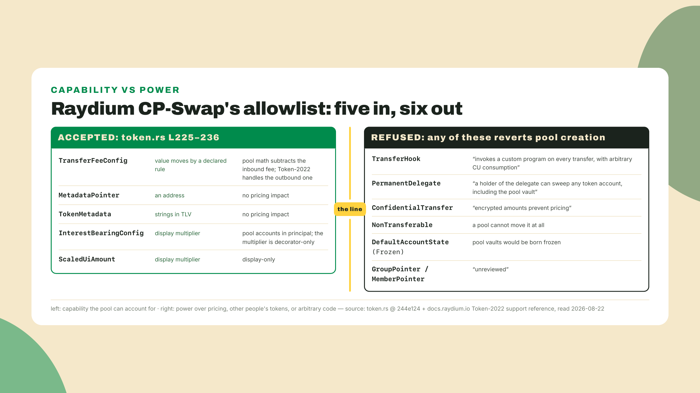
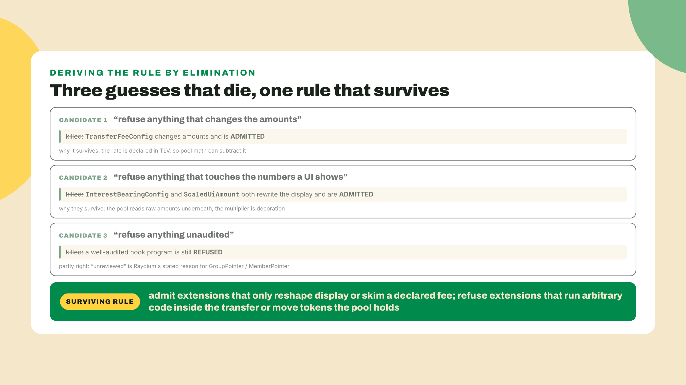
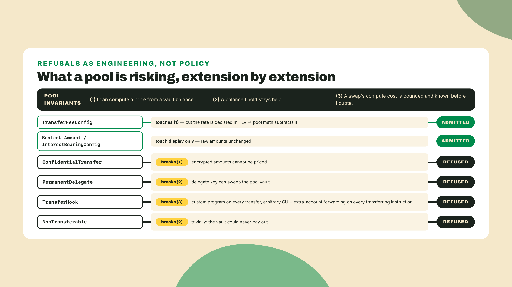
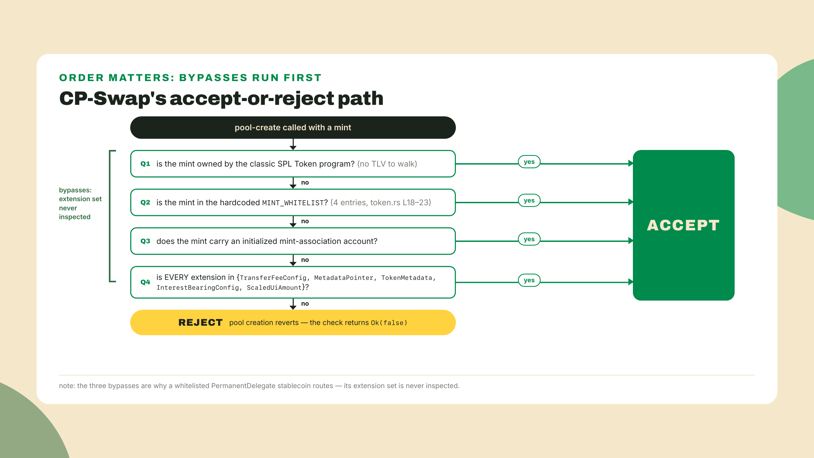
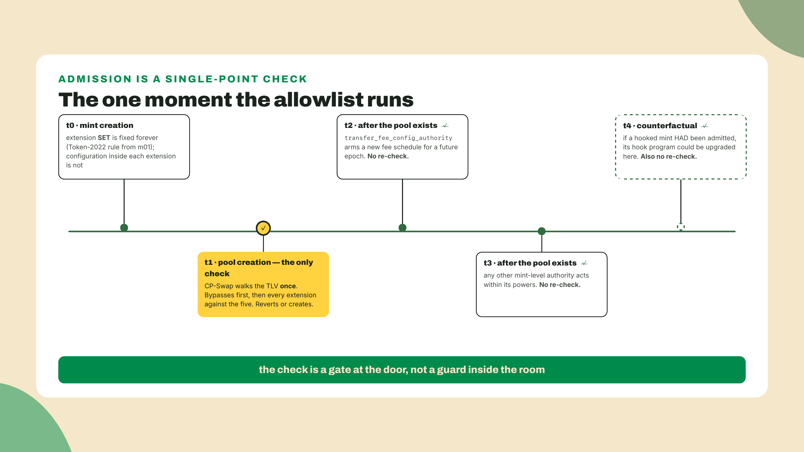
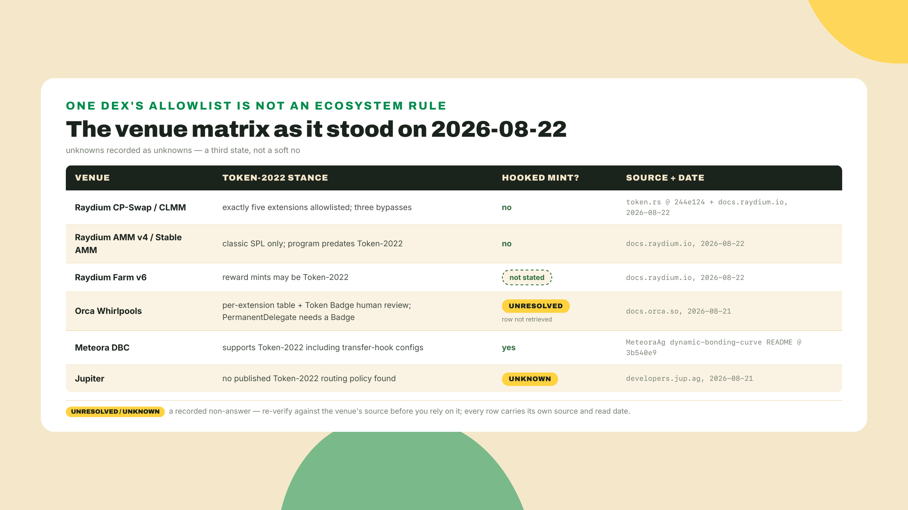
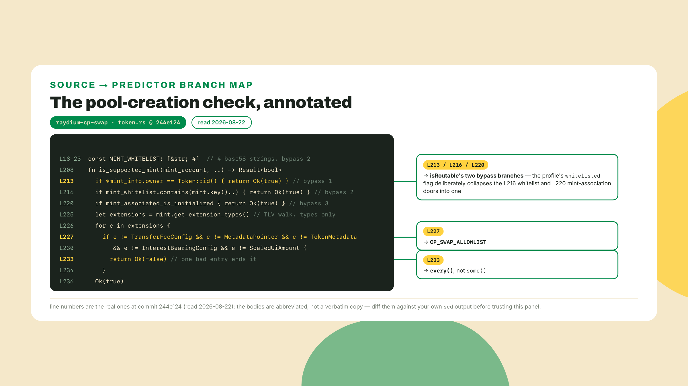
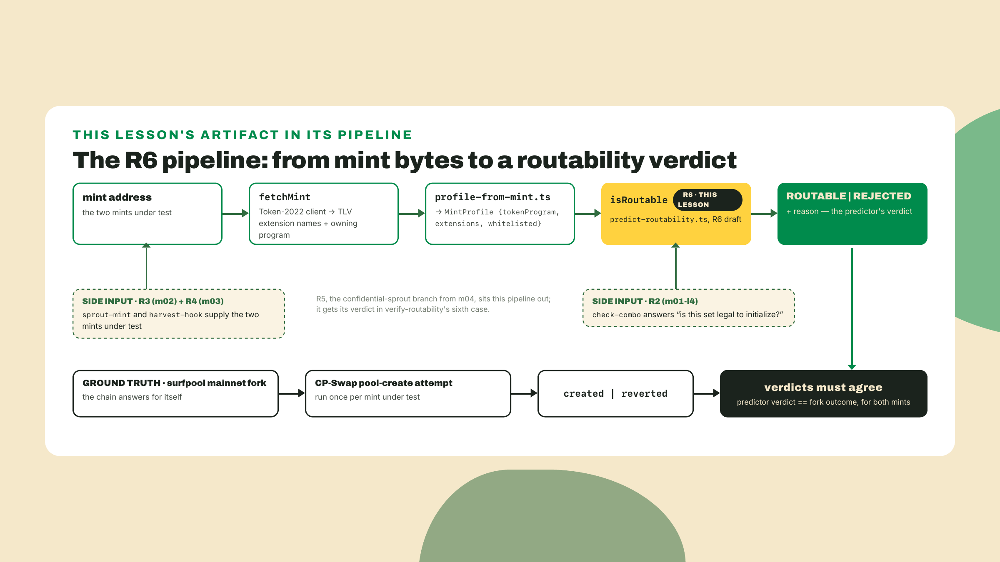

# The DEX allowlist as a teaching artifact

## Summary

Last lesson you built a confidential SPROUT variant: auditor key, ElGamal registry, a multi-transaction encrypted transfer, and then you shelved it as a specialized issuer branch. Now back to the mainline SPROUT, the one you actually want people to trade.

Here is the moment this lesson exists for. You spent four modules turning SPROUT into exactly the token you wanted: fees that fund a treasury, native metadata the wallet reads without an indexer, and beside it the hooked variant whose program logs every harvest. Then you go to seed a Raydium pool with the hooked variant, so gated SPROUT can finally trade, and the pool-create transaction reverts. No stack trace pointing at your code, because your code is fine. Raydium's program read that mint's extension list and refused it on purpose, and Raydium's docs say the quiet part out loud about exactly why. (Keep the two variants distinct all lesson: mainline SPROUT carries fee plus metadata and will turn out fine; the hooked variant is the one at the door.)

Before the autopsy, stand the lab up. Same surfnet as module 1 (surfpool 1.2.1 here, checked 2026-08-22; `brew install txtx/taps/surfpool` on macOS, other platforms build from the releases page). Surfpool forks mainnet, which matters today: the real Token-2022 program and the real CP-Swap deployment are both loaded.

```bash
mkdir -p labs/m05-l1 && cd labs/m05-l1
npm init -y && npm pkg set type=module
surfpool start --no-tui --no-studio
```

One continuity fact before it costs you an hour: a fork is ephemeral. Mainnet accounts it pulls lazily on demand, but the mints YOU created exist only on a surfnet that has stayed up since you made them. If yours restarted (or this command just started a fresh one), re-mint the two locals step 5 needs before you get there. Both commands run from the workspace ROOT, so `cd` back up out of `labs/m05-l1` first: `npx tsx labs/m02-l4/add-metadata.ts` recreates named SPROUT and rewrites `sprout-mint.json`, and the m03-l2 ceremony (`spl-token create-token --program-2022 --decimals 6 --transfer-hook $HOOK` after redeploying the hook) recreates the hooked variant. Five minutes, and the addresses change, which is fine; everything here takes addresses as arguments.

You have brushed against this allowlist twice already: m02-l1 quoted it when the economics set turned out to sit entirely inside it, and the confidential module's closing pointed you back at it. Today we stop quoting and read the code that enforces it. Tradeability is not a vibe and it is not a support ticket: it is a specific allowlist living in the code the DEX actually runs, and you can read it in about ninety seconds. You will read Raydium CP-Swap's five-extension allowlist from source, learn the three documented bypasses that make it subtler than "no extensions allowed," and build the first draft of R6, a routability predictor that reproduces the program's accept-or-reject decision from a mint's profile. Then you run it against your own SPROUT and its hooked variant on a mainnet fork and see whether your prediction survives contact.

The autonomy fade, stated out loud: the source read and the first bypass are a worked walkthrough, I am typing along with you. The predictor is a completion problem, you get the file with two holes and the theory tells you what fills them. The coding challenge is solo, no scaffolding, the full accept-and-reject rule from an arbitrary mint profile.

Leave that surfnet running and open a second terminal, because the first thing we do is read somebody else's Rust.

## Reading the rule that decides whether your token trades

### The five that pass

Raydium's constant-product AMM lives in the `raydium-cp-swap` repository, and the whole Token-2022 policy is one function in one file. Clone it and look:

```bash
git clone https://github.com/raydium-io/raydium-cp-swap.git
cd raydium-cp-swap
git rev-parse --short HEAD
sed -n '18,23p' programs/cp-swap/src/utils/token.rs
sed -n '225,236p' programs/cp-swap/src/utils/token.rs
```

At commit `244e124` (pushed 2026-08-19, which is what I read on 2026-08-22) those two ranges are the part everybody quotes. The second one walks the mint's extension list and returns `Ok(false)` the moment it meets an extension outside a fixed set of five. The first one is a hardcoded array of four mint addresses that skip the walk entirely. Print your own `git rev-parse` output and write it down, because a line number in a lesson is a promise with a short shelf life.

The five that pass, in the program's own order: `TransferFeeConfig`, `MetadataPointer`, `TokenMetadata`, `InterestBearingConfig`, `ScaledUiAmount`. That is the list. Every other extension in the catalog you spent three modules building, every one of them, reverts pool creation on this venue.

Look at what those five have in common before you look at what is missing. A transfer fee moves value, but it moves it by a rule declared in the mint's own TLV, at a rate a pool can read and price around. Raydium's Token-2022 reference is explicit about how it copes: pool math subtracts the inbound fee, and the Token-2022 program handles the outbound one. Interest-bearing is even tamer, since the pool accounts in principal amounts and the UI multiplier is decorator-only. Scaled UI is display and nothing else. Metadata pointer and token metadata are strings and an address. Not one of the five can run code, hold a key over somebody else's balance, or make a number unreadable.



Now hold that against the naive model most people carry, the one I carried for longer than I would like to admit: "Token-2022 tokens do not trade." That model is wrong in both directions at once. Five extensions route fine, so a fee-bearing, metadata-carrying, interest-accruing Token-2022 mint is a perfectly ordinary pool asset. And a mint with a single off-list extension does not trade a little worse, it does not create the pool at all. The failure is binary and it happens at creation, not at swap time.

Do not take my list on faith either. From inside the clone, this prints the names the file actually matches on today:

```bash
sed -n '225,236p' programs/cp-swap/src/utils/token.rs | grep -o 'ExtensionType::[A-Za-z]*'
```

If the shape has drifted since I read it, that command tells you so in one line, which is exactly the habit this lesson is trying to install.

One implementation detail carries real diagnostic weight, so notice it while the file is open. The support check does not throw when it refuses you. It returns a boolean, `Ok(false)`, and the caller turns that into the pool-creation failure. What reaches your terminal is the venue's generic "this mint is not supported," not "your TransferHook entry is the problem, everything else was fine." You have met this gap before: in m01-l4 you found all five of Token-2022's combination rules returning the identical error, so the program could tell you that you broke a rule but never which one. Same architecture, same silence, one layer up. And it is the entire argument for building a local predictor instead of learning by revert. At 2am, the distance between "unsupported mint" and "drop the hook or take this to Meteora" is the distance between a support ticket and a fix.

### Why the line falls exactly there

The interesting question is not what the list contains. It is why a team of AMM engineers drew the boundary in that particular place, because once you can derive their reasoning you can predict the next venue's list before you read it.

Start from what a pool is, mechanically. A CP-Swap pool is a program that custodies two token accounts, the vaults, and prices swaps against their balances. (That one sentence is all the AMM we need. Pool math, tick and bin mechanics and LP strategy belong to the planned DeFi and RWA Engineering course; what this lesson borrows is only the pool's seat at the table.) Everything it can safely admit follows from two requirements: it must be able to compute a price from a balance, and it must be able to trust that a balance it holds stays held.

Run the naive candidate rules against that and watch them fail. Rule one: refuse anything that changes the amounts. Wrong, because TransferFeeConfig changes amounts and passes; the pool can compute around a declared rate. Rule two: refuse anything that touches the numbers a UI shows. Also wrong, since interest-bearing and scaled UI both rewrite the displayed number and both pass; the pool reads raw amounts underneath and treats the multiplier as decoration. Rule three: refuse anything unaudited. That is closer, and it is literally the stated reason for the group and member pointers ("unreviewed"), but it does not explain why a well-audited hook program is still refused.



What survives is narrower, and it is the sentence this whole course has been walking toward. A DEX admits extensions that only reshape display or skim a declared fee, and refuses extensions that let somebody run arbitrary code inside the transfer or move tokens the pool is holding.

Read the three flagship refusals with that rule in hand. `PermanentDelegate` is refused because, in Raydium's words, "a holder of the delegate can sweep any token account, including the pool vault." The vault is the pool's inventory. An extension whose entire purpose is a key that can move anyone's balance is, from the pool's seat, an unhedgeable inventory risk. `ConfidentialTransfer` is refused because "encrypted amounts prevent pricing," which is the same argument you derived from the other side in the confidential module: an AMM that cannot read an amount cannot quote a price. And `TransferHook` is refused because it "invokes a custom program on every transfer, with arbitrary CU consumption."

That last one deserves a beat, because it is the one people get backwards. The hook cannot steal from the pool. You know this from module 3: every account from the original transfer is de-escalated to read-only inside the hook, so the hook program cannot move funds, and Solana's own developer guide says so. The refusal is not about theft. It is about cost and about plumbing. Every program that moves a hooked token has to resolve the mint's extra-account list and forward those accounts on every single transferring instruction, and the hook then burns an unbounded number of compute units inside the swap's budget. A pool that admits one hooked mint has volunteered to carry a stranger's account resolution and a stranger's compute bill on every swap, forever, with no version pin and no upper bound. Refusing is a compute budget with a name on it.



Two objections are worth answering here, because any engineer who has shipped an AMM raises both.

The first: why not just cap the hook's compute and admit it? Because the cap is in the wrong place. A transaction's compute budget belongs to the transaction, and the hook spends out of the same envelope the swap does, so a pool that wants to be safe has to reserve headroom for a stranger's program on every quote. That headroom is not free, it is either a worse quote or a swap that dies at the limit when the hook decides to do more work than it did yesterday. A venue that admits ten hooked mints has ten different unknown budgets to reserve against.

The second, sharper: why not simulate a transfer and see what the hook actually costs? Because simulation answers a question about the past. It tells you what that program did once, against the bytecode deployed at that slot, with the extra-account list as it stood. Hook programs are upgradeable by whoever holds the upgrade authority, and the extra-account list is account state that its authority can rewrite. So an allowlist keyed to observed behavior is an allowlist that an upgrade transaction can invalidate silently, at a moment nobody is watching. Keying it to capability instead is uncomfortable, coarse, and stable, and stability is what a program that holds strangers' liquidity is optimizing for.

Worth naming what just happened, because it is the reusable part. The allowlist is a value judgment written as a match statement. Somebody decided which capabilities an issuer may keep and still be allowed into a venue that holds other people's money, and then compiled that decision. When you pick SPROUT's extensions you are not choosing features, you are bidding for admission, and the price list is public.

### The three bypasses, and the stablecoin that should not route but does

Here is where a printed allowlist starts lying to you.

If the rule were only "every extension must be on the list," then a regulated stablecoin carrying `PermanentDelegate` for compliance freeze and clawback would be untradeable on CP-Swap. Several of them trade fine. I spent an embarrassing evening convinced the docs were wrong before I went back to `token.rs` and read the lines above the extension walk.

The check has three documented escape hatches, and none of them is an allowlist entry.

The first is program-level. The extension check only exists because CP-Swap is Token-2022 aware; a mint owned by the classic SPL Token program has no TLV to walk and skips the whole branch. Classic SPL is not "allowlisted," it is out of scope of the question.

The second is the hardcoded `MINT_WHITELIST` at the top of the same file, four addresses long at the commit I read. Four. A named exception list, in production, in the source, with no governance ceremony around it. If your mint is one of the four, the extension walk never runs.

The third is a mint-association account, and since it load-bears in the flowchart and the challenge, here is what it actually is: CP-Swap's own bookkeeping, not a Token-2022 extension. It is a small per-mint account of the CP-Swap program, initialized through Raydium's admin path for a specific mint, so it works as the whitelist's grown-up sibling: per-mint approval recorded as an account instead of a hardcoded array, meaning a new approval takes an admin transaction rather than a program redeploy. If an initialized association account exists for your mint, the extension walk never runs. Same effect as the array, different door, and one you can verify from outside by checking whether the account exists.

So the honest statement of the rule is a two-branch thing, and this is exactly what your predictor has to encode. First ask whether any bypass applies. Only if none does, ask whether every extension is on the list of five. Get that ordering wrong and you will confidently predict rejection for a token that is trading in front of you.



The teaching value of that whitelist is not the four addresses, it is what their existence tells you about how venue admission really works. Some tokens get in because their extension set is boring. Others get in because somebody at the venue made a decision about them by name. If your product plan is "we will carry a permanent delegate for compliance and get whitelisted like the stablecoins did," that is a business-development plan rather than an engineering one, and you should cost it as one.

### What the check cannot see

Before you go and build a predictor that reproduces this rule, be clear about how narrow the rule is, because two of its blind spots will shape decisions you make next lesson.

It runs once. The extension walk happens at pool creation, and after that the pool exists. Nothing re-runs the allowlist over a live pool when the mint changes underneath it, and the mint can change: your `transfer_fee_config_authority` can arm a new fee schedule for a future epoch any time it likes, which is exactly the mechanism you built and watched land in m02-l1. So "routable" is a statement about admission, not a promise about behavior forever. Admission was granted to an extension type, and the configuration inside that type stayed yours.

And it reads types, not settings. The walk matches extension variants: it asks whether a `TransferFeeConfig` entry is present, not whether the fee is zero or five percent. Follow that through and you get a result people find surprising the first time. A mint carrying a `TransferHook` entry whose program id is null, a hook slot that calls nothing at all, still fails the walk, because the TLV entry is there and the entry is what gets matched. Dormant is not absent. That is the mirror image of the PYUSD design I will get to in a moment, and it is why "we configured the extension but left it switched off" buys you goodwill with an auditor and exactly nothing with a program.



### Per venue, never per DEX

One more correction before the lab, and it is the one that will save you an actual outage.

Everything above is true of Raydium's CP-Swap and CLMM. It is not true of Raydium. The same brand runs venues with different rules, and the older ones are stricter: AMM v4 and the Stable AMM take classic SPL only, and Raydium's own reason is that the program predates Token-2022. So your fee-bearing SPROUT, which sails through CP-Swap's allowlist, cannot be pooled on AMM v4 at all, and dropping an extension will not help. Meanwhile Farm v6 reward mints can be Token-2022, and LaunchLab creates its mints with a metadata pointer and an optional transfer fee capped at five percent. Four different answers, one brand.

Step outside Raydium and the shape changes again.

Orca publishes a per-extension support table plus a Token Badge review process, which is a different mechanism entirely: not a hardcoded list in a program, but a per-mint approval that a human grants. As of my read on 2026-08-21 the table shows transfer fee, memo transfer, metadata pointer, token metadata and interest-bearing as supported, confidential transfer as supported for non-confidential transfers only, and permanent delegate as requiring a Token Badge. The rest of the rows, including the one you most want, the transfer hook row, did not come back in my retrieval, and I am not going to guess at it. Treat that as an open item to verify, not a gap to fill with vibes.

Meteora is the counterpoint that keeps this honest. Its Dynamic Bonding Curve explicitly supports transfer-hook token configs; its config has update-authority options that its README describes as valid only for transfer-hook configs and pools. A venue built later, with hook forwarding designed in from the start, made the opposite call to Raydium's. Meteora's own integration guidance also tells builders to reject unsupported Token-2022 extensions before showing a launch flow and to forward hook accounts on every transferring instruction. Defensive support, but real support.

And Jupiter, where most retail flow actually routes: I could not find a published Token-2022 routing policy in its developer docs on 2026-08-21. No policy page is not the same as no policy. It is an unknown, and it goes on your verify list with its date attached. Aggregation as a client discipline belongs to the planned Client-Side Mastery course; what belongs to you here is knowing that the question exists and that nobody has answered it for you in writing.



Which brings me to the trade-off I owe you, and it cuts against the lesson you are reading. Reading one DEX's allowlist tells you the truth for that one venue at that one commit. It is not a portable spec. Orca's badge review, Jupiter's routing policy and every wallet's display behavior are separate rules that you have to check yourself, and freezing Raydium's five as "the ecosystem rule" is precisely the mistake this lesson exists to kill. The list also moves. That is why the predictor you are about to build carries its source commit in a header comment, and why re-reading `token.rs` at your pinned commit is step zero of every launch, not a one-time chore.

Two production stories make the same point from opposite ends, and then we build.

The one that still makes me laugh: pump.fun's transfer hook program, deployed at `333UA891CYPpAJAthphPT3hg1EkUBLhNFoP9HoWW3nug`, is six lines long. `#[program] pub mod transfer_hook_authority {}`, and that is the whole thing. They pointed the birth-only hook slot at a no-op and left it there, so the mint carries a hook that is guaranteed to do nothing rather than a slot that could later be pointed at live logic. An empty program guarding billions is the neatest possible illustration of why allowlists exist: from a pool's seat there is no way to tell that program apart from one that burns 200k compute units and calls out to three other programs, short of reading and pinning its bytecode.

The serious one: PYUSD, the flagship Token-2022 deployment, shipped by PayPal and Paxos in May 2024 with a compliance-shaped extension set including a permanent delegate and a transfer hook. Helius's stablecoin-landscape survey put it at $215.9M held across just 20.4k token accounts as of 2025-05-29; supply moves daily, and the only current number is the one your own `getAccountInfo` returns. Every one of those power extensions is configured and dormant, the hook program id null, the fee zero basis points. But hold this against what you just learned: dormant is not absent, so those TLV entries still fail the extension walk, and on CP-Swap it is the hardcoded `MINT_WHITELIST`, not the dormancy, that lets PYUSD route. That is a token designed by people who understood the admission price exactly: hold the switch, leave it off, buy the auditor's goodwill with dormancy, and buy admission venue by venue, by name.

## Lab: predict the verdict, then let the fork check you

You will build `predict-routability.ts`, the first draft of R6, wire it to real on-chain bytes, and put both SPROUT variants in front of it. The interface below is a contract: next lesson imports `isRoutable` from this exact file by this exact name.

1. **Install the pins.** In `labs/m05-l1`, with your surfnet still running. The pin logic is unchanged from module 2 and I re-verified it against the registry on 2026-09-05: npm's `latest` for kit is 8.2.0, but a workspace pins the kit major its own `@solana-program/*` deps peer against, and this one's `@solana-program/token-2022@0.15.0` peers `@solana/kit@^7.0.0`, with `@solana-program/system@0.13.0` as its counterpart. Run `npm view @solana-program/token-2022@0.15.0 peerDependencies` yourself before you trust that sentence; this train ships monthly.

```bash
npm install @solana/kit@7.1.1 @solana-program/token-2022@0.15.0 @solana-program/system@0.13.0
npm install -D tsx typescript
```

2. **Read the rule, then run it.** You cloned the repo back when you read the source. Now compile the rule in isolation so you can poke it. Save this as `allowlist.rs` next to your lab (it is a transcription of the shape, not a copy of the program: the real function walks a `StateWithExtensions<Mint>` and matches `ExtensionType` variants, this one takes the decoded names so it builds with plain `rustc` and no dependency tree):

```rust
// allowlist.rs: a standalone transcription of the RULE in raydium-cp-swap,
// programs/cp-swap/src/utils/token.rs L225-236 @ 244e124 (read 2026-08-22).
// The real function walks a StateWithExtensions<Mint> and matches ExtensionType
// variants; this one takes the already-decoded names so it runs with no deps:
//   rustc allowlist.rs && ./allowlist
const MINT_WHITELIST: &[&str] = &[/* the four addresses at token.rs L18-23 */];

fn is_supported_mint(mint: &str, extensions: &[&str]) -> bool {
    if MINT_WHITELIST.contains(&mint) {
        return true;
    }
    extensions.iter().all(|ext| {
        matches!(
            *ext,
            "TransferFeeConfig"
                | "MetadataPointer"
                | "TokenMetadata"
                | "InterestBearingConfig"
                | "ScaledUiAmount"
        )
    })
}

fn main() {
    let sprout = ["TransferFeeConfig", "MetadataPointer", "TokenMetadata"];
    let hooked = ["TransferFeeConfig", "MetadataPointer", "TokenMetadata", "TransferHook"];
    println!("SPROUT       {}", is_supported_mint("SPROUT_MINT", &sprout));
    println!("SPROUT+hook  {}", is_supported_mint("HOOKED_MINT", &hooked));
}
```

```bash
rustc allowlist.rs -o allowlist && ./allowlist
```

You should see `SPROUT true` and `SPROUT+hook false`. Fill in the four whitelist addresses from your own `sed` output if you want the bypass branch to do anything; I am deliberately not printing them here, for the same reason I did not print the conflict-matrix rules for you in m01-l4. The territory is the source file, not this page.

While both files are in front of you, do the comparison that makes this stick: put your `sed` output beside the transcription and mark what my version dropped. The real function receives a decoded mint and iterates real `ExtensionType` variants, so it also carries the unpacking, the error plumbing, and the caller that turns a `false` into a failed instruction. What survives the reduction is the decision itself, and the decision is four lines long.



3. **Write the predictor, with two holes.** Create `predict-routability.ts`. This is the completion problem: the type and the function shape are given, the allowlist contents and the bypass branches are yours.

```typescript
// predict-routability.ts (skeleton). Two holes to fill from the source you just read.
export interface MintProfile {
  tokenProgram: "spl" | "token2022";
  extensions: string[];
  whitelisted?: boolean;
}

// TODO 1: the five extension names CP-Swap accepts, exactly as token.rs lists them.
export const CP_SWAP_ALLOWLIST: ReadonlySet<string> = new Set([]);

export function isRoutable(mint: MintProfile): boolean {
  // TODO 2: the two bypass branches that run BEFORE the extension check.
  //   (The source has three doors; your profile has two branches, because the
  //   whitelist and the mint-association account both arrive collapsed into
  //   the single `whitelisted` flag. The classic-SPL door is the other branch.)
  return mint.extensions.every((e) => CP_SWAP_ALLOWLIST.has(e));
}
```

Two things to get right, and both are ordering questions rather than typing questions. The bypasses run first, or a whitelisted permanent-delegate mint gets a wrong verdict. And the extension test is `every`, not `some`: one off-list extension taints the whole mint, because the program returns false at the first bad entry and never recovers.

4. **Fill it in and give it a mouth.** Here is the finished file. It runs standalone and it exports cleanly, which is why the self-run is guarded: next lesson imports from this module and does not want your console output.

```typescript
// predict-routability.ts: R6 draft. Reproduces Raydium CP-Swap's pool-creation
// verdict from a mint's token program plus its extension set.
// Modeled on raydium-io/raydium-cp-swap, programs/cp-swap/src/utils/token.rs
// L225-236 (allowlist) and L18-23 (MINT_WHITELIST), commit 244e124, read 2026-08-22.
// Re-read that file at YOUR pinned commit before trusting this file.
import { fileURLToPath } from "node:url";

export interface MintProfile {
  tokenProgram: "spl" | "token2022";
  extensions: string[];
  whitelisted?: boolean;
}

export const CP_SWAP_ALLOWLIST: ReadonlySet<string> = new Set([
  "TransferFeeConfig",
  "MetadataPointer",
  "TokenMetadata",
  "InterestBearingConfig",
  "ScaledUiAmount",
]);

export function isRoutable(mint: MintProfile): boolean {
  if (mint.tokenProgram === "spl") return true;
  if (mint.whitelisted) return true;
  return mint.extensions.every((e) => CP_SWAP_ALLOWLIST.has(e));
}

export function explain(mint: MintProfile): string {
  if (mint.tokenProgram === "spl") return "classic SPL: extension check skipped";
  if (mint.whitelisted) return "bypass: MINT_WHITELIST or mint-association account";
  const offList = mint.extensions.filter((e) => !CP_SWAP_ALLOWLIST.has(e));
  return offList.length === 0
    ? `all ${mint.extensions.length} extensions on the allowlist`
    : `off-list: ${offList.join(", ")}`;
}

export const SPROUT: MintProfile = {
  tokenProgram: "token2022",
  extensions: ["TransferFeeConfig", "MetadataPointer", "TokenMetadata"],
};

// The DESIGNED hook variant: the full base set plus TransferHook. The variant
// you actually minted in m03 carries TransferHook alone (kept minimal there on
// purpose); the verdict is identical either way, one off-list entry taints it.
export const SPROUT_HOOKED: MintProfile = {
  tokenProgram: "token2022",
  extensions: ["TransferFeeConfig", "MetadataPointer", "TokenMetadata", "TransferHook"],
};

if (process.argv[1] === fileURLToPath(import.meta.url)) {
  const cases: Array<[string, MintProfile]> = [
    ["SPROUT", SPROUT],
    ["SPROUT+hook", SPROUT_HOOKED],
  ];
  for (const [name, profile] of cases) {
    const verdict = isRoutable(profile) ? "ROUTABLE" : "REJECTED";
    console.log(`${name.padEnd(12)} ${verdict.padEnd(9)} ${explain(profile)}`);
  }
}
```

```bash
npx tsx predict-routability.ts
```

```
SPROUT       ROUTABLE  all 3 extensions on the allowlist
SPROUT+hook  REJECTED  off-list: TransferHook
```

That `explain` string is not decoration, and it is the same argument I made for `check-combo`'s `reason` field back in m01-l4. A boolean tells a teammate they cannot launch. A reason tells them which extension to drop.

5. **Feed it real bytes.** So far you have judged hand-typed profiles, which proves nothing about your actual mints. Wire the predictor to the chain. `profile-from-mint.ts` reads a live mint through your surfnet and builds the profile from the TLV your `decode-mint` inspector has been walking since m01-l2:

```typescript
// profile-from-mint.ts: turn a live mint into a MintProfile the predictor can judge.
// Reads the same TLV bytes your decode-mint inspector has walked since m01-l2.
import { address, createSolanaRpc } from "@solana/kit";
import { fetchMint, TOKEN_2022_PROGRAM_ADDRESS } from "@solana-program/token-2022";
import { explain, isRoutable, type MintProfile } from "./predict-routability";

// The four addresses live in token.rs L18-23 at your pinned commit. Read them
// yourself and paste them here; a printed whitelist in a lesson goes stale.
const MINT_WHITELIST: string[] = [];

const RPC_URL = process.env.RPC_URL ?? "http://127.0.0.1:8899";

export async function profileFromMint(mintAddress: string): Promise<MintProfile> {
  const rpc = createSolanaRpc(RPC_URL);
  const mint = await fetchMint(rpc, address(mintAddress));
  const extensions =
    mint.data.extensions.__option === "Some"
      ? mint.data.extensions.value.map((e) => e.__kind)
      : [];
  return {
    tokenProgram: mint.programAddress === TOKEN_2022_PROGRAM_ADDRESS ? "token2022" : "spl",
    extensions,
    whitelisted: MINT_WHITELIST.includes(mintAddress),
  };
}

const target = process.argv[2];
if (target) {
  const profile = await profileFromMint(target);
  console.log(profile);
  console.log(isRoutable(profile) ? "ROUTABLE" : "REJECTED", "-", explain(profile));
}
```

Run it against three things: the SPROUT mint you built in m02-l4, the hooked variant you minted on the surfnet in m03-l2 (both re-mintable per the opener if your fork restarted), and a mainnet mint your fork already knows about, PYUSD being the obvious one since you read it in module 1. Note what the third run does to your confidence in the predictor, and hold that thought for step 7.

```bash
npx tsx profile-from-mint.ts <YOUR_SPROUT_MINT>
npx tsx profile-from-mint.ts <YOUR_HOOKED_SPROUT_MINT>
npx tsx profile-from-mint.ts 2b1kV6DkPAnxd5ixfnxCpjxmKwqjjaYmCZfHsFu24GXo
```

Expected for the first two: the same verdicts as step 4, SPROUT ROUTABLE and the hooked variant REJECTED, only now judged from live TLV bytes instead of a hand-typed profile. One mismatch is expected and harmless: the live hooked variant prints a one-entry extension list, `TransferHook` alone, where step 4's `SPROUT_HOOKED` profile modeled the designed four-extension variant. m03 minted the variant minimal on purpose, and the verdict does not care, because a single off-list entry taints the mint whichever set surrounds it. The third verdict is the one you are holding for step 7.



6. **Now the part that can prove you wrong.** Everything so far is your model of the program. The ground truth is the program. On your surfnet fork, the CP-Swap deployment and its config accounts are the real mainnet ones, so a pool-create attempt is a genuine test. Raydium ships a demo repository whose CPMM section builds exactly this call with `raydium.cpmm.createPool({ programId: CREATE_CPMM_POOL_PROGRAM, poolFeeAccount: CREATE_CPMM_POOL_FEE_ACC, mintA, mintB... })`. Clone it in a separate folder: Raydium's SDK is vendor code that rides web3.js v1 and ships no kit surface, so the v1 dependency is unavoidable here. The rule this course follows, stated precisely enough that you can check a later lab against it: **quarantine a vendor SDK to the smallest unit that still compiles, and let the two stacks meet at the chain rather than in a shared import.** Sometimes that unit is a whole workspace, as here and in m08-l3's Light lab, where every file in the folder speaks v1 because the vendor does and mixing a second SDK into one folder would be worse. Sometimes it is a single file, as in m09-l1, where `venue.ts` holds the only web3.js import in the lab and hands plain values to kit code on either side. What the rule never permits is a first-party file importing both clients to save itself a conversion:

```bash
cd .. && git clone https://github.com/raydium-io/raydium-sdk-V2-demo.git
cd raydium-sdk-V2-demo && npm install
```

   Then three edits in the demo's own files before you run anything, because this configuration IS the step that produces your ground truth:

   - `src/config.ts` wires the cluster and signer: point `connection` at your surfnet (`http://127.0.0.1:8899`) and load `owner` from `~/.config/solana/id.json`.
   - In `src/cpmm/createCpmmPool.ts`, swap the `DEVNET_PROGRAM_ID` pair the file ships with for the mainnet `CREATE_CPMM_POOL_PROGRAM` / `CREATE_CPMM_POOL_FEE_ACC` constants it already imports; your fork carries mainnet's deployment, not devnet's.
   - `mintA` is your SPROUT variant; for `mintB` use WSOL (`So11111111111111111111111111111111111111112`), which the fork already knows and your payer funds with `spl-token wrap 1`.

   Then run it twice, once per SPROUT variant.

Expected: SPROUT creates a pool, the hooked variant fails inside the program. Record the exact failure, because the failure's shape is the finding: what counts is a custom program error attributed to the CP-Swap program id in the transaction logs, the caller's rendering of the check returning `Ok(false)`, not a thrown SDK exception before anything was sent. And read this honestly. There are two ways this step goes sideways and they mean different things. If the SDK's token lookup cannot resolve your local mint through Raydium's hosted API, that is a client-side miss and not the program's verdict; you have learned something about the SDK, nothing about the allowlist. Only an error thrown by the program counts as the program answering. If you cannot get the full path running today, say so in your notes rather than promoting the predictor's opinion to evidence, and take the degrade path in step 7.

7. **Gate it.** Whichever path you got, close the loop with an assert script, the same pattern as `test-check-combo.ts`. This is the lesson's acceptance test and it encodes the whole rule, bypasses included:

```typescript
// verify-routability.ts: this lesson's gate. Same assert-script pattern as
// test-check-combo.ts from m01-l4: plain asserts, exit 1 on the first miss.
import assert from "node:assert/strict";
import { isRoutable, type MintProfile } from "./predict-routability";

const t22 = (extensions: string[], whitelisted = false): MintProfile => ({
  tokenProgram: "token2022",
  extensions,
  whitelisted,
});

const cases: Array<[string, MintProfile, boolean]> = [
  ["classic SPL, no extensions", { tokenProgram: "spl", extensions: [] }, true],
  ["SPROUT: fee + metadata pair", t22(["TransferFeeConfig", "MetadataPointer", "TokenMetadata"]), true],
  ["SPROUT + harvest hook", t22(["TransferFeeConfig", "MetadataPointer", "TokenMetadata", "TransferHook"]), false],
  ["permanent delegate, unlisted", t22(["PermanentDelegate"]), false],
  ["permanent delegate, whitelisted", t22(["PermanentDelegate", "MetadataPointer"], true), true],
  ["confidential SPROUT branch", t22(["ConfidentialTransferMint"]), false],
  ["scaled UI display only", t22(["ScaledUiAmount"]), true],
];

let passed = 0;
for (const [label, profile, expected] of cases) {
  assert.equal(isRoutable(profile), expected, `${label}: expected ${expected}`);
  passed += 1;
}
console.log(`routability predictor: all ${passed} assertions passed`);
```

```bash
npx tsx verify-routability.ts
```

```
routability predictor: all 7 assertions passed
```

Notice the sixth case. Your confidential SPROUT from last lesson is in there too, and it fails, which is the arithmetic of the choice you already made: the most private variant you built is the one no AMM will ever quote. Nothing to fix. That is the shape of the design space. And close out the thought you held from step 5: PYUSD came back REJECTED from your predictor while it trades on this very venue on mainnet, because your `MINT_WHITELIST` constant is still empty and the real one is not. PYUSD routes through the hardcoded whitelist, not through an extension walk its power extensions would fail. The predictor is only as current as the four addresses you paste into it, which is bypass branch two earning its keep.

## Challenge

Solo, no scaffolding, and it is this lesson's artifact proven on inputs I did not pick for you. Implement `isRoutable(tokenProgram, extensionList, whitelisted)` so it reproduces CP-Swap's pool-creation decision for an arbitrary mint profile. One difference from your local `predict-routability.ts`: the grader passes the profile flattened to three positional scalars instead of one object. `tokenProgram` is `'spl'` or `'token2022'`; `extensionList` is the extension type names space-separated in a single string, `''` when the mint carries none, split it yourself before you judge it; `whitelisted` is the bypass flag, true for a MINT_WHITELIST entry or an initialized mint-association account. Same rule, same five names, different plumbing. The starter you get encodes the folklore model, "classic SPL or no extensions, everything else is rejected," and it fails the suite exactly where the interesting cases live.

The acceptance criteria, straight from the gate:

- a classic SPL mint routes regardless of what its extensions field says
- a mint whose every extension is on the five-entry allowlist routes
- a mint with any off-list extension (`TransferHook`, `PermanentDelegate`, `ConfidentialTransferMint`) is rejected
- a whitelisted `PermanentDelegate` mint routes via the bypass
- a mint mixing one allowlisted and one off-list extension is rejected

Three hints, in the order you will need them. The allowlist is exactly five names. The bypass branches short-circuit before the extension check. And the last criterion is the one that separates a passing solution from a plausible one: think `every`, not `some`.

Then one extension of the challenge that no test can grade, and it is the one that matters at launch time. Pick any live Token-2022 mint that is NOT yours, read it with `profile-from-mint.ts`, and write down its verdict plus the one sentence that makes the verdict actionable for its issuer. If your sentence names a specific extension and a specific venue, you are doing the job. If it says "Token-2022 support is complicated," you are quoting a support ticket.


## Checkpoint

The gate for this lesson: `npx tsx verify-routability.ts` green on all seven assertions, and both SPROUT variants run through `profile-from-mint.ts` against your fork with the verdicts matching what you predicted, SPROUT routable and the hooked variant rejected. If you got the full pool-create path running in step 6, the fork's answer and your predictor's answer agree and you have evidence. If you took the degrade path, you have a model validated against source rather than against execution, and the honest write-up sentence is "predictor matches token.rs at 244e124; the pool-create attempt is unrun." Both are passes. Only one of them is proof, and knowing which you are holding is the actual skill.

The misses I expect, in the order they usually happen. A whitelisted permanent-delegate case returning `false` means your bypass branches are below the extension check instead of above it. A mint carrying one off-list extension passing while a bare extensionless mint fails means `some` crept in where `every` belongs. And a `profile-from-mint` run that reports zero extensions on a mint you know carries three usually means you pointed it at a classic SPL clone of your mint, or your surfnet restarted and lost the local mint you created before it. Re-mint with the two commands the opener names and re-run; the fork is cheap.

If your read of `token.rs` disagrees with mine, the line numbers moved, the five became four or six, or the whitelist grew past four entries, that is not a bug in your work, that is the moving target this lesson keeps warning about. Post the commit hash and the diff in the course discussion. I would rather this page be corrected by a learner than believed by one.

You can now read whether any single extension keeps SPROUT tradeable on Raydium, from the source that decides it. Next lesson turns that read into a design decision: you pick SPROUT's final launch-venue extension set, defend it from the pool's side of the table, and write the routability report that says honestly where it trades and what you still have to verify yourself. Happy verifying.
