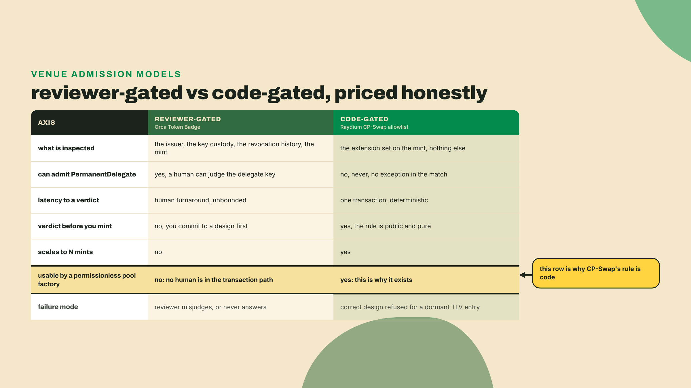
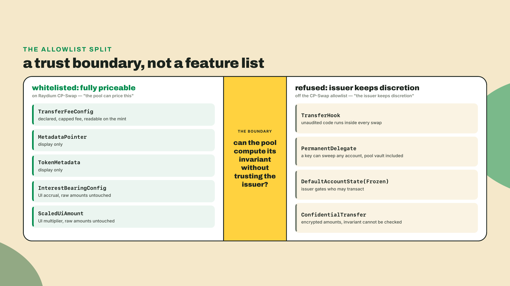
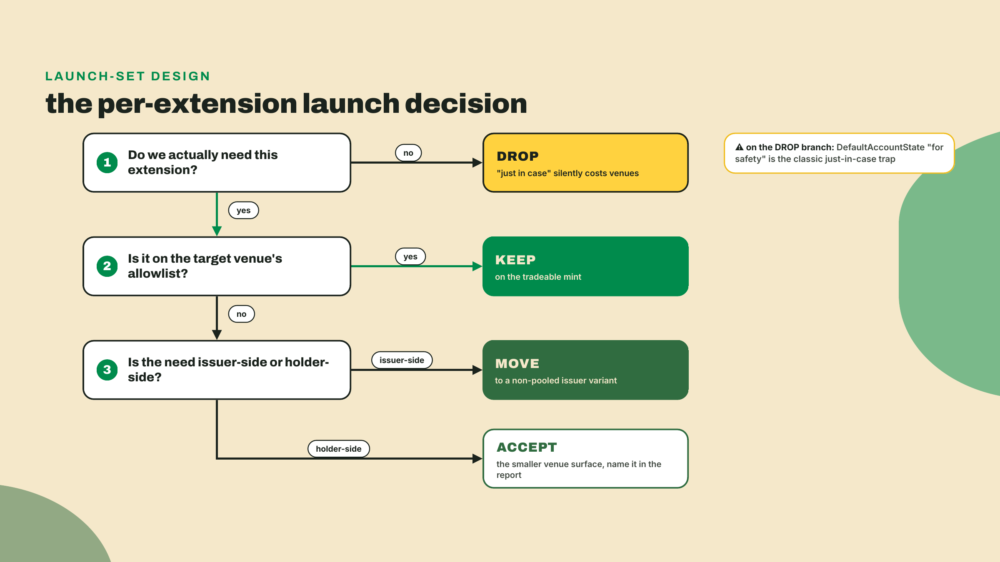
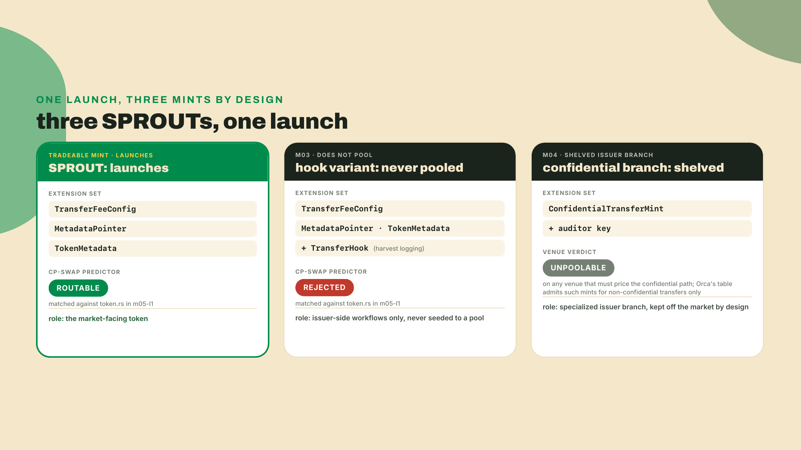
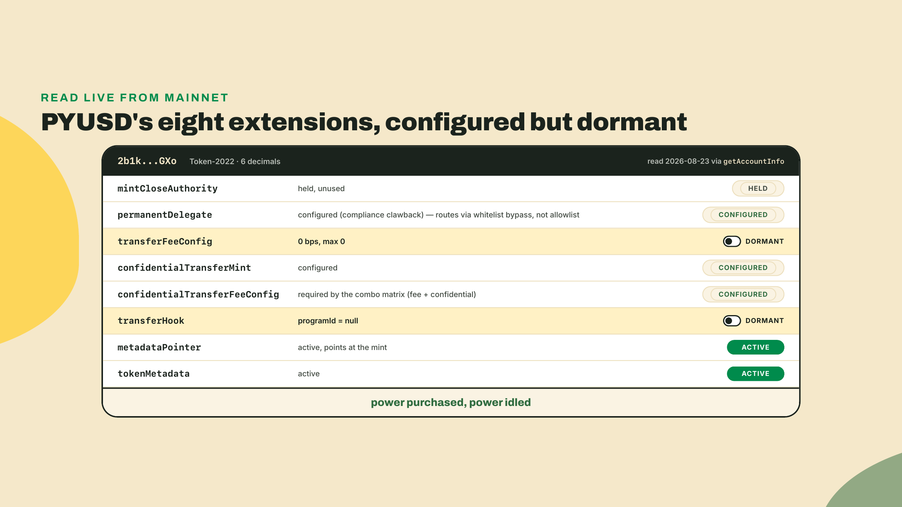
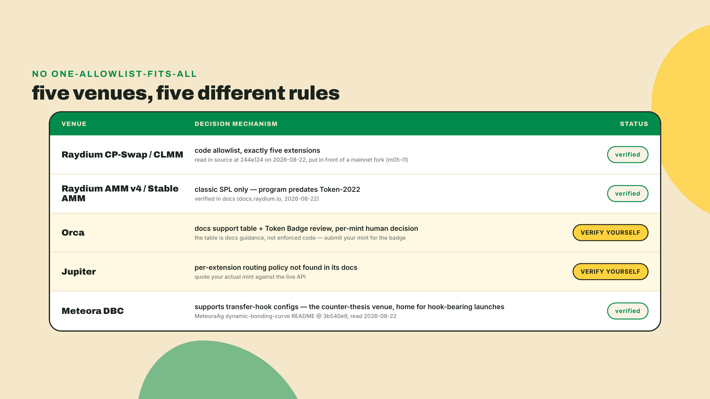
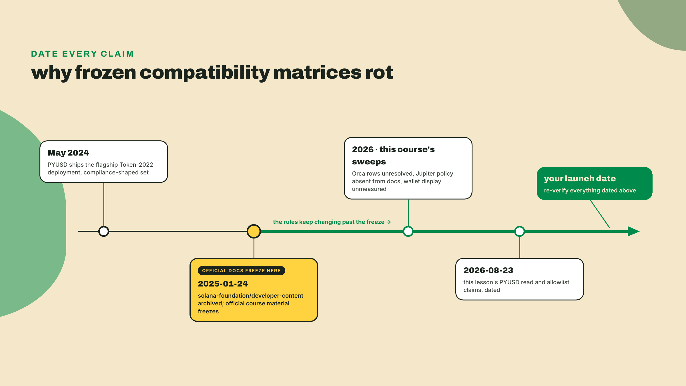
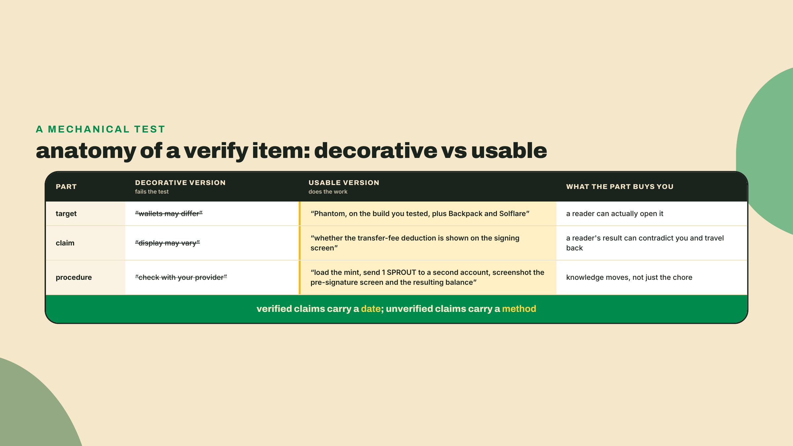
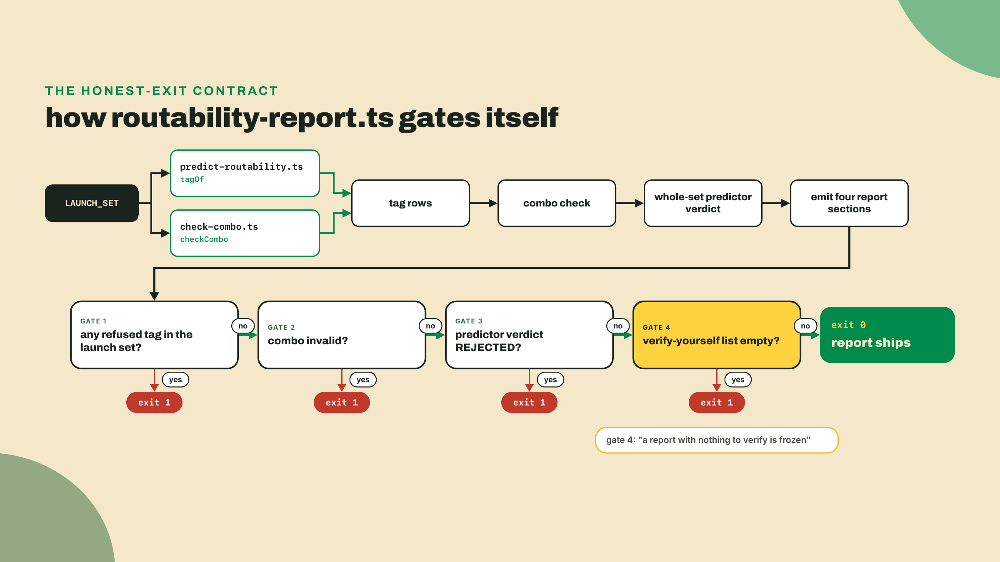

# Designing a routable, compliant token

## Summary

Last lesson you read the rule in Raydium's own program that accepts a fee+metadata SPROUT and rejects its transfer-hook variant, built a predictor that reproduces it, and put both mints in front of it on a mainnet fork. This lesson turns that read into a decision and a deliverable. You will state the compatibility thesis in one sentence, defend it from the pool's side of the table, choose SPROUT's final launch-venue extension set against the allowlist, and produce the routability report: every included extension tagged whitelisted or refused with its rationale, the venues SPROUT is verified-routable on, and an explicit list of the claims you must verify in your own target instead of trusting anyone's frozen matrix, this course included. The fade is nearly complete: the thesis and the set assembly are worked with light scaffolding, the report's honesty section is yours solo, and there is no coding challenge because the report itself is the check. This is a judgment lesson with a build lesson's shape.

You have spent four modules giving SPROUT capabilities. Fees that fund a treasury. Native metadata. A hooked variant that logs every harvest. A confidential branch with an auditor key. Every one of those was a good build. And last lesson a DEX looked at the sum of them and said no. Shipping is now a decision, not a lookup: every extension you keep is a capability you want and a venue you might lose, and you are the one who signs the trade.

So start where a decision should start, with the full candidate list and a verdict per line. In your m05-l1 lab folder, next to `predict-routability.ts`, drop this and run it:

```typescript
// audit-candidates.ts: every extension the SPROUT design has worn or weighed
// (the delegate and frozen-default rows were m02 catalog considerations, never
// minted onto SPROUT), one verdict each.
import { isRoutable } from "./predict-routability";

const CANDIDATES = [
  "TransferFeeConfig",
  "MetadataPointer",
  "TokenMetadata",
  "TransferHook",
  "PermanentDelegate",
  "DefaultAccountState",
  "ConfidentialTransferMint",
];

for (const ext of CANDIDATES) {
  const ok = isRoutable({ tokenProgram: "token2022", extensions: [ext] });
  console.log(ext.padEnd(26), ok ? "whitelisted" : "refused");
}
```

```bash
npx tsx audit-candidates.ts
```

Three whitelisted, four refused. That output is the whole lesson; the next three thousand words are about why the line falls exactly there, and what an honest report built on top of it looks like.

## Who gets to run code on every transfer

### The thesis, one sentence

Here it is: a DEX whitelists extensions that only change display or skim a declared fee, and refuses extensions that let the issuer run arbitrary code or move other people's tokens. Fee, display and accounting on one side: TransferFeeConfig, MetadataPointer, TokenMetadata, InterestBearingConfig, ScaledUiAmount, the exact five on Raydium CP-Swap's allowlist. Power and control on the other: TransferHook, PermanentDelegate, DefaultAccountState frozen, ConfidentialTransfer, all refused. Say it in those words and not in the tempting shorter ones, because "compliance gets whitelisted" is false in a way that will cost somebody a launch: PermanentDelegate and DefaultAccountState are the compliance team's two favourite primitives and both sit on the refused side. The capstone drills this exact one-liner. You verified the mechanics of this last lesson by reading the source. Today's question is different. Why is the line THERE, and not somewhere else?

### Deriving the line from the pool's seat

Sit in the pool's chair for a minute. A pool is a pile of two tokens plus an invariant, and its one non-negotiable job is that the pile stays where the math says it should be. Now walk the naive designs and watch each one fail.

Could the DEX review tokens case by case? That is a real design, and Orca ships it. A Token Badge is a per-mint approval Orca's team grants after actually looking at your mint, which is how a token carrying something like PermanentDelegate can trade there at all: not by clearing a published list, but by clearing a person. Price that design honestly, because it is not strictly worse than a list. A reviewer sees things a match statement never will: who the issuer is, whether the delegate key is a multisig or one laptop, whether the fee authority was already revoked. What a reviewer cannot do is scale, answer in a bounded amount of time, or tell you the verdict before you have committed to a design and minted it. And a permissionless pool factory cannot use one at all. Pool creation there is a transaction anyone can send at any slot with no human anywhere in the path, so for CP-Swap the acceptance rule has to be code. Code cannot read a whitepaper or a legal opinion. It can only read the mint.



Fine, then could the pool just accept everything and handle the consequences? Walk the refused list and the consequences are not handleable. A TransferHook means a program the DEX never audited runs inside every swap, with whatever compute it likes; Raydium's docs refuse it in exactly those words, a custom program invoked on every transfer with arbitrary CU consumption. A PermanentDelegate means some key out there can move tokens out of any account, and the pool vault is an account; Raydium again, verbatim: a holder of the delegate can sweep any token account, including the pool vault. DefaultAccountState frozen means the issuer decides whether the pool's own accounts may transact at all. ConfidentialTransfer means the amounts are encrypted, and you cannot run an invariant over ciphertext. Each refusal protects a different load-bearing assumption, but they are all the same genus: the extension gives someone outside the pool authority over what happens inside it.

### Why the answer has to be binary

One more escape hatch is worth closing, because it is the one a good engineer reaches for next. Could the rule be graded instead of binary? Let a risky mint in, but charge it a higher fee, cap its pool size, quarantine it behind a warning. Grading needs the pool to put a number on the risk, and the refused extensions do not have numbers. What is the correct surcharge for a transfer hook whose authority can point it at completely different code tomorrow? There is no answer, because the exposure is not a distribution you can integrate over, it is "whatever that program decides to do next." A declared 500 basis point fee is a cost. An upgradeable hook is an open-ended liability, and open-ended liabilities do not have prices, they have accept-or-refuse. That is why the rule lands binary, and why it must be a pure function of the extension set, nothing else.

Now look at the accepted side with the same eyes. A transfer fee is issuer power too, technically, but it is declared, capped, and readable on the mint, so the pool can price it, and the interface hands you `calculate_fee`, the fee-math helper on the TransferFeeConfig state whose formula you mirrored in TypeScript as `transferFee` back in m02-l1, to do exactly that. Metadata changes what humans see, never what the token does. InterestBearingConfig and ScaledUiAmount are pure display arithmetic; the raw amounts the pool accounts for never move. The pattern is not "harmless extensions pass." The pattern is: anything the pool can fully price from on-chain data passes, anything that reserves discretion for the issuer fails. That is a value judgment about who gets to run code on every transfer, encoded as a Rust match statement, and I genuinely find that more honest than a listing form. The code cannot be lobbied.



One more turn of the crank, because the thesis has a sharp corollary you met last lesson. Ask your own predictor to state it, in the same folder as before:

```typescript
// additive-check.ts: does a whitelisted extension rescue a refused one?
import { isRoutable } from "./predict-routability";

const CASES: [string, string[]][] = [
  ["fee alone", ["TransferFeeConfig"]],
  ["hook alone", ["TransferHook"]],
  ["fee + metadata + hook", ["TransferFeeConfig", "TokenMetadata", "TransferHook"]],
  ["all five allowlisted + delegate", [
    "TransferFeeConfig",
    "MetadataPointer",
    "TokenMetadata",
    "InterestBearingConfig",
    "ScaledUiAmount",
    "PermanentDelegate",
  ]],
];

for (const [label, extensions] of CASES) {
  const verdict = isRoutable({ tokenProgram: "token2022", extensions }) ? "ROUTABLE" : "REJECTED";
  console.log(label.padEnd(32), verdict);
}
```

```bash
npx tsx additive-check.ts
```

Only the first case comes back routable. Five allowlisted extensions plus one refused one is still rejected, and that is the corollary: allowlisting is not additive. One off-list extension taints the whole mint. There is no "but it also has TransferFeeConfig" defense, because the pool's exposure to a permanent delegate does not shrink when a fee config sits next to it. Your predictor encodes this as `every`, not `some`, and that single word is the difference between the folklore model and the real one.

### What the boring set costs you

Let me say the trade-off out loud, because this course promised it always would: the routable set is the boring set. Designing for maximum tradeability means giving up everything interesting you built or weighed from module two's authority catalog onward. No on-transfer logic on the mint people trade. No permanent delegate, no default-frozen onboarding, the two m02 powers SPROUT considered and never wore. No hidden amounts. If your product genuinely needs a power extension, that need is real and this lesson is not telling you to abandon it. It is telling you to price it: a hook means Meteora DBC territory instead of CP-Swap, or a Token Badge review on Orca that may or may not go your way, or a two-mint architecture where the powered variant never touches a pool. Choosing a smaller venue surface is a legitimate design. Discovering a smaller venue surface at launch is an incident.



### Assembling SPROUT's set

Apply the procedure to the audit you ran at the top. TransferFeeConfig: the fee funds the treasury, that is SPROUT's economic engine from m02-l1, and it is whitelisted. Keep. MetadataPointer plus TokenMetadata: the native metadata you wired in m02-l4, whitelisted, display only. Keep both. That is the entire tradeable mint. Three extensions, all boring, all priceable.

The hook is the hard goodbye. You wrote it yourself in m03, it works, and it is exactly the arbitrary-code-on-every-transfer a pool cannot carry. It comes off the tradeable mint. If harvest logging still matters to the product, the hook lives on a separate non-pooled issuer variant, same pattern as the confidential branch you shelved in m04: powered mints for issuer workflows, a boring mint for the market. And here is a detail that makes the two-mint split less annoying than it sounds: the combo matrix you built in m01-l4 would have fought a merge anyway. Fold ConfidentialTransferMint into the fee mint and rule 2 of `check-combo` demands ConfidentialTransferFeeConfig on top, which drags in the whole confidential fee apparatus. The extension system itself keeps nudging power and commerce apart. I fought that nudge for a while on my own designs before accepting it was load-bearing.



### The two allowlisted extensions SPROUT is still not taking

Here is the objection I would raise reading this back: SPROUT's set is three extensions, and the allowlist has five. InterestBearingConfig and ScaledUiAmount are sitting right there, pre-approved, costing zero routability. Why not take them? A yield-flavored farming token could plausibly want interest accrual, and a display multiplier gives you a rebase story for free.

Because the allowlist is a floor, not a shopping list. Passing it means the venue will not refuse you for that extension. It never means the extension is free. Both of those two do the same clever thing: they change the number every interface displays without changing the number the program actually moves. That gap is the entire feature and it is also the entire cost. The moment SPROUT carries ScaledUiAmount, your explorer, your CSV export, your accounting spreadsheet, your support replies, the DEX price chart, and the raw balance in a `getTokenAccountBalance` response are no longer obviously the same number, and every one of those readers is now owed an explanation you have to write and keep true. InterestBearingConfig accrues that UI amount continuously; ScaledUiAmount multiplies it by a factor an authority can change later. SPROUT's treasury math needs neither.

So the design rule generalizes past routability, and this is the version worth keeping: an extension has two costs, and the allowlist prices only one of them. Cost one is refusal risk, which the venue publishes. Cost two is every downstream reader you now owe an explanation to, which nobody publishes and you pay forever. I have shipped an extension because it was on somebody's approved list, then spent more hours explaining it in a support channel than I ever spent using it. Two extensions you do not need are two paragraphs in a runbook you will be writing at 2am.

### PYUSD does the same math at billion-dollar scale

You do not have to take the two-track pattern from a course token. Read it off the flagship whose story closed last lesson, and this time count: PYUSD's mint carries eight TLV extensions, mintCloseAuthority, permanentDelegate, transferFeeConfig, the confidentialTransfer pair, transferHook, metadataPointer, tokenMetadata. Configured but dormant: I re-read the mint from mainnet while drafting this on 2026-08-23 and the hook's `programId` is null and the fee sits at 0 basis points, max 0 — every power option bought, every one switched off. How a permanent-delegate mint trades on CP-Swap at all you already know: the whitelist bypass, and you can settle it in five seconds because PYUSD's mint address is one of the four strings in `MINT_WHITELIST` at `token.rs` L18-23, right there in the `sed` output you already printed. Ship the compliance-shaped extensions, keep the power ones idle, and even then routability came from a special door, not the general rule.



### Routability is per-venue, and most of the map is unlit

Everything so far is one venue's law. Hold that limit tight, because the moment SPROUT routes on CP-Swap your brain will want to write the sentence "SPROUT is tradeable," and that sentence is not something you know. The venue map itself is last lesson's material, so hold only its headlines: AMM v4 and Stable AMM under the same Raydium brand take classic SPL only; Orca's docs-level support table plus its human-reviewed Token Badge make that answer a per-mint decision you can request but never fully predict from your extension set; Meteora DBC runs the counter-thesis and supports transfer-hook configs; and Jupiter's per-extension routing policy is simply not found in its docs, on any sweep this course ran. What today adds is the design consequence: the only honest statement about any venue is verify at write, against your mint, in their live API.

Wallets are darker still. Whether Phantom shows a fee warning, whether Backpack renders the metadata pointer, whether Solflare flags a hook: unverified, all of it, across every research pass behind this course. I could paste a plausible compatibility matrix here and you would believe it, and that is precisely why I will not. A frozen matrix of unmeasured claims is worse than no matrix, because it fails silently in the one place you stopped checking.



Why so much darkness in a maturing ecosystem? Partly because the ground truly moves, and partly because the people who used to map it stopped. The Solana Foundation's developer-content repo, the source behind years of official course material, was archived on 2025-01-24. Every official course froze before the venue rules you are designing against existed. There is no canonical matrix because nobody is paid to keep one true, and the third parties who publish one are freezing the same churning facts you are. That is not a reason for despair; it is the design constraint your report is built around. The durable deliverable is a matrix plus the dated method for re-deriving every cell.



### What a verify item owes the reader

"Verify in your target" can be a professional discipline or a shrug that moved the work without moving any knowledge, and the difference is mechanical. A verify item earns its place when it carries three parts. A **target**, named specifically enough to open: not "wallets" but Phantom on the version you tested. A **claim**, stated precisely enough that a reader's result can contradict it: not "display may vary" but "whether the transfer-fee deduction is shown before signing." And a **procedure**, which is what a reader runs plus what each possible answer means.

Drop any one part and watch the item rot in a predictable way. Target missing, and you have written a disclaimer, which protects you and helps nobody. Claim missing, and a reader who runs your procedure cannot tell whether what they saw agrees with you or refutes you, so their result never travels back. Procedure missing, and you have handed off a chore instead of a method, which is the polite version of guessing.

There is a matching rule for the claims you did verify, and it is the shorter one: date them. A verified claim needs a date so it can rot visibly; an unverified claim needs a method so someone can settle it. Every dated claim in this lesson follows the first rule, including the ones I read off mainnet this morning.



That three-part shape is not a writing convention, it is a data structure, and in the lab you are about to build it becomes a TypeScript interface with exactly three fields. Which is the nice thing about encoding honesty in a program: a shrug does not typecheck.

## Lab: produce the routability report

The artifact is `routability-report.ts`, the finished form of R6. To pin the name once, since it has now appeared twice: R6 IS the routability report; the predictor you built last lesson was its draft, and it rides inside this file as the tagger. It consumes your predictor and your combo checker, tags SPROUT's final set, states the verified venues, and refuses to state the unverified ones. The gate is the course's usual shape: `npx tsx routability-report.ts` must emit the final extension set with each extension tagged whitelisted or refused per the allowlist, the verified-routable venues, and a non-empty verify-in-your-target list covering Orca, Jupiter, and wallet display.

1. Work in the m05-l1 lab folder, where `predict-routability.ts` already lives, and bring the combo checker across from its own lab so both imports resolve from one directory: `cp ../m01-l4/check-combo.ts .`. Nothing new to install if you did that lab; if you are starting clean, the runner pins are the same two dev tools, re-checked today (2026-08-23). `tsx@4.23.12` was npm latest on that read; `typescript@5.9.3` is a deliberate hold, since npm latest has already moved onto the 7 line and this course pins the version its labs were verified against. Both numbers rot, so run `npm view tsx version` yourself the day you scaffold:

```bash
npm install -D tsx@4.23.12 typescript@5.9.3
```

2. Before you tag anything, pull the ground truth for what your actual tradeable mint carries. You have the `spl-token` CLI from the m01-l4 docs-vs-code probe (m01-l3's Agave bundle may have included it; if yours did not, `cargo install spl-token-cli` fills the gap). Point it at wherever you actually minted SPROUT, which for the default path is your local surfnet; forks are ephemeral, so if yours restarted since you minted, re-mint first with the two commands from the m05-l1 opener (and swap in `--url devnet` if you took m02-l4's devnet fallback):

```bash
spl-token display <YOUR_SPROUT_MINT> --url http://127.0.0.1:8899
```

   Scroll past the supply and decimals to the extensions block. For the mint you want, it lists a transfer fee config with your basis points and maximum, a metadata pointer whose address is the mint itself, and the token metadata holding SPROUT's name, symbol, and URI. Three entries, no fourth. If a `Transfer Hook` line is still sitting there because you minted the m03 variant and never reminted, stop here: that mint is the hook variant, not the launch mint, and no amount of careful tagging in the report will change what the pool's check reads. If the output disagrees with the set in your head, the mint wins, and your report describes the mint rather than your intentions. This thirty-second check is the difference between a report and a wish, and it is the one step in this lab I would refuse to skip.

3. Now the report's core trick: derive each tag from the predictor instead of copying the allowlist into a second file. Two copies of a list drift; one function probed twice cannot. Start `routability-report.ts` with the imports and the tagger. The tagger is the report's one clever move, two lines, so read it rather than skimming it:

```typescript
// routability-report.ts: SPROUT's launch-venue routability report (R6, final).
import { isRoutable, type MintProfile } from "./predict-routability";
import { checkCombo } from "./check-combo";

type Tag = "whitelisted" | "refused";

interface ExtensionRow {
  extension: string;
  tag: Tag;
  rationale: string;
}

interface VerifyItem {
  target: string;
  claim: string;
  howToVerify: string;
}

// Tag an extension by asking the PREDICTOR: a hypothetical Token-2022 mint
// carrying only this extension either passes CP-Swap's check or it does not.
function tagOf(extension: string): Tag {
  const probe: MintProfile = { tokenProgram: "token2022", extensions: [extension] };
  return isRoutable(probe) ? "whitelisted" : "refused";
}
```

4. Give every row a rationale, because a tag without a reason is folklore with better formatting. The allowlisted entries say what the pool can still do; the refused entries carry the venue's reason class, the ones you can defend from source. Then declare the launch set and the dropped set, each drop recording where the capability went instead of pretending it never existed:

```typescript
const RATIONALE: Record<string, string> = {
  TransferFeeConfig: "declared, capped fee the pool can read and price in",
  MetadataPointer: "display only; changes nothing about how a transfer executes",
  TokenMetadata: "display only; name/symbol/URI live on the mint itself",
  InterestBearingConfig: "UI-level accrual; raw token amounts are untouched",
  ScaledUiAmount: "UI multiplier; raw token amounts are untouched",
  TransferHook: "issuer code runs on every transfer, arbitrary CU; refused",
  PermanentDelegate: "issuer can move tokens from any account, pool vault included; refused",
  DefaultAccountState: "issuer decides whether new accounts can transact at all; refused",
  ConfidentialTransferMint: "encrypted amounts cannot be priced by an AMM; refused",
};

function buildRows(extensions: string[]): ExtensionRow[] {
  return extensions.map((extension) => ({
    extension,
    tag: tagOf(extension),
    rationale: RATIONALE[extension] ?? "no rationale recorded; justify before shipping",
  }));
}

// The tradeable mint: fees fund the treasury, metadata is native. All allowlisted.
const LAUNCH_SET = ["TransferFeeConfig", "MetadataPointer", "TokenMetadata"];

// Considered and dropped, with the decision recorded.
const DROPPED: ExtensionRow[] = [
  {
    extension: "TransferHook",
    tag: "refused",
    rationale:
      "dropped from the tradeable mint: costs CP-Swap outright; hook lives on the non-pooled issuer variant only",
  },
  {
    extension: "ConfidentialTransferMint",
    tag: "refused",
    rationale:
      "stays on the shelved issuer branch from m04; the confidential path cannot be pooled, and venues that admit such mints at all (Orca's table) do so for public transfers only",
  },
  {
    extension: "PermanentDelegate",
    tag: "refused",
    rationale:
      "an m02 catalog consideration, never adopted: refused by the allowlist, and SPROUT's product has no clawback requirement to justify the venue cost",
  },
  {
    extension: "DefaultAccountState",
    tag: "refused",
    rationale:
      "an m02 catalog consideration, never adopted: the classic just-in-case trap the decision flowchart warns about; gated onboarding is not a SPROUT requirement",
  },
];
```

5. The two venue sections are where honesty gets structural. `VERIFIED_ROUTABLE` holds only venues where routability was demonstrated, which for you is exactly one entry, the mainnet-fork pool-create from last lesson. `VERIFY_YOURSELF` holds every claim you are not allowed to assert, each with the concrete procedure a reader runs in their own target. This scaffold carries the three targets the gate requires; the wording of each `howToVerify` is yours to sharpen in the challenge:

```typescript
// Venues where routability was DEMONSTRATED, not inferred. If you took m05-l1's degrade
// path and never landed the pool-create, this entry is a claim you have not earned: say
// "predictor verdict ROUTABLE, matched against token.rs @ 244e124; pool-create unrun" instead.
const VERIFIED_ROUTABLE = [
  "Raydium CP-Swap: predictor verdict ROUTABLE, confirmed by a mainnet-fork pool-create (m05-l1 lab)",
];

// Claims we do NOT assert. Each names the target, the unverified claim, and
// how the reader verifies it in the venue they actually ship to.
const VERIFY_YOURSELF: VerifyItem[] = [
  {
    target: "Orca",
    claim: "whether SPROUT's extension set clears Orca's Token Badge review",
    howToVerify:
      "check the Token Badge requirements in Orca's current docs and submit the mint for review; the badge is a per-mint decision, not a published allowlist",
  },
  {
    target: "Jupiter",
    claim: "whether Jupiter routes this Token-2022 extension set",
    howToVerify:
      "no per-extension routing policy was found in Jupiter's docs at the time of writing. Jupiter's live API sees mainnet only and your SPROUT lives on a local fork, so the runnable version is two-step: today, quote a mainnet mint with the same extension shape (fee + metadata pointer + metadata) to learn the policy; at launch, quote your own mint the moment it exists on mainnet. A returned route is a yes; token-not-found or no-route is the no",
  },
  {
    target: "Wallets (Phantom, Backpack, Solflare)",
    claim: "how each wallet displays the transfer fee and whether it warns on any extension",
    howToVerify:
      "load the mint in the wallet you target and observe; per-extension display behavior is not standardized and was not measured by this course",
  },
];
```

6. Emit and self-gate. The report prints its four sections, then turns its own rules on itself: a refused extension in the launch set, a combo-matrix violation, a predictor rejection, or an empty verify-yourself list each exits non-zero. That last gate matters most; a report with nothing left to verify is not thorough, it is frozen:

```typescript
function main(): void {
  const rows = buildRows(LAUNCH_SET);
  const combo = checkCombo(LAUNCH_SET);
  const verdict = isRoutable({ tokenProgram: "token2022", extensions: LAUNCH_SET })
    ? "ROUTABLE"
    : "REJECTED";

  console.log("# SPROUT routability report\n");
  console.log("## Final launch-venue extension set\n");
  for (const r of rows) {
    console.log(`- ${r.extension} [${r.tag}]: ${r.rationale}`);
  }
  console.log(`\nCombo matrix: ${combo.valid ? "valid" : `INVALID (${combo.reason})`}`);
  console.log(`CP-Swap predictor verdict: ${verdict}\n`);

  console.log("## Considered and dropped\n");
  for (const r of DROPPED) {
    console.log(`- ${r.extension} [${r.tag}]: ${r.rationale}`);
  }

  console.log("\n## Verified routable\n");
  for (const v of VERIFIED_ROUTABLE) console.log(`- ${v}`);

  console.log("\n## Verify in your target (not asserted by this report)\n");
  for (const v of VERIFY_YOURSELF) {
    console.log(`- ${v.target}: ${v.claim}`);
    console.log(`  how: ${v.howToVerify}`);
  }

  const refusedInSet = rows.filter((r) => r.tag === "refused");
  if (refusedInSet.length > 0) {
    console.error(`\nGATE FAIL: refused extension(s) in the launch set: ${refusedInSet.map((r) => r.extension).join(", ")}`);
    process.exit(1);
  }
  if (!combo.valid) {
    console.error(`\nGATE FAIL: combo matrix violation: ${combo.reason}`);
    process.exit(1);
  }
  if (verdict !== "ROUTABLE") {
    console.error("\nGATE FAIL: predictor rejects the launch set");
    process.exit(1);
  }
  if (VERIFY_YOURSELF.length === 0) {
    console.error("\nGATE FAIL: the verify-yourself section is empty; that is a frozen-matrix report");
    process.exit(1);
  }
  console.log("\nAll gates pass: allowlist-clean set, valid combo, non-empty verify list.");
}

main();
```

   Run it:

```bash
npx tsx routability-report.ts
```

   You should see the four sections in order, `Combo matrix: valid`, `CP-Swap predictor verdict: ROUTABLE`, three verify-yourself entries, and the closing `All gates pass` line with exit code 0. Then prove the gates are real: add `"DefaultAccountState"` to `LAUNCH_SET`, run again, and watch the same script refuse to ship its own report: a row tagged refused, gate fail, exit 1. A checkpoint that cannot fail was never a checkpoint. Take the extension back out.



## Challenge

The solo half is the honesty section, and you write it without scaffolding. Take the three `VERIFY_YOURSELF` entries and turn each `howToVerify` from my placeholder wording into a procedure you would hand a teammate: for Orca, what you would actually submit and where the Token Badge answer comes back; for Jupiter, the exact quote request you would make once SPROUT exists on mainnet, plus the same-shaped mainnet mint you would probe today as its stand-in, and what a routed-versus-unrouted answer looks like; for the wallets, which screens you would open and what you would record. Then add at least one verify item I did not give you. Candidates you have already brushed against: whether CP-Swap's allowlist still matches source at the commit you pinned, since a printed allowlist rots like any matrix, or whether the whitelist bypass entries changed. The acceptance bar is the brief's, word for word: every included extension is justified against the allowlist, and no unverified wallet or aggregator claim is stated as fact. Read your finished report hunting for one sentence that asserts something you never measured. If you find none, and the gates pass, R6 is done and SPROUT's design is closed.

One request before you close the folder. If your own verification runs contradict anything dated in this lesson, a Jupiter policy page that now exists, an Orca badge flow that moved, a sixth extension on the CP-Swap allowlist, post the exact claim and what you found in the course feedback channel. My reads are dated 2026-08-23 and the whole argument of this lesson is that dated claims decay; a learner who catches one decaying is the system working, and the report format you just built is exactly where such a catch belongs.

SPROUT is settled: an economics token you can build, route, and defend on paper, with a report that says where it trades and admits what it does not know. That closes the fungible half of this course. Next module leaves fungibles behind for the collectibles layer: the 2026 NFT stack, the metadata wallets actually read, and the royalty reality nobody advertises. Bring the same skepticism; the collectibles side has even more folklore to burn.
