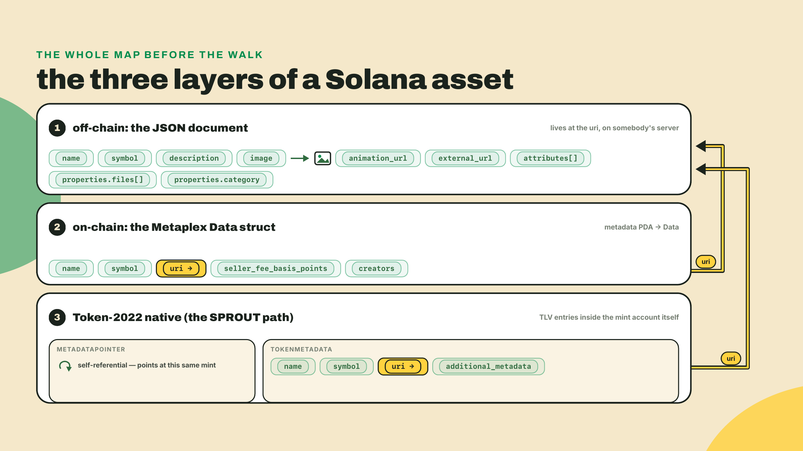
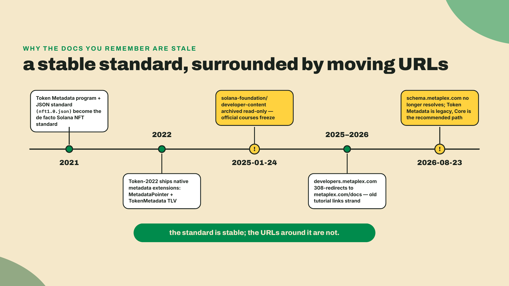
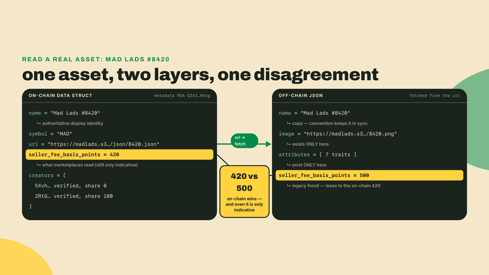
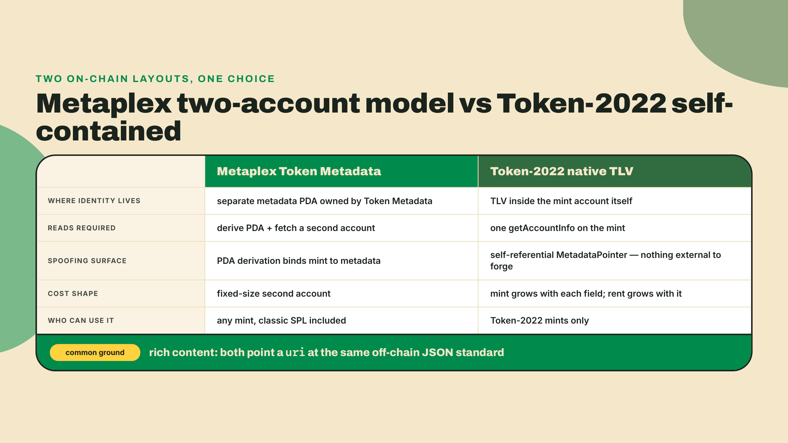
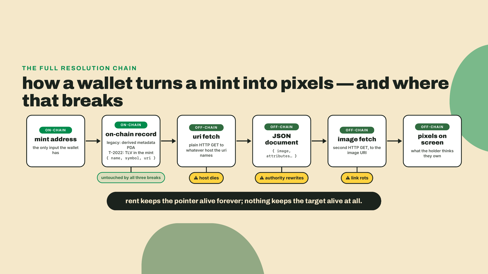
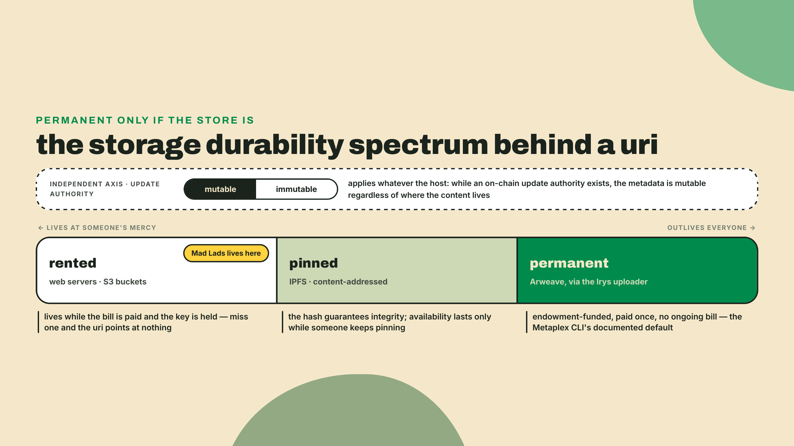

# The metadata standards wallets actually read

## Summary

In m05-l2 you finalized SPROUT's launch-venue extension set and the routability report R6; the fungible half of Overgrowth's economy is decided, tradeable, and compliant, its metadata written as native Token-2022 TLV in m02-l4. This lesson opens the NFT half with a map, not a mint: where an asset's name, image, and traits actually live. The answer is three layers, numbered once so you can always ask which layer a field lives in: layer 1 is the off-chain JSON document a wallet renders from, layer 2 is the small on-chain struct whose pointer holds that JSON's address, and layer 3, on Token-2022 mints only, is the native TLV you already wired by hand. You will fetch a famous NFT, print its on-chain record beside its off-chain JSON, catch the two disagreeing about the royalty, and finish able to place any field of any Solana asset in its layer. The autonomy fade: both scripts run in full as provided, the field-location table is yours to fill mid-lab, and the challenge is fully solo against an asset I do not pick.

Open your wallet and look at any NFT. A name, a picture, maybe a trait list and a royalty on the marketplace page. It reads like one object. It is not, and it is not even one place: some of that screen is bytes in an on-chain account, most is a JSON blob at a URI the account merely points to, and on a Token-2022 mint, some of it is TLV you already know how to write. Before I explain a single layer, go look at the seams yourself.

No new toolchain today. In your course workspace, create `fetch-asset.ts` from the lab below and run it:

```bash
npx tsx fetch-asset.ts F9Lw3ki3hJ7PF9HQXsBzoY8GyE6sPoEZZdXJBsTTD2rk
```

That address is the mint of Mad Lads #8420, one of Solana's most famous NFTs. Here is what came back when I ran it while writing this, on 2026-08-23:

```text
=== ON-CHAIN (the Data struct, decoded from the metadata PDA) ===
account:                DZAZ3mGuq7nCYGzUyw4MiA74ysr15EfqLpzCzX2cRVng (owner: metaqbxxUerdq28cj1RbAWkYQm3ybzjb6a8bt518x1s)
name:                   "Mad Lads #8420"
symbol:                 "MAD"
uri:                    https://madlads.s3.us-west-2.amazonaws.com/json/8420.json
seller_fee_basis_points: 420
creator:                5XvhfmRjwXkGp3jHGmaKpqeerNYjkuZZBYLVQYdeVcRv verified=true share=0
creator:                2RtGg6fsFiiF1EQzHqbd66AhW7R5bWeQGpTbv2UMkCdW verified=true share=100

=== OFF-CHAIN (the JSON document at that uri) ===
name:        "Mad Lads #8420"
symbol:      "MAD"
description: "Fock it."...
image:       https://madlads.s3.us-west-2.amazonaws.com/images/8420.png
attributes:  7 traits, e.g. {"trait_type":"Gender","value":"Male"}
properties.files: 2 file(s)
properties.category: image
seller_fee_basis_points in JSON: 500
top-level keys: name, description, symbol, image, external_url, seller_fee_basis_points, attributes, properties
```

Sit with that output for a minute, because the whole lesson is in it. The on-chain account holds five things and no picture. The picture, the traits, the description all live in a JSON file at the `uri`. The royalty appears twice, and the two copies disagree: 420 basis points on-chain, 500 in the JSON. And the URI for one of the most valuable collections on Solana points at an Amazon S3 bucket. Every one of those observations becomes a section of this lesson.

## Where an asset actually lives

Here is the collapse that demystifies the entire stack: an on-chain asset record is just a struct with a pointer, and the rich content is a JSON document at that pointer. That is the whole architecture. Everything else in this lesson is naming the struct's fields, naming the JSON's fields, and asking the one question the collapse forces: what happens when the pointer outlives the thing it points at?

Why build it this way at all? Run the naive alternative into the ground first. Suppose you stored the image on-chain. A PNG of Mad Lad quality runs a few hundred kilobytes; on-chain bytes cost rent per byte, an account is capped at 10 MiB, and every byte of it gets replicated to every validator forever. You would be paying validator-grade storage prices, on thousands of machines, for a picture that changes never and gets read by one wallet at a time. So nobody does that. The chain stores what the chain is good at, small authenticated facts: who made this, what is it called, where is the rest. The rest lives where bulk content lives, behind a URI. Cheap mints, rich content, and one new failure mode we will name honestly before the lab.



### Layer 1: the off-chain JSON the wallet renders from

Start with the layer that fills most of the screen. The off-chain document follows the Token Metadata JSON standard, and the fields you saw in the Mad Lads output are the standard's core. Walk them one at a time, because a wallet walks them too:

- **`name`** and **`symbol`**: display strings. Note they also exist on-chain; the JSON copies are what most wallets actually render, and keeping the two in sync is a norm, not a rule.
- **`description`**: free text, rendered on detail pages. Mad Lads' is two words.
- **`image`**: the URI of the artwork. This is the field a wallet grid is made of. A dead `image` is an empty square.
- **`animation_url`**: optional URI for video, audio, 3D, or an interactive build. Wallets that support it render this instead of the still image.
- **`external_url`**: a link out to a website. Pure convention, often stale, never load-bearing.
- **`attributes`**: the trait list, an array of `{ "trait_type": ..., "value": ... }` pairs. Mad Lads #8420 carries seven, starting with `{"trait_type":"Gender","value":"Male"}`. Marketplaces build their rarity tools entirely from this array.
- **`properties.files`**: an array of `{ uri, type }` entries (plus an optional `cdn` flag) listing every file that makes up the asset, typically the image again plus alternates. The `type` is a MIME type; wallets fall back to guessing from the extension when it is missing.
- **`properties.category`**: one word telling renderers what kind of asset this is: `image`, `video`, `audio`, `vr`, or `html`.

The fungible standard is the minimal subset of the same document: `name`, `symbol`, `description`, `image`. A token like USDC needs a logo and a name, not a trait list. Same schema family, fewer fields, which is why one JSON convention serves both halves of the asset world.

Two things you saw in the real document deserve suspicion. First, `seller_fee_basis_points` appears in Mad Lads' JSON at 500. That is a legacy field: the royalty moved on-chain years ago, and a JSON copy is whatever the uploader happened to write on upload day. The on-chain 420 is what marketplaces read; the JSON 500 is a fossil. When two layers disagree, the on-chain layer is the one with an update authority and a timestamp, and the off-chain copy quietly rots. Second, where is the schema itself? The canonical schema URL, https://schema.metaplex.com/nft1.0.json, is the one the ecosystem standardized on. I probed it while writing this lesson, 2026-08-23: the host no longer resolves at all. The DNS record is gone. The standard did not change, but its canonical reference address is dead, so this lesson carries the field contract in prose and in the lab's validator script instead of linking you into a void.

That dead URL is not an isolated accident, and it is worth thirty seconds of history because it explains why so much of what you half-remember about NFT metadata is a generation behind. Official Solana education froze mid-plot: the solana-foundation/developer-content repository, the source behind the official courses, was archived read-only on 2025-01-24. Every official course predates the current NFT stack. Metaplex's own docs moved domains, and the old developers.metaplex.com now 308-redirects to metaplex.com/docs, stranding years of tutorial links one redirect from their content. The standard you are learning today is stable; the URLs around it are not. Re-verify any metadata citation before you trust it, including, in five years, this one.



### Layer 2: the on-chain Data struct, five fields and a pointer

Now the small layer, the one your script decoded by hand. For a legacy asset, the on-chain record is an account derived from the mint: the metadata PDA, seeded with the literal string `"metadata"`, the Token Metadata program id, and the mint address, owned by the Token Metadata program at `metaqbxxUerdq28cj1RbAWkYQm3ybzjb6a8bt518x1s`. Your script derived it, read it, and skipped 65 bytes of header (a one-byte account key, the 32-byte update authority, the 32-byte mint) to reach the part the standard names the `Data` struct:

```text
Data {
  name:                    String   // Borsh: u32 length + bytes, stored at fixed capacity, null-padded
  symbol:                  String
  uri:                     String   // the pointer to layer 1
  seller_fee_basis_points: u16      // 420 for Mad Lads = 4.20%
  creators:                Option<Vec<Creator { address, verified, share }>>
}
```

Five fields. That is the entire on-chain identity of a legacy NFT, and now the output you got at the top of the lesson should read differently: the account was never "missing" the image. The image was never supposed to be there. A teammate who fetches an NFT's account, finds no traits and no picture, and concludes the asset is broken has misread the architecture; nothing is stored where they looked, by design, and the `uri` field was the answer sitting in their own dump.

Each field earns a sentence of respect. `name` and `symbol` are the on-chain-authoritative copies of the display strings, stored null-padded at fixed capacity, which is why your decoder trims trailing zeros. `uri` is the single most load-bearing 200 bytes in the asset: it is the only bridge between what the chain authenticates and what the wallet shows. `creators` carries up to five addresses with a `verified` flag each, and that flag is real security surface: it can only be set true by that creator actually signing, which is how marketplaces distinguish the collection's true creator from a copy-minter who pasted the same address unverified. Your Mad Lads output shows both creators verified, the first with share 0 (a collection-signing address) and the second with share 100 (where royalties are meant to go).

And `seller_fee_basis_points`, the field that disagreed with the JSON. On-chain says 420, and on-chain wins. But now that you trust the right copy, here is the deeper footgun: do not read even the winning copy as a guaranteed royalty. It is a declared preference, indicative only, and nothing in the token program enforces a fee at transfer time. How enforcement was bolted on afterwards, and how thoroughly it failed, is m06-l3's story, proven rather than asserted. For today, calibrate: this u16 is what marketplaces choose to honor, not what they must.



### Layer 3: the Token-2022 native path you already built

You did not just learn a third metadata system in m02-l4. You built one. SPROUT's name does not live in any Metaplex account: it lives in the mint's own bytes, as a TokenMetadata TLV entry (discriminator `[112,132,90,90,11,88,157,87]`) carrying `name`, `symbol`, `uri`, and the `additional_metadata` key-value pairs where you wrote `harvest_season = "spring"`. Next to it sits the MetadataPointer extension, which you aimed at the mint itself. So place that whole construction on today's map: Token-2022 native metadata is layers 1 and 2 collapsed into the mint account, with the same JSON convention still available at the end of its `uri` field for anything rich.

The comparison against the Metaplex layout is where the design earns its seat. In the legacy model, identity lives in a separate account that a different program owns, and a reader must derive the PDA to find it. In the native model there is nothing to derive and nothing separate to fetch: one `getAccountInfo` on the mint returns identity, supply, and every extension in a single read. And the m02-l4 anti-spoofing argument slots into today's vocabulary cleanly: a MetadataPointer aimed anywhere other than the mint itself reintroduces indirection an attacker can aim at someone else's metadata account, which is why self-referential is the layout you wired and the only one you should ship. The trade-offs run the other way too, and naming them is the point of a map. Native TLV metadata lives in the mint, so every field you add grows the account and its rent, and the whole mechanism exists only on Token-2022 mints. Classic SPL mints, meaning the majority of assets already in the wild, cannot carry it, which is why the Metaplex layers are not going anywhere and why you need all three columns of the table you are about to fill.



### The pointer is the weak joint: storage reality

Every layer above ends in a `uri`, so the durability of the entire asset reduces to one question: how long does that URI keep resolving? The on-chain account guarantees nothing about it. Rent keeps the struct alive forever; the struct will happily point at a 404 forever too. A dead link or a silently swapped file means the "NFT" resolves to nothing, or worse, to something else, while the chain keeps attesting that the pointer is exactly where it always was.

Which brings us back to the most quietly alarming line in your probe output: `madlads.s3.us-west-2.amazonaws.com`. Mad Lads, a flagship Solana collection, serves its metadata and images from an Amazon S3 bucket. S3 is fast, cheap, and mutable, and it persists precisely as long as someone keeps paying the bill and controls the bucket. That is not a scandal; it is a norm decision made in public, and popular assets get archived and mirrored in practice. But see it for what it is: the asset's content is rented, and the renter is the team, not you.

The permanence-first alternative is the Arweave family. Arweave's model is pay once, store forever, funded by an endowment mechanism rather than a subscription, and Arweave URIs are pervasive across Solana collections for exactly that reason. Irys is the uploader in front of it that Metaplex's CLI documents as its default, so the tooling path of least resistance already lands your JSON on permanent storage. IPFS deserves an honest hedge: content-addressed URIs are a real integrity upgrade, since the hash in the URI is the content, but availability depends on someone continuing to pin the file, and I have not verified this round how healthy the commercial pinning market is. So the honest rule, the one to carry out of this lesson: the URI is permanent only if the store is.

There is a second norm decision hiding next to storage: mutability. The metadata PDA has an update authority, and TokenMetadata TLV has one too; either can rewrite `uri` or the fields tomorrow unless that authority is dropped. Mutable metadata is how a rug swaps art after mint, and it is also how a legitimate game evolves an item, fixes a typo, or migrates hosts. Immutable-plus-permanent is the collector-grade posture; mutable-plus-rented is the live-service posture. Neither is a default. It is a choice you will make explicitly, per asset class, when Overgrowth mints the Almanac next lesson.



## Lab: locate every field of a real asset

Guided runs plus one deliverable you fill in yourself. You will run the fetch script properly, watch it fail correctly on SPROUT, validate a real JSON, and produce the field-location table that is this lesson's gate. About twenty-five minutes.

1. **Pin the workspace.** Same course workspace as every TS lab. If you are recreating it fresh:

   ```bash
   npm install @solana/kit@7.1.1 @solana-program/token-2022@0.15.0
   ```

   Freshness note, verified against npm 2026-09-05: kit's `latest` tag is now 8.2.0, and the course workspace stays pinned at 7.1.1 because that is the kit major its `@solana-program/token-2022@0.15.0` client peers against (^7; the 0.16 line moved to ^8). Today's scripts also use the built-in `fetch`, so Node 20 or newer (the course floor from m01-l1), and `npx tsx` to run TypeScript directly (it installs itself on first call; the workspace's `package.json` carries `"type": "module"` so top-level `await` works).

2. **Create `fetch-asset.ts`.** This is the provided script, in full. The only new machinery since m01-l2 is the PDA derivation at the top, so that gets the comment budget:

   ```typescript
   import { createSolanaRpc, address, getProgramDerivedAddress, getAddressEncoder, getAddressDecoder } from '@solana/kit';

   const TOKEN_METADATA_PROGRAM = address('metaqbxxUerdq28cj1RbAWkYQm3ybzjb6a8bt518x1s');
   const mint = address(process.argv[2] ?? 'F9Lw3ki3hJ7PF9HQXsBzoY8GyE6sPoEZZdXJBsTTD2rk');
   const rpc = createSolanaRpc(process.env.RPC_URL ?? 'https://api.mainnet-beta.solana.com');

   // 1. Derive the metadata PDA: ["metadata", program id, mint], owned by Token Metadata.
   const addressEncoder = getAddressEncoder();
   const [metadataPda] = await getProgramDerivedAddress({
     programAddress: TOKEN_METADATA_PROGRAM,
     seeds: [
       new TextEncoder().encode('metadata'),
       addressEncoder.encode(TOKEN_METADATA_PROGRAM),
       addressEncoder.encode(mint),
     ],
   });

   // 2. Read the on-chain account and hand-decode the Data struct (Borsh).
   const { value: account } = await rpc.getAccountInfo(metadataPda, { encoding: 'base64' }).send();
   if (!account) throw new Error(`No metadata account at ${metadataPda}. Not a Token Metadata asset.`);

   const data = Buffer.from(account.data[0], 'base64');
   let offset = 1 + 32 + 32; // key (1) + update_authority (32) + mint (32)

   const readString = (): string => {
     const len = data.readUInt32LE(offset);
     offset += 4;
     const raw = data.subarray(offset, offset + len);
     offset += len;
     return raw.toString('utf8').replace(/\0+$/, ''); // strings are stored at fixed capacity, null-padded
   };

   const name = readString();
   const symbol = readString();
   const uri = readString();
   const sellerFeeBasisPoints = data.readUInt16LE(offset);
   offset += 2;

   const addressDecoder = getAddressDecoder();
   const creators: { address: string; verified: boolean; share: number }[] = [];
   if (data[offset] === 1) { // Option<Vec<Creator>> tag
     offset += 1;
     const count = data.readUInt32LE(offset);
     offset += 4;
     for (let i = 0; i < count; i++) {
       creators.push({
         address: addressDecoder.decode(data.subarray(offset, offset + 32)),
         verified: data[offset + 32] === 1,
         share: data[offset + 33],
       });
       offset += 34;
     }
   } else {
     offset += 1;
   }

   console.log('=== ON-CHAIN (the Data struct, decoded from the metadata PDA) ===');
   console.log(`account:                ${metadataPda} (owner: ${account.owner})`);
   console.log(`name:                   ${JSON.stringify(name)}`);
   console.log(`symbol:                 ${JSON.stringify(symbol)}`);
   console.log(`uri:                    ${uri}`);
   console.log(`seller_fee_basis_points: ${sellerFeeBasisPoints}`);
   for (const c of creators) console.log(`creator:                ${c.address} verified=${c.verified} share=${c.share}`);

   // 3. Follow the pointer: fetch the off-chain JSON the uri points at.
   const json = await (await fetch(uri)).json();
   console.log('\n=== OFF-CHAIN (the JSON document at that uri) ===');
   console.log(`name:        ${JSON.stringify(json.name)}`);
   console.log(`symbol:      ${JSON.stringify(json.symbol)}`);
   console.log(`description: ${JSON.stringify(json.description?.slice(0, 60))}...`);
   console.log(`image:       ${json.image}`);
   console.log(`attributes:  ${json.attributes?.length ?? 0} traits, e.g. ${JSON.stringify(json.attributes?.[0])}`);
   console.log(`properties.files: ${json.properties?.files?.length ?? 0} file(s)`);
   console.log(`properties.category: ${json.properties?.category}`);
   console.log(`seller_fee_basis_points in JSON: ${json.seller_fee_basis_points}`);
   console.log(`top-level keys: ${Object.keys(json).join(', ')}`);
   ```

   Run it with no argument to hit Mad Lads #8420. Checkpoint: your on-chain block ends in two `verified=true` creators and `seller_fee_basis_points: 420`, and your off-chain block reports 7 traits and the JSON's stale 500. If the RPC read fails, the default public endpoint rate-limits aggressively; set `RPC_URL` to any endpoint you already use and rerun.

3. **Point it at SPROUT and watch it fail correctly.** Run the script again with your SPROUT mint address as the argument. Checkpoint: it throws `No metadata account at ...`. That error is the lesson: SPROUT has no Metaplex metadata PDA because its identity lives in layer 3, inside the mint. Prove it by rerunning your m02-l4 read-back script (the `fetchMint` one that asserted the self-referential pointer and printed `harvest_season = spring`). One asset resolved through a derived second account, one through its own TLV, same JSON convention waiting at the end of both `uri` fields.

4. **Fill the field-location table.** This is the deliverable. Copy it into your course notes and complete every row with yes/no per column, using your own two probe outputs plus the theory sections. The first three rows are done as calibration:

   | Field | on-chain account (Data struct + header) | off-chain JSON | Token-2022 TLV |
   |---|---|---|---|
   | name | yes | yes (convention copy) | yes |
   | image | no | yes | no (via uri) |
   | seller_fee_basis_points | yes (indicative) | legacy fossil | no |
   | symbol | | | |
   | uri | | | |
   | description | | | |
   | attributes / traits | | | |
   | animation_url | | | |
   | external_url | | | |
   | properties.files + category | | | |
   | creators + verified flag | | | |
   | additional_metadata pairs | | | |
   | update authority | | | |

   One row explains the wide column name: the update authority lives in the 65-byte account header your decoder deliberately skipped, not inside the five-field `Data` struct. It is still an on-chain fact about the account, which is why the column says account and not struct; answer that row for the account as a whole.

5. **Validate a JSON against the standard.** Create `validate-asset-json.ts`, also provided in full. Since the canonical schema host is gone, the script IS the schema, encoding the field contract from layer 1:

   ```typescript
   // validate-asset-json.ts: check an off-chain asset JSON against the Token Metadata
   // JSON standard's field contract. Usage: npx tsx validate-asset-json.ts <uri>
   const CATEGORIES = ['image', 'video', 'audio', 'vr', 'html'];

   const uri = process.argv[2];
   if (!uri) throw new Error('usage: npx tsx validate-asset-json.ts <uri>');

   const json = await (await fetch(uri)).json();
   const failures: string[] = [];
   const warnings: string[] = [];

   // Required by the standard: the fields a wallet cannot render without.
   if (typeof json.name !== 'string' || json.name.length === 0) failures.push('name: missing or empty');
   if (typeof json.description !== 'string') failures.push('description: missing');
   if (typeof json.image !== 'string' || !/^(https?|ipfs|ar):/.test(json.image))
     failures.push('image: missing or not a resolvable URI');

   // Optional but shape-checked when present.
   if (json.symbol !== undefined && typeof json.symbol !== 'string') failures.push('symbol: not a string');
   if (json.animation_url !== undefined && typeof json.animation_url !== 'string')
     failures.push('animation_url: not a string');
   if (json.attributes !== undefined) {
     if (!Array.isArray(json.attributes)) failures.push('attributes: not an array');
     else
       json.attributes.forEach((a: unknown, i: number) => {
         const attr = a as { trait_type?: unknown; value?: unknown };
         if (typeof attr.trait_type !== 'string' || attr.value === undefined)
           failures.push(`attributes[${i}]: needs trait_type (string) and value`);
       });
   }
   if (json.properties?.files !== undefined) {
     if (!Array.isArray(json.properties.files)) failures.push('properties.files: not an array');
     else
       json.properties.files.forEach((f: { uri?: unknown; type?: unknown }, i: number) => {
         if (typeof f.uri !== 'string') failures.push(`properties.files[${i}].uri: missing`);
         if (typeof f.type !== 'string') warnings.push(`properties.files[${i}].type: missing (wallets guess from extension)`);
       });
   }
   if (json.properties?.category !== undefined && !CATEGORIES.includes(json.properties.category))
     warnings.push(`properties.category: "${json.properties.category}" is not one of ${CATEGORIES.join('/')}`);

   // Legacy fields the standard moved on-chain: presence is a staleness signal, not an error.
   if (json.seller_fee_basis_points !== undefined)
     warnings.push(`seller_fee_basis_points: legacy JSON field (${json.seller_fee_basis_points}); the on-chain Data struct's value is what marketplaces read`);
   if (json.collection !== undefined)
     warnings.push('collection: legacy JSON field; collection membership is verified on-chain, never from JSON');

   console.log(`verdict: ${failures.length === 0 ? 'PASS' : 'FAIL'}`);
   for (const f of failures) console.log(`  FAIL  ${f}`);
   for (const w of warnings) console.log(`  warn  ${w}`);
   ```

   Run it against the Mad Lads URI your fetch printed. Checkpoint:

   ```text
   verdict: PASS
     warn  seller_fee_basis_points: legacy JSON field (500); the on-chain Data struct's value is what marketplaces read
   ```

   A pass with a fossil warning, which is exactly what a healthy nine-figure collection with 2023-era tooling looks like.



## Challenge

Fully solo, and it is the assessment gate for this lesson. Pick a Solana NFT I did not pick for you: one you own, or any mint address you pull off a marketplace listing. Run `fetch-asset.ts` against it (if it throws the no-metadata-account error, you have found a Core, compressed, or Token-2022 asset; note which and pick a legacy one for this exercise. Reading those other layouts is what the next two lessons are for, plus module 7's lesson on DAS, the Digital Asset Standard read API). Then produce two deliverables in your course notes. First, your completed field-location table from lab step 4, with every row placed. Second, run `validate-asset-json.ts` on your asset's URI and write a three-line verdict: pass or fail, the reason for any failure or warning in your own words, and one sentence on the durability of the URI's host given where it sits on the storage spectrum. If your asset disagrees with itself between layers the way Mad Lads does, say which copy wins and why. When your table survives a check against the theory sections and your verdict names the store behind the URI, you have the map this module builds on.

Two of your probes this lesson returned something a tutorial would not have shown you: a flagship collection on rented storage and a dead canonical schema host. If your own challenge asset surfaced something stranger, or one of my probe outputs no longer matches yours, post it in the course feedback channel with the command and output pasted in. Metadata is the layer where the ecosystem's entropy shows first, and readers' probes are how this lesson stays true.

You have mapped where an asset's name, image, and traits actually live, across all three layers, and you can place any field in seconds. Next lesson you stop reading assets and start minting them: Metaplex Core, the recommended 2026 NFT path, one account per asset, and the Almanac collection gets created, verified, and grown into Overgrowth's first NFTs.
