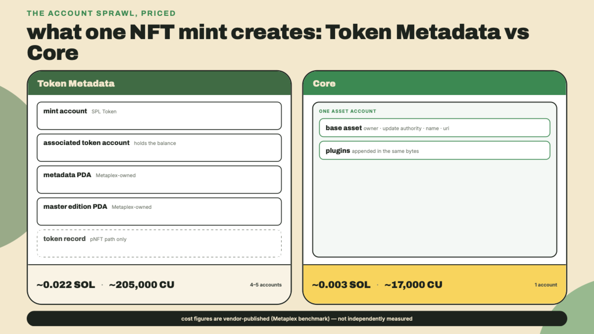
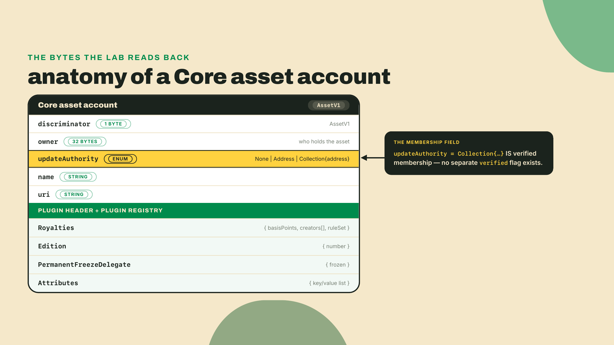
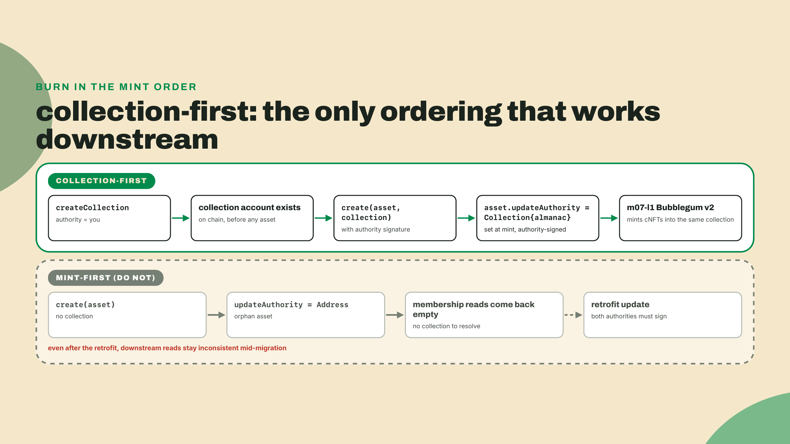
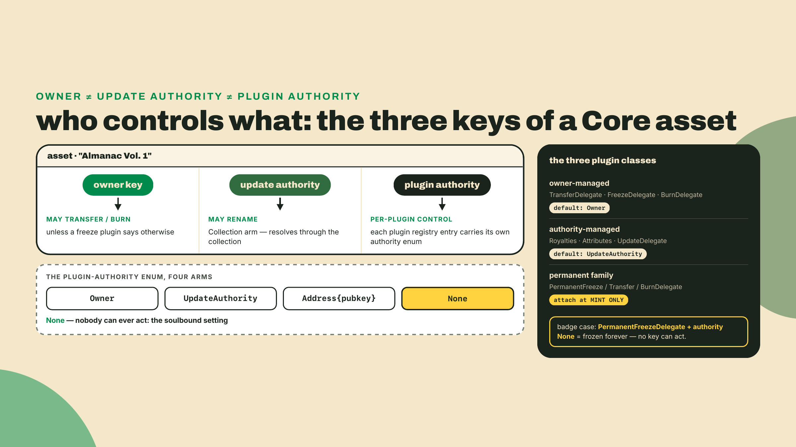
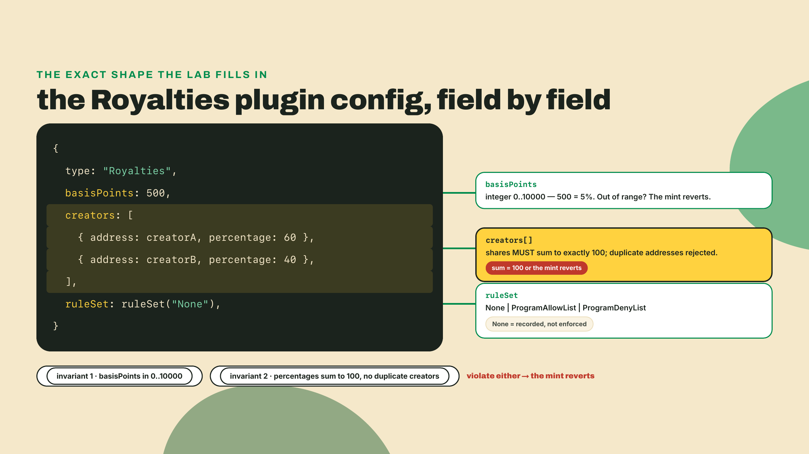
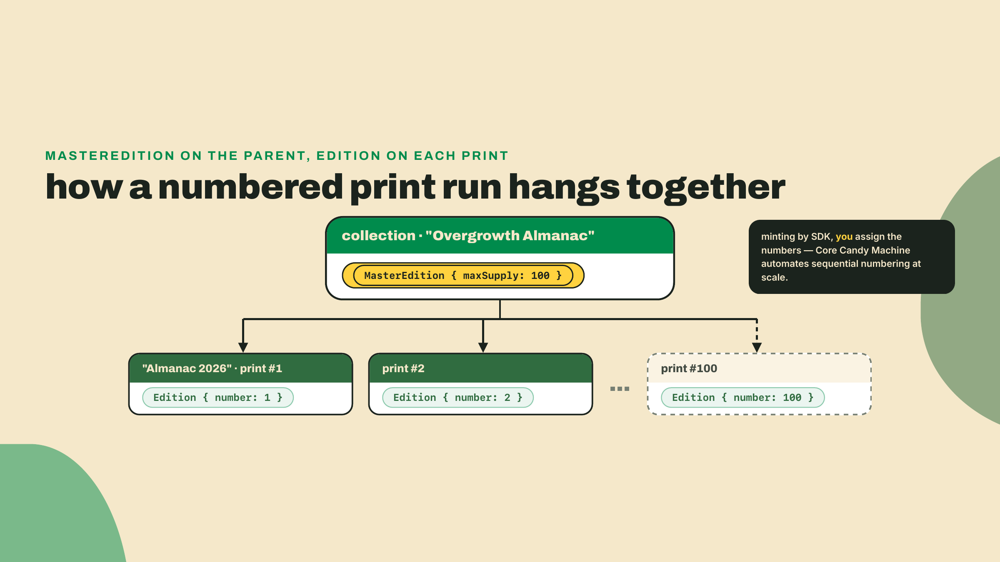
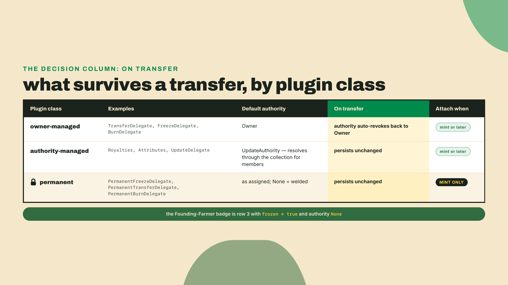
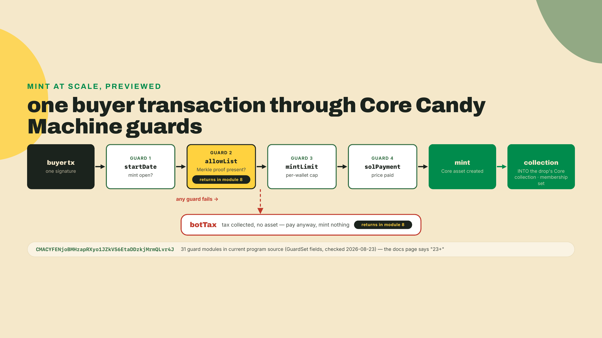
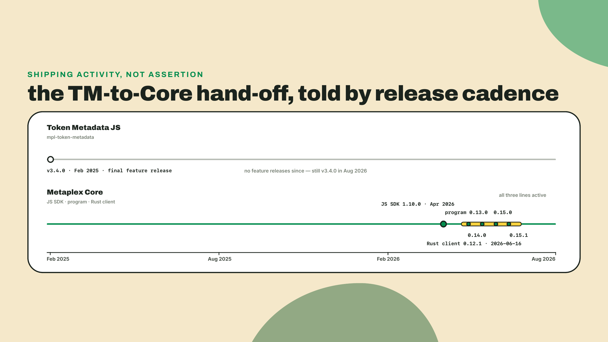
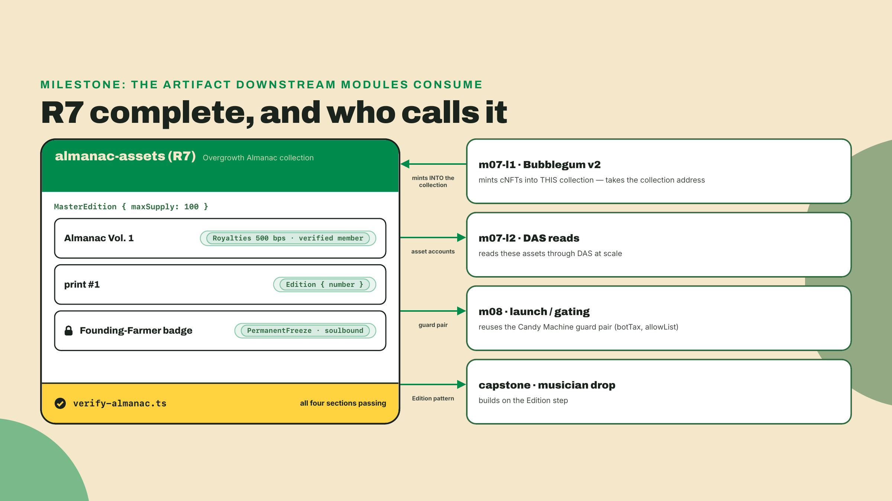

# Ship the NFT: Metaplex Core collections, plugins, and editions

## Summary

In m06-l1 you mapped the metadata layers: the off-chain JSON, the Metaplex on-chain Data struct, and the Token-2022-native TLV you wrote onto SPROUT back in m02-l4. You validated a real asset's JSON against the standard and you now know exactly where every field lives. What you have not done is mint an NFT. Today that changes, and we skip the legacy path entirely.

Here is the pitch in two numbers, both off Metaplex's own comparison table (metaplex.com/docs/smart-contracts/core, read 2026-09-07), so treat them as vendor-published, not something this course measured. Minting one NFT through Token Metadata costs about ~0.022 SOL and ~205,000 compute units, because the mint sprawls across a mint account, a token account, a metadata PDA, and a master edition PDA. Minting the same asset through Metaplex Core costs ~0.003 SOL and ~17,000 CU. One account. Roughly 86% cheaper, and run the division on those two SOL figures yourself rather than taking the percentage on faith. Quote their tilde too: they publish approximations, and a course that hardened ~0.003 into a precise-looking 0.0029 would be inventing precision the vendor never claimed. And Core is the standard Metaplex now recommends for new work, which is why this lesson never asks you to create a Token Metadata NFT at all.

Proof before theory. With the surfnet you have run since m02-l1 up (`surfpool start --no-tui --no-studio` in a spare terminal), install the SDK and run the scratch mint:

```bash
mkdir -p labs/m06-l2 && cd labs/m06-l2
npm install @metaplex-foundation/mpl-core@1.10.0 @metaplex-foundation/umi@1.5.1 @metaplex-foundation/umi-bundle-defaults@1.5.1
```

Pins checked against npm and crates.io on 2026-08-23: the JS SDK's latest is 1.10.0. Core then versions on two further numbers that are easy to confuse for each other. The on-chain program is tagged `release/core@0.15.1` (2026-06-18), while the Rust client crate published to crates.io is `mpl-core` 0.12.1 (2026-06-16). Three release lines, three numbers, and the only one you install here is the JS SDK at 1.10.0; the program tag and the Rust crate are context for reading changelogs, not dependencies of this lab. Re-check all three before you pin in anything long-lived.

```typescript
// labs/m06-l2/first-mint.ts
import { createUmi } from "@metaplex-foundation/umi-bundle-defaults";
import { mplCore, createCollection, create, fetchCollection } from "@metaplex-foundation/mpl-core";
import { generateSigner, keypairIdentity, sol } from "@metaplex-foundation/umi";

async function main() {
  const umi = createUmi(process.env.RPC_URL ?? "http://127.0.0.1:8899").use(mplCore());
  umi.use(keypairIdentity(umi.eddsa.generateKeypair()));
  await umi.rpc.airdrop(umi.identity.publicKey, sol(2));

  const collectionSigner = generateSigner(umi);
  await createCollection(umi, {
    collection: collectionSigner,
    name: "Scratch Collection",
    uri: "https://overgrowth.example/scratch.json",
  }).sendAndConfirm(umi);

  const collection = await fetchCollection(umi, collectionSigner.publicKey);
  const assetSigner = generateSigner(umi);
  await create(umi, {
    asset: assetSigner,
    collection,
    name: "Scratch Asset",
    uri: "https://overgrowth.example/scratch-asset.json",
  }).sendAndConfirm(umi);

  const raw = await umi.rpc.getAccount(assetSigner.publicKey);
  if (raw.exists) {
    console.log("asset account:", assetSigner.publicKey);
    console.log("bytes:", raw.data.length);
    console.log("rent:", Number(raw.lamports.basisPoints) / 1e9, "SOL");
    console.log("owner:", raw.owner);
  }
}

main().catch((err) => { console.error(err); process.exit(1); });
```

`npx tsx first-mint.ts` prints one address, a data length a bit over 100 bytes (yours shifts with the name and URI lengths, since both are stored inline), a rent deposit in the low thousandths of a SOL, and an owner starting with `CoRE`. That is the whole NFT. A collection, an asset minted into it, membership already set, one account holding everything. No ATA, no metadata PDA, no edition PDA.

This lesson builds R7, `almanac-assets`: Overgrowth's Almanac NFTs as a verified Core collection, assets with a Royalties plugin, one numbered edition print, and a Founding-Farmer badge that can never leave its wallet. The autonomy fade, out loud: the collection create and the first asset mint are worked in full; you fill the Royalties plugin config and the membership assertion yourself; and the soulbound badge, its transfer-fails proof, and the royalties-validator coding challenge are fully solo.

## One account per asset

### Why the account count is the whole story

Think back to your SPROUT work. Every capability you added to that mint lived in the same account, appended as TLV entries your own decoder could walk. Token Metadata is the opposite architecture: capability by accretion of accounts. The mint is an SPL mint, the name lives in a metadata PDA owned by a different program, edition-ness lives in another PDA, and programmable enforcement (the pNFT path) drags in yet more. Each account costs rent, each costs CU to create, and each is one more thing every downstream reader has to derive, fetch, and deserialize.

Core's design answer is the one you already know from Token-2022, applied to NFTs: one account, with typed capabilities appended inside it. The base asset stores the owner, the update authority, a name, and a URI. Everything else, royalties, freeze behavior, edition numbering, attributes, is a plugin serialized after the base data in that same account. First-principles version: an NFT's state is small and its capabilities are enumerable, so paying account-creation overhead per capability is pure waste; the only thing separate accounts buy you is independent ownership, and an asset's plugins all belong to the asset anyway.



Your own `first-mint.ts` run just showed you the rent component varies with string lengths, which is exactly why the opener tagged the headline figures as vendor-published: cite the vendor, show your own account. Still a great story.

### What lives inside a Core asset

The base asset is deliberately tiny. A one-byte discriminator (Core uses its own account type enum, not Anchor's 8-byte hash), the owner pubkey, an update authority enum, the name, the URI. The update authority enum is the load-bearing field for this lesson: it is not always an address. It has three arms, `None`, `Address`, and `Collection`, and when an asset is minted into a collection the arm is `Collection` with the collection account's address inside it.

Read that again, because it quietly deletes an entire Token Metadata ritual. In Token Metadata, collection membership is a field on the metadata PDA plus a separate `verified` boolean that a collection-authority-signed instruction flips; unverified membership is a real (and dangerous) intermediate state: an asset can CLAIM a collection before any collection authority has attested to it, the same claim-versus-attestation gap you met in m06-l1 on the creators `verified` flag, now at the collection level. In Core there is no boolean. Membership IS the update authority arm, and it can only be written when the collection's authority signs the mint. Verification did not get easier; it got collapsed into a signature that has to be there anyway.



### Collections come first

The ordering consequence falls straight out of that design: the collection must exist before any asset can be minted into it, because the mint instruction needs the collection account to reference and the collection authority's signature to authorize the membership write. Mint assets first and you have orphans with `Address` update authorities. There is an update path to move an asset into a collection later, but it is a retrofit that needs authority signatures on both sides, and everything downstream of you, indexers, marketplaces, module 7's compression work, is built around the collection-first flow.

This ordering is not a style preference in this course; it is load-bearing infrastructure. Bubblegum v2, module 7's opener, mints compressed NFTs INTO a Core collection. No Core collection, no cNFT drop. The Almanac collection you create in today's lab is the literal value that lesson's mint calls take, rebuilt on whatever cluster it runs against. Get the habit now, while the failure mode is cheap.



### The plugin catalog

Plugins are where Core stops being a cheaper mint and becomes a different programming model. Each plugin is a typed struct with its own authority, attached at create time or later, on either an asset or a collection (a collection-level plugin applies to every member unless the member overrides it). The catalog you will actually reach for:

| Plugin | What it does | The Almanac use |
|---|---|---|
| Royalties | `basisPoints` + `creators` shares + a `ruleSet` | 5% on every Almanac sale |
| TransferDelegate | a delegate may transfer the asset | escrow and marketplace flows |
| FreezeDelegate | a delegate may freeze/thaw (reversible) | staking-style soft locks |
| BurnDelegate | a delegate may burn | game-item consumption |
| UpdateDelegate | a delegate may update metadata | managed collections |
| PermanentFreezeDelegate | freeze that can be made irrevocable | the soulbound Founding-Farmer badge |
| Attributes | on-chain key/value pairs | traits a program can read without a URI fetch |
| Edition / MasterEdition | numbered prints + supply cap | the Almanac print run |

### Every plugin carries its own key

Before you type any of these, one structural fact that saves you an afternoon of confused reverts: a plugin's authority is not the asset's authority. Each plugin entry in the registry carries its own authority field, and that field is an enum with four arms: `Owner`, `UpdateAuthority`, `Address` (any pubkey you name), and `None`. Whoever sits in that arm controls the plugin, independent of who owns the asset and who can update its metadata. Three keys, three jobs. The owner moves the asset, the update authority renames it, the plugin authority works the plugin.

The catalog splits along that line. Owner-managed plugins, the Transfer, Freeze, and Burn delegates, exist to let the OWNER lend a capability out: you delegate transfer rights to an escrow, freeze rights to a staking program, and the delegation defaults to your own key until you assign it away. Authority-managed plugins, Royalties, Attributes, UpdateDelegate, belong to the creator side and default to the update authority, which for a collection member resolves through the collection. And the permanent family plays by a harder rule: `PermanentFreezeDelegate`, `PermanentTransferDelegate`, and `PermanentBurnDelegate` can only be attached at mint time. You cannot sneak a permanent freeze onto an asset someone already owns, which is exactly the property that makes owning a Core asset safe, and exactly why the Founding-Farmer badge must be born soulbound rather than converted later.



Hold onto the `None` arm. Most of the time you assign a plugin authority so someone can act. Setting it to `None` is the inverse move, and it is load-bearing: it welds the plugin's current state in place, permanently, because no key exists that could ever change it. A `PermanentFreezeDelegate` with `frozen: true` and authority `None` is not "frozen until someone important says otherwise". It is frozen the way a number is even.

Three catalog entries deserve a closer look before you type them.

**Royalties** carries three fields and the program enforces their shape at mint. `basisPoints` is an integer 0..10000 (500 means 5%). `creators` is a list of address-plus-percentage entries whose percentages must sum to exactly 100, and a duplicated creator address is rejected. `ruleSet` decides who may move the asset: `None` puts no program restrictions on transfers, `ProgramAllowList` permits only listed programs to be involved, `ProgramDenyList` blocks listed programs. Note what `None` means for the word "royalty": the split is recorded on-chain, readable by everyone, enforced by nobody in particular. Whether anyone actually pays it is a marketplace decision, and that uncomfortable sentence is the entire subject of m06-l3. I have fat-fingered a creator split before, 60/50 across two wallets because I edited one side and not the other, and the mint reverts on the spot. Good. Better a revert at mint than a marketplace splitting 110%.



**PermanentFreezeDelegate** is the reversible FreezeDelegate's one-way sibling. Attach it with `frozen: true` and an authority of `None` and you have an asset no key on earth can thaw or move. That is not a bug to route around; it is the soulbound mechanism. A membership badge, a credential, a proof-of-attendance: things that should be meaningless to sell are exactly the things you freeze permanently. The flip side is the footgun the name is warning you about. Permanent means permanent. There is no later governance vote, no support ticket, no authority that can un-freeze the Founding-Farmer badge once you mint it this way. If a farmer loses their wallet, they need a new badge, not a transfer. Reach for the reversible FreezeDelegate any time you can imagine a legitimate future move.

**Edition and MasterEdition** split one job across the two account types. The collection carries `MasterEdition` with a `maxSupply` and optional name/URI overrides; each printed asset carries `Edition` with its `number`. Reads compose exactly the way you would hope: fetch the collection for the cap, fetch any print for its number.



### Delegates, and what a transfer erases

The three owner-managed delegates are what you reach for when an asset has to participate in something while staying its owner's. Attach `TransferDelegate` with an escrow program's address and that program can move an Almanac out of a wallet when a sale settles, without ever custodying it first. Attach `FreezeDelegate` with `frozen: true` and a staking program as the authority and the asset locks in place: still in the owner's wallet, still visible in every UI, simply unmovable until the program thaws it. That is how Core staking works, and it is why Core staking needs no vault account. The asset never goes anywhere; it just stops being able to. `BurnDelegate` is the crafting case. A farmer feeds two Almanac volumes into the Overgrowth composter and the program burns both under a delegation granted earlier, with no signature prompt at burn time.

The API is `addPlugin` to attach one, and `approvePluginAuthority` to hand the key to a program address afterwards. The snippet below is illustrative, not runnable as pasted: the two addresses are PLACEHOLDERS you must replace (the first is literally the System Program's address, which is what an all-ones base58 string decodes to; the second is an arbitrary valid address standing in for your escrow program), and the approve only works on a plugin that exists, so an `addPlugin(umi, { asset, plugin: { type: "TransferDelegate" } })` call precedes it in any real flow:

```typescript
// labs/m06-l2/delegate-transfer.ts (illustrative: replace BOTH placeholder
// addresses, and addPlugin the TransferDelegate first or this approve fails)
import { publicKey } from "@metaplex-foundation/umi";
import { approvePluginAuthority } from "@metaplex-foundation/mpl-core";
import { getUmi } from "./umi";

async function main() {
  const umi = await getUmi();
  await approvePluginAuthority(umi, {
    asset: publicKey("11111111111111111111111111111111"),      // PLACEHOLDER: your Almanac asset
    plugin: { type: "TransferDelegate" },
    newAuthority: {
      type: "Address",
      address: publicKey("8qbHbw2BbbTHBW1sbeqakYXVKRQM8Ne7pLK7m6CVfeR"),  // PLACEHOLDER: the escrow program
    },
  }).sendAndConfirm(umi);
}

main().catch((err) => { console.error(err); process.exit(1); });
```

Now the rule that quietly decides your architecture. When an asset is transferred, the owner-managed plugins have their authority automatically revoked back to `Owner`. Authority-managed plugins and the permanent family survive the transfer untouched.

That single sentence has three consequences worth holding separately. A buyer never inherits the seller's escrow rights or the seller's staking-program freeze rights, which is the property that makes buying a plugin-laden Core asset safe at all: whatever the previous owner delegated evaporates the moment the asset changes hands. Your Royalties plugin, being authority-managed, rides along forever, which is precisely what a royalty has to do to mean anything across a resale. And the permanent family rides along too, which is the deeper reason it can only be attached at mint. An asset's irreversible properties have to be knowable to a buyer before they buy, and mint-time-only attachment is what guarantees that: nobody can weld your asset shut after you own it.

The first-principles version, if you want the rule to be memorable instead of memorized: a delegation is a statement about the current owner's intent, so it must not outlive that owner. A royalty is a statement about the creator's terms, so it must. Core encodes the difference in the plugin's class rather than asking every integrator to remember which is which.



### Attributes: traits an on-chain program can actually read

In m06-l1 you learned the off-chain JSON's `attributes` array, the traits marketplaces render in a sidebar. A Solana program cannot read that array. It lives behind an HTTP URI, invisible to the runtime, so any on-chain logic that wants to know an Almanac's season has to be told by a trusted signer. That is an oracle, and now you are running one.

The `Attributes` plugin is the on-chain answer. It stores an `attributeList` of key/value string pairs inside the asset account itself, where a program deserializes it from an account it already has loaded:

```typescript
// labs/m06-l2/tag-season.ts
import { publicKey } from "@metaplex-foundation/umi";
import { addPlugin, fetchAsset } from "@metaplex-foundation/mpl-core";
import { getUmi } from "./umi";

async function main() {
  const umi = await getUmi();
  const asset = publicKey("11111111111111111111111111111111");  // PLACEHOLDER: your Almanac asset address

  await addPlugin(umi, {
    asset,
    plugin: {
      type: "Attributes",
      attributeList: [
        { key: "season", value: "spring-2026" },
        { key: "yield", value: "3" },
      ],
    },
  }).sendAndConfirm(umi);

  const fetched = await fetchAsset(umi, asset);
  console.log(fetched.attributes?.attributeList);
}

main().catch((err) => { console.error(err); process.exit(1); });
```

It is authority-managed, so for a collection member the collection authority signs updates, not the holder. That is the correct default for game state: a farmer should not be able to rewrite their own Almanac's yield between harvests. Two constraints to design around. Keys and values are both strings, so numbers get stringified going in and parsed coming out, and nothing validates the parse but you. And every attribute is bytes in an account you pay rent on, so this is a place for the handful of traits your programs branch on, not a database. The full marketplace-facing trait list stays in the JSON where marketplaces already look for it.

### Asset or collection: where a plugin should live

Every plugin type attaches to either account kind, and the resolution rule is the part with money in it: a plugin on the collection applies to every member, and a plugin on the member takes precedence over the collection's version of that same plugin. The SDK ships `deriveAssetPlugins(asset, collection)` so you compute the effective set in one call instead of checking both accounts and reimplementing the precedence yourself.

The economics fall straight out. A 10,000-piece drop that attaches Royalties to every asset pays for that plugin's bytes ten thousand times over. Attach it to the collection once and every member inherits it, and the one piece with a different creator split carries its own Royalties plugin as a local override. The same logic applies to Attributes whenever the trait is collection-wide rather than per-piece.

Today's lab attaches Royalties per-asset anyway, and the reason is pedagogical rather than architectural: you should type that config by hand once, watch the program reject a bad split, and then build the validator that catches it before a transaction ever leaves your machine. When the capstone's drop reaches real scale, move it up to the collection and let inheritance do the work.

### Mint-at-scale: Core Candy Machine

Everything in today's lab mints by hand because you are minting four assets. A 10,000-piece drop wants a vending machine: pre-load the configs, let buyers mint themselves, defend the mint with rules. That machine is Core Candy Machine, program `CMACYFENjoBMHzapRXyo1JZkVS6EtaDDzkjMrmQLvr4J`, and its rules are guard modules: `solPayment`, `startDate`, `mintLimit`, `allowList` (Merkle-proof gated), `botTax` (failed guard checks pay a tax instead of reverting free), and more. How many are there in total? The docs page advertises "23+ composable guards" and never enumerates them. The source does: counting the `mod` declarations in the candy-guard program, cross-checked against the fields on its `GuardSet` struct, gives exactly 31 (checked 2026-08-23). Notice that the docs are not wrong here, a floor rarely is, only vague, and you cannot design against a floor. Cite the source count, and recount it yourself the day the number has to carry weight.

Guards compose into named groups, which is how one machine runs a whole drop schedule. A group is a labeled guard set (labels cap at six characters), buyers pass the label when they mint, and any default guards you set outside the groups are inherited unless a group overrides them. So a `wl` group carries the `allowList` Merkle root and the discounted `solPayment`, a `public` group carries the full price and no gate, and `botTax` sits in the defaults where it protects both. Once groups exist, minting with the defaults alone is not allowed: a label is always required. That is the shape module 8 fills in with real numbers.

Two things to carry forward and one to never do. Carry forward: the anti-snipe pair you just met, `botTax` and `allowList`, is the backbone of a fair mint, and the same defend-the-launch problem returns in module 8 around bonding curves. And Core Candy Machine mints Core assets ONLY. The never: the legacy Candy Machine V3 line mints Token Metadata NFTs and is deprecated alongside the standard it serves; if a tutorial hands you V3, you are reading history.



### The trade-off, named

Core's single-account model is the reason the mint is roughly 87% cheaper and the reason royalties, soulbound behavior, and editions are typed plugins instead of PDA sprawl. What you give up: maturity surface. Token Metadata has half a decade of integrations, a head start running since the 2021 standard you saw on m06-l1's timeline; every wallet, marketplace, and dusty backend script understands it, while Core support is broad in 2026 but younger, and you will still meet tools that read TM and shrug at Core. Second, a Royalties plugin's teeth are exactly its `ruleSet`: ship `None` and your on-chain royalty is advisory, a reality m06-l3 dissects without anesthesia. Third, you commit to the ordering: assets are minted INTO a verified collection, and retrofitting is a both-authorities chore you should treat as a failure of planning, not a workflow.

You can read the hand-off in the release trains alone, no announcement needed. The `mpl-token-metadata` JS package stopped at v3.4.0 in February 2025 and has not shipped a feature since. Meanwhile the Core program cut 0.13.0 through 0.15.1 across May and June 2026, its Rust client crate reached 0.12.1 on 2026-06-16, and the Core JS SDK reached 1.10.0 in April 2026. One line went quiet; the other three kept a steady cadence. That is what a standard migration looks like from the changelog side.



## Lab: mint the Almanac

The build order mirrors the theory: collection, then member, then print, then proof. Everything runs against the surfnet, and every script shares one wallet so the accounts persist between runs.

1. **The shared setup.** One helper owns wallet persistence and funding, so re-runs do not orphan your accounts:

    ```typescript
    // labs/m06-l2/umi.ts
    import { createUmi } from "@metaplex-foundation/umi-bundle-defaults";
    import { mplCore } from "@metaplex-foundation/mpl-core";
    import { keypairIdentity, sol } from "@metaplex-foundation/umi";
    import fs from "node:fs";

    export async function getUmi() {
      const umi = createUmi(process.env.RPC_URL ?? "http://127.0.0.1:8899").use(mplCore());

      let secret: Uint8Array;
      if (fs.existsSync("wallet.json")) {
        secret = Uint8Array.from(JSON.parse(fs.readFileSync("wallet.json", "utf8")));
      } else {
        const fresh = umi.eddsa.generateKeypair();
        fs.writeFileSync("wallet.json", JSON.stringify(Array.from(fresh.secretKey)));
        secret = fresh.secretKey;
      }
      const keypair = umi.eddsa.createKeypairFromSecretKey(secret);
      umi.use(keypairIdentity(keypair));

      const balance = await umi.rpc.getBalance(keypair.publicKey);
      if (balance.basisPoints < sol(1).basisPoints) {
        await umi.rpc.airdrop(keypair.publicKey, sol(2));
      }
      return umi;
    }
    ```

    Run everything from `labs/m06-l2/` so `wallet.json` and the address book the scripts share (`almanac.json`) land in one place.

2. **Create the Almanac collection (worked in full).** The collection carries the MasterEdition plugin from birth so step 5's print run has a cap to read; one honesty flag now, cashed in step 5, is that the cap is recorded data the ecosystem reads, not something the program enforces at mint, so carrying it from birth is the collection-first shape rather than a mechanical dependency.

    ```typescript
    // labs/m06-l2/create-collection.ts
    import { generateSigner } from "@metaplex-foundation/umi";
    import { createCollection, fetchCollection } from "@metaplex-foundation/mpl-core";
    import fs from "node:fs";
    import { getUmi } from "./umi";

    async function main() {
      const umi = await getUmi();
      const collectionSigner = generateSigner(umi);

      await createCollection(umi, {
        collection: collectionSigner,
        name: "Overgrowth Almanac",
        uri: "https://overgrowth.example/almanac/collection.json",
        plugins: [
          {
            type: "MasterEdition",
            maxSupply: 100,
            name: undefined,  // optional edition-line name; unset here, and step 5
            uri: undefined,   // passes each print its own name and uri anyway
          },
        ],
      }).sendAndConfirm(umi);

      const collection = await fetchCollection(umi, collectionSigner.publicKey);
      console.log("collection:", collection.publicKey);
      console.log("update authority:", collection.updateAuthority);
      console.log("master edition maxSupply:", collection.masterEdition?.maxSupply);

      fs.writeFileSync(
        "almanac.json",
        JSON.stringify({ collection: collectionSigner.publicKey }, null, 2),
      );
    }

    main().catch((err) => { console.error(err); process.exit(1); });
    ```

    `npx tsx create-collection.ts` prints the collection address, your wallet as its update authority, and `maxSupply: 100`. That authority line matters: it is the signature that will authorize every membership write from here on.

3. **Mint Almanac Vol. 1 (you fill two gaps).** The mint call is handed to you with the Royalties plugin and the membership assertion left open. Fill both before you peek at step 4. The Royalties shape is in the catalog section: 500 basis points, your identity as the single creator at 100, `ruleSet` of `None`. The membership assertion should prove, from the fetched asset alone, that this asset is a verified member of the collection you just created.

    ```typescript
    // labs/m06-l2/mint-almanac.ts
    import { generateSigner, publicKey } from "@metaplex-foundation/umi";
    import { create, fetchAsset, fetchCollection, ruleSet } from "@metaplex-foundation/mpl-core";
    import assert from "node:assert/strict";
    import fs from "node:fs";
    import { getUmi } from "./umi";

    async function main() {
      const umi = await getUmi();
      const saved = JSON.parse(fs.readFileSync("almanac.json", "utf8"));
      const collection = await fetchCollection(umi, publicKey(saved.collection));

      const assetSigner = generateSigner(umi);
      await create(umi, {
        asset: assetSigner,
        collection,
        name: "Almanac: Vol. 1",
        uri: "https://overgrowth.example/almanac/vol-1.json",
        plugins: [
          // TODO(you): the Royalties plugin.
          // 500 basis points, one creator (umi.identity.publicKey) at percentage 100,
          // ruleSet("None"). The exact shape is in the plugin catalog.
        ],
      }).sendAndConfirm(umi);

      const asset = await fetchAsset(umi, assetSigner.publicKey);
      console.log("asset:", asset.publicKey);
      console.log("owner:", asset.owner);

      // TODO(you): the membership assertion.
      // Prove asset.updateAuthority is the Collection arm, and that its address
      // is exactly saved.collection. Two asserts, no RPC calls beyond the fetch.

      fs.writeFileSync(
        "almanac.json",
        JSON.stringify({ ...saved, asset: assetSigner.publicKey }, null, 2),
      );
    }

    main().catch((err) => { console.error(err); process.exit(1); });
    ```

    While you are in there, try sabotaging your own royalties config once: set the creator percentage to 99 and run it. The program rejects the mint. That revert is the exact behavior your coding challenge validator reproduces off-chain.

4. **The reveal.** The Royalties fill:

    ```typescript
    plugins: [
      {
        type: "Royalties",
        basisPoints: 500,
        creators: [{ address: umi.identity.publicKey, percentage: 100 }],
        ruleSet: ruleSet("None"),
      },
    ],
    ```

    And the membership assertion:

    ```typescript
    assert.equal(asset.updateAuthority.type, "Collection");
    assert.equal(asset.updateAuthority.address, publicKey(saved.collection));
    ```

    Two lines, zero extra fetches. Umi public keys are plain strings at runtime, so strict equality on the address just works. If your version asserted against a fetched collection instead, it is not wrong, only more expensive; the point of Core's design is that membership proof lives in the asset's own bytes. `npx tsx mint-almanac.ts` should now print the asset address and exit clean through both asserts.

5. **Print the numbered edition (worked).** Same `create` call, different plugin. The Edition plugin carries the print number; the collection's MasterEdition carries the cap you set in step 2:

    ```typescript
    // labs/m06-l2/mint-print.ts
    import { generateSigner, publicKey } from "@metaplex-foundation/umi";
    import { create, fetchAsset, fetchCollection } from "@metaplex-foundation/mpl-core";
    import fs from "node:fs";
    import { getUmi } from "./umi";

    async function main() {
      const umi = await getUmi();
      const saved = JSON.parse(fs.readFileSync("almanac.json", "utf8"));
      const collection = await fetchCollection(umi, publicKey(saved.collection));

      const printSigner = generateSigner(umi);
      await create(umi, {
        asset: printSigner,
        collection,
        name: "Almanac 2026, print #1",
        uri: "https://overgrowth.example/almanac/print-1.json",
        plugins: [{ type: "Edition", number: 1 }],
      }).sendAndConfirm(umi);

      const print = await fetchAsset(umi, printSigner.publicKey);
      console.log("print:", print.publicKey);
      console.log("edition number:", print.edition?.number);

      fs.writeFileSync(
        "almanac.json",
        JSON.stringify({ ...saved, print: printSigner.publicKey }, null, 2),
      );
    }

    main().catch((err) => { console.error(err); process.exit(1); });
    ```

    One honest caveat before you scale this, and it covers the cap as well as the numbers: when you mint by SDK, the bookkeeping is yours to manage. Nothing stops a sloppy script from minting two print #1s, and nothing on-chain stops print #101 either; the MasterEdition's `maxSupply` is recorded data the ecosystem reads, not a cap the Core program enforces at mint. Sequential integrity AND the supply cap are client-side promises here. At drop scale, Core Candy Machine assigns numbers and enforces the cap for you, which is one more reason it exists. The capstone's musician drop brief builds directly on this step, so make sure `edition number: 1` prints before moving on.

6. **The CLI mirror (optional, shown once).** Everything you scripted has a command-line twin in the Metaplex CLI, useful for quick pokes at accounts without opening an editor:

    ```bash
    npm install -g @metaplex-foundation/cli
    mplx core asset fetch <your asset address> --rpc http://127.0.0.1:8899
    ```

    `mplx core asset create` and `mplx core collection create` exist too, along with `mplx core plugins add`. The binary is `mplx`, the CLI is on its own 0.x line (0.4.3 at the time of writing, so re-check the command tree with `mplx core --help` before you script against it), and the topic order is noun then verb: `core asset fetch`, not `core fetch asset`. The course scripts everything in TS because scripts compose into verification gates and CLI sessions do not, but knowing the mirror exists saves you time on one-off reads.

7. **Run the gate.** The verification script below is R7's contract: the proof that four assets exist carrying exactly the properties the rest of this course assumes you can build. It is given in full because the properties are the deliverable, not the script. Be clear about what actually travels, though. Later lessons rebuild the Almanac collection on whatever cluster they run against rather than reading your `almanac.json`, because a surfnet account means nothing on devnet. What carries forward is the recipe and the collection-first habit, not the file.

    ```typescript
    // labs/m06-l2/verify-almanac.ts
    import { publicKey } from "@metaplex-foundation/umi";
    import { fetchAsset, fetchCollection } from "@metaplex-foundation/mpl-core";
    import assert from "node:assert/strict";
    import fs from "node:fs";
    import { getUmi } from "./umi";

    async function main() {
      const umi = await getUmi();
      const saved = JSON.parse(fs.readFileSync("almanac.json", "utf8"));
      for (const key of ["collection", "asset", "print", "badge"]) {
        assert.ok(saved[key], `almanac.json is missing "${key}" - run the mint scripts first`);
      }

      // 1. The collection exists and carries its MasterEdition cap.
      const collection = await fetchCollection(umi, publicKey(saved.collection));
      assert.ok(collection.masterEdition, "collection has no MasterEdition plugin");
      console.log(`OK: collection ${collection.name} (${collection.publicKey})`);
      console.log(`OK: master edition maxSupply=${collection.masterEdition.maxSupply}`);

      // 2. The Almanac asset is a verified member and its Royalties plugin reads back.
      const asset = await fetchAsset(umi, publicKey(saved.asset));
      assert.equal(asset.updateAuthority.type, "Collection", "asset is not collection-owned");
      assert.equal(asset.updateAuthority.address, publicKey(saved.collection));
      assert.ok(asset.royalties, "asset has no Royalties plugin");
      const shares = asset.royalties.creators.reduce((sum, c) => sum + c.percentage, 0);
      assert.equal(shares, 100, "creator shares must sum to 100");
      console.log(`OK: ${asset.name} is a verified member of the Almanac collection`);
      console.log(`OK: royalties ${asset.royalties.basisPoints} bps, shares sum to ${shares}`);

      // 3. The print reads back its edition number.
      const print = await fetchAsset(umi, publicKey(saved.print));
      assert.equal(print.updateAuthority.type, "Collection");
      assert.ok(print.edition, "print has no Edition plugin");
      console.log(`OK: ${print.name} reads back edition number ${print.edition.number}`);

      // 4. The badge is permanently frozen: soulbound.
      const badge = await fetchAsset(umi, publicKey(saved.badge));
      assert.ok(badge.permanentFreezeDelegate, "badge has no PermanentFreezeDelegate plugin");
      assert.equal(badge.permanentFreezeDelegate.frozen, true, "badge is not frozen");
      console.log(`OK: ${badge.name} is non-transferable (PermanentFreeze)`);
    }

    main().catch((err) => { console.error(err); process.exit(1); });
    ```

    Run `npx tsx verify-almanac.ts` now and it stops at the first assert: `almanac.json is missing "badge"`. That is correct behavior. The gate is telling you what remains, and what remains is the challenge. Notice what the script never does: it never touches DAS, never asks an indexer anything. Every proof is a direct account read of bytes you minted. Reading these same assets through the DAS interface, at collection scale, through a provider, is m07-l2's job, and it will feel luxurious after this.

## Challenge

Solo, no scaffolding. Mint the Founding-Farmer badge: a Core asset in the Almanac collection carrying `PermanentFreezeDelegate` with `frozen: true` and an authority of `None`, so nothing can ever thaw it. Write its address into `almanac.json` under the key `badge`. Then prove the freeze with your own assertions, in a script of your own: a `transfer` attempt on the badge must fail (catch the rejection and assert you caught it), and a `transfer` of your Almanac Vol. 1 asset to a throwaway wallet must succeed, in the same run, so the proof shows the freeze is the badge's property and not some global misconfiguration. Think before you mint: this is the one irreversible act in the lesson. A typo in the badge's name is, perhaps surprisingly, recoverable: the update path is not what PermanentFreeze blocks, so the update authority can still rename it. A badge minted to the wrong wallet is simply gone: frozen where it landed, untransferable, unthawable, forever.

Then take the royalties-plugin-config coding challenge: implement `validateRoyalties(basisPoints, ruleSet, creatorSpec)`, the pure pre-flight validator for the exact config you hand-wrote in step 3. The grader passes the config as three positional arguments, the basisPoints number, the ruleSet name, and the creator split flattened into one string of semicolon-separated `address=percentage` entries (so a 70/30 split arrives as `'Farm1...=70;Farm2...=30'`); the starter already parses that string back into Creator objects for you. The starter checks only the shares sum; you add the rest, which is the basisPoints range, the ruleSet variant, each creator's own percentage range, and duplicate creator addresses. You watched the on-chain revert in step 3; now build the guard that catches it before a transaction ever leaves your machine.

Accepted when: `npx tsx verify-almanac.ts` passes end to end, all four sections green; your transfer proof shows the badge failing and Vol. 1 moving in the same run; and the challenge's tests pass all cases, including the ones you might not have thought of (a basisPoints of 20000 sitting on top of a perfectly valid split, a duplicate creator address whose shares still sum to 100, a ruleSet spelled `ProgramList`).

## Checkpoint

The gate: `npx tsx verify-almanac.ts` prints its six OK lines. Collection with its MasterEdition cap, Vol. 1 a verified member with royalties reading back at 500 bps, print #1 carrying its edition number, badge permanently frozen. With that green, R7 is complete, and the one-sentence answer you should be able to give without looking: the collection must be created before any asset is minted, because membership is written into the asset at mint under the collection authority's signature, and bolting it on afterwards is a both-authorities retrofit you should treat as a planning failure, not a workflow.

The misses I expect. First, ordering: if your membership assertion fails with `updateAuthority.type === "Address"`, you minted without passing the collection, and no amount of re-fetching fixes it; mint again, collection-first. Second, the royalties revert: a split that does not sum to 100 or a basisPoints outside 0..10000 fails at mint time with a Core error, which is your validator's spec written as a stack trace. Third, if the badge transfer SUCCEEDS in your challenge proof, check which asset you froze; more than one student has permanently frozen their Vol. 1 and left the badge liquid, and on a throwaway surfnet that is a free lesson about exactly why PermanentFreeze deserves respect on mainnet.



You minted a collection, three kinds of member, and proved every property with direct reads. Total cost on your surfnet: pocket change, and the same flow on mainnet stays in the thousandths of a SOL per asset by the vendor's own numbers. But look back at what you actually shipped in that Royalties plugin. You attached it, you set 500 basis points, you verified it reads back. Does anyone actually enforce it? You shipped `ruleSet("None")`, and I let you. Next lesson is the royalty reality nobody advertises: what enforcement actually exists, what pNFTs and Token Auth Rules really do, and why the standard half the ecosystem still integrates against is officially legacy. Bring a strong stomach for the word "advisory".
