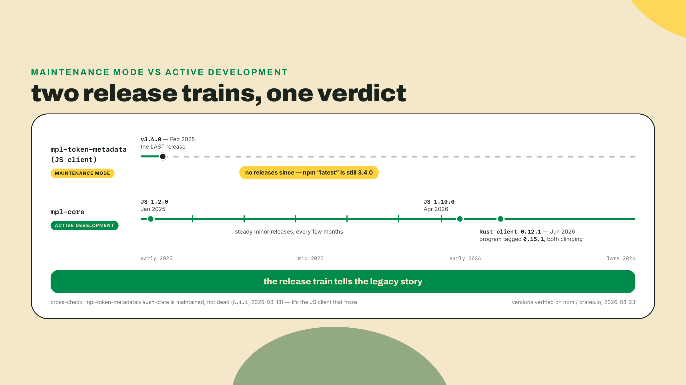
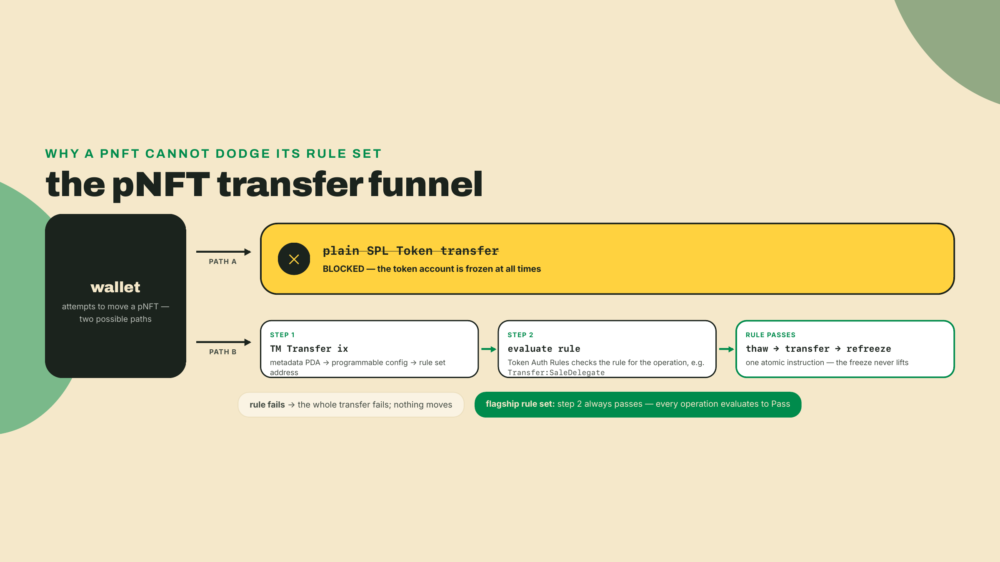
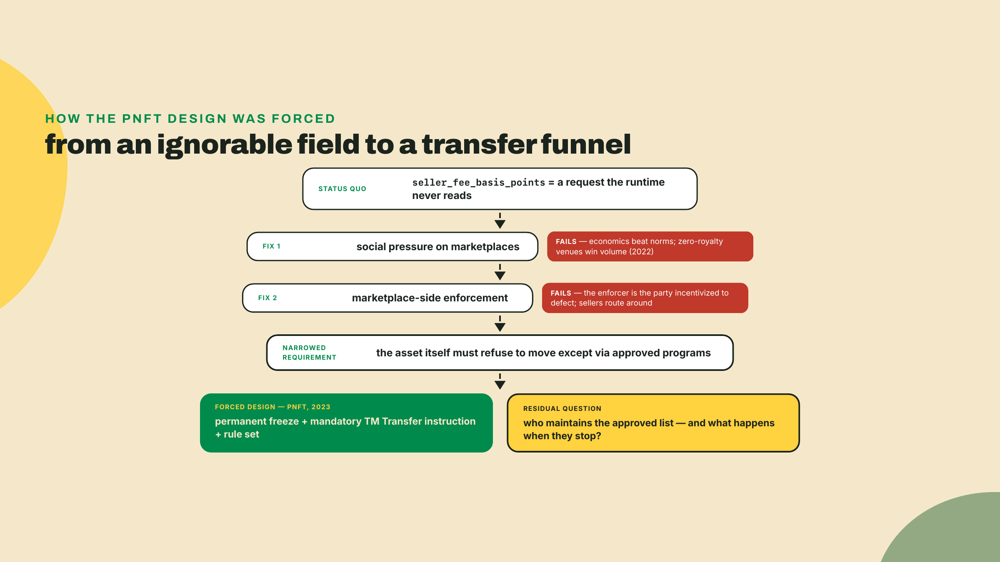
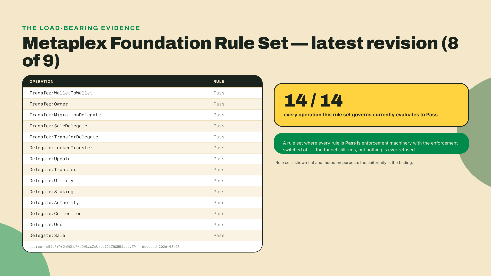
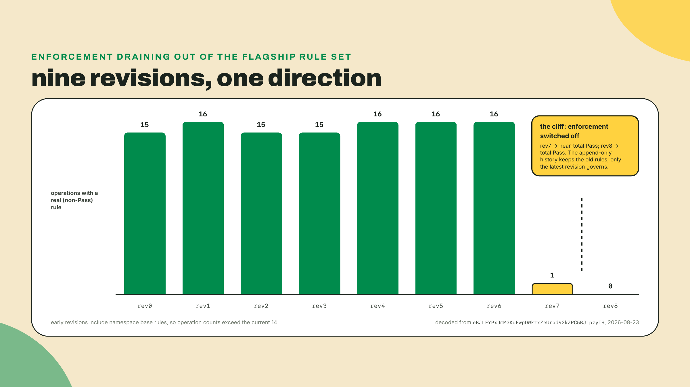
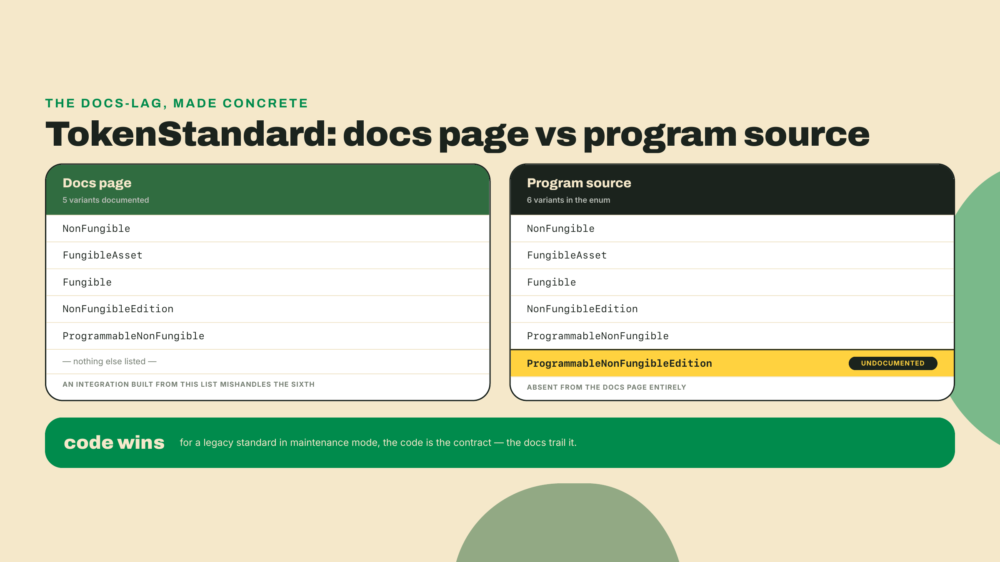
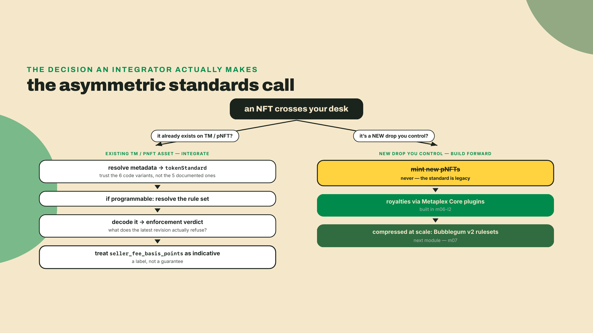
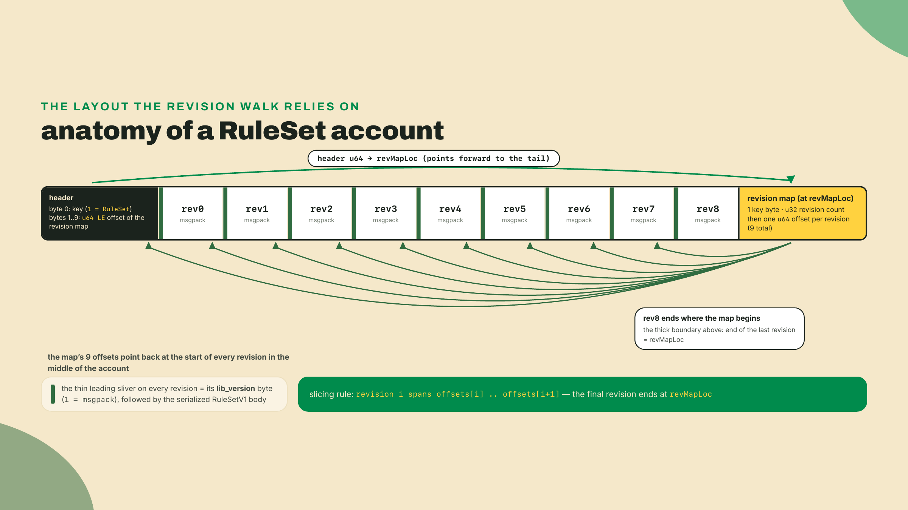

# Token Metadata as legacy: pNFTs and the royalty reality

## Summary

In m06-l2 you shipped R7: the verified Almanac Core collection, assets carrying the Royalties, Edition, and PermanentFreeze plugins, and a soulbound Founding-Farmer badge, all on Metaplex Core, with royalties you configured yourself. This lesson is the uncomfortable counterpart. You will not ship anything new on Token Metadata, and by the end you will be able to say precisely why nobody should: you will read the standard most existing NFTs still live on, decode the flagship rule set that was supposed to enforce their royalties, and discover with your own tooling that it currently blocks zero programs. The skills here are evaluation skills: read a live pNFT's rule set, render an enforced-or-not verdict with evidence, and label `seller_fee_basis_points` for what it is, a number the runtime never touches. The fade: the flagship decode is worked end to end in the lab, expected output included; the revision-history dig and the per-asset verdict memo in the challenge are yours solo, and they are the actual job.

Here is the setup. A marketplace lists a legacy NFT, `seller_fee_basis_points = 500`, and the listing copy promises a guaranteed 5% creator royalty. Five hundred basis points, on-chain, in the metadata account. Sounds enforceable, right? You spent last lesson configuring Core's Royalties plugin, machinery the asset's own program checks, though you shipped it with `ruleSet("None")` and heard exactly what that leaves unenforced, so the claim feels plausible by association. It is not. And rather than take my word for it, go touch the evidence, the account the entire legacy royalty story hangs on, the Metaplex Foundation Rule Set. Thirty seconds, nothing to install, just `curl` and the `python3` already on your system:

```bash
curl -s https://api.mainnet-beta.solana.com -X POST -H "Content-Type: application/json" -d '
  {"jsonrpc":"2.0","id":1,"method":"getAccountInfo",
   "params":["eBJLFYPxJmMGKuFwpDWkzxZeUrad92kZRC5BJLpzyT9",{"encoding":"base64"}]}' \
  | python3 -c "import sys,json,base64; v=json.load(sys.stdin)['result']['value']; print('owner:', v['owner'], '| bytes:', len(base64.b64decode(v['data'][0])))"
```

You should see `owner: auth9SigNpDKz4sJJ1DfCTuZrZNSAgh9sFD3rboVmgg | bytes: 19001`. That owner is the Token Auth Rules program, and those 19,001 bytes hold nine revisions of the rule set that governs transfers for a huge share of programmable NFTs on mainnet. I pulled this account apart this morning (2026-08-23), and the latest revision sets every single operation, all fourteen of them, to `Pass`. Armed, but idle. By the end of the lab you will have decoded that yourself, byte offsets and all.

## The royalty machine that blocks nothing

### Legacy, stated plainly

First, the status call, because this lesson is where the course makes it and the rest of the course points here. Token Metadata is officially legacy; Metaplex Core is the recommended standard for new NFT work (Bubblegum v2 for compressed). pNFTs enforce through Token Auth Rules, deprecated by Metaplex yet still the live enforcement path, and the flagship rule set blocks zero programs, armed but idle; `seller_fee_basis_points` is purely indicative; new-work royalties are Core plugins or Bubblegum-v2 rulesets. TM/pNFT is read and integrated against, never shipped new.

That is a lot of verdict in one paragraph, so let us earn it piece by piece. The cleanest evidence that a standard has entered maintenance mode is not an announcement, it is the release train. The mpl-token-metadata JavaScript client stopped at v3.4.0, published 2025-02-02, and npm still serves 3.4.0 as `latest` today (I checked the registry this morning, 2026-08-23). Eighteen months, zero releases, on the client library for the standard most of Solana's NFTs actually use.

Be precise about the shape of that, though, because "abandoned" is the wrong word and the wrong word will make you say something false in a meeting. The Rust crate is not frozen: `mpl-token-metadata` cut 5.1.1 on 2025-08-18 and has had alpha builds since. That is exactly what maintenance mode looks like from outside. The program keeps compiling against current toolchains, fixes land when they must, and nothing new gets designed. Compare the neighbour: `mpl-core`'s three release lines, the ones you read off last lesson's changelog timeline, were all still climbing minor versions into mid-2026, which is what a codebase does while its feature surface is still growing. One codebase gets oxygen. The other gets features. Watch any two libraries for eighteen months and the maintenance-mode one identifies itself without ever publishing a blog post about it.



Two practical notes before we go deeper, both of which will bite you if you skip them. One: legacy does not mean rare. The majority of NFTs already minted on Solana live on Token Metadata, so an integrator meets this standard constantly; that is exactly why the course teaches it to evaluation depth instead of skipping it. Two: the documentation moved house. Metaplex's docs migrated domains, and the old developers subdomain now permanently redirects to the new docs hub, so links in older tutorials and Stack Exchange answers bounce through a redirect or die outright. When you verify anything in this lesson against the docs, navigate from the current hub rather than trusting a 2023 bookmark.

### What a pNFT actually is

The programmable NFT exists because of a fight. To understand the machinery, you need the mechanism first and the history second, so here is the mechanism.

A regular Token Metadata NFT is an SPL token account plus a metadata PDA. Nothing stops the owner from transferring it with a plain token-program transfer, which means nothing can force a transfer to pass through any royalty logic. A pNFT closes that hole with one brutal move: the token account is frozen at all times. Not frozen as punishment, frozen as architecture. A frozen SPL token account cannot move through the token program's own transfer instruction, period. The only path that works is Token Metadata's own transfer instruction, which thaws, moves, and refreezes inside a single atomic flow, and which consults a rule set before it agrees to do so.

That rule set lives in a separate program, Token Auth Rules, the `auth9Sig...` owner you saw in the opener. A rule set account maps operation names, `Transfer:Owner`, `Delegate:Sale`, and twelve friends, to rules. A rule can be a real predicate (an allow-list of programs, a composite of conditions) or the trivial rule `Pass`, which approves everything. When a pNFT transfer executes, Token Metadata resolves the asset's configured rule set, looks up the operation being attempted, and evaluates the rule. Fail the rule, fail the transfer. That is the whole enforcement stack: freeze everything, funnel all movement through one instruction, let a rule account decide.



Sit with what that funnel costs you as an integrator, because this is the point where an abstract standard turns into a bug in your code. A plain SPL transfer wants a source, a destination, an authority, and a mint. A pNFT transfer wants all of that plus the metadata account, the master edition, a token record PDA for the source and another for the destination, the rule set account, the Token Auth Rules program itself, and the instructions sysvar so the rule engine can see what else rides in the transaction. Miss one and you do not get graceful degradation, you get a failed transaction. And if your code never learned any of this, if it just calls the token program the way it does for every other asset, it dies at the freeze, which is the first wall and the least informative one. The error says the account is frozen. A developer who does not know pNFTs exist will then spend an afternoon hunting for who froze it. Nobody froze it. It was born that way.

Now the paradox you must hold without flinching, because it trips up almost everyone who reads the docs quickly: Metaplex's own developer hub lists Token Auth Rules as deprecated, and Token Auth Rules is still the live enforcement path for every pNFT in existence. Both statements are true at once. Deprecated means "do not build new things on this"; it does not mean the program was switched off. The program is deployed, the rule sets resolve, Token Metadata still calls into it on every pNFT transfer today. If you internalize one habit from this course, let it be this one: deprecation is a recommendation about the future, not a statement about the present. You read the chain to learn the present.

### Why royalties needed all this machinery

Time to derive the design instead of memorizing it, because the derivation is what tells you where it breaks. Start from the status quo, 2021: an NFT's metadata account carries `seller_fee_basis_points`, a u16, where 500 means 5%. What does the Solana runtime do with that number? Nothing. It is not a fee schedule, not a protocol parameter, not anything the transfer path reads. It is a note pinned to the asset saying "the creator would like 5%." Marketplaces read the note and, for a while, honored it voluntarily.

So the motivating question writes itself: if the field is just a request, what happens when someone declines the request? Exactly what you would predict. Zero-royalty and optional-royalty marketplaces appeared in 2022, routed trades around the fee by construction, and volume followed the discount. Creators watched their revenue line approach zero on assets whose metadata still promised 5%, because the promise was never load-bearing.

Walk the fix attempts in tiers, the way the ecosystem actually walked them. Naive fix one: ask marketplaces nicely, maybe delist collections from aggregators that skip royalties. Social pressure works until the economics outgrow it; it did not hold. Naive fix two: have the marketplace contract enforce the fee. But the marketplace is the party with the incentive to skip it, and a seller can always use a different contract, or a plain wallet-to-wallet transfer disguised as a sale. Enforcement by the willing is not enforcement. Which narrows the question to its real shape: royalties are only enforceable if the asset itself can refuse to move except through programs that pay. And "the asset refuses to move" on Solana means the token account is frozen and something with thaw authority mediates every transfer. That narrowed requirement forces essentially the whole pNFT design you just read: permanent freeze, a mandatory transfer instruction, and a rule engine deciding which callers are acceptable. The design is not baroque for fun; it is the minimal shape that satisfies "the asset refuses."



Notice the residual question the flowchart ends on, because it is the hinge of this whole lesson. The rule set is a list of who may move the asset. Somebody has to maintain that list, defend it, update it as marketplaces appear and die, and absorb the politics of excluding a venue. For most pNFT collections that somebody is Metaplex, via the shared Metaplex Foundation Rule Set you probed in the opener. The mechanism is sound. The question was always whether the list would stay populated. You already know the answer, you saw it in the account, but let us do the reading properly.

### Reading the flagship rule set

Here is what those 19,001 bytes actually are, walked field by field the way you will decode them in the lab. Byte 0 is an account discriminator, key `1`, meaning RuleSet. Bytes 1 through 8 are a little-endian u64 holding the byte offset of the revision map, which lives at the tail of the account. Everything between header and map is a stack of revisions: a rule set is append-only, every update pushes a new full revision, and the map at the end records where each revision starts. This account holds nine revisions, and one indexing note before any of the numbers: this lesson counts revisions zero-based, rev0 through rev8, so "revision 8" IS the ninth and latest entry, and a future tenth entry would be revision 9. The latest one begins with a single `lib_version` byte (here `1`, meaning the revision body is msgpack-serialized), followed by a four-element structure: the version again, the owner pubkey, the human-readable name, and the operation map. The name in this account reads, verbatim, `Metaplex Foundation Rule Set`.

And the operation map, latest revision, decoded live at write time (2026-08-23):



Fourteen operations. Fourteen `Pass`. A `Pass` rule approves any caller unconditionally, so this rule set, evaluated on every transfer of every pNFT that points at it, blocks nothing. The machinery runs: the account resolves, the freeze holds, Token Metadata dutifully calls Token Auth Rules on each transfer, the rule engine evaluates, and the evaluation always succeeds. Enforcement is armed but presently idle. That phrase is the one to carry out of this lesson, because both halves matter for an integrator: armed means you must still handle the pNFT transfer path correctly or your transfers fail outright; idle means you must not tell anyone royalties are guaranteed by it.

### Armed, then idle: what the revisions remember

The append-only design has a gift for us: the account remembers its own history, and the history is where the story stops being abstract. Decode all nine revisions (the challenge has you do exactly this) and a clean arc appears. The early revisions are real rule trees. Operations like `Transfer:SaleDelegate` carry composite rules, structured conditions with program allow-lists beneath them rather than a blanket approval, and namespace fallbacks route unlisted operations into base rules. This was the royalty-enforcement era in the flesh: a maintained list of approved programs, with everything else refused. Then revision 7 flips nearly the whole map to `Pass`, leaving a single operation with a real rule. The current revision 8 retires that last holdout. Fourteen for fourteen.



One detail your decoder quietly steps over. The second element of every revision is the rule set owner, the pubkey allowed to push revision nine. The destructure in the lab throws it away with a bare comma, which is a fine default and a bad habit. Decode it when you are auditing for real. A rule set is not a constitution, it is an account with an update authority, and knowing who holds that authority tells you exactly how durable the enforcement posture you just measured actually is. For the flagship, that authority is Metaplex. For a collection that rolled its own rule set, it might be a keypair on somebody's laptop.

Hold on to the honesty here, because it cuts both ways. This is not evidence that royalty enforcement never worked; the early revisions prove it did, structurally, for as long as the list was maintained. It is evidence that enforcement was a policy expressed through an account one authority controls, and the policy changed. Metaplex's own documentation is refreshingly direct about the current state: it concedes that this rule set currently denies no programs at all. That is the whole story in one clause, because a rule set that denies nobody cannot make anybody pay. Everyone quoting basis points; a flagship enforcer waving everything through. I will admit this one stung me personally: I wrote a mint script in the pNFT era that logged `seller_fee_basis_points` under the label `royalty` as if the word were load-bearing, and nothing in my stack ever checked whether anything enforced it. Most of the ecosystem's tooling still prints that field the same way mine did.

So what is `seller_fee_basis_points`, stated exactly? A u16 on the metadata account, denominated in basis points, that the Token Metadata program stores and serves and never spends. The runtime does not deduct it. Token Metadata does not deduct it. In the enforcement era, the rule set did not deduct it either; enforcement worked by refusing non-royalty-paying venues entry, not by collecting the fee itself, and paying the amount was always the marketplace's code honoring the field. Today, with the flagship rules idle, the field is exactly what it was in 2021: an on-chain request. When that hypothetical marketplace promises a guaranteed 5% because the field says 500, the accurate read is: advisory. Indicative only, honored at each venue's discretion, enforced by nothing you can point to. If a counterparty wants to prove otherwise, the burden is one decode away, and now you own the tool.

### The enum that outgrew its documentation

One more sharp edge, smaller but very much the same lesson in miniature. Every Token Metadata account carries a `TokenStandard` value telling integrators what kind of asset they hold. The docs page lists five variants. The program's source code defines six: `NonFungible`, `FungibleAsset`, `Fungible`, `NonFungibleEdition`, `ProgrammableNonFungible`, and the one the docs page never mentions, `ProgrammableNonFungibleEdition`. A pNFT can have editions, editions of programmable NFTs need their own standard value, and the code grew the variant while the docs page stayed put.



Which do you integrate against? The code, without hesitation, and the reasoning generalizes to every legacy system you will ever touch. Documentation is a maintained artifact; maintenance mode means it stops being maintained on the same clock as the code, and the code is what executes against your transaction. Build a match statement from the documented five and the sixth variant arrives in your pipeline as an unhandled value at the worst possible moment, in production, inside somebody's transfer. This is the same epistemics as the deprecated-yet-live paradox and the same epistemics as the rule set itself: the chain and the source are the present tense; prose about them is the past tense of whenever someone last edited it.

### The integrator's stance

Now assemble the verdict into a working posture, because the tradeoff here is asymmetric and the asymmetry is the point. Legacy Token Metadata is still the most widely integrated NFT standard on Solana, so you must be able to read it and integrate against it: your marketplace, wallet, index, or game will be handed TM assets and pNFTs for years, and a pNFT mishandled (say, attempting a plain token transfer against a permanently frozen account) fails hard. But shipping new pNFTs means adopting a deprecated enforcement stack whose flagship rule currently enforces nothing, betting your product on machinery its own vendor has walked away from. And treating `seller_fee_basis_points` as a guaranteed fee is simply wrong, in the way that eventually becomes a support ticket, an angry creator, or a legal question. The cost of the widest compatibility is a standard Metaplex itself no longer recommends. So the stance: read, critique, integrate, never ship new. Your new-work royalties live where you built them last lesson, in Core's Royalties plugin, and where the next module takes you for compressed assets, Bubblegum v2 rulesets.

And when a client asks you the direct question, which they will, the honest answer has three parts and takes about a minute. On-chain royalty enforcement for legacy Token Metadata is not currently happening, and you can show them the decode instead of asserting it, which changes the whole temperature of the conversation. Enforcement for new work is genuinely available through Core's Royalties plugin, whose allow-list and deny-list rules are a check the asset's own program runs, not a rule account somebody else has to keep maintaining. And no standard on any chain stops two parties who want to settle off-venue. What royalty enforcement buys is friction against the casual path, not a law. Say that out loud at the start and nobody comes back angry in six months.



## Lab: decode the flagship rule set yourself

The opener's `curl` proved the account exists. Now you build the decoder that turns those bytes into a verdict, the same read I performed for the table above. This is deliberately dependency-light: one msgpack library, Node's built-in `fetch`, no Metaplex SDK, because the point is that you can audit the enforcement story from raw bytes even if every client library disappears.

1. Set up a workspace. You need Node (the course floor is unchanged from m01-l1: Node 20 or newer, anything with built-in `fetch`) and exactly one package:

   ```bash
   mkdir ruleset-audit && cd ruleset-audit
   npm init -y
   npm install @msgpack/msgpack
   ```

   That installs `@msgpack/msgpack` 3.1.3 as of this writing (2026-08-23); any 3.x works, it is a stable format library. Msgpack, if you have not met it, is a compact binary cousin of JSON, and it is what the V1 rule set revision format serializes with.

2. Write the decoder. Create `decode-ruleset.mjs`:

   ```javascript
   // decode-ruleset.mjs <rule-set-address> [rpc-url]
   // Reads a Token Auth Rules RuleSet account and prints the LATEST revision's
   // operation map, then renders an enforcement verdict.
   import { decode } from "@msgpack/msgpack";

   const address = process.argv[2] ?? "eBJLFYPxJmMGKuFwpDWkzxZeUrad92kZRC5BJLpzyT9";
   const rpc = process.argv[3] ?? "https://api.mainnet-beta.solana.com";

   const res = await fetch(rpc, {
     method: "POST",
     headers: { "Content-Type": "application/json" },
     body: JSON.stringify({
       jsonrpc: "2.0", id: 1, method: "getAccountInfo",
       params: [address, { encoding: "base64" }],
     }),
   });
   const { result } = await res.json();
   if (!result.value) throw new Error("account not found: " + address);

   const buf = Buffer.from(result.value.data[0], "base64");
   console.log("owner program:", result.value.owner);
   console.log("account size :", buf.length, "bytes");

   // Header: byte 0 is the account key (1 = RuleSet), bytes 1..9 are a u64
   // pointing at the revision map that lives at the END of the account.
   const revMapLoc = Number(buf.readBigUInt64LE(1));
   const revCount = buf.readUInt32LE(revMapLoc + 1);
   const offsets = [];
   for (let i = 0; i < revCount; i++) {
     offsets.push(Number(buf.readBigUInt64LE(revMapLoc + 5 + 8 * i)));
   }
   console.log("revisions    :", revCount, "(latest wins)");

   // Latest revision: 1 lib_version byte, then a msgpack-serialized RuleSetV1:
   // [lib_version, owner_pubkey_bytes, name, { operation -> rule }].
   const start = offsets[revCount - 1];
   const libVersion = buf[start];
   if (libVersion !== 1) throw new Error("not a msgpack (V1) revision: lib " + libVersion);
   const [, , name, operations] = decode(buf.subarray(start + 1, revMapLoc));

   console.log("rule set name:", name);
   const ruleKind = (rule) => (typeof rule === "string" ? rule : Object.keys(rule)[0]);
   let blocking = 0;
   for (const [op, rule] of Object.entries(operations)) {
     const kind = ruleKind(rule);
     if (kind !== "Pass") blocking++;
     console.log(`  ${op.padEnd(28)} ${kind}`);
   }
   console.log(
     blocking === 0
       ? `VERDICT: ${Object.keys(operations).length} operations, ALL Pass. Armed but idle: nothing is blocked, royalties are NOT enforced by this rule set.`
       : `VERDICT: ${blocking} operation(s) carry real rules. Enforcement is live for those paths.`
   );
   ```

   Read the middle stanza before you run it, because the offsets are the actual anatomy lesson. The header points forward to the map, the map points backward at every revision, and the decoder trusts nothing else: no IDL, no client library, just the layout. The `ruleKind` helper covers the two shapes a rule takes in the decoded msgpack: the trivial rules arrive as plain strings (`"Pass"`) and every structured rule arrives as a single-key object whose key names the rule type.

3. Run it against the flagship:

   ```bash
   node decode-ruleset.mjs
   ```

   Expected output, and this is verbatim what the account returned on 2026-08-23:

   ```text
   owner program: auth9SigNpDKz4sJJ1DfCTuZrZNSAgh9sFD3rboVmgg
   account size : 19001 bytes
   revisions    : 9 (latest wins)
   rule set name: Metaplex Foundation Rule Set
     Transfer:WalletToWallet      Pass
     Transfer:Owner               Pass
     Transfer:MigrationDelegate   Pass
     Transfer:SaleDelegate        Pass
     Transfer:TransferDelegate    Pass
     Delegate:LockedTransfer      Pass
     Delegate:Update              Pass
     Delegate:Transfer            Pass
     Delegate:Utility             Pass
     Delegate:Staking             Pass
     Delegate:Authority           Pass
     Delegate:Collection          Pass
     Delegate:Use                 Pass
     Delegate:Sale                Pass
   VERDICT: 14 operations, ALL Pass. Armed but idle: nothing is blocked, royalties are NOT enforced by this rule set.
   ```

   If your revision count or a rule differs from mine, do not assume you broke something: this is a live account with an update authority, and a new revision may have landed between my decode and yours. That possibility is the lesson, not a footnote to it. The enforcement posture of a huge share of the pNFT ecosystem (nobody publishes an exact count, and this course will not invent one) is one transaction away from changing, in either direction, and the only current answer is the one you just pulled.

4. Now render the assessment verdict in your own words, out loud or in a scratch file, in the shape this module grades: enforced or not, with the operation-set evidence, plus the reason the basis-points field cannot be trusted. Mine reads: "Not enforced. The asset's rule set maps all fourteen governed operations to Pass, so every transfer path is approved unconditionally; `seller_fee_basis_points` is a stored request that no program on the transfer path reads or collects, so it cannot function as a fee." If your version names the evidence and labels the field, you have the skill this lesson exists to install.

5. Checkpoint. You should now have: a working `decode-ruleset.mjs` that takes any rule set address, the flagship decode on your own terminal, and a written verdict with evidence. The decoder is a real tool, not a demo; keep it in your course workspace, because the challenge points it at history next, and future you will point it at whatever pNFT collection a client hands you.

## Challenge

The lab decoded the present. The challenge decodes the past, then makes the call the brief has been building toward. First, extend `decode-ruleset.mjs` to walk all nine revisions instead of only the last: you already collect every offset, so slice each revision from its offset to the next (the final revision ends where the revision map begins), decode each, and print one line per revision with its count of non-`Pass` operations. Check the `lib_version` byte per revision before decoding and skip, with a note, any revision that is not version 1; this account is all msgpack today, but your tool should not assume every rule set is. Your output should reproduce the arc from the chart: real rule trees through revision 6, a single live rule at revision 7, zero at revision 8. While you are in there, expand one early revision's `Transfer:SaleDelegate` rule and look at what enforcement actually looked like structurally, a composite rule tree where a blanket `Pass` now sits.



Then the verdict memo, three sentences, the deliverable an integrator would actually hand a team. Sentence one: whether this rule set currently enforces royalties, with the operation evidence. Sentence two: what the revision history shows it used to do, and what that implies about relying on any rule set's current state. Sentence three: for one legacy pNFT asset your product might meet (pick any pNFT collection you know of, or just reason from the flagship, since a huge share point here), the standards call: read-and-integrate, and under what conditions you would ever ship new on this stack. If your third sentence found a condition for shipping new pNFTs, reread the lesson; the honest answer is that there is not one, and saying so with evidence is the deliverable.

If your decode of the flagship disagrees with the numbers printed in this lesson, a tenth revision, an operation that is no longer `Pass`, a rule set name that changed, flag it in the course feedback channel with your raw output and the date. My decodes are stamped 2026-08-23 and this is a live account under an active authority; a learner who catches it drifting is doing exactly the read-the-chain work this lesson teaches, and the course will update from your evidence.

You can now read the most widely deployed NFT standard on the chain, judge its enforcement honestly, and ship one Core asset whose royalty machinery lives in a plugin the asset's own program checks, armed with `ruleSet("None")` for now, exactly as last lesson admitted. But what about a million Harvest crates? A million Core assets is a million accounts, and rent arithmetic does not care about your roadmap. Next module: state compression, Bubblegum v2, and reading assets back when almost nothing is stored on-chain.
