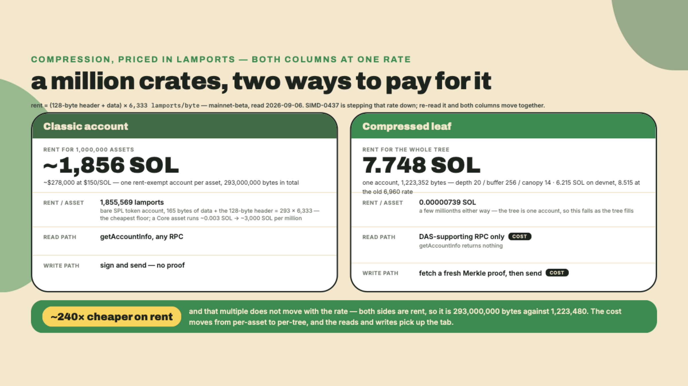
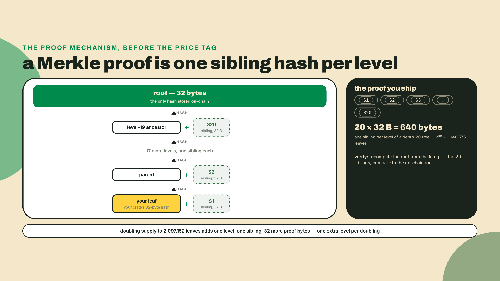
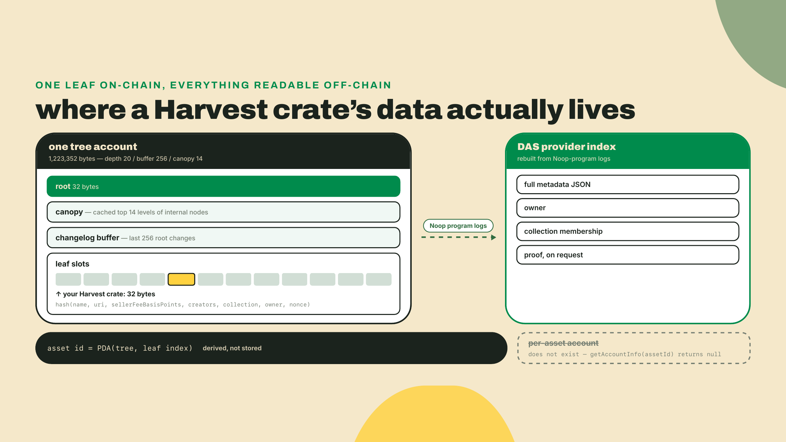
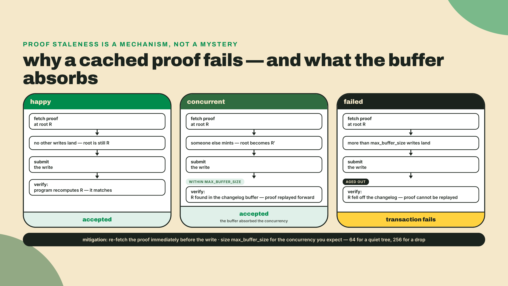
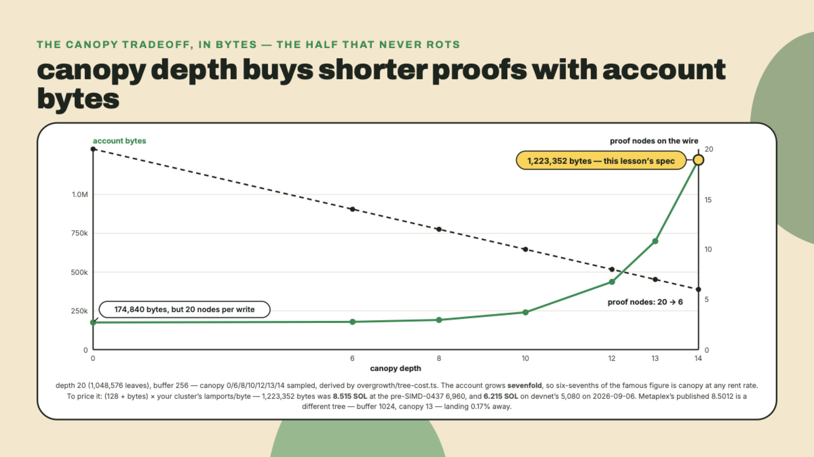
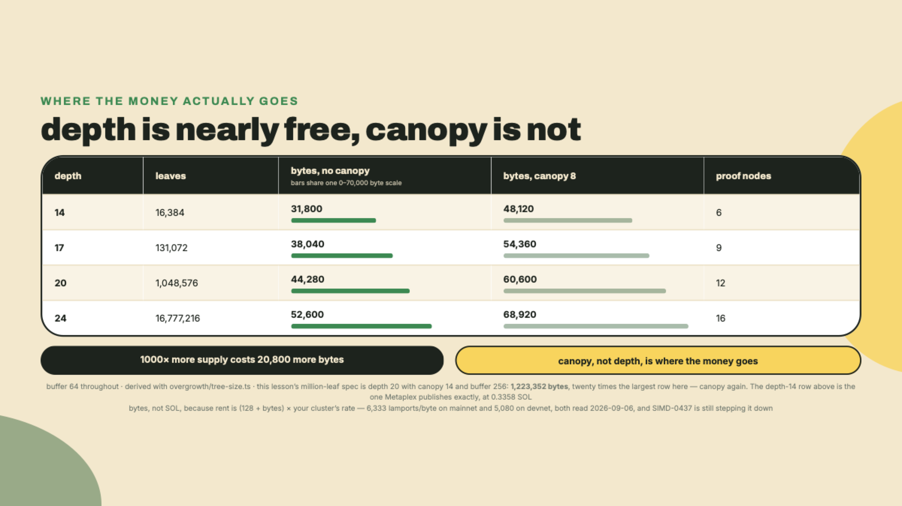
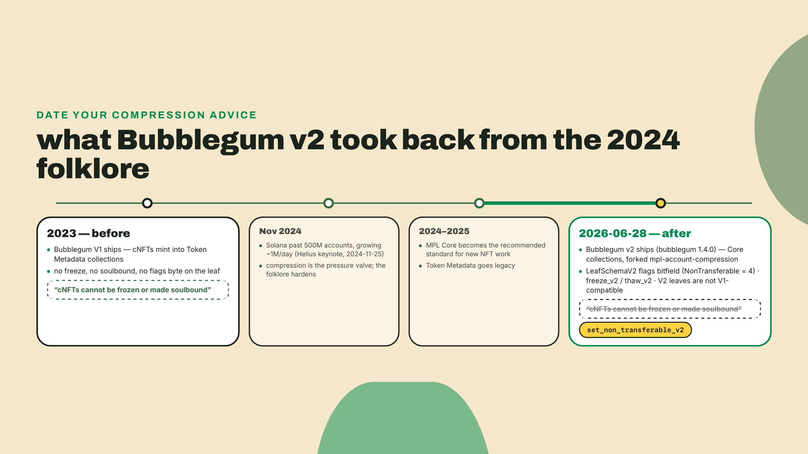
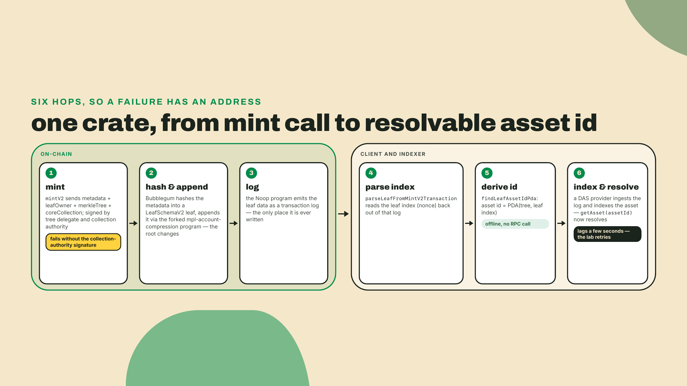
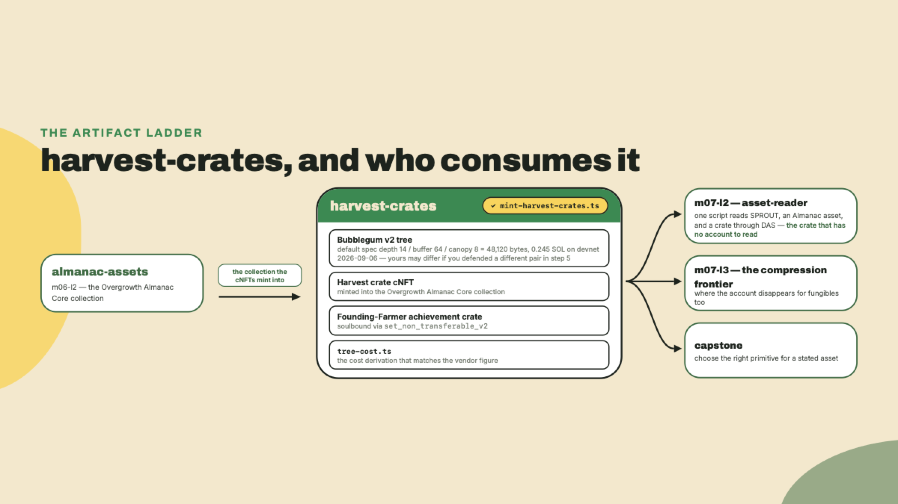

# Bubblegum v2: mint a million NFTs for the price of a laptop

## Summary

Last lesson closed the NFT-standards arc. Token Metadata is legacy, Metaplex Core is the recommended standard for new NFT work, and the all-Pass rule set you decoded on the legacy flagship turned out to enforce nothing at all. Two lessons back, in m06-l2, you built the artifact this lesson leans on: a verified Overgrowth Almanac Core collection, an asset whose Royalties plugin actually routes through a program check, one numbered Edition print, and a Founding-Farmer badge frozen into its wallet forever. Four assets. Hand-minted, one at a time.

Now Overgrowth needs to drop a Harvest crate to every player. Call it a million of them.

At classic-account rent that airdrop costs a house, and you have not shipped it because nobody can afford to. So before any theory, price it yourself. Make a working directory, install the SDKs, and let the account-compression sizer answer the question:

```bash
mkdir -p overgrowth && cd overgrowth
npm install @metaplex-foundation/mpl-bubblegum@5.1.0 \
  @metaplex-foundation/mpl-account-compression@0.0.1 \
  @metaplex-foundation/mpl-core@1.10.0 \
  @metaplex-foundation/umi@1.5.1 \
  @metaplex-foundation/umi-bundle-defaults@1.5.1 \
  @metaplex-foundation/digital-asset-standard-api@2.0.0
npm install -D tsx@4.23.12 typescript@5.9.3 @types/node@24
```

Pins read off npm on 2026-08-22, the week this lesson was written. `mpl-bubblegum` 5.1.0 published 2026-08-17, so it is fresh; the on-chain side is a separate Rust line and moves on its own schedule. Re-check both before you pin anything long-lived.

```typescript
// overgrowth/scratch-cost.ts
import { getMerkleTreeSize } from "@metaplex-foundation/mpl-account-compression";

const RPC = process.env.SOLANA_RPC_URL ?? "https://api.devnet.solana.com";

// Rent is (128 bytes of account header + your data) x a per-byte rate, and
// that rate is a NETWORK PARAMETER, not a constant a course gets to bake in.
// SIMD-0437 is stepping it down and the clusters are on different steps, so
// ask the one you will actually pay on: a 0-byte account's rent-exempt
// minimum is exactly the header times the rate.
async function lamportsPerByte(): Promise<number> {
  const res = await fetch(RPC, {
    method: "POST",
    headers: { "Content-Type": "application/json" },
    body: JSON.stringify({ jsonrpc: "2.0", id: 1, method: "getMinimumBalanceForRentExemption", params: [0] }),
  });
  const { result } = (await res.json()) as { result: number };
  return result / 128;
}

async function main(): Promise<void> {
  const rate = await lamportsPerByte();
  const bytes = getMerkleTreeSize(20, 256, 14);
  const sol = ((128 + bytes) * rate) / 1_000_000_000;

  console.log(`${rate.toLocaleString()} lamports per byte on ${RPC}`);
  console.log(`${bytes.toLocaleString()} bytes of account`);
  console.log(`${sol.toFixed(3)} SOL of rent for ${(2 ** 20).toLocaleString()} leaves`);
  console.log(`${(sol / 2 ** 20).toFixed(8)} SOL per cNFT`);
}

main().catch((e) => {
  console.error(e);
  process.exit(1);
});
```

`npx tsx scratch-cost.ts` prints four lines. Mine, against devnet on 2026-09-06:

```
5,080 lamports per byte on https://api.devnet.solana.com
1,223,352 bytes of account
6.215 SOL of rent for 1,048,576 leaves
0.00000593 SOL per cNFT
```

One account. Six and a bit SOL. A million NFTs. That third line is roughly 0.000006 SOL each. Price it at the $150/SOL anchor this lesson uses throughout and the whole tree runs under a thousand dollars: the price of a decent laptop, for an airdrop that per-asset accounts price in the hundreds of thousands. (If you want the small anchor instead: one coffee's worth of SOL covers a few thousand crates' worth of leaves.)

Your first line may not say 5,080, and if it does not, nothing here is broken. Metaplex publishes 8.5012 SOL for a million-leaf tree, and that was the right answer at 6,960 lamports per byte, the rate every cluster charged before SIMD-0437 started stepping it down. Their row is not quite this tree, and step 3 makes the difference explicit: they publish depth 20 with buffer 1024 and canopy 13, this lesson builds buffer 256 and canopy 14, and the two land 0.17% apart by coincidence rather than by agreement. Mainnet moved to 6,333 on 2026-09-03; devnet is a step further along at 5,080; a surfpool fork was still serving 6,960 when I checked on 2026-09-06, because a fork inherits mainnet's accounts and not necessarily its rent schedule. Same bytes, three different bills. This is the first of many numbers in this course that belongs to the world rather than to the page, and the reason the script asks rather than asserts.

Today you build that tree for real. The autonomy fade, out loud: the theory and the tree-cost derivation are worked in full, the tree spec is yours to choose and defend (step 5 makes you derive the depth and justify the buffer and canopy before minting your first crate), and the soulbound achievement crate plus its transfer-rejection proof are entirely yours, solo, with only the two function signatures fixed for you.

## No account, just a leaf

### The number that forces the design

Here is the pain in dollars, priced from the floor up. The cheapest per-asset account on Solana is a bare 165-byte SPL token account; ask a cluster what one costs (`solana rent 165`) and mainnet answered 0.00185 SOL on 2026-09-06. That is the most charitable possible comparator: any real NFT shape costs more. Mint a million of anything that needs even that minimal account and you are holding on the order of 1,900 SOL of rent hostage; at $150 per SOL that is nearly $300,000, locked up, to hand out a crate. And the Core assets you shipped last module do not rescue you: at the vendor-published ~0.003 SOL per asset, a million Core crates run about 3,000 SOL. Cheap per asset, roughly forty US cents each at that SOL price, is still a house at fleet scale. Per-asset anything is the problem.

That number is not a hypothetical anyone invented for a course. Solana had already blown past 500 million accounts and was adding roughly a million a day by November 2024, which is exactly the pressure that produced state compression in the first place (Helius wrote this up around their ZK-compression keynote, 2024-11-25; treat the counts as their snapshot, not a live reading). Every one of those accounts is a validator's RAM. The chain was growing a storage problem faster than it was growing users.

So, the reframe. You do not actually need a million accounts. You need to be able to *prove*, for any one crate, that it exists and who owns it. Those are different requirements, and only the second one is load-bearing.



### What a leaf actually is

State compression stores a hash of your asset, not your asset.

Concretely: Bubblegum takes the crate's metadata (name, URI, seller fee, creators, collection, owner, and a nonce), hashes it into a single 32-byte value, and writes that value into a slot of an on-chain **concurrent Merkle tree**. That slot is the **leaf**. Every pair of leaves is hashed together into a parent, every pair of parents into a grandparent, all the way up to one 32-byte **root** stored in the tree account. Nothing else about your crate is on-chain. There is no mint account, no token account, no metadata PDA, no Core asset account. There is a hash, sitting in a slot, in one big account you paid for once.

If you have used git, you already have the intuition. A commit hash does not contain your repository. It commits to it, so precisely that changing one byte anywhere changes the hash, and so cheaply that you can name a million files with 32 bytes. A Merkle root is that same trick with a proof attached: given a leaf and the sibling hash at each level up the tree, anyone can recompute the root and check it against the one on-chain. Twenty levels for a million leaves, because that is what `log2` does for you.

That proof is the whole bargain. You stopped paying for storage and started paying for proofs.



It is worth being precise about what that swap actually costs, because the asymmetry is the entire reason compression is viable rather than merely clever. Storing one asset as an account is O(1) to read and O(n) in rent across n assets, and rent is the expensive resource because it is validator memory held forever. Storing one asset as a leaf is O(1) in rent across n assets, because the tree account is a fixed size regardless of how full it is, and O(log n) per write, because a proof is one sibling hash per level. Doubling your supply from a million to two million does not double the rent. It adds one level, which adds one sibling hash to every proof and thirty-two bytes to every write. That is the trade the design makes: it converts a linear storage cost into a logarithmic bandwidth cost. Bandwidth you can batch, cache, and shorten with a canopy. Rent you can only pay.

The corollary is the thing people miss. Compression is not "NFTs, cheaper." It is a different cost curve, and curves cross. Below a few thousand assets a Core account per asset is genuinely competitive and vastly simpler to operate. Above a hundred thousand there is no argument to have. The interesting decisions all live in the middle, and they turn on write rate rather than on count.

One name in the next visual needs its introduction before you meet it there: the **Noop program**. It is a deployed program that deliberately does nothing when invoked; its entire value is that data passed to it lands in the transaction logs. At mint time Bubblegum CPIs the Noop program with the crate's full readable metadata, so the logs become the only place that data is ever written, and indexers rebuild everything they serve you by replaying those logs. The chain itself keeps only the hash.

The **asset id** falls out of the same design. A cNFT has no account, so it needs some canonical address to be referred to by, and Bubblegum derives it: the asset id is `PDA(tree, leaf index)`. Deterministic, derivable offline, stable forever. You will derive one in the lab with `findLeafAssetIdPda` and then watch a DAS provider hand you back the same string.



### The changelog buffer, and why proofs go stale

Now the part that bites people in production.

A Merkle proof is a snapshot. It says: *given this root, my leaf hashes up to it.* The moment anyone else mints, transfers, or burns anything in the same tree, the root changes, and every proof anyone was holding is now a proof against a root that no longer exists. On a tree doing one write a day, nobody notices. On a tree doing a crate drop, everybody notices at once.

That is what `max_buffer_size` is for. The tree account keeps a **changelog buffer** of the last N root changes, so a proof that was valid a few writes ago can still be replayed forward and accepted. Buffer 64 means roughly 64 concurrent writes can land in a slot before proofs start bouncing. Buffer 256 buys you more headroom and costs you bytes. This is why the structure is called a *concurrent* Merkle tree and not just a Merkle tree: without the buffer, a tree would serialize to one write per slot, and at Solana's ~400ms slot target your million-crate drop would take about four and a half days.

The footgun stated plainly: **re-fetch the proof immediately before every write.** Not at the top of your script. Not once per batch. Immediately before. The helper you will use in the challenge, `getAssetWithProof`, does a fresh DAS round trip every call for exactly this reason, and if you cache its result across a batch of transfers you will get a stream of hashing-mismatch errors that look like a bug in your code and are not.



### The canopy is the money

Twenty levels deep means a client write must supply twenty sibling hashes. Twenty public keys, at 32 bytes each, riding in the transaction. That is 640 bytes of proof before you have written a single instruction, and Solana's transaction budget is not generous enough for you to ignore it. Push proof nodes past the limit and your write does not get slower, it stops fitting.

The **canopy** is the fix: cache the top K levels of internal nodes inside the tree account itself. If the chain already knows the top 14 levels, the client only ships the bottom `max_depth - canopy_depth` nodes. Six, in that case, instead of twenty.

Which means the canopy is not a tuning knob, it is a purchase. You buy shorter client proofs with rent. Nobody in this course measured the exact formula, so rather than hand you a table to trust, derive it. This is the part where the vendor's headline number stops being folklore and starts being arithmetic:

```typescript
// overgrowth/tree-size.ts
import { getMerkleTreeSize } from "@metaplex-foundation/mpl-account-compression";

export type TreeSpec = {
  maxDepth: number;
  maxBufferSize: number;
  canopyDepth: number;
};

/**
 * The (maxDepth, maxBufferSize) pairs the on-chain account layout is generated for.
 * Legality is per PAIR, not per field: depth 14 accepts buffer 64 but never 512.
 */
const DEPTH_BUFFER_PAIRS: ReadonlyArray<readonly [number, number]> = [
  [3, 8], [5, 8],
  [6, 16], [7, 16], [8, 16], [9, 16],
  [10, 32], [11, 32], [12, 32], [13, 32],
  [14, 64], [14, 256], [14, 1024], [14, 2048],
  [15, 64], [16, 64], [17, 64], [18, 64], [19, 64],
  [20, 64], [20, 256], [20, 1024], [20, 2048],
  [24, 64], [24, 256], [24, 512], [24, 1024], [24, 2048],
  [26, 512], [26, 1024], [26, 2048],
  [30, 512], [30, 1024], [30, 2048],
];

const DEPTHS = [...new Set(DEPTH_BUFFER_PAIRS.map(([d]) => d))].sort((a, b) => a - b);

export function depthForSupply(targetSupply: number): number {
  const depth = DEPTHS.find((d) => 2 ** d >= targetSupply);
  if (depth === undefined) throw new Error(`no supported depth holds ${targetSupply} leaves`);
  return depth;
}

export function treeBytes(spec: TreeSpec): number {
  const legal = DEPTH_BUFFER_PAIRS.some(
    ([d, b]) => d === spec.maxDepth && b === spec.maxBufferSize,
  );
  if (!legal) {
    throw new Error(
      `depth ${spec.maxDepth} / buffer ${spec.maxBufferSize} is not a supported pair`,
    );
  }
  return getMerkleTreeSize(spec.maxDepth, spec.maxBufferSize, spec.canopyDepth);
}

/** The account header the runtime charges rent on, on top of your data. */
export const ACCOUNT_HEADER_BYTES = 128;

/**
 * Read the per-byte rent rate off a live cluster instead of trusting a
 * literal. A 0-byte account's rent-exempt minimum is exactly the header times
 * the rate, so one RPC call gives you the whole schedule. SIMD-0437 is
 * stepping this number down in stages and the clusters are not in step with
 * each other, which is why no function here takes a default.
 */
export async function readLamportsPerByte(rpcUrl: string): Promise<number> {
  const res = await fetch(rpcUrl, {
    method: "POST",
    headers: { "Content-Type": "application/json" },
    body: JSON.stringify({ jsonrpc: "2.0", id: 1, method: "getMinimumBalanceForRentExemption", params: [0] }),
  });
  const { result } = (await res.json()) as { result: number };
  return result / ACCOUNT_HEADER_BYTES;
}

/** Rent-exempt minimum in SOL: (header + data) x the rate you just read. */
export function rentSol(bytes: number, lamportsPerByte: number): number {
  return ((ACCOUNT_HEADER_BYTES + bytes) * lamportsPerByte) / 1_000_000_000;
}

export function treeCostSol(spec: TreeSpec, lamportsPerByte: number): number {
  return rentSol(treeBytes(spec), lamportsPerByte);
}

/** Proof nodes a client must ship per write, once the canopy covers its top levels. */
export function proofNodesOnTheWire(spec: TreeSpec): number {
  return Math.max(spec.maxDepth - spec.canopyDepth, 0);
}
```

Sweep the canopy against a fixed depth and buffer and the tradeoff prints itself:

```typescript
// overgrowth/tree-cost.ts
import {
  depthForSupply,
  proofNodesOnTheWire,
  readLamportsPerByte,
  treeBytes,
  treeCostSol,
} from "./tree-size";

const RPC = process.env.SOLANA_RPC_URL ?? "https://api.devnet.solana.com";
const targetSupply = Number(process.argv[2] ?? 1_000_000);
const maxBufferSize = Number(process.argv[3] ?? 256);
const maxDepth = depthForSupply(targetSupply);

// Metaplex's published million-leaf row, copied exactly: depth 20 with buffer
// 1024 and canopy 13, at 8.5012 SOL. Note the spec, because it is NOT the one
// this sweep runs. The rate is the pre-SIMD-0437 6,960 their page was written
// under, kept only so the comparison below can rescale their number to yours.
const VENDOR_SPEC = { maxDepth: 20, maxBufferSize: 1024, canopyDepth: 13 };
const RATE_BEHIND_THE_VENDOR_FIGURE = 6960;
const VENDOR_SOL_AT_THAT_RATE = 8.5012;

async function main(): Promise<void> {
  const rate = await readLamportsPerByte(RPC);
  console.log(`rent rate: ${rate.toLocaleString()} lamports/byte on ${RPC}`);
  console.log(`target supply ${targetSupply.toLocaleString()} -> maxDepth ${maxDepth} (${(2 ** maxDepth).toLocaleString()} leaves)`);
  console.log("canopy   bytes        SOL      proof nodes on the wire");
  for (const canopyDepth of [0, 6, 8, 10, 12, 13, 14]) {
    const spec = { maxDepth, maxBufferSize, canopyDepth };
    const line = [
      String(canopyDepth).padStart(4),
      String(treeBytes(spec)).padStart(10),
      treeCostSol(spec, rate).toFixed(3).padStart(9),
      String(proofNodesOnTheWire(spec)).padStart(10),
    ].join("  ");
    console.log(line);
  }

  // Check the derivation against the vendor by deriving THEIR spec, not ours.
  // Their number is quoted for exactly one configuration AND at one rent rate,
  // so reproduce the configuration and rescale the rate before comparing;
  // holding a 6,960-era number against a 5,080-era derivation would be a unit
  // error, not a finding. Doing it this way makes the check real: it agrees to
  // four decimal places, which is a verification. Pointing the same check at
  // OUR spec would also have printed MATCH, and that would have been luck.
  if (maxDepth === 20) {
    const vendorAtYourRate = VENDOR_SOL_AT_THAT_RATE * (rate / RATE_BEHIND_THE_VENDOR_FIGURE);
    const theirs = treeCostSol(VENDOR_SPEC, rate);
    const ours = treeCostSol({ maxDepth: 20, maxBufferSize, canopyDepth: 14 }, rate);
    console.log(`\nvendor row : ${VENDOR_SOL_AT_THAT_RATE} SOL, depth 20 / buffer 1024 / canopy 13, quoted at ${RATE_BEHIND_THE_VENDOR_FIGURE} lamports/byte`);
    console.log(`  rescaled to your rate: ${vendorAtYourRate.toFixed(4)} SOL`);
    console.log(`derived, their spec  : ${theirs.toFixed(4)} SOL`);
    console.log(
      Math.abs(theirs - vendorAtYourRate) < 0.005 * vendorAtYourRate
        ? "MATCH - the derivation reproduces the published row"
        : "MISMATCH - re-check the spec",
    );
    console.log(`derived, this sweep  : ${ours.toFixed(4)} SOL at depth 20 / buffer ${maxBufferSize} / canopy 14`);
    console.log(`  a DIFFERENT tree that lands ${(((ours - theirs) / theirs) * 100).toFixed(2)}% away - near, not the same`);
  }
}

main().catch((e) => {
  console.error(e);
  process.exit(1);
});
```

`npx tsx tree-cost.ts` gives you this. My run, devnet, 2026-09-06 — your SOL column moves with your cluster's rate and the bytes column does not:

```
rent rate: 5,080 lamports/byte on https://api.devnet.solana.com
target supply 1,000,000 -> maxDepth 20 (1,048,576 leaves)
canopy   bytes        SOL      proof nodes on the wire
   0      174840      0.889          20
   6      178872      0.909          14
   8      191160      0.972          12
  10      240312      1.221          10
  12      436920      2.220           8
  13      699064      3.552           7
  14     1223352      6.215           6

vendor row : 8.5012 SOL, depth 20 / buffer 1024 / canopy 13, quoted at 6960 lamports/byte
  rescaled to your rate: 6.2049 SOL
derived, their spec  : 6.2049 SOL
MATCH - the derivation reproduces the published row
derived, this sweep  : 6.2153 SOL at depth 20 / buffer 256 / canopy 14
  a DIFFERENT tree that lands 0.17% away - near, not the same
```

Read that table twice, because it is the single most useful thing in this lesson, and read it down the BYTES column first, because that column is physics and the SOL column is policy. A million-leaf tree with no canopy at all is 174,840 bytes; at canopy 14 it is 1,223,352. Seven times the account, and therefore seven times the rent, at any rate the network ever charges. Six-sevenths of that famous figure, whatever it is denominated in this month, is canopy. What you are buying with it is a drop from twenty proof nodes to six, which is the difference between "my transfer instruction fits" and "my transfer instruction does not fit." And note what the check above just showed you: the vendor's own row buys almost exactly the same account a different way, canopy 13 with a buffer four times deeper, which is the same money spent on write concurrency instead of on proof length. Their headline figure silently encodes both choices, you now know which ones, and you can pick differently on purpose.

My own bias, for what it is worth: I have watched more projects get burned by an undersized canopy than by an oversized one, because rent is a number you see on day zero and a blown transaction size is a number you see on drop day. If you are unsure, buy the canopy.



### Sizing is a one-way door

`max_depth` is permanent. A depth-14 tree holds 16,384 leaves and will hold 16,384 leaves for as long as it exists. There is no realloc, no migration, no "we will grow it later." When the last leaf is filled, that tree is done, and your only move is to create another one and teach every downstream system that your collection now spans two trees.

That is not fatal, and plenty of production drops run multi-tree on purpose. But it is a decision you want to make deliberately on day zero rather than discover on drop day, so run the numbers against your actual ambition instead of your actual roadmap.

| max_depth | leaves | bytes, no canopy | bytes, canopy 8 | proof nodes at canopy 8 |
|---|---|---|---|---|
| 14 | 16,384 | 31,800 | 48,120 | 6 |
| 17 | 131,072 | 38,040 | 54,360 | 9 |
| 20 | 1,048,576 | 44,280 | 60,600 | 12 |
| 24 | 16,777,216 | 52,600 | 68,920 | 16 |

Those are `maxBufferSize: 64` rows, produced with the `tree-size.ts` helpers you just wrote in a five-line loop over depths at a fixed canopy 8 (`tree-cost.ts` sweeps canopy at fixed depth, so this sweep is its one-minute sibling). They are in bytes rather than SOL on purpose: bytes are a property of the account layout and will read the same to you as to me, while the SOL is your cluster's rate times that column and moves under both of us. Multiply the column yourself and the startling part shows up. Depth barely costs anything. Going from sixteen thousand leaves to sixteen *million* adds about 20,800 bytes, roughly 0.11 SOL at devnet's rate the day I wrote this, because the depth only affects the changelog buffer's row width, not the leaf storage. Nothing stores your leaves. There is nothing to store.

So the guidance almost writes itself: be generous with depth, be deliberate with canopy, and be honest about buffer. Depth is nearly free and permanent, so overshoot it. Canopy is expensive and permanent, so price it against the proof length your writes can actually carry. Buffer sits between the two and is just as permanent: cheaper than canopy, but real money at size (the depth-20 jump from buffer 64 to buffer 256 adds 130,560 bytes, about 0.66 SOL at devnet's rate), so match it to your worst expected write concurrency rather than defaulting it upward.

Not every depth and buffer pairing is legal, incidentally, and this is the reason `tree-size.ts` carries that pair table rather than two independent lists of allowed values. The on-chain account layout is generated for a fixed set of combinations: depth 14 accepts buffer 64, 256, 1024 or 2048 and nothing else, depth 26 starts at 512, and buffer 128 is not a legal size at any depth at all. Checking the two fields separately would wave through half a dozen pairings the program will refuse. A bad pairing does not fail gracefully at runtime either, it fails as an unhelpful account-size error after you have already paid the rent, so let the guard throw before you spend.



### What changed in v2

Bubblegum shipped in 2023, and a lot of what people still confidently repeat about compressed NFTs describes the V1 program. Version 2 broke most of it.

The reversal that matters most: **soulbound cNFTs exist now.** For two years the received wisdom was that compression bought you cheap mints and cost you every enforcement primitive, that a cNFT could not be frozen and could never be made non-transferable, and that if you wanted soulbound you reached for a Token-2022 NonTransferable mint instead. Bubblegum v2 ships `set_non_transferable_v2`, plus freeze and thaw, and when the tree's Core collection carries a `PermanentFreezeDelegate` the whole thing enforces at the program level (Metaplex's Bubblegum v2 documentation; the instruction set is right there in the program's own interface, which you will call in the challenge). The folklore is simply out of date.

The mechanism is worth seeing, because it is one byte:

```typescript
// what the client library exposes for the v2 leaf's flags field
import { LeafSchemaV2Flags } from "@metaplex-foundation/mpl-bubblegum";

// LeafSchemaV2Flags.None                 === 0
// LeafSchemaV2Flags.FrozenByOwner        === 1
// LeafSchemaV2Flags.FrozenByPermDelegate === 2
// LeafSchemaV2Flags.NonTransferable      === 4

const soulboundAndFrozen =
  LeafSchemaV2Flags.NonTransferable | LeafSchemaV2Flags.FrozenByPermDelegate; // 6
```

Soulbound is a bit. Bit 2, in a `flags` byte that V1 leaves do not have. Which explains the next fact, the one that will cost you an afternoon if you miss it: **V2 leaves are not backward-compatible with V1 leaves.** Different leaf schema, different hash, different program surface. A V1 tree cannot be walked into a v2 flow and there is no in-place upgrade. If you inherit a V1 tree, you read it with V1 instructions and you mint new supply into a new v2 tree.

The rest of the v2 delta, quickly:

| | Bubblegum V1 | Bubblegum v2 |
|---|---|---|
| Collection standard | Token Metadata collections | MPL Core collections |
| Leaf schema | `LeafSchema` V1, no flags byte | `LeafSchemaV2`, with a flags bitfield |
| Freeze / thaw | not available | `freeze_v2`, `thaw_v2`, delegate variants |
| Soulbound | not available | `set_non_transferable_v2` |
| Compression program | SPL account-compression | forked `mpl-account-compression` |
| Collection verification | verify instruction, separate step | collection is a plain pubkey, always verified |

That compression-program row is not cosmetic. Bubblegum v2 runs on Metaplex's own fork of account compression, `mpl-account-compression`, whose 0.4.2 crate line is where the forked program came from, at program id `mcmt6YrQEMKw8Mw43FmpRLmf7BqRnFMKmAcbxE3xkAW`. That is a different address from SPL's account-compression program, and the Bubblegum program itself sits at `BGUMAp9Gq7iTEuizy4pqaxsTyUCBK68MDfK752saRPUY`. Program crate lines move faster than lesson drafts do, so treat the crate number as the provenance of the fork rather than as today's npm state; the client pins in the install block above are the ones your lab actually runs.

One thing v2 kept from V1, and it deserves a sentence because it is the piece people forget until they need it: the tree has an authority of its own. `create_tree_v2` writes a tree config PDA alongside the Merkle account recording who created the tree, and mints go through a `treeCreatorOrDelegate` signer. You can delegate that slot to a minting service without handing over your keypair, and you can create the tree `public`, in which case anyone may append a leaf to it. Public trees are how open mint experiences work and also how a stranger fills your supply cap for you, so the default of `public: false` is the right default and you should have a reason before flipping it. There are two separate authorities in play in this lesson, which trips people up: the *tree* authority signs mints into the tree, and the *collection* authority signs membership into the Almanac. Your lab wallet happens to be both. In production they usually are not the same key, and the mint instruction wants both signatures.

The collection row is the one that reaches back into last lesson's work. `MetadataArgsV2` carries `collection` as a bare `Option<PublicKey>`, with the client library's own comment stating that in V2 it "is just a `Pubkey` and is always considered verified." No verify step, no unverified limbo. The Almanac collection account you created in m06-l2 is the literal value you pass, and the mint fails if the collection authority does not sign. Collection first, then members, one level down. Same rule you learned on Core assets.



### The trade-off, named

Compression trades cheap mints for read complexity and write coupling. Both halves are permanent properties of the design, not rough edges someone will file down.

**Reads need a DAS-supporting RPC.** There is no account to fetch, so `getAccountInfo` on a cNFT asset id returns nothing at all. Your crate is real, it is provably owned, and a default public RPC endpoint cannot tell you a single thing about it. You are now depending on a provider's index, with whatever freshness and completeness that provider offers, for the basic act of reading your own asset. That is a real dependency and you should feel it in the lab when your first `getAsset` call comes back empty for four seconds because the indexer has not caught up yet.

**Writes need a fresh proof.** Every transfer, burn, freeze, and metadata update carries proof nodes, which means every write is coupled to the tree's current state and races every other write against the same tree.

**And rent is not the whole bill.** Whatever the tree cost you, it bought the tree. It does not buy the million transactions that fill it. Each `mint_v2` is a transaction with its own base fee and, on any day worth dropping on, its own priority fee, and no amount of clever tree sizing makes that go away. Batching several mints into one transaction helps a lot and is the standard move for a real drop, but the ceiling on how many fit is set by transaction size, which is set by proof length, which is set by your canopy. The canopy decision reaches further than the rent line suggests. Landing a large batch reliably is a client-side discipline in its own right, and the planned Client-Side Mastery course owns that territory: priority fees, retries, and how to keep a batch from silently half-succeeding.

**And the sizing decisions are one-way.** Undersize `max_depth` and your supply cap is permanent. Undersize the canopy and every client transaction carries longer proofs forever, which can push a write past the transaction size limit at exactly the moment you have the most writes.

Worth it? For a million crates that no player will ever individually trade, obviously. For four Almanac volumes with royalties and edition numbers, obviously not, which is why last lesson used Core accounts and this one does not. The honest rule is boring: compress when the asset count is large and the per-asset write rate is low. Neither half alone is enough.

## Lab: plant the crate tree

Seven steps. Steps 1 through 4 are worked in full, step 5 makes you choose and defend the tree spec before anything spends, and the gate is the mint script itself running clean end to end (the Checkpoint restates it). The tree we build here is deliberately not a million leaves; it is 16,384, which is the size the vendor prices at about 0.34 SOL (at the pre-SIMD-0437 rate their page was written under) and which your own derivation will confirm, in your own cluster's money, before you spend anything.

One thing changes about your setup, and it changes for a reason you should sit with. **This lesson runs against devnet, through a DAS-supporting RPC.** The surfnet you have been using since m02-l1 is a real validator, it will happily create your tree and mint your crates, and it will then be completely unable to tell you what you minted, because a local validator does not run an indexer. That is the read-complexity trade-off, and you meet it on day one. Get a devnet endpoint from a DAS provider (Helius, QuickNode, Triton and Shyft all serve the interface; the provider roster and how to choose is the next lesson's business), then:

```bash
export DAS_RPC_URL="https://devnet.helius-rpc.com/?api-key=YOUR_KEY"
```

1. **The shared setup.** One helper owns the connection, the wallet, and the address book. Note the three Umi plugins: `mplCore()` for the collection, `mplBubblegum()` for the tree, and `dasApi()` for the reads. Without that third one, `umi.rpc.getAsset` does not exist. (One type-system honesty note: with these exact pins the das-api augmentation does not reach `umi.rpc` under a strict `tsc` module-resolution pass, so your editor may red-squiggle `getAsset`; the lab's documented `npx tsx` runs are unaffected, and the squiggle is the pinned stack's gap, not your code.)

    ```typescript
    // overgrowth/umi.ts
    import { createUmi } from "@metaplex-foundation/umi-bundle-defaults";
    import { keypairIdentity, sol, type Umi } from "@metaplex-foundation/umi";
    import { mplCore } from "@metaplex-foundation/mpl-core";
    import { mplBubblegum } from "@metaplex-foundation/mpl-bubblegum";
    import { dasApi } from "@metaplex-foundation/digital-asset-standard-api";
    import fs from "node:fs";

    export async function getUmi(): Promise<Umi> {
      const endpoint = process.env.DAS_RPC_URL;
      if (!endpoint) throw new Error("set DAS_RPC_URL to a devnet DAS endpoint");

      const umi = createUmi(endpoint).use(mplCore()).use(mplBubblegum()).use(dasApi());

      let secret: Uint8Array;
      if (fs.existsSync("wallet.json")) {
        secret = Uint8Array.from(JSON.parse(fs.readFileSync("wallet.json", "utf8")));
      } else {
        const fresh = umi.eddsa.generateKeypair();
        fs.writeFileSync("wallet.json", JSON.stringify(Array.from(fresh.secretKey)));
        secret = fresh.secretKey;
      }
      umi.use(keypairIdentity(umi.eddsa.createKeypairFromSecretKey(secret)));

      const balance = await umi.rpc.getBalance(umi.identity.publicKey);
      if (balance.basisPoints < sol(1).basisPoints) {
        throw new Error(`fund ${umi.identity.publicKey} with devnet SOL, then re-run`);
      }
      return umi;
    }

    export function book(): Record<string, string> {
      return fs.existsSync("crates.json") ? JSON.parse(fs.readFileSync("crates.json", "utf8")) : {};
    }

    export function remember(key: string, value: string): void {
      fs.writeFileSync("crates.json", JSON.stringify({ ...book(), [key]: value }, null, 2));
    }
    ```

    Run everything from `overgrowth/` so `wallet.json` and the shared address book `crates.json` land together. Fund the printed address from a devnet faucet on first run; the script tells you the address and stops rather than half-building a tree with an unfunded payer.

2. **Put the Almanac on this cluster.** Your m06-l2 Almanac lives on the surfnet, and devnet has never heard of it. So the helper either finds the collection recorded in `crates.json` or creates it, and this time it carries a `PermanentFreezeDelegate` from birth, because `set_non_transferable_v2` requires the signing authority to be a permanent freeze delegate on the collection. Arm it now or the challenge is unwinnable later.

    ```typescript
    // overgrowth/collection.ts
    import { generateSigner, publicKey, type PublicKey, type Umi } from "@metaplex-foundation/umi";
    import { createCollection, fetchCollection } from "@metaplex-foundation/mpl-core";
    import { book, remember } from "./umi";

    export async function getOrCreateAlmanac(umi: Umi): Promise<PublicKey> {
      const saved = book().collection;
      if (saved) {
        const existing = await fetchCollection(umi, publicKey(saved));
        return existing.publicKey;
      }

      const collection = generateSigner(umi);
      await createCollection(umi, {
        collection,
        name: "Overgrowth Almanac",
        uri: "https://overgrowth.example/almanac/collection.json",
        plugins: [
          {
            type: "PermanentFreezeDelegate",
            frozen: false,
            authority: { type: "Address", address: umi.identity.publicKey },
          },
        ],
      }).sendAndConfirm(umi);

      remember("collection", collection.publicKey);
      return collection.publicKey;
    }
    ```

    `frozen: false` is deliberate. A collection-level freeze with `frozen: true` would freeze every member the moment it joined, which is not what a Harvest crate wants. What you need is the *delegate slot occupied by an authority you control*, so that one specific crate can later be marked non-transferable while the rest of the drop stays tradeable.

3. **Write the sizing math and the tree cost check.** You already have `tree-size.ts` from the theory section. Run it against your real target before spending:

    ```bash
    npx tsx tree-cost.ts 16384 64
    ```

    That prints the canopy sweep for a 16,384-leaf tree. This one you can match exactly, unlike the million-leaf row: Metaplex publishes depth 14 with buffer 64 and canopy 8 at 0.3358 SOL, which is precisely the spec this lab builds. Their page predates the rent cut, so match on BYTES rather than on SOL: canopy 8 is 48,120 bytes, which is 0.3358 SOL at 6,960 lamports/byte and prints as 0.245 SOL on devnet today. The sweep will also show you canopy 0 at 31,800 bytes, two-thirds the account and fourteen proof nodes on every client write instead of six. Same shape as the million-leaf table, two orders of magnitude down.

4. **Create the tree and mint a crate (worked; step 5 hands you the spec decisions).** Here is the main script. Read the whole thing before running it.

    ```typescript
    // overgrowth/mint-harvest-crates.ts
    import { generateSigner, publicKey, type PublicKey, type Umi } from "@metaplex-foundation/umi";
    import {
      createTreeV2,
      findLeafAssetIdPda,
      mintV2,
      parseLeafFromMintV2Transaction,
    } from "@metaplex-foundation/mpl-bubblegum";
    import type { DasApiAsset } from "@metaplex-foundation/digital-asset-standard-api";
    import assert from "node:assert/strict";
    import { getOrCreateAlmanac } from "./collection";
    import { depthForSupply, readLamportsPerByte, treeCostSol } from "./tree-size";
    import { book, getUmi, remember } from "./umi";

    const CRATE_SUPPLY = 16_384;
    const MAX_BUFFER_SIZE = 64;
    const CANOPY_DEPTH = 8;

    async function createCrateTree(umi: Umi): Promise<PublicKey> {
      const saved = book().tree;
      if (saved) return publicKey(saved);

      const spec = {
        maxDepth: depthForSupply(CRATE_SUPPLY),
        maxBufferSize: MAX_BUFFER_SIZE,
        canopyDepth: CANOPY_DEPTH,
      };
      const rate = await readLamportsPerByte(process.env.DAS_RPC_URL!);
      console.log(`tree spec ${JSON.stringify(spec)} -> ${treeCostSol(spec, rate).toFixed(4)} SOL of rent at ${rate} lamports/byte`);

      const merkleTree = generateSigner(umi);
      const builder = await createTreeV2(umi, { merkleTree, ...spec });
      await builder.sendAndConfirm(umi);

      remember("tree", merkleTree.publicKey);
      return merkleTree.publicKey;
    }

    export async function mintCrate(
      umi: Umi,
      merkleTree: PublicKey,
      coreCollection: PublicKey,
      name: string,
    ): Promise<PublicKey> {
      const { signature } = await mintV2(umi, {
        merkleTree,
        coreCollection,
        leafOwner: umi.identity.publicKey,
        metadata: {
          name,
          uri: "https://overgrowth.example/crates/harvest.json",
          sellerFeeBasisPoints: 500,
          collection: coreCollection,
          creators: [{ address: umi.identity.publicKey, verified: true, share: 100 }],
        },
      }).sendAndConfirm(umi);

      const leaf = await parseLeafFromMintV2Transaction(umi, signature);
      const [assetId] = findLeafAssetIdPda(umi, { merkleTree, leafIndex: leaf.nonce });
      return assetId;
    }

    async function resolveThroughDas(umi: Umi, assetId: PublicKey): Promise<DasApiAsset> {
      for (let attempt = 0; attempt < 20; attempt += 1) {
        try {
          return await umi.rpc.getAsset(assetId);
        } catch {
          await new Promise((r) => setTimeout(r, 3000));
        }
      }
      throw new Error(`DAS never indexed ${assetId} - is DAS_RPC_URL a DAS provider?`);
    }

    async function main(): Promise<void> {
      const umi = await getUmi();
      const collection = await getOrCreateAlmanac(umi);
      const merkleTree = await createCrateTree(umi);
      console.log(`tree      ${merkleTree}`);
      console.log(`collection ${collection}`);

      const crate = await mintCrate(umi, merkleTree, collection, "Harvest Crate");
      remember("crate", crate);
      console.log(`crate     ${crate}`);

      const asset = await resolveThroughDas(umi, crate);
      assert.equal(asset.compression.compressed, true, "crate is not compressed");
      assert.equal(asset.compression.tree, merkleTree, "crate is in the wrong tree");
      assert.equal(asset.grouping[0]?.group_value, collection, "crate is not in the Almanac");
      console.log(`OK: getAsset resolved ${asset.content.metadata.name} under the Almanac collection`);

      const achievement = book().achievement;
      assert.ok(achievement, 'crates.json is missing "achievement" - the soulbound crate is yours to mint');
      const soulbound = await resolveThroughDas(umi, publicKey(achievement));
      assert.equal(soulbound.compression.compressed, true);
      console.log(`OK: soulbound crate ${achievement} still resolves through DAS`);
    }

    main().catch((err) => {
      console.error(err);
      process.exit(1);
    });
    ```

    Three details in there earn their why. `createTreeV2` is async and returns a builder rather than a transaction, because it has to ask the RPC how much rent a tree of that size needs before it can compose the account creation with the tree config instruction. `parseLeafFromMintV2Transaction` reads the leaf back out of the mint transaction's own logs, which is how you learn the leaf index without querying anything. And `findLeafAssetIdPda(umi, { merkleTree, leafIndex })` is `PDA(tree, leaf index)` in code: pure derivation, no network call, the asset id computed from two values you already hold.

    The retry loop around `getAsset` is not defensive padding. A DAS provider indexes from transaction logs, so there is a real gap between "your mint confirmed" and "your crate is queryable," usually a couple of seconds on devnet. Without the loop your first run fails and you spend twenty minutes debugging a tree that was fine.

5. **Choose and defend the spec.** Before you run anything: the tree spec is the part you own. Work out what `maxDepth` a 16,384-crate supply needs and check it against `DEPTHS` in `tree-size.ts`. Then decide `maxBufferSize` and `canopyDepth` for yourself from the sweep in step 3 rather than accepting the constants at the top of the file, and be ready to say out loud why you picked them. The constants shown are one defensible answer, not the answer.

    Then run it:

    ```bash
    npx tsx mint-harvest-crates.ts
    ```

    You should see the tree spec line with its SOL figure, the tree address, the collection address, the crate's asset id, and then, after a pause, `OK: getAsset resolved Harvest Crate under the Almanac collection`. Then it stops, with `crates.json is missing "achievement"`. That is correct. The gate is telling you what remains.

6. **Prove the asset has no account.** One line, and it is the whole lesson in a single check. With the crate id from `crates.json`:

    ```bash
    solana account $(node -p "require('./crates.json').crate") --url devnet
    ```

    The CLI reports that the account does not exist. Your crate is real, it is in a verified collection, DAS just described it to you in full, and there is no account. Sit with that for a second, because next lesson is built on exactly this gap.



7. **Read what the index gave you.** Print the raw `getAsset` response once, just to see the shape:

    ```typescript
    // overgrowth/show-crate.ts
    import { publicKey } from "@metaplex-foundation/umi";
    import { book, getUmi } from "./umi";

    async function main(): Promise<void> {
      const umi = await getUmi();
      const asset = await umi.rpc.getAsset(publicKey(book().crate));
      console.log(JSON.stringify(asset, null, 2));
      console.log(`compressed: ${asset.compression.compressed}`);
      console.log(`tree:       ${asset.compression.tree}`);
      console.log(`collection: ${asset.grouping[0]?.group_value}`);
    }

    main().catch((err) => {
      console.error(err);
      process.exit(1);
    });
    ```

    Look at three fields specifically: `compression.compressed` is `true`, `compression.tree` is your tree address, and `grouping[0].group_value` is the Almanac collection. Those three are what the gate asserts, and they are the DAS-side echo of the three decisions you made at mint time.

    Notice what the response does *not* contain: any hint that this is cheap. The JSON looks like an NFT. Wallets render it like an NFT, marketplaces list it like an NFT, and your game client reads `content.metadata.name` exactly the way it reads an Almanac volume's. Compression is invisible at the read layer, which is precisely why it works as a product decision and precisely why it is easy to underestimate the operational commitment underneath. The rest of that JSON is next lesson's material.

## Challenge

Solo. Mint the Founding-Farmer achievement crate and make it soulbound. Namespace note before you object that you already own one of these: the Founding-Farmer BADGE from m06-l2 is a Core asset on your surfnet, and this achievement CRATE is a cNFT leaf on the tree. Same honorific, two different standards, both deliberately soulbound; Overgrowth hands its founders one of each, and holding the pair is a nice souvenir of the two architectures.

Write `overgrowth/soulbound.ts` exporting exactly these two functions, because the gate script and later work call them by this interface:

```typescript
// overgrowth/soulbound.ts
import type { PublicKey, Umi } from "@metaplex-foundation/umi";

export async function markSoulbound(
  umi: Umi,
  assetId: PublicKey,
  coreCollection: PublicKey,
): Promise<void> {
  throw new Error(`implement me: ${umi.identity.publicKey} ${assetId} ${coreCollection}`);
}

export async function transferMustFail(
  umi: Umi,
  assetId: PublicKey,
  coreCollection: PublicKey,
): Promise<void> {
  throw new Error(`implement me: ${umi.identity.publicKey} ${assetId} ${coreCollection}`);
}
```

`markSoulbound` calls `set_non_transferable_v2`. The instruction wants a root, a data hash, a creator hash, a nonce, an index, and a proof, which is six things you do not want to assemble by hand. `getAssetWithProof(umi, assetId, { truncateCanopy: true })` returns an object whose fields spread straight into the instruction's input, and `truncateCanopy` tells it to drop the proof nodes the tree already caches so you ship six instead of fourteen. The signing `authority` must be the permanent freeze delegate you armed on the collection in lab step 2.

`transferMustFail` fetches a **fresh** proof (the `set_non_transferable_v2` write changed the root, so the one you just used is stale), attempts a `transferV2` to a throwaway signer, and asserts the send rejects. Catch the rejection and assert you caught it. A test that passes because your transfer silently did nothing is not a test.

Then wire both into `mint-harvest-crates.ts`: mint a second crate named `Founding Farmer` with `mintCrate`, `remember("achievement"...)` its asset id, mark it soulbound, and prove the transfer fails. To make the proof honest, transfer the ordinary Harvest crate to the same throwaway signer in the same run and assert that one *succeeds*. If only the achievement crate fails, the freeze is a property of that crate. If both fail, you have a misconfigured collection and you were about to ship it.

Accepted when: `npx tsx mint-harvest-crates.ts` runs clean end to end; `getAsset` resolves both crates under the Almanac collection; the achievement crate's transfer is rejected while the Harvest crate's transfer lands in the same run; and your `tree-cost.ts` output for the tree you actually created matches your own sizer-derived figure within rounding. If you took the default depth 14 / buffer 64 / canopy 8 spec, that figure also matches the vendor's published number; if you exercised step 5's freedom and chose a different legal spec, there is no vendor number to match, and your sizer IS the source, which is the point of having built it.

## Checkpoint

The gate: `npx tsx mint-harvest-crates.ts` prints its tree address, its collection address, two asset ids, and both `OK` lines. With that green, `harvest-crates` is complete: a Bubblegum v2 tree sized by your own math, a Harvest crate minted into the verified Almanac Core collection, and one soulbound achievement crate that DAS still happily describes and nobody can move.

Three answers you should be able to give without looking anything up. Where does a crate's metadata live on-chain? It does not; a 32-byte hash of it sits in a leaf, and the readable version lives in a provider's index. What does a single-digit-SOL tree buy? Roughly a million leaves, a few millionths of a SOL each, and six-sevenths of that account is canopy rather than tree. And can a cNFT be soulbound? Yes, since v2, via `set_non_transferable_v2` on a collection carrying a permanent freeze delegate, whatever a 2024 blog post told you.

If your challenge run is red right now, the fix is almost always one of two things. Hashing mismatch means a stale proof: re-fetch immediately before the write, every write, no exceptions. An authority error on `set_non_transferable_v2` means the signer is not a permanent freeze delegate on the Core collection, which means step 2 created your collection without the plugin and you need a fresh one.



You now have SPROUT, Almanac Core assets, and Harvest-crate cNFTs scattered across three different on-chain shapes, and one of them you cannot even fetch with `getAccountInfo`. Next lesson, one script reads all three.
