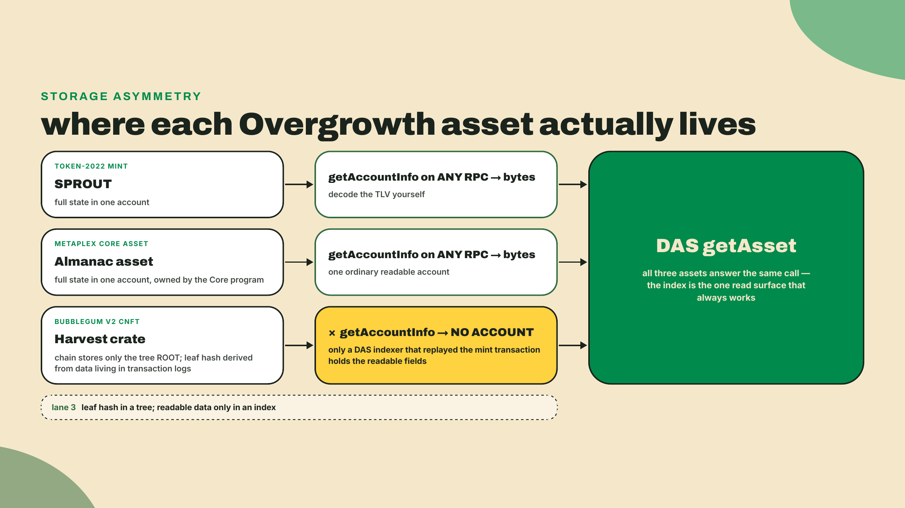
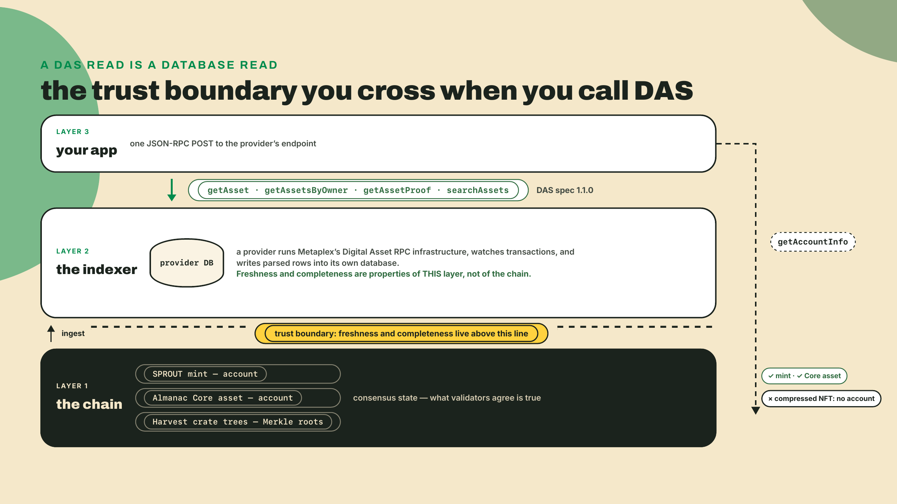
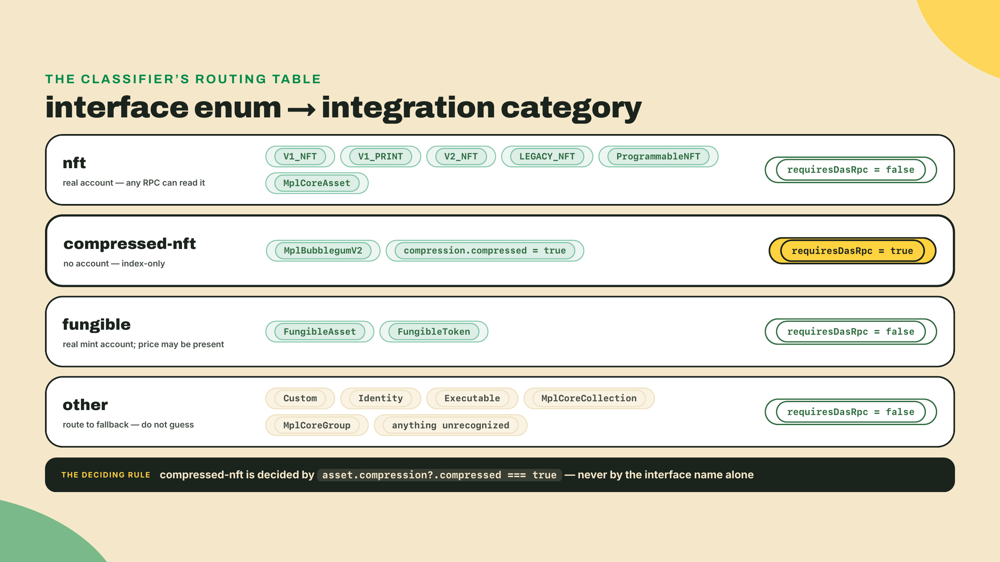
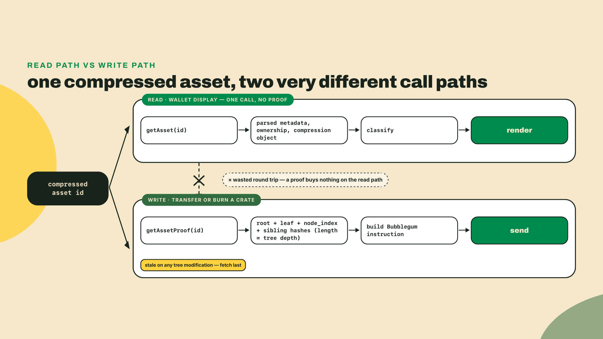
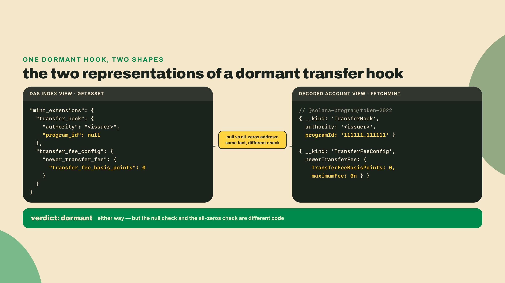
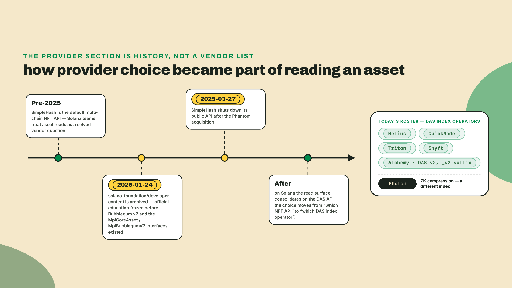
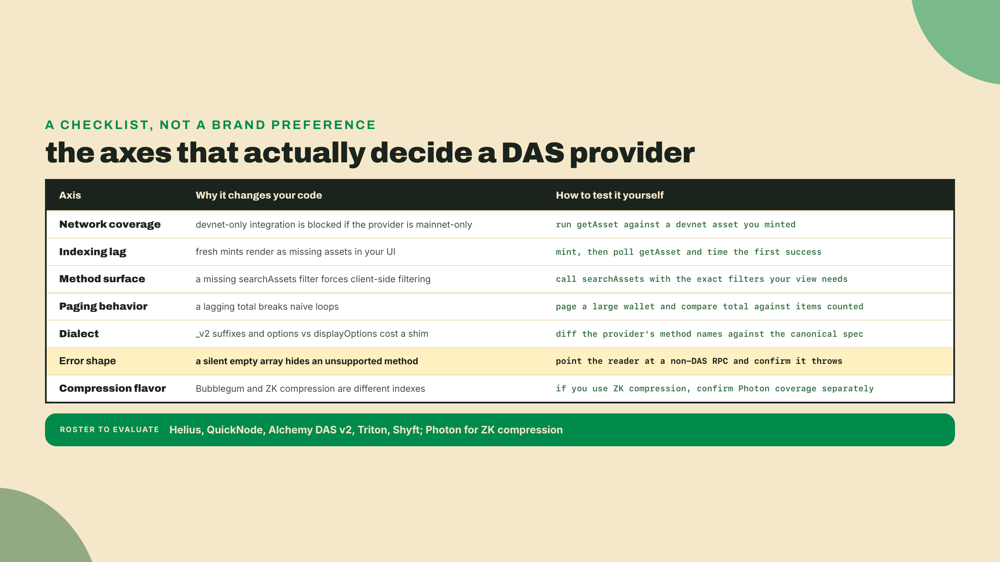
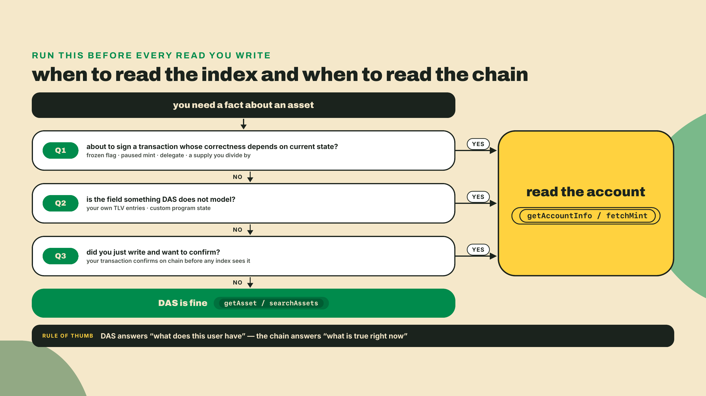
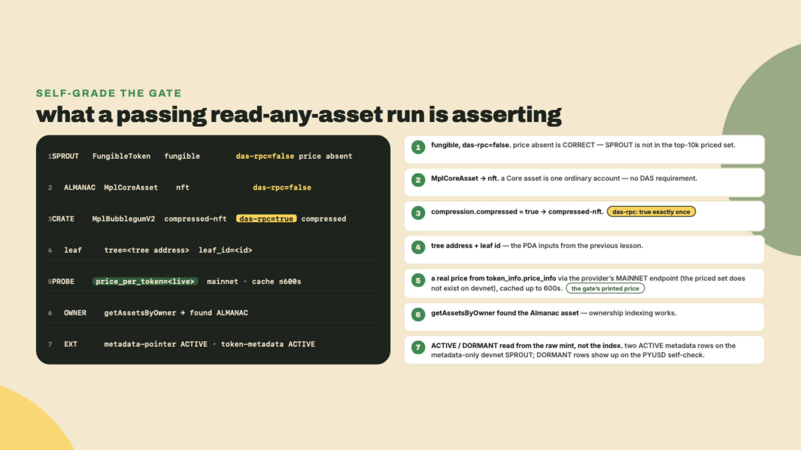
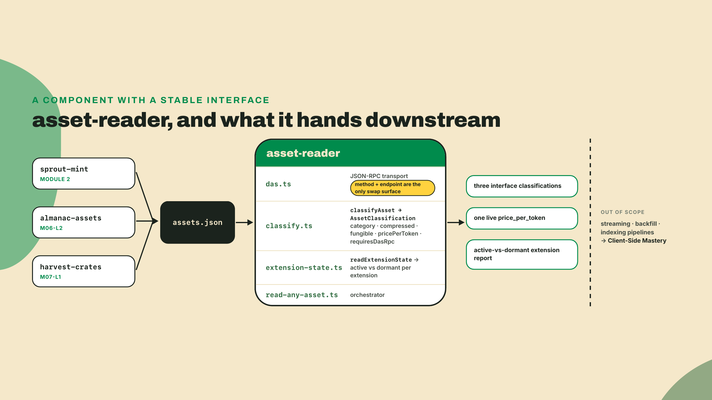

# Read anything: one DAS script for fungibles, Core assets, and cNFTs

## Summary

Last lesson you minted Harvest crates as Bubblegum v2 compressed NFTs and learned that a crate's asset id is a PDA derived from the tree address and the leaf index. Then you went to fetch one and got nothing, because a cNFT has no account of its own. You also still hold SPROUT, the Token-2022 mint you have been extending since module 2, and the Almanac Core assets you minted in m06-l2. Those two are ordinary accounts. Any RPC returns them.

So you are now holding three assets in three different shapes, and a wallet integration has to understand all three without caring which is which. Prove the asymmetry to yourself before we name the fix. In your course workspace:

```bash
mkdir -p overgrowth && cd overgrowth
npm install @solana/kit@7.1.1 @solana-program/token-2022@0.15.0
npm install -D tsx@4.23.12 typescript@5.9.3 @types/node@24
```

Pins, checked against npm on 2026-09-05. The kit `latest` tag is 8.2.0, but the number that decides the pin is the peer range, not the latest tag: `@solana-program/token-2022@0.15.0`, the current minor of this course's client, peers kit ^7.0.0 — the 0.16 line moved to ^8 — so kit is 7.1.1, the newest release inside that range. That train ships monthly. Run `npm view @solana-program/token-2022 peerDependencies` on the day you scaffold.

```typescript
// overgrowth/shape-check.ts - does this id have an account at all?
// Run (from inside overgrowth/): npx tsx shape-check.ts <sprout> <almanac> <crate>
import { createSolanaRpc, address } from '@solana/kit';

const rpc = createSolanaRpc(process.env.RPC_URL ?? 'https://api.devnet.solana.com');

async function main(): Promise<void> {
  for (const id of process.argv.slice(2)) {
    const { value } = await rpc.getAccountInfo(address(id), { encoding: 'base64' }).send();
    console.log(
      value === null
        ? `${id}  ->  NO ACCOUNT`
        : `${id}  ->  ${value.data[0].length} base64 chars, owner ${value.owner}`,
    );
  }
}

main().catch((err: unknown) => {
  console.error(err instanceof Error ? err.message : err);
  process.exit(1);
});
```

One cluster note before you run it: at this point SPROUT and your Almanac assets still live on the surfnet (the lab migrates both to devnet in about fifteen minutes), so point `RPC_URL` at your surfnet for this first run. The crate's verdict does not depend on the cluster: `NO ACCOUNT` prints for it against your surfnet, against devnet where it actually lives, against any RPC you will ever own.

Pass your three ids. SPROUT comes back owned by the Token-2022 program with a base64 blob you already know how to decode. The Almanac asset comes back owned by a program id starting with `CoRE`. The Harvest crate prints `NO ACCOUNT`, and the RPC is not lying to you. There is nothing there. The crate exists as a hash inside a Merkle tree and as a row in somebody's database.

That gap is what this lesson closes. The unifier is the Digital Asset Standard API, and by the end you will have `read-any-asset.ts`, one script that resolves all three through a single method, classifies each by its interface, prints a live price for a fungible, and flags which of a mint's extensions are actually doing something versus merely configured. The autonomy fade, stated plainly: the transport and the classifier are worked in full, the active-versus-dormant flagger is yours with two of its five cases shown, and the empty-creators gotcha is entirely solo. The classifier core is also this lesson's graded challenge, so build it carefully.

## One read surface for every shape

### The problem, stated once

Three storage models, one integration. Take them in order of how much of the asset lives on chain.

A fungible mint is an account. All of it. Supply, decimals, authorities, and every TLV extension you appended sit in bytes you can fetch and decode yourself, which is exactly what you did in m01-l2 when you wrote your own decoder and crosschecked it against the shipped client.

A Metaplex Core asset is also an account. One account, base fields plus plugins, as you saw when you minted the Almanac. Different owner program, same fetch-and-decode story.

A compressed NFT is not an account. The Bubblegum program hashes the asset's data into a leaf, and the tree's root is what the chain actually stores. Verifying a crate means replaying a Merkle proof against that root. Reading a crate means asking someone who was watching when the mint transaction landed and who wrote the leaf's contents down. That someone is an indexer.



### What DAS actually is

The Digital Asset Standard API, spec 1.1.0, is a JSON-RPC extension that a provider bolts onto a normal Solana RPC endpoint. Same URL, same POST body shape, different method names. Metaplex publishes the spec and the reference indexer; providers run it against their own infrastructure.

The methods you will use today are four:

- `getAsset`, one asset by id, returning parsed metadata, ownership, royalty, compression status, and for fungibles the token info.
- `getAssetsByOwner`, a paged list of everything a wallet holds, mixed types included.
- `getAssetProof`, the Merkle proof for a compressed asset, which you need for writes and not for reads.
- `searchAssets`, the same index queried by arbitrary criteria (owner, collection, interface, frozen, burnt).

There are more (`getAssetsByGroup`, `getAssetsByAuthority`, `getAssetsByCreator`, `getSignaturesForAsset`, `getNftEditions`, `getTokenAccounts`, and the batch variants), and you will meet two of them in the lab. But four cover the read surface of an entire wallet UI, which is the point.

Here is the honest framing, and it matters more than the method list. DAS is not the chain. DAS is a **rented index**: a database that some provider populated by watching the chain, and your read is only as fresh and as complete as that database. For SPROUT and the Almanac you have a choice, because the account is right there. For the Harvest crate you have no choice at all.



### The interface enum, walked

Every DAS response leads with an `interface` field, and that field is the router for your entire integration. The full set, verified against provider documentation on 2026-08-22:

| Interface | What it is |
|---|---|
| `V1_NFT` | Token Metadata non-fungible, the classic |
| `V1_PRINT` | an edition print off a master edition |
| `LEGACY_NFT` | pre-standard NFTs the indexer still has to serve |
| `V2_NFT` | the newer Token Metadata non-fungible shape |
| `ProgrammableNFT` | pNFT, enforcement through Token Auth Rules |
| `MplCoreAsset` | a Metaplex Core asset, one account, plugins inside |
| `MplCoreCollection` | a Core collection |
| `MplCoreGroup` | a Core group under MIP-11, the Metaplex Improvement Proposal that added grouping (you will meet these in the wild, not in this course) |
| `MplBubblegumV2` | a Bubblegum v2 compressed NFT |
| `FungibleAsset` | a fungible with metadata attached |
| `FungibleToken` | a plain fungible |
| `Custom`, `Identity`, `Executable` | escape hatches you route to a fallback |

Your Almanac asset arrives as `MplCoreAsset`. Your Harvest crate arrives as `MplBubblegumV2`. SPROUT arrives as `FungibleToken` or `FungibleAsset` depending on the provider's classification heuristics; the split is often described as metadata-linked, but in practice providers return `FungibleToken` for ordinary fungibles even when a name resolved fine (my own run printed `FungibleToken` and a resolved name on the same line), so treat the pair as one fungible category and never branch on which of the two you got.

Two things about this enum are worth pausing on, because both cost people time.

First, `MplCoreAsset` and `MplBubblegumV2` are recent additions. Alchemy's DAS v2 documentation lists them explicitly as what v2 adds over v1, which tells you the enum grew after a lot of integration code was written against the old shape. If you inherit a codebase whose asset switch has three cases, that is why.

Second, and this is the footgun: **`is_agent` is not an interface variant.** It is a nullable boolean field that rides along on `MplCoreAsset` rows when the asset carries an AgentIdentity external plugin, a newer Core plugin that marks an asset as an on-chain agent's identity, and providers omit the field entirely when it is false. Two sibling fields travel with it, `asset_signer` (the agent's signing address) and `agent_token` (its associated token); this course never mints an agent asset, but your reader will meet them in real wallets. Switch on `interface` for type. Read `is_agent` as an attribute. Treating it as a type is the kind of bug that works in every test you write and breaks on the first real agent asset a user holds.



Notice what the table says about `compressed-nft`. The interface name gets you close, but the field that actually decides is `compression.compressed`. Every DAS asset carries a `compression` object, and on a regular NFT it comes back with `compressed: false` and empty hash strings. Branch on the boolean, not on the name, and your classifier survives the next enum addition without an edit. That is the whole design instinct behind the challenge at the end of this lesson.

### DAS quietly became the price API

Somewhere along the way the asset API grew a second job. Call `getAsset` with the display option `showFungible` set to true and the response carries a `token_info` object: decimals, supply, the owning token program, mint and freeze authorities, and, when the mint qualifies, `price_info`.

`price_info.price_per_token` is a live USD number for a fungible, served by the same endpoint that just told you about a cNFT. No second vendor, no CoinGecko key, no mint-to-coin-id mapping table. It works for Token-2022 mints with extensions too, which is not obvious and is worth checking yourself.

Two limits belong right next to that capability, and both are in the provider docs rather than in anyone's blog post.

The price is **cached up to 600 seconds**. That is fine for a portfolio row and wrong for anything that settles value. If you are pricing a swap, you want an oracle, and the planned DeFi and RWA Engineering course teaches how to do that properly.

The price covers roughly the **top ten thousand tokens by 24-hour volume**. SPROUT is a course token on devnet. It will never be in that set, and neither will most of what your users hold. A missing `price_info` is not an error and it is not a misconfiguration on your side. Default it to null, render a dash, move on. Your reader will treat this as normal because you will write it that way in the lab.

### Proofs, search, and the paging you will actually write

Two of the four methods have not earned their keep yet, so let me spend them properly, because both come with a misconception attached.

`getAssetProof` looks like it belongs to reading. It does not. It returns the Merkle proof for a compressed asset: the tree id, the current root, the leaf hash, the node index, and an array of sibling hashes whose length is the tree depth. You need all of that to *write*, because a Bubblegum transfer or burn has to hand the program enough hashes to recompute the root and prove your leaf was in it. For displaying a crate in a wallet, `getAsset` already gave you everything, and fetching a proof you never use is a round trip you pay for nothing.

```typescript
// overgrowth/proof-check.ts - a cNFT's proof is a write-time artifact.
// Run (from inside overgrowth/): npx tsx proof-check.ts <crate-asset-id>
import { das } from './das';

interface AssetProof {
  root: string;
  proof: string[];
  node_index: number;
  leaf: string;
  tree_id: string;
}

async function main(): Promise<void> {
  const id = process.argv[2];
  if (!id) throw new Error('pass a compressed asset id');

  const proof = await das<AssetProof>('getAssetProof', { id });
  console.log(`tree      ${proof.tree_id}`);
  console.log(`root      ${proof.root}`);
  console.log(`leaf      ${proof.leaf}`);
  console.log(`siblings  ${proof.proof.length} (tree depth)`);
  console.log(`node      ${proof.node_index}`);
}

main().catch((err: unknown) => {
  console.error(err instanceof Error ? err.message : err);
  process.exit(1);
});
```

Run that against a Harvest crate and the sibling count is your tree's depth, the same depth you chose when you allocated the tree last lesson. And here is the part Metaplex puts in bold in its own docs: a proof goes stale the moment anyone else modifies the tree. Fetch it immediately before the write, never at page load, never from a cache. A stale proof does not corrupt anything; it just fails, and it fails in a way that looks like a mysterious transaction error rather than like a cache problem.

`searchAssets` is the other one, and it is the method a real wallet view is built on. It queries the same index by arbitrary criteria: owner, collection, creator, authority, interface, frozen, burnt, supply, with sorting and paging. One call replaces the four separate by-owner, by-collection, by-creator round trips you would otherwise stitch together.

```typescript
// overgrowth/search.ts - one query for a whole wallet view.
// Run (from inside overgrowth/): npx tsx search.ts <owner>
import { das } from './das';
import { classifyAsset, type DasAsset } from './classify';

interface Page<T> {
  total: number;
  limit: number;
  page: number;
  items: T[];
}

async function main(): Promise<void> {
  const owner = process.argv[2];
  if (!owner) throw new Error('pass an owner address');

  const counts = new Map<string, number>();
  for (let page = 1; ; page += 1) {
    const res = await das<Page<DasAsset>>('searchAssets', {
      ownerAddress: owner,
      burnt: false,
      page,
      limit: 1000,
      options: { showFungible: true },
    });
    for (const asset of res.items) {
      const key = classifyAsset(asset).category;
      counts.set(key, (counts.get(key) ?? 0) + 1);
    }
    if (res.items.length < res.limit) break;
  }
  for (const [category, n] of counts) console.log(`${category.padEnd(15)} ${n}`);
}

main().catch((err: unknown) => {
  console.error(err instanceof Error ? err.message : err);
  process.exit(1);
});
```

That loop is the paging shape to internalize. DAS pages are one-indexed, the page size is capped by the provider (1000 is the common ceiling), and the termination condition is a short page rather than a total you trust. I have seen `total` lag the items on a busy index, and a loop that trusts it either stops early or spins. A short page is a fact about the response in your hand.



### Configured is not the same as active

Here is where an index stops being enough, and it is the sharpest idea in this lesson.

DAS hands you a token's shape. It does not hand you the token's behavior. Those are different questions, and conflating them produces integrations that display confident nonsense.

Work it from first principles. An extension has two states that look identical in any "what extensions does this mint have" list: present and doing something, versus present and inert. A `TransferFeeConfig` with a rate of zero basis points and a maximum fee of zero is structurally there and economically absent. A `TransferHook` whose program id is the default all-zeros pubkey is a hook that calls nobody. A `PausableConfig` that is not paused is a loaded gun with the safety on. In each case the presence is a permission the issuer holds, and the live field is whether they have used it.

Why does that distinction matter to you specifically? Because presence tells your user what could happen and the live value tells them what will happen on their next transfer, and those two sentences belong in different parts of your UI. "This token can be paused by its issuer" is a risk disclosure. "This token is paused right now" is an error state.

The canonical worked example is PYUSD, and you have already read its mint once in this course. Its Token-2022 mint carries eight TLV extensions: mintCloseAuthority, permanentDelegate, transferFeeConfig, confidentialTransferMint, confidentialTransferFeeConfig, transferHook, metadataPointer, and tokenMetadata. Configured but dormant, as the issuer left them: the transfer hook's program id is null and the fee reads zero basis points with a maximum of zero. I re-read that mint on 2026-08-22 while writing this and got exactly those eight, exactly those two dormant values, which is the sort of claim you should re-run rather than take from me.

The mechanical detail that trips people: **DAS and the raw account disagree about how to say "unset."** A DAS response nulls out the transfer hook's program id. The generated Token-2022 client, decoding the same bytes, gives you the all-zeros system-program address, because that is literally what is in the account. Same fact, two representations. Your flagger has to know which one it is looking at, and in the lab you will read the raw mint for exactly this reason: the flagger is a chain read, not an index read.



### Choosing a provider is part of the read

Now the part nobody tells you until it bites: with cNFTs, your RPC choice is a correctness decision, not a performance one.

Point `getAsset` at a plain RPC and you do not get a slow answer or a partial answer. You get `-32601 Method not found`, or worse, a provider that swallows it into an empty result and lets your UI render a wallet with three of its five assets missing. Metaplex's own Bubblegum documentation says it flatly: not all RPC providers support the DAS API, check the providers page. Your reader should fail loudly on that error code, which is why the transport you write in step 2 special-cases it.

Which brings us to a piece of recent history that reshaped this whole decision.

For years the default answer to "how do I read NFTs across chains" was SimpleHash. It was the biggest multi-chain NFT API in the business, and then Phantom acquired it and shut the public API down on **March 27, 2025**. On Solana, the answer that absorbed the gap was DAS, which means the question stopped being "which NFT API" and became "which DAS provider". That is a genuinely different question: you are choosing an index operator, and index operators differ in freshness, in completeness, in how they page, and in what they name things.

The current roster worth evaluating: **Helius**, **QuickNode**, **Alchemy** (whose DAS v2 is its own thing, see below), **Triton**, and **Shyft**. For ZK compression, which is a different compression story than Bubblegum's, the index is **Photon**.

They are not drop-in interchangeable, and Alchemy's v2 is the cleanest illustration. Migrating to it requires suffixing every method name with `_v2` (`getAsset` becomes `getAsset_v2`), renaming three methods outright, renaming the response-shaping parameter object from `displayOptions` to `options`, changing how you read the proof-batch response because it comes back keyed by asset id instead of ordered, and handling a new `last_indexed_slot` field on every success. None of that is unreasonable. All of it is work you do not discover until you try to switch. Write your transport so the method name and the endpoint are the only things a swap touches, which is exactly what `das.ts` does in the lab.



That middle marker deserves a sentence of its own. `solana-foundation/developer-content`, the repository behind the official Solana courses, was archived on **2025-01-24**. Every official course therefore predates Bubblegum v2 and predates the interface values you are about to switch on. If you have been cross-checking this course against the official docs and finding gaps, that is the gap, and it is a date rather than a conspiracy.

So how do you actually pick one? Not by benchmark blog post. Evaluate on the axes that change your code or your incident reports, and evaluate them against your own assets, on your own cluster, this week.

Does the provider support DAS on the network you deploy to, devnet included? Several support mainnet only, and discovering that at devnet integration time is a bad afternoon. What is the indexing lag for a freshly minted compressed asset, measured by you, with a mint script and a stopwatch? Does it serve `searchAssets` with the filters your UI needs, or only the by-owner and by-collection subset? What is the page ceiling and does `total` behave? Is the method surface the canonical spec, or a dialect like the `_v2` suffix that costs you a shim? How does it price DAS calls against plain RPC calls, given that a wallet view is many small reads? And the one people skip: what happens on an error, a loud JSON-RPC error or a quiet empty array?

The last one deserves your paranoia. An index that answers "no assets" when it means "I do not implement this method" will pass every test you write and lie to your users in production. Test it deliberately: point your reader at a plain public RPC and confirm it throws.



### The trade-off, named

DAS gives you one read surface across four asset standards, plus prices, for the price of trusting somebody's database instead of chain state.

What you give up, concretely. Freshness is the indexer's, not the chain's, so a mint from four seconds ago may not be there yet. Completeness is the indexer's too, and reorgs and backfill gaps are real. Price data is cached to ten minutes and covers a top slice of tokens. And the whole thing is a read layer: it does not stream, it does not backfill, and it is not an indexing pipeline.

So when should you not use it? Three cases, and they are all cases where the index is strictly worse than the thing it copies. When you are about to sign a transaction whose correctness depends on current state, read the account: a frozen flag, a paused mint, a delegate, a supply you are about to divide by. When you need a field DAS does not model, read the account: your own TLV entries, custom program state, anything the indexer had no schema for. And when you have just written and want to confirm, read the account, because your own transaction is confirmed on chain before it is anywhere in a database. The rule of thumb that survives: DAS answers "what does this user have", the chain answers "what is true right now". Your reader used both today on purpose, DAS for the three assets and a direct `fetchMint` for the extension state, and that split is the design, not a shortcut.



That last clause about pipelines is a real boundary, not modesty. Building the pipeline (Geyser plugins, Yellowstone gRPC, webhook ingestion, replaying history into your own store) is a serious discipline and it belongs to the planned Client-Side Mastery course, which treats DAS as one rented index inside a much larger data discipline. This lesson is consumption. You are the client of an index, and your job is to be a well-behaved one: fail loudly on a missing method, default missing prices to null, and never assume the index knows something the chain has not confirmed.

## Lab: build read-any-asset.ts

One prerequisite that will otherwise cost you an hour. **No indexer is watching your surfnet.** Last lesson already moved the crates to devnet behind a DAS endpoint for exactly this reason; every lab before that one ran happily against a local validator, and none of them can serve this lesson, because DAS is an index and nobody is indexing a cluster that exists only on your laptop. So the crate is already where it needs to be, and so is the Almanac: last lesson's `getOrCreateAlmanac` created a devnet Overgrowth Almanac collection, recorded it in `crates.json`, and minted the crates into it. That collection is what "the Almanac" means for the rest of the course. Do NOT re-run the m06-l2 surfnet collection script against devnet; that would mint a second, different Almanac and leave your crate outside it.

What devnet still lacks is two things, budget fifteen minutes. First, an Almanac Core ASSET to read: mint one into the existing devnet collection with a small variant of m06-l2's `mint-almanac.ts` that swaps its connection for the `getUmi()` helper from last lesson (same `DAS_RPC_URL`, same funded `wallet.json`) and reads the collection address from `crates.json` instead of `almanac.json`. Second, SPROUT: re-run `labs/m02-l4/add-metadata.ts` down its own documented devnet fallback, `RPC_URL=https://api.devnet.solana.com WS_URL=wss://api.devnet.solana.com`, funding the payer from the faucet when the airdrop call rate-limits. Be clear about what that recreates, so the flagger's output does not confuse you later: the devnet SPROUT from this script is the metadata-only reference build, carrying exactly MetadataPointer and TokenMetadata, no fee config, no display extension. Your flagger will print two ACTIVE rows for it and nothing else, and that is correct; the DORMANT fee and hook rows in this lesson's samples come from pointing the extension-state block at PYUSD, which is the step-5 self-check. Devnet addresses will differ from your surfnet ones; that is fine, step 1 records the new ones.

Three endpoints from here on, and keep them straight, because they are not interchangeable. `DAS_RPC_URL` is the DAS-supporting devnet endpoint you exported last lesson, the index. `RPC_URL` is a plain devnet RPC, and it is what the raw-account reads in step 4 use. And `MAINNET_DAS_RPC_URL` is the same DAS provider's MAINNET endpoint (most providers serve both networks on one key), used exactly once, for the price probe, because the priced set is a mainnet, volume-ranked slice that no devnet index can answer for:

```bash
export DAS_RPC_URL="https://<your-das-devnet-endpoint>"
export RPC_URL="https://api.devnet.solana.com"
export MAINNET_DAS_RPC_URL="https://<your-das-mainnet-endpoint>"
```

Run every command in this lab from inside `overgrowth/`, the same convention as last lesson, so relative paths like `assets.json` and `wallet.json` resolve.

**1. Write down what you own.** Your reader takes its inputs from a small file so that later lessons and your own scripts can share one source of truth. One continuity note before you fill it in: if you completed m07-l1's challenge as written, the ordinary Harvest crate was transferred to a throwaway signer, so your lab wallet no longer holds it. Use the soulbound achievement crate's asset id for the `crate` field (it cannot have left your wallet), or mint a fresh ordinary crate; either keeps all three assets under one `owner`, which is what the `getAssetsByOwner` step needs. Create `overgrowth/assets.json` with the four addresses:

```json
{
  "sprout": "<your SPROUT mint>",
  "almanac": "<an Almanac Core asset>",
  "crate": "<a Harvest crate asset id: the achievement crate, or a fresh mint (see note above)>",
  "owner": "<the wallet holding all three>"
}
```

**2. One transport, every method.** Every DAS call is the same POST with a different method string, so write it once. The error handling is the interesting part and the reason this is not a one-liner:

```typescript
// overgrowth/das.ts - one JSON-RPC transport for every DAS method.

const DAS_RPC_URL = process.env.DAS_RPC_URL ?? '';

export interface DasError {
  code: number;
  message: string;
}

export async function das<T>(
  method: string,
  params: unknown,
  endpoint: string = DAS_RPC_URL,
): Promise<T> {
  if (!endpoint) {
    throw new Error('DAS endpoint is unset. Point DAS_RPC_URL at a DAS-supporting endpoint.');
  }
  const res = await fetch(endpoint, {
    method: 'POST',
    headers: { 'content-type': 'application/json' },
    body: JSON.stringify({ jsonrpc: '2.0', id: 'overgrowth', method, params }),
  });
  if (!res.ok) {
    throw new Error(`${method}: HTTP ${res.status} ${res.statusText}`);
  }
  const body = (await res.json()) as { result?: T; error?: DasError };
  if (body.error) {
    const hint =
      body.error.code === -32601
        ? ' (method not found: this endpoint does not implement DAS)'
        : '';
    throw new Error(`${method}: ${body.error.code} ${body.error.message}${hint}`);
  }
  if (body.result === undefined) {
    throw new Error(`${method}: empty result`);
  }
  return body.result;
}
```

The `-32601` branch is the one that saves your evening. JSON-RPC's standard "method not found" code is what a non-DAS endpoint answers with, and without that hint you will spend twenty minutes suspecting your asset id. The method name is a parameter and the endpoint is an environment variable, which is your entire migration surface if you ever move providers.

**3. The classifier.** This is the routing core, and it is also the graded challenge, so read it as a specification you are about to be tested on rather than as code to paste:

```typescript
// overgrowth/classify.ts - route one DAS asset to a category, without a second RPC call.

export interface DasAsset {
  interface: string;
  compression?: { compressed?: boolean };
  token_info?: { price_info?: { price_per_token?: number } };
}

export interface AssetClassification {
  category: 'compressed-nft' | 'nft' | 'fungible' | 'other';
  compressed: boolean;
  fungible: boolean;
  pricePerToken: number | null;
  requiresDasRpc: boolean;
}

const NFT_INTERFACES = new Set<string>([
  'V1_NFT',
  'V1_PRINT',
  'V2_NFT',
  'LEGACY_NFT',
  'ProgrammableNFT',
  'MplCoreAsset',
  'MplBubblegumV2',
]);

const FUNGIBLE_INTERFACES = new Set<string>(['FungibleAsset', 'FungibleToken']);

export function classifyAsset(asset: DasAsset): AssetClassification {
  const compressed = asset.compression?.compressed === true;
  const fungible = FUNGIBLE_INTERFACES.has(asset.interface);
  const isNft = NFT_INTERFACES.has(asset.interface);
  const pricePerToken = asset.token_info?.price_info?.price_per_token ?? null;

  let category: AssetClassification['category'] = 'other';
  if (fungible) {
    category = 'fungible';
  } else if (isNft) {
    category = compressed ? 'compressed-nft' : 'nft';
  }

  return { category, compressed, fungible, pricePerToken, requiresDasRpc: compressed };
}
```

Three decisions in twenty lines. `MplBubblegumV2` sits in the NFT set rather than getting its own branch, because compression is orthogonal to being an NFT and the boolean already carries it. Unknown interfaces fall to `other` instead of throwing, because a reader that crashes on an enum value added last Tuesday is a reader that ships one outage per Metaplex release. And `requiresDasRpc` tracks `compressed` rather than the interface, for the same reason: it is a statement about storage, not about standard.

**4. Resolve all three.** Now the payoff, one method for three shapes:

```typescript
// overgrowth/read-any-asset.ts - one reader for every Overgrowth asset.
// Run (from inside overgrowth/): npx tsx read-any-asset.ts
import { readFileSync } from 'node:fs';
import { createSolanaRpc, address } from '@solana/kit';
import { fetchMint } from '@solana-program/token-2022';
import { das } from './das';
import { classifyAsset, type DasAsset } from './classify';
import { readExtensionState } from './extension-state';

// PYUSD: a MAINNET Token-2022 mint inside the priced set, used as the price
// probe. The probe must ask a mainnet DAS endpoint: a devnet index has never
// heard of this mint, and no devnet token has the 24h volume the priced set ranks by.
const PRICE_PROBE = '2b1kV6DkPAnxd5ixfnxCpjxmKwqjjaYmCZfHsFu24GXo';
const MAINNET_DAS = process.env.MAINNET_DAS_RPC_URL ?? '';

interface AssetBook {
  sprout: string;
  almanac: string;
  crate: string;
  owner: string;
}

interface FullAsset extends DasAsset {
  id: string;
  content?: { metadata?: { name?: string } };
  ownership?: { owner?: string };
  compression?: { compressed?: boolean; tree?: string; leaf_id?: number };
  token_info?: {
    decimals?: number;
    token_program?: string;
    price_info?: { price_per_token?: number; currency?: string };
  };
}

function loadBook(): AssetBook {
  try {
    return JSON.parse(readFileSync('assets.json', 'utf8')) as AssetBook;
  } catch {
    throw new Error(
      'assets.json not found. Write it with sprout, almanac, crate and owner addresses (and run from inside overgrowth/).',
    );
  }
}

function getAsset(id: string, showFungible = false): Promise<FullAsset> {
  return das<FullAsset>('getAsset', { id, options: { showFungible } });
}

function line(label: string, asset: FullAsset): string {
  const c = classifyAsset(asset);
  const name = asset.content?.metadata?.name ?? '(unnamed)';
  const price = c.pricePerToken === null ? 'no price_info' : `$${c.pricePerToken}`;
  return [
    `${label.padEnd(9)} ${asset.interface.padEnd(16)} ${c.category.padEnd(15)}`,
    `das-rpc=${c.requiresDasRpc}`,
    `price=${price}`,
    `name=${name}`,
  ].join('  ');
}

async function main(): Promise<void> {
  const book = loadBook();

  const sprout = await getAsset(book.sprout, true);
  const almanac = await getAsset(book.almanac);
  const crate = await getAsset(book.crate);
  console.log(line('SPROUT', sprout));
  console.log(line('ALMANAC', almanac));
  console.log(line('CRATE', crate));

  if (classifyAsset(crate).compressed) {
    console.log(`  crate leaf: tree=${crate.compression?.tree} leaf_id=${crate.compression?.leaf_id}`);
  }

  if (!MAINNET_DAS) {
    throw new Error('MAINNET_DAS_RPC_URL is unset; the price probe needs a mainnet DAS endpoint.');
  }
  const probe = await das<FullAsset>(
    'getAsset',
    { id: PRICE_PROBE, options: { showFungible: true } },
    MAINNET_DAS,
  );
  const probePrice = classifyAsset(probe).pricePerToken;
  console.log(`PROBE     price_per_token=${probePrice ?? 'null'} (mainnet read, cached up to ~600s)`);

  const owned = await das<{ total: number; items: FullAsset[] }>('getAssetsByOwner', {
    ownerAddress: book.owner,
    page: 1,
    limit: 50,
  });
  const almanacSeen = owned.items.some((item) => item.id === book.almanac);
  console.log(`OWNER     ${owned.total} assets, almanac present=${almanacSeen}`);

  const rpc = createSolanaRpc(process.env.RPC_URL ?? 'https://api.devnet.solana.com');
  const mint = await fetchMint(rpc, address(book.sprout));
  const extensions =
    mint.data.extensions.__option === 'Some' ? mint.data.extensions.value : [];
  for (const state of readExtensionState(extensions)) {
    console.log(`  ${state.active ? 'ACTIVE ' : 'DORMANT'} ${state.kind.padEnd(22)} ${state.detail}`);
  }
}

main().catch((err: unknown) => {
  console.error(err instanceof Error ? err.message : err);
  process.exit(1);
});
```

Do not run it yet: the `./extension-state` import points at the file you write in step 5, so the first successful run belongs to step 7.

Read the `options` object in `getAsset` before you move on, because it is a portability seam. Helius documents that parameter as `options`. Alchemy's v1 called it `displayOptions` and renamed it to `options` in v2. Older SDK wrappers still emit the old name. If a provider silently ignores your `showFungible` and you get no `token_info` back, that name is the first thing to check.

The `PRICE_PROBE` line needs its own honest word, because it hides another footgun. SPROUT is a devnet course token, so it will resolve, classify as fungible, and come back with **no price**, because the priced set is roughly the top ten thousand tokens by 24-hour volume. That is the normal case, and your line renders `no price_info` rather than crashing. The probe against PYUSD is there so you see a populated `price_info` at least once with your own eyes, on a Token-2022 mint with extensions, from your provider's mainnet endpoint, because the priced set is a mainnet phenomenon and the mint itself only exists there. When SPROUT eventually trades somewhere with real volume, the same call fills in and you change nothing.

**5. The flagger, mostly yours.** Two cases are worked, three are your fill:

```typescript
// overgrowth/extension-state.ts - configured is not the same as active.
import { AccountState, type Extension } from '@solana-program/token-2022';

const NULL_ADDRESS = '11111111111111111111111111111111';

export interface ExtensionState {
  kind: string;
  active: boolean;
  detail: string;
}

export function readExtensionState(extensions: readonly Extension[]): ExtensionState[] {
  return extensions.map((ext): ExtensionState => {
    switch (ext.__kind) {
      case 'TransferFeeConfig': {
        const bps = ext.newerTransferFee.transferFeeBasisPoints;
        const max = ext.newerTransferFee.maximumFee;
        return { kind: ext.__kind, active: bps > 0 && max > 0n, detail: `${bps} bps, max ${max}` };
      }
      case 'TransferHook':
        return {
          kind: ext.__kind,
          active: ext.programId !== NULL_ADDRESS,
          detail: `programId ${ext.programId}`,
        };
      // YOUR FILL: PausableConfig (ext.paused), DefaultAccountState
      // (ext.state === AccountState.Frozen), ScaledUiAmountConfig (ext.multiplier !== 1).
      default:
        return { kind: ext.__kind, active: true, detail: 'presence is the behavior' };
    }
  });
}
```

The default branch is a design choice, not laziness. For `PermanentDelegate`, `MintCloseAuthority`, `MetadataPointer`, and friends, presence is the behavior: there is no second field that turns them on, and reporting them as active is the honest answer. Your three fills are the ones with a live toggle. Point the finished script at PYUSD's mint instead of SPROUT for a minute and you should see eight extensions with `TransferFeeConfig` and `TransferHook` marked `DORMANT`. That is a good self-check, because it is the same result I got on 2026-08-22. One honesty note on your three fills: neither your devnet SPROUT nor PYUSD carries Pausable, DefaultAccountState, or ScaledUiAmountConfig, so no live mint in this lab exercises them. Prove them the cheap way instead: feed the flagger hand-built extension objects in a scratch test, flip `paused`, `state`, and `multiplier`, and watch the verdicts change. A fill only ever run against extensions that never occur is a fill you have not proven.

**6. The empty-creators gotcha, fully solo.** Reach for `getAssetsByCreator` on a pump.fun mint and you will get zero results for a token that visibly exists and trades all day. The temptation is to blame the index, retry, or wait out a cache. All wrong. **pump.fun does not populate the Metaplex creators array**, so a creator-keyed query has nothing to match. The practitioner fix is to key on the update authority instead, or to subscribe to the program directly.

Reproduce it, then fix it. Here is the diagnostic; wiring the outcome into your reader is yours:

```typescript
// overgrowth/creators-probe.ts - why a creator query comes back empty.
// Run (from inside overgrowth/): npx tsx creators-probe.ts <mint>
import { das } from './das';

interface Page {
  total: number;
  items: { id: string; interface: string }[];
}

async function main(): Promise<void> {
  const mint = process.argv[2];
  if (!mint) throw new Error('pass a mint address');

  const asset = await das<{
    creators?: { address: string; verified: boolean }[];
    authorities?: { address: string; scopes: string[] }[];
  }>('getAsset', { id: mint });

  const creators = asset.creators ?? [];
  const authority = asset.authorities?.[0]?.address;
  console.log(`creators: ${creators.length}`);
  console.log(`authority: ${authority ?? 'none'}`);

  if (creators[0]) {
    const byCreator = await das<Page>('getAssetsByCreator', {
      creatorAddress: creators[0].address,
      page: 1,
      limit: 10,
    });
    console.log(`getAssetsByCreator -> ${byCreator.total}`);
  }
  if (authority) {
    const byAuthority = await das<Page>('getAssetsByAuthority', {
      authorityAddress: authority,
      page: 1,
      limit: 10,
    });
    console.log(`getAssetsByAuthority -> ${byAuthority.total}`);
  }
}

main().catch((err: unknown) => {
  console.error(err instanceof Error ? err.message : err);
  process.exit(1);
});
```

Run it against a pump mint and `creators: 0` prints before any query runs, which is the whole diagnosis in one line. Run it against your Almanac asset and the creators array is populated, because you minted it through a standard that fills the field. Generalize the lesson rather than the workaround: before you build a feature on a DAS query key, check that the assets you care about actually populate that key. Creators, collections, and authorities are all optional in practice, whatever the schema implies.

**7. Ship it.** `npx tsx read-any-asset.ts` should now print three classification lines, a crate leaf reference, a populated price from the probe, an owner count with your Almanac asset present, and the extension state block. Shape of a passing run, with your own addresses and values in place of the placeholders:

```text
SPROUT    FungibleToken    fungible         das-rpc=false  price=no price_info  name=SPROUT
ALMANAC   MplCoreAsset     nft              das-rpc=false  price=no price_info  name=Almanac Vol. 1
CRATE     MplBubblegumV2   compressed-nft   das-rpc=true   price=no price_info  name=Harvest Crate
  crate leaf: tree=<your tree> leaf_id=<n>
PROBE     price_per_token=<live number> (mainnet read, cached up to ~600s)
OWNER     <n> assets, almanac present=true
  ACTIVE  MetadataPointer        presence is the behavior
  ACTIVE  TokenMetadata          presence is the behavior
```

(Those two ACTIVE rows are the whole block for the metadata-only devnet SPROUT. The `DORMANT TransferFeeConfig 0 bps, max 0` and `DORMANT TransferHook` rows appear when you aim the same block at PYUSD, the step-5 self-check.)

Read that block as a set of assertions rather than as decoration. The `das-rpc` column is true exactly once. The category column has three different values. The probe line has a number in it. If any of those three statements is false, the gate is not met, whatever the script exits with.



Wire `search.ts` into the same workspace while you are here. It is not part of the gate, but a per-category count over a whole wallet is the query a real integration opens with, and running it against your own owner address is the fastest way to see whether your provider's paging behaves the way the loop assumes.



## Challenge

`classify-das-asset`. The logic is exactly step 3, but the grader's calling convention is flatter than your workspace module: it invokes `classifyAsset(iface, detailsJson)`, where `iface` is the DAS `interface` string and `detailsJson` is the rest of the `getAsset` response serialized as a JSON string. `JSON.parse` that string first thing, then route precisely as above; the same three decisions, the same `AssetClassification` out. Make the starter's failing cases pass.

The tests hit the corners that matter in production rather than the happy path. An `MplBubblegumV2` asset with `compression.compressed` true has to come back as `compressed-nft` with `requiresDasRpc` true. An `MplCoreAsset` has to come back as `nft` with `requiresDasRpc` false, because a Core asset is an ordinary account and no index is required to read it. A `FungibleToken` carrying `token_info.price_info.price_per_token` has to surface that number, and a fungible without price info has to return null rather than zero, undefined, or a thrown error. Zero is a price. Null is an absence. Rendering an absence as a price is how a portfolio UI tells a user their holdings are worthless.

The hints in the challenge give you the interface sets, the compression check, and the price path. If you wrote step 3 yourself you have already solved it; if you pasted step 3, write it again from the type signature and see whether the three decisions come back to you.

## Checkpoint

The gate: `npx tsx read-any-asset.ts` resolves and correctly classifies all three assets, and prints a `price_per_token`. Three lines, three categories, one number. Say the answer out loud before you move on, because it is the thing this lesson exists to install: `FungibleToken` or `FungibleAsset` for SPROUT, `MplCoreAsset` for the Almanac, `MplBubblegumV2` for the Harvest crate, and only the last one needed a DAS-supporting endpoint to exist at all.

The misses I expect, in the order they happen. If every call dies with `-32601 (method not found)`, your `DAS_RPC_URL` is a plain RPC and no amount of retrying will change that; get a DAS endpoint. If the crate returns an asset id but the fields are empty, the indexer has not caught up with a mint you sent seconds ago, which is the freshness trade-off arriving in person: wait, then re-run. If `token_info` is missing entirely on SPROUT, you dropped `showFungible`, or your provider wants that flag under `displayOptions`. And if `getAssetsByOwner` returns your Almanac asset but not your crate, check the owner field on the crate rather than the query, because a compressed NFT's owner is a leaf attribute and transferring one rewrites the leaf. The usual way students land here is exactly the m07-l1 challenge: the ordinary crate was transferred to a throwaway signer there, which is why step 1 told you to record the achievement crate or a fresh mint instead.

The first of those misses prints exactly like this, straight out of the `das.ts` error path you wrote in step 2:

```text
getAsset: -32601 Method not found (method not found: this endpoint does not implement DAS)
```

One deliverable that is not code, and I mean this literally: write down which provider you used and which axis decided it. A sentence in your README is enough. "Chose X because it serves DAS on devnet and indexed a fresh crate in under N seconds, measured on this date." Six months from now, when an incident makes you reconsider, that sentence is the difference between re-running one test and re-running the whole evaluation. It also forces you to have actually measured something rather than picked the provider whose docs page loaded first, which is, honestly, how most of these decisions get made. I have made it that way. The measurement takes twenty minutes and it is the only part of provider choice that is yours rather than marketing's.

One habit to carry out of here, worth more than the script: treat every DAS field as optional until you have watched it populate for the assets you actually care about. `price_info` on a small token, `creators` on a pump mint, `is_agent` on anything that is not a Core asset. The schema is a promise about shape. Only a live read is a promise about content.

You can now read every asset you have built in this course through one call, classify it without a second lookup, and tell a user the difference between a token that can be paused and a token that is paused. Every one of those assets, though, is either a real account or a leaf in somebody's tree. Next lesson pushes on that with a sharper question: what if a fungible token itself had no account, what would that even mean for balances and transfers, and when would you actually want that? Bring the flagger. You are going to need the habit of asking what is really there.
