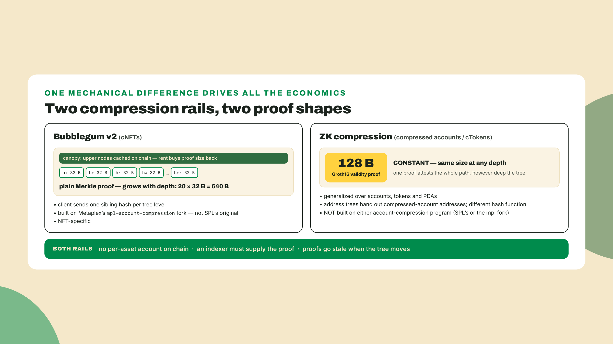
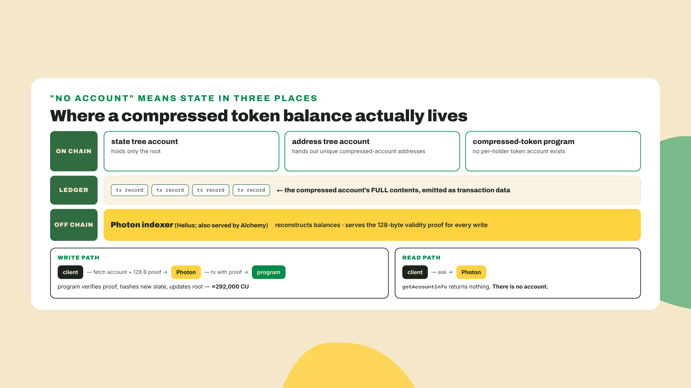
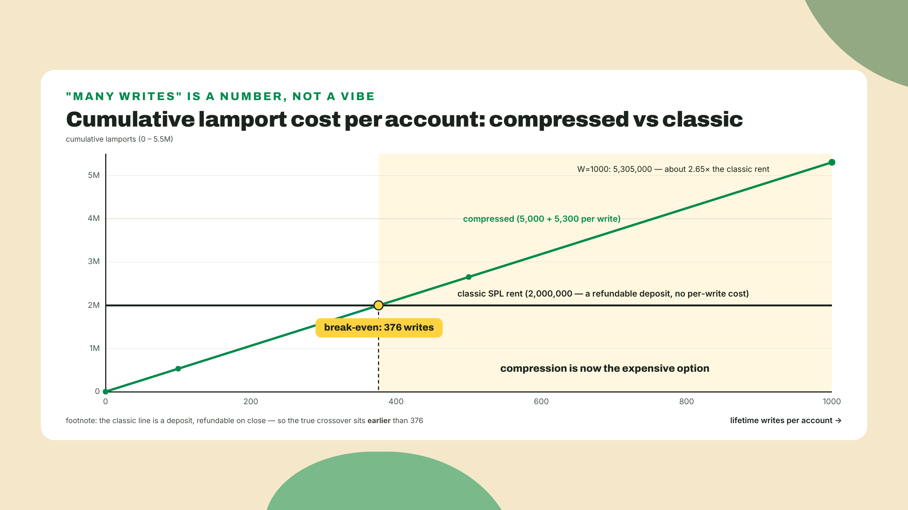
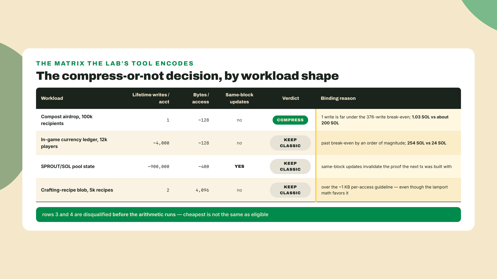
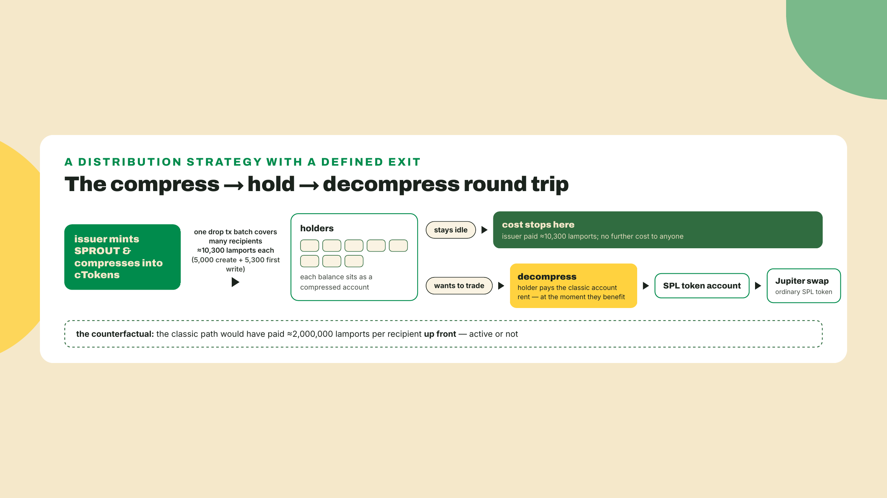
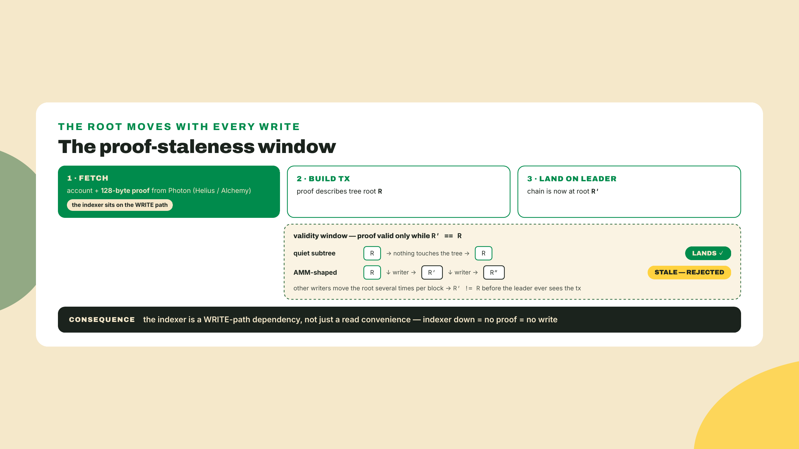
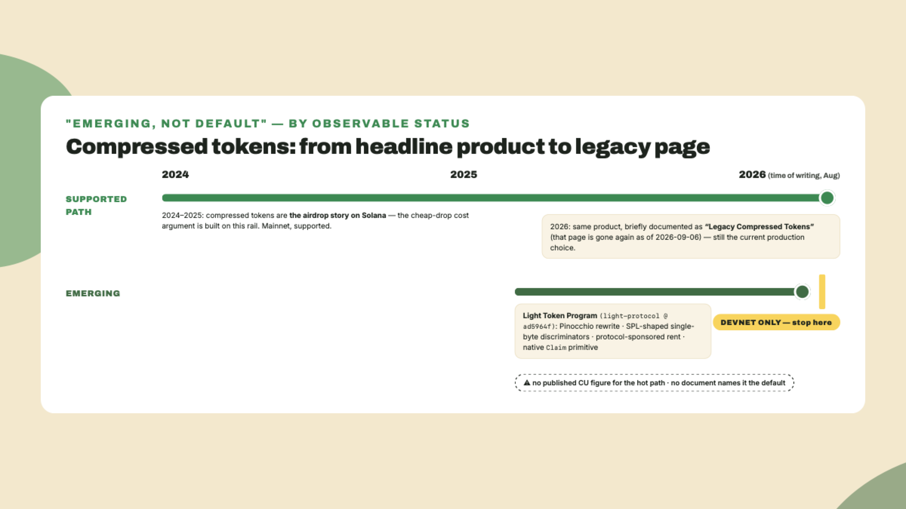
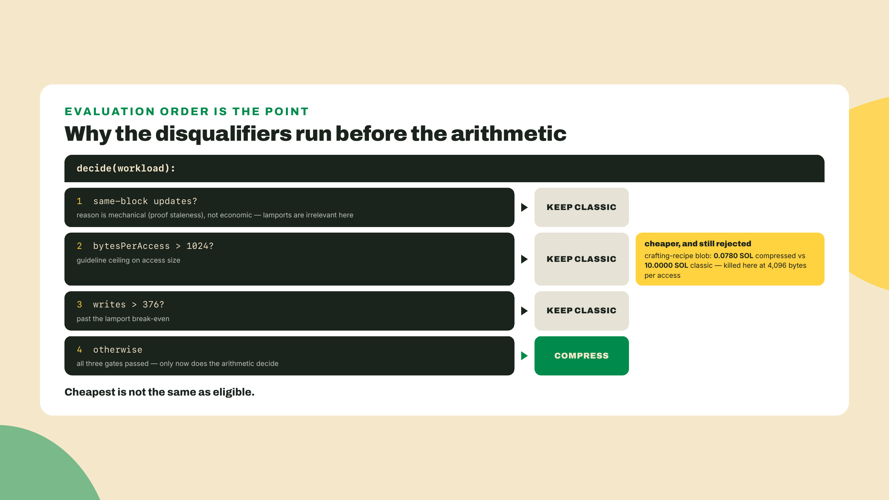

# When not to compress: ZK compression, cTokens, and the Light Token frontier

## Summary

Last lesson you pointed `read-any-asset.ts` at everything Overgrowth owns and it came back with the whole shelf: the SPROUT mint, the Almanac assets, and a Harvest-crate cNFT that has no account anywhere on chain. That read had to go through a DAS RPC, because there was nothing to `getAccountInfo`. You have already paid compression's read tax once, knowingly.

Which sets up the thought I want to kill today. If a million NFTs fit in one tree for pocket change, why not put SPROUT balances in a tree too? Why does anybody still lock up two million lamports of rent per token account?

The answer is arithmetic, and you can run it before you read another paragraph:

```bash
node -e "console.log('break-even:', Math.floor((2_000_000 - 5_000) / 5_300), 'lifetime writes')"
```

`break-even: 376 lifetime writes`. Two names before the arithmetic, since both are new: Light Protocol is the team behind ZK compression, the second compression rail this lesson introduces (accounts proven rather than stored, the fungible cousin of Bubblegum's trick), and its current program generation is called V2, Light's own V2, nothing to do with Bubblegum v2. The number compares a compressed token account on that rail (5,000 lamports to create, about 5,300 lamports of state cost per transfer) against a classic SPL token account (about 2,000,000 lamports of rent, and nothing per transfer). Write that account 376 times and compression has spent everything the classic account merely locked up. Write it 4,000 times and you have burned ten times the rent you were trying to avoid.

That is the whole lesson in one line, and the rest of it is why the line is true, where it comes from, and what the second half of the bill (compute, not lamports) does to the picture. This is a reasoning lesson, not a build lesson. You will not compress a token today; you will decide whether to.

The autonomy fade, stated plainly: the cost model and the first three workload verdicts are worked in full, the two disqualifier rules you write yourself, and the fourth workload plus the write-up are entirely solo. What you take away is a small tool, `compression-verdict.ts`, and a defensible answer to a question a teammate will ask you for real.

## The second rail

### The question the tree left open

Module 7 has been one long argument that storing per-asset state in accounts is a choice, not a law. Bubblegum v2 proved it for NFTs: a million Harvest crates, one tree, one on-chain root, and the crates themselves living as hashed leaves that an indexer reconstructs on demand. The cost collapse there is real and you measured it.

So the natural question, the one a sharp reader asks the moment the cNFT mint succeeds, is why the trick is NFT-shaped. Nothing in "hash the state, keep the root, prove membership when you need to write" cares whether the state is an NFT's metadata or a token balance or an arbitrary PDA. If the trick generalizes, the whole account model is negotiable.

It does generalize. That is what ZK compression is. But it generalizes through a different mechanism than the one you just used, and the difference in mechanism is exactly where the economics turn.

### Two proofs, two shapes

Start with the proof, because everything else falls out of it.

A Bubblegum cNFT write is a plain Merkle proof. To transfer a leaf you hand the program the sibling hashes along the path from your leaf up to the root, and the program rehashes its way up and checks it landed on the root it already stores. The proof's size is the tree's depth. Depth 20, to pick a common size, means 20 sibling hashes at 32 bytes each, so 640 bytes of proof riding in your transaction before anything else does. That is why the canopy exists: cache the top levels of the tree on chain, and the client only sends the bottom part of the path. You buy shorter client proofs with rent, level by level.

ZK compression does not send the path. It sends a validity proof: a Groth16 proof, 128 bytes, that asserts the state you claim is in the tree without walking anything. Constant. A shallow tree and a deep tree produce the same 128 bytes, because a succinct proof is a statement about a computation, not a transcript of it.

Compare it to paperwork. The Merkle proof is the full chain of receipts, and a longer history means a thicker folder. The validity proof is a notarized statement that the folder checks out, and the notary's stamp is the same size for a folder of ten pages or ten thousand. Where the analogy breaks, and it matters: the notary here is a prover, off chain, and somebody has to run it and hand you the stamp per transaction. Constant size is not the same thing as free.



### What a compressed account actually is

Now the definition, just in time.

A compressed account holds the same things a regular Solana account holds: an owner program, a lamport balance, a data blob, an address. What it does not hold is a slot in the validator's account database. Its hash lives as a leaf in a state tree, the tree's root lives in one on-chain account, and the account's actual contents live in the ledger, reconstructed by an indexer. Addresses come from address trees, which exist so that a compressed account can have a stable, unique, derivable address rather than being identified only by its position in a tree.

A cToken is that machinery applied to a token balance: a compressed account whose data is a token account layout, owned by the compressed-token program.

The part people skip, and the part that makes the two rails genuinely different systems rather than two settings of one system: ZK compression is not built on account compression in either flavor, not SPL's original and not the mpl fork Bubblegum v2 runs on. Different program, different tree machinery, different hash function than the one Bubblegum's trees use. Knowing Bubblegum does not mean you know this. It means you have the intuition and none of the interfaces.



### The bill, itemized

Two numbers sell compression and one number should stop you.

Creating a compressed token account costs about 5,000 lamports. Creating a classic SPL token account costs about 2,000,000 lamports of rent. That ratio, roughly 400x, is the entire reason anyone airdrops with compression, and module 8's drop lesson turns it into a per-recipient table you will actually budget against.

Then the third number. A compressed token transfer runs about 292,000 CU. Proof verification and tree hashing are not free, and you pay them per write. Set that beside the classic transfer you met in m01-l3, where the p-token engine took the Transfer instruction to 76 CU. Same user-visible action, roughly 3,800 times the compute.

Itemize it as a bill, per account, over a lifetime of W writes:

| Path | Creation | Per write (lamports) | Per write (CU) |
|---|---|---|---|
| Classic SPL token account | ~2,000,000 rent (a refundable deposit) | 0 | 76 |
| Compressed token account | ~5,000 | ~5,300 (V2 state cost) | ~292,000 |

Set the two lamport columns equal and you get the number the one-liner printed: 5,000 + 5,300W crosses 2,000,000 at W = 376. Under 376 lifetime writes, compression is cheaper in lamports. Over it, compression is more expensive, and the gap widens forever after, because one side has a per-write term and the other does not.

There is a sharper version of that argument. The classic account's 2,000,000 lamports is rent, and rent is a deposit: close the account and you get it back. The compressed account's 5,300 lamports per write is spent. So the honest break-even is earlier than 376, and the reason to still quote 376 is that most people never close their token accounts and so never feel the refund. The guidance you will see quoted in the ecosystem is roughly a thousand lifetime writes as the line where compression stops paying. Our arithmetic crosses well before that. Treat a thousand as a generous ceiling, not a target.



### The naive answers, ruled out in tiers

With the bill on the table, walk the obvious positions and watch each one fail.

**"Compress everything."** Fails on the CU column alone. Any account written more than a few hundred times pays more lamports and roughly 3,800 times the compute, forever. It also fails on a constraint the table does not show: every write needs a fresh proof from an indexer, so you have converted an offline-capable, self-contained transaction into one with a live third-party dependency in its build path.

**"Compress nothing, rent is cheap."** Fails at scale. Two million lamports is nothing for one account and 200 SOL for a hundred thousand of them. A drop that costs 200 SOL classic costs about 1.03 SOL compressed, and that is the difference between shipping a distribution and cancelling it.

**"Just use Bubblegum for the tokens too."** Tempting after last module, and it does not work, for a reason worth stating precisely rather than waving at. Bubblegum's trees are NFT-shaped: a leaf is an asset with an owner, and the program's instructions are mint, transfer, burn, delegate. A token balance is not an asset, it is a number that gets added to and subtracted from, and there is no leaf schema in that program for "increase this by 40". You would be rebuilding the compressed-token program inside a compressed-NFT program. Which is roughly what ZK compression is, except done properly and generalized to any account, not just token balances.

**"Compress, then decompress whenever it gets hot."** This one is closest to right, which makes it the dangerous one. Decompression is real and supported, and you will use it. It fails as a general policy because you cannot predict which accounts get hot, and the accounts that get hot are usually hot from the start: the pool, the treasury, the game's shared ledger. A policy that requires you to correctly guess future write frequency per account is not a policy.

Which narrows the question usefully. Not "is compression good" but: **for this specific account, over its expected life, how many times will it be written, and how big is each access?** Those two variables decide it, and neither of them is "how many holders do you have". Holder count is what people reach for, and it is the wrong axis entirely. A tree scales to holders happily. It is writes per holder that kills you.

### The three shapes that lose

From those two variables, three concrete failure shapes:

**Write-heavy accounts.** Anything far past that few-hundred to one-thousand lifetime-write band. An in-game currency ledger that debits on every craft. A points balance that ticks on every action. These are the accounts whose whole job is to be written, and compression prices writes.

**Same-block repeated updates.** This is worse than expensive, it is mechanically hostile. An AMM pool's state is updated many times within a single block, and every update invalidates the proof that the next transaction was built with. You are not paying more for the same behavior, you are fighting a race you cannot win. Pool state stays a regular account. Not "should", cannot sensibly.

**Large accesses.** Past roughly 1 KB per access, the read and hashing cost of moving that blob through the compression machinery stops being worth the rent you saved. Big blobs want a plain account, or they want to not be on chain at all.

And the shape that wins, stated as clearly: state created once, written once or twice, held by an enormous number of distinct owners. Airdrops. Distributions. Claim rights. One-shot artifacts. Which is exactly the shape of the compost drop Overgrowth runs in module 8 (a mass distribution of compost points to every player, its first appearance here as a preview), and exactly why that module uses this rail rather than paying 200 SOL to create token accounts for people who may never touch them.



### Decompression is a door

None of this makes compressed tokens a roach motel. Decompression is first class: a compressed token balance can be turned back into a regular SPL token account, and that is the standard move the moment a holder wants to do something the wider ecosystem understands. Swapping on Jupiter is the canonical example. The router does not know about your compressed account, so you decompress, then you route.

Read the round trip as a design pattern rather than an escape hatch. Cheap distribution to many wallets, most of which stay idle, and the minority who act pay a one-time decompression to enter normal token life. The cost lands on the users who actually showed up instead of on you at drop time, per recipient, in advance. That reallocation is the point of the whole rail.



### Photon, and the read tax you already know

Last lesson named this tax for reads, at length: DAS is a rented index, with its own trust boundary. Here is the write-path version of the same law, and it generalizes across both compression rails: if the state is not in an account, somebody has to reconstruct it, and that somebody is an indexer you do not run.

For cNFTs that indexer speaks DAS. For ZK compression it is Photon, built by Helius and also served by Alchemy. Photon is where you fetch a compressed account, and Photon is where you fetch the 128-byte validity proof each write needs. Same dependency shape, different interface, and no, your DAS provider choice does not automatically carry over.

Provider plumbing at scale, backfills, gRPC firehoses, running your own index, that is the planned Client-Side Mastery course's territory and it treats it properly. What belongs here is the design consequence: choosing compression means choosing an indexer dependency in your write path, not just your read path. A Bubblegum transfer needs a proof. A cToken transfer needs a proof. If the indexer is down, you are not writing.

And that dependency has a clock on it, which is where the same-block disqualifier comes from mechanically rather than as a rule I asked you to memorize. A proof is a statement about a particular tree root. Any write that touches the tree moves the root, and every proof fetched against the previous root is now describing a tree that no longer exists. In the common case this is a non-issue, because you fetch, build, and land inside a window where nothing else touched your subtree. In the AMM case it is fatal, because the account is being written several times per block by people who are not you, and your proof was stale before your transaction reached the leader. The lamport arithmetic never gets a chance to matter there. Notice that this is the same failure Bubblegum's changelog buffer absorbs but does not remove (the canopy only shortens proofs on the wire; the buffer is the concurrency knob, per m07-l1), which is why concurrent-write pressure is a property of the compression family as a whole and not of one implementation.



### The Light Token Program: a direction, not a default

Now the frontier, and the part where I need you to hold a line.

Light Protocol is rebuilding its own headline product. Compressed tokens were the 2024 and 2025 airdrop darling, the thing everyone pointed at when arguing that Solana distribution could be cheap. A successor called the Light Token Program is growing up beside it.

A freshness note you should read before the rest of this section, because it is the section most likely to be stale by the time you get here. When this lesson was drafted, zkcompression.com filed the existing product under a page titled "Legacy Compressed Tokens", and that framing is where the section's shape came from. Re-probing the docs on 2026-09-06: that page 404s, the sitemap's 67 URLs contain no "legacy" or "light-token" entry at all, and llms.txt does not mention either. The docs now present `compressed-tokens` plainly, with no legacy label and no successor page beside it. I do not know whether that means the successor was folded in, renamed, or shelved, and I am not going to guess. What follows is what those pages said when I read them; treat every status claim in it as dated, and go read the site yourself before you repeat any of it.

The successor is genuinely interesting. It is a Pinocchio rewrite, so it inherits the same zero-copy, no-framework-overhead posture that took classic SPL Token's transfer to 76 CU. It uses SPL-shaped single-byte discriminators rather than eight-byte ones, which is a small decision with a real consequence: instruction data that looks like SPL Token's makes integration a matter of pointing at a different program rather than learning a different protocol.

The other two choices read like direct answers to complaints this lesson has been making. Protocol-sponsored rent moves the account cost off the user, which attacks the awkward middle of the round trip you just mapped, where a recipient who wants to act has to fund their own exit. And a native `Claim` primitive matters because "claim your drop" is the single most common thing anyone does with compressed tokens, and every existing drop bolts a separate distributor program on top to do it. Both are the right instincts. Neither is a reason to move production money today.

Here is the line, as the docs drew it at the time of that read: the Light Token Program ran on Solana devnet only, not mainnet, and no document positioned it as the replacement for the supported compressed-token path. It is an emerging rail, worth watching, worth prototyping against, and not the thing you ship Overgrowth's currency on this quarter.

And here is the durable half, which survives the docs moving under both of us. The claim that decides your architecture is "is this rail supported on the cluster I ship on," and that claim has an owner: the protocol's docs and its own program deployments, not a teammate, not a blog post, and not this page. Go and check it, note the date beside what you find, and if a teammate tells you the default flipped, ask them for the same two things. A status claim without a source and a date is a rumour, however confidently it is delivered.

One more thing, and this is a confession rather than a fact. An early draft of this lesson carried a compute-unit figure for the Light Token hot path. It came from my memory, it read beautifully, and it did not survive review, because it appears in no published source. There is no published CU number for that path. Do not quote one, not from me, not from a blog post, not from an assistant that sounds confident. On a program this young, a number with no source is a number someone made up.



### The trade-off, named

Compression flips the cost model. It does not repeal physics.

You trade roughly 400x cheaper account creation for far higher per-write compute, plus a proof the client must fetch and keep fresh, plus a live indexer dependency in the write path. For one-shot distribution to many owners, that trade is overwhelmingly good. For write-heavy state, large state, or state touched repeatedly inside a single block, the same trade inverts and takes your economics with it.

The newest rail buys elegance at the cost of being devnet-only today. That is also a trade, and today it is not one you make with production money.

## Lab: build the verdict tool

You will encode the reasoning above as a small program, because a verdict you can rerun on a new workload is worth more than a verdict you remember. No network, no SDK, no wallet. Just the cost model, four workloads, and honest output.

1. **Set up.** One directory, one dev dependency, no Solana packages at all.

    ```bash
    mkdir -p labs/m07-l3 && cd labs/m07-l3
    npm init -y
    npm install -D tsx@^4.20.0 typescript@^5.9.0
    ```

    Pins checked against npm the week of writing (2026-08); re-check before you pin anything long-lived. `tsx` runs a TypeScript file directly, which is all we need here.

2. **The cost model (worked in full).** Every constant in this file is a frozen figure from the research behind this course, and the two derived values fall straight out of them. Nothing here is a guess.

    ```typescript
    // labs/m07-l3/model.ts

    /** Lamports to create one compressed token account. */
    export const COMPRESSED_CREATE_LAMPORTS = 5_000;
    /** Lamports of state cost per compressed transfer (Light's V2 program line). */
    export const COMPRESSED_WRITE_LAMPORTS = 5_300;
    /** Rent locked by one classic SPL token account. Refundable on close. */
    export const CLASSIC_RENT_LAMPORTS = 2_000_000;
    /** Compute units for one compressed token transfer: proof verification + hashing. */
    export const COMPRESSED_TRANSFER_CU = 292_000;
    /** Compute units for a classic Transfer on the p-token engine (see m01-l3). */
    export const CLASSIC_TRANSFER_CU = 76;
    /** Guideline ceiling on bytes touched per compressed-account access. */
    export const MAX_ACCESS_BYTES = 1_024;

    /**
     * Highest lifetime write count at which the compressed path is still cheaper
     * in lamports than one classic account's rent.
     */
    export const BREAK_EVEN_WRITES = Math.floor(
      (CLASSIC_RENT_LAMPORTS - COMPRESSED_CREATE_LAMPORTS) / COMPRESSED_WRITE_LAMPORTS,
    );

    export function compressedLamports(writes: number): number {
      return COMPRESSED_CREATE_LAMPORTS + COMPRESSED_WRITE_LAMPORTS * writes;
    }

    export function classicLamports(): number {
      return CLASSIC_RENT_LAMPORTS;
    }

    export function sol(lamports: number): string {
      return `${(lamports / 1e9).toFixed(4)} SOL`;
    }
    ```

3. **The verdict function (you fill two gaps).** The shape is given; the two disqualifier rules are yours. Write them before you look at step 4.

    ```typescript
    // labs/m07-l3/verdict.ts
    import {
      BREAK_EVEN_WRITES,
      MAX_ACCESS_BYTES,
      classicLamports,
      compressedLamports,
    } from "./model";

    export interface Workload {
      name: string;
      accounts: number;
      lifetimeWritesPerAccount: number;
      bytesPerAccess: number;
      sameBlockUpdates: boolean;
    }

    export interface Verdict {
      workload: string;
      compress: boolean;
      reason: string;
      compressedTotalLamports: number;
      classicTotalLamports: number;
    }

    export function decide(w: Workload): Verdict {
      const compressedTotalLamports = w.accounts * compressedLamports(w.lifetimeWritesPerAccount);
      const classicTotalLamports = w.accounts * classicLamports();
      const base = { workload: w.name, compressedTotalLamports, classicTotalLamports };

      // TODO(you): disqualifier 1. Same-block repeated updates lose regardless of
      // lamports, because each update invalidates the proof the next transaction was
      // built with. Return { ...base, compress: false, reason: ... }.

      // TODO(you): disqualifier 2. Accesses above MAX_ACCESS_BYTES lose even when the
      // lamport math favours compression. Mention the actual byte count in the reason.

      const plural = w.lifetimeWritesPerAccount === 1 ? "" : "s";
      if (w.lifetimeWritesPerAccount > BREAK_EVEN_WRITES) {
        return {
          ...base,
          compress: false,
          reason: `${w.lifetimeWritesPerAccount} lifetime write${plural} per account is past the ${BREAK_EVEN_WRITES}-write break-even`,
        };
      }
      return {
        ...base,
        compress: true,
        reason: `${w.lifetimeWritesPerAccount} lifetime write${plural} per account is under the ${BREAK_EVEN_WRITES}-write break-even`,
      };
    }
    ```

    Order matters here, and it is the one design decision in the file. Both disqualifiers run before the arithmetic, because a workload can be cheaper on lamports and still be the wrong shape. Row 4 of the decision table is exactly that case.



4. **The fills.** These are the answer key for step 3's two TODOs, and on a rendered page nothing physically stands between the prompt and this block, so the gate is behavioral and it is yours: if you scrolled here without writing your two rules first, go back, write them, then diff. The lesson only knows what your hands did. Disqualifier 1:

    ```typescript
    if (w.sameBlockUpdates) {
      return {
        ...base,
        compress: false,
        reason: "same-block repeated updates: each update invalidates the next transaction's proof",
      };
    }
    ```

    Disqualifier 2:

    ```typescript
    if (w.bytesPerAccess > MAX_ACCESS_BYTES) {
      return {
        ...base,
        compress: false,
        reason: `${w.bytesPerAccess} bytes per access is over the ${MAX_ACCESS_BYTES}-byte guideline`,
      };
    }
    ```

    If you wrote the size gate as a soft penalty instead of a hard reject, you were not wrong about reality, only about this tool. The 1 KB line is a steep gradient rather than a cliff, and I encoded it as a gate so the tool gives one answer rather than a shrug. Say so in your write-up if you disagree, that is a legitimate position to hold and defend.

5. **The workloads (run it).** Three of Overgrowth's four are worked; you add the fourth in the challenge.

    ```typescript
    // labs/m07-l3/run.ts
    import { COMPRESSED_TRANSFER_CU, CLASSIC_TRANSFER_CU, sol } from "./model";
    import { decide, type Workload } from "./verdict";

    const workloads: Workload[] = [
      {
        name: "compost-drop (100k recipients)",
        accounts: 100_000,
        lifetimeWritesPerAccount: 1,
        bytesPerAccess: 128,
        sameBlockUpdates: false,
      },
      {
        name: "currency-ledger (12k players)",
        accounts: 12_000,
        lifetimeWritesPerAccount: 4_000,
        bytesPerAccess: 128,
        sameBlockUpdates: false,
      },
      {
        name: "sprout-sol-pool-state",
        accounts: 1,
        lifetimeWritesPerAccount: 900_000,
        bytesPerAccess: 400,
        sameBlockUpdates: true,
      },
    ];

    for (const w of workloads) {
      const v = decide(w);
      console.log(v.workload);
      console.log(`  verdict: ${v.compress ? "COMPRESS" : "KEEP CLASSIC"}`);
      console.log(`  reason: ${v.reason}`);
      console.log(`  compressed: ${sol(v.compressedTotalLamports)}   classic: ${sol(v.classicTotalLamports)}`);
    }

    console.log(`\ncompute ratio per transfer: ${Math.round(COMPRESSED_TRANSFER_CU / CLASSIC_TRANSFER_CU)}x`);
    ```

    `npx tsx run.ts` prints:

    ```text
    compost-drop (100k recipients)
      verdict: COMPRESS
      reason: 1 lifetime write per account is under the 376-write break-even
      compressed: 1.0300 SOL   classic: 200.0000 SOL
    currency-ledger (12k players)
      verdict: KEEP CLASSIC
      reason: 4000 lifetime writes per account is past the 376-write break-even
      compressed: 254.4600 SOL   classic: 24.0000 SOL
    sprout-sol-pool-state
      verdict: KEEP CLASSIC
      reason: same-block repeated updates: each update invalidates the next transaction's proof
      compressed: 4.7700 SOL   classic: 0.0020 SOL

    compute ratio per transfer: 3842x
    ```

    Look hard at the middle row. Twelve thousand players, and the compressed version of their currency ledger costs about ten times the classic version. That is the same mechanism that makes row one a 194x saving, run in the other direction. One number, two signs, and write frequency is the only thing that changed.

6. **Sanity-check the drop row against the next module.** Your compost-drop row says about 10,300 lamports per recipient. Module 8's airdrop lesson budgets roughly 10,300 compressed against a classic figure it derives rather than quotes: (128 + 165) bytes at your cluster's per-byte rent rate, which was 6,333 on mainnet on 2026-09-06 and gives 1,855,569. This lesson used a round 2,000,000 constant for the same thing, which was a slight UNDER-estimate at the old 6,960 rate and is a slight over-estimate now. Your number should agree exactly on the compressed side, because compressed cost is not rent and did not move, and sit within about 10% on the classic side. If the compressed side disagrees, you changed a constant.

## Challenge

Solo. Add the fourth workload and write the memo.

Add `crafting-recipe-blob` to `run.ts`: 5,000 accounts, 2 lifetime writes each, 4,096 bytes per access, no same-block updates. Before you run it, write down which verdict you expect and why. Then run it and check whether your reason matches the tool's reason, not just the verdict. Getting the right answer for the wrong reason is the failure mode this lesson exists to prevent.

Then the memo, and this is the assessed part. Someone on your team proposes moving Overgrowth's in-game currency onto compressed token accounts to save on rent, and adds that you should ship it on the Light Token Program because that is the new default. Write them six sentences: the compress-or-not verdict with the write-frequency reason and a number from your own tool run, the one workload in Overgrowth that genuinely should compress, and the accurate status of the Light Token Program.

Accepted when the memo names write frequency (not holder count) as the binding constraint, cites a figure your tool actually printed, and states the Light Token Program's status **with the source and date you read it on** rather than repeating this lesson's. My read said emerging and devnet-only; the page it came from has since gone, which is exactly why the deliverable is a sourced sentence and not a memorised one. A memo that says "devnet-only, per this URL, read on this date" is right whatever the answer turns out to be. If your memo contains a compute-unit figure for the Light Token hot path, delete it, whatever your source told you.

## Checkpoint

The gate is `npx tsx run.ts` printing four workloads with one COMPRESS and three KEEP CLASSIC, plus a memo you would actually send.

The one-sentence answer you should be able to give with the terminal closed: compression trades roughly 400x cheaper account creation for a per-write cost in both lamports and compute, so it wins for state created once and held by many, and loses for state that gets written, which means write frequency and access size decide it, never holder count.

The misses I expect. First, the holder-count trap: if your memo argues from the number of players, reread the decision table, because a tree does not care how wide it is. Second, the row-four surprise: the crafting-recipe blob is cheaper compressed and still gets rejected, and if that felt like a bug in the tool rather than a lesson about gates, sit with it again. Third, the confident CU number, which is the one I actually worry about, because it is the mistake I nearly made in writing this and the one an assistant will happily make on your behalf.

Enough reasoning about compressed tokens. Next module you actually use one: the airdrop lesson opens with a ten-minute warm-up that compresses a single token and reads it back through Photon, your first hands-on contact with a cToken, before it builds Overgrowth's compost drop on top of the exact per-recipient arithmetic you just encoded. The tool you wrote today is what tells you the drop is the right place to spend it.
