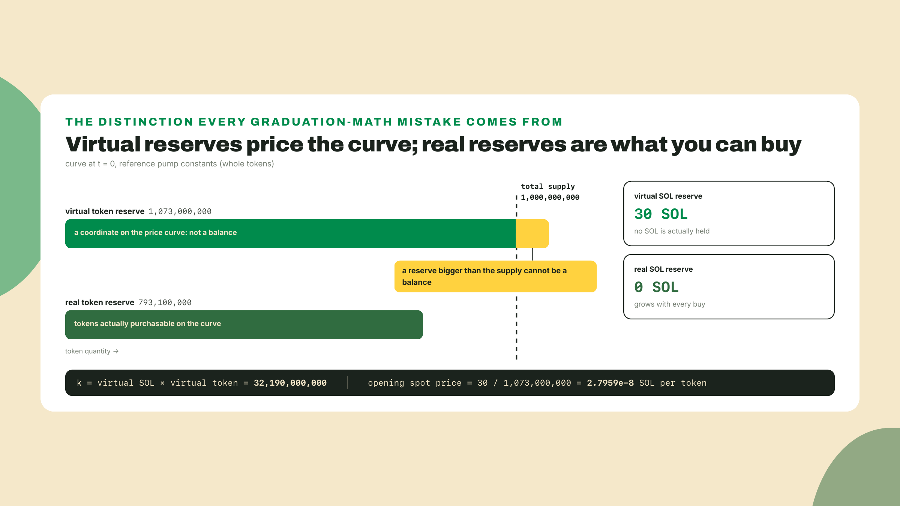
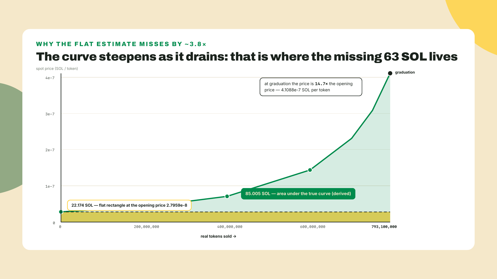
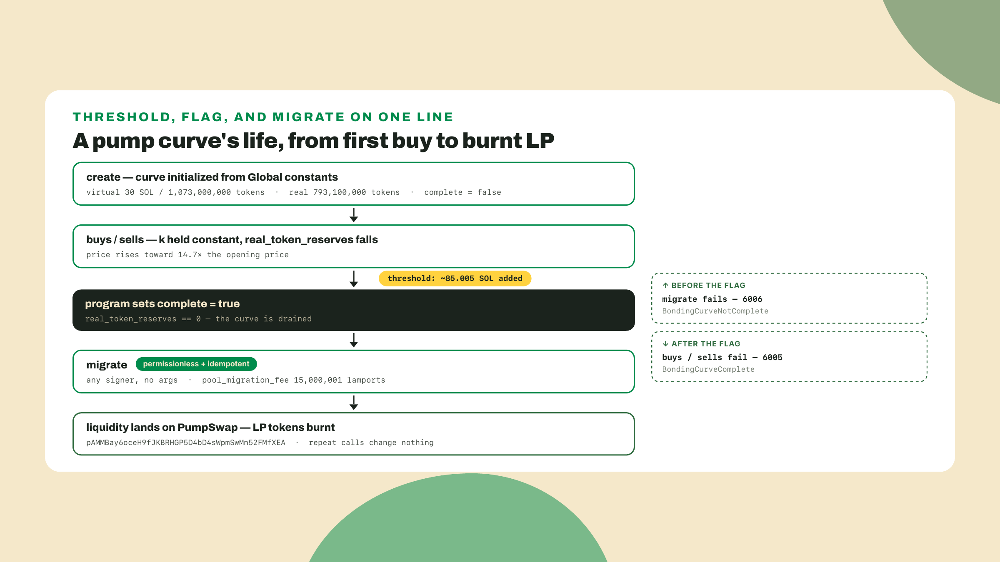
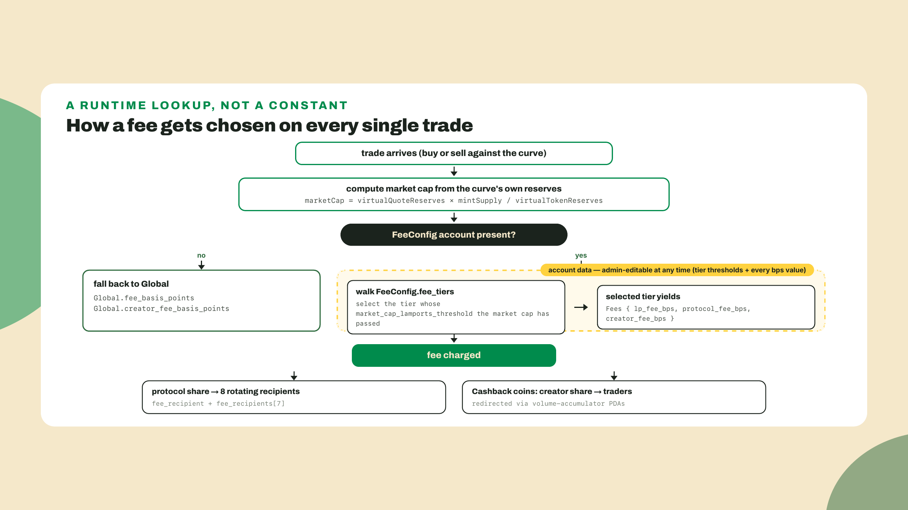
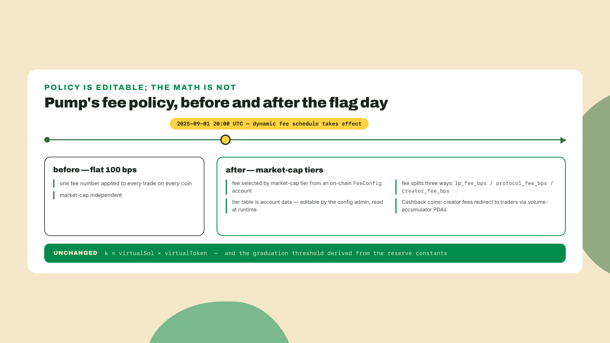
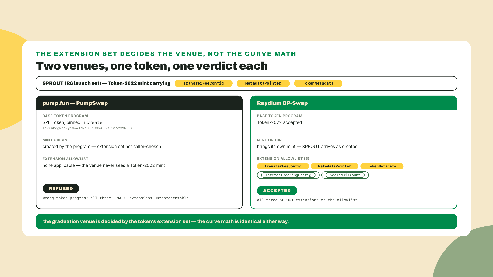
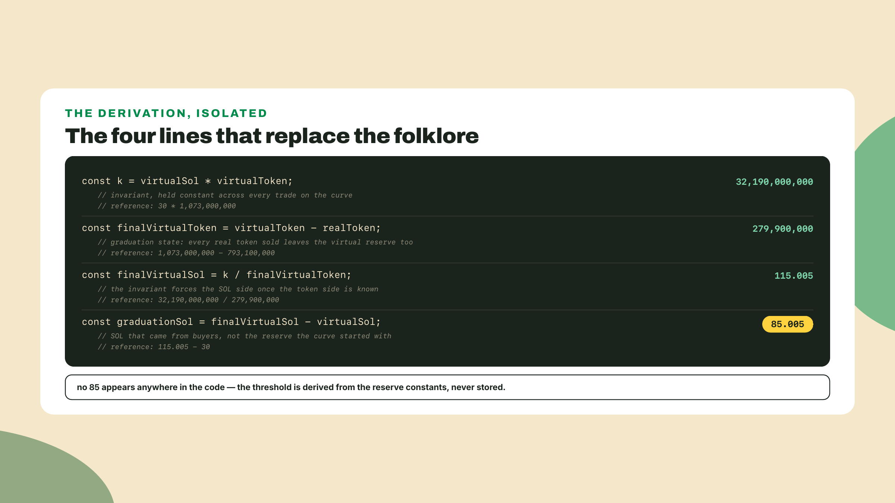
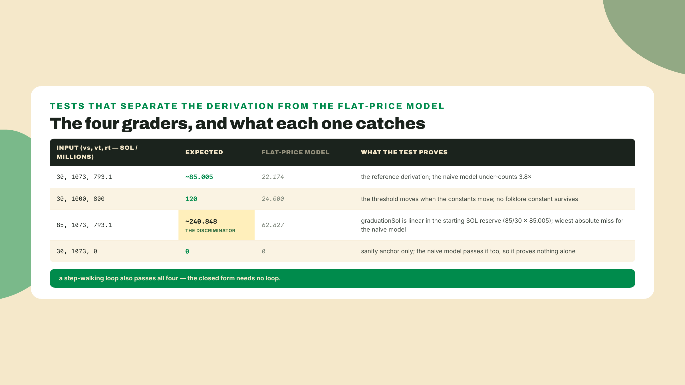

# Bonding curves and graduation: pump.fun from four constants

## Summary

Module 7 closed on compression as a concept, a 128-byte validity proof and a 5,000-lamport account, and promised that you would soon put a compressed token to work. Before that, a decision you cannot postpone: how SPROUT enters the world. You have the mint from R3 and you have the routability report from R6, which tells you exactly which extensions keep SPROUT tradeable and which get it refused at the door. This lesson takes the most repeated number in Solana launch culture, the 85 SOL that "graduates" a pump.fun coin, and refuses to repeat it. You will derive it instead, from pump's published constants and one invariant (three of the four constants do the deriving; the fourth, total supply, only prices a remainder aside), and then build the launch config that computes it live and picks SPROUT's graduation venue by asking whether that venue can even hold the token you built. The fade is steep here: the derivation is worked in full in the overview, the lab makes you write the invariant line on paper before it shows you the listing, and the challenge hands you `graduationSol` with nothing but the constants and a test file. By the end you will have a tool that recomputes a threshold for any curve, which matters more than the number, because the number belongs to somebody else's program and can change on a Tuesday.

Start with the answer, in one line. Open a terminal anywhere with Node on it:

```bash
node -e 'const vs=30,vt=1073e6,rt=793.1e6;console.log((vs*vt/(vt-rt)-vs).toFixed(3),"SOL")'
```

```
85.005 SOL
```

Three numbers in, the folklore constant out. `vs` is the curve's virtual SOL reserve, `vt` its virtual token reserve, `rt` the real tokens it will sell you. Nothing in that line reads a chain, and nothing in it contains an 85. The rest of this lesson is about why those three inputs and that one expression are the whole story, what each of them is actually doing, and what it means for your token that the story belongs to a program you do not control.

## Where 85 SOL actually comes from

### The number nobody stores

Every launch thread, every explainer video, every "how pump works" thread repeats the same shape: your coin trades on a curve until roughly 85 SOL of buying pressure has come in, then it graduates to a real AMM. Stated that way, 85 sounds like a threshold sitting in a field somewhere, checked by the program on every buy.

So check. The most naive theory is that graduation is a stored parameter, and it takes about thirty seconds to falsify from pump's own IDL rather than from anyone's blog post:

```bash
npm pack @pump-fun/pump-sdk@1.36.0
tar xzf pump-fun-pump-sdk-1.36.0.tgz
node -e '
const idl = require("./package/src/idl/pump.json");
console.log("program:", idl.address);
const curve = idl.types.find(t => t.name === "BondingCurve");
console.log("BondingCurve fields:", curve.type.fields.map(f => f.name).join(", "));
'
```

```
program: 6EF8rrecthR5Dkzon8Nwu78hRvfCKubJ14M5uBEwF6P
BondingCurve fields: virtual_token_reserves, virtual_quote_reserves, real_token_reserves, real_quote_reserves, token_total_supply, complete, creator, is_mayhem_mode, is_cashback_coin, quote_mint
```

Ten fields. Four reserves, a supply, a boolean, a creator, two newer mode flags and a quote mint, and no graduation price anywhere in there, no threshold, no target market cap, which means the account that governs your coin's entire pre-AMM life has no idea that 85 is a number anyone cares about. That version pin is worth a note, because I read it on 2026-08-22 when npm latest was 1.36.0, and the SDK moves fast enough that the field list you print may be longer than mine. If it is, the argument survives: what you are looking for is a stored threshold, and its absence is the point.

Two other things fell out of that read that will matter later. `virtual_quote_reserves` used to be `virtual_sol_reserves`, renamed once pump started supporting quote mints other than SOL, so older writeups and the current IDL disagree on the name while meaning the same slot. And the program id is `6EF8rrecthR5Dkzon8Nwu78hRvfCKubJ14M5uBEwF6P`, which is the thing to grep for when you want to know whether a transaction you are looking at touched pump at all.

If the threshold is not stored, it has to be implied. By what?

### Virtual reserves are a price schedule wearing a balance's clothes

Four constants define a pump curve at birth, and all four live in the program's `Global` account, not in its source: `initial_virtual_token_reserves`, `initial_virtual_sol_reserves`, `initial_real_token_reserves`, and `token_total_supply`. For the reference configuration those are 1,073,000,000,000,000 base units of virtual token, 30,000,000,000 lamports of virtual SOL, 793,100,000,000,000 base units of real token, and a total supply of 1,000,000,000 tokens at 6 decimals.

Convert to whole tokens and the numbers get friendlier: 1.073 billion virtual tokens, 30 virtual SOL, 793.1 million real tokens, 1 billion supply.

Stare at the first and the last for a second. The curve claims 1.073 billion tokens in reserve. The mint only ever creates 1 billion. A reserve holding more than the entire supply is not a balance, and that is the tell: virtual reserves are not custody, they are the two numbers a pricing formula needs. A real reserve is what the program will actually hand you, while a virtual reserve is only where the program pretends to stand on the price curve, and the gap between the two is a design choice rather than an accident, the choice that sets your opening price and therefore the entire shape of the ride that follows.



The pricing rule is the oldest one in on-chain markets. The product of the two virtual reserves stays constant across every trade:

```
k = virtualSol x virtualToken
```

Buy tokens and the virtual token reserve falls while the virtual SOL reserve rises, in exactly the proportion that keeps `k` where it was. That is the constant-product invariant, and it is worth naming precisely because everything else in this lesson is a consequence of it. The spot price at any moment is just the ratio of the two reserves, SOL per token. At birth that is 30 divided by 1.073 billion, or about 2.796e-8 SOL per token. Cheap on purpose. The first buyer is supposed to feel early.

If you want to write a constant-product swap yourself rather than read one, the Master Anchor V2 course builds a toy one as a framework pattern. Here we only need the invariant as an accounting fact, not as a program to author.

### The naive price model, and exactly how wrong it is

Here is the estimate almost everyone writes first, myself included the first time I tried to check the 85 claim. You know the opening price. You know how many real tokens the curve will sell. Multiply:

```
793,100,000 tokens x 2.7959e-8 SOL/token = 22.174 SOL
```

That is 22 SOL, not 85. The gap is not a rounding artifact or a missing fee, it is a factor of 3.8, and the temptation at that moment is to go hunting for the missing 63 SOL somewhere in pump's fee schedule. There is no such fee. A flat 100 basis points on 85 SOL is under a single SOL.

The estimate is wrong for a structural reason: it prices every token at the price of the first one. The curve steepens as it drains. Each token you buy makes the next token more expensive, because the token reserve fell and the SOL reserve rose and `k` refuses to move. Pricing 793 million tokens at the opening rate is like pricing a whole flight of stairs at the height of the first step.

The next-most-naive fix is to average the first and last price, which at least admits the curve moves. That fails too, more subtly: a constant-product curve is not linear, so the arithmetic mean of the endpoints is not the mean price paid. You would be integrating a hyperbola with a trapezoid, and on a curve whose price rises by nearly fifteen times end to end, the error is large enough to matter for anyone sizing a launch.

There is a third naive fix that deserves killing too, because it is the one experienced people reach for: look up the market cap at which coins are observed to graduate, and back the SOL out of that. It gives roughly the right answer, which is what makes it dangerous. It is a measurement of a population, not a property of the mechanism, so it silently absorbs whatever fee era, quote mint, and curve configuration the sampled coins happened to launch under. Change any of those and your number is stale with no error message. Observation cannot tell you why, and only the why survives a config change.

So the real question is narrower than "what is the total cost." It is: what state is the curve in at the exact moment it stops selling, and what SOL reserve does the invariant require for that state? Answer that and the total falls out with no integration at all.

### Draining the reserve, and the one line that does the integration for you

Graduation happens when the real token reserve hits zero, which is to say every one of those 793.1 million real tokens has been sold and there is nothing left for the curve to hand anyone, so it flips a boolean and stops.

Now translate "the real reserve is empty" into the language of the virtual reserves, because that is the language the invariant speaks. Every real token that leaves the curve also leaves the virtual token reserve, since they move together on every buy. Drain all of the real reserve and the virtual token reserve has dropped by exactly `realTokenReserves`:

```
finalVirtualToken = virtualToken - realToken
                  = 1,073,000,000 - 793,100,000
                  = 279,900,000
```

The invariant has been true the whole time and is still true at that instant, so the final virtual SOL reserve is forced:

```
finalVirtualSol = k / finalVirtualToken
                = (30 x 1,073,000,000) / 279,900,000
                = 32,190,000,000 / 279,900,000
                = 115.005 SOL
```

The curve started with 30 virtual SOL and ends holding 115.005. The difference is the SOL that had to come in from buyers:

```
graduationSol = 115.005 - 30 = 85.005 SOL
```

There it is. The number people repeat as a rule of the universe is the arithmetic of `30 x 1073 / (1073 - 793.1) - 30`, and it is not stored anywhere because it does not need to be. It is implied by three of the four published constants, virtual SOL, virtual token, and real token, the same way a mortgage payment is implied by a rate and a term; the fourth constant, total supply, never enters this arithmetic and only matters for the remainder aside below.



Two consequences are worth carrying out of this section, because they are what make the derivation a tool rather than a trick.

The first: the threshold moves when the constants move. Take a curve with 30 virtual SOL, 1 billion virtual tokens, and 800 million real tokens. Then the final virtual token reserve is 200 million, the final virtual SOL reserve is 30 billion over 200 million, or 150, and the threshold is 120 SOL. Same formula, different curve, a 41% higher graduation bar, and no folklore required. A larger real reserve relative to the virtual one means you are draining further up the steepening part of the curve, and the SOL required rises accordingly.

The second: the ending price is a derivation too. At graduation the spot price is 115.005 divided by 279.9 million, about 4.109e-7 SOL per token, which is 14.7 times the opening price. That multiple is not a marketing figure, it is `(1073 / 279.9)` squared, and it tells you the shape of the entire pre-AMM ride in one number. Whoever buys at the top of the curve pays roughly fifteen times what the first buyer paid, before anything trades on an AMM at all.

And a piece of arithmetic that surprises people: 1 billion supply minus 793.1 million real reserve leaves 206.9 million tokens, about 20.7% of supply, that the curve never offers to anyone. That remainder is what gets carried into the pool at migration alongside the collected SOL. I would verify that against a real migration transaction before repeating it in a pitch, and this course would rather you check it than trust it, but the arithmetic is the arithmetic and it explains where a graduated coin's initial pool depth comes from.

### The complete flag, and who is allowed to push the button

The program sets `complete = true` when `real_token_reserves` reaches zero, and from that instant buys and sells against the curve fail rather than trading at some final price. Pump's own error table names both sides of the fence, and reading error codes is a fast way to learn a program's state machine:

```
6005 BondingCurveComplete     "The bonding curve has completed and liquidity migrated to raydium."
6006 BondingCurveNotComplete  "The bonding curve has not completed."
```

That first message is a fossil, by the way. It still says raydium, from the era before pump ran its own AMM, while the `migrate` instruction in the same IDL hands liquidity to `pump_amm`. Error strings age badly in every codebase; treat them as history, not documentation.

Now the interesting question. Who calls `migrate`? Look at the accounts and the answer is anyone:

```
migrate accounts (25): global, withdraw_authority (w), mint, bonding_curve (w),
  associated_bonding_curve (w), user (signer), system_program, token_program,
  pump_amm, pool (w), pool_authority (w), pool_authority_mint_account (w),
  pool_authority_wsol_account (w), amm_global_config, wsol_mint, lp_mint (w),
  user_pool_token_account (w), pool_base_token_account (w),
  pool_quote_token_account (w), token_2022_program, associated_token_program,
  pump_amm_event_authority, event_authority, program, rent
signers: user
args: []
```

Twenty-five accounts, and exactly one of them signs. The only signer is `user`, and there is no constraint tying `user` to the creator. No arguments at all. Migration is permissionless, and it is idempotent: liquidity moves to the PumpSwap AMM at `pAMMBay6oceH9fJKBRHGP5D4bD4sWpmSwMn52FMfXEA`, the LP tokens are burnt, and a second caller racing the first cannot double-migrate or drain anything. The migration itself carries a `pool_migration_fee` of 15,000,001 lamports, an oddly precise number that is itself a `Global` field rather than a constant, which means it is one authority transaction away from being something else.

Permissionless-plus-idempotent is the right design here and it is worth understanding as a pattern, not just as trivia. A step that anyone might race to trigger, at an unpredictable moment, cannot depend on a specific party being awake. Bots watch for the flag and fire migrations for free. If the step were authority-gated instead, a graduated coin whose creator went offline would sit with dead liquidity until the creator came back. If it were permissionless but not idempotent, the race itself would be the exploit. You want both properties or neither.



### The curve is a policy, and the policy changed under everyone

Everything so far treats the four constants as physics. They are policy, set by an authority, and the clearest proof of that is what happened to pump's fees.

For most of pump's life the bonding-curve fee was a flat 100 basis points. One percent, same for a coin worth four hundred dollars and a coin worth four million. Then on 2025-09-01 at 20:00 UTC that stopped being true. Fees became dynamic, scaled by the coin's market capitalization, and the shape of the change is visible in the SDK's own types:

```
FeeConfig { bump: u8, admin: pubkey, flat_fees: Fees,
            fee_tiers: Vec<FeeTier>, stable_fee_tiers: Vec<FeeTier> }
FeeTier   { market_cap_lamports_threshold: u128, fees: Fees }
Fees      { lp_fee_bps: u64, protocol_fee_bps: u64, creator_fee_bps: u64 }
```

Read that structure carefully, because it says more than the announcement did. The fee is no longer one number, it is three: a liquidity-provider share, a protocol share, and a creator share. And the tier that applies is selected by comparing the curve's market cap against a threshold list stored in a `FeeConfig` account on chain. Two threshold lists, in fact, since coins quoted in a stable mint get their own `stable_fee_tiers` schedule. Both are `Vec`s, which is the detail worth stopping on: not a fixed array with a known length, an unbounded list whose length is itself data. The SDK ships the selection function. It does not ship the numbers. Which means any specific tier table you read in a blog post, this lesson included, is a snapshot of an account that an admin can rewrite, and the only current answer is the one you pull yourself.

Here is the stake for you, and it is not abstract. If you are modelling a launch, the fee you pay at 10 SOL of market cap and the fee you pay at 300 SOL may sit in different tiers, and a spreadsheet built on the flat 100 bps era will misprice both. Worse, it will misprice them in a direction you cannot predict from the outside, because the tier boundaries are data.



The same flag day brought Cashback coins, where creator fees route back to traders instead of to the creator, accounted through per-user volume-accumulator PDAs that the buy instruction touches on every trade. That is a genuinely different economic object behind the same interface: identical curve math, opposite incentive for whoever is trading it. And fee collection itself rotates across eight recipient addresses, one `fee_recipient` plus a seven-entry `fee_recipients` array, which is an operational detail until the day you are indexing fee flows and wondering why they scatter.



So name the trade honestly, because this is the part a launch decision actually turns on. A bonding curve buys you instant, permissionless price discovery with no counterparty to negotiate with, and a guaranteed pool at the end with the LP burnt so nobody can pull it. What you pay is total loss of control over the economic policy. The curve shape is fixed by constants you do not set, the fee schedule is an account someone else can edit, the graduation venue is chosen by the program, and the overwhelming majority of coins launched this way never reach the threshold at all. I have seen single-digit graduation rates quoted, often around one or two percent, and I would not build a plan on any figure I had not measured myself over a window I chose, because that number moves with every market cycle. The direction is not in doubt, though: most curves stall, and the ones that stall are not a bug in the mechanism. They are the mechanism working, sorting demand.

That is the deal. It is a good deal for a coin whose entire thesis is "let the market decide, immediately, with no gatekeeper," and a terrible deal for a token that has opinions about how it should behave, which is most tokens that exist for a reason other than trading.

Before the venue question, a checkpoint, because the derivation had several moving parts and the next section spends them all at once. Where we got to: 1) the curve prices with `k = virtualSol x virtualToken`, held constant across every trade; 2) virtual reserves are pricing coordinates, real reserves are inventory, and only the real one can hit zero; 3) draining the real reserve drops the virtual token reserve by exactly that amount, which forces the final virtual SOL reserve to `k / (virtualToken - realToken)`; 4) the SOL that had to arrive is that final reserve minus the starting one, 85.005 for the reference constants; 5) none of those four numbers is a law, all four are `Global` fields, and the fee schedule sitting on top of them is a separate account with its own admin.

That gives you a portable tool, so make it portable out loud. When you meet any curve, on any launchpad, ask it three questions. What are its four constants, and where do they live, in code or in an account someone can edit? What condition ends the curve, and is that condition on a real balance or an implied one? And who is allowed to trigger the transition, with what fee attached? Answer those three and you can price any bonding curve you meet in an afternoon, including ones that have not been built yet. Fail to ask them and you are back to repeating a number you read somewhere, which is where this lesson started.


Which brings us to SPROUT.

### The venue vetoes before the math ever matters

SPROUT has opinions. From R6 you know its final launch-venue set: `TransferFeeConfig`, `MetadataPointer`, `TokenMetadata`. Three extensions, all on Raydium CP-Swap's allowlist, chosen precisely so the token stays tradeable, and it is a Token-2022 mint, which is not a detail you can trade away later because the transfer fee funding the treasury only exists on Token-2022 in the first place.

Now ask pump's IDL whether it can take that mint:

```bash
node -e '
const idl = require("./package/src/idl/pump.json");
const create = idl.instructions.find(i => i.name === "create");
console.log("create.token_program:", create.accounts.find(a => a.name === "token_program").address);
'
```

```
create.token_program: TokenkegQfeZyiNwAJbNbGKPFXCWuBvf9Ss623VQ5DA
```

That is the classic SPL Token program, pinned as a fixed address on the account, which means the `create` instruction cannot be handed a Token-2022 mint at all. And it goes further than a program-id mismatch: pump creates the mint itself. You do not bring a token to pump, you ask pump to make one, and the extension set of the thing it makes is pump's choice rather than yours. There is no seat at that table for a token with a transfer fee you configured.

That is a venue veto, and it lands before any of the math. You can derive pump's threshold perfectly and still be unable to use pump, which is exactly the sort of thing that is obvious in retrospect and expensive in advance. I have watched a team pick a launchpad from a landing page, build three weeks of tokenomics on its fee split, and discover the token-program pin during integration. The derivation transfers to any curve you meet. The venue does not.

So the launch config you are about to build has two jobs, and the second one is the one that saves your week: derive the threshold from whatever constants a venue publishes, and refuse any venue whose launch path cannot represent the token you already built.



## Lab: derive SPROUT's threshold and pin its venue

The artifact is `sprout-launch/derive-graduation.ts`, and its gate is the course's usual shape: `npx tsx sprout-launch/derive-graduation.ts` prints the derived threshold at roughly 85.005 SOL, the final virtual reserves, the migrate target, and a venue verdict per candidate, exiting non-zero if no candidate can hold SPROUT or if the reference constants stop deriving to 85.

1. Make the folder and pin the runner. One dev tool does all the running here, `tsx`, the same pin as the R6 lab (that lab also held `typescript@5.9.3` for editor typechecking; nothing in THIS lab invokes it, so install it only if you want the editor support). Steps 2 through 5 work inside `sprout-launch/`; step 6 runs from its parent, and the step says so when you get there:

```bash
mkdir -p sprout-launch && cd sprout-launch
npx --yes tsx@4.23.12 --version
```

   The pin carries the same freshness note the report did, re-checked on 2026-08-22: `tsx@4.23.12` was npm latest on that read. Run `npm view tsx version` yourself on the day you scaffold. A pin you copied from a lesson without checking is a pin you will debug later.

2. Verify the two facts the config depends on, from the first-party IDL rather than from this page. You ran both commands in the overview; run them again here so the outputs sit in the folder you are about to build in:

```bash
npm pack @pump-fun/pump-sdk@1.36.0 && tar xzf pump-fun-pump-sdk-1.36.0.tgz
node -e '
const idl = require("./package/src/idl/pump.json");
console.log("program:", idl.address);
console.log("create.token_program:",
  idl.instructions.find(i => i.name === "create")
     .accounts.find(a => a.name === "token_program").address);
console.log("BondingCurve fields:",
  idl.types.find(t => t.name === "BondingCurve").type.fields.map(f => f.name).join(", "));
'
```

   You want three things on screen before you write any code: the program id, the pinned classic-SPL token program on `create`, and a `BondingCurve` field list with no threshold in it. If your SDK version prints a longer field list than mine, note the version you read and move on. If it prints a graduation threshold field, stop and tell the course, because that would mean the program changed shape and this lesson's central claim needs an update.

3. Start the module with the constants and the invariant. `finalReserves` is where the whole lesson lives, and its one load-bearing expression is something you derived two sections ago. So before you scroll into the listing, write that expression on paper: the final virtual SOL at completion, in terms of k and the shrunken token reserve. Then read the listing and check yourself against its last line:

```typescript
// derive-graduation.ts: SPROUT's launch curve (R10).
// Derives a bonding curve's graduation threshold from the constant-product
// invariant, then checks which graduation venue SPROUT's R6 extension set allows.

/** A bonding curve's published constants. Token amounts in WHOLE tokens. */
export interface CurveConstants {
  /** SOL the curve pretends to hold at t=0. Never a real balance. */
  virtualSolReserves: number;
  /** Tokens the curve pretends to hold at t=0. Never a real balance. */
  virtualTokenReserves: number;
  /** Tokens actually available to buyers before the curve completes. */
  realTokenReserves: number;
}

/** pump.fun's Global-account constants, converted from base units at 6 decimals. */
export const PUMP_REFERENCE_CURVE: CurveConstants = {
  virtualSolReserves: 30, // 30_000_000_000 lamports
  virtualTokenReserves: 1_073_000_000, // 1_073_000_000_000_000 base units
  realTokenReserves: 793_100_000, // 793_100_000_000_000 base units
};

export interface FinalReserves {
  k: number;
  finalVirtualToken: number;
  finalVirtualSol: number;
}

/**
 * The curve at the moment realTokenReserves hits zero: k is unchanged, the
 * virtual token reserve has dropped by every real token sold.
 */
export function finalReserves(c: CurveConstants): FinalReserves {
  const k = c.virtualSolReserves * c.virtualTokenReserves;
  const finalVirtualToken = c.virtualTokenReserves - c.realTokenReserves;
  if (finalVirtualToken <= 0) {
    throw new Error(
      `realTokenReserves (${c.realTokenReserves}) must be smaller than virtualTokenReserves (${c.virtualTokenReserves})`,
    );
  }
  return { k, finalVirtualToken, finalVirtualSol: k / finalVirtualToken };
}
```

   The guard is not decoration. A curve configured with a real reserve larger than its virtual token reserve has no graduation state at all, and without that check you would silently return a negative threshold and print it with a straight face.

4. Add the two derived quantities. Both are one-liners on top of `finalReserves`, and keeping them separate is what lets the challenge and the next lesson call them independently:

```typescript
/** SOL that must enter the curve to drain the real token reserve. */
export function graduationSol(c: CurveConstants): number {
  return finalReserves(c).finalVirtualSol - c.virtualSolReserves;
}

/** Spot price in SOL per token at the current reserve ratio. */
export function spotPrice(virtualSol: number, virtualToken: number): number {
  return virtualSol / virtualToken;
}
```

   Notice what `graduationSol` does with a curve whose real reserve is zero: the final virtual token reserve equals the starting one, the final virtual SOL reserve equals the starting one, and the answer is 0 SOL. No special case, no branch. A curve with nothing to sell has already graduated, and the formula knows it.

5. Now the venue records, which are the honest half of this artifact. Each one carries where its facts came from, because a venue table without provenance is exactly the folklore this lesson is arguing against:

```typescript
export interface GraduationVenue {
  name: string;
  /** Where liquidity lands after migration, when we have a first-party id for it. */
  ammProgramId?: string;
  /** The token program the venue's launch path can represent. */
  baseTokenProgram: "spl-token" | "token-2022";
  /** Extensions the venue's pool program accepts on a Token-2022 mint. */
  extensionAllowlist: string[];
  /** Where each field above was read, and when. */
  source: string;
}

export interface VenueVerdict {
  venue: string;
  accepted: boolean;
  reasons: string[];
}

/** SPROUT's final launch-venue extension set, transcribed from the R6 report. */
export const SPROUT_ROUTABLE_SET = [
  "TransferFeeConfig",
  "MetadataPointer",
  "TokenMetadata",
];

export const VENUES: GraduationVenue[] = [
  {
    name: "pump.fun -> PumpSwap",
    ammProgramId: "pAMMBay6oceH9fJKBRHGP5D4bD4sWpmSwMn52FMfXEA",
    baseTokenProgram: "spl-token",
    extensionAllowlist: [],
    source:
      "@pump-fun/pump-sdk IDL: the create instruction pins token_program to TokenkegQfeZyiNwAJbNbGKPFXCWuBvf9Ss623VQ5DA (read 2026-08-22)",
  },
  {
    name: "Raydium CP-Swap",
    baseTokenProgram: "token-2022",
    extensionAllowlist: [
      "TransferFeeConfig",
      "MetadataPointer",
      "TokenMetadata",
      "InterestBearingConfig",
      "ScaledUiAmount",
    ],
    source: "CP-Swap extension allowlist, verified on a mainnet fork in m05-l1",
  },
];

/** A venue accepts SPROUT only if it can hold the mint AND every extension on it. */
export function checkGraduationVenue(
  venue: GraduationVenue,
  routableSet: string[],
): VenueVerdict {
  const reasons: string[] = [];
  if (venue.baseTokenProgram !== "token-2022") {
    reasons.push(
      `venue mints/accepts ${venue.baseTokenProgram} only; SPROUT is a Token-2022 mint`,
    );
  }
  const refused = routableSet.filter(
    (e) => !venue.extensionAllowlist.includes(e),
  );
  if (refused.length > 0) {
    reasons.push(`extensions not on the venue allowlist: ${refused.join(", ")}`);
  }
  return { venue: venue.name, accepted: reasons.length === 0, reasons };
}
```

   The CP-Swap entry deliberately has no `ammProgramId`. I am not going to hand you a base58 string to paste from a course page when the venue's own SDK exports it, and the field is optional for exactly that reason: PumpSwap's id is a frozen first-party fact this course verified, CP-Swap's you read from `CREATE_CPMM_POOL_PROGRAM` in the Raydium SDK you already cloned in m05-l1.

6. Emit and self-gate. The output is the deliverable, so it prints the derivation with its intermediate values rather than just the answer, which is what makes it reviewable by somebody who was not in this lesson:

```typescript
function fmt(n: number, places = 3): string {
  return n.toLocaleString("en-US", {
    minimumFractionDigits: places,
    maximumFractionDigits: places,
  });
}

function main(): void {
  const c = PUMP_REFERENCE_CURVE;
  const f = finalReserves(c);
  const grad = graduationSol(c);

  console.log("# SPROUT launch curve (R10)\n");
  console.log("## Derived graduation threshold\n");
  console.log(`k (held constant):        ${fmt(f.k, 0)} SOL*tokens`);
  console.log(`final virtual token:      ${fmt(f.finalVirtualToken, 0)} tokens`);
  console.log(`final virtual SOL:        ${fmt(f.finalVirtualSol)} SOL`);
  console.log(`SOL added to graduate:    ${fmt(grad)} SOL`);

  const open = spotPrice(c.virtualSolReserves, c.virtualTokenReserves);
  const close = spotPrice(f.finalVirtualSol, f.finalVirtualToken);
  console.log(`opening spot price:       ${open.toExponential(4)} SOL/token`);
  console.log(`graduation spot price:    ${close.toExponential(4)} SOL/token`);
  console.log(`price multiple:           ${fmt(close / open, 2)}x`);
  console.log(
    `flat-price estimate:      ${fmt(c.realTokenReserves * open)} SOL (wrong by construction)\n`,
  );

  console.log("## Migrate target\n");
  const target = VENUES[0];
  const targetId = target.ammProgramId ?? "read the id from the venue's own SDK";
  console.log(`${target.name.split(" -> ")[1]} (${targetId})\n`);

  console.log("## Graduation venue check vs SPROUT's R6 set\n");
  console.log(`SPROUT routable set: ${SPROUT_ROUTABLE_SET.join(", ")}\n`);
  const verdicts = VENUES.map((v) => checkGraduationVenue(v, SPROUT_ROUTABLE_SET));
  for (const v of verdicts) {
    console.log(`- ${v.venue}: ${v.accepted ? "ACCEPTED" : "REFUSED"}`);
    for (const r of v.reasons) console.log(`    reason: ${r}`);
  }

  const chosen = verdicts.find((v) => v.accepted);
  if (chosen === undefined) {
    console.error("\nGATE FAIL: no candidate venue accepts SPROUT's R6 set");
    process.exit(1);
  }
  console.log(`\nSelected graduation venue: ${chosen.venue}`);

  if (Math.abs(grad - 85.005) > 0.01) {
    console.error(
      `\nGATE FAIL: reference constants should derive to ~85.005 SOL, got ${fmt(grad)}`,
    );
    process.exit(1);
  }
  console.log("All gates pass: threshold derived, venue selected.");
}

main();
```

   Run it from the parent folder (`cd ..` out of `sprout-launch/` first, the working-directory switch step 1 warned about) so the path matches the course's verify command:

```bash
npx tsx sprout-launch/derive-graduation.ts
```

```
# SPROUT launch curve (R10)

## Derived graduation threshold

k (held constant):        32,190,000,000 SOL*tokens
final virtual token:      279,900,000 tokens
final virtual SOL:        115.005 SOL
SOL added to graduate:    85.005 SOL
opening spot price:       2.7959e-8 SOL/token
graduation spot price:    4.1088e-7 SOL/token
price multiple:           14.70x
flat-price estimate:      22.174 SOL (wrong by construction)

## Migrate target

PumpSwap (pAMMBay6oceH9fJKBRHGP5D4bD4sWpmSwMn52FMfXEA)

## Graduation venue check vs SPROUT's R6 set

SPROUT routable set: TransferFeeConfig, MetadataPointer, TokenMetadata

- pump.fun -> PumpSwap: REFUSED
    reason: venue mints/accepts spl-token only; SPROUT is a Token-2022 mint
    reason: extensions not on the venue allowlist: TransferFeeConfig, MetadataPointer, TokenMetadata
- Raydium CP-Swap: ACCEPTED

Selected graduation venue: Raydium CP-Swap
All gates pass: threshold derived, venue selected.
```

7. Checkpoint, and then break it on purpose, because a gate you have never seen fail is a decoration. First prove the derivation is live: change `PUMP_REFERENCE_CURVE` to `{ virtualSolReserves: 30, virtualTokenReserves: 1_000_000_000, realTokenReserves: 800_000_000 }` and run again. You should see `SOL added to graduate: 120.000` and then `GATE FAIL`, because the 85-SOL assertion is checking the reference constants specifically. That failure is the proof: the number recomputed, on its own, from constants you edited. Put the reference curve back.

   Then prove the venue check is real: remove `"TransferFeeConfig"` from CP-Swap's `extensionAllowlist` and run again. Both venues now refuse, no candidate is selected, and the script exits non-zero rather than shipping a launch plan for a token nobody will pool. Put it back.



## Challenge

The lab made you derive `finalReserves`' key line on paper before handing you the listing. The challenge takes the scaffolding away.

Open the coding challenge for this lesson and you will find a starter that models graduation the way most people model it first: it takes the opening spot price and multiplies it by the real token reserve. It is the 22-SOL answer, dressed up in TypeScript. Your job is to replace that model with a constant-product derivation, implementing `graduationSol` so the threshold falls out of the reserves rather than being asserted. Two interface notes before you start. First, the grader calls your function with three positional numbers in a fixed order, `graduationSol(virtualSolReserves, virtualTokenReserves, realTokenReserves)`, rather than the config object the lab passed around. Second, the challenge keeps its token reserves in *millions* of tokens rather than the whole tokens the lab used, so pump's constants arrive as `graduationSol(30, 1073, 793.1)`. The invariant does not care about the scaling, which is itself the point: scale both token reserves by the same factor and the SOL answer is unchanged.

Four tests, and the third is the one to think about. pump's reference constants must return roughly 85.005 SOL. An altered curve at 30 / 1000 / 800 must return 120. A curve that starts with a deeper SOL reserve, 85 / 1073 / 793.1, must return about 240.848, same token reserves, same shape, and the cost scales by exactly the factor the SOL reserve did, 85/30, because `graduationSol` is linear in the starting SOL reserve. That is the test a flat-price model fails by the widest margin. And a curve with a zero real reserve must return 0, which the naive model also passes, so it proves nothing on its own and is there as a sanity anchor. If you find yourself writing a loop that walks the curve in small steps and accumulates, stop: that will pass all four tests and it means you are numerically integrating something the invariant already solved in closed form.



Then a piece of judgment that no test can grade, and it is the deliverable this module actually wants. Write three sentences about SPROUT's launch. Sentence one: the graduation threshold you would model for SPROUT, and the constants it derives from, given that SPROUT is not launching on pump. Sentence two: why pump is unavailable to SPROUT, naming the specific mechanism rather than the vibe. Sentence three: what you would have to give up about SPROUT to make pump available, and whether you would. If your third sentence concludes that dropping the transfer fee to fit the venue is fine, go back to your R6 report and read what the fee is funding before you commit. That is a treasury decision, and the tooling constraint is only what surfaced it.

One more thing worth doing while the derivation is fresh. Take the `FeeConfig` and `FeeTier` types from earlier in this lesson and go read the actual tier table off chain. I deliberately did not print the thresholds here, because they are account data with an admin, and a course that freezes them is a course that lies to whoever reads it in six months. Pull them yourself, note the date next to what you find, and you will have done the thing this whole lesson is really teaching, which is telling the difference between a number that is derived, a number that is stored, and a number that is repeated.

If your derived threshold disagrees with the 85.005 printed here, check the constants first, because pump's `Global` account is live and an authority can change any of the four. If the constants match and the number still differs, flag it in the course feedback channel with your output and the date you read the IDL. My reads are stamped 2026-08-22 against `@pump-fun/pump-sdk` at npm latest 1.36.0, and a learner who catches this drifting is doing precisely the work the lesson exists to install.

You can now derive where a curve ends, from constants instead of folklore, and you have a config that refuses a venue your token cannot legally land on. But the curve you derived is one curve, and the venue that refused you is one venue. Every launchpad publishes its own constants, its own fee split, and its own opinion about which token programs deserve a seat. Next: the launchpad landscape, and why LetsBonk is a Raydium skin.
