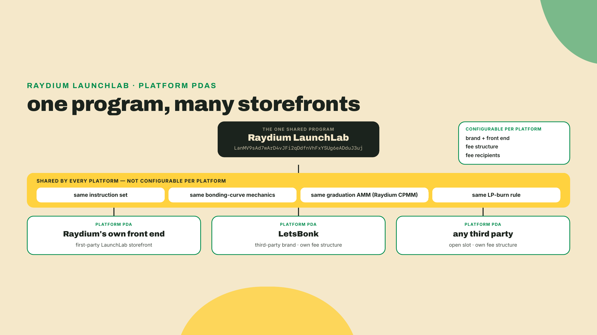
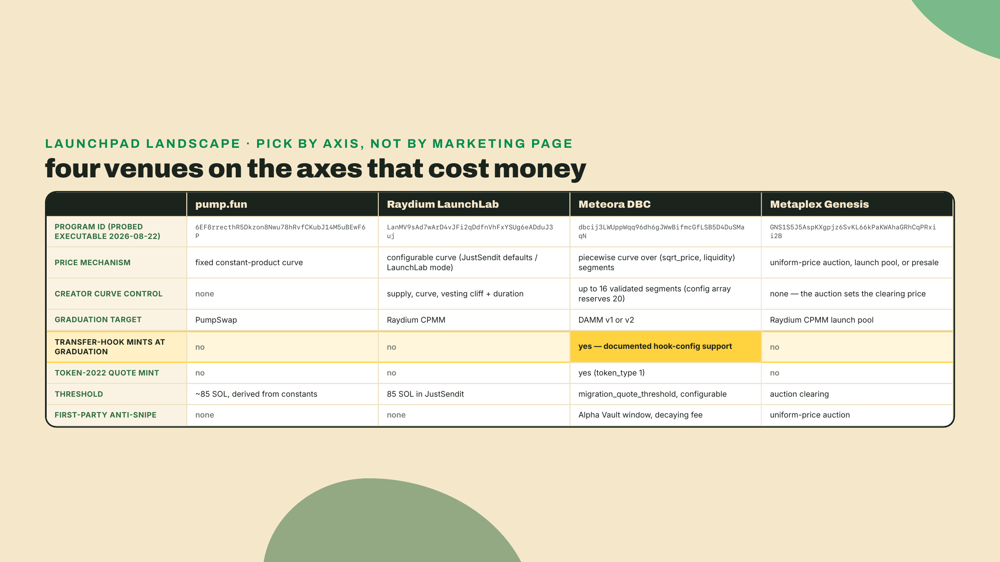
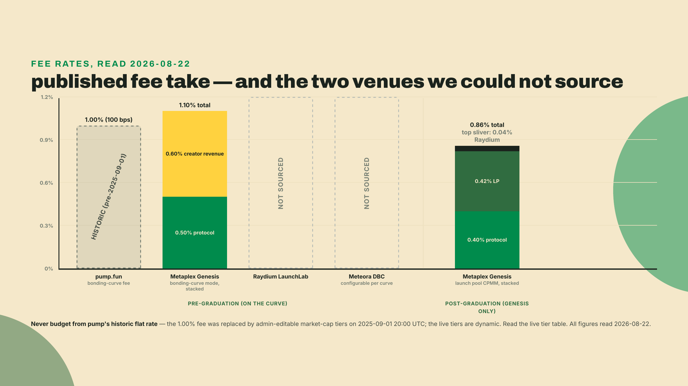
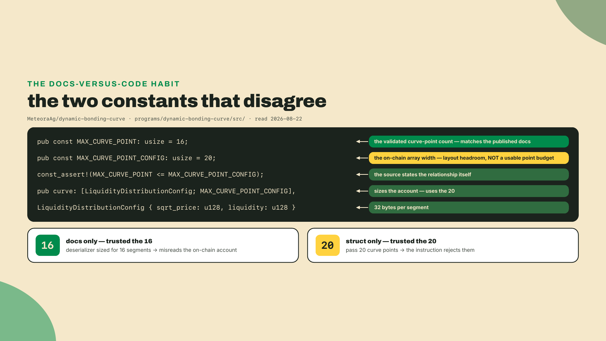
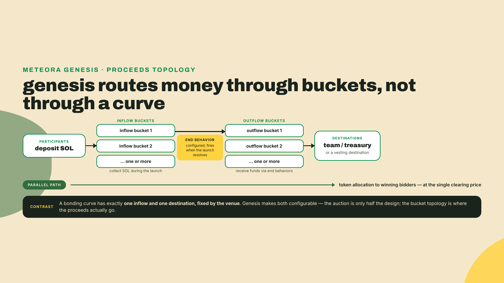
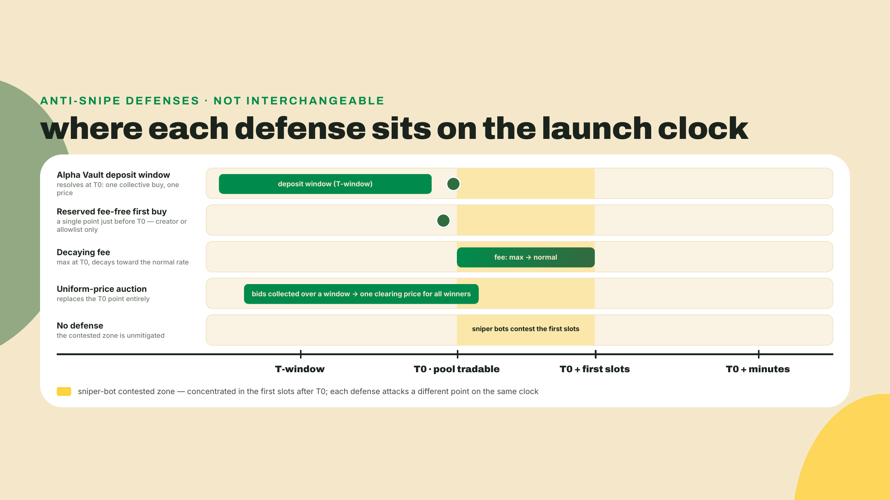
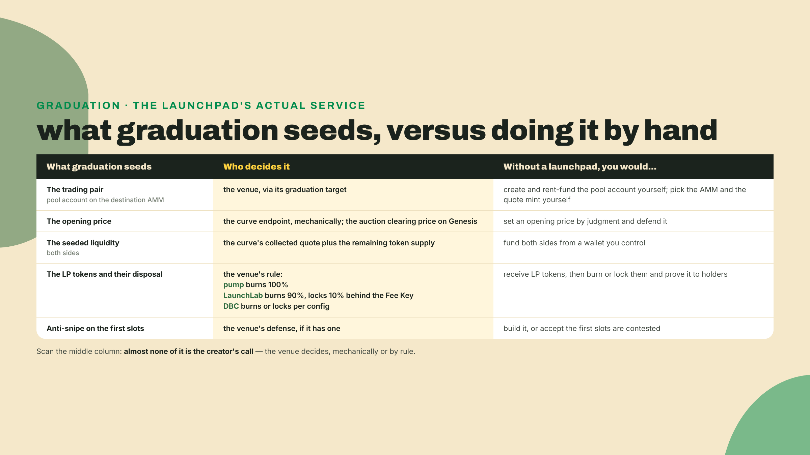
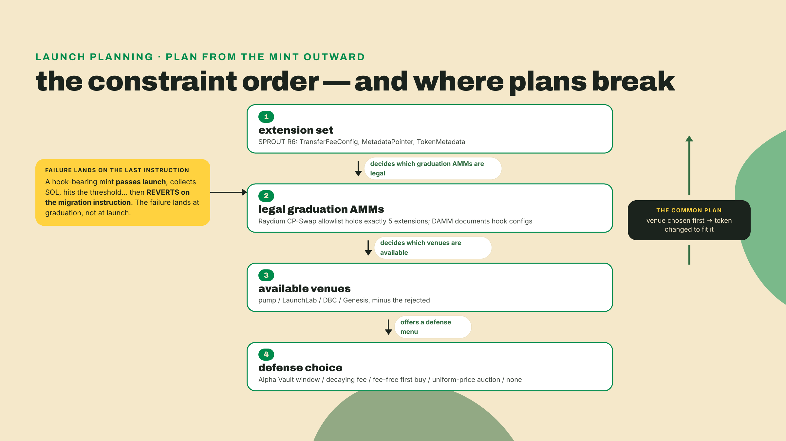
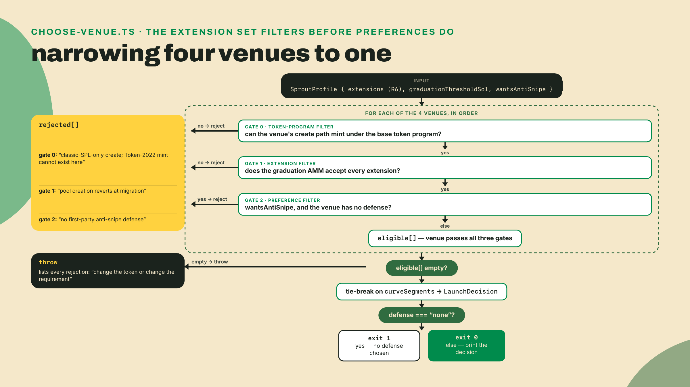

# The launchpad landscape, anti-snipe, and what graduation seeds

## Summary

Last lesson you derived SPROUT's ~85-SOL graduation threshold from pump's own constants and pinned its migrate target to PumpSwap. This lesson widens the frame from one venue to the design space: pump.fun, Raydium LaunchLab, Meteora Dynamic Bonding Curve, and Metaplex Genesis, compared on the axes that actually cost you money. You will probe four program ids live, read the knobs each venue hands the creator, weigh the four anti-snipe defenses in circulation, and write down exactly what a launchpad seeds at graduation versus what you would seed by hand. Then you make SPROUT's call: one venue, one defense, justified against the routable extension set you froze in R6. The fade is wide here. I hand you the venue table and the decision function's shape; the scoring rule, the defense choice, and the written justification are yours. This is the last lesson where the token's design constrains you instead of the other way around.

Here is a thing that will cost you real money if nobody says it out loud. Every launchpad you have heard of publishes a marketing page about its curve, and almost none of them publish the thing that actually decides whether your token can use them: which AMM the pool lands on when the curve completes, and what that AMM will accept. You can run a flawless launch, hit the threshold, and watch the migration transaction revert because your mint carries an extension the destination pool refuses. The curve was never the risk. The last instruction was.

So before any theory, go find out how many programs are actually behind the brands. Go back to the `sprout-launch/` folder from last lesson, beside the `derive-graduation.ts` you wrote there, and drop this in:

```typescript
// probe-venues.ts: are these launchpads four programs, or fewer than they look?
const RPC = process.env.SOLANA_RPC_URL ?? "https://api.mainnet-beta.solana.com";

const VENUES: Record<string, string> = {
  "pump.fun": "6EF8rrecthR5Dkzon8Nwu78hRvfCKubJ14M5uBEwF6P",
  "Raydium LaunchLab": "LanMV9sAd7wArD4vJFi2qDdfnVhFxYSUg6eADduJ3uj",
  "LetsBonk": "LanMV9sAd7wArD4vJFi2qDdfnVhFxYSUg6eADduJ3uj",
  "Meteora DBC": "dbcij3LWUppWqq96dh6gJWwBifmcGfLSB5D4DuSMaqN",
  "Metaplex Genesis": "GNS1S5J5AspKXgpjz6SvKL66kPaKWAhaGRhCqPRxii2B",
};

type AccountValue = { executable: boolean; owner: string } | null;

async function probe(address: string): Promise<AccountValue> {
  const res = await fetch(RPC, {
    method: "POST",
    headers: { "Content-Type": "application/json" },
    body: JSON.stringify({
      jsonrpc: "2.0",
      id: 1,
      method: "getAccountInfo",
      // dataSlice keeps the response tiny: we want the flags, not the bytecode.
      params: [address, { encoding: "base64", dataSlice: { offset: 0, length: 0 } }],
    }),
  });
  const json = (await res.json()) as { result?: { value: AccountValue } };
  return json.result?.value ?? null;
}

async function main(): Promise<void> {
  const seen = new Map<string, string[]>();
  for (const [name, id] of Object.entries(VENUES)) {
    const acct = await probe(id);
    const state = acct ? (acct.executable ? "executable" : "NOT A PROGRAM") : "NOT FOUND";
    console.log(name.padEnd(20), id.padEnd(46), state);
    seen.set(id, [...(seen.get(id) ?? []), name]);
  }
  console.log("");
  for (const [id, names] of seen) {
    if (names.length > 1) console.log(`same program id: ${names.join(" + ")}  ->  ${id}`);
  }
  console.log(`distinct programs: ${seen.size} for ${Object.keys(VENUES).length} brands`);
}

main().catch((err) => {
  console.error(err);
  process.exit(1);
});
```

```bash
npx tsx probe-venues.ts
```

Five brands. Four programs. That last line is the whole lesson in one number, and the next four thousand words are about why the collapse happens, which knobs survive it, and how you pick.

## The same kitchen behind four different signs

### Reading the probe you just ran

All four program ids came back executable when I ran that script on 2026-08-22, which is the only claim I am willing to make about them without you re-running it. Program ids do get replaced. Raydium alone has shipped several generations of pool programs, and a course that freezes an address is a course that lies to somebody in 2027. The script is the fact; the addresses in it are a snapshot.

The interesting row is LetsBonk. It is not a fork of LaunchLab, and it is not a competitor of LaunchLab in the way the launch-week press coverage framed it. It is LaunchLab, wearing a different sign. Raydium's program exposes a **Platform PDA**, a per-platform configuration account derived under the LaunchLab program, and a third party who creates one gets their own branded front end, their own fee structure, and their own share of the take, running against the exact same instruction set and graduating into the exact same AMM. That is what your probe caught. The two names resolved to one 32-byte key, so whatever is true of LaunchLab's mechanics is true of LetsBonk's mechanics, by construction.

I want to be honest about what the probe did and did not prove, because this is the kind of claim that gets repeated until it stops being checked. What you proved is that the id I labelled "LetsBonk" is a live executable program and that it equals LaunchLab's. What you did not prove is that LetsBonk launches actually route through it, because that requires reading a real launch transaction, not an account flag. Do that yourself before you repeat the claim: open any LetsBonk token in an explorer, find its creation transaction, and read the invoked program id off the instruction. If it says `LanMV9sA...`, the claim holds in your hands rather than in mine.

Think of it as a franchise, because the analogy holds all the way down and I am going to keep using it. One kitchen, one fryer, one supplier contract. The franchisee picks the sign over the door, the prices on the board, and who gets the till at closing. What the franchisee cannot change is the fryer. And that is exactly the trade the Platform PDA offers: total control of branding and fee split, zero control of mechanics.



### What a launchpad actually is

Strip the branding and a launchpad is four decisions bundled together and sold as one product. Any venue you evaluate is answering these four, whether or not its docs say so.

**One, the price mechanism.** How the price moves while the token is still on the venue. A fixed constant-product curve, a curve you parameterize, a piecewise curve you shape segment by segment, or no curve at all if the venue runs an auction.

**Two, the fee schedule.** Who takes what, on which side of graduation, and whether the schedule can change under you after launch. pump's bonding-curve fee WAS a flat 100 basis points on trades against the curve, until the 2025-09-01 flag day you dated last lesson replaced it with admin-editable market-cap tiers; budget from the live tier table, never from the historic flat rate. Metaplex Genesis publishes 0.50% protocol plus 0.60% creator revenue on its bonding-curve mode (its headline mode is the auction you will meet below; the curve mode is the one with this fee sheet), and a different sheet post-graduation: 0.40% protocol, 0.42% to LPs, 0.04% to Raydium on the launch-pool CPMM. Those numbers are the ones on their docs the day I read them, and fee sheets are the fastest-rotting page any protocol publishes. Re-read before you commit.

**Three, the defense.** What, if anything, stands between your launch and the bots. This is the axis most creators discover too late, and it is the one this lesson spends the most time on.

**Four, the graduation target.** Which AMM the liquidity lands on when the curve completes, and therefore which token designs are even legal. This is the axis that eats you if you skipped it, and it is the reason the R6 report you wrote last module is a launch document and not a design exercise.

Notice what is not on that list: the token standard. Every one of these venues will happily mint you an SPL token. Only some of them will carry a Token-2022 mint with power extensions all the way through migration, and none of them will tell you at mint time. The failure surfaces at the last instruction.



### pump.fun: the venue with no knobs

You already know this one from the inside, which is why it makes a clean baseline. Four constants, no parameters, one shape for every token that has ever launched there. Supply is a billion at six decimals, virtual reserves start at 30 SOL and 1,073,000,000,000,000 base units, the real token reserve is 793,100,000,000,000, and draining that reserve is what sets `complete = true` and unlocks a permissionless, idempotent migrate that burns the LP. The threshold falls out at roughly 85 SOL, and you derived it rather than looking it up.

The 2025-09-01 flag day is the part worth carrying into this lesson. Overnight, the schedule under every live pump token changed, and no creator was consulted, because no creator ever had a vote. That is the deal rather than a scandal. A venue with no knobs is a venue whose policy is set by someone else, permanently, including the parts you priced your launch around.

The upside of no knobs is real and gets undersold by people who like knobs: you cannot misconfigure it. Every launch is the same launch, so liquidity, bots, front ends, and dashboards all know the shape in advance, and the integration surface is enormous because it never changes. Zero configuration is a feature when the alternative is you, at 3am, choosing a cliff duration you do not understand.



### LaunchLab: knobs, a franchise agreement, and an NFT that collects rent

Raydium's LaunchLab is the same primitive with the settings panel unlocked, and it ships two doors. **JustSendit** is the defaults door: no configuration, and the curve graduates to a Raydium AMM pool at 85 SOL collected. Yes, the same 85 as pump. That coincidence is worth a beat, because it is exactly the shape of assumption that burns people: two venues converged on the same round number for different reasons, so a reader who generalizes "launchpads graduate at 85 SOL" will be right twice and wrong on every configurable venue in the space. Threshold is per-venue, and on the configurable ones it is per-launch.

**LaunchLab mode** is the other door: supply controls, sale metrics, curve parameters, and vesting with a cliff and an unlock duration. One property of those vesting knobs deserves its own sentence, because it is the difference between a mistake and a catastrophe. Cliff and unlock periods are fixed at launch and cannot be changed retroactively. You are not configuring a dashboard setting. You are writing a term into a contract that will still be enforcing itself long after you have forgotten which number you typed. (The airdrop lesson comes back to these same cliff and duration knobs from the claim side, where the vesting is a merkle claim rather than a launch parameter.)

Then there is the piece that reframes the whole economics, and it is the reason this lesson exists in the token-economy module rather than next to the curve math. Enable post-migration fee share at creation, and when the token graduates, LaunchLab mints a **Fee Key NFT** to the creator's wallet. The wallet holding that NFT can claim 10% of all LP trading fees from the graduated pool. Which means the LP burn is not what you probably assumed: 90% of the LP tokens are burned, and the remaining 10% are locked in Raydium's Burn and Earn, with the Fee Key as the claim ticket.

That changes what "the LP is burned" means as a trust signal. A burned LP is the standard promise that nobody can pull the rug. Under fee share, the honest version is that 90% of the rug is nailed down and the other 10% is a permanent, transferable annuity that somebody owns. The docs are blunt about the consequence: burn or transfer the Fee Key and the right to claim is permanently forfeited. So a launch's most valuable long-term asset can be lost by one wallet cleanup, and it can also be sold, which is a market nobody planned and everybody now has.

The trade-off, stated plainly. LaunchLab buys you configuration, a fee stream that survives graduation, and the option to run your own branded launchpad on somebody else's audited program. What it costs is that every one of those knobs is a decision you now own forever, the LP-burn story gets more complicated to explain to holders, and the graduation AMM is Raydium CPMM, whose Token-2022 allowlist you already know cold from R6. Three extensions in, four out.

### Meteora DBC: the curve as a data structure

Meteora's Dynamic Bonding Curve is the venue that treats the curve as configuration rather than product. Instead of one constant-product curve, the config holds an array of `(sqrt_price, liquidity)` pairs, and the pool interpolates constant-product behavior between them. Piecewise, in other words: you draw a cheap flat stretch for early supporters, then a steeper stretch, then whatever shape your distribution actually wants.

Here is where the lesson gets its second color beat, and it is a good one for a habit rather than a fact. The docs describe a 16-point customizable curve. The on-chain config array is 20 wide. Both numbers are real, and both are in the source. I pulled the constants file on 2026-08-22:

```rust
// programs/dynamic-bonding-curve/src/constants.rs (excerpt)
pub const MAX_CURVE_POINT: usize = 16;
pub const MAX_CURVE_POINT_CONFIG: usize = 20;
const_assert!(MAX_CURVE_POINT <= MAX_CURVE_POINT_CONFIG);

// programs/dynamic-bonding-curve/src/state/config.rs (excerpt, fields elided)
#[zero_copy]
pub struct LiquidityDistributionConfig {
    pub sqrt_price: u128,
    pub liquidity: u128,
}

#[account(zero_copy)]
pub struct PoolConfig {
    // ... quote_mint, fee_claimer, leftover_receiver, fee and vesting configs ...
    pub token_type: u8, // 0 = SplToken, 1 = Token2022
    // ... the rest of the u8 flag run ...
    pub padding_2: [u8; 7], // declared, not implied: a zero-copy struct may carry no implicit padding
    pub swap_base_amount: u64,
    pub migration_quote_threshold: u64,
    pub migration_base_threshold: u64,
    // ... migration_sqrt_price, locked vesting, supply and migrated-fee fields ...
    pub curve: [LiquidityDistributionConfig; MAX_CURVE_POINT_CONFIG],
}
```

Two constants, two jobs, and the `const_assert!` between them is the giveaway: the source itself declares one a ceiling under the other. The account reserves 20 slots so the layout has headroom; the validated curve caps lower. If you had trusted only the docs you would have believed the array was 16 wide and mis-sized a deserializer. If you had trusted only the struct you would have believed you could pass 20 points and had an instruction reject you. The rule that survives both mistakes is the one you have been running since the extension conflict matrix: read the source, and read enough of it to know which constant governs which surface. Then re-check at your own write time, because I am quoting a repository on a date and repositories move.

Two more fields in that struct decide whether SPROUT can use this venue at all, and here precision about WHICH side of the pair each claim covers matters, because they are different claims with different evidence. `token_type` is 0 for classic SPL and 1 for Token-2022, and what it demonstrably encodes, sitting in PoolConfig beside `quote_mint`, is the QUOTE side's token program: it is how DBC accepts a Token-2022 quote mint.

The BASE side, the side SPROUT would live on, rests on a separate documentation claim: DBC's docs describe Token-2022 base tokens including transfer-hook configurations, which makes it the counterpoint to Raydium in this whole comparison, since a hook-bearing token refused by CP-Swap has a documented path here. But documented is not interrogated. Last lesson you read pump's IDL line by line to prove its create path; this lesson has not done that for DBC's base-side create, so treat Token-2022-base-with-transfer-fee support as documented-but-unverified until you read DBC's create path or stand up a devnet pool with a fee-bearing base mint. The lab's venue record carries that flag, and the decision it feeds inherits the caveat.

`migration_quote_threshold` is the graduation trigger, in units of the quote token, and it is a number you choose rather than a number you derive.

Cost side, because a venue this flexible is not free. Every segment is a distribution decision you now have to defend, and a piecewise curve gives you many more ways to be wrong than a fixed one does. The pool math and the LP strategy that would let you shape those segments intelligently are genuinely out of scope here, and I am not going to fake them: the planned DeFi and RWA Engineering course teaches liquidity provision at real depth, and that is where curve shaping stops being a menu and becomes a discipline. This lesson takes you exactly as far as choosing the venue and knowing what its knobs are.



### Genesis: when a curve is the wrong shape entirely

Metaplex Genesis belongs in this comparison precisely because its headline mode refuses the premise. (One reconciliation with the fee section, so the two do not read as a contradiction: Genesis also ships a bonding-curve launch mode, and the 1.10% figure quoted earlier is from THAT mode's fee sheet. This section covers the differentiator, the auction, which is what the lab's venue record models; the curve mode exists and is not modeled here.) A bonding curve is a price mechanism with a specific bias baked in: earlier buyers pay less, mechanically, always. That bias is the point when you are launching a community token and want early supporters rewarded. It is a bug when you are launching something with real institutional demand, because it converts "be early" into "be fast", and being fast is a service bots sell.

Genesis offers a **uniform-price auction** instead. Bids come in during a window, they are ranked by price, and every winning bidder pays the same clearing price, set at the lowest winning bid. Nobody is rewarded for landing a transaction 40 milliseconds sooner than someone else, because arrival order stops being a price input. Genesis frames it as the mode for established projects with institutional interest, and the architecture around it is a **bucket** system: inflow buckets collect SOL from participants, outflow buckets route funds to a treasury or a vesting destination through configurable end behaviors.

What it costs you is the thing curves are actually good at. An auction needs demand to show up inside a window, and a window is a coordination problem: you have to market it, and if the window closes thin, you have discovered your demand curve in public. A bonding curve never has that failure mode, because it is always open and always quoting. Pick the auction when the launch has enough gravity to fill a room on a schedule. Pick a curve when it does not.



### Four defenses against the same contested window

Every anti-snipe mechanism in this space is attacking the same window. From the slot your pool becomes tradable to the slot a human being can react is a gap of a few hundred milliseconds at current slot times, and a bot with a warm connection and a priority fee owns all of it. The defenses differ in which lever they pull.

**The deposit window.** Meteora's Alpha Vault sits in front of the launch and accepts deposits before trading opens, in either first-come-first-served or pro-rata mode, then buys as one participant at the open. Every depositor gets the same fill price. The bot's speed advantage evaporates because there is nothing to race: the buy already happened, collectively, at a price nobody could jump. The cost is a schedule and a cap. You are asking supporters to commit capital ahead of a launch, which is a much bigger ask than clicking buy, and in pro-rata mode nobody knows their exact fill until the window closes.

**The decaying fee.** Start the trading fee punishing and let it fall over the first minutes or blocks. A sniper buying in the first slot pays a rate that eats the arbitrage; a normal buyer arriving four minutes later pays close to normal. This is the least intrusive defense, because it changes no flow and asks nothing of your community, and it is the weakest, because a large enough expected pop still justifies the fee. It taxes sniping rather than preventing it.

**The reserved fee-free first buy.** The creator, or an allowlisted set, gets a buy at the curve's opening price with fees waived before the pool opens to everyone. It guarantees the team or the community a position at the bottom. It also concentrates supply in exactly the way a fair-launch audience is watching for, so it buys you defense at the direct cost of the optics you were probably launching for.

**The uniform-price auction.** Genesis, as above. The strongest of the four, because it does not tax or delay the race, it deletes the race by removing time from the price function. And it is the most expensive, because it demands the launch behave like an event.

There is a fifth option people forget: no defense. That is what a plain pump launch is, and it is a coherent choice if the token is small, the launch is quiet, and the cost of a bot getting a good fill is genuinely lower than the cost of asking your community to learn a deposit window. Naming it as a choice is different from stumbling into it.



### What graduation actually seeds

Here is the part every launchpad does for you silently, which is why almost nobody can list it when asked. Graduation seeds exactly three things.

**The pair.** A pool account on the destination AMM holding your token against the quote mint. The pair is chosen by the venue: pump gives you SPROUT/SOL on PumpSwap, LaunchLab gives you SPROUT/SOL on Raydium CPMM, DBC gives you SPROUT against whatever quote mint you configured on DAMM. You do not get to negotiate the quote asset at graduation. You chose it when you chose the venue.

**The initial price.** Not a number you set. The price implied by where the curve stopped. The final virtual reserve ratio at completion is the opening quote on the AMM, which is why the curve's endpoint and the pool's first tick are the same economic fact seen twice. On a venue with a fixed curve, that price is determined the moment you launch. On DBC, it is determined by your last segment.

**The LP position and its disposal.** The migration mints LP tokens against the seeded liquidity and then does something irreversible with them. pump burns them. LaunchLab burns 90% and locks 10% behind the Fee Key when fee share is on. DBC burns or locks according to your config. Whatever the rule is, it executes inside the migration transaction, and after that the position is exactly as immovable as the rule said it would be.

Now the counterfactual, which is the only way to feel what you are getting. Without a launchpad you would create the pool account and pay its rent yourself, fund both sides from a wallet you control, pick an opening price by judgment instead of by mechanism, receive LP tokens into that same wallet, and then solve the trust problem by hand: burn them and prove it, or lock them somewhere and prove that. You would also own the whole anti-snipe problem alone, because a fresh pool with no defense is a pool that gets sniped in its first slot by definition. That is four jobs and a trust proof, in exchange for control of every one of them.



### The extension set votes first

Which brings the whole comparison back to a decision you already made. SPROUT's routable set from R6 is TransferFeeConfig, MetadataPointer, and TokenMetadata, and the reason it is those three is that Raydium CP-Swap's Token-2022 allowlist contains exactly five extensions and refuses everything that lets an issuer run code or move other people's tokens.

Read the comparison table again with that in your hand and the venue field narrows on its own. Three of the four graduation targets refuse a transfer hook. If SPROUT had kept its hook, pump, LaunchLab, and Genesis would all revert at migration, and not at launch, which is the cruel part. You would collect the SOL, hit the threshold, and fail on the last instruction with a token nobody can trade and a curve that is already complete.

So the ordering is fixed, and it is the opposite of how most launches are planned. The extension set decides which graduation AMMs are legal. The legal AMMs decide which venues are available. The available venues offer you a defense menu. You pick from that menu. Anyone who picks the venue first is going to end up changing their token to fit it, which is a fine outcome as long as it was a decision instead of a discovery.



## Lab: choose SPROUT's venue and write the decision

The artifact is `sprout-launch/choose-venue.ts`, and it is the decision half of the `sprout-launch` bundle whose curve half you built last lesson. It ingests SPROUT's R6 extension set and the derived threshold, rejects every venue whose graduation AMM would refuse the mint, rejects every venue with no defense if you asked for one, and prints the decision with its rejections attached. The gate: `npx tsx sprout-launch/choose-venue.ts` must print a venue, a graduation AMM, a named defense, and a non-empty rejection list, and exit 0.

**1.** Work in the `sprout-launch/` folder from last lesson, beside `derive-graduation.ts`. Nothing new to install if you did that lab. Starting clean, the runner is the same single dev dependency, re-checked today: `tsx@4.23.12` was npm latest on 2026-08-22, and that number rots like every pin in this course, so run `npm view tsx version` yourself the day you scaffold.

```bash
npm init -y
npm install -D tsx@4.23.12
```

**2.** Put the design space on disk as data before you write any logic. The point of a table like this is that every field is a claim you can be wrong about in one place instead of five, and the `programId` values are the ones your probe script already checked.

```typescript
// venues.ts: the launchpad design space as data. Every field is a decision you inherit.
export type VenueId = "pump" | "launchlab" | "dbc" | "genesis";
export type Defense = "alpha-vault-window" | "decaying-fee" | "fee-free-first-buy" | "uniform-price-auction" | "none";

export interface Venue {
  id: VenueId;
  label: string;
  programId: string;
  priceMechanism: "fixed-curve" | "configurable-curve" | "piecewise-curve" | "auction";
  /** how many liquidity segments the creator controls; 0 = none */
  curveSegments: number;
  /** the AMM the pool lands on at graduation */
  graduationAmm: string;
  /**
   * Which token program the venue's CREATE path can mint the base token under.
   * This gate runs before any extension talk: last lesson you proved from pump's
   * own IDL that its create pins the classic SPL Token program and mints the
   * token itself, so a Token-2022 mint cannot exist there at all.
   */
  baseTokenProgram: "spl" | "token2022" | "both";
  /** Token-2022 extensions the graduation AMM is documented to accept */
  acceptsTransferHook: boolean;
  acceptsToken2022Quote: boolean;
  defenses: Defense[];
  threshold: { kind: "fixed" | "derived" | "configurable"; sol?: number; field?: string };
  /** fraction of LP tokens burned at migration; the rest is locked, not free */
  lpBurnedAtMigration: number;
  seededAtGraduation: string[];
}

export const VENUES: Venue[] = [
  {
    id: "pump",
    label: "pump.fun",
    programId: "6EF8rrecthR5Dkzon8Nwu78hRvfCKubJ14M5uBEwF6P",
    priceMechanism: "fixed-curve",
    curveSegments: 0,
    graduationAmm: "PumpSwap (pAMMBay6oceH9fJKBRHGP5D4bD4sWpmSwMn52FMfXEA)",
    baseTokenProgram: "spl", // proven from pump's IDL last lesson: create mints classic SPL itself
    acceptsTransferHook: false,
    acceptsToken2022Quote: false,
    defenses: ["none"],
    // ~85 SOL is DERIVED from pump's constants (derive-graduation.ts), never a spec constant:
    // recording it as "fixed" would be the repeated-number mistake last lesson buried.
    threshold: { kind: "derived", sol: 85, field: "virtual reserves at completion" },
    lpBurnedAtMigration: 1,
    seededAtGraduation: ["SPROUT/SOL pair", "price implied by the curve endpoint", "LP burned"],
  },
  {
    id: "launchlab",
    label: "Raydium LaunchLab (JustSendit)",
    programId: "LanMV9sAd7wArD4vJFi2qDdfnVhFxYSUg6eADduJ3uj",
    priceMechanism: "fixed-curve", // this record is the JustSendit defaults door; LaunchLab's other door unlocks the configurable curve
    curveSegments: 1,
    graduationAmm: "Raydium CPMM",
    baseTokenProgram: "spl", // LaunchLab's create mints the base token as classic SPL; verify against its IDL the way you did pump's
    acceptsTransferHook: false,
    acceptsToken2022Quote: false,
    defenses: ["none"],
    threshold: { kind: "fixed", sol: 85 },
    // 90% burned, 10% locked in Burn & Earn when creator fee share is on
    lpBurnedAtMigration: 0.9,
    seededAtGraduation: [
      "SPROUT/SOL pair on CPMM",
      "price implied by the curve endpoint",
      "90% LP burned, 10% locked behind the Fee Key NFT",
    ],
  },
  {
    id: "dbc",
    label: "Meteora Dynamic Bonding Curve",
    programId: "dbcij3LWUppWqq96dh6gJWwBifmcGfLSB5D4DuSMaqN",
    priceMechanism: "piecewise-curve",
    curveSegments: 16,
    graduationAmm: "DAMM v1 or v2",
    // DOCUMENTED-UNVERIFIED on the base side: PoolConfig's token_type field
    // demonstrably covers the QUOTE mint; Token-2022 BASE support (incl.
    // transfer-hook configs) is a docs claim this course has not read at IDL
    // depth. Verify the create path before shipping a fee-bearing base mint.
    baseTokenProgram: "both",
    acceptsTransferHook: true,
    acceptsToken2022Quote: true,
    defenses: ["alpha-vault-window", "decaying-fee"],
    threshold: { kind: "configurable", field: "migration_quote_threshold" },
    // Per config, not absolute: DBC's LP can be burned OR locked at migration.
    // 1 models the burn configuration; adjust to the config you would ship.
    lpBurnedAtMigration: 1,
    seededAtGraduation: [
      "SPROUT/quote pair on DAMM",
      "price implied by the last curve segment",
      "LP burned or locked per config",
    ],
  },
  {
    id: "genesis",
    label: "Metaplex Genesis",
    programId: "GNS1S5J5AspKXgpjz6SvKL66kPaKWAhaGRhCqPRxii2B",
    priceMechanism: "auction",
    curveSegments: 0,
    graduationAmm: "Raydium CPMM launch pool",
    baseTokenProgram: "spl", // no documented Token-2022 base path; treat as classic-only until you verify
    acceptsTransferHook: false,
    acceptsToken2022Quote: false,
    defenses: ["uniform-price-auction"],
    threshold: { kind: "configurable", field: "auction clearing price" },
    // UNSOURCED: no doc statement on Genesis LP disposal surfaced in this
    // course's reads; recorded as burn by analogy with the launch-pool
    // pattern. Verify against Genesis docs before this cell decides anything.
    lpBurnedAtMigration: 1,
    seededAtGraduation: [
      "SPROUT/SOL pair",
      "price set by the auction clearing price, not a curve",
      "LP disposal: unsourced, verify (recorded as burn by analogy)",
    ],
  },
];
```

**3.** Now the decision function, and this is the interface later lessons will call, so the shape matters more than the scoring rule inside it. `chooseVenue` takes the profile, walks the venues, and collects rejections as it goes. Read the failure path first: when nothing survives, it throws with every rejection listed, because a decision tool that returns a silent default when the answer is "your token cannot launch anywhere" is worse than no tool.

```typescript
// choose-venue.ts: SPROUT's launch decision, derived from R6 instead of vibes.
import { VENUES, Venue, VenueId, Defense } from "./venues";

/** The two prior artifacts, reduced to what a venue choice actually needs. */
export interface SproutProfile {
  /** which token program the mint lives under; SPROUT is Token-2022 */
  baseTokenProgram: "spl" | "token2022";
  /** the final routable extension set from routability-report.ts (R6) */
  extensions: string[];
  /** the threshold derived in derive-graduation.ts, in SOL; printed as the report's derived-reference line */
  graduationThresholdSol: number;
  /** true if the launch needs the community to buy before bots do */
  wantsAntiSnipe: boolean;
}

export interface Rejection {
  venue: VenueId;
  reason: string;
}

export interface LaunchDecision {
  venue: VenueId;
  programId: string;
  graduationAmm: string;
  defense: Defense;
  thresholdSol: number | null;
  seeds: string[];
  rejected: Rejection[];
}

const POWER_EXTENSIONS = ["TransferHook", "PermanentDelegate", "DefaultAccountState", "ConfidentialTransferMint"];

/** Can this venue hold the mint at all, and will its graduation AMM accept it? */
export function venueAcceptsMint(venue: Venue, profile: SproutProfile): Rejection | null {
  // Gate 0, before any extension talk: the venue's create path must be able to
  // mint under the base token program at all. This is the check last lesson's
  // IDL read made unavoidable: pump pins classic SPL and mints the token
  // itself, so a Token-2022 fee mint like SPROUT can never exist there.
  if (profile.baseTokenProgram === "token2022" && venue.baseTokenProgram === "spl") {
    return {
      venue: venue.id,
      reason: "create path mints classic SPL only; a Token-2022 mint (SPROUT carries TransferFeeConfig) cannot exist on this venue",
    };
  }
  const extensions = profile.extensions;
  if (extensions.includes("TransferHook") && !venue.acceptsTransferHook) {
    return {
      venue: venue.id,
      reason: `${venue.graduationAmm} rejects TransferHook; pool creation reverts at migration`,
    };
  }
  const otherPower = extensions.filter((e) => e !== "TransferHook" && POWER_EXTENSIONS.includes(e));
  if (otherPower.length > 0) {
    return {
      venue: venue.id,
      reason: `${venue.graduationAmm} has no documented acceptance for ${otherPower.join(", ")}`,
    };
  }
  return null;
}

export function chooseVenue(profile: SproutProfile): LaunchDecision {
  const rejected: Rejection[] = [];
  const eligible: Venue[] = [];

  for (const venue of VENUES) {
    const ammVerdict = venueAcceptsMint(venue, profile);
    if (ammVerdict) {
      rejected.push(ammVerdict);
      continue;
    }
    if (profile.wantsAntiSnipe && venue.defenses.every((d) => d === "none")) {
      rejected.push({
        venue: venue.id,
        reason: "no first-party anti-snipe defense; you would be building one yourself",
      });
      continue;
    }
    eligible.push(venue);
  }

  if (eligible.length === 0) {
    throw new Error(
      `No venue survives SPROUT's extension set [${profile.extensions.join(", ")}].\n` +
        rejected.map((r) => `  ${r.venue}: ${r.reason}`).join("\n") +
        "\nChange the token or change the requirement. There is no third option.",
    );
  }

  // TODO (yours): this tie-break prefers curve control. Justify it or replace it.
  const winner = eligible.reduce((best, v) => (v.curveSegments > best.curveSegments ? v : best), eligible[0]);
  const defense = winner.defenses.find((d) => d !== "none") ?? "none";

  return {
    venue: winner.id,
    programId: winner.programId,
    graduationAmm: winner.graduationAmm,
    defense,
    // A configurable threshold has NO number to inherit: pump's derived 85 is
    // pump's, and printing it under DBC would be the repeated-number mistake.
    thresholdSol: winner.threshold.kind === "configurable" ? null : (winner.threshold.sol ?? null),
    seeds: winner.seededAtGraduation,
    rejected,
  };
}
```

**4.** Then the report half and the gate. The `seeds` list is not decoration: it is the "what gets seeded" line the assessment asks for, printed from the venue record so it cannot drift from the venue you actually chose.

```typescript
// choose-venue.ts, continued.
export function renderDecision(profile: SproutProfile, decision: LaunchDecision): string {
  const lines = [
    "# SPROUT launch decision",
    "",
    `Extension set (R6): ${profile.extensions.join(", ")}`,
    `Venue:              ${decision.venue}  (${decision.programId})`,
    `Graduation AMM:     ${decision.graduationAmm}`,
    `Anti-snipe:         ${decision.defense}`,
    `Threshold:          ${decision.thresholdSol !== null ? `${decision.thresholdSol} SOL` : "configurable: you set migration_quote_threshold; there is no venue default to inherit"}`,
    `Derived reference:  ~${profile.graduationThresholdSol} SOL (last lesson's pump-constants derivation; on a configurable venue it is your starting anchor, never an inherited default)`,
    "",
    "Seeded at graduation:",
    ...decision.seeds.map((s) => `  - ${s}`),
    "",
    "Rejected:",
    ...decision.rejected.map((r) => `  - ${r.venue}: ${r.reason}`),
  ];
  return lines.join("\n");
}

if (import.meta.url === `file://${process.argv[1]}`) {
  const sprout: SproutProfile = {
    baseTokenProgram: "token2022",
    extensions: ["TransferFeeConfig", "MetadataPointer", "TokenMetadata"],
    graduationThresholdSol: 85,
    wantsAntiSnipe: true,
  };
  const decision = chooseVenue(sprout);
  console.log(renderDecision(sprout, decision));

  if (decision.defense === "none") {
    console.error("\nGATE FAIL: wantsAntiSnipe is set but the chosen venue ships no defense.");
    process.exit(1);
  }
  console.log("\nAll gates pass.");
}
```

**5.** Run it, then prove the gates are real.

```bash
npx tsx sprout-launch/choose-venue.ts
```

You should see `Venue: dbc`, `Anti-snipe: alpha-vault-window`, a threshold line that says configurable rather than borrowing a number, three seeded lines, three rejections all naming the classic-SPL create path, and `All gates pass` at exit 0.

Notice that this answer is not last lesson's answer, and the difference is the whole point of widening the frame. `derive-graduation.ts` asked one question, "which AMM can legally hold SPROUT's mint," compared two candidates, and landed on Raydium CP-Swap, which is where LaunchLab graduates. This script asks two more questions on top: "can the venue's own create path mint a Token-2022 fee token at all," which LaunchLab's classic-SPL pin fails the same way pump's does, and "does the surviving venue defend the first slots." DBC is what survives both, which moves the destination to DAMM. Neither run is wrong. The first one answered a narrower question with a narrower candidate list, and a decision that changes when you add an axis is a decision that was actually listening.

Now make it fail three ways, because a checkpoint that cannot fail was never a checkpoint. Add `"TransferHook"` to `extensions` and note the DBC row survives while the other three rejections stand. Set `wantsAntiSnipe: false` and notice pump and LaunchLab do NOT come back into the eligible set; the base-program gate rejected them before the defense gate ever ran, and no preference flag can conjure a Token-2022 mint onto a classic-SPL venue. To watch the defense gate actually bite, flip the whole profile to a plain classic token (`baseTokenProgram: "spl"`, empty `extensions`, `wantsAntiSnipe: true`) and see pump and LaunchLab get rejected on defense alone. Finally set `extensions` to `["PermanentDelegate"]` with the Token-2022 profile and watch the throw: no venue survives, every rejection printed, no default returned. Put SPROUT's real values back when you are done.



## Challenge

The solo half is the judgment the tool deliberately does not make for you, and it comes out as writing, not code.

First, replace the tie-break. The line marked TODO prefers whichever eligible venue exposes the most curve segments, which is a defensible rule and not the only one. Write the rule you actually believe, in code, and put a comment above it saying what it optimizes for and what it sacrifices. Candidates you have the material to argue: prefer the strongest defense, prefer the venue whose LP burn is total rather than partial, prefer the largest integration surface, prefer the venue whose fee schedule cannot change under you. Any of those beats "most segments" for some launches.

Second, write SPROUT's launch decision as prose, and make it survive a hostile read. Four things have to be in it, and the acceptance bar is the brief's. Name the venue and the one anti-snipe defense you are taking. Justify why the R6 routable set permits that venue's graduation AMM, naming the extensions and the allowlist rather than gesturing at them. State in one line what graduation seeds for you: the pair, the price mechanism that sets the opening quote, and the LP disposal rule including whether the burn is total. Then state what you would have had to seed by hand instead, in the same units, so the launchpad's actual service is a quantity and not a vibe.

Third, and this is the one that separates a decision from a preference: write the paragraph that would change your mind. Name the specific fact that, if it turned out otherwise, flips your venue choice. Mine would be the transfer-hook support I attributed to DBC. My entire ordering rests on that being a documented, currently working path rather than a roadmap sentence, and if you verify it and find it is a config flag nobody has shipped through migration, the whole comparison reshuffles and SPROUT's design gets simpler by force. Find yours. A decision whose author cannot name its breaking condition is only a preference.

One request before you close the folder. Every venue number in this lesson is dated 2026-08-22 and read from a doc page or a repository, not from a launch I ran: the 85-SOL JustSendit threshold, the 10% Fee Key claim, the 90/10 LP split, the Genesis fee sheet, the two Meteora constants. Launchpad economics rot faster than almost anything else in this course, because the fee split is the product. If your own reads disagree with mine, post the exact claim and what you found in the course feedback channel. The habit you are building is not "know the venues". It is "re-derive the venue table before every launch", and a learner who catches a stale number is that habit working out loud.

You have chosen where SPROUT graduates and what that seeds. Now the other side of distribution: getting the token into thousands of hands without a rent bill the size of a house.
