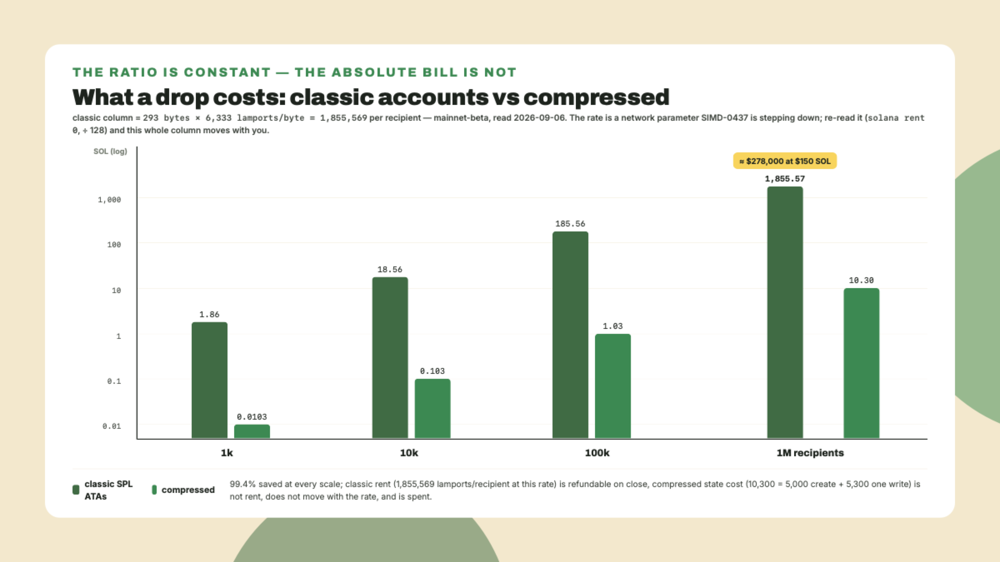
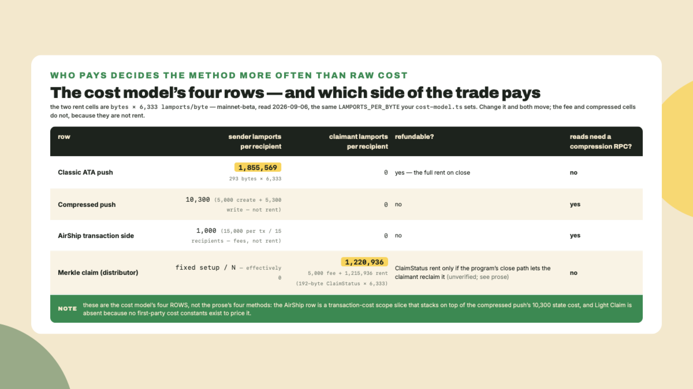
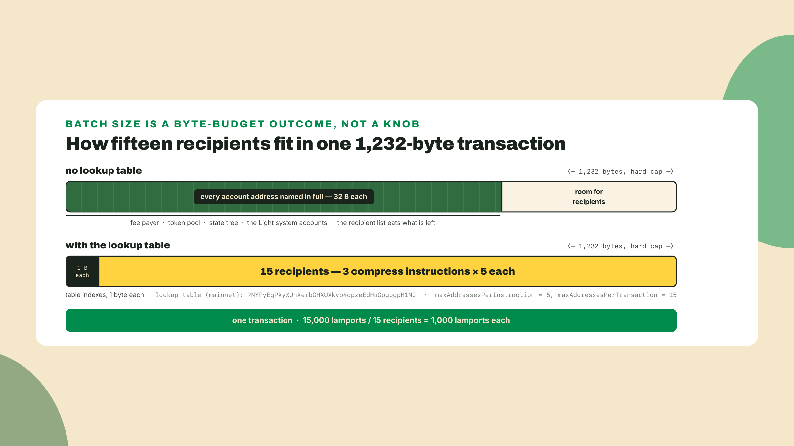
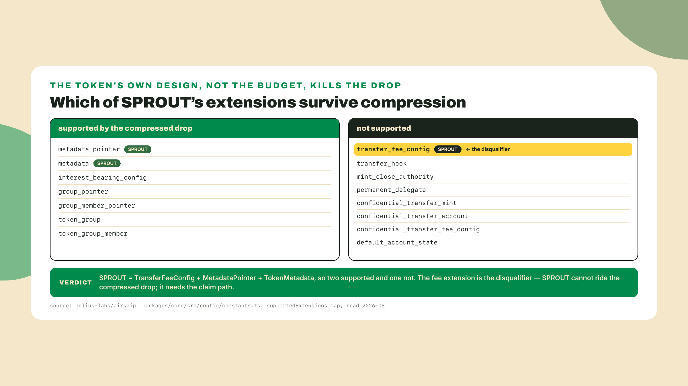
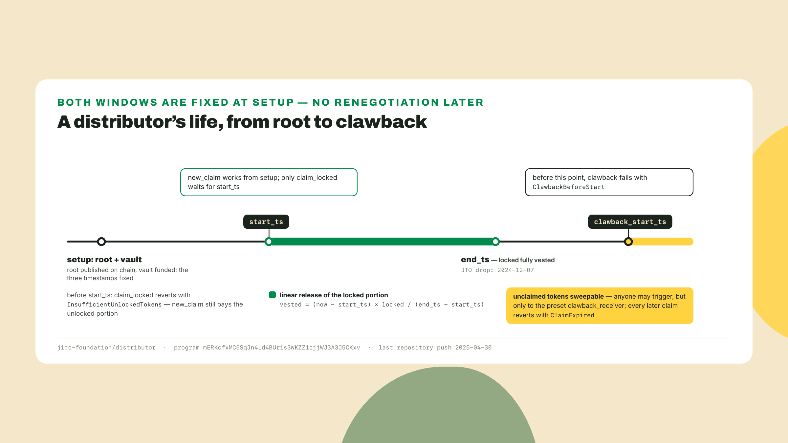
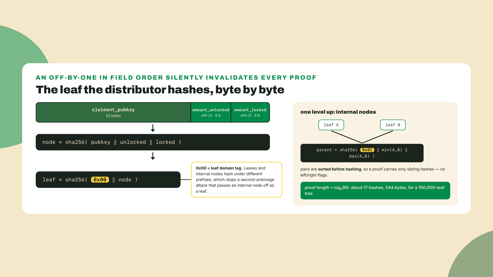
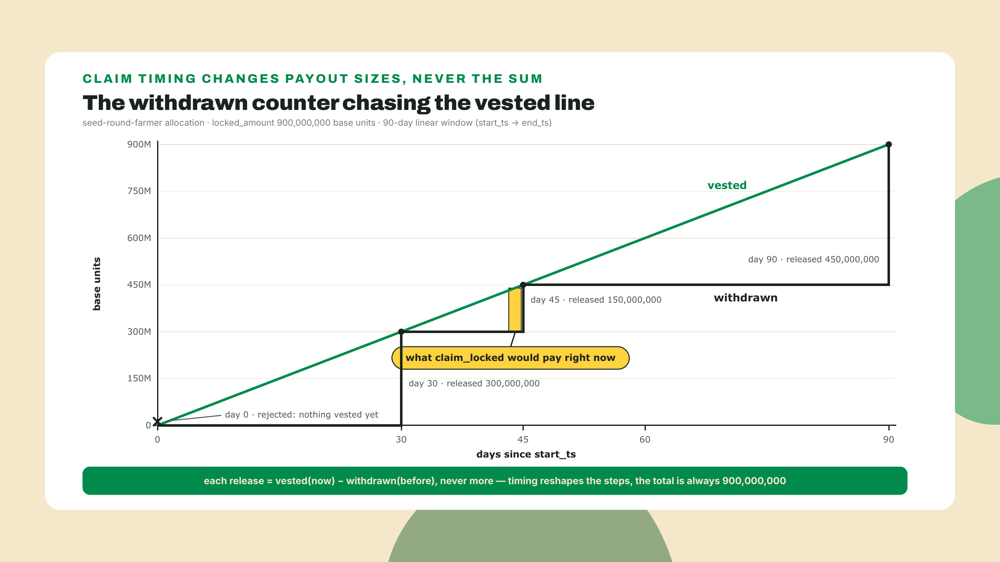
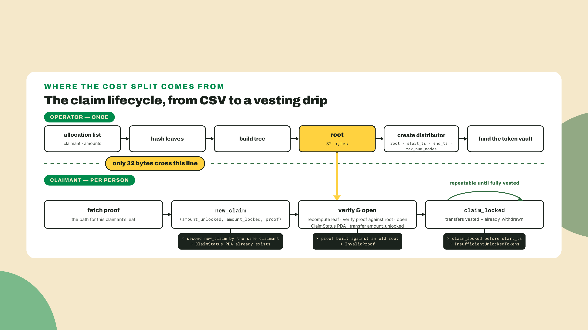
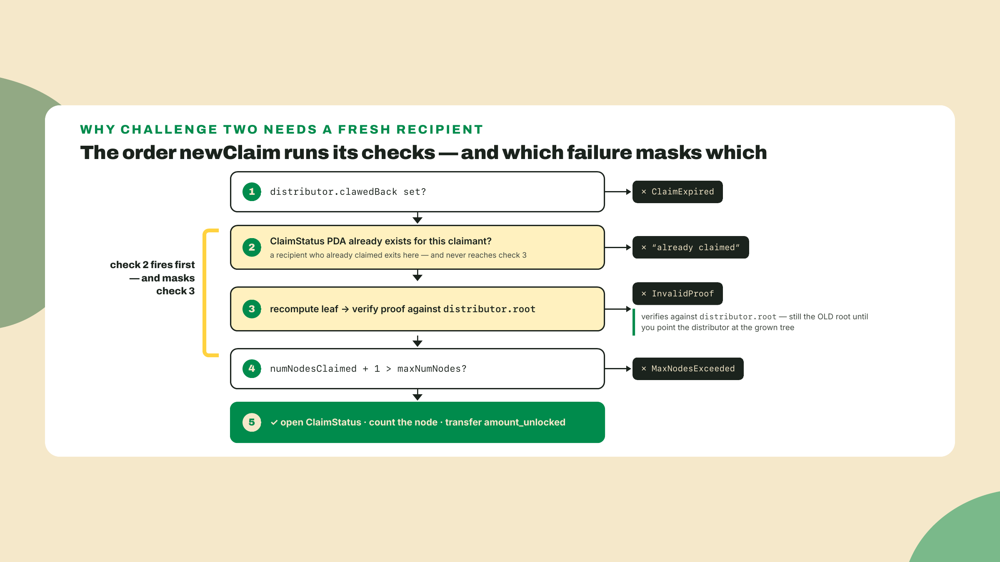

# Airdrops at scale: cost engineering and vesting claims

## Summary

Last two lessons you derived what it takes to put SPROUT on a curve, proved which venues can even hold its mint, and wrote the decision that picks where it will graduate. Module 7 did something different: it taught compression as a concept, made you price it, and left you holding a promise. You reasoned about compressed tokens for a whole lesson without ever touching one.

Today you touch one, in the first ten minutes, and then you spend the rest of the lesson on the arithmetic that decides how a token reaches a hundred thousand strangers.

Start with the number, before any of the explanation:

```bash
# 293 bytes (165 of data + the 128-byte account header) at your cluster's
# rent rate. Ask for the rate instead of pasting one; mine is mainnet's, read
# 2026-09-06, and SIMD-0437 is stepping it down.
RATE=$(curl -s https://api.mainnet-beta.solana.com -X POST -H 'content-type: application/json' \
  -d '{"jsonrpc":"2.0","id":1,"method":"getMinimumBalanceForRentExemption","params":[0]}' \
  | node -e "let d='';process.stdin.on('data',c=>d+=c).on('end',()=>console.log(JSON.parse(d).result/128))")
node -e "const classic=293*$RATE, compressed=10_300, n=100_000; console.log('rate', $RATE, 'lamports/byte | classic', (classic*n/1e9).toFixed(2), 'SOL / compressed', (compressed*n/1e9).toFixed(2), 'SOL /', ((1-compressed/classic)*100).toFixed(1)+'% saved')"
```

```
rate 6333 lamports/byte | classic 185.56 SOL / compressed 1.03 SOL / 99.4% saved
```

Nearly two hundred SOL against one. That is the same distribution, to the same hundred thousand wallets, priced two ways. And the reason this lesson exists is that neither number is the whole bill, both of them hide a scope decision, and the method you actually ship for SPROUT is a third one that neither number describes.

You will build the compost-airdrop: a cost table that computes per-recipient lamports across four distribution methods and matches the canonical figures, plus a merkle claim path that proves one unlocked claim and one linearly vesting `claim_locked` claim. The fade, stated up front: the cost model is walked with you line by line, the compressed figures are a completion problem you fill in yourself, and the second claim path, the locked one, is entirely yours.

## The distribution bill

### Ten minutes of first contact

Before any theory, get a compressed token into your own hands. This is a devnet errand, not a build, and it exists so that every number later in the lesson attaches to something you have run.

The Light SDK is a web3.js v1 stack. Its published peer range is `@solana/web3.js >=1.73.5`, and Light publishes no kit surface, so the v1 ride is unavoidable rather than chosen: this lab is a quarantined v1 workspace, deliberately, you write v1 idioms only where the vendor SDK forces them, and the rest of the course stays on kit. (Kit's npm `latest` was 8.0.0, published 2026-08-21, when this lesson was written. Do not print `latest` in a package.json, and re-check every pin below before you rely on it.)

```bash
mkdir -p labs/m08-l3 && cd labs/m08-l3
npm init -y
npm pkg set type=module
npm install -D tsx@4.23.12 typescript@5.9.3 @types/node@24
npm install @solana/web3.js@1.98.4 @solana/spl-token@0.4.15 \
  @lightprotocol/stateless.js@0.23.3 @lightprotocol/compressed-token@0.23.3
mkdir -p compost-airdrop
```

`tsx` runs a TypeScript file directly. `@lightprotocol/stateless.js` talks to the Light system program and to a Photon indexer; `@lightprotocol/compressed-token` is the token layer on top of it. Both were on 0.23.3 at the time of writing. The `npm pkg set type=module` line is not optional: both Light packages ship as ES modules, and without it every import in the warm-up fails at typecheck with a `require` complaint.

You need a devnet endpoint that serves the compression API, because a compressed account is not readable with `getAccountInfo`. Any provider with ZK Compression support works; Helius publishes a free tier that speaks it, which is what I used.

```typescript
// compost-airdrop/warmup.ts
import { createRpc } from "@lightprotocol/stateless.js";
import { compress, createMint } from "@lightprotocol/compressed-token";
import {
  createAssociatedTokenAccount,
  mintTo as splMintTo,
} from "@solana/spl-token";
import { Keypair } from "@solana/web3.js";
import { readFileSync } from "node:fs";

const RPC_URL = process.env.DEVNET_RPC;
if (!RPC_URL) throw new Error("set DEVNET_RPC to a devnet endpoint with ZK Compression support");

const payer = Keypair.fromSecretKey(
  new Uint8Array(JSON.parse(readFileSync(process.env.KEYPAIR ?? "", "utf8"))),
);

// One URL, three roles: Solana RPC, Photon compression API, prover.
const rpc = createRpc(RPC_URL, RPC_URL, RPC_URL);

async function main(): Promise<void> {
  const { mint } = await createMint(rpc, payer, payer.publicKey, 9);
  console.log(`mint ${mint.toBase58()}`);

  const ata = await createAssociatedTokenAccount(rpc, payer, mint, payer.publicKey);
  await splMintTo(rpc, payer, mint, ata, payer, 1_000_000_000);
  console.log(`classic ATA ${ata.toBase58()} holds 1 token`);

  const signature = await compress(
    rpc,
    payer,
    mint,
    1_000_000_000,
    payer,
    ata,
    payer.publicKey,
  );
  console.log(`compressed in ${signature}`);

  // getAccountInfo would return nothing here. This read goes through Photon.
  const accounts = await rpc.getCompressedTokenAccountsByOwner(payer.publicKey, { mint });
  for (const account of accounts.items) {
    console.log(
      `compressed account: amount ${account.parsed.amount.toString()} ` +
        `owner ${account.parsed.owner.toBase58()} ` +
        `leafIndex ${account.compressedAccount.leafIndex}`,
    );
  }
}

main().catch((err) => {
  console.error(err);
  process.exitCode = 1;
});
```

Run it with your devnet keypair and a funded balance:

```bash
DEVNET_RPC="<your devnet rpc>" KEYPAIR="$HOME/.config/solana/id.json" npx tsx compost-airdrop/warmup.ts
```

You should see a mint address, an ATA, a compress signature, and then a line describing a **compressed token account**: a balance that lives as a hashed leaf in a state tree, with the ledger holding its contents and an indexer reconstructing it on demand. There is no account at that address. The `leafIndex` in the output is the honest tell: what you own is a position in a tree, not a slot in the accounts database.

Note the shape of that last read. You asked Photon, not the validator. That is the read tax module 7 charged you on cNFTs, now charged on a balance. And because it is an index read, it can lag the ledger: if the compressed-account list comes back empty on a run whose compress signature printed fine, nothing failed; Photon has not caught up yet. Wait a few seconds and re-run the read before you suspect the compress.

That is your ten minutes. Now the money.

### What a recipient costs

Two numbers do all the work here, and both are per recipient.

A classic SPL token account is 165 bytes of data plus the 128-byte account header the runtime adds, so 293 bytes, and rent exemption prices each of those bytes at a per-byte rate. The bytes are fixed by the account layout. The rate is not: it is a network parameter, SIMD-0437 is stepping it down in stages, and the clusters are not in step with each other. So measure it rather than trust me, and measure it on the cluster you will pay on:

```bash
solana rent 165 --url mainnet-beta
solana rent 165 --url devnet
```

```
Rent-exempt minimum: 0.001855569 SOL
Rent-exempt minimum: 0.00148844 SOL
```

Those are my reads on 2026-09-06: 1,855,569 lamports on mainnet, which is exactly 293 times 6,333, and 1,488,440 on devnet, exactly 293 times 5,080. Before the first step of the cut landed on mainnet on 2026-09-03 the rate everywhere was 6,960 and this number was 2,039,280, which is what you will still find in most blog posts and, at the time of writing, on a surfpool fork, since a fork inherits mainnet's accounts and not necessarily its rent schedule. The byte arithmetic is not a story told about the number, it IS the number, at whatever rate your cluster charges today. Every classic cell in the table below is 293 times one rate, so the table is only as current as that rate. Recompute before you budget; the arithmetic is one multiplication.

A compressed recipient costs about 10,300 lamports, and m07-l3's cost model already told you why: 5,000 lamports to create the compressed account, plus about 5,300 lamports of state cost for the one write that puts tokens in it. Create once, write once, done.

Nothing else in this lesson is as load-bearing as that ratio, so put it on the page at four scales:

| Recipients | Classic ATAs | Compressed | Saved |
|---|---|---|---|
| 1,000 | 1.86 SOL | 0.0103 SOL | 99.4% |
| 10,000 | 18.56 SOL | 0.103 SOL | 99.4% |
| 100,000 | 185.56 SOL | 1.03 SOL | 99.4% |
| 1,000,000 | 1,855.57 SOL | 10.30 SOL | 99.4% |

Classic column at mainnet's 6,333 lamports/byte, read 2026-09-06. Multiply by your own rate over 6,333 to get yours; the compressed column does not move, because a compressed recipient's cost is not rent.

The ratio is flat because both sides are linear. What changes with scale is whether the number is survivable. At a thousand recipients nobody cares. At a million, the classic column is over 1,800 SOL, and at a SOL price of $150 that is most of $300,000 of rent to hand out a token. A million accounts costs a house, and it cost a slightly bigger house last month.



That quarter of a million dollars is why ZK compression got built. Solana passed 500 million accounts and was adding roughly a million a day around November 2024, which was the framing Helius used in its compression keynote writeup that month. State growth is the bill, and airdrops are the fastest way to run it up.

One honesty note on the classic column, because it flatters compression if you skip it. Rent is a deposit. Close the account and every lamport of it comes back. The compressed 10,300 is spent and never returns. So the correct sentence is not "compression is 200 times cheaper", it is "compression converts a large refundable deposit into a small permanent cost", and whether that is a good trade depends on whether anyone was ever going to close those accounts. In an airdrop, mostly nobody does.

### Four ways to move a token to a stranger

The cost table is only useful if it covers the methods you might actually pick, and there are four.

**Push into classic ATAs.** You pay rent for every recipient, they do nothing, the tokens are just there. Simple, universally compatible, and the column that costs a house.

**Push compressed tokens.** You pay about 10,300 lamports of state per recipient, they hold a leaf, and every later read goes through a compression RPC. Helius AirShip is the packaged version of this: install it globally, point it at a mint and a recipient list, let it batch.

```bash
npm install -g helius-airship@0.9.4
helius-airship --help
```

**Merkle claim.** You publish a 32-byte root on chain and never touch a recipient account. Each claimant proves membership and pays for their own claim. Your per-recipient cost collapses to a fixed setup divided by N, and their cost is one transaction fee plus the rent for a small status account that stops them claiming twice. The distributor's own README puts the net cost to a user at around 0.000010 SOL once they close the accounts again. Hold those two properties up against each other for a second, because they cannot both be unconditionally true: replay protection is "the ClaimStatus PDA already exists," and a PDA a claimant can close mid-window is a PDA they can reopen for a second claim. The program has to gate the close, on the vesting end, the clawback, or the distributor's state, and which gate it actually picks is a fact you read out of the close instruction's account constraints, not out of a README sentence. Add it to the last-instruction reading list this lesson keeps growing.

**The Light Claim primitive.** The compressed-state equivalent of a claim: a compressed account the recipient materializes when they show up, which keeps the sender's cost near zero and keeps the recipient's storage compressed. It is the newest of the four, it inherits the compressed read requirement, and it carries the caveat m07-l3's closing already raised about the Light token rail: an emerging, devnet-first surface with no settled, dated cost constants as of 2026-08. That absence is why the cost model below prices the other three methods and adds an `airship-tx-side` scope row in the fourth slot instead of inventing a Light Claim number; when Light publishes first-party constants, the table grows an honest row.

The axis nobody puts on the marketing page is who pays.



Read that table twice. A merkle claim is not cheap, it is *shifted*. The lamports did not disappear, they moved onto the person receiving the tokens, and that is a product decision as much as a cost decision: everyone who does not claim costs you nothing, and everyone who does claim pays about 1.2 million lamports to do it at mainnet's current rent rate, most of it recoverable only if the ClaimStatus close path lets a claimant reclaim rent, a gate this lesson flags below as something it has not run. For a drop where you expect half the list to ignore you, that is a godsend. For a drop to users who have never held SOL, it is a wall.

### The AirShip gap, measured not argued

Here is a discrepancy you will hit within an hour of researching this yourself, and the way you handle it matters more than the number.

AirShip's own material describes a 10,000-recipient drop costing about 0.01 SOL. The per-recipient compression math in this lesson says 10,000 times 10,300 lamports, which is 0.103 SOL. That is a factor of ten, between two sources that are both credible, about the same tool.

Do not average them. Do not pick the one you like. Open the source and count what each one counts.

AirShip's constants live in `packages/core/src/config/constants.ts` in the helius-labs/airship repository, and reading them (2026-08) settles it in about a minute:

```
maxAddressesPerTransaction = 15
baseFee                    = 5,000 lamports
compressionFee             = 1,500 * 3 = 4,500 lamports
computeUnitLimit           = 550,000
computeUnitPrice           = 10,000 micro-lamports
```

A priority fee of 550,000 units at 10,000 micro-lamports per unit is 5,500 lamports. Add the base fee and the compression fee and one AirShip transaction costs the sender 15,000 lamports. That transaction carries 15 recipients. So AirShip's per-recipient number is 1,000 lamports, and 10,000 recipients times 1,000 lamports is exactly 0.01 SOL.

Both numbers are right. They count different things. AirShip is quoting what leaves the sender's wallet in fees, and the 10,300 figure is the state cost of the compressed accounts themselves. Neither is lying; the scope was never stated, so the two numbers were never comparable. The all-in per recipient is the sum of both, about 11,300 lamports, which is the number you should put in a budget.

That is the whole method. When a vendor figure and a first-party derivation disagree by an order of magnitude, the gap is almost always scope, and the honest move is to measure rather than cite. Your cost table gets an explicit `airship-tx-side` row for exactly this reason: a row whose label says what it counts cannot be quoted out of scope later.

There is a second thing hiding in that constants file, and it is the reason the 15 exists. A transaction is capped at 1,232 bytes and every account it names costs 32 of them, so batching fifteen recipients plus the Light system accounts, the token pool, and the state tree into one transaction does not fit if you spell every address out. AirShip does not spell them out. It ships with an address lookup table, `9NYFyEqPkyXUhkerbGHXUXkvb4qpzeEdHuGpgbgpH1NJ` on mainnet and a separate one on devnet, holding the static accounts every drop transaction needs so they cost one byte of index each instead of 32. The batch size is not a tuning preference, it is what the byte budget allows once the fixed accounts are in a table.



### The claim path, and why SPROUT has to take it

Now the awkward part, and it is specific to the token you have been building all course.

SPROUT's launch set from R6 is three extensions: `TransferFeeConfig`, `MetadataPointer`, `TokenMetadata`. AirShip's supported-extension table, in the same constants file, marks `transfer_fee_config` as unsupported, alongside `transfer_hook`, `permanent_delegate`, `mint_close_authority`, `default_account_state`, and the confidential set; `metadata_pointer`, `metadata`, `interest_bearing_config`, and the group pointers are supported.

So two of SPROUT's three extensions would ride along fine, and the third kills the whole drop, because allowlisting is not additive here either, the same lesson the CP-Swap allowlist taught you in R6, on a different rail. The compressed-token program's Token-2022 coverage tracks roughly the same line, and it is not arbitrary: a fee that must be withheld into a per-account slot has nowhere to go when the account is a hash in a tree.



So the cheapest column in your table is unavailable to your own token. And one reconciliation you are owed, because m07-l3 graded you on the opposite conclusion: the memo that lesson accepted named the compost drop as the one Overgrowth workload that genuinely should compress, and on the cost axes that memo argued, write count and access shape, it was right. What that memo silently assumed is that the extension gate passes, and this lesson is where the assumption finally gets checked and fails for SPROUT specifically. The verdict flips on legality, not on arithmetic; your memo was correct about the workload and blind to the token, which is precisely why the disqualifiers-before-arithmetic ordering you coded there needed one more disqualifier it did not yet know about. Take that as the lesson rather than a defeat: the cost model chooses between methods that are legal for the token, and legality comes from the extension set you chose back in module 2. If you want the compressed column, you design for it before you mint.

Which leaves the claim path, and the reference implementation for it is a real program with a real history. Jito built a merkle distributor for the JTO airdrop: an open-source Anchor program that carries a 32-byte root, hands out an unlocked portion immediately, and releases a second, locked portion linearly to a fixed end date. For JTO that vesting ran to December 7, 2024. The program is deployed at `mERKcfxMC5SqJn4Ld4BUris3WKZZ1ojjWJ3A3J5CKxv` and I confirmed it is still executable on mainnet while writing this.

The honest caveat, because it is load-bearing for your dependency choices: the repository is quiet. Its last push was 2025-04-30, roughly sixteen months before this lesson. Quiet is not the same as broken, and a distributor is a small program with a frozen job, but "we fork a repo nobody has touched in over a year" is a sentence your team should say out loud rather than discover later.

And a second caveat, the one this module's own method demands before you accept my routing: the distributor is an SPL-era Anchor program, built for JTO, a classic SPL mint. Whether its vault and its claim-time transfer CPI can hold and pay out a Token-2022 mint at all, let alone one whose TransferFeeConfig withholds a slice of every claim so that claimants receive net-of-fee amounts your merkle allocations never modeled, is a last-instruction question, and I have not run it, so this lesson does not answer it. Before SPROUT ships this plan: read the program's transfer CPI (does it invoke whatever token program owns the mint, or a hardcoded classic id?), stand up a devnet distributor funded with a fee-bearing Token-2022 mint, and claim against it. If either check fails, the plan falls back to moves this course already taught: exempt the distributor flow from fees and square the books with the withheld-fee harvest, fork the claim path onto `transfer_checked`, or lean on the two-mint split from R6. Venue vetoes before the math applies to the recommended path exactly as hard as it applied to the rejected ones.

The distributor also has an answer for the part of your list that never shows up, and it is worth designing for before you launch rather than after. Its state carries a `clawback_start_ts`, a `clawback_receiver`, and a `clawed_back` flag. Before that timestamp a clawback attempt fails with `ClawbackBeforeStart`. After it, anyone can trigger the sweep, and it is safe to leave it that way because the destination is pinned: the tokens can only land in the `clawback_receiver` the distributor was created with. Once swept, every remaining claim fails with `ClaimExpired`. So the window is a policy you set at setup and cannot renegotiate. Too short and you punish the people who were on holiday; too long and your treasury sits on tokens it cannot plan around. Pick it deliberately, publish it, and put the date in the same place you publish the tree.



### What claim_locked actually does

A **merkle distributor** is one account holding a root, a vault, and counters, plus one small status account per claimant. Nothing on chain knows the recipient list. The claimant brings their allocation and a proof; the program recomputes the leaf and checks it against the root.

The leaf layout is worth showing exactly, because a byte order mistake here produces a proof that fails with no useful error:



Two things follow from that picture.

First, proofs are small but not free. A 100,000-leaf tree gives a proof path of about 17 hashes, 544 bytes, which fits in a transaction alongside everything else a claim needs. Compare it to the two other proof shapes you have met in this course: a cNFT claim carries a full path through a concurrent merkle tree, which is why those trees keep a **canopy**, a cached band of upper nodes stored on chain so the client only has to send the lower part of the path; a ZK-compression write carries a 128-byte **validity proof**, a constant-size zero-knowledge proof that the account it is spending exists in the tree. Three trees, three proof strategies, three different things ending up in your transaction.

Second, and this is the footgun that will actually bite you: every write to a tree changes its root, and every outstanding proof against the old root becomes garbage. For the distributor the root is fixed at setup, so this bites you during preparation rather than at claim time. For compressed tokens it bites constantly, because the state tree receives writes from everyone. The rule is the same in both worlds. Fetch the proof immediately before you submit, never from a cache, never from a file you generated last week.

The vesting half is a single function, and it is short enough to hold in your head. The distributor stores `start_ts` and `end_ts`; the claimant's status account stores `locked_amount` and `locked_amount_withdrawn`. What `claim_locked` can pay out right now is the vested share minus what has already been taken:

```
vested      = 0                                    if now < start_ts
vested      = locked_amount                        if now >= end_ts
vested      = (now - start_ts) * locked_amount / (end_ts - start_ts)  otherwise
withdrawable = vested - locked_amount_withdrawn
```

Integer division truncates, which rounds down, which favours the vault by at most one base unit. That is deliberate and it is the sort of detail worth copying rather than improving.



Two properties of that design deserve naming. It is a pull, so unclaimed allocations sit in the vault costing you nothing. And it is idempotent per claimant, because the status account is a PDA seeded on the claimant and the distributor: a second attempt to open it fails at account creation, not at a hand-written check. That is where the vesting knobs from the launchpad lesson land, too. LaunchLab expressed lockups as a cliff plus a duration on the launchpad side; the distributor expresses them as `start_ts` and `end_ts` on the distribution side. Same idea, different seat.



### The trade-off, named

Compression cuts airdrop rent by well over 99%, and here is the invoice for that.

A compressed token transfer costs roughly 292,000 compute units, because the program verifies a validity proof and rehashes tree state on every write. The classic path you measured in module 1, on the p-token engine, is 76 CU for a `Transfer`. Do not put those two numbers next to each other as though they are competing implementations of the same product. One is a balance in an account, one is a balance in a tree plus a proof; the compute difference is what the storage saving costs, and it is charged per write forever.

Compressed balances also need a compression RPC to read, they usually want decompressing before most DeFi will look at them, and a token carrying the wrong extension cannot use them at all.

The claim path has its own bill. It adds a program dependency, in this case one whose repository has been quiet since 2025-04-30. It requires a second transaction per recipient for the vesting portion, and a third, and a fourth, because linear vesting means a claimant returns as often as they care to. It pushes about 1.3 million lamports of cost onto each claimant. And it needs an off-chain artifact, the tree and its proofs, hosted somewhere your users can reach.

One boundary before the lab. Reading compressed state through a DAS or Photon RPC is consumption, and that is where this course stops. Standing up the indexer underneath it, Geyser plugins, gRPC streams, backfills, is the planned Client-Side Mastery course's territory, where provider choice and index reliability are first-class problems rather than a line in a lab.

## Lab: build the compost-airdrop

The artifact is `compost-airdrop`, a lesson folder living beside the last two lessons' `sprout-launch/` (this module keeps its labs as sibling folders rather than under `labs/`; put them wherever your workspace keeps the others, the paths in the commands are all relative). It holds a cost table that computes and asserts the canonical figures, and a claim path that proves both an unlocked claim and a vesting one. It consumes `sprout-mint`, R3's mint by its artifact-ladder name, in the sense that SPROUT's extension set is what forces the method choice you just read.

Everything after the warm-up is local and deterministic. No RPC, no keypair, no waiting.

1. **The cost model, walked.** Create `compost-airdrop/cost-model.ts`. Every constant is either a frozen course figure or a value read from a public source, and the file says which.

    ```typescript
    // compost-airdrop/cost-model.ts
    export const LAMPORTS_PER_SOL = 1_000_000_000;

    /** A classic SPL token account: 165 bytes of data plus the 128-byte account header. */
    export const CLASSIC_ATA_BYTES = 293;
    /**
     * Rent-exemption price of one byte for two years. THE ONLY NUMBER IN THIS
     * FILE THAT BELONGS TO THE NETWORK RATHER THAN TO THE LAYOUT, and the one
     * you must replace with your own read. mainnet-beta, 2026-09-06; devnet was
     * a step further down at 5,080 and a surfpool fork was still on the old
     * 6,960. Get yours in one line:
     *
     *   solana rent 0 --url <cluster>   # divide the lamports by 128
     *
     * SIMD-0437 is stepping this down over several releases, so a number you
     * copied from a lesson is a number you will re-derive.
     */
    export const LAMPORTS_PER_BYTE = 6_333;
    /**
     * Rent locked by one classic recipient account. DERIVED, not pasted: at
     * 6,333 this is 1,855,569, which is what `solana rent 165 --url
     * mainnet-beta` printed on 2026-09-06. Refundable if the account is closed.
     */
    export const CLASSIC_ATA_LAMPORTS = CLASSIC_ATA_BYTES * LAMPORTS_PER_BYTE;

    /** Creating one compressed token account (m07-l3's figure). */
    export const COMPRESSED_CREATE_LAMPORTS = 5_000;
    /** State cost of one compressed write on Light's V2 program line (m07-l3's figure). */
    export const COMPRESSED_WRITE_LAMPORTS = 5_300;
    /** One compressed recipient: created once, written once by the drop. */
    export const COMPRESSED_RECIPIENT_LAMPORTS =
      COMPRESSED_CREATE_LAMPORTS + COMPRESSED_WRITE_LAMPORTS;

    // AirShip's own transaction-side constants, read from
    // helius-labs/airship, packages/core/src/config/constants.ts (read 2026-08).
    export const AIRSHIP_BASE_FEE = 5_000;
    export const AIRSHIP_COMPRESSION_FEE = 1_500 * 3;
    export const AIRSHIP_CU_LIMIT = 550_000;
    export const AIRSHIP_CU_PRICE_MICRO_LAMPORTS = 10_000;
    export const AIRSHIP_RECIPIENTS_PER_TX = 15;

    export function airshipPriorityFeeLamports(): number {
      return Math.ceil(
        (AIRSHIP_CU_LIMIT * AIRSHIP_CU_PRICE_MICRO_LAMPORTS) / 1_000_000,
      );
    }

    export function airshipPerTransactionLamports(): number {
      return AIRSHIP_BASE_FEE + AIRSHIP_COMPRESSION_FEE + airshipPriorityFeeLamports();
    }

    /** AirShip's transaction-side cost per recipient. State cost is NOT in here. */
    export function airshipPerRecipientLamports(): number {
      return airshipPerTransactionLamports() / AIRSHIP_RECIPIENTS_PER_TX;
    }

    /** ClaimStatus: 8-byte discriminator + 32 + 8 + 8 + 8. */
    export const CLAIM_STATUS_BYTES = 64;
    /** Rent for the ClaimStatus PDA the claimant opens. Refundable on close. */
    export const CLAIM_STATUS_RENT_LAMPORTS =
      (CLAIM_STATUS_BYTES + 128) * LAMPORTS_PER_BYTE;
    export const CLAIM_TX_FEE_LAMPORTS = 5_000;

    export type MethodId = "classic" | "compressed" | "airship-tx-side" | "merkle-claim";

    export interface Method {
      id: MethodId;
      label: string;
      /** Lamports the drop operator pays per recipient. */
      senderLamports: number;
      /** Lamports the recipient pays to end up holding the tokens. */
      claimantLamports: number;
      /** Lamports on this row that come back if accounts are closed. */
      refundableLamports: number;
      note: string;
    }

    export function methods(): Method[] {
      return [
        {
          id: "classic",
          label: "classic SPL ATA, pushed",
          senderLamports: CLASSIC_ATA_LAMPORTS,
          claimantLamports: 0,
          refundableLamports: CLASSIC_ATA_LAMPORTS,
          note: `${CLASSIC_ATA_BYTES} bytes rent-exempt at ${LAMPORTS_PER_BYTE.toLocaleString(
            "en-US",
          )} lamports/byte; matches \`solana rent 165\``,
        },
        {
          id: "compressed",
          label: "compressed token, pushed",
          // TODO(you): a compressed recipient is created once and written once
          // by the drop. Both constants are already defined above.
          senderLamports: 0,
          claimantLamports: 0,
          refundableLamports: 0,
          note: "state cost only: create + one write, nothing refundable",
        },
        {
          id: "airship-tx-side",
          label: "compressed via AirShip (transaction side only)",
          senderLamports: airshipPerRecipientLamports(),
          claimantLamports: 0,
          refundableLamports: 0,
          note: `${airshipPerTransactionLamports()} lamports per tx / ${AIRSHIP_RECIPIENTS_PER_TX} recipients`,
        },
        {
          id: "merkle-claim",
          label: "merkle claim (claimant-paid)",
          senderLamports: 0,
          claimantLamports: CLAIM_TX_FEE_LAMPORTS + CLAIM_STATUS_RENT_LAMPORTS,
          // Booked as spent, deliberately: ClaimStatus rent is refundable only
          // if the program's close path lets the CLAIMANT reclaim it, and that
          // gate is flagged unverified in the prose. Flip this to
          // CLAIM_STATUS_RENT_LAMPORTS only after you have run the close.
          refundableLamports: 0,
          note: "sender pays a fixed setup; the claimant pays the claim (rent refund unverified)",
        },
      ];
    }

    export function sol(lamports: number): string {
      return `${(lamports / LAMPORTS_PER_SOL).toFixed(4)} SOL`;
    }
    ```

    The `TODO` is yours and it is the completion problem for this lesson. One line, two constants, and the 100k row starts reading correctly.

2. **The table, and the assertions that make it a test.** Create `compost-airdrop/cost-table.ts`. A table nobody checks is a table that quietly rots, so the file ends by asserting the canonical figures.

    ```typescript
    // compost-airdrop/cost-table.ts
    import {
      CLASSIC_ATA_BYTES,
      CLASSIC_ATA_LAMPORTS,
      COMPRESSED_RECIPIENT_LAMPORTS,
      LAMPORTS_PER_BYTE,
      airshipPerRecipientLamports,
      methods,
      sol,
    } from "./cost-model";

    const SIZES = [1_000, 10_000, 100_000, 1_000_000];

    function pad(s: string, n: number): string {
      return s.length >= n ? s : s + " ".repeat(n - s.length);
    }

    console.log(
      `${pad("method", 48)}${pad("lamports/ea", 12)}` +
        SIZES.map((n) => pad(n.toLocaleString("en-US"), 14)).join(""),
    );

    for (const m of methods()) {
      const perRecipient = m.senderLamports + m.claimantLamports;
      const cells = SIZES.map((n) => pad(sol(perRecipient * n), 14)).join("");
      console.log(
        `${pad(m.label, 48)}${pad(perRecipient.toLocaleString("en-US"), 12)}${cells}`,
      );
    }

    const classic100k = CLASSIC_ATA_LAMPORTS * 100_000;
    const compressed100k = COMPRESSED_RECIPIENT_LAMPORTS * 100_000;
    const saved = 1 - compressed100k / classic100k;

    console.log("");
    console.log(
      `100k recipients: classic ${sol(classic100k)} / compressed ${sol(compressed100k)} ` +
        `(${(saved * 100).toFixed(1)}% saved)`,
    );
    console.log(
      `AirShip's transaction side adds ${airshipPerRecipientLamports().toLocaleString("en-US")} ` +
        `lamports/recipient on top of the state cost.`,
    );

    const expect = (label: string, got: number, want: number, tol: number) => {
      if (Math.abs(got - want) > tol) {
        throw new Error(`${label}: got ${got}, expected about ${want}`);
      }
    };

    // Two kinds of assertion, and the difference matters. The compressed
    // figures are absolutes, because a compressed recipient's cost is not rent
    // and does not move with the rent schedule. The classic figures assert
    // CONSISTENCY with whatever LAMPORTS_PER_BYTE you set, because pinning them
    // to an absolute would turn this gate into a tripwire that fires every time
    // the network cuts rent, which is the opposite of what a cost model is for.
    expect("classic per recipient", CLASSIC_ATA_LAMPORTS, CLASSIC_ATA_BYTES * LAMPORTS_PER_BYTE, 0);
    expect("compressed per recipient", COMPRESSED_RECIPIENT_LAMPORTS, 10_300, 0);
    expect("classic at 100k (SOL)", classic100k / 1e9, (CLASSIC_ATA_LAMPORTS * 100_000) / 1e9, 0.001);
    expect("compressed at 100k (SOL)", compressed100k / 1e9, 1.03, 0.01);
    expect("saving", saved, 1 - COMPRESSED_RECIPIENT_LAMPORTS / CLASSIC_ATA_LAMPORTS, 0.0001);

    // The assertion that actually reads your TODO: the compressed ROW in
    // methods() must carry the per-recipient state cost, not the shipped zero.
    const compressedRow = methods().find((m) => m.id === "compressed");
    expect(
      "compressed row senderLamports (the TODO in cost-model.ts)",
      compressedRow?.senderLamports ?? 0,
      COMPRESSED_RECIPIENT_LAMPORTS,
      0,
    );
    console.log("cost table OK");
    ```

    Run it. Before you fill the `TODO`, the table prints a nonsense `0` lamports/ea for the compressed row and the compressed-row assertion at the bottom throws, which is the point: the gate reads the row your TODO lives in, not just the constants around it.

    ```bash
    npx tsx compost-airdrop/cost-table.ts
    ```

    After you fill it, the last lines read:

    ```
    100k recipients: classic 185.5569 SOL / compressed 1.0300 SOL (99.4% saved)
    AirShip's transaction side adds 1,000 lamports/recipient on top of the state cost.
    cost table OK
    ```

    Those SOL figures are `LAMPORTS_PER_BYTE` times a fixed byte count, so they are yours to move: set the constant to your own cluster's rate and the whole table follows, assertions included.

3. **The tree.** Create `compost-airdrop/merkle.ts`. This is the distributor's hashing, ported exactly: sha256, a zero byte in front of leaves, a one byte in front of parents, sorted pairs, and an odd node paired with itself. No dependencies at all. That last rule is the one to watch, because it is invisible on this lab's four-recipient tree (four is a power of two, so no level is ever odd) and decides every root you compute on a real list. Challenge 1 adds a fifth recipient, which is where it starts to matter.

    ```typescript
    // compost-airdrop/merkle.ts
    // Ported from jito-foundation/distributor (merkle-tree/src/merkle_tree.rs,
    // programs/merkle-distributor/src/instructions/new_claim.rs), read on
    // 2026-08-22. m09-l2 ports the same file again under different names; if
    // the two ever disagree, one of them is wrong about a deployed program.
    import { createHash } from "node:crypto";

    export type Hash32 = Uint8Array;

    export function sha256(...parts: Uint8Array[]): Hash32 {
      const h = createHash("sha256");
      for (const p of parts) h.update(p);
      return new Uint8Array(h.digest());
    }

    export function u64le(value: bigint): Uint8Array {
      const out = new Uint8Array(8);
      new DataView(out.buffer).setBigUint64(0, value, true);
      return out;
    }

    export function hex(bytes: Uint8Array): string {
      return Buffer.from(bytes).toString("hex");
    }

    export interface Allocation {
      /** 32-byte claimant pubkey. */
      claimant: Uint8Array;
      amountUnlocked: bigint;
      amountLocked: bigint;
    }

    /** The node the program hashes, then the leaf prefix that stops second-preimage tricks. */
    export function leafHash(a: Allocation): Hash32 {
      const node = sha256(a.claimant, u64le(a.amountUnlocked), u64le(a.amountLocked));
      return sha256(Uint8Array.of(0), node);
    }

    function compare(a: Uint8Array, b: Uint8Array): number {
      for (let i = 0; i < a.length; i++) {
        if (a[i] !== b[i]) return a[i] < b[i] ? -1 : 1;
      }
      return 0;
    }

    function hashPair(a: Hash32, b: Hash32): Hash32 {
      return compare(a, b) <= 0
        ? sha256(Uint8Array.of(1), a, b)
        : sha256(Uint8Array.of(1), b, a);
    }

    export interface Tree {
      root: Hash32;
      leaves: Hash32[];
      proofFor(index: number): Hash32[];
    }

    export function buildTree(allocations: Allocation[]): Tree {
      if (allocations.length === 0) throw new Error("empty tree");
      const leaves = allocations.map(leafHash);

      const levels: Hash32[][] = [leaves];
      while (levels[levels.length - 1].length > 1) {
        const below = levels[levels.length - 1];
        const above: Hash32[] = [];
        for (let i = 0; i < below.length; i += 2) {
          // An odd node is paired with ITSELF, not promoted to the level above.
          // This is the line that decides whether your root equals the deployed
          // program's: merkle_tree.rs duplicates the last entry when a level's
          // length is odd, and promoting instead gives a different root for
          // every tree whose width is not a power of two.
          const right = i + 1 < below.length ? below[i + 1] : below[i];
          above.push(hashPair(below[i], right));
        }
        levels.push(above);
      }

      return {
        root: levels[levels.length - 1][0],
        leaves,
        proofFor(index: number): Hash32[] {
          if (index < 0 || index >= leaves.length) throw new Error("no such leaf");
          const proof: Hash32[] = [];
          let i = index;
          for (let level = 0; level < levels.length - 1; level++) {
            const nodes = levels[level];
            const sibling = i % 2 === 0 ? i + 1 : i - 1;
            // Same duplication on the proof side: find_path uses level[index]
            // itself when the right sibling is off the end, so the proof folds
            // through the self-pair the builder created.
            proof.push(sibling < nodes.length ? nodes[sibling] : nodes[i]);
            i = Math.floor(i / 2);
          }
          return proof;
        },
      };
    }

    /** The on-chain check, in TypeScript. Same order, same prefixes, same sorting. */
    export function verifyProof(proof: Hash32[], root: Hash32, leaf: Hash32): boolean {
      let computed = leaf;
      for (const element of proof) computed = hashPair(computed, element);
      return compare(computed, root) === 0;
    }
    ```

4. **The vesting math.** Create `compost-airdrop/vesting.ts`. Same branches, same truncation, same field names as the program's `ClaimStatus`.

    ```typescript
    // compost-airdrop/vesting.ts
    export interface ClaimStatus {
      claimant: string;
      unlockedAmount: bigint;
      lockedAmount: bigint;
      lockedAmountWithdrawn: bigint;
    }

    /** How much of the locked allocation has vested at currTs. */
    export function unlockedAmount(
      cs: ClaimStatus,
      currTs: number,
      startTs: number,
      endTs: number,
    ): bigint {
      if (currTs < startTs) return 0n;
      if (currTs >= endTs) return cs.lockedAmount;
      const timeIntoUnlock = BigInt(currTs - startTs);
      const totalUnlockTime = BigInt(endTs - startTs);
      // Integer division truncates, which rounds down in the vault's favour.
      return (timeIntoUnlock * cs.lockedAmount) / totalUnlockTime;
    }

    /** What claim_locked would actually transfer right now. */
    export function amountWithdrawable(
      cs: ClaimStatus,
      currTs: number,
      startTs: number,
      endTs: number,
    ): bigint {
      const vested = unlockedAmount(cs, currTs, startTs, endTs);
      if (vested < cs.lockedAmountWithdrawn) {
        throw new Error("arithmetic error: withdrawn exceeds vested");
      }
      return vested - cs.lockedAmountWithdrawn;
    }
    ```

    Check the branch order against the program before you move on. Time before `start_ts` yields nothing; time at or after `end_ts` yields the whole locked amount; in between it is a proportion. A start later than the end is not a special case, it simply never begins.

5. **The claim run.** Create `compost-airdrop/claim.ts`. This drives a four-recipient distributor through both claim paths and through three failures. The unlocked claim is worked for you; the locked loop is the solo half, and it is marked. One stack note: this file is pure local simulation and calls nothing from Light, but it lives in the same quarantined v1 workspace as the warm-up, so it reuses that workspace's `PublicKey` for base58 and byte math rather than mixing a second SDK into one folder.

    ```typescript
    // compost-airdrop/claim.ts
    import { PublicKey } from "@solana/web3.js";
    import { buildTree, hex, leafHash, verifyProof, type Allocation } from "./merkle";
    import { amountWithdrawable, type ClaimStatus } from "./vesting";

    const DAY = 24 * 60 * 60;

    // A distributor with a 90-day linear unlock, the shape the JTO drop used.
    const START_TS = 1_760_000_000;
    const END_TS = START_TS + 90 * DAY;

    interface Recipient {
      name: string;
      address: PublicKey;
      unlocked: bigint;
      locked: bigint;
    }

    // Deterministic stand-in addresses so the run is reproducible.
    function addr(seed: string): PublicKey {
      const bytes = new Uint8Array(32);
      Buffer.from(seed).copy(bytes);
      return new PublicKey(bytes);
    }

    const RECIPIENTS: Recipient[] = [
      { name: "early-plot-holder", address: addr("overgrowth-plot-01"), unlocked: 400_000_000n, locked: 0n },
      { name: "seed-round-farmer", address: addr("overgrowth-farm-02"), unlocked: 100_000_000n, locked: 900_000_000n },
      { name: "almanac-author", address: addr("overgrowth-alma-03"), unlocked: 250_000_000n, locked: 0n },
      { name: "compost-donor", address: addr("overgrowth-comp-04"), unlocked: 50_000_000n, locked: 150_000_000n },
    ];

    const allocations: Allocation[] = RECIPIENTS.map((r) => ({
      claimant: r.address.toBytes(),
      amountUnlocked: r.unlocked,
      amountLocked: r.locked,
    }));

    const tree = buildTree(allocations);
    console.log(`root ${hex(tree.root)}`);
    console.log(`leaves ${tree.leaves.length}`);

    interface Distributor {
      root: Uint8Array;
      maxNumNodes: number;
      numNodesClaimed: number;
      clawedBack: boolean;
      vault: bigint;
    }

    const distributor: Distributor = {
      root: tree.root,
      maxNumNodes: RECIPIENTS.length,
      numNodesClaimed: 0,
      clawedBack: false,
      vault: RECIPIENTS.reduce((sum, r) => sum + r.unlocked + r.locked, 0n),
    };

    const claimStatuses = new Map<string, ClaimStatus>();

    function newClaim(index: number, proof: Uint8Array[]): ClaimStatus {
      const r = RECIPIENTS[index];
      const key = r.address.toBase58();
      if (distributor.clawedBack) throw new Error("ClaimExpired");
      if (claimStatuses.has(key)) throw new Error("already claimed: ClaimStatus PDA exists");

      // Verify BEFORE counting: a failed InvalidProof attempt must leave the
      // distributor untouched, or a stream of bad proofs (challenge 2 sends one
      // on purpose) inflates numNodesClaimed until legitimate claimants hit
      // MaxNodesExceeded for no visible reason. On chain the same property
      // falls out of transaction atomicity; a sim has to order it by hand.
      const leaf = leafHash({
        claimant: r.address.toBytes(),
        amountUnlocked: r.unlocked,
        amountLocked: r.locked,
      });
      if (!verifyProof(proof, distributor.root, leaf)) throw new Error("InvalidProof");

      if (distributor.numNodesClaimed + 1 > distributor.maxNumNodes) throw new Error("MaxNodesExceeded");
      distributor.numNodesClaimed += 1;

      const status: ClaimStatus = {
        claimant: key,
        unlockedAmount: r.unlocked,
        lockedAmount: r.locked,
        lockedAmountWithdrawn: 0n,
      };
      claimStatuses.set(key, status);
      distributor.vault -= r.unlocked;
      return status;
    }

    // TODO(you): claim_locked. Ask vesting.ts what is withdrawable at currTs,
    // reject a zero payout the way the program does (InsufficientUnlockedTokens),
    // add it to lockedAmountWithdrawn, refuse to exceed lockedAmount
    // (ExceededMaxClaim), and take it out of the vault. Return the amount.
    function claimLocked(status: ClaimStatus, currTs: number): bigint {
      throw new Error("not implemented");
    }

    // Claim 1: an allocation with no locked half at all.
    const plotIndex = 0;
    const plotProof = tree.proofFor(plotIndex);
    const plotStatus = newClaim(plotIndex, plotProof);
    console.log(
      `unlocked claim: ${RECIPIENTS[plotIndex].name} took ${plotStatus.unlockedAmount} base units ` +
        `with a ${plotProof.length}-hash proof`,
    );

    // Claim 2: unlocked now, then the locked half as it vests.
    const farmIndex = 1;
    const farmStatus = newClaim(farmIndex, tree.proofFor(farmIndex));
    console.log(`unlocked claim: ${RECIPIENTS[farmIndex].name} took ${farmStatus.unlockedAmount} base units`);

    for (const [label, ts] of [
      ["day 0", START_TS],
      ["day 30", START_TS + 30 * DAY],
      ["day 45", START_TS + 45 * DAY],
      ["day 90", END_TS],
    ] as const) {
      try {
        const amount = claimLocked(farmStatus, ts);
        console.log(
          `claim_locked at ${label}: released ${amount}, withdrawn so far ` +
            `${farmStatus.lockedAmountWithdrawn}/${farmStatus.lockedAmount}`,
        );
      } catch (err) {
        console.log(`claim_locked at ${label}: rejected (${(err as Error).message})`);
      }
    }

    // A double claim is refused by the ClaimStatus PDA, not by good manners.
    try {
      newClaim(plotIndex, plotProof);
    } catch (err) {
      console.log(`replay of the unlocked claim: rejected (${(err as Error).message})`);
    }

    // A tree write invalidates every outstanding proof.
    const grown = buildTree([
      ...allocations,
      { claimant: addr("overgrowth-late-05").toBytes(), amountUnlocked: 10n, amountLocked: 0n },
    ]);
    const stale = verifyProof(plotProof, grown.root, tree.leaves[plotIndex]);
    console.log(`stale proof against the grown tree verifies: ${stale}`);

    console.log(`vault left: ${distributor.vault} base units`);
    ```

6. **Run it and read every line.**

    ```bash
    npx tsx compost-airdrop/claim.ts
    ```

    With `claimLocked` implemented, the output is this, and each line is a claim you can defend:

    ```
    root fb855944c186313d7cc04782398567bd468dc5be3812c2719f8089e079f4c1a3
    leaves 4
    unlocked claim: early-plot-holder took 400000000 base units with a 2-hash proof
    unlocked claim: seed-round-farmer took 100000000 base units
    claim_locked at day 0: rejected (InsufficientUnlockedTokens)
    claim_locked at day 30: released 300000000, withdrawn so far 300000000/900000000
    claim_locked at day 45: released 150000000, withdrawn so far 450000000/900000000
    claim_locked at day 90: released 450000000, withdrawn so far 900000000/900000000
    replay of the unlocked claim: rejected (already claimed: ClaimStatus PDA exists)
    stale proof against the grown tree verifies: false
    vault left: 450000000 base units
    ```

    Day 30 of 90 releases exactly a third of 900,000,000. Day 45 releases the next sixth, because a third was already taken. Day 90 releases the remainder in one go. The root is deterministic, so if yours differs, your leaf preimage differs, and the byte diagram above is where to look.

7. **Typecheck the whole thing.** The lab is written strict, and strictness is what catches a `number` where a `bigint` belongs.

    ```bash
    npx tsc --noEmit --strict --target es2022 --module esnext \
      --moduleResolution bundler --skipLibCheck compost-airdrop/*.ts
    ```

    Silence means clean. If you swap `bundler` for `nodenext` here you will be told to write `./merkle.js` in the imports, which is correct for hand-rolled ESM and pointless friction for a lab that runs through `tsx`.

8. **Optional, and honest about its cost.** To run the claim against the real program rather than a port of it, clone jito-foundation/distributor, build the Anchor program, deploy it to a surfpool instance or devnet, and drive it with its own CLI. That is a Rust toolchain and an afternoon. The port you just wrote verifies against the same root with the same preimage, so nothing you learned changes; what you buy with the afternoon is confidence that your leaf bytes match a deployed program's, which is worth having before a mainnet drop and not before a lesson.

## Challenge

Three extensions, in increasing order of how much they will teach you.

**One.** Add a fifth recipient whose allocation is entirely locked, with zero unlocked. Claim it. `new_claim` transfers an unlocked amount of zero, which succeeds and still opens the ClaimStatus PDA, and only then does `claim_locked` have anything to pay. Confirm that the first `claim_locked` after `start_ts` is what actually moves tokens for that recipient.

**Two.** Prove the stale-proof failure end to end rather than as a boolean, and two traps are baked in that a literal reading walks straight into. First, your `newClaim` verifies against `distributor.root`, which still holds the OLD root, so an old proof verifies just fine against it; to stage the failure you must make the distributor carry the grown tree's root, either by constructing a second distributor from the rebuilt tree or by explicitly setting `distributor.root = grown.root` and saying so in a comment. Second, use a recipient who has NOT already claimed, because the ClaimStatus-exists check fires before proof verification and would mask the failure you are trying to see. With both handled: generate a proof, rebuild the tree with one more allocation, point the distributor at the new root, attempt `newClaim` with the old proof, and catch `InvalidProof`. Write one sentence in a comment explaining why re-fetching the proof immediately before submitting is the only reliable fix.



**Three.** Extend the cost table with a `total_cost_of_ownership` column: for each method, the sender cost plus the claimant cost minus whatever is refundable, at 100,000 recipients. Then answer, in the file, which method you would ship for SPROUT and why, given that SPROUT carries a transfer fee. The answer is not the cheapest row and your comment should say so.

Accept your work when the table's 100k row reads about 186 SOL classic at mainnet's current rent rate (or 293 times whatever rate you set, times 100,000) against about 1.03 SOL compressed, both claims land, and the replay and stale-proof paths are rejected for the reasons the program would reject them.

## Checkpoint

You can now do a thing that sounds trivial and almost nobody does before committing to a drop: price it four ways, from constants you can point at, and say who pays.

Concretely, you should be able to answer these without looking anything up. What does one classic recipient cost, and is it refundable? What does one compressed recipient cost, and is it? Why do AirShip's number and the per-recipient state figure differ by ten times? Which of SPROUT's three extensions disqualifies the compressed drop, and which two would have been fine? And what does `claim_locked` pay out at day 30 of a 90-day unlock on a 900,000,000 base-unit allocation?

If the last one is fuzzy, it is worth re-running step 6 with a couple of extra timestamps rather than reading the formula again. Watching the withdrawn counter chase the vested amount is what makes the subtraction obvious.

One thing I will flag because it caught me while writing this lab: I built the tree, cached the proofs in a variable, and then rebuilt the tree with an extra recipient two steps later, exactly the way a real operator adds a late allocation. Every cached proof was silently worthless. The code catches it now because that failure is printed as a line of output, which is the only reason I trust it.

The economy now has a token, a venue, and a distribution path. Module 9 wires the money: where fees actually flow once you have holders, how a treasury buys back and burns, and how a points program becomes a token without a second launch. Bring your fee-withholding notes from module 2, you will need them on the first page.

Happy composting.
