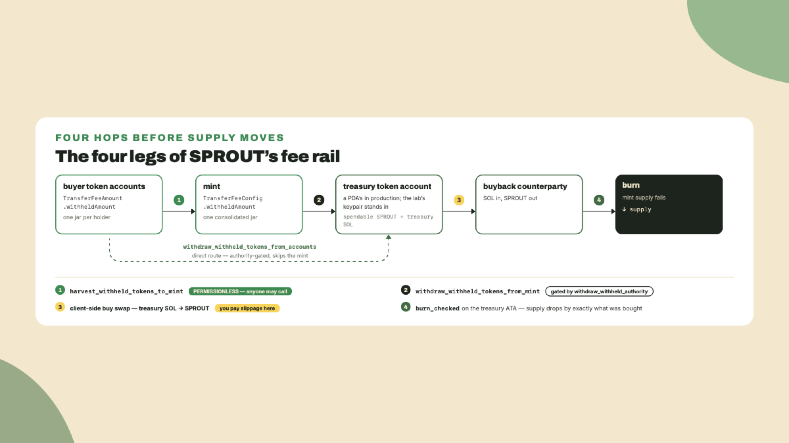
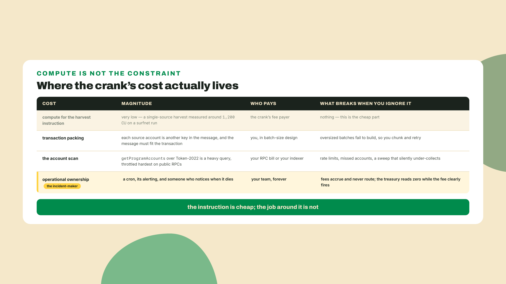
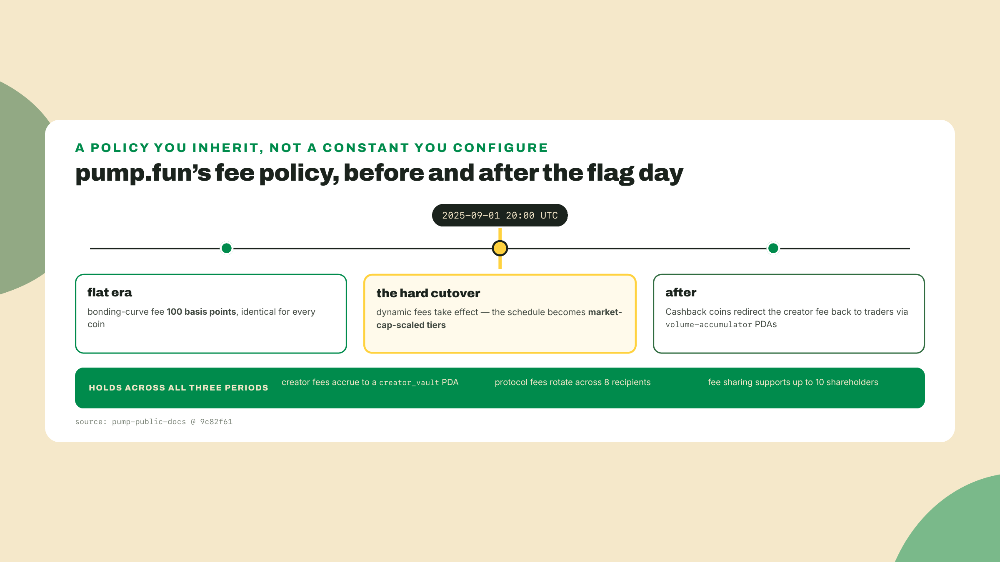
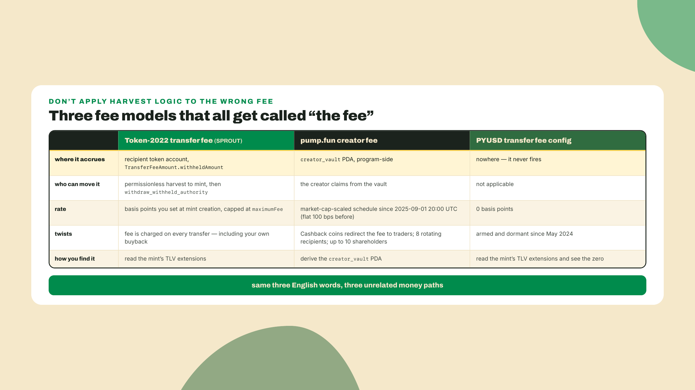
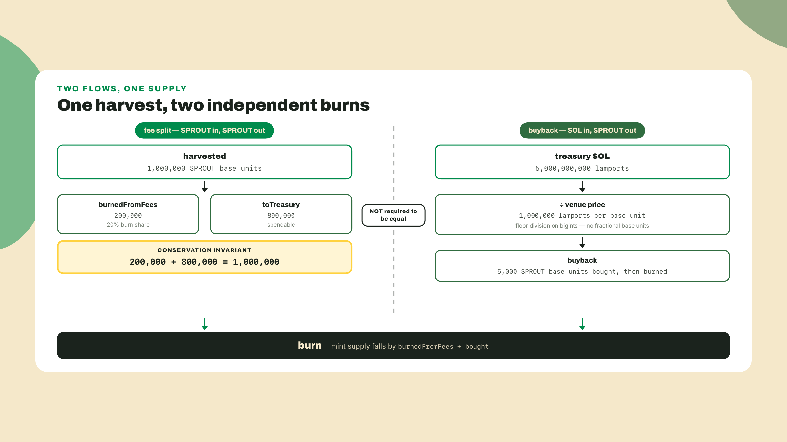
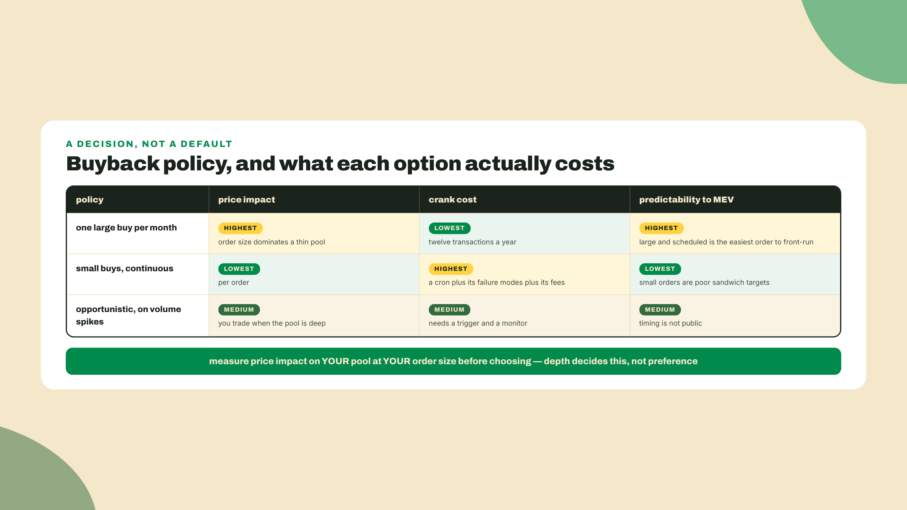
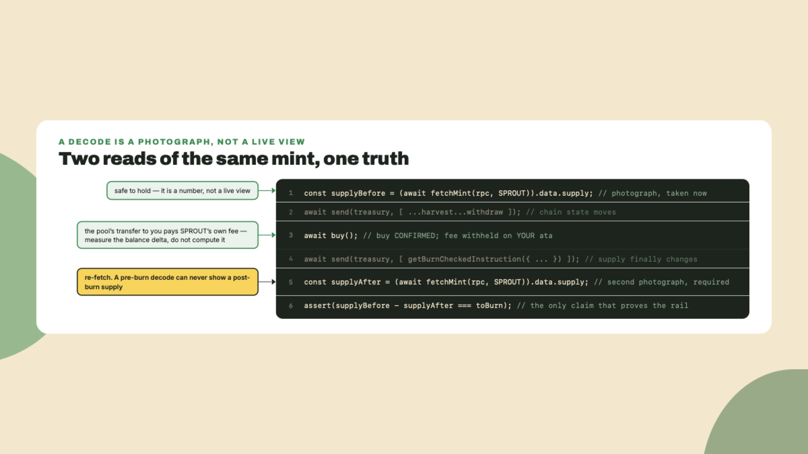
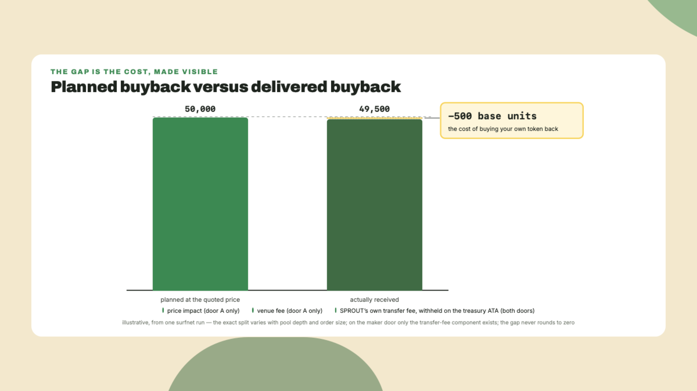
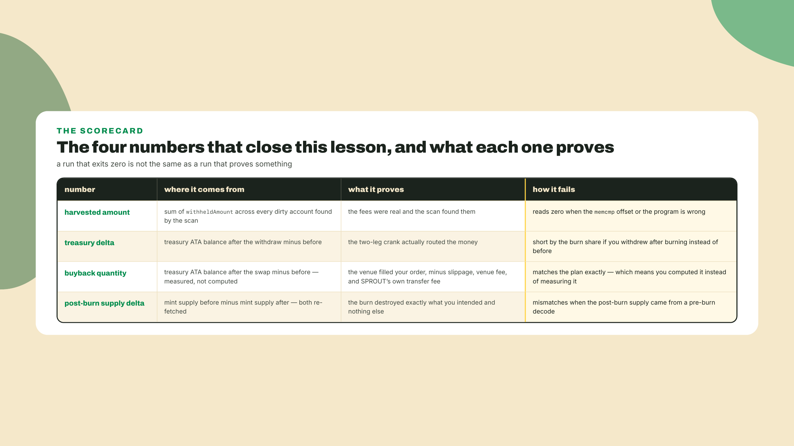

# Fee routing and buyback/burn: where the money actually flows

## Summary

Last lesson you shipped the compost airdrop: the per-recipient cost table that made the classic-versus-compressed arithmetic honest, plus an unlocked claim and a `claim_locked` vesting claim, both proven against your own byte-faithful port of the distributor's tree. Tokens went out the door. Today they come back.

Overgrowth's marketplace takes 1% of every SPROUT trade. The fee fires on every transfer. You can see it in the amounts buyers actually receive. And a week into the beta the treasury balance is still exactly zero. Nobody stole it, nothing is broken, and before you read another paragraph I want you to go look at the mint itself. Standing assumptions for this opener, since a cold resume breaks all three: your surfnet from the earlier modules is up with the SPROUT mint on it and some fee-charging trades behind it (re-mint per m05-l1's opener and run a few transfers if you are resuming fresh), the workspace root carries the kit and token-2022 pins from m02, and you run the command from that root. Drop this in `labs/m09-l1/peek.ts`:

```ts
// peek.ts: how much of SPROUT's fee income has actually reached the mint?
import { address, createSolanaRpc } from "@solana/kit";
import { fetchMint } from "@solana-program/token-2022";

async function main(): Promise<void> {
  const rpc = createSolanaRpc(process.env.RPC_HTTP ?? "http://127.0.0.1:8899");
  const mint = await fetchMint(rpc, address(process.env.SPROUT_MINT!));

  const exts = mint.data.extensions;
  const fee =
    exts.__option === "Some" ? exts.value.find((e) => e.__kind === "TransferFeeConfig") : undefined;
  if (fee?.__kind !== "TransferFeeConfig") throw new Error("no TransferFeeConfig on this mint");

  const bps = fee.newerTransferFee.transferFeeBasisPoints;
  console.log(`fee schedule: ${bps} bps, cap ${fee.newerTransferFee.maximumFee}`);
  console.log(`withheld ON THE MINT: ${fee.withheldAmount}`);
  console.log(`supply: ${mint.data.supply}`);
}

main().catch((e) => {
  console.error(e);
  process.exit(1);
});
```

Run it: `SPROUT_MINT=<your mint> npx tsx labs/m09-l1/peek.ts`, from the workspace root. You should see three lines, and the third one is the problem:

```text
fee schedule: 100 bps, cap 5000000
withheld ON THE MINT: 0
supply: 1000000000000000
```

A hundred basis points, charged all week, and zero of it has reached the mint.

That zero is the whole lesson. Today you turn a fee that exists into money that moves, and then into supply that disappears. The route, in order: where the fees actually sit and what the harvest crank does about it, then the three fee models people constantly conflate and what conflating them costs, then the split that funds a burn without inventing tokens, then the buyback itself, which is a purchase at a price somebody charges you, and finally the burn, with the stale-read trap that eats its supply assertion.

The autonomy fade for this lesson, out loud: the harvest leg is worked in full, I write every instruction and you follow along. The fee split and the buyback sizing are a completion problem, TODOs in a file whose surrounding code already runs. The full rail, marketplace fee to harvest to treasury to buyback to burn with a supply assertion at the end, is yours solo.

## Where the money actually is

### There is no cashbox behind the tollbooth

Picture a market hall where every stall pays the hall a 1% cut. You would expect a cashbox by the door. Token-2022 does not work that way. When a transfer fires, the program takes the fee out of the transferred amount and parks it in a small locked jar sitting on the *recipient's own table*, inside their token account, in a slot called `TransferFeeAmount.withheldAmount`. The buyer cannot spend it. You cannot spend it either, not from where you are standing. Ten thousand trades means ten thousand little jars scattered across ten thousand tables, and none of them is yours.

Somebody has to walk the floor.

The stake for you is concrete and it is not abstract accounting: a fee you never harvest is a fee you never earned, revenue that exists on paper and funds nothing. Every buyback you plan, every ops budget, every "the protocol is self-funding" line in your docs is downstream of one boring cron job that nobody is glamorous enough to want to own.

You built the mechanism for walking the floor back in module 2, in the economics-extensions lesson, and you tested it against a single buyer. Today it becomes the first leg of a rail with three more legs bolted onto it.



### Legs one and two: the harvest crank (consolidate, then collect)

Two instructions do the work, and the split between them is a permission design, not an accident.

`harvest_withheld_tokens_to_mint` takes a list of source token accounts and sweeps their withheld balances onto the mint, into a `withheldAmount` field that lives inside the mint's own `TransferFeeConfig`. That is the field `peek.ts` just printed as zero. It is also permissionless, which means anyone can call it on anyone's accounts, and that is safe precisely because consolidation cannot steal: the tokens only move from scattered jars into one jar that a single key can open.

`withdraw_withheld_tokens_from_mint` then opens that jar and sends the pile to a destination token account. This one is gated by the `withdraw_withheld_authority` you set at mint creation. There is also the direct route, `withdraw_withheld_tokens_from_accounts`, which skips the mint stopover and pulls from a named list of accounts straight to your destination in one authority-signed hop. Two legs for routine collection at scale, one hop for surgical pulls.

```text
harvest_withheld_tokens_to_mint        accounts -> mint    PERMISSIONLESS
withdraw_withheld_tokens_from_mint     mint -> destination  withdraw_withheld_authority
withdraw_withheld_tokens_from_accounts accounts -> dest.    withdraw_withheld_authority
```

Your destination is the treasury. For Overgrowth that is a program-derived address, a treasury PDA, whose associated token account holds SPROUT and whose SOL balance funds the buyback. A PDA rather than a hot key because the thing that receives protocol revenue should be an address with no private key, ownable by a program and auditable by anyone with an explorer. That choice costs you nothing today and saves you the conversation where a departing contractor still has the treasury seed phrase. One honesty note now, so the lab's code cannot contradict this paragraph in your head: the lab loads `treasury.json`, a plain keypair, and lets it sign directly. A PDA cannot live in a JSON file and cannot sign except through its program's `invoke_signed`, and shipping the program that would own Overgrowth's production treasury PDA is beyond this lesson's scope. So the lab's `treasury` keypair is a stand-in wearing the PDA's role: every place it signs is a place the production design's program would sign with seeds, and nothing else about the rail changes.

The authority wiring around it deserves thirty seconds, because you set it once at mint creation and it is close to permanent. `transfer_fee_config_authority` can change the fee schedule. `withdraw_withheld_authority` can collect. They are separate keys on purpose, and separating them is the difference between a governance design and a single point of failure: a multisig or a DAO can hold the rate-setting power while a boring ops key holds the sweeping power, and rotating the ops key does not touch the rate. Revoking them is not symmetric either. Null the config authority and your fee schedule is frozen forever, which is a credible commitment holders can verify. Null the withdraw authority and every fee the token ever withholds, past and future, is stranded permanently: harvesting still consolidates to the mint, and nothing can ever open that jar again. One of those revocations is a promise. The other is a tombstone. In the lab below the treasury signer holds the withdraw authority, which is fine for a fork and is not what I would ship.

### What the crank costs to run

The crank has an operating cost and it is yours forever. Somebody pays the transaction fees, somebody notices when the cron dies, somebody decides whether sweeping 400 accounts weekly beats sweeping 40 accounts daily. Almost every fee-token postmortem I have read comes down to nobody running the cron.

The good news is that the consolidation half is cheap. `harvest_withheld_tokens_to_mint` takes a whole `sources` array, so one instruction sweeps many accounts, and on my surfnet run back in the economics lesson a single-source harvest measured around 1,200 compute units. Consolidation being nearly free is exactly the right design for a call anyone is allowed to make.

The constraint that actually bites is not compute, it is the transaction. Every source account you list is another account key in the message, and the message has to fit in a transaction. So your batch size is a packing problem: how many account addresses fit alongside the instruction data and the signatures. Work it out empirically for your own setup rather than trusting a number from a blog post, because address lookup tables, extra instructions, and your fee payer all move the ceiling. Then chunk the scan's output into batches of that size and send them as separate transactions. Partial failure is survivable here in a way it rarely is: harvest is idempotent in the sense that matters, since an account with zero withheld contributes zero, so a retry that re-includes an already-swept account is a no-op rather than a double-count.

Which makes the batching itself about six lines, and worth keeping as its own function so the batch size is one number you can tune after you measure:

```ts
// chunk.ts: batch the scan's output so each harvest transaction fits the wire.
export function chunk<T>(items: T[], size: number): T[][] {
  if (size < 1) throw new Error("batch size must be at least 1");
  const out: T[][] = [];
  for (let i = 0; i < items.length; i += size) out.push(items.slice(i, i + size));
  return out;
}
```

And finding the dirty accounts is your problem too. A token account puts its mint at byte offset 0, so one `getProgramAccounts` call with a memcmp filter gives you every holder of SPROUT, and then you read each one's `TransferFeeAmount` and keep the nonzero ones. On a fork with a few dozen holders that is a two-second scan. At Jupiter-sized holder counts it is an indexing job, `getProgramAccounts` over a large program is exactly the query public RPCs throttle hardest, and the honest answer is that you rent it, the same way the asset-reading lesson had you rent a DAS provider rather than run your own indexer.



### Three fee models, and the week you lose by confusing them

Here is where I have watched competent people burn days.

pump.fun also has creator fees. They are not Token-2022 withheld fees, they do not use `TransferFeeAmount`, and no amount of harvesting will find them. Pump's creator fees are program-side: the program routes them to a `creator_vault` PDA derived per creator, and the creator claims from that vault. Different mechanism, different account, different claim path, same three English words in the pitch deck.

The rest of pump's fee machinery is worth knowing precisely, because it is the closest thing the ecosystem has to a fee-policy reference implementation. Fees ran flat at 100 basis points for the entire early era. Then, at 2025-09-01 20:00 UTC, they became a market-cap-scaled schedule: your fee tier now depends on where your coin sits, which means the fee is a policy that moves under you rather than a constant you configured. Cashback coins invert the direction entirely, redirecting the creator fee back to traders through volume-accumulator PDAs. Protocol fees rotate across 8 fee recipients so the collection accounts do not become a single hot contended write. And fee sharing supports up to 10 shareholders, so the "creator" in creator fee can be a cap table.

Read what the flag day means rather than just filing the date. Before it, a creator launching on pump knew the number: 100 basis points, the same for everyone, the same next month. After it, the fee a coin pays is a function of where that coin trades, which is a variable the creator does not set and cannot freeze. That is not a criticism of pump, whose schedule is published and whose reasoning is defensible. It is the general shape of launching on someone else's rail: you inherit their economic policy, including the version of it they ship after you launch. Your own Token-2022 fee is the opposite trade. You own the rate, you can make it permanent by nulling the config authority, and in exchange you own the harvesting, the indexing, the cron, and every integration that breaks because amount sent no longer equals amount received. Neither side of that trade is free. Pick the one whose costs you would rather be responsible for.



Now the counter-example, which is my favorite object in this entire course. In May 2024, PayPal and Paxos shipped PYUSD as the flagship compliance-shaped Token-2022 mint. It carries a transfer fee config. That config is set to 0 basis points, and it has never fired. The most institutionally serious fee-capable token on Solana collects nothing, on purpose, because what its issuers wanted was the *option*, armed and dormant, available the day a regulator or a business model asks for it. Configured is not the same as active. You have already read that same distinction off a live mint with `decode-mint`, and this is the highest-stakes example of it.



The practical rule: before you write a single line of collection code, read the mint's extensions and find out which machine you are looking at. If `TransferFeeConfig` is present with nonzero bps, harvesting applies. If the fees are program-side, go find the program's vault and its claim instruction. Wrong model, wrong week.

### The split is a conservation law

Harvest lands a pile in the treasury. Now you decide what happens to it, and this is the part where sloppy arithmetic quietly mints or destroys tokens in your accounting.

Overgrowth's policy: a share of every harvest burns immediately, the rest funds operations. Round numbers, walked one step at a time. You harvest 1,000,000 base units of SPROUT. The burn share is 20%, so 200,000 units burn on arrival and 800,000 stay in the treasury. 200,000 plus 800,000 is 1,000,000. That is not a coincidence you should be grateful for, it is the invariant your code has to hold on every input including the ugly ones: `burnedFromFees + toTreasury === harvested`. The split creates nothing and destroys nothing. It only labels.

The buyback is a completely separate leg and it is funded by a different asset. The treasury also holds SOL, from marketplace listing fees, from the launch, from wherever your revenue actually comes from. Sizing the buyback is one floor division: how many SPROUT base units does that SOL buy at the venue's current price? 5,000,000,000 lamports at 1,000,000 lamports per base unit buys 5,000 units. Floor it on bigints, always, because you cannot buy a fractional base unit and the remainder you round away is exactly the kind of quiet drift that surfaces in a supply assertion six weeks later when nobody remembers writing the line.

The trap I want you to name out loud before you write the function: the fee-burn and the buyback-burn do not have to be equal, and nothing is wrong when they are not. They are two independent flows into the same furnace. One is denominated in SPROUT you already had, the other in SOL you converted. Conservation applies inside the split, not across the two legs.



### Leg three: the buyback is a swap, and swaps cost money

Quick checkpoint on how we got here, because the next part introduces a second asset and a second client. First: fees exist but are withheld on recipient accounts, so treasury balance is not evidence of revenue. Second: legs one and two are a two-instruction crank, permissionless to consolidate and authority-gated to collect, and running it is an operational job with an owner. Third: the split of a harvest is a conservation law, and it is arithmetic between legs, not a leg of its own; the buyback it sizes is funded separately, out of SOL.

Now the part that is easy to describe and easy to get wrong emotionally.

A buyback-and-burn is not a protocol feature you enable. It is you, holding SOL, walking onto an open market, buying your own token at whatever the market charges you today, and then destroying what you bought. The venue m08-l2 chose for SPROUT is Meteora DBC graduating into a DAMM v2 pool, and that choice is not a preference, it is the residue of every decision upstream: pump and LaunchLab pin classic SPL at their create instructions and could never hold SPROUT at all, DBC took the Token-2022 mint, and DBC's migration lands on the DAMM family, v2 being the side that carries a Token-2022 base mint. The DAMM v2 program is `cpamdpZCGKUy5JxQXB4dcpGPiikHawvSWAd6mEn1sGG`, and on your mainnet fork it is the real thing, forked state and all.

Now the boundary, stated before the lab rather than discovered inside it. **This course never launches SPROUT.** m08-l1 derived a threshold on paper, m08-l2 chose a venue on paper, and neither drove a DBC config to `migration_quote_threshold` or migrated anything, because a launch is a distribution event and this course teaches the token layer. So unless you went and launched SPROUT yourself, your fork carries no SPROUT pool, and leg 3 has no market to trade against. That is not a gap the lab papers over; it is a fork in the road with two honest doors, and step 1c below is where you pick one. It also means the launchpad lesson's documented-but-unverified flag on DBC's Token-2022 base support stays open: nothing in this lesson settles it, and a learner who does launch SPROUT on DBC and reports back is the one who closes it.

The only AMM math this lesson uses is one sentence: the pool's spot price is the ratio of its two vault reserves, so quote reserve divided by base reserve gives you lamports per SPROUT base unit, and that number is what you divide your treasury SOL by to size the buy. DAMM v2 also quotes that same price natively as a square root in fixed point, and the gap between the two views, once concentrated positions open it, belongs to the DeFi course with the rest of the pool math. That is the entire mathematical content, and it is four lines you can run right now:

```ts
// sizing, standalone: what does the treasury's SOL buy at the pool's current price?
const treasurySol = 5_000_000_000n; // lamports the treasury is willing to spend
const price = 1_000_000n; // lamports per SPROUT base unit = quoteReserve / baseReserve
const buyback = treasurySol / price;
console.log(`${buyback} SPROUT base units at spot, before slippage`); // 5000
```

Note the last three words of that log line. Everything past this point in the lesson is about the gap between "at spot" and what actually lands in your account.

Pool composition, routing across venues, tick and bin math, LP strategy, and everything else that makes a swap efficient rather than merely possible is the planned DeFi and RWA Engineering course's material. I am not going to give you a shallow version of a subject that has a proper home.

What you *do* need from me is the honest cost list, because a buyback reads like free deflation and it is not.

You pay slippage, because your own buy moves the price against you, so the SPROUT you receive is less than the spot-price arithmetic promised, and on a thin pool with a large treasury order it is meaningfully less. You pay the venue's fee on top of that. You are exposed to MEV: a buyback is a large, predictable, publicly announced market order, which is roughly the ideal shape of a sandwich target, and the client-side landing tactics that mitigate that are the planned Client-Side Mastery course's territory, not this lesson's. And there is a Token-2022 specific twist that catches everyone the first time: SPROUT charges a transfer fee on *every* transfer, including the one where your counterparty sends SPROUT to your treasury. Your buyback pays your own fee. The withheld amount lands right back on the treasury's own token account, waiting for the next harvest. It is circular and harmless and it will absolutely make your arithmetic disagree with itself if you compute what you bought instead of measuring it.

Three of those four costs need a market to exist. The fourth, your own transfer fee, fires on any transfer at all, which is why it is the one component the lab can put in front of you regardless of which door you take.

So measure it. Read the treasury balance before the swap, read it after, and burn the difference. Every other approach is you asserting what the chain should have done.

Which is also why the buyback is a policy question rather than a switch you flip. How much, how often, and how predictably are three dials, and moving any of them trades one cost for another.



There is a prior question hiding here, and you already answered it. A venue only accepts your token if your extension set is one it tolerates, which is the routability work you did in the designing-a-routable-token lesson. A permanent delegate or a transfer hook that the pool's allowlist rejects means there is no venue and therefore no buyback. The extension decisions you made in module 5 are what make module 9 possible.

### Leg four: the burn, and the stale read that eats your assertion

The last leg is `burn_checked` on the treasury's token account, signed by the treasury authority, and it is the only instruction in this entire rail that reduces supply. Harvesting does not burn. Withdrawing does not burn. Sending tokens to a dead address does not burn either, whatever your favorite dashboard claims: those tokens still exist and still count in `supply`.

Three things get called deflationary and only one of them is. A burn destroys tokens and decrements the mint's `supply` field, which is a verifiable on-chain number anyone can read off the same mint account you have been decoding all course. A burn address is a wallet nobody has the key to, which removes tokens from circulation in practice and from nothing in the data: `supply` does not move, and any circulating-supply figure built on it is a convention rather than a fact. Revoking the mint authority caps future issuance and destroys nothing at all. Say which one you are doing, in those words, in whatever you publish. The `burn_checked` variant is worth preferring over plain `burn` for the same reason `transfer_checked` beat `transfer`: it makes you pass the mint and the decimals, and the program refuses if they disagree with the account. A decimals mistake on a burn is unrecoverable in a way a decimals mistake on a transfer usually is not.

The footgun is the read, not the write. If you fetch the mint, then burn, then report from the object you fetched earlier, you will report the old supply and your assertion will pass or fail for reasons that have nothing to do with your code. Anything you decoded before a transaction is a photograph, not a live feed. Fetch the mint again after the burn confirms. The Anchor equivalent of this is calling `.reload()` after a CPI that touched your account, and the failure mode is identical in both worlds.



## Lab: wire Overgrowth's fee rail

You are building `sprout-economy`, the rung that turns SPROUT from a token with a fee into a token with an economy. It consumes two things you already own: `sprout-mint` from module 2, which is where the fee config lives, and `sprout-launch` from the launch lessons, whose venue decision is why SPROUT would graduate on Meteora DBC into a DAMM v2 pool rather than on a classic-SPL launchpad that cannot hold its mint. Four modules of work converge on one script.

Run it against surfpool, forked from mainnet, so the DAMM v2 program and its accounts are real. If surfpool is not already running from the earlier labs, `surfpool start --no-tui --no-studio` in another terminal is the whole ceremony (install: `brew install txtx/taps/surfpool`, or `cargo install surfpool-cli`; verified on 1.2.1).

**1. Pin the toolchain.** Two lines, and the second one needs a word of honesty.

```bash
npm install @solana/kit@7.1.1 @solana-program/token-2022@0.15.0 @solana-program/system@0.13.0
npm install @meteora-ag/cp-amm-sdk@1.4.6 @solana/web3.js@1.98.4 bn.js@5.2.2
npm install -D tsx@4.23.12 typescript@5.9.3 @types/node @types/bn.js
```

Checked against npm on 2026-09-05: kit's `latest` tag is 8.2.0, published 2026-08-29, but the first line pins by peer range, not by latest: `@solana-program/token-2022@0.15.0` is the current minor peering kit `^7.0.0` — the 0.16.0 release jumped to `^8` — so kit sits at 7.1.1, the newest release inside that range, and `@solana-program/system@0.13.0` matches it. Re-run `npm view @solana-program/token-2022@0.15.0 peerDependencies` when you scaffold; this matrix moves monthly.

The second line is the interesting one, and it is only needed if you take door A below. `@meteora-ag/cp-amm-sdk` is Meteora's first-party DAMM v2 client and it ships web3.js v1 types, not kit. You are going to run two clients in one workspace, and that is not a mistake I am hiding from you: it is what integrating with a first-party SDK actually looks like in 2026. Kit does the Token-2022 legs because that is where kit is excellent. Web3.js v1 does the swap leg because that is what the venue's own SDK speaks. The 1.4.6 pin is a 2026-08-21 npm read, fitting for an SDK whose deeper machinery this course hands off rather than teaches; run `npm view @meteora-ag/cp-amm-sdk version` the day you scaffold.

Name the rule this arrangement rides, because m05-l1 stated it and this lab is where it gets tested: Meteora publishes no kit surface for DAMM v2, so the v1 dependency is unavoidable, and it stays quarantined to **exactly one file**, `venue.ts`. Nothing else in the lab imports web3.js, not even indirectly — `venue.ts` builds its own `Connection`, signs with its own `Keypair`, and hands the rest of the rail plain values. That is the quarantine working: the two stacks meet at the chain, not in a shared import list. If you find yourself reaching for a `PublicKey` in `wire-economy.ts`, the seam has leaked and the fix is to push the leak back inside `venue.ts`.

**1b. Create `treasury.json`, the key the whole rail signs with.** No earlier module made this file, and that is a gap to close now rather than discover at step 6: the m02 scripts parked every authority on throwaway in-memory signers, fine for throwaway mints and useless for a rail whose withdraw leg has to be signable next week. Mint the key once and fund it on the fork:

```bash
solana-keygen new --no-bip39-passphrase -o labs/m09-l1/treasury.json
solana airdrop 100 "$(solana-keygen pubkey labs/m09-l1/treasury.json)" --url http://127.0.0.1:8899
```

Then make the chain agree that this key holds the powers the rail exercises. Fee authorities are set at mint creation, and the throwaway keys holding them on any older SPROUT died with their process — so this is exactly the standing assumptions' "re-mint per m05-l1's opener" case, with one edit first. Open the composed-SPROUT builder (`labs/m02-l1/verify-economics.ts`, as re-pointed in m02-l4 step 7), load the treasury signer at the top with the same two `createKeyPairSignerFromBytes` lines `wire-economy.ts` uses below, and pass that signer in place of the throwaway one for exactly two roles: the mint authority and the fee config's `withdrawWithheldAuthority`. Re-mint, re-run your marketplace transfers, and the fork now carries a SPROUT whose fee jar this file can open — and whose supply next lesson's conversion window can mint, which is why the mint authority moves onto the same key. One echo from the theory section, so the code cannot contradict it in your head: production wants a PDA in this role, not a JSON file; every place this key signs is a place your program would `invoke_signed`.

You do not need to open the treasury's SPROUT token account by hand, and the asymmetry with step 1c's `--fund-recipient` is deliberate rather than an oversight: `wire-economy.ts` creates it itself, idempotently, as the first instruction of the harvest transaction. That is on purpose. The maker's account is set up once by a human before the rail exists, whereas the treasury's is a precondition of the rail's own first write, so the rail owns it and a cold re-run cannot leave you a derived address that was never created.

**1c. Pick leg 3's door, and stand up its counterparty.** The buyback needs someone to buy from. Two doors, and the rail downstream cannot tell them apart, which is the point.

*Door A, the market.* You launched SPROUT yourself on Meteora DBC, drove the curve past your `migration_quote_threshold`, and kept the DAMM v2 pool address the migration printed. Nothing in this course walks you through that, and I am not going to pretend otherwise. If you have that pool, set `SPROUT_POOL` and leg 3 is a real swap with real slippage against real forked state.

*Door B, the maker.* You do not, because you followed the course. SPROUT has no market, so you stand one up: a single counterparty holding SPROUT, willing to sell at a price you set. This is not a market and the lab will not call it one. What it preserves is every property of the rail that does not depend on price discovery — the harvest, the split's conservation, the fee firing on the payout, measuring instead of computing, and the supply assertion at the end. What it drops is slippage and MEV, which need a book to exist against.

```bash
solana-keygen new --no-bip39-passphrase -o labs/m09-l1/maker.json
solana airdrop 10 "$(solana-keygen pubkey labs/m09-l1/maker.json)" --url http://127.0.0.1:8899
```

Then give the maker something to sell. Your treasury key holds the mint authority after step 1b, so one `spl-token mint` puts inventory on the maker's books; size it well above whatever the treasury will spend, or leg 3 fails on the seller's balance rather than on anything you were trying to learn:

```bash
spl-token mint "$SPROUT_MINT" 1000 \
  --recipient-owner "$(solana-keygen pubkey labs/m09-l1/maker.json)" \
  --mint-authority labs/m09-l1/treasury.json \
  --fund-recipient --url http://127.0.0.1:8899
```

Say the quiet part before you run the rail: a buyback price you set yourself is not a market price. On a venue, the number is the reserve ratio and the market hands it to you. Here you are both sides of the trade, so the price is a governance decision that merely looks like a constant, and every conclusion you draw from a door-B run inherits that. The venue module in step 3 exists so the day SPROUT does have a pool, the only line that changes is which door you opened.

**2. Find the pile.** Create `find-withheld.ts`. This is the account scan, and it is the tool the rest of the rail is built on.

```ts
// find-withheld.ts: which SPROUT accounts are sitting on withheld marketplace fees?
import type {
  Address,
  Base58EncodedBytes,
  GetMultipleAccountsApi,
  GetProgramAccountsApi,
  Rpc,
} from "@solana/kit";
import { TOKEN_2022_PROGRAM_ADDRESS, fetchAllMaybeToken } from "@solana-program/token-2022";

export type DirtyAccount = { account: Address; withheld: bigint };

/** Every token account of `mint` carrying a nonzero TransferFeeAmount.withheldAmount. */
export async function findWithheld(
  rpc: Rpc<GetProgramAccountsApi & GetMultipleAccountsApi>,
  mint: Address,
): Promise<DirtyAccount[]> {
  // Token account layout puts the mint at offset 0, so one memcmp finds every holder.
  const holders = await rpc
    .getProgramAccounts(TOKEN_2022_PROGRAM_ADDRESS, {
      encoding: "base64",
      withContext: false,
      dataSlice: { offset: 0, length: 0 },
      filters: [
        { memcmp: { offset: 0n, bytes: mint as string as Base58EncodedBytes, encoding: "base58" } },
      ],
    })
    .send();

  const decoded = await fetchAllMaybeToken(
    rpc,
    holders.map((h) => h.pubkey),
  );

  const dirty: DirtyAccount[] = [];
  for (const account of decoded) {
    if (!account.exists) continue;
    const extensions = account.data.extensions;
    if (extensions.__option !== "Some") continue;
    for (const ext of extensions.value) {
      if (ext.__kind === "TransferFeeAmount" && ext.withheldAmount > 0n) {
        dirty.push({ account: account.address, withheld: ext.withheldAmount });
      }
    }
  }
  return dirty;
}
```

The `dataSlice: { offset: 0, length: 0 }` matters more than it looks. The scan needs addresses, not data, so you ask the RPC for zero bytes per account and then fetch and decode only what you found. On a public RPC with a large holder set, the version that pulls full account data for every holder is the version that gets you rate limited.

**3. Door A's venue.** Create `venue.ts`. This is the swap leg, and it is small because the SDK is doing the work. It is also the lab's entire web3.js surface: the `Connection`, the `Keypair`, the `PublicKey`s and the send all live in here and never escape.

```ts
// venue.ts: SPROUT's graduation venue, read and traded client-side.
// web3.js v1 here on purpose AND NOWHERE ELSE: the first-party Meteora SDK
// ships v1 types, so this file is the quarantine. It takes strings and bytes,
// it returns bigints and strings, and nothing v1-shaped crosses its boundary.
import { Connection, Keypair, PublicKey, Transaction } from "@solana/web3.js";
import BN from "bn.js";
import { CpAmm, CP_AMM_PROGRAM_ID } from "@meteora-ag/cp-amm-sdk";

export const DAMM_V2_PROGRAM = CP_AMM_PROGRAM_ID.toBase58();

// The two token programs the pool straddles: SPROUT is Token-2022, wSOL is classic.
const TOKEN_2022 = new PublicKey("TokenzQdBNbLqP5VEhdkAS6EPFLC1PHnBqCXEpPxuEb");
const TOKEN_CLASSIC = new PublicKey("TokenkegQfeZyiNwAJbNbGKPFXCWuBvf9Ss623VQ5DA");

export type Venue = {
  /** lamports of quote per one base unit of SPROUT, floored */
  priceLamportsPerToken: bigint;
  /** Sends the buy and returns only once it has CONFIRMED. Measuring is the caller's job. */
  buy: (quoteLamports: bigint, slippagePct: number) => Promise<string>;
};

/**
 * Open a DAMM v2 pool on the fork and expose a client-side buy.
 * Throws if the pool is absent, because guessing which pool you meant is not
 * this module's job: SPROUT only has one if you launched and migrated it.
 */
export async function openVenue(
  rpcUrl: string,
  baseMint: string,
  pool: string,
  buyerSecret: Uint8Array,
): Promise<Venue> {
  const connection = new Connection(rpcUrl, "confirmed");
  const buyer = Keypair.fromSecretKey(buyerSecret);
  const poolKey = new PublicKey(pool);
  const baseKey = new PublicKey(baseMint);

  if ((await connection.getAccountInfo(poolKey)) === null) {
    throw new Error(`no DAMM v2 pool at ${pool} for ${baseMint}: this fork has no market for that mint`);
  }

  const cpAmm = new CpAmm(connection);
  const state = await cpAmm.fetchPoolState(poolKey);
  if (!state.tokenAMint.equals(baseKey)) {
    throw new Error(`pool ${pool} does not carry ${baseMint} as its base mint: wrong pool`);
  }

  // The only AMM math this course does: spot price is the vault-reserve ratio.
  const base = BigInt((await connection.getTokenAccountBalance(state.tokenAVault)).value.amount);
  const quote = BigInt((await connection.getTokenAccountBalance(state.tokenBVault)).value.amount);
  const priceLamportsPerToken = base === 0n ? 0n : quote / base;

  return {
    priceLamportsPerToken,
    buy: async (quoteLamports: bigint, slippagePct: number) => {
      // The SDK's slippage dial is minimumAmountOut: the spot-sized fill, shaved by your tolerance.
      const atSpot = priceLamportsPerToken === 0n ? 0n : quoteLamports / priceLamportsPerToken;
      const minOut = (atSpot * BigInt(100 - slippagePct)) / 100n;
      const tx = await cpAmm.swap({
        payer: buyer.publicKey,
        pool: poolKey,
        inputTokenMint: state.tokenBMint, // quote (wSOL) in; the builder handles the wrap
        outputTokenMint: state.tokenAMint, // SPROUT out
        amountIn: new BN(quoteLamports.toString()),
        minimumAmountOut: new BN(minOut.toString()),
        tokenAMint: state.tokenAMint,
        tokenBMint: state.tokenBMint,
        tokenAVault: state.tokenAVault,
        tokenBVault: state.tokenBVault,
        tokenAProgram: TOKEN_2022,
        tokenBProgram: TOKEN_CLASSIC,
        referralTokenAccount: null,
      });
      // v1's sendTransaction returns at SUBMISSION, not confirmation. Read the
      // treasury balance before this settles and you measure a pre-swap
      // photograph (the burn section's stale-read trap, client-side edition),
      // so the confirm belongs in here rather than in the caller's hopes.
      const swap = new Transaction().add(...tx.instructions);
      const signature = await connection.sendTransaction(swap, [buyer], { skipPreflight: false });
      const latest = await connection.getLatestBlockhash("confirmed");
      await connection.confirmTransaction({ signature, ...latest }, "confirmed");
      return signature;
    },
  };
}
```

Check the two assertions at the top of `openVenue`. If the pool is not there, the first throws instead of guessing. If the pool exists but carries some other base mint, the second throws before you trade somebody else's market. A tool that fails loudly at the boundary of its own responsibility is worth ten that return `undefined` and let the failure surface three functions later. Door-B readers should still prove that boundary is real rather than take my word for it, and it costs one command with no pool required:

```bash
SPROUT_MINT=<mint> npx tsx -e "import {openVenue} from './venue'; \
  await openVenue('http://127.0.0.1:8899', process.env.SPROUT_MINT!, '11111111111111111111111111111112', new Uint8Array(64));"
```

That address is a real account and not a DAMM v2 pool, so you get the first throw, by name, in under a second. The module is inert until SPROUT has a market; it is not broken.

**3b. Door B's counterparty.** Create `maker.ts`. Same interface, no vendor SDK, no web3.js — this one is first-party and therefore kit all the way down.

```ts
// maker.ts: leg 3's counterparty when the token has no market.
// The price is a POLICY input, not a reserve ratio. Everything else about the
// leg is identical to the venue's: SOL out, SPROUT in, the fee fires on the
// payout, and the caller measures what landed instead of computing it.
import type { Address, Instruction, TransactionSigner } from "@solana/kit";
import { getTransferSolInstruction } from "@solana-program/system";
import {
  findAssociatedTokenPda,
  getTransferCheckedInstruction,
  TOKEN_2022_PROGRAM_ADDRESS,
} from "@solana-program/token-2022";

export type Maker = {
  priceLamportsPerToken: bigint;
  buyIxs: (quoteLamports: bigint) => Instruction[];
};

export async function openMaker(
  mint: Address,
  decimals: number,
  maker: TransactionSigner,
  buyer: TransactionSigner,
  priceLamportsPerToken: bigint,
): Promise<Maker> {
  if (priceLamportsPerToken <= 0n) {
    throw new Error("MAKER_PRICE must be a positive lamport price per base unit");
  }
  const [makerAta] = await findAssociatedTokenPda({
    mint,
    owner: maker.address,
    tokenProgram: TOKEN_2022_PROGRAM_ADDRESS,
  });
  const [buyerAta] = await findAssociatedTokenPda({
    mint,
    owner: buyer.address,
    tokenProgram: TOKEN_2022_PROGRAM_ADDRESS,
  });

  return {
    priceLamportsPerToken,
    // Both legs of the trade in ONE transaction, so neither side can take the
    // money and walk. Two signers, one atomic settlement: this is the smallest
    // honest OTC trade you can write, and it is what an escrow program
    // automates when the counterparty is a stranger rather than your own key.
    buyIxs: (quoteLamports: bigint) => [
      getTransferSolInstruction({
        source: buyer,
        destination: maker.address,
        amount: quoteLamports,
      }),
      getTransferCheckedInstruction({
        source: makerAta,
        mint,
        destination: buyerAta,
        authority: maker,
        amount: quoteLamports / priceLamportsPerToken,
        decimals,
      }),
    ],
  };
}
```

The floor division in `amount` is the same one `routeFees` does, for the same reason: you cannot buy a fractional base unit. And note what this file does NOT do. It does not compute what the treasury will receive. It transfers `quoteLamports / price` units, the transfer fee comes off that in flight, and what lands is smaller. Nobody here asserts by how much.

**4. The split, and this one is yours.** Create `route-fees.ts` with the signature below. The body has two TODOs and the theory section gave you both answers in plain words.

```ts
// route-fees.ts: split the harvest, size the buyback. Pure arithmetic, no chain.
export function routeFees(
  harvested: bigint,
  burnBps: number,
  treasurySol: bigint,
  priceLamportsPerToken: bigint,
): { burnedFromFees: bigint; toTreasury: bigint; buyback: bigint } {
  const burnedFromFees = (harvested * BigInt(burnBps)) / 10000n;
  // TODO: what stays in the treasury, such that the two shares sum back to `harvested`
  const toTreasury = 0n;
  // TODO: how many SPROUT base units does `treasurySol` buy at this price, floored
  const buyback = 0n;
  return { burnedFromFees, toTreasury, buyback };
}
```

Keep everything on bigints. The moment a `Number` touches a lamport count above 2^53 your arithmetic starts lying quietly, and lamport counts get there faster than you think.

**5. The rail.** Create `wire-economy.ts`. This is the artifact, and it reads top to bottom as the four legs in order.

```ts
// wire-economy.ts: SPROUT's fee rail, end to end, against the mainnet fork.
// Kit only. The one web3.js dependency in this lab lives behind venue.ts.
import {
  address,
  appendTransactionMessageInstructions,
  createKeyPairSignerFromBytes,
  createSolanaRpc,
  createSolanaRpcSubscriptions,
  createTransactionMessage,
  pipe,
  sendAndConfirmTransactionFactory,
  setTransactionMessageFeePayerSigner,
  setTransactionMessageLifetimeUsingBlockhash,
  signTransactionMessageWithSigners,
  assertIsTransactionWithBlockhashLifetime,
  type Instruction,
  type KeyPairSigner,
} from "@solana/kit";
import {
  fetchMint,
  fetchToken,
  getBurnCheckedInstruction,
  getCreateAssociatedTokenIdempotentInstructionAsync,
  getHarvestWithheldTokensToMintInstruction,
  getWithdrawWithheldTokensFromMintInstruction,
  findAssociatedTokenPda,
  TOKEN_2022_PROGRAM_ADDRESS,
} from "@solana-program/token-2022";
import { readFileSync } from "node:fs";
import { findWithheld } from "./find-withheld";
import { openMaker } from "./maker";
import { routeFees } from "./route-fees";
import { openVenue } from "./venue";

const RPC_HTTP = process.env.RPC_HTTP ?? "http://127.0.0.1:8899";
const RPC_WS = process.env.RPC_WS ?? "ws://127.0.0.1:8900";
const SPROUT = address(process.env.SPROUT_MINT!);
const SPROUT_DECIMALS = 6;
const SPROUT_POOL = process.env.SPROUT_POOL; // door A only: a DAMM v2 pool that holds SPROUT
const MAKER_KEY = process.env.MAKER_KEY; // door B: the counterparty from step 1c
const MAKER_PRICE = BigInt(process.env.MAKER_PRICE ?? "1000000"); // door B: lamports per base unit
const BURN_BPS = 2000; // 20% of every harvest burns on arrival
const SLIPPAGE_PCT = 1;

const rpc = createSolanaRpc(RPC_HTTP);
const rpcSubscriptions = createSolanaRpcSubscriptions(RPC_WS);
const sendAndConfirm = sendAndConfirmTransactionFactory({ rpc, rpcSubscriptions });

function loadSecret(path: string): Uint8Array {
  return new Uint8Array(JSON.parse(readFileSync(path, "utf8")));
}

async function send(payer: KeyPairSigner, ixs: Instruction[]): Promise<void> {
  const { value: blockhash } = await rpc.getLatestBlockhash().send();
  const message = pipe(
    createTransactionMessage({ version: 0 }),
    (m) => setTransactionMessageFeePayerSigner(payer, m),
    (m) => setTransactionMessageLifetimeUsingBlockhash(blockhash, m),
    (m) => appendTransactionMessageInstructions(ixs, m),
  );
  const signed = await signTransactionMessageWithSigners(message);
  assertIsTransactionWithBlockhashLifetime(signed);
  await sendAndConfirm(signed, { commitment: "confirmed" });
}

async function main(): Promise<void> {
  const secret = loadSecret(process.env.TREASURY_KEY!);
  const treasury = await createKeyPairSignerFromBytes(secret);
  const [treasuryAta] = await findAssociatedTokenPda({
    mint: SPROUT,
    owner: treasury.address,
    tokenProgram: TOKEN_2022_PROGRAM_ADDRESS,
  });

  const supplyBefore = (await fetchMint(rpc, SPROUT)).data.supply;

  // LEGS 1 + 2: harvest (permissionless consolidate) then withdraw
  // (authority-gated collect), one transaction. Fees are withheld on
  // recipient accounts until someone moves them.
  const dirty = await findWithheld(rpc, SPROUT);
  const harvested = dirty.reduce((sum, d) => sum + d.withheld, 0n);
  console.log(`dirty accounts: ${dirty.length}, withheld total: ${harvested}`);
  if (harvested === 0n) throw new Error("nothing withheld: run marketplace trades first");

  // Open the treasury's SPROUT account before anything tries to pay into it.
  // `findAssociatedTokenPda` above DERIVED an address; deriving is not creating,
  // and every leg from here down writes to this account: leg 2 names it as
  // `feeReceiver`, leg 3 has the counterparty transfer into it, leg 4 burns out
  // of it. Idempotent, so re-running the rail is free.
  const openTreasuryAta = await getCreateAssociatedTokenIdempotentInstructionAsync({
    payer: treasury,
    owner: treasury.address,
    mint: SPROUT,
  });

  await send(treasury, [
    openTreasuryAta,
    getHarvestWithheldTokensToMintInstruction({
      mint: SPROUT,
      // Fork scale: a handful of dirty accounts fits one transaction, so the
      // whole list rides in one instruction. At fleet scale this is where the
      // packing problem bites: wrap the list in the chunk() helper from the
      // "what the crank costs to run" section and send one harvest per batch.
      sources: dirty.map((d) => d.account),
    }),
    getWithdrawWithheldTokensFromMintInstruction({
      mint: SPROUT,
      feeReceiver: treasuryAta,
      withdrawWithheldAuthority: treasury,
    }),
  ]);

  // BETWEEN LEGS: get a price, then run the split. The split is arithmetic,
  // not a leg of its own; its output sizes and predicts leg 3.
  //
  // Door A reads the price off a real pool's reserves. Door B is told the
  // price, because with no market there is nothing to read it from. The rest
  // of this function cannot tell which one ran, which is the whole design.
  const treasurySol = (await rpc.getBalance(treasury.address).send()).value / 2n;
  let priceLamportsPerToken: bigint;
  let buy: () => Promise<void>;

  if (SPROUT_POOL) {
    const venue = await openVenue(RPC_HTTP, SPROUT, SPROUT_POOL, secret);
    priceLamportsPerToken = venue.priceLamportsPerToken;
    buy = async () => {
      await venue.buy(treasurySol, SLIPPAGE_PCT);
    };
    console.log(`door A: DAMM v2 pool ${SPROUT_POOL} at ${priceLamportsPerToken} lamports/unit`);
  } else {
    if (!MAKER_KEY) throw new Error("set SPROUT_POOL (door A) or MAKER_KEY (door B); step 1c picks one");
    const maker = await createKeyPairSignerFromBytes(loadSecret(MAKER_KEY));
    const otc = await openMaker(SPROUT, SPROUT_DECIMALS, maker, treasury, MAKER_PRICE);
    priceLamportsPerToken = otc.priceLamportsPerToken;
    buy = async () => {
      await send(treasury, otc.buyIxs(treasurySol));
    };
    console.log(
      `door B: no SPROUT market on this fork; buying from maker ${maker.address} ` +
        `at ${priceLamportsPerToken} lamports/unit (a price you set, not a price you read)`,
    );
  }

  const plan = routeFees(harvested, BURN_BPS, treasurySol, priceLamportsPerToken);
  if (plan.toTreasury === 0n || plan.buyback === 0n) {
    throw new Error(
      "route-fees.ts TODOs look unfilled: a zero treasury share or zero-sized buyback plan means the split never ran. Fill them before running the rail.",
    );
  }
  console.log(
    `split: burn ${plan.burnedFromFees} + keep ${plan.toTreasury} = ${harvested}; ` +
      `buyback target ~${plan.buyback} SPROUT at ${priceLamportsPerToken} lamports/unit`,
  );

  // LEG 3: the buyback. Whichever door opened, it is sized in SOL and it costs
  // you something. plan.buyback is the floor-division PREDICTION of what that
  // SOL buys; the planned-vs-bought line below is leg 3's cost made visible.
  const balanceBefore = (await fetchToken(rpc, treasuryAta)).data.amount;
  await buy();
  // Re-read the account AFTER the buy confirms. Cached balances are how supply math goes wrong.
  const balanceAfter = (await fetchToken(rpc, treasuryAta)).data.amount;
  const bought = balanceAfter - balanceBefore;
  console.log(`bought ${bought} SPROUT (planned ${plan.buyback}, the gap is what leg 3 cost you)`);

  // LEG 4: burn exactly what the buyback bought, plus the fee-burn share.
  const toBurn = bought + plan.burnedFromFees;
  await send(treasury, [
    getBurnCheckedInstruction({
      account: treasuryAta,
      mint: SPROUT,
      authority: treasury,
      amount: toBurn,
      decimals: 6,
    }),
  ]);

  const supplyAfter = (await fetchMint(rpc, SPROUT)).data.supply;
  const dropped = supplyBefore - supplyAfter;
  console.log(`supply ${supplyBefore} -> ${supplyAfter} (down ${dropped}, burned ${toBurn})`);
  if (dropped !== toBurn) throw new Error(`supply drop ${dropped} != burn ${toBurn}`);
  console.log("rail closed: harvested, split, bought back, burned");
}

main().catch((e) => {
  console.error(e);
  process.exit(1);
});
```

**6. Run it, with the `route-fees.ts` TODOs filled first.** The rail now refuses to run against the stub (a zero split throws before any lamport moves), so this step assumes step 4 is done. Every command in this step runs from inside `labs/m09-l1/`, which is where steps 1b through 5 put the files; the relative key paths below assume it.

```bash
cd labs/m09-l1
# door B, the one the course guarantees
SPROUT_MINT=<mint> MAKER_KEY=./maker.json TREASURY_KEY=./treasury.json npx tsx wire-economy.ts
# door A, if you launched SPROUT yourself and have its pool
SPROUT_MINT=<mint> SPROUT_POOL=<pool> TREASURY_KEY=./treasury.json npx tsx wire-economy.ts
```

A healthy door-B run says something close to this. The withheld total and the treasury balance are yours, so only the *shape* transfers; the arithmetic between the lines is what you check.

```text
dirty accounts: 7, withheld total: 2500000
door B: no SPROUT market on this fork; buying from maker 8k2...Uq at 1000000 lamports/unit (a price you set, not a price you read)
split: burn 500000 + keep 2000000 = 2500000; buyback target ~50000 SPROUT at 1000000 lamports/unit
bought 49500 SPROUT (planned 50000, the gap is what leg 3 cost you)
supply 1000000000000000 -> 999999999450500 (down 549500, burned 549500)
rail closed: harvested, split, bought back, burned
```

Read those five lines against each other, because they only agree if the rail worked. The split line sums: 500,000 plus 2,000,000 is 2,500,000, exactly what the scan found. The buyback target is the treasury's spendable half, about 50 SOL after step 1b's airdrop, divided by the price. And the fourth line is the honest one: you planned 50,000 and 49,500 landed, because SPROUT charges its own 100-bps fee on the maker's payout to you and 500 units stayed behind as withheld — on your treasury's own account, waiting for the next harvest, which is the circularity the theory section warned about made visible. On door A that same line would also carry slippage and the venue's fee, and the number would be smaller still. Either way you paid something to buy your own token back, which is what a buyback has always been once you strip the word of its marketing.



If the run throws `supply drop != burn`, you almost certainly computed `bought` instead of measuring it, or you re-used the pre-burn mint object. Both are the same mistake.

## Challenge

**Completion.** Fill the two TODOs in `route-fees.ts` and prove them with the module's coding challenge, `route-fees`, which hands you a broken version and a test suite. One convention differs from your project copy: the graded file is standalone, so it declares a plain `function routeFees(harvested, burnBps, treasurySol, priceLamportsPerToken)` with no `export` keyword, because the grader splices your code into its own runner and calls the function directly with those four positional arguments, bigints for the three amounts and a plain number for the basis points. Keep the `export` in the project copy that `wire-economy.ts` imports; drop it in the challenge editor. The starter breaks conservation, because `toTreasury` ignores the burned share, and mis-sizes the buyback, because it multiplies by the price instead of dividing. Your version has to hold `burnedFromFees + toTreasury === harvested` for every input, floor the buyback on bigints, leave the whole harvest in the treasury at a 0 bps burn share, and drive `toTreasury` to zero at 10000 bps.

**Solo.** Wire the whole rail yourself against the fork and prove it. Generate marketplace volume first, at least a dozen transfers across several buyers so the scan finds real work to do, then run `wire-economy.ts` end to end and produce four numbers: the harvested amount, the treasury delta, the buyback quantity actually received, and the post-burn supply delta. The gate is the assertion already in the script: supply fell by exactly what you burned, no more and no less.



**The empirical probe, if you want the real answer to a question this lesson only gestured at.** Run the buyback twice, once with a small slice of the treasury and once with the whole thing, and record the delivered-versus-planned gap each time. Then look at the treasury's own token account afterward and find the withheld SPROUT sitting on it, fees your own buyback paid to yourself.

On door B the second number is the honest one and the first is a control: the gap will scale exactly with order size, because the only cost in play is a percentage fee with a cap, and watching it *not* misbehave is how you learn what slippage would have looked like if there had been a book. On door A the first number is the one that teaches, because the gap widens super-linearly as your order eats the pool, and that curve is what fills in the policy table from the theory section with your own values. The choice between sweeping everything monthly and buying small orders continuously is one no lesson can make for you, because it depends on your pool's depth rather than on your intentions — and door B, having no depth, cannot answer it at all. Knowing which of those two runs you are holding is the same skill m05-l1 asked for when it separated a predictor from a proof.

## Checkpoint

You are done when a single script run prints the four numbers and exits zero: harvested amount, treasury delta, buyback quantity, post-burn supply delta, with the supply drop equal to the burn to the base unit. Keep that output. The capstone lesson asks you to compose an economy from the primitives you built, and this rail is the piece that makes the word economy honest rather than decorative.

One more thing before you close the folder, and it is the part of a fee-rail design that never appears in the launch thread. Name the two signals that would tell you this policy is wrong, and name them now while you have no emotional position on the answer. Signal one: the delivered-versus-planned gap on your buybacks. If it stays small, your order size fits your pool and continuous buying is cheap. If it widens as the treasury grows, you are paying an increasing tax to convert revenue into burn, and at some point routing that SOL to something other than a buyback is the better use of it. Signal two: the ratio between what the crank costs to run and what it collects. A harvest that sweeps less value than the transactions cost to send is not a fee rail, it is a hobby, and the honest response is to sweep less often rather than to pretend the schedule is working. Write both thresholds down with actual numbers from your own runs. A policy nobody can falsify is a slogan.

Three failures I expect. The first is a harvest that reports zero on a mint that clearly charges fees, which almost always means the memcmp filter is matching the wrong offset or the wrong program, since a classic SPL mint and a Token-2022 mint are different owners and the scan is scoped by program. The second is a `withdraw_withheld_tokens_from_mint` that fails on authority, which means you passed an address where the builder wanted a signer. The third is door B's buy failing on the maker's balance, which means step 1c minted less inventory than half your treasury can buy at `MAKER_PRICE`; mint more or raise the price, and note that having to choose is itself the tell that you are the market rather than trading on one. If the numbers still refuse to reconcile after you have checked all three, bring your run output and your expected arithmetic to the course discussion, and on door A post the pool's reserves alongside them, because half the time the disagreement is slippage rather than a bug and the reserves are what prove it.

SPROUT now earns fees into a treasury it controls and burns supply on a schedule you set. What it does not do is care who is holding it. Next: deciding who gets in, and turning the compost points Overgrowth has been tracking off-chain into real SPROUT that people can actually spend.
