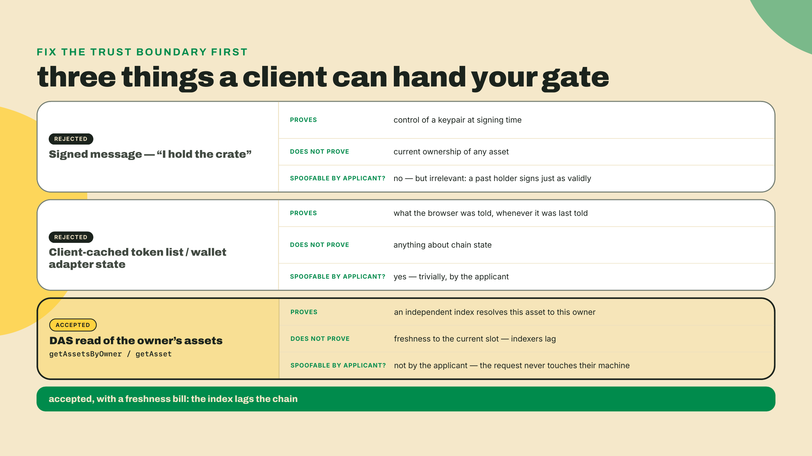
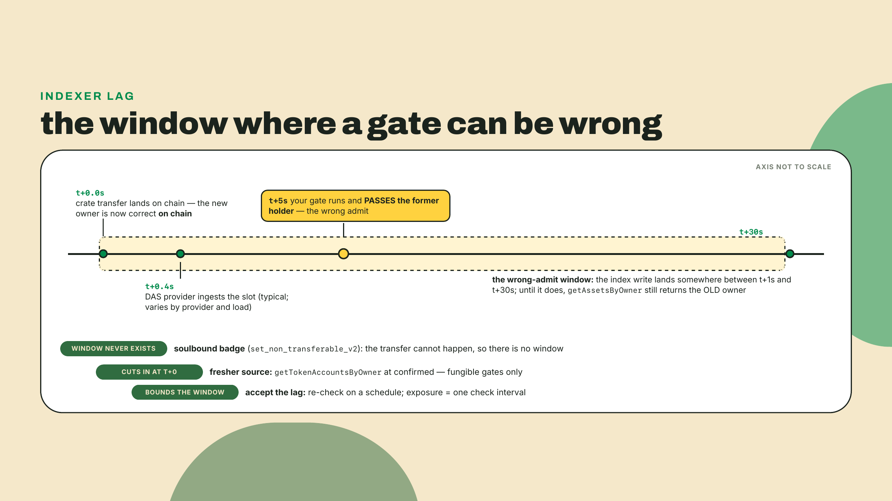
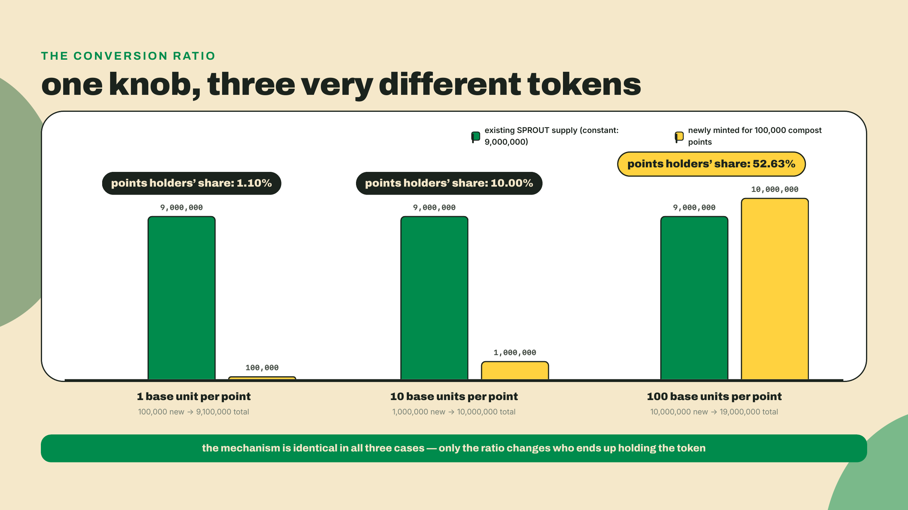
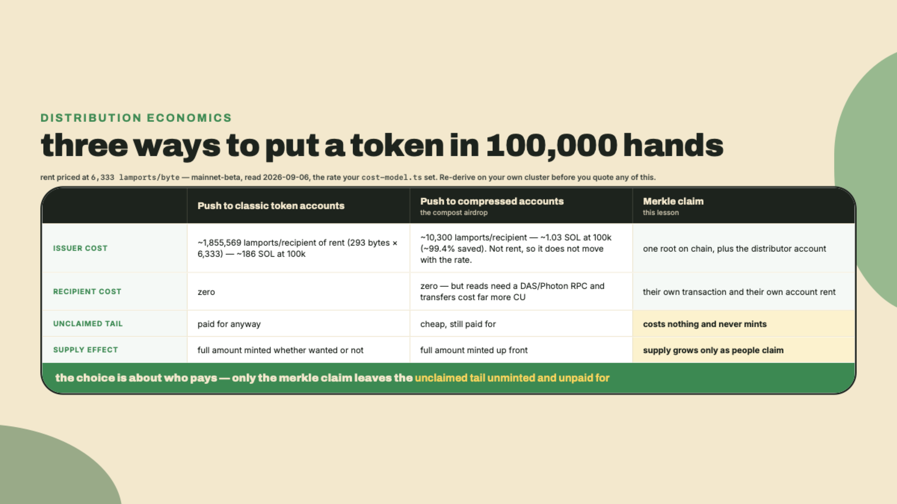
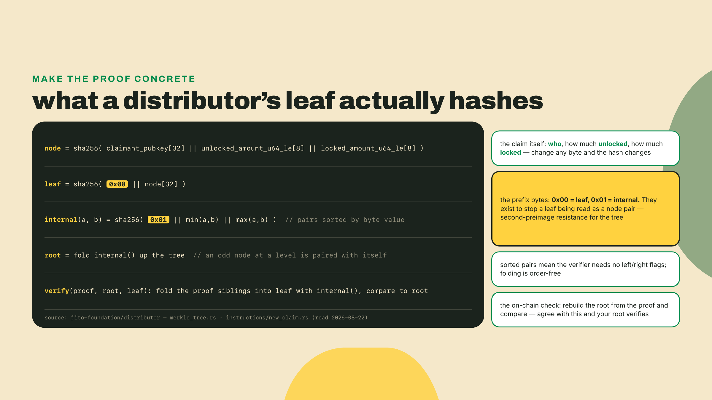
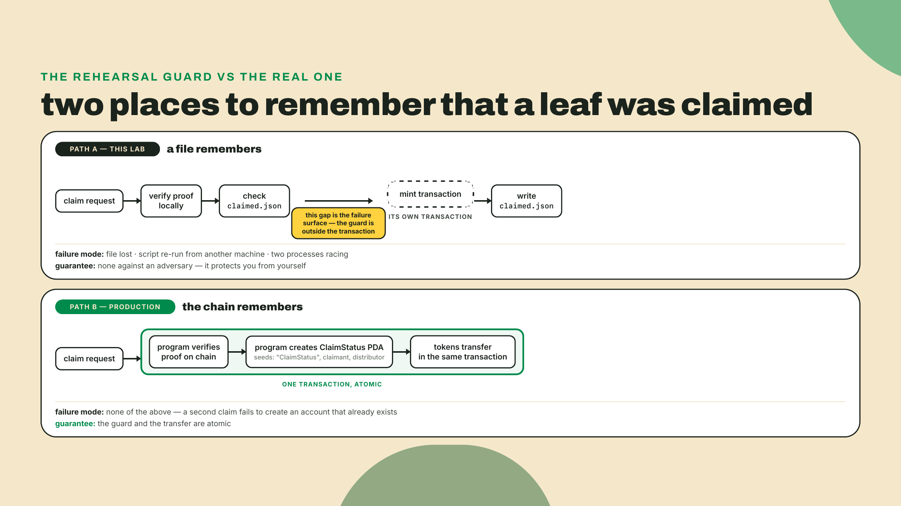
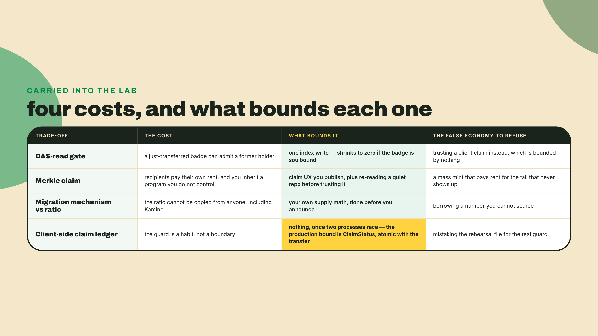
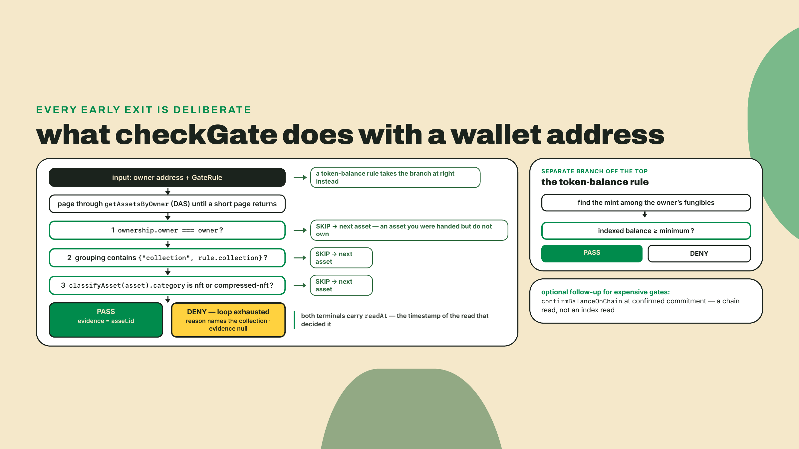
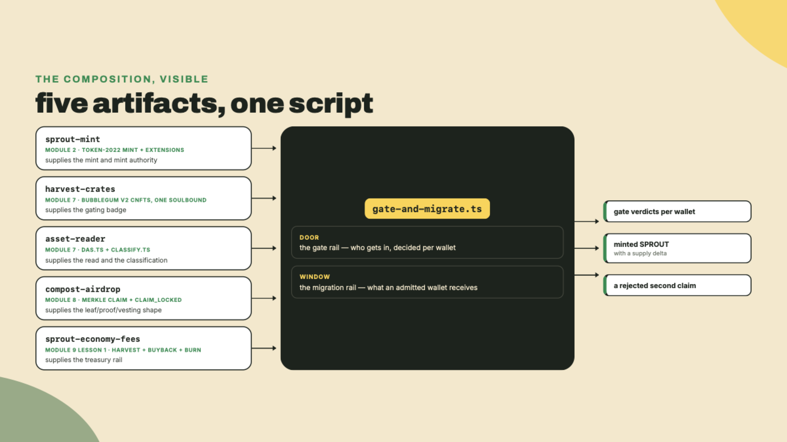

# Gating and points-to-token migrations: wiring the whole economy

## Summary

Last lesson you built SPROUT's fee rail. Withheld marketplace fees harvested off the recipient accounts where Token-2022 had quietly parked them, routed into the treasury, spent on a buyback (a DAMM v2 swap if you had launched SPROUT and had its pool, otherwise an OTC buy from the maker you stood up), and burned, with the mint's supply falling by exactly what you burned: the buyback plus the fee-burn share. Money in, money out, provable at both ends.

Two things in Overgrowth still run on vibes.

The alpha channel asks "are you a Founding Farmer?" and today it believes whatever the client tells it, which means the channel is gated in the same sense that a door is locked when the key is taped to the frame. And a few hundred thousand compost points sit in a table you own, promising players SPROUT that does not exist yet, redeemable on terms you have not written down. One of those is a security problem. The other is a supply problem. This lesson closes both, and closing them is what finally makes the four things you have built behave like one economy instead of four scripts that happen to share a folder.

Before any theory, put the real evidence on your screen. Take a wallet that holds a Harvest crate and a wallet that does not, and ask an index that has no reason to flatter either of them. Three lines of setup first, because this is the course's first use of `jq` and the lab's full env block only arrives in step 1:

```bash
brew install jq          # macOS; apt install jq on Debian/Ubuntu, or drop the pipe and read raw JSON
export DAS_RPC_URL=<your DAS endpoint>
export WALLET=<the wallet to probe>   # you will run the query twice, once with each wallet here
```

Then the question itself:

```bash
curl -s "$DAS_RPC_URL" -X POST -H 'content-type: application/json' \
  -d '{"jsonrpc":"2.0","id":"gate","method":"getAssetsByOwner",
       "params":{"ownerAddress":"'"$WALLET"'","page":1,"limit":50}}' \
  | jq '.result.items[] | {id, interface, owner: .ownership.owner,
                           collection: (.grouping[]? | select(.group_key=="collection") | .group_value)}'
```

That is the whole trust boundary in one request. The response is a list of assets that a public indexer says this owner holds, and none of it came from the person asking for access. Run it against both wallets. One prints a crate under your Almanac collection, the other prints an empty list or somebody else's junk. Keep both terminals open, because the gate you are about to write turns exactly this output into a boolean.

By the end you will have `gate-and-migrate.ts`: one script that passes a Founding-Farmer holder through the door, denies a stranger, then converts that holder's compost points into real SPROUT through a merkle claim, and refuses the same claim a second time. It is the last piece of `sprout-economy`, and it is the first script in this course that touches four earlier artifacts at once: the mint from module 2, the crates from module 7, the reader from module 7, and the airdrop's claim path from module 8.

The fade, stated up front so you know where the training wheels come off. The gate is worked in full, code and reasoning, because the trust boundary is the lesson and I do not want you guessing at it. The claim wiring is a completion problem: I hand you the tree and the transaction, you write the two checks that decide whether a claim is legitimate. The full flow, both rails in one run with a rejected second claim, is yours alone.

## The door and the window

Overgrowth's clubhouse has two openings, and they fail in opposite directions.

There is a **door**, where somebody claims to be a member and you decide whether to open it. And there is a **window**, where somebody hands over a receipt and you hand back grain from the silo. A door that trusts the wrong evidence lets in people who should be outside, which is annoying and recoverable, since you can always change the lock and re-check everyone tomorrow. A window that honors the same receipt twice hands out grain that was never in the silo, and no amount of re-checking pulls it back. The first mistake costs you exclusivity, the second costs every SPROUT holder in dilution, and the second is the one you cannot undo.

Here is the route through this lesson. First the door: what evidence a gate is allowed to believe, and what it costs you that the evidence is an index rather than the chain itself. Then the window: why a pile of points becomes a token through a claim rather than a mass mint, what the leaf actually hashes, and where the guard against a double claim really lives. Then you wire both into one run.

### What a gate is allowed to believe

A user's client can tell you three different things, and only one of them is evidence.

It can send you a **signed message** saying "I hold a Founding-Farmer crate." The signature is real, the cryptography checks out, and it proves precisely one thing: whoever sent it controls that keypair. It says nothing about what the keypair holds right now. A wallet that owned a crate last Tuesday, sold it Wednesday, and signs your message on Thursday produces a perfectly valid signature and a perfectly false claim. Signatures answer "who are you," never "what do you have."

In code, that mistake has a shape, and it is worth being able to recognize it in a pull request at a glance:

```typescript
// overgrowth/anti-gate.ts - the shape to recognize and refuse. Do not ship this.
const FOUNDING_FARMER = 'founding-farmer';

interface AccessRequest {
  wallet: string;
  signature: string; // cryptographically valid, and beside the point
  claimsToHold: string; // written by the applicant
}

// A signature check answers "who signed this?", never "what do they hold?".
declare function signatureIsValid(wallet: string, signature: string): boolean;

export function badGate(req: AccessRequest): boolean {
  return signatureIsValid(req.wallet, req.signature) && req.claimsToHold === FOUNDING_FARMER;
}
```

The tell is that the second operand came out of the request body. Every field in there was authored by the person asking to be let in, and no amount of signature validation upgrades their authorship into evidence.

It can send you its **cached token list**, the one the wallet adapter keeps in the browser so your portfolio page renders fast. That cache is a convenience for the user and a suggestion to you. It is stale by design and editable by anyone with devtools open. Reading it is not verification, it is asking the applicant to fill in their own reference letter.

Or you can **read the holding yourself**, from a source the applicant does not control. That is the only one that counts. For a fungible balance you can hit the chain directly. For a Harvest crate you cannot, because a compressed NFT has no account of its own: cNFT reads require a DAS-supporting RPC, which is the constraint you met when you built the reader, and it is the reason the gate for a cNFT badge is a DAS call and not a `getAccountInfo`.



So the rule is short. A gate decides on a read that the applicant cannot write to. Everything else is a user-experience nicety you may show in the UI and must never branch on.

### The freshness bill

Now the honest part, and it is the reason this section exists rather than a one-line "just use DAS."

DAS is an index. It watches the chain and writes down what it sees, and writing down what it sees takes time. A crate transferred five seconds ago can still resolve to its former owner, which means your door can admit somebody who genuinely no longer holds the badge. That is not a bug in your gate and it is not a bug in the provider. It is what an index is.

You have three ways to pay that bill, and they cost different amounts.

**Accept the lag.** For a Discord role or an alpha channel, a former holder keeping access for a few seconds or a few minutes is a non-event. Re-check on a schedule and the window closes on its own. This is the right answer far more often than engineers want it to be.

**Confirm against a fresher source.** For a fungible gate, follow the DAS read with a direct `getTokenAccountsByOwner` at `confirmed` commitment and branch on that number instead. You lose the one-call simplicity, you gain a read that is as fresh as the cluster. For a cNFT there is no equivalent shortcut, because the asset genuinely has no account to read, and the honest option is a proof read that costs a round trip and still resolves through the same index.

**Gate on something that cannot move.** This is my favourite and almost nobody reaches for it. If the badge is soulbound, the transfer case that makes staleness dangerous does not exist. Bubblegum v2 ships `set_non_transferable_v2`, so the Founding-Farmer crate can be minted unable to leave the wallet it was awarded to, which flatly contradicts the 2024-era folklore that compressed NFTs cannot be soulbound. You already minted one that way in module 7. A soulbound badge does not make the index instant, it removes the transfer from the threat model, which is a different and better kind of fix.



There is a fourth answer that people reach for and I want to name it so you skip it: streaming the state yourself so you always have the freshest view. That is a real technique and it is a real project. Building indexers, Geyser plugins, and gRPC pipelines is the planned Client-Side Mastery course's material, and if your gate genuinely needs sub-second freshness on compressed assets, that is where to go. For a members' door, it is a data platform you now own so a stranger cannot read your alpha channel for eleven seconds.

### Points are a promise, SPROUT is the settlement

Switch openings. The window is where the economics live, and it is worth slowing down, because this is the part teams get wrong in public.

Compost points were never a token. They are a number in a table you control, and they are worth exactly what your future self decides they are worth. That is fine, that is what points are for: they let you reward behavior before you have to commit to supply. Every points program in this ecosystem is the same trade, whether it says so or not. You are running a promise, denominated in a unit you can redefine, until the day you cannot.

Migration is the day you cannot. It is the moment the private number becomes a public one, and three decisions get made whether you make them deliberately or by accident.

**Who is eligible.** A snapshot, taken at a stated block or a stated timestamp, published so people can check their own row. The snapshot is the part that makes the whole thing auditable, and taking it quietly is how a migration becomes a scandal.

**At what ratio.** How many base units one point becomes. This is the entire tokenomics decision, and there is no mechanism that decides it for you.

**On what schedule.** All at once, or an unlocked slice now and the rest released over time.

Watch the ratio do its work with round numbers. Say Overgrowth has 100,000 compost points outstanding across 4,000 players, and you settle on 10 SPROUT base units per point. That is 1,000,000 new base units, minted into existence on claim. If SPROUT's supply before the migration was 9,000,000, you just decided that points holders get 10% of the token, and that everyone already holding SPROUT owns a proportionally thinner slice than they did yesterday. Nobody was robbed. Nothing was taken out of a wallet. The bill was paid in dilution by the people who were already there, and the ratio is the invoice.

Set the ratio at 1 base unit per point instead and the same 100,000 points become 100,000 base units, roughly 1% of supply, and your loyal grinders feel cheated. Set it at 100 and your existing holders get diluted by half. The mechanism you are about to build is identical in all three cases. The mechanism is free. The ratio is not.



Which brings up the case study, and an honest gap in it. Kamino ran a points-to-token migration into KMNO, and it is the obvious thing to point at because it is one of the larger ones this ecosystem has done. What I could not do is verify the conversion tokenomics. The numbers that would let you say "they converted at X per point" are not published anywhere I could confirm, so I am not going to put a ratio in your head that I cannot source. Take the mechanism from it, a merkle-claim migration from an off-chain points ledger into an on-chain token, and take the ratio from your own supply math. That is the correct use of a case study whose numbers are private, and it is the same rule this course has applied to every disputed figure: measure it or cite it, never split the difference.

### Why a claim, and not a mass mint

You have the eligibility list. Why not just mint to everyone and be done?

Because the person doing the minting pays for the accounts. You costed this exact thing when you built the compost airdrop: a classic token account is 293 bytes of rent per recipient, about 1,855,569 lamports at mainnet's rate on 2026-09-06, so pushing tokens to 100,000 wallets is roughly 186 SOL before you have sent a single transaction, and the compressed route brought that to roughly 1.03 SOL, well over 99% saved. Re-derive the classic side from your own cluster's rate before you quote it; the compressed side is not rent and does not move.

A claim changes who is holding the invoice. The distributor puts one root on chain. Each recipient who wants their tokens sends their own transaction, pays their own account rent, and gets their own tokens. And the tail that never claims never costs you anything, which matters more than it sounds: in every large drop, a meaningful share of the allocation simply never gets collected. Under a push model you paid rent to create accounts for people who were never coming back.



There is a second reason, and it is the one the JTO drop is famous for. A distributor can hold two amounts per recipient: a slice that unlocks immediately, and a slice that releases over time. Jito distributed its airdrop through an open-source merkle distributor with linear vesting that ran to 2024-12-07, and the program that did it, `mERKcfxMC5SqJn4Ld4BUris3WKZZ1ojjWJ3A3J5CKxv`, is still the reference implementation for this pattern. The instruction that releases the vesting slice is `claim_locked`, and you already met it in the airdrop lesson. Migration wants that split more than an airdrop does: a points program rewards people who showed up early, and handing every one of them fully liquid tokens on day one is a design choice with a very predictable chart attached.

### The leaf, byte for byte

Here is where a merkle claim stops being an abstraction. I read the reference program's source rather than describing it from memory, on 2026-08-22, and you should re-read it before you point a real distributor at real money, because a repository that has gone quiet can still change.

The distributor stores one 32-byte root. A claimant's entry is hashed twice. First the claim itself: SHA-256 over the claimant's 32-byte address, then their unlocked amount as a little-endian u64, then their locked amount as a little-endian u64. Then the result is hashed again with a single leading `0` byte, the leaf prefix. Internal nodes use a leading `1` byte instead, over the two children sorted by their byte value, lowest first.

Those two prefix bytes are not decoration. Without them, a 64-byte "leaf" could be crafted to look like a pair of internal nodes, and a claimant could prove membership of a leaf that was never in the tree. That is the second-preimage attack, and the fix is one byte per hash. It shows up in almost every serious merkle implementation for exactly this reason, and the fact that the fix is that cheap is why there is no excuse for skipping it.



The payoff of knowing this precisely is that you can compute the root locally, in TypeScript, and get the same 32 bytes the on-chain verifier will compute. That is how you check a distribution before you publish it, and how you debug the one claim that fails while the other nine thousand work.

### Where the double-claim guard actually lives

Last piece of theory, and it is the door's problem again, one opening over.

A merkle proof proves that an entry is in the tree. It does not prove that the entry has not already been claimed, and it never can, because the proof is identical every time. Something has to remember. The reference distributor remembers by creating a `ClaimStatus` account per claimant, derived from the seeds `"ClaimStatus"`, the claimant's address, and the distributor's address, holding the claimant, the locked amount, the amount already withdrawn, and the unlocked amount. The account is created inside the claim transaction. Try to claim twice and the second transaction fails to create an account that already exists.

Notice what makes that trustworthy: your client cannot write it. The guard is not a flag in your script, it is a side effect of the same transaction that moves the tokens, which means it cannot get out of sync with the tokens.

Which tells you what a client-side ledger is worth. In today's lab you will keep a small JSON file of who has claimed, and that file will correctly stop your script from paying the same wallet twice. It is a rehearsal, not a boundary. If the actual mint authority is a key in your script and the only thing between a wallet and a second grant is a file on your laptop, then a second grant is one lost file away. Say that out loud when you write it, because the shape of the code will look reassuringly like the real thing.



### The trade-off, named

Four costs, and none of them go away by being careful.

A DAS gate is only as fresh as the indexer, so a just-transferred asset can still resolve to the old owner and your door can admit a former holder for a beat. Trusting a client-reported holding or a bare signature instead is not a cheaper version of this, it is a different and much worse failure, because the first one is bounded by an index write and the second is bounded by nothing.

A merkle claim shifts cost to your recipients, which is fair when they want the tokens and hostile when they do not know a claim exists, and it adds a program dependency you do not control. The reference repository has been quiet for a while, and quiet is a real risk for code that will be holding a distribution long after you deploy it.

The migration mechanism is portable, the tokenomics are not. You can copy the claim path in an afternoon and be confident it works, because you can compute the root yourself and check every proof before anyone claims. Nobody can hand you the ratio, and no amount of reading somebody else's migration will produce it, which is precisely the gap the Kamino case study leaves open.

And a claim guard that lives in your process instead of in the transaction is not a guard, it is a habit that happens to work until the first time two copies of your script run at once.



## Lab: gate-and-migrate.ts

Both rails, one run. The door reads a public index, so it runs against devnet where your crates were actually minted. The window mints real SPROUT, so it runs wherever your mint lives. If both live on devnet, one env file covers the whole thing.

**1. Workspace and pins.**

Work in the same `overgrowth/` folder that holds `das.ts` and `classify.ts` from the reader lesson, because you are about to import both.

```bash
cd overgrowth
npm install @solana/kit@7.1.1 @solana-program/token-2022@0.15.0
npm install -D tsx@4.23.12 typescript@5.9.3 @types/node@24
```

Pins checked against npm on 2026-09-05. The kit `latest` tag is 8.2.0, published 2026-08-29, but latest is not the rule: a workspace pins the kit major its own `@solana-program/*` deps peer against. Here that client is `@solana-program/token-2022@0.15.0`, whose peer range accepts kit `^7.0.0` — everything from 0.16.0 onward peers `^8` — and that decides the rest: kit 7.1.1, the newest release inside the range. These clients ship monthly. Run `npm view @solana-program/token-2022 peerDependencies` before you trust the pair.

Then the environment. Eight values, no secrets in the repo — the last one is a path, and the file it points at is the `treasury.json` you minted in last lesson's step 1b, because the window's `mintTo` must be signed by SPROUT's mint authority and that setup put the authority on exactly this key (if your SPROUT predates that step, re-mint per it first; there is no signing your way around a dead throwaway authority):

```bash
export DAS_RPC_URL="https://<your-das-provider-endpoint>"
export RPC_URL="https://api.devnet.solana.com"
export WS_URL="wss://api.devnet.solana.com"
export SPROUT_MINT="<your Token-2022 mint from module 2>"
export ALMANAC_COLLECTION="<the Core collection your crates belong to>"
export HOLDER_WALLET="<a wallet holding a Founding-Farmer crate>"
export STRANGER_WALLET="<any wallet that does not>"
export KEYPAIR="<path to labs/m09-l1/treasury.json from m09-l1 step 1b>"
```

If you would rather run the mint half locally, surfpool works here too (1.2.1 on this machine, 2026-08-22; on macOS `brew install txtx/taps/surfpool`, otherwise grab a release binary), started with `surfpool start --no-tui --no-studio` and pointed at `http://127.0.0.1:8899` and `ws://127.0.0.1:8900`. The door half still needs a real DAS endpoint, because a local surfnet has no indexer watching it.

**2. The door.**

This is worked in full. Read the shape first: a rule, a read, a result that carries its own timestamp.

```typescript
// overgrowth/gate.ts - decide access from an indexed on-chain read, never from a client claim.
import { createSolanaRpc, type Address } from '@solana/kit';
import { das } from './das';
import { classifyAsset, type DasAsset } from './classify';

export interface OwnedAsset extends DasAsset {
  id: string;
  ownership?: { owner?: string; frozen?: boolean; non_transferable?: boolean };
  grouping?: { group_key: string; group_value: string }[];
  token_info?: {
    balance?: number;
    decimals?: number;
    price_info?: { price_per_token?: number };
  };
}

export type GateRule =
  | { kind: 'collection-badge'; collection: string }
  | { kind: 'token-balance'; mint: string; minimum: bigint };

export interface GateResult {
  owner: string;
  allowed: boolean;
  reason: string;
  evidence: string | null;
  readAt: string;
}

interface OwnerPage {
  total: number;
  limit: number;
  page: number;
  items: OwnedAsset[];
}

export async function ownedAssets(owner: string): Promise<OwnedAsset[]> {
  const out: OwnedAsset[] = [];
  for (let page = 1; ; page += 1) {
    const res = await das<OwnerPage>('getAssetsByOwner', {
      ownerAddress: owner,
      page,
      limit: 1000,
      options: { showFungible: true },
    });
    out.push(...res.items);
    if (res.items.length < res.limit) return out;
  }
}

export async function checkGate(owner: string, rule: GateRule): Promise<GateResult> {
  const readAt = new Date().toISOString();
  const assets = await ownedAssets(owner);

  if (rule.kind === 'collection-badge') {
    for (const asset of assets) {
      if (asset.ownership?.owner !== owner) continue;
      const inCollection = (asset.grouping ?? []).some(
        (g) => g.group_key === 'collection' && g.group_value === rule.collection,
      );
      if (!inCollection) continue;
      const kind = classifyAsset(asset).category;
      if (kind !== 'nft' && kind !== 'compressed-nft') continue;
      return {
        owner,
        allowed: true,
        reason: `holds a ${kind} in collection ${rule.collection}`,
        evidence: asset.id,
        readAt,
      };
    }
    return {
      owner,
      allowed: false,
      reason: `no asset in collection ${rule.collection} resolves to this owner`,
      evidence: null,
      readAt,
    };
  }

  const held = assets.find((a) => a.id === rule.mint && classifyAsset(a).fungible);
  // token_info.balance arrives as a JSON number from most DAS providers. Do
  // not launder it through Math.floor: last lesson's rule stands, a Number
  // above 2^53 lies quietly (the damage is already done at JSON.parse), and
  // above ~1e21 String() turns it into exponent notation. The check below
  // makes that second case loud: a provider that ships a balance too big for
  // a JSON number is a provider you escalate, not round.
  const rawBalance = held?.token_info?.balance;
  const asString = rawBalance === undefined ? "0" : String(rawBalance);
  if (asString.includes("e") || asString.includes("E")) {
    throw new Error(`balance ${asString} exceeds JSON number range: escalate to the provider`);
  }
  const balance = BigInt(asString.split(".")[0] || "0");
  return {
    owner,
    allowed: balance >= rule.minimum,
    reason: `indexed balance ${balance} against minimum ${rule.minimum}`,
    evidence: balance > 0n ? rule.mint : null,
    readAt,
  };
}

export async function confirmBalanceOnChain(
  rpcUrl: string,
  owner: Address,
  mint: Address,
  tokenProgram: Address,
): Promise<bigint> {
  const rpc = createSolanaRpc(rpcUrl);
  const { value } = await rpc
    .getTokenAccountsByOwner(owner, { mint }, { encoding: 'jsonParsed', commitment: 'confirmed' })
    .send();
  let total = 0n;
  for (const account of value) {
    if (account.account.owner !== tokenProgram) continue;
    total += BigInt(account.account.data.parsed.info.tokenAmount.amount);
  }
  return total;
}

export function describe(result: GateResult): string {
  const verdict = result.allowed ? 'PASS' : 'DENY';
  return `${verdict}  ${result.owner}  ${result.reason}  (read at ${result.readAt})`;
}
```

Four decisions in there are worth their words. The `ownership.owner` re-check looks redundant against a by-owner query and is not: you will eventually pass this function an asset list you got somewhere else, and the day you do, that line is the difference between a gate and a suggestion. `classifyAsset` is doing real work rather than decoration, because it is what keeps a fungible position in the same collection from satisfying a badge rule. `readAt` exists so that when somebody complains about being denied, you can answer with a timestamp instead of a shrug. And `confirmBalanceOnChain` is the freshness remedy, deliberately separate, deliberately not called by default. Turn it on for the gate that guards something expensive, leave it off for a chat role.



**3. Run the door.**

```bash
npx tsx -e "import {checkGate,describe} from './gate'; \
  const rule={kind:'collection-badge',collection:process.env.ALMANAC_COLLECTION!} as const; \
  for (const w of [process.env.HOLDER_WALLET!, process.env.STRANGER_WALLET!]) \
    console.log(describe(await checkGate(w, rule)));"
```

You want two lines, one of each verdict:

```
PASS  7xK…9fQ  holds a compressed-nft in collection 4vT…2mL  (read at 2026-08-22T14:07:11.402Z)
DENY  3nB…kW1  no asset in collection 4vT…2mL resolves to this owner  (read at 2026-08-22T14:07:12.118Z)
```

If both lines say DENY, check the collection value before you check anything else. A cNFT's collection lives in `grouping` with `group_key` of `collection`, and the value is the collection asset's address, not its name.

**4. The tree.**

Now the window. This file is given to you complete, because it has to be byte-compatible with what an on-chain verifier computes and there is no partial credit for a root that is almost right. And an acknowledgment you are owed, because you built this exact tree two lessons ago in `compost-airdrop` under different names: `leafHash` there is `hashLeaf` here, `tree.proofFor` becomes `getProof` over explicit levels, and the bytes hashed are identical, leaf prefix, intermediate prefix, sorted pairs and all. This copy is deliberately self-contained so `overgrowth/` carries no cross-folder import to break.

If you doubt the two agree, diff the right thing. Hashing one entry through both `leafHash` and `hashLeaf` proves almost nothing: leaves are hashed identically by construction, so that check passes even when the two builders disagree. The place two merkle ports actually diverge is the level-combining rule, and it only shows up at an ODD level width, which a four- or eight-entry test list never produces. So build the same THREE-entry list through both and diff the roots. Equal roots at n=3 is evidence; equal leaf hashes is a tautology.

```typescript
// overgrowth/merkle.ts - the distributor's tree, byte for byte.
// Ported from jito-foundation/distributor (merkle-tree/src/merkle_tree.rs,
// programs/merkle-distributor/src/instructions/new_claim.rs, verify/src/lib.rs),
// read on 2026-08-22. Re-read before you trust this against a live distributor.
import { createHash } from 'node:crypto';
import { getAddressEncoder, type Address } from '@solana/kit';

const LEAF_PREFIX = Uint8Array.from([0]);
const INTERMEDIATE_PREFIX = Uint8Array.from([1]);
const addressEncoder = getAddressEncoder();

export interface ClaimEntry {
  claimant: Address;
  unlocked: bigint;
  locked: bigint;
}

function sha256(...parts: Uint8Array[]): Buffer {
  const hash = createHash('sha256');
  for (const part of parts) hash.update(part);
  return hash.digest();
}

function u64le(value: bigint): Buffer {
  const buf = Buffer.alloc(8);
  buf.writeBigUInt64LE(value);
  return buf;
}

export function hashLeaf(entry: ClaimEntry): Buffer {
  const claimant = new Uint8Array(addressEncoder.encode(entry.claimant));
  const node = sha256(claimant, u64le(entry.unlocked), u64le(entry.locked));
  return sha256(LEAF_PREFIX, node);
}

function hashPair(left: Buffer, right: Buffer): Buffer {
  return Buffer.compare(left, right) <= 0
    ? sha256(INTERMEDIATE_PREFIX, left, right)
    : sha256(INTERMEDIATE_PREFIX, right, left);
}

export function buildTree(entries: ClaimEntry[]): Buffer[][] {
  if (entries.length === 0) throw new Error('empty distribution: nothing to migrate');
  const levels: Buffer[][] = [entries.map(hashLeaf)];
  while (levels[levels.length - 1].length > 1) {
    const below = levels[levels.length - 1];
    const above: Buffer[] = [];
    for (let i = 0; i < below.length; i += 2) {
      const left = below[i];
      const right = i + 1 < below.length ? below[i + 1] : below[i];
      above.push(hashPair(left, right));
    }
    levels.push(above);
  }
  return levels;
}

export function getRoot(levels: Buffer[][]): Buffer {
  return levels[levels.length - 1][0];
}

export function getProof(levels: Buffer[][], index: number): Buffer[] {
  if (index < 0 || index >= levels[0].length) throw new Error(`no leaf at index ${index}`);
  const proof: Buffer[] = [];
  let idx = index;
  for (let level = 0; level < levels.length - 1; level += 1) {
    const nodes = levels[level];
    const siblingIdx = idx % 2 === 0 ? idx + 1 : idx - 1;
    proof.push(siblingIdx < nodes.length ? nodes[siblingIdx] : nodes[idx]);
    idx = Math.floor(idx / 2);
  }
  return proof;
}

export function verifyProof(leaf: Buffer, proof: Buffer[], root: Buffer): boolean {
  let computed = leaf;
  for (const sibling of proof) computed = hashPair(computed, sibling);
  return computed.equals(root);
}
```

Two details to notice, because both are places a hand-rolled tree goes wrong. An odd node at a level is paired with **itself**, not promoted to the level above, which is what the reference builder does and what its proofs assume. And every pair is sorted before hashing, which is why `verifyProof` can fold a proof without being told whether each sibling was a left or a right child.

Before you build anything on top of it, prove it to yourself. Three entries, three proofs, one tampered amount:

```typescript
// overgrowth/tree-check.ts - trust the tree only after you have tried to break it.
// Run from inside overgrowth/: npx tsx tree-check.ts
import { address } from '@solana/kit';
import { buildTree, getProof, getRoot, hashLeaf, verifyProof, type ClaimEntry } from './merkle';

const entries: ClaimEntry[] = [
  { claimant: address('11111111111111111111111111111112'), unlocked: 100n, locked: 0n },
  { claimant: address('So11111111111111111111111111111111111111112'), unlocked: 250n, locked: 50n },
  { claimant: address('TokenzQdBNbLqP5VEhdkAS6EPFLC1PHnBqCXEpPxuEb'), unlocked: 7n, locked: 3n },
];

const levels = buildTree(entries);
const root = getRoot(levels);
console.log('root', root.toString('hex'));

entries.forEach((entry, i) => {
  const ok = verifyProof(hashLeaf(entry), getProof(levels, i), root);
  console.log(i, ok ? 'PROOF OK' : 'PROOF FAILED');
});

const greedy = { ...entries[0], unlocked: 1000n };
console.log('tampered accepted?', verifyProof(hashLeaf(greedy), getProof(levels, 0), root));
```

Three `PROOF OK` lines and a `false`. The last line is the one that matters: change the amount and the leaf changes, so the same proof no longer folds to the same root. That is the entire security property of a distribution, demonstrated in four lines.

**5. The claim, and the two checks you write.**

Here is the completion problem. The file below is complete except for the two decisions that decide whether a claim is legitimate. Cover them, write them yourself from the description, then compare.

The first: after rebuilding the tree and taking the proof, refuse to continue unless the proof folds to the root you are about to publish. The second: refuse to continue if this claimant has already claimed. Both are three lines. Both are the whole job.

```typescript
// overgrowth/claim.ts - migrate compost points into SPROUT through the merkle path.
import { readFile, writeFile } from 'node:fs/promises';
import {
  address,
  appendTransactionMessageInstructions,
  assertIsTransactionWithBlockhashLifetime,
  createSolanaRpc,
  createSolanaRpcSubscriptions,
  createTransactionMessage,
  getAddressEncoder,
  getProgramDerivedAddress,
  getSignatureFromTransaction,
  pipe,
  sendAndConfirmTransactionFactory,
  setTransactionMessageFeePayerSigner,
  setTransactionMessageLifetimeUsingBlockhash,
  signTransactionMessageWithSigners,
  type Address,
  type TransactionSigner,
} from '@solana/kit';
import {
  fetchMint,
  findAssociatedTokenPda,
  getCreateAssociatedTokenIdempotentInstructionAsync,
  getMintToInstruction,
  TOKEN_2022_PROGRAM_ADDRESS,
} from '@solana-program/token-2022';
import { buildTree, getProof, getRoot, hashLeaf, verifyProof, type ClaimEntry } from './merkle';

/** The reference claim program: Jito's merkle distributor, the one the JTO drop used. */
export const MERKLE_DISTRIBUTOR_PROGRAM = address('mERKcfxMC5SqJn4Ld4BUris3WKZZ1ojjWJ3A3J5CKxv');

/** A leaf is claimable once. Where that fact is stored is the whole security question. */
export interface ClaimLedger {
  isClaimed(claimant: Address): Promise<boolean>;
  markClaimed(claimant: Address): Promise<void>;
}

/** Rehearsal ledger: good enough to stop YOUR script running twice, and nothing more. */
export class FileClaimLedger implements ClaimLedger {
  constructor(private readonly path: string) {}

  private async load(): Promise<string[]> {
    try {
      return JSON.parse(await readFile(this.path, 'utf8')) as string[];
    } catch {
      return [];
    }
  }

  async isClaimed(claimant: Address): Promise<boolean> {
    return (await this.load()).includes(claimant);
  }

  async markClaimed(claimant: Address): Promise<void> {
    const claimed = await this.load();
    if (!claimed.includes(claimant)) claimed.push(claimant);
    await writeFile(this.path, JSON.stringify(claimed, null, 2));
  }
}

/** The real boundary: the distributor's per-claimant ClaimStatus account. */
export async function claimStatusAddress(
  distributor: Address,
  claimant: Address,
): Promise<Address> {
  const encoder = getAddressEncoder();
  const [pda] = await getProgramDerivedAddress({
    programAddress: MERKLE_DISTRIBUTOR_PROGRAM,
    seeds: [
      new TextEncoder().encode('ClaimStatus'),
      encoder.encode(claimant),
      encoder.encode(distributor),
    ],
  });
  return pda;
}

export class OnChainClaimLedger implements ClaimLedger {
  constructor(
    private readonly rpc: ReturnType<typeof createSolanaRpc>,
    private readonly distributor: Address,
  ) {}

  async isClaimed(claimant: Address): Promise<boolean> {
    const pda = await claimStatusAddress(this.distributor, claimant);
    const { value } = await this.rpc.getAccountInfo(pda, { encoding: 'base64' }).send();
    return value !== null;
  }

  async markClaimed(): Promise<void> {
    // No-op on purpose: the distributor program creates ClaimStatus inside the claim
    // transaction. A client cannot mark this, which is exactly why it is trustworthy.
  }
}

export interface MigrationResult {
  claimant: Address;
  minted: bigint;
  stillLocked: bigint;
  root: string;
  signature: string;
  supplyBefore: bigint;
  supplyAfter: bigint;
}

export interface MigrationInput {
  rpcUrl: string;
  wsUrl: string;
  entries: ClaimEntry[];
  index: number;
  mint: Address;
  mintAuthority: TransactionSigner;
  payer: TransactionSigner;
  ledger: ClaimLedger;
}

export async function migrateClaim(input: MigrationInput): Promise<MigrationResult> {
  const { entries, index, mint, mintAuthority, payer, ledger } = input;
  const entry = entries[index];
  if (!entry) throw new Error(`no distribution entry at index ${index}`);

  const levels = buildTree(entries);
  const root = getRoot(levels);
  const proof = getProof(levels, index);

  // CHECK ONE: the proof must fold to this root, or the snapshot and the tree disagree.
  if (!verifyProof(hashLeaf(entry), proof, root)) {
    throw new Error('proof does not reproduce the root: your snapshot and your tree disagree');
  }

  // CHECK TWO: one leaf, one claim.
  if (await ledger.isClaimed(entry.claimant)) {
    throw new Error(`${entry.claimant} already claimed this distribution`);
  }

  const rpc = createSolanaRpc(input.rpcUrl);
  const rpcSubscriptions = createSolanaRpcSubscriptions(input.wsUrl);

  const before = await fetchMint(rpc, mint);
  const [ata] = await findAssociatedTokenPda({
    owner: entry.claimant,
    mint,
    tokenProgram: TOKEN_2022_PROGRAM_ADDRESS,
  });

  const createAta = await getCreateAssociatedTokenIdempotentInstructionAsync({
    payer,
    owner: entry.claimant,
    mint,
  });
  const mintTo = getMintToInstruction({
    mint,
    token: ata,
    mintAuthority,
    amount: entry.unlocked,
  });

  const { value: latestBlockhash } = await rpc.getLatestBlockhash().send();
  const message = pipe(
    createTransactionMessage({ version: 0 }),
    (m) => setTransactionMessageFeePayerSigner(payer, m),
    (m) => setTransactionMessageLifetimeUsingBlockhash(latestBlockhash, m),
    (m) => appendTransactionMessageInstructions([createAta, mintTo], m),
  );
  const signed = await signTransactionMessageWithSigners(message);
  assertIsTransactionWithBlockhashLifetime(signed);
  await sendAndConfirmTransactionFactory({ rpc, rpcSubscriptions })(signed, {
    commitment: 'confirmed',
  });
  await ledger.markClaimed(entry.claimant);

  const after = await fetchMint(rpc, mint);
  return {
    claimant: entry.claimant,
    minted: entry.unlocked,
    stillLocked: entry.locked,
    root: root.toString('hex'),
    signature: getSignatureFromTransaction(signed),
    supplyBefore: before.data.supply,
    supplyAfter: after.data.supply,
  };
}

/** Points to base units. The MECHANISM is reusable; this ratio is a tokenomics decision. */
export function pointsToSprout(
  points: bigint,
  perPoint: bigint,
  lockedBps: number,
): { unlocked: bigint; locked: bigint } {
  const total = points * perPoint;
  const locked = (total * BigInt(lockedBps)) / 10000n;
  return { unlocked: total - locked, locked };
}
```

Two notes on what this deliberately does not do. It mints only the unlocked slice and reports the locked remainder, because releasing the locked slice over time is the distributor's `claim_locked` path and I am not going to fake a vesting schedule in a client script. And `OnChainClaimLedger` derives the guard's address without claiming to drive the program: it shows you where the answer lives and how to ask for it, which is the part you carry into a production migration.

**6. The flow.**

Your points snapshot, `compost-points.json`, the thing you would publish so players can check their own row:

```json
[
  { "wallet": "7xK...", "compostPoints": 4200 },
  { "wallet": "3nB...", "compostPoints": 150 }
]
```

Replace the two placeholder wallets with your real addresses before running anything: the first row is `$HOLDER_WALLET`, the second `$STRANGER_WALLET`. Left verbatim, `loadEntries()` feeds `7xK...` straight into kit's `address()`, which throws a cryptic parse error long before the friendlier no-points-to-migrate guard ever gets a chance to fire.

And the top-level script, which is the artifact:

```typescript
// overgrowth/gate-and-migrate.ts - the Overgrowth economy, end to end.
// Run from inside overgrowth/: npx tsx gate-and-migrate.ts
import { readFile } from 'node:fs/promises';
import { address, createKeyPairSignerFromBytes } from '@solana/kit';
import { checkGate, describe } from './gate';
import { FileClaimLedger, migrateClaim, pointsToSprout } from './claim';
import type { ClaimEntry } from './merkle';

interface PointsRow {
  wallet: string;
  compostPoints: number;
}

const RPC_URL = process.env.RPC_URL ?? 'https://api.devnet.solana.com';
const WS_URL = process.env.WS_URL ?? 'wss://api.devnet.solana.com';
const SPROUT_MINT = address(process.env.SPROUT_MINT ?? '');
const ALMANAC_COLLECTION = process.env.ALMANAC_COLLECTION ?? '';
const HOLDER = process.env.HOLDER_WALLET ?? '';
const STRANGER = process.env.STRANGER_WALLET ?? '';

/** 1 compost point becomes 10 SPROUT base units; a quarter of the grant vests. */
const SPROUT_PER_POINT = 10n;
const LOCKED_BPS = 2500;

async function loadEntries(path: string): Promise<ClaimEntry[]> {
  const rows = JSON.parse(await readFile(path, 'utf8')) as PointsRow[];
  return rows.map((row) => {
    const { unlocked, locked } = pointsToSprout(
      BigInt(row.compostPoints),
      SPROUT_PER_POINT,
      LOCKED_BPS,
    );
    return { claimant: address(row.wallet), unlocked, locked };
  });
}

async function main(): Promise<void> {
  const signerBytes = new Uint8Array(
    JSON.parse(await readFile(process.env.KEYPAIR ?? 'treasury.json', 'utf8')) as number[],
  );
  const authority = await createKeyPairSignerFromBytes(signerBytes);

  console.log('--- the door ---');
  const rule = { kind: 'collection-badge', collection: ALMANAC_COLLECTION } as const;
  for (const wallet of [HOLDER, STRANGER]) {
    console.log(describe(await checkGate(wallet, rule)));
  }

  console.log('\n--- the window ---');
  const entries = await loadEntries('compost-points.json');
  const index = entries.findIndex((e) => e.claimant === HOLDER);
  if (index < 0) throw new Error(`${HOLDER} has no compost points to migrate`);
  const ledger = new FileClaimLedger('claimed.json');

  const result = await migrateClaim({
    rpcUrl: RPC_URL,
    wsUrl: WS_URL,
    entries,
    index,
    mint: SPROUT_MINT,
    mintAuthority: authority,
    payer: authority,
    ledger,
  });
  console.log(`root      ${result.root}`);
  console.log(`minted    ${result.minted} base units to ${result.claimant}`);
  console.log(`locked    ${result.stillLocked} (claim_locked releases this linearly)`);
  console.log(`supply    ${result.supplyBefore} -> ${result.supplyAfter}`);
  console.log(`delta ok  ${result.supplyAfter - result.supplyBefore === result.minted}`);

  console.log('\n--- the same leaf, twice ---');
  try {
    await migrateClaim({
      rpcUrl: RPC_URL,
      wsUrl: WS_URL,
      entries,
      index,
      mint: SPROUT_MINT,
      mintAuthority: authority,
      payer: authority,
      ledger,
    });
    console.log('DOUBLE CLAIM LANDED - your guard is not a guard');
  } catch (err: unknown) {
    console.log(`rejected: ${err instanceof Error ? err.message : String(err)}`);
  }
}

main().catch((err: unknown) => {
  console.error(err instanceof Error ? err.message : err);
  process.exit(1);
});
```

**7. Run it.**

```bash
npx tsx gate-and-migrate.ts
```

The shape of a good run, with a holder on 4,200 compost points at ten base units per point and a quarter locked:

```
--- the door ---
PASS  7xK…9fQ  holds a compressed-nft in collection 4vT…2mL  (read at 2026-08-22T14:22:03.771Z)
DENY  3nB…kW1  no asset in collection 4vT…2mL resolves to this owner  (read at 2026-08-22T14:22:04.410Z)

--- the window ---
root      3d8e48de…ac736403   (yours will differ: the root is a function of your entry list)
minted    31500 base units to 7xK…9fQ
locked    10500 (claim_locked releases this linearly)
supply    9000000 -> 9031500   (illustrative: your mint's real before/after appear here)
delta ok  true

--- the same leaf, twice ---
rejected: 7xK…9fQ already claimed this distribution
```

Read the last four lines as a set. The supply delta equals the minted amount exactly, so nothing leaked. The locked remainder is stated rather than minted, so your supply chart matches your promise. And the second claim was refused by a check that ran before any transaction was built, which is where refusals belong.



## Challenge

Wire the whole thing yourself, in one run, and make it produce three artifacts of evidence.

First, a gate result per wallet, both verdicts, each from a DAS read. Second, a migrated amount whose supply delta matches to the base unit, through the merkle path rather than a bare mint. Be precise about what that phrase demands, because your `migrateClaim` IS a `getMintToInstruction` at its core and that is fine: the requirement is that the mint fires only after your proof verification and claim-ledger check both pass, so a tampered or replayed leaf never reaches it. You are proving the gate in FRONT of the mint is load-bearing, not that you drove the real distributor, which this lesson explicitly declined to do. Third, a rejected second claim of the same leaf.

Then push on it, because the interesting part is not the happy path.

Change one recipient's amount in `compost-points.json` after building the tree and before claiming, and watch the proof stop folding to the root. That is a claimant trying to pay themselves more, and it is the failure the leaf hash exists to produce.

Derive the guard's address for your holder and go look at it:

```bash
npx tsx -e "import {address} from '@solana/kit'; import {claimStatusAddress} from './claim'; \
  console.log(await claimStatusAddress(address(process.env.DISTRIBUTOR!), address(process.env.HOLDER_WALLET!)));"
```

Swap `FileClaimLedger` for `OnChainClaimLedger`, point it at any distributor address, and read what comes back. It will say "not claimed," because that `ClaimStatus` account does not exist for a distributor you never created. You cannot make it say "claimed" from a client, and that inability is the property you are actually buying.

And decide your own ratio before you look at mine. Take your real SPROUT supply, take the total compost points outstanding, and write down what percentage of the token points holders should end up with. Then work backwards to the per-point number. If that percentage makes you uncomfortable, you have just discovered why migration announcements are the tensest posts these teams write.

## Checkpoint

The gate for this lesson: `npx tsx gate-and-migrate.ts` passes a Founding-Farmer holder, denies a wallet without one, both from a DAS read, mints the right amount of SPROUT through the merkle path with a matching supply delta, and rejects the second claim of that leaf.

The misses I expect, roughly in the order they show up. Every DAS call failing with a method-not-found error means your `DAS_RPC_URL` is a plain RPC, and a compressed asset simply cannot be read from one. A holder that keeps being denied usually means the `grouping` value you compared against is the collection's name rather than its address. A supply delta that does not match the minted amount means you read the mint before and after in different commitments, or you minted the total instead of the unlocked slice. And a second claim that lands means your ledger path never ran, which on a client-side ledger is a one-line bug and in production is a missing account.

One thing to write down that is not code. In your README, one sentence per rail: what your gate reads, and what your migration's ratio is. "The alpha gate resolves a Founding-Farmer crate through DAS and accepts up to N seconds of index lag." "One compost point converts to X base units, a total of Y percent of supply, with Z percent vesting." Six months from now the first sentence tells an on-call engineer whether a support ticket is a bug or physics, and the second is the sentence you will be quoted on. I have watched teams write the code carefully and leave both of those sentences implicit, and the implicit version is the one that gets rediscovered in public during an incident.

Step back and look at what runs now. SPROUT exists with extensions you chose deliberately. The crates exist, one of them permanently attached to the wallet that earned it. One reader reads all of it. Fees flow to a treasury, buy back, and burn. And a promise you kept in a database is now a token in someone's wallet, minted only when they asked for it, and mintable exactly once. That is an economy, and every piece of it is something you can point a script at and check.

Next lesson takes the rails off and looks at tokens that actually shipped. PYUSD and JTO, in production, at size. The most interesting thing about them is not what they do. It is what they arm and never fire: extensions configured with authorities set and parameters at zero, sitting there dormant, waiting for a decision nobody has made yet. Once you have built this much yourself, that restraint stops looking like indecision and starts looking like a design.
