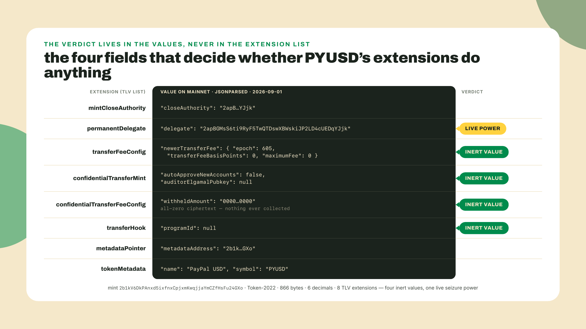
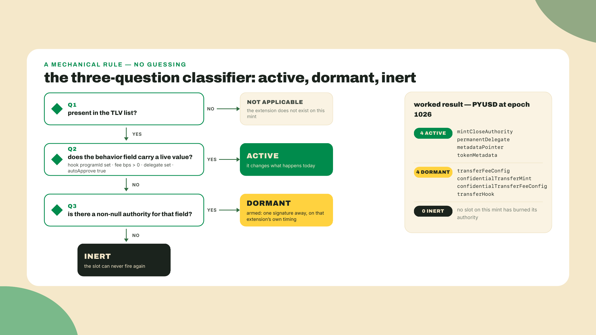
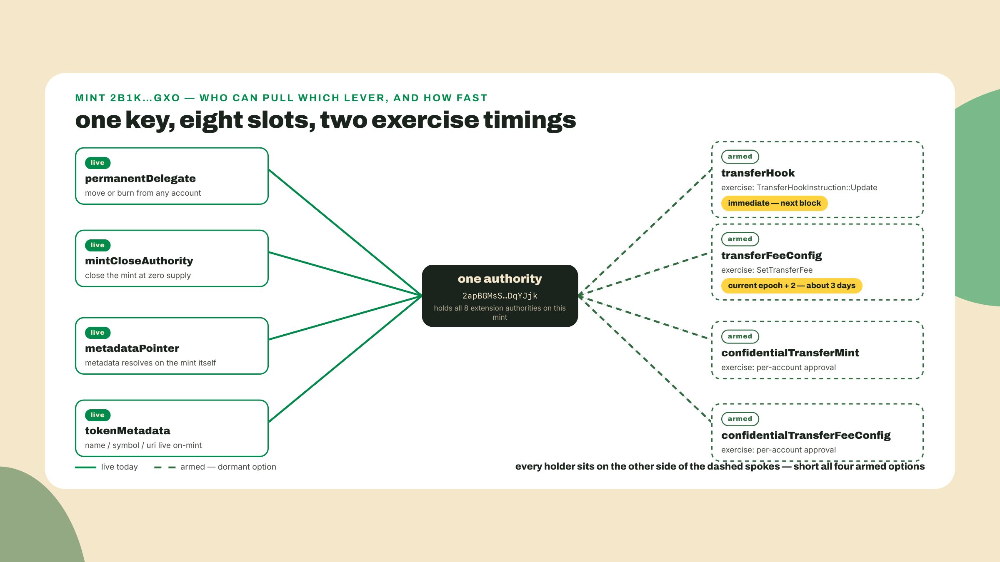
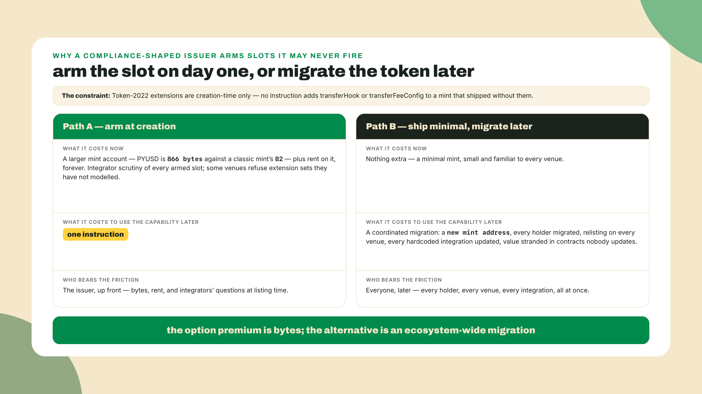
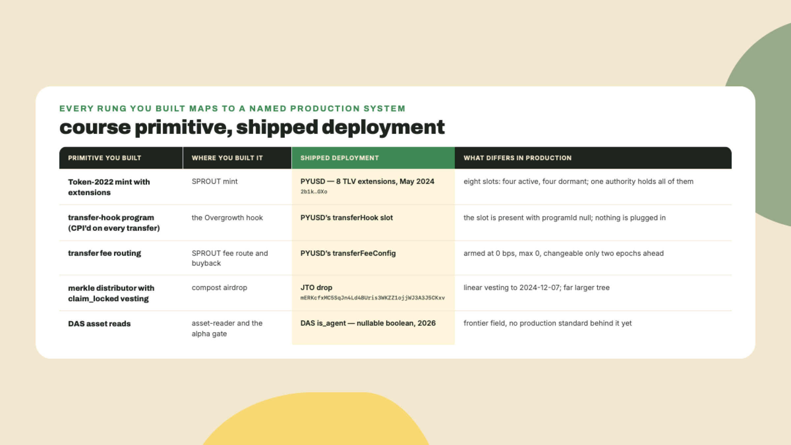

# Production case studies and the frontier: what actually shipped

## Summary

Last lesson you closed the Overgrowth economy. The alpha gate answers "does this wallet hold a Founding-Farmer cNFT?" from a DAS read instead of a client's promise, and compost points became real SPROUT through the merkle path, claim marked, second claim rejected. Mint, cNFT, airdrop, reader, gate. Every piece you built now touches every other piece.

So here is the question that closes the arc: does anybody actually ship this stuff, or have you spent nine modules learning a specification?

Answer it yourself, right now, before you read another paragraph. This reads one mainnet account and needs nothing installed:

```bash
curl -s https://api.mainnet-beta.solana.com -X POST -H 'Content-Type: application/json' \
  -d '{"jsonrpc":"2.0","id":1,"method":"getAccountInfo","params":["2b1kV6DkPAnxd5ixfnxCpjxmKwqjjaYmCZfHsFu24GXo",{"encoding":"jsonParsed"}]}' \
  | grep -o '"extension":"[a-zA-Z]*"'
```

Eight lines come back. `mintCloseAuthority`, `permanentDelegate`, `transferFeeConfig`, `confidentialTransferMint`, `confidentialTransferFeeConfig`, `transferHook`, `metadataPointer`, `tokenMetadata`. That is PayPal USD, launched on Solana in May 2024 by PayPal and Paxos, carrying eight TLV extensions on a live regulated dollar. You read the same eight in the first lesson of this course, when they were shapes you could not explain. You can explain all eight now.

Here is what you could not do then and will do today. Four of those eight are switched off. Not missing. Switched off, with the switch still wired and somebody's key still on it. That gap between "the extension is present in the bytes" and "the extension does something" is where every real evaluation of a shipped token lives, and reading it wrong in either direction is how people get hurt.

The route through this lesson: first what PYUSD's mint says today and how to derive active-versus-dormant from values rather than presence, then the economics of an armed slot, which is the part nobody prices. Then three shipped things measured against what you built: Jito's JTO drop against your merkle path, the stablecoin rails that pay for all of this, and the agent-identity work that is genuinely new and genuinely unproven. You leave with `dormancy-report.ts`, a tool that points at any mint and tells you which of its powers are live.

The autonomy fade: the classifier is worked in full for the extensions PYUSD carries, you write the rule for one it does not, and the memo at the end is entirely yours. That memo is the piece you grade yourself on, and it is the same shape as the one your capstone asks for next week.

## Armed, not fired

### What eight slots say today

Presence is cheap to read. Behavior is not, and the four fields that carry behavior are scattered across four different extension bodies with four different names. Start with the two the whole case study turns on, read live from mainnet on 2026-09-01:

`transferHook.programId` is `null`. There is a hook slot on PYUSD's mint, and no program in it. Nothing gets invoked on transfer, not because Token-2022 refuses, but because the issuer has not named a program to invoke. Your own hook lesson built the other side of that slot: a program that gets CPI'd on every transfer and can reject one. PYUSD has the socket and no plug.

`transferFeeConfig` reads 0 basis points, maximum fee 0, on both the older and newer fee entries, both stamped epoch 605, which is the extension's way of saying that no rate change has ever been scheduled against this mint and every PYUSD transfer that has ever settled has withheld exactly nothing. The extension that would let a regulated issuer skim a cut of every movement of a dollar is present and set to zero.

Two more that read as inert once you look past the label. `confidentialTransferMint` has `autoApproveNewAccounts: false` and no auditor key, which means no account gets confidential balances until the issuer approves that specific account. The rails exist. The turnstile is locked. And `confidentialTransferFeeConfig` carries a withheld ciphertext of all zeros, which is exactly what you would expect for a fee schedule that has never charged anything.



Now the field that is not inert at all. `permanentDelegate.delegate` names an address, and so do `mintCloseAuthority.closeAuthority`, `metadataPointer.metadataAddress` and the `tokenMetadata` body that resolves to "PayPal USD". Those four do something today. A permanent delegate can move or burn PYUSD out of any account without the owner signing, which is the on-chain shape of a court order, and it is switched on right now.

Four live, four dormant, one mint.

### Present, active, and exercisable are three questions

The reflex most people have is binary: the extension is there, so the token does that thing. That reflex is wrong in both directions and I have been wrong in both directions. Years ago I looked at a Token-2022 mint's extension list, saw `transferFeeConfig`, told a teammate "fees, do not route it," and never opened the body. Zero bps. I cost us a day on a token that behaved exactly like a plain transfer. The opposite mistake is worse and I have watched people make it: seeing a fee at 0 and concluding the token is safe to treat as fee-free forever.

Three questions, in order, and you need all three:

1. **Is the extension present?** Read the TLV list. Cheap, and it is where most people stop.
2. **Does its value do anything today?** Read the specific field. Hook program id, fee basis points, delegate address, approval flag.
3. **Can somebody change that value?** Read the authority field. If an authority exists, today's answer to question two is a snapshot, not a property.

Question three is the one this lesson exists for. Token-2022's transfer-hook processor tells you exactly why: `process_update` loads the extension, pulls `Option::<Address>::from(extension.authority)`, and returns `NoAuthorityExists` when that option is `None`. A hook slot with a null authority is a dead slot, permanently. A hook slot with a live authority is a switch, and PYUSD's is live: all eight of its extensions list the same authority, `2apBGMsS6ti9RyF5TwQTDswXBWskiJP2LD4cUEDqYJjk`. One key holds every option on the mint.

That gives you three verdicts instead of two, and you can derive all three from data you already fetched.



Dormant is not a synonym for harmless. It means armed, and the difference between armed and firing is one signature from a key you can name.

### Who is short the option

Here is the framing that made this click for me, and it is the reason this lesson sits in the economy module rather than the mechanics one.

An armed extension is an option, in the boring finance sense. The issuer holds the right, not the obligation, to switch on a behavior. It costs them almost nothing to carry: some extra bytes of rent at creation, and a slightly larger mint account. It pays them optionality. And somebody is on the other side of that option, because options do not have one side.

You are. Everyone holding the token is short it.

Walk one clean number through. Say your treasury moves 10,000 PYUSD to a partner, and say the fee authority had scheduled 50 bps with a maximum of 100 tokens. Your 10,000 leaves your account and 9,950 arrives, the other 50 sitting withheld in the recipient's token account until the issuer harvests it. Nothing about your transfer instruction changed. Nothing about your integration changed. Your accounting is off by 50 tokens per 10,000, forever, and if your product quoted the recipient an exact amount, your product is now wrong. That is the option being exercised, and you were short it whether or not you knew the position existed.

Two of PYUSD's dormant slots have very different exercise timing, which matters more than the fee number itself:

- **The hook option settles instantly.** `TransferHookInstruction::Update` writes `extension.program_id` in one instruction, authority signature only. The next transfer after that block CPIs into a program that did not exist in your model a minute ago.
- **The fee option settles two epochs out.** The transfer-fee processor deliberately writes a new rate ahead of the current epoch, with a source comment that says it plainly: set two epochs ahead to avoid rug pulls. The mint carries `olderTransferFee` and `newerTransferFee` with epoch stamps precisely so a change is visible before it bites. At 432,000 slots per epoch and the current 300ms target slot time (SIMD-0525's second stage, live since epoch 1024; 400ms and 350ms are history now), that is about three days of notice, and measured slot time runs a touch slower, so treat it as a floor.

That asymmetry is a design decision by the Token-2022 authors and you should feel it. The extension that takes your money gives you three days. The extension that can reject your transfer outright gives you none.



### Why arm a slot you never intend to fire

Fair objection, and it is the one I would raise: if PYUSD never charges a fee and never sets a hook, why carry them? Dead weight, extra bytes, extra scrutiny from every integrator who reads the list and panics.

Because of a constraint you have carried since module one. Extensions are creation-time only. There is no instruction that bolts `transferHook` onto a mint that shipped without it. The alternative to arming a slot on day one is not "add it later." The alternative is: mint a new token, migrate every holder, get relisted on every venue, and update every integration that hardcoded your address.

Now price the two paths honestly. Arming eight slots at creation costs some extra rent on one account, forever, and a permanent explanation burden with integrators. Migrating a regulated dollar with hundreds of millions in supply costs coordination with every exchange, custodian and wallet that touched it, plus the tail of value stranded in contracts nobody updates. Those are not the same order of magnitude, and they are not close.



So a compliance-shaped issuer arms everything a regulator might plausibly demand and fires none of it. That is not indecision. It is the cheapest way to keep a promise you cannot yet describe: if a rule arrives that requires a fee, an allowlist hook, or private balances with an auditor key, the answer is one instruction rather than one migration. Your capstone brief will hand you the same decision at a smaller scale, and the honest version of it is a sentence in a memo: this slot is armed, this key holds it, this is what would make us use it.

The trade-off cuts back, though. An armed slot is a promise to your integrators too, and they read it as risk. Some venues refuse Token-2022 mints whose extension set they have not modelled, and refusing on presence rather than on value is a perfectly rational thing for a DEX program to do when the value can change under it. Arming a hook to be safe with regulators can cost you the listing you needed. Name that in the memo as well.

### JTO: your merkle path, at airdrop scale

Different case, same move: check the shipped thing against the thing you built.

Jito's JTO distribution ran on a merkle distributor with linear vesting. The program is at `mERKcfxMC5SqJn4Ld4BUris3WKZZ1ojjWJ3A3J5CKxv`, it is live and executable on mainnet today under the upgradeable loader, and it exposes `claim_locked` alongside the plain claim: recipients claimed an unlocked portion immediately while the rest vested linearly, in that case to 2024-12-07.

Read your own airdrop lesson's code next to that. You built a merkle tree of recipients, published a root, let each claimant present a proof, marked the leaf claimed so the second attempt fails, and wired `claim_locked` for the vesting portion of the compost drop, which is the same mechanism at the same interface from the same program family that Jito used to distribute a live governance token with a vesting tail. The difference between your Overgrowth drop and one of the larger token distributions on Solana is the size of the tree and the value of the leaves.

This is the part of the case study I want you to actually take: the primitives are not scale-tiered. There is no "real" airdrop mechanism you graduate to. There is a merkle root, a proof, a claim marker, and an optional vesting clock, and the reason people still get airdrops wrong is never the mechanism. It is the leaf list, the double-claim marker, and the tokenomics nobody published.



### The rails everything else rides on

Zoom out one level, because a token is only interesting if something moves through it.

As of 2026-09-01 there is about $16.05B of USD-pegged stablecoins circulating on Solana, per DefiLlama's stablecoin series, USD-pegged only, which is a live figure that moves daily and that you should re-pull rather than quote from a course. Methodology matters here as much as the number: different trackers count different pegs and different wrappers, so two sources disagreeing by a few hundred million is normal, and a figure without its source and date is not a fact, it is a vibe.

The direction is easier to defend than any single number. Stripe bought Bridge for $1.1B, closing in February 2025, with roughly $1.5B in monthly total payment volume at the time as reported in Helius's stablecoin landscape write-up, and SpaceX has been aggregating Starlink revenue in stablecoins. When a payments company pays a billion dollars for stablecoin infrastructure rather than building it, that is a market telling you the rails have already been chosen.


That is the honest reason your capstone is worth doing. Not that tokens are exciting. That the plumbing you have been building is the plumbing a payments processor just paid for. The Solana Payments and Commerce course reads this exact PYUSD mint from the integration side, and the compliance rails that sit above these primitives, Token ACL among them, are deliberately not taught here; they are the planned DeFi and RWA Engineering course's territory.

### The frontier, dated and hedged

One more, and this one comes with a warning label attached before the content.

There is real 2026 work on giving autonomous agents an on-chain identity. Metaplex has an Agent Registry, Core has an `AgentIdentity` plugin, and DAS exposes `is_agent` as a nullable boolean at the asset level. The plumbing is being laid: an agent gets an asset, the asset carries an identity plugin, and an indexer can answer "is this thing an agent?" in the same read that answers "who owns it?"

Now the warning. This is a frontier beat, not a production standard. Nothing in your capstone should depend on it. A nullable boolean on a read interface is exactly what an early field looks like: it can be null because most assets have nothing to say, and null tells you the field exists and does not tell you an ecosystem has converged on what it means. If you build a gate on `is_agent` today, you are gating on a field whose semantics can still change under you, which is a different risk class from gating on ownership.

The reason it belongs in this lesson is that it is the same evaluation muscle, one rung earlier in the lifecycle. You just spent a section deciding whether a shipped extension does anything. Deciding whether a frontier field means anything is the same read: who writes it, what does it say today, and what happens to your product if that answer changes. Track it, run a spike if agents are your product, do not put it on the critical path.

### Three sources, three reliabilities

Which brings me to the reading discipline this whole lesson has been teaching sideways, and to an example that is almost too good.

Solana's own Token Extensions solutions page still says confidential transfers are "expected EOY 2024." Live page, dead claim, and confidential transfers have been on mainnet for a while now. That page is not useless. It carries a roster of five audit firms that reviewed the program, which is genuinely worth having and does not rot. Cite it for the audit list. Do not cite it for a date.

And a second wrinkle in the other direction: Token-2022 is still an upgradable program. The repo's HEAD can carry an extension or a fix that the mainnet deployment does not have yet. So the code you read on GitHub is a ceiling, not a description of what will execute in the next block.


### The trade-off, named

Reading dormancy live is more work than reading a feature list, and it expires. Your report is true for the block you ran it in, and an authority can invalidate the hook line of it in the very next block with no warning and no announcement. That is the honest cost of this method: it gives you a correct answer with a short shelf life, and it tempts you to treat a snapshot as a property.

The mitigation is not to read harder. It is to write down who holds each option and what the exercise latency is, then decide once whether you can live with the worst case. Three days of notice on a fee is something a treasury process can absorb. Zero notice on a hook is something your integration either survives by design or does not.

## Lab: the dormancy report

You are going to build `dormancy-report.ts`: point it at any mint, and it prints per-extension verdicts derived from values and authorities. It is the tool that answers your capstone's verification step, and it is the tool I would want on any evaluation call.

1. **Set up.** Make a folder and check your Node. You need Node 20 or newer for the global `fetch` this script uses; I am on 23.9.

   ```bash
   mkdir -p labs/m09-l3 && cd labs/m09-l3 && node --version
   ```

   No npm install. This script has zero dependencies on purpose, and the purpose is a decision worth stating: an evaluation tool that needs a workspace is a tool you will not run when a teammate pastes a mint address into chat. `npx tsx@4.23.12` fetches the TypeScript runner on demand. That pin is from 2026-08-22 and had already been passed by 4.23.13 when re-checked on 2026-09-01; check `npm view tsx version` when you read this, since it ships often.

2. **Write the classifier.** Save this as `dormancy-report.ts`. The two extensions the case study turns on are worked in full, the rest follow the same shape.

   ```typescript
   // dormancy-report.ts - classify every extension on a live mint as ACTIVE, DORMANT, INERT or REVIEW.
   // Zero npm dependencies. Run: npx tsx@4.23.12 dormancy-report.ts <MINT_ADDRESS>
   // Read-only: two RPC calls, nothing signed, nothing sent.

   const RPC = process.env.RPC_URL ?? "https://api.mainnet-beta.solana.com";
   const TOKEN_2022 = "TokenzQdBNbLqP5VEhdkAS6EPFLC1PHnBqCXEpPxuEb";
   const SLOT_SECONDS = 0.3; // 300ms target since SIMD-0525 stage 2 (epoch 1024); measured wall clock runs a little slower

   type Verdict = "ACTIVE" | "DORMANT" | "INERT" | "REVIEW";
   type State = Record<string, unknown>;

   interface Extension {
     extension: string;
     state?: State;
   }
   interface MintInfo {
     decimals: number;
     supply: string;
     extensions?: Extension[];
   }
   interface AccountValue {
     owner: string;
     space: number;
     data: { parsed: { info: MintInfo; type: string } };
   }
   interface EpochInfo {
     epoch: number;
     slotsInEpoch: number;
   }

   async function rpc<T>(method: string, params: unknown[]): Promise<T> {
     const res = await fetch(RPC, {
       method: "POST",
       headers: { "Content-Type": "application/json" },
       body: JSON.stringify({ jsonrpc: "2.0", id: 1, method, params }),
     });
     const body = (await res.json()) as { result?: T; error?: unknown };
     if (body.error) throw new Error(`${method}: ${JSON.stringify(body.error)}`);
     if (body.result === undefined) throw new Error(`${method}: empty result`);
     return body.result;
   }

   function str(state: State | undefined, key: string): string | null {
     const v = state?.[key];
     return typeof v === "string" ? v : null;
   }

   function fee(state: State | undefined, key: string): { epoch: number; bps: number; max: string } {
     const f = (state?.[key] ?? {}) as Record<string, unknown>;
     return {
       epoch: Number(f.epoch ?? 0),
       bps: Number(f.transferFeeBasisPoints ?? 0),
       max: String(f.maximumFee ?? 0),
     };
   }

   // The authority is the option holder: the key that can CHANGE the config.
   // Different extensions spell that field differently, hence the fallbacks.
   // One conflation to know about before you reuse this on arbitrary mints:
   // "delegate" is in this list as a convenience, and a permanent delegate is
   // the key that HOLDS a power fixed at creation, not one that can change it.
   // On PYUSD every key happens to be the same party, so the line reads fine;
   // on a mint with split keys, print the delegate under its own label.
   function authorityOf(ext: Extension): string | null {
     const s = ext.state;
     return (
       str(s, "authority") ??
       str(s, "closeAuthority") ??
       str(s, "delegate") ??
       str(s, "transferFeeConfigAuthority") ??
       str(s, "updateAuthority")
     );
   }

   function classify(ext: Extension, epoch: number): { verdict: Verdict; reason: string } {
     const s = ext.state;
     switch (ext.extension) {
       case "transferHook": {
         const programId = str(s, "programId");
         if (programId) return { verdict: "ACTIVE", reason: `every transfer CPIs into ${programId}` };
         return authorityOf(ext)
           ? { verdict: "DORMANT", reason: "programId null; the hook authority can set one at any time" }
           : { verdict: "INERT", reason: "programId null and no authority: the slot can never fire" };
       }
       case "transferFeeConfig": {
         const newer = fee(s, "newerTransferFee");
         const older = fee(s, "olderTransferFee");
         const live = epoch >= newer.epoch ? newer : older;
         if (live.bps > 0) {
           return { verdict: "ACTIVE", reason: `${live.bps} bps withheld per transfer, max ${live.max}` };
         }
         const scheduled = newer.epoch > epoch ? ` (a ${newer.bps} bps fee lands at epoch ${newer.epoch})` : "";
         return authorityOf(ext)
           ? { verdict: "DORMANT", reason: `0 bps at epoch ${epoch}; the fee authority can schedule one${scheduled}` }
           : { verdict: "INERT", reason: "0 bps and no fee authority: the rate can never move" };
       }
       case "permanentDelegate": {
         const delegate = str(s, "delegate");
         return delegate
           ? { verdict: "ACTIVE", reason: `${delegate} can move or burn from any account, no owner signature` }
           : { verdict: "INERT", reason: "no delegate set" };
       }
       case "mintCloseAuthority": {
         const closeAuthority = str(s, "closeAuthority");
         return closeAuthority
           ? { verdict: "ACTIVE", reason: `${closeAuthority} can close this mint once supply hits 0` }
           : { verdict: "INERT", reason: "no close authority set" };
       }
       case "confidentialTransferMint": {
         const auto = s?.autoApproveNewAccounts === true;
         const auditor = str(s, "auditorElgamalPubkey");
         if (auto) {
           return {
             verdict: "ACTIVE",
             reason: `any account can self-configure; auditor ${auditor ?? "none"}`,
           };
         }
         return authorityOf(ext)
           ? { verdict: "DORMANT", reason: "autoApproveNewAccounts false: every account needs issuer approval first" }
           : { verdict: "INERT", reason: "no auto-approval and no authority to grant it" };
       }
       case "confidentialTransferFeeConfig": {
         const withheld = str(s, "withheldAmount") ?? "";
         // Base64 of all-zero bytes is a run of "A" characters (every 6-bit
         // group of zeros encodes as "A"), possibly "="-padded; that is what
         // the regex matches. Deliberate simplification alongside it: this
         // branch judges only the withheld pile and never consults an
         // authority, so it can return DORMANT or ACTIVE but never INERT.
         // The three-question framework's Q3 is skipped here because the
         // extension's arming is decided by the confidential pair around it.
         const empty = /^A*=*$/.test(withheld);
         return empty
           ? { verdict: "DORMANT", reason: "withheld ciphertext is all zeros: nothing collected yet" }
           : { verdict: "ACTIVE", reason: "confidential fees are being withheld" };
       }
       case "metadataPointer": {
         const target = str(s, "metadataAddress");
         return target
           ? { verdict: "ACTIVE", reason: `metadata resolves at ${target}` }
           : { verdict: "INERT", reason: "pointer set to nothing" };
       }
       case "tokenMetadata": {
         const name = str(s, "name") ?? "?";
         const symbol = str(s, "symbol") ?? "?";
         return { verdict: "ACTIVE", reason: `on-mint metadata: ${name} (${symbol})` };
       }
       default:
         return { verdict: "REVIEW", reason: "no rule written for this extension yet: read the state by hand" };
     }
   }

   async function main() {
     const mint = process.argv[2];
     if (!mint) throw new Error("usage: npx tsx@4.23.12 dormancy-report.ts <MINT_ADDRESS>");

     const epochInfo = await rpc<EpochInfo>("getEpochInfo", []);
     const account = await rpc<{ value: AccountValue | null }>("getAccountInfo", [
       mint,
       { encoding: "jsonParsed" },
     ]);
     if (!account.value) throw new Error(`no account at ${mint}`);

     const { owner, space, data } = account.value;
     const info = data.parsed.info;
     const extensions = info.extensions ?? [];

     console.log(`mint:      ${mint}`);
     console.log(`program:   ${owner}${owner === TOKEN_2022 ? " (Token-2022)" : " (not Token-2022)"}`);
     console.log(`size:      ${space} bytes, ${info.decimals} decimals`);
     console.log(`epoch:     ${epochInfo.epoch}`);
     console.log(`extensions: ${extensions.length}\n`);

     const tally: Record<Verdict, number> = { ACTIVE: 0, DORMANT: 0, INERT: 0, REVIEW: 0 };
     for (const ext of extensions) {
       const { verdict, reason } = classify(ext, epochInfo.epoch);
       tally[verdict] += 1;
       const holder = authorityOf(ext) ?? "none";
       console.log(`${verdict.padEnd(8)} ${ext.extension}`);
       console.log(`         why: ${reason}`);
       console.log(`         authority: ${holder}`);
     }

     const days = (epochInfo.slotsInEpoch * 2 * SLOT_SECONDS) / 86_400;
     console.log(
       `\nverdict: ${tally.ACTIVE} active, ${tally.DORMANT} dormant, ${tally.INERT} inert, ${tally.REVIEW} unreviewed`,
     );
     console.log(
       `a hook flip lands immediately; a fee change lands two epochs out, about ${days.toFixed(1)} days at ${SLOT_SECONDS}s slots`,
     );
   }

   main().catch((e: unknown) => {
     console.error(e instanceof Error ? e.message : e);
     process.exit(1);
   });
   ```

3. **Run it against PYUSD.**

   ```bash
   npx tsx@4.23.12 dormancy-report.ts 2b1kV6DkPAnxd5ixfnxCpjxmKwqjjaYmCZfHsFu24GXo
   ```

   The tail of my run on 2026-09-01:

   ```text
   verdict: 4 active, 4 dormant, 0 inert, 0 unreviewed
   a hook flip lands immediately; a fee change lands two epochs out, about 3.0 days at 0.3s slots
   ```

   Above that you get eight blocks, each with its verdict, the field the verdict came from, and the authority holding it. Every authority line reads `2apBGMsS6ti9RyF5TwQTDswXBWskiJP2LD4cUEDqYJjk`. One key, eight slots, four live today and four armed and waiting. (Armed is this lesson's word for the DORMANT four: configured, idle, and one signature from firing.)

   If your run shows a different tally, do not assume the lesson is right and your terminal is wrong. This is a live account and issuers change things. Read the `why:` line for the extension that moved. That reflex is the entire course, honestly.

4. **Run it against a mint with nothing to say.** Classic USDC is the control case.

   ```bash
   npx tsx@4.23.12 dormancy-report.ts EPjFWdd5AufqSSqeM2qN1xzybapC8G4wEGGkZwyTDt1v
   ```

   You should get `(not Token-2022)`, 82 bytes, and zero extensions. A classic mint has no slots to arm, which is a real property and sometimes exactly the one you want. Nothing to read is also information.

5. **Point it at your own SPROUT mint.** The RPC is configurable, so aim it at whatever endpoint your Overgrowth mint lives on:

   ```bash
   RPC_URL=https://api.devnet.solana.com npx tsx@4.23.12 dormancy-report.ts <YOUR_SPROUT_MINT>
   ```

   Your transfer fee should come back ACTIVE with the bps you set, because you actually use yours. That single-line difference between your mint and PayPal's is the whole distinction between shipping a fee and reserving one.

6. **Completion step: write one classifier rule yourself.** The `default` branch returns `REVIEW`, which is the honest answer for an extension you have not thought about. Pick one you built earlier in the course, `pausable` or `defaultAccountState` or `scaledUiAmount`, and add a `case` for it. The rule has to answer the same three questions: what field carries the behavior, what value makes it inert, and which authority can move it. If you cannot name the authority field, you do not have a rule yet, you have a guess.

7. **Checkpoint.** Run all three mints in a row. You should be able to point at any line of the PYUSD output and say which RPC field it came from, without opening the script.

## Challenge

Solo, and this is the piece you hold yourself to a pass/fail standard on — nothing collects it, which is exactly why writing it honestly is the exercise. Write the dormancy memo.

Run `dormancy-report.ts` against PYUSD's live mint and write five sentences a colleague could act on, one per item below. Which of its eight TLV extensions are active and which are configured but dormant, with the hook program id and the transfer-fee values you actually read. Who holds the options, by address. What the exercise latency is for the hook versus the fee, and why those differ. One sentence on what you would monitor if your product settled in this token. And one sentence naming the thing your report cannot tell you.

Call it accepted when the memo derives its verdicts from values rather than presence, quotes numbers your own run printed, dates itself, and names the authority address. Call it rejected if it says PYUSD has confidential transfers so PYUSD balances are private. The rails are configured, the turnstile is locked, and the difference is the lesson.

Optional second pass if agents are anywhere near your roadmap: add two sentences on `is_agent` and the Metaplex Agent Registry that would survive a skeptical reader in 2027. Hint: they contain the word "yet."

## Checkpoint

The gate is a report you ran plus a memo you would send. If you cannot produce the memo without rerunning the script, that is fine, that is what the script is for.

The one-sentence version, terminal closed: an extension being present tells you nothing, its field values tell you what happens today, and its authority tells you who can change that, so every real evaluation is three reads deep and true only for the block you ran it in.

The misses I expect, in the order I expect them. First, the presence trap, which is the one I fell into myself: reading `transferFeeConfig` as "this token charges fees" without opening the body. Second, the safety trap, which is worse: reading 0 bps as a property of the token rather than a snapshot with a named key behind it. Third, the frontier trap: writing about agent identity as though the registry and the plugin and the `is_agent` field add up to a standard. They add up to a direction. Say direction.

And that is the economy arc closed. You built a mint with real extensions, a hook that runs on transfer, a fee route and a buyback, a cNFT collection, a reader, a gate, an airdrop with vesting, and now the judgment to read someone else's version of all of it and say what it actually does.

You have built every rung. The last module hands you a product brief, five to choose from, the fifth a blank you can fill with your own product: choose the primitive, ship it, wire one rail, and prove it resolves. No one tells you which primitive this time, and the dormancy memo you just wrote is the same muscle the capstone's selection memo works: judgment, stated as dated sentences a colleague can act on.
