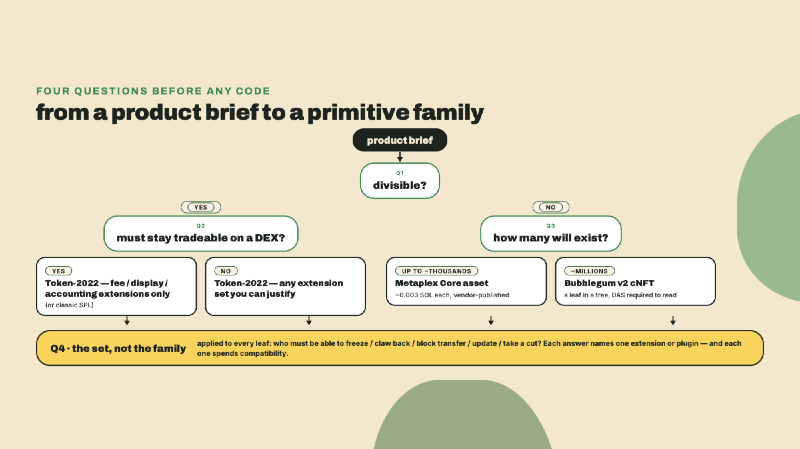
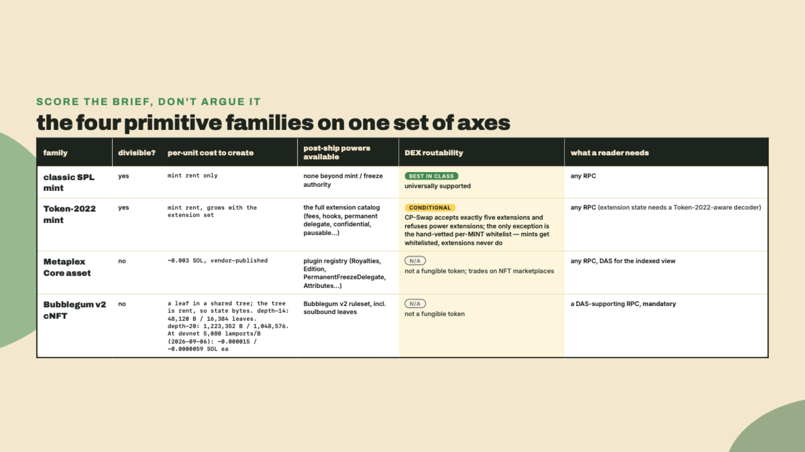
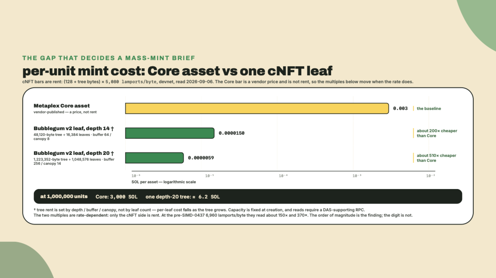
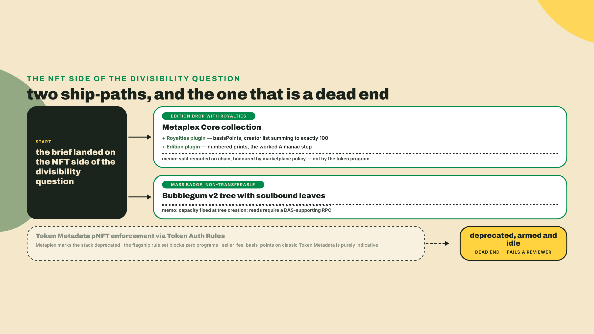
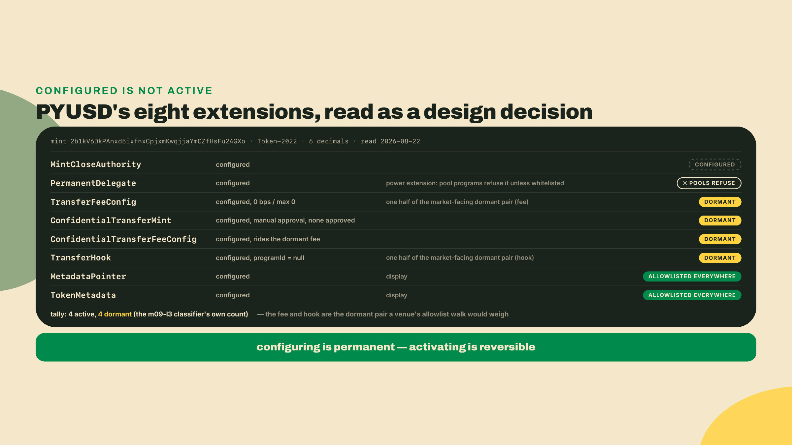
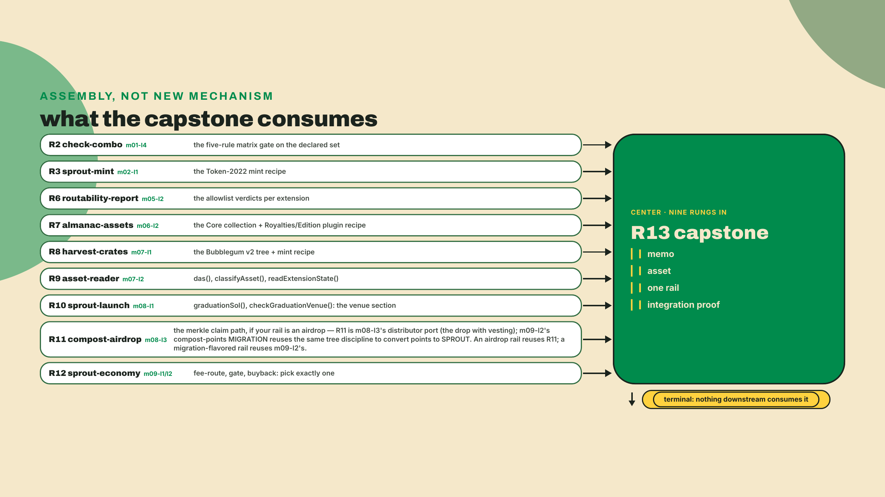
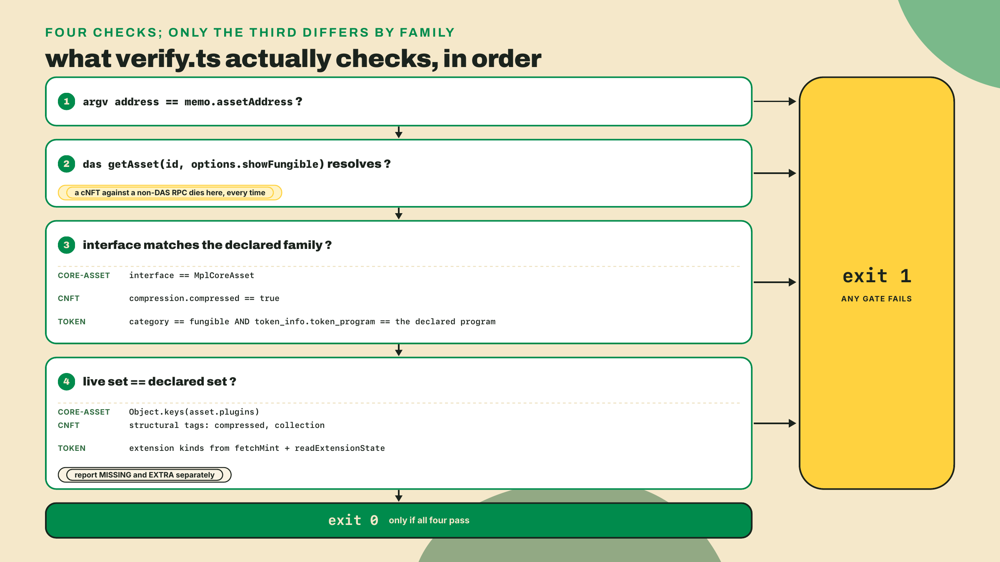

# Capstone: choose your primitive and wire the economy

## Summary

Two lessons back you wired the compost-points migration and the Founding-Farmer cNFT gate, which finished the Overgrowth economy: a mint, a cNFT, an airdrop and a DAS reader all firing in one flow. Last lesson you read production tokens instead of writing one, and watched PayPal's PYUSD carry eight configured extensions, four of them dormant by your own classifier's tally, with the two a venue would judge first, the fee and the hook, deliberately left switched off.

Every rung until now handed you the choice. Build SPROUT with fee plus harvest plus metadata. Mint the Almanac collection with a Royalties plugin. Size a tree at depth 14. This lesson takes the training wheels off. You get a product brief and nobody tells you which primitive to reach for, because that is the actual job, and because the decision is expensive to undo: a mint's extension set is fixed at creation (m02's narrow exceptions, the post-init metadata write and account-side reallocs, never cover the power extensions), a mint Raydium's allowlist refuses gets onto that venue only through the hand-vetted whitelist exception regulated issuers buy, and a cNFT you cannot read is a hash nobody can resolve.

The fade is total. No worked build. You get a `verify.ts` scaffold pinned to the same toolchain the labs used, a memo template, and the recipes you already wrote. Everything else is yours.

Start by claiming a brief. Make the folder and write one sentence into it before you read another paragraph:

```bash
mkdir -p capstone
printf '# Selection memo\n\nBrief: <the one sentence of product you are building>\n' > capstone/memo.md
```

Five briefs are on the menu, and the fifth is a door:

1. **Cafe loyalty currency.** A six-store chain, points earned per purchase, redeemable in store, and the owner wants a cut of every peer transfer.
2. **A musician's edition drop with royalties.** Numbered prints, a 5% royalty recorded on chain, a collection buyers can verify.
3. **A regulated payment token.** Divisible, must stay tradeable on a real venue, and compliance needs a way to freeze a bad actor.
4. **A DePIN device badge.** One badge per deployed device, potentially a million of them, non-transferable, readable by anyone.
5. **Your own product.** Same rules, same proof.

Pick now. The rest of this lesson assumes you have one in front of you.

## Choosing the primitive, then defending it

### The four constraints hiding in every brief

Product briefs do not say "use Token-2022 with a permanent delegate." They say things like "the owner wants a cut" and "compliance needs a way to freeze." Your first move is a translation, and there are only four questions worth asking, because between them they pick the family.

**Is it divisible?** If a holder can own 0.4 of it, you need a fungible mint, and only two families give you one: classic SPL and Token-2022. Core assets and cNFTs are NFTs. That single question kills more candidate designs than the other three combined, and it kills them for free, before you have written a line.

**Does it have to stay tradeable?** Not "would be nice," but has to. A loyalty point redeemed at a counter has no venue requirement at all. A payment token that cannot enter a pool is a payment token nobody can price. The moment the answer is yes, the compatibility thesis from the routable-token lesson takes over your extension list, and you are no longer choosing freely.

**How many will exist?** One, a thousand, or a million. Between a thousand and a million lies the line where compression stops being clever and starts being the only option, and the mint cost is the whole argument.

**Who has to be able to do what to it after it ships?** Freeze, claw back, prevent transfer, update metadata, take a cut. Every one of those maps to a named extension or plugin, and every one of them is a power that costs compatibility. This is the question that turns a brief into a set.

Answer those four in writing, in your memo, before you touch a recipe. I have watched people (myself included, on a hackathon weekend I would rather not re-litigate) mint first and answer second, and the result is always the same: a mint with the wrong extension set and a re-mint on Sunday morning.



### The matrix refuses you before the market does

Two gates stand between a set and a shipped mint, and they fire in this order.

The first is the conflict matrix you ported in module 1. Five rules, taken straight out of `check_for_invalid_mint_extension_combinations`, and they are not advice. A set that violates one of them fails at `initialize_mint`, on chain, with an `InvalidExtensionCombination` error — and because the taught flow batches create-account, init-extensions and `initialize_mint` into one transaction, the whole thing reverts atomically: the rent lamports bounce back to your payer and you are out only the transaction fee, plus the redesign. Your `checkCombo` function already encodes all five, so the cost of asking is one import and one call. Ask.

The second gate is the venue allowlist, and it is stricter than the matrix in the way that matters most: the matrix tells you what the token program refuses, and the allowlist tells you what the *market* refuses. Those are different failures. The first happens in a second, on devnet, for free. The second happens weeks later when someone tries to create a pool and finds out your mint cannot have one.

And under both sits the footgun that makes this lesson exist at all, the birth-only rule from the opening paragraph: extensions are enabled at mint creation, with only m02's two narrow post-init paths as exceptions. Every power extension on the mint is birth-only. There is no migration. There is no patch. If you got the set wrong you mint a new token and you move everyone to it, which is a product event, not a deploy.

Think of it as casting a bell. Everything about the tone gets decided in the mould, in one pour, and once the metal is cold your only remaining tool is a grinder. You can tune a bell after casting. You cannot make it a different bell.

### The compatibility thesis, out of Raydium's own mouth

Here is the sentence that should sit in your memo. Raydium's Token-2022 reference (read 2026-08-21) does not hide behind policy language. It rejects `PermanentDelegate` because a holder of the delegate can sweep any token account, *including the pool vault*, and it rejects `TransferHook` because the hook invokes a custom program on every transfer, with arbitrary compute consumption.

Read those two reasons again, because they generalize past Raydium. Both are the same complaint from an integrator's seat: your extension moved a decision that used to belong to the pool into the hands of someone the pool cannot audit. A venue that lists your token is taking custody of it inside a vault. Anything that lets you reach into that vault, or make a transfer cost an unbounded amount of compute, is a risk it did not sign up for.

Which is why the CP-Swap allowlist contains exactly five extensions, and why they are the boring ones: fees, metadata pointer, token metadata, interest-bearing config, scaled UI amount. Display and accounting get in. Power gets refused.

So the thesis, in one line you can hand to a product manager: fee, display, and accounting extensions get whitelisted, power extensions get refused. Notice the word that one-liner must NEVER contain: compliance. The compliance-shaped extensions, PermanentDelegate and DefaultAccountState, are exactly the powers the allowlist refuses, and a PM who walks away saying "compliance gets in" ships the wrong rule. Anything else you want, you either enforce off the venue, or you buy your way onto a static whitelist the way regulated issuers do.



### The cost axis is where the mass-mint brief gets decided

The numbers that settle the DePIN badge brief came out of your own labs rather than a marketing page.

A Metaplex Core mint costs a vendor-published ~0.003 SOL, one account, no metadata PDA, no master edition PDA. That is the cheap uncompressed option, and Metaplex published the figure, not this course — tilde included, because their table gives an approximation and hardening it into a fourth digit would be this course inventing precision on their behalf.

The tree you sized in module 7 at depth 14, buffer 64, canopy 8 is 48,120 bytes and holds 16,384 leaves: 0.245 SOL at devnet's rent rate on 2026-09-06, so roughly 0.000015 SOL per badge, about 200 times cheaper per unit than Core, paid up front, for a fixed capacity you commit to at creation. That multiple is rate-dependent in a way the cNFT-to-cNFT ones are not, because only one side of it is rent: at the pre-SIMD-0437 6,960 it read about 150 times.

Do not extrapolate that per-leaf number, and this is the part that trips people. Tree rent is not linear in leaf count. A concurrent Merkle tree account is sized by depth, buffer and canopy, not by how many leaves you intend to fill, so buying capacity is nearly free while buying canopy is not. Module 7's million-leaf tree, depth 20 with buffer 256 and canopy 14, is 1,223,352 bytes for 1,048,576 leaves, which came to 6.215 SOL on devnet's rent rate on 2026-09-06 and would have been 8.515 SOL before SIMD-0437 started cutting that rate. Price it on your own cluster; the bytes are the durable half. Either way it is a few millionths of a SOL per badge, hundreds of times cheaper per unit than Core. The bigger tree is the cheaper one per leaf, which is backwards from every other rent intuition you have, and it is why the mass-mint brief gets priced against the tree you would actually build rather than the one you built for practice.

A million devices at Core prices is about 3,000 SOL. A million devices in one tree is single-digit SOL. There is no design argument that survives that ratio, which is the useful thing about order-of-magnitude gaps: they end debates rather than starting them.

The bill comes due on the read side, and it is the fourth footgun of the course. A cNFT's on-chain footprint is a leaf hash. The asset itself is reconstructed by DAS indexers from data stores the RPC manages. Point a verification script at an RPC without DAS support and `getAsset` returns nothing, for an asset that minted perfectly, and you will spend twenty minutes suspecting your asset id. You cannot refactor that cost away later. It is a dependency you accept at design time, and it belongs in the memo right next to the tree's rent line.



### The NFT briefs have exactly one ship-path

If your brief landed on the NFT side of that first question, the family is decided and so, mostly, is the standard.

Token Metadata is officially legacy. Metaplex Core is the recommended standard for new NFT work, Bubblegum v2 for compressed, and the legacy lesson in module 6 is where the full argument lives, so I will not relitigate it here. What matters for a selection memo is the one sentence a reviewer will push back on: pNFTs enforce royalties through Token Auth Rules, which Metaplex marks deprecated and whose flagship rule set blocks zero programs. Armed and idle. If you pick that path for enforcement you have shipped a deprecated stack to get a guarantee that is not currently guaranteeing anything, and `seller_fee_basis_points` on a classic Token Metadata NFT is purely indicative anyway.

So the musician's drop resolves to a Core collection with the Royalties plugin carrying `basisPoints` and a creator list that sums to exactly 100, plus the Edition plugin for numbered prints, which is precisely the worked edition step you already built into the Almanac. Write the enforcement reality into the memo in plain words: the split is recorded on chain, readable by everyone, and honoured by marketplace policy rather than by the token program. A buyer deserves to know that before they buy, and a memo that pretends otherwise is the kind of document that ages badly.

The device badge resolves the other way, to a Bubblegum v2 tree with soulbound leaves, and its memo section is about tree capacity and read dependency rather than about royalties at all.



### PYUSD is the regulated brief, already solved

If you took brief three, somebody has shipped your token already, and you can read it.

PayPal and Paxos launched PYUSD on Solana in May 2024 as a Token-2022 mint at `2b1kV6DkPAnxd5ixfnxCpjxmKwqjjaYmCZfHsFu24GXo`. It carries eight TLV extensions: mint close authority, permanent delegate, transfer fee config, the confidential transfer pair, transfer hook, metadata pointer, and token metadata. I re-read the mint on 2026-08-22 and got the same eight, six decimals, unchanged.

Now the part that makes it a lesson rather than a case study. `transferHook.programId` is null. No hook program is set. The fee is 0 basis points with a maximum of 0. And your m09-l3 classifier tallied the mint at 4 active, 4 dormant: the confidential pair is switched off the same way, manual approval on and nobody approved. This lesson singles out the fee and the hook from that dormant four because they are the pair an allowlist walk would actually weigh; the confidential pair is dormant machinery a pool never inspects. Either way, the powers are configured and dormant, which means the issuer paid the account-size cost and the compatibility cost to hold options it has not exercised.

That is a deliberate strategy and you should name it as one if you copy it. Configuring an extension is a permanent decision. Activating it is a reversible one. A regulated issuer therefore front-loads every power it might ever need at mint, then leaves the switches off, because the alternative is discovering in year two that its compliance obligation requires an extension it cannot add.

The cost is exactly what the thesis predicts: a mint carrying a permanent delegate is refused by a permissionless pool program no matter how dormant that delegate is, because the allowlist reads the extension type, not your intentions. PYUSD trades anyway. It got there through the path a course token does not have, which is the honest thing to write in your memo if you take this brief: your compliance set is defensible, and your route to a venue is a business conversation, not a transaction.



### The venue section derives its own number

Your memo needs a launch-venue section, and it consumes the launch config you built in module 8 rather than repeating a number off a blog.

The number in question is 85 SOL, the graduation threshold everyone quotes for a pump.fun coin. Your `sprout-launch/derive-graduation.ts` does not store it. It computes it, from three published constants and the constant-product invariant: 30 virtual SOL, 1,073,000,000 virtual tokens, 793,100,000 real tokens. Drain the real reserve and the virtual token side lands at 279,900,000, so the final virtual SOL side is 30 times 1,073 over 279.9, about 115.005, and the SOL that had to enter is 115.005 minus 30. That is 85.005.

Which is the whole point. The threshold is a consequence of a curve someone else configured, not a constant of nature, and the same function returns 120 SOL for the alternative curve you tried in module 8: 30 virtual SOL, 1,000,000,000 virtual tokens, 800,000,000 real tokens. Change either token-side constant and the number moves. Your memo does not assert 85. It runs the function and prints what today's constants produce, so that when the constants change your memo is wrong loudly instead of quietly.


The venue section also does a job that has nothing to do with curves: it asks whether the venue can hold the token you chose at all. `checkGraduationVenue` refuses pump's path for any Token-2022 mint, because the `create` instruction pins the classic token program, and it accepts CP-Swap only when every extension in your set is on the five-item allowlist. Run it against your own declared set and paste the output. A venue verdict computed from your set is worth more than three paragraphs of prose about routability, and it takes one command.

Pool composition, routing and LP strategy for whatever you list are a different discipline, and the planned DeFi and RWA Engineering course teaches them properly. Your memo stops at "this venue can hold this token, and here is the threshold at today's constants."

### Exactly one rail, and why exactly one

Four rails are on the taught menu: three came out of the economy module, and the fourth, the airdrop, out of m08-l3's compost drop. You wire exactly one of the four. Fee routing harvests the withheld amounts a transfer fee accumulates into a treasury. A gate checks a wallet for a holding and grants or refuses access. An airdrop distributes against a merkle root with a claim path. A buyback spends treasury SOL on a client-side swap and burns what it bought.

Most briefs have an obvious fit. The cafe's owner wanting a cut of peer transfers is a fee route, because the fee is already accumulating in recipient accounts and the rail is the harvest. The musician's drop is a gate if holders get something, or an airdrop if the drop is the distribution. The device badge is a gate almost by definition, since the badge exists to authorise a device. The regulated token is a fee route or nothing, because the compliance rail is off chain by construction — and if you take it, note that the endorsed compliance set carries its fee at 0 bps, which withholds nothing: set a token nonzero fee (1 bps is plenty) for the wired rail, or your before-and-after printout cannot differ.

The reason it is one and not three is not workload. It is proof. A rail counts only when a script prints a before and an after, and three half-wired rails produce zero of those while one finished rail produces a receipt. Pick the rail whose before-and-after you can actually make visible in a terminal, and wire that one properly.


### Naming the trade you accepted is the memo

Everything above collapses into one meta-tradeoff, and writing it down is the deliverable.

Every primitive choice trades power for compatibility. A Token-2022 mint with a permanent delegate buys you compliance control and gets refused by a permissionless pool. A Core asset is cheap and plugin-rich and is not a fungible token, so no amount of plugin cleverness makes it divisible. A cNFT is nearly free at a million units and needs a DAS RPC to read at all, and carries no arbitrary account state you can hang a program off.

There is no free position on that curve. The memo is not where you claim you found one. It is where you write, in one paragraph, which power you gave up and what you got for it, so that the person who inherits your token in eighteen months can tell the difference between a constraint and an accident.



## Lab: memo, asset, rail, proof

The gate for this lesson is `npx tsx capstone/verify.ts $ASSET_ADDRESS` exiting 0. Everything before that is yours to route.

One standing rule, and it is graded: reuse only skills this course taught. No dependency you did not already install in an earlier lab. If your design needs a package this course never introduced, the design is out of scope for the capstone, and that constraint is doing you a favor by keeping the surface small enough to actually finish.

**1. Set up, with the same pins the labs used.** Install into your course workspace, not a fresh one, because `verify.ts` imports the reader you already wrote:

```bash
npm install @solana/kit@7.1.1 @solana-program/token-2022@0.15.0
npm install -D tsx@4.23.12 typescript@5.9.3 @types/node@24
```

Freshness note, since these pins are the ones you will re-check first when something breaks a year from now. On 2026-09-05 npm's `latest` for `@solana/kit` was 8.2.0, and this course pins 7.1.1 anyway: `@solana-program/token-2022@0.15.0` declares a peer range of `^7.0.0`, so the pair above is the peer-valid combination for the code you have already written. Never install "latest" here. Check the peer range and pin the exact pair.

**2. Write the memo's machine-readable half first.** Prose memos drift from reality; a JSON memo gets compared against the chain. This is the file `verify.ts` reads:

```typescript
// capstone/memo.ts: the memo's machine-readable half (R13).
// The prose memo is for humans. This file is the part verify.ts reads.
import { readFileSync } from 'node:fs';

export type PrimitiveFamily = 'spl-token' | 'token-2022' | 'core-asset' | 'cnft';

export interface SelectionMemo {
  /** One line of product, in the brief's own words. */
  product: string;
  primitiveFamily: PrimitiveFamily;
  /**
   * Token families: extension kinds, spelled the way the Token-2022 client
   * spells them. core-asset: plugin names. cnft: the structural tags DAS
   * can actually return.
   */
  declaredSet: string[];
  /** Exactly one, from the rails this course taught. */
  rail: 'fee-route' | 'gate' | 'airdrop' | 'buyback';
  /** The power you gave up, or the compatibility you gave up. In writing. */
  tradeoff: string;
  /** The address you shipped. verify.ts cross-checks its argv against this. */
  assetAddress: string;
}

// The full cNFT tag menu verify.ts understands. Leave this constant alone:
// your declaration happens in memo.json, and it must list only the tags YOUR
// mint will actually produce. 'compressed' always appears; 'collection'
// appears only if you mint the leaf INTO a collection. A badge minted
// collectionless comes back as ['compressed'] alone, so declare just that, or
// mint under a collection and declare both. Neither is wrong for the badge
// brief; verify.ts holds you to whichever you declared.
export const CNFT_TAGS = ['compressed', 'collection'];

export function loadMemo(path = 'capstone/memo.json'): SelectionMemo {
  let raw: string;
  try {
    raw = readFileSync(path, 'utf8');
  } catch {
    throw new Error(`${path} not found. Fill it from the template in this lesson.`);
  }
  const memo = JSON.parse(raw) as SelectionMemo;
  if (memo.declaredSet.length === 0 && memo.primitiveFamily !== 'spl-token') {
    throw new Error(
      `${path}: declaredSet is empty for ${memo.primitiveFamily}. An empty set is a claim too, so make it on purpose.`,
    );
  }
  return memo;
}
```

That one guard exists because of a failure mode I want you to hit here rather than later. An empty `declaredSet` on a Token-2022 mint usually means somebody skipped the design step, so it throws unless the family is classic SPL, where empty is the correct answer. Notice what `loadMemo` deliberately does *not* check: `assetAddress`. The memo is legitimately addressless until step 5, because the design work in steps 3 and 4 happens before anything is minted. The address requirement belongs to `verify.ts`, the one consumer for which a memo that verifies against nothing is a document, not a proof, and you will see it enforce that itself.

**3. Fill `capstone/memo.json` before you mint.** The order matters. This file is a prediction, and minting is the experiment:

```json
{
  "product": "Cafe loyalty currency for a six-store chain",
  "primitiveFamily": "token-2022",
  "declaredSet": ["TransferFeeConfig", "MetadataPointer", "TokenMetadata"],
  "rail": "fee-route",
  "tradeoff": "no PermanentDelegate, so no clawback if a wallet is compromised; in exchange the mint stays poolable on CP-Swap with no whitelist request",
  "assetAddress": ""
}
```

Then gate the set through the matrix before it ever reaches a transaction. This one gets its own file, since skipping it is the miss that costs you a mint: save it as `capstone/precheck.ts` and run `npx tsx capstone/precheck.ts`. One import, one call, and it catches the combination errors that would otherwise cost you a mint:

```typescript
// capstone/precheck.ts - run before any lamport moves: npx tsx capstone/precheck.ts
import { checkCombo } from '../check-combo';
import { loadMemo } from './memo';

const memo = loadMemo();
const combo = checkCombo(memo.declaredSet);
if (!combo.valid) {
  throw new Error(`declared set is invalid on chain: ${combo.reason}`);
}
```

**4. Compute the venue section.** This is the part of the memo that consumes the launch config by name, and it is short because the work was done two modules ago:

```typescript
// capstone/venue.ts: the memo's launch-venue section, computed not asserted.
// Run: npx tsx capstone/venue.ts
// Consumes R10 (sprout-launch/derive-graduation.ts) by name.
import {
  PUMP_REFERENCE_CURVE,
  VENUES,
  checkGraduationVenue,
  finalReserves,
  graduationSol,
  spotPrice,
} from '../sprout-launch/derive-graduation';
import { loadMemo } from './memo';

function fmt(n: number, places = 3): string {
  return n.toLocaleString('en-US', {
    minimumFractionDigits: places,
    maximumFractionDigits: places,
  });
}

function main(): void {
  const memo = loadMemo();
  const c = PUMP_REFERENCE_CURVE;
  const f = finalReserves(c);
  const grad = graduationSol(c);
  const open = spotPrice(c.virtualSolReserves, c.virtualTokenReserves);
  const close = spotPrice(f.finalVirtualSol, f.finalVirtualToken);

  console.log('## Launch venue\n');
  console.log(`Product:            ${memo.product}`);
  console.log(`Primitive family:   ${memo.primitiveFamily}`);
  console.log(`Declared set:       ${memo.declaredSet.join(', ') || '(none)'}\n`);

  console.log('Reference curve, derived live from the published constants:');
  console.log(`  virtual SOL / virtual tokens / real tokens: ${c.virtualSolReserves} / ${fmt(c.virtualTokenReserves, 0)} / ${fmt(c.realTokenReserves, 0)}`);
  console.log(`  final virtual SOL:      ${fmt(f.finalVirtualSol)} SOL`);
  console.log(`  SOL added to graduate:  ${fmt(grad)} SOL`);
  console.log(`  price multiple:         ${fmt(close / open, 2)}x\n`);

  if (memo.primitiveFamily === 'core-asset' || memo.primitiveFamily === 'cnft') {
    console.log(
      `A ${memo.primitiveFamily} is not a fungible mint, so no curve venue applies. Say that in the memo and name where it trades instead.`,
    );
    return;
  }

  if (memo.primitiveFamily === 'spl-token') {
    console.log(
      'Declared family is classic SPL. checkGraduationVenue was written against SPROUT, a Token-2022 mint, and it hardcodes that assumption in its reason strings, so running it here prints a refusal that is about SPROUT rather than about you. A classic mint carries no extensions for a venue to refuse, so both taught venues accept it by construction. Write that sentence in the memo instead of a verdict table.',
    );
    return;
  }

  console.log('Venue verdicts for the declared set:\n');
  let anyAccepted = false;
  for (const venue of VENUES) {
    const verdict = checkGraduationVenue(venue, memo.declaredSet);
    anyAccepted = anyAccepted || verdict.accepted;
    console.log(`  ${verdict.accepted ? 'ACCEPTS ' : 'REFUSES '} ${verdict.venue}`);
    for (const reason of verdict.reasons) {
      console.log(`            ${reason}`);
    }
    console.log(`            source: ${venue.source}`);
  }

  if (!anyAccepted) {
    console.log(
      '\nNo taught venue accepts this set. That is a finding, not a bug: write it in the memo, or change the set.',
    );
  }
}

main();
```

`npx tsx capstone/venue.ts` prints 85.005 SOL for the reference curve and one verdict line per venue. If your brief is fungible, paste that output straight into `memo.md`. If you took the musician's drop or the device badge, paste only the no-curve-venue line: the reference-curve derivation above it prints for calibration on every run, and graduation math in a badge memo is exactly the kind of off-spec residue a reviewer flags.

Two of the branches in that file exist because an artifact reused outside its original assumption will lie to you rather than error. If you took the musician's drop or the device badge, no curve venue applies at all, and saying so is worth more than inventing one. And if you took classic SPL, notice that `checkGraduationVenue` is not a general oracle: it was written for SPROUT, so its very first test asks whether the venue speaks Token-2022 and its reason string names SPROUT out loud. Point it at a classic mint and it would refuse pump.fun, exactly the venue a classic mint is welcome at. That is why the spl-token branch in the code above bypasses the call entirely: your run printed the honest sentence instead of an off-spec refusal. That is not a bug in the function, it is a function used off its spec, and catching it is the kind of thing a capstone is for.

**5. Ship the asset, from a recipe you already wrote.** No new mechanism here, which is the point of a capstone. Token-2022 mint: your module 2 recipe with your declared set. Core collection with Royalties and numbered prints: your module 6 recipe, and the Edition plugin is the piece the musician's brief was pointing at all along. cNFT badge: your module 7 tree, sized by your own math, with soulbound leaves if the brief says non-transferable.

Write the resulting address into `memo.json` the moment it lands, then leave the memo alone. Editing the memo after seeing the chain is how a proof becomes a formality.

Devnet is the right cluster for this and you should not feel bad about it. The verification is identical, the extension state is identical, and the only thing mainnet would add is a bill. The one honest caveat is the price field: a devnet mint will resolve, classify as fungible, and come back with no `price_info`, because the priced set is roughly the top ten thousand tokens by 24-hour volume. That is the normal case and your script does not depend on it.

**6. Wire exactly one rail.** One. Not two because you have time. Fee-route: harvest withheld amounts to a treasury and show the balance move. Gate: check a wallet for the holding and refuse it access. Airdrop: the merkle claim path with one real claim. Buyback: the client-side swap call against the venue, then the burn. Prove it in a script that prints a before and an after, because a rail nobody can watch execute is a diagram.

Name the script after the rail, `capstone/rail-fee-route.ts` or `capstone/rail-gate.ts`, and have it exit non-zero when the after does not differ from the before. That last part matters more than it looks. A rail script that logs and always exits 0 will happily report success against a transaction that never landed, and you will not notice until someone else runs it.

**7. Write `capstone/verify.ts`.** The scaffold is below, complete and runnable. Read the three-way branch in `liveState` before you run it, because that branch is the whole lesson compressed into thirty lines: three primitive families, three completely different definitions of what "live state" even means.

```typescript
// capstone/verify.ts: R13's integration proof.
// Run: npx tsx capstone/verify.ts <ASSET_ADDRESS>
// Exit 0 means: DAS resolved the asset, its interface matches the family the
// memo claims, and its live on-chain state equals the memo's declared set.
import { address, createSolanaRpc } from '@solana/kit';
import { fetchMint } from '@solana-program/token-2022';
import { das } from '../overgrowth/das';
import { classifyAsset, type DasAsset } from '../overgrowth/classify';
import { readExtensionState } from '../overgrowth/extension-state';
import { CNFT_TAGS, loadMemo, type SelectionMemo } from './memo';

const TOKEN_2022 = 'TokenzQdBNbLqP5VEhdkAS6EPFLC1PHnBqCXEpPxuEb';
const TOKEN_CLASSIC = 'TokenkegQfeZyiNwAJbNbGKPFXCWuBvf9Ss623VQ5DA';

interface CapstoneAsset extends DasAsset {
  id: string;
  content?: { metadata?: { name?: string } };
  ownership?: { owner?: string };
  grouping?: { group_key?: string; group_value?: string }[];
  compression?: { compressed?: boolean; tree?: string; leaf_id?: number };
  token_info?: {
    decimals?: number;
    token_program?: string;
    price_info?: { price_per_token?: number };
  };
  plugins?: Record<string, unknown>;
}

interface LiveState {
  set: string[];
  notes: string[];
}

function expectedInterfaceFamily(memo: SelectionMemo): (asset: CapstoneAsset) => string | null {
  return (asset) => {
    const c = classifyAsset(asset);
    switch (memo.primitiveFamily) {
      case 'core-asset':
        return asset.interface === 'MplCoreAsset'
          ? null
          : `memo says core-asset, DAS says interface=${asset.interface}`;
      case 'cnft':
        return c.compressed
          ? null
          : `memo says cnft, DAS says compressed=false (interface=${asset.interface})`;
      case 'token-2022':
      case 'spl-token': {
        if (c.category !== 'fungible') {
          return `memo says ${memo.primitiveFamily}, DAS classifies this as ${c.category}`;
        }
        const want = memo.primitiveFamily === 'token-2022' ? TOKEN_2022 : TOKEN_CLASSIC;
        const got = asset.token_info?.token_program;
        if (!got) {
          // Same philosophy as the Core branch below: a silent pass on an
          // unread field is worse than no verification at all.
          return `DAS returned no token_info.token_program to check the declared family against; use an endpoint that returns it`;
        }
        if (got !== want) {
          return `memo says ${memo.primitiveFamily}, token_program is ${got}`;
        }
        return null;
      }
    }
  };
}

async function liveState(memo: SelectionMemo, asset: CapstoneAsset): Promise<LiveState> {
  if (memo.primitiveFamily === 'core-asset') {
    if (!asset.plugins) {
      throw new Error(
        'this endpoint returned no plugins object for a Core asset, so the memo cannot be checked against it. Try another DAS provider.',
      );
    }
    return { set: Object.keys(asset.plugins), notes: ['plugin names read from the DAS payload'] };
  }

  if (memo.primitiveFamily === 'cnft') {
    const set: string[] = [];
    if (asset.compression?.compressed === true) set.push('compressed');
    if ((asset.grouping ?? []).some((g) => g.group_key === 'collection')) set.push('collection');
    return {
      set,
      notes: [
        `a cNFT leaf has no extension or plugin account, so the live set is the structural tags DAS returns: ${CNFT_TAGS.join(', ')}`,
        `tree=${asset.compression?.tree ?? '(none)'} leaf_id=${asset.compression?.leaf_id ?? '(none)'}`,
        'BLIND SPOT, on record: these tags cannot see soulbound-ness. If the brief hinges on non-transferable (brief 4), this gate cannot check it; prove it with a transfer-must-fail script the way m07-l1 taught, and say so in the memo.',
      ],
    };
  }

  const rpc = createSolanaRpc(process.env.RPC_URL ?? 'https://api.devnet.solana.com');
  // Off-spec reuse, named, since venue.ts just got a lecture about exactly
  // this: for the 'spl-token' family this calls the token-2022 client's
  // fetchMint against a classic mint. That works because the 82-byte base
  // layout is shared between the two programs and a classic mint simply has
  // no TLV region, so extensions decode as None; the family check above has
  // already pinned the owning program, which is what makes the reuse safe.
  const mint = await fetchMint(rpc, address(asset.id));
  const extensions = mint.data.extensions.__option === 'Some' ? mint.data.extensions.value : [];
  const states = readExtensionState(extensions);
  return {
    set: states.map((s) => s.kind),
    notes: states.map((s) => `${s.active ? 'ACTIVE ' : 'DORMANT'} ${s.kind}: ${s.detail}`),
  };
}

function compare(declared: string[], live: string[]): { missing: string[]; extra: string[] } {
  const declaredSet = new Set(declared);
  const liveSet = new Set(live);
  return {
    missing: declared.filter((x) => !liveSet.has(x)),
    extra: live.filter((x) => !declaredSet.has(x)),
  };
}

async function main(): Promise<void> {
  const argAddress = process.argv[2];
  if (!argAddress) {
    throw new Error('usage: npx tsx capstone/verify.ts <ASSET_ADDRESS>');
  }
  const memo = loadMemo();
  if (!memo.assetAddress) {
    throw new Error('memo.json: assetAddress is empty. Ship the asset (step 5) before you verify it.');
  }
  if (memo.assetAddress !== argAddress) {
    throw new Error(
      `memo.json declares ${memo.assetAddress}, you passed ${argAddress}. Verify the thing you wrote down.`,
    );
  }

  const showFungible = memo.primitiveFamily !== 'core-asset' && memo.primitiveFamily !== 'cnft';
  const asset = await das<CapstoneAsset>('getAsset', {
    id: argAddress,
    options: { showFungible },
  });

  const c = classifyAsset(asset);
  console.log(`asset      ${asset.id}`);
  console.log(`name       ${asset.content?.metadata?.name ?? '(unnamed)'}`);
  console.log(`interface  ${asset.interface}  category=${c.category}  das-rpc-required=${c.requiresDasRpc}`);
  console.log(`owner      ${asset.ownership?.owner ?? '(n/a for a fungible mint)'}`);
  console.log(`rail       ${memo.rail}`);

  const familyError = expectedInterfaceFamily(memo)(asset);
  if (familyError) {
    throw new Error(familyError);
  }

  const state = await liveState(memo, asset);
  console.log('\nlive state');
  for (const note of state.notes) console.log(`  ${note}`);

  const { missing, extra } = compare(memo.declaredSet, state.set);
  console.log('\nmemo vs chain');
  console.log(`  declared  ${memo.declaredSet.join(', ') || '(empty)'}`);
  console.log(`  live      ${state.set.join(', ') || '(empty)'}`);
  if (missing.length > 0) console.log(`  MISSING   ${missing.join(', ')}`);
  if (extra.length > 0) console.log(`  EXTRA     ${extra.join(', ')}`);

  if (missing.length > 0 || extra.length > 0) {
    throw new Error(
      'live state does not equal the memo. Either the memo is wrong or the asset is, and only one of those is cheap to fix.',
    );
  }

  console.log(`\nOK  memo matches chain. Tradeoff on record: ${memo.tradeoff}`);
}

main().catch((err: unknown) => {
  console.error(`FAIL  ${err instanceof Error ? err.message : String(err)}`);
  process.exit(1);
});
```

Three decisions in that file are worth their why, and the rest is plumbing.

The `EXTRA` check is not symmetrical decoration. A missing extension means your mint failed to get what you asked for. An extra one means you got something you never declared, usually because a recipe defaulted a field, and that is the more dangerous direction: an undeclared power on a mint is exactly the thing that gets you refused at a venue you assumed you were compatible with.

The `token_program` comparison is cheap insurance against the most embarrassing possible mistake, which is shipping a classic SPL mint while your memo says Token-2022. DAS hands you the owning program, so ask, and refuse to proceed when the field comes back absent, for the same reason the Core branch refuses a missing plugins object.

And the Core branch throws rather than passing when the endpoint returns no `plugins` object. A verification that cannot see the thing it is verifying must fail loudly. A silent pass on an unread field is worse than no verification at all, because you will believe it.



**8. Run the gate.** Point `DAS_RPC_URL` at a DAS-supporting endpoint (`RPC_URL` can stay on devnet for the mint read) and run it:

```bash
export DAS_RPC_URL="https://<your-das-endpoint>"
npx tsx capstone/verify.ts <YOUR_ASSET_ADDRESS>
```

A passing run prints the asset line, the interface and category, the live state, the memo-versus-chain comparison, and one `OK` line ending in the tradeoff you wrote down. Exit code 0. If it exits 1, read which of the four gates fired, because each one names a different mistake and only one of them is a code bug.

## Challenge

Break your own proof, on purpose, three times. This is a five-minute exercise and it is the difference between a verification you trust and a verification you performed.

**One.** Add a fake extension name to `declaredSet` in `memo.json` and re-run. You should see it under `MISSING` and exit 1. If it passes, your comparison is not comparing.

**Two.** Remove a real extension from `declaredSet` and re-run. It should appear under `EXTRA` and exit 1. Most people's first version of this script only checks one direction, and it always passes, and it is always worthless.

**Three.** Point `DAS_RPC_URL` at a plain RPC with no DAS support and re-run. If your asset is a cNFT you will get the JSON-RPC method-not-found path from your own transport, which is the failure mode module 7 warned you about. If your asset is a Token-2022 mint, note what happens and write it down: some plain endpoints answer `getAsset` for fungibles and some do not, and knowing which yours does is a portability fact about your stack.

Then restore the memo and get back to a green run. Optionally, and this is the version worth putting in a portfolio: write a second brief's memo without minting anything, run `capstone/venue.ts` against it, and put both memos side by side. Two defensible choices for two different products, from the same toolkit, is a stronger artifact than one shipped token.

## Checkpoint

You are done when four things exist together.

A memo, prose plus JSON, naming the primitive family, the extension or plugin set, the tradeoff you accepted in one paragraph, and a venue section whose numbers came out of `capstone/venue.ts` rather than out of a blog post. The asset, shipped from taught recipes only. One rail, wired and proven in a script that prints a before and an after. And a green `npx tsx capstone/verify.ts $ASSET_ADDRESS`, exit 0, with the live set equal to the declared set, plus, if you took brief 4, the transfer-must-fail proof beside it, because the cNFT tag set cannot see soulbound-ness and the gate prints that blind spot itself.

Say the answer to one question out loud before you close the terminal, because it is the thing this whole course was building toward: which power did you give up, and what did you get for it? If you can answer that in one sentence without looking at your notes, you did not just ship a token. You made an architectural decision and left the receipt.

A note on how that feels, since the fade was total here and total fades are uncomfortable. The discomfort is the curriculum. Nine modules of worked builds exist so that this lesson could take them away, and if you shipped something that resolves through DAS with a memo that matches it, you have done the thing the job actually asks for.

You have shipped a product of your own choosing and proved it resolves. One thing left: close the loop. Next lesson you re-derive the decision cold, no notes, against three cold briefs: one you have never seen, one that re-runs the mass-badge shape this lesson priced but did not build for you, and one deliberately adjacent to the worked cafe memo above, because retrieval practice needs an anchor you can calibrate against. Then you map where this toolkit takes you next.
