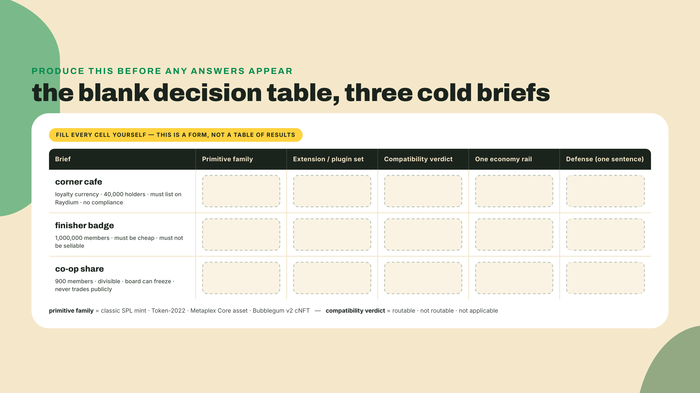
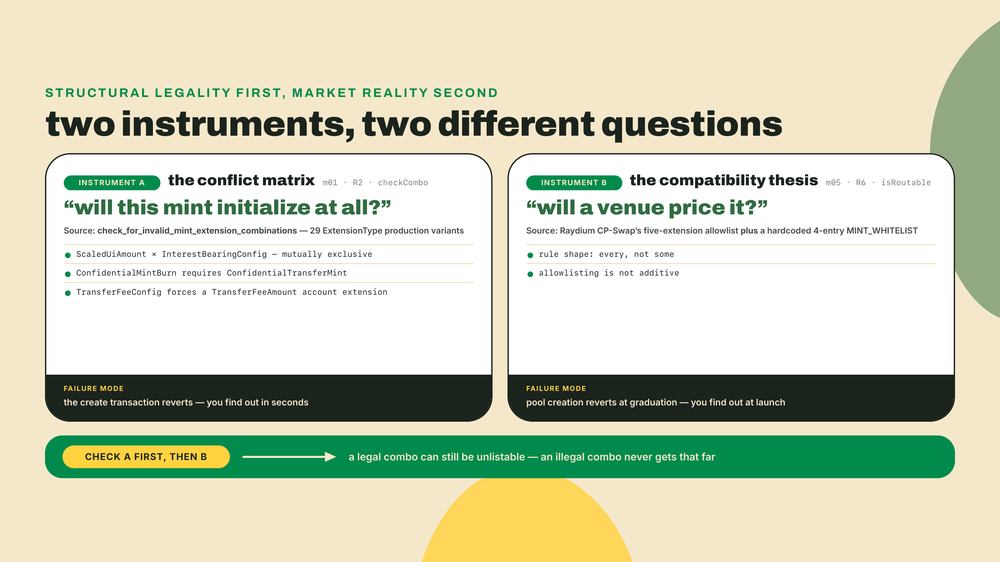
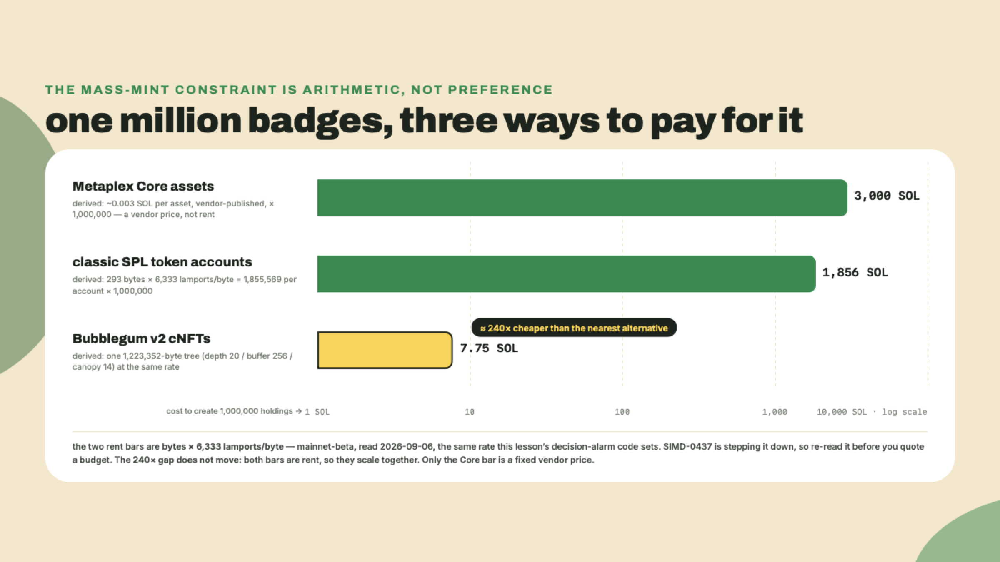
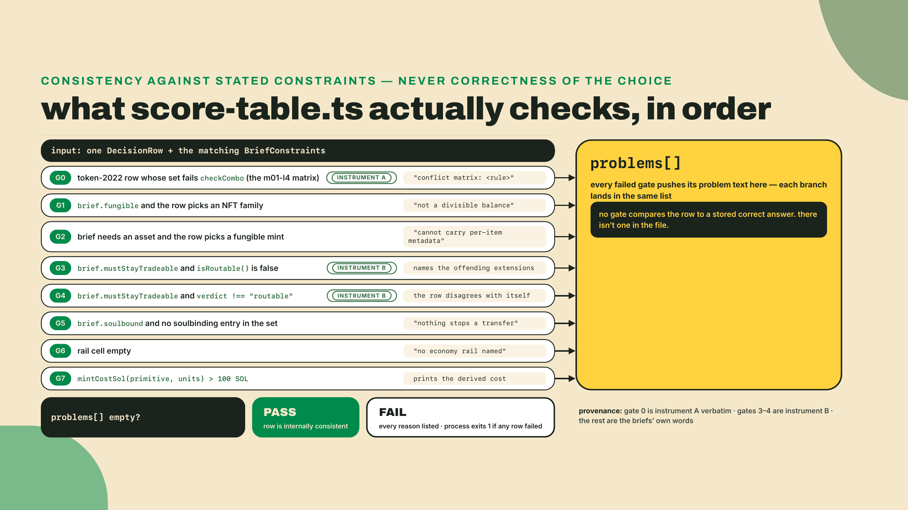
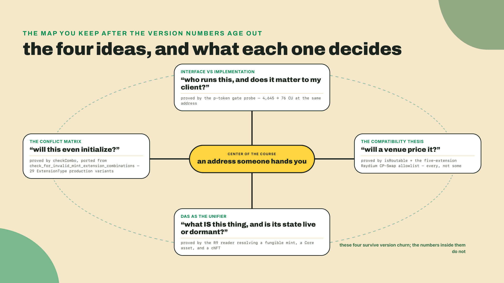
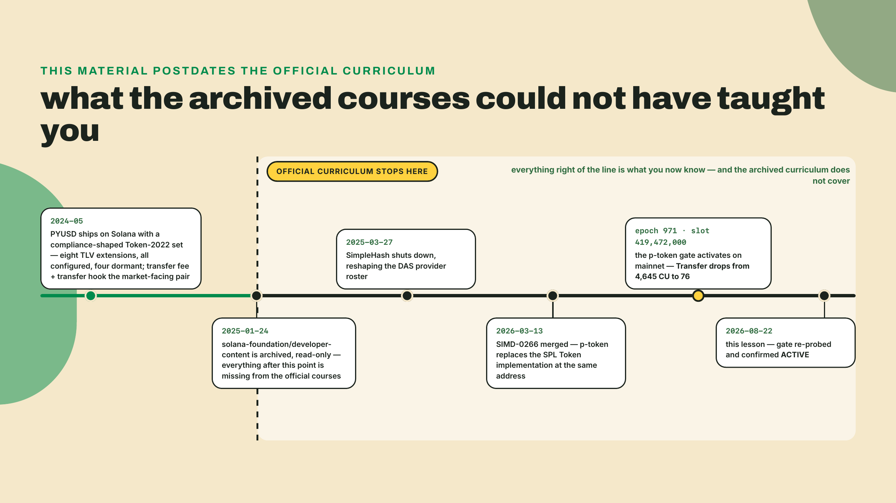

# Close the notes: three cold briefs, and the door you walk through next

## Summary

R13, the capstone, was the last build this course asks of you. Two moves remain, exactly as the capstone's closing promised: a cumulative checkpoint over three cold briefs, scored against the conflict matrix from module one and the compatibility thesis from module five, and then the close. One brief is novel, one re-runs the mass-badge shape the capstone priced but never made you build, and one sits deliberately next to the worked cafe memo, the calibration anchor. The fade is total. No worked answer arrives before yours does.

So close the notes. Browser tabs included. Here are the three briefs.

**Brief one, the corner cafe.** A cafe chain with eleven shops wants a loyalty currency. Customers earn it per purchase and can sell it to each other, and the owner is firm that it must be listable on Raydium so the price is public. No regulator is involved, no compliance controls are wanted, and roughly 40,000 customers will hold a balance.

**Brief two, the finisher badge.** A running club wants to hand every one of its one million members a badge for finishing a virtual marathon. It has to be cheap at that count, and a badge that shows up for sale on a marketplace is an embarrassment they will not accept.

**Brief three, the co-op share.** A food co-op tokenizes member shares, one issuance per member, about 900 of them, divisible because the annual patronage split lands as fractions. The board must be able to freeze a share when a member is expelled, and the share must never trade on a public venue.



Now fill four cells for each brief, in a text file, by hand: the primitive family, the extension or plugin set, the compatibility verdict, the one economy rail. One sentence of defense per row. No searching, no scrolling back. Give it fifteen minutes and accept whatever comes out, blanks and all.

## The checkpoint is a mirror, not a test

Two words are worth naming before we go further, because they are the whole method. A **cumulative checkpoint** is a closed-book retrieval pass over an entire course, produced rather than read, and it carries no grade and gates nothing. A **decision table** is the compressed form of everything this course taught: four cells per brief, because four cells is what a real product decision actually needs before anyone opens an editor.

I want to be blunt about why the produce-it rule matters, because I have been on the wrong side of it. Reading an answer key feels exactly like knowing the answer. The recognition is instant, the material looks familiar, and you close the tab feeling fluent about something you could not have generated. That feeling is the single most expensive illusion in technical learning. It costs you nothing today and costs you a re-mint later, because a mint's extension set is fixed at creation (the exceptions are all pointer-then-realloc writes chosen at birth anyway — metadata, the group TLVs, and the account-level extensions — and no power extension is among them), so a wrong set is not a patch, it is a new mint and a migration.

The second rule is gentler. A blank cell is not a failure, it is an address. Every stall you had in the last fifteen minutes points at exactly one module, and by the end of this lesson you will have a small table mapping each kind of blank to the lesson that fills it. That is the actual output of a checkpoint. Not a score.

### The two instruments you check against

You have two rules to check a row with, and they answer different questions, in a strict order.

The **conflict matrix** from module one answers "will this mint even initialize?" You ported it from the source of truth, `check_for_invalid_mint_extension_combinations`, into `checkCombo`, a pure function with no RPC in it. Its rules are structural: `ScaledUiAmount` and `InterestBearingConfig` are mutually exclusive because two different UI multipliers on one balance is nonsense. `ConfidentialMintBurn` requires `ConfidentialTransferMint`, because the burn path needs the encrypted supply it operates on. And the forced pairs from `required_init_account_extensions` mean choosing `TransferFeeConfig` on the mint silently obligates a `TransferFeeAmount` on every account. Twenty-nine production variants in the `ExtensionType` enum, and the matrix is the difference between combinations that exist and combinations that initialize.

The **compatibility thesis** from module five answers a colder question: "will anyone be able to trade it?" Raydium's CP-Swap allowlist is exactly five Token-2022 extensions, and you proved the shape of the rule with your own predictor. It is `every`, not `some`. Five allowlisted extensions plus one refused extension is still refused, because the pool's exposure to a permanent delegate does not shrink when a fee config sits next to it. Raydium wrote the reason down in plain language: a holder of the delegate can sweep any token account, including the pool vault. The escape hatch is a hardcoded four-entry `MINT_WHITELIST`, which is not a thing you apply for on a Tuesday.



### Row one, checked

The cafe brief hands you two constraints and one absence, and the absence is the loud part. It must stay tradeable. It has 40,000 holders. And nobody asked for compliance controls, which means every power extension you might reach for is a cost with no buyer.

So the defensible row is a Token-2022 mint carrying display-only extensions, `MetadataPointer` plus `TokenMetadata`, and nothing else. Both sit on the allowlist, so `isRoutable` comes back true and the verdict cell reads routable. The rail is a fee route if the shop wants a cut of secondary trades, which means `TransferFeeConfig` must be in the declared set at creation, the birth-only rule again, and that is also allowlisted, also fine. Classic SPL would work too, and it is not wrong, it just throws away native metadata for no reason at all in 2026.

The trap in this row is a `TransferHook`, and it is a tempting one. Logging every loyalty transfer on-chain sounds like exactly what a loyalty program wants. It also invokes a custom program on every transfer with arbitrary compute consumption, which is precisely why Raydium refuses it, and the brief said the price has to be public. If your row has a hook in it, you did not get the mechanism wrong. You got the ordering wrong: you satisfied the feature before you satisfied the constraint that was stated as non-negotiable.

### Row two, checked

The badge brief is the one that separates a current mental model from an inherited one, because it stacks two constraints that used to be answered by two different primitives.

Cheap at a million is compression's job and nothing else's. Metaplex Core is genuinely cheap per asset at about 0.003 SOL, vendor-published, which is a wonderful number right up until you multiply it by a million and get roughly 3,000 SOL. A Bubblegum v2 tree sized for a million leaves is 1,223,352 bytes, which lands in the single digits of SOL at any rent rate the network has charged this year. That is a better deal by more than two orders of magnitude, the kind of gap where the arithmetic does the deciding, not taste.

Not sellable is the half that used to break this. Folklore from 2024 says compressed NFTs cannot be frozen or made soulbound, which was true then and is simply false now. Bubblegum v2 ships `set_non_transferable_v2`, and a compressed NFT can be soulbound at mint. So the row is a cNFT under the club's collection, made non-transferable, with a gate as its rail, and the verdict cell reads not applicable because a soulbound badge was never going to a pool.



### Row three, checked

The co-op share inverts row one, and if you got both rows right you have the thesis, not just the rule.

Here the board wants freeze authority over a holder's balance, and the brief explicitly says it never trades publicly. So the power extensions that were disqualifying for the cafe are simply available. `DefaultAccountState` set to frozen gives the co-op an approval step before any new member can hold, and a permanent delegate or a freeze authority gives the board its expulsion path. The verdict cell reads not routable, and writing that down is the row's whole point: it is a chosen not-routable, priced and accepted, rather than a not-routable you discover at launch. The rail is a gate, the same pattern that let a Founding Farmer cNFT open the Overgrowth alpha, pointed at membership instead.

This is where the compatibility thesis earns its keep as a design tool rather than a warning label. It never said power extensions are bad. It said they cost venues, and a product that does not want venues pays nothing.

### Where a blank cell points

Now do the thing the checkpoint exists for. Look at what you could not fill and map it.

| The cell you stalled on | What it means you skipped | Where it lives |
|---|---|---|
| primitive family, on any row | you have the pieces but not the selector | module one, the decision framework and the conflict matrix |
| extension set, on a fungible row | the catalog never got compressed into economics, authority, and display | module two, the four extension lessons |
| the verdict cell | the compatibility thesis stayed a fact instead of becoming a habit | module five, the allowlist artifact and the routable-token design |
| the badge row entirely | compression is still filed as an exotic option | module seven, Bubblegum v2 and the cost derivation |
| the rail cell | you built the assets and never wired value between them | module nine, fee routing, gating, and migrations; m08-l3 if the blank was the airdrop rail |
| how you would prove any of it | reading assets is still someone else's job | module seven, the DAS lesson and the R9 reader |

Six rows, and a mature reaction to two of them lighting up is to go re-read those two lessons, not to feel bad. The table is the deliverable.

## Lab: score your own table

The tool below is deliberately not an answer key. It knows the three briefs' stated constraints, which you can read off the text above, plus the two taught rules. It has no idea what the right primitive is. That distinction is what makes it a mirror: it can tell you that a row contradicts itself, and it cannot tell you what to write.

**1.** Scaffold a folder next to your capstone work and install the runner. Two dev dependencies, nothing that talks to a chain, because a rules check should run in milliseconds with the wifi off. The one import from outside this folder is your own `checkCombo` from the m01-l4 lab, which is equally offline: a pure function, no RPC in it.

```bash
mkdir -p checkpoint && cd checkpoint
npm init -y
npm pkg set type=module
npm install -D tsx@4.23.12 @types/node@24
```

Those are the versions I ran on 2026-08-22, and both move fast enough that you should re-pin rather than copy them in a year. `tsx` runs TypeScript with no build step; the Node types keep `process.exit` from glowing red in your editor.

**2.** Create `score-table.ts`. Read the top half as a restatement of the two instruments, because that is what it is: the conflict matrix imported straight from your m01-l4 port, the allowlist from module five, the cost constants from modules six, seven and eight, and the brief constraints transcribed from prose into fields.

```typescript
// score-table.ts: scores YOUR filled decision table against the two taught rules.
// There is no answer key in this file. It knows each brief's stated constraints
// and the rules from m01-l4 (the conflict matrix) and m05-l2 (the thesis).
import { checkCombo } from "../check-combo"; // instrument A, the m01-l4 port, verbatim

// Deliberately identical to memo.ts's union from the capstone, character for
// character, so the rows you transcribe from your memo keep their spellings.
// tsx strips types without checking them, so a drifted literal here would not
// error, it would silently misclassify: the worst kind of wrong.
export type PrimitiveFamily = "spl-token" | "token-2022" | "core-asset" | "cnft";

// Read straight off the brief text. Constraints, never answers.
// Deliberately NOT transcribed: brief three's "board can freeze a share".
// Every mint carries a base freeze authority whether or not any extension is
// present, so a boolean here would wrongly flag rows that lean on it. That
// constraint gets checked in your DEFENSE sentence, by you, and naming the
// omission beats pretending the transcription is complete.
export interface BriefConstraints {
  id: string;
  fungible: boolean;
  mustStayTradeable: boolean;
  soulbound: boolean;
  units: number;
}

// One row of your table.
export interface DecisionRow {
  brief: string;
  primitive: PrimitiveFamily;
  set: string[];
  verdict: "routable" | "not-routable" | "n/a";
  rail: string;
}

// m05-l2: Raydium CP-Swap's Token-2022 allowlist is exactly five extensions.
export const RAYDIUM_CP_SWAP_ALLOWLIST: readonly string[] = [
  "TransferFeeConfig",
  "MetadataPointer",
  "TokenMetadata",
  "InterestBearingConfig",
  "ScaledUiAmount",
];

// Anything that makes a holder unable to move the asset, spelled the way each
// primitive's own lesson spelled it: the Token-2022 extension, the Core plugin,
// and the Bubblegum v2 instruction (a cNFT row names the instruction, because
// DAS's structural tags cannot express soulbound-ness; m10-l1's gate said so).
const SOULBINDING: readonly string[] = [
  "NonTransferable",
  "PermanentFreezeDelegate",
  "set_non_transferable_v2",
];

export function isRoutable(row: DecisionRow): boolean {
  if (row.primitive === "spl-token") return true;
  if (row.primitive !== "token-2022") return false;
  // Allowlisting is not additive: EVERY extension has to be on the list.
  return row.set.every((e) => RAYDIUM_CP_SWAP_ALLOWLIST.includes(e));
}

const SOL_PER_CORE_ASSET = 0.003; // Metaplex's published ~0.003, read 2026-09-07
// Module 7's depth-20 / buffer-256 / canopy-14 tree: 1,223,352 bytes.
// Scaling this linearly is a deliberate simplification. Tree rent is set by
// depth, buffer and canopy, not by leaf count, so a small tree costs MORE per
// leaf and this understates it. Good enough to trip the 100-SOL alarm, not a budget.
//
// The two rent figures below are BYTES x a per-byte rate, and the rate is a
// network parameter SIMD-0437 is stepping down. 6,333 is mainnet's, read
// 2026-09-06; devnet was already at 5,080. Re-read it (`solana rent 0`, divide
// by 128) before this alarm decides anything real.
const LAMPORTS_PER_BYTE = 6_333;
const SOL_PER_MILLION_CNFTS = ((128 + 1_223_352) * LAMPORTS_PER_BYTE) / 1e9;
const LAMPORTS_PER_CLASSIC_ATA = 293 * LAMPORTS_PER_BYTE;

export function mintCostSol(primitive: PrimitiveFamily, units: number): number {
  switch (primitive) {
    case "core-asset":
      return units * SOL_PER_CORE_ASSET;
    case "cnft":
      return (units / 1_000_000) * SOL_PER_MILLION_CNFTS;
    case "spl-token":
    case "token-2022":
      // Deliberate simplification, same class as the cNFT linearization above:
      // this prices every holder at the bare 165-byte ATA rent. A token-2022
      // mint with TransferFeeConfig forces a TransferFeeAmount slot onto every
      // holder account (the m02-l1 forced-pair rule), so real per-holder rent
      // runs a few dozen bytes higher. The model floors the cost; a row that
      // only squeaks under a rent alarm at the floor deserves a second look.
      return (units * LAMPORTS_PER_CLASSIC_ATA) / 1e9;
  }
}

export function checkRow(row: DecisionRow, brief: BriefConstraints): string[] {
  const problems: string[] = [];
  const isNftFamily = row.primitive === "core-asset" || row.primitive === "cnft";

  // Instrument A fires first, exactly as the theory section ordered it: a set
  // the program refuses at initialize_mint never reaches a venue's opinion.
  if (row.primitive === "token-2022") {
    const combo = checkCombo(row.set);
    if (!combo.valid) {
      problems.push(`conflict matrix: ${combo.reason ?? "invalid combination"}`);
    }
  }

  if (brief.fungible && isNftFamily) {
    problems.push(`${row.primitive} is not a divisible balance; this brief needs a fungible mint`);
  }
  if (!brief.fungible && !isNftFamily) {
    problems.push(`a fungible mint cannot carry per-item metadata; this brief needs an asset`);
  }
  if (brief.mustStayTradeable && !isRoutable(row)) {
    const offenders = row.set.filter((e) => !RAYDIUM_CP_SWAP_ALLOWLIST.includes(e));
    problems.push(
      `must stay tradeable, but pool creation reverts: ${offenders.join(", ") || row.primitive}`,
    );
  }
  if (brief.mustStayTradeable && row.verdict !== "routable") {
    problems.push(`verdict says "${row.verdict}" while the brief demands a routable mint`);
  }
  if (brief.soulbound && !row.set.some((e) => SOULBINDING.includes(e))) {
    problems.push("brief says soulbound, nothing in the set stops a transfer");
  }
  if (row.rail.trim().length === 0) {
    problems.push("no economy rail named");
  }

  const cost = mintCostSol(row.primitive, brief.units);
  if (cost > 100) {
    problems.push(`mint cost ~${cost.toFixed(1)} SOL for ${brief.units.toLocaleString("en-US")} holders`);
  }
  return problems;
}

const BRIEFS: BriefConstraints[] = [
  { id: "cafe", fungible: true, mustStayTradeable: true, soulbound: false, units: 40_000 },
  { id: "badge", fungible: false, mustStayTradeable: false, soulbound: true, units: 1_000_000 },
  { id: "co-op", fungible: true, mustStayTradeable: false, soulbound: false, units: 900 },
];

// REPLACE these three rows with the ones you wrote by hand.
const MY_TABLE: DecisionRow[] = [
  {
    brief: "cafe",
    primitive: "token-2022",
    set: ["MetadataPointer", "TokenMetadata", "TransferHook"],
    verdict: "routable",
    rail: "fee route to the shop treasury",
  },
  {
    brief: "badge",
    primitive: "core-asset",
    set: ["PermanentFreezeDelegate"],
    verdict: "n/a",
    rail: "gate the members channel",
  },
  {
    brief: "co-op",
    primitive: "token-2022",
    set: ["DefaultAccountState", "PermanentDelegate", "MetadataPointer"],
    verdict: "not-routable",
    rail: "",
  },
];

function main(): void {
  let failed = 0;
  for (const row of MY_TABLE) {
    const brief = BRIEFS.find((b) => b.id === row.brief);
    if (!brief) throw new Error(`no brief named "${row.brief}"`);
    const problems = checkRow(row, brief);
    console.log(`${row.brief.padEnd(6)} ${problems.length === 0 ? "PASS" : "FAIL"}  ${row.primitive}`);
    for (const p of problems) console.log(`         - ${p}`);
    if (problems.length > 0) failed += 1;
  }
  console.log(`\n${MY_TABLE.length - failed}/${MY_TABLE.length} rows survive the rules.`);
  process.exit(failed === 0 ? 0 : 1);
}

main();
```

**3.** Run it once before you touch `MY_TABLE`. What is in there is a plausible wrong table, the kind I have genuinely written at 1am, and each row fails for a different reason.

```bash
npx tsx score-table.ts
```

You should see three FAIL lines and `0/3 rows survive the rules` at exit 1. The cafe row fails on the hook, the badge row fails on 3,000 SOL, and the co-op row fails because I left the rail cell empty. Read those three messages carefully, because they are the three ways a decision table goes wrong in practice: a feature that beats a constraint, a primitive whose cost only shows up when you multiply, and a plan with no value moving through it.

**4.** Now paste your own three rows over `MY_TABLE`, exactly as you wrote them by hand, including the parts you are unsure about. Do not fix them on the way in. The point is to score what your memory produced, not what your memory produced plus fifteen seconds of second-guessing.

**5.** Run it again and read every problem line as a pointer rather than a verdict. A row that fails on `must stay tradeable` sends you to module five. A row failing on cost sends you to the compression lesson. A row with no rail sends you to module nine. Rows that pass are not proof you are right, they are proof you are not contradicting yourself, which is a lower and more honest bar than it sounds.



## Challenge

Three things, all writing, none of them code.

First, defend each surviving row in one sentence that names the instrument. Not "cNFT because cheap" but "Bubblegum v2 with `set_non_transferable_v2`, because a million assets is a compression problem and soulbound is no longer a reason to leave compression." A defense that does not name the rule it applied is only a preference.

Second, write down the module you are going back to, and the specific thing you will re-derive when you get there. Not "re-read module five" but "re-run the additive check and watch five allowlisted extensions plus a delegate come back rejected." Vague intentions to revise are how people end a course feeling fine and stay exactly as capable as they were.

Third, take one of your three rows and write the sentence that would flip it. Mine, for the badge: if a marketplace ever supports moving a soulbound cNFT by way of a delegated authority, the "not sellable" guarantee weakens and the row goes back to Core with a permanent freeze. Every good decision has a named breaking condition; without one, what you have is only a preference.

## The close

Here is everything you have on disk, in order, because seeing it as one list is the point.

An inspector that decodes any live mint down to its TLV extensions. A conflict-matrix validator ported from source. SPROUT itself, a Token-2022 mint with a transfer fee, a working withheld-fee harvest, and native metadata, built from raw instructions. A Rust transfer-hook program with its `ExtraAccountMetaList`, tested in LiteSVM. A confidential variant, standing off to the side as the specialized issuer branch it is. A routability report that ran SPROUT and its hooked twin against real allowlist logic. The Almanac collection in Metaplex Core, with royalties, an Edition print, and a non-transferable Founding Farmer badge. Harvest crates as Bubblegum v2 compressed NFTs, priced before they were minted. One reader script that resolves all three shapes through DAS and flags which extensions are live versus configured and dormant. A launch config whose graduation threshold you derived from published constants instead of quoting. A compression airdrop with a vesting claim path. And the economy that ties them together: fees harvested to a treasury, a buyback bought and burned with the supply drop proved to the base unit, a cNFT gating the alpha, and compost points migrating into SPROUT. Then your own product, chosen and shipped and proved.

Four ideas hold all of that up, and they are what you should still have five years from now when every version number in this course has rotted.

**Interface versus implementation.** The single most 2026 fact in this course is that the token program was replaced under everyone's feet and nobody's client changed a byte. SIMD-0266 was merged on 2026-03-13, Anza's Pinocchio-based p-token took over classic SPL Token's implementation at the same address, and a Transfer went from 4,645 compute units to 76. TransferChecked went from 6,200 to 105. Do not take my word for the current state, take thirty seconds:

```bash
curl -s -X POST https://api.mainnet-beta.solana.com \
  -H "Content-Type: application/json" \
  -d '{"jsonrpc":"2.0","id":1,"method":"getAccountInfo","params":["ptokFjwyJtrwCa9Kgo9xoDS59V4QccBGEaRFnRPnSdP",{"encoding":"base64"}]}' \
| node -e "
const chunks=[];process.stdin.on('data',c=>chunks.push(c)).on('end',()=>{
  const v=JSON.parse(Buffer.concat(chunks).toString()).result.value;
  if(!v){console.log('gate account not found: feature never activated');process.exit(0);}
  const b=Buffer.from(v.data[0],'base64');
  console.log(b[0]===1?'ACTIVE at slot '+b.readBigUInt64LE(1):'account exists, activation slot not set (queued)');
});"
```

When I ran that on 2026-08-22 it printed `ACTIVE at slot 419472000`, the first slot of epoch 971. The gate is live, the engine is new, the interface never moved. That is the shape of every good abstraction boundary you will ever design.

**The conflict matrix.** Combinations that exist and combinations that initialize are different sets, and the difference is written down in source you can read.

**The compatibility thesis.** Power costs venues. It is a price, not a prohibition, and you now know how to pay it deliberately.

**DAS as the unifier.** One read interface over a fungible mint with extensions, a Core asset, and a compressed leaf. When somebody hands you an address in two years and asks what it is, you have a script for that.



### What this course does not know

The honest limit, stated plainly, because that has been the deal all along. This course made you fluent in the token and asset layer and in its compatibility reality. It stopped at the graduation edge on purpose. No AMM design, no LP depth, no pool math beyond deriving one threshold from published constants. It refused the legal and issuer framing that turns a compliance-shaped extension set into an actual regulated instrument. It used Anchor for exactly one 40-line hook program and taught you none of the framework. It never touched transaction landing, priority fees, or indexing infrastructure at scale, and it stayed above the runtime the whole way.

Every one of those is somebody's course, and I can tell you whose — with one caveat you deserve up front, because a hand-off to a door that does not open is worse than no hand-off at all. Of the three below, only **Master Anchor V2** is published today. The other two are planned and not yet shipped, so treat them as a map of the territory and where its edges are, not as links you can click this afternoon. The catalog is the source of truth for what actually exists.

The planned **DeFi and RWA Engineering** course is the one that takes the primitives you just learned and makes them into an issuance business: RWA-specific issuance, the compliance rails around it, how live issuers actually structure their programs, and the LP depth that this course kept handing off by name. Everything it assumes on the token layer is what you just built, so you are walking in the front door rather than climbing through a window. If your row three, the co-op share, felt like it wanted a lawyer in the room, that is the course where the lawyer shows up.

The planned **Client-Side Mastery** course owns everything that happens between your script and the chain. Transaction landing and priority fees, the indexing layer underneath a DAS call, Geyser and gRPC when a rented index is not enough. Every time this course said "your reader script assumes an RPC that supports DAS" and moved on, that was the seam. That course is on the other side of it.

The **Master Anchor V2** course is the framework itself. Macros, constraints, CPI mechanics, testing, migration. You wrote one hook program here and I told you what to type, deliberately, because a transfer hook is a token concept and Anchor is a framework concept and mixing them would have made both worse. If that program was the most interesting forty lines of the course for you, that is your next door.

### One last thing, and a favor

Official Solana education froze mid-plot. The `solana-foundation/developer-content` repository went read-only on 2025-01-24, and every official course sitting behind those links predates `ScaledUiAmount`, `Pausable`, `ConfidentialMintBurn`, Bubblegum v2, Genesis, and p-token. That is not a complaint about the people who wrote them. It is the single best argument for the habit this checkpoint was training: re-derive, re-probe, re-read the source, because the ecosystem's own canonical text can and did stop updating while the chain kept moving.



Now the favor, and it is a real one. Every number in this course is dated and most of them will drift: the compute units, the allowlist contents, the per-asset costs, the tool versions, the graduation constants. If you re-run a probe from any lesson and your output disagrees with mine, post the lesson, the exact command, and what you got in the course feedback channel. That is not a bug report as a courtesy. It is the course's actual maintenance mechanism, and a learner who catches a stale number is the habit working out loud in front of everybody else.

There is no next lesson. That is the strange part of finishing something. You are the one who decides what happens with it now, and honestly, the smallest useful next step is not another course at all: take one asset from your capstone, hand its address to a friend, and watch whether your reader script explains it to them. That is the skill, and it is not that hard to keep sharp once you have it.

You can read any live mint's bytes, choose the right primitive, and prove it resolves. Whichever door you pick next, RWA and DeFi, client-side and indexing, or the Anchor framework itself, the token layer is now yours to bring through it. Go re-derive something nobody has checked lately.
