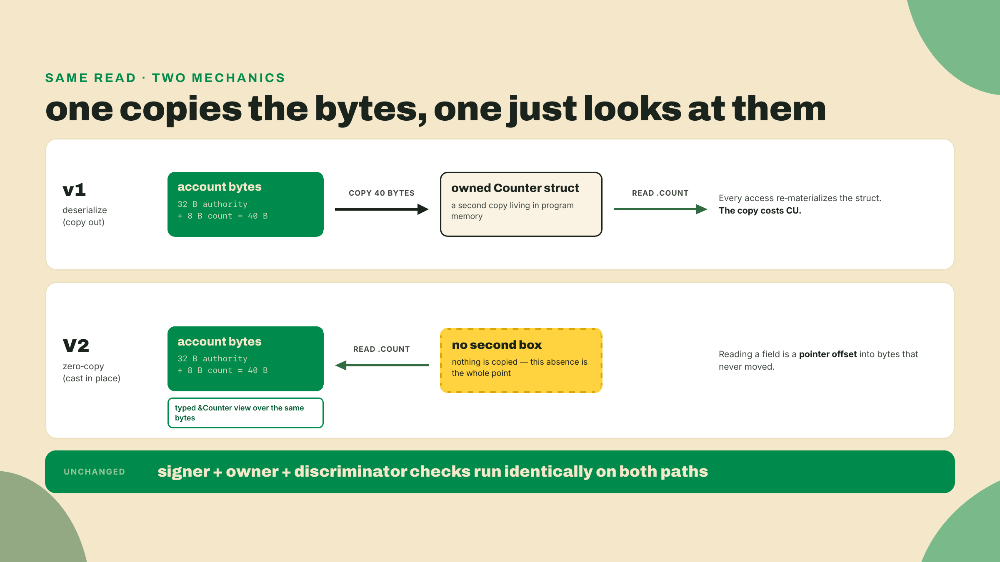
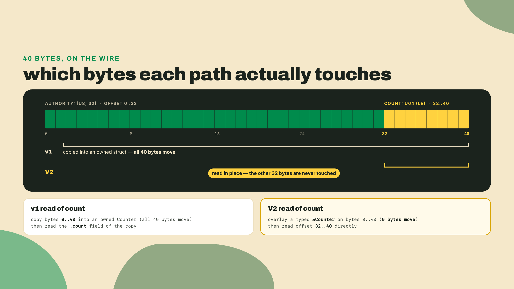
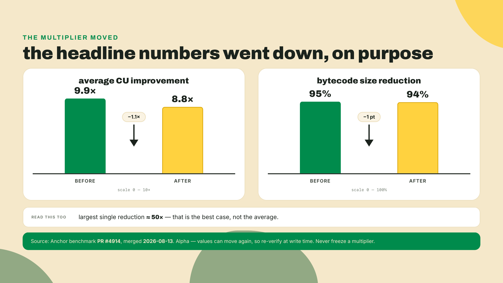
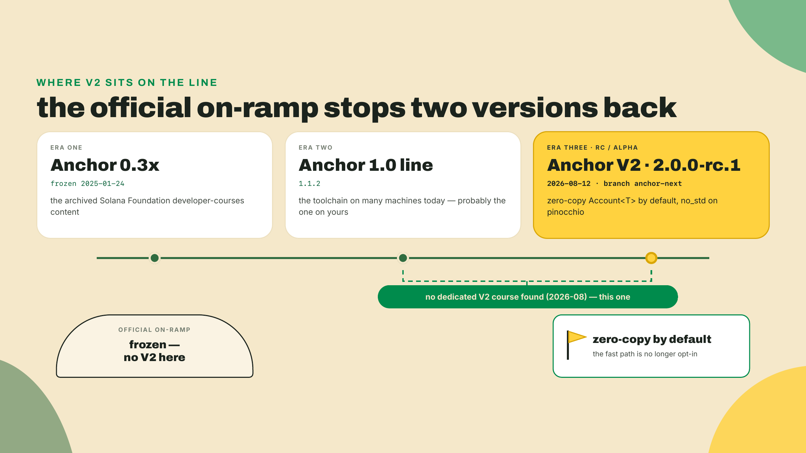
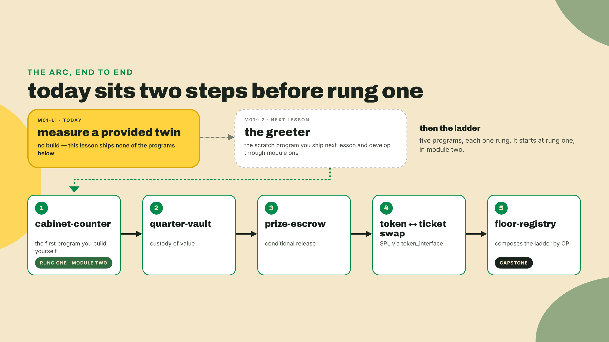
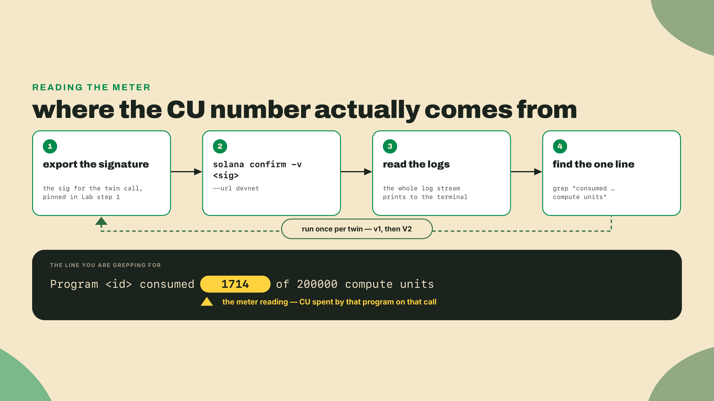
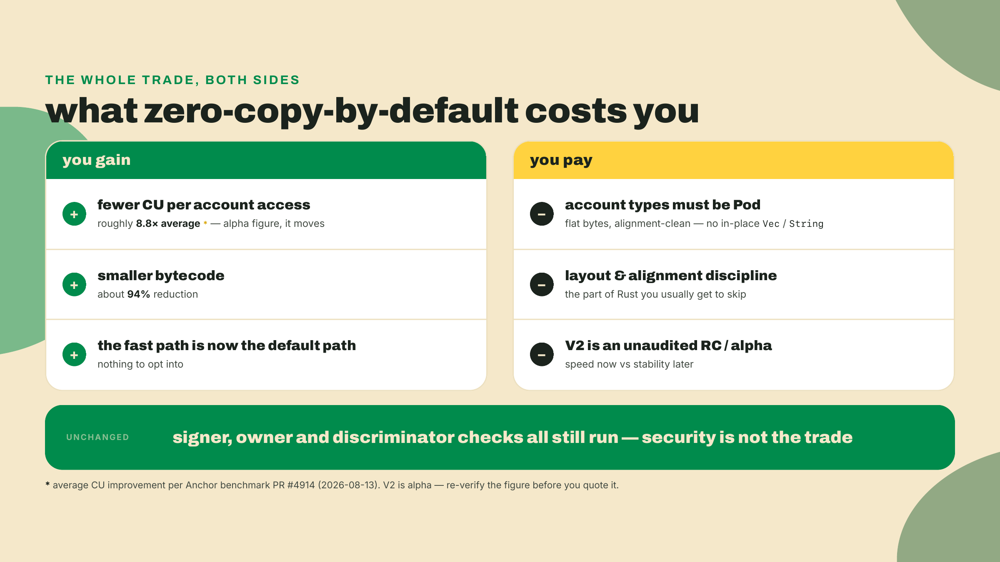

# Your Account<T> is the slow path

This is lesson one, so nothing is built yet. You arrive with the Solana mental model already in your head: accounts, PDAs, transactions, fees. Maybe some Anchor 0.x or 1.0 muscle memory too. Good. We are going to poke at exactly the piece of that muscle memory that Anchor V2 tears out and rebuilds.

Before I define a single thing, do this. Open a terminal with the `solana` CLI you already have and confirm a transaction I already landed on devnet for you:

```bash
# Landed and verified on devnet 2026-09-02; the Lab pins all four values below.
export V1_TWIN_SIG="2BYB5oU12EfJjPTuQjaZCcxwMjWxSBUQ7WjeucW6V35Ge1PRFUda39nV4dU8NnDvt8ZfbN8H4fpAEoYpsEYysR43"

solana confirm -v "$V1_TWIN_SIG" --url devnet | grep -i "compute units"
```

One grep line, one number, pulled out of a real log rather than handed to you in a table. The twin of that program gives you a second number, and the gap between the two is the whole reason this course exists.

## Summary

Two programs. Same call, same accounts, same signer and owner checks. One built on Anchor as you know it, one built on Anchor V2. You will measure the compute-unit cost of each straight from the transaction logs, predict which twin wins before you look, and then name the single design decision that produced the gap. That decision is the thesis of the entire course: `Account<T>`, the type you reach for in every Anchor program, is the slow path, and V2 makes it fast by default.

A few house rules, because they hold for all thirty lessons:

- **You code along in the Lab, not the overview.** The theory section is for understanding. The numbered Lab is where your hands move. Reading the overview and skipping the Lab is how people finish a course having learned nothing.
- **Every pin carries a freshness note.** V2 is a weeks-old release candidate. Every version number in this course is stamped with the date it was verified and re-checked when you reach it. Do not trust a bare version string from me or anyone.
- **Nothing you build here goes to mainnet.** Every deploy targets devnet, on purpose. The maintainers label V2 *Alpha*: "Not audited... APIs may break between commits," with v1 named the stable path. Unaudited and moving disqualifies anything holding real value. Learn it here, ship on v1, carry the model over when the stable line lands.
- **Every tool shows its install the first time you need it.** This opener needs no install at all: you use the `solana` CLI you already have. Lesson two installs the V2 toolchain, and it will fight you.

One more thing, said out loud because it matters: this lesson holds your hand through every keystroke. That is deliberate, and it fades. By lesson two you install the toolchain yourself and ship your own first deploy. Deeper in, I hand you a failing test and a one-line pointer and get out of your way. The training wheels come off on a schedule. Right now they are firmly on.

## Why V2 exists: the copy you never noticed

Here is the thing about `Account<T>` in the Anchor you know. Every time you touch `ctx.accounts.counter.count`, the framework has already done something on your behalf that you probably never pictured: it read the raw bytes out of the account, and it **deserialized** them into a fresh Rust struct sitting in your program's memory. Deserialize is a polite word for copy. It walked the account buffer field by field and built you a brand-new `Counter` you own.

That copy is invisible and it is not free. It costs **compute units**, Solana's meter for on-chain work. Every instruction runs under a CU budget, and when you blow past it the runtime kills your transaction. CU is the currency of this whole lesson, so keep the mental image simple: more copying, more CU, less headroom for the actual logic you wanted to run.

How much headroom? A single instruction is handed 200,000 CU by default, which is exactly the `of 200000` you will see on the right of that log line in a minute. You can raise the ceiling with a compute-budget instruction, up to a hard cap per transaction, but you never get it for free and you are always spending against a wall. So the copy is not a rounding error you can ignore until it hurts. It is a tax on every account access, deducted from the same budget your business logic needs. On a small counter it is a nuisance. On a program that reads a dozen fat accounts per call, it is the difference between fitting under the budget and getting reverted.

Let me make the copy concrete. Say your account is a 32-byte authority and an 8-byte counter, 40 bytes total. Here is what "deserialize" versus "read in place" actually looks like, in plain Rust you can run with nothing but `rustc`:

```rust
use std::mem::size_of;

#[repr(C)]
#[derive(Clone, Copy)]
struct Counter {
    authority: [u8; 32],
    count: u64,
}

fn main() {
    // A real account buffer: 32-byte authority, then a u64 counter = 40 bytes.
    let mut account = [0u8; 40];
    account[32..40].copy_from_slice(&7u64.to_le_bytes());

    // v1 shape: to read `count`, deserialize the WHOLE account into an owned
    // struct first. You copy all 40 bytes even though you wanted 8 of them.
    let owned = Counter {
        authority: {
            let mut a = [0u8; 32];
            a.copy_from_slice(&account[0..32]);
            a
        },
        count: u64::from_le_bytes([
            account[32], account[33], account[34], account[35],
            account[36], account[37], account[38], account[39],
        ]),
    };
    println!("v1 copied {} bytes to read count = {}", size_of::<Counter>(), owned.count);

    // v2 shape: read `count` straight out of the buffer, in place, no owned
    // struct, no 40-byte copy. This is the idea zero-copy generalizes.
    let count_in_place = u64::from_le_bytes([
        account[32], account[33], account[34], account[35],
        account[36], account[37], account[38], account[39],
    ]);
    println!("v2 read {} bytes in place: count = {}", size_of::<u64>(), count_in_place);
}
```

Run it and you see the framing in one line each: 40 bytes copied to get at the counter, versus reading the field where it already sits. That snippet re-decodes for clarity; V2's real trick is sharper. It hands you a typed `&Counter` view laid directly over the account bytes, so reading any field is a pointer offset, not a decode. **Zero-copy** means exactly that: zero copies of the account buffer. The bytes on the account and the struct in your code are the same bytes.



Now, the fair question a careful reader asks: could you not already do this in the Anchor you know? Yes, sort of. Old Anchor shipped a `zero_copy` opt-in for exactly the big-account cases where the copy hurt most. And that is precisely the lesson the V2 authors took from years of real programs: an opt-in that solves the common cost only when someone remembers to reach for it does not solve the common cost. Almost nobody reached for it. I will confess my own part in that. I have shipped 0.x programs and never once reached for `zero_copy`, because the plain `Account<T>` was right there and it worked. That is the whole point. The default is what ships in ten thousand programs.

Walk the naive fixes and watch them fail, because the reasoning is the interesting part. Fix one: document `zero_copy` better, write a nice guide. It changes nothing, because a default nobody has a reason to override stays the default. Fix two: add a lint that nags you toward `zero_copy` on big accounts. Closer, but it still leaves the fast path as the road less taken, and it does nothing for the thousand small accounts that copy needlessly all day. The only fix that actually moves the median program is to flip which path is default. So V2 inverts it. Zero-copy is not a special mode you request anymore. It is what `Account<T>` **is**, and the opt-in you now reach for, rarely, is the copy.

That inversion has a name and a paper trail. Anchor design issue #4390 is titled, flatly, "Zero-copy account deserialization by default," and inside it today's `Account<T>` is called the slow path and the number-one performance complaint from Anchor developers. The whole V2 thesis fits in one issue title. Someone looked at the framework's most-used type and said: the thing everyone touches is the thing that is slowest, so make the fast thing the thing everyone touches.

That phrase, the slow path, is the through-line of this whole course, so I am going to keep using it. Every rung you build from here is a small argument about whether you are on the slow path or the fast one, and V2's answer is baked into the defaults you inherit for free. Here is why you should care beyond a benchmark bragging right. Your programs get bigger. The counter becomes a vault, the vault composes with an escrow, the escrow calls a swap, and each of those calls reads accounts. On the slow path every one of those reads pays the copy tax, and the taxes stack until a call that used to fit under budget suddenly does not and starts reverting in production. On the fast path that whole class of "why did my CU creep up as I added features" problem is quieter by default. You are not buying a number. You are buying headroom you get to spend on the thing you actually wanted to build.



There is a second design idea underneath all this, and it is worth naming even though you will not touch it until later modules. V2 is a ground-up **no_std** rewrite built on pinocchio. `no_std` means it drops Rust's standard library, the big runtime layer most programs assume, and works against the bare metal of the Solana runtime instead. Less machinery between your struct and the account bytes is a chunk of where the savings come from. You do not need to internalize pinocchio today. You need to know the savings are structural, not a trick.

### The number that got more honest

You are going to want a headline multiplier. "V2 is N times cheaper." I am going to refuse to give you a frozen one, and here is the story that explains why.

The V2 benchmarks originally advertised big round claims. Then, on 2026-08-13, benchmark PR #4914 merged and revised the headline numbers **down**: the bytecode-size claim went from 95% to 94%, and the average CU improvement went from 9.9x to 8.8x. That is not a walk-back to be embarrassed about. That is a maintainer looking at their own marketing and making it match the measurements. The single largest reduction in that set is around 50x, but that is the best case, not the average, and quoting the best case as the typical case is exactly the kind of thing PR #4914 was fixing.

So the honest shape of it, as of that 2026-08-13 revision: roughly 8.8x average CU reduction, roughly 94% smaller bytecode. Both are alpha numbers on an alpha framework, and both can move again before you read this. Treat any single multiplier as a snapshot with a date on it, never a promise. This is footgun number one, and it is the reason your Lab does not hand you a number to memorize. It hands you a `solana confirm` command so you measure the gap on the actual programs, today, yourself.



### Where this sits, honestly

Two more grounded facts, so you know the ground you are standing on. First, the trade-off, because I will not sell you speed without the bill. Zero-copy-by-default buys the CU win, but it imposes a discipline Rust developers usually get to skip. Your account types have to be **Pod**, plain-old-data: fixed-layout, alignment-clean bytes with no pointers hiding inside. That rules out dropping a `Vec` or a `String` straight into an account and expecting it to just work, because those types are not flat bytes, they are a length and a pointer to somewhere else on the heap, and there is no heap inside an account.

Make that concrete. A leaderboard you would model in normal Rust as `Vec<Score>` does not go into a Pod account as written. You reshape it: a fixed-capacity array plus a length, sized up front. That is more forethought than `Vec` asks of you, and sometimes a fixed cap genuinely does not fit the problem. V2 keeps an escape hatch for exactly those cases, a borsh-backed account type for when Pod is not enough, and you meet it in the next module, in the lesson on when Pod runs out. For now, just log the shape of the bill: you trade a little runtime freedom for the CU win, paid in layout discipline up front. And V2 itself is an unaudited release candidate, alpha-grade. **RC** means release candidate, the maintainers think it is close to done. **Alpha** means treat it as early and moving regardless of the label. Speed now against stability later is a real choice, and this course keeps it honest at every rung rather than pretending the RC is production-hardened.

Second, why this course exists at all. As of August 2026 I went looking for a dedicated Anchor V2 course or long-form guide, and I did not find one. Not "there is none," I cannot prove a negative, but a real search turned up nothing. The official Solana Foundation developer-courses path is worse than empty: it now redirects into an archived content repository frozen on 2025-01-24, roughly 0.30-era Anchor, a tombstone with a nice headstone. So this is not competing with the on-ramp. It is replacing one that stopped breathing.



Before the Lab, look at the road. You are not going to build twins. You are going to build an arcade. The course domain is a retro barcade token economy called Quarters, and across the modules you author a real ladder of programs: a cabinet-counter first, then a quarter-vault that holds value, a prize-escrow, a token-to-ticket swap, and a capstone floor-registry that composes the whole ladder by CPI. Every rung is Rust against the V2 RC. The rungs that face the cluster ship to devnet — the scratch greeter, the token-to-ticket swap, the capstone floor — and the ones between prove themselves in-process, under the test harness you stand up in module two. This lesson is the one rung you do not build yourself, so that you feel the destination before you take the first step.



## Lab: measure the gap yourself

Hands on the keyboard now. This is the part you do not skip. No install: everything here runs on the `solana` CLI you already have, pointed at devnet. The two twin program IDs and their reference transaction signatures are pinned right here in step 1 — landed on devnet and verified 2026-09-02, in this course's own freshness discipline — and the six steps run exactly as written.

The move you are about to use is `solana confirm -v <SIGNATURE>`, which prints a transaction's full log messages. Buried in those logs is a line the runtime writes for every program it runs: `Program <id> consumed X of Y compute units`. That `X` is the meter reading. That is the whole measurement.



1. **Point at devnet and set the pins.** Export all four values. These are the twins I landed for you, verified 2026-09-02. If you want to sanity-check the programs are really deployed, `solana account "$V1_TWIN_ID" --url devnet` shows each as an executable account.

   ```bash
   export V1_TWIN_ID="8bhX52w9mGGaAFJwsoWLpv3nrZsXzc3ZfE2P622uGt3z"
   export V2_TWIN_ID="2fLbW1PG2CeyAgR5krLF9okkqCXRmqy1o3srBh4E26WT"
   export V1_TWIN_SIG="2BYB5oU12EfJjPTuQjaZCcxwMjWxSBUQ7WjeucW6V35Ge1PRFUda39nV4dU8NnDvt8ZfbN8H4fpAEoYpsEYysR43"
   export V2_TWIN_SIG="43beWNMwXpC24VqRf2uVspVDgBgKEMG75brR7LMeLeH3EcuLa9NVibJb9JAGqbe8pUDckPhtTqKRFhuzDtoZpCRs"
   ```

2. **Read the v1 twin's meter.** Confirm its reference transaction and pull the compute-units line:

   ```bash
   solana confirm -v "$V1_TWIN_SIG" --url devnet | grep -i "compute units"
   ```

   Mine printed two lines — the case-insensitive grep catches the CLI's own summary as well as the runtime's log line — and the reference signature replays the same reading for you:

   ```text
   Compute Units Consumed: 1714
     Program 8bhX52w9mGGaAFJwsoWLpv3nrZsXzc3ZfE2P622uGt3z consumed 1714 of 200000 compute units
   ```

   Whenever this pair gets re-landed — by the maintainers after a devnet reset, or by you later in the course under your own wallet — the exact number will differ; the shape will not. Write down the `consumed X` for the v1 twin — it is the same reading the opener had you take.

   If `grep` comes back empty, fix it before moving on. Three usual causes, in the order you should check them. You are pointed at the wrong cluster, so re-check `--url devnet`. Or the export got mangled in the paste, so the shell is holding a truncated signature. Or, if `solana confirm` reports the signature as not found rather than printing empty logs, the reference transaction has aged out of devnet's transaction history, which is pruned and does not keep old signatures forever. That third one is the freshness discipline of this course biting the course itself, and the recovery ships on this same page: the expected log output for both twins is printed in steps 2 and 4, so the measurement still lands — and a pruned signature is exactly the kind of stale pin this course trains you to flag, so report it and the maintainers re-land the pair and re-pin these four values. A blank result here is a setup problem, not a you problem.

3. **Stop and predict.** Before you run the v2 twin, commit to an answer out loud or on paper: which twin do you expect to consume fewer CU, and by roughly how much? You have the thesis and you have the honest-8.8x-average context. Make the call now. Predicting before you look is how you find out whether you actually understood the overview or just nodded at it.

4. **Read the v2 twin's meter.** Same call, twin program:

   ```bash
   solana confirm -v "$V2_TWIN_SIG" --url devnet | grep -i "compute units"
   ```

   For the record, the reference reading, in the same two-line shape:

   ```text
   Compute Units Consumed: 200
     Program 2fLbW1PG2CeyAgR5krLF9okkqCXRmqy1o3srBh4E26WT consumed 200 of 200000 compute units
   ```

   Write down the `consumed X` for the v2 twin.

5. **Compute the delta.** Subtract, and take the ratio. Two real numbers from two real logs on the same devnet, doing the same work with the same accounts. The v2 figure should be materially lower. Whether your measured ratio lands near the 8.8x-average neighborhood or somewhere else is the point of measuring instead of memorizing: you now hold a number with today's date on it, not a slogan.

   Do not be alarmed if your ratio is not 8.8x. It should not be, exactly, and that is healthy. The 8.8x is an average across a benchmark suite, and the win scales with how much copying the program was doing in the first place: a program that reads big accounts, or reads them many times per call, saves proportionally more than a program that barely touches one small account. The twins are deliberately simple, so your ratio reflects a simple call. A frozen multiplier would have hidden that. Your measurement shows it.

6. **Diagnose before you read on.** In one sentence, name the root cause of the gap. Do not peek at the next paragraph until you have written it.

Here is the answer, so you can check yours. The v2 twin spends fewer CU because v1's `Account<T>` deserializes, that is, copies, the account bytes into a struct on every access, while V2 casts the same bytes in place and reads them where they sit. That is footgun number two pre-empted: the win is not that V2 skipped any checks. Both twins ran the same signer, owner, and discriminator validation. A **discriminator** is the small tag Anchor writes at the front of an account so a load can reject the wrong account type on sight; you derive one by hand in m01-l4. Dropping those would be a security regression, not an optimization. The savings are the copies that are no longer happening, nothing more and nothing less.



## Challenge

The gate for this lesson is small and it is entirely in your own words. In three short pieces:

1. **Report the two CU figures** you read from the logs, one for the v1 twin and one for the v2 twin, and say which is lower.
2. **State the delta**, as a difference or a ratio, whichever you find clearer.
3. **Name the cause in one sentence**: the in-place cast versus the copy. Say it the way you would say it to a teammate who still writes v1 programs and thinks V2 is just marketing.

If your one sentence lands on "V2 casts the account bytes in place instead of copying them into a struct on every access," you have the thesis of this entire course in a form you can defend. If it lands on "V2 is faster because it skips checks," go back and re-read step six of the Lab, because that is the exact misread the design was careful not to make.

## What you actually did here

You did not read a claim about compute units. You took a reading, twice, on programs someone else already shipped, and you attributed the gap to a specific design decision instead of a vibe. That is the muscle the whole course trains: measure, then explain, then never freeze a moving number.

You felt the gap by running someone else's twins. Next lesson you stop borrowing and start shipping. You install the V2 toolchain, the one that genuinely fights you, an RC with sharp edges and a workaround or two, and you push your own first deploy to devnet: the R0 greeter. The R-numbers are how this course names the rungs of the Quarters ladder — R1 through R4, with the capstone floor-registry at the top — and R0 is the one below the bottom: the scratch program that proves your toolchain, which you then keep extending for the rest of module one. The first real rung, the cabinet-counter, comes the module after. The hand-holding thins out starting there. Bring the terminal.
