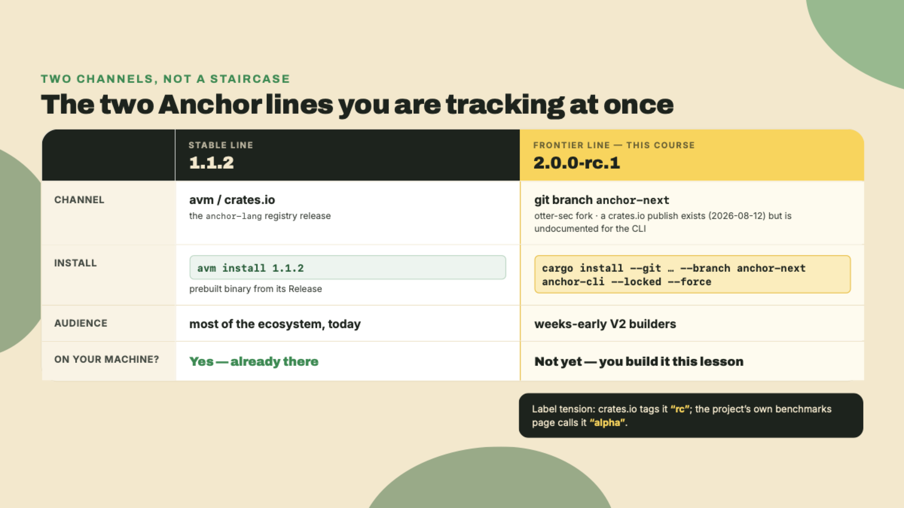
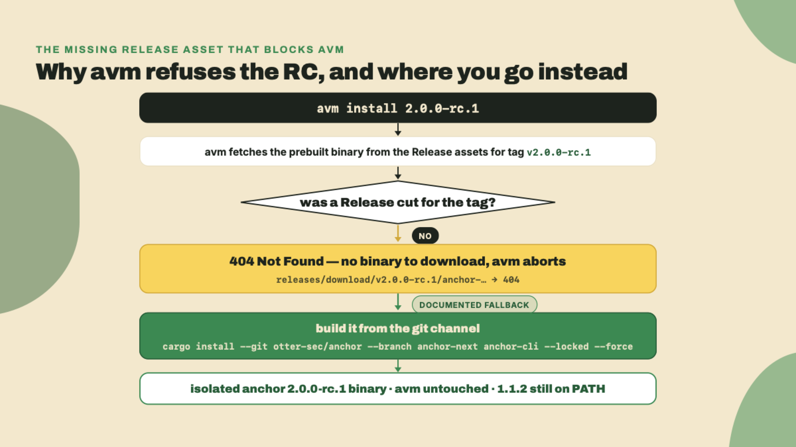
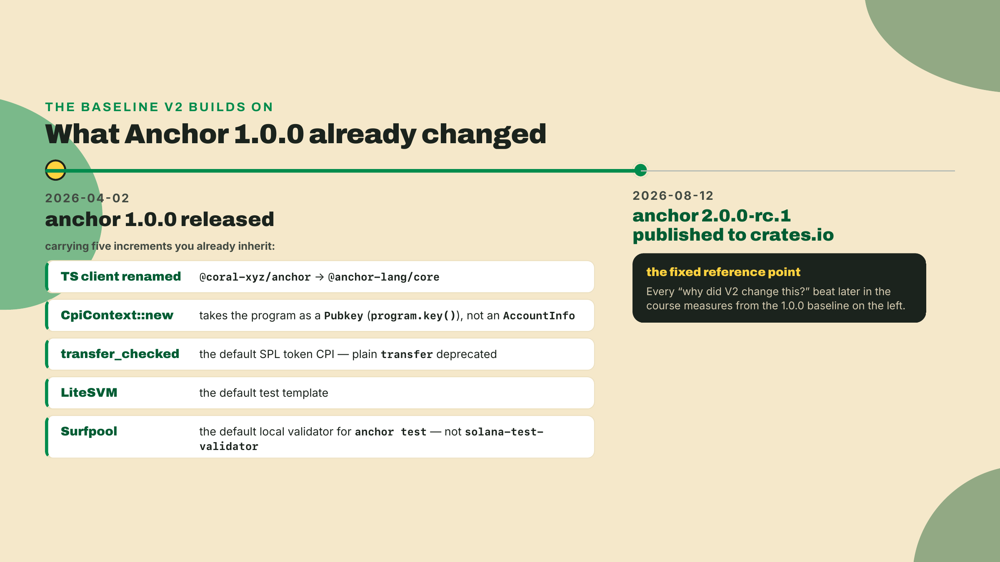
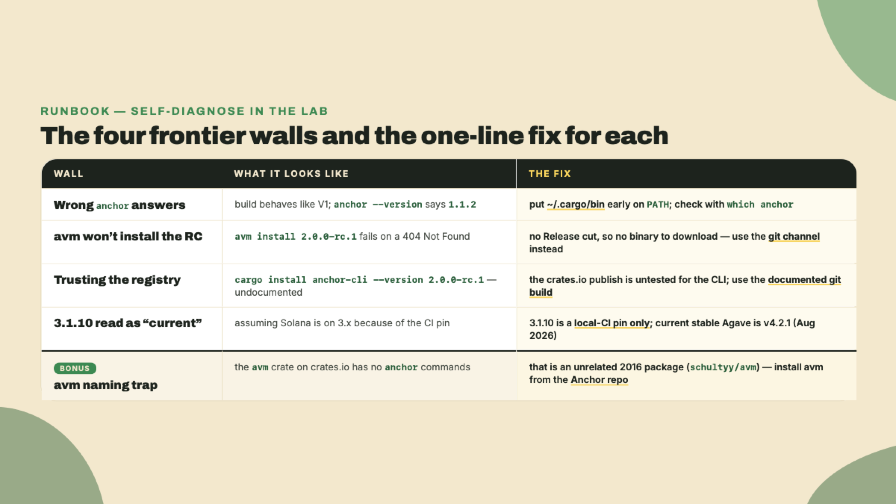
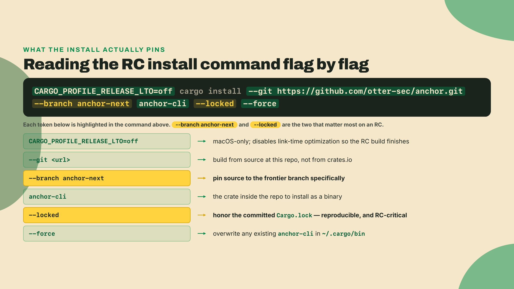
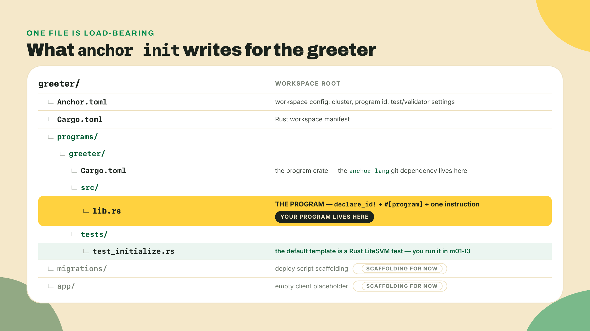
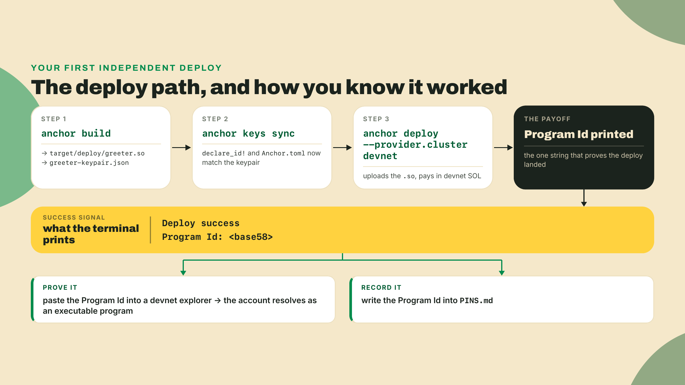
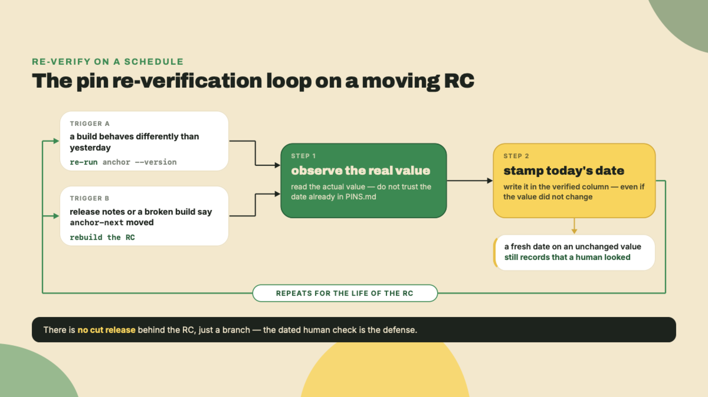

# Two parallel lines, and the install that fights you

Last lesson you confirmed two transactions someone else had already landed on devnet, one against the v1 twin and one against the v2 twin, and read the compute-unit delta straight out of the logs. You watched the gap. You built and deployed nothing of your own.

That changes today. But before you earn your first deploy, open a terminal and run this:

```bash
anchor --version
which anchor
```

Whatever prints back is almost certainly Anchor **1.1.2**, the current stable line, installed by `avm` and living on your PATH. That binary is the wrong tool for this course, and it will not tell you so. It will happily build a V2 lab against V1 semantics and hand you errors that make no sense. So the very first thing you learn about Anchor V2 is not a macro. It is that the version you already have is a trap, and the version you want fights back when you try to install it.

That is the lesson. Not a detour around the friction, the friction itself. Installing a release candidate off a branch, when the official installer has no binary to hand you, is what living on the frontier actually feels like. I want you to feel it once, on purpose, with me narrating every wall so you know it is the tool and not you.

## Summary

Anchor ships on two parallel lines right now: stable **1.1.2**, and **2.0.0-rc.1** riding an unmerged branch called `anchor-next`. This course lives on the second line. Today you install that RC into an isolated toolchain from its documented git channel, learn why `avm install 2.0.0-rc.1` cannot fetch it for you, record the whole thing in a central pins file with freshness dates, and then scaffold, build, and deploy the greeter (R0) to devnet as your first independent deploy. R0 is the scratch program: it sits below the first rung of the Quarters ladder, and you keep extending it for the rest of this module before the real rungs begin.

The autonomy fade here is deliberate and shallow. This is a toolchain lesson, so the install and the scaffold are **fully worked**: I show every command, you follow exactly, no solo yet. The one step that is yours alone is the final deploy. You run `anchor deploy` against devnet, you read back a program id, and you paste it into the pins file. That is the whole graduation.

One honest note up front. Every version number on this page is a snapshot with a date attached, and the RC will move. That is not sloppiness, it is the cost of being weeks early. The re-verify discipline you build here is the actual skill.

## Why the RC lives in its own house

Start from the thing you can already see. There are two Anchor lines, and they are not a beta-then-stable staircase. They are parallel.

The stable line is **1.1.2**. It is what `avm` installs, what crates.io serves as `anchor-lang`, and what most of the ecosystem builds against today. The frontier line is **2.0.0-rc.1**. It does not live on a published, blessed release the way 1.1.2 does. It lives on a development branch named `anchor-next`, and the only documented way to get a working CLI from it is to build that branch yourself with cargo.



Here is the why underneath the what, because it is worth deriving once. A release candidate on an unmerged branch is not a promise, it is a work in progress that happens to have a version number. If you let it overwrite the 1.1.2 on your PATH, you now have exactly one Anchor, and it is the churning one. The moment `anchor-next` breaks (and RCs break, that is their job), every project on your machine breaks with it. Isolation is not caution for its own sake. It is keeping a stable tool for your stable work and a frontier tool for your frontier work, side by side, each honest about what it is.

The good news is that "isolated" here does not mean a container or a virtual machine. It is simpler and more physical than that. The `cargo install` you are about to run drops a single binary at `~/.cargo/bin/anchor`. `avm`, meanwhile, manages your 1.1.2 through its own shim. Both want to answer when you type `anchor`, and which one wins is decided by nothing more exotic than PATH ordering. That is the whole isolation model: two binaries on disk, one name, and your shell picking the first match. It is also why the single most common confusion in this whole install is a build that behaves like V1 when you were sure you installed V2. The RC is there. Your PATH just handed you the other one. You will confirm which binary answers in the lab, and it is worth internalizing now that on the frontier, `which anchor` is a debugging command, not a formality.

### Why `avm install` cannot do this for you

Your instinct, correctly, is to reach for `avm`. The **Anchor Version Manager** is the tool that installs and switches between Anchor CLI versions, the way `rustup` does for Rust. You almost certainly used it to get your 1.1.2. If you have not installed it, the documented path is a cargo install from the Anchor repository:

```bash
# avm - the Anchor Version Manager. The install docs still publish the
# solana-foundation URL; it 301-redirects to otter-sec/anchor, which is where
# the repo actually lives now (custody went coral-xyz -> solana-foundation ->
# otter-sec during 2026). Either URL resolves. Re-check before you run this.
# (freshness 2026-08-22)
cargo install --git https://github.com/otter-sec/anchor avm --locked --force
avm install 1.1.2
avm use 1.1.2
```

So you try the obvious thing:

```bash
avm install 2.0.0-rc.1
```

And it refuses. Read the failure carefully, because the reason is more boring and more useful than it looks:

```
Failed to download the binary for version `2.0.0-rc.1` (status code: 404 Not Found)
```

That is not a policy rejection. `avm` parses `2.0.0-rc.1` perfectly well; it has a whole prerelease channel (`avm install latest-pre-release`, `avm list --pre-release`). The failure is mechanical. For any version at or above 0.31, `avm install` does not build anything: it fetches a **prebuilt binary** from the tag's GitHub Release assets, at `releases/download/v2.0.0-rc.1/anchor-2.0.0-rc.1-<your-target>`. Those assets only exist if someone cut a **Release object** for the tag, and nobody has. Go looking for `releases/tags/v2.0.0-rc.1` and you get a 404 too. No Release, no asset, no download.

Note what is *not* happening here, because it is a story you will hear told wrong. `avm` does not verify a cryptographic attestation for the release, and it never has: there is no attestation code in it. The wall is a missing file, not a failed signature check. Worth knowing precisely, because a security check you cannot satisfy and a build artifact nobody uploaded call for completely different responses.



For completeness: `avm install` does carry a `--from-source` flag, which skips the download and hands the job to `cargo install --git https://github.com/otter-sec/anchor --tag v2.0.0-rc.1` — the same build you are about to run by hand, with the channel chosen for you.

There is a naming trap worth flagging before it bites you. If you go searching crates.io for `avm` itself, you will find one, and it is **not this tool**. The `avm` crate on crates.io is an unrelated package from 2016 (schultyy/avm). Anchor's version manager is not distributed under that crate name, it installs from the Anchor repo. Install the wrong `avm` and you will spend an hour confused about why none of the commands exist.

### The install channel, and the publish that is a red herring

The documented channel is a git build. Here is the exact command, and you will run it for real in the lab:

```bash
cargo install --git https://github.com/otter-sec/anchor.git \
  --branch anchor-next anchor-cli --locked --force
```

Read it left to right, because every flag is load-bearing. `--git` plus the fork URL says "build from source at this repository, not from crates.io." `--branch anchor-next` pins the source to the frontier branch specifically. `anchor-cli` is the crate inside that repo you actually want as a binary. `--locked` says "respect the committed Cargo.lock, do not silently resolve newer dependencies," which on an RC is the difference between a reproducible build and a mystery. `--force` overwrites any `anchor-cli` cargo already put in `~/.cargo/bin`.

`--branch anchor-next` is the flag this lesson chooses deliberately and every later lesson overrides, so settle the delta here. A branch tip moves; a tag does not. As of 2026-08-22 the `anchor-next` tip sits ahead of `v2.0.0-rc.1` and has already moved the two crates you are about to pin by hand: the tip's `anchor-lang` asks for `wincode 0.6` and `solana-address 2.7.0`, while the tag — and the `2.0.0-rc.1` crate published from it — asks for `wincode 0.5` and the `solana-address 2.x` line below 2.7. Issue #4937's fault line runs exactly there, which is why the pins in the lab below carry a version *and* a date.

You stand on the branch today because the channel *is* this lesson's subject: it is what the V2 docs publish, and a moving channel is not something you can reason about from the outside. Every lesson after this one reprints the command with **`--tag v2.0.0-rc.1`** in place of `--branch anchor-next`, and m08-l2, whose whole job is a byte-reproducible build, tightens once more to `--rev e4878b6d`, the commit that tag points at. Three spellings, two distinct things: stand on the branch here to see the channel, on the tag everywhere after, so the pins you write keep meaning what they meant when you wrote them.

Now, a thing that will tempt you. The RC **was** published to crates.io on 2026-08-12 as `2.0.0-rc.1`. So you might reasonably think you can skip the git dance and just `cargo install anchor-cli --version 2.0.0-rc.1`. Do not trust that as your install path. The crates.io publish exists, but it is undocumented and untested for CLI installation. The sanctioned, reproducible channel for the **binary** is the git build. When the docs and the registry disagree about what is safe to install, the docs lag reality constantly, but a published-yet-untested crate is a worse bet than the documented build. Trusting the registry over the documented process is footgun number three, picking up the count from last lesson.

Read that as narrowly as it is written, because the lab below does the *opposite* for the library. `anchor-cli` is a binary the project builds and tests through its git channel; `anchor-lang` is a library the project publishes to crates.io on purpose, and its own scaffold tells you to depend on the published version as soon as one exists. One artifact per channel, each on the channel its maintainers actually support.

### The rc-versus-alpha tension, taught out loud

Here is a small thing that tells you a lot about where this release actually is. crates.io tags it `rc`. The project's own benchmarks page calls the same build `alpha`. Same code, two maturity labels, from the project itself.

I am not going to pick one for you and pretend the conflict does not exist. That would launder exactly the signal you need. An `rc` is supposed to mean "we think this is nearly shippable." An `alpha` means "this is early, expect breakage." When the project uses both words for one build, the honest read is: it is somewhere in between, and you should pin the exact version you installed and re-verify on a schedule rather than trust the label. The label conflict is not noise to resolve, it is the maturity signal, and the correct response to it is a pins file, which is why we are about to build one.

The RC's first real war story makes the point concrete. Issue #4937, filed 2026-08-16 and closed 2026-08-20, was a dependency mismatch: `anchor-lang` pinned `wincode` at 0.5 while `solana-address` 2.7.0 raised its own `wincode` requirement to 0.6, and the trait-bound mismatch broke `#[account(borsh)]`. (The version that moved is `wincode`'s; `solana-address` has only ever shipped a 2.x line, as the pin block at the end of this lesson spells out.) That is RC-era dependency-pinning discipline caught live. It is exactly why `--locked` is in your install command and exactly why every pin you write gets a date next to it.

### The dated 1.0 increments, so V2 has a "before"

One more piece of context, and this one is for every reader regardless of which Anchor you have touched before. To understand why V2 changed things, you need the map of what Anchor **1.0** already changed. These are the increments that landed with Anchor 1.0.0 on **2026-04-02**, and later lessons will call back to this list every time we say "V2 kept this" or "V2 went further."



Walk them once, slowly, because each one is a callback waiting to happen.

The **package rename** is the first. The TypeScript client that used to live at `@coral-xyz/anchor` is now published as `@anchor-lang/core`. That is not a cosmetic change. Every import line in every client you write against an Anchor program points at the new name, and the day you wire a client in m08, you will weigh `@anchor-lang/core` on purpose — and set it aside on purpose, because it still rides on web3.js v1, so you generate a kit-native client instead — while most tutorials online still show the old name.

Second, **`CpiContext` changed shape**. When one program calls another (a cross-program invocation), you build a `CpiContext`, and in 1.0 its constructor takes the target program as a `Pubkey` (via `program.key()`), not as an `AccountInfo` the way older Anchor did. This one has a trap baked in: the anchor-lang.com documentation page for CPIs still shows the old `AccountInfo` form. When m04 puts you into real cross-program calls, the compiler is the authority, not that page. Pass the wrong type and it will tell you `expected Pubkey, found AccountInfo`.

Third, **`transfer_checked` is the default token move**. The plain `transfer` that older SPL token code leaned on is deprecated, and the CPI you reach for now is `transfer_checked`, which additionally takes the mint and its decimals so the runtime can catch a decimals mismatch before it moves value. When m05 wires the token flows, you will type `transfer_checked` without thinking, and the reason it is not plain `transfer` starts on 2026-04-02.

Fourth, **LiteSVM is the default test template**. Anchor's generated tests no longer assume you spin up a full validator to run a single assertion. LiteSVM runs your program in-process, which is why the testing thread that opens in m02 is fast enough to run on every save.

Fifth, **Surfpool is the default local validator**. When you run `anchor test` or `anchor localnet`, the validator underneath is Surfpool, not the old `solana-test-validator`. You do not run a test today, but the scaffold already wrote one for you at `programs/greeter/tests/test_initialize.rs`, and you run it next lesson. Because the default template is LiteSVM, that test runs in-process and never needs Surfpool at all; the moment you reach for a template that does talk to a validator, this is the machine on the other end.

That rename has a striking afterlife. Roughly eight months after `@coral-xyz/anchor` became `@anchor-lang/core`, the old package still out-downloads the new one by about **40 to 1** (601,707 versus 14,745 in a single week). "Current" and "commonly used" have diverged hard. That gap is your reminder that the ecosystem moves slower than the version numbers, and that when you write a client later in this course, you pick the name that is correct, not the name that is popular.

None of these five 1.0 changes are things you touch in the lab below. Your scaffolded program opens one account and zeroes a counter, nothing more. But the point of narrating them now is that when m05 shows you `transfer_checked` and asks "why is the plain `transfer` gone," the answer starts here, on 2026-04-02, not in V2 at all.

### The four walls, and how not to walk into them

Before you open a terminal, hold the failure modes in view. The frontier has exactly four walls that catch almost everyone, and every one of them is a case of a tool being honest while you were expecting a different tool. None of them is your code.



Keep that table close during the lab. When something breaks, and on the frontier something usually does, match the symptom to a row before you assume you did anything wrong.

## Lab: install the RC, scaffold the greeter, deploy R0

You will build a central pins file, install the isolated RC, scaffold a greeter, build it, and deploy it to devnet. Steps 1 through 6 are fully worked. Step 7, the deploy, is yours.

**1. Confirm the two tools underneath Anchor.** Anchor sits on top of Rust and the Solana (Agave) CLI, so pin those first. If you do not have Rust, install it and pin the MSRV the RC requires, which is **1.89.0** (freshness 2026-08-22):

```bash
# Rust toolchain
curl --proto '=https' --tlsv1.2 -sSf https://sh.rustup.rs | sh
rustup toolchain install 1.89.0
rustc +1.89.0 --version   # expect: rustc 1.89.0
```

Install it, do not make it your machine's default. The same isolation argument from the theory section applies one layer down: pinning your global Rust to the RC's MSRV drags every other project you own onto that toolchain. You scope it instead. The scaffold you generate in step 4 writes a `rust-toolchain.toml` naming 1.89.0, which rustup honors automatically inside that directory; if you ever need to force it by hand, `rustup override set 1.89.0` from the workspace root does the same job for that directory only.

The **MSRV**, minimum supported Rust version, is the oldest Rust the crate promises to compile on. For an RC it is not a suggestion. Build with something older and you get errors that look like your code is wrong when the toolchain is.

Then the Solana CLI, which you install through Anza's installer:

```bash
# Agave (Solana) CLI
sh -c "$(curl -sSfL https://release.anza.xyz/stable/install)"
solana --version
```

A precise word about versions here, because it matters for the whole course. This course's continuous-integration image pins the Solana CLI at **3.1.10**. That number is a **local-CI toolchain pin**, the exact CLI the lab's verifier runs against, and nothing more. It is not a claim about what "current Solana" is. The current stable Agave line is **v4.2.1** as I write this (August 2026; re-verify, it moves). If you ever see 3.1.10 and think "so Solana is on 3.x," that is footgun number four. It is a pinned build for reproducible labs, full stop.

**2. Create the central pins file.** This is course infrastructure, not a throwaway. Make a file at the root of where you will keep this course's work, called `PINS.md`, and seed it:

```markdown
# Course toolchain pins (re-verify on a schedule; the RC moves)

| pin                         | value                        | channel                          | verified   |
|-----------------------------|------------------------------|----------------------------------|------------|
| anchor-cli (this lesson)    | 2.0.0-rc.1                   | git anchor-next (otter-sec fork) | 2026-08-22 |
| anchor-cli (rest of course) | 2.0.0-rc.1                   | git tag v2.0.0-rc.1 = e4878b6d   | 2026-08-22 |
| anchor-lang (library)       | 2.0.0-rc.1                   | crates.io (immutable)            | 2026-08-22 |
| wincode                     | 0.5 (features = ["derive"])  | crates.io                        | 2026-08-22 |
| solana-address              | =2.6.0                       | crates.io                        | 2026-08-22 |
| Rust (MSRV)                 | 1.89.0                       | rustup                           | 2026-08-22 |
| macOS build workaround      | CARGO_PROFILE_RELEASE_LTO=off| env var (release profile)        | 2026-08-22 |
| Solana CLI (CI pin)         | 3.1.10                       | agave-install (LOCAL-CI ONLY)    | 2026-08-22 |
| R0 greeter program id       | <fill after deploy>          | devnet                           | <fill>     |

Note: 3.1.10 is the local-CI pin, NOT "current Solana" (current stable Agave: v4.2.1, Aug 2026).
Note: the two anchor-cli rows report the SAME version string. Only the ref distinguishes them.
Note: solana-address is =2.6.0 for this greeter, a workspace of one. From m02-l1 the arcade
programs share a workspace, and every member of it reads ">=2.6.1, <2.7" instead. Same ceiling.
Label tension: crates.io says "rc", the benchmarks page says "alpha". Pinned + re-verified on purpose.
```

A **freshness note** is just that `verified` date column. A pin without a date is a lie waiting to happen, because the thing it points at can move the day after you wrote it. On the frontier the date is half the pin.

**3. Install the isolated RC.** This is the command from the theory section, run for real. On macOS, prefix it with the LTO workaround (I will explain the workaround right after):

```bash
# macOS: the RC build dies during link-time optimization without this
CARGO_PROFILE_RELEASE_LTO=off \
cargo install --git https://github.com/otter-sec/anchor.git \
  --branch anchor-next anchor-cli --locked --force
```

On Linux the `CARGO_PROFILE_RELEASE_LTO=off` prefix is harmless, so leaving it in keeps one command that works everywhere. On macOS it is mandatory: without it the RC build reliably dies during **LTO** (link-time optimization, the final cross-crate optimization pass), and the failure looks like a linker crash rather than an Anchor problem. Setting the cargo release-profile env var turns that pass off and the build completes. That single line belongs in your `PINS.md`, which is exactly why it is already in the table above. Note the name: it is `CARGO_PROFILE_RELEASE_LTO`, a standard cargo profile variable, not some `ANCHOR_LTO` invention.



When it finishes, verify you got the RC and not your old binary:

```bash
anchor --version   # expect: anchor-cli 2.0.0-rc.1
```

If that still prints 1.1.2, your shell resolved the old binary first. Check `which anchor` and make sure `~/.cargo/bin` is early on your PATH. This is the isolation working: cargo put the RC in `~/.cargo/bin/anchor`, and `avm`'s shim, if it wins the PATH race, will keep serving you 1.1.2. Whatever prints, record the real one in `PINS.md`.

**4. Scaffold the greeter.** Now make your first V2 program. `anchor init` generates a complete, buildable workspace:

```bash
anchor init greeter
cd greeter
```

That one command writes a whole project. Here is what lands, so the tree is not a black box:



Open `programs/greeter/src/lib.rs`. Here is what the V2 template actually writes, verbatim apart from your generated program id:

```rust
use anchor_lang::prelude::*;

declare_id!("Fg6PaFpoGXkYsidMpWTK6W2BeZ7FEfcYkg476zPFsLnS");

#[program]
pub mod greeter {
    use super::*;

    pub fn initialize(ctx: &mut Context<Initialize>) -> Result<()> {
        ctx.accounts.counter.count = 0;
        ctx.accounts.counter.authority = *ctx.accounts.payer.address();
        msg!("Counter initialized");
        Ok(())
    }
}

pub mod state {
    use super::*;

    #[account]
    pub struct Counter {
        pub count: u64,
        pub authority: Address,
    }
}

use state::Counter;

#[derive(Accounts)]
pub struct Initialize {
    #[account(mut)]
    pub payer: Signer,
    #[account(init, payer = payer)]
    pub counter: Account<Counter>,
    pub system_program: Program<System>,
}
```

Note that this is not the empty "hello world" the 0.x templates wrote. V2 scaffolds a small counter: one instruction that creates an account and zeroes it. `declare_id!` states the program's on-chain address. `#[program]` marks the module of instruction handlers. `initialize` opens a `Counter`, sets its count to zero, and stamps the payer as its authority. That is R0: not because it does anything interesting, but because it is the smallest complete thing your toolchain can build, deploy, and prove.

Four details in there will look wrong if you carry 0.x or 1.0 muscle memory, and every one is a real V2 change: the handler takes `&mut Context<T>` rather than a context by value; the accounts struct and its wrappers carry no `<'info>` lifetime; the address type is `Address`, not `Pubkey`, and you read it with `.address()`; and `init` names no `space`, because V2 sizes the account from its type. It is a black box on purpose today: next lesson you crack these macros open and read exactly what they generate.

Now fix how the program crate gets the RC. Open `programs/greeter/Cargo.toml`. The template does **not** pin a crates.io version; it points at the same branch you installed the CLI from, and leaves itself a note about it (freshness 2026-08-22):

```toml
[dependencies]
# Once anchor-lang is published to crates.io, swap to: anchor-lang = "2.0.0-rc.1"
anchor-lang = { git = "https://github.com/otter-sec/anchor.git", branch = "anchor-next" }
solana-program-log = { version = "1.1", features = ["macro"] }
```

That generated comment is a small time capsule worth reading, and it is also your instruction. The template says "once anchor-lang is published to crates.io," and it *has* been, on 2026-08-12. Do exactly what the comment says. Change that line to:

```toml
[dependencies]
anchor-lang = "2.0.0-rc.1"     # crates.io; a published version is immutable
solana-program-log = { version = "1.1", features = ["macro"] }
```

Two lines the template does **not** write yet, and without which nothing in this course compiles. Add them to the same `[dependencies]` table before your first build:

```toml
# #[program] expands absolute ::wincode:: paths, so the serializer must be a direct dep
wincode = { version = "0.5", features = ["derive"] }
solana-address = "=2.6.0"      # rc.1 pins wincode 0.5; solana-address 2.7.0 moved to 0.6
```

Those three rows are the pin set every program crate in this course carries, and they are the reason the `anchor-lang` row had to move off the branch. The greeter is a workspace of one, so the exact `=2.6.0` states the constraint fine here; from m02-l1 on, where the programs share a workspace and cargo has to resolve one `solana-address` for all of them, that row is written as the range `">=2.6.1, <2.7"` instead. Same ceiling, stated so more than one crate can agree with it — m02-l1 makes the argument. Try it the other way and cargo will not even get as far as compiling:

```
error: failed to select a version for `solana-address`.
    ... required by package `anchor-lang v2.0.0-rc.1 (https://github.com/otter-sec/anchor.git?branch=anchor-next#a6510ad7)`
versions that meet the requirements `^2.7.0` are: 2.7.0
all possible versions conflict with previously selected packages.
  previously selected package `solana-address v2.6.0`
```

That is #4937's bug class again, live on a fresh resolve as of this writing. The branch tip's `anchor-lang` now demands `solana-address 2.7.0`, which pulls `wincode 0.6`; the `2.0.0-rc.1` crate on the registry — built from the `v2.0.0-rc.1` tag — demands neither, so `wincode 0.5` and `solana-address 2.6.0` hold. Two wincode majors in one graph is a wall of `SchemaRead`/`SchemaWrite` "is not satisfied" errors when it resolves at all, and skipping the direct `wincode` dep means the `#[program]` expansion cannot even name its serializer (`error[E0433]: could not find wincode in the list of imported crates`).

So the split is deliberate, and it is worth stating as a rule rather than a workaround. **The CLI comes from git; the library comes from crates.io.** They are separate dependency graphs — the `anchor` binary in `~/.cargo/bin` was linked once and never participates in your program's resolve — so pinning them to different refs of the same release is not skew, it is precision. And the registry pin is the stronger of the two: crates.io forbids republishing a version, so `2.0.0-rc.1` is bytes that cannot change, while a branch is a name that points wherever someone last pushed. Note that `anchor --version` prints `2.0.0-rc.1` from the branch tip *and* from the tag, so the version string will never tell you which one you are on. The ref is the pin. The version is just a label.

Carry all three rows in every program crate you write in this course, and re-verify them the way you re-verify every RC pin: they stop being necessary the day the RC reconciles its own graph.

**5. Build it.** From the workspace root:

```bash
anchor build
```

On macOS, if the program build itself hits the same LTO wall, prefix it the same way: `CARGO_PROFILE_RELEASE_LTO=off anchor build`. A clean build writes the compiled program to `target/deploy/greeter.so` and a keypair to `target/deploy/greeter-keypair.json`. Two artifacts, two jobs. The `.so` is your program compiled to the on-chain bytecode format, the actual thing that will run inside the runtime; deploying is nothing more than uploading those bytes to an account and marking it executable. The keypair is your program's on-chain identity: its public key is the address other transactions will call, and its secret key is the authority that lets you upgrade the deployed bytes later. Guard the keypair. Lose it and you can never upgrade this program again, only deploy a fresh one at a new address.

The first `anchor build` on the RC is also the slowest thing you will do in this lesson, because cargo is compiling the entire Anchor framework from source, not pulling a prebuilt crate. That is the cost of the git channel. Subsequent builds are fast; only the first pays the full price.

**6. Point Anchor at devnet and fund a wallet.** Set the CLI to devnet, make sure you have a keypair, and airdrop yourself some devnet SOL to pay for the deploy:

```bash
solana config set --url devnet
solana address                 # your deployer wallet; solana-keygen new if you have none
solana airdrop 2               # devnet SOL; retry if the faucet is rate-limited
solana balance
```

Then sync the program id so `declare_id!` and `Anchor.toml` match the keypair you just built:

```bash
anchor keys sync
```

`anchor keys sync` reads `target/deploy/greeter-keypair.json`, derives its public key, and rewrites both the `declare_id!` in `lib.rs` and the address under `[programs.devnet]` in `Anchor.toml` to match. If you skip it, `declare_id!` still holds the template's placeholder id and the deploy will not line up. Run `anchor build` once more after syncing so the compiled binary carries the corrected id.

**7. Deploy R0 to devnet. This step is yours.** Everything above I walked you through. This one you run and read for yourself:

```bash
anchor deploy --provider.cluster devnet
```



Success looks like the words **Deploy success** and a line reading `Program Id:` followed by a base58 string. That string is your greeter's address on devnet. Copy it into the `R0 greeter program id` row of `PINS.md`, with today's date in the verified column. Then paste it into any devnet explorer and confirm the account resolves as an executable program. That resolution is your checkpoint. If the explorer shows an executable program at your id, R0 is live and your isolated RC toolchain works end to end.

If the deploy fails for lack of funds, the airdrop did not land or was too small, so re-run `solana airdrop 2` and check `solana balance` before trying again. If it fails on a mismatched program id, you skipped `anchor keys sync` or did not rebuild after it. Fix that one thing and re-deploy. Everything else that could go wrong at this point traces back to the PATH question from step 3: the wrong `anchor` is deploying.

## Challenge

Your gate is simple to state and it either passes or it does not.

**Completion, worked with me:** `PINS.md` exists and the four rows the install walk just verified — the anchor CLI, Rust, the macOS workaround, and the Solana CLI — are filled from the values you actually installed, not from this page. That means `anchor --version` really printed `2.0.0-rc.1`, your Rust really is 1.89.0, the macOS workaround line is recorded if you are on a Mac, and the Solana CLI row is labeled as a CI pin. The greeter scaffolds and `anchor build` produces a `greeter.so`.

**Solo, yours alone:** deploy R0 to devnet, paste its program id back into the last row of `PINS.md`, and put the freshness date on every pin.

**Acceptance:** `anchor --version` prints the RC, the greeter deploys, and the program id resolves as an executable program on a devnet explorer. Three facts, all checkable. If all three hold, you have earned your first V2 deploy on a toolchain almost nobody in the ecosystem is running yet.

One thing to sit with while it builds. You are now tracking two Anchor lines at once, 1.1.2 and `anchor-next`, and the frontier one will drift out from under your pins. That is not a bug in your setup. That is the deal. The convenience you gave up, one blessed `avm install` that just works, you traded for being weeks early on V2. The price of that trade is the `verified` column, and you pay it by re-running `anchor --version` and re-reading your pins on a schedule instead of trusting them forever.



Make that schedule real, because a vague intention to "check sometimes" is how a pins file rots. A workable cadence on an RC: re-run `anchor --version` at the start of any session where a build suddenly behaves differently than it did yesterday, and re-build the RC from `anchor-next` when the project's release notes or a broken build tell you the branch moved. When you re-verify, you do not trust the date already in the file. You re-observe the value and stamp today's date, even if the value did not change, because a fresh date on an unchanged value is itself information: it says someone looked. Issue #4937, the `wincode` versus `solana-address` mismatch that broke `#[account(borsh)]` and closed on 2026-08-20, is the whole argument in one bug. A dependency two levels down moved, and the only defense was `--locked` plus a human who re-checked. On stable you can be lazy about this. On the frontier the re-check is the job.

The deeper reason to pin exactly, rather than track a floating "latest," is a supply-chain one worth naming since a missing release artifact is what started this whole detour. Every time you install from a moving target you are trusting whatever that target happens to be at that instant. A pinned version with a recorded channel and a date is a claim you can audit later: this exact build, from this exact branch, verified on this day. A cut release would at least give you an immutable artifact to point at; a branch gives you nothing but the commit you happened to fetch. So you keep the human version of the same guarantee: write it down, date it, re-verify.

## Where this lands

You installed a release candidate the official installer refuses to touch, you wrote down every wall with a date next to it, and you deployed a program that opens an account on devnet. The install fought you and you won, which is the only way that fight ends once you know the RC lives in its own house.

The greeter is a black box right now. It builds and it deploys, and you have no idea, mechanically, how `declare_id!` and `#[program]` turned a dozen lines of Rust into an executable account on devnet. That is next. In the very next lesson you crack those two macros open and read what they generate, shape by shape, and the greeter stops being magic. You did the hard part today. The toolchain is real, the deploy is real, and the id in your pins file is yours.

See you next lesson, id in hand. Ship it first.
