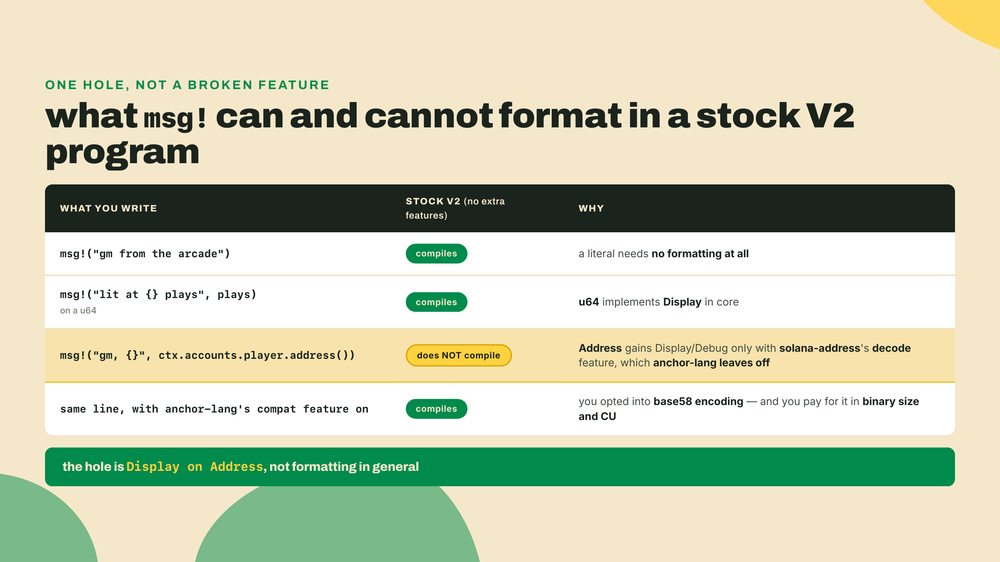
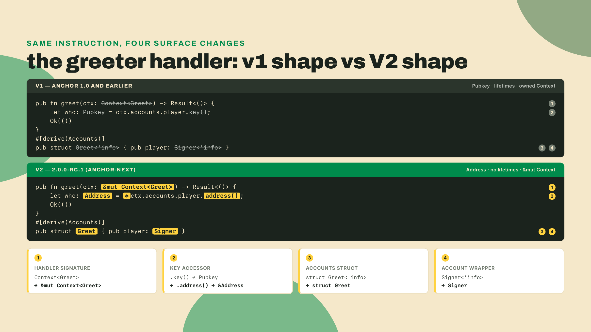
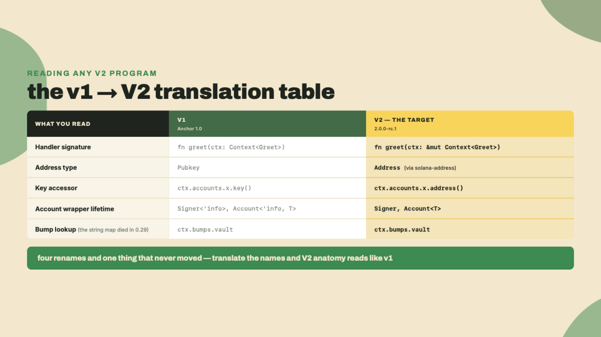
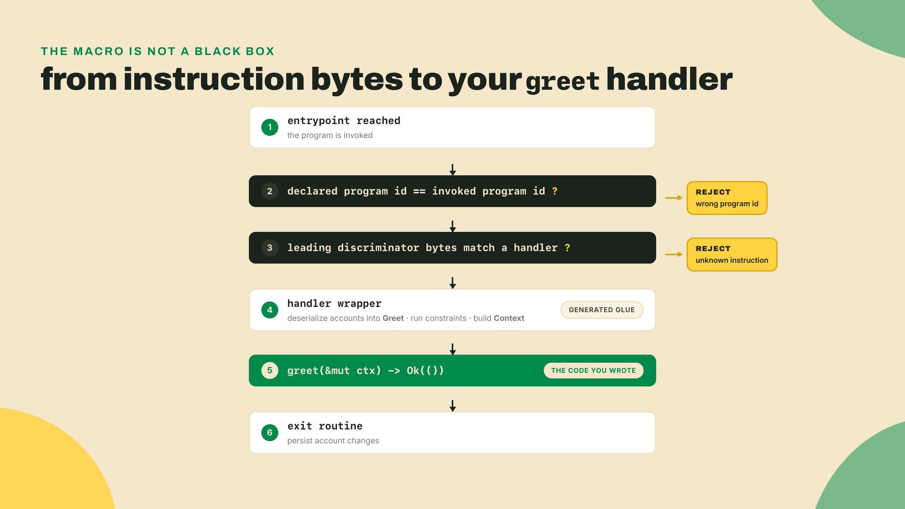
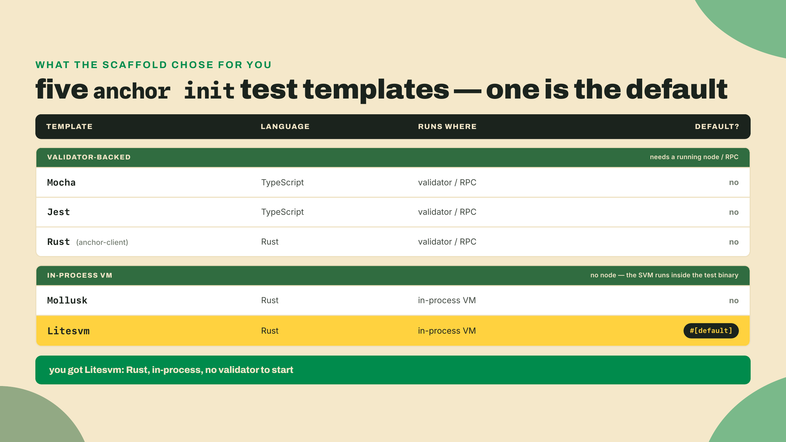
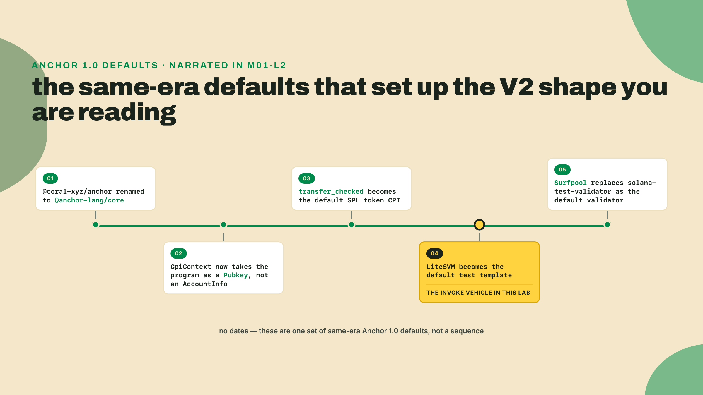
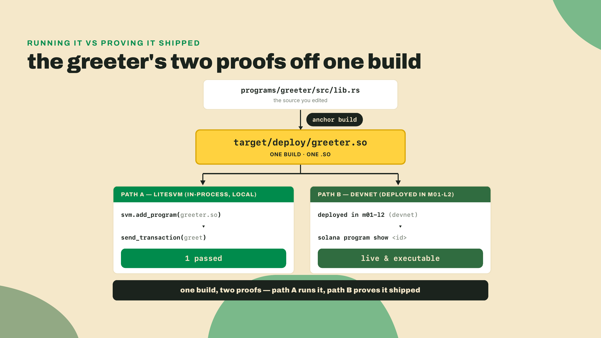

# Program anatomy: what declare_id! and #[program] expand to

Last lesson you fought the install, pinned the RC toolchain in your central pins file, and deployed R0 to devnet. It builds, it deploys, it opens an account. And it is still a black box: two macros, `declare_id!` and `#[program]`, a couple dozen lines of Rust, and no real idea what they turn into.

Let me fix that right now, before any theory. From your greeter workspace, run the test the scaffold already wrote:

```bash
anchor test
```

That command builds the program and runs the Rust test `anchor init` dropped beside it, the one that inits the scaffolded counter and asserts its fields. Watch the tail of the output for `test result: ok. 1 passed`. You just invoked your own handler in an in-process VM, and the reason that test is Rust and not TypeScript is the first thing worth understanding today. Hold that thought. We are going to read exactly what those two macros generate, then close the invoke loop by hand on a program you have stripped down to its bones.

## Summary

Here is the route. You already know the greeter compiles and deploys. What you do not yet know is the *shape* it compiles into: the handler signature, the account types, the address type, the dispatch path from raw bytes to your code. So we work backwards from the source you wrote to the surface the macros generate, in the order the framework actually uses it. Then you take that surface into a lab: rewrite the scaffolded LiteSVM test around your stripped-down handler, fill the one TODO in it so it hits `greet`, and confirm from the CLI that the copy you deployed last lesson is still live at the id in your pins file.

One caveat up front, and it is the honest one. This is Anchor V2, an RC. The vast majority of code, tutorials, and Stack Overflow answers you will hit still import `@coral-xyz/anchor` and the v1 shape. Everything below is the V2 expansion, not v1's. Where they differ, I will show both, because reading the ecosystem is going to cost you a translation tax and you may as well learn the exchange rate now.

## Reading the expansion

Start with the whole greeter on one screen. This is the source, nothing generated yet:

```rust
use anchor_lang::prelude::*;

declare_id!("3ynNB373Q3VAzKp7m4x238po36hjAGFXFJB4ybN2iTyg");

#[program]
pub mod greeter {
    use super::*;

    pub fn greet(_ctx: &mut Context<Greet>) -> Result<()> {
        msg!("gm, a player just tapped in");
        Ok(())
    }
}

#[derive(Accounts)]
pub struct Greet {
    pub player: Signer,
}
```

Your scaffold from last lesson is still the generated counter: an `initialize` handler that opens an `Account<Counter>`, plus its `state` module. Replace both the handler and the `Initialize` struct with this `greet` shape now, and delete the `state` module and its `use state::Counter;` line along with them. You want the smallest program that still proves something: one signer, one log line, no state. Swap the `declare_id!` for your own program id too; the one above is a stand-in.

The moment you delete `initialize`, the workspace stops compiling, and it is worth knowing why before you see the error. The scaffolded test at `programs/greeter/tests/test_initialize.rs` names `greeter::instruction::Initialize` and `greeter::accounts::Initialize`, both of which are generated *from* the handler and struct you just removed. Those symbols no longer exist, so the test fails to compile. That test is not something you trim; it is something you rewrite, and the Lab below rewrites it. Do the program edit and the test edit together, then rebuild, so the `.so` and the generated builders match what you read next.

One thing that log line does *not* do is print the player's address, and the reason is a genuine V2 constraint worth meeting early rather than as a mystery compile error. `Address` only implements `Display` and `Debug` when the `solana-address` crate's `decode` feature is on, because base58 encoding is exactly the kind of weight a `no_std` framework refuses to carry by default, and anchor-lang does not enable it. So `msg!("gm, {}", ctx.accounts.player.address())` does not compile in a stock V2 program. Be precise about what is missing there: `msg!` formats fine, and `msg!("lit at {} plays", plays)` on a `u64` is ordinary V2 code you will write next lesson. The hole is `Display` on `Address` specifically, so it is addresses you cannot interpolate, not values in general. If you genuinely need a base58 address in a log, you turn that feature on deliberately (anchor-lang's `compat` feature pulls it in, along with a `debug!` macro) and you pay for it in binary size and compute units. The default is silence about addresses, and the default is the point.



Last lesson named the surface changes in passing and promised you would crack them open here. This is that. Three of them are visible in the eleven lines above: `&mut Context`, not `Context`. `Signer`, not `Signer<'info>`. And no `Pubkey` anywhere. The fourth rode along on the scaffold line you are replacing, `ctx.accounts.counter.authority = *ctx.accounts.payer.address();`: `.address()`, not `.key()`. Naming them was last lesson's job. Deriving why each one is shaped that way, and what the macro generates around it, is this one's. Take them one at a time.

### declare_id! still just declares the address

`declare_id!` is the calm one. It takes the base58 program address and generates, roughly, this:

```rust
use anchor_lang::prelude::*;

// what declare_id! expands to, in spirit. The real macro decodes your base58
// string into these 32 bytes at compile time; zeros stand in for them here.
pub static ID: Address = Address::new_from_array([0u8; 32]);
pub fn id() -> Address { ID }
pub fn check_id(id: &Address) -> bool { id == &ID }
```

An `ID` constant, a checked `id()` accessor, and a `check_id` helper, so the rest of the program and the entrypoint can compare the address it was invoked as against the address it was compiled for. That job did not change between v1 and V2, and neither did the macro's name. The one thing that did change rides along quietly in the types above: the constant is an `Address`, not a `Pubkey`. Hold that, we come back to it two sections down.

The value in yours is whatever `anchor keys sync` wrote after your m01-l2 deploy; the one above is a stand-in. Swap in the program id from your pins file when you follow along, or the built `.so` will carry the wrong address and every invocation will bounce on the id check.

That id check is not decoration. It is the very first thing the generated entrypoint does on every call: `check_id` the declared program id against the input program id, reject if they differ. Keep that in mind, because it is step one of the dispatch path we get to shortly. It is also why a `.so` built with someone else's `declare_id!` is dead on arrival: the program refuses to run as an address it was not compiled for.

### #[program]: the handler, and the &mut that surprises you

`#[program]` marks the module that holds your instruction handlers. Every public function inside becomes an instruction the program can dispatch to. That much is v1 too. What V2 changed is the handler's signature, and it is the change you will trip on first.

In v1 a handler took its context *by value*: `pub fn greet(ctx: Context<Greet>)`. In V2 it takes a *mutable reference*: `pub fn greet(ctx: &mut Context<Greet>)`. Every handler, uniformly, even one like `greet` that only reads. The framework builds the `Context`, hands you a `&mut` to it, and reuses it through the exit routine that persists your account changes. You do not construct it and you do not return it. You borrow it, mutate through it, return `Ok(())`.



Why `&mut` at all, if `greet` never writes? The honest answer is that the by-value context was a small cost paid on every instruction: the framework moved a context into your function, you did your work, it moved account state back out. A reference removes the move and lets the same context carry through validation, your handler, and the exit routine as one borrowed thing. It is a small ergonomic and cost win, and it is of a piece with V2's whole thesis from lesson one: stop copying what you can borrow or cast in place. You do not have to love the syntax. You do have to recognize it, because a handler written `Context<T>` by value will not compile against the RC, and the error message points at the signature, not the cause.

### Pubkey is now Address, and .key() is now .address()

Look back at the scaffold line you just deleted: `ctx.accounts.counter.authority = *ctx.accounts.payer.address();`. In v1 that line would have read `ctx.accounts.payer.key()` and the type would have been `Pubkey`. In V2 both names changed. The type is `Address` (from the `solana-address` crate that pinocchio pulls in), and the accessor is `.address()`, which hands you a reference, hence the leading `*` when you want an owned copy to store.

This is a straight rename of two things you use constantly, which is exactly why it bites. Every account key you read, every address you compare, every pubkey you stored in a struct field: `Pubkey` becomes `Address`, `.key()` becomes `.address()`. There is no `.pubkey()` and no `.to_address()` in the wrapper surface; the accessor is `.address()`, full stop. Your fingers will type `.key()` out of pure muscle memory the first three times. Mine did. The compiler will stop you every time, so it is a cheap habit to break, but it is a habit.

The rename is not cosmetic churn, and it is worth understanding where it comes from so it stops feeling arbitrary. V2 is a no_std rewrite built on pinocchio, and pinocchio brings its own address type through the `solana-address` crate rather than the older `solana-program::Pubkey`. So when Anchor V2 sits on that foundation, the type it hands you up top is the one the foundation speaks: `Address`. The `.key()` to `.address()` change is the accessor following the type. Read it that way and the pattern generalizes: most of what looks new in a V2 signature is the pinocchio foundation surfacing through the framework instead of being papered over. That is the same thesis from lesson one, seen from the type side rather than the compute side.



### The <'info> lifetimes are gone from the wrappers

Now the accounts struct. In v1 every account wrapper carried an explicit lifetime and so did the struct: `pub struct Greet<'info>` with `pub player: Signer<'info>` inside. That `<'info>` threaded through everything and was the single most common thing beginners got wrong, because the borrow checker had opinions about it and the error messages were dense.

In V2 the wrapper surface carries no `<'info>` at all. Your struct is `pub struct Greet`, your field is `pub player: Signer`. The lifetime did not move onto the `#[program]` module or hide somewhere else. It is gone from the surface you write. The framework still tracks the lifetimes of the underlying account data internally, but the type-level bookkeeping you used to spell out by hand is now the macro's problem, not yours. For a reader coming from v1, this is the change that makes a V2 accounts struct look almost too clean, like something is missing. Nothing is missing. It was always the framework's job; V2 finally stopped making you type it.

There is a fifth rename you will not see in the greeter because it has no PDAs yet, but it belongs on the same list so it does not ambush you later: older Anchor read a stored bump with `ctx.bumps.get("vault")`, a map lookup returning an `Option`. The 0.2x-to-0.3x line already moved that to field access, and V2 keeps it: `ctx.bumps.vault`. It is the one row in that table that is not a V2 change, and it is there because a reader with old muscle memory will still reach for the map. It lands the moment you write your first seeded account, which is the PDAs module, two modules from here.

### How raw bytes actually reach greet

You have read the pieces. Now watch them run, because "the macro generates an entrypoint" is not an explanation until you can trace one invocation through it. When someone invokes your program, the generated code does four things in order.

First, the entrypoint checks that the declared program id (from `declare_id!`) matches the program id it was actually invoked as, and errors out if not. Second, it reads the front of the instruction data and matches it against each handler's discriminator, the small tag that says "this call is for `greet`, not some other handler." Third, the matched handler's wrapper deserializes the accounts named in the transaction into your `Greet` struct, running every constraint and check as it goes, and builds the `Context`. Fourth, it calls the code you actually wrote, `greet`, with a `&mut` to that context, and afterward runs an exit routine that persists any account changes back.



Everything but the handler body is generated: the id check, the dispatch, the deserialization, and the exit routine that persists changes. The only code you wrote is the body of `greet`. That is the whole trade of a framework: it writes the dispatch, the deserialization, the constraint checks, and the persistence, and in exchange it hides wiring you must still be able to reason about when something goes wrong. Reading the expansion is how you keep the reasoning even though the macro keeps the typing.

One detail in step two earns a name now and a full treatment next lesson. The tag the dispatcher matches on is a discriminator: the leading bytes of your instruction data that say which handler this call is for. Anchor computes it from the handler's name, so `greet` and `greet_high_score` get different discriminators and never collide, and the generated `greeter::instruction::Greet` builder you will use in the lab stamps the right one onto the bytes for you. That is all you need today: bytes come in, the dispatcher reads the discriminator, the matching wrapper runs. How the discriminator is actually derived, why an instruction handler hashes from a namespace that surprises people, and where custom error codes live, is the whole of the next lesson on `#[derive(Accounts)]`. One concept per lesson; this one is the `#[program]` side.

## Lab: close the invoke loop

Time to make the handler run. The vehicle is the LiteSVM Rust test that `anchor init` already scaffolded, rewritten around the program you just stripped down. The walkthrough here is fully worked; you follow along exactly. The two things you fill in yourself come in the Challenge right after.

One scoping note, so you are not waiting for a shoe that does not drop. Invoking your deployed program from the command line is not something the bare `solana` CLI can do: it cannot compute an Anchor discriminator or pack account metas, so there is no `solana` incantation that calls `greet`. Building a client that can is module 8's whole job, once you have a generated client to build it from. Today the invoke loop closes in LiteSVM, and the devnet deploy gets confirmed as deployed, not called.

Quick aside on why the default test is Rust and not TypeScript, since you have been staring at it. `anchor init` in V2 offers five test templates: Mocha, Jest, Rust, Mollusk, and Litesvm. Litesvm is the `#[default]`. So the scaffold hands you a Rust integration test that loads your compiled `.so` into an in-process VM and invokes it, with no TypeScript authored and no local validator started.



Why that default, and not a TypeScript one like every v1 tutorial you have read? Because in V2 the Rust surface is the primary client, and there is no official V2 TypeScript package to reach for yet. But the choice is also a bet, and Jacob Creech named it in his unification memo: "I expect Anchor V2 to unify tools around using Litesvm, using the solana-verify standard, potentially surfpool, Gill." The LiteSVM-default invoke loop you are about to run is that memo shipping. It rhymes with the dated Anchor 1.0 increments you narrated last lesson, the same wave of decisions that renamed the TypeScript package and swapped the default validator.



It is also why this whole module closes the deploy-and-invoke loop in Rust rather than handing you a TypeScript harness that does not exist yet.

**Step 1. Rewrite the scaffolded test.** The LiteSVM template writes its test beside the program crate, not at the workspace root: open `programs/greeter/tests/` and find `test_initialize.rs`. Rename the file to `test_greet.rs` and replace its body with the version below. This is a rewrite, not a trim: every `Initialize` symbol in the old file was generated from the handler you just deleted, so nothing in it survives the swap. It reads like this:

```rust
use {
    anchor_lang::{
        solana_program::instruction::Instruction, InstructionData, ToAccountMetas,
    },
    anchor_v2_testing::{Keypair, LiteSVM, Message, Signer, VersionedMessage, VersionedTransaction},
};

#[test]
fn test_greet() {
    let program_id = greeter::id();
    let payer = Keypair::new();
    let mut svm = anchor_v2_testing::svm();

    let bytes = include_bytes!("../../../target/deploy/greeter.so");
    svm.add_program(program_id, bytes).unwrap();
    svm.airdrop(&payer.pubkey(), 1_000_000_000).unwrap();

    let ix = Instruction::new_with_bytes(
        program_id,
        &greeter::instruction::Greet {}.data(),
        greeter::accounts::Greet {
            // TODO: name the accounts greet needs
        }
        .to_account_metas(None),
    );

    let blockhash = svm.latest_blockhash();
    let msg = Message::new_with_blockhash(&[ix], Some(&payer.pubkey()), &blockhash);
    let tx = VersionedTransaction::try_new(VersionedMessage::Legacy(msg), &[&payer]).unwrap();

    let res = svm.send_transaction(tx);
    assert!(res.is_ok(), "send_transaction failed: {:?}", res);
}
```

One thing in that import block deserves a note before you read the body, because it looks like it contradicts everything above. The test reaches for `anchor_lang::solana_program::instruction::Instruction` and calls `payer.pubkey()`, the exact two names this lesson just told you V2 replaced. Both are correct. The renames are a *program-side* change: inside your program, on the wrappers the derive generates, the type is `Address` and the accessor is `.address()`. Off-chain code, which is what a test is, still speaks the `solana-program` / `solana-sdk` types the runtime and the SDK have always used, so a `Keypair` still hands you a `Pubkey` from `.pubkey()`. You are looking at the seam between the two surfaces, and it stays there for the whole course: on-chain is `Address`, off-chain is `Pubkey`.

Now read what the test does against the dispatch flow you just traced. `anchor_v2_testing::svm()` stands up the in-process VM. `add_program` inserts your built `.so` at its program id. `greeter::instruction::Greet {}.data()` produces the instruction bytes, discriminator included, that step two matches on. `greeter::accounts::Greet { ... }.to_account_metas(None)` produces the account metas the wrapper deserializes in step three. These `instruction::` and `accounts::` modules are generated from your program by the same macros; the test does not read an IDL at runtime, it uses the typed builders directly.



**Step 2. Build and run, and expect red.** From the workspace root:

```bash
anchor test
```

`anchor test` builds the program, runs the LiteSVM test, and skips starting a validator because the in-process VM does not need one. It should **fail at compile time**, in the test file, with `error[E0063]: missing field 'player' in initializer of 'Greet'` — the `accounts::Greet` builder is still an empty TODO, and a Rust struct literal must name every field, so the compiler stops you before anything is ever sent. That red is the correct state to be in right now. It stays red until you fill the TODO in the Challenge, and turning it green is the graded half of this lesson. What you want to confirm at this step is narrower: the program crate itself compiles after the rewrite, and the one error left names the exact field you are about to fill — not a missing symbol from the V2 renames.

**Step 3. Confirm the deploy is still live.** The LiteSVM test is where `greet` runs. Separately, prove the copy you pushed in m01-l2 is still there and still yours. Point the CLI at your devnet program id from the pins file:

```bash
solana program show <YOUR_GREETER_PROGRAM_ID> --url devnet
```

That prints the program account, its data length, and its upgrade authority. Three facts worth reading rather than skimming: the account exists, it is executable, and the upgrade authority is your wallet, which is what lets you redeploy over it later. Note what this does *not* do. It does not call `greet`, and nothing in this lesson does, on devnet. Deployed and invocable are two different claims, and today you prove the first one from the CLI and the second one in LiteSVM.

## Challenge

Two tasks. The first is a completion, the second is on you. This is where the training wheels come off, one wheel at a time.

**Completion, the TODO.** In `test_greet.rs`, fill the `accounts::Greet { ... }` builder with the accounts `greet` actually needs. Look at your `#[derive(Accounts)] pub struct Greet` for the answer: it has one field, `player: Signer`, and the signer is the test's `payer`. One line. Then `anchor test` should turn the earlier failure into `1 passed`. If you are still red, re-read the field name in your accounts struct against the key you set in the builder; a mismatch there is the whole failure.

**Solo, the second variant.** Add a second greeting instruction to the `#[program]` module, reusing the same `Greet` accounts, and prove it dispatches. The shape to aim for:

```rust
pub fn greet_high_score(_ctx: &mut Context<Greet>) -> Result<()> {
    msg!("someone is going for the high score");
    Ok(())
}
```

Rebuild, then write a second `#[test]` beside the first that sends `greet_high_score` instead of `greet`. No hint past what Step 1 already showed you: the only two lines that change are the instruction builder and the test name, and working out which builder the new instruction shows up in is the point. If you can read the dispatch flow, you know why a second public function in the module becomes a second dispatchable instruction with its own discriminator.

Acceptance: `anchor test` reports `test result: ok. 2 passed`.

## Checkpoint

You are done when three things are true at once: the workspace compiles after the rewrite, `anchor test` reports both greeting tests passing, and `solana program show` resolves your greeter on devnet as an executable account you hold the upgrade authority for. If any one of those is missing, the loop is not closed and the next lesson will feel like it skipped a step.

Worth naming what changed in your head, not just your terminal. The greeter is barely a dozen lines, smaller than the scaffold you started the hour with, and it is no longer a black box. You can trace an invocation from raw bytes through the id check, the discriminator match, the wrapper, your handler, and the exit routine, and you can name every V2 rename you meet reading someone else's program: `&mut Context<T>`, `Address` and `.address()`, no `<'info>`, `ctx.bumps.name`. One last reminder, since it will save you an afternoon: the ecosystem is still overwhelmingly v1. When a tutorial written last year shows `Context<T>` by value and `.key()`, you now know it is not wrong, it is just the other line. Even careful sources lag here. Helius, a docs-quality standard-bearer, still ships its flagship Anchor intro with a 0.29.0 install in 2026. Reading old anatomy tutorials misleads precisely because the anatomy moved.

You can now read the `#[program]` side of any V2 program. But the accounts side, `#[derive(Accounts)]`, is where constraints, dispatch, discriminators, and errors actually live, and it hides the sharpest V2 detail of all: a compile-time mask enforced by a runtime check. That is next, and it is the sharpest thing in this module.
