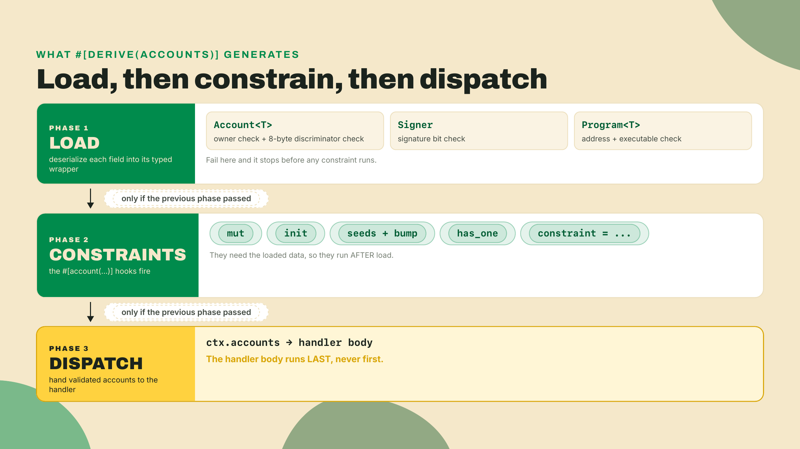
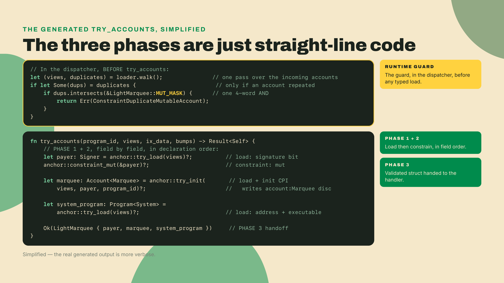
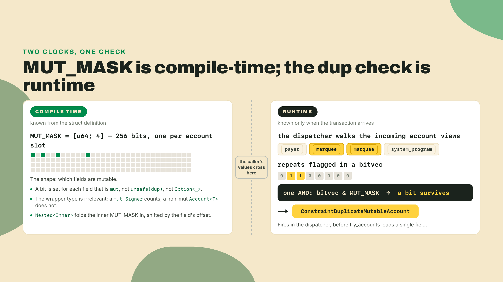
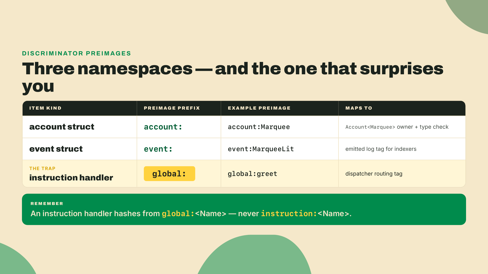
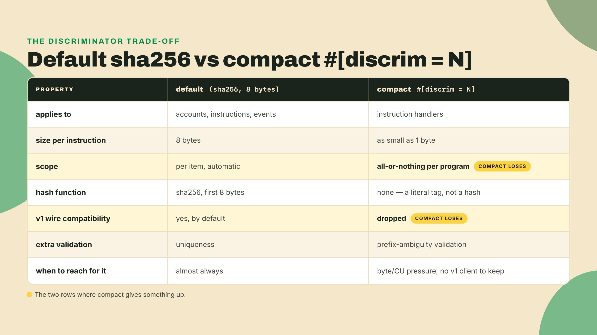
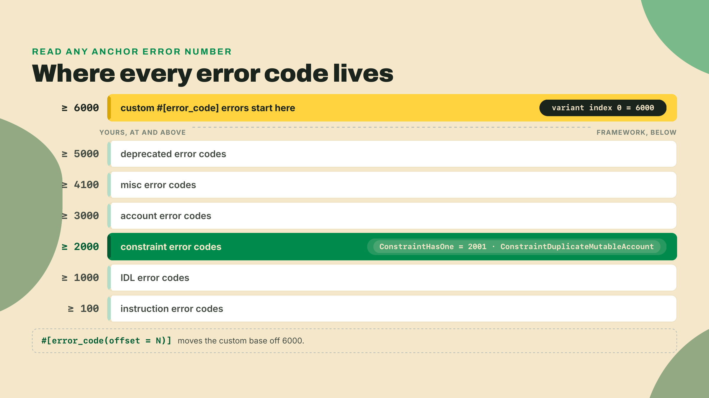
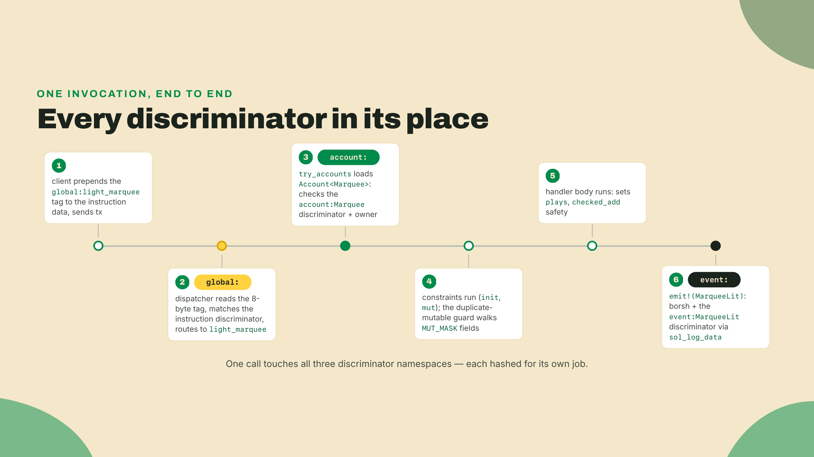
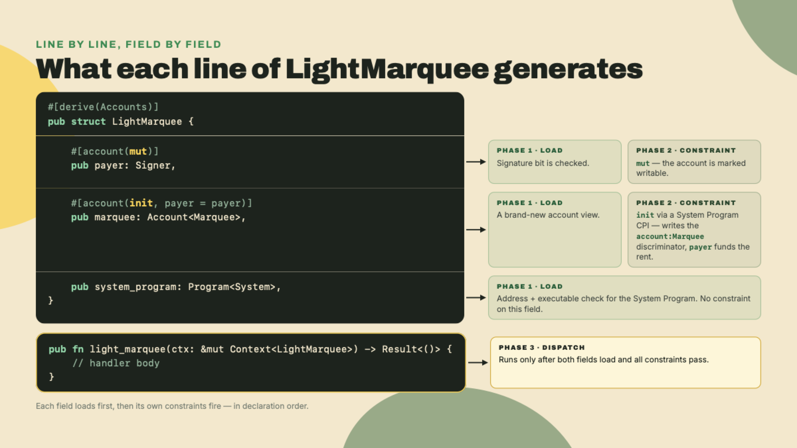
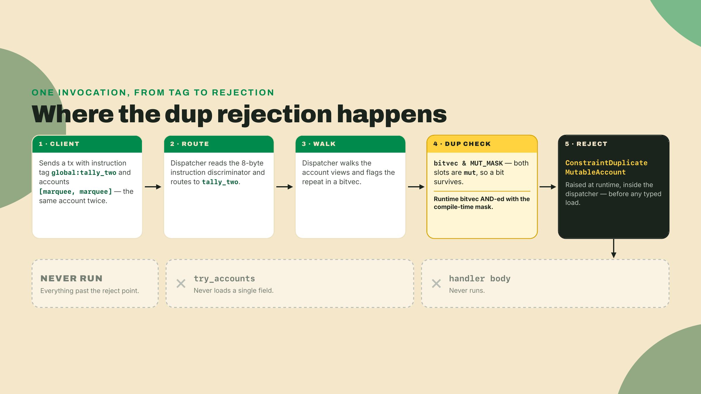

# Cracking open `#[derive(Accounts)]`: dispatch, discriminators, and errors

Last lesson you read what `declare_id!` and `#[program]` expand to, and you closed the deploy-and-invoke loop on the greeter. You saw the program side. But a V2 program has two halves, and the half that actually decides whether a malicious transaction gets to run is the one you have not opened yet: `#[derive(Accounts)]`.

That derive is quiet. You write four fields and a couple of `#[account(...)]` attributes, and it generates account loading, constraint checks, a duplicate-mutable guard, and the wiring the dispatcher calls before your handler ever executes. This lesson opens it up. By the end you will be able to trace the generated order, derive Anchor's discriminator preimages by hand, and read the framework-versus-custom error layout well enough to predict an on-wire error code before you run the program.

Here is the fastest way to make one of those ideas concrete right now. A discriminator is just the first 8 bytes of a sha256 hash over a namespaced string. Your greeter's `greet` instruction has one, and you can compute it in your terminal:

```bash
# shasum ships with macOS and most Linux distros. If yours lacks it,
# swap in the coreutils equivalent: sha256sum.
echo -n "global:greet" | shasum -a 256 | cut -c1-16
```

That hex string is the exact 8-byte tag a client puts in front of the instruction data so the dispatcher knows which handler to call.

## Summary

The route follows the framework's own order. First you read what the derive generates on the greeter you already have, load then constraints then dispatch. Then the duplicate-mutable guard, where a compile-time mask meets a runtime check and most people guess the wrong one. Then discriminators and the error-code layout, which are the two surfaces your clients actually see on the wire. The lab extends R0 with a second instruction and a small accounts struct, so every one of those surfaces becomes something you can watch fire.

The autonomy fade this lesson: the derive-expansion walkthrough is fully worked, done for you step by step. The discriminator-preimage challenge is a completion problem, a starter that fails until you fix it. The custom-error prediction and the duplicate-mutable reasoning are solo, no scaffolding.

## Cracking open the derive

### What the derive generates, in order

Start from the status quo and its limit. A raw Solana program receives one flat slice of accounts and one flat slice of bytes. Every safety property you care about, that this account is a signer, that this one is owned by your program, that this pubkey really is the PDA you think it is, has to be checked by hand, in the right order, with no help from the compiler. Miss one check and you have a vulnerability. The whole reason `#[derive(Accounts)]` exists is to move that checklist from something you remember to something the macro generates.

So the natural question is: what exactly does it generate, and in what order? Because the order is not cosmetic. It is the difference between a constraint that protects you and a constraint that runs too late to matter.

The derive generates three phases, and they always run in this sequence:

1. **Load.** Each field is deserialized from the raw account slice into its typed wrapper. `Account<Marquee>` checks the owner and the 8-byte discriminator and hands you a typed view. `Signer` checks the signature bit. `Program<System>` checks the address and the executable flag. If a field cannot load as its declared type, validation stops here, before any of your constraints run.
2. **Constraints.** The `#[account(...)]` attributes fire as hooks: `mut`, `init`, `seeds` and `bump`, `has_one` (which V2 deprecates in favor of `address = ...`; it still parses, with a warning), `constraint = ...`. These run after the load because most of them need the loaded data to check anything. A `has_one = authority` cannot compare against a field it has not deserialized yet.
3. **Dispatch.** Only once loading and constraints have passed does the dispatcher hand the validated `ctx.accounts` to your handler. Your handler body is the last thing to run, not the first.



That ordering is the mental model you carry for the rest of the course. Every constraint you ever write lives in phase two, which means it can assume the account already loaded as its type, and it runs before your logic, which means a failed constraint costs you the transaction fee but never lets a bad account reach your handler.

### The expansion, actually shown

Abstract phases are fine, but you do not have to take them on faith. The derive generates a real trait implementation, and you can see it. If you have `cargo-expand` installed, point it at your program and read the output:

```bash
cargo install cargo-expand
cargo expand --package greeter
```

Hold that command until Lab step 1. Right now your program has one accounts struct, `Greet`, with a single `Signer` in it, and expanding that shows you a two-line function that proves nothing. The struct worth reading the expansion of is `LightMarquee`, which you type in the Lab: three fields, a `mut` `payer: Signer`, an `init` `marquee: Account<Marquee>`, and a `system_program: Program<System>`. So read the sketch below now, type the struct in the Lab, then run `cargo expand` and match the real output against it.

For that struct, the derive generates an implementation of the `TryAccounts` trait whose `try_accounts` function is, in essence, the three phases written out as straight-line code. It runs in field-declaration order, which is why the order you write your fields in is the order they load:



That sketch is deliberately simplified, but the structure is faithful. Three things are worth pulling out of it, because they answer questions the abstract version leaves open.

First, field order is load order. The macro walks your struct top to bottom. If a later field's constraint depends on an earlier field, for example an `address = config.authority` that compares against a `config` account declared above it, the earlier field is guaranteed to have loaded first. Reorder your fields and you can genuinely change which check runs against loaded-versus-unloaded data. Declaration order is not decoration.

Second, the duplicate-mutable guard is not folded into any single field's load, and it does not even live in `try_accounts`. The dispatcher walks the incoming account views first, notes any address that appears twice in a bitvec, and AND-s that bitvec against the struct's compile-time `MUT_MASK` in a single four-word test before the typed loading starts. Composites are handled at compile time rather than at runtime: a `Nested<Inner>` field folds the inner struct's own `MUT_MASK`, shifted by that field's offset, into the outer mask. So one test covers the whole account tree, and it catches a collision even when the same account is passed to a direct field and to a field buried inside a composite.

Third, the handler never appears in `try_accounts` at all. Loading and validation are one generated function; your handler is a separate function the dispatcher calls only after `try_accounts` returns `Ok`. That separation is the structural reason a constraint can never run "too late": it physically cannot, because it lives in a function that finishes before your code starts.

### The duplicate-mutable guard: compile-time mask, runtime check

Now for the sharpest detail in V2, and the one worth slowing down for, because it lives exactly on the seam between what the compiler knows and what only the runtime can know.

Consider an instruction that takes two accounts of the same type, both mutable:

```rust
#[derive(Accounts)]
pub struct TallyTwo {
    #[account(mut)]
    pub first: Account<Marquee>,
    #[account(mut)]
    pub second: Account<Marquee>,
}
```

A caller controls which pubkeys land in `first` and `second`. Nothing stops them from passing the *same* account for both. And that is genuinely dangerous. Both `first` and `second` would deserialize the same underlying bytes into two separate mutable copies. Your handler mutates `first`, then mutates `second`, and on exit Anchor serializes both back. The second write clobbers the first. You added one to a counter and it went up by one instead of two, silently, with no error. This is a classic account-aliasing bug, and V2 disallows it by default.

Here is the question that matters: *where* is that collision caught? The naive answer is "at compile time, the compiler knows there are two mutable fields." That is half right and it is the half that trips people up. The compiler does know the *shape*: which fields are mutable and serialize on exit. The derive encodes that as a 256-bit associated const, `MUT_MASK`, one bit per account slot, set for every mutable serializing field. That mask is fixed at compile time and costs nothing at runtime.

But the compiler cannot know the *values*. Whether `first` and `second` hold the same address depends entirely on what the caller sends, and that is only knowable when the transaction arrives. So the runtime does the other half: the dispatcher walks the incoming account views, sets a bit for every slot whose address it has already seen, and AND-s that bitvec against `MUT_MASK`. If any bit survives, two mutable slots carry the same address, and the call returns `ConstraintDuplicateMutableAccount` from the dispatcher, at runtime, before your handler runs.



There is a second, separate thing people confuse with this, and pinning it down is the whole point of the checkpoint later. If you actually *want* to pass the same mutable account twice, because your handler is written to never hold conflicting mutable references, you opt out per field:

```rust
#[derive(Accounts)]
pub struct TouchTwice {
    #[account(mut, unsafe(dup))]
    pub first: Account<Marquee>,
    #[account(mut, unsafe(dup))]
    pub second: Account<Marquee>,
}
```

The opt-out is spelled `unsafe(dup)`. The `unsafe` is deliberate: aliasing mutable account data is a footgun, and V2 makes you name it. Now the distinction. Writing plain `dup` — the v1 spelling of this attribute — without `unsafe` is a *compile error*, and the compiler tells you to write `unsafe(dup)` instead. That is a compile-time event about the *attribute you typed*. It has nothing to do with whether two accounts actually collide. The collision itself, the same pubkey arriving in both slots, is caught at *runtime*, in the dispatcher, against that walked bitvec. Two different events, two different times. Do not let the shared word "dup" blur them.

One note on scope, because it saves you a confused afternoon. The guard keys off the `mut` attribute, not off the wrapper type. Any field marked `mut` sets its bit, `Account<T>` and `Signer` alike; a field without `mut` sets none, so passing the same read-only account into two slots is always fine. Two carve-outs shrink the mask: a field with `unsafe(dup)` is excluded by design, and an `Option<_>` field is excluded from the compile-time mask (a `None` slot is encoded as the program id, which would otherwise read as a collision) and gets a narrower per-field check instead. This is why our `TallyTwo` marks both fields `mut`: without that attribute there would be nothing to collide.

Only, none of this is you taking Anchor's word for it. The dispatcher you are reading is itself fuzzed. The V2 changelog credits fuzzing with finding 4 correctness bugs in the framework, tracked in issue #4431, and Anchor's test suite carries Miri witnesses and Kani configurations. The generated glue that walks your accounts is undefined-behavior-checked the same way you would check a program you were about to put money behind. That is a reasonable thing to trust, precisely because it is verified rather than asserted.

### Discriminators get their named home

You already computed one at the top of the lesson. Now let us give the idea its full shape, because there are three namespaces and exactly one of them surprises people.

A discriminator is an 8-byte tag Anchor prepends so that the runtime can tell one thing from another without parsing the whole payload. Accounts get one so a deserialize can reject the wrong account type on sight. Instructions get one so the dispatcher can route to the right handler. Events get one so an indexer can tell which event it decoded. By default every one of them is the first 8 bytes of `sha256` over a *namespaced preimage string*, and the namespace is the part that carries the trap:

- an account struct hashes from `account:<Name>`, for example `sha256("account:Marquee")[..8]`
- an event struct hashes from `event:<Name>`, for example `sha256("event:MarqueeLit")[..8]`
- an instruction handler hashes from `global:<Name>`, for example `sha256("global:greet")[..8]`



Why `global:`? History. Early Anchor namespaced instruction handlers under a `global` state namespace, a design that mostly went away but left the preimage convention behind. There is no `instruction:` namespace and there never was. If you ever hand-build an instruction tag from `instruction:<Name>`, your bytes will not match the ones the program generated, and the dispatcher will reject the call as an unknown instruction.

A few more facts nail down the surface, and they matter the moment you care about wire compatibility. The V2 discriminators are unchanged by default: same 8-byte sha256 scheme, so a V2 program's wire format stays compatible with a v1 client that already knows how to build these tags. V2 does tighten one rule: an all-zero account discriminator is rejected, because all-zeros is what an uninitialized account reads as, so allowing it would let an empty account masquerade as a real one. That rejection is specified for account discriminators specifically, the confusion it prevents only exists for accounts.

And there is an opt-in compaction. If 8 bytes on the front of every instruction feels heavy, V2 lets you annotate a handler with `#[discrim = N]`, which swaps its 8-byte sha256 prefix for a small integer tag. It is honest engineering, but read the trade before you reach for it, because it is not the per-item override you might expect.



Notice the shape of that trade. The default costs you 8 bytes on the wire plus the compute units to compare them, and buys you legibility and v1 compatibility for free. The compact option saves the bytes and the compute, but it is all-or-nothing per program, it has to be validated for prefix ambiguity so two tags cannot alias, and it drops the default v1 compatibility. Compatibility and legibility versus raw efficiency. That is the whole decision, and for most programs the default wins, which is exactly why the compact path stays an edge.

Jacob Creech, describing the discriminator redesign, put the usage reality plainly: custom discriminators are "being considered ... almost have 0 usage today." That is the context for why `#[discrim = N]` is an opt-in edge and not the default. The default is default because that is what essentially everyone actually ships.

### The error layout: framework in the 2000s, custom at 6000

The last piece of the surface is what a client sees when something fails. Anchor's error codes are partitioned into ranges, and the partition is not arbitrary. It exists so that a framework error and your error can never collide on the wire.

Every constraint the framework enforces returns a code in its own band. The one you will meet constantly is the constraint band, which starts at 2000. `ConstraintHasOne`, the error a violated `has_one` throws, is 2001. `ConstraintDuplicateMutableAccount`, the guard we just traced, lives in that same framework territory. Your own errors, the ones you declare with `#[error_code]`, start at 6000 and count up from there, zero-indexed by variant.



This gives you a genuinely useful predictive tool. Take a program whose custom `#[error_code]` enum has, say, three variants, and no `offset` override. The first variant is 6000, the second 6001, the third 6002. If you know a variant's zero-based position you know its on-wire number without running anything. The classic mistake is to see the 2000s in a decoded error and assume that is where custom errors live. It is not. The 2000s are the framework's constraint band. Your errors start at 6000. When you want to move that base, for example to leave room or to match an external convention, `#[error_code(offset = N)]` shifts it.

That is the whole error surface: the framework owns everything below 6000, you own 6000 and up, and the boundary is fixed so the two can never be confused.

### Where events fit, and where the dispatcher starts

The third namespace, `event:`, deserves its own beat, because the greeter you extend in the Lab below emits one and you should know exactly what happens on the wire when it does. The `light_marquee` handler you are about to write calls `emit!(MarqueeLit { plays })`. That macro serializes the event struct with **wincode**, V2's serializer (you met the name in m01-l2 as the crate at the center of the #4937 dependency break; this is what it actually does), running it under a wire config whose output is byte-identical to borsh. Then it prepends the 8-byte `event:MarqueeLit` discriminator and writes the whole thing out through the `sol_log_data` syscall. It is not stored in an account and it is not returned to the caller. It lands in the transaction's log data, where an off-chain indexer subscribed to your program can read it, match the leading 8 bytes against `sha256("event:MarqueeLit")[..8]`, and decode the rest as a `MarqueeLit`. The discriminator is what lets the indexer tell your `MarqueeLit` apart from every other event any program emitted in the same block.

There is a faster event variant, `#[event(bytemuck)]`, that skips the serializer entirely and lays the fields out as a fixed Pod struct so decoding is a cast instead of a parse. We leave it for next module on purpose, because it only makes sense once you have met Pod and zero-copy layout. Reach for it now and you would be wiring a tool whose foundation you have not poured. For this lesson, the plain `emit!` is exactly right: it shows the `event:` namespace doing its job without dragging in machinery you have not been taught.

Which closes the loop back to where the whole chapter started, the dispatcher. Trace one full call and every namespace shows up in its place. A client builds a transaction, prepends the 8-byte `global:light_marquee` tag to the instruction data, and sends it. The dispatcher reads those first 8 bytes, matches them against each handler's instruction discriminator, and routes to `light_marquee`. Then `try_accounts` runs: it loads each `Account<Marquee>` by checking its `account:` discriminator, runs the constraints, walks the duplicate-mutable guard. Only then does your handler body run, and when it calls `emit!`, out goes the `event:` discriminator on the log. Three namespaces, one invocation, each doing the one job it was hashed for.



## Lab: extend R0 and watch the surface

You are still working on R0, the greeter. This lab extends it with a second and third instruction and a small account struct, purely so you can observe the generated load, constraints, dispatch, the discriminator namespaces, and the error layout on code you wrote. Real, tested state arrives next module. For now, the point is to see the surface.

First, the toolchain. You already built the V2 RC in m01-l2, and you learned there why `avm install` cannot fetch it for you: no GitHub Release was cut for the v2 tag, so the prebuilt binary it downloads 404s. The RC lives in the git channel (`cargo install --git ... --tag v2.0.0-rc.1 anchor-cli --locked --force` — m01-l2 built off the `anchor-next` branch itself because the channel was its subject; from here on the course pins the tag), and the binary is already on your machine. Confirm it is the one answering before you touch code:

```bash
anchor --version   # the real check: expect anchor-cli 2.0.0-rc.1, not 1.1.2
which anchor       # ~/.cargo/bin/anchor either way — the avm shim lives at that same
                   # path, so this only proves something is on PATH, never which build
```

If that prints `1.1.2`, your PATH handed you the stable line again; re-read the four-walls table in m01-l2 and fix the ordering before anything else. While you are there, re-stamp the `verified` date on the anchor-cli row of `PINS.md`. The pin is `2.0.0-rc.1` as of this writing (August 2026), RCs move, and a fresh date on an unchanged value is the record that a human looked.

**Step 1: open the greeter and add the account struct.** In your program's `lib.rs`, alongside the `greet` handler from last lesson, add a tiny account type and two new instructions. This is the whole extended program:

```rust
use anchor_lang::prelude::*;

declare_id!("3ynNB373Q3VAzKp7m4x238po36hjAGFXFJB4ybN2iTyg");

#[program]
pub mod greeter {
    use super::*;

    // From m01-l3: the greeter. Logs and returns.
    pub fn greet(_ctx: &mut Context<Greet>) -> Result<()> {
        msg!("gm, a player just tapped in");
        Ok(())
    }

    // New: open a marquee account and set its play count.
    pub fn light_marquee(ctx: &mut Context<LightMarquee>, plays: u64) -> Result<()> {
        require!(plays > 0, BarcadeError::DeadMachine);
        ctx.accounts.marquee.plays = plays;
        emit!(MarqueeLit { plays });
        msg!("marquee lit at {} plays", plays);
        Ok(())
    }

    // New: bump two marquee accounts. Two mut Account<Marquee>, no unsafe(dup):
    // the duplicate-mutable guard is armed.
    pub fn tally_two(ctx: &mut Context<TallyTwo>) -> Result<()> {
        ctx.accounts.first.plays = ctx
            .accounts
            .first
            .plays
            .checked_add(1)
            .ok_or(BarcadeError::Overflow)?;
        ctx.accounts.second.plays = ctx
            .accounts
            .second
            .plays
            .checked_add(1)
            .ok_or(BarcadeError::Overflow)?;
        Ok(())
    }
}

#[derive(Accounts)]
pub struct Greet {
    pub player: Signer,
}

#[derive(Accounts)]
pub struct LightMarquee {
    #[account(mut)]
    pub payer: Signer,
    #[account(init, payer = payer)]
    pub marquee: Account<Marquee>,
    pub system_program: Program<System>,
}

#[derive(Accounts)]
pub struct TallyTwo {
    #[account(mut)]
    pub first: Account<Marquee>,
    #[account(mut)]
    pub second: Account<Marquee>,
}

#[account]
pub struct Marquee {
    pub plays: u64,
}

#[event]
pub struct MarqueeLit {
    pub plays: u64,
}

#[error_code]
pub enum BarcadeError {
    #[msg("a marquee cannot open on zero plays")]
    DeadMachine,
    #[msg("play counter overflowed")]
    Overflow,
}
```

Two error spellings appear in that program and it is worth knowing why both compile, because the second one looks wrong the first time you meet it. `require!(cond, BarcadeError::DeadMachine)` takes the variant bare; the macro builds the error for you. `.ok_or(BarcadeError::Overflow)?` hands `ok_or` a bare variant too, producing a `Result<_, BarcadeError>`, and then the `?` converts it, because `#[error_code]` generates the `From<BarcadeError>` impl into Anchor's error type. Two spellings, one enum, and this is the pair you will see in every program in this course. The one time you reach for something else is when you want the source location stamped on the error, which is what `error!(BarcadeError::Overflow)` adds.

Note the V2 surface you are looking at directly. No `<'info>` lifetimes on the account structs. Handlers take `&mut Context<T>`. `LightMarquee` uses `init` with no explicit `space`, because V2 infers the size from the account type. Every field in every derive is a phase-one load followed by phase-two constraints, exactly the order from the diagram.



**Step 2: see a discriminator with your own eyes.** You do not need to guess what tag `init` writes to the front of a `Marquee` account. Compute it:

```bash
echo -n "account:Marquee" | shasum -a 256 | cut -c1-16
```

Those are the exact 8 bytes `Account<Marquee>` checks on every load. Do the same for `global:light_marquee` and `event:MarqueeLit` and you have hand-derived every discriminator in your own program. This is the muscle the challenge asks for.

**Step 3: arm and observe the duplicate-mutable guard.** The `tally_two` instruction takes two mutable `Account<Marquee>` fields with no `unsafe(dup)`. That means the guard is live. Here is a test that opens one marquee, then calls `tally_two` passing that single account into *both* `first` and `second`, and asserts the call is rejected. It is the same LiteSVM Rust shape as the test you rewrote last lesson, with two instructions instead of one. Add it next to that test:

```rust
use {
    anchor_lang::{
        programs::System, solana_program::instruction::Instruction, Id, InstructionData,
        ToAccountMetas,
    },
    anchor_v2_testing::{Keypair, LiteSVM, Message, Signer, VersionedMessage, VersionedTransaction},
};

#[test]
fn rejects_same_mut_account_twice_without_unsafe_dup() {
    let program_id = greeter::id();
    let payer = Keypair::new();
    let marquee = Keypair::new();
    let mut svm = anchor_v2_testing::svm();

    let bytes = include_bytes!("../../../target/deploy/greeter.so");
    svm.add_program(program_id, bytes).unwrap();
    svm.airdrop(&payer.pubkey(), 1_000_000_000).unwrap();

    // Open the marquee: light_marquee inits it with plays = 1.
    let init_ix = Instruction::new_with_bytes(
        program_id,
        &greeter::instruction::LightMarquee { plays: 1 }.data(),
        greeter::accounts::LightMarquee {
            payer: payer.pubkey(),
            marquee: marquee.pubkey(),
            system_program: System::id(),
        }
        .to_account_metas(None),
    );
    let blockhash = svm.latest_blockhash();
    let msg = Message::new_with_blockhash(&[init_ix], Some(&payer.pubkey()), &blockhash);
    let tx = VersionedTransaction::try_new(VersionedMessage::Legacy(msg), &[&payer, &marquee]).unwrap();
    svm.send_transaction(tx).unwrap();

    // Now pass the SAME account into both mutable slots. No unsafe(dup): the guard is armed.
    let dup_ix = Instruction::new_with_bytes(
        program_id,
        &greeter::instruction::TallyTwo {}.data(),
        greeter::accounts::TallyTwo {
            first: marquee.pubkey(),
            second: marquee.pubkey(),
        }
        .to_account_metas(None),
    );
    let blockhash = svm.latest_blockhash();
    let msg = Message::new_with_blockhash(&[dup_ix], Some(&payer.pubkey()), &blockhash);
    let tx = VersionedTransaction::try_new(VersionedMessage::Legacy(msg), &[&payer]).unwrap();

    let res = svm.send_transaction(tx);
    assert!(res.is_err(), "expected the duplicate-mutable guard to fire");
}
```

Run it:

```bash
anchor test
```

The call to `tally_two` never reaches your handler. The dispatcher walks the account views, flags the repeated address, ANDs that bitvec against `MUT_MASK`, sees a surviving bit, and returns `ConstraintDuplicateMutableAccount` at runtime, before the two fields even load. Your `checked_add` logic is irrelevant here, because the guard fires before the body. That is the checkpoint: a duplicate mutable account, passed without `unsafe(dup)`, is a runtime rejection from the dispatcher. You should see the test pass because the error was thrown, which is the guard doing its job.



If you want to prove the opt-out to yourself, add `unsafe(dup)` to both `TallyTwo` fields and re-run. Now the same call is accepted, both writes target the same account, and the second `checked_add` sees the value the first one wrote. That is the aliasing V2 protects you from by default, made visible on demand.

## Challenge: build the discriminator preimage

This is a completion problem, and it is the module's coding challenge. You are given a function that is supposed to return the exact namespaced preimage string Anchor hashes for each item kind. The starter cheats: its `namespace` mapping just echoes the item kind, so the preimage comes out `instruction:increment` where Anchor actually wants `global:increment`, and the build fails on that exact case.

```rust
// Anchor derives every 8-byte discriminator by hashing a NAMESPACED preimage:
// sha256("<namespace>:<Name>")[..8]. The bytes come later. The preimage STRING is
// the part you have to get right, and one of the three namespaces is a classic trap.
//
// `namespace` maps an item kind to the namespace Anchor actually hashes from:
//   - an account struct       -> "account"
//   - an instruction handler  -> "global"     <-- NOT "instruction"
//   - an event struct         -> "event"
const fn namespace<'a>(item_kind: &'a str) -> &'a str {
    // TODO: map each item_kind to its real Anchor namespace. Only one of the
    // three differs from its item kind -- that one is the whole exercise.
    item_kind
}

fn discriminator_preimage(item_kind: &str, name: &str) -> String {
    format!("{}:{name}", namespace(item_kind))
}
```

Your job is to map the three item kinds to their real namespaces inside `namespace`. Two of the three map to themselves. One does not, and the acceptance criteria below tell you which. The mapping is a `const fn` on purpose — a compile-time device you will meet again in the m03-l3 constraint challenge — so the verification block shipped under the starter runs in the compiler itself: an unfixed mapping does not build, and the error message names the namespace it got wrong. (One consequence of `const fn`: `match` cannot compare `&str` directly there, because string equality is a trait call and trait calls are not `const` on stable Rust — match on `item_kind.as_bytes()` with byte-string patterns like `b"instruction"` instead.)

The acceptance criteria are exact:

- `discriminator_preimage("account", "CabinetCounter")` returns `account:CabinetCounter`
- `discriminator_preimage("instruction", "increment")` returns `global:increment`
- `discriminator_preimage("event", "HighScore")` returns `event:HighScore`
- `discriminator_preimage("account", "HighScore")` returns `account:HighScore` — same name as the case above it, different namespace, because the prefix is a function of the *kind*
- `discriminator_preimage("instruction", "initialize")` returns `global:initialize`

The five cases above are the vectors bundled with the challenge, and they document the contract — but production grading for Rust checks that your code *compiles*, and the compile-time assertions under the starter are what enforce it: the build itself fails until the `instruction -> global` mapping is right. The last two vectors are there on purpose: they make a lookup keyed on the *name* fail, which is the shortcut that otherwise passes the first three — a shortcut the `namespace` split also closes structurally, since the mapping never sees the name at all. It is a plain function with no framework in the way, so if you would rather work locally, drop it into any scratch crate and drive it from a `#[test]`:

```bash
cargo test
```

The starter's unfixed mapping fails the build on the instruction case; your solution builds clean and passes all five vectors.

**Solo, no scaffolding, two parts.** First, add a third variant to your program's `BarcadeError` enum, and before you run anything, write down the exact on-wire number you expect a client to see when it fires. The error-layout section has everything you need to derive it. Then trigger it and check yourself against the wire. Second, reason it out in one or two sentences of your own: why is writing plain `dup` a compile error, while passing the same mutable account twice is a runtime rejection? Two different events at two different times, and naming what each one knows is the whole exercise. No answer here; if your sentence holds up when you re-read the `MUT_MASK` section, it holds up.

## Where this leaves you

The gate for this lesson is small and concrete. Complete the discriminator-preimage challenge, starter failing, solution passing, and state in one sentence how the compile-time `MUT_MASK` differs from the runtime dispatcher check. If your predicted 6002 matched the wire and your sentence holds, you are done here.

You can now read any V2 program's full surface, both the program side you opened last lesson and the accounts side you opened today: the generated load-constraints-dispatch order, the duplicate-mutable guard on its compile-time-mask-plus-runtime-check seam, the three discriminator namespaces with `global:` as the one that bites, and the error layout with the framework below 6000 and your code at and above it. That is the entire safety wiring of a V2 program, and none of it is magic to you anymore.

Next module you give the greeter's ideas real state. The `Account<Marquee>` you wrote today was already zero-copy, because in V2 that is simply what `Account<T>` is; a single `u64` happens to be Pod-legal without you thinking about it, which is exactly why the discipline stayed invisible. Next module it stops being invisible. You meet the layout rules `Account<T>` has been quietly enforcing all along, find out what happens the first time you try to put something in a field that is not flat bytes, and see why `#[event(bytemuck)]` only makes sense once you can read a struct as bytes. Then you build R1, the cabinet-counter: the first rung with data worth testing. You have read the surface. Now you make it hold something.
