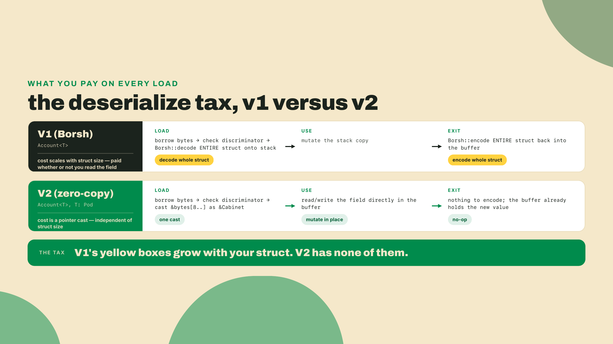
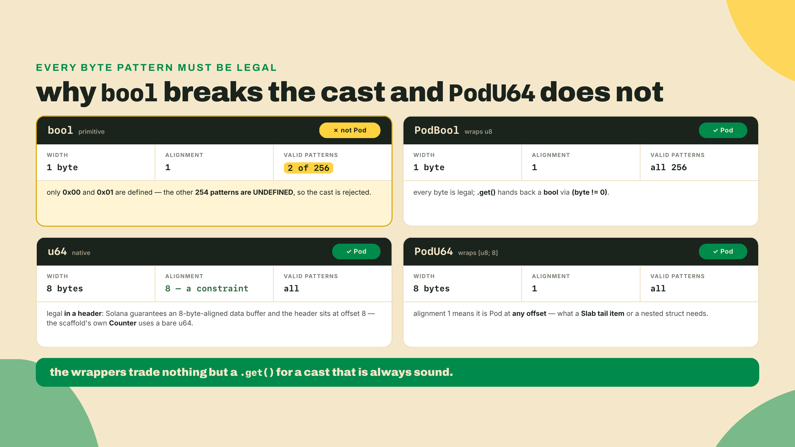
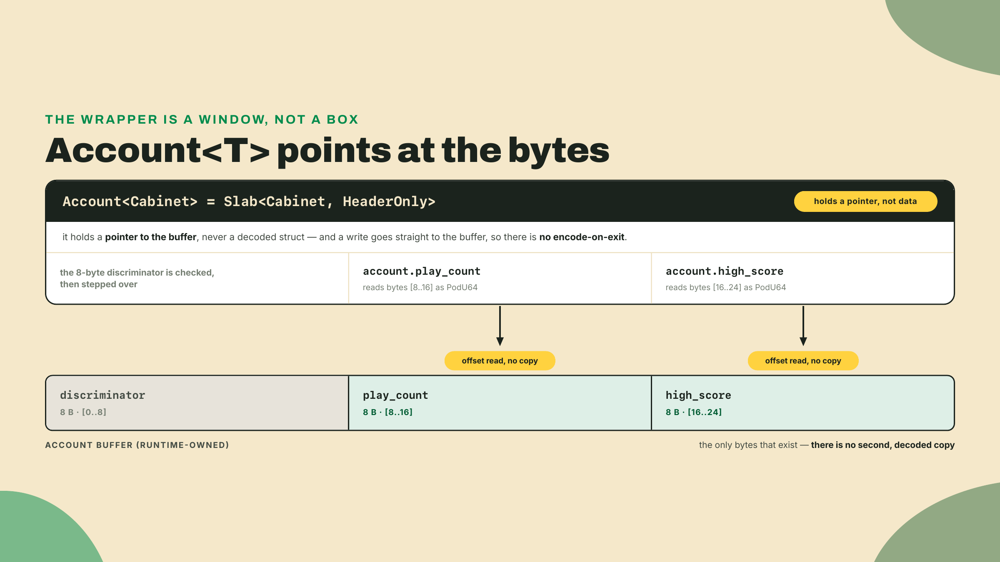
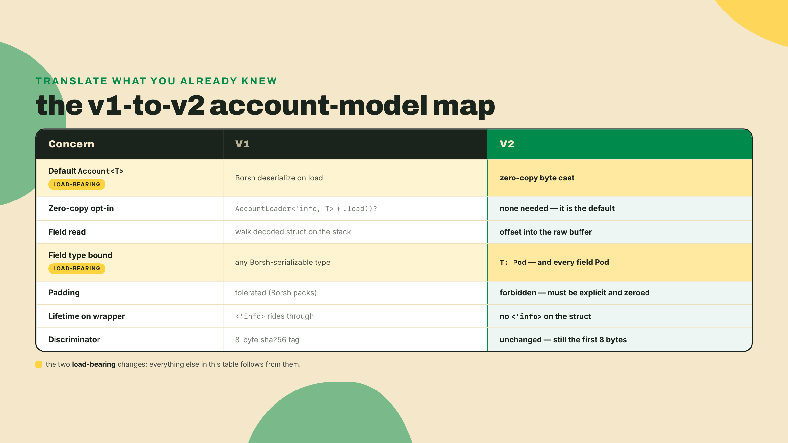
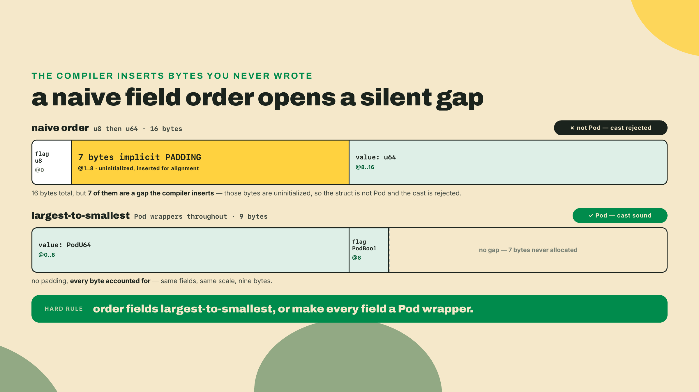
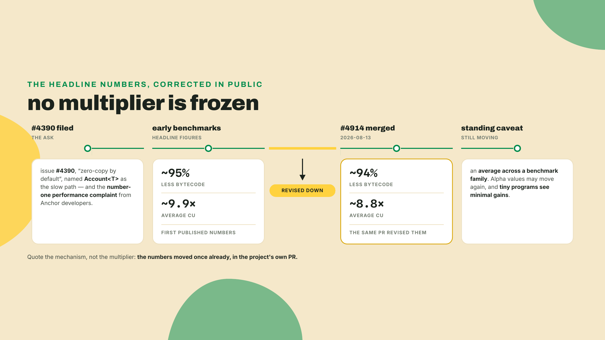
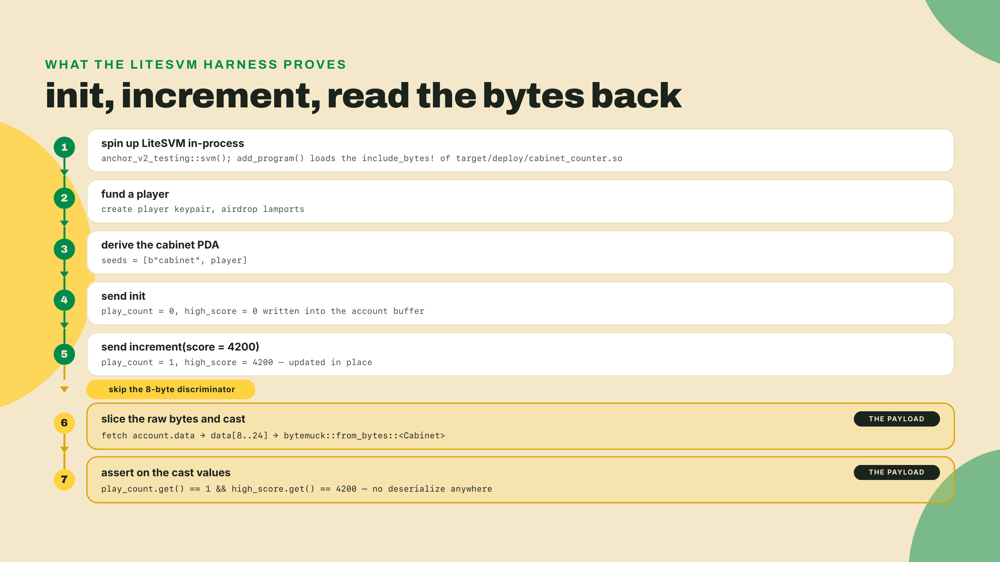

# Account<T> is zero-copy by default

**Summary.** In V1, the instant your program stores one real `u64`, Anchor pays a deserialize tax on every load: it walks the account bytes and rebuilds a Rust struct on the stack before your handler ever runs. V2 deletes that step. `Account<T>` is now a typed window straight onto the account's raw bytes, so reading a field is a pointer cast, not a decode. You pay for that speed in layout discipline: every field has to be a plain-old-data type, and no hidden padding is allowed. This lesson builds R1, the cabinet-counter, to feel exactly where that bill lands.

In m01-l4 you read what `#[derive(Accounts)]` actually generates: the load-then-constraints-then-dispatch order, the sha256 discriminators, the error layout. You ran it on R0, the greeter, and gave it a one-field `Marquee` account purely so there was a surface to observe. R0 stays where it is; it did its job. What that lesson closed on was the promise that the layout discipline behind `Marquee`'s bare `plays: u64`, which was already a legal Pod field without you noticing, stops being invisible now. State you actually keep starts here, in a new program. The `#[event(bytemuck)]` variant got parked with a note: "wait until Pod exists." Pod arrives in this lesson, and the next one collects on that promise.

So let's make it exist for you in the next two minutes, no new toolchain: the V2 RC you built from git back in m01-l2 is what compiles all of this. Confirm PATH is still serving it before you type anything, because your machine also carries the stable 1.x line and the account model below behaves differently there:

```bash
which anchor       # ~/.cargo/bin/anchor either way — the avm shim lives at the same path, so this only proves it's on PATH
anchor --version   # the real check: expect the v2 line, not 1.1.2
```

Do not lean on `which` to tell the shim from the git install: avm's shim *is* `~/.cargo/bin/anchor` (a link to `~/.avm/bin/avm`), and the git build writes the same path, so the two are indistinguishable by location. The version line is the only check that can catch the wrong toolchain.

R1 is a new program, so scaffold it beside the greeter:

```bash
anchor init cabinet-counter
cd cabinet-counter
```

Dependencies first, and a fresh scaffold needs more than one. The Pod derive you are about to lean on is checked by `bytemuck`, which the scaffold does not pull in — and the scaffold also lacks the wincode/solana-address pins from m01-l2, so building it as-is dies in the `#[program]` expansion with the same E0433 that lesson taught you to expect. Open `programs/cabinet-counter/Cargo.toml`, change the scaffold's `anchor-lang` git row to the crates.io version, and make `[dependencies]` read:

```toml
anchor-lang = "2.0.0-rc.1"
bytemuck = "1.25"
wincode = { version = "0.5", features = ["derive"] }
solana-address = ">=2.6.1, <2.7"
```

Step 1 of the lab comes back to every one of these rows and explains why it looks the way it does — including why that last pin is a ceiling and not the `=2.6.0` equality m01-l2 used. For now they just need to exist so the build can.

Now open `programs/cabinet-counter/src/lib.rs` and add this struct below the generated `Counter`, leaving the rest of the scaffold alone for now. `PodU64` comes from the `anchor_lang::prelude::*` the scaffold already imports; it is the wrapper this lesson spends its middle section deriving, and for the next two minutes you can read it as "a `u64` that is safe to cast from bytes":

```rust
#[account]
#[repr(C)]
pub struct Cabinet {
    pub play_count: PodU64, // 8 bytes
    pub high_score: PodU64, // 8 bytes
}
```

Then build it:

```bash
anchor build
```

Expected result: it compiles. Now break it on purpose. Change `high_score` to a bare `pub high_score: bool` and build again. Expected result: a compile error saying `bool` does not satisfy the `Pod` bound. Two byte-castable fields build; one field that is not byte-castable stops the program from existing at all. That refusal is V2's entire thesis showing up as a compiler message, and the rest of this lesson is why it is a good deal. Put `PodU64` back before you read on.

## Why a field read should be a cast, not a decode

Here is the sentence that started this whole framework rewrite. Anchor issue #4390, titled "Zero-copy account deserialization by default," calls today's `Account<T>` **the slow path** and **the number-one performance complaint from Anchor developers**. Not a niche gripe. The most common one. The entire V2 account model is the answer to that one issue, so it is worth slowing down and deriving why the old path is slow before we celebrate the new one.

### The status quo and its bill

Picture the R0 greeter from last lesson, except now it stores a single counter. In V1, when an instruction touches that account, Anchor does roughly this: it borrows the account's raw byte buffer, checks the 8-byte discriminator, then calls Borsh (Anchor's serialization format) to walk the remaining bytes field by field and construct a fresh `Greeter { count: u64 }` value on the stack. Your handler mutates that stack value. On exit, Anchor serializes the whole struct back into the buffer.

For one `u64` the cost is small. But it never stays one `u64`. Real programs hold a config with fifteen fields, a vector of entries, a couple of pubkeys. Every one of those gets decoded on the way in and re-encoded on the way out, whether your handler read it or not. That is the tax. It scales with the size of the struct, not with the work you actually did.

Break the bill into its parts and it is easy to see why it grew into the number-one complaint. There is the decode itself, one pass over the buffer allocating and populating a fresh struct. There is the stack space that struct occupies while your handler runs, which the SBF runtime meters. There is the encode on exit, a second full pass writing the struct back. And there is the copy you never asked for: a handler that only wanted to bump one counter still paid to reconstruct the fourteen fields it never touched. None of those four costs is doing your program's actual work. They are the price of the abstraction, and V2's claim is that the price should be zero.



### Rule out the easy answers

Before we reach for zero-copy, notice that a careful engineer would try cheaper fixes first, and it is worth seeing why each one fails, because the failures are what force the real design.

The most naive fix is "just decode the fields you actually touch." Borsh cannot do that. It is a sequential format: to find field five you have to walk fields one through four, because each field's length can depend on the bytes before it. A vector in the middle has no fixed offset. So partial decode is not free, it is most of the decode.

The next fix is "cache the decoded struct so repeated reads are cheap." That helps within a single instruction, but the cost we care about is the once-per-load decode and once-per-exit encode, and caching does nothing for those. You still pay both ends.

The third fix is "make Borsh faster." People have. It is still a decode. You are optimizing the constant on an operation that should not happen at all.

So the real question sharpens to this: what would let the runtime hand your program a typed view of the account with no decode step in between? And the answer forces a constraint on your struct, which is the entire rest of this module.

### What "Pod" actually demands

A cast from raw bytes to a typed reference is only sound if every possible arrangement of those bytes is a valid value of the type. That property has a name: **Pod**, short for "plain old data." A type is Pod when any bit pattern of the right length is a legal instance of it, with no invalid states and no uninitialized gaps.

`bytemuck` is the crate that encodes this rule in the type system. (`bytemuck` is a tiny, audited library for reinterpreting bytes as typed values and back; V2 pulls it in so the compiler, not you, checks the cast is sound.) Its `Pod` trait is the gate. `bytemuck::from_bytes::<Cabinet>(&data[8..])` compiles only if `Cabinet: Pod`, and `Cabinet: Pod` holds only if every field is itself Pod and the struct has no padding.

Watch where that bites. A `u64` is Pod: all 2^64 bit patterns are valid `u64` values. A `bool` is not. A `bool` occupies one byte but only two of its 256 patterns are defined, `0` and `1`; the other 254 are undefined behavior if you treat them as a `bool`. So `bytemuck` refuses `bool` outright. The fix is `PodBool`, a one-byte wrapper whose every pattern is a defined value. Same story for enums, `Option`, anything with invalid states.



That alignment note in the card is the subtle half, and it is worth being precise about it rather than repeating the folklore. A native `u64` demands an 8-byte-aligned address, and in a *header* it gets one: Solana guarantees the account data buffer is 8-byte aligned, and V2 places the header immediately after the 8-byte discriminator, so `data[8..]` is 8-aligned too. The framework asserts exactly this at compile time, rejecting any header whose alignment exceeds Solana's 8-byte guarantee. That is why the scaffold's own generated `Counter` account gets away with a bare `pub count: u64`, and yours could too.

So why the wrappers? Because that guarantee stops at the header. `PodU64` wraps `[u8; 8]`, which has alignment 1, so the cast is sound *no matter where in the account the field lands*, which is what you need the moment a value sits in a trailing list at an offset the compiler cannot pre-align, or nested inside another Pod struct. Alignment-1 fields also make padding impossible to accidentally introduce, and they are the only way to carry a 16-byte type like `i128` whose natural alignment is stricter than the 8 bytes Solana promises. It stores the number as little-endian bytes and hands it back through `.get()`; you write one by converting from the native type, `PodU64::from(v)` (there is no `.set()`). This is the same trick low-level Solana code has used for years, and V2 gives it a name and a prelude type. The tell that this is about layout and not about banning native scalars: `PodU8` and `PodI8` are literally type aliases for `u8` and `i8`, because a one-byte field never had an alignment problem to solve. We use the wrappers throughout this module because the very next lesson puts these fields in a trailing list, where they stop being optional.

### The precise definition: Account<T> = Slab<T, HeaderOnly>

Now the mechanism, stated exactly. In V2, `Account<T>` is defined as `Slab<T, HeaderOnly>`. A `Slab` is a typed view over an account's raw byte buffer. The `HeaderOnly` parameter says the fixed-size header is `T` and there is no trailing dynamic region. Reading `account.play_count` does not deserialize anything; it computes an offset into the buffer and reads the bytes there as a `PodU64`. Writing it writes those bytes. There is no stack copy, no encode on exit, no `<'info>` lifetime riding the wrapper into your struct definition the way `AccountLoader` used to force.

The word "view" is load-bearing. A view owns nothing. It points at the account's bytes and interprets them. That is why the exit step in the comparison above was a no-op: there is no second copy to write back, because you were editing the real buffer the whole time.



### The discriminator still sits in front

One thing V2 did not change: the 8-byte discriminator. It is still the sha256-derived tag from m01-l4, still the first eight bytes of the account, still how the runtime tells a `Cabinet` from a `Vault`. The Pod body begins immediately after it. That is why `HeaderOnly` describes `T` alone and your tests cast from `data[8..]`, never `data[..]`.

This is the single most common first-day mistake, so let me name the symptom before you hit it. If your test reads `account.data` and every field looks shifted by eight bytes from what you wrote, you cast from offset zero and read the discriminator as your first field. The fix is one slice: `&data[8..]`. Nothing was corrupted, you just read from the wrong start.

### The v1 to v2 mental map

If you wrote zero-copy code in V1, you did it with `AccountLoader<'info, T>`: an explicit, exotic wrapper you reached for only when a struct was too big or too hot to deserialize. You called `.load()?` and `.load_mut()?` and you carried the `<'info>` lifetime around. Everyone else used plain `Account<'info, T>` and ate the Borsh cost.

V2 inverts the default. What was the exotic `AccountLoader` case is now what `Account<T>` does out of the box, and the `<'info>` lifetime no longer rides the wrapper into your struct. You do not opt into zero-copy; you opt out of it, in the rare case you truly need free-form data no cast can describe — the borsh escape hatch this module closes with. (A bounded tail is not an opt-out: the `Slab` you bolt on next lesson stays zero-copy.) The general lesson worth extracting here, because it recurs across V2, is that the framework moved the cost from runtime to compile time. The old default was permissive at authoring and expensive at execution. The new default is strict at authoring and free at execution. Every place V2 feels more demanding to write is a place it stopped charging you when the program runs.



### The objections a sharp reader raises

If you have shipped Solana programs before, three doubts should be forming, and they are worth answering in turn, because each one marks a real edge of the design.

The first: is mutating the buffer in place not dangerous? In V1 you edited a stack copy, and Anchor wrote it back only if the handler returned cleanly, which gave you a kind of accidental transactionality. In V2 you write the live account bytes as you go. The answer is that Solana's runtime already gives you the real guarantee: an instruction that returns an error rolls back all account changes for the whole transaction, buffer edits included. The stack copy was never the thing protecting you. The runtime was. So the in-place write is exactly as safe, and one fewer copy.

The second: what about accounts that need to grow, a vector that gets longer over time? That is the honest limit of `HeaderOnly`. A pure Pod body is fixed-size by definition, because a cast needs to know the field offsets in advance, and a `Vec` has no fixed offset. V2's answer is not "you cannot have variable data," it is "variable data lives in a declared trailing region, not smuggled inside the Pod header." That trailing region is a later lesson. For today, fixed-size is the point, and it is most of what account state actually is.

The third: does this break clients that read the account with Borsh? Not always, and the greeter is the honest counterexample: Borsh encodes a `u64` as eight little-endian bytes, and `PodU64` stores eight little-endian bytes, so for a header of plain integers the two layouts coincide and an old client running `Greeter.deserialize` still reads the correct count. The break comes from everything Borsh could express that a Pod header cannot: a `Vec` with its length prefix, an `Option` with its tag byte, a `String`. Migrating a struct like that to V2 means restructuring it — the dynamic parts move to a declared trailing region — and that restructuring is what moves the bytes out from under a client still decoding the old shape. So the client rule is absolute even when the bytes happen to match today: read the same way the program writes — cast the bytes at known offsets, do not run the old decoder and hope. That is a real migration cost, and pretending otherwise would be dishonest. It is also the same cost the whole ecosystem is paying once, which is why the framework made it the default rather than an opt-in that fragments the client story forever.

### The trade-off, stated plainly

Zero-copy erases the serialization cost and lets you mutate fields in place. That is the win, and it is not small. But you inherit C-layout discipline as the price, and this is the honest part that the rest of the module is really about.

Every field must be Pod, so a bare `bool` or a naive `Option` will not compile. Padding is forbidden, so you order fields largest-to-smallest and the compiler asserts there are no implicit gaps between them. Alignment becomes your concern, which is why the Pod wrappers exist. A field order that a normal Rust developer never thinks about, small field before big field, can silently open a padding byte that breaks the cast. In V2 it does not silently break: it fails to compile, which is the good version of that failure. The speed is paid for in layout rigor. You are trading "the compiler lets me write any struct and I pay at runtime" for "the compiler makes me write a legal struct and I pay nothing at runtime."



### How honest is 8.8x?

You will hear a number attached to V2, and I want you to carry it correctly, because it is a live example of how this course treats every moving figure. The V2 benchmarks report roughly **8.8x average CU reduction** and about **94% less deployed bytecode**. Cite those as approximate, moving values, never as a per-program guarantee.

Why the hedge. PR #4914, merged 2026-08-13, revised the headline numbers *down*: from 95% to 94% less bytecode, from 9.9x to 8.8x average CU. That is a rare thing to see in public, a project correcting its own marketing figure downward, and it is exactly why this course never freezes a multiplier. The 8.8x is an *average* across a benchmark family, and the benchmark page itself warns the alpha values can shift as codegen changes. Small programs see the least benefit. Your bare cabinet-counter, two `u64` fields, will show almost nothing, because there was barely any deserialize cost to erase in the first place. The gains show up when the struct is big and hot. So when a teammate says V2 made their tiny counter 8.8x cheaper, the honest reframe is: that is the project's approximate average, revised down once already and expected to keep moving, and a two-field counter is the worst case for it.



## Lab: build the cabinet-counter

Time to build R1. Here is the fade, said out loud so you know what is yours: I hand you the Pod struct and the `init` handler in full, and I show the byte cast once in the test. You fill the `increment` handler and the LiteSVM assertion that reads `data[8..]` back. The challenge after this is entirely yours, no scaffold.

You already confirmed in the opener that PATH is serving the RC. If it was not, or if the RC is missing entirely, reinstall from the documented git channel now, because `avm install` fetches a prebuilt binary from the tag's GitHub Release and no Release was cut for the v2 tag, so the download 404s and the git build is the sanctioned route:

```bash
# freshness note: as of 2026-08-22 the RC is 2.0.0-rc.1, tag v2.0.0-rc.1 on the
# anchor-next branch of the otter-sec fork (commit e4878b6d). m01-l2 installed from
# the branch because the channel was its subject; from here on the course pins the
# tag, because a branch tip moves and a tag does not. Re-verify before you rely on it.
# macOS, if the build trips on LTO: prefix that line with CARGO_PROFILE_RELEASE_LTO=off
cargo install --git https://github.com/otter-sec/anchor.git \
  --tag v2.0.0-rc.1 anchor-cli --locked --force
```

Do not verify V2 content on the 1.1.2 toolchain; the account model is different and the code below will not behave the same.

**Step 1. Confirm the dependencies.** Your `programs/cabinet-counter/Cargo.toml` needs `anchor-lang` on the V2 line, `bytemuck`, and the wincode/solana-address pins from m01-l2 — you re-added all four rows in the opener, because this is a fresh scaffold and skipping the pins kills the first build in the `#[program]` expansion. Now is when each row earns its explanation. The scaffold had written `anchor-lang` as a git row tracking the `anchor-next` branch; you edited it to the crates.io version, exactly as m01-l2 did, because that is the only source that resolves against the two pins under it. One of those two pins changed shape here, and the reason is worth a sentence now rather than a surprise in module 6: the greeter was a throwaway workspace of one, but this crate is the first rung of the arcade, and it ends up sharing a workspace with the other four — R2 starts that workspace in m03-l1, R3 and R4 are scaffolded straight into it, and m09-l3 moves this crate in beside them. A workspace resolves **one** `solana-address` for all of its members, so the row has to be a ceiling every member can agree on rather than an equality only one of them can. The freshness note that matters here is `bytemuck`, currently 1.25.2 (published 2026-07-19). Any 1.x works.

```toml
[dependencies]
# crates.io, not the git branch: a published version is immutable, and the branch
# tip now wants solana-address 2.7.0, which will not resolve against the pin below.
anchor-lang = "2.0.0-rc.1"
# The pins from m01-l2 — every program crate in this course carries them (issue #4937's class).
wincode = { version = "0.5", features = ["derive"] }
# A ceiling, not an equality. 2.7.0 is the version that moved to wincode 0.6; 2.6.1 is
# still on 0.5. Every crate in the arcade workspace carries this exact row, because the
# workspace resolves one solana-address for all of them and module 6 adds a Mollusk
# dev-dependency whose SVM stack reaches ^2.6.1. `=2.6.0` in any member refuses it.
solana-address = ">=2.6.1, <2.7"
bytemuck = "1.25"          # you added this in the opener

[dev-dependencies]
# The test harness. This wraps LiteSVM and re-exports what the test file needs,
# so you never depend on `litesvm` by name. The scaffold writes it tracking the
# `anchor-next` branch; repoint it at the tag so the litesvm it carries cannot
# move under you. Add the row outright if your scaffold predates it.
anchor-v2-testing = { git = "https://github.com/otter-sec/anchor.git", tag = "v2.0.0-rc.1" }
```

**Step 2. Write the state and the accounts.** This is the part I give you whole. Paste it into `src/lib.rs`, replacing the generated `Counter` struct and its `initialize` handler, and folding in the `Cabinet` you added in the opener; the scaffold has served its purpose. One line you do **not** paste: keep the `declare_id!` that `anchor init` already wrote. It matches the keypair sitting in `target/deploy/`, and overwriting it with a hand-typed string gives you an id the deploy cannot sign for. If you ever do lose the match, `anchor keys sync` rewrites `declare_id!` and `Anchor.toml` from the keypair. Expected result after this step: `anchor build` compiles, with the `increment` handler still a stub. `PodU64` comes from the V2 prelude; it is the alignment-1 byte-array wrapper we derived above, read through `.get()` and written by assigning a `PodU64::from(value)`.

```rust
use anchor_lang::prelude::*;

// Leave the id anchor init generated for you here; do not paste one in.
declare_id!("<your generated program id>");

#[program]
pub mod cabinet_counter {
    use super::*;

    pub fn init(ctx: &mut Context<Init>) -> Result<()> {
        let cabinet = &mut ctx.accounts.cabinet;
        cabinet.play_count = PodU64::from(0);
        cabinet.high_score = PodU64::from(0);
        Ok(())
    }

    // Step 3 is yours: fill this in.
    pub fn increment(ctx: &mut Context<Increment>, score: u64) -> Result<()> {
        // TODO
        Ok(())
    }
}

#[account]
#[repr(C)]
pub struct Cabinet {
    pub play_count: PodU64, // bytes 8..16 of the account
    pub high_score: PodU64, // bytes 16..24 of the account
}

#[derive(Accounts)]
pub struct Init {
    #[account(
        init,
        payer = player,
        space = Cabinet::DISCRIMINATOR.len() + core::mem::size_of::<Cabinet>(),
        seeds = [b"cabinet", player.address().as_ref()],
        bump
    )]
    pub cabinet: Account<Cabinet>,
    #[account(mut)]
    pub player: Signer,
    pub system_program: Program<System>,
}

#[derive(Accounts)]
pub struct Increment {
    #[account(
        mut,
        seeds = [b"cabinet", player.address().as_ref()],
        bump
    )]
    pub cabinet: Account<Cabinet>,
    pub player: Signer,
}

#[error_code]
pub enum CabinetError {
    #[msg("play_count overflowed")]
    Overflow,
}
```

Two lines in there are not this lesson's business, and I would rather name them than let you wonder. `seeds = [b"cabinet", player.address().as_ref()]` with a bare `bump` makes the cabinet a program-derived address, one per player, so a player cannot hand you someone else's cabinet. Copy those two lines for now; module 3 is entirely about what they generate and why the bump is stored. And `player.address()` is the V2 accessor from m01-l3, the on-chain replacement for `.key()`, returning a reference to an `Address` rather than a `Pubkey`.

Two more things to notice, because they are the lesson in miniature. The space calc is `Cabinet::DISCRIMINATOR.len() + core::mem::size_of::<Cabinet>()`, which is `8 + 16 = 24` bytes: the discriminator plus the exact Pod body, no magic constant. And `#[account]` on a V2 struct derives the Pod bound and asserts at compile time that `Cabinet` has no padding. Add a bare `bool` field to `Cabinet` right now and try to build; the compiler will reject it with a Pod error, not a runtime surprise. That is the trade-off doing its job.

**Step 3. Fill the `increment` handler.** This is your first real handler write, so write it before you read the next block, then compare. It should bump `play_count` by one with checked arithmetic, and raise `high_score` only if the new `score` beats the stored one. Read through `.get()`; write by assigning a fresh wrapper, `PodU64::from(value)` (there is no `.set()`, and no `::new()` either, the conversion is a `From` impl). Note the handler takes `&mut Context<T>` in V2, not `Context<T>`. Here is mine, for after you have written yours:

```rust
pub fn increment(ctx: &mut Context<Increment>, score: u64) -> Result<()> {
    let cabinet = &mut ctx.accounts.cabinet;

    let plays = cabinet
        .play_count
        .get()
        .checked_add(1)
        .ok_or(CabinetError::Overflow)?;
    cabinet.play_count = PodU64::from(plays);

    if score > cabinet.high_score.get() {
        cabinet.high_score = PodU64::from(score);
    }

    Ok(())
}
```

The `checked_add` is not ceremony. `play_count` is a `u64` you increment on every play, and the house rule for program arithmetic is checked-everything, so a wrap becomes a clean error instead of a silent reset to zero.



**Step 4. Read the bytes back (your assertion).** The test lives beside the program crate, at `programs/cabinet-counter/tests/cabinet.rs`, which is what makes the `include_bytes!` path below resolve; put it at the workspace root instead and that relative path walks out of the repo. It uses LiteSVM, the in-process Solana VM that becomes the acceptance gate for every later rung in this course. You do not pull `litesvm` in directly: the scaffold's `anchor-v2-testing` dev-dependency wraps it and re-exports the pieces you need (`Keypair`, `Signer`, `Message`, `VersionedTransaction`), which is also how `anchor test --profile` gets to hang tracing off the same tests later. I give you the harness scaffolding; the three assert lines at the bottom are yours. Write them from the flowchart above before you look at the ones printed below: what should `play_count` be after one `increment`, what should `high_score` be, and how many bytes long is the whole account?

```rust
use {
    anchor_lang::{
        bytemuck, programs::System, solana_program::instruction::Instruction, Id,
        InstructionData, ToAccountMetas,
    },
    anchor_lang::prelude::Address,
    anchor_v2_testing::{Keypair, Message, Signer, VersionedMessage, VersionedTransaction},
    cabinet_counter::{accounts, instruction, Cabinet},
};

fn send(
    svm: &mut anchor_v2_testing::LiteSVM,
    payer: &Keypair,
    ix: Instruction,
) {
    let blockhash = svm.latest_blockhash();
    let msg = Message::new_with_blockhash(&[ix], Some(&payer.pubkey()), &blockhash);
    let tx = VersionedTransaction::try_new(VersionedMessage::Legacy(msg), &[payer]).unwrap();
    svm.send_transaction(tx).unwrap();
}

#[test]
fn cabinet_round_trips() {
    let program_id = cabinet_counter::id();

    // `anchor_v2_testing::svm()` is LiteSVM::new(), plus the profiling
    // callback when the crate is built with --features profile.
    let mut svm = anchor_v2_testing::svm();
    let bytes = include_bytes!("../../../target/deploy/cabinet_counter.so");
    svm.add_program(program_id, bytes).unwrap();

    let player = Keypair::new();
    svm.airdrop(&player.pubkey(), 1_000_000_000).unwrap();

    let (cabinet, _bump) =
        Address::find_program_address(&[b"cabinet", player.pubkey().as_ref()], &program_id);

    // init: play_count = 0, high_score = 0
    let init_ix = Instruction::new_with_bytes(
        program_id,
        &instruction::Init {}.data(),
        accounts::Init {
            cabinet,
            player: player.pubkey(),
            system_program: System::id(),
        }
        .to_account_metas(None),
    );
    send(&mut svm, &player, init_ix);

    // increment with a score of 4200
    let inc_ix = Instruction::new_with_bytes(
        program_id,
        &instruction::Increment { score: 4200 }.data(),
        accounts::Increment {
            cabinet,
            player: player.pubkey(),
        }
        .to_account_metas(None),
    );
    send(&mut svm, &player, inc_ix);

    // read the raw bytes back, skipping the 8-byte discriminator.
    let raw = svm.get_account(&cabinet).unwrap().data;
    let state: &Cabinet = bytemuck::from_bytes(&raw[8..8 + core::mem::size_of::<Cabinet>()]);

    // The three assertions. Write yours first, then check against these.
    assert_eq!(state.play_count.get(), 1);
    assert_eq!(state.high_score.get(), 4200);
    assert_eq!(raw.len(), 24); // 8 discriminator + 16 body
}
```

**Checkpoint.** Run `anchor test`. You should see one passing test. If instead the assertions fail because the fields look shifted, check the slice: it must be `raw[8..24]`, past the discriminator, not `raw[0..16]`. That is the offset footgun from earlier, and seeing it once in a failing assert is the fastest way to never forget it. If the program fails to *compile* on the struct, you have a non-Pod field or a padding gap; re-read the field order.

That green test is R1 done. You wrote a two-field Pod account, an `init`, an `increment`, and the first LiteSVM harness in the course, and you watched the exact bytes you wrote come back out with no serialization step in the path.

## Challenge: prove reset zeroes only play_count

No scaffold this time. Add a `reset` handler to the program and a second test that proves it.

The behavior: `reset` sets `play_count` back to `0` and leaves `high_score` untouched. Think of it as the arcade operator clearing the play tally at the start of a shift without wiping the all-time high on the marquee.

Your acceptance bar, all three must hold:
- The `reset` handler compiles and takes the same PDA-validated `Cabinet` account, mutable.
- A new test increments a couple of times to a real high score, calls `reset`, then reads `data[8..]` back and asserts `play_count == 0` **and** `high_score` still equals the score you set.
- The existing `cabinet_round_trips` test still passes.

The interesting part is the assertion, not the handler. A `reset` that accidentally zeroes both fields will pass a lazy test that only checks `play_count`. Write the test that would catch that bug: assert the high score survived. That is the whole point of the exercise. Both the handler and the test go in your own R1 checkout, next to what you just built; a reference solution sits beside this lesson — [reset-play-count/reset.rs](reset-play-count/reset.rs) for the handler and accounts struct, [reset-play-count/cabinet_reset.rs](reset-play-count/cabinet_reset.rs) for the test — for after you have a green run of your own.

**Feedback beat.** Before you move on, answer this in one sentence, out loud or in a comment at the top of your test file: what two things does the `T: Pod` bound forbid in your struct? If your sentence names non-Pod fields (the bare `bool`) and implicit padding (the silent gap from a bad field order), you have the model. If it named only one, re-read the trade-off section, because the second one is the one that bites silently.

One counter per cabinet is fine, but a real arcade cabinet keeps a high-score *table*, many rows in a single account, not one number. Next lesson we put a bounded list inside one Pod account and read any row of it as a byte cast, without borsh ever touching the data. `HeaderOnly` gives way to a real tail, `PodU64` picks up a family of siblings for the fields that sit in it, and the `#[event(bytemuck)]` variant that m01-l4 parked finally comes due, because emitting it needs exactly the Pod discipline you just paid for. Happy building.
