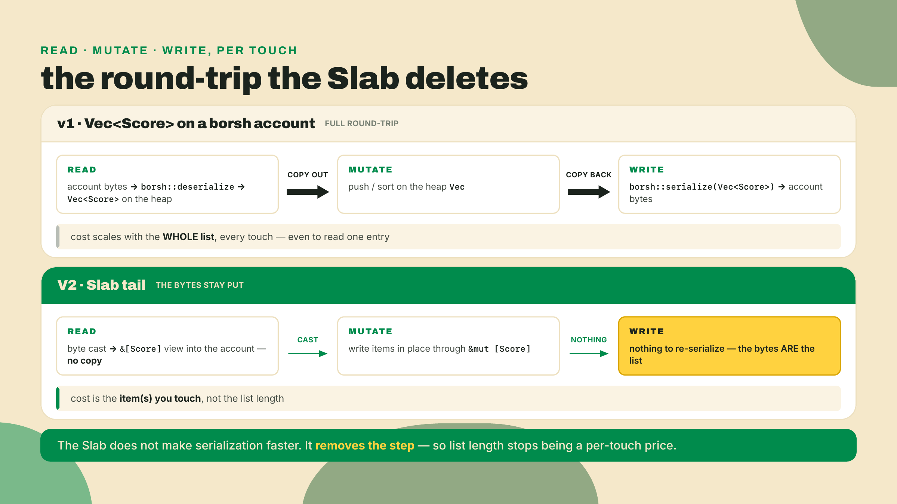
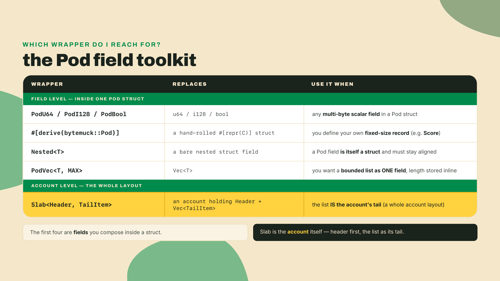
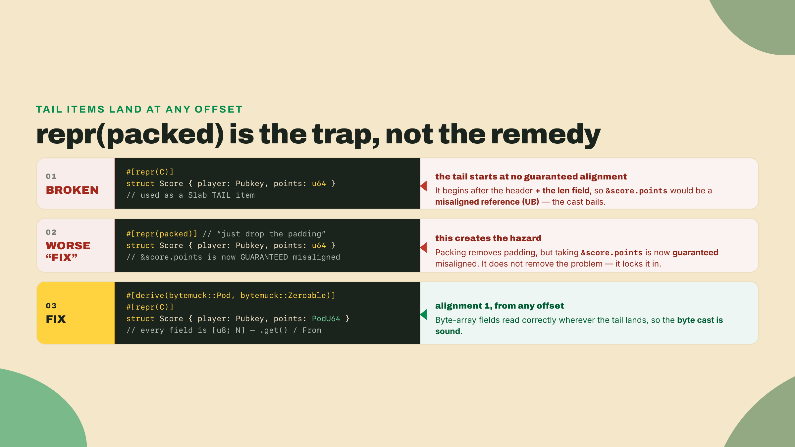
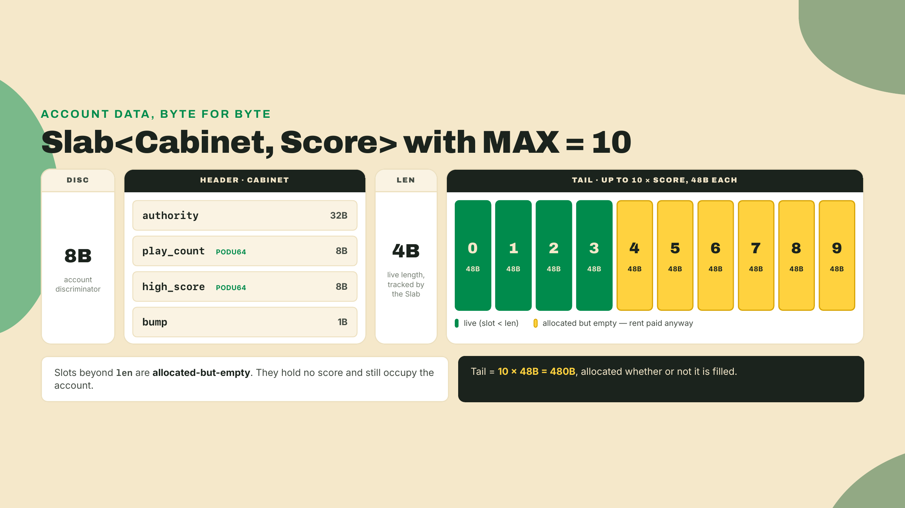
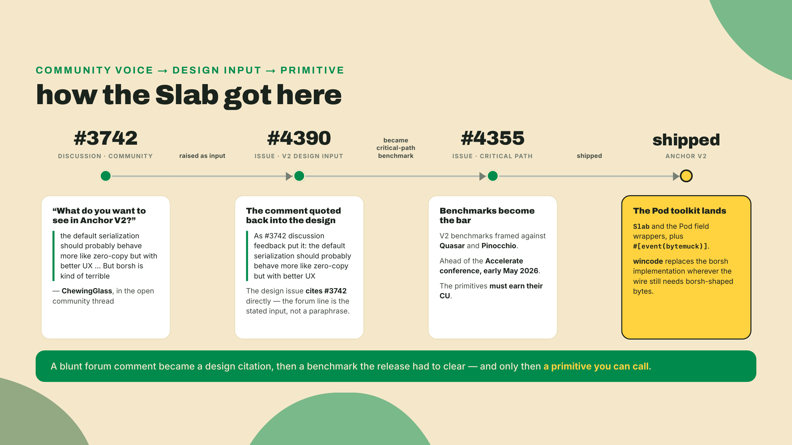
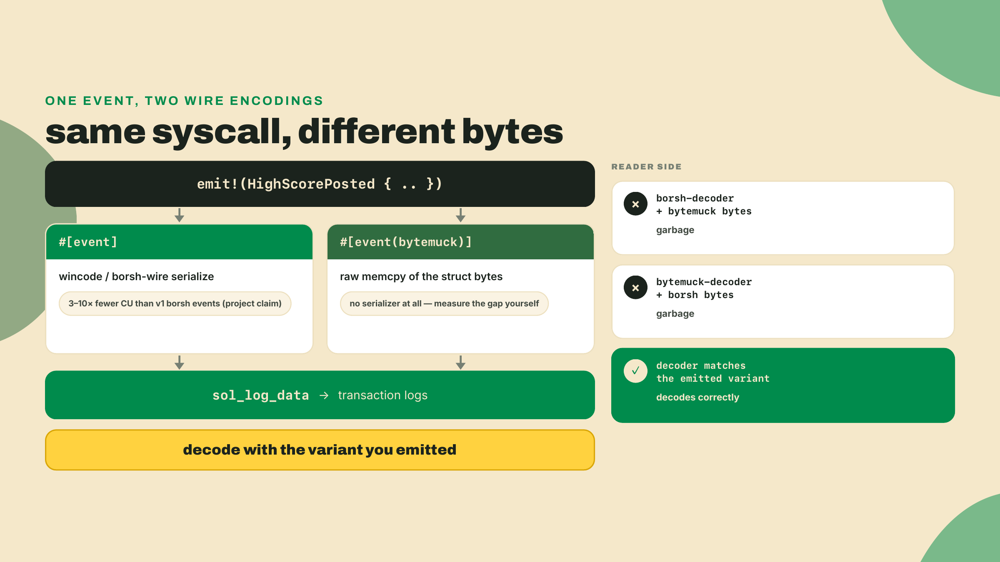
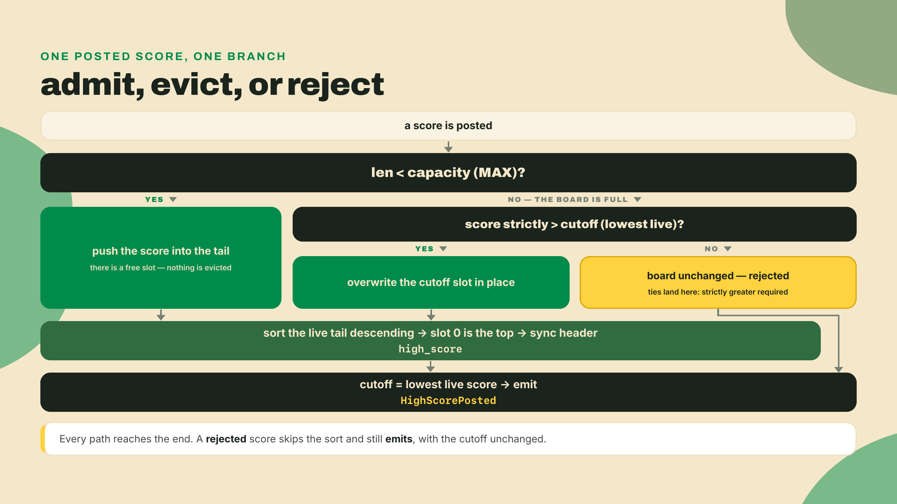

# A list that lives in the account's own bytes

In m02-l1 you built R1, the cabinet-counter: a Pod `Account<T>` with `play_count` and `high_score`, and you stood up the LiteSVM harness that now gates every rung. You watched the state land with no deserialize call anywhere in the path. The byte cast was the whole trick.

Here is the thing that counter quietly lies about. A single `high_score` is not what an arcade cabinet keeps. A cabinet keeps a *table*: the top ten, initials and all, in order, so the person who just lost by 400 points can see exactly whose name they have to beat. One number is a scoreboard for a game nobody plays alone.

So we are going to give R1 a real leaderboard. And before any theory, do the one edit that starts it. Open the R1 project and find the accounts struct behind `increment`. This lesson renames it `PostScore`, because posting a score to a board is what it is about to do. Look at the line that declares the cabinet account:

```rust
pub cabinet: Account<Cabinet>,
```

Change it to this:

```rust
pub cabinet: Slab<Cabinet, Score>,
```

That is the entire structural move of this lesson in one line. `Account<Cabinet>` was always `Slab<Cabinet, HeaderOnly>` under the hood: a header, then a tail of nothing. You just swapped the empty tail for a run of `Score` items. The account now carries a bounded list in its own bytes, and it still never deserializes. The compiler will complain that `Score` does not exist yet and that nobody sizes the tail. Good. Those two complaints are the lesson.



## The short version

You are turning R1's counter into a bounded high-score table. Three things carry it. First, the Pod field toolkit: `PodU64`, `PodVec<T, MAX>`, `#[derive(bytemuck::Pod)]` and `Nested<T>`, the wrappers that keep a struct castable straight from bytes. Second, `Slab<Header, TailItem>`, the list-in-account primitive, where a fixed header is trailed by a bounded run of items. Third, the payoff m01-l4 promised you: `#[event(bytemuck)]`, a zero-copy event you emit and read back from the transaction logs.

The honest catch runs through all of it, so hear it once up front: a Slab's capacity is fixed at compile time. You size for the worst case, you pay rent for the empty slots, and a write past `MAX` is a hard error, never an automatic resize. That fixed cap is not a wart. It is the exact price of a list you never have to serialize, and picking `MAX` is a real design decision.

On autonomy: the Lab hands you the finished Slab layout and the event struct. You write the admit and evict logic and the ordering assertion yourself. The solo challenge at the end, the leaderboard cutoff, you do with no scaffold at all. This lesson is where the training wheels on data layout come off and stay off.

## Building a leaderboard into one account

### The Pod field toolkit

Recall the rule from m02-l1: `Account<T>` requires `T: Pod`, plain-old-data, a fixed layout with no padding surprises, so the framework can cast account bytes straight into `&T` with zero copying. That rule does not soften because your data got more interesting. A `Score` has to be Pod. A table of `Score` has to be Pod. So the first question is mechanical: how do you build a Pod struct out of the fields you actually want?

A bare `u64` was fine in R1's header, because the header sits at a guaranteed 8-byte-aligned offset. A tail item does not get that promise: it lands wherever the header and the length field leave it, at a stride of `size_of::<Score>()`, and neither of those is something you want to reason about field by field. So in a tail item you reach for the field wrapper instead. `PodU64` is a `u64` stored as a byte array with accessor methods, so it has alignment 1 and reads correctly from any offset. Same story for `PodI128`, `PodBool`, and the rest of the family. They are not new types you have to think in. They are the old types with the alignment tax pre-paid.

The cost you pay for that is a tiny bit of ceremony at the point of use: you go through accessors instead of touching the value directly.

```rust
let mut plays = cabinet.play_count.get();      // read: byte array -> u64
plays += 1;
cabinet.play_count = PodU64::from(plays);      // write: u64 -> byte array
// A Slab Derefs to its header, so header fields are plain field access.
// .get() reads; PodU64::from(v) / v.into() writes. There is no .set().
```

That `.get()` on the way out and a `From` conversion on the way in is the entire tax. In exchange, the field reads correctly no matter what offset it lands on inside the account, which is what makes the whole record castable.

```rust
use anchor_lang::prelude::*;

// Deriving bytemuck::Pod makes a fixed-size struct castable straight from bytes:
// every field is itself Pod, so the whole struct has a defined layout and no
// padding. This is one leaderboard entry. (#[pod_wrapper] is for ENUMS — structs
// take the derive directly, and V2 rejects the attribute on a struct outright.)
#[repr(C)]
#[derive(Clone, Copy, bytemuck::Pod, bytemuck::Zeroable)]
pub struct Score {
    pub player: Address,   // 32 bytes: who set it
    pub points: PodU64,    //  8 bytes: the score
    pub slot: PodU64,      //  8 bytes: when, for tie-breaking display
}                          // 48 bytes, fixed, no padding
```

`#[derive(bytemuck::Pod)]` (paired with `bytemuck::Zeroable`) is what certifies your own fixed struct as Pod: it checks every field is Pod and gives the type the byte-cast blessing. Reach for `#[pod_wrapper]` only on an *enum* — V2 rejects the attribute on a struct outright, with a message telling you to use the derive instead. When one Pod field is itself a struct you want to nest, you wrap it in `Nested<T>` so its alignment stays defined inside the parent rather than punching a hole in the layout. And when you want a bounded list as a *field* rather than as the account's whole tail, that is `PodVec<T, MAX>`: a vector with a compile-time capacity, its length stored inline, no heap anywhere.



Why did the framework put you through this instead of just letting you write `Vec<Score>`? Because there is no free lunch in the byte cast. A `Vec` is a pointer, a length, and a capacity pointing at heap memory that does not exist inside an account. To make a list castable you have to lay it out flat and fixed, in place, and the wrappers are how you do that without hand-writing offset arithmetic. Which brings us to the primitive that holds the whole table.

### Alignment is the Pod tax

It is worth seeing the exact failure the wrappers prevent, because it is the one that shows up as a warning you are tempted to silence the wrong way. Suppose you skip the toolkit and hand-roll the entry as a bare struct with native fields:

```rust
// DON'T: bare multi-byte fields inside a byte-cast struct.
#[repr(C)]
pub struct Score {
    pub player: Address,  // 32 bytes, fine
    pub points: u64,      // native u64: alignment 8
    pub slot: u64,        // native u64: alignment 8
}
```

A native `u64` wants to sit on an 8-byte boundary. A `Score` in the tail lives at whatever offset the header and the length field push it to, so that alignment is not guaranteed, and the cast has to bail rather than hand you a misaligned reference, which is undefined behavior in Rust. The instinct is to reach for `#[repr(packed)]` to remove the padding the warning seems to blame. That is exactly backwards. `repr(packed)` is what *creates* the misaligned-reference hazard: taking a reference to a packed field is the footgun, not the fix. The right move is the toolkit. `PodU64` stores the value as a `[u8; 8]` read through `.get()` and written through a `From` conversion, so its alignment is 1 and it reads correctly from *any* offset, and `#[derive(bytemuck::Pod)]` (or `Nested<T>` for a nested struct field) keeps the whole record's alignment defined so the direct byte cast stays sound.



### Slab: a list that lives in the account

Here is the definition, just-in-time. `Slab<Header, TailItem>` is an account layout that is a fixed `Header` struct followed by a bounded, in-place run of `TailItem` records. That is it. The header is your fixed fields, the ones every cabinet has exactly one of. The tail is the list. And the identity you already met makes it click: `Account<T>` is literally `Slab<T, HeaderOnly>`, a header with a tail of a zero-size marker. R1's counter was a Slab all along. It just had nothing in the tail.

So `Cabinet` from m02-l1 becomes the header. It keeps its two counters and picks up two new fields the leaderboard rung needs anyway: an `authority` so the PDA seeds no longer depend on a single player, and the stored `bump` you re-derive validation from:

```rust
// The HEADER: the fixed part every cabinet has exactly one of.
// R1's Cabinet, plus two new fields: authority (for the seeds) and bump.
#[account]
#[repr(C)]
pub struct Cabinet {
    pub authority: Address,
    pub play_count: PodU64,
    pub high_score: PodU64,   // still here: the single top score, for quick reads
    pub bump: u8,
}
```

And the account in your handler is the Slab that pairs that header with a `Score` tail. The Slab tracks its own tail length and derives its capacity from how much space the account was allocated at init. You read the tail as a slice and mutate it in place:

```rust
#[derive(Accounts)]
pub struct PostScore {
    #[account(mut)]
    pub player: Signer,

    #[account(
        mut,
        seeds = [b"cabinet", cabinet.authority.as_ref()],
        bump = cabinet.bump,
    )]
    pub cabinet: Slab<Cabinet, Score>,
}

// The Slab surface you work against:
//   *cabinet                    -> Deref/DerefMut to Cabinet, so the header's
//                                  fields are plain field access:
//                                  cabinet.play_count.get()
//                                  cabinet.play_count = PodU64::from(n)
//   cabinet.as_slice()          -> &[Score]      (the live list, a byte view)
//   cabinet.as_mut_slice()      -> &mut [Score]
//   cabinet.len() / .capacity() -> usize         (live items / MAX at allocation)
//   cabinet.is_full()           -> bool
//   cabinet.get(i) / .get_mut(i) / .first() / .last() / .iter()
//   cabinet.try_push(Score)     -> Result<(), ProgramError>
//                                  (Err past capacity; there is no infallible push
//                                   and no implicit growth)
//   cabinet.address()           -> &Address       (the account's OWN address; this
//                                  one lives on the Slab, not on the Cabinet header)
//   cabinet.resize_to_capacity(n) -> Result<()>   (the ONLY growth path: reallocs
//                                  the account and settles the rent difference)
//   Slab::<Cabinet, Score>::space_for(MAX) -> usize   (const, for `space =`)
```

Notice `cabinet.as_mut_slice()` hands you a plain `&mut [Score]`. Once you have that slice, sorting and comparing are ordinary Rust on ordinary memory, except the memory is the account and every write you make to the slice is already persisted. There is no serialize step at the end of the handler because there is nothing to serialize back. The slice *is* the account bytes.

How does the Slab know how many `Score` items are live versus how many slots are allocated-but-empty? It keeps its own length as a little-endian `u32` in the account, right between the header and the items, the same way a `Vec` tracks length separately from capacity, except both live inside the account and neither can point at a heap. `capacity()` is derived from the account's data length: total bytes, minus the discriminator, minus the header, minus that length field, divided by `size_of::<Score>()`. That is why the space you allocate at init is the ceiling until you deliberately change it: `try_push` past capacity returns an error rather than growing, and the only way the account gets bigger is an explicit `resize_to_capacity(n)` call that reallocs the buffer and settles the rent difference. Nothing grows behind your back. There is a sibling primitive worth naming here so you reach for the right one: `PodVec<T, MAX>` is the *field-level* bounded list, the one you drop inside a header when a struct needs a small inline list of its own, while `Slab<Header, TailItem>` is the *account-level* one, where the list is the account's entire tail. Rule of thumb: one bounded list that is the point of the account is a Slab tail, a small bounded list hanging off a larger record is a `PodVec` field.



That diagram is also the tradeoff staring back at you. Ten slots at 48 bytes is 480 bytes of tail, allocated and rent-paid the moment you init the account, whether the cabinet has one score on it or ten. Which is the honest beat this whole design turns on.

### Why MAX is fixed, and why that is the whole point

It is worth slowing down here, because "just make it dynamic" is the obvious instinct and it is worth seeing exactly why the Slab refuses.

Start from what you actually want: append a score, keep the list ordered, never lose the top entries. The naive answer is a heap-growable `Vec<Score>` that reallocs when it fills. That fails inside an account for a flat reason: an account is a fixed byte region with an owner and a rent balance, not a heap you can grow. There is nowhere for the `Vec` to grow *into* without a separate, explicit `realloc` instruction that moves rent and changes the account size. The growth is never free and never automatic.

The next naive answer keeps the `Vec` but pays the serialization tax: deserialize the whole list on read, re-serialize on write, let borsh handle the variable length. That is precisely the v1 model, and it is exactly what m02-l1 taught you the Pod cast exists to escape. You would be buying flexibility back by re-introducing the cost the whole framework was built to remove. For a list you touch on every single play, that trade is upside down.

So the requirement sharpens: you want in-place mutation with zero serialization, on a list whose length changes. The only way to have a byte-castable list is to lay it out flat and fixed, which means the capacity has to be known before you ever write a byte. That is `MAX`. The Slab does have an escape valve, `resize_to_capacity(n)`, which reallocs the account and settles the rent difference, but notice it is an instruction you deliberately run, not something a `try_push` does behind your back. *Implicit* growth and a zero-serialization byte cast are the two things you cannot have at once, and the Slab picks the cast.

Which lands the sentence to keep: a fixed `MAX` is the price of a serialization-free list, because a list you can cast straight from bytes must have its size known before the first byte is written, and changing it later is an explicit realloc, not a side effect of inserting. You pay rent on empty slots and you manage eviction yourself, and in return every touch costs the item you touched instead of the length of the list. Choosing `MAX` is now your job, and it is a real one. Ten is a leaderboard. Ten thousand is a rent bill you will regret.

Walk it once concretely, on a tiny board with `MAX = 3`, and the eviction discipline stops being abstract. Start empty. A score of `50` comes in: the board is under capacity, so it lands, and the cutoff, the lowest live score, is `50`. Then `90`: still under capacity, so admit it with no comparison, and the cutoff stays `50`, because `50` is still the smallest of `[90, 50]`. Then `70`: the board fills to `[90, 70, 50]`, cutoff `50`. Now the board is full and a `60` arrives. It is strictly greater than the cutoff `50`, so `50` gets overwritten in place and the board becomes `[90, 70, 60]`, new cutoff `60`. Next a `60` arrives again: it *ties* the cutoff, so it is rejected, the board is unchanged. Finally a `40`: below the cutoff, rejected. That sequence, admit-under-cap, evict-only-if-strictly-greater, ties-lose, is exactly the logic you write on the Slab tail in the Lab and again from scratch in the challenge. Same rules, once you see them move.


This is not an abstract preference the framework invented in a vacuum. When the V2 design was being argued in the open, the loudest community note was exactly this friction. ChewingGlass put it bluntly in discussion #3742, the "What do you want to see in Anchor V2?" thread: "the default serialization should probably behave more like zero-copy but with better UX (IE not having to try to have perfect byte alignment, etc). Not sure if that's possible. But borsh is kind of terrible." Design issue #4390 quotes that comment back, in its own words: "As #3742 discussion feedback put it: *the default serialization should probably behave more like zero-copy but with better UX*," and lists #3742 in its references. Elsewhere in the same discussion the same commenter lands the other half of the complaint, about client-side ergonomics: "Boilerplate kills new devs because they don't know the sacred incantations." The Slab and the Pod toolkit are the shipped answer to the first half: zero-copy by default, with wrappers that pay the byte-alignment tax for you instead of making it your problem. Community voice turned into a data structure.



### The Pod dividend: zero-copy events

Now the payoff m01-l4 forward-referenced. You have a leaderboard that mutates in place. When a new score makes the board, you want to tell the outside world: an indexer, a frontend, a Discord bot that posts the new top ten. On Solana you do that by writing to the transaction logs, and Anchor's `emit!` lowers to `sol_log_data`, the syscall that drops a length-prefixed blob into the logs for anyone reading the transaction to pick up.

The blob is not raw payload alone. `emit!` prefixes it with the event's 8-byte discriminator, the same tag mechanism you met in m01-l4, so a reader can tell one event type from another before it tries to decode. When you pull the logs off a confirmed transaction, each emitted event shows up as a `Program data:` line carrying that blob, base64-encoded. A consumer matches the first 8 bytes against the discriminator it cares about, then decodes the rest. That decode step is where the two variants part ways.

The default `#[event]` serializes that blob with **wincode**. Be precise about what wincode is, because the name gets used loosely and it matters in the next lesson: it is a different *implementation*, not a different *format*. Its `BORSH_CONFIG` produces bytes that are byte-identical to borsh (two documented exceptions, `HashMap`/`HashSet` ordering and NaN, which you meet in m02-l3), so anything on the wire stays borsh-compatible while the code doing the work is V2's own. Which means the CU saving is real and the encoding is still an encoding: for a struct you already went to the trouble of making Pod, that is the serialization tax sneaking back in through the side door. So V2 gives you `#[event(bytemuck)]`: the same `sol_log_data` path, but the payload is a zero-copy `memcpy` of the struct's bytes instead of a field-by-field serialize. No borsh, same logs.

```rust
// A zero-copy event: emitted via sol_log_data as a raw memcpy of the struct.
// Same rules as any Pod type - fixed layout, Pod fields, defined alignment.
#[event(bytemuck)]
#[repr(C)]
pub struct HighScorePosted {
    pub cabinet: Address,
    pub player: Address,
    pub points: PodU64,
    pub cutoff: PodU64,   // the lowest score still on the board after this post
}
```

How much cheaper is all this? The one number the project publishes lives in its own `event.rs`, and it compares against v1: wincode events, the plain V2 `#[event]`, run 3 to 10 times fewer compute units than v1's borsh events, depending on the payload. Same bytes on the wire, 3 to 10 times less work to produce them; that is what a faster implementation of an identical format buys you. I am quoting that as the project's claim, not laundering it into a measured fact of my own, and note what it does *not* say: it puts no number on `#[event(bytemuck)]` versus the plain `#[event]`. That gap you measure yourself with `anchor test --profile` when you get to the instrumentation module, and you should. The mechanism, though, is not in doubt: a `memcpy` of a fixed struct is strictly less work than walking its fields through any serializer, wincode included.

There is one footgun that comes free with the speed, and it is the kind that fails silently in production. `#[event]` and `#[event(bytemuck)]` write *different bytes* to the log. One is wincode-wire, one is a raw memcpy. Both go out through `sol_log_data`, so the event is genuinely in the logs either way. But a reader built to decode the borsh variant will get garbage from the bytemuck bytes and vice versa. Every consumer downstream has to decode with the same variant the program emits. Pick one, write it down, and make sure your indexer got the memo.



That is the toolkit. A Pod entry type, a Slab to hold a bounded run of them, a fixed `MAX` you chose on purpose, and a zero-copy event to announce changes. Time to wire it into R1 and watch it run.

## Lab: bolt a high-score table onto R1

You will extend R1's `PostScore` handler so that every score is admitted to a bounded, ordered board, and a `#[event(bytemuck)]` fires when the board changes. The Slab layout and the event struct above are given. The admit and evict logic, and the test assertion that the board stays ordered and bounded, are yours to write. That split is deliberate: the shape is shown, the discipline is practiced.

First, the toolchain. You installed the RC back in m01-l2 and confirmed it again at the top of m02-l1; if it is missing, here is the same documented git build, because Anchor V2 is a release candidate installed from git, not from `avm`'s prebuilt-binary channel:

```bash
# Anchor V2 2.0.0-rc.1 - git otter-sec/anchor, tag v2.0.0-rc.1 (commit e4878b6d).
# RC/alpha, and no release binary is published for it. The tag is a fixed point;
# the anchor-next branch tip it sits on is not. The Docker verify gate in m08-l2
# names the same commit outright. Re-verify the tag before you rely on it.
# macOS, if the build trips on LTO: prefix that line with CARGO_PROFILE_RELEASE_LTO=off
cargo install --git https://github.com/otter-sec/anchor.git \
  --tag v2.0.0-rc.1 anchor-cli --locked --force
```

The test harness is the same one you stood up in m02-l1: `anchor-v2-testing`, which wraps LiteSVM and re-exports the pieces the test file needs. You still do not depend on `litesvm` by name. The only new dev-dependency this lesson adds is `base64`, for the event decode below:

```toml
# programs/cabinet-counter/Cargo.toml
# anchor-v2-testing at tag v2.0.0-rc.1 pins litesvm 0.11.0 internally (crates.io
# latest is 0.15.2 as of 2026-08-22; do not float ahead of the harness by pulling
# litesvm in yourself). This is why the tag and not the branch: the anchor-next tip
# has already moved that pin to =0.13.1, and a harness that changes SVM majors
# under a green test suite is the exact failure the pin exists to prevent.
# base64 0.22 is pinned on purpose (0.23.1 is current as of 2026-08-22):
# re-verify the Engine API before bumping it.
[dev-dependencies]
anchor-v2-testing = { git = "https://github.com/otter-sec/anchor.git", tag = "v2.0.0-rc.1" }
base64 = "0.22"
```

Now the steps.

1. **Switch the account type, and rename what the rung outgrew.** You already did the type swap in the opener: `pub cabinet: Account<Cabinet>` becomes `pub cabinet: Slab<Cabinet, Score>`. Now finish the rename that goes with it, because R1 is no longer counting, it is posting: `Increment` becomes `PostScore` and `increment` becomes `post_score`; `Init` becomes `InitCabinet` and `init` becomes `init_cabinet`. Add the `Score` struct with `#[derive(bytemuck::Pod, bytemuck::Zeroable)]` and the `HighScorePosted` event with `#[event(bytemuck)]`, both exactly as shown in the theory above, and give the `Cabinet` header its two new fields, `authority` and `bump`.

   `init_cabinet` is more than a rename, because those two new header fields have to be written by someone and nothing else will do it. Add both lines to the handler body:

   ```rust
   pub fn init_cabinet(ctx: &mut Context<InitCabinet>) -> Result<()> {
       let bump = ctx.bumps.cabinet;               // the canonical bump the macro found
       let cabinet = &mut ctx.accounts.cabinet;
       cabinet.authority = *ctx.accounts.authority.address();
       cabinet.bump = bump;
       cabinet.play_count = PodU64::from(0);
       cabinet.high_score = PodU64::from(0);
       Ok(())
   }
   ```

   Skip those two assignments and everything still compiles, which is the dangerous part: `authority` stays all-zero and `bump` stays `0`, so every later `post_score` fails its `seeds` and `bump` constraint against an address that was never derivable, and the error tells you nothing about why.

   Expected result after this step: it does not build yet, and m02-l1's `cabinet_round_trips` test does not either. That is correct and worth naming rather than discovering. The test calls `instruction::Init` and `accounts::Init`, which no longer exist under those names, and it asserts `raw.len() == 24`, which was true of a header-only account and is false the moment there is a tail. You will replace that assertion in step 4. Retarget the test's builders to `InitCabinet`/`PostScore` now so the only thing left red is the logic you are about to write. If you carried m02-l1's challenge reset test into this workspace, it goes red for the same reason — same renames, same retargeting fix.

2. **Size the tail at init.** In your `init_cabinet` handler's account constraints, the `space` for the cabinet must now cover the header plus the score slots. Set `MAX_SCORES = 10` as a `const` and let the Slab do the arithmetic: the discriminator, plus the `Cabinet` header, plus the 4-byte live-length field, plus `MAX_SCORES * size_of::<Score>()`. That is exactly what `space_for` computes, which is why you never hand-roll it:

   ```rust
   pub const MAX_SCORES: usize = 10;

   #[derive(Accounts)]
   pub struct InitCabinet {
       #[account(mut)]
       pub authority: Signer,
       #[account(
           init,
           payer = authority,
           // discriminator + Cabinet header + len field + MAX_SCORES slots.
           // space_for is a const fn on the Slab, so you never hand-roll the math.
           space = Slab::<Cabinet, Score>::space_for(MAX_SCORES),
           seeds = [b"cabinet", authority.address().as_ref()],
           bump,
       )]
       pub cabinet: Slab<Cabinet, Score>,
       pub system_program: Program<System>,
   }
   ```

   That is 480 bytes of tail (`10 * 48`), plus the header and its 4-byte length field, allocated the instant the cabinet exists, filled or not. This is where you commit rent to the empty slots, so it is worth reading the number off the account and feeling it: an empty cabinet and a full one cost the same. That is the tradeoff, made concrete. If you had picked `MAX_SCORES = 1000`, you would be paying rent on 48,000 bytes of tail for a leaderboard almost no cabinet will ever fill.

3. **Write the admit and evict logic.** This is the part you implement. In `post_score`, after bumping `play_count`, insert the new `Score` into the tail and keep the board bounded and ordered highest-first. The rules:
   - While `cabinet.len() < cabinet.capacity()`, always `try_push` the score.
   - When the board is full, find the current cutoff (the lowest live score). Admit only if the new score is *strictly* greater than the cutoff, and when it is, overwrite the cutoff slot in place through `cabinet.as_mut_slice()`. A tie does not evict.
   - Sort the live tail descending so slot 0 is always the top score, and keep the header's `high_score` in sync with slot 0.

   ```rust
   pub fn post_score(ctx: &mut Context<PostScore>, points: u64) -> Result<()> {
       let cabinet = &mut ctx.accounts.cabinet;
       let player = *ctx.accounts.player.address();
       let cabinet_address = *cabinet.address();

       // routine: one more play recorded (Slab derefs to the Cabinet header)
       let plays = cabinet.play_count.get().checked_add(1)
           .ok_or(CabinetError::Overflow)?;
       cabinet.play_count = PodU64::from(plays);

       let entry = Score {
           player,
           points: PodU64::from(points),
           slot: PodU64::from(Clock::get()?.slot),
       };

       // TODO(you): admit `entry` under the fixed capacity.
       //   - under capacity  -> cabinet.try_push(entry)?;
       //   - full + strictly beats cutoff -> overwrite the cutoff slot in place
       //   - full + ties or loses -> the board is unchanged. Do NOT return early:
       //     every call emits, so a rejected post reports the unchanged cutoff and
       //     an indexer can still see that the attempt happened.
       //   - then sort cabinet.as_mut_slice() descending and sync high_score
       // The cutoff you compute here is the value you emit below.
       let cutoff = todo!("return the lowest live score after admitting");

       emit!(HighScorePosted {
           cabinet: cabinet_address,
           player,
           points: PodU64::from(points),
           cutoff: PodU64::from(cutoff),
       });
       Ok(())
   }
   ```

   The logic here is the same discipline as the solo challenge below, just operating on a Slab tail instead of a `Vec`. Get it working here where you can see the account, then do it cold in the challenge.

4. **Write the LiteSVM test.** Insert *more than* `MAX` scores into one cabinet, deliberately overflowing the board, then assert two things. First, that the tail holds exactly `MAX` entries and they are in descending order with only the top scores retained. Second, read the `HighScorePosted` event back from the transaction logs and assert its `cutoff` matches the board's lowest live score. The event decode is the one piece of test plumbing you have not seen, so here it is, complete:

   ```rust
   // Pull a #[event(bytemuck)] payload back out of the transaction logs.
   // The program wrote it via sol_log_data as: [8-byte discriminator][raw struct].
   // We match the discriminator, then bytemuck-cast the rest. Decoding with the
   // SAME variant the program emitted is the rule from the theory - here it is bytemuck.
   use base64::Engine as _; // decode() is a trait method on Engine

   fn decode_highscore(logs: &[String]) -> HighScorePosted {
       for line in logs {
           let Some(b64) = line.strip_prefix("Program data: ") else { continue };
           let bytes = base64::engine::general_purpose::STANDARD
               .decode(b64).expect("valid base64 program data");
           if bytes.len() >= 8 && &bytes[..8] == HighScorePosted::DISCRIMINATOR {
               return *bytemuck::from_bytes::<HighScorePosted>(&bytes[8..]);
           }
       }
       panic!("no HighScorePosted event in logs");
   }
   ```

   ```rust
   // TODO(you): the overflow-and-order assertion.
   //   - post MAX_SCORES + 3 scores with distinct values through post_score
   //   - fetch the cabinet, read its Slab tail as &[Score] via as_slice()
   //   - assert tail.len() == MAX_SCORES
   //   - assert the tail is sorted descending (non-increasing: equal scores are
   //     legal side by side, because a tie only loses against a FULL board's cutoff)
   //   - assert the smallest retained score equals the last event's cutoff
   ```

5. **Run it.** With the toolchain installed and the test written:

   ```bash
   anchor test
   ```

   A green run proves the shape you built: the board admitted more scores than `MAX`, kept only the top `MAX` in descending order, evicted the rest, and the zero-copy event round-tripped through the logs with a `cutoff` that agrees with the board. If the tail assertion fails with entries out of order, your sort ran before the insert or you sorted ascending. If `decode_highscore` panics, you either emitted the borsh `#[event]` by mistake or your indexer read is looking for the wrong discriminator. Both are the "decode the variant you emitted" footgun showing up exactly where the theory said it would.



## Challenge: the leaderboard cutoff

Now the solo rung, no Slab and no account, just the discipline distilled to a pure function you can reason about in isolation. This is the bounded-insert logic a Pod Slab forces on you on-chain, lifted out where nothing else is in the way.

Implement `admit`:

```rust
/// Admit a new score to a fixed-capacity cabinet high-score board and return
/// the LOWEST score still on the board afterwards - the leaderboard "cutoff".
///
/// Rules:
///   * while the board has fewer than `cap` entries, always admit the score;
///   * once the board is full, the board retains the `cap` highest scores, so a
///     score that only ties the current cutoff cannot raise it;
///   * keep the board bounded and highest-first, including when the board you
///     were handed already exceeds `cap`.
///
/// Return the cutoff (the minimum retained score), or 0 for an empty board.
fn admit(board: Vec<u64>, score: u64, cap: usize) -> u64 {
    todo!()
}
```

The acceptance bar, all seven cases:

- A score admitted under capacity appears on the board and the cutoff reflects it.
- On a full board, only a score strictly greater than the cutoff evicts the minimum.
- A score that only ties the cutoff leaves the cutoff exactly where it was.
- The board never exceeds `cap` — and two cases hand you a board that *starts* over capacity, so the trim has to happen whether or not the new score is admitted.
- The returned value is the minimum retained score, and `0` when the board is empty.

Three hints, in the order you will want them:

1. While `board.len() < cap`, every score is admitted with no comparison at all.
2. When the board is full, the admission decision is `beats_cutoff`, the small `const fn` above `admit`: strictly greater than the current minimum gets in, a tie does not. Implement it there and route the full-board branch through it.
3. Sort highest-first, truncate to `cap`, and return the last, smallest retained score. The truncate is the step the over-capacity cases exist to catch — return the minimum of the *retained* board, not of the board you were handed.

The starter and tests are in `lessons/m02-l2/high-score-cutoff/`. The admission rule is factored into `beats_cutoff` so the compiler can prove it while it builds — a compile-time-assertion device you will meet again in the m03-l3 constraint challenge, and what production compile-only grading actually enforces: an unfixed rule does not build at all. Run the seven vectors too, until all seven pass. The function is small. The point is not the code volume, it is internalizing that on-chain you cannot heap-grow your way out of this. The bound is the whole game, so the insert has to respect it every single time.

## Before the next rung

Answer this in one sentence before you move on, because it is the concept that has to stick: why is a fixed compile-time `MAX` the price of a serialization-free list? If your sentence lands on "because a list you cast straight from bytes must know its size before the first byte is written, so you trade dynamic growth for zero serialization and manage eviction yourself," you have it. If it does not, reread the tradeoff section, because every list-shaped decision you make in this framework from here on runs through it.

You have earned a real checkpoint here. R1 went from a single number to a bounded, ordered, in-place leaderboard that never deserializes, and it announces its changes with a zero-copy event you can read from the logs. That is a genuinely non-trivial on-chain data structure, and you built the hard half of it yourself. There is a reason V2 had to prove these primitives were worth their compute: issue #4355 framed the V2 benchmarks against Quasar and Pinocchio ahead of the Accelerate conference in early May 2026, as a critical-path task, precisely because serialization-free lists and events have to earn their CU numbers or the whole zero-copy thesis is just talk. You just ran the thesis.

Slab lists are fast because everything in them is fixed-size. But some data is genuinely variable-length: a free-form cabinet label, an unbounded set of something you cannot bound at compile time. When Pod's rigidity stops fitting the shape of your data, V2 hands you one escape hatch, and it costs you the byte cast to get flexibility back. Next, in m02-l3, that hatch: borsh, `BorshAccount<T>`, and exactly when reaching for it is the right call instead of a failure of nerve.
