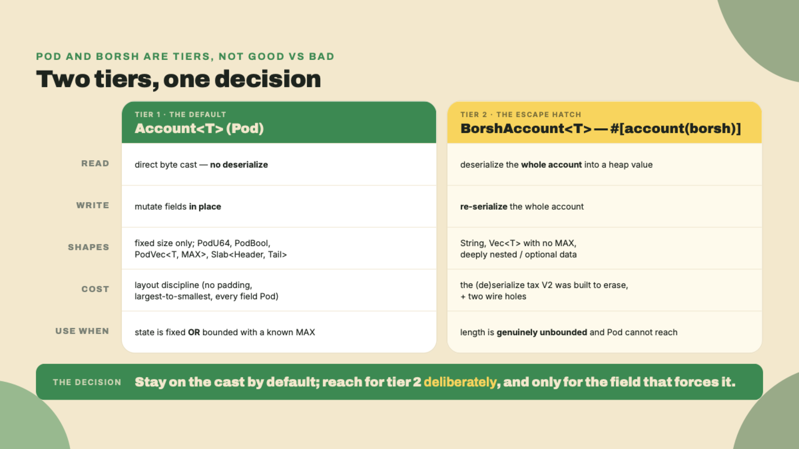
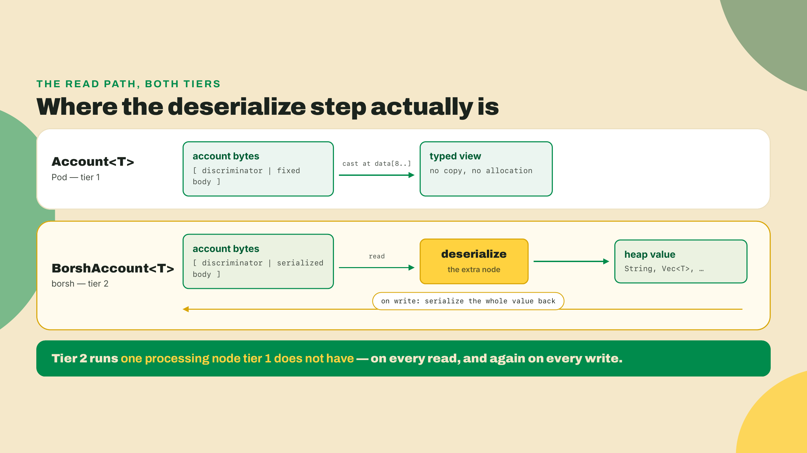
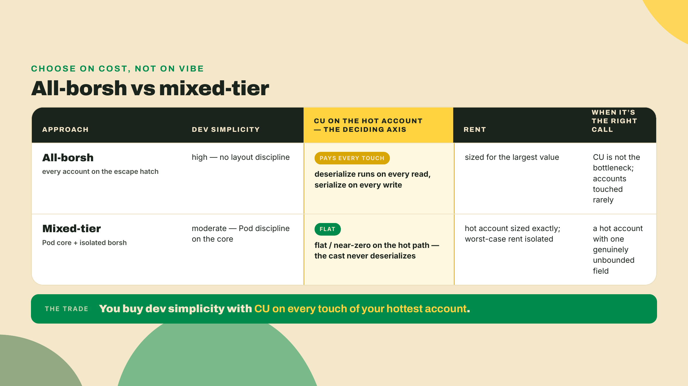
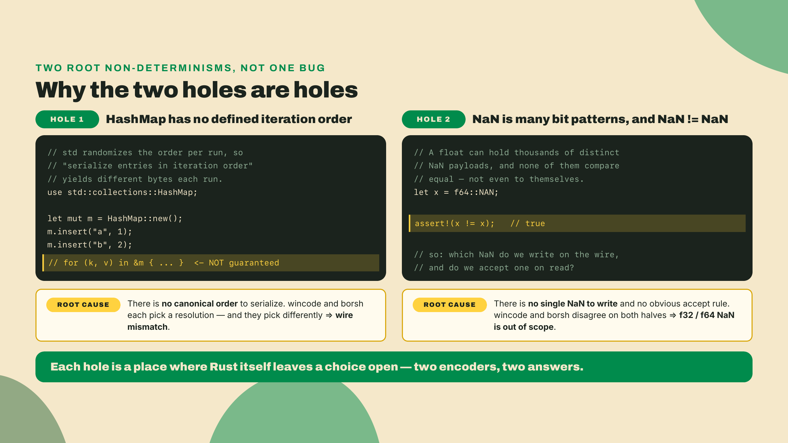
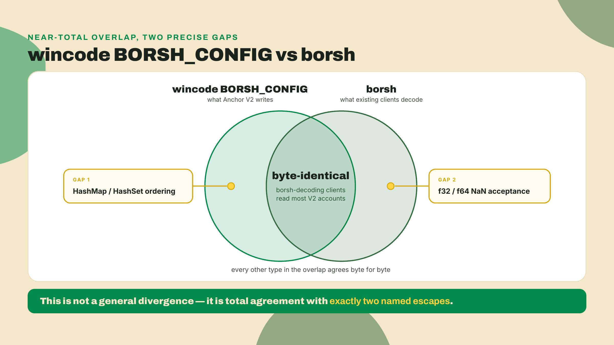
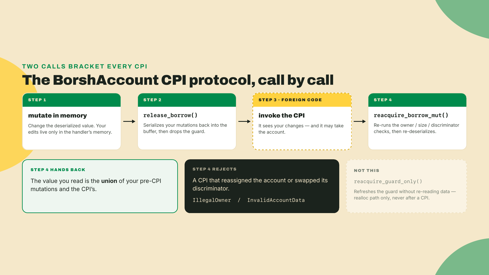
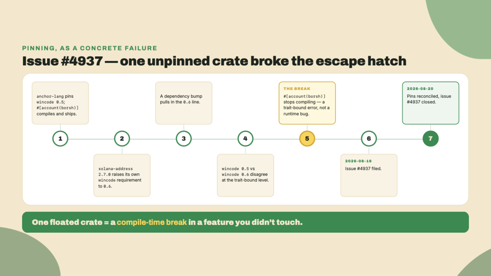
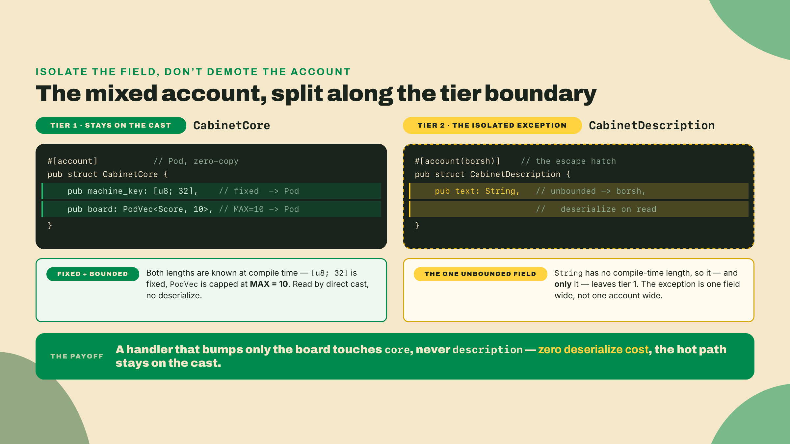
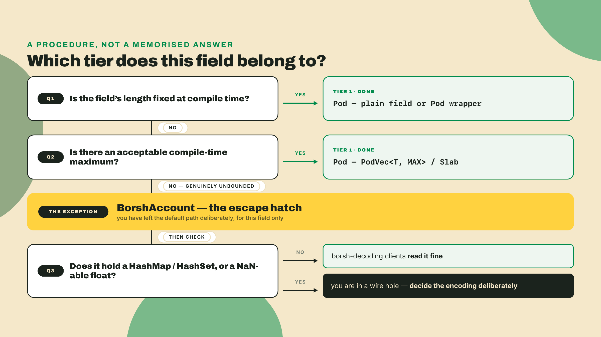

# The borsh escape hatch: when Pod isn't enough

Last lesson you gave the cabinet-counter a high-score TABLE. You bolted a `Slab` tail onto R1, pushed scores into it, and watched the account update in place with no whole-list serialization. That worked for one reason and one reason only: every piece of that state was fixed-size. A `PodU64` play count, a `PodU64` high score, a bounded run of `Score` items with a compile-time `MAX`. Fixed size is exactly why the `Slab` could live in the account's own bytes and be read with a cast instead of a deserialize.

So let's break it. Open R1's `Cabinet` header, the four-field one you grew last lesson (`authority`, `play_count`, `high_score`, `bump`), and add one field a real arcade would obviously want, a player-supplied name:

```rust
pub owner_name: String, // <- add this line to Cabinet
```

Build it. It does not compile, and the exact wording will depend on your rustc, but the load-bearing line is always the same trait bound:

```text
error[E0277]: the trait bound `String: bytemuck::Pod` is not satisfied
```

Everything else the compiler prints is pointing at that one fact: `Account<T>` requires `T: Pod`, every field needs a fixed compile-time layout, and a `String` is a heap pointer plus a length rather than a run of bytes. That refusal is the whole lesson. `Pod` bought you speed by banning the one thing half your structs eventually need: variable length. The moment a field is a `String`, or a set with no compile-time maximum, the direct byte cast is a lie, because there are no fixed bytes to cast. Anchor V2 knows this, and it keeps exactly one wrapper for the case where `Pod` genuinely cannot reach. This lesson is about that wrapper, when to reach for it, and the two sharp edges you inherit the moment you do.

The fade this time runs on judgment rather than code, because the deliverable is a design decision, not a build. I model one mixed account in full so you see the reasoning. In the Lab you call each field's tier before I do, one line at a time, and check yourself against mine. Then in the challenge you take a different account cold, resolve the ambiguous field in it yourself, and justify every choice in one sentence with nothing to check against. Worked, then completion, then solo, same as always.

## The second tier, and why it exists

Start with the honest framing, because it is the thing most people get wrong. The escape hatch is not a defeat. `Pod` is not "the good way" and borsh "the bad way." They are two tiers of a deliberate design, and the skill this lesson trains is knowing which tier a given field belongs to.

Here is the motivating question, the one the `String` error forces on you. You have a field whose length you genuinely cannot know at compile time. What are your options?

Rule out the naive answers first, because ruling them out is what makes the real answer feel necessary instead of arbitrary.

The first naive answer: cap it. Store the name as a `PodVec<u8, 64>`, treat it as at most sixty-four bytes, and stay on the zero-copy path. This is not wrong. If a sixty-four-byte ceiling is acceptable, this is the *correct* answer, and you should take it. But read the requirement again. The field is specified as arbitrary-length. A `PodVec` is bounded by definition, so the instant "arbitrary" is a real constraint and not a hedge, the cap is a spec violation wearing a green checkmark. The cap is the right tool for a *bounded* field mislabeled as unbounded, and the wrong tool for a genuinely unbounded one.

The second naive answer: don't store it at all. Hash the name, keep the 32-byte digest on-chain as a `[u8; 32]` (which *is* `Pod`), and stash the real string somewhere off-chain. For the right problem, this is a perfectly good design. But now you cannot render the name from the account, you have added an off-chain dependency and a lookup, and you have quietly changed what the account *is*. If the program actually needs the bytes on-chain, this answer solved a different problem than the one you have.

So the real question narrows to this: how do you put a genuinely variable-length value inside an account when a fixed cast is impossible and you cannot afford to move the data off-chain?



## What the wrapper actually is

Anchor V2's answer is the `#[account(borsh)]` attribute paired with the `BorshAccount<T>` wrapper. The attribute goes on the struct, and it does exactly one thing: it opts that type out of the `T: Pod` requirement and into a deserialize-on-read model. The wrapper goes on the account in your `#[derive(Accounts)]` context, in the slot where you would otherwise write `Account<T>`.

```rust
// A type that CANNOT be Pod, and doesn't try to be.
#[account(borsh)]
pub struct CabinetProfile {
    pub owner: Address,
    pub description: String, // variable length - the whole reason we're here
}

#[derive(Accounts)]
pub struct EditProfile {
    #[account(mut)]
    pub profile: BorshAccount<CabinetProfile>, // deserializes on read
    pub owner: Signer,
}
```

Notice what `BorshAccount<CabinetProfile>` is doing that `Account<Cabinet>` never did. When your handler touches `profile.description`, the wrapper does not hand you a view over the raw bytes. It reads the account's data and *deserializes the whole thing* into a heap-allocated Rust value, `String` and all. When you write, it re-serializes the whole value back. That is the precise thing zero-copy was built to avoid, and here you are choosing it on purpose, because the alternative is not having the field at all.



Be honest about *how much* it costs, because the answer is not a single number, and treating it as one is how people either panic or get complacent. Separate the average case from the worst case. On a tiny borsh struct, a single `Address` and a ten-character name, the deserialize is cheap in absolute terms; you would struggle to measure it against the rest of a handler. That is the average case, and it is why "borsh is slow" is too blunt to be useful. The worst case is the one that bites: the deserialize cost scales with the size of the data, so a `BorshAccount` holding a four-kilobyte description pays a four-kilobyte deserialize in every instruction that loads it, and a four-kilobyte re-serialize on exit when it was writable. A `Pod` cast does not care whether the account is fifty bytes or four kilobytes; it reads the field you asked for and stops. So the honest framing is not "borsh is slow" but "borsh's cost is proportional to the whole account's size and paid on every access, while Pod's is flat and near-zero." That proportionality is exactly why you isolate the big variable field instead of merging it into the account you touch constantly.

Say the trade-off out loud, because naming it is the credibility move and skipping it is how people ship the wrong tier. `BorshAccount` buys you variable length and easy nested or optional data. You pay it back in the (de)serialization cost that V2's whole thesis was built to eliminate, and, as we're about to see, in two documented wire incompatibilities. It earns its place *only* where `Pod` genuinely cannot reach. The corollary is the part people miss: a *mixed* account, one with some fixed fields and one unbounded field, should not go all-borsh. It should keep its fixed and bounded parts in `Pod` and isolate the unbounded part. More on that in the lab, because that is the actual design skill.

## Compared to what? The all-borsh temptation

Before we go further, steelman the position I just argued against, because it is a genuinely reasonable one and you will feel its pull. The argument goes: `Pod` is a pain. Layout discipline, no padding, largest-to-smallest field ordering, `Pod` wrappers on every field, the whole tax you spent module 2 learning to pay. `BorshAccount` makes all of that disappear. Put a `String`, a `Vec`, an `Option`, whatever you want in a struct, derive the serializer, and get on with your life. Why not just make every account `BorshAccount` and stop fighting the byte layout?

Grant the valid part, because it is real. For a program where CU is not the bottleneck, where accounts are touched rarely and the data is genuinely irregular, all-borsh *is* simpler, and simpler code has fewer bugs. I have shipped the all-borsh version of a program. It is fine, right up until it isn't. So the argument is not stupid. It is a real trade, and on the simplicity axis borsh wins.

Now refine it, because the axis that argument optimizes is not the axis V2 was built on. Compared to what? Compared to `Account<T>`, whose entire reason for existing is that the v1 default deserialize was, in the framework's own words from issue #4390, "the slow path" and "the number-one performance complaint from Anchor developers." Choosing all-borsh is choosing to reintroduce, on every account, the exact cost the whole rewrite set out to erase. On an account you touch once a month, who cares. On the hot account in a program that runs thousands of times a slot, you just paid the framework's marquee optimization back in full, on data that mostly did not need it. The simplicity was real; it was also priced in CU, and you did not read the receipt. That is what "compared to what?" buys you: it turns "borsh is simpler" from a verdict into a trade with a named cost, and the cost is exactly the thing this course exists to teach you to see.



## The wire story: wincode, and two holes

Now the part that bites in production, and the reason this lesson exists in a framework course rather than a footnote.

V2's default serializer is not classic borsh. It is called `wincode`, and its `BORSH_CONFIG` is byte-identical to borsh, with two documented exceptions. That "byte-identical, except" is the whole story, so let's be precise about both halves.

Start with the question the design had to answer, because the answer is not obvious. V2 is a ground-up rewrite. It could have shipped any wire format it wanted. There is an entire ecosystem of tooling out there, indexers, explorers, off-chain readers, that already speaks borsh, because borsh was the Anchor wire for years. So the design question was: do you fork the wire format and force every one of those consumers to rewrite their decoders, or do you stay compatible and inherit the ecosystem for free? Stated that way, the answer picks itself. wincode keeps the borsh byte layout precisely so that the existing decoders keep working. Adopting V2 does not fork the wire. That is a deliberate compatibility gift, and most of the time you get to enjoy it without thinking.

You have already met this serializer, by the way. Last lesson, when you emitted a `#[event(bytemuck)]` and I noted that a plain `#[event]` serializes with wincode under a borsh-identical config, that plain-event wire is this exact serializer. The default event, the default account body, the same serializer underneath. So the compatibility story is not two stories: the reason a borsh-reading indexer can parse your V2 events is the same reason it can parse your `BorshAccount` bytes. One wire format, borsh-compatible except in two places, used for both. That is worth holding onto, because it means the two holes below apply to your events too, not just your accounts.

So why is it "byte-identical *except*" and not just "byte-identical"? Because there are exactly two places where borsh's own behavior is not deterministic to begin with, and a serializer that wants deterministic output has to make a choice there, and wincode made a different choice than classic borsh did. Both holes are about *determinism*, and once you see why each one is non-deterministic in the first place, the rule sticks for good.

The first hole is `HashMap` and `HashSet` field ordering. Here is the root cause: a `HashMap` in Rust has no defined iteration order. The standard library deliberately randomizes it per-run to defend against hash-flooding attacks, so "iterate the map and serialize the entries in that order" is a different byte sequence every run. borsh and wincode resolve that non-determinism differently, so if a field of your borsh account is a `HashMap` and you depend on the order its entries land on the wire, you have non-deterministic bytes: the same logical state can serialize two ways, and a borsh-decoding client reading a wincode-written account can disagree about the order. The account is not corrupt. It just is not order-stable across the two encoders, and anything that hashes or signs over the raw bytes will notice immediately.

The second hole is `f32` and `f64` NaN acceptance. The root cause here is that NaN is not one value. The IEEE-754 float standard defines a whole range of bit patterns that all mean "not a number," and NaN is not even equal to itself. So "serialize this float" is ambiguous the moment the float can be NaN: which NaN bit pattern do you write, and do you even accept one? The two encoders differ on whether they accept a NaN value at all. If your struct carries a float that can be NaN, they can disagree about whether the value is legal on the wire. (Floats in on-chain state are a smell for other reasons, deterministic financial math wants integers and fixed-point, but if you have them, this is a real edge.)



Put the two together and the rule falls out cleanly. A borsh-decoding client can read most wincode accounts, *but not* if you rely on map or set ordering, and *not* if you rely on NaN floats. If neither is true of your struct, and for the overwhelming majority of accounts neither is, the compatibility holds and you can move on. If either is true, you have to decide the encoding story deliberately, because the wire is no longer one thing.

| The two wire holes | What differs | When it bites you |
|---|---|---|
| `HashMap` / `HashSet` ordering | iteration order the entries serialize in | you depend on map order, or you hash/sign over the raw account bytes |
| `f32` / `f64` NaN | whether a NaN value is accepted on the wire | your struct carries a float that can be NaN |



One question this tier raises deserves a straight answer rather than a hand-wave, because getting it wrong is a silent-state bug: how does a `BorshAccount` behave across a CPI?

Here is why the question is sharp and not academic. A `BorshAccount` holds a *deserialized* value, a heap copy of the account's state, not a live view over the bytes. That is the whole point of the tier. But a copy can go stale. If your handler deserializes a borsh account, then invokes a CPI that mutates that same account's bytes on-chain, the heap copy your handler is still holding predates the CPI. With v1's slow-path `Account<T>` this was the classic `.reload()` footgun: fail to reload after a CPI and you reason about pre-CPI state.

One naming note before the protocol, because the type name and the section above can look like they contradict each other. `BorshAccount<T>` is an alias for `SerializedAccount<T, BorshSerializer>`, and `BorshSerializer` is wincode under its `BORSH_CONFIG`. So the name is about the *format*, not the crate: a `BorshAccount` writes borsh-shaped bytes, produced by wincode, which is exactly why the two holes above are the two places the name stops being a promise. With that settled: the type ships an explicit two-call protocol around a CPI. Before the call you use `release_borrow()`, which serializes your in-memory mutations back into the buffer and drops the borrow guard, so the CPI both sees your changes and can take the account. After the call you use `reacquire_borrow_mut()`, which re-runs the full load-time checks (owner, size, discriminator) and *re-deserializes* the value from the live buffer. The framework's own note on what you get back is precise: the refreshed state is the union of your pre-CPI mutations and the CPI's mutations, and a CPI that reassigned the account or swapped its discriminator is rejected with `IllegalOwner` or `InvalidAccountData` rather than silently accepted. There is a third method, `reacquire_guard_only()`, that refreshes the guard without re-reading the data; that one is for the `realloc` path and the docs say so explicitly, so do not reach for it after a CPI.

The contrast with the `Pod` tier is worth holding. For `Account<T>`, V2's `CpiHandle` borrow model turns "you forgot to reload" into a compile error, which you meet head-on later in the course. For `BorshAccount<T>` the discipline is a pair of calls you make on purpose. Both are better than v1's silence, but only one of them is checked for you, which is one more small reason the escape hatch stays an escape hatch. If your design deserializes a borsh account, invokes a CPI that touches it, and then reads the value, still write the LiteSVM test that asserts the *post-CPI* value: the protocol is documented, but your use of it is the thing worth proving.



## Why the pins are not busywork

Time for the module's first war story, because it makes an abstract discipline painfully concrete.

Issue #4937 was filed on 2026-08-16 and closed four days later, on 2026-08-20. The bug: `anchor-lang` pinned `wincode` at 0.5 while `solana-address` 2.7.0 had moved *its own* `wincode` requirement to 0.6. (`solana-address` itself has only ever shipped a 2.x line — there is no `solana-address` 0.6; the version that moved is `wincode`'s, and the two sentences below get it right.) Those two versions disagreed at the trait-bound level, and the disagreement broke `#[account(borsh)]`. Not with a runtime failure, not with a subtle wire bug, but with a compile error, a trait bound that no longer lined up, until the pins were reconciled. Someone bumped a dependency, and the escape hatch you just learned stopped compiling.

This is why you started `PINS.md` back in m01-l2, one table with a `verified` column, and why every pin in these lessons carries a "this will move, re-verify at write" tag. Add a `wincode` row to it now if you have not. V2 is a weeks-old RC, and the ref you are on decides the answer here: `wincode` sits at 0.5 on the published `2.0.0-rc.1` crate and on the `v2.0.0-rc.1` tag, and it has already moved to 0.6 on the `anchor-next` branch tip. Your program crate pins `wincode = "0.5"` by hand, so the tag is the ref that agrees with it — which is exactly why every install block from m02-l1 on pins `--tag v2.0.0-rc.1` rather than the branch. Track the branch instead and the tip's `anchor-lang` demands `solana-address 2.7.0`, your `< 2.7` ceiling refuses, and cargo fails the resolve before a single line compiles. `solana-address` is on its own cadence. You pin all of it together and you do not float any single crate, because #4937 is what floating one crate looks like: a green build on Monday, a trait-bound error on Tuesday, and an afternoon spent bisecting a dependency graph instead of shipping.

The install line itself is not repeated here — this lesson's lab never invokes the toolchain. If you do need to reinstall, use m02-l1's exact block, `--tag v2.0.0-rc.1` and `--locked`: the tag, never the branch.



## Lab: model a mixed account

Here is the design problem, and it is the one you will actually face. The arcade wants a per-cabinet profile account holding three things:

1. A fixed 32-byte machine key, `[u8; 32]`, that never changes length.
2. A top-N leaderboard, at most ten entries, each a `Score`.
3. A free-form description the operator types in, genuinely unbounded.

The lazy move is to see one unbounded field and make the whole account `BorshAccount`. Resist it. That would drop zero-copy on the fixed key and the bounded leaderboard for no reason, paying the deserialize tax on two-thirds of the account that never needed it. The disciplined move is to model each field in the tier it belongs to, and, when one field forces borsh, isolate it.

**Step 1, label each field before you write a line.** Call all three now, out loud or in a comment, before you read the rest of this paragraph; the point is to catch which one you hesitate on. Expected result: three labels, one of which took you longer than the other two. Here are mine. The 32-byte key is fixed size, so it is `Pod`, a plain `[u8; 32]`. The leaderboard is bounded at ten, so it is a `Slab` or a `PodVec<Score, 10>`, still `Pod`, still zero-copy, exactly what you built last lesson. Only the description is unbounded, so only the description forces the escape hatch.

**Step 2, split the account along the tier boundary.** The clean structure keeps the two `Pod` parts together and isolates the borsh part. One reasonable shape: a `Pod` core account for the key and leaderboard, and a *separate* `BorshAccount` for the description, so the hot fixed state stays castable and the cold variable state pays its own tax only when touched.

Two shape decisions in the code below are worth calling out, because both look like they cut against last lesson's rules and neither does. First, the board is a `PodVec` field rather than a `Slab` tail. Last lesson's rule of thumb was that a list which *is* the point of the account gets a Slab tail, and a list hanging off a larger record gets a `PodVec` field. Here the account's point is the core record, key and board together, and a Slab can only have one tail, so the board rides as a field. Second, field order: `[u8; 32]` sits above a much larger `PodVec`, which would break the largest-to-smallest rule if that rule were about size. It is about *alignment*, and both of these are alignment 1, so there is no padding either order can open. Order freely when everything is alignment 1; order deliberately the moment a native scalar shows up.

```rust
// Tier 1: fixed + bounded, stays zero-copy. Read with a cast.
#[account]
#[repr(C)]
pub struct CabinetCore {
    pub machine_key: [u8; 32],       // fixed - Pod
    pub board: PodVec<Score, 10>,    // bounded MAX=10 - Pod
}

// Tier 2: the ONE unbounded field, isolated behind the escape hatch.
#[account(borsh)]
pub struct CabinetDescription {
    pub text: String,                // unbounded - borsh, deserializes on read
}

#[derive(Accounts)]
pub struct EditCabinet {
    #[account(mut)]
    pub core: Account<CabinetCore>,               // cast, no deserialize
    #[account(mut)]
    pub description: BorshAccount<CabinetDescription>, // deserialize on read
    pub operator: Signer,
}
```



**Step 3, read the cost you just chose.** In a handler that only bumps the leaderboard, you touch `core` and never `description`, so you pay zero deserialize cost: the hot path stayed on the cast. Only a handler that edits the text deserializes anything. That is the payoff of splitting along the tier boundary instead of going all-borsh: you scoped the tax to the one field that demanded it. There is a rent angle too, and it cuts the same way. A `Pod` account sizes to its fixed layout exactly, but a borsh account has to be allocated big enough for the largest string you will ever store, so you rent for the worst case. Splitting keeps the worst-case rent isolated to the description account, instead of inflating the account that holds your hot leaderboard.

**Step 4, sanity-check against the two wire holes.** Look at `CabinetDescription`. It is a single `String`, no `HashMap`, no `HashSet`, no float. So both wincode-vs-borsh holes are irrelevant here, and a borsh-decoding client reads it cleanly. That check is the habit: whenever a field goes borsh, ask "does this struct carry a map, a set, or a NaN-able float?" If no, the compatibility holds and you move on. If yes, you owe the encoding a decision.



**Checkpoint.** You should now be able to point at any field in an account and say, in one breath, which tier it belongs to and why: fixed goes `Pod`, bounded-with-a-known-max goes `Pod`, genuinely unbounded goes `BorshAccount`, and a mixed account isolates the unbounded part instead of demoting the whole thing. If you can do that for the three fields above without hesitating, the lab landed.

## Challenge: label and justify

Here is the graded artifact, and it is deliberately a written decision rather than a compile, because the thing being tested is judgment, not syntax. We did the cabinet profile together. This is a different account, and nobody has labelled it for you.

The arcade needs an **operator ledger**: one account per operator, touched on every payout, holding

- `payout_bps`, the operator's cut in basis points,
- `machines`, the addresses of the cabinets this operator runs, with no ceiling written into the spec,
- `settings`, a `HashMap` of per-machine configuration keys to values,
- `support_note`, a free-form note the operator types for the floor staff.

Label each field **Pod** or **BorshAccount**, give exactly **one reason** per choice, and then say which of the borsh fields, if any, needs the wire-hole check and why. The answer shape is four labels, four reasons, one wire-hole sentence, no more. To calibrate the shape without giving you an answer, here is a field that is not on the list: "the cabinet's `machine_key` is Pod because `[u8; 32]` has a length fixed at compile time." One clause of fact, one clause of reason. If a reason of yours runs longer than that, you are probably justifying the wrong tier.

Two of these four are the point. `machines` is the field the flowchart makes you interrogate rather than answer: run Q2 honestly, because "no ceiling written into the spec" is not the same claim as "genuinely unbounded," and which one it turns out to be decides the tier. And this ledger is touched on every payout, which means it is a hot account, so whichever fields land in tier 2 you should also say whether they belong in *this* account at all or in a separate one, the way the lab split the description out.

Write the artifact down; the prompt lives at [operator-ledger/prompt.md](operator-ledger/prompt.md) and my worked reference labeling at [operator-ledger/reference.md](operator-ledger/reference.md). Read the reference only after your own four labels are on paper, and where you disagree with it, the interesting question is not who is right but which of Q1 and Q2 in the flowchart you two answered differently. That disagreement is the whole skill.

## Where this leaves you

You did not learn "borsh is bad." You learned where the two tiers meet, and you can now stand at that seam and place any field on the correct side of it: fixed and bounded state cast straight from bytes for the CU win, genuinely unbounded state isolated behind `BorshAccount<T>`, and the two wincode-vs-borsh wire holes checked whenever the escape hatch comes out. That is the complete on-chain state model this course needed you to own before it could give that state an address.

Because that is next. You can now model any state, fixed, bounded, or unbounded, and pick the right tier for each field. What you cannot yet do is *find* that state deterministically, or say who owns it. The next module gives your accounts an address and an owner: program-derived addresses, canonical bumps precomputed at macro-expansion time, and the full V2 constraint catalog. It opens on the quarter-vault, the prepaid-credit account whose address nobody hands out because the program re-derives it, alone, from the player's key, every single time.
