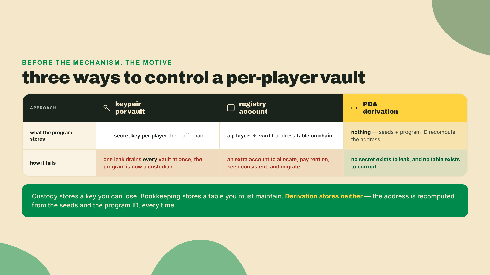
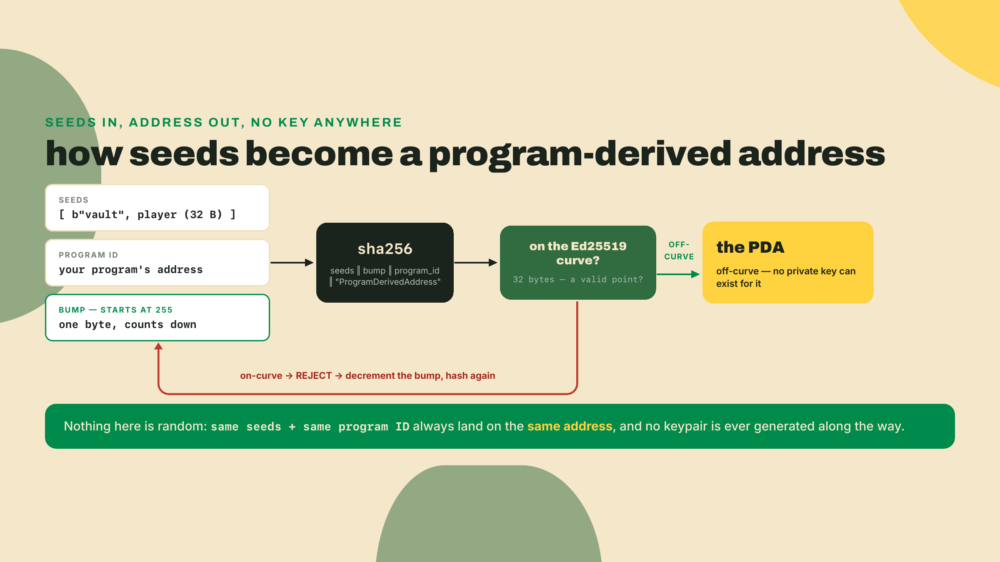
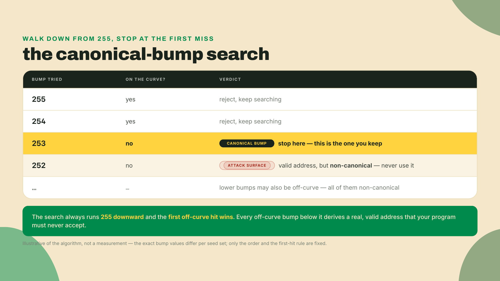
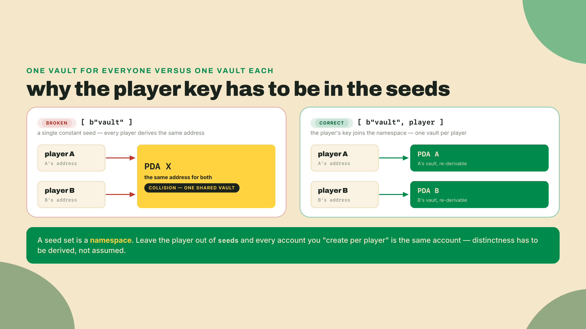
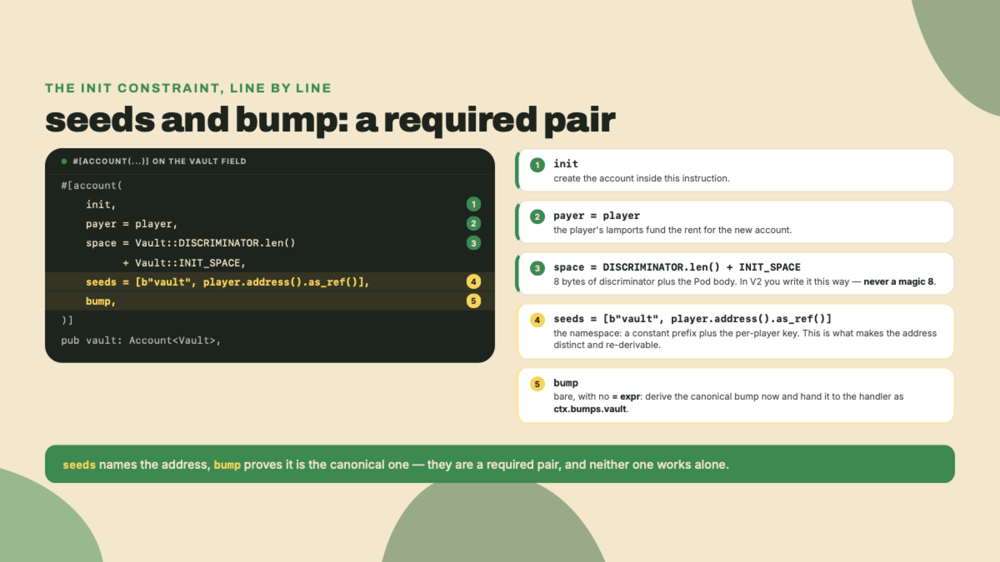
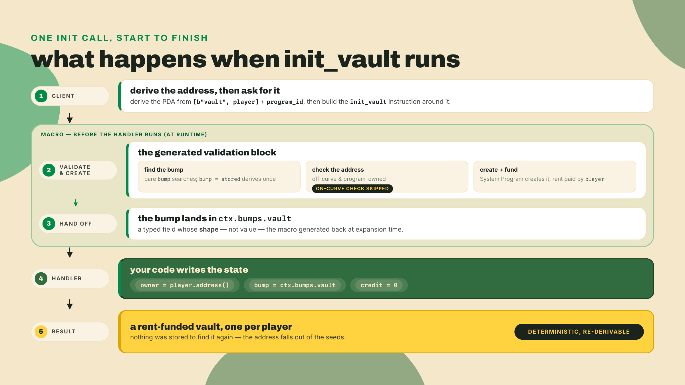

# PDAs and canonical bumps in V2

Last lesson you finished the state model: fixed and bounded fields cast straight from bytes as Pod, genuinely unbounded ones isolated behind `BorshAccount<T>`. You can describe any account this arcade needs. What you cannot yet do is say how the runtime *finds* one, or who gets to touch it.

You have already used the answer without being told its name. The `Cabinet` you built at the start of module 2 carried `seeds = [b"cabinet", player.address().as_ref()]` and a bare `bump`, and I told you outright to copy those two lines and wait. By the end of that module the cabinet had grown an `authority` and a stored `bump` and the seeds had moved to `cabinet.authority`, which you also typed on trust. All of it went by as incantation: type it, and the account appears at an address you never chose. Today the incantation becomes a mechanism you can reason about — and you will see precisely which slice of it V2 actually changed, which is a thinner slice than the ecosystem's blog posts claim.

The arcade needs the full version now. Players are about to prepay for credits, and those credits sit in a per-player vault. You cannot hand each player a keypair for their own vault, because then the *player* controls it, not the program. And you cannot keep a table of "player -> vault address" somewhere, because that table is one more thing to corrupt, migrate, and pay rent on. What you want is an address the program re-derives from scratch, alone, from the player's key, every time, forever.

That is the entire reason program-derived addresses exist. Before the why, confirm the toolchain that will be generating your bumps is the V2 one. You installed this back in m01-l2, so this is a re-pin check, not a fresh install:

```bash
anchor --version   # must report a 2.0.0 RC line, not 1.x
# If it reports 1.x or nothing, re-pin. avm (the Anchor Version Manager) cannot
# install the V2 RC: it downloads a prebuilt binary from a published GitHub
# release, and no release was cut for the v2 tag, so the fetch 404s;
# so the documented channel is a cargo git install, pinned to the RC's tag:
cargo install --git https://github.com/otter-sec/anchor.git --tag v2.0.0-rc.1 anchor-cli --locked --force
# macOS, if the build trips on LTO: prefix that line with CARGO_PROFILE_RELEASE_LTO=off
```

A freshness note before you lean on that pin: Anchor V2 is at `2.0.0-rc.1` as I write this, published to crates.io on 2026-08-12. It is a *release candidate*, which means the API can still shift between RCs. Note what "pin" means here, because the two halves come from different places on purpose. The CLI is a git install pinned to `v2.0.0-rc.1`, a tag, which is a fixed point rather than a branch tip that moves; m01-l2 installed off the `anchor-next` branch itself because the channel was that lesson's subject, and everything after it pins the tag. The library in the `Cargo.toml` you write in step 1 is the crates.io version, `anchor-lang = "2.0.0-rc.1"`, which is stronger still, because the registry forbids republishing a version. If you want to name the toolchain even more precisely, the tag resolves to commit `e4878b6d`, and m08-l2's verify Dockerfile pins exactly that. Either way, re-check the tag before you start a session. The MSRV is Rust 1.89.0, so make sure your `rustc` clears that too.

## Summary

Here is the whole lesson as a findings index, each line a conclusion you can act on:

- A PDA is a program-owned account whose address is derived deterministically from **seeds plus the program ID**, and which deliberately falls **off** the Ed25519 curve so no private key can ever sign for it.
- The **bump** is the extra byte that shoves a would-be on-curve point off the curve. The **canonical** bump is the first one (searching downward from 255) that lands off-curve. There is exactly one, and it is the only one you should ever use.
- The canonical bump reaches you through a **typed `bumps` struct the macro generates at expansion time**, read as `ctx.bumps.vault` — and that is *baseline*, not a V2 delta: Anchor 0.29 replaced the ancient string-keyed `ctx.bumps.get("vault").unwrap()` map two majors ago, and the 1.x line reads `ctx.bumps.vault` exactly as V2 does. V2's actual bump news is narrower: when every seed is a compile-time literal, the canonical bump is precomputed at macro time as a const. Seeds that include a runtime value, like this vault's player key, still derive during validation on either line.
- For a program-owned PDA, V2 **skips the on-curve check**, a project-reported saving of roughly 1,000 CU per verify (Anchor V2 changelog). Re-measure it against your own build.
- You **persist the canonical bump** in the account at init, so later instructions re-derive the same address with `bump = vault.bump` and never pay for a runtime search.
- The **seed scheme is the security boundary**. A missing or user-controlled seed is a collision or spoofing bug, not a style nit.

The autonomy fade for today: in the Lab I hand you every line of the quarter-vault. In the completion problem I pull the `seeds` array and the `bump` binding back out and you refill them. In the solo challenge you get a spec and a seed shape, and you write the handler, the derive struct and the test with no code in front of you.

## How a program owns an address it never held

Start with the thing a PDA is defined against, because the contrast does most of the teaching. A normal Solana account has a keypair: a private key and the public key derived from it. The public key is a point on the Ed25519 curve, and the private key is what lets you sign. Own the private key, own the account.

A program-derived address is the deliberate opposite. You take some **seeds** (arbitrary byte slices you choose) and the program's own ID, hash them together, and check whether the result lands on the curve. If it does, that address *could* have a matching private key out there, which is exactly what you do not want for an account your program must control unilaterally. So you reject it and try again with one small tweak, until you get an address that provably has no private key. That is an off-curve address, and it is the whole trick: a program can be granted authority to sign for an off-curve address precisely *because* no keypair can.

The seeds are the input you design. The program ID scopes the derivation to your program (another program with different code cannot derive into your namespace). The output is a 32-byte address that is a pure function of those inputs.



Contrast that with the two things a program could do instead, because the comparison is what makes PDAs click. It could generate a keypair per vault and stash the secret somewhere, which means the program is now the custodian of thousands of secrets and a single leak drains everyone at once. Or it could keep a registry account mapping each player to their vault's address, which means one more account to allocate, pay rent on, keep consistent under concurrency, and migrate every time the schema shifts. The PDA collapses both of those problems into arithmetic. There is no secret to leak because there is no secret, and there is no registry to corrupt because the mapping *is* the derivation. The program re-computes any vault's address on demand from inputs it already holds.



### The bump, and why only one of them counts

That "one small tweak" is the bump. It is a single byte appended to your seeds before hashing. The derivation starts at bump `255` and walks downward: `255`, `254`, `253`, and so on. At each value it hashes and checks the curve. Statistically about half of all candidate points land off-curve, so you almost always succeed within the first few tries. The **first** bump that produces an off-curve address is the **canonical bump**, and by convention it is the only valid one.

It helps to picture what "off the curve" actually means. Ed25519 is a specific elliptic curve, and a valid public key is a point that sits on it. Roughly half of all 32-byte values are valid curve points and half are not. A normal wallet key is, by construction, one of the points *on* the curve, because it was generated from a private scalar that lives at that point. A PDA is the reverse: you keep hashing until you land on one of the values that is *not* a point on the curve, which is exactly the set of addresses no private key can ever produce. Take a concrete player, Ana, whose address is `An4...k2`. The runtime hashes `[b"vault", An4...k2, 255, program_id]` and, say, lands on the curve. Reject, drop to `254`, hash again, still on-curve, reject, drop to `253`, and this time the point is off-curve. So `253` is Ana's canonical bump, the resulting 32 bytes are Ana's vault, and both are a pure function of her key and nothing else. Run the identical derivation next week, next year, from a cold machine holding no state at all, and you get the same address every time. That permanence is not a side effect. It is the whole feature.

Why does "only one counts" matter so much? Because other bumps further down the list might *also* produce off-curve addresses. Those are real, derivable PDAs for the same seeds. If your program accepts any bump the caller hands it, an attacker can present a *different*, non-canonical PDA for the same logical vault, seed it with their own state, and slip it past a check that only verified "is this a valid PDA for these seeds." That is the account-substitution family of bugs. The defense is dead simple: always use the canonical bump, and never trust a bump that arrived as untrusted input.



### The typed `bumps` struct — a recap, and the delta V2 actually adds

First, credit where it belongs, because misattributing this is the mistake half the ecosystem's migration posts make. In *old* Anchor — 0.28 and earlier — the macro found the canonical bump during account validation and dropped it into a string-keyed map. You fished it back out with `ctx.bumps.get("vault").unwrap()`. Two things about that line aged badly. First, `"vault"` is a string, so a typo compiles fine and blows up at runtime. Second, `.get(...)` returns an `Option`, so you `.unwrap()` a value the compiler cannot prove exists.

Anchor 0.29 killed that mechanism — two majors before V2 existed. Ever since, `#[derive(Accounts)]` has generated, at expansion time, a typed `bumps` struct with one field per PDA account in your derive, read as a field: `ctx.bumps.vault`. No string, no `Option`, no `.unwrap()`. Mistype the field name and the program does not compile. On the 1.x baseline this course measures V2 against, `ctx.bumps.get("vault")` is not "the old way" — it does not build at all. So when you read `ctx.bumps.vault` in the code below, you are looking at continuity, not change: the RC keeps the typed struct exactly as 1.x has it.

What V2 *does* add sits underneath, and it is worth being precise because this is the sentence people get wrong. When a PDA's seeds are all compile-time byte literals, the V2 macro precomputes the canonical bump at expansion time as a const, and validation never searches at all. That optimization cannot apply to this vault: your seeds include `player.address()`, and no compiler knows which player will call, so the framework falls back to deriving during validation, exactly as 1.x does. Which means the CU story here is entirely about which constraint you write, on either line. Bare `bump` runs the search. `bump = vault.bump` runs one derivation against a value you already stored. That difference is the compute; the typed struct is the type safety, and you had both before V2.

If you are porting a 1.x program, the bump line is the one that *doesn't* change: `let bump = ctx.bumps.vault;` reads identically on both sides. The mechanical rewrite lives elsewhere, and it is worth doing by hand once so it lodges in muscle memory. Every seed constraint that read `player.key().as_ref()` becomes `player.address().as_ref()`, since `Pubkey` is now `Address` and `.key()` is now `.address()`. The handler signature loses its `<'info>` lifetime and gains a `&mut`, so `pub fn init(ctx: Context<Init>)` becomes `pub fn init(ctx: &mut Context<Init>)`. The account types shed their lifetimes too, so `Account<'info, Vault>` collapses to `Account<Vault>`. None of that is cosmetic; each edit hands the compiler a guarantee it did not have before. (If the snippet you inherit is truly ancient — 0.28-era, string map and all — then `ctx.bumps.get("vault").unwrap()` does become `ctx.bumps.vault`, but that is a 0.29 migration you are back-paying, not a V2 one.)


There is a second saving hiding under the same rewrite, and it is worth naming precisely because it is easy to overstate. For an account your *own program owns*, V2 skips the on-curve check that a general address verification would run. The Anchor V2 changelog reports this as roughly 1,000 CU saved per verify. Treat that as a project-reported figure, not a law of nature: measure it against your own build, and re-check it when you bump the RC, because compute numbers drift between release candidates. The reasoning behind the skip is clean, which is why it is safe. If the address was derived by your program from seeds and a bump, and you are treating it as program-owned, then whether it happens to sit on the curve is information you do not need. You already know it is yours. Paying compute to re-answer a question you have already answered is the kind of waste a ground-up rewrite exists to delete.


Where did this come from? It is not a one-off optimization someone bolted on. Anchor V2 is a ground-up `no_std` rewrite built on pinocchio, the minimal zero-dependency account framework, described that way in the lang-v2 crate itself as of 2026-08. The same rewrite that made const-folded bumps possible is the one flagged in the `#4390` "zero-copy by default" manifesto (otter-sec/anchor#4390), which reframes the old borsh-deserialized `Account<T>` as *the slow path* and pushes zero-copy to the default. Const bumps and on-curve skips are only on the table because someone tore the framework down to the studs. That is the color worth carrying into the Lab: the Pod struct you built in module 2 is not a special case anymore. In V2 it is the grain of the wood.

### The custody decision, said out loud

One scoping note before code, because it will bite you later if it stays implicit. The quarter-vault you are about to build holds **native SOL**, as lamports, directly in the account. Not tokens. Credits are quarters, quarters are lamports, for now. That keeps this lesson about PDAs and nothing else. The SPL upgrade, where the vault graduates to holding an actual token balance, lands in module 5. If you find yourself reaching for a token account today, stop: that is a later lesson wearing this lesson's clothes.

And the trade-off, stated plainly because it is the honest part. PDAs give you deterministic addressing with no keypair to guard and no lookup table to maintain. What you pay for that is *seed-design responsibility, forever*. The seed scheme is not a naming convention, it is the namespace and the access-control boundary at once. Get it right and every player has an isolated, re-derivable vault. Get it lazy, and you have a collision bug that no amount of later code can paper over.



Three ways this bites, named now so you recognize them before they cost you anything. First, re-deriving the bump at runtime. If a later handler calls `find_program_address` to "get a fresh bump," you have reintroduced the exact search a stored bump was built to delete, and you pay for it on every single call. Put a number on it: Solana's constants reference prices one PDA derivation syscall at **1,500 CU** (`create_program_address_units`). Validating against a stored bump costs exactly one of those. `find_program_address` pays one *per bump it tries* before it lands off-curve, walking 255 downward, so the bill is 1,500 CU times however many candidates the seeds happen to need. Re-measure on your own build, but the direction is not in question: every avoided attempt is another 1,500 CU you keep, which is why you persist the bump. Second, a player-controlled or under-specified seed. Anything a caller can influence in the seed set is a lever they can pull to steer a derivation onto an account that is not theirs, or onto a shared account that should have been isolated per player. The fix is to bind identity into the seeds, which is exactly what the player address does. Third, and this is the subtle one, treating the on-curve-skip saving as a fixed number you can budget against. It is a project-reported figure from a release candidate. Design as if it might read 800 CU or 1,200 next month, because it might.

## Lab: build R2, the quarter-vault

You are building `quarter_vault`, an Anchor V2 program with one job: create a per-player PDA vault, store the owner, the canonical bump, and a zero credit balance, and expose a read path. A LiteSVM Rust test will prove the PDA is derivable and the state reads back. The `verify` bar for this artifact is one passing test: the vault derives from `[b"vault", player]`, initializes, and reads back.

**1. Scaffold and pin the toolchain.** From an empty directory:

```bash
anchor init quarter-vault   # the default test template is LiteSVM (Rust tests)
cd quarter-vault
```

Open the program's `Cargo.toml` and confirm the dependency rides the same V2 release as the CLI. The scaffold writes a git row tracking the `anchor-next` branch; replace it with the crates.io version, the same edit m01-l2 walked through. The CLI is a git install and the library is a registry version, and that is not skew — they are separate dependency graphs naming the same release, and the registry version is the one that cannot move under you:

```toml
[dependencies]
anchor-lang = "2.0.0-rc.1"     # crates.io; the branch tip wants solana-address 2.7.0
# The pins from m01-l2 — every program crate in this course carries them (issue #4937's class).
wincode = { version = "0.5", features = ["derive"] }
# The arcade-workspace row from m02-l1, verbatim: a ceiling, not an equality. One
# workspace resolves one solana-address, and module 6's Mollusk dev-dep needs ^2.6.1.
solana-address = ">=2.6.1, <2.7"
```

Expected after this step: `anchor build` succeeds on the untouched template and `target/deploy/quarter_vault.so` exists. If the build fails here, it is a toolchain problem, not a PDA problem, and fixing it now saves you from debugging the wrong layer in step 5.

**2. Define the vault state.** This is the Pod struct, the same shape you know from module 2, now destined for a program-derived address. Put it in `programs/quarter-vault/src/lib.rs`. Note the field types: in V2, `Pubkey` is `Address`.

```rust
use anchor_lang::prelude::*;

// Leave the id `anchor init` generated here. It matches the keypair in
// target/deploy/, and a hand-typed string gives you an id the deploy cannot
// sign for. `anchor keys sync` re-aligns them if they ever drift.
declare_id!("<your generated program id>");

#[account]
#[repr(C)]
#[derive(InitSpace)]
pub struct Vault {
    pub owner: Address,  // 32 bytes: the player who owns this vault
    pub credit: u64,     //  8 bytes: prepaid credit, native lamports for now
    pub bump: u8,        //  1 byte: the canonical bump, persisted for reuse
    pub _pad: [u8; 7],   //  7 bytes: explicit tail padding, zeroed, never read
}
```

Expected after this step: `anchor build` still succeeds. The struct compiles on its own, before any constraint refers to it, which is the cheapest possible place to catch a field-type mistake.

That `_pad` field is module 2's discipline arriving on a real account, so do not delete it. `credit` is a native `u64`, which carries an 8-byte alignment, so Rust rounds the whole struct up to a multiple of 8: 41 bytes of fields become 48 bytes of layout, and those seven bytes exist whether or not you name them. Nameless, they are implicit padding and the Pod bound rejects the struct. Named and zeroed, they are a field like any other and the cast is sound. Write the padding you are already paying for.

`#[derive(InitSpace)]` computes the account's data size for you, so you never hand-count. Storing `bump` on the account is the discipline the whole lesson turns on: you compute the canonical bump exactly once, at init, and reuse the stored value everywhere after.

One V2 detail rides along in the `space` line you are about to write. V1 taught you to add a magic `8` for the account discriminator, the tag Anchor writes at the front of every account so it can tell a `Vault` from a `Config` when it reads raw bytes. V2 stops you hardcoding that: you write `Vault::DISCRIMINATOR.len() + Vault::INIT_SPACE`, and if the discriminator scheme ever changes under you, your space math changes with it instead of silently going wrong. (V2 will even infer the whole `space` line from the wrapper's `INIT_SPACE` if you omit it; an explicit `space =` is still accepted, and writing it out once is worth the practice of seeing where the number comes from.) It is the same instinct as the bump moving to a const. Stop hand-carrying numbers the framework is willing to hand you.



**3. Write the derive struct and the init handler.** V2 handlers take `&mut Context<T>` and the accounts struct carries no `<'info>` lifetime. Both are consequences of the pinocchio rewrite. Add this to `lib.rs`:

```rust
#[program]
pub mod quarter_vault {
    use super::*;

    pub fn init_vault(ctx: &mut Context<InitVault>) -> Result<()> {
        let vault = &mut ctx.accounts.vault;
        vault.owner = *ctx.accounts.player.address();
        vault.bump = ctx.bumps.vault; // canonical bump, read as a field off the typed bumps struct
        vault.credit = 0;
        Ok(())
    }

    pub fn read_vault(ctx: &mut Context<ReadVault>) -> Result<()> {
        let vault = &ctx.accounts.vault;
        msg!("vault credit={} bump={}", vault.credit, vault.bump);
        Ok(())
    }
}

#[derive(Accounts)]
pub struct InitVault {
    #[account(mut)]
    pub player: Signer,
    #[account(
        init,
        payer = player,
        space = Vault::DISCRIMINATOR.len() + Vault::INIT_SPACE,
        seeds = [b"vault", player.address().as_ref()],
        bump,
    )]
    pub vault: Account<Vault>,
    pub system_program: Program<System>,
}

#[derive(Accounts)]
pub struct ReadVault {
    pub player: Signer,
    #[account(
        seeds = [b"vault", player.address().as_ref()],
        bump = vault.bump, // reuse the STORED bump, no runtime search
    )]
    pub vault: Account<Vault>,
}
```

Expected after this step: `anchor build` compiles both handlers and both derive structs. Be precise about which typo this step catches, because only one of the two is a build error. Mistype the *field* on the bumps struct — `ctx.bumps.valut` — and the compiler rejects it, because the derive generated a struct with one field per PDA account and there is no such field. Mistype the *seed content* — `b"valt"` for `b"vault"` — and it compiles perfectly, because one byte string is as valid as another; that one fails at runtime as a seeds-constraint violation, which is exactly the failure step 5 has you read. The typed bumps struct shifts the first typo left. It has nothing to say about the second.

Look hard at the difference between the two `bump` lines, because it is the point of the whole build. In `InitVault` you write bare `bump`, which tells the macro to find the canonical bump and hand it to you through `ctx.bumps.vault`. In `ReadVault` you write `bump = vault.bump`, which tells the macro to skip the search entirely and validate against the value you already stored. The first is compute you pay once. The second is compute you never pay again.



**4. Write the LiteSVM test.** LiteSVM runs the program in-process, no validator, so the loop is fast. You reach it through `anchor-v2-testing`, the harness the V2 scaffold generates against, and **not** through a direct `litesvm` dependency:

```toml
# One row, not three. anchor-v2-testing wraps LiteSVM and re-exports the pieces a
# test file needs, so the SVM version is the harness's problem and not yours. At tag
# v2.0.0-rc.1 it carries litesvm 0.11.0; crates.io is already at 0.15.2, and the
# anchor-next branch tip has moved it to 0.13.1. Name litesvm yourself and you are
# choosing one of those against a harness that expects another — two SVM versions in
# one graph, failing in a way that reads like your test is wrong.
[dev-dependencies]
anchor-v2-testing = { git = "https://github.com/otter-sec/anchor.git", tag = "v2.0.0-rc.1" }
bytemuck = "1.25"     # to cast the account bytes back to the Pod state
```

Then the test itself, in `tests/quarter_vault.rs`. It derives the PDA the same way the program does, sends `init_vault`, and reads the raw account back to assert the stored state. Note where each import comes from: the instruction plumbing rides `anchor_lang`, the signing and SVM plumbing rides `anchor_v2_testing`, and nothing reaches past either one:

```rust
use anchor_lang::{
    prelude::Address, programs::System, solana_program::instruction::Instruction, Id,
    InstructionData, ToAccountMetas,
};
use anchor_v2_testing::{Keypair, Message, Signer, VersionedMessage, VersionedTransaction};
use bytemuck::from_bytes;

#[test]
fn quarter_vault_pda_derives_and_reads_back() {
    // `svm()` is LiteSVM::new() plus the profiling hook `anchor test --profile` turns on.
    let mut svm = anchor_v2_testing::svm();
    let program_id = quarter_vault::ID;
    // cargo runs a test binary with its working directory at the package root, so a bare
    // "target/deploy/..." would resolve inside programs/quarter-vault/ and miss. Anchor the
    // path on the crate instead: the artifact lives in the workspace target dir, two up.
    let vault_so = concat!(env!("CARGO_MANIFEST_DIR"), "/../../target/deploy/quarter_vault.so");
    svm.add_program_from_file(program_id, vault_so).unwrap();

    // A player who will pay rent and own the vault.
    let player = Keypair::new();
    svm.airdrop(&player.pubkey(), 1_000_000_000).unwrap();

    // Derive the PDA exactly as the program does: [b"vault", player].
    let (vault_pda, expected_bump) =
        Address::find_program_address(&[b"vault", player.pubkey().as_ref()], &program_id);

    // Build and send init_vault.
    let ix = Instruction {
        program_id,
        accounts: quarter_vault::accounts::InitVault {
            player: player.pubkey(),
            vault: vault_pda,
            system_program: System::id(),
        }
        .to_account_metas(None),
        data: quarter_vault::instruction::InitVault {}.data(),
    };
    let blockhash = svm.latest_blockhash();
    let msg = Message::new_with_blockhash(&[ix], Some(&player.pubkey()), &blockhash);
    let tx = VersionedTransaction::try_new(VersionedMessage::Legacy(msg), &[&player]).unwrap();
    svm.send_transaction(tx).unwrap();

    // Read the raw account and cast the Pod state - no deserialize step, same as
    // module 2. `from_bytes` wants EXACTLY size_of::<Vault>() bytes, and it wants
    // Vault to be Pod, which is what the `_pad` field bought you. And yes, the
    // discriminator offset is spelled out rather than hardcoded as 8: same rule as
    // the `space =` line, for the same reason.
    let raw = svm.get_account(&vault_pda).unwrap();
    let start = quarter_vault::Vault::DISCRIMINATOR.len();
    let vault: &quarter_vault::Vault =
        from_bytes(&raw.data[start..start + core::mem::size_of::<quarter_vault::Vault>()]);

    assert_eq!(vault.owner, player.pubkey().into()); // owner is the player
    assert_eq!(vault.credit, 0); // credit starts at zero
    assert_eq!(vault.bump, expected_bump); // stored bump IS the canonical bump
}
```

That last assertion is the one that proves the discipline: the bump you stored equals the canonical bump the client derived independently. No runtime re-derivation, same value.

Now exercise the other half. Add a second instruction to the same test, `read_vault`, built the same way from `accounts::ReadVault { player, vault: vault_pda }` and `instruction::ReadVault {}`, and send it after the init. It has no assertion to make beyond succeeding, and that is the point: `read_vault` is the path constrained by `bump = vault.bump`, so a green send is proof the stored bump validates the same address the search found. Leave it out and the one line this lesson exists to teach is never executed.

Expected after this step: the test file compiles (`cargo test --no-run` is enough to check) even before you run it. A mismatch between the account names here and the fields of your derive struct is a compile error, so a clean compile means the client and the program agree on the account list.

**5. Build and run.**

```bash
anchor test
```

Expected output, the single passing test that clears the bar:

```
running 1 test
test quarter_vault_pda_derives_and_reads_back ... ok

test result: ok. 1 passed; 0 failed
```

If instead you see a seeds-constraint failure at the `ReadVault` path, the usual cause is deriving with a different seed order or a different key in the test than in the program. The seeds must match byte for byte on both sides. That is not a bug in Anchor, it is the seed scheme being exactly as strict as it promised to be.

## Challenge

Two rungs, and the scaffold thins out on each.

**Completion.** Open the derive struct you just wrote and blank out two things: replace the `seeds = [...]` array with `seeds = [/* TODO */]` and the `bump` line with `bump, // TODO: canonical or stored?` in both `InitVault` and `ReadVault`. Now refill them from memory. The acceptance check: `init_vault` uses bare `bump` and derives from `[b"vault", player.address().as_ref()]`, while `read_vault` uses `bump = vault.bump` and the *same* seed array. If you reach for `find_program_address` inside a handler, you have taken the wrong path: the macro already did that work.

**Solo.** Give a single player more than one vault. Add a `slot: u8` argument to a new `init_vault_slot` handler and thread it into the seeds so the PDA becomes `[b"vault", player.address().as_ref(), &[slot]]`. You will need `#[instruction(slot: u8)]` on the derive struct so the constraint can see the argument. Prove two things in a LiteSVM test: slot `0` and slot `1` for the same player produce two *distinct* addresses, and calling each a second time re-derives the *same* address it did the first time (so both are stable, re-derivable, and their stored bumps match the value the client derives). Acceptance: both vaults init, both re-derive on a second call, and neither handler re-derives a bump at runtime. One extra credit worth chasing: try to `init_vault` twice for the same seeds and watch the second call fail. That failure is the account-already-exists guard doing its job, and it is the reason a vault cannot be silently re-initialized out from under a player.


When both rungs pass, sit with what you actually proved. Two players get two isolated vaults, one player gets as many slots as they want, every address re-derives to the same 32 bytes forever, and not one of them needed a keypair or a lookup table. You wrote the seed scheme, and the seed scheme *is* the custody model. That is the weight the honest part warned about, and you carried it correctly.

Notice, too, how much the seed scheme already bought you. Because the vault is derived from `player.address()` and `player` has to sign, nobody can init or read a vault that is not theirs: the derivation *is* the access check, for free, with no constraint written. That is worth knowing precisely, because it is the boundary of what seeds can do for you.

And they stop right there. The moment this program grows an arcade *operator*, someone who can adjust credit across every vault, the seed scheme has nothing to say about who that is, and `Signer` proves only that somebody signed, never who. Next lesson you wield the V2 constraint catalog, `address`, `owner`, `constraint`, `close`, `realloc_payer`, and make the derive macro reject the wrong accounts before your handler code runs. The vault gets a bouncer.
