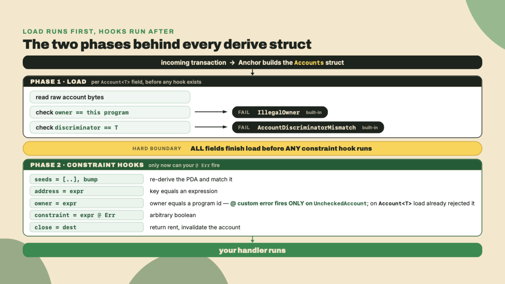
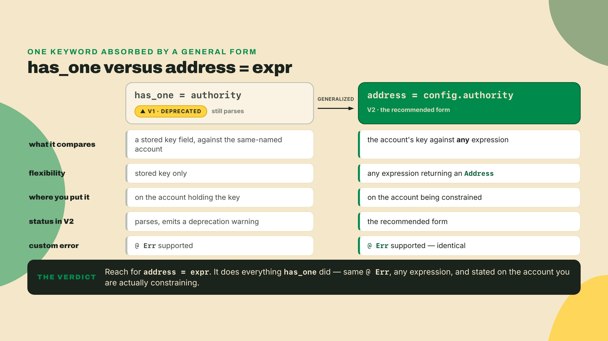
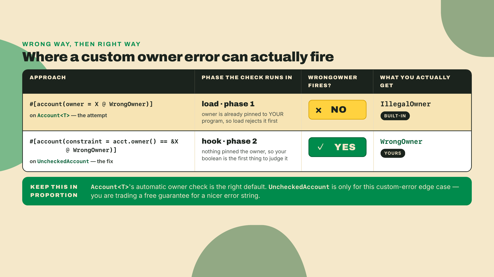
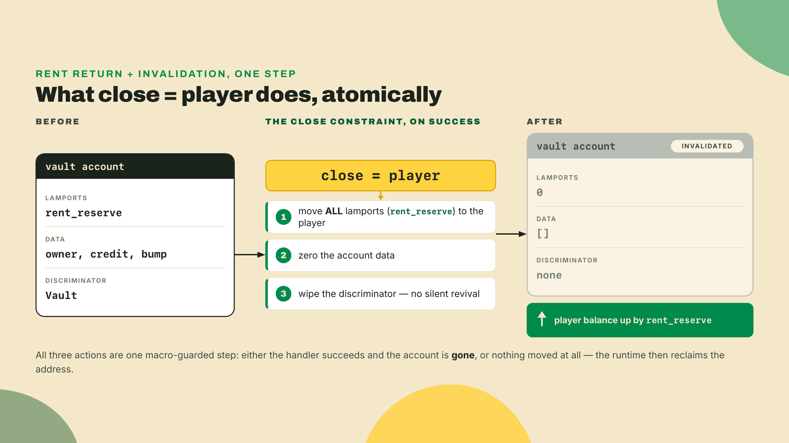
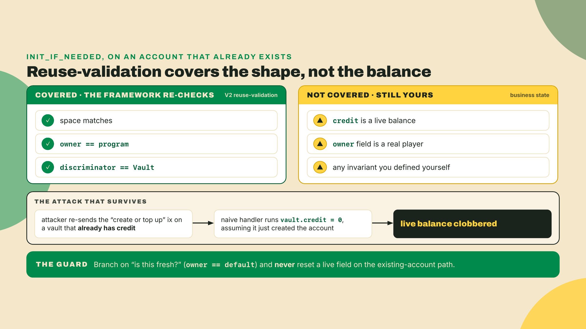
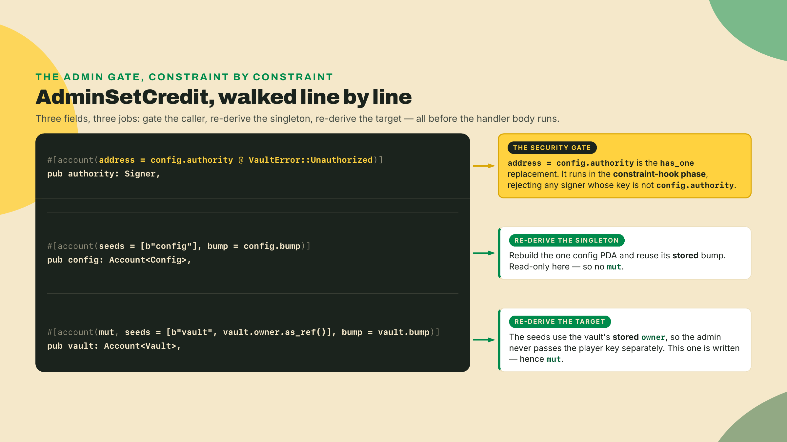
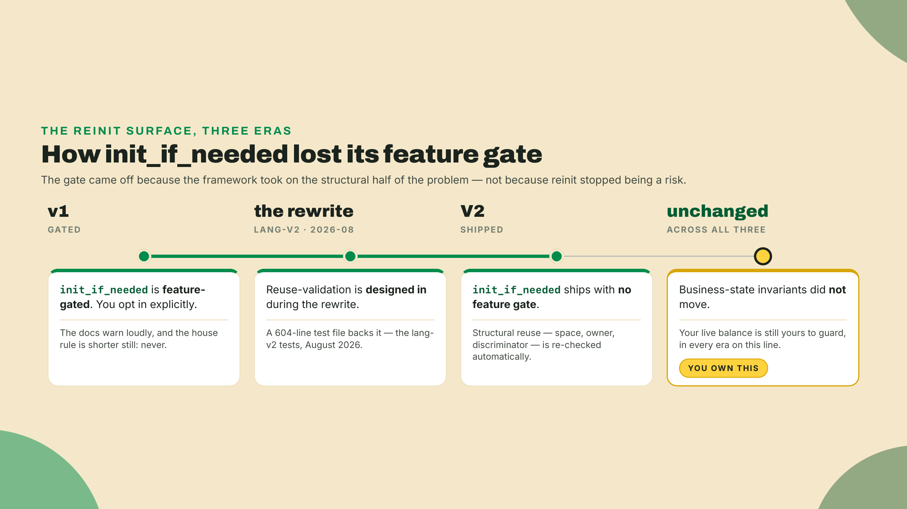

# The constraint catalog (and init_if_needed, in situ)

Last lesson you derived the quarter-vault's PDA and stored its canonical bump. It creates and re-derives, which is real progress. But look at what it still does: `init_vault` trusts every account the caller hands it. Nothing checks that the account you *think* is the config is the config, that the signer paying for an admin action is actually the arcade operator, or that a random account passed where a token account belongs is owned by the program you assume owns it. The macro derives the address and then your handler shrugs and trusts the rest.

In v1, that shrug was the single most common way programs got drained. Someone forgets one check, an attacker passes their own account where yours was expected, and the handler happily operates on it. So before any theory, feel the hole yourself. Open last lesson's `programs/quarter-vault/src/lib.rs` and add this naive admin handler, the kind that looks fine in review:

```rust
// Looks fine. Is exploitable. There is no check that `authority` is anyone in particular.
pub fn admin_set_credit(ctx: &mut Context<AdminSetCredit>, new_credit: u64) -> Result<()> {
    ctx.accounts.vault.credit = new_credit;
    Ok(())
}

#[derive(Accounts)]
pub struct AdminSetCredit {
    pub authority: Signer,          // ANY signer. That is the bug.
    #[account(mut, seeds = [b"vault", vault.owner.as_ref()], bump = vault.bump)]
    pub vault: Account<Vault>,
}
```

Run `anchor build`. It compiles clean. It also lets any wallet on Solana set any player's credit to anything, because `Signer` proves someone signed, not *who*. Hold that thought. This lesson is where you make the `#[derive(Accounts)]` macro do the policing, so a bad account is rejected before your handler code ever runs. And it is where one keyword, `init_if_needed`, quietly reopens a door the framework spent years bolting shut.

## Summary

Here is the whole lesson as a findings index, each line a conclusion you can act on:

- Constraints live in the **derive macro**, so validation runs *before* your handler and shows up in the IDL. What the macro rejects, your code never sees.
- Two phases matter and their order is the whole trick: **`load`** (owner + discriminator checks) runs *first*, then the **constraint hooks** (`seeds`, `address`, `owner`, `constraint`, `close`) run *after*. A check you put in the wrong phase silently never fires.
- `address = parent.field` is V2's replacement for the now-deprecated **`has_one`**. It accepts *any expression*, not just a stored key, which is why the older keyword lost its job.
- The **owner-error footgun**: `#[account(owner = X @ MyErr)]` on `Account<T>` will *not* surface `MyErr`. Owner runs in `load`, before your hook, so you get the framework's `IllegalOwner` instead. For a custom owner error, drop to `UncheckedAccount` and assert ownership with an explicit `constraint`.
- `close = destination` returns the account's **rent-exempt reserve** to the destination and invalidates the account, atomically, inside the macro. It is the correct way to give a player their rent back.
- The realloc sub-keywords flattened: v1's `realloc::payer` / `realloc::zero` are now **`realloc_payer` / `realloc_zero`**. Same behavior, new spelling. The old form does not compile.
- `init_if_needed` ships in V2 with **no feature gate** and real reuse-validation, but the **reinitialization attack** survives it. Reuse-validation re-checks structure, never your business state. That guard is yours to write.

The fade runs one notch further out than last lesson: in the Lab I still hand you the full constraint-guarded program and two passing tests, but the vault itself, its seeds and its stored bump, now arrives without re-explanation. In the completion problem I pull the `address` and `close` constraints back out as TODOs and you refill them. In the solo you build the `init_if_needed` path yourself and write the test that proves it cannot be abused.

## The constraint catalog, keyword by keyword

Start with the machine, not the keywords, because the machine explains why one of the keywords is a trap. When a transaction reaches your program, Anchor does not jump straight into your handler. It first *constructs* the accounts struct, and that construction happens in two ordered phases.

The first phase is **`load`**. For each `Account<T>` field, the framework reads the raw account, checks that its **owner** is your program, and checks that the first bytes match `T`'s **discriminator** (the tag that says "this is a `Vault`, not a `Config`"). If either check fails, `load` bails immediately with a built-in error. The second phase is the **constraint hooks**: `seeds`, `bump`, `address`, `owner`, `constraint`, `has_one`, `close`, and friends. These run *after* every field has loaded. A "constraint hook" is just the generated code the macro emits to enforce one `#[account(...)]` clause, and it runs in the second phase, never the first.

Glossary, because it pays off in thirty seconds: the **constraint hook** is the enforcement step for a single constraint, run after `load`. Keep that ordering in your head. Almost every sharp edge in this catalog is a consequence of it.



### address = parent.field: the authority gate, and why has_one lost its job

Your naive `admin_set_credit` needs exactly one thing: proof that the signer is the arcade operator, not some passerby. Anchor has long offered two spellings for that. The one every v1 tutorial reaches for is `has_one`: store the operator's key on a `Config` account and write `has_one = authority` on that config, meaning "the account named `authority` in this struct must equal `config.authority`." It worked, but it was rigid — `has_one` can only compare against a *stored key field* with a *matching field name*. The general one is `address = <expression>`: you put it on the account you want to constrain and give it any expression that evaluates to an `Address`, and the macro checks that the account's key equals that expression, in the constraint-hook phase, with an optional `@ CustomError`. Be precise about the lineage, because it is easy to get wrong: `address = <expr>` is *not* a V2 invention — the v1 line already ships it, expression and custom error included (0.30 extended it to field expressions; 0.31 fixed the regression that briefly broke non-const ones).

What V2 actually changes is the verdict between the two: it retires `has_one`. The narrow keyword that only ever did stored-key-equals-same-named-account is deprecated in favor of the general expression check that does that and everything else, so the special case becomes dead weight. The operator gate, in the form V2 standardizes on, is one line on the signer:

```rust
#[account(address = config.authority @ VaultError::Unauthorized)]
pub authority: Signer,
```

That is the whole fix. If the signer's address is not `config.authority`, the macro raises `VaultError::Unauthorized` before `admin_set_credit` runs. No handler branch, no `require!`, nothing to forget. And here is the trajectory thread from last lesson showing up again, in spirit: V2 keeps deleting special cases. Last lesson it was the literal-seed bump folding into a macro-time const; here it is the narrow keyword giving way to the general check that subsumes it. `has_one` only did stored-key-equals-same-named-account. `address = expr` does that *and everything else*, so the narrow one becomes dead weight.

It is not gone, though, and the way it lingers is a nice piece of framework archaeology. `has_one` still parses in V2. It just emits a deprecation warning. The parser stores the keyword's source span specifically so codegen can underline it for you (lang-v2 `derive/src/parse.rs`, as of 2026-08). Somebody deliberately kept the location around just to draw a squiggly line under it. So migrations do not break, old code compiles, and the compiler nags you toward `address =` one warning at a time.



### owner: the footgun that hides in plain sight

Now the constraint the catalog most wants you to misuse. Say you accept an account that a *different* program owns, some registry your vault reads but does not own, and you want a friendly error when someone passes the wrong thing. The obvious code writes itself:

```rust
// Reads correctly. Does NOT do what you think.
#[account(owner = REGISTRY_PROGRAM_ID @ VaultError::WrongOwner)]
pub registry: Account<Registry>,
```

You test it with a bad account, expecting `WrongOwner`, and the test reports a generic `IllegalOwner` instead. Your custom error never fires. Why?

Walk the naive explanations first, because ruling them out is what makes the real reason stick. Maybe the `@` error syntax only works on `constraint =`? No, `@` binds errors on several constraints, `address` and `owner` included. Maybe the constant is an expression the macro cannot evaluate? No, it evaluates fine. The reason is the phase model from two sections ago, and nothing else. On `Account<T>`, the owner check runs in **`load`**, the first phase, and the owner it checks against is *your program*, hardcoded, because that is what a typed wrapper means. `load` fails the account before any constraint hook exists to raise your error, and you get `IllegalOwner`.

Read that one step further than the error message does, because it is the more important fact. `owner = <some other program>` on an `Account<T>` is not merely error-shadowed, it is unreachable: the typed wrapper already pinned the owner to your own program, so an account owned by anyone else can never load as `Account<Registry>` in the first place. The `owner =` constraint only has anything to say on a wrapper that did *not* pin the owner during load.

So the fix is not "move the error," it is "use the wrapper that leaves the question open." Drop to a raw account and assert ownership yourself in the hook phase:

```rust
/// CHECK: ownership is asserted explicitly below so a custom error can fire.
#[account(
    constraint = registry.owner() == &REGISTRY_PROGRAM_ID @ VaultError::WrongOwner
)]
pub registry: UncheckedAccount,
```

`UncheckedAccount` skips the typed `load`, so nothing has pinned an owner and there is no early check to preempt you. The `constraint =` runs in the hook phase, evaluates your boolean, and raises `WrongOwner` on failure. You traded the framework's automatic owner check for a manual one, on purpose, to buy both a custom error and the ability to name a foreign owner at all. (The registry here is illustrative; nothing in R2 reads a foreign account yet, and the real foreign-owner case arrives with tokens in module 5. The footgun is the lesson.)

The honest tradeoff, stated plainly: `Account<T>` pinning the owner to your program during `load` is a *feature* ninety-nine times out of a hundred. It means you almost never write owner checks by hand, and the one you did write and forgot is not a bug because the framework did it for you. The footgun is only the edge case where you want a *custom message* on that automatic check. Do not go replacing every `Account<T>` with `UncheckedAccount` to get pretty errors. You would be turning off the seatbelt to change its color.



### close = destination: giving the rent back

A player who no longer wants a vault should get their money back. When you created the vault last lesson, the player funded its **rent-exempt reserve**, the lamport balance every account must hold to avoid being purged by the runtime. That reserve is a deposit rather than a fee, which is the whole reason it can come back: it sits in the account for as long as the account lives, and it should return to the player the moment the account dies.

`close = destination` does exactly that, and it does it as a macro constraint so you never hand-roll the lamport move:

```rust
#[account(
    mut,
    close = player,          // rent goes to `player`; the account is invalidated
    seeds = [b"vault", player.address().as_ref()],
    bump = vault.bump,
)]
pub vault: Account<Vault>,
```

Three things happen atomically when this instruction succeeds. The account's entire lamport balance, rent-exempt reserve included, moves to `player`. The account's data is zeroed and its discriminator is wiped so it can never be silently revived and mistaken for a live vault. And all of it is visible in the IDL, so an indexer or a client knows this instruction closes an account without reading your handler body. In fact the handler body can be empty, because the constraint carries the whole operation on its own. Compare that to the hand-rolled version, where you would manually debit lamports, zero the data, and hope you did not leave a revival path, and the difference is not really terseness at all. It is that the constraint form cannot forget a step and the hand-rolled one can.



### realloc_payer and realloc_zero: the same idea, a new spelling

If the vault ever needs to grow, say you add a slab of recent high scores, you reallocate its space. V2 kept realloc but flattened the sub-keyword syntax, so v1's colon-nested `realloc::payer` and `realloc::zero` are gone and the V2 forms are the single flat identifiers `realloc_payer` and `realloc_zero`. Write the old colon form and it does not compile:

```rust
#[account(
    mut,
    realloc = Vault::DISCRIMINATOR.len() + Vault::INIT_SPACE + EXTRA_SLAB,
    realloc_payer = player,   // v1 was realloc::payer
    realloc_zero = false,     // v1 was realloc::zero; false = keep existing bytes on grow
)]
pub vault: Account<Vault>,
```

`realloc_payer` names who funds the extra rent when the account grows (growing needs more rent; shrinking refunds it). `realloc_zero` decides whether the newly sized buffer is wiped: `true` when you are shrinking and want old trailing data gone, `false` when you are growing and want the existing bytes preserved. That is the entire migration. If you are porting a v1 program and the compiler rejects `realloc::payer`, this rename is why, and the fix is mechanical.

### init_if_needed, in situ: the door that reopened

Now the keyword this lesson's summary flagged. `init_if_needed` lets one instruction say "create this account if it does not exist, otherwise use the one that does." It is genuinely convenient for a "top up or open" flow: the player runs one instruction whether or not they already have a vault.

In v1, this keyword was feature-gated and came wrapped in warnings, because it is the classic home of the **reinitialization attack**: an attacker forces your create-or-reuse path down the *reuse* branch on an account that already holds live state, and your handler, thinking it just created a fresh account, resets that state. Live balance, gone. In V2 the keyword ships with **no feature gate at all** and a 604-line reuse-validation test file backing it (lang-v2 tests, 2026-08). That is a real softening, both from v1's gated stance and from the house rule that used to say "never." Somebody wrote a lot of tests to make this defensible by default.

Here is the part you must not misread. V2's reuse-validation re-checks the account's **structure** when it already exists: the space is right, the owner is your program, the discriminator matches `Vault`. That is worth having. What it does *not* do, what it *cannot* do, is know your invariants. It has no idea that `credit` is a live balance a player funded. So the reinitialization attack survives, in exactly one narrowed form: reuse-validation guards the *shape*, and the *state* is yours to guard.



The guard is a single branch. On a freshly created account every byte is zero, so `owner == Address::default()` tells you it is new. Initialize only in that case, and only ever *add* to the balance, never set it:

```rust
pub fn top_up_or_open(ctx: &mut Context<TopUpOrOpen>, amount: u64) -> Result<()> {
    let vault = &mut ctx.accounts.vault;
    if vault.owner == Address::default() {
        // Fresh: reuse-validation confirmed shape, but the fields are still zeroed.
        vault.owner = *ctx.accounts.player.address();
        vault.bump = ctx.bumps.vault;
        vault.credit = 0;
    }
    // Existing OR fresh: only ADD. Never `vault.credit = amount`, that is the clobber.
    vault.credit = vault.credit.checked_add(amount).ok_or(VaultError::Overflow)?;
    Ok(())
}
```

One honest bookkeeping note, because last lesson was emphatic that credits are quarters and quarters are lamports. Neither this handler nor `admin_set_credit` moves a single lamport. `credit` is a free-floating counter for the whole of this lesson, on purpose: moving value means a PDA-signed transfer, and that is module 4's entire subject. So today's vault has honest books and no money in them. Module 4 is where the number starts being backed by the account's balance, and where an unbacked `credit` becomes a bug rather than a simplification.

That `if` is the entire defense, and it is the discipline the framework will never hand you a keyword for. The trade-off of the whole catalog lands right here. Constraints move validation into the macro where it cannot be forgotten and shows up in the IDL, which is a real win and most of this lesson. But two edges stay sharp: the owner-error footgun means a custom owner message needs `UncheckedAccount`, and `init_if_needed` trades a branch of convenience for a reinitialization surface you now own. Ergonomics on one side, an explicit-check discipline you must not outsource to keywords on the other. The keywords do a lot. They do not do that `if`.

## Lab: give the vault a bouncer

You are extending last lesson's `quarter_vault` into a constraint-guarded program. It gains three things in this Lab: a `Config` account holding the arcade operator's key, an authority-gated `admin_set_credit`, and a `close_vault` that refunds rent. The `top_up_or_open` path from the theory section is deliberately not here; it is the solo challenge, and building it cold is the point. Two LiteSVM tests clear the bar: a wrong-authority admin call is rejected *by the constraint*, and `close_vault` returns rent and invalidates the account.

**1. Add the Config state and its init.** The operator's key needs a home. Put a `Config` PDA at a fixed, single-instance seed. In `programs/quarter-vault/src/lib.rs`:

```rust
#[account]
#[derive(InitSpace)]
pub struct Config {
    pub authority: Address, // 32: the arcade operator
    pub bump: u8,           // 1: canonical bump, stored per last lesson's discipline
}

#[derive(Accounts)]
pub struct InitConfig {
    #[account(mut)]
    pub authority: Signer,
    #[account(
        init,
        payer = authority,
        space = Config::DISCRIMINATOR.len() + Config::INIT_SPACE,
        seeds = [b"config"],
        bump,
    )]
    pub config: Account<Config>,
    pub system_program: Program<System>,
}
```

And the handler, which is the same store-the-bump pattern you already know:

```rust
pub fn init_config(ctx: &mut Context<InitConfig>) -> Result<()> {
    let config = &mut ctx.accounts.config;
    config.authority = *ctx.accounts.authority.address();
    config.bump = ctx.bumps.config;
    Ok(())
}
```

Expected after this step: `anchor build` is clean and the program now exposes two init paths, `init_vault` from last lesson and `init_config`. Nothing is gated yet, which is the point of the next step.

**2. Harden the admin path.** Replace the naive `AdminSetCredit` struct from the opener with the guarded one. The change is a single constraint line, and it is the whole point of the lesson:

```rust
#[derive(Accounts)]
pub struct AdminSetCredit {
    // The gate: this signer MUST equal config.authority, enforced in the hook phase.
    #[account(address = config.authority @ VaultError::Unauthorized)]
    pub authority: Signer,

    #[account(seeds = [b"config"], bump = config.bump)]
    pub config: Account<Config>,

    #[account(
        mut,
        seeds = [b"vault", vault.owner.as_ref()],
        bump = vault.bump,
    )]
    pub vault: Account<Vault>,
}
```

The handler body does not change from the naive one. That is the message worth pausing on: the security moved *out* of the handler and *into* the derive struct, where it cannot be forgotten and where the IDL advertises it.



Expected after this step: the build does *not* compile yet, and the error is worth reading rather than fearing. The constraint names `VaultError::Unauthorized`, an enum that does not exist until step 4, so `anchor build` stops with an E0433 `failed to resolve` on `VaultError`. Leave it red through step 3; step 4 pays it off. Once the enum lands, the generated IDL for `admin_set_credit` will list a `config` account it did not list a minute ago. That new account in the interface *is* the gate, visible to anyone reading the IDL without reading your Rust.

**3. Add close_vault.** The handler is empty. The constraint carries the work:

```rust
pub fn close_vault(_ctx: &mut Context<CloseVault>) -> Result<()> {
    Ok(())
}

#[derive(Accounts)]
pub struct CloseVault {
    #[account(mut)]
    pub player: Signer,
    #[account(
        mut,
        close = player,   // rent-exempt reserve returns to the player; account invalidated
        seeds = [b"vault", player.address().as_ref()],
        bump = vault.bump,
    )]
    pub vault: Account<Vault>,
}
```

The `seeds` line is doing quiet access control: only the player whose key derives this exact vault can pass the seed check, so no one can close a vault that is not theirs. You did not need a separate ownership constraint, the seed scheme already is one.

**4. Add the error enum.** Anchor allows exactly one `#[error_code]` enum per program, so everything lives here:

```rust
#[error_code]
pub enum VaultError {
    #[msg("caller is not the configured arcade authority")]
    Unauthorized,
    #[msg("credit addition overflowed")]
    Overflow,
    #[msg("account is owned by the wrong program")]
    WrongOwner,
}
```

Expected after this step: `anchor build` is clean. If it is not, the usual cause is a second `#[error_code]` enum left over somewhere: V2 allows exactly one per program, so every variant the program will ever raise has to land in this one.

**5. Prove the gate with a wrong-authority test.** This is the assessment gate: the rejection must come from the *constraint*, not from a handler branch. Append this to the `tests/quarter_vault.rs` you wrote last lesson, keeping that file's existing test and dropping the duplicate `use` lines rather than pasting them twice:

```rust
use anchor_lang::{
    prelude::Address, programs::System, solana_program::instruction::Instruction, Id,
    InstructionData, ToAccountMetas,
};
use anchor_v2_testing::{
    Keypair, LiteSVM, Message, Signer, VersionedMessage, VersionedTransaction,
};

fn setup() -> (LiteSVM, Address) {
    let mut svm = anchor_v2_testing::svm();
    let program_id = quarter_vault::ID;
    let vault_so = concat!(env!("CARGO_MANIFEST_DIR"), "/../../target/deploy/quarter_vault.so");
    svm.add_program_from_file(program_id, vault_so).unwrap();
    (svm, program_id)
}

// New here, because this file now sends three transactions instead of one: fold the
// blockhash-fetch-and-sign into one helper rather than repeating it at every send.
fn tx(svm: &LiteSVM, payer: &Keypair, instruction: Instruction) -> VersionedTransaction {
    let blockhash = svm.latest_blockhash();
    let msg = Message::new_with_blockhash(&[instruction], Some(&payer.pubkey()), &blockhash);
    VersionedTransaction::try_new(VersionedMessage::Legacy(msg), &[payer]).unwrap()
}

#[test]
fn wrong_authority_is_rejected_at_the_constraint() {
    let (mut svm, program_id) = setup();

    let operator = Keypair::new();   // the real authority
    let attacker = Keypair::new();   // a random signer
    let player = Keypair::new();
    for kp in [&operator, &attacker, &player] {
        svm.airdrop(&kp.pubkey(), 1_000_000_000).unwrap();
    }

    // init_config with the real operator
    let (config_pda, _) = Address::find_program_address(&[b"config"], &program_id);
    let ix = Instruction {
        program_id,
        accounts: quarter_vault::accounts::InitConfig {
            authority: operator.pubkey(),
            config: config_pda,
            system_program: System::id(),
        }.to_account_metas(None),
        data: quarter_vault::instruction::InitConfig {}.data(),
    };
    let init_config = tx(&svm, &operator, ix);
    svm.send_transaction(init_config).unwrap();

    // init a player vault (uses last lesson's init_vault)
    let (vault_pda, _) =
        Address::find_program_address(&[b"vault", player.pubkey().as_ref()], &program_id);
    let ix = Instruction {
        program_id,
        accounts: quarter_vault::accounts::InitVault {
            player: player.pubkey(),
            vault: vault_pda,
            system_program: System::id(),
        }.to_account_metas(None),
        data: quarter_vault::instruction::InitVault {}.data(),
    };
    let init_vault = tx(&svm, &player, ix);
    svm.send_transaction(init_vault).unwrap();

    // ATTACK: attacker signs admin_set_credit, presenting themselves as authority.
    let ix = Instruction {
        program_id,
        accounts: quarter_vault::accounts::AdminSetCredit {
            authority: attacker.pubkey(),
            config: config_pda,
            vault: vault_pda,
        }.to_account_metas(None),
        data: quarter_vault::instruction::AdminSetCredit { new_credit: 9_999 }.data(),
    };
    let attack = tx(&svm, &attacker, ix);

    // The macro rejects it in the constraint-hook phase, before the handler runs.
    assert!(svm.send_transaction(attack).is_err(),
        "attacker must be rejected by address = config.authority");
}
```

**6. Prove close returns rent.** The second test shows the reserve coming home and the account going away:

```rust
#[test]
fn close_returns_rent_and_invalidates() {
    let (mut svm, program_id) = setup();
    let player = Keypair::new();
    svm.airdrop(&player.pubkey(), 1_000_000_000).unwrap();

    let (vault_pda, _) =
        Address::find_program_address(&[b"vault", player.pubkey().as_ref()], &program_id);

    // init_vault first
    let ix = Instruction {
        program_id,
        accounts: quarter_vault::accounts::InitVault {
            player: player.pubkey(),
            vault: vault_pda,
            system_program: System::id(),
        }.to_account_metas(None),
        data: quarter_vault::instruction::InitVault {}.data(),
    };
    let init = tx(&svm, &player, ix);
    svm.send_transaction(init).unwrap();

    let before = svm.get_balance(&player.pubkey()).unwrap();

    // close_vault
    let ix = Instruction {
        program_id,
        accounts: quarter_vault::accounts::CloseVault {
            player: player.pubkey(),
            vault: vault_pda,
        }.to_account_metas(None),
        data: quarter_vault::instruction::CloseVault {}.data(),
    };
    let close = tx(&svm, &player, ix);
    svm.send_transaction(close).unwrap();

    let after = svm.get_balance(&player.pubkey()).unwrap();
    assert!(after > before, "rent-exempt reserve should return to the player");
    assert!(svm.get_account(&vault_pda).is_none(), "closed account is invalidated");
}
```

**7. Run it.**

```bash
anchor test
```

Expected output, both gates green:

```
running 2 tests
test wrong_authority_is_rejected_at_the_constraint ... ok
test close_returns_rent_and_invalidates ... ok

test result: ok. 2 passed; 0 failed
```

If the wrong-authority test *fails* (the transaction succeeds when it should not), the usual cause is that you left the naive `Signer` struct in place and never added `address = config.authority`. The constraint is the whole gate. Without it, `Signer` proves someone signed, never who.

## Challenge

Two rungs again, and this time the second one has no code on the page at all.

**Completion.** Open the `AdminSetCredit` and `CloseVault` structs you just wrote and blank two constraints: replace the `address = ...` line with `// TODO: gate the signer` and the `close = ...` line with `// TODO: refund + invalidate`. Now refill them from memory. Acceptance: the wrong-authority test rejects at the constraint (not in the handler), and `close_returns_rent_and_invalidates` passes. If you find yourself adding an `if ctx.accounts.authority.address() != ...` check *inside* the handler, stop. That is the v1 habit the catalog exists to delete. The check belongs in the derive struct.

**Solo.** Build the `top_up_or_open` path with `init_if_needed`, using the guarded handler from the theory section, and then write the test that proves your reuse branch cannot clobber a live balance. The shape: init a vault, top it up to some non-zero credit, then call `top_up_or_open` *again* with a second amount and assert the final credit is the *sum*, not the second amount alone. That single assertion is the proof that your `if vault.owner == Address::default()` guard held and the reinitialization risk did not bite. Acceptance: the reuse call preserves and adds to the existing balance, a fresh call initializes cleanly, and neither path resets `credit` unconditionally. If your test sees the balance equal to just the last top-up, your guard is missing or inverted, and you have written the exact vulnerability the section warned about, which is a genuinely useful thing to have seen fail once, on purpose, in a test.



When both rungs pass, sit with what the vault became. A wrong signer bounces off the derive macro before your code runs. A player gets their rent back with an empty handler and no revival path. A create-or-reuse instruction exists and does *not* let anyone overwrite a funded balance, because you wrote the one `if` no keyword will write for you. Every one of those guarantees is now visible in the IDL, which means the next person to read your program sees the rules without reading the logic. That is the trade the catalog offered, and you took the good side of it: validation you cannot forget, minus two sharp edges you now know by name.

The catalog you just toured is the set the *framework* ships. But you will hit a rule the framework has no keyword for, something like "this vault's credit may never drop below a floor," and you will not want to scatter that `require!` across nine handlers. Next lesson you write your own constraint namespace, a `quarters::min_balance` the macro enforces exactly like `address` or `close`, by implementing the `AccountConstraint` trait the framework leaves open for precisely this. The bouncer learns a house rule you invented. Keep it strict.
