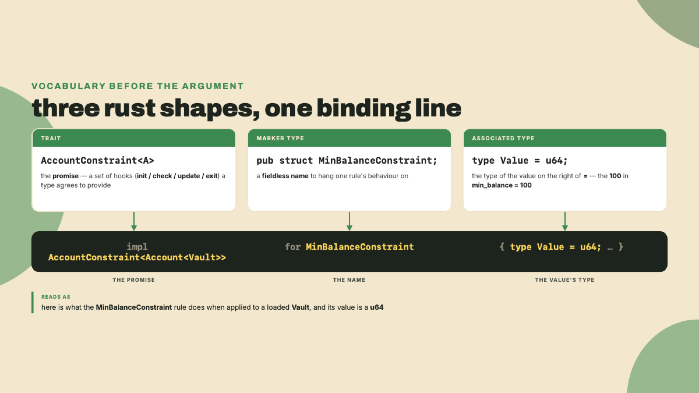
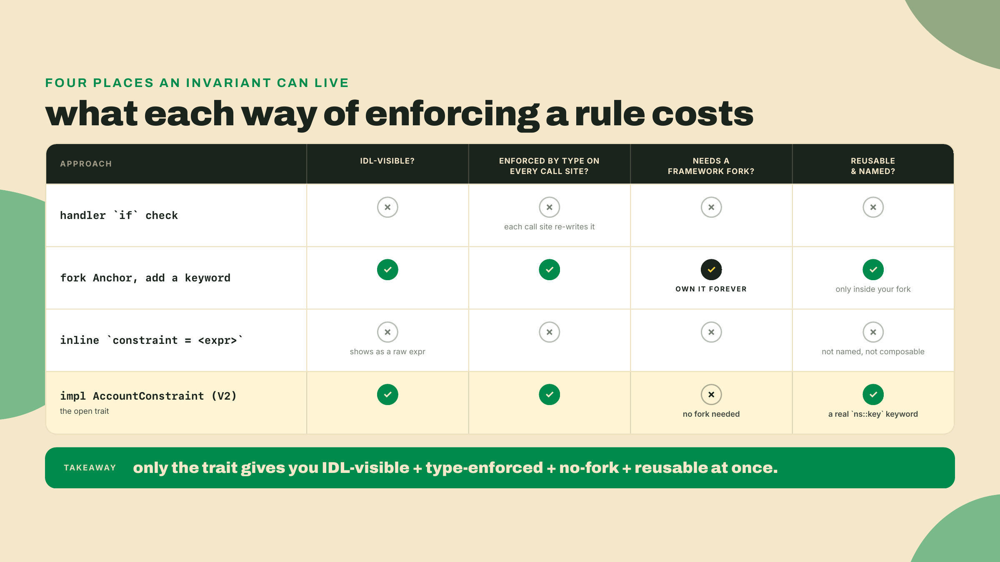
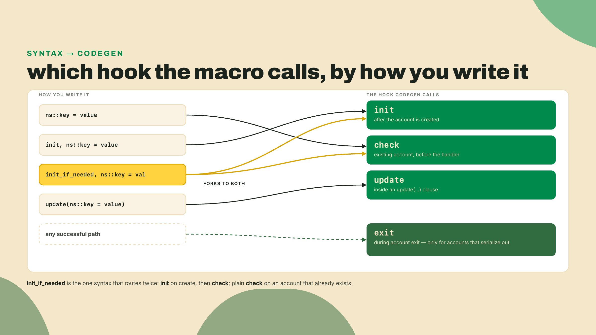
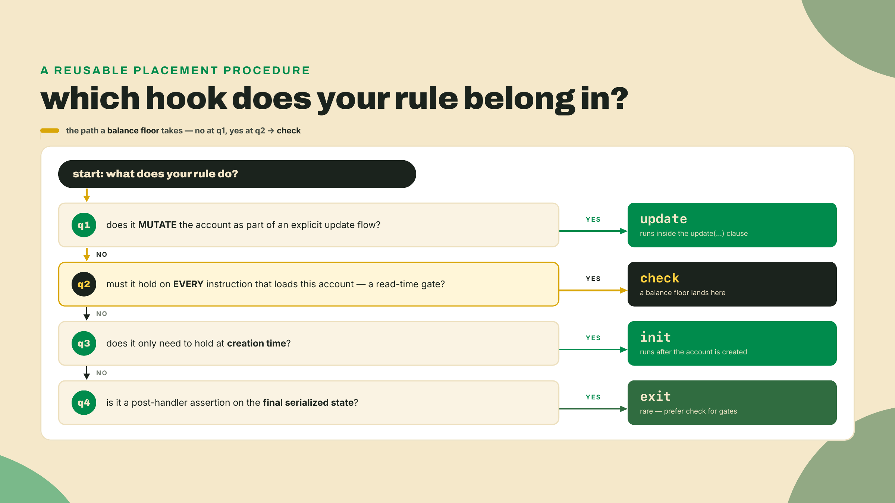
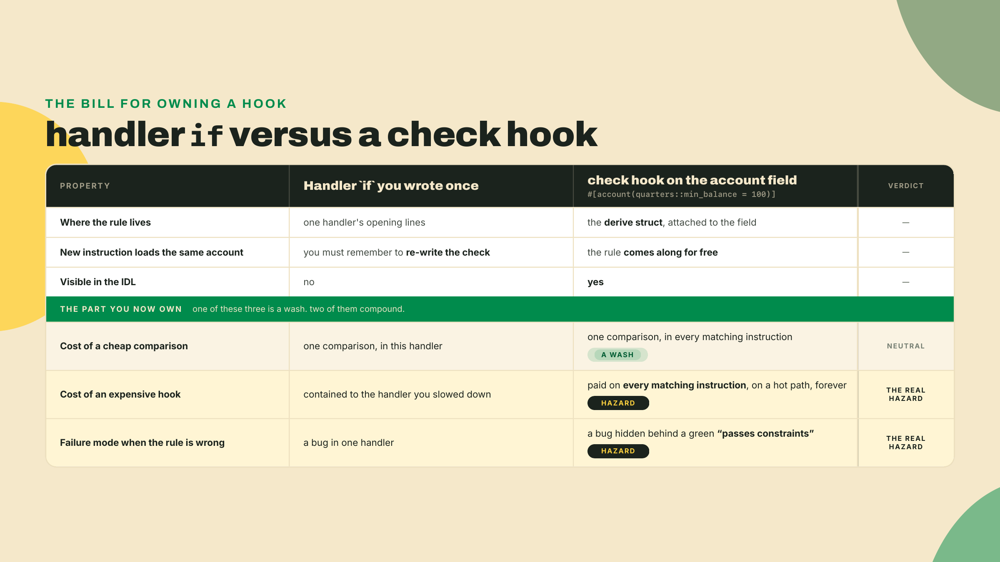
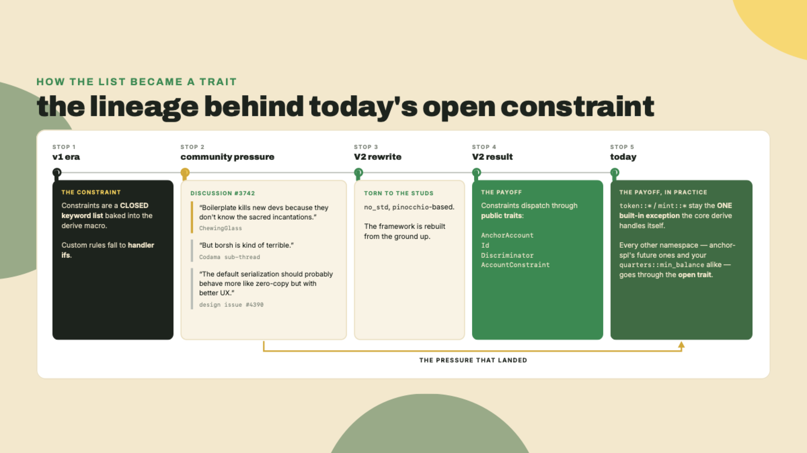
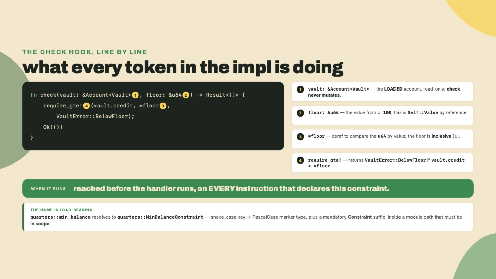

# Write your own constraint: the AccountConstraint trait

Last lesson you hardened the vault with the constraints the framework ships: `address` as the authority gate, the `owner` footgun and its `UncheckedAccount` workaround, `close` for the rent refund, and the `init_if_needed` reuse path with its surviving reinit risk. Every one of those was a keyword someone else chose. Which is fine, right up until the rule you actually need is not on the list.

Here is the rule I want on R2, the quarter-vault you built in this module. A player should not be able to run certain operations against a vault whose stored `credit` is below some floor. Call it `quarters::min_balance = 100`: below 100, reject. Note what the rule is *about*, because the name will mislead you otherwise. It reads the `credit` counter on the account, not the account's lamport balance, and as of last lesson that counter is not yet backed by any lamports. Module 4 is where the two become the same number. Today's floor is a floor on the books. Before V2 that rule had two homes and neither was good. Mostly it was handler code: an `if` at the top of the instruction, plus the hope that every other instruction touching the vault wrote the same `if`, plus the prayer that nobody added a call site six months later and forgot. Sometimes it was an inline `constraint = <expr>`, which at least ran in the macro but was an anonymous boolean you could not name, reuse, or read off an IDL. Either way the invariant lived in your discipline rather than in the type.

Before I argue about why that is a bad place to keep an invariant, do the thing that makes the rest concrete. Drop this into a scratch file and run it:

```bash
rustc --version   # any stable rustc at or above Anchor V2's MSRV, Rust 1.89.0
```

```rust
// scratch.rs - the check hook, distilled to plain Rust.
// Deliberately NOT named AccountConstraint / MinBalanceConstraint: the real trait has a
// different shape (static methods, an associated Value, a program error), and
// this file exists only to get the comparison right before the wiring.
pub trait BalanceGate {
    fn check(&self, balance: u64) -> Result<(), String>;
}

pub struct MinBalanceRule {
    pub min: u64,
}

impl MinBalanceRule {
    // The condition, split out as a plain `const fn` this file owns. Not a hook:
    // the trait has one method, `check`. It sits here so the compiler can
    // evaluate it at build time, which the graded version leans on.
    const fn meets_floor(&self, _balance: u64) -> bool {
        // This is the starter: it never rejects anything. That is the bug.
        true
    }
}

impl BalanceGate for MinBalanceRule {
    fn check(&self, balance: u64) -> Result<(), String> {
        if self.meets_floor(balance) {
            Ok(())
        } else {
            Err(format!(
                "quarters::min_balance violated: {} < {}",
                balance, self.min
            ))
        }
    }
}

fn run_constraint(balance: u64, min: u64) -> bool {
    MinBalanceRule { min }.check(balance).is_ok()
}

fn main() {
    // A 50-lamport vault against a 100 floor should be REJECTED.
    println!("50 vs 100 -> {}", run_constraint(50, 100)); // prints true. wrong.
    println!("100 vs 100 -> {}", run_constraint(100, 100)); // prints true. correct, by accident.
}
```

```bash
rustc scratch.rs -o scratch && ./scratch
```

You will see `50 vs 100 -> true`. A vault holding half the floor sails through, because the condition the hook forwards to does nothing. Hold that failing line in your head. By the end of the Lab this exact `check` is a real, IDL-visible constraint on R2, firing before your handler ever runs. The completion problem hands you back this hook body to fill; the solo problem asks for a second constraint with no scaffold at all. In the Lab itself I walk every line.

## Summary

- Anchor V2 dispatches any namespaced, non-token constraint (`ns::key = value`) through a public trait, `AccountConstraint<A>`. You implement it for a marker type and you get a new `#[account(...)]` keyword, with no fork and no change to the derive macro.
- The trait exposes four lifecycle hooks: `init`, `check`, `update`, `exit`. Codegen calls each at a specific phase. A balance floor is a read-time gate on the loaded account, so it belongs in `check`, not `init` (create-only) and not `exit` (post-handler).
- Why a trait and not more built-in keywords? Because no framework author can enumerate every program's invariants in advance. An open trait moves that decision to you, permanently.
- The cost is real and worth naming up front: a `check` hook runs on every matching instruction, inside that instruction's compute budget. A wrong hook or an expensive hook is CU you pay on a hot path forever, and it can hide a logic bug behind a green "passes constraints."

The autonomy fade for today, and it is the module's third turn of this loop, so it runs one notch further out than last lesson's: I write the trait impl with you in the Lab, but the vault, its seeds, its stored bump, and its LiteSVM harness are now yours to reproduce without narration. In the completion problem you refill the `check` body from memory. In the solo problem you get a spec, no scaffold, and you design a second constraint namespace yourself.

## Why the constraint surface is a trait you can implement

### A 30-second on-ramp: traits, marker types, associated items

You do not need to be fluent in Rust to read what follows, only to recognize three shapes.

A **trait** is a named set of methods a type promises to provide. If a type "implements `AccountConstraint`," it supplies bodies for that trait's methods, and any code written against the trait can now call them. That is the whole idea: code depends on the promise, not on the concrete type.

A **marker type** is a struct with no fields, `pub struct MinBalanceConstraint;`, that exists only to have a trait implemented on it. It carries no data. It is a name you can hang behavior off of. When you see `impl AccountConstraint<Account<Vault>> for MinBalanceConstraint`, read it as: "here is what the min-balance rule does when applied to a loaded `Vault`."

An **associated item** is a type or constant that belongs to a trait implementation rather than being passed in. `AccountConstraint` has an associated type `Value`, the type of the value on the right of the `=`. For `quarters::min_balance = 100`, `Value` is `u64` and the `100` is that value. That is genuinely all the Rust machinery this lesson leans on. Trait, marker type, associated type. Everything else is the argument for why they are here.



### The status quo, and the exact place it breaks

Start from how constraints worked before V2, because the limit is the whole motivation. A constraint like `has_one` or `address` is a keyword the framework author baked into the derive macro. The macro parses your `#[account(...)]` attribute, matches the keyword against a fixed list it knows about, and emits the corresponding check. The list is closed. It is a dictionary the framework author finished printing before they ever met your program.

For the constraints on that list, this is great. `has_one`, `owner`, `seeds`: these are near-universal, and having them as first-class, IDL-visible keywords means a client reading your IDL can see them, and the compiler enforces them the same way in every instruction. The problem is only ever the constraint that is *not* on the list. And there is always one, because your program has invariants no framework author could have predicted: a vault floor, an owner-is-a-specific-role rule, a "this counter never exceeds a cap" rule. Domain rules. The moment you need one, the closed list has nothing for you, and you fall back to handler code.

Here is the sharp question that forces the design. If `has_one` gets to be a declarative, every-instruction, IDL-visible constraint, why should *your* invariant be a hand-written `if` at the top of one handler that every other call site has to remember to copy?

### Ruling out the easy answers first

The obvious fixes each fail, and watching them fail is what builds the need for the real one.

The first easy answer: "just write the check in the handler." This is where everyone starts, and it has three specific failure modes, not one. It is not visible in the IDL, so a client has no way to know the rule exists. It is not enforced by the type, so a second instruction that touches the same vault does not inherit it. And it runs *after* account loading and often after other logic, so a bug in ordering can let a bad account through a partial check. The rule is real but it lives in your memory, and memory does not survive a new teammate adding a call site.

The second easy answer: "so add my keyword to the framework." Fork Anchor, add `min_balance` to the parser and the codegen, done. Except now you own a fork of a framework, forever, and you re-merge it every release. Worse, your rule is specific to *your* vault; it has no business in everyone's Anchor. A framework that accepted every program's private invariant as a built-in keyword would collapse under a keyword list nobody could read. Scale the idea and it is absurd: one keyword per program is not a language, it is a landfill.

The third, subtler answer: "make it a generic `constraint = <expr>`." V2 does ship `constraint = <expr>` for exactly the one-off case, and for a throwaway condition it is the right tool. But it is an inline boolean, not a named, reusable, IDL-legible thing. You cannot apply `constraint = vault.credit >= 100` to a second account and have a reader see "oh, that is the min-balance rule." It does not compose, it does not name itself, and it does not show up as a distinct constraint in the interface. It is a patch, not a primitive.

So the real question narrows to this: how do you let a program add a *named, reusable, IDL-visible* constraint keyword without touching the framework and without forking it? Once the question is that precise, the mechanism is almost forced.



### The mechanism: dispatch through a trait

V2's answer is to stop treating the constraint list as a closed keyword table and start treating it as an open trait. Any namespaced constraint, anything of the shape `ns::key = value` where `ns` is not a built-in like `token`, dispatches through `AccountConstraint<A>`. A downstream crate, meaning your program or any library you depend on, implements that trait for a marker type, and the derive macro routes the new keyword to it. Nothing in the core macro changes. This is not a special hatch bolted on for one case, either. It is the same philosophy that makes `AnchorAccount`, `Id`, and `Discriminator` public traits in V2: the framework is deliberately open at the seams, so downstream crates can ship new account wrappers, new well-known program IDs, and new discriminator schemes without a fork (lang-v2 and docs-v2 extensibility surface, verified at 2.0.0-rc.1). One boundary to keep straight: the `token::*` namespace is the built-in exception, the one namespace the core derive handles itself for `anchor-spl`'s sake. Every *other* namespace, yours included, dispatches through the trait, and that open dispatch is the door you are about to walk through.

Here is the trait, verified against the docs-v2 source at the 2.0.0-rc.1 release candidate (crates.io, published 2026-08-12). Treat the exact shape as a moving target: this is a release candidate, the extensibility surface is high-confidence but still settling, so re-read it against the crate when you build:

```rust
pub trait AccountConstraint<A> {
    type Value;
    fn init(_account: &mut A, _value: &Self::Value) -> Result<()> { Ok(()) }
    fn check(_account: &A, _value: &Self::Value) -> Result<()> { Ok(()) }
    fn update(_account: &mut A, _value: &Self::Value) -> Result<()> { Ok(()) }
    fn exit(_account: &mut A, _value: &Self::Value) -> Result<()> { Ok(()) }
}
```

`A` is the *loaded* account type the constraint applies to — the wrapper, `Account<Vault>` for us, not the bare `Vault`, because what codegen is holding when a hook fires is the loaded wrapper, and the wrapper derefs to your struct so the body reads the same either way. `Value` is the type of the right-hand side, `u64` for a lamport floor. Notice that every hook ships a default body of `Ok(())`: an impl overrides only the phases it cares about, and the ones you leave unwritten are no-ops by construction. And the four methods are the four phases of a constraint's life. That last part is the piece you have to get right, so it earns its own section.

### The four hooks, and which one a floor lives in

Codegen does not call all four methods every time. It calls the one that matches how the constraint was written. This is the routing table, and it is the load-bearing fact of the lesson:



Now reason about where a min-balance floor belongs, out loud, because the reasoning is the point and it is what the assessment asks you to defend.

`init` runs once, after the account is created. If you put the floor there, you enforce it exactly at creation and never again. A vault created above the floor could drop below it on the next instruction and nothing would catch it. A floor that only holds at birth is not a floor. Rule it out.

`exit` runs at the end, during account serialization, only for accounts that were mutated and write back out. Putting a validation there is tempting because "check the final state" sounds safe. But `exit` runs *after* your handler logic, so it is a post-hoc assertion, not a gate. It also does not run at all for a read-only account that never serializes, which is precisely the account a read-time floor cares about. If your goal is to reject a bad account up front, before any work happens, `exit` is the wrong phase. Rule it out too.

`update` only fires inside an explicit `update(...)` clause. It is for the case where the constraint itself mutates the account during an update flow. A floor is a validation, not a mutation. Not this one either.

That leaves `check`, and `check` is exactly right, not by elimination but by fit. `check` runs on the loaded account, on every matching instruction, before the handler. That is the definition of a read-time gate: the vault must already satisfy the invariant for the instruction to proceed, and it is re-verified every single call, not cached, not one-time. A balance floor is a read-time gate. So it lives in `check`. When the assessment asks which hook and why, this is the whole answer: `check`, because a floor is an invariant on the loaded account that must hold before the handler runs and on every call.



### The tradeoff, said plainly

An open constraint trait buys you something real. Your invariant now lives in the macro, is visible in the IDL, and cannot be forgotten at a call site, because it is attached to the account field itself, not to one handler's opening lines. Add a new instruction that loads the vault with the same constraint, and the floor comes along for free. That is the reuse-without-discipline that handler `if`s can never give you.

But you are now the author of code that runs inside every matching instruction's compute budget. This is not free, and pretending otherwise is how you ship a slow program. Compared to a handler `if` you wrote once, a `check` hook runs the same comparison, so the cost of a *cheap* check is a wash. The danger is a check that is not cheap. If a teammate writes a `check` that re-reads and re-hashes a large slab of data on every call, that is compute you now pay on every matching instruction, on a hot path, forever. And there is a second, quieter cost: because the account then reads as "valid," a heavy or subtly wrong check can hide a logic bug behind a green "passes constraints." The rule of thumb is short. Keep hooks cheap, keep them in the right phase, and never let a constraint do work that belongs in the handler. Extensibility hands you framework-adjacent code to own; own it carefully.



There is a bit of lineage worth carrying into the Lab, because it explains why this door exists at all. The pressure was not academic. It came from builders. In discussion #3742, ChewingGlass put the framework's ergonomics problem bluntly, "Boilerplate kills new devs because they don't know the sacred incantations," and, in a Codama sub-thread of that same discussion, "But borsh is kind of terrible." The #4390 design issue carries the same pressure in its own words, that "the default serialization should probably behave more like zero-copy but with better UX." That is the community argument, compressed, that pushed V2 toward a constraint surface you can extend instead of a keyword list you can only accept. The open trait is what "less boilerplate" looks like once it stops being a complaint and becomes an API.



## Lab: ship `quarters::min_balance` on R2

You are extending R2, the `quarter_vault` program, with a custom constraint. When you finish, `#[account(quarters::min_balance = 100)]` is a real keyword on the vault field, its `check` hook rejects an underfunded vault at constraint time, and a LiteSVM test proves both the reject and the pass. The `verify` bar for this artifact is one thing: `anchor test` is green, an under-floor vault is rejected by the constraint layer, and an at-or-above-floor vault passes.

**1. Confirm the V2 toolchain.** Same check as m03-l1's opener, one line. If the version is wrong, the re-pin command is below it; do not build V2 content on a V1 `anchor` binary:

```bash
anchor --version         # must report a 2.0.0 RC line, not 1.x; rc.1 as of 2026-08-12
# Only if it does not, re-pin (still no release binary for the v2 tag, so build from
# the tag: it is a fixed point, unlike the anchor-next branch tip it sits on):
cargo install --git https://github.com/otter-sec/anchor.git --tag v2.0.0-rc.1 anchor-cli --locked --force
# macOS, if the build trips on LTO: prefix that line with CARGO_PROFILE_RELEASE_LTO=off
```

**2. Prove the logic in isolation first.** Before touching the macro, get the `check` logic correct as plain Rust, exactly the scratch file from the top of the lesson. This is the same distillation the coding challenge grades, and it is worth passing before you wire it into the framework, because a failing constraint you cannot isolate is miserable to debug. Fill `meets_floor` so it rejects below the floor and accepts at or above it. The floor is inclusive: a balance equal to the minimum passes. The graded rung ships this same file with the same split and adds a block of `const` assertions under it — since `meets_floor` is a `const fn`, those run in the compiler, so a wrong rule fails the build with a message naming the case it got wrong.

```rust
// scratch.rs - now with the condition filled in
pub trait BalanceGate {
    fn check(&self, balance: u64) -> Result<(), String>;
}

pub struct MinBalanceRule {
    pub min: u64,
}

impl MinBalanceRule {
    const fn meets_floor(&self, balance: u64) -> bool {
        balance >= self.min
    }
}

impl BalanceGate for MinBalanceRule {
    fn check(&self, balance: u64) -> Result<(), String> {
        if self.meets_floor(balance) {
            Ok(())
        } else {
            Err(format!(
                "quarters::min_balance violated: {} < {}",
                balance, self.min
            ))
        }
    }
}

fn run_constraint(balance: u64, min: u64) -> bool {
    MinBalanceRule { min }.check(balance).is_ok()
}

#[cfg(test)]
mod tests {
    use super::*;

    #[test]
    fn floor_is_inclusive_and_rejects_below() {
        assert!(run_constraint(500, 100)); // above passes
        assert!(run_constraint(100, 100)); // exactly at the floor passes
        assert!(!run_constraint(50, 100)); // below is rejected
        assert!(!run_constraint(0, 1)); // an empty vault fails a 1-lamport floor
    }
}
```

```bash
rustc --test scratch.rs -o scratch_test && ./scratch_test
```

Expected: `test result: ok. 1 passed; 0 failed`. That is the logic locked. Everything from here is wiring it into V2 so it fires from the macro instead of from a function you remembered to call.

**3. Write the marker type and its `AccountConstraint` impl.** Open R2's `lib.rs`. Recall the vault from earlier in the module: a Pod account, because V2's `Account<T>` requires `T: Pod`, holding the owner, a `credit` balance in native lamports for now, and the canonical bump.

```rust
use anchor_lang::prelude::*;

// Already in your file from earlier in the module, reproduced here for context;
// do not re-paste them. The id stays the one anchor init generated for you, and
// `_pad` is the explicit tail padding that keeps Vault Pod.
declare_id!("<your generated program id>");

#[account]
#[repr(C)]
#[derive(InitSpace)]
pub struct Vault {
    pub owner: Address,  // 32 bytes: the player who owns this vault
    pub credit: u64,     //  8 bytes: prepaid credit, native lamports for now
    pub bump: u8,        //  1 byte: the canonical bump, persisted for reuse
    pub _pad: [u8; 7],   //  7 bytes: explicit tail padding, zeroed, never read
}
```

Now the constraint, and first the one mechanical rule that makes the whole thing work, because nothing else in this lesson will tell you and you cannot write the solo problem without it. The macro resolves `ns::key = value` by path, not by registration. It takes the namespace `ns` verbatim as a module path that must be in scope, and it converts the snake_case `key` into a PascalCase type name inside it, then appends a mandatory `Constraint` suffix. So `quarters::min_balance = 100` compiles to a call on `quarters::MinBalanceConstraint`, and `quarters::max_balance` would resolve to `quarters::MaxBalanceConstraint`. Three consequences worth holding: the module has to be reachable from where the derive struct is written, the marker type's name is not a label you choose freely (it is `key` in PascalCase plus the `Constraint` suffix, or nothing), and the `100` on the right must typecheck as that impl's `Self::Value`, which is why the associated type is `u64` and not something you get to infer.

With that rule stated: the marker type `MinBalanceConstraint` lives in a `quarters` module, and implementing `AccountConstraint<Account<Vault>>` for it is what gives `quarters::min_balance` a body to call. The impl targets the loaded wrapper, `Account<Vault>`, not the bare `Vault`, because the wrapper is what codegen has in hand when the hook fires — and since the wrapper derefs to your struct, `vault.credit` reads exactly as it would on the bare type. The `check` body is the logic you just proved, translated to the real trait: `check` takes `&Account<Vault>` and `&Self::Value`, and rejects with a program error instead of a `String`. The other three hooks stay unwritten for a pure read-time floor: the trait defaults every hook to `Ok(())`, so leaving `init`, `update`, and `exit` off *is* the statement that this rule does nothing at those phases:

```rust
pub mod quarters {
    use super::*;

    /// Marker type. Implementing AccountConstraint<Account<Vault>> for it makes
    /// `#[account(quarters::min_balance = N)]` a real, IDL-visible constraint.
    pub struct MinBalanceConstraint;

    impl AccountConstraint<Account<Vault>> for MinBalanceConstraint {
        type Value = u64;

        fn check(vault: &Account<Vault>, floor: &u64) -> Result<()> {
            // The read-time gate: the loaded vault must already hold the floor.
            require_gte!(vault.credit, *floor, VaultError::BelowFloor);
            Ok(())
        }
    }
}

// You already have this enum from last lesson. Anchor allows exactly one
// #[error_code] per program, so do not add a second: just add the BelowFloor
// variant to the one that is already there.
#[error_code]
pub enum VaultError {
    #[msg("caller is not the configured arcade authority")]
    Unauthorized,
    #[msg("credit addition overflowed")]
    Overflow,
    #[msg("account is owned by the wrong program")]
    WrongOwner,
    #[msg("vault credit is below the quarters::min_balance floor")]
    BelowFloor,
}
```

`require_gte!(a, b, err)` is V2's "a must be greater than or equal to b, else return err" macro. It is the framework-native way to write the inclusive floor; reaching for a raw `if` with a manual `return Err(...)` would compile too, but the macro is the house style and it keeps the error path uniform.



Expected after this step: `anchor build` compiles the impl even though nothing uses the constraint yet. A compile error naming `AccountConstraint` here means the trait's shape has moved under the RC, so re-read it against the crate before going further.

**4. Apply the constraint to a guarded instruction.** Add two handlers. `set_credit` is a fixture that sets the vault's stored `credit` directly, standing in for the real deposit path that arrives in module 4 when the vault starts moving actual lamports. Be honest with yourself about what it is: an ungated setter, one lesson after a whole lesson on gating writes. It ships without an `address = config.authority` on purpose, so the test can drive the vault to any credit in one line, and it is exactly the handler you would delete before shipping. The constraint is the artifact; the fixture is a jig, and m05-l1's disposition table is where you actually delete it. `require_funded` is the guarded operation: its body is empty on purpose, so any pass or fail can only come from the constraint layer, never from handler logic. The guard is the one new line, `quarters::min_balance = 100`, on the vault field:

```rust
#[program]
pub mod quarter_vault {
    use super::*;

    /// Fixture: set stored credit directly. Real lamport movement is module 4.
    pub fn set_credit(ctx: &mut Context<SetCredit>, amount: u64) -> Result<()> {
        ctx.accounts.vault.credit = amount;
        Ok(())
    }

    /// Guarded no-op: reaching this body at all proves the floor was satisfied.
    pub fn require_funded(_ctx: &mut Context<RequireFunded>) -> Result<()> {
        Ok(())
    }
}

#[derive(Accounts)]
pub struct SetCredit {
    pub player: Signer,
    #[account(
        mut,
        seeds = [b"vault", player.address().as_ref()],
        bump = vault.bump, // reuse the stored canonical bump, no runtime search
    )]
    pub vault: Account<Vault>,
}

#[derive(Accounts)]
pub struct RequireFunded {
    pub player: Signer,
    #[account(
        seeds = [b"vault", player.address().as_ref()],
        bump = vault.bump,
        quarters::min_balance = 100, // the custom constraint: check hook fires here
    )]
    pub vault: Account<Vault>,
}
```

Look at where the constraint sits. It is on the vault field in `RequireFunded`, right next to `seeds` and `bump`, which are built-in keywords, and it reads exactly like them. That is the payoff: `quarters::min_balance` is now a first-class constraint, indistinguishable in usage from the ones the framework shipped. The vault here is not even `mut`, which is the honest signal that this is a read-only gate and therefore `exit` never runs for it, only `check`.

Expected after this step: `anchor build` is clean and the IDL for `require_funded` carries the constraint on its `vault` account. That IDL line is the difference between a rule the framework enforces and a rule you remembered to write.

**5. Write the LiteSVM test.** LiteSVM runs the program in-process with no validator, so the loop is fast. Add the dev-dependencies:

```toml
# Same one row as last lesson, and for the same reason: the harness owns the SVM
# version so you cannot drift off it. At tag v2.0.0-rc.1 anchor-v2-testing carries
# litesvm 0.11.0. Naming litesvm yourself is how you end up with two of them.
[dev-dependencies]
anchor-v2-testing = { git = "https://github.com/otter-sec/anchor.git", tag = "v2.0.0-rc.1" }
```

The test, in `tests/min_balance.rs`, does four things: init the vault, set its credit below the floor and prove `require_funded` is rejected, then set it at the floor and prove `require_funded` passes. The reject and the pass are the whole artifact:

```rust
use anchor_lang::{
    prelude::Address, programs::System, solana_program::instruction::Instruction, Id,
    InstructionData, ToAccountMetas,
};
use anchor_v2_testing::{
    Keypair, LiteSVM, Message, Signer, VersionedMessage, VersionedTransaction,
};

fn require_funded_tx(
    svm: &LiteSVM,
    player: &Keypair,
    program_id: Address,
    vault_pda: Address,
) -> VersionedTransaction {
    let ix = Instruction {
        program_id,
        accounts: quarter_vault::accounts::RequireFunded {
            player: player.pubkey(),
            vault: vault_pda,
        }
        .to_account_metas(None),
        data: quarter_vault::instruction::RequireFunded {}.data(),
    };
    let blockhash = svm.latest_blockhash();
    let msg = Message::new_with_blockhash(&[ix], Some(&player.pubkey()), &blockhash);
    VersionedTransaction::try_new(VersionedMessage::Legacy(msg), &[player]).unwrap()
}

#[test]
fn min_balance_rejects_below_and_passes_at_floor() {
    let mut svm = anchor_v2_testing::svm();
    let program_id = quarter_vault::ID;
    let vault_so = concat!(env!("CARGO_MANIFEST_DIR"), "/../../target/deploy/quarter_vault.so");
    svm.add_program_from_file(program_id, vault_so).unwrap();

    let player = Keypair::new();
    svm.airdrop(&player.pubkey(), 1_000_000_000).unwrap();
    let (vault_pda, _bump) =
        Address::find_program_address(&[b"vault", player.pubkey().as_ref()], &program_id);

    // Init the vault (init_vault was built in the earlier lesson; credit starts at 0).
    let init_ix = Instruction {
        program_id,
        accounts: quarter_vault::accounts::InitVault {
            player: player.pubkey(),
            vault: vault_pda,
            system_program: System::id(),
        }
        .to_account_metas(None),
        data: quarter_vault::instruction::InitVault {}.data(),
    };
    let blockhash = svm.latest_blockhash();
    let init_msg = Message::new_with_blockhash(&[init_ix], Some(&player.pubkey()), &blockhash);
    let init_tx =
        VersionedTransaction::try_new(VersionedMessage::Legacy(init_msg), &[&player]).unwrap();
    svm.send_transaction(init_tx).unwrap();

    // Helper to set stored credit.
    let set_credit = |svm: &LiteSVM, amount: u64| {
        let ix = Instruction {
            program_id,
            accounts: quarter_vault::accounts::SetCredit {
                player: player.pubkey(),
                vault: vault_pda,
            }
            .to_account_metas(None),
            data: quarter_vault::instruction::SetCredit { amount }.data(),
        };
        let blockhash = svm.latest_blockhash();
        let msg = Message::new_with_blockhash(&[ix], Some(&player.pubkey()), &blockhash);
        VersionedTransaction::try_new(VersionedMessage::Legacy(msg), &[&player]).unwrap()
    };

    // Below the floor: the constraint layer must REJECT require_funded.
    svm.send_transaction(set_credit(&svm, 50)).unwrap();
    let below = svm.send_transaction(require_funded_tx(&svm, &player, program_id, vault_pda));
    assert!(below.is_err(), "under-floor vault must be rejected by the constraint");

    // At the floor: the constraint layer must PASS require_funded.
    svm.send_transaction(set_credit(&svm, 100)).unwrap();
    // LiteSVM never advances its blockhash on its own, so a second require_funded
    // transaction built right now would be byte-identical to the rejected one above --
    // same signature -- and the SVM would refuse it as a duplicate (AlreadyProcessed)
    // instead of re-running it. Expire the blockhash so the retry is genuinely new.
    svm.expire_blockhash();
    let at_floor = svm.send_transaction(require_funded_tx(&svm, &player, program_id, vault_pda));
    assert!(at_floor.is_ok(), "at-or-above-floor vault must pass the constraint");
}
```

**6. Build and run.**

```bash
anchor test
```

Expected output, the one passing test that clears the bar:

```
running 1 test
test min_balance_rejects_below_and_passes_at_floor ... ok

test result: ok. 1 passed; 0 failed
```

The proof is in the empty handler. `require_funded` does nothing, so the `is_err()` on the 50-credit vault and the `is_ok()` on the 100-credit vault can only be the `check` hook talking. The invariant fired at constraint time, before your code ran, which is exactly where you argued it should. If instead you see the below-floor call *pass*, the usual cause is the constraint reading the wrong field or a `>` where you meant `>=` sneaking back in; re-run the scratch test from step 2 to isolate the logic from the wiring.

## Challenge

Two rungs. The first hands you the trait and takes back the body; the second hands you nothing.

**Completion.** Reopen the `check` hook in your `MinBalanceConstraint` impl and blank out the body, leaving `fn check(vault: &Account<Vault>, floor: &u64) -> Result<()> { /* TODO */ }`. Refill it from memory so the floor is inclusive: a vault whose credit equals the floor passes, one below it returns `VaultError::BelowFloor`. Two runs accept it: the graded rung, which is step 2's scratch file with the compile-time assertions attached under it, and the `anchor test` from step 6. If you reach for `init` or `exit` to do this, stop: a read-time gate lives in `check`, and putting it anywhere else either misses later instructions or fires at the wrong phase.

**Solo.** Add a *second* namespaced constraint and prove it composes with the first on one account. Pick one: `quarters::max_balance = N`, which rejects a vault whose credit is *above* a ceiling, or `quarters::owner_is = <expr>`, which rejects a vault whose stored owner is not a given address. Implement it as its own marker type with its own `AccountConstraint<Account<Vault>>` impl, choosing the correct hook (both of these are read-time gates, so both are `check`, and reasoning out why is half the exercise). Then apply *both* on a single field, `#[account(quarters::min_balance = 100, quarters::max_balance = 10_000)]`, and write a LiteSVM test proving a vault inside the band passes while one on either side is rejected. Acceptance: the second constraint fires from the derive macro with no change to the framework, both constraints compose on one account, and the pure-Rust coding challenge still passes. One thing worth watching: a vault that fails the first constraint should never reach the second, because `check` hooks short-circuit on the first error, same as any `?`-propagated result.

You now have the whole constraint story: you can derive PDAs, wield the full built-in catalog, and, as of today, extend that catalog with keywords the framework authors never wrote. The vault is validated as tightly as you can describe it. The vault can hold credit and guard credit. What it has never done is pay anyone back. Next, module 4 puts it to work: signing a real lamport withdrawal *as* the PDA, through V2's `CpiHandle` borrow model, where the compiler, not a `.reload()` call you remembered to make, is what keeps you safe. The books stop being books.
