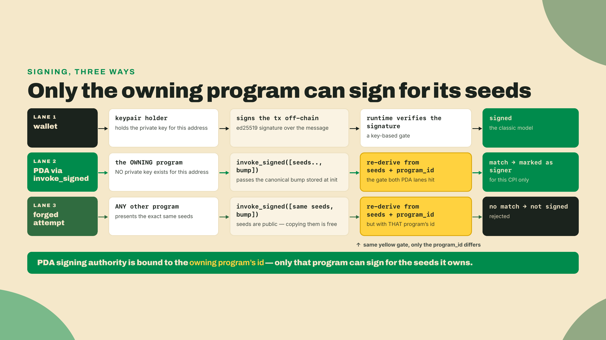
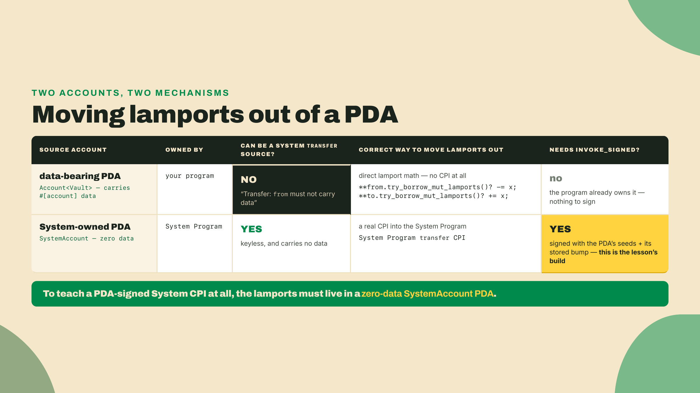
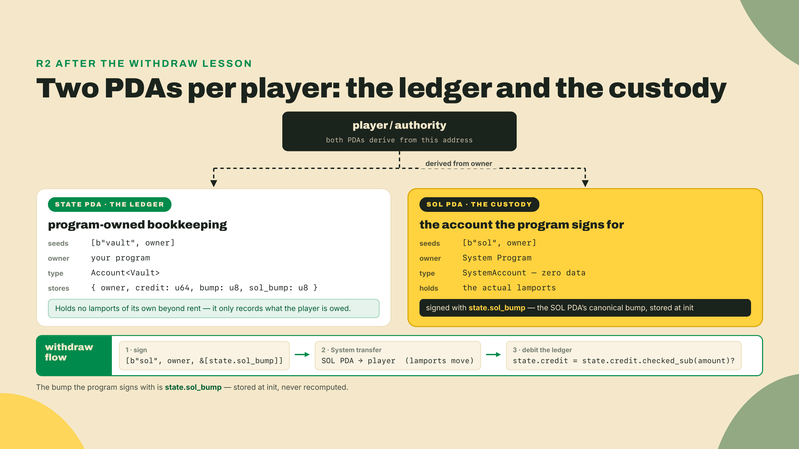
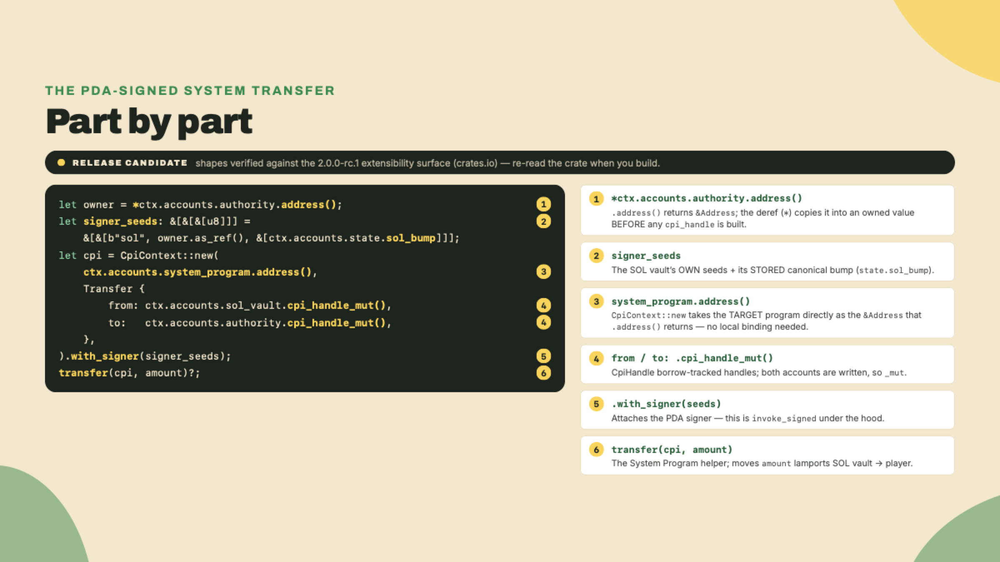
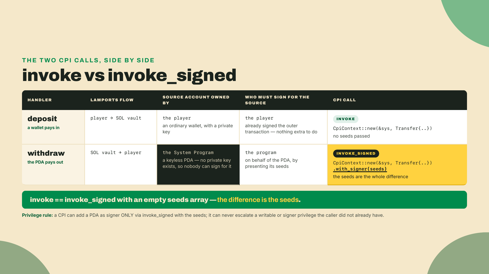
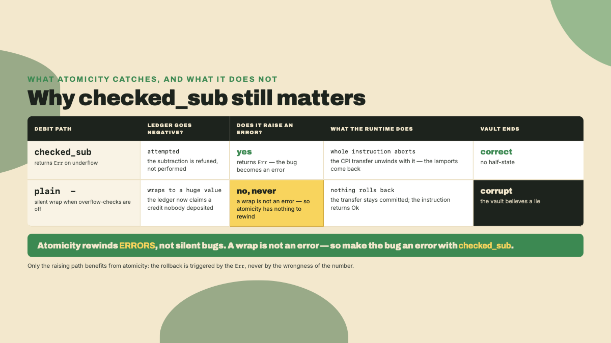
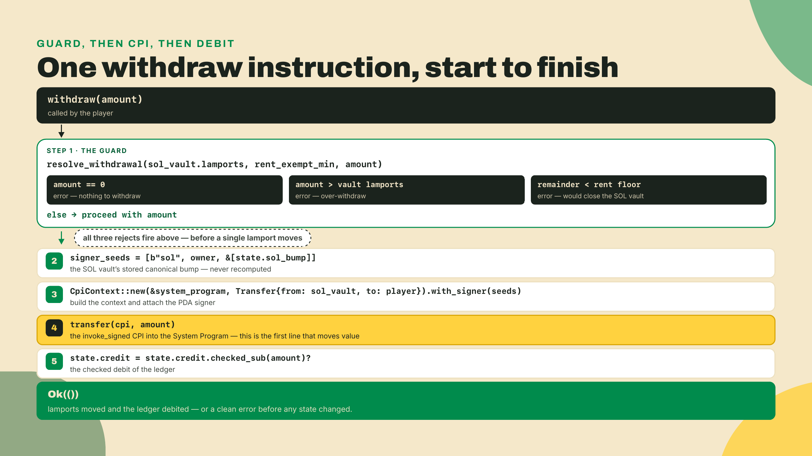
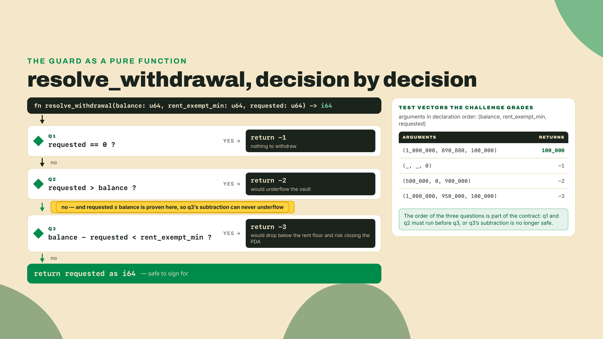

# The vault pays out: signing a CPI as a PDA

Last lesson you gave R2 a rule of its own. You wrote `quarters::min_balance` as a real `AccountConstraint`, and now `#[account(quarters::min_balance = 100)]` rejects an underfunded vault at constraint time, before your handler ever runs. The vault can hold credit and guard credit. What it has never done, not once in this whole module, is pay anyone back.

That is the gap we close today. And there is a puzzle hiding in it. The vault is a PDA. A PDA has no private key, by construction, so it cannot sign anything the normal way. So when a withdrawal moves lamports out of the vault, who signs? Not the player: it is not their account to spend from. Not you, holding some secret: there is no secret to hold. The answer is the program itself, and making the program sign for its own PDA is the entire lesson.

Before any of that, do the thing that makes the danger concrete. The withdrawal debits a balance, and a debit is subtraction, and subtraction on a `u64` is the single most-probed footgun on a custody path. Drop this into a scratch file and run it:

```rust
// scratch.rs - the debit an attacker will aim at
use std::hint::black_box;

fn main() {
    // black_box hides the values from const-eval, exactly as a real instruction's
    // arguments would; without it rustc sees the overflow at compile time and
    // refuses to build, which is not the failure we are hunting.
    let balance: u64 = black_box(50);
    let amount: u64 = black_box(100); // someone asks to withdraw more than they have
    let new_balance = balance - amount; // the naive debit
    println!("new balance: {new_balance}");
}
```

```bash
rustc --version              # any stable rustc; 1.93.1 on my machine
rustc scratch.rs -o scratch && ./scratch
```

A default `rustc` build panics: `attempt to subtract with overflow`. That looks like the safe outcome, and it is the *less* bad one. Build the same file with `rustc -O` and the panic disappears: it prints `new balance: 18446744073709551566`, the subtraction having silently wrapped to a `u64` near its ceiling. On-chain, a debug panic aborts your instruction with a confusing log, and a release wrap hands the caller a vault that now believes it owns eighteen quintillion lamports. Hold that failing line in your head. Every guard in this lesson exists to make sure that subtraction is never reached with `amount > balance`.

## Summary

- A PDA is off the ed25519 curve and has no private key. The runtime lets the **owning program** sign for it by presenting the PDA's exact seeds plus its canonical bump to `invoke_signed`. That is PDA signing: a synthetic signature the program authorizes, no keypair anywhere.
- In Anchor V2 the CPI shape changed. `CpiContext::new(program: &Address, accounts)` takes the target program as a `&Address`, and the accounts arrive as **`CpiHandle`** borrow-tracked handles from `.cpi_handle()` / `.cpi_handle_mut()`. You attach the PDA signer with `.with_signer(signer_seeds)`.
- There is a hard ownership rule underneath all of it: the System Program can only `transfer` lamports out of an account it *owns*. A data-bearing PDA (your `Account<Vault>`) is owned by your program, so a System transfer from it fails. The lamports have to live in a separate System-owned PDA that the program signs for.
- The bump you sign with is the **stored** canonical bump, read from account state, never recomputed. Recomputing it each call is both a CU cost and a correctness hazard.
- The debit is `checked_sub`, and the withdrawal is gated *before* the CPI fires: no zero request, no over-withdraw, and never a drop below the vault's rent-exempt floor.

The autonomy fade for today: in the Lab I write the whole `CpiContext::new` plus `invoke_signed` call with you, every line. In the completion problem you refill just two lines from memory, the signer-seeds array and the checked debit. In the solo problem you implement `resolve_withdrawal`, the pre-CPI guard, from a spec with no scaffold.

## Signing for an account that has no key

### Who signs when there is no private key

Start from the model you already have. A normal Solana account is a keypair: whoever holds the private key can sign a transaction that spends from it. That is how the player's wallet works. A PDA breaks that model on purpose. It is an address derived from your program's ID and a set of seeds, deliberately pushed *off* the ed25519 curve so that no private key can ever correspond to it. That is the feature, not a limitation: a vault with no key is a vault whose key cannot be stolen, phished, or leaked.

But a vault that can hold funds and never move them is a piggy bank you have to smash. So the runtime offers a trade. When your program calls `invoke_signed` and hands over the exact seeds plus the canonical bump used to derive one of the accounts in the call, the runtime re-derives the address from those seeds and your program's ID. If it matches, the runtime marks that account as a signer for the duration of the call. No cryptography happens. It is a permission the runtime grants because only the program that owns those seeds could have presented them. The PDA "signs" the way a manager signs for a company account: not with their own identity, but by proving they are authorized to act for it.



The last row of that diagram is the whole security model in one line: a PDA-signed CPI can only ever sign for seeds *this* program owns. You cannot sign for another program's PDA, and no one can sign for yours. Keep that sentence. It is also the exact boundary of what today's withdrawal can and cannot do.

### The footgun that decides the whole design

Here is where most people who have done this in v1 get bitten, so we meet it head-on before we build. The obvious plan is: the vault PDA holds lamports, the program signs as the vault, and it CPIs the System Program to `transfer` those lamports to the player. Clean. It also does not work, and the reason is worth understanding because it dictates the shape of everything below.

The System Program will only move lamports out of an account that the System Program *owns*. Your `Account<Vault>` is a data-bearing account: it carries the `#[account]` struct with the owner, the credit, the bump. The moment an account carries your program's data, it is owned by your program, not by the System Program. So a System `transfer` with your data-vault as the source fails at runtime with a very specific error: `Transfer: from must not carry data`. It is the single most common PDA mistake, and it fails *after* you have written and deployed the naive version, which is the worst time to learn it.

There are two correct ways to move lamports, and which one you use depends entirely on who owns the source account:



Read the takeaway row, because it forces our architecture. This lesson is about signing a CPI as a PDA. That mechanism, `invoke_signed` into the System Program, only exists for the System-owned case. So R2 cannot keep its lamports inside the data vault. It needs a second PDA: a zero-data `SystemAccount` that holds the actual SOL, one the program can sign a System transfer for. The data vault stays the ledger; the new SOL vault holds the money. That split is not incidental complexity, it is the custody decision the module has been building toward, and it is why the vault could not simply "pay out" until now.

### R2 grows a second PDA

So the quarter-vault after today is two accounts under each player, derived from the same owner but different seeds:



Two seeds, `b"vault"` and `b"sol"`, keep the addresses distinct so one player has both. The state PDA stores two bumps now: its own `bump` (unchanged from earlier lessons) and `sol_bump`, the canonical bump of the SOL vault, which we capture once at initialization and reuse forever. Why store the SOL vault's bump in the state account and not recompute it in `withdraw`? That is the next section, and it is where the CU numbers come in.

### The V2 CPI shape, walked

The V2 CPI is the shape you will type all lesson, so let us name every part of it before wiring it into a handler. Anchor V2 rebuilt this surface. Two things moved from the pre-1.0 form and the 1.0 line both: the program argument is now a `&Address`, not an `AccountInfo` and not a by-value `Pubkey`, and the accounts are passed as `CpiHandle` borrow-tracked handles rather than plain typed structs. You obtain those handles with `.cpi_handle()` for a read and `.cpi_handle_mut()` for a write. The PDA signer rides along through `.with_signer(signer_seeds)`, which is the ergonomic wrapper over the raw `invoke_signed` syscall.



One caveat on that block, the same one the earlier lessons carried: this is a release candidate, `2.0.0-rc.1` on crates.io as of this writing. The CPI ergonomics are high-confidence but still settling, so treat the exact token shapes as a moving target and re-read them against the crate when you build. The concepts under them, a `&Address` program, `CpiHandle` accounts, and `with_signer` for the PDA, are the stable part.

### invoke or invoke_signed: the deposit and the withdraw fork

There are two ways to make a CPI, and the difference is one thing: whose signature the callee needs. `invoke` is for a CPI where every signer it requires already signed the outer transaction. `invoke_signed` is for the case where the calling program has to sign on behalf of a PDA it owns. Under the hood they are the same syscall, `sol_invoke_signed_rust`; `invoke` is literally `invoke_signed` with an empty seeds array. So the mental model is not "two functions," it is "one function, and whether you hand it seeds."

R2's two money handlers land on opposite sides of that fork, which is why building both in one lesson is worth the extra handler. A `deposit` moves lamports from the player *into* the SOL vault. The player owns the source and already signed the transaction, so the System transfer needs no extra signature: plain `invoke`, a `CpiContext::new` with nothing attached. A `withdraw` moves lamports *out* of the SOL vault, whose source is a keyless PDA that signed nothing, so the program must supply the seeds and let the runtime grant the PDA its synthetic signature: `invoke_signed`, expressed as `.with_signer(signer_seeds)`.



There is a privilege rule worth internalizing while you are here, because it is the runtime guardrail that makes PDA signing safe to expose. A CPI can never escalate privileges: if the caller did not have an account as writable or signer, the callee cannot invent that privilege. The one sanctioned exception is exactly PDA signing: the runtime will add a PDA to the signer set, but only when the calling program presents seeds that re-derive to that PDA under the calling program's own ID. That is the whole reason a keyless account is safe to give spending power. The authority is not a secret that can leak, it is a derivation only the owning program can produce.

### The bump is stored, not recomputed

The signer seeds carry `ctx.accounts.state.sol_bump`, a byte we read from account state. We do not call `find_program_address` inside `withdraw` to rediscover it. This is worth being precise about, because "it works either way" is true and misleading at the same time.

A canonical bump is found by `find_program_address`, which starts at bump `255` and walks downward, calling `create_program_address` at each step until it lands on an address that is off the curve. Each of those derivation attempts is a syscall with a real CU price, and the walk can take one try or many. Store the bump once at init and `withdraw` skips the search entirely: it presents the known-good byte and the runtime does a single re-derivation to check it. Recompute the bump every call and you pay for the whole search, every call, forever, on a hot path. The saving is real but it is a *range*, not a fixed number, because it depends on how many bumps the search has to try and on the runtime's current per-syscall costs.

That last point is not hand-waving, and it is why this course cites CU savings as ranges and never freezes them. The Anchor V2 benchmarks got more honest over time:


The lesson from PR #4914 is not that Anchor got slower. It is that a headline number a maintainer corrected once will get corrected again, so the honest way to talk about a CU win is as a range you re-measure on your own program, not a trophy you quote. Storing the bump is unambiguously cheaper than recomputing it; the exact delta is yours to profile.

There is a correctness edge too, not just cost. `find_program_address` always returns the *canonical* (highest) bump, but a hand-rolled derivation with the wrong bump can land on a valid-but-non-canonical address, and a program that sometimes signs for a different address than it stores is a subtle, awful bug. Storing the one canonical bump at init and reusing it removes the whole class. Store the bump.

### The trade-off, said plainly

PDA signing makes the program the authority over the vault's money. That is exactly as powerful, and exactly as dangerous, as it sounds. Every withdrawal path you expose is a path an attacker will probe: a zero-amount call to see what happens, an over-withdraw to hunt for that unchecked subtraction, a request sized to drain the SOL vault below its rent-exempt floor and quietly close the account out from under the ledger. The program is the only thing standing between "the vault pays the right person the right amount" and "the vault pays whoever asks." So the guards are not politeness. They are the security boundary.

One property is working in your favor here, and it is worth naming so you rely on it correctly. An instruction is atomic: if the handler returns an error at any point, every change it made, including a CPI that already ran, is rolled back. So the ordering in `withdraw`, transfer first and then debit the ledger, is safe even though it looks risky. If the `checked_sub` on the ledger somehow fails after the transfer succeeded, the whole instruction aborts and the transfer unwinds with it. You never end up in the half-state where the lamports left but the ledger did not record it. What atomicity does *not* do is save you from an *unchecked* debit that wraps instead of erroring: a silent wrap is not a failure, so nothing rolls back, and the vault is left believing a lie. Atomicity protects you from errors, not from bugs that never raise one. That is the whole case for `checked_sub` over `-` in three words: make the bug an error.



Two hard limits ride along, and both are constraints you take as given rather than fight. First, the seeds boundary from the opening diagram: a PDA-signed CPI can only sign for seeds this program owns, so `withdraw` can move the SOL vault's lamports and nothing else. Second, CPI depth. The maximum instruction stack height is 5, meaning a program can nest CPIs up to 4 levels deep. SIMD-0268 (status Accepted) raises the nesting limit from 4 to 8, a stack height of 9, but its feature gate `6TkHkRmP7JZy1fdM6fg5uXn76wChQBWGokHBJzrLB3mj` still has no account on mainnet as of 2026-08-22, so treat 5 as the law and re-probe the gate at build time rather than trusting a status you cached. Our withdrawal is one CPI deep, nowhere near the ceiling, but the number matters the moment your program calls a program that calls a program.

It is worth zooming out for one beat before we build, because this instruction is the line where the whole module stops being a toy. A program that can only take deposits and read balances is a demo, and a demo is a thing you show once and never trust with anything that matters; the moment a program can move value out under its own authority, it becomes something a stranger can rely on without ever meeting you, and that is the entire promise of putting custody on a chain instead of in a company. Everything you have built so far, the counter, the vault, the stored bumps, the custom constraint, has been quietly assembling the one capability that makes any of it worth deploying: the ability to hold someone's money and give it back correctly, provably, without a human in the loop who could take it or lose it. That capability is also precisely the one an attacker most wants to break, which is why the unglamorous guard you are about to write, three comparisons and a checked subtraction, carries more of the program's real weight than any feature you will add on top of it.

## Lab: pay out from the vault

You are extending R2, the `quarter_vault` program, with a `withdraw` instruction that signs a System transfer as the SOL vault PDA and debits the ledger with checked math. When you finish, `anchor test` is green: a PDA-signed withdrawal moves lamports from the SOL vault to the player and debits `credit`, and an over-withdraw returns an error instead of panicking. Here is the shape of the handler you are building, so the steps have somewhere to land:



**1. Pin the V2 toolchain.** The V2 release candidate does not come down through `avm install`: that command downloads a prebuilt binary from the tag's GitHub Release, no Release was cut for the v2 tag, and the fetch 404s, exactly as the toolchain lesson (m01-l2) showed. The documented channel is a cargo git install, pinned to the `v2.0.0-rc.1` tag rather than the `anchor-next` branch tip it sits on. If you did this module's earlier lessons you already have it; if not, install and confirm. Do not build V2 content on a V1 `anchor` binary:

```bash
# macOS, if the build trips on LTO: prefix with CARGO_PROFILE_RELEASE_LTO=off
cargo install --git https://github.com/otter-sec/anchor.git \
  --tag v2.0.0-rc.1 anchor-cli --locked --force
anchor --version   # must report 2.0.0-rc.1 (the RC as of 2026-08-12; re-check for a newer rc/stable), not a 1.x line
```

**2. Extend the vault state with the SOL vault's bump, and rename two fields while you are in there.** Open R2's `lib.rs`.

Two mechanical renames first, because the vault is no longer only a player's. It now has an owner who might be a player today and an escrow program tomorrow, and it now has two accounts rather than one, so "the vault" is ambiguous. In every accounts struct in the program, rename the `player: Signer` field to `authority`, and the `vault: Account<Vault>` field to `state`. The account *type* stays `Vault`; only the field names move. Your test file's builders name those fields, so it will stop compiling until you rename there too, and that is the compiler doing your migration for you.

Then the state itself. The `Vault` from earlier lessons held the owner, a `credit` balance, its own `bump`, and the explicit tail padding that keeps it Pod. Add one field, `sol_bump`, the canonical bump of the SOL-holding PDA, so `withdraw` can rebuild the signer seeds without a search. It comes out of the padding, so the account's size does not change:

```rust
use anchor_lang::prelude::*;
use anchor_lang::system_program::{transfer, Transfer};

// Still the id anchor init generated for you.
declare_id!("<your generated program id>");

#[account]
#[repr(C)]
#[derive(InitSpace)]
pub struct Vault {
    pub owner: Address, // 32 bytes: whoever owns this vault
    pub credit: u64,    //  8 bytes: the withdrawable ledger balance
    pub bump: u8,       //  1 byte: this state PDA's canonical bump
    pub sol_bump: u8,   //  1 byte: the SOL vault PDA's canonical bump, stored at init
    pub _pad: [u8; 6],  //  6 bytes: explicit tail padding (was 7, sol_bump took one)
}
```

**2b. Teach `init_vault` about the second PDA.** Nothing writes `sol_bump` yet, and a zero there is the worst kind of bug: every `withdraw` rebuilds signer seeds against a bump that was never canonical, the runtime refuses to mark the PDA as a signer, and the error says nothing about why. `init_vault` also has to bring the SOL vault into existence, because a `SystemAccount` PDA that no instruction ever created is just an empty address. Both jobs are one edit:

```rust
pub fn init_vault(ctx: &mut Context<InitVault>) -> Result<()> {
    let bump = ctx.bumps.state;
    let sol_bump = ctx.bumps.sol_vault;   // the second PDA's canonical bump
    let state = &mut ctx.accounts.state;
    state.owner = *ctx.accounts.authority.address();
    state.credit = 0;
    state.bump = bump;
    state.sol_bump = sol_bump;            // store it once, sign with it forever
    Ok(())
}

#[derive(Accounts)]
pub struct InitVault {
    #[account(mut)]
    pub authority: Signer,
    #[account(
        init,
        payer = authority,
        space = Vault::DISCRIMINATOR.len() + Vault::INIT_SPACE,
        seeds = [b"vault", authority.address().as_ref()],
        bump,
    )]
    pub state: Account<Vault>,
    // The money side: zero data, System-owned, created here so it exists to be
    // signed for later. `space = 0` plus the explicit `owner` are what keep it a
    // legal System transfer source.
    #[account(
        init,
        payer = authority,
        space = 0,
        owner = System::id(),
        seeds = [b"sol", authority.address().as_ref()],
        bump,
    )]
    /// CHECK: typed UncheckedAccount because SystemAccount has no init path in V2,
    /// and UncheckedAccount is the one wrapper `init` may hand to a foreign owner.
    /// The `owner = System::id()` line does that handoff; without it, `init`
    /// defaults the owner to THIS program, and every later SystemAccount read of
    /// this PDA fails at load with IllegalOwner.
    pub sol_vault: UncheckedAccount,
    pub system_program: Program<System>,
}
```

Note where each bump comes from: `ctx.bumps.state` and `ctx.bumps.sol_vault`, one typed field per PDA in the struct, both supplied by the macro because both wrote a bare `bump`. That is the only place in this program a bump is ever searched for. Everything downstream reads the stored byte.

**3. Prove the debit math in isolation.** Before touching the CPI, get the *safe* version of the opening scratch right, because the checked debit is one of the two lines the completion problem hands back to you. The naive `balance - amount` panicked or wrapped; `checked_sub` returns `None` on underflow so you can turn it into a clean error:

```rust
// scratch.rs - the safe debit
fn debit(balance: u64, amount: u64) -> Result<u64, &'static str> {
    balance.checked_sub(amount).ok_or("underflow: over-withdraw")
}

fn main() {
    assert_eq!(debit(100, 40), Ok(60)); // normal
    assert_eq!(debit(50, 100), Err("underflow: over-withdraw")); // rejected, no panic
    println!("checked debit ok");
}
```

```bash
rustc scratch.rs -o scratch && ./scratch   # prints: checked debit ok
```

That is the debit locked. `None` on underflow, mapped to an error, never a panic and never a wrap. In the real handler the error is a program error, not a `&str`, but the logic is exactly this.

**4. Add the error variants.** A program gets one 6000-based error space, and a second `#[error_code]` enum compiles green while silently numbering its variants into that same range — an offset collision, not a compile error — so extend the `VaultError` you already have rather than adding a second enum. Keep every variant from the last two lessons, in order, and append the new ones: appending matters, because variants are numbered from 6000 by position and re-ordering them silently renumbers errors your tests already assert on. `withdraw` needs five new reasons to refuse:

```rust
#[error_code]
pub enum VaultError {
    // --- already yours, from m03-l2 and m03-l3. Do not reorder. ---
    #[msg("caller is not the configured arcade authority")]
    Unauthorized,
    #[msg("credit addition overflowed")]
    Overflow,
    #[msg("account is owned by the wrong program")]
    WrongOwner,
    #[msg("vault credit is below the quarters::min_balance floor")]
    BelowFloor,
    // --- new today ---
    #[msg("withdrawal amount must be greater than zero")]
    ZeroWithdrawal,
    #[msg("withdrawal exceeds the vault's lamport balance")]
    Overdraw,
    #[msg("withdrawal would drop the SOL vault below its rent-exempt floor")]
    WouldCloseVault,
    #[msg("arithmetic underflow while debiting the ledger")]
    Underflow,
    #[msg("caller is not the owner this vault recorded")]
    NotVaultOwner,
}
```

**5. Write the `withdraw` handler.** This is the worked core. The guard runs first and rejects every unsafe request before a single lamport moves. Then the signer seeds are built from the SOL vault's own seeds plus the *stored* `sol_bump`. Then the V2 CPI signs the System transfer as the PDA. Then the ledger is debited with `checked_sub`. Note the handler takes `&mut Context<T>`, the V2 signature:

```rust
#[program]
pub mod quarter_vault {
    use super::*;

    pub fn withdraw(ctx: &mut Context<Withdraw>, amount: u64) -> Result<()> {
        // --- guard: refuse every unsafe request before touching lamports ---
        let vault_lamports = ctx.accounts.sol_vault.lamports();
        let rent_exempt_min = Rent::get()?.minimum_balance(0); // SOL vault carries zero data
        require!(amount > 0, VaultError::ZeroWithdrawal);
        require!(amount <= vault_lamports, VaultError::Overdraw);
        // checked_sub even here, where the line above already proved it cannot
        // underflow. The proof is one refactor away from being wrong, and this
        // lesson opened on what a bare `-` does in a release build.
        let remaining = vault_lamports
            .checked_sub(amount)
            .ok_or(VaultError::Overdraw)?;
        require!(remaining >= rent_exempt_min, VaultError::WouldCloseVault);

        // --- the PDA-signed CPI: sign the System transfer AS the SOL vault ---
        // Copy these out of ctx.accounts BEFORE any CPI handle is built. The `*`
        // matters: .address() returns &Address, and the deref makes `owner` an
        // owned copy instead of a live borrow of ctx.accounts.
        let owner = *ctx.accounts.authority.address();
        let sol_bump = ctx.accounts.state.sol_bump;
        let signer_seeds: &[&[&[u8]]] = &[&[b"sol", owner.as_ref(), &[sol_bump]]];
        let cpi = CpiContext::new(
            ctx.accounts.system_program.address(),
            Transfer {
                from: ctx.accounts.sol_vault.cpi_handle_mut(),
                to: ctx.accounts.authority.cpi_handle_mut(),
            },
        )
        .with_signer(signer_seeds);
        transfer(cpi, amount)?;

        // --- debit the ledger with checked math ---
        ctx.accounts.state.credit = ctx
            .accounts
            .state
            .credit
            .checked_sub(amount)
            .ok_or(VaultError::Underflow)?;

        Ok(())
    }

    /// Contrast handler: a deposit needs NO invoke_signed. The player owns the
    /// source, so the player signs the System transfer the ordinary way.
    pub fn deposit(ctx: &mut Context<Deposit>, amount: u64) -> Result<()> {
        let cpi = CpiContext::new(
            ctx.accounts.system_program.address(),
            Transfer {
                from: ctx.accounts.authority.cpi_handle_mut(),
                to: ctx.accounts.sol_vault.cpi_handle_mut(),
            },
        );
        transfer(cpi, amount)?;
        ctx.accounts.state.credit = ctx
            .accounts
            .state
            .credit
            .checked_add(amount)
            .ok_or(VaultError::Overflow)?;
        Ok(())
    }
}
```

Look at the two handlers side by side, because the contrast is the lesson's spine. `deposit` moves lamports *into* the SOL vault from the player, and it needs no `with_signer`: the player owns the source and signs the outer transaction, so an ordinary `invoke` (a `CpiContext::new` with no signer attached) is enough. `withdraw` moves lamports *out* of the SOL vault, whose source is a keyless PDA, so it must attach `signer_seeds` and let the program sign. Same System transfer, opposite direction, and the direction is what decides who signs.

One more detail worth noticing now: `owner` and `sol_bump` are copied out of `ctx.accounts` into plain locals *before* any `cpi_handle` is built. That ordering is load-bearing in V2, not a style choice, and the next lesson is entirely about why.

**6. Wire the accounts.** `withdraw` needs the state ledger, the System-owned SOL vault, the player, and the System Program. The SOL vault is a `SystemAccount` (zero data, so a System transfer can source from it), and its `bump` constraint reuses the stored `sol_bump`, not a fresh search. Note that neither the state nor the SOL vault is validated by recomputing a bump: both use `bump = ...` with the stored byte.

```rust
#[derive(Accounts)]
pub struct Withdraw {
    #[account(mut, address = state.owner @ VaultError::NotVaultOwner)]
    pub authority: Signer,

    #[account(
        mut,
        seeds = [b"vault", authority.address().as_ref()],
        bump = state.bump,
    )]
    pub state: Account<Vault>,

    #[account(
        mut,
        seeds = [b"sol", authority.address().as_ref()],
        bump = state.sol_bump, // reuse the stored canonical bump, no runtime search
    )]
    pub sol_vault: SystemAccount,

    pub system_program: Program<System>,
}

#[derive(Accounts)]
pub struct Deposit {
    #[account(mut)]
    pub authority: Signer,
    #[account(
        mut,
        seeds = [b"vault", authority.address().as_ref()],
        bump = state.bump,
    )]
    pub state: Account<Vault>,
    #[account(
        mut,
        seeds = [b"sol", authority.address().as_ref()],
        bump = state.sol_bump,
    )]
    pub sol_vault: SystemAccount,
    pub system_program: Program<System>,
}
```

The `address = state.owner` on the authority binds the signer to the exact key the ledger stored at init, so a caller cannot present someone else's ledger. This is V2's expression-based replacement for the deprecated v1 `has_one`, and it is the same "bind every stored key" discipline from the constraints lessons; on a custody path it is not optional.

Notice which constraint is *not* on `Withdraw`, because last lesson made a point of it. `quarters::min_balance = 100` is still in your program and still on `require_funded`, and it is deliberately absent here. A floor that blocked withdrawals would trap a player's last 100 credits in the vault forever, which is the opposite of a custody guarantee. That is the honest half of "the constraint comes along for free on any instruction that loads the vault": it comes along on the instructions where you put it, and deciding where is still a judgment call. `require_funded` gates *spending*; `withdraw` returns the player's own money and gates only against the vault's real lamports.

Checkpoint for steps 2 through 6: run `anchor build`. It compiles clean, with no `has_one` deprecation warning, no missing-field error on `sol_bump`, and no `player`/`vault` field names left in the derive structs or the test builders. One runtime note for later: any vault you initialized in an earlier lesson predates `sol_bump` and predates the SOL PDA entirely, so its stored `sol_bump` is whatever was in those padding bytes and its SOL vault does not exist. An account's size and contents are fixed at init, so those old vaults are not upgradeable here. The tests below create fresh ones, which is the only path this lesson supports.

**7. Write the LiteSVM test.** LiteSVM runs the program in-process with no validator, so the loop is fast. Add the dev-dependencies:

```toml
# The same one row as module 3, for the same reason: anchor-v2-testing owns the SVM
# version. At tag v2.0.0-rc.1 that is litesvm 0.11.0, and you never say so yourself.
[dev-dependencies]
anchor-v2-testing = { git = "https://github.com/otter-sec/anchor.git", tag = "v2.0.0-rc.1" }
```

The test funds the SOL vault through `deposit`, withdraws part of it and proves the lamports moved and the ledger dropped, then proves an over-withdraw is rejected cleanly rather than panicking. The move-and-the-reject are the whole artifact:

```rust
use anchor_lang::{
    prelude::Address,
    programs::System,
    solana_program::instruction::{AccountMeta, Instruction},
    Id, InstructionData, ToAccountMetas,
};
use anchor_v2_testing::{Keypair, LiteSVM, Message, Signer, VersionedMessage, VersionedTransaction};

fn ix(program_id: Address, accounts: Vec<AccountMeta>, data: Vec<u8>) -> Instruction {
    Instruction { program_id, accounts, data }
}

// One place that turns an instruction into a signed, sendable transaction.
fn tx(svm: &LiteSVM, payer: &Keypair, instruction: Instruction) -> VersionedTransaction {
    let blockhash = svm.latest_blockhash();
    let msg = Message::new_with_blockhash(&[instruction], Some(&payer.pubkey()), &blockhash);
    VersionedTransaction::try_new(VersionedMessage::Legacy(msg), &[payer]).unwrap()
}

#[test]
fn withdraw_moves_lamports_and_rejects_overdraw() {
    let mut svm = anchor_v2_testing::svm();
    let program_id = quarter_vault::ID;
    let vault_so = concat!(env!("CARGO_MANIFEST_DIR"), "/../../target/deploy/quarter_vault.so");
    svm.add_program_from_file(program_id, vault_so).unwrap();

    let authority = Keypair::new();
    svm.airdrop(&authority.pubkey(), 5_000_000_000).unwrap();
    let (state_pda, _) =
        Address::find_program_address(&[b"vault", authority.pubkey().as_ref()], &program_id);
    let (sol_pda, _) =
        Address::find_program_address(&[b"sol", authority.pubkey().as_ref()], &program_id);

    // init_vault (rewritten in step 2b) creates BOTH PDAs and stores both bumps.
    let init = tx(
        &svm,
        &authority,
        ix(
            program_id,
            quarter_vault::accounts::InitVault {
                authority: authority.pubkey(),
                state: state_pda,
                sol_vault: sol_pda,
                system_program: System::id(),
            }
            .to_account_metas(None),
            quarter_vault::instruction::InitVault {}.data(),
        ),
    );
    svm.send_transaction(init).unwrap();

    // deposit 2 SOL into the SOL vault (player signs; no PDA signature needed).
    let deposit = tx(
        &svm,
        &authority,
        ix(
            program_id,
            quarter_vault::accounts::Deposit {
                authority: authority.pubkey(),
                state: state_pda,
                sol_vault: sol_pda,
                system_program: System::id(),
            }
            .to_account_metas(None),
            quarter_vault::instruction::Deposit { amount: 2_000_000_000 }.data(),
        ),
    );
    svm.send_transaction(deposit).unwrap();
    let funded = svm.get_account(&sol_pda).unwrap().lamports;

    // withdraw 1 SOL: the PDA-signed CPI must move lamports OUT of the SOL vault.
    let withdraw = |svm: &LiteSVM, amount: u64| {
        tx(
            svm,
            &authority,
            ix(
                program_id,
                quarter_vault::accounts::Withdraw {
                    authority: authority.pubkey(),
                    state: state_pda,
                    sol_vault: sol_pda,
                    system_program: System::id(),
                }
                .to_account_metas(None),
                quarter_vault::instruction::Withdraw { amount }.data(),
            ),
        )
    };
    svm.send_transaction(withdraw(&svm, 1_000_000_000)).unwrap();
    let after = svm.get_account(&sol_pda).unwrap().lamports;
    assert_eq!(funded - after, 1_000_000_000, "1 SOL must leave the vault");

    // over-withdraw: asking for more than the vault holds must ERROR, not panic.
    let overdraw = svm.send_transaction(withdraw(&svm, 100_000_000_000));
    assert!(overdraw.is_err(), "an over-withdraw must be rejected cleanly");
}
```

**8. Build and run.**

```bash
anchor test
```

Expected output, the one passing test that clears the bar:

```
running 1 test
test withdraw_moves_lamports_and_rejects_overdraw ... ok

test result: ok. 1 passed; 0 failed
```

The proof is in the two assertions. The first shows exactly one SOL left the vault, which can only happen if the program signed the transfer as the PDA, because the SOL vault has no key and the player is not its owner. The second shows the over-withdraw came back as `is_err()`, the guard rejecting it before the CPI, not a panic in the log. If instead the over-withdraw *panics* rather than erroring, the usual cause is the guard order: you must prove `amount <= vault_lamports` before the `vault_lamports - amount`, or the subtraction underflows inside the guard itself. Re-run the step-3 scratch to isolate the math from the wiring.

## Challenge

One rung you refill from memory, one you build cold.

**Completion.** Reopen `withdraw` and blank out the two lines the Lab wrote for you: the `signer_seeds` array and the `checked_sub` debit. Leave `let signer_seeds: &[&[&[u8]]] = /* TODO */;` and `ctx.accounts.state.credit = /* TODO */;`. Refill both from memory. The seeds must be the SOL vault's own seeds plus its *stored* bump copied into a local first, `&[&[b"sol", owner.as_ref(), &[sol_bump]]]`, and the debit must be `checked_sub(amount).ok_or(VaultError::Underflow)?`. If you reach for `find_program_address` to get the bump, stop: the whole point is the stored byte, and recomputing it costs CU and risks a non-canonical bump. The acceptance check is `anchor test` from step 8, still green.

**Solo.** Extract the guard into a standalone, testable function, `resolve_withdrawal`, and prove it in pure Rust before wiring it back into the handler. This is the pre-CPI guard, distilled so it can be unit-tested with no framework at all:



The starter, solution, and test vectors live in `lessons/m04-l1/resolve-withdrawal/`, alongside the other challenges in this course. The starter ignores every guard and hands back `requested` unconditionally — and because the function is a `const fn` with compile-time assertions under it (the m03-l3 device, which is what compile-only grading actually enforces), the unguarded version does not even build: the first error names the zero-request case. One deliberate wart to notice rather than copy: the signature returns `i64` sentinels because a pure function with no framework in scope has no `VaultError` to return, and the vectors stay small enough that the `as i64` cast is exact. In the handler it becomes a `Result` with the typed errors from step 4, and if you ever find yourself shipping sentinel codes out of real program code, that is the smell the typed-error section of module 1 was about. Acceptance: the check cases pass in order, the over-withdraw returns `-2` instead of underflowing, the rent floor is *inclusive* so a withdrawal leaving exactly `rent_exempt_min` is allowed and one lamport less is `-3`, an over-withdraw that would also breach the floor is still `-2` because the balance check is reached first, and — the part that matters — your subtraction is `checked_sub` rather than a bare `-`, exactly as in the handler — even though the guard above it already proved `requested <= balance`, because that proof is one refactor away from being wrong and a bare `-` wraps silently in a release build. Then swap the three `require!`s in `withdraw` for a call to your resolved amount and confirm `anchor test` is still green. One thing worth watching: `resolve_withdrawal` guards the *lamport* movement against the SOL vault's balance, while the `checked_sub` guards the *ledger*. They are two different balances doing two different jobs, and a real custody bug is letting them drift apart.

You have made the vault do the one thing it could not do before: pay someone back, under the program's own authority, with a signature no attacker can forge because there is no key to steal. You built the guard, you signed the CPI as the PDA with a stored bump, and you debited the ledger with math that refuses to underflow. That is the custody loop, closed.

Your withdrawal works. But there is a trap in it that v1 set for thousands of programs, and you have not hit it only because the Lab never re-read the vault's balance right after the CPI. In v1, reading a deserialized account's fields *after* a CPI mutated it gave you stale data unless you remembered to call `.reload()`, and forgetting was a classic way to ship a bug. In V2 the `CpiHandle` borrow model you used today is what makes that same mistake refuse to compile. Next lesson: exactly how, and why the compiler is now the thing keeping you safe instead of a `.reload()` call you had to remember.
