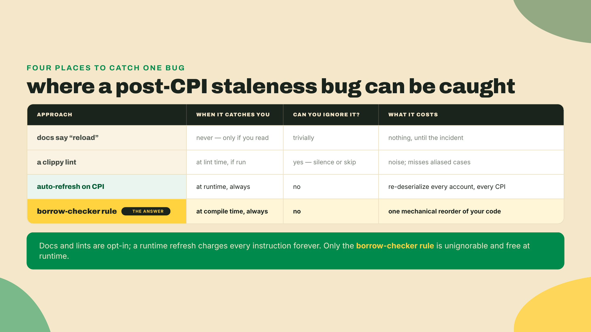
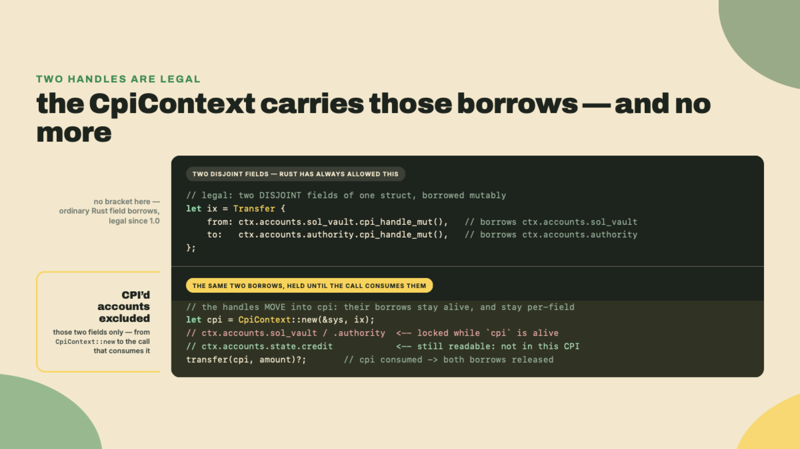
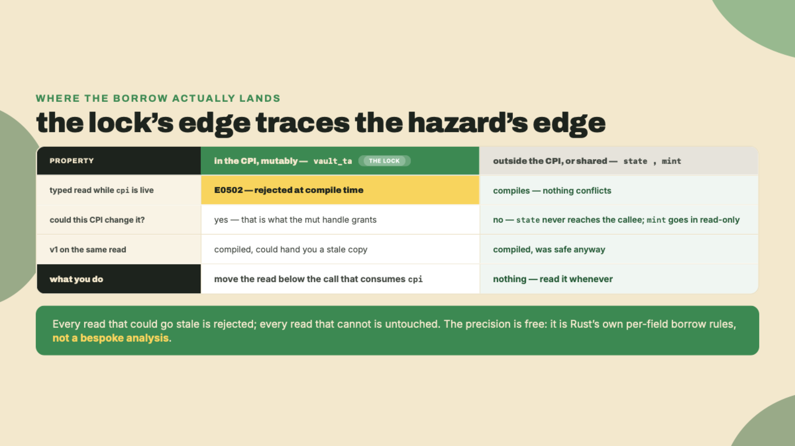
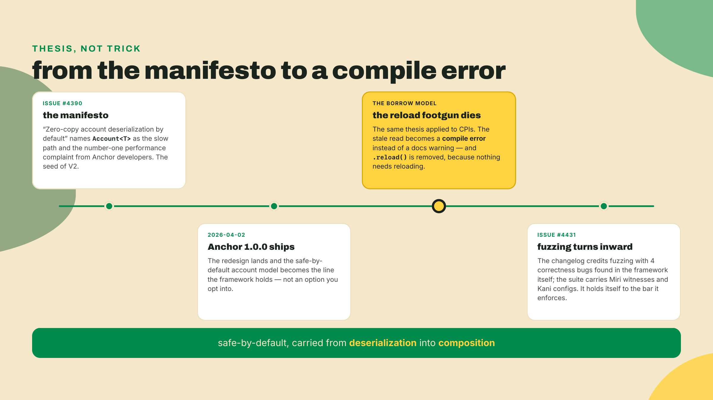
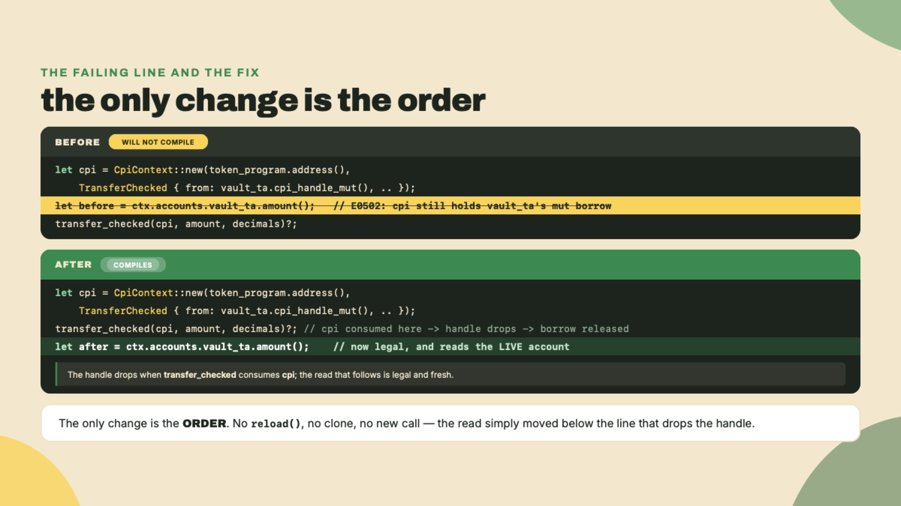

# The reload footgun is gone

Last lesson the vault learned to pay out. You reconstructed its signer seeds from the seeds plus the stored canonical bump, called `invoke_signed` through `CpiContext::new(...).with_signer(...)`, and moved real lamports out of a keyless PDA under program authority. The vault signs for itself now. Lamports leave it on the program's say-so, not a human's keypair.

There is a bug that lives exactly one line past that withdrawal, and in the older Anchor line it shipped constantly. The shape is this: you do a CPI, then you read the account you just changed, and you act on the old value. It compiled. It ran. It passed the happy-path test. And then in production it made a decision on a number that was already wrong. Everyone who wrote Anchor for a living hit this at least once. In V2 that bug is gone, and the way it is gone is stranger and better than the rumor you may have heard.

So let us go looking for the wall. Open the R2 program from last lesson and find the `withdraw` handler. Right after you construct the `cpi` value, before `transfer` consumes it, drop in one line:

```rust
let before = ctx.accounts.state.credit;
```

Now run `anchor build`. If what you have heard about V2's borrow model is "you cannot touch `ctx.accounts` while a CPI is in flight," you expect a compile error here. You will not get one. The build comes back green, and it is *supposed* to: `state` is not one of the accounts this CPI takes, so nothing about the transfer can invalidate it, and the compiler knows that. Where the wall actually stands — one account over — is the entire point of this lesson. Read the next section before you touch anything else, because what V2 allows here is as deliberate as what it forbids.

## Summary

One concept, and it is a why, not a how: reading an account's typed data while a live `CpiHandle` borrows that same account mutably is a compile error in Anchor V2, and that rule — landing on exactly the accounts a CPI could change and on nothing else — retires v1's `.reload()`-after-CPI footgun for good. Not softened. Not linted. Made unwritable.

We are going to reconstruct why the framework's authors chose to enforce this with the borrow checker instead of a warning, walk the naive alternatives and watch each one fail, and pin down the exact edge of the guarantee, because a safety promise you misjudge is worse than none. The v1 hazard was silent and it ran; the V2 replacement is loud and it stops the build. Moving a failure from runtime-and-quiet to compile-time-and-obvious is the whole thesis of V2, and this is that thesis applied to the moment one program calls another.

The gate you are working toward is small and sharp. Given a snippet that reads an account's typed data while that account's own `CpiHandle` is live and therefore refuses to compile, you reorder the read to after the handle drops so the program builds, and you name the bug class V2 eliminated in one sentence. That is it.

The autonomy fades the usual way. In the Lab I show you the failing shape and the fix in full, because I want the borrow-checker error in your eyes and the reorder in your fingers. In the Challenge you get a different broken snippet with no scaffolding, and you fix it and name the class yourself. The graded rung after it runs the same discipline with the framework stripped away and a grader watching: a receipt that has to be right, not merely compile. Read, break, fix, name.

## Why the compiler now has your back

### The v1 footgun, precisely

Start with how this worked before, because you cannot appreciate the fix until you have felt the wound. In the 1.0 line, `CpiContext::new` took the program as a plain by-value `Pubkey` (and in the 0.x line before it, an `AccountInfo`), and the accounts you handed it were ordinary deserialized structs. Anchor read the account's bytes off the chain once, at the top of your instruction, and handed you a typed copy to work with.

That copy is the problem. When you fire a CPI that mutates an account, the change lands in the account's real bytes on-chain. Your deserialized copy, the struct sitting in your instruction's memory, does not move. It still holds whatever it held when Anchor first read it. So the classic sequence looked innocent and lied:

```rust
// Anchor v1. This compiles, runs, and is wrong.
token::transfer(cpi_ctx, amount)?;              // the vault's on-chain amount drops
let remaining = ctx.accounts.vault.amount;      // reads the STALE pre-transfer copy
require!(remaining >= floor, VaultError::TooLow); // decides on a number that is already false
```

The vault's real balance went down. Your `remaining` did not. You then gated a payout, or a mint, or a liquidation on a value the chain had already invalidated. The fix v1 offered was a method you had to remember to call: `.reload()`, which re-read the account's bytes and refreshed your copy.

```rust
token::transfer(cpi_ctx, amount)?;
ctx.accounts.vault.reload()?;                   // re-read the live bytes; NOW the copy is fresh
let remaining = ctx.accounts.vault.amount;
```

One line. Cheap. And catastrophic to omit, because omitting it produced no error, no warning, no panic. Just a program that quietly read the past.


Sit with why this was so dangerous. It was not that the fix was hard. It was that the failure was invisible. A missing `checked_sub` panics and you see it in the logs. A missing `.reload()` succeeds, and the only witness is a value that is subtly wrong on a code path a test rarely exercises. Silent-and-wrong is strictly worse than loud-and-broken, because loud gets fixed on Tuesday and silent gets fixed after an incident.

Before we pile on v1, though, grant it the honest defense, because the design was not stupid, it was a reasonable trade that aged badly. Deserializing an account once, at the top of the instruction, and reusing that copy is genuinely faster than re-reading the bytes every time you touch a field. For an instruction that never fires a CPI, and plenty do not, the copy is always correct and always cheap. v1 optimized for the common case and left a sharp edge on the uncommon one. That is a defensible call right up until the uncommon case is "moving money," at which point the edge is exactly where you cannot afford it.

And notice the shape of the failure, because it is worse than "sometimes wrong." Separate the average case from the worst case, the way you should with any hazard. In the average case, the account you read after a CPI was not actually changed by that CPI, so the stale copy happens to equal the live value and your code is accidentally correct. That is the trap: the bug tests clean, demos clean, and sits dormant for months. The worst case is the one specific path where the CPI did move the number you then read, and that path tends to be the high-stakes one, a payout sized against a balance, a mint gated on a supply. A mechanism that is right on the boring paths and wrong on the one path that matters is not a mechanism you want guarding a vault. It is a landmine with good odds.

### The question that forces the design

So here is the question the V2 authors actually had to answer. How do you make the stale post-CPI read not merely discouraged, not documented, but *impossible to write*? Not "the docs tell you to call `.reload()`." Impossible. The programmer should not be able to express the bug even if they want to.

That is a higher bar than it sounds, and the obvious ways to clear it all fail. Watch them fail, because ruling them out is what makes the real answer feel inevitable instead of arbitrary.



### The naive fixes, ruled out in tiers

The first naive fix is the one v1 already tried: write it in the docs. "Remember to call `.reload()` after a CPI that mutates an account you read." This fails on contact with human memory. It is not a mechanism, it is a hope, and it is precisely the hope that failed for a decade. A rule enforced by remembering is a rule that is broken the week you are tired.

The second naive fix is a lint. Ship a clippy rule that flags a read after a CPI. Better, because a machine checks it. But a lint is advisory by construction. You can `#[allow]` it, you can not run clippy in CI, and worse, a lint that tries to track "is this account the one the CPI mutated, through this alias, across this helper function" is exactly the kind of whole-program dataflow that lints are bad at. It will miss the interesting cases and cry wolf on the boring ones. A guarantee you can silence is not a guarantee.

The third naive fix is the tempting one: make the framework refresh the account for you. After every CPI, silently re-deserialize every account you hold, so your copy is never stale. Correct, and it never forgets. But now measure the cost against the realistic baseline, because "compared to what" is the only honest way to judge it. Eager deserialization of `Account<T>` was already the framework's single largest compute expense. The V2 manifesto that kicked off this whole redesign, issue #4390, "Zero-copy account deserialization by default," named exactly that: `Account<T>` was the slow path, and the number-one performance complaint from Anchor developers. Auto-refreshing on every CPI would take the most expensive thing the old framework did and do it *more often*, on every account, on every call, whether or not you ever read the thing again. You would buy safety with the exact tax V2 was built to abolish. And it still would not cover raw byte reads, so it is not even complete.

So the naive tier collapses, and the requirement sharpens into something narrower and stranger. We do not want to refresh the data, and we do not want to warn about the read. We want to make it so that you cannot *hold* a read of an account while a live CPI holds the right to change that account. If those two things are mutually exclusive, the stale-read line simply cannot be typed. That is not a runtime check and it is not a lint. That is the borrow checker.

### The mechanism: a CpiHandle is a borrow

Here is the load-bearing idea, defined precisely. In V2 you no longer hand a CPI an `AccountInfo` clone. You hand it a `CpiHandle`, which you get with `.cpi_handle()` or `.cpi_handle_mut()`. And a `CpiHandle` is not a copy of anything. It is a live Rust borrow of the account, held for as long as the handle is in scope.

That one design choice does all the work. While a `CpiHandle` is alive, the account it points at is borrowed, so the borrow checker will not let you form a second, conflicting borrow to read typed data. The read and the handle cannot coexist.



Be exact about *what* is borrowed, because exactness is the design. `cpi_handle_mut()` borrows a single field: `ctx.accounts.sol_vault` and `ctx.accounts.authority` are disjoint paths, and Rust has always allowed two mutable borrows of two different fields of one struct. There is no framework magic underneath that sentence, either — `Context` declares `accounts` as a plain field and your accounts struct is a plain struct, so the ordinary field-borrow rules are the whole story. That is why the pair inside the `Transfer { from, to }` literal is fine. And moving both handles into a `CpiContext` widens nothing: the context now carries those two borrows — of `sol_vault` and of `authority`, and of nothing else — and keeps them alive until the CPI call consumes it. From the moment `cpi` exists to the moment `transfer(cpi, ...)` eats it, those two accounts are locked and every other field of `ctx.accounts` is as readable as it ever was. That is what the green build at the top of this lesson was telling you: `state` never went into the CPI, so reading `state.credit` conflicts with nothing. Call it borrow-checker exclusion, and state it precisely: a live handle *excludes* conflicting access to the account it borrows, for exactly as long as it lives — a mutable handle excludes your reads, and any handle excludes your writes.

If it helps, think of each handle as checking one specific book out of a library. While a book is checked out to the CPI, nobody else can read that book — but the rest of the library stays open — and the moment the book comes back, what you pull is the current edition, not a photocopy you made last week. The analogy carries the important part, that the checkout is exclusive and time-bounded, and it breaks in one place worth flagging: a library book is one physical object, while the borrow here is enforced entirely at compile time, before a single instruction runs. Nothing is locked at runtime. The compiler simply refuses to emit a program in which the two overlap, so the "conflict" is never a race, it is a build failure. Keep the exclusivity from the analogy and drop the physicality.


Now look back at last lesson with new eyes. Remember the very first thing the withdraw handler did? It copied values *out* of `ctx.accounts` before building any handle:

```rust
let owner = *ctx.accounts.authority.address();  // copied out FIRST — the `*` makes it a copy
let sol_bump = ctx.accounts.state.sol_bump;     // a plain u8 copy
```

I told you then only that the ordering was load-bearing rather than stylistic, and promised the reason this lesson. Here it is, and it is narrower and sharper than "`ctx.accounts` is off limits." Look at the first line. `.address()` does not hand you an owned value; it returns `&Address`, a borrow of `ctx.accounts.authority`. The `*` dereferences that into a plain copy on your stack, and the borrow ends at the semicolon. Drop the `*` and `owner` stays a reference into `ctx.accounts.authority` — which your signer-seeds array then carries all the way to the CPI. The moment `cpi_handle_mut()` asks for its mutable borrow of that same `authority` field, the compiler refuses: E0502, immutable borrow still live, mutable borrow requested, same account. The copy-out is load-bearing because `authority` is one of the accounts this CPI takes. The second line, by contrast, is convention rather than law: `state` never goes into this CPI, so the compiler would accept that read anywhere in the handler. Keeping it at the top is still the right habit — captures first, handles in the middle, post-CPI reads after — but know which line the compiler enforces and which one is style.

And notice what this buys you at the far end. In v1 you read after the CPI and got a stale copy unless you called `.reload()`. In V2 there is no `.reload()`, because there is nothing to reload.

That claim rests on module 2, so join the two facts rather than taking it on faith. v1's stale read existed because `Account<T>` deserialized a *copy* at the top of the instruction: your handler held an owned struct on the stack, and a CPI mutating the on-chain bytes had no way to reach it. V2's `Account<T>` is a zero-copy view over the account's live buffer, so `ctx.accounts.state.credit` is not a field of a copy, it is an offset read into the bytes the CPI just wrote. There is no second copy anywhere to go stale. That is why `.reload()` could be deleted rather than replaced: the borrow model does not refresh your data, it gates *when* you are allowed to read, and the zero-copy account model is what makes the read you are then allowed to do already fresh. Two halves of the same thesis, and this is where they meet.

### The lock is exact, and exact is the point

A sharp reader raises an objection here, and it is a good one, so let us answer it instead of dodging it. If the whole point is safety, why does the lock fall on *only* the accounts handed to the CPI? When the SOL vault's handle is live you can still read the `state` account — the green build at the top of this lesson proved it. Should the framework not lock all of `ctx.accounts`, just to be safe? A whole-struct lock sounds like the paranoid choice, and paranoid usually wins on a custody path.

No — and working out why sharpens the whole model. Ask what the wider lock would actually buy. A CPI can only touch accounts you handed it: the runtime delivers the instruction's account list to the callee and nothing else, so an account outside the `CpiContext` cannot be changed by that call, which means a mid-CPI read of it cannot go stale *through that call*. Locking `state` while the vault's handle is live would not prevent a single bug; it would only force you to contort correct code. The exclusion V2 actually enforces lands on precisely the accounts whose typed copy would have gone stale in v1 — the ones the CPI can write — and on nothing else. It even splits finer than that: an account the CPI only *reads* goes in through a shared `cpi_handle()`, and shared borrows tolerate your reads, so the mint you pass to a token transfer stays readable while the vault next to it is locked. The exclusion lands on exactly the accounts the CPI can write, and on nothing else.

And notice what V2 did *not* have to build to get that precision. A framework that invented its own "which accounts can this CPI reach" analysis would have to follow every account through every alias, every helper, every branch — and a missed alias would be a leak, a stale read waved through with a green checkmark. V2 sidesteps the entire problem by not inventing an analysis at all. `Context` declares `accounts` as a plain field; your accounts struct is a plain struct; a `CpiHandle` is a plain borrow of one field. The "analysis" is Rust's own per-place borrow checking, the same rules that govern every struct in every Rust program, hardened by a decade of the entire ecosystem leaning on them. The framework gets exactness *and* leak-freedom in one move, by arranging its types so the language does the enforcement.



This is a recurring V2 instinct, so it is worth naming as a rule you can carry: do not hand-build a guarantee the type system will give you for free. A bespoke lock — coarse or clever — is framework code somebody has to get right and keep right forever. A borrow is a language rule the compiler already gets right on every build. When you design your own APIs the same move is available: shape your types so the invariant falls out of ordinary borrow rules, and the compiler does the enforcement.

### The exact edge of the guarantee

This is where a lazy explanation would tell you the compiler now handles account freshness and send you on your way. Do not believe that, because it is false in a way that will bite you. Knowing the precise edge of a safety guarantee is part of using it well, so let us draw the line exactly.

The compiler guards *typed account access*, on the accounts a live handle borrows. That is it. If you go around the typed layer and read raw `AccountInfo` lamports directly, or pull bytes out of an account's data buffer by hand, the borrow model does not protect you. Those reads are yours to reason about, exactly as they were in v1. A teammate who tells you the borrow checker means you never think about freshness again is wrong on both counts: it does not refresh anything, and it does not cover raw reads.


And name the trade-off honestly, because there is one. The borrow model buys compile-time safety with a little flexibility. A handful of ergonomic v1 patterns — the ones that read an account partway through setting up the very CPI that takes it — now need restructuring: you drop the handle, then you read. The cost is a mechanical refactor, usually moving one line down a few lines. That is the whole bill. You trade "I can write the code in any order" for "the order I am allowed to write cannot be the wrong one." On a path that moves other people's money, that is a trade I take every single time. Cheap insurance against a silent bug is the best kind.

The doubt that usually follows is fair: what if I genuinely need a value mid-CPI, something I have to read while the call is being assembled? Nearly always, you do not, you only think you do out of v1 habit. If the value comes from an account the CPI takes, capture it *before* you build the handle, exactly as last lesson captured `owner` at the top — and capture it as a plain copy, which is what the `*` in front of `.address()` is for. A copy on your stack borrows nothing, so no handle can ever conflict with it; a held reference into the account is a borrow, and it will collide with that account's handle the moment one is built. And if what you want is the account's state *after* the CPI, that is not a mid-CPI read at all, it is a post-CPI read, and it belongs below the line that drops the handle where it will be fresh anyway. The pattern that has no clean answer, reading an account's live typed data at the precise instant it is committed to a CPI, is the pattern that had no correct answer in v1 either. V2 just stops pretending it did.

### The thesis, and the framework holding itself to it

Zoom out for a second, because this is not one clever trick, it is a worldview. The #4390 manifesto argued that `Account<T>` being the slow path was not a performance footnote, it was the central flaw: the safe thing and the fast thing had drifted apart, so people paid a tax for safety and some of them stopped paying it. V2's answer was to make the safe path the fast path and the fast path the default. The borrow model is that same thesis carried one level up, into composition. Instead of making a safe post-CPI read cheap, it makes an unsafe one impossible. Same instinct, different lever: turn a whole class of bug into a compile error rather than a lint or a line in the docs.



That last beat is worth more than a footnote. A framework that hands you compile-time guarantees ought to earn them itself, and this one did the work. The V2 changelog credits fuzzing with finding four correctness bugs in the framework's own code, tracked in #4431, and the test suite ships Miri witnesses and Kani configs. Miri catches undefined behavior in unsafe code; Kani proves properties hold across all inputs, not just the ones a test author thought of. The framework subjects itself to the same "prove it, do not hope it" discipline it now imposes on your program. When a tool tells you to trust the type system, that is the receipt you want to see behind it.

One last widening, because the borrow model is a single instance of a pattern you will see all over V2, and spotting the pattern is worth more than memorizing this one rule. The through-line is a preference for moving failures earlier and louder. A stale read that used to surface at runtime, silently, on one path, in production, now surfaces at compile time, loudly, on every path, on your machine. That is the same move as replacing a runtime `require!` with a type that cannot hold an invalid state, or a hand-written check with a constraint the macro enforces. Each one takes a class of "you had to remember" and turns it into "you cannot forget." A test proves your code works on the inputs you tried; Kani-style proof and a borrow rule work on the inputs you did not. When you evaluate any framework guarantee from here on, that is the axis to grade it on: does it catch the bug when it is cheap to fix, or when it is expensive, and can you accidentally opt out.

## Lab: make the borrow checker stop you

You are going to run two experiments. The first, on last lesson's vault, proves what the lock does *not* cover, because half of using a guarantee well is knowing where it is not. The second walks you into the real error, on the account shape that earned v1 its scars, and you fix it by reordering. The only new artifact is a scratch probe crate, which carries you through the Challenge and gets deleted after. First, make sure you are on the right toolchain, because none of this holds on the V1 line.

**Step 1. Pin the V2 toolchain.** One line:

```bash
anchor --version   # must report the V2 line (2.0.0-rc.1 as of 2026-08-12), not 1.1.2
```

If it reports 1.x, re-pin with m01-l2's install block — `--tag v2.0.0-rc.1`, `--locked` — and remember why the detour exists: `avm install` fetches a prebuilt binary from the tag's GitHub Release, no Release was cut for the v2 tag, so the download 404s. Re-check for a newer rc before you build, and pin whatever `anchor --version` reports in your `Anchor.toml` and CI so a teammate builds the same bytecode you did.

**Step 2. Prove the lock is exact.** Open the `withdraw` handler from last lesson. Here is the shape, with the probe read from the top of the lesson sitting in the middle of the CPI setup, while the handles are live:

```rust
pub fn withdraw(ctx: &mut Context<Withdraw>, amount: u64) -> Result<()> {
    // --- the guard block from last lesson stays EXACTLY as you wrote it ---
    // require!(amount > 0, ...), require!(amount <= vault_lamports, ...),
    // and the checked remainder against the rent-exempt floor. Those three
    // lines are the security boundary of this handler; nothing in this lesson
    // touches them, and deleting them to shorten the snippet is how a teaching
    // edit becomes a custody bug. Elided below only for length.

    let owner = *ctx.accounts.authority.address();
    let sol_bump = ctx.accounts.state.sol_bump;
    let signer_seeds: &[&[&[u8]]] = &[&[b"sol", owner.as_ref(), &[sol_bump]]];

    let cpi = CpiContext::new(
        ctx.accounts.system_program.address(),
        Transfer {
            from: ctx.accounts.sol_vault.cpi_handle_mut(),
            to:   ctx.accounts.authority.cpi_handle_mut(),
        },
    )
    .with_signer(signer_seeds);

    // The probe: typed account data, read while `cpi` (holding live handles) is alive.
    let before = ctx.accounts.state.credit;   // <-- compiles: state is not in this CPI

    transfer(cpi, amount)?;

    let state = &mut ctx.accounts.state;
    state.credit = state.credit.checked_sub(amount).ok_or(VaultError::Underflow)?;

    let _ = before;
    Ok(())
}
```

Run `anchor build`. Green. Sit with that, because it is the finding: the CPI takes `sol_vault` and `authority`, `state` is neither, and the compiler waves the read through on purpose. Then look at *why this program cannot show you the reload-class error at all*: the two accounts this CPI does take are a `SystemAccount` and a `Signer`, and neither carries typed data to read. R2's CPI has nothing you could read stale, so the borrow model has no stale read to forbid. That is not a gap in the lesson; it is the lock tracing the hazard exactly. Delete the probe line and leave R2 as you found it.

**Step 3. Build the probe where the lock bites.** To meet the error you need an account that has typed data *and* goes into a CPI mutably — which is precisely the shape v1's `.reload()` was invented for: a token vault whose `amount` you check around a transfer. Tokens formally arrive in module 5; you are not building token infrastructure today, just borrowing one account type for a ten-minute probe, so that when the vault graduates to SPL in m05-l1 you will already have met its sharpest edge. Make a scratch crate, and make it **outside** your arcade workspace — `cargo new` run at a workspace root registers the new package as a member, and a ten-minute probe has no business in the lock your rungs share:

```bash
cd ..   # out of the arcade workspace first
cargo new borrow_probe --lib && cd borrow_probe
```

Point its `Cargo.toml` at the V2 line, with the pins every program crate in this course carries. Standing alone, it takes the exact `solana-address` pin rather than the workspace ceiling the rungs use:

```toml
[package]
name = "borrow_probe"
version = "0.1.0"
edition = "2021"

[lib]
crate-type = ["lib"]

[dependencies]
anchor-lang = "2.0.0-rc.1"     # crates.io, not the branch: see m01-l2
anchor-spl  = "2.0.0-rc.1"     # anchor-lang and anchor-spl move together on the V2 line
# The pins from m01-l2 (issue #4937's class). The exact =2.6.0 suits this throwaway
# probe; the arcade workspace crates ride the ">=2.6.1, <2.7" ceiling from m02-l1
# instead, because a workspace resolves one solana-address for all of its members.
wincode = { version = "0.5", features = ["derive"] }
solana-address = "=2.6.0"      # rc.1 pins wincode 0.5; solana-address 2.7.0 moved to 0.6
```

And make `src/lib.rs` exactly this — a vault token account, a `transfer_checked` out of it, and the balance check where v1 muscle memory puts it:

```rust
use anchor_lang::prelude::*;
use anchor_spl::token_interface::{self, Mint, TokenAccount, TokenInterface, TransferChecked};

declare_id!("Fg6PaFpoGXkYsidMpWTK6W2BeZ7FEfcYkg476zPFsLnS");

#[program]
pub mod borrow_probe {
    use super::*;

    pub fn payout(ctx: &mut Context<Payout>, amount: u64) -> Result<()> {
        let cpi = CpiContext::new(
            ctx.accounts.token_program.address(),
            TransferChecked {
                from: ctx.accounts.vault_ta.cpi_handle_mut(),
                mint: ctx.accounts.mint.cpi_handle(),
                to: ctx.accounts.recipient_ta.cpi_handle_mut(),
                authority: ctx.accounts.authority.cpi_handle(),
            },
        );

        // v1 muscle memory: check the balance while the CPI is being assembled.
        let before = ctx.accounts.vault_ta.amount();

        token_interface::transfer_checked(cpi, amount, ctx.accounts.mint.decimals())?;

        let _ = before;
        Ok(())
    }
}

#[derive(Accounts)]
pub struct Payout {
    pub authority: Signer,
    pub mint: InterfaceAccount<Mint>,
    #[account(mut)]
    pub vault_ta: InterfaceAccount<TokenAccount>,
    #[account(mut)]
    pub recipient_ta: InterfaceAccount<TokenAccount>,
    pub token_program: Interface<'static, TokenInterface>,
}
```

**Step 4. Read the error.** Run `cargo build`. Past a page of the RC's `unexpected cfg` macro warnings, you get a borrow-checker rejection, not a logic warning. This is rustc's actual output:

```text
error[E0502]: cannot borrow `ctx.accounts.vault_ta` as immutable because it is also borrowed as mutable
  --> src/lib.rs:22:22
   |
14 |                 from: ctx.accounts.vault_ta.cpi_handle_mut(),
   |                       --------------------- mutable borrow occurs here
...
22 |         let before = ctx.accounts.vault_ta.amount();
   |                      ^^^^^^^^^^^^^^^^^^^^^ immutable borrow occurs here
23 |
24 |         token_interface::transfer_checked(cpi, amount, ctx.accounts.mint.decimals())?;
   |                                           --- mutable borrow later used here

For more information about this error, try `rustc --explain E0502`.
```

Read what it is telling you, because it is telling you the truth, and notice the first line before anything else: the compiler names `ctx.accounts.vault_ta` — the account, not the struct. Line 14 is where `cpi_handle_mut()` took the mutable borrow of the vault. Line 24 is where `transfer_checked` consumes `cpi`, so the borrow must stay alive until there. Your read at line 22 asks for a shared borrow of the same account in the gap between. Two conflicting borrows of one account, one span, no build. And see what it did *not* complain about: the very same expression shape on `mint` — `ctx.accounts.mint.decimals()` on line 24 — sails through, because the mint went into the CPI through a shared `cpi_handle()` and shared borrows tolerate reads. The compiler is not guessing that your read might be stale. It has made the read-during-mutation structurally unexpressible, for exactly the account being mutated.



**Step 5. Fix it and prove it.** Move the read below the `transfer_checked` line, exactly as the AFTER panel shows. Rebuild:

```bash
cargo build
```

Green. Checkpoint: the probe compiles with the read after the CPI, and R2 — which you left untouched after Step 2 — still builds on its own. You did not add a `.reload()`. You did not clone anything. You moved one read to the far side of the handle's drop, and the borrow checker signed off. That reorder *is* the V2 idiom. The handle exists for the CPI and only for the CPI; once it drops, the live data is yours again. Keep the probe crate around for the Challenge; it is about to grow a second handler.

One thing to internalize before the Challenge: the compiler did not stop you because your number was stale. It stopped you because you read the one account the CPI held the right to change, in the span where it held that right. In v1 the same read compiled and handed you the past. Strict at compile time is a conversation. Silent at runtime is an incident.

## Challenge: fix it and name the bug class

No scaffolding this time, and two rungs. The first is a different broken handler for the probe program you built in the Lab: `refund` pays tokens back out of the vault and wants to emit the balance the refund *leaves behind*, but it reads that number in the wrong place, so it will not compile. Unlike the Lab, you are on your own for the fix. The second rung is graded, sits below this section, and asks for one thing the fix does not.

The handler needs three declarations you do not have yet, so take them as given and add them to the probe program. The event is the plain `#[event]` shape from m01-l4, and the accounts struct is the Lab's `Payout` with the recipient seat renamed:

```rust
#[event]
pub struct Refunded {
    pub authority: Address,
    pub remaining: u64,
}

#[derive(Accounts)]
pub struct Refund {
    pub authority: Signer,
    pub mint: InterfaceAccount<Mint>,
    #[account(mut)]
    pub vault_ta: InterfaceAccount<TokenAccount>,
    #[account(mut)]
    pub authority_ta: InterfaceAccount<TokenAccount>,
    pub token_program: Interface<'static, TokenInterface>,
}

#[error_code]
pub enum ProbeError {
    #[msg("refund exceeds the vault's token balance")]
    Overdraw,
}
```

(If your probe crate is missing Step 3's `wincode` and `solana-address` rows, `#[event]` fails right here with `Address: SchemaWrite<...> is not satisfied`, long before you ever see the borrow error.)

And here is the broken handler:

```rust
pub fn refund(ctx: &mut Context<Refund>, amount: u64) -> Result<()> {
    let owner = *ctx.accounts.authority.address();

    // Legal: no handle exists yet, so this typed read is free.
    require!(
        amount <= ctx.accounts.vault_ta.amount(),
        ProbeError::Overdraw
    );

    let cpi = CpiContext::new(
        ctx.accounts.token_program.address(),
        TransferChecked {
            from: ctx.accounts.vault_ta.cpi_handle_mut(),
            mint: ctx.accounts.mint.cpi_handle(),
            to: ctx.accounts.authority_ta.cpi_handle_mut(),
            authority: ctx.accounts.authority.cpi_handle(),
        },
    );

    // The event wants the post-refund balance. This read is in the wrong place.
    let remaining = ctx.accounts.vault_ta.amount();

    token_interface::transfer_checked(cpi, amount, ctx.accounts.mint.decimals())?;

    emit!(Refunded { authority: owner, remaining });
    Ok(())
}
```

Notice, before you touch it, that this handler already reads `vault_ta.amount()` once, legally: the over-refund guard at the top runs before any handle exists. The same read further down the handler, after the `CpiContext` is built, is the one the compiler rejects — and even if it compiled, it would be the *pre*-refund balance, the wrong number for an event that promises the balance left behind. The borrow error and the logic error are the same line, and one move fixes both.

Two things are required to pass.

1. Reorder the code so it compiles and is correct: the read of `remaining` must land after `transfer_checked` consumes `cpi`, so the handles are dead and `remaining` is the true post-refund balance — fresh by construction, because `Account<T>` reads the live bytes. The `emit!` uses that value.
2. In one sentence, name the bug class V2 eliminated here, the one v1 merely compiled and shipped.

Acceptance criteria the review checks directly:

- the handler compiles on the V2 toolchain
- `remaining` is read strictly after `transfer_checked` consumes `cpi`, so it reflects the post-refund balance rather than the pre-refund one
- the over-refund guard keeps its place above the `CpiContext`, where the read is legal — one line after the handles go live it would not be
- no `.reload()` appears anywhere (it does not exist in V2, and reaching for it is the muscle-memory footgun)
- your one-sentence answer names the eliminated class: a silent, post-CPI stale read, where the program reads an account's pre-CPI copy after a cross-program call and acts on a value the chain has already changed, the class v1 required you to remember `.reload()` to avoid.


If you can state the class in a sentence and your reorder builds, you own the concept, not just the fix. Which leaves the second rung, the graded one. It is a `settle` handler cut down to plain Rust: hand-rolled stand-ins for the account, the handle and the `CpiContext`, small enough to compile with no framework in the picture and borrowing exactly the way the real ones do. It owes a receipt — the vault's balance *before* the transfer and its balance *after*, both read off the account rather than worked out from the arguments. The starter parks both reads in the forbidden span, so it does not build, and the scaffold enforces the "read, not derived" rule the same way: right after the accounts are built it shadows `vault_start`, `recipient_start` and `amount` into unit values, so a receipt written from arithmetic on the arguments is a type error too. Grading for Rust is compile-only, and the shadowing does most of that work: a misplaced read is an `E0502`, and a receipt derived from `vault_start`, `recipient_start` or `amount` is a type error. Be honest about the gap it leaves, because a fence you think is closed is worse than one you know is open — `transfer_amount` survives the shadowing as a live `u64`, so `opening - transfer_amount` compiles clean and even returns the right pair. Nothing stops you writing it except knowing why the read is the thing being taught. Compile-only grading fences the shapes it can see, and this is a good lesson in which shapes those are.

## Where this leaves you

Take the win. You just watched the borrow checker refuse to compile a bug that used to ship in production Anchor programs by the hundred, and you fixed it by moving one line. That is a strange and good feeling: the compiler caught something that used to require a code review, a careful reviewer, and a little luck. The stale-read-after-CPI class is not something you now avoid. It is something you can no longer write.

Keep the edge sharp in your head, because it is the part people get wrong, in both directions. The guarantee covers typed account access only — raw `AccountInfo` lamports and hand-rolled byte reads are still yours to reason about — and it covers only the accounts a live handle actually borrows: everything you did not hand the CPI stays readable the whole time, which is why the R2 probe built green. The borrow model does not refresh anything, it gates when you are allowed to read so that the read you are allowed to do is fresh. If your fix built, you have hit the gate. If it did not build, the culprit is almost always a read that is still sitting above the line that drops the handle: move it down, past the call that consumes the `CpiContext`, and try again.

Here is the diagnostic set to carry out of this lesson, because the next time a borrow error stares back at you during a CPI, three questions resolve it every time. Is this read of an account's typed field, or of raw lamports or bytes? If it is raw, the compiler is not the one stopping you and the freshness is on you. If it is typed, is a `CpiHandle` for those accounts still in scope at this line? If yes, that is the whole error, and the fix is to end the handle's scope before the read, not to reach for anything new. And do I want the account's state before the CPI or after it? Before means capture a copy into a local up top; after means read below the drop, where it is already live. Run those three and the borrow checker stops being a wall and becomes a checklist.

There is a natural next question hiding in all of this. If one program signing for itself is custody, what happens when a payout depends on two parties and a condition, and the deposit needs to live inside a vault you already built? That is composition, and it is where the borrow-tracked handle stops being a safety rule and starts being the thing that lets one program safely build on another's state. Next lesson you build R3, the prize-escrow: it reserves a deposit into a real R2 quarter-vault instance through a worked CPI, and releases the prize only when the win condition holds and the caller checks out. The escrow trusts the vault, and V2 makes that trust something the compiler helps you keep.

You broke it, you fixed it, you named it. Happy building.
