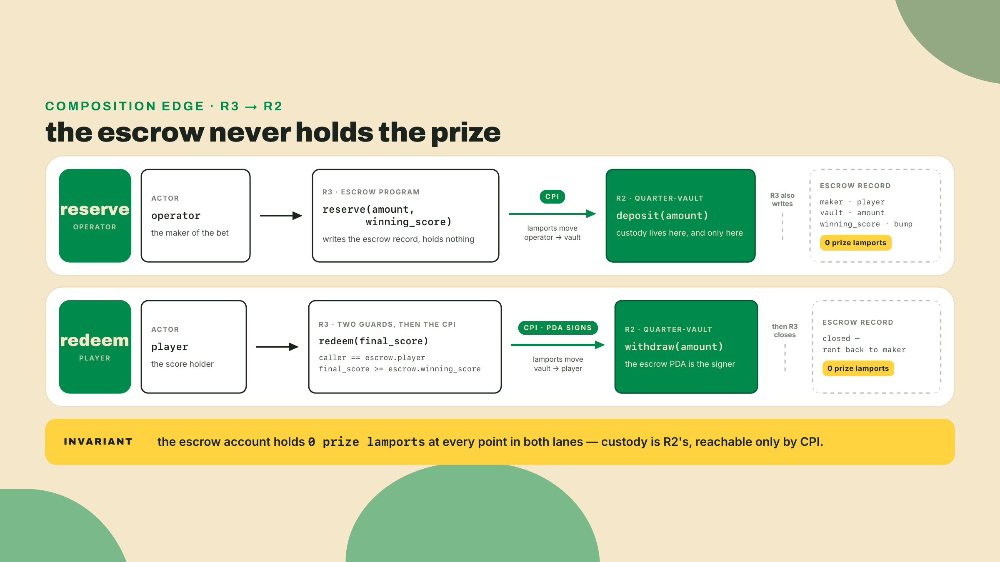
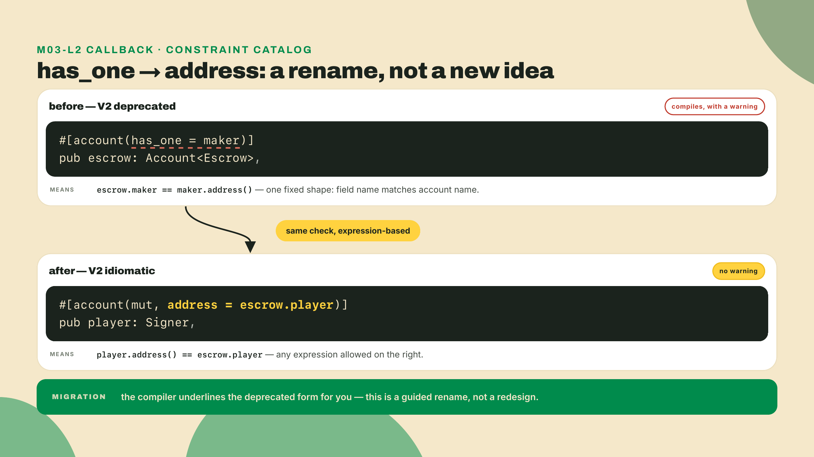
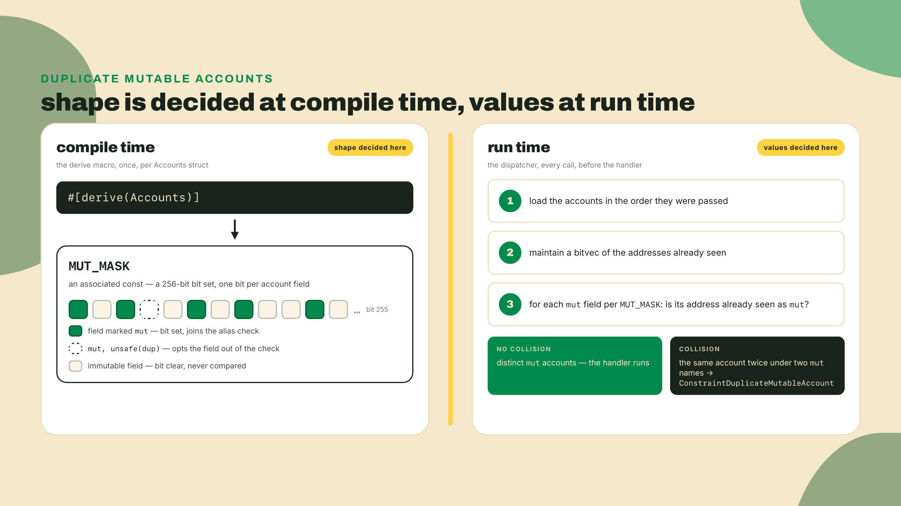
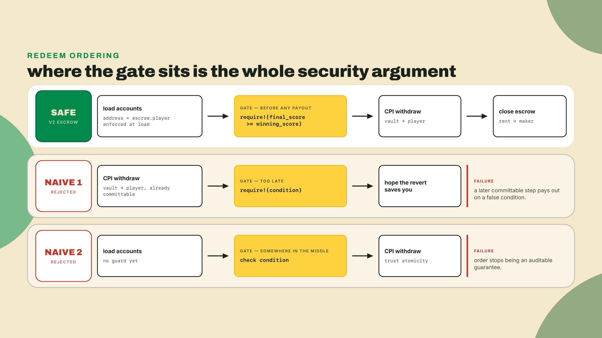
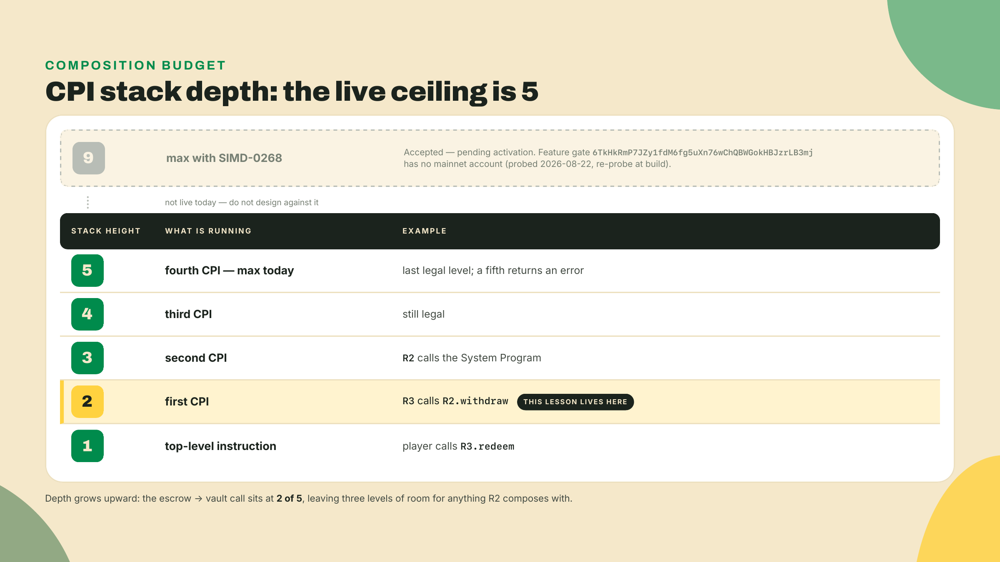
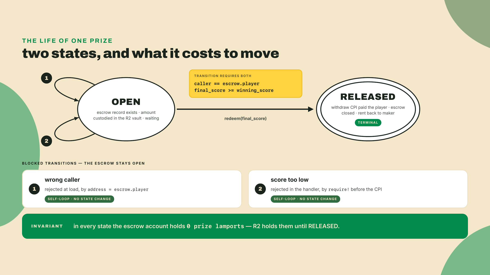

# Composition: build the prize-escrow

Last lesson the borrow model did something quietly radical: it killed the `.reload()` footgun at compile time. Once a `CpiHandle` was live, the compiler refused to let you read the typed account it came from, so stale-after-CPI data stopped being a discipline you had to remember and became a thing that would not build. You leaned on the compiler instead of your own attention. That is the whole personality of V2, and this lesson is where it pays for itself.

Here is the pain. A vault that only ever signs for itself is a piggy bank. Useful, sure, but it never has to trust anyone. The moment a second party shows up (an operator who funds a prize, a player who claims it only if they earned it) you are no longer writing one program. You are wiring two programs together and betting your money on the seam between them. That seam is called composition, and getting it wrong is where escrows leak.

So before we theorize, wire the seam. R3 is a second program in the vault's workspace, so create it there and point it at the vault. From the root of your `quarter-vault` workspace:

```bash
anchor new quarter-prize        # adds programs/quarter-prize and registers it in Anchor.toml
```

Then wire R3 to consume R2 the way V2 programs consume each other: through the vault's **interface**, not its source. `declare_program!` reads a program's IDL — the JSON description of its instructions and accounts that the toolchain derives from the source — and generates the entire CPI surface from it at compile time. Two moves. First, harvest the vault's IDL into an `idls/` directory at the workspace root (the macro walks up from the consuming crate and uses the first `idls/` directory it finds):

```bash
mkdir -p idls
( cd programs/quarter-vault && anchor idl build -o ../../idls/quarter_vault.json )
```

Second, open `programs/quarter-prize/Cargo.toml` — and notice what is *not* in it. No row for the vault at all: the interface arrives as JSON, not as a crate.

```toml
[dependencies]
# crates.io, the same release your tag-pinned CLI was built from (see m01-l2)
anchor-lang = "2.0.0-rc.1"
# The pins from m01-l2 — every program crate in this course carries them (issue #4937's class).
wincode = { version = "0.5", features = ["derive"] }
# The arcade-workspace row from m02-l1, verbatim. R3 lands in R2's workspace, and the
# two share one lock: the members have to agree on solana-address or nothing resolves.
solana-address = ">=2.6.1, <2.7"
# NO `quarter-vault = { path = "../quarter-vault", features = ["cpi"] }` row. The
# scaffold's feature table ships a `cpi = ["no-entrypoint"]` hook for source-level
# consumption, and this course deliberately never uses it — the IDL path below has
# none of its rc.1 sharp edges, and it is V2's own cross-program mechanism.
```

Then, at the top of `programs/quarter-prize/src/lib.rs`, one line brings the vault's generated module into existence:

```rust
declare_program!(quarter_vault);
```

Then `anchor build`. Nothing to claim yet, and the build will start failing the moment you write real code against R2, because R2 is still self-custody and cannot take a second party. Fixing that is Step 1 of the Lab and it comes before everything else. What you have right now is the callee's `cpi` module in scope — generated from the IDL, and `include_bytes!`-tracked, so an IDL edit forces the caller to rebuild and a type-shape drift is a compile error — though an IDL stale in a way that still typechecks compiles green and only mismatches at runtime, so regenerate after every callee change rather than trusting the tracking — and a compiler that will tell you exactly which handles the vault expects. That feedback loop is the lesson.

> Freshness note: this is written against the Anchor V2 release candidate on the 2.x line (the docs tree published under `v2`), 2026-08-22, newest tag `2.0.0-rc.1` (published to crates.io 2026-08-12). `avm install` cannot fetch it, as m01-l2 showed: no GitHub Release was cut for the v2 tag, so the prebuilt binary it downloads 404s. Build the CLI from the documented channel instead, pinned to the tag: `cargo install --git https://github.com/otter-sec/anchor.git --tag v2.0.0-rc.1 anchor-cli --locked --force`, and re-check for a newer rc or a stable tag before you build. The machine-default `anchor-cli 1.1.2` is the V1 line and will not compile the `unsafe(dup)`, `CpiHandle`, or Pod-`Account` features below.

## Summary

R3, the prize-escrow. Two instructions, two parties, one condition. `reserve` takes an operator's lamports and parks them inside a real quarter-vault instance through a cross-program call, then records who the prize is for and what it takes to win. `redeem` releases those lamports, but only when the win condition holds and only to the exact caller the escrow named. A premature claim fails. A wrong-caller claim fails. The money lives in the vault you built in m04-l1 the entire time, which is the point: R3 does not reimplement custody, it *composes* on R2's.

The autonomy fades on purpose. The CPI that deposits into the vault is worked in full below, every handle spelled out, because a cross-program deposit is the new muscle and you should see it move once. The two lines that make it *safe*, the win-condition check and the caller constraint, are yours to fill: they are marked `TODO(you)` and the checkpoint shows the answer. Then the challenge cuts you loose entirely: a second, independent way to win, proven in the test yourself.

Route for the lesson: first how composition actually works in V2 (the vault edge, the caller check, the duplicate-account default, and the one ordering rule that separates an escrow from an exploit), then the build, then a checkpoint that proves it, then you extend it.

## How one program builds on another

Composition is one program invoking an instruction on another and building on that program's state. That is the entire idea, and it is also where your trust surface stops being yours alone. When R3 calls R2, R3's correctness now *includes* R2's correctness. You are not just trusting your own code anymore.

Concretely, the prize never sits in the escrow. The escrow is a record: it says "50,000,000 lamports for this player, released on this condition, custodied over there." The lamports themselves live in a quarter-vault instance, and R3 reaches that vault only by CPI. That single arrow, R3 depositing into and later releasing from an R2 vault, is why this lesson declares that R3 consumes R2.



Compared to what, though? The obvious simpler design is to let the escrow hold the lamports directly: skip R2 entirely, credit the escrow account, debit it on redeem. It works, and for a one-off it is less code. But watch what you give up. You would be reimplementing custody (the lamport moves, the rent math, the authority checks) inside R3, a second copy of logic that already lives in R2 and that you have already tested. Two copies drift. The day you fix a custody bug in the vault, the escrow's private copy still has it. Composing on R2 instead means the escrow owns exactly one thing, the *decision* to release, and delegates the *holding* to the program built for it. That is the trade the whole lesson is arguing for: a smaller thing you can reason about, bolted onto a proven thing you already trust.

For that delegation to work, the vault instance has to answer to the escrow. R2 derives a vault pair from its owner, `[b"vault", owner]` for the ledger and `[b"sol", owner]` for the lamports, and the instance this escrow uses is created with the escrow PDA as that owner. So there is exactly one vault pair per escrow and only the escrow can move its lamports. That is why `redeem` can sign the withdraw with the escrow's seeds and why nobody else can. The authority relationship is the contract between the two programs; get it wrong and either the deposit lands somewhere you cannot reach or the withdraw refuses to sign.

That delegation costs R2 exactly three extra accounts, and it is worth naming rather than hiding. The vault you built in m04-l1 is a *self-custody* vault: `deposit` pulls lamports from the same `authority` that owns the ledger, and `withdraw` pays that same authority back. An escrow needs those two roles split, because the operator funds a vault the escrow owns, and the player, not the escrow, receives the payout. So R2's `deposit` gains a `funder` account that sources the lamports, `withdraw` gains a `destination` account that receives them, and `init_vault` gains a `funder` who pays the rent, all distinct from the `authority` the seeds derive from. Three extra accounts, no new custody logic, and R3 builds on the same code instead of copying it. That is what "composable" actually costs and actually buys. Step 1 of the Lab is that edit, and it is the first thing you do, because nothing R3 compiles until R2 can take a funder and pay a destination.

### The caller check: address, not has_one

Back in m03-l2, when we walked the constraint catalog, one of the mechanical renames was authority checking. `has_one = maker` is deprecated in V2. It still parses, the compiler just underlines it and warns, which is exactly the guided, do-it-once migration that whole lesson was about. The replacement is `address = parent.field`:

```rust
// V1 idiom, deprecated in V2 (parses, warns):
#[account(has_one = maker)]
pub escrow: Account<Escrow>,

// V2 idiom: reads as what it does, this account's address must equal that stored field
#[account(mut, address = escrow.maker)]
pub maker: UncheckedAccount,
```

The shift is more than cosmetic. `has_one` was locked to a field whose name matched the account name. `address` takes any expression, so `address = escrow.player` on the claimant says, plainly, "the account passed here must be the pubkey this escrow recorded as the player." That is the caller check for the whole conditional release, and it is one line.



### The duplicate-mutable default: distinct is fine, aliased is not

Here is a default that trips people the first time and then never again. V2 rejects *duplicate mutable accounts*. Hand the same account in under two names in one instruction, with even one of those slots marked `mut`, and validation fails before your handler runs, with `ConstraintDuplicateMutableAccount`.

Read that carefully, because the common misread is expensive. It does *not* mean "two mutable accounts are banned." Your `redeem` takes the escrow (mutable, it gets closed) and the vault (mutable, its lamports move), both mutable, and V2 is perfectly happy, because they are two different accounts. What V2 refuses is *aliasing*: the same account handed in twice under two names, where one mutable write silently clobbers the other. That is a real bug class, and it is now a compile-and-load-time error instead of a 2am incident.

Why does the default cost you nothing at runtime for the common case? Because the check is split across two places. The `#[derive(Accounts)]` macro computes, at compile time, a 256-bit mask of which fields are mutable: this is the `MUT_MASK`, an associated const baked into your accounts struct. Then, as the dispatcher loads accounts for the instruction, it walks that mask against a runtime bitvec of addresses seen so far. The *shape* of the check (which fields are mutable) is decided when you compile. The *values* (are any two of those addresses equal) are decided when the transaction runs. Compile-time const, runtime dispatch. That division is why it is cheap and why it cannot be fooled.



When you genuinely mean to pass one account twice as mutable (a batch instruction touching two prize pools that happen to resolve to the same vault, say) you opt out per field, and the opt-out is spelled to make you feel it: `unsafe(dup)`. Plain `dup` without the `unsafe` wrapper is a compile error in V2, on purpose. The keyword is the seatbelt light: you are turning off an alias check, so you now own the aliasing risk and must write the handler so it never holds two conflicting mutable references to that account.

| Your `redeem` takes... | V2 verdict | What you write |
|---|---|---|
| escrow (mut) + vault (mut), different accounts | accepted | nothing extra, this is normal composition |
| the same vault twice, either slot mut | rejected | `ConstraintDuplicateMutableAccount` at load |
| the same vault twice, you meant it | accepted | `#[account(mut, unsafe(dup))]` on both, and own the aliasing |
| plain `dup` without `unsafe` | compile error | the compiler tells you to write `unsafe(dup)` |

### The one ordering rule: check before you pay

Now the rule that separates an escrow from a donation machine. A conditional release is only as safe as *when* it checks. The guard has to run and pass before a single lamport moves.

It is worth ruling out the naive alternatives, because they each look fine until they don't. The first naive move is "pay the player, then check the condition, and if it was false, revert." Be honest about the mechanics first: on Solana that *does* revert — an instruction that ultimately errors rolls back every account change in the transaction, the payout CPI included, exactly as m04-l1 taught. Nothing can partially commit ahead of your revert. So the objection is not that pay-then-check leaks lamports today. It is that its safety hangs entirely on the check staying fatal and staying inside this instruction, forever — and refactors erode exactly that. A `require!` gets softened into a logged branch. The condition drifts into a helper that returns instead of erroring. The check starts reading state the payout CPI itself just changed, so it measures the wrong thing. The day any of that happens, the transfer you already composed goes through on a false condition, and no compiler flags it. Guard-first has no such invariant to maintain: if the guard never passes, the payout code never even runs. The second naive move is "trust atomicity, check anywhere in the instruction." Same fragile dependency, plus a subtler cost: order is documentation. An auditor reading `redeem` should see the condition gate the payout by *position*, not have to prove that some later revert saves you.

So the real shape is forced: verify the caller and the condition, and only then build the release CPI. In the handler, the `require!` lines come first and the `quarter_vault::cpi::withdraw` call comes last. Nothing moves until the guards have passed.



### The trade-off you are buying

Composition is not free, and naming the bill is the honest part. Three costs come attached, and you either prove them safe or you opt in and own them.

First, your trust surface multiplied. R3 depends on R2 being correct; a bug in the vault's withdraw is now a bug in your escrow. Second, the CPI stack is bounded, at the stack height of 5 that m04-l1 already put a number and a pending-SIMD caveat on. Your escrow calling the vault sits at height 2, nowhere near it, but a protocol that composes five deep is a protocol that will one day hit the wall, and this is the lesson where you start spending that budget. Third, the aliasing risk: two mutable accounts in one instruction are rejected by default, and the day you write `unsafe(dup)` you have signed for the consequences yourself.



There is a thesis under all of this. The Anchor manifesto issue that kicked off V2, number 4390, "Zero-copy account deserialization by default," argued for exactly one idea: make the account model safe by default and let unsound things fail to compile. Borrow-tracked composition is that thesis applied to the hardest case, one program building on another's state. The `CpiHandle` you fought last lesson and the duplicate-mutable default you just met are the same principle wearing two hats.

## Lab: build R3

Fresh terminal. This is the barcade's actual prize machine: an operator loads a plush-toy prize behind a high-score, and the cabinet only pays out when a player genuinely clears it.

### Step 1: split R2's roles so a second party can use it

Do this first, because nothing below compiles until it is done. The vault you built in m04-l1 is self-custody: `deposit` pulls lamports from the same `authority` the seeds derive from, and `withdraw` pays that same `authority` back. An escrow needs those roles split. Open R2 and add one account to each struct, leaving every seed, bump, and guard exactly as it was:

```rust
// quarter-vault: Deposit gains a funder (who pays) alongside authority (who owns).
#[derive(Accounts)]
pub struct Deposit {
    /// CHECK: seeds derive from this; a top-up needs no permission from the owner
    pub authority: UncheckedAccount,   // was Signer: the owner no longer has to sign a deposit
    #[account(mut)]
    pub funder: Signer,                // NEW: sources the lamports, and signs for them
    #[account(mut, seeds = [b"vault", authority.address().as_ref()], bump = state.bump)]
    pub state: Account<Vault>,
    #[account(mut, seeds = [b"sol", authority.address().as_ref()], bump = state.sol_bump)]
    pub sol_vault: SystemAccount,
    pub system_program: Program<System>,
}

// quarter-vault: Withdraw gains a destination (who receives) alongside authority (who owns).
#[derive(Accounts)]
pub struct Withdraw {
    #[account(address = state.owner @ VaultError::NotVaultOwner)]
    pub authority: Signer,
    #[account(mut)]
    pub destination: UncheckedAccount, // NEW: receives the payout
    #[account(mut, seeds = [b"vault", authority.address().as_ref()], bump = state.bump)]
    pub state: Account<Vault>,
    #[account(mut, seeds = [b"sol", authority.address().as_ref()], bump = state.sol_bump)]
    pub sol_vault: SystemAccount,
    pub system_program: Program<System>,
}
```

`InitVault` needs the same treatment, and this is the one people miss. Right now it reads `authority: Signer` with `payer = authority`, which says the vault's owner both authorizes its creation and funds its rent. An escrow PDA can do neither: it has no key to sign with and no lamports to pay with. Split those two jobs the same way:

```rust
// quarter-vault: InitVault gains a funder (who pays rent) alongside authority (who owns).
#[derive(Accounts)]
pub struct InitVault {
    /// CHECK: seeds derive from this; creating someone's vault needs no permission
    pub authority: UncheckedAccount,   // was Signer
    #[account(mut)]
    pub funder: Signer,                // NEW: pays rent for both accounts
    #[account(init, payer = funder, space = Vault::DISCRIMINATOR.len() + Vault::INIT_SPACE,
              seeds = [b"vault", authority.address().as_ref()], bump)]
    pub state: Account<Vault>,
    #[account(init, payer = funder, space = 0, owner = System::id(),
              seeds = [b"sol", authority.address().as_ref()], bump)]
    /// CHECK: UncheckedAccount because SystemAccount has no init path in V2, and
    /// only UncheckedAccount may `init` with a foreign owner. `owner = System::id()`
    /// does that handoff — without it the account stays owned by THIS program and
    /// every later SystemAccount read fails at load with IllegalOwner.
    pub sol_vault: UncheckedAccount,
    pub system_program: Program<System>,
}
```

Creating a vault for an address is harmless: it costs the funder rent and gives the owner an empty account they alone can withdraw from. That is why dropping the signature is safe here and would not be on `Withdraw`.

Then point the two `Transfer` CPIs at the new accounts: `deposit`'s `from` becomes `funder`, and `withdraw`'s `to` becomes `destination`. Nothing else changes, and that is the point. Three extra accounts across three structs, no new custody logic, and R3 gets to build on the same code instead of copying it.


Note the one demotion: `Deposit`'s `authority` stops being a `Signer`. Topping up someone's vault never needed their permission, only their address to derive the seeds, and the escrow PDA cannot sign a deposit it is merely the owner of. `Withdraw`'s `authority` stays a `Signer`, which is exactly the account the escrow PDA will satisfy through `invoke_signed` in Step 4.

Checkpoint: `anchor build` in the vault workspace compiles — if it fails instead, you moved a seed or a bump; put it back. Then re-run m04-l1's withdraw test, and run it the tempting way first: pass the player's key into `authority`, `funder`, and `destination`, the way the old self-custody test collapsed everything into one wallet. It fails on the very first instruction with `Custom(2040)` — `ConstraintDuplicateMutableAccount`. One key in two slots is aliasing, and the guard rejects an aliased account the moment *any* of its slots is `mut`; a read-only `authority` does not excuse it, because on `InitVault` the mut `funder` aliases it and on `Withdraw` the mut `destination` does. That 2040 is the duplicate-mutable default from the overview doing its job on your own program, one lesson early. The fix is the same role split you just performed on the structs, applied to the test: give `funder` and `destination` their own keypairs, the way the escrow will hold distinct parties on the floor. Distinct keys, green run. One last move before you leave this step: re-run the IDL harvest from the opening. You just changed R2's interface, and `declare_program!` compiles against the JSON, not the source — the stale file is exactly the compile error the checkpoint below names.

### Step 2: the escrow record

The escrow is small and fixed-size, so it is a Pod `Account`: every field is a plain scalar, no `Vec` or `String`, which is what lets V2 back it with zero-copy `Account<T>` rather than `BorshAccount<T>`. Create `src/state.rs`:

```rust
use anchor_lang::prelude::*;

#[account]
#[derive(InitSpace)]
pub struct Escrow {
    pub maker: Address,      // the operator who funded the prize
    pub player: Address,     // the only caller allowed to redeem
    pub vault: Address,      // the R2 vault ledger holding this prize
    pub amount: u64,         // prize size, in lamports
    pub winning_score: u64,  // the bar the player must clear
    pub bump: u8,            // canonical bump, stored so we never re-derive
    pub _pad: [u8; 7],   // explicit tail padding: V2 rejects implicit pad bytes
}
```

One thing you do *not* write here, and the deletion is worth a beat. `Program<T>` needs a marker type with an `Id` impl, and `#[program]` emits no marker — it generates exactly three sibling modules, `instruction`, `accounts`, and `cpi` — so a source-level consumer would have to hand-write one, `IDL_ADDRESS` and all, and an impl that skips `IDL_ADDRESS` still compiles while the IDL silently loses the callee's address. `declare_program!` generates the marker instead, at `quarter_vault::program::QuarterVault`, with `IDL_ADDRESS` already filled from the JSON. One less thing to hand-maintain, one less thing to get silently wrong.

Checkpoint: `anchor build` compiles. If it complains about padding or a non-Pod field, you added something variable-length; keep the record scalar.

### Step 3: reserve, with the deposit CPI worked in full

`reserve` creates the escrow record and, in the same instruction, moves the operator's lamports into a quarter-vault instance by calling R2. This is the worked example: read every handle.

One placement note that applies to this listing and the `redeem` one in step 4, because pasting either at the top level of `lib.rs` compiles into dead code and then fails step 5 on an unresolved `quarter_prize::instruction::Reserve`. The `use` lines and the `#[derive(Accounts)]` struct are top-level items. The `pub fn` goes **inside** the `#[program] pub mod quarter_prize { use super::*; … }` module, exactly where m03-l1's `init_vault` went — that module is what generates the `instruction::` and `accounts::` builders the test reaches for.

```rust
use anchor_lang::prelude::*;
use quarter_vault::cpi as vault_cpi;
use quarter_vault::program::QuarterVault; // generated by declare_program!
use quarter_vault::Vault;                 // the vault's account type, also generated
use crate::state::Escrow;

#[derive(Accounts)]
pub struct Reserve {
    #[account(
        init,
        payer = maker,
        space = Escrow::DISCRIMINATOR.len() + Escrow::INIT_SPACE,
        seeds = [b"escrow", maker.address().as_ref(), player.address().as_ref()],
        bump
    )]
    pub escrow: Account<Escrow>,

    #[account(mut)]
    pub maker: Signer,

    /// CHECK: recorded as the future claimant; never signs here
    pub player: UncheckedAccount,

    // R2's vault pair, both derived from the escrow PDA as owner. Neither exists
    // yet: `reserve` creates them by CPI, which is why vault_state is unchecked
    // here rather than a typed Account<Vault>.
    /// CHECK: created by the init_vault CPI below and validated by R2's own seeds
    #[account(mut)]
    pub vault_state: UncheckedAccount,
    #[account(mut)]
    pub vault_sol: SystemAccount,      // zero data, holds the actual lamports

    pub quarter_vault_program: Program<QuarterVault>,
    pub system_program: Program<System>,
}

pub fn reserve(ctx: &mut Context<Reserve>, amount: u64, winning_score: u64) -> Result<()> {
    // Copy scalars out BEFORE any handle borrows ctx.accounts (the borrow model,
    // again). The leading `*` is what makes each one a copy: .address() returns
    // &Address, and a bare binding would hold a borrow into ctx.accounts instead.
    let maker = *ctx.accounts.maker.address();
    let player = *ctx.accounts.player.address();
    let vault_ledger = *ctx.accounts.vault_state.address();

    // FIRST: bring the escrow's vault pair into existence. The escrow PDA owns it
    // (the seeds derive from the escrow), but the maker funds the rent, which is
    // exactly the split you just made to R2's InitVault. No PDA signature needed:
    // creating a vault for an address is not an authority action.
    let init_accounts = vault_cpi::accounts::InitVault {
        authority: ctx.accounts.escrow.cpi_handle(),
        funder: ctx.accounts.maker.cpi_handle_mut(),
        state: ctx.accounts.vault_state.cpi_handle_mut(),
        sol_vault: ctx.accounts.vault_sol.cpi_handle_mut(),
        system_program: ctx.accounts.system_program.cpi_handle(),
    };
    vault_cpi::init_vault(CpiContext::new(
        ctx.accounts.quarter_vault_program.address(),
        init_accounts,
    ))?;

    // THEN: deposit the operator's lamports INTO that vault (the R3 -> R2 edge).
    let cpi_accounts = vault_cpi::accounts::Deposit {
        authority: ctx.accounts.escrow.cpi_handle(),        // owns the vault; signs nothing here
        funder: ctx.accounts.maker.cpi_handle_mut(),        // the operator's lamports
        state: ctx.accounts.vault_state.cpi_handle_mut(),
        sol_vault: ctx.accounts.vault_sol.cpi_handle_mut(),
        system_program: ctx.accounts.system_program.cpi_handle(),
    };
    let cpi_ctx = CpiContext::new(ctx.accounts.quarter_vault_program.address(), cpi_accounts);
    vault_cpi::deposit(cpi_ctx, amount)?;

    // Only after the money is custodied, and after the handles have dropped, do we write the record.
    let escrow = &mut ctx.accounts.escrow;
    escrow.maker = maker;
    escrow.player = player;
    escrow.vault = vault_ledger;
    escrow.amount = amount;
    escrow.winning_score = winning_score;
    escrow.bump = ctx.bumps.escrow;
    Ok(())
}
```

Three things to notice, because they are the V2 CPI grammar. The callee exposes `vault_cpi::accounts::Deposit`, a struct whose every field is a `CpiHandle`. You fill it with `.cpi_handle_mut()` for accounts the callee will write (the vault pair, the funder) and `.cpi_handle()` for the rest. `CpiContext::new` takes the callee as a `&Address`, which is exactly what the program account's `.address()` hands back — so it is passed straight in, not wrapped in an `AccountInfo`. And the generated wrapper `vault_cpi::deposit(cpi_ctx, amount)` packs the args and invokes. That is the same handle you wrestled last lesson: once `cpi_handle_mut()` borrows the vault, you cannot also touch it as a typed account until the call returns, which is precisely how the compiler keeps you honest.

Checkpoint: `anchor build`. The compiler resolves `quarter_vault::cpi::*` because `declare_program!` generated the entire module from `idls/quarter_vault.json`. If it dies with `` `idls` directory not found ``, the harvest step from the opening never ran; if it cannot find a *field* like `funder`, your JSON predates the role split — re-run the harvest, because the interface changed and the file must change with it; and if the module itself is unresolved from a file like `src/instructions/reserve.rs`, spell the path from the crate root — `use crate::quarter_vault::cpi as vault_cpi;` — because the macro generates the module at the root, and a submodule's bare `use quarter_vault::…` cannot see it.

### Step 4: redeem, and the two lines that are yours

`redeem` is the conditional release. The accounts and the skeleton are here; two spots are `TODO(you)`. Fill them, then check against the solution.

```rust
use anchor_lang::prelude::*;
use quarter_vault::cpi as vault_cpi;
use quarter_vault::program::QuarterVault; // generated by declare_program!
use quarter_vault::Vault;                 // the vault's account type, also generated
use crate::state::Escrow;

#[derive(Accounts)]
pub struct Redeem {
    #[account(
        mut,
        close = maker,
        seeds = [b"escrow", escrow.maker.as_ref(), escrow.player.as_ref()],
        bump = escrow.bump
    )]
    pub escrow: Account<Escrow>,

    // Bound to the exact vault the escrow recorded: the record's vault, not any vault.
    #[account(mut, address = escrow.vault @ EscrowError::WrongVault)]
    pub vault_state: Account<Vault>,   // mutable AND distinct from escrow: no unsafe(dup) needed
    #[account(mut)]
    pub vault_sol: SystemAccount,      // the lamports actually leave from here

    // TODO(you): constrain this to the recorded player. One line.
    #[account(mut)]
    pub player: Signer,

    #[account(mut, address = escrow.maker)]
    pub maker: UncheckedAccount,       // close destination: rent returns to the operator

    pub quarter_vault_program: Program<QuarterVault>,
    pub system_program: Program<System>,
}

pub fn redeem(ctx: &mut Context<Redeem>, final_score: u64) -> Result<()> {
    // Copy scalars out BEFORE any handle borrows the escrow (the borrow model, again).
    let amount = ctx.accounts.escrow.amount;
    let winning = ctx.accounts.escrow.winning_score;
    let maker_key = ctx.accounts.escrow.maker;
    let player_key = ctx.accounts.escrow.player;
    let bump = ctx.accounts.escrow.bump;

    // TODO(you): check the win condition BEFORE the payout CPI. One line.

    let seeds: &[&[u8]] = &[b"escrow", maker_key.as_ref(), player_key.as_ref(), &[bump]];
    let signer: &[&[&[u8]]] = &[seeds];

    let cpi_accounts = vault_cpi::accounts::Withdraw {
        authority: ctx.accounts.escrow.cpi_handle(),   // escrow PDA owns the vault and signs for it
        state: ctx.accounts.vault_state.cpi_handle_mut(),
        sol_vault: ctx.accounts.vault_sol.cpi_handle_mut(),
        destination: ctx.accounts.player.cpi_handle_mut(),
        system_program: ctx.accounts.system_program.cpi_handle(),
    };
    let cpi_ctx = CpiContext::new(ctx.accounts.quarter_vault_program.address(), cpi_accounts)
        .with_signer(signer);
    vault_cpi::withdraw(cpi_ctx, amount)?;
    Ok(())
}

#[error_code]
pub enum EscrowError {
    #[msg("The escrow does not custody this vault")]
    WrongVault,
    #[msg("The win condition has not been met")]
    ConditionNotMet,
}
```

The two answers. On the `player` account, the caller check is one line: `#[account(mut, address = escrow.player)]`. That is `has_one` retired in favor of an expression, exactly the migration beat from earlier. And the condition, placed where the `TODO` sits so it gates the CPI by position:

```rust
require!(final_score >= winning, EscrowError::ConditionNotMet);
```

Notice the escrow (mutable, it closes), the vault ledger, and the SOL vault (mutable, its lamports move) sit side by side, all three `mut`, and V2 never asks for `unsafe(dup)`, because they are distinct accounts.

Notice also what R3 does *not* check. Only `vault_state` carries an `address =` constraint, binding it to the vault this escrow recorded. `vault_sol` has no seeds constraint here, and that is deliberate rather than sloppy: R2's own `Withdraw` struct already validates the pair, deriving the SOL vault from `[b"sol", authority]` against the ledger's stored `sol_bump`. Re-deriving it in R3 would pay for the same check twice and, worse, would recompute a bump R2 has already stored. Composing means trusting the callee's constraints to be the callee's job. The check you keep is the one only *you* can make: that this vault is the vault this escrow named. Everything else is R2 re-earning the trust you placed in it by depending on it.

Checkpoint: `anchor build` is clean, no `has_one` deprecation warning left (you replaced it), and `redeem` reads top to bottom as copy-scalars, guard, sign, pay.

Step back and look at the whole life of one prize. It exists in exactly two states, and the account model makes the transitions total: an escrow is either open (funded, waiting) or released (condition met, lamports gone to the player, record closed). Every rejected claim leaves it open, unchanged. There is no third state where the money is half-moved, because the release is one instruction and the guards gate it.



### Step 5: prove it with a LiteSVM test

The gate is a LiteSVM test, which is V2's default Rust test template. Add it with the same single dev-dependency m04-l1 used — `anchor-v2-testing` at `tag = "v2.0.0-rc.1"`, which carries litesvm 0.11.0 and re-exports everything the test file needs, so you never name litesvm yourself — and stand up both programs in-process. The test loads R2 and R3, funds an operator and a player, reserves a 0.05 SOL prize behind a score of 5000, then tries three redeems: a wrong caller, a premature low score, and the real thing.

```rust
use anchor_lang::{
    prelude::Address, programs::System, solana_program::instruction::Instruction, Id,
    InstructionData, ToAccountMetas,
};
use anchor_v2_testing::{
    Keypair, LiteSVM, Message, Signer, VersionedMessage, VersionedTransaction,
};
// The vault's generated module rides inside the escrow crate now, so the test
// borrows its ID from there instead of naming a quarter-vault dependency.
use quarter_prize::quarter_vault;

const PRIZE: u64 = 50_000_000; // 0.05 SOL
const WIN: u64 = 5_000;

fn escrow_pda(maker: &Address, player: &Address) -> (Address, u8) {
    Address::find_program_address(
        &[b"escrow", maker.as_ref(), player.as_ref()],
        &quarter_prize::ID,
    )
}

// One place that signs an instruction into a sendable transaction.
fn tx(svm: &LiteSVM, payer: &Keypair, instruction: Instruction) -> VersionedTransaction {
    let blockhash = svm.latest_blockhash();
    let msg = Message::new_with_blockhash(&[instruction], Some(&payer.pubkey()), &blockhash);
    VersionedTransaction::try_new(VersionedMessage::Legacy(msg), &[payer]).unwrap()
}

#[test]
fn conditional_release() {
    let mut svm = anchor_v2_testing::svm();
    let vault_so = concat!(env!("CARGO_MANIFEST_DIR"), "/../../target/deploy/quarter_vault.so");
    let prize_so = concat!(env!("CARGO_MANIFEST_DIR"), "/../../target/deploy/quarter_prize.so");
    svm.add_program_from_file(quarter_vault::ID, vault_so).unwrap();
    svm.add_program_from_file(quarter_prize::ID, prize_so).unwrap();

    let maker = Keypair::new();
    let player = Keypair::new();
    let stranger = Keypair::new();
    for kp in [&maker, &player, &stranger] {
        svm.airdrop(&kp.pubkey(), 1_000_000_000).unwrap();
    }

    let (escrow, _b) = escrow_pda(&maker.pubkey(), &player.pubkey());
    // R2 derives its vault pair from the owner, which here is the escrow PDA.
    let (vault_state, _sb) = Address::find_program_address(
        &[b"vault", escrow.as_ref()], &quarter_vault::ID,
    );
    let (vault_sol, _lb) = Address::find_program_address(
        &[b"sol", escrow.as_ref()], &quarter_vault::ID,
    );

    // reserve: operator funds the prize into the vault via CPI
    let reserve_ix = Instruction {
        program_id: quarter_prize::ID,
        accounts: quarter_prize::accounts::Reserve {
            escrow,
            maker: maker.pubkey(),
            player: player.pubkey(),
            vault_state,
            vault_sol,
            quarter_vault_program: quarter_vault::ID,
            system_program: System::id(),
        }.to_account_metas(None),
        data: quarter_prize::instruction::Reserve { amount: PRIZE, winning_score: WIN }.data(),
    };
    let reserve_tx = tx(&svm, &maker, reserve_ix);
    svm.send_transaction(reserve_tx).unwrap();
    // the lamports live in the zero-data SOL vault, never in the escrow record
    assert!(svm.get_account(&vault_sol).unwrap().lamports >= PRIZE);
    assert!(svm.get_account(&escrow).unwrap().lamports < PRIZE);

    let redeem = |caller: &Keypair, score: u64| -> Instruction {
        Instruction {
            program_id: quarter_prize::ID,
            accounts: quarter_prize::accounts::Redeem {
                escrow,
                vault_state,
                vault_sol,
                player: caller.pubkey(),
                maker: maker.pubkey(),
                quarter_vault_program: quarter_vault::ID,
                system_program: System::id(),
            }.to_account_metas(None),
            data: quarter_prize::instruction::Redeem { final_score: score }.data(),
        }
    };

    // wrong caller: the address = escrow.player constraint rejects it
    let bad = tx(&svm, &stranger, redeem(&stranger, 9_999));
    assert!(svm.send_transaction(bad).is_err());

    // premature: right player, score below the bar -> ConditionNotMet
    let early = tx(&svm, &player, redeem(&player, 4_200));
    assert!(svm.send_transaction(early).is_err());

    // the real thing: right player, score clears the bar
    let before = svm.get_account(&player.pubkey()).unwrap().lamports;
    let good = tx(&svm, &player, redeem(&player, 5_200));
    svm.send_transaction(good).unwrap();
    let after = svm.get_account(&player.pubkey()).unwrap().lamports;
    assert!(after > before, "the prize should have landed with the player");
}
```

Run it. This suite is the one in-process LiteSVM test above, and that matters for what `anchor test` does: for the LiteSVM template the RC skips standing up a local validator at all, exactly as m01-l2 and m01-l3 said it would, so nothing here needs Surfpool installed. (`anchor test` on a validator-backed template is where Surfpool comes in, and m09-l3 installs it there for the capstone's integration run.) Expect:

```text
running 1 test
test conditional_release ... ok

test result: ok. 1 passed; 0 failed
```

Checkpoint, and this is the one that matters: the wrong caller fails, the premature claim fails, and only the real clear moves the lamports. If the stranger's redeem *succeeds*, your caller constraint is missing. If the 4,200 redeem succeeds, your `require!` is missing or sitting after the CPI. Those two failures are the whole lesson, caught by the test.

## Challenge: a second way to win

You proved one release path. Now cut yourself loose. A real barcade prize is not always "beat the high score." Sometimes it is "the operator says you won" (a manual override for a tournament final, judged offline). Add a second, independent release condition to R3 and prove both paths in the test.

The shape is yours to choose, but the accept bar is fixed: add a field to the escrow (an operator-settable `won` flag is the obvious one), a small instruction or an argument for the operator to set it, and a redeem path that releases on *either* the score bar or the flag. Prove all of it: the flag path releases when set and refuses when unset, the score path still works, and neither path lets the wrong caller through. When both conditions can independently and safely open the same custody, you have built real composition, not a demo.

One honest caveat before you run. The `final_score` in this lesson is self-reported by the player, which is fine for a test and wrong for production. A real cabinet would have the score *attested*, signed by the counter program you built in module 2 (R1), so the player cannot just pass 9,999. That attestation is a composition problem too, and it is deliberately out of scope here: this lesson is about the release *mechanics*, not the oracle. Name that gap in your own code with a comment so the next reader knows it is a choice, not an oversight.

## Did it work?

You should now have a `quarter-prize` program that never touches the prize lamports itself. It reserves them into a real quarter-vault instance through a CPI, and it releases them only when the condition holds and only to the caller it named, with a passing LiteSVM test that proves a wrong-caller claim and a premature claim both fail. The one line that replaced `has_one` is `address = escrow.player`, and the guard that gates the payout runs before the withdraw CPI, by position.

If you are stuck, the two usual culprits are the ones the test catches: a missing `address` constraint (the stranger gets paid) or a `require!` in the wrong place (the low score gets paid). Both are one-line fixes, and both are exactly why we checked before we paid.

Next lesson, the ground shifts under all of this. The escrow and the vault both move lamports today, raw SOL, custodied by hand. Quarters are about to become real SPL tokens, and here is the good news the borrow model bought you: every custody line you wrote (the deposit CPI, the release CPI, the balance you track) changes in exactly one place, because you composed on the vault instead of copying it. Build on state, and you only pay for a change once.
