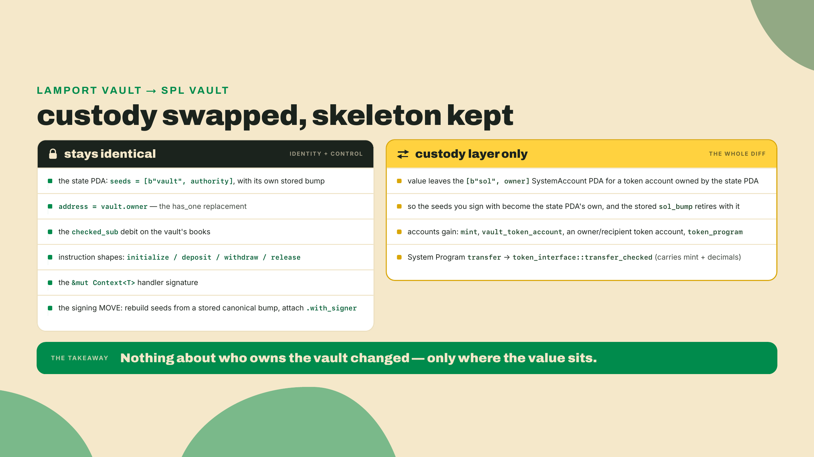
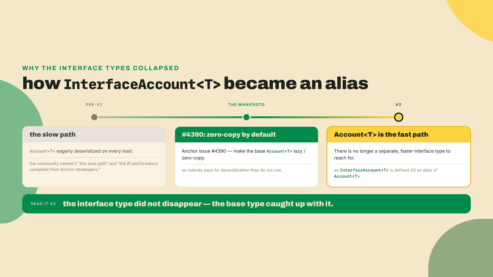
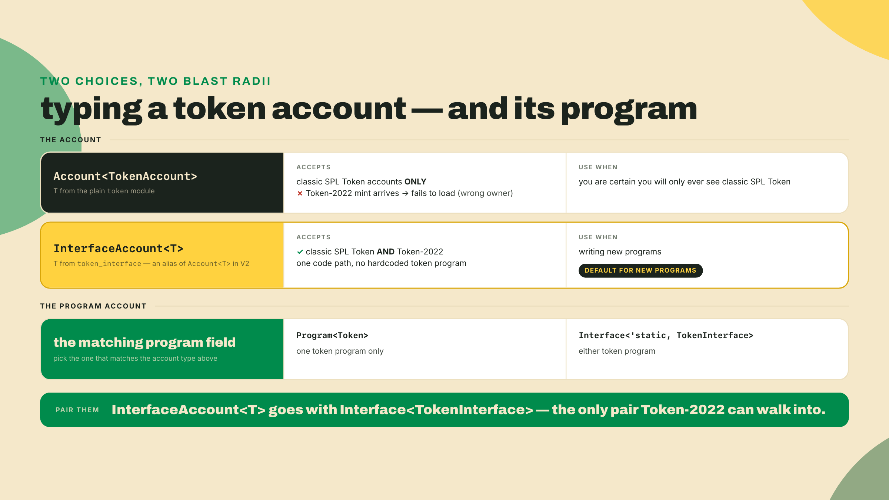
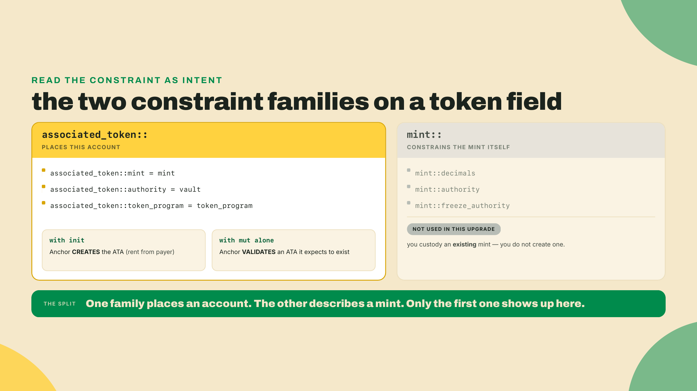
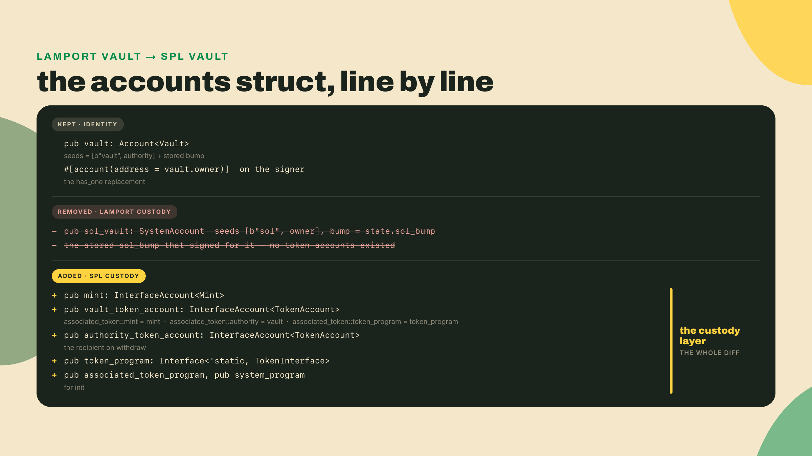
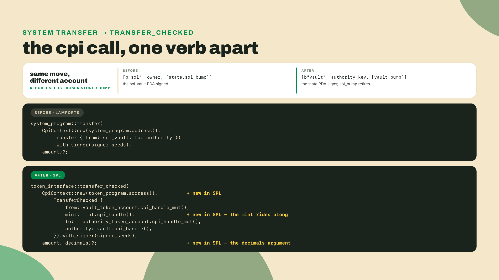
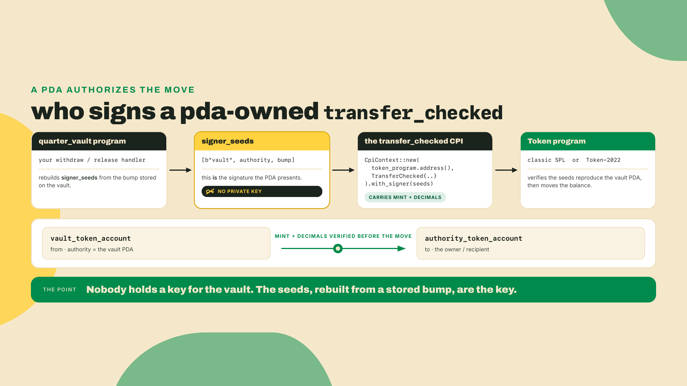
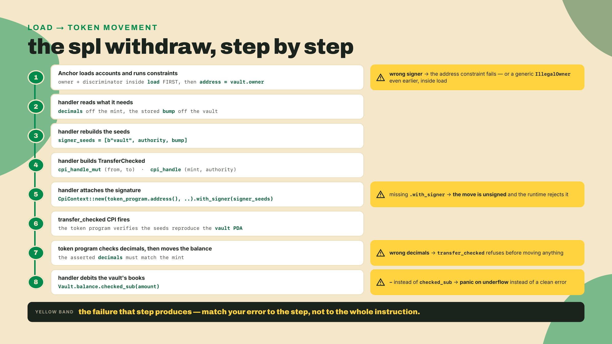
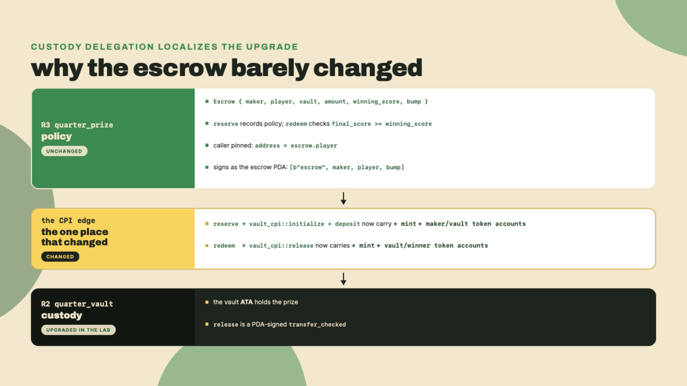
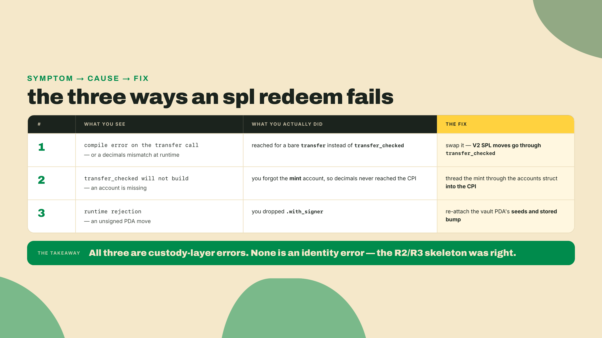

# token_interface and transfer_checked: move the vault and escrow to real tokens

Last lesson you built the prize-escrow, R3. It never holds the prize itself. It parks it in a quarter-vault (R2) instance over a cross-program call, records who may claim and the score they have to clear, and only lets go when the condition fires and the right player asks. Both programs work end to end. And both custody native lamports.

Which is the problem, because nobody in an arcade pays in raw SOL. Players hold arcade tokens, real SPL mints, and the whole economy you are wiring runs on those. So here is the felt question, the one that decides whether the last two lessons were a warm-up or the real thing: does moving from lamports to real tokens mean a rewrite, or does a small, countable set of lines change while the PDA and CPI skeleton stay exactly as you built them?

Before you read my answer, go get yours. Open the R2 vault and count the lines that actually belong to custody:

```bash
# In your R2 quarter-vault program, list every line that truly touches custody:
grep -n 'b"sol"\|sol_vault\|sol_bump\|lamports\|system_program' programs/quarter-vault/src/lib.rs
```

Everything that comes back belongs to one layer: the `[b"sol", owner]` custody PDA, the stored `sol_bump` that signs for it, and the System Program transfer that moves the lamports. What the grep does *not* print is the more interesting half: the state PDA's own `[b"vault", authority]` seeds, its stored `bump`, the `address =` authority pin, the `checked_sub` on the books. Those are custody agnostic. The lines that did come back are the whole lesson, and we are going to swap them.

## Summary

You will upgrade two working lamport programs to SPL-token custody: the quarter-vault (R2) and the prize-escrow (R3). The instruction shapes stay the same. `deposit`, `withdraw`, `release` on the vault; `reserve` and `redeem` on the escrow. What changes is the custody layer: the separate lamport-holding PDA retires, the System Program transfer becomes a PDA-signed `transfer_checked`, and the accounts grow a mint plus token-account constraints. The state PDA and its stored bump, the `address = vault.owner` check, the `checked_sub` on the books, and the escrow's condition gate do not move.

The autonomy fades the way it does on every build lesson. I walk the vault upgrade fully worked, `withdraw` included, because that shape is the one I want in your fingers. You finish the escrow's `redeem` release yourself: the mint-and-decimals wiring into the vault CPI is the one gap I leave. Then you re-run both interim checks from scratch in SPL, solo. You are done when a PDA-signed `transfer_checked` moves a token balance under the vault's signature and the escrow releases only on the right condition, both green.

One boundary up front, because it is easy to wander across it. This lesson is tokens *from the framework's seat*: how your program moves them. What Token-2022 actually changes about a mint, the fees and hooks and confidential balances, is the Digital Assets course's material, and this course revisits only the program-seat edge of it in m05-l3. Here we care about exactly one thing: the same code path serving classic SPL Token and Token-2022 without you hardcoding either.

## What custody actually costs when it goes SPL

The shape of the answer first; the artifacts follow.

Custody is a layer, not the program. Your vault's identity, the PDA derived from `[b"vault", authority]` with its stored bump, is who the vault *is*. Custody is what the vault *holds*. In the lamport version, holding meant lamports sat in a second, system-owned PDA and moved via a System Program transfer signed by that PDA's seeds. In the SPL version, holding means a token account whose authority is the state PDA itself, and moving means a `transfer_checked` CPI to the token program, signed by the state PDA's seeds. Identity untouched. The custody account and the verb are what change.

That is the spine of the whole upgrade, and it is worth seeing as a diff before we touch a single line.



Read that right column again. Four items. That is what a custody migration costs. Everything on the left is the work you already did in R2 and R3, and it survives the move intact. This is exactly why the upgrade path teaches tokens better than a fresh build would. A fresh build hides the seam, because everything is new at once. The upgrade isolates the seam, and the seam is the lesson.

### The token seat: Interface, InterfaceAccount, and one code path

Anchor V2 gives your program a specific seat for tokens, and it lives in `token_interface`. Two types carry it.

The program account is `Interface<'static, TokenInterface>`. Compare that to `Program<Token>`, which you would reach for on reflex. `Program<Token>` pins your instruction to exactly one program, the classic SPL Token program at its one address. `Interface<'static, TokenInterface>` accepts either the classic Token program or the Token-2022 program. Same slot, two valid tenants.

The mints and token accounts are `InterfaceAccount<Mint>` and `InterfaceAccount<TokenAccount>`. And here is the thing that trips up everyone who learned Anchor a year ago: `InterfaceAccount<T>` in V2 is literally an alias of `Account<T>`. Not a cousin, not a wrapper. The same type.

Which means the wrapper is not where the behavior lives, and this is the sentence to hold: the difference between an account that accepts both token programs and one that does not is *which module `T` came from*. `anchor_spl::token::TokenAccount` carries the classic Token program's id as its expected owner. `anchor_spl::token_interface::TokenAccount` accepts either. Write `Account<TokenAccount>` with a `token_interface` import and you get the interface behavior; write `InterfaceAccount<TokenAccount>` with a `token` import and you get the classic-only behavior, alias or no alias. The convention below is to pair `InterfaceAccount` with `token_interface` imports because reading the wrapper is faster than tracing an import, but it is a convention, not the mechanism.

Why an *alias*, and not the separate heavier type it used to be? This one is worth a beat, because the answer explains the whole direction of V2.



So when you write `InterfaceAccount<TokenAccount>` in V2, you get today's zero-copy `Account<TokenAccount>` plus the property that it will validate a mint or token account owned by *either* token program. You pay nothing extra for the interface capability. That is the design paying off: the fast path and the compatible path are now the same path. It is the same lever behind the 8.8x average compute-unit improvement Anchor reports in its own bench harness, the figure PR #4914 revised down from 9.9x on 2026-08-13. Dated and attributed, not measured here; module 6 is where you measure your own.

Which raises the obvious migrator's question: if `InterfaceAccount<T>` is just `Account<T>`, why not keep writing `Account<TokenAccount>`? Because on the reflex path, `Account<TokenAccount>` comes with a `use anchor_spl::token::TokenAccount`, and that `T` hardcodes the classic Token program as the owner. The moment a Token-2022 mint shows up, that account fails to load. Pairing the `InterfaceAccount` wrapper with the `token_interface` module is what stays owner-agnostic across both programs. The combinations are not interchangeable, and the ones you will actually meet are worth seeing side by side.



There is a real footgun hiding in that first card, subtle enough to burn an afternoon. If you type an account as `Account<T>` and expect a *custom* owner error, you will not get one. The owner and discriminator checks run inside the account's load step, which happens before any of your constraint hooks. So an owner mismatch surfaces as a generic `IllegalOwner`, and your nicely worded custom message never fires. If you genuinely need a custom owner error, you drop to `UncheckedAccount` and assert the owner yourself in the handler. Keep that one in your pocket.

### The constraints that place the vault's token account

Two families of constraint show up on the token accounts in the lab, and they are worth glossing once so they read as intent rather than incantation when you meet them.

The `associated_token::` family says "this account is the Associated Token Account for this mint and this owner." An ATA is the one canonical token account a given owner holds for a given mint, at a deterministic address derived from the owner, the mint, and the token program. When you write `associated_token::mint = mint`, `associated_token::authority = vault`, and `associated_token::token_program = token_program` on a field, Anchor derives that canonical address and checks the account you were handed sits at it. Pair the three with `init` and Anchor *creates* the ATA if it does not exist yet, paying rent from the `payer`; pair them with `mut` alone and Anchor just validates an ATA it expects to already be there. That is the whole difference between the vault's `initialize` (which inits the vault ATA) and its `deposit` (which validates one that exists).

The `mint::` family, by contrast, constrains the mint itself: `mint::decimals`, `mint::authority`, `mint::freeze_authority`. You will not need those in this upgrade, because you are custodying an *existing* arcade-token mint, not creating one. But they are the same shape, and knowing the family exists keeps you from reinventing a decimals check by hand later. The reason the `associated_token::token_program = token_program` line matters at all is the one-code-path story from earlier: because `token_program` is an `Interface`, the derived ATA address is computed against whichever token program actually owns the mint, so the same constraint resolves correctly for a classic mint and a Token-2022 mint. Hardcode the classic program there and you would silently derive the wrong address the day a Token-2022 mint arrives.



### transfer_checked: the primitive that carries the mint

The lamport version moved value with a System Program transfer. The SPL version moves value with `transfer_checked`, and the name is doing real work. A bare `transfer` takes an amount and trusts it. `transfer_checked` takes the amount *plus the mint account plus the mint's decimals*, and it refuses to run if the decimals you claim disagree with the decimals on the mint. It is the token program double-checking that you and it agree on what a "unit" means before it moves anything.

This is the single line most migrators get wrong first, because muscle memory reaches for the bare `transfer` they used two years ago, and in V2 that bare `transfer` is deprecated and will not compile the way they remember. `transfer_checked` is the primitive now. Say it once, out loud: the mint and its decimals travel with every transfer.

Worth asking why the token program bothers, since the amount is already a raw integer of base units and the transfer would move exactly that many either way. The answer is the class of bug the check closes. A token amount is meaningless without its decimals: `1_000_000` is one whole token at six decimals and a thousandth of a token at nine. A client that computes an amount against the wrong decimals, or a program that hardcodes a decimals value that later drifts from the mint, moves the wrong quantity of value while the raw integer looks perfectly reasonable. The bare `transfer` cannot catch that, because it never sees the mint. `transfer_checked` sees both, and it aborts before moving anything if the decimals you assert disagree with the decimals recorded on the mint account. It is a cheap consistency check standing exactly where a silent, expensive mistake used to live.

Now the trade-off, stated plainly because it is the honest part of this seat. `InterfaceAccount<T>` buys you one code path across both token programs, and that is genuinely valuable. But you pay for it in two coins. First, `transfer_checked` forces the mint and decimals into every transfer, so the mint has to be *present* on instructions that used to not need it. Second, that extra mint account is one more account per instruction, one more thing to pass from the client, one more line in the accounts struct. Neither cost is large. Both are real. The way to feel their size is to do the upgrade and count, which is exactly what the lab does.

## Lab: upgrade the quarter-vault to SPL

Numbered steps. The interesting ones carry their why; the routine ones run terse. Checkpoints tell you what success looks like so you never guess whether it worked.

### 1. Pin the V2 RC toolchain

Your machine ships anchor-cli on the 1.x line. This course is V2, a different compiler surface, and the V2 CLI is consumed from git, not from `avm`. You set this up back in m01-l2, so this is a re-pin, not a fresh install: `avm install` cannot fetch the V2 tag because no GitHub Release was cut for it and the prebuilt binary it downloads 404s, so the documented channel is a source build pinned to the `v2.0.0-rc.1` tag.

```bash
# The documented V2 channel. `avm install` 404s on the RC (see m01-l2); build from git.
# macOS, if the build trips on LTO: prefix with CARGO_PROFILE_RELEASE_LTO=off
cargo install --git https://github.com/otter-sec/anchor.git \
  --tag v2.0.0-rc.1 anchor-cli --locked --force

anchor --version   # confirm you are on the V2 line, not your old 1.1.2
```

Freshness note (checked 2026-08-22): V2 ships as `2.0.0-rc.1` off the `anchor-next` branch, and `avm list` carries nothing above `1.1.2`, so the git build is the only channel. Once `anchor --version` prints the exact RC string, pin *that* string in `Anchor.toml` under `[toolchain]` and pin the commit in your CI Dockerfile, because V2 APIs can move between commits. On macOS, prefix the install with `CARGO_PROFILE_RELEASE_LTO=off` if the link step runs out of memory. V2's minimum supported Rust is 1.89.0; if `rustc --version` is older, run `rustup update` before you build.

Checkpoint: `anchor --version` prints the V2 RC string, not `1.1.2`. If it still prints the old version, your shell is resolving an older binary earlier on `PATH`; fix that before you go further, because every compile error after this point would be a lie.

### 2. Add the token dependency

The vault needs the SPL surface. In `programs/quarter-vault/Cargo.toml`, add `anchor-spl` next to `anchor-lang`, both at the same V2 version. Nothing to configure beyond that: `token`, `token_interface`, `associated_token`, and `token_2022` are all unconditional modules of the V2 crate.

```toml
[dependencies]
# The V2 crates are named plainly: the repo's lang-v2/ directory publishes `anchor-lang` and
# spl-v2/ publishes `anchor-spl` (its V1 directories are the ones suffixed -v1). There is no
# token-2022 feature to opt into — Token-2022 support IS token_interface.
anchor-lang = "2.0.0-rc.1"
anchor-spl  = "2.0.0-rc.1"
# The pins from m01-l2 — every program crate in this course carries them (issue #4937's class).
# They are already in this file from m03-l1; keep them when you add the SPL rows above.
wincode = { version = "0.5", features = ["derive"] }
solana-address = ">=2.6.1, <2.7"   # the arcade-workspace row from m02-l1, unchanged
```

Freshness note: `anchor-lang` and `anchor-spl` move together on the V2 line, so pin both to the *same* version string and change them together. The trap here is the version, not the source: the crate names are identical on both lines, so `anchor-spl = "1"` — or a bare `anchor-spl = "*"` that resolves to the 1.x line — hands you the V1 crate under the V2 name, the account handle types will not line up, and you get type errors right at the CPI. The explicit `2.0.0-rc.1` is what keeps you on the V2 line, and because the registry forbids republishing a version it cannot drift the way the `anchor-next` branch tip does.

Checkpoint: `cargo check` resolves both crates and the build fails only on your own code, not on the dependency graph. If it complains that `token_interface` does not exist, you resolved the 1.x `anchor-spl` — check the version string, not a feature list.

### 3. Swap the accounts: the lamport PDA gains a token account

This is the first place the diff shows. In R2, value lived in a *second* PDA: the System-owned `sol_vault`, seeded on `[b"sol", owner]`, holding the lamports. Now value lives in a token account whose *authority* is the state PDA itself. The `Vault` state PDA stays exactly where it was, seeds and bump unchanged; the `sol_vault` retires, and a new `vault_token_account` (an ATA whose authority is the vault PDA) takes over the holding.



The **custody path** in full, `initialize` through `release`. Read `withdraw` closely: that is the interim check you re-run.

One disposition table before you paste, because "the vault program" now means more than these four handlers, and a paste-over would silently delete the rest of module 3 without anyone saying so. The thesis of this lesson is that only the custody layer changes; here is that thesis spelled out artifact by artifact.

| artifact | from | what happens to it |
|---|---|---|
| the `Config` PDA and the `address = config.authority` gate on `admin_set_credit` | m03-l2 | **Keep, unchanged.** It gates who may write the books, and the books did not change shape. |
| `close_vault` | m03-l2 | **Keep, and notice what it now implies.** The vault's value no longer lives in the account you are closing. Close the state PDA while its ATA still holds tokens and nothing in the program will move them again, because every path that signs for the vault loads the state you just closed. Guard it — refuse to close a vault whose `credit` is non-zero — or drain first. |
| `quarters::min_balance` and `require_funded` | m03-l3 | **Keep, unchanged.** The constraint reads `vault.credit`, which is still there and still a `u64`. |
| `set_credit` | m03-l3 | **Delete it here.** m03-l3 called it "exactly the handler you would delete before shipping", and this is the lesson where the vault starts holding real value. An ungated credit-setter sitting beside real custody contradicts the deposit path you are about to write; `deposit` owns the books from now on. |
| the `sol_vault` PDA and the `sol_bump` field | m04-l1 | **Gone.** This is the one genuine deletion the custody swap forces: value moved into a token account, so the System-owned lamport PDA and the bump you stored for it have no job left. |

Only the last two rows are deletions, and only one of them is the custody swap's doing. That is the thesis holding.

```rust
use anchor_lang::prelude::*;
use anchor_spl::{
    // `token` and `associated_token` are imported as MODULES, not just for their types: a
    // `token::mint = ...` or `associated_token::authority = ...` constraint expands to code that
    // names the module by path, so it has to be in scope or the derive fails to resolve.
    associated_token::{self, AssociatedToken},
    token,
    token_interface::{self, Mint, TokenAccount, TokenInterface, TransferChecked},
};
// InterfaceAccount comes from anchor_lang::prelude — the alias inside
// anchor_spl::token_interface is private and cannot be imported.

declare_id!("3pX5NKLru1UBDVckynWQxsgnJeUN3N1viy36Gk9TSn8d");

#[program]
pub mod quarter_vault {
    use super::*;

    pub fn initialize(ctx: &mut Context<Initialize>) -> Result<()> {
        let authority = *ctx.accounts.authority.address();
        let vault = &mut ctx.accounts.vault;
        vault.owner = authority;
        vault.credit = 0;
        vault.bump = ctx.bumps.vault;
        Ok(())
    }

    pub fn deposit(ctx: &mut Context<Deposit>, amount: u64) -> Result<()> {
        // Deposit is signed by the depositor, a real keypair. No PDA signing here.
        let decimals = ctx.accounts.mint.decimals();
        let accounts = TransferChecked {
            from: ctx.accounts.depositor_token_account.cpi_handle_mut(),
            mint: ctx.accounts.mint.cpi_handle(),
            to: ctx.accounts.vault_token_account.cpi_handle_mut(),
            authority: ctx.accounts.depositor.cpi_handle(),
        };
        let cpi = CpiContext::new(ctx.accounts.token_program.address(), accounts);
        token_interface::transfer_checked(cpi, amount, decimals)?;

        let vault = &mut ctx.accounts.vault;
        vault.credit = vault.credit.checked_add(amount).ok_or(VaultError::Overflow)?;
        Ok(())
    }

    pub fn withdraw(ctx: &mut Context<Withdraw>, amount: u64) -> Result<()> {
        // Withdraw is signed by the vault PDA, with the SAME seeds and stored bump
        // the lamport version used. Only the verb changed.
        let decimals = ctx.accounts.mint.decimals();
        let authority_key = ctx.accounts.vault.owner;
        let bump = [ctx.accounts.vault.bump];
        let signer_seeds: &[&[&[u8]]] = &[&[b"vault", authority_key.as_ref(), &bump]];

        let accounts = TransferChecked {
            from: ctx.accounts.vault_token_account.cpi_handle_mut(),
            mint: ctx.accounts.mint.cpi_handle(),
            to: ctx.accounts.authority_token_account.cpi_handle_mut(),
            authority: ctx.accounts.vault.cpi_handle(),
        };
        let cpi = CpiContext::new(ctx.accounts.token_program.address(), accounts)
            .with_signer(signer_seeds);
        token_interface::transfer_checked(cpi, amount, decimals)?;

        // The books debit is byte-for-byte the lamport version: checked_sub, never `-`.
        let vault = &mut ctx.accounts.vault;
        vault.credit = vault.credit.checked_sub(amount).ok_or(VaultError::Underflow)?;
        Ok(())
    }

    pub fn release(ctx: &mut Context<Release>, amount: u64) -> Result<()> {
        // Release is the composition path: R3 (the escrow) is this vault's recorded
        // authority and signs the CPI, then the vault PDA signs the token move.
        let decimals = ctx.accounts.mint.decimals();
        let authority_key = ctx.accounts.vault.owner;
        let bump = [ctx.accounts.vault.bump];
        let signer_seeds: &[&[&[u8]]] = &[&[b"vault", authority_key.as_ref(), &bump]];

        let accounts = TransferChecked {
            from: ctx.accounts.vault_token_account.cpi_handle_mut(),
            mint: ctx.accounts.mint.cpi_handle(),
            to: ctx.accounts.recipient_token_account.cpi_handle_mut(),
            authority: ctx.accounts.vault.cpi_handle(),
        };
        let cpi = CpiContext::new(ctx.accounts.token_program.address(), accounts)
            .with_signer(signer_seeds);
        token_interface::transfer_checked(cpi, amount, decimals)?;

        let vault = &mut ctx.accounts.vault;
        vault.credit = vault.credit.checked_sub(amount).ok_or(VaultError::Underflow)?;
        Ok(())
    }
}

#[account]
#[derive(InitSpace)]
pub struct Vault {
    pub owner: Address,  // 32  the only key allowed to authorize a move
    pub credit: u64,     //  8  the books, still debited with checked_sub
    pub bump: u8,        //  1  stored canonical bump, never re-derived
    pub _pad: [u8; 7],   //  7  explicit Pod padding (32+8+1 -> 48)
}

#[error_code]
pub enum VaultError {
    #[msg("Arithmetic overflow on the vault books")]
    Overflow,
    #[msg("Withdraw exceeds the vault balance")]
    Underflow,
}

#[derive(Accounts)]
pub struct Initialize {
    // Carried over from m04-l3's role split: the vault's owner does not have to sign
    // or pay for its creation, because an escrow PDA can do neither. The seeds derive
    // from `authority`; the rent comes from `funder`.
    /// CHECK: seeds derive from this; creating a vault for an address is not an authority action
    pub authority: UncheckedAccount,
    #[account(mut)]
    pub funder: Signer,
    #[account(
        init,
        payer = funder,
        space = Vault::DISCRIMINATOR.len() + Vault::INIT_SPACE,
        seeds = [b"vault", authority.address().as_ref()],
        bump
    )]
    pub vault: Account<Vault>,
    pub mint: InterfaceAccount<Mint>,
    #[account(
        init,
        payer = funder,
        associated_token::mint = mint,
        associated_token::authority = vault,
        associated_token::token_program = token_program,
    )]
    pub vault_token_account: InterfaceAccount<TokenAccount>,
    pub token_program: Interface<'static, TokenInterface>,
    pub associated_token_program: Program<AssociatedToken>,
    pub system_program: Program<System>,
}

#[derive(Accounts)]
pub struct Deposit {
    #[account(mut)]
    pub depositor: Signer,
    #[account(
        mut,
        seeds = [b"vault", vault.owner.as_ref()],
        bump = vault.bump,
    )]
    pub vault: Account<Vault>,
    pub mint: InterfaceAccount<Mint>,
    #[account(
        mut,
        associated_token::mint = mint,
        associated_token::authority = depositor,
        associated_token::token_program = token_program,
    )]
    pub depositor_token_account: InterfaceAccount<TokenAccount>,
    #[account(
        mut,
        associated_token::mint = mint,
        associated_token::authority = vault,
        associated_token::token_program = token_program,
    )]
    pub vault_token_account: InterfaceAccount<TokenAccount>,
    pub token_program: Interface<'static, TokenInterface>,
}

#[derive(Accounts)]
pub struct Withdraw {
    // has_one is deprecated in V2. The replacement is address = parent.field:
    // the signer's address must equal the authority the vault stored at init.
    #[account(mut, address = vault.owner)]
    pub authority: Signer,
    #[account(
        mut,
        seeds = [b"vault", vault.owner.as_ref()],
        bump = vault.bump,
    )]
    pub vault: Account<Vault>,
    pub mint: InterfaceAccount<Mint>,
    #[account(
        mut,
        associated_token::mint = mint,
        associated_token::authority = authority,
        associated_token::token_program = token_program,
    )]
    pub authority_token_account: InterfaceAccount<TokenAccount>,
    #[account(
        mut,
        associated_token::mint = mint,
        associated_token::authority = vault,
        associated_token::token_program = token_program,
    )]
    pub vault_token_account: InterfaceAccount<TokenAccount>,
    pub token_program: Interface<'static, TokenInterface>,
}

#[derive(Accounts)]
pub struct Release {
    // The recorded authority must sign to authorize a release. In composition this
    // is the escrow PDA, which signs via its own seeds from R3.
    #[account(address = vault.owner)]
    pub authority: Signer,
    #[account(
        mut,
        seeds = [b"vault", vault.owner.as_ref()],
        bump = vault.bump,
    )]
    pub vault: Account<Vault>,
    pub mint: InterfaceAccount<Mint>,
    #[account(
        mut,
        associated_token::mint = mint,
        associated_token::authority = vault,
        associated_token::token_program = token_program,
    )]
    pub vault_token_account: InterfaceAccount<TokenAccount>,
    // NOT an ATA constraint: the recipient's owner is whoever the caller names, so
    // there is no owner to derive an address from. The token:: family constrains an
    // existing token account's fields instead of placing it: token::mint pins which
    // mint it holds, token::token_program pins which token program owns it. Reach
    // for token:: whenever you accept a token account you did not derive.
    #[account(
        mut,
        token::mint = mint,
        token::token_program = token_program,
    )]
    pub recipient_token_account: InterfaceAccount<TokenAccount>,
    pub token_program: Interface<'static, TokenInterface>,
}
```

Three lines earn a comment. The space calc is `Vault::DISCRIMINATOR.len() + Vault::INIT_SPACE`, with the explicit `_pad` keeping the struct a clean multiple of 8 so the derived `INIT_SPACE` and the Pod layout agree exactly. The `owner` field is `Address`, not `Pubkey`; V2 renamed the key type, and `.address()` is how you read a key off a signer or account (it replaces `.key()`). And the `withdraw` authority line, `address = vault.owner`, is the frozen replacement for `has_one`: same guarantee, new spelling.

Checkpoint: `anchor build` compiles the program with the new accounts. It will not do anything useful yet, but it should be green.

### 4. Swap the transfer: the custody account moves, the signing move does not

This is the heart of it, and I want you to notice precisely what moved and what did not. In the lamport version you signed with the *custody* account's own seeds, `[b"sol", owner, &[state.sol_bump]]`, because the lamports sat in that second PDA. Under SPL there is no second PDA. The tokens sit in an ATA whose authority is the state PDA, so you sign with the state PDA's seeds, `[b"vault", authority_key.as_ref(), &bump]`, and `sol_bump` retires along with the account it described.

The seed array changed. The *move* did not, and that is the transferable part: rebuild the seeds from a bump you stored at init, never re-derive it, attach `.with_signer`, and the runtime grants the PDA signer privilege whether the inner call is a System Program transfer or a token `transfer_checked`. The seeds are the signature, and that mechanism is custody agnostic.



Four things in that `AFTER` block are V2-specific and worth naming, because the 1.x muscle memory (the version still on your machine) will fight you on each.

- `cpi_handle()` and `cpi_handle_mut()` replace `.to_account_info()` when building the CPI accounts. V2 routes token CPIs through a cheaper, borrow-tracked handle path; use `_mut` for the accounts whose balances change (`from`, `to`) and plain for the read-only ones (`mint`, `authority`).
- `CpiContext::new` takes the program as an address, `token_program.address()`, not an `AccountInfo`. That is the same V2 change you already met on the System Program CPI.
- The handler takes `&mut Context<T>`, not `Context<T>`. V2 handler signatures are mutable-context by default.
- `.with_signer(signer_seeds)` is what turns a plain CPI into a PDA-signed one. Drop it and this exact call becomes an unsigned transfer that the runtime rejects, because the vault PDA never authorized it.



One more thing to have in your head before you run it: the order the runtime does all this in, because knowing the sequence is how you locate a failure to the right line instead of guessing.



Checkpoint: `anchor build` is green, and you can read `withdraw` top to bottom and name each line as either identity (unchanged) or custody (changed), and point at which of the eight steps it lives in.

### 5. Re-run the R2 interim check in SPL

The R2 check has always made the same claim: value leaves the vault *only* under the vault PDA's signature. In the lamport version you asserted on lamport balances. Now you assert on the SPL token balance. Same test, new unit. The default V2 test template is LiteSVM in Rust, so we stay there.

```bash
# The test surface. anchor-v2-testing is the V2 harness the scaffold generates
# against; it wraps LiteSVM and pins its own LiteSVM version, so add it rather
# than a bare litesvm that could resolve to a different one. Pin the TAG, not the
# branch: the tag carries litesvm 0.11.0 and the anchor-next tip has already moved
# to 0.13.1, and two SVM crates in one graph is the skew this pin exists to avoid.
cargo add anchor-v2-testing --dev \
  --git https://github.com/otter-sec/anchor.git --tag v2.0.0-rc.1
# The fixture's two SPL crates, pinned like everything else here: these are the
# versions that resolve against the rc.1 pin set (verified 2026-09-01).
cargo add spl-token@9 spl-associated-token-account@8 --dev
```

The setup is more than a comment, so here it is in full. Put it at `programs/quarter-vault/tests/spl_setup.rs`, beside the program crate, which is what makes the built `.so` reachable:

```rust
// tests/spl_setup.rs - the fixture. Creates a 6-decimal mint, initializes the
// vault and its ATA, mints into the authority's ATA, and deposits 1.0 token.
// Imports ride anchor_lang and anchor_v2_testing and reach past neither: the
// instruction plumbing is anchor_lang's, the signing and SVM plumbing is the
// harness's, and nothing here names a solana crate the Cargo.toml never declared.
use anchor_lang::{
    prelude::Address, programs::System, solana_program::instruction::Instruction, Id,
    InstructionData, ToAccountMetas,
};
use anchor_v2_testing::{Keypair, LiteSVM, Message, Signer, VersionedMessage, VersionedTransaction};

// Cargo compiles every tests/*.rs as its own crate root, so a sibling `mod spl_helpers`
// in the test file is not in scope here. Pull the helpers in by path instead; the test
// file then declares only `mod spl_setup;`.
#[path = "spl_helpers.rs"]
mod spl_helpers;

pub const DECIMALS: u8 = 6;
pub const ONE_TOKEN: u64 = 1_000_000;

pub struct Ctx {
    pub authority: Keypair,
    pub mint: Address,
    pub vault: Address,
    pub vault_ata: Address,
    pub authority_ata: Address,
}

// LiteSVM's own failure type is not among anchor_v2_testing's re-exports, and adding
// litesvm by name is exactly the skew this lesson's pin avoids, so the error is
// flattened to a String at the boundary. Callers only ever ask "did it fail, and why".
pub fn send(svm: &mut LiteSVM, payer: &Keypair, signers: &[&Keypair], ixs: &[Instruction])
    -> Result<(), String>
{
    let bh = svm.latest_blockhash();
    let msg = Message::new_with_blockhash(ixs, Some(&payer.pubkey()), &bh);
    let tx = VersionedTransaction::try_new(VersionedMessage::Legacy(msg), signers).unwrap();
    svm.send_transaction(tx).map(|_| ()).map_err(|e| format!("{:?}", e.err))
}

pub fn token_balance(svm: &LiteSVM, ata: &Address) -> u64 {
    let acct = svm.get_account(ata).expect("token account exists");
    // SPL token account layout: amount is a little-endian u64 at offset 64.
    u64::from_le_bytes(acct.data[64..72].try_into().unwrap())
}

pub fn setup(svm: &mut LiteSVM) -> Ctx {
    let program_id = quarter_vault::ID;
    let vault_so = concat!(env!("CARGO_MANIFEST_DIR"), "/../../target/deploy/quarter_vault.so");
    svm.add_program_from_file(program_id, vault_so).unwrap();

    let authority = Keypair::new();
    svm.airdrop(&authority.pubkey(), 5_000_000_000).unwrap();

    // The rent gets its own payer. Initialize takes authority AND funder — the
    // m04-l3 role split — and funder is the mut one, so handing one keypair to
    // both slots is exactly the aliasing the duplicate-mutable default rejects
    // at runtime (ConstraintDuplicateMutableAccount). Distinct keys, no friction.
    let funder = Keypair::new();
    svm.airdrop(&funder.pubkey(), 5_000_000_000).unwrap();

    // 1. the mint, created and minted with the spl-token helpers
    let mint = spl_helpers::create_mint(svm, &authority, DECIMALS);
    let authority_ata = spl_helpers::create_ata(svm, &authority, &mint, &authority.pubkey());
    spl_helpers::mint_to(svm, &authority, &mint, &authority_ata, ONE_TOKEN);

    // 2. the vault PDA and its ATA, created by the program's own initialize
    let (vault, _b) = Address::find_program_address(
        &[b"vault", authority.pubkey().as_ref()], &program_id);
    let vault_ata = spl_helpers::ata_address(&mint, &vault);
    let init = Instruction {
        program_id,
        accounts: quarter_vault::accounts::Initialize {
            authority: authority.pubkey(),
            funder: funder.pubkey(),
            vault,
            mint,
            vault_token_account: vault_ata,
            token_program: spl_token::ID,
            associated_token_program: spl_associated_token_account::ID,
            system_program: System::id(),
        }.to_account_metas(None),
        data: quarter_vault::instruction::Initialize {}.data(),
    };
    send(svm, &funder, &[&funder], &[init]).unwrap();

    // 3. deposit 1.0 token into the vault ATA
    let dep = Instruction {
        program_id,
        accounts: quarter_vault::accounts::Deposit {
            depositor: authority.pubkey(),
            vault,
            mint,
            depositor_token_account: authority_ata,
            vault_token_account: vault_ata,
            token_program: spl_token::ID,
        }.to_account_metas(None),
        data: quarter_vault::instruction::Deposit { amount: ONE_TOKEN }.data(),
    };
    send(svm, &authority, &[&authority], &[dep]).unwrap();

    Ctx { authority, mint, vault, vault_ata, authority_ata }
}

pub fn send_withdraw(svm: &mut LiteSVM, ctx: &Ctx, amount: u64) -> Result<(), String> {
    let ix = Instruction {
        program_id: quarter_vault::ID,
        accounts: quarter_vault::accounts::Withdraw {
            authority: ctx.authority.pubkey(),
            vault: ctx.vault,
            mint: ctx.mint,
            authority_token_account: ctx.authority_ata,
            vault_token_account: ctx.vault_ata,
            token_program: spl_token::ID,
        }.to_account_metas(None),
        data: quarter_vault::instruction::Withdraw { amount }.data(),
    };
    send(svm, &ctx.authority, &[&ctx.authority], &[ix])
}
```

`spl_helpers` there is the thin wrapper over `spl_token` and `spl_associated_token_account` that builds the four setup instructions (`create_mint`, `create_ata`, `mint_to`, `ata_address`). It is ordinary SPL client code with nothing V2-specific in it, so it ships alongside this lesson as [spl-helpers/spl_helpers.rs](spl-helpers/spl_helpers.rs); drop it in as `tests/spl_helpers.rs`.

Now the check itself, at `programs/quarter-vault/tests/vault_spl_withdraw.rs`:

```rust
mod spl_setup;   // it pulls spl_helpers in itself, by #[path]

use anchor_v2_testing::svm;

#[test]
fn withdraw_moves_the_spl_balance_under_the_vault_signature() {
    let mut svm = svm();
    let ctx = spl_setup::setup(&mut svm); // 1.0 token (6 decimals) now sits in the vault ATA

    let before = spl_setup::token_balance(&svm, &ctx.vault_ata);
    assert_eq!(before, spl_setup::ONE_TOKEN, "vault holds 1.0 token before withdraw");

    // the vault PDA signs the move out; the human authority only authorizes it
    spl_setup::send_withdraw(&mut svm, &ctx, spl_setup::ONE_TOKEN)
        .expect("PDA-signed withdraw should succeed");

    let after = spl_setup::token_balance(&svm, &ctx.vault_ata);
    assert_eq!(after, 0, "the vault PDA signed the tokens out");

    // an over-withdraw is rejected, not panicked. Be precise about who refuses:
    // the token program fails the transfer CPI on insufficient funds before your
    // checked_sub ever runs; the ledger guard exists for drift the token balance
    // cannot see, and this assert only proves the refusal path is an Err.
    assert!(
        spl_setup::send_withdraw(&mut svm, &ctx, 1_000_000_000).is_err(),
        "over-withdraw must return an error, never a wrap or a panic"
    );
}
```

Run it:

```bash
anchor build && cargo test --test vault_spl_withdraw
```

Checkpoint: green. The token balance moved out of the vault ATA, and the only thing that authorized the move was the vault PDA's seeds. If you comment out `.with_signer(signer_seeds)` in the handler and re-run, this test should fail with a missing-signature error. That failure is the proof the PDA is what authorizes the move. Uncomment it and move on.

## Challenge: thread the escrow's release, then re-run both in SPL

Here the fade kicks in. The vault is worked. The escrow is yours, and it is a smaller change than you might fear, for a reason that is the whole payoff of last lesson's design.

The prize-escrow (R3), the `quarter-prize` program you built last lesson, never custodied the prize itself. It delegated custody to an R2 vault instance and reached it over a CPI. So when R2's custody went SPL, the escrow's *policy* did not change at all: `reserve` still records the maker, player, vault, amount, and winning score; `redeem` still checks `final_score >= escrow.winning_score` before anything moves; the caller is still pinned with `address = escrow.player`; the escrow still closes to the recorded `maker` so the rent goes back to the operator who paid it; the escrow still signs as its own PDA with `[b"escrow", maker, player, bump]`, seeds and order unchanged. The only thing that changed is what the escrow *passes down* to the vault: the mint and the token accounts now ride along on the `deposit` and `release` CPIs.

That is the sentence to sit with. Because you built on a vault instead of inlining custody, the SPL migration never leaves the escrow's CPI edge: the accounts it threads into the vault CPI change, and `reserve` follows one mechanical rename, the vault's init instruction going from `init_vault` to `initialize`. Policy, condition, caller pin, PDA signing: untouched.



Here is `redeem`, with the condition guard and the escrow signing already in place, and the release CPI's account wiring left as your gap. The answer is printed inside the marked block rather than withheld, because six field names with no compiler in front of you is a guessing game, not an exercise. Cover it with your hand, write the struct from what the vault taught you, then uncover and diff. The gap that is genuinely yours is the solo section below it.

```rust
use anchor_lang::prelude::*;
use anchor_spl::token_interface::{Mint, TokenAccount, TokenInterface};
use crate::state::Escrow;
use crate::error::EscrowError;
// The vault's module is the one declare_program! generated back in m04-l3 —
// marker included. Re-harvest idls/quarter_vault.json after this lesson's SPL
// upgrade lands, because R2's interface just changed shape. And if this handler
// lives in an instructions submodule rather than lib.rs, spell the path from the
// crate root — `use crate::quarter_vault::…` — the macro generates the module at
// the root, and a submodule's bare `use quarter_vault::…` cannot see it.
use quarter_vault::cpi as vault_cpi;
use quarter_vault::program::QuarterVault;

pub fn handler(ctx: &mut Context<Redeem>, final_score: u64) -> Result<()> {
    // GUARD (unchanged from the lamport escrow): condition before payout.
    require!(
        final_score >= ctx.accounts.escrow.winning_score,
        EscrowError::ConditionNotMet
    );

    // Read escrow state out before any CpiHandle goes live (the borrow model).
    let amount = ctx.accounts.escrow.amount;
    let maker = ctx.accounts.escrow.maker;
    let player = ctx.accounts.escrow.player;
    let bump = ctx.accounts.escrow.bump;

    // The escrow signs as ITS OWN PDA to satisfy the vault's address = vault.owner.
    // Seeds unchanged from the lamport version, order included.
    let signer_seeds: &[&[&[u8]]] = &[&[
        b"escrow",
        maker.as_ref(),
        player.as_ref(),
        &[bump],
    ]];

    // === YOUR LINE ===
    // Build vault_cpi::accounts::Release. In the lamport version it was
    //   { authority, vault, recipient, system_program }.
    // Now the vault moves TOKENS, so thread the SPL custody accounts through:
    // the mint, the vault's token account (from), the winner's token account (to),
    // and the token program. That mint account is how decimals reach transfer_checked.
    let accounts = vault_cpi::accounts::Release {
        authority: ctx.accounts.escrow.cpi_handle(),
        vault: ctx.accounts.vault.cpi_handle_mut(),
        mint: ctx.accounts.mint.cpi_handle(),
        vault_token_account: ctx.accounts.vault_token_account.cpi_handle_mut(),
        recipient_token_account: ctx.accounts.winner_token_account.cpi_handle_mut(),
        token_program: ctx.accounts.token_program.cpi_handle(),
    };
    // === END YOUR LINE ===

    let cpi = CpiContext::new(ctx.accounts.quarter_vault_program.address(), accounts)
        .with_signer(signer_seeds);
    vault_cpi::release(cpi, amount)?;
    Ok(())
}
```

Notice what is *not* in there: no `transfer_checked`, no decimals argument, no mint decimals lookup. That all lives in R2's `release`, which you worked in the lab. The escrow's job is only to hand the vault the right accounts and sign as the authority. The decimals travel inside the `mint` account you threaded through. This is the composition dividend: the primitive lives in one place, and the caller just points at the right tokens.

The `Redeem` accounts struct grows the same four custody accounts, and keeps every policy line:

```rust
#[derive(Accounts)]
pub struct Redeem {
    // caller guard, unchanged: only the recorded player may redeem
    #[account(address = escrow.player)]
    pub player: Signer,
    #[account(
        mut,
        close = maker,
        seeds = [b"escrow", escrow.maker.as_ref(), escrow.player.as_ref()],
        bump = escrow.bump,
    )]
    pub escrow: Account<Escrow>,
    /// CHECK: close destination only, pinned to the maker the escrow recorded.
    #[account(mut, address = escrow.maker)]
    pub maker: UncheckedAccount,
    /// CHECK: address fixed by seeds; the quarter_vault program validates and signs it.
    #[account(
        mut,
        seeds = [b"vault", escrow.address().as_ref()],
        bump,
        seeds::program = quarter_vault_program.address(),
    )]
    pub vault: UncheckedAccount,
    pub mint: InterfaceAccount<Mint>,
    #[account(
        mut,
        associated_token::mint = mint,
        associated_token::authority = vault,
        associated_token::token_program = token_program,
    )]
    pub vault_token_account: InterfaceAccount<TokenAccount>,
    #[account(
        mut,
        associated_token::mint = mint,
        associated_token::authority = player,
        associated_token::token_program = token_program,
    )]
    pub winner_token_account: InterfaceAccount<TokenAccount>,
    pub token_program: Interface<'static, TokenInterface>,
    pub quarter_vault_program: Program<QuarterVault>,
    pub system_program: Program<System>,
}
```

Two lines in there carry over from the lamport version and are easy to lose in a rewrite, so name them: `close = maker` on the escrow, and the `maker` seat it needs as a close destination, pinned with `address = escrow.maker`. Drop either and a redeemed escrow stays open with its rent stranded — the policy line survives the custody swap exactly like the rest.

One constraint in there is new, so take the thirty-second version now rather than guessing. `seeds::program = quarter_vault_program.address()` tells Anchor to derive that PDA against *another* program's id instead of your own. You need it because the vault PDA belongs to `quarter_vault`, not to the escrow: without that line Anchor would derive `[b"vault"...]` under the escrow's program id, get a different address, and reject the account you actually meant. Any time you constrain a PDA that a program you are calling owns, `seeds::program` is the line that points the derivation at the right owner.

Then the solo part: both interim checks in SPL, from scratch, no worked handler in front of you.

1. **R2 in SPL, the withdraw.** You ran this in the lab. Do it once more without looking: create the mint, initialize the vault and its ATA, deposit, withdraw, and assert the vault token balance went to zero *and* that removing `.with_signer` makes it fail. That failure is the point of the check.
2. **R3 in SPL, the conditional release.** Have the operator `reserve` a prize into the escrow's vault instance. One thing to get right before you start, because it is the step that blocks people: the escrow's vault does not exist yet, and the escrow PDA cannot bring it into existence on its own. Not because it is broke — a rent-exempt PDA holds lamports by definition, and this course's own lamport vault was a PDA whose whole job was holding them — but because of who may spend them: the rent payer on an `init` is debited by the System Program, and the System Program only debits accounts it owns. The escrow PDA carries data and belongs to the escrow program, so it can never sit in the payer seat. That is exactly why `Initialize` gained a `funder` in step 3 of the lab. So `reserve` CPIs the vault's `initialize` first — mind the name: the SPL upgrade renamed the vault's init instruction from the lamport version's `init_vault` to `initialize`, so the module your re-harvested IDL generates exposes `initialize`, and the m04-l3-era `vault_cpi::accounts::InitVault` wiring picks up the new name with it — with the **maker** as `funder` and the **escrow PDA** as `authority`, then CPIs `deposit`, same two-call shape as the lamport version. Then call `redeem` with a `final_score` below `winning_score` and assert it errors with `ConditionNotMet` (nothing moves). Then `redeem` with a winning score and assert the prize landed in the winner's token account. Green means the condition gate holds and the escrow PDA is the only thing that can sign the prize out.

Acceptance: `withdraw` moves the token balance only under the vault PDA's signature; the escrow releases only on the right condition, only to the recorded player; both green. And you can say, in one sentence, which lines changed from the lamport version. If your sentence runs longer than "the vault's custody layer, the mint and token accounts the escrow threads into the release CPI, and the `init_vault`-to-`initialize` rename `reserve` follows," you changed more than you needed to.

## Where this leaves you

Here is the feedback loop, honest. If your escrow `redeem` compiled on the first try, the vault taught you the pattern and you transferred it. Good. If it did not, the failure was almost certainly one of three, in the order they usually bite: you reached for a bare `transfer` instead of `transfer_checked` somewhere in the vault, you forgot the mint account (so decimals never reached `transfer_checked`), or you dropped a `.with_signer` and the runtime rejected an unsigned PDA move. Every one of those is a custody-layer error, not an identity error, which is the lesson landing: the skeleton you built in R2 and R3 was correct, and swapping what it holds did not break who it is.



That is a real milestone, so name it for what it cost. You just proved that a working program's design outlives its custody. The lamport prototype was not throwaway. It was the skeleton, and the skeleton held. And the escrow proved the second, sharper claim: because it delegated custody to the vault instead of inlining it, the token migration never left its CPI edge. That is not luck. That is what building on a vault buys you, and it is the same reason a real protocol splits policy from custody.

Two SPL programs now sit in your workspace: a vault that quotes nothing and an escrow that quotes nothing. They only move tokens they already hold. Players hold arcade tokens and want tickets, though, and neither of these programs has an opinion about price. Next lesson you build a third program, a pool that quotes its own rate from its reserves and swaps tokens for tickets, holding each side in a token account of its own. Neither the vault nor the escrow joins that build, and that is deliberate: a reserve's authority has to be the pool, so it cannot also be a vault. What carries over is the shape rather than the artifact. The PDA-signed `transfer_checked` you just wrote is the swap's payout, and the conditional release you wrote in R3 is exactly the control flow the swap's slippage guard needs. Same PDA-and-CPI seat you just learned, one new job: pricing.
