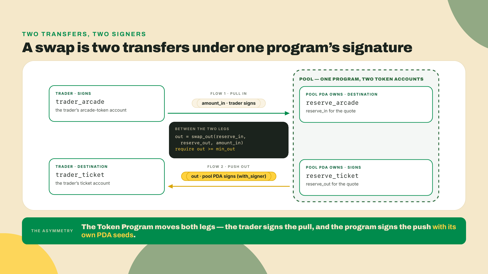
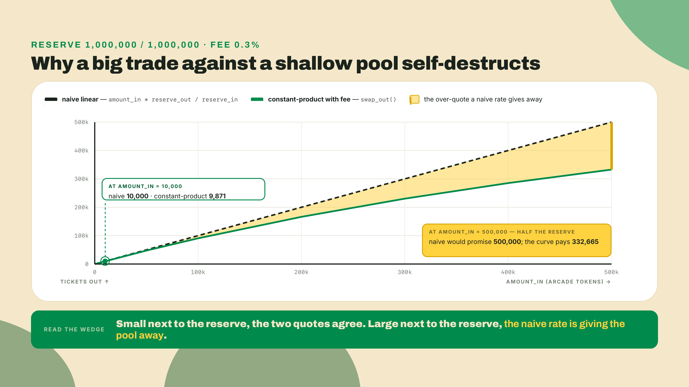
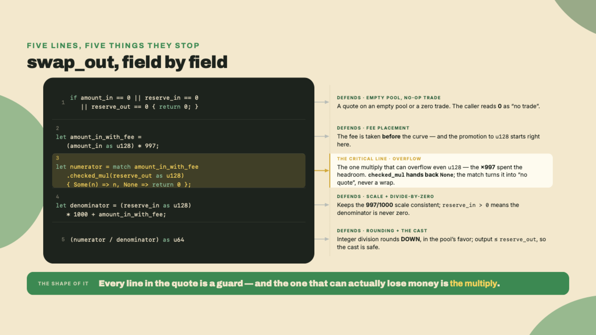
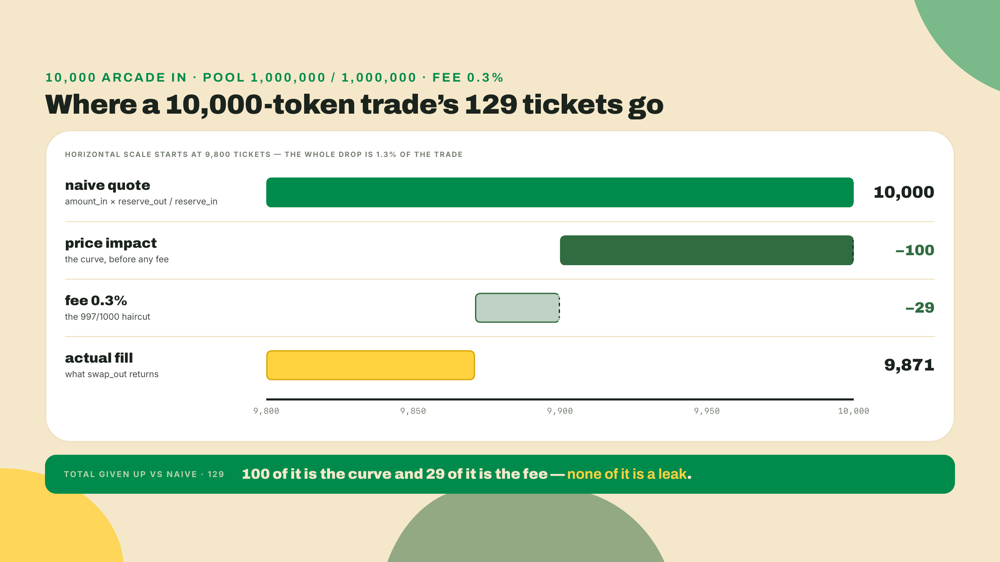
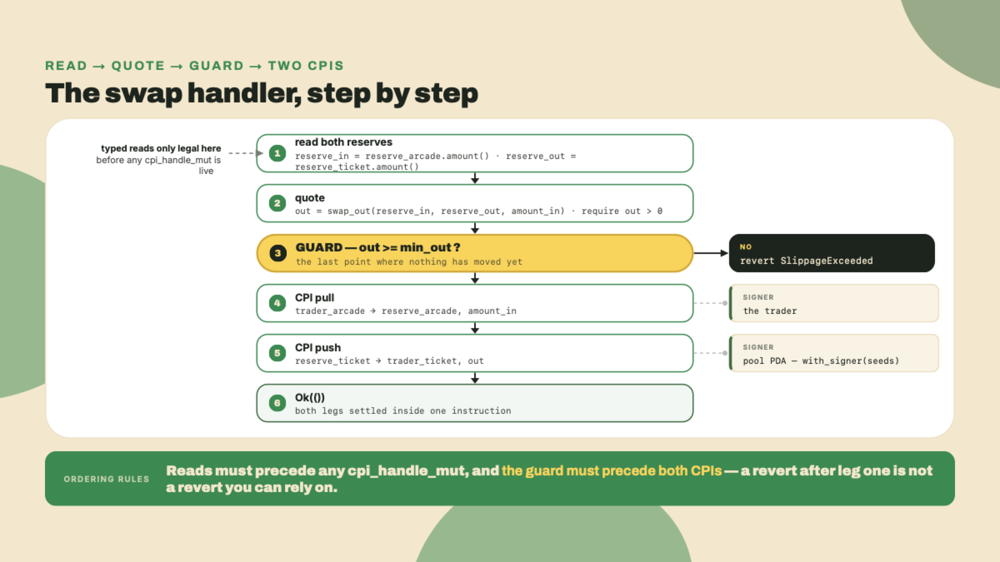
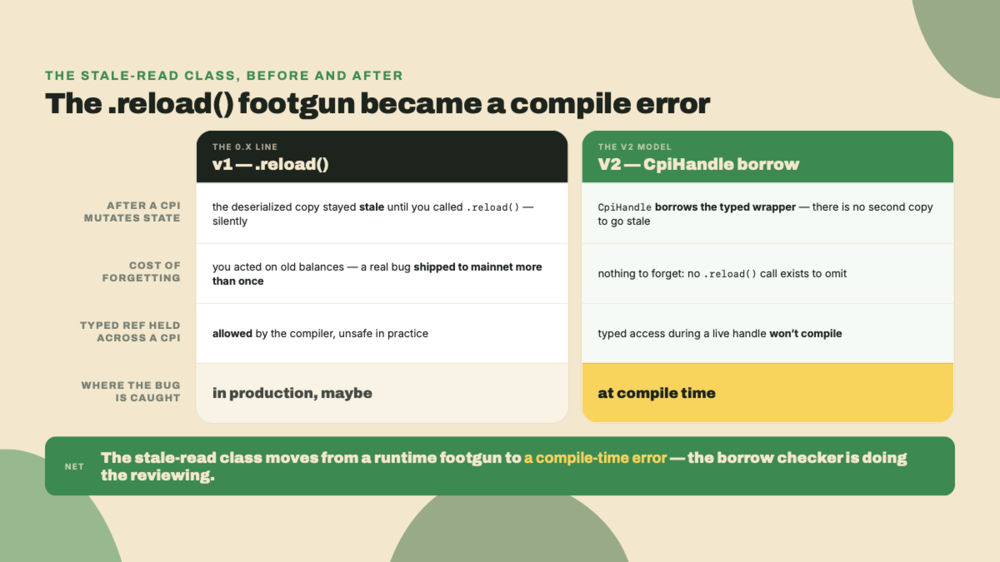
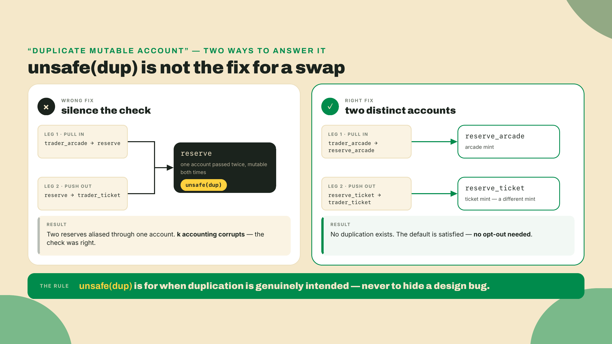
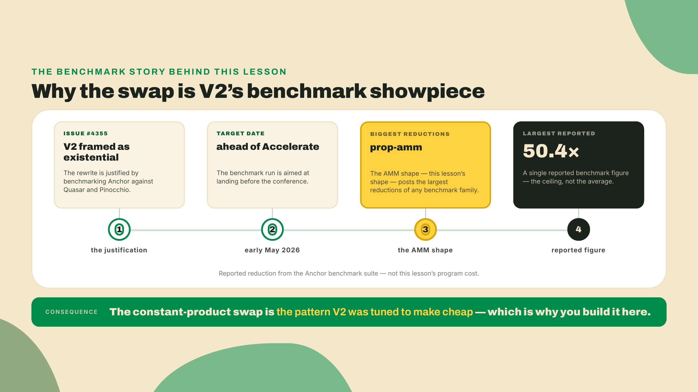

# Build the token-ticket swap

Last lesson you moved the quarter-vault and the prize-escrow onto `token_interface`. Both now custody real SPL tokens instead of lamports, and their withdraw and release tests are green. That is the whole reason this lesson is possible: you have two programs that can hold a token balance and sign transfers out of it with a PDA. Wire two of those together and you have a market.

So here is the pain. Players earn arcade tokens from the cabinet. They want tickets to spend at the prize counter. Somebody has to set the exchange rate. Hardcode `1 token = 1 ticket` in a constant and you have built a faucet, not a swap: the first player who notices the pool holds more tickets than tokens trades the cheap side until the reserves are empty, and you paid for it. The rate cannot be a constant. It has to come from the pool's own reserves and move every time someone trades.

Before you read another paragraph, do the arithmetic that a swap does on every trade. Run it, do not take my word for it. Save this as `curve.py` and run `python3 curve.py`, no packages, no install, just the `python3` already on your machine. Four lines are the whole trade:

```python
def swap_out(reserve_in, reserve_out, amount_in):
    fee_in = amount_in * 997                                  # 0.3% fee, taken before the curve
    return (fee_in * reserve_out) // (reserve_in * 1000 + fee_in)

print("naive:", 10_000 * 1_000_000 // 1_000_000)             # 10000
print("real :", swap_out(1_000_000, 1_000_000, 10_000))      # 9871
```

There is your 129-ticket gap, printed: a naive rate quotes 10,000, the curve pays 9,871. Hold onto that gap. By the end of this lesson you will know exactly where every one of those tickets went, and why handing them back to the trader is how pools get drained.

## Summary

What you build, and the shape of each piece, so you can skim before you dig:

- **The artifact is R4, a constant-product swap.** Two token reserves, a quote computed from those reserves, and two PDA-signed transfers per trade. It is the canonical Anchor composition pattern: one program driving two token accounts it controls.
- **The price is the invariant.** `x * y = k`. The product of the two reserves stays (nearly) constant across a trade, which means the more you buy, the worse your rate gets. No oracle, no admin, no hardcoded number. The reserves *are* the price.
- **The fee is 0.3%, expressed as `997/1000`.** It is subtracted from the input before the curve sees it, and it stays in the pool, which nudges `k` up on every trade.
- **The math needs a `u128` intermediate.** Two `u64` reserves multiplied can blow past `u64`. Promote, multiply, divide, cast back down. This is the one place a swap panics if you get it wrong.
- **The slippage guard is `min_out`.** The trader states the worst fill they will accept; the program reverts if the quote comes in below it. It reuses the exact shape of the escrow's conditional release from R3. It is the only trader protection this swap offers.
- **The two reserves are distinct accounts.** So Anchor V2's duplicate-mutable default is satisfied for free. You will not reach for `unsafe(dup)`, and this lesson shows you why reaching for it here would be a design bug.

The fade this lesson: I derive the curve and hand you the token-in transfer worked in full. The token-out transfer is a fill-in that mirrors it. The slippage guard is yours to write solo, because by then you will have seen its twin in the escrow and you should not need me for it.

One scope line before we start. This is a teaching swap, an Anchor pattern, not a DeFi protocol. If you want real-venue automated market making with live liquidity-provider depth, that is the DeFi and RWA Engineering course's territory. Here the swap exists to teach two-sided PDA composition, not to trade against.

## The price lives in the reserves

One idea generates everything else in this lesson. A constant-product pool holds two assets and treats the product of their balances as a number it must protect. Call the reserves `x` and `y`. The pool's law is `x * y = k`, and `k` is (almost) sacred: any trade must leave `k` at least as large as it found it.

That one rule is the price mechanism. When a trader adds `dx` of the first asset, the pool has to give back enough of the second asset, `dy`, that the product still holds. Solve for `dy` and the rate is not a stored number anywhere. It is whatever keeps the curve intact. The deeper the pool, the less a given trade moves it; the shallower the pool, the more each trade costs. That is not a bug you have to police. It is the geometry doing the policing for you.



Why quote from reserves instead of a rate you set? Because a rate you set is a rate an attacker can pick a side of. Picture the pool as a curved seesaw with a fixed area underneath it. Every trade slides a weight along the beam, and the beam has to tilt to keep the area constant. A trader can push the weight, but they cannot change the area, and the area is what they would need to steal from. The curve is not protecting a price you chose. It is the price, and it repriced itself the instant the last trade landed. That is the whole reason an AMM needs no oracle: the pool quotes itself.

Now the exact formula. Without a fee, holding `k` constant gives:

```
out = (amount_in * reserve_out) / (reserve_in + amount_in)
```

Read it and notice what it does on its own. As `amount_in` grows relative to `reserve_in`, the denominator grows too, so each additional token in buys fewer tokens out. Try to buy the whole `reserve_out` and the denominator runs away from you; you can never drain it with a finite input. The curve refuses.

The fee is a haircut on the input before the curve sees it. A 0.3% fee means the pool keeps 3 of every 1000 input units and only 997 of them count toward the trade:

```
amount_in_with_fee = amount_in * 997
out = (amount_in_with_fee * reserve_out) / (reserve_in * 1000 + amount_in_with_fee)
```

The `1000` on the denominator is there to keep everything in the same integer scale as the `997`, so you never touch a float. On-chain math is integer math, always. The fee tokens stay in `reserve_in`, so `k` after the trade is slightly larger than `k` before. The pool grows. That growth is what a real liquidity provider would earn; here it just means the invariant test asserts `k_after >= k_before`, never equality.

The constant-product curve as a picture, because the shape is the intuition:



That gap between the straight line and the curve is the 129 tickets from the intro, scaled up. On a 10,000-token trade it is small. On a 500,000-token trade against a 1,000,000 reserve the naive rate would hand over 500,000 tickets while the curve gives 332,665. A pool that quoted the straight line would be drained by the first whale who did the arithmetic. The curve is not being stingy. It is refusing to sell you the whole pool at the marginal price.

### The one place this panics: `u64` times `u64`

Look at the numerator: `amount_in_with_fee * reserve_out`. Both of those derive from `u64` values. Multiply two numbers near the top of `u64` and the product needs up to 128 bits. Do it in `u64` and the program panics on a large trade against a deep pool, which is exactly the trade you least want to fail on. The fix is not to cap your reserves. It is to promote to `u128`, multiply there, divide back down, and cast the result to `u64` only once you know it fits (and it always fits, because the output can never exceed `reserve_out`, which is already a `u64`).

The quote function, walked line by line. This is the artifact interface a later lab will call, so the signature is frozen: `swap_out(reserve_in, reserve_out, amount_in) -> u64`.

```rust
/// Quote a constant-product swap output with a 0.3% fee.
///
/// Uses a u128 intermediate so the product of two u64 reserves cannot
/// overflow. Integer division truncates, and truncation favors the pool
/// (the trader is never rounded up). Returns 0 for a zero input or an
/// empty reserve, so the caller can treat 0 as "no trade".
pub fn swap_out(reserve_in: u64, reserve_out: u64, amount_in: u64) -> u64 {
    // Nothing to trade, or a side of the pool is empty: no quote.
    if amount_in == 0 || reserve_in == 0 || reserve_out == 0 {
        return 0;
    }

    // 0.3% fee: only 997 of every 1000 input units reach the curve.
    // amount_in <= u64::MAX, so * 997 stays well inside u128.
    let amount_in_with_fee = (amount_in as u128) * 997;

    // The one multiply that can exceed u64. Guard it; on overflow, no quote.
    let numerator = match amount_in_with_fee.checked_mul(reserve_out as u128) {
        Some(n) => n,
        None => return 0,
    };

    // reserve_in > 0 here, so the denominator is never zero.
    let denominator = (reserve_in as u128) * 1000 + amount_in_with_fee;

    // Output is bounded by reserve_out (a u64), so this cast never truncates.
    (numerator / denominator) as u64
}
```



Notice the rounding direction. Integer division throws away the remainder, so the trader always gets floor, never ceil. That is deliberate. Rounding must favor the pool on every trade, because a swap runs millions of times and a fraction rounded the wrong way, repeated, is a slow leak. The pool keeping the dust is correct. The trader keeping it is a bug you would find months later as a shortfall you cannot explain.

This is where the economics earns one sentence, and only one, because this is an Anchor lesson and not a markets one. The reason a pool can quote itself with no oracle and no operator is that the curve turns liquidity into a price function: depth becomes stability, and every trade pays the pool for the privilege of moving it. That is a genuinely elegant piece of mechanism design, and it is why the same two-line invariant shows up under Uniswap, under a pump.fun bonding curve, and under the toy you are building right now. You are not inventing it. You are wiring it into Anchor.

### Where the 129 tickets went

I promised you would know where every one of those 129 tickets went, so here is the full accounting on that 10,000-token trade against the balanced 1,000,000 / 1,000,000 pool. It splits cleanly into two pieces, and neither of them is a leak.

Run the curve with no fee at all and you get 9,900 tickets, not the naive 10,000. That missing 100 is price impact. The instant your 10,000 tokens land in the reserve the pool is no longer balanced one for one, so the curve reprices the tickets you are buying while you are buying them. You moved the market and you paid for moving it. Nobody pocketed those 100 tickets; the naive linear quote only ever pretended they were on the table.

Now put the 0.3% fee back and the output drops from 9,900 to 9,871. That last 29 tickets is the fee, and it stays behind as extra reserve. One hundred to price impact, twenty-nine to the fee, one hundred twenty-nine total. Both are the curve doing precisely what it was designed to do, and both are numbers a trader would want in front of them before they sign, which is the whole reason `min_out` exists.

Those same 29 fee tickets are what lift the invariant. Before the trade, `k = 1,000,000 * 1,000,000 = 1,000,000,000,000`. After it, `reserve_in = 1,010,000` and `reserve_out = 990,129`, so `k = 1,000,030,290,000`, a hair above where it started. `k` never drops. The fee is the thing that nudges it up, and the gate's invariant test asserts exactly that: `k_after >= k_before`, never equality.



### Moving the tokens: two transfers, two signers

The quote is a pure function. It touches no accounts. The actual trade is two SPL transfers in opposite directions, and the interesting part is who signs each one.

The input transfer is easy: the trader is spending their own tokens, so the trader signs. Arcade tokens move from `trader_arcade` into `reserve_arcade`.

The output transfer is the pattern that makes this an Anchor lesson. The tickets live in `reserve_ticket`, and that account's authority is the pool PDA, an address with no private key. Nobody can sign for it except the program that owns its seeds. So the program signs, using `with_signer` and the pool's seeds, exactly the way your quarter-vault signed its own withdrawals in the previous lesson. Tickets move from `reserve_ticket` to `trader_ticket` under the pool's signature.

The handler runs a fixed sequence, and the order is not cosmetic: the reads have to happen before the handles exist, and the guard belongs in front of both transfers. Get the first wrong and the compiler stops you (a read after a handle). Get the second wrong and — be precise here — atomicity still saves the trader: a failed `require!` after the transfers reverts them both, so a bad fill never actually settles. What a late guard costs you is different. You spend two full CPIs to learn what one comparison could have said up front, and you write a handler where the trader's only protection reads like an afterthought a reviewer has to reason backwards about. Guards go before the money for cost and legibility, not because the runtime would let a reverted fill stand.



Here is the full swap handler. The token-in direction is worked; the token-out direction is the fill-in and is shown here so you can see the mirror, but in the lab you will type it yourself against a stub.

```rust
use anchor_lang::prelude::*;
use anchor_spl::{
    // `token` rides along as a MODULE, not for a type: the `token::mint = ...`
    // constraints below expand to code that names the module by path, so it has
    // to be in scope or the derive fails to resolve — m05-l1's import rule.
    token,
    token_interface::{self, Mint, TokenAccount, TokenInterface, TransferChecked},
};

// Placeholder. Keep the id `anchor new token-ticket-swap` generated for you.
declare_id!("<your generated program id>");

pub const POOL_SEED: &[u8] = b"pool";

#[program]
pub mod token_ticket_swap {
    use super::*;

    pub fn swap_arcade_for_tickets(
        ctx: &mut Context<SwapArcadeForTickets>,
        amount_in: u64,
        min_out: u64,
    ) -> Result<()> {
        // 1. Read the reserves BEFORE opening any CPI handle. In V2 you cannot
        //    hold a typed reference to a token account while a CpiHandle from it
        //    is live, so the read happens here, up front, once.
        let reserve_in = ctx.accounts.reserve_arcade.amount();
        let reserve_out = ctx.accounts.reserve_ticket.amount();

        // 2. Quote the output from the pre-trade reserves.
        let out = swap_out(reserve_in, reserve_out, amount_in);
        require!(out > 0, SwapError::ZeroOutput);

        // 3. Slippage guard (this is the SOLO piece in the lab).
        require!(out >= min_out, SwapError::SlippageExceeded);

        // 4. Pull the arcade tokens IN. The trader signs for their own account.
        let pull = TransferChecked {
            from: ctx.accounts.trader_arcade.cpi_handle_mut(),
            mint: ctx.accounts.mint_arcade.cpi_handle(),
            to: ctx.accounts.reserve_arcade.cpi_handle_mut(),
            authority: ctx.accounts.trader.cpi_handle(),
        };
        token_interface::transfer_checked(
            CpiContext::new(ctx.accounts.token_program.address(), pull),
            amount_in,
            ctx.accounts.mint_arcade.decimals(),
        )?;

        // 5. Push the tickets OUT. The pool PDA signs with its own seeds.
        //    Copy the bump into an owned local FIRST, exactly as the vault did:
        //    `signer_seeds` borrows this array, so it has to outlive the CPI
        //    below. That is a lifetime requirement, not a borrow conflict --
        //    `pool` goes into `push` as a shared `cpi_handle()`, which leaves
        //    reads of `pool` legal. The exclusion applies to the accounts handed
        //    over with `cpi_handle_mut()`.
        let bump = [ctx.accounts.pool.bump];
        let signer_seeds: &[&[&[u8]]] = &[&[POOL_SEED, &bump]];
        let push = TransferChecked {
            from: ctx.accounts.reserve_ticket.cpi_handle_mut(),
            mint: ctx.accounts.mint_ticket.cpi_handle(),
            to: ctx.accounts.trader_ticket.cpi_handle_mut(),
            authority: ctx.accounts.pool.cpi_handle(),
        };
        token_interface::transfer_checked(
            CpiContext::new(ctx.accounts.token_program.address(), push)
                .with_signer(signer_seeds),
            out,
            ctx.accounts.mint_ticket.decimals(),
        )?;

        Ok(())
    }
}

pub fn swap_out(reserve_in: u64, reserve_out: u64, amount_in: u64) -> u64 {
    if amount_in == 0 || reserve_in == 0 || reserve_out == 0 {
        return 0;
    }
    let amount_in_with_fee = (amount_in as u128) * 997;
    let numerator = match amount_in_with_fee.checked_mul(reserve_out as u128) {
        Some(n) => n,
        None => return 0,
    };
    let denominator = (reserve_in as u128) * 1000 + amount_in_with_fee;
    (numerator / denominator) as u64
}

#[derive(Accounts)]
pub struct SwapArcadeForTickets {
    pub trader: Signer,

    #[account(seeds = [POOL_SEED], bump = pool.bump)]
    pub pool: Account<Pool>,

    // Pinned to what the pool recorded at init. Without these two lines the mint
    // fields on Pool would be decoration: a caller could hand you any mint whose
    // reserves happen to be pool-owned, and the token:: constraints below would
    // happily agree with them. `address = parent.field` is the has_one replacement,
    // and this is the second place in two lessons it does real work.
    #[account(address = pool.arcade_mint @ SwapError::WrongMint)]
    pub mint_arcade: InterfaceAccount<Mint>,
    #[account(address = pool.ticket_mint @ SwapError::WrongMint)]
    pub mint_ticket: InterfaceAccount<Mint>,

    #[account(mut, token::mint = mint_arcade, token::authority = pool)]
    pub reserve_arcade: InterfaceAccount<TokenAccount>,
    #[account(mut, token::mint = mint_ticket, token::authority = pool)]
    pub reserve_ticket: InterfaceAccount<TokenAccount>,

    #[account(mut, token::mint = mint_arcade, token::authority = trader)]
    pub trader_arcade: InterfaceAccount<TokenAccount>,
    #[account(mut, token::mint = mint_ticket, token::authority = trader)]
    pub trader_ticket: InterfaceAccount<TokenAccount>,

    pub token_program: Interface<'static, TokenInterface>,
}

#[account]
#[derive(InitSpace)]
pub struct Pool {
    pub arcade_mint: Address,  // 32
    pub ticket_mint: Address,  // 32
    pub bump: u8,              //  1
    pub _pad: [u8; 7],         //  7  explicit Pod padding (65 -> 72)
}

#[error_code]
pub enum SwapError {
    #[msg("Swap output is zero")]
    ZeroOutput,
    #[msg("Slippage tolerance exceeded: output below min_out")]
    SlippageExceeded,
    #[msg("Mint does not match the one this pool was initialized with")]
    WrongMint,
}
```

One constraint choice deserves a note before the V2 specifics. The four token accounts carry the `token::` family from last lesson, not `associated_token::`. The reason is the same one that put `token::` on the escrow's recipient: an ATA constraint *derives* an address from an owner and a mint, and reserves are not ATAs. The pool holds two token accounts it created and assigned to itself, at addresses nobody derives, so there is nothing to derive against. `token::mint` and `token::authority` constrain what the account holds and who controls it, which is exactly the claim you need here.

A few things in that code are Anchor V2 specifics worth pausing on, because they are new since the 0.x line you may have written before, and this is a framework course.

The CPI shape changed. `CpiContext::new` now takes the program as an `&Address`, which you get from `ctx.accounts.token_program.address()`. In the 0.x line you passed an `AccountInfo` (a `.to_account_info()`); in V2 that is a compile error, `expected Address, found AccountInfo`. The accounts you pass into the `TransferChecked` struct are not `AccountInfo`s either. They are `CpiHandle` values, produced by `cpi_handle()` for a read-only account and `cpi_handle_mut()` for a mutable one. The handle is the account's ticket into the CPI, and it carries a Rust borrow of the typed wrapper it came from.

That borrow is the point of the next section, and it is the footgun that used to bite everyone.



### Why V2 will not let you read a balance mid-CPI

In the 0.x line, this was the classic bug. You would do a CPI that moved tokens, then read `token_account.amount` and act on it, forgetting that Anchor deserialized that account *once*, at the top of the instruction. The CPI changed the on-chain balance, but your in-memory copy still held the old number. You had to call `.reload()` to refresh it, and if you forgot, you made a decision on stale data. It was silent, it was easy, and it shipped.

V2 kills the class. A `CpiHandle` holds a Rust borrow of the typed account wrapper. While that handle is live, the borrow checker will not let you touch the typed account, so `reserve_ticket.amount()` during an in-flight handle from `reserve_ticket` is not a runtime surprise. It does not compile. The fix is not to `.reload()`. The fix is structural: read every reserve you need *before* you open a handle, which is exactly why step 1 in the handler reads both balances up top, before any `cpi_handle_mut()` exists. There is no mid-CPI read to get wrong, because the language removed the ability to write one.

So do not reach for `.reload()` here out of 0.x muscle memory. If you find yourself wanting it, you have structured the reads in the wrong order. Move them earlier.

### The duplicate-mutable trap you will not fall into

One more V2 default worth naming, because a swap is exactly the shape that trips it. V2 rejects an instruction that receives the same mutable account in two fields. Pass the same token account as both a `mut` source and a `mut` destination and validation fails before your handler runs. That check exists to catch aliasing bugs where you accidentally read and write the same account through two names and corrupt it.

A swap has two reserves, and the temptation, if you are thinking of the pool as one thing, is to route both directions through one account. Do that and V2 stops you. The wrong reaction is to silence the check with `unsafe(dup)`, the escape hatch for genuinely duplicated accounts. The right reaction is to notice that a constant-product pool has two reserves by definition, so each side is its own distinct token account. `reserve_arcade` and `reserve_ticket` are different accounts holding different mints. The duplicate-mutable default is satisfied for free, and you never touch `unsafe(dup)`. Reaching for it here would not be an opt-out. It would be papering over a design where you collapsed two reserves into one, which is a bug the check just caught for you.



Anchor's team did not add these defaults for style points. When they benchmarked V2 against Quasar and Pinocchio ahead of the Accelerate conference in early May 2026 (the framing is right there in issue #4355, where the whole V2 effort was justified as existential), the programs that posted the biggest compute reductions were the AMM-family programs, the `prop-amm` benchmark specifically, with a largest reported reduction of 50.4x. That is why a swap is the showpiece: the pattern you are building is the one V2 was tuned to make cheap. I will not print a compute number for this exact program, because those figures moved as the project tuned them and the honest thing is to measure your own, but the direction was the entire pitch.



### The slippage guard, and why it is the whole point

There is a gap between the moment a trader reads a quote and the moment their transaction lands. In that gap, other trades can hit the pool and move the reserves. The trader who was quoted 9,871 tickets a moment ago, off a 1,000,000 / 1,000,000 pool, might land into a pool a large sell has already shifted, and get 9,400. If your program fills any trade the curve produces, the trader eats that difference, and a hostile actor can *manufacture* that difference by ordering a trade in front of theirs and one behind it. That is a sandwich, and the only defense a swap this simple has against it is `min_out`.

`min_out` is the trader saying "revert unless I get at least this much." The program computes `out` from the live reserves, compares it to `min_out`, and reverts if it is short. That is the `require!(out >= min_out, SwapError::SlippageExceeded)` line, and its shape is the same conditional release you wrote into the prize-escrow in R3: compute a value, compare it to a caller-supplied bound, revert if the bound is not met. You have written this control flow before. That is why it is your solo.

Leave it out and every trade is fillable at any price, which is to say every trade is sandwichable. It is one line, and it is the difference between a swap a player can use and a swap a bot farms.

## Lab: build R4, the token-ticket swap

R4 is a new program. Say plainly what it does and does not reuse, because the temptation is to reach for the vault: the pool's reserves are **not** R2 vault instances. A vault's token account is an ATA whose authority is the vault PDA, and a reserve's authority has to be the pool PDA, so a vault cannot be a reserve without stopping being a vault. R4 composes on nothing. It is the first rung since module 1 that stands alone, and that is the honest shape of it: what carries over is the pattern, the PDA-signed `transfer_checked` you learned on the vault, not the artifact. The vault and the escrow keep doing their jobs elsewhere on the floor, and the capstone in module 9 is where all four rungs finally meet.

The autonomy fade is explicit: step 1 is a spec you implement, step 2 you type from the formula, steps 3 and 4 are worked, step 5's second CPI is a completion you type against a stub, and steps 6 and 7 are solo.

First, the toolchain, one line:

```bash
anchor --version       # confirm you are on the V2 line (2.0.0-rc.1 as of 2026-08-22), not 1.1.2
```

If it reports 1.x, re-pin with m01-l2's install block — `--tag v2.0.0-rc.1`, `--locked`, the git channel, since `avm` still cannot fetch the RC. Do not verify V2 lessons on the 1.1.2 line; the CPI and account APIs differ and your code will not compile against the old one.

1. **Stand up the pool state (spec, no code given).** Write an `init_pool` instruction. It creates the `Pool` account at `seeds = [POOL_SEED]` with a bare `bump`, stores both mint addresses and `ctx.bumps.pool`, and `init`s two token accounts whose `token::authority` is the pool PDA, one per mint, paid for by the caller. You have written every one of those lines before: `init` plus `seeds` plus `bump` is module 3, storing the canonical bump is module 3, and creating a program-owned token account is last lesson's `Initialize` with a different authority. Checkpoint: `anchor build` compiles. R4 composes on nothing, so there is no inherited suite to run yet and nothing to assert against until step 7 writes one — at which point the first thing that test proves is exactly this: the pool account exists and both reserve token accounts report the pool PDA as their authority. Write the step down now so step 7 has an assertion waiting for it.

2. **Add the quote function.** Type `swap_out` yourself from the two formula lines above, signature frozen; scroll back to the worked version only after your own compiles. Write one unit test that calls it with `reserve_in = 1_000_000`, `reserve_out = 1_000_000`, `amount_in = 10_000` and asserts it returns `9_871`. If you get `10_000`, you forgot the fee. If it panics on a large-reserve case, you multiplied in `u64`. Checkpoint: the unit test is green and the hand-computed 9,871 matches.

3. **Read the reserves up front.** In the swap handler, read `reserve_arcade.amount()` and `reserve_ticket.amount()` into locals before you build any CPI accounts. This is not optional style. It is the only place the compiler will let you read them, because once a `cpi_handle_mut()` from a reserve exists, the typed `.amount()` access on that reserve will not compile. Checkpoint: prove that claim rather than trusting it. Move the two reads to sit *between* the `let pull = TransferChecked { .. };` binding and the `transfer_checked` call that consumes it, which is the only window where the handle is genuinely live, and run `anchor build`. You should get a borrow error naming `reserve_arcade`, not a runtime surprise. Put them anywhere after the `transfer_checked` call instead and the build goes green, because the handle has already dropped, which is worth seeing too: the rule is about the handle's lifetime, not about the line number. Move them back to the top and continue.

4. **Wire the token-in CPI (worked).** Build the `TransferChecked` for `trader_arcade -> reserve_arcade` with the trader as authority, and invoke it with `token_interface::transfer_checked` over `CpiContext::new(token_program.address(), pull)`. No `with_signer` here: the trader is a real signer on the transaction. Checkpoint: after this CPI the pool's arcade reserve grew by `amount_in`.

5. **Complete the token-out CPI (fill-in).** You are given the stub:

```rust
// TODO(you): move `out` tickets from reserve_ticket to trader_ticket,
// signed by the pool PDA. Mirror the token-in CPI, but:
//   - from/to are the ticket accounts, not the arcade accounts
//   - the mint is mint_ticket
//   - the authority is the pool PDA, so you must attach with_signer
let bump = [ctx.accounts.pool.bump];             // read out first, same as the vault
let signer_seeds: &[&[&[u8]]] = &[&[POOL_SEED, &bump]];
let push = TransferChecked {
    // fill in the four accounts using cpi_handle_mut() / cpi_handle()
};
// invoke transfer_checked over CpiContext::new(...).with_signer(signer_seeds)
// with `out` and mint_ticket.decimals()
```

Fill it in against the worked version above. The one thing you must not miss is `.with_signer(signer_seeds)`. Without it the runtime has no signature for the pool PDA and the transfer fails with a missing-signer error. Checkpoint: a trade moves real ticket balances into `trader_ticket`.

6. **Add the slippage guard (solo).** Before either CPI, after you compute `out`, revert when `out < min_out`. You have the error variant (`SwapError::SlippageExceeded`) and you have written this exact conditional-release shape in the escrow. Checkpoint: a trade with `min_out` set one above the quoted output reverts with the slippage error, and a trade with a reasonable `min_out` fills.

7. **Write the gate (solo).** Two LiteSVM tests in `programs/token-ticket-swap/tests/swap_invariant.rs`, built on last lesson's `spl_setup` shape: create two mints, init the pool, fund both reserves, fund a trader. Then:

   - `invariant_holds`: read `k_before = reserve_in * reserve_out` as `u128`, send one swap with a permissive `min_out`, re-read both reserves, and assert `k_after >= k_before`. Greater-or-equal, not equal: integer division rounds the trader's output down, so the pool keeps the remainder and `k` only ever grows.
   - `slippage_reverts`: quote the trade with `swap_out` in the test, send it with `min_out = quote + 1`, and assert the transaction errors.

When all seven are done, run the gate:

```bash
anchor build && cargo test --test swap_invariant
```

Both green. If `invariant_holds` fails with `k_after < k_before`, your rounding is favoring the trader somewhere. If `slippage_reverts` fills instead, your guard is comparing the wrong direction or missing.

## Challenge: quote a constant-product swap

The lab wired the swap inside a program, where a wrong quote surfaces as a failing balance assertion three layers away. The challenge lifts `swap_out` out of the framework entirely so the arithmetic is the only thing that can be wrong. The starter, at `lessons/m05-l2/cp-swap-out/`, is the naive linear quote: it ignores both the fee and the reserve shift, over-quotes, and would let a trader drain the pool.

Implement `swap_out(reserve_in, reserve_out, amount_in) -> u64` so that it:

- applies the 0.3% fee (`997/1000`) under the constant-product invariant, not the naive price ratio;
- uses a `u128` intermediate so two `u64` reserves cannot overflow the multiply;
- returns `0` for a zero input or an empty reserve.

The eight cases the harness asserts:

| reserve_in | reserve_out | amount_in | expected |
|---|---|---|---|
| 1_000 | 1_000 | 100 | 90 |
| 1_000_000 | 1_000_000 | 1_000 | 996 |
| 5_000 | 10_000 | 500 | 906 |
| 1_000 | 1_000 | 0 | 0 |
| 1_000_000 | 1_000_000 | 10_000 | 9_871 |
| 0 | 1_000_000 | 10_000 | 0 |
| u64::MAX | u64::MAX | u64::MAX | 0 — no panic, no overflow |
| 1e18 | 1e18 | 1e12 | 996_999_005_991 |

Three nudges if you get stuck:

- `amount_in_with_fee = amount_in * 997`
- `out = (amount_in_with_fee * reserve_out) / (reserve_in * 1000 + amount_in_with_fee)`
- promote to `u128` before multiplying so `u64` reserves cannot overflow

The function is a `const fn` with compile-time assertions under it (the m03-l3 device, and what compile-only grading actually enforces), so the starter announces its own bugs at build time: the wrong-quote rows fail assertions whose messages name the case, and the big rows fail harder — const evaluation refuses the naive `u64` multiply outright with `attempt to multiply with overflow`, which is rustc making the lesson's argument for you. The last two rows are the ones that separate a working quote from a correct one. The 1e18 row overflows a `u64` multiply outright: at runtime that panics in debug and wraps in release, and a wrapped quote is a free withdrawal. The `u64::MAX` row then overflows `u128` as well, and it is worth being exact about why, because the reason is *not* that two `u64` factors stop fitting. They always fit: `(u64::MAX)²` is `2¹²⁸ − 2⁶⁵ + 1`, which lands just under the `u128` ceiling with less than a single bit to spare. The numerator here is `amount_in * 997 * reserve_out` — those two `u64`-sized factors *plus* the fee multiplier — and the `× 997` is what spends the sliver that was left. So promoting is necessary and still not sufficient: the multiply has to stay `checked` and degrade to `0`. A bare `u128 *` passes every other row and dies on that one. Compute the first row by hand before you code it. When your arithmetic and the program agree, you understand the curve, not just the code.

## Where this leaves you

You have R4: a two-sided pool that quotes itself from its reserves, moves tokens in both directions under a program's signature, and refuses a trade that would fill worse than the trader accepts. You derived the curve, you saw why the `u128` intermediate is not optional, and you watched the old `.reload()` footgun turn into something the compiler simply refuses to let you write. That last part is the theme of this whole course: V2 moves bug classes from runtime to compile time, and the swap is where you felt three of them at once.

You built all of it against a plain SPL mint. Here is the question that opens the next lesson. What happens the moment a player brings a Token-2022 mint that charges a transfer fee and runs a transfer hook? Your `transfer_checked` still calls, but does the number you quoted still match the number that arrives, and do the hook's extra accounts even fit through the CPI you just wrote? Next lesson you learn to answer that from the mint itself, by reading a live one before you trust it. Fixing a swap for a hooked mint is standards work the Digital Assets course owns; knowing you would have to is the part that is yours, and it is one read away.
