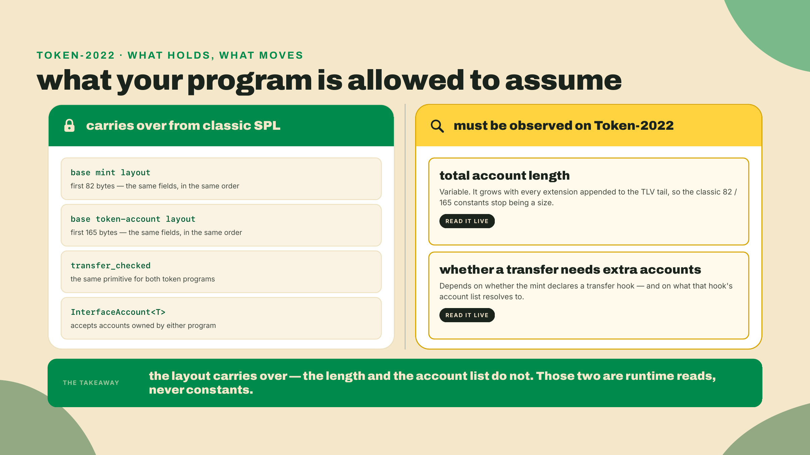
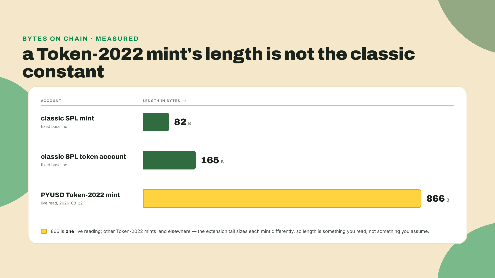
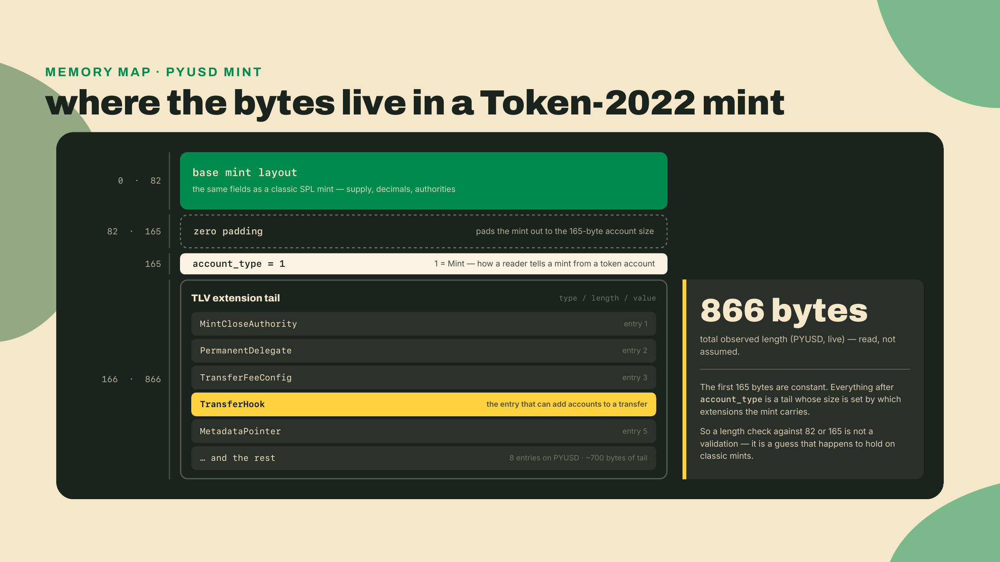
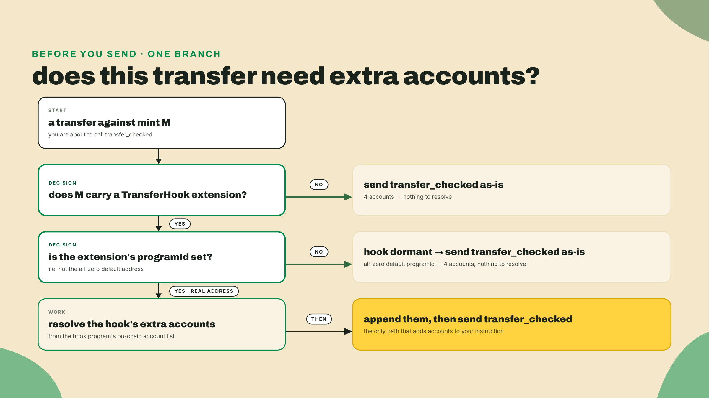
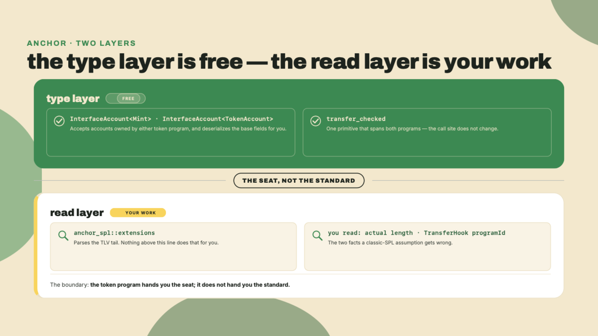
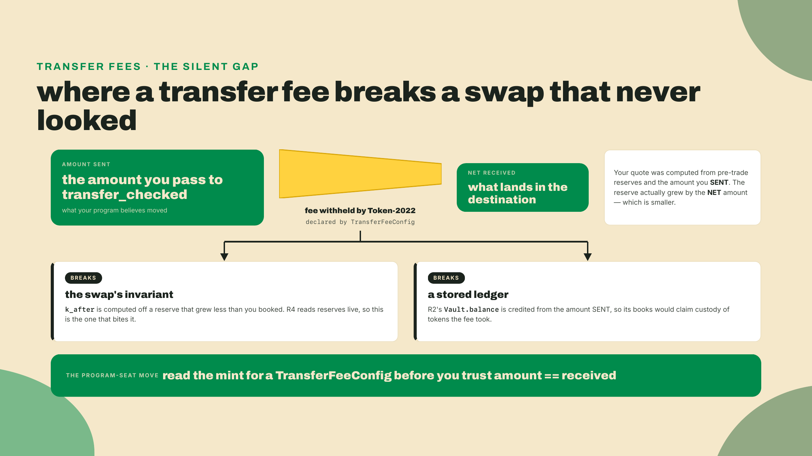
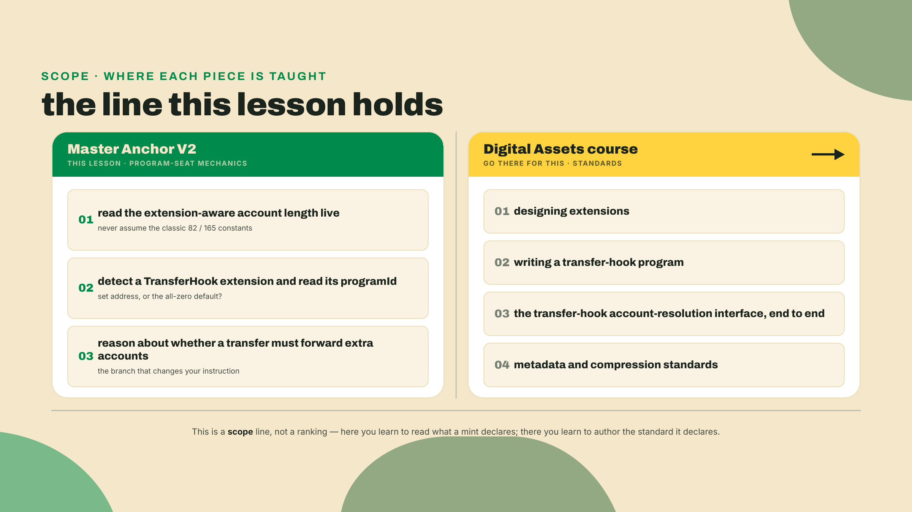

# Token-2022 from the framework's seat

Last lesson you shipped the token-ticket swap: constant-product math over two SPL-token reserves, the invariant holding across a trade, the slippage guard firing the moment a fill came in under quote. It works. You proved it works. Then a player walks up to the cabinet with a token you did not test against.

Their mint is Token-2022. It carries a transfer fee and a transfer hook. And here is the honest question, the one this whole lesson turns on: does your `transfer_checked` call still work, silently under-deliver, or fail outright?

Do not answer from memory. Open a terminal, because we are going to point a tiny reader at a real Token-2022 mint and let it tell us. That is the whole move of this lesson: run, observe, reason. Start it now, before you read on, with one command:

```bash
# PYUSD, a live Token-2022 mint. A classic SPL mint is 82 bytes. Watch this one.
solana account 2b1kV6DkPAnxd5ixfnxCpjxmKwqjjaYmCZfHsFu24GXo --url mainnet-beta
```

Read the `Length:` line it prints. If it says anything other than 82, you already hold consequence one in your hands, and the rest of this lesson is why. You will read one live mint and report two things back, the number of bytes it actually occupies and whether a transfer against it needs extra accounts you are not currently sending. If you can report those two things from the read instead of from a blog post, you have understood the seat you are sitting in.

## Summary

Your swap already targets both token programs. You built it on `InterfaceAccount<T>` and `transfer_checked` back in the swap lesson, and that was not a throwaway choice: the same code path already runs against classic SPL Token and Token-2022 without a branch. So the type system is done. That is the good news, and it is free.

The bad news is that Token-2022 quietly moves two pieces of real work onto your program, and the type system will not remind you about either one:

- **Account sizes stop being constants.** A Token-2022 mint or token account is not a fixed length. Extensions grow it. Assume the classic size and your reads run off the end of the data.
- **A hooked mint means a transfer can need extra accounts.** If the mint declares a transfer hook, a transfer against it runs a second program, and that program needs its own accounts forwarded in your instruction. Miss them and the transfer does not complete.

That is the entire lesson. Two consequences, observed live, reasoned about from the program's seat. I will walk the first read with you step by step in the lab. The challenge at the end you run on your own, against a mint you pick. That is the fade: guided now, solo in fifteen minutes.

One hard boundary, stated up front so neither of us drifts. This lesson teaches Token-2022 as a *consequence for your program*. It does not teach you to design extensions, and it does not walk the transfer-hook interface. The Digital Assets course walks the transfer-hook interface end to end and owns extension-standards depth — its module 3 is where you write the hook this lesson only reads. When we hit that line, we stop and point there. On purpose.

## What actually changes for your program

What does not change is more than you would guess, so take that first. A Token-2022 mint uses the *same base layout* as a classic SPL mint. Same supply field, same decimals, same authority slots, same first 82 bytes. A Token-2022 token account shares the classic 165-byte base too. If Token-2022 had rewritten the base layout, every wallet and indexer on the network would have broken on day one. It did not. It kept the base and appended new data after it.

That append is the thing to internalize. Everything Token-2022 adds lives in a TLV section glued onto the tail of the account: type, length, value, repeated. A mint that opts into a transfer fee, a metadata pointer, and a transfer hook carries three TLV entries after its base. A mint that opts into nothing carries none and reads exactly like a classic mint.



### Consequence one: size is data now, not a constant

One number makes it concrete. A classic SPL mint is 82 bytes. Full stop, always, forever. A classic token account is 165 bytes, same deal. Those are constants you can hardcode and never think about again.

Now the live read you are about to run yourself: the mainnet PYUSD mint, a real Token-2022 mint, occupies 866 bytes right now. Same base, same 82 bytes at the front, plus a TLV tail carrying its extensions. That is more than ten times the classic size, and it is not a magic number I want you to memorize. It is a number you *read*, because a different Token-2022 mint carries a different set of extensions and lands at a different length.



Why did the standard do it this way, appending a self-describing tail instead of just widening the struct? Because you cannot renumber a binary format that the entire ecosystem is already parsing. The base fields sit at fixed offsets that thousands of clients depend on. So new features could not go *inside* the old layout, they had to go *after* it, each one announcing its own type and its own length so a reader can walk the tail without a schema baked in ahead of time. The elegance is real. The cost is equally real and it lands on you: length is now a value carried in the data, not a constant you can trust from the header. Read it.

This is also exactly why I told you not to answer the opening question from memory. A mint's length is not even stable for one mint over time: an authority can add an extension after issuance and the account gets longer, so a number that was right when you wrote your program can be wrong when it runs. The discipline is boring and correct: read the live account, reason from what it says.

The framework does help here, and it helps more than the classic path did. In your swap, the mint and vaults are typed as `anchor_spl::token_interface::InterfaceAccount<Mint>` and `InterfaceAccount<TokenAccount>`. That type accepts an account owned by *either* the classic Token program or Token-2022, and it deserializes the base fields correctly across both. When you reach past the base into the extension tail, the second layer is `anchor_spl::extensions`, which parses the supported fixed-size TLV extension structs off the account. Two layers, one for the base and one for the tail.



One detail in that diagram surprises people, so name it before it bites: the tail does not start at byte 82. An extended mint is padded out to 165 bytes, the classic *token account* size, and byte 165 carries a one-byte account-type tag, `1` for a mint. Only then does the TLV run, from byte 166 to the end. The padding exists so a reader can never confuse an extended mint with a token account by length alone: a bare 82-byte mint was never ambiguous, but an 82-byte base plus a TLV tail could land at exactly 165 bytes — a token account's length — and that is the collision the padding plus the type tag rule out. On PYUSD that leaves 700 bytes of tail under the 866.

So what actually breaks if you ignore this and assume the classic 82 bytes? Two ways, both ugly. If you slice the account to a fixed length and read a field by offset, you either land on a byte that means something else now or you run clean past the buffer, and your program is making decisions on garbage. If you deserialize with a fixed-size decoder, it either rejects the account or hands you a base struct that silently drops everything in the tail. Neither failure announces itself as "you assumed the wrong size." They surface as garbage values and mystery rejects, which is the worst kind of bug to chase.

You can watch the constant break in one line. Point the same read at a classic SPL mint and at the Token-2022 one, back to back:

```bash
# USDC, a classic SPL mint. Then PYUSD, Token-2022. Compare the Length: lines.
solana account EPjFWdd5AufqSSqeM2qN1xzybapC8G4wEGGkZwyTDt1v --url mainnet-beta | grep Length
solana account 2b1kV6DkPAnxd5ixfnxCpjxmKwqjjaYmCZfHsFu24GXo --url mainnet-beta | grep Length
```

The first prints the constant you could have hardcoded. The second prints a number you had to read. Same instruction surface, same `transfer_checked`, two different lengths: that gap is consequence one, and no amount of typing discipline in your accounts struct closes it for you.

This is also the reason your swap types its accounts as `InterfaceAccount<T>` and not `Account<TokenAccount>`. `Account<TokenAccount>` pins the account's owner to the classic Token program. Hand it a Token-2022 account and it does not read the tail wrong, it refuses the account outright, because the owner is a different program id. `InterfaceAccount<T>` is the version that accepts an account owned by either program and reads the shared base from both. The footgun it saves you from is the oldest one in this corner of Solana: hardcoding the classic Token program id somewhere in your accounts or your checks, so the instant a real user brings a Token-2022 mint your program bounces them for a reason they cannot see. Type it as the interface and that whole class of bug never gets written.

### Consequence two: a hook can demand accounts you are not sending

The second shift is the one that fails loudly instead of quietly. A mint can declare a *transfer hook*: a program the Token-2022 program calls into on every transfer of that token, after the transfer's own logic runs. The token creator writes and deploys that program, then points the mint at it through the TransferHook extension.

For your swap, the consequence is narrow and specific. When a transfer runs against a hooked mint, the hook program executes, and it needs its own accounts. Those extra accounts are not accounts you know about at compile time. They are resolved from an on-chain list the hook publishes for that mint. Your instruction has to forward them. If you build a `transfer_checked` with only the four accounts it always took, from, to, mint, authority, and the mint has a live hook, the transfer will not complete. `transfer_checked` is still the right primitive. It is not the instruction that is wrong. It is the account list that is short.

So from the program's seat there is exactly one question you have to be able to answer before a transfer: does this mint declare a hook, and if so, is that hook live? And the field you key it on is the TransferHook extension's `programId`. If the mint carries no TransferHook extension at all, there is nothing to forward. If it carries the extension but the `programId` is unset, the hook is *declared but dormant*, still nothing to forward. Only when `programId` is a real address does a transfer need the hook's extra accounts resolved and appended.

Unset is a specific thing here, not a hand-wave. On the wire that field is an optional-non-zero pubkey: always thirty-two bytes, all zeros meaning "none." So "unset" reads back as the all-zero default address, `11111111111111111111111111111111`, which matters the moment you write the check, because it is not `null` and it is not empty.

That dormant case is not a corner I invented to be thorough. The live PYUSD mint carries a TransferHook extension right now, and its `programId` is the all-zero default. Eight extensions present, hook among them, and yet a plain `transfer_checked` against it needs no extra accounts, because the hook is armed and idle rather than active. This is why "does it have the extension" is the wrong question and "is the `programId` set" is the right one. You will see exactly that in a minute when you run the reader.



Two layers, again, and it is worth naming them together because they are the shape of Anchor's whole Token-2022 story.



That seam label is the trade-off, said plainly. `token_interface` buys you both-program compatibility for free, at the type level, and it is genuinely a relief compared to hardcoding a program id and branching. But Token-2022 shifts real work onto you in exchange: you cannot assume a fixed size, and a hooked mint means a transfer that *looks* complete can fail unless you forward the hook's accounts. The framework hands you the seat. It does not hand you the standard.

One more read-don't-assume trap belongs right next to the hook, because the player's mint in the opening carried both. A mint can also declare a transfer fee, and when it does, the amount that actually lands in the destination is smaller than the amount you handed `transfer_checked`. For a plain wallet-to-wallet send that is a rounding annoyance. For your swap it is a correctness bug: your constant-product math assumes the vault received exactly what you sent it, and a fee quietly voids that assumption, so your invariant drifts and your pricing goes wrong. The mechanic is identical to everything else here, read the mint, do not assume the amount. The fee's own math, how the basis points and the maximum cap actually compute, is the extension catalog, and that catalog is the Digital Assets course's. Noticing that net-received can differ from amount-sent is the part that is yours.



And that is the line we do not cross. Designing an extension, writing a transfer-hook program, wiring its account-resolution interface end to end, that is standards depth, and it lives in one place by design. The Digital Assets course walks the transfer-hook interface end to end and teaches extension-standards depth. Here, from the framework's seat, your job stops at noticing the hook exists and knowing you would have to forward its accounts. Noticing is mechanics. Authoring is the standard. Different course, on purpose.



You might be tempted to file all of this under "edge case I will handle when someone complains." Resist that. The Token-2022 mints in the wild are disproportionately the ones you least want to fail against. The regulated stablecoins and the higher-value assets reach for permanent delegates, transfer fees, and hooks precisely because real money and real compliance are riding on them. The throwaway memecoin will never exercise this path. The mint your treasury actually cares about will. That asymmetry is the whole argument: a read-don't-assume habit is cheap insurance, and a hardcoded size is a time bomb with your biggest counterparty's name written on it.

## Lab: read the mint before you trust it

Time to make the two consequences visible. We will write a small reader, point it at the provided Token-2022 mint, and report the observed length and the hook state. This is the run-observe-reason beat, and it is deliberately a client script: the question is about what the mint *is*, and the cleanest way to answer it is to read the live account.

I am walking every step here. Copy along.

**1. Install the client dependencies.** No Rust and no Anchor in this lab: the question is about what a mint *is*, so the reader is a Node script and your V2 toolchain sits this one out. We use `@solana/kit` and the kit-native Token-2022 client. Watch the pin, and watch the *pair*: as of 2026-09-07 kit's npm `latest` is 8.2.0 while `@solana-program/token-2022`'s `latest` is 0.16.1, which peers kit `^8`. The install below deliberately holds the older pair — `token-2022@^0.15` peers kit `^7` — because a matched pair is what has to resolve, not the newest of either. Run the freshness check below before you touch these, and move both together or neither.

```bash
npm install @solana/kit@^7 @solana-program/token-2022@^0.15
npm install -D tsx    # runs a TypeScript file directly
# Freshness check before you ever bump these:
#   npm view @solana-program/token-2022 peerDependencies
```

Pin that client range explicitly. Leave `@solana-program/token-2022` unversioned and npm's resolver can backtrack onto an older `0.11.x`, which peers kit `^6`, and the install dies on an `ERESOLVE` peer conflict against the `^7` you just asked for. Naming both majors is what makes the pair resolve.

Checkpoint: the install finishes with no `ERESOLVE` and `npm ls @solana/kit` prints a single `7.x` at the top level. Two kit versions in that tree means something pulled `^6` back in, and the reader will fail on a type mismatch rather than on the mint.

**2. Take the reader.** This script is given to you to run, not TypeScript you are being asked to author. You write Rust in this course; the one lesson where you author a TS client is m08-l1, and this is not it. Copy it as it stands, and read it the way you would read a colleague's script: two reads, matching the two consequences. First the raw account, to measure its real length. Then the decoded mint, to inspect the transfer-hook extension. Save this as `inspect.ts`:

```typescript
import {
  address,
  createSolanaRpc,
  fetchEncodedAccount,
  unwrapOption,
} from "@solana/kit";
import { fetchMint } from "@solana-program/token-2022";

const RPC_URL = "https://api.mainnet-beta.solana.com";
const rpc = createSolanaRpc(RPC_URL);

// The provided specimen: a live Token-2022 mint on mainnet.
const MINT = address("2b1kV6DkPAnxd5ixfnxCpjxmKwqjjaYmCZfHsFu24GXo");

// On the wire the hook's program is an "optional non-zero" pubkey: 32 bytes,
// all-zero meaning unset. The client decodes those zero bytes to the default
// address below, NOT to null, so this is what "no hook" actually looks like.
const UNSET_HOOK = address("11111111111111111111111111111111");

async function inspect(): Promise<void> {
  // Consequence one: read the real length. Never assume the classic 82 bytes.
  const raw = await fetchEncodedAccount(rpc, MINT);
  if (!raw.exists) {
    throw new Error(`mint ${MINT} not found`);
  }
  console.log("owner program:", raw.programAddress);
  console.log("account bytes:", raw.data.length);

  // Consequence two: does this mint declare a transfer hook, and is it live?
  const mint = await fetchMint(rpc, MINT);
  const extensions = unwrapOption(mint.data.extensions) ?? [];
  console.log("extensions present:", extensions.length);

  const hook = extensions.find((ext) => ext.__kind === "TransferHook");

  if (hook === undefined) {
    console.log("transfer hook: none -> transfer needs no extra accounts");
    return;
  }

  if (hook.programId === UNSET_HOOK) {
    console.log("transfer hook: present but programId unset -> dormant, no extra accounts");
  } else {
    console.log(`transfer hook: ACTIVE (${hook.programId}) -> forward its extra accounts`);
  }
}

inspect().catch((err) => {
  console.error(err);
  process.exit(1);
});
```

**3. Run it.**

```bash
npx tsx inspect.ts
```

**4. Read the output.** You should see something that lines up with this, give or take the exact addresses:

```text
owner program: TokenzQdBNbLqP5VEhdkAS6EPFLC1PHnBqCXEpPxuEb
account bytes: 866
extensions present: 8
transfer hook: present but programId unset -> dormant, no extra accounts
```

Stop and read that, because it is the whole lesson landing at once. The `owner program` is the Token-2022 program, which is why the base fields decoded and the tail even exists. The `account bytes` is 866, not 82, which is consequence one in one line: this account is more than ten times the classic size, and your program would corrupt every read if it assumed the constant. Eight extensions came back, which is the tail those extra bytes are made of. And the hook line is consequence two with the nuance baked in: the extension is *present*, but its `programId` is unset, so a `transfer_checked` against this mint needs no extra accounts. The extension being there did not answer the question. The `programId` did.

That comparison against `UNSET_HOOK` is worth one more beat, because it is the exact place a careless reader ships a bug. "Unset" on the wire is thirty-two zero bytes, and the client hands those back to you as the default address those zeros encode to, `11111111111111111111111111111111`, not as `null` and not as `undefined`. So a truthiness test on `hook.programId` is always true and would report every dormant hook as live:

```typescript
// WRONG: a 32-zero-byte pubkey decodes to a non-empty string, so this is
// always truthy and reports every dormant hook as active.
if (hook.programId) { /* resolve extra accounts */ }

// RIGHT: compare against the address those zero bytes actually encode to.
if (hook.programId !== UNSET_HOOK) { /* resolve extra accounts */ }
```

Swap the wrong line into `inspect.ts` and re-run it if you want to see the failure mode: the same dormant PYUSD hook comes back `ACTIVE`, and a program trusting that would start forwarding accounts nobody asked for. Compare against the default address explicitly, the way the script does, or you have written a check that can only ever answer yes.

If your reader printed a real address on that last line instead of the dormant message, you would be looking at a mint whose transfers you cannot complete with four accounts, and the field that told you is the same one, `programId`. That is the entire decision, and you just made your program state it out loud from a live read instead of a guess.

Two notes before you go hunting on your own. First, everything you just did to a mint applies to token accounts too. A Token-2022 token account is the classic 165-byte base plus its own extension tail, so the read-the-real-length rule holds every time your program touches a balance, not just when it inspects a mint. Point the same `fetchEncodedAccount` call at a token account and you will see the same variable length. Second, keep straight why this was a client script and not an on-chain read. On-chain, `InterfaceAccount<T>` and `anchor_spl::extensions` do this exact work inside your handler. Off-chain, kit does it. Same two questions, same two answers, a different seat. The point was never the language. It was the habit of asking the account instead of your memory.

## Challenge: find a mint that says yes

The lab handed you a mint whose answer is "no extra accounts." Now you make one that says "yes." Hunting mainnet for a live hook is a needle-in-a-haystack exercise with no way to tell failure from bad luck, so you are going to mint the specimen yourself on devnet, where you control every input.

The `programId` in the TransferHook extension is just a stored pubkey; nothing validates that it points at a real hook program at mint time. So any program id you own makes the field read as set, which is exactly the state you are trying to observe — it does not even have to be deployed. Your swap's id from `Anchor.toml` works even though that program has only ever run inside LiteSVM, and the R0 greeter you actually shipped in m01-l2 works just as well:

```bash
solana config set --url devnet
solana airdrop 2

# Any program id works as the hook target; use your own swap's, from Anchor.toml.
spl-token --program-id TokenzQdBNbLqP5VEhdkAS6EPFLC1PHnBqCXEpPxuEb \
  create-token --transfer-hook <YOUR_SWAP_PROGRAM_ID> --decimals 6
```

That prints a new mint address. Put it in `inspect.ts` as `MINT`, switch `RPC_URL` to `https://api.devnet.solana.com`, and run it. If `spl-token` is not on your machine, `cargo install spl-token-cli` puts it there.

Acceptance: the last line reads `ACTIVE` and prints the program id you passed. If it reads `none` instead, you created the mint without `--transfer-hook`. If the reader errors before printing anything — an owner or decode failure — you created a classic mint; check the `--program-id` flag, which is what selects Token-2022. (`dormant` you should not see here: `create-token --transfer-hook` writes a real program id into the field.)

When the last line reads `ACTIVE`, sit with what it means for the swap you built. Your current instruction sends four accounts. This mint's transfers need more, resolved from the hook's on-chain list, and your swap as written would fail against it. You do not have to fix that today. Actually building the resolution belongs to the standards depth we are deliberately leaving to the Digital Assets course. Noticing that you would have to is the skill this lesson was for.

## What you should be able to say now

Here is the checkpoint, and it is the exact shape of the answer this lesson was built to produce. Point your reader at the provided mint and, from the read and not from memory, report back:

- the extension-aware account length you observed, in bytes, and
- yes or no on whether a transfer needs extra hook accounts, naming the one field you keyed it on.

For the lab mint that is: 866 bytes, no extra accounts needed, keyed on the TransferHook extension's `programId` still sitting at the all-zero default address. If you can produce that shape for the mint you made in the challenge too, you are done.

Which finally answers the player at the cabinet door. Their mint carried a fee and a hook, so all three outcomes were live and you can now say which is which. If the hook's `programId` is set, your `transfer_checked` **fails outright**, and it fails cleanly rather than half-moving anything, because the hook's CPI aborts the transfer. If the hook is dormant but a `TransferFeeConfig` is present, it **silently under-delivers**: the call succeeds, less arrives than you sent, and your invariant is the thing that notices, late. And if neither is armed, it simply **works**, which is the PYUSD case you just read. Three answers, one read, and the read is the whole skill. You can move a token across both programs and you can look at a mint you have never seen and say, from the seat of your own program, exactly what a transfer against it would demand.

Next lesson we stop reading other people's accounts and start x-raying our own. You turn V2's first-party instruments on this exact swap, flamegraphs, a step debugger, and coverage, to see where its compute actually goes. You have measured what a mint costs you in bytes. Next you measure what your program costs in compute.
