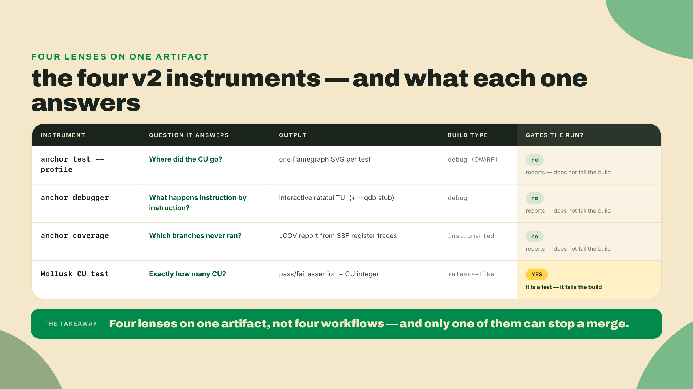
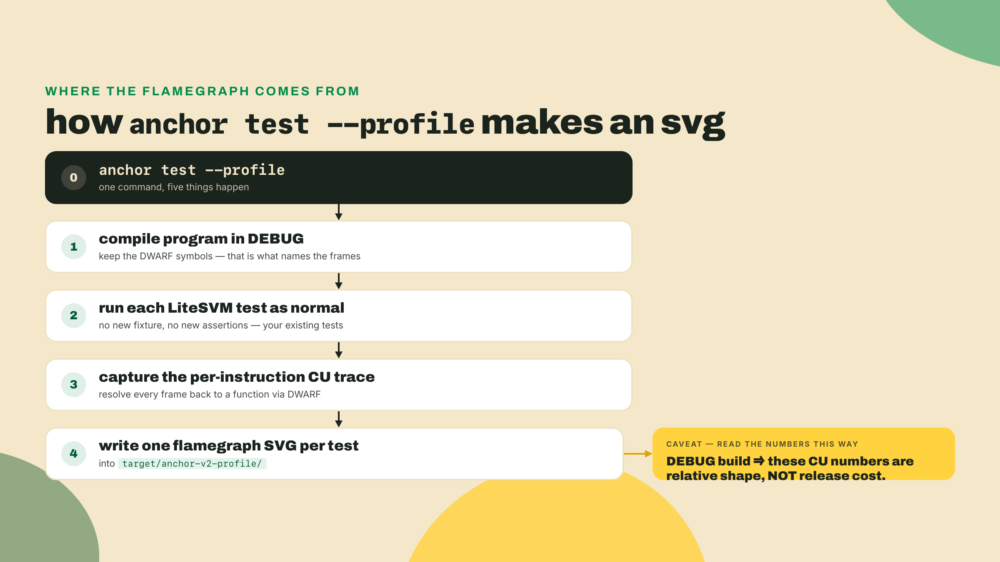
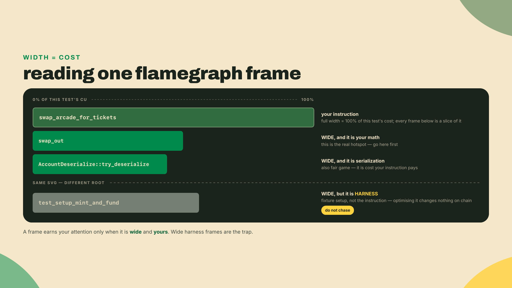
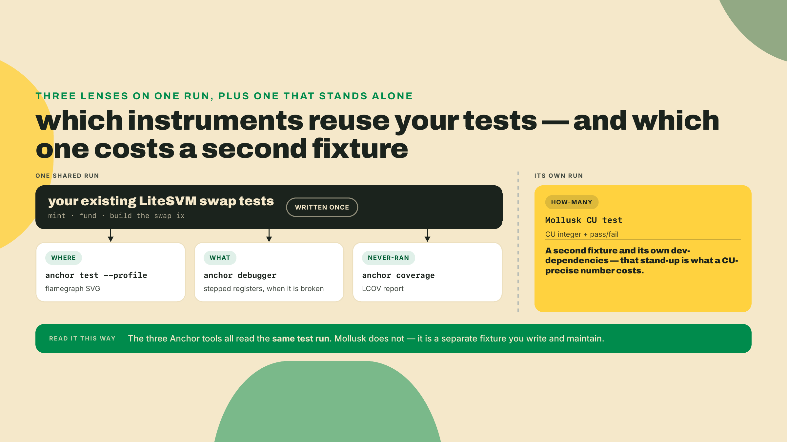
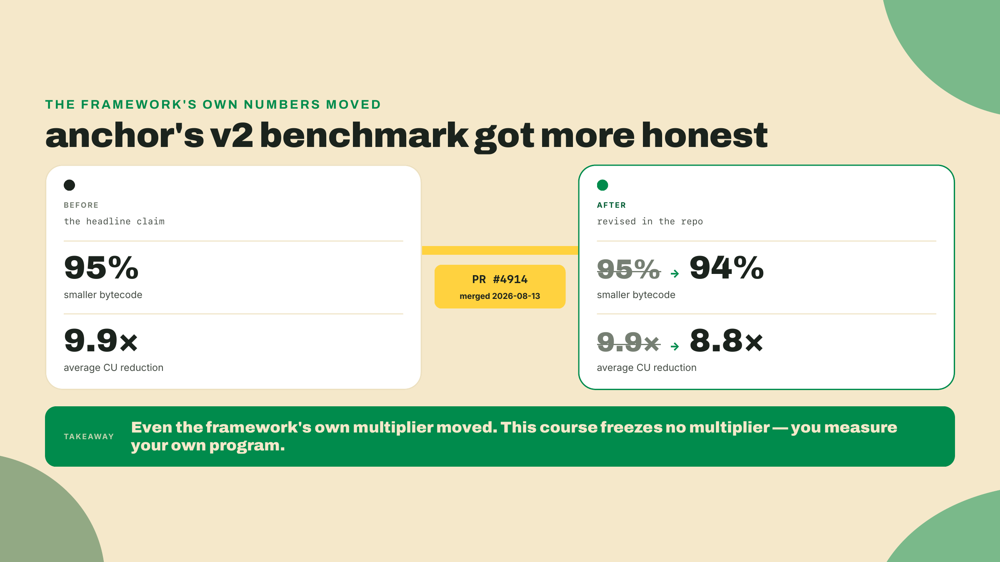
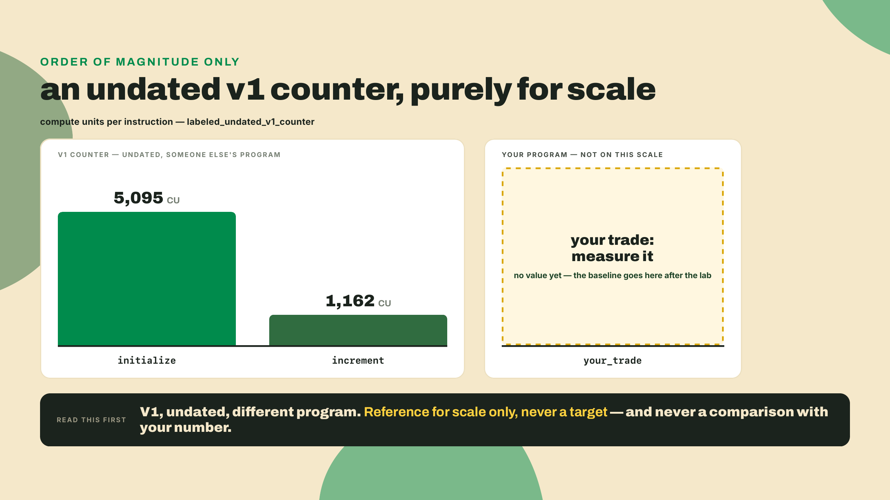
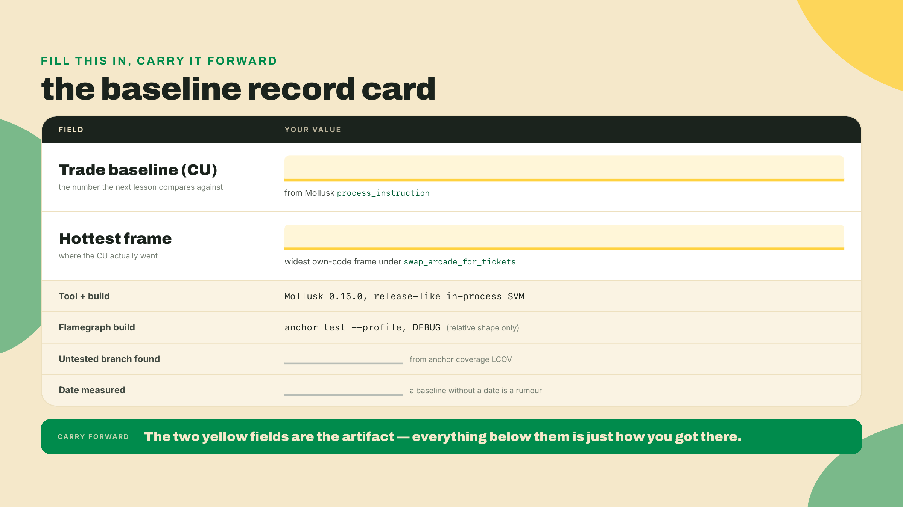

# Turn the instruments on: profile, debug, and cover the swap

Last lesson you sat in the framework's seat and watched what changes when a mint arrives as Token-2022 instead of plain SPL. You pointed a small client-side reader at a provided mint, read its real length and its dormant transfer hook straight off the wire, then went hunting for a mint whose hook was live. No new program code was written. Your swap program, R4 in the Quarters barcade, still moves arcade tokens one way and tickets the other. It works. And you still have not measured what a single trade costs.

Ask the honest question: how many compute units does one trade burn? Every answer you can give today is a shrug dressed up as an estimate. This whole module is about trading that shrug for a number you measured yourself, using V2's own first-party tooling instead of a marketing multiplier from someone else's benchmark.

So before any theory, do the thing. If you have not already put V2 on this machine, build the release candidate from its documented git channel, the same install you ran in m01. Remember from that lesson: `avm install` cannot fetch the RC, because it downloads prebuilt binaries from GitHub Releases and no Release was cut for the v2 tag. The sanctioned path is a source build from the repo's current home, otter-sec/anchor (the old coral-xyz and solana-foundation URLs redirect there), pinned to the `v2.0.0-rc.1` tag:

```bash
# The documented V2 RC install: build from source at the v2.0.0-rc.1 tag.
# Pin verified live on crates.io 2026-08-23: anchor-cli 2.0.0-rc.1 (published 2026-08-12).
# RC pins move fast: re-verify the tag and version before you pin a Dockerfile.
# The LTO prefix is needed on macOS when the link step dies, harmless on Linux
# (m01-l2 has the why). It is also why the earlier install blocks in this course
# print it: leave it on and one command works everywhere.
# Why git and not `cargo install anchor-cli@2.0.0-rc.1`? The crates.io publish is
# real but undocumented for CLI installs; the git build is the sanctioned channel
# for the BINARY. (The library is the opposite: your program crate takes
# anchor-lang from crates.io, because a published version cannot move.)
CARGO_PROFILE_RELEASE_LTO=off \
cargo install --git https://github.com/otter-sec/anchor.git \
  --tag v2.0.0-rc.1 anchor-cli --locked --force
anchor --version
```

Now, from your R4 workspace, run the profiler against the swap tests you already have:

```bash
anchor test --profile
```

When it finishes green, look under `target/anchor-v2-profile/`. There is a flamegraph SVG sitting there, one per test, that did not exist five minutes ago. Leave it open in a browser tab; the lab picks it up at step 2 and reads it properly. By the end you will know how to read it, what it lies about, and the one number to write down.

## Summary

You are going to instrument the existing swap, not extend it. No new program logic gets written. R4 gains an observability layer built from four instruments. Three of them, the profiler, the debugger, and coverage, run against the LiteSVM swap tests you already have: no new setup, three readings of one existing run. The fourth, Mollusk, is a second stand-up and it is worth saying so, because it costs you its own dev-dependencies, its own account fixture, and its own `cargo test` invocation. That is the price of a CU number precise enough to assert on.

Three of them are Anchor's own: `anchor test --profile` for flamegraphs, `anchor debugger` for stepping a failing instruction, and `anchor coverage` for finding untested branches. The fourth is `anza-xyz/mollusk`, a third-party crate with no Anchor affiliation, which is where a compute-unit-precise assertion on a single instruction comes from. Three first-party instruments plus one borrowed one, and the borrowed one is the only one that gates. The lab walks all four against the swap as a worked example. Then you re-run each one against your own swap unaided and record two things: the baseline compute-unit cost of one trade, and the name of the hottest frame in the flamegraph.

That split is the autonomy fade for this lesson. I demonstrate the four tools on R4 with you watching. You re-run them on your own program with the wheels off. And the interpretation, reading the flamegraph width and spotting the coverage gap, is yours alone at the end. There is no program code to write in this lesson. The one thing you author is a single constant in a test, and the rest of the doing is measurement.

One glossary term up front, because it is on every line below. A compute unit, or CU, is Solana's metering of on-chain work: every instruction runs against a compute budget, and each operation the runtime performs debits some CU from it. "What does a trade cost" means "how many CU does the trade instruction consume." Cheaper means headroom for more work in the same transaction and a smaller fee at landing.

## The four instruments

Here is the shape of the whole toolkit before we drive it. Four tools, four different questions, one shared test fixture underneath. Read this table once and refer back to it during the lab.



The thing to internalize is the last column. Three of these four report: they hand you an artifact and let you decide what it means. Only the Mollusk test decides for you, because a test is a pass-or-fail contract. That difference is why the baseline number you eventually commit to lives in the Mollusk test and nowhere else.

Now each instrument, in the order you will actually reach for them.

### The profiler: where the CU went

`anchor test --profile` runs your normal test suite, but it compiles the program a specific way and captures a specific artifact. It builds in DEBUG so the binary keeps its DWARF symbols. DWARF is the debug-info format that maps raw compiled instructions back to your function names and source lines. Without it, a profile is a wall of hex addresses. With it, the profiler can label each frame with the function it belongs to.

The captured artifact is a flamegraph. A flamegraph is a stacked bar chart of where execution time, or here compute cost, accumulated: each box is a function, its width is the cost attributed to it, and boxes stack to show who called whom. One orientation note, because it decides where you look: these SVGs are drawn icicle-style, root at the top with callees stacking downward, so your instruction's box sits at the top and everything it called hangs *beneath* it. The widest box beneath your instruction's root that is your own code is, roughly, "where the CU went." One SVG is written per test under `target/anchor-v2-profile/`.



Read the picture. Here is what a flamegraph frame is telling you and what it is not.



That harness frame is the first footgun and the most common one. Your LiteSVM test mints and funds accounts in its own transactions before it calls `swap_arcade_for_tickets`, and the profiler traces every instruction in the run, so those setup instructions get their own roots in the same SVG, often fatter than the trade. They are real cost, but they are not your instruction's cost. Chase one and you will optimize your test fixture while the trade stays exactly as expensive as before. Everything you care about hangs beneath the `swap_arcade_for_tickets` root specifically.

### The debugger: instruction by instruction

Sometimes the flamegraph is not the question. Sometimes an instruction fails and you need to watch it die. `anchor debugger` is a foundry-style TUI, a ratatui terminal interface, that steps your program one sBPF instruction at a time and shows you the registers as they change. sBPF is the Solana flavor of the eBPF bytecode your Rust compiles down to, the actual thing the runtime executes.

For deeper work it wires up to a real debugger. Pass `--gdb` and Anchor exposes the solana-sbpf gdb stub, a small server that speaks the gdb remote protocol so you can attach gdb and set breakpoints against the running program. In the lab you will point the debugger at a deliberately broken trade and step to the exact instruction where it reverts.

### Coverage: which branches never ran

`anchor coverage` answers a question the other three cannot: what did your tests never touch? It reconstructs line and branch coverage from SBF register traces and emits it as LCOV, the standard line-coverage report format that editors and CI tools already know how to display. Point it at the swap and it will show you, for instance, that your slippage-guard branch or your zero-amount early return never executed under any test.

Here is the footgun, stated plainly so you do not wait for it: `anchor coverage` reports, it does not gate. It will not fail your build when coverage drops. It hands you an LCOV file and walks away. If you want a coverage floor enforced, that is a CI policy you write on top of the report, not a thing the tool does for you.

### Mollusk: exactly how many CU

The first three tools describe. Mollusk asserts. Mollusk (`anza-xyz/mollusk`) is a lightweight, in-process test harness that runs a single instruction in a minified SVM and lets you make hard checks on the result, including a compute-unit-precise check. No validator, no localnet, no async. You build one instruction, hand it accounts, and assert both that it succeeded and that it consumed a specific number of CU.

This is where the module's testing thread escalates. In m02 you wrote a LiteSVM test: fast, in-process, great for behavior. LiteSVM answers "did it do the right thing." Mollusk answers "did it do the right thing for exactly this many compute units." Same in-process speed, one rung sharper. Later, at the capstone, Surfpool comes in for full-floor localnet integration against real cluster state. For a CU-precise assertion on one instruction, today, Mollusk is the tool.



### The trade-off, before you trust any of it

Instrumentation is not free and it is not the truth. Name the costs now so no number surprises you later.

`--profile` builds in DEBUG to get those DWARF symbols. A debug build is not your release build, so its CU figures are inflated and shaped differently from what ships. Use the flamegraph for relative shape, which frame is fat relative to the others, never as an absolute cost you quote to anyone. The debugger and coverage both add build and setup time you pay on every run, so you reach for them when you have a question rather than leaving them on every run. And the deepest limit of all: a flamegraph tells you WHERE cost sits, never WHY. The tools measure. The next lesson decides what to do about it.

That honesty is not just mine. Anchor's own V2 benchmark headline got more honest over time. In PR #4914, merged 2026-08-13, the marketing numbers were revised down: the "95% smaller bytecode" claim became 94%, and the "9.9x average CU reduction" became 8.8x.



That is the reason this course never hands you a multiplier to repeat. A benchmark headline is someone else's program on someone else's workload. Your trade is yours. Measure it.

## Lab: instrument the swap

Worked example. We run all four instruments against R4, the swap, and land on one baseline CU number for the trade plus the hottest named frame. Follow along on your own R4 checkout. Every command below is real.

### 1. Confirm your toolchain

Do not pin a version from memory. That is the last footgun and it bites quietly, because a stale pin compiles fine and just measures the wrong thing.

```bash
anchor --version          # expect anchor-cli 2.0.0-rc.1 (the tag build; pin verified 2026-08-23)
solana --version          # expect 3.1.10, the course's local-CI pin from m01-l2.
                          # A different number is not an error, it is a note to yourself:
                          # your CU readings are against a different runtime than mine.
```

### 2. Generate the flamegraph

```bash
anchor test --profile
ls target/anchor-v2-profile/
```

You should now see one `.svg` per test. Open the one for your swap test in a browser. The chart is icicle-style, so roots sit at the top: find the `swap_arcade_for_tickets` root box up there, ignore the sibling roots that are your test's setup transactions, and look for the widest box hanging beneath it. On the Quarters swap as I set it up, that widest own-code frame is `swap_out`, the constant-product math, with account deserialization close behind. Write down whatever yours actually says. That is half of your answer shape.

### 3. Step the failing case in the debugger

We want something that reverts, so temporarily break the swap: in your slippage test, set `min_out` one above the quoted output so the guard fires. Then point the debugger at that one test by name, from the workspace root:

```bash
anchor build                                   # the debugger steps the built .so
anchor debugger --test slippage_reverts        # names the test whose transaction to step
```

Two things to know before the TUI opens, because a bare launch is confusing. The debugger does not run your suite; it builds the named test, replays its transaction, and halts at the first instruction of your program, waiting for you. And it steps *your program's* sBPF, not the test harness, so the first instruction you see is the entrypoint, not `main`.

The TUI opens with the instruction stream on the left and the registers on the right. Step forward and watch them. You are looking for the moment the program hits your `require!` guard and jumps to the error return. When you find it, you have located the failing branch at the instruction level, not guessed at it from a log.

If you want gdb proper, relaunch with the stub. It listens on `127.0.0.1:9001` and waits for a connection before it runs anything:

```bash
# gdb itself is not part of the Anchor toolchain. Install it once if you do not have it:
#   macOS: brew install gdb   Debian/Ubuntu: sudo apt install gdb
anchor debugger --test slippage_reverts --gdb
```

Then, in a second shell, attach to the stub and point gdb at the unstripped binary so it can resolve symbols:

```bash
gdb target/deploy/token_ticket_swap.so
(gdb) target remote 127.0.0.1:9001
(gdb) break swap_arcade_for_tickets
(gdb) continue
```

Undo your deliberate break before moving on. The debugger's job here was to prove you can walk an instruction to its failure. Leave the swap working before you continue.

### 4. Find the untested branches

```bash
anchor coverage
ls target/anchor-v2-coverage/       # lcov.info lands here
```

That writes `target/anchor-v2-coverage/lcov.info`, and raw LCOV is a machine format: `DA:` lines for line hits, `BRDA:` lines for branch hits, no source in sight. You do not read it directly. Render it:

```bash
# genhtml ships with lcov. macOS: brew install lcov   Debian/Ubuntu: sudo apt install lcov
genhtml target/anchor-v2-coverage/lcov.info -o target/anchor-v2-coverage/html
open target/anchor-v2-coverage/html/index.html    # xdg-open on Linux
```

Now you get a source view with every line coloured by hit count. Click into `lib.rs` and read which branches of the swap never ran. Very likely your happy path is green and an edge branch, the slippage revert or the zero-output guard, shows red. That red is not a build failure. Remember: coverage reports, it does not gate. It is telling you where a future test should go.

If you would rather stay in your editor, most coverage extensions read `lcov.info` directly; point one at that path and skip `genhtml`.

### 5. Pin the baseline with Mollusk

This is the one that sticks, and it starts with a build, not a test. Mollusk loads a compiled `.so` off disk by name, and nothing about that file says which configuration built it — step 2's `anchor test --profile` wrote a DEBUG build there, and later steps have written over the directory since. Measure whatever happens to be lying on disk and you cannot even say which build you pinned as your baseline. So the rule, which holds every time you touch Mollusk from here on: **build the exact configuration you intend to measure, immediately before you measure it.**

```bash
cargo build-sbf              # release, defaults on: the configuration you actually ship
# Mollusk searches tests/fixtures, $SBF_OUT_DIR, and the current directory for the .so —
# NOT target/deploy. `anchor test` sets this var for you; a bare `cargo test` does not,
# and the miss reads `[MOLLUSK]: Program file not found`. Export it once per shell.
export SBF_OUT_DIR=$PWD/target/deploy
```

Then add Mollusk to your program crate as a dev-dependency. It costs six dev rows, plus a check on a pin the whole workspace already carries:

```toml
# programs/token-ticket-swap/Cargo.toml
[dependencies]
# This row is the reason m02-l1 wrote the arcade pin as a ceiling instead of an equality.
# Mollusk's SVM stack reaches solana-address ^2.6.1, and `=2.6.0` refuses that resolve
# before anything compiles; 2.6.1 is still on wincode 0.5, so the real constraint — below
# 2.7 — still holds. Confirm it reads this way HERE AND IN EVERY SIBLING RUNG. Cargo
# resolves one solana-address for the whole workspace, so a single member still holding
# `=2.6.0` fails the entire workspace, not just its own crate.
solana-address = ">=2.6.1, <2.7"

[dev-dependencies]
# Pins verified live on crates.io 2026-09-01: mollusk-svm 0.15.1 (published 2026-08-29).
# A 0.15.0-agave-4.3.0-beta.0 also exists (2026-08-18); stay on the stable line unless
# you are tracking the agave 4.3 beta SVM. Mollusk 0.15 builds on the agave 4.2 SVM
# crates, so your solana dev-deps must be the 4.x line: a 2.x solana-sdk will not
# type-check against Mollusk's Pubkey/Account/Instruction types.
mollusk-svm = "0.15.1"
# Mollusk's minified SVM loads no program you don't register, and the trade CPIs
# into SPL Token — this companion crate (same 0.15 line, same publish batch)
# ships the real token-program ELF plus the two helpers the fixture and test
# use: token::add_program() and token::keyed_account().
mollusk-svm-programs-token = "0.15.1"
solana-sdk = "4"
# The two rows below hold Mollusk's own graph on the wincode 0.5 line. Without them the
# resolve succeeds and the BUILD dies, in solana-message and then in solana-transaction.
solana-short-vec = ">=3.2.2, <3.3"
solana-signature = ">=3.4.1, <3.5"
# The fixture builds real SPL mint and token-account state, and the test names
# spl_token::ID — the same pin m05-l1 installed.
spl-token = "9"
```

The two `solana-*` range rows are issue #4937's bug class again, one layer further down, and they are worth understanding rather than pasting. `solana-short-vec 3.3.0` and `solana-signature 3.5.0` both moved to `wincode 0.6` while still satisfying what `solana-message 4.4.0` asks for, so a fresh resolve puts two `wincode` majors in the graph and `solana-message` stops compiling against whichever one cargo picks. Pinning both back below those majors holds the whole solana 4.x line on `wincode 0.5`, which is the line `anchor-lang 2.0.0-rc.1` already wants. Treat these three pins as one decision: when V2 crosses to `wincode 0.6`, they all go at once.

Note the difference in blast radius between the dev rows and the `[dependencies]` row above them, because it is the practical lesson here. The two range rows are dev-dependencies of this crate — they shape the workspace lock, and no sibling ever has to declare them. `solana-address` is the opposite, for the reason its own comment gives, and that is not a Mollusk quirk; it is what a workspace *is*. A pin you own stays a per-crate decision right up until a sibling disagrees with it.

Now the CU-precise test. It builds the `swap_arcade_for_tickets` instruction using the types Anchor generated for your program, hands Mollusk the account fixture, and asserts on both success and compute units. In the worked example the harness and account setup are handed to you. Here is the whole thing, with the two lines you fill in during the challenge marked:

```rust
// programs/token-ticket-swap/tests/cu_baseline.rs
mod swap_fixture;

use anchor_lang::{InstructionData, ToAccountMetas};
use mollusk_svm::{result::Check, Mollusk};
use solana_sdk::{account::Account, instruction::Instruction, pubkey::Pubkey};

// The Anchor-generated instruction args + accounts for R4's swap handler.
// Anchor names both after the handler: `swap_arcade_for_tickets` -> `SwapArcadeForTickets`.
use token_ticket_swap::accounts::SwapArcadeForTickets as SwapAccounts;
use token_ticket_swap::instruction::SwapArcadeForTickets as SwapArgs;

/// Builds the swap fixture: the program, the accounts, and one swap instruction.
/// (Provided for you in the worked example. In your own swap you adapt the account list
/// to R4's actual `SwapArcadeForTickets` context.)
fn swap_fixture() -> (Mollusk, Instruction, Vec<(Pubkey, Account)>) {
    let program_id = token_ticket_swap::ID;
    // Mollusk loads the compiled .so by name, from wherever SBF_OUT_DIR points.
    let mut mollusk = Mollusk::new(&program_id, "token_ticket_swap");
    // A minified SVM runs only the programs you register, and the trade CPIs
    // into SPL Token. Put the real token program in the cache; the fixture
    // supplies the matching account row.
    mollusk_svm_programs_token::token::add_program(&mut mollusk);

    // `build_swap_accounts` builds the trader, the pool PDA, both mints, and the four
    // token accounts (two reserves, two trader-side), funds them, and returns them as
    // Mollusk's (Pubkey, Account) pairs. It is ordinary SPL fixture construction with
    // nothing V2-specific in it, so it ships beside this lesson at
    // `lessons/m06-l1/swap-fixture/`. Drop it in as `tests/swap_fixture.rs`
    // and `mod swap_fixture;` at the top of this file. Its full surface, which the
    // next lesson also leans on: keys(), build_swap_accounts(), build_swap_ix(),
    // build_init_accounts(), build_init_ix().
    let keys = swap_fixture::keys(&program_id);
    let accounts: Vec<(Pubkey, Account)> = swap_fixture::build_swap_accounts(&keys);

    let metas = SwapAccounts {
        trader: keys.trader,
        pool: keys.pool,
        mint_arcade: keys.mint_arcade,
        mint_ticket: keys.mint_ticket,
        reserve_arcade: keys.reserve_arcade,
        reserve_ticket: keys.reserve_ticket,
        trader_arcade: keys.trader_arcade,
        trader_ticket: keys.trader_ticket,
        token_program: spl_token::ID,
    }
    .to_account_metas(None);
    // The handler's own args: amount_in, and a min_out of 0 so the slippage guard
    // never decides the measurement for you.
    let data = SwapArgs { amount_in: 100, min_out: 0 }.data();
    let ix = Instruction { program_id, accounts: metas, data };

    (mollusk, ix, accounts)
}

#[test]
fn trade_cu_baseline() {
    let (mollusk, ix, accounts) = swap_fixture();

    // Read the raw number FIRST, so this test always prints what one trade costs
    // right now. `process_instruction` runs the trade and reports; it asserts nothing.
    let measured = mollusk.process_instruction(&ix, &accounts);
    println!("trade consumed {} CU", measured.compute_units_consumed);

    // YOU FILL THIS IN THE CHALLENGE: the CU bound you measured for one trade.
    // The assertion below is written for you; the number is the exercise.
    const TRADE_CU_BASELINE: u64 = /* your measured baseline */ 0;

    mollusk.process_and_validate_instruction(
        &ix,
        &accounts,
        &[Check::success(), Check::compute_units(TRADE_CU_BASELINE)],
    );
}
```

The fixture module itself ships beside this lesson as [swap-fixture/swap_fixture.rs](swap-fixture/swap_fixture.rs) — real SPL mint and token-account layouts, the pool at its PDA, nothing you have not met.

Run it now, before you have any number to pin. The `println!` fires before the assertion does, so the placeholder `0` bound fails the test and you still walk away with your measurement:

```bash
cargo build-sbf && cargo test -p token-ticket-swap trade_cu_baseline -- --nocapture
```

Expected result: a line reading `trade consumed <N> CU`, followed by a failure on `Check::compute_units(0)`. That `N` is your baseline. Put it into `TRADE_CU_BASELINE` and run the same command again; this time it goes green, and from here on `Check::compute_units` fails the build the day a change moves the trade off that number. That is the point of pinning it in a test and not in a flamegraph: the flamegraph is a snapshot you look at, the Mollusk assertion is a tripwire that watches for you. Leave the read-and-print at the top of the test, because that is how you will take the "before" reading next lesson.

One grounding number for scale. Helius published V1 CU counts for a trivial counter program, roughly 5,095 to initialize and 1,162 to increment: undated, V1, a different program. Use them for one thing only, a sense of order of magnitude. A real instruction lives in the thousands of CU, not the tens and not the millions. If your reading is far outside that band, suspect your fixture before you celebrate.



## Challenge: measure your own trade

You ran the commands alongside me. Now run them cold, without the page open, and produce two facts of your own. The difference is not the keystrokes, it is that nothing here tells you what you are about to see.

Completion first, the one piece of authoring in this lesson. Fill in `TRADE_CU_BASELINE` in `trade_cu_baseline` with the number you measured, and watch the test go from red to green on that one edit.

Then the solo run:

1. `anchor test --profile` on your swap. Open the SVG, find the `swap_arcade_for_tickets` root, and name the widest own-code frame beneath it. Whatever it says is your answer, including if it is not the frame I got: my swap and yours have diverged by four lessons of edits, and a different hot frame is a finding, not a mistake. The one wrong answer is a frame that is not under that root at all.
2. `anchor debugger` on a deliberately failed trade. Step to the failing instruction, then undo the break.
3. `anchor coverage`. Open the LCOV and name one branch your tests never exercised.
4. Read the CU off Mollusk, pin it in `TRADE_CU_BASELINE`, and confirm the test goes green.

Your answer shape is exactly two things: one CU integer for a single trade, and the name of the hottest flamegraph frame. Write them down somewhere you will find them next lesson.



The pass bar is simple and strict. The four tools run clean. The baseline number exists and lives in a passing Mollusk assertion. And the frame you named is one that hangs beneath your instruction's root, so it is instruction work rather than fixture work, whatever it turns out to be called.

## Before you move on

Check yourself against three questions, because these are the exact places this lesson goes wrong in practice.

Is your baseline CU coming from Mollusk, not from the flamegraph? That is the only place it is allowed to come from, because the flamegraph is a debug build and its numbers are shape rather than cost. The number you commit to is the Mollusk one.

Is your hottest frame under the `swap_arcade_for_tickets` root, rather than under one of the sibling roots your test's setup transactions produced? Only frames under your instruction are your instruction's cost.

Did you notice that `anchor coverage` never once threatened to fail your build? Good. It reports. Nothing here gates except the test you wrote yourself.

You have a real number now, measured by you, on your program, with no multiplier borrowed from anyone. That number is a starting line, not a finish. The flamegraph is showing you one fat frame sitting on your trade instruction. You can see the cost. Next lesson you make it smaller, one measured change at a time, with before-and-after CU as the only proof that counts.

Go get your number.
