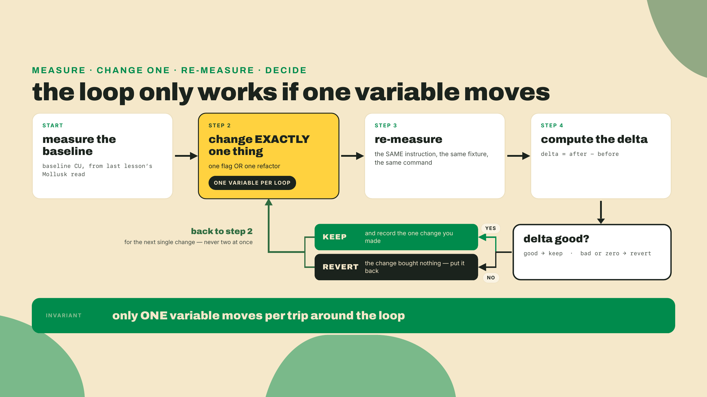
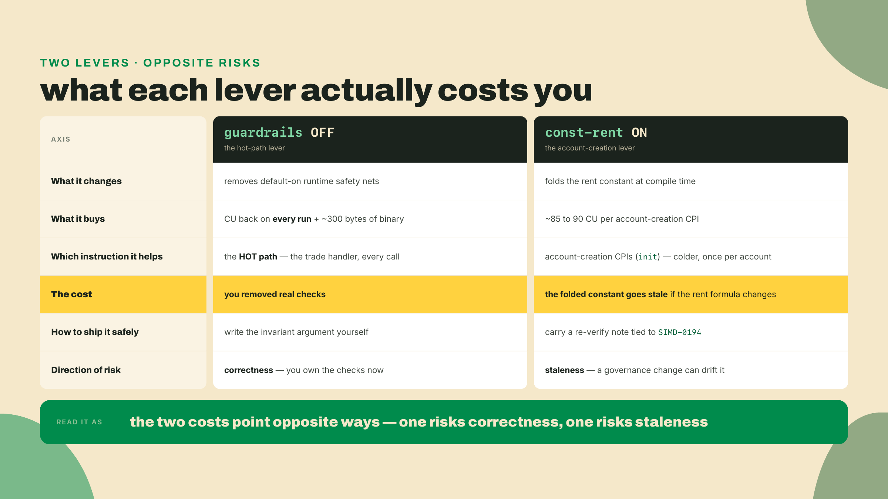
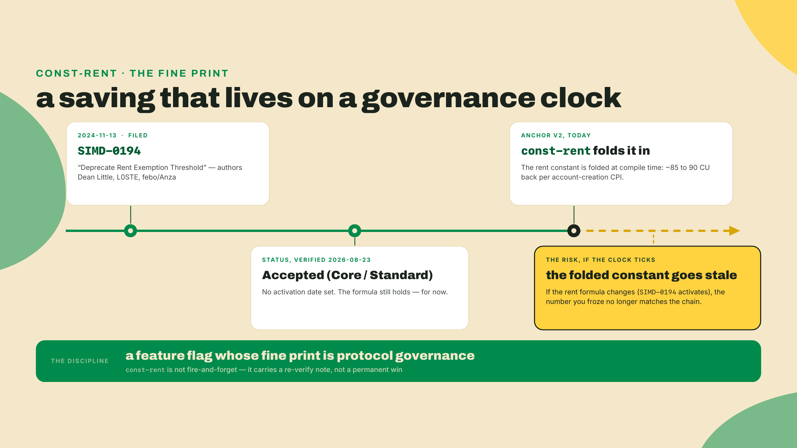
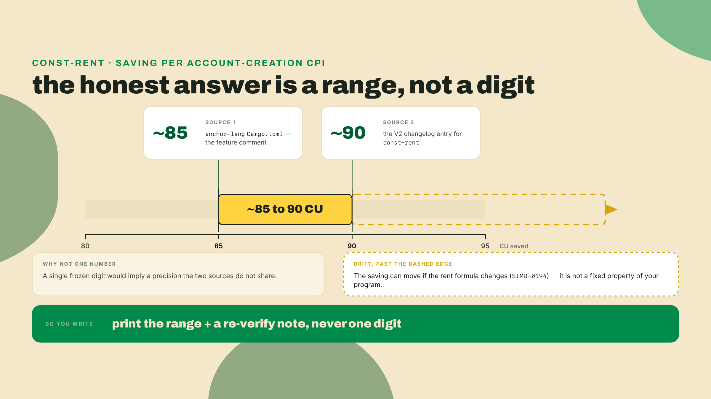
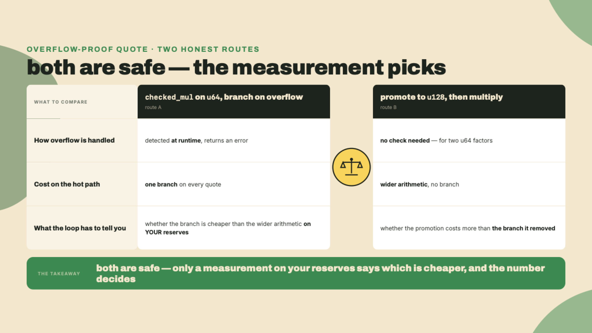
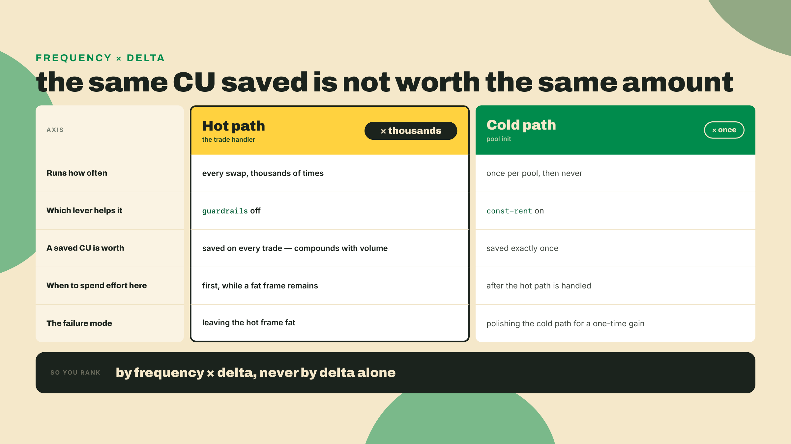
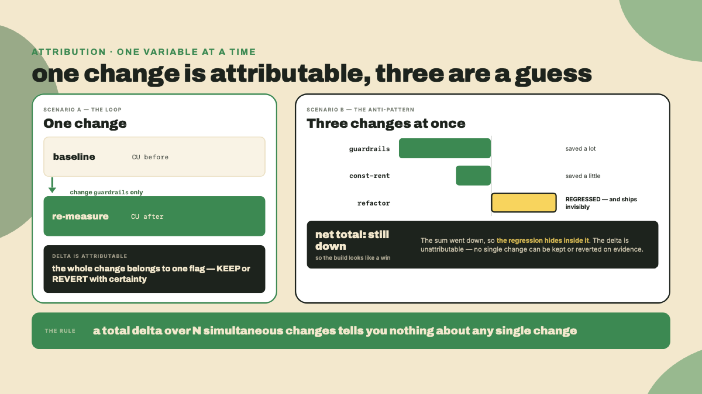
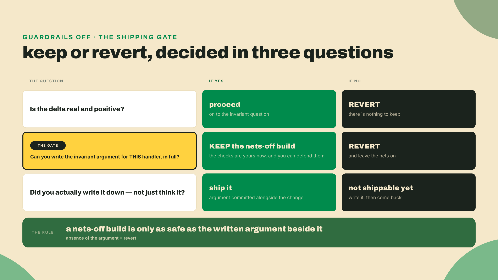
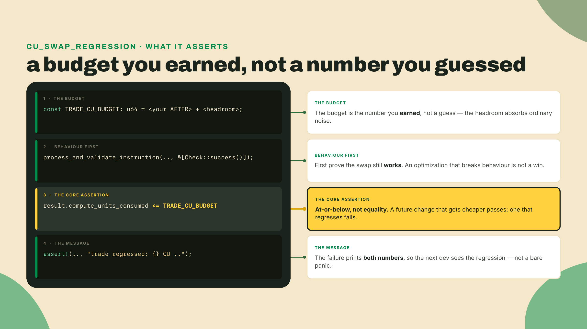

# The measured loop: buy back CU one change at a time

Last lesson you turned four instruments on the swap: a Mollusk CU assertion, a `--profile` flamegraph, the anchor debugger, and a coverage report. You walked away with one baseline CU number for the `swap_arcade_for_tickets` instruction and the name of the hottest frame in the flamegraph. That number is the thing you now attack.

Here is the temptation, and I want to name it before you feel it. You have a number and one fat frame. The obvious move is to change five things at once, re-run the test, watch the number drop, and celebrate. Do that and you have learned nothing. You will not know which of the five changes helped, which hurt, which cancelled another out, and you will ship all five blind. A smaller number that you cannot explain is not an optimization. It is a coincidence you got attached to.

So before any theory, do the one thing this whole lesson rests on: re-read your baseline. Not from memory, not from the note you wrote last lesson. Read it fresh off the machine, right now, because it is the "before" of every measurement that follows.

```bash
# Build FIRST, then read. Mollusk measures whatever .so SBF_OUT_DIR points it at,
# so a build with different flags is a different measurement wearing the same name.
cargo build-sbf
export SBF_OUT_DIR=$PWD/target/deploy   # a fresh shell needs it again; see m06-l1
cargo test -p token-ticket-swap trade_cu_baseline -- --nocapture
```

Write down the integer it prints. That is the only number in this lesson you are allowed to trust without re-measuring, and even it you just re-measured. Everything from here is: change exactly one thing, run this again, and let the difference between the two numbers be the entire argument.

## Summary

You are not writing new program logic this lesson. The swap keeps its behavior. What you attack is its cost, with the same measurement from last lesson run twice, once before and once after a single edit — and the first lever you pull will refuse to move the number at all, which turns out to teach more than a win would have.

Here is the shape of it:

- **The method is a loop, not a bag of tricks.** Baseline (you have it) then change exactly one thing then re-measure the same instruction then keep or revert based on the delta. The discipline is the lesson. The three levers below, two feature flags and one refactor, are just things to run through it.
- **Lever one: `guardrails` off — and the zero that teaches.** `guardrails` is a default-on set of runtime safety nets in Anchor V2, and flipping it off *should* hand back CU and about 300 bytes of binary. On R4 it hands back exactly nothing, and the lab's job is to catch that zero and read the reason straight out of the dependency graph: cargo's feature unification, with `anchor-spl` as the edge that flips the flag back. A change that never reached the binary is the loop's other failure mode, and it is just as measurable as a win.
- **Lever two: `const-rent` on.** `const-rent` folds the rent constant at compile time, saving roughly 85 to 90 CU per account-creation CPI. Its fine print, written into Anchor's own Cargo.toml, is that the folded constant goes stale if the rent formula changes. That comment cites SIMD-0194, which is exactly a proposal to change the rent formula.
- **The artifact is a regression test.** You take the swap through one full cycle in the lab, catch the zero, attribute it, and encode the measured budget into a test named `cu_swap_regression` so the day something pushes the trade over it, the build fails.

The fade this lesson: I run one complete cycle end to end in the lab, guardrails off, measure, and attribute a delta of zero to the exact dependency edge that swallowed the flag. You then run the loop for a second lever, `const-rent`, with the harness handed to you, and report the attributed delta — a real one this time. The coding challenge is the solo rung: you write the optimized quote function from scratch and make it pass.

## The measured loop

A quick demystify beat first, because two words in this lesson sound heavier than they are. A Cargo feature flag is just conditional compilation. `#[cfg(feature = "guardrails")]` sits in front of a block of code, and whether that block is in your binary depends on whether the feature was on when you compiled. `guardrails` and `const-rent` are two such flags Anchor V2 ships. Turning one on or off does not change your source. It changes which lines the compiler keeps. That is the whole mechanism.

Now the method, which is the actual content.

Think about how you would establish that a single change to a bridge design made it lighter. You would not swap the steel, the deck, and the cabling all at once and then weigh it. You would change one member, weigh it, change it back if it got heavier. The reason is not fussiness. It is that a delta is only causally meaningful when exactly one variable moved. Change two and the number you get is a sum you cannot decompose. This is the oldest idea in experimental method, and it is exactly as true for compute units as it is for anything you can weigh.

So the loop is four steps, and step two is load-bearing:

1. **Measure** the instruction. You have this: `trade_cu_baseline` printed a number.
2. **Change exactly one thing.** One feature flag, or one refactor. Not two.
3. **Re-measure** the same instruction, the same way, with the same fixture.
4. **Keep or revert** based on the delta, and write down which single change caused it.



Why is this worth a whole lesson instead of a sentence? Because the failure mode is seductive. Three simultaneous changes and a total CU drop feel like progress. But that total could easily hide a regression: one change saved 400 CU, another cost 200, a third did nothing, and you shipped the 200-CU regression because the sum still went down. You would carry it forever, invisible, because you never isolated it. The loop is the thing that makes a win real. The delta is the evidence, and evidence requires a controlled experiment.

With the method in hand, here are three concrete levers to run through it. The first two are feature flags, deliberately different in character: one strips something out, one folds something in, and their trade-offs point in opposite directions. The third is not a flag at all, which is the point of including it.

### Lever one: turning guardrails off

`guardrails` is a default-on feature. That "default-on" matters: it means your baseline from last lesson was already measured with the safety nets in place. They are runtime checks the framework inserts on your behalf, and they cost CU on every run because they execute on every run.

Compile with `guardrails` off, on a crate where the flip actually lands, and two things happen. The binary shrinks — Anchor's own figure is roughly 300 bytes, measured on its benchmark program — and the instruction gets cheaper, because those checks are no longer running inside it. Hold that expectation carefully, because the lab is about to violate it: on R4 the flip lands on nothing, the meter does not blink, and the reason is a dependency edge you will read with your own eyes.

Here is the part I will not let you skip, because the wrong readings of it are the tempting ones. `guardrails` is not a lint. It is not a compile-only nicety. It is not a Mollusk setting. It changes the compiled program — *when it actually turns off*. What you would be trading away is the checks themselves, real runtime safety nets, with the CU coming back because the work came out. And the precondition the lab exists to burn in: a cargo feature is only off when *nothing anywhere in your graph* turns it back on.

So what are the nets, concretely? This matters, because you cannot argue an invariant you cannot name. The guardrails family is the class of defensive checks the framework inserts around your handler so that a malformed call fails cleanly instead of doing something worse. Think of the guarantees you have been leaning on without writing: that an account handed to you is actually owned by the program you think owns it, that a discriminator matches the account type you deserialized it as, that an arithmetic path that could wrap gets caught rather than silently truncating, that a bound you assumed holds actually held. On every single call, those checks run, and every one of them debits a little CU. That is the shape of the win when you turn them off, and it is also the exact shape of the risk. You did not make the malformed call impossible. You made the framework stop checking for it.

So the honest verdict on guardrails-off is: it is defensible only for code whose invariants you can argue yourself. If you can look at the `swap_arcade_for_tickets` handler and say, out loud and correctly, "the reserves are always distinct accounts, the fee scale is fixed, the output is bounded by `reserve_out`, and nothing here can underflow because the quote returns 0 on an empty pool," then you have made the argument the framework was making for you, and you can take the nets down. If you cannot make that argument, leave them on. Shipping guardrails-off with no written invariant argument is not an optimization. It is a bet you did not know you placed.



### Lever two: folding in const-rent

`const-rent` goes the other way. Instead of removing a check, it removes a computation, by folding a constant.

Every time a program creates an account through a CPI, it has to fund that account to the rent-exempt minimum, or the account cannot survive. That minimum is a function of the account's byte size, and deriving it means running the rent formula: a per-byte cost plus a fixed overhead, multiplied out for the size you are allocating. The runtime can compute that on every account creation, or, if the size is known at compile time, the answer can be baked in as a literal. That baked-in literal is what `const-rent` folds in, so the runtime skips the computation. The saving is roughly 85 to 90 CU per account-creation CPI.

Notice I wrote a range, not a single number, and I am going to be stubborn about that. This is the same discipline that made this course refuse to freeze Anchor's own benchmark multiplier last lesson. The saving appears as about 85 in the feature's own comment in `anchor-lang`'s `Cargo.toml` and about 90 in the V2 changelog entry that introduced it, and on top of that it can drift, so freezing one digit would be false precision dressed up as rigor. Go read both before you quote either; they are four lines apart in a repo you already have checked out. The honest form is the range plus a note that says re-verify. A CU number is deterministic for a given program, input, and toolchain, so this range is not run-to-run noise. It is source disagreement plus drift risk, which is a different and more interesting thing.

And the drift is the real lesson here. `const-rent` folds the rent constant, which is correct only as long as the rent formula that produced it stays put. Anchor's own Cargo.toml comment says exactly this, and it cites SIMD-0194 to say it. SIMD-0194 is titled "Deprecate Rent Exemption Threshold." It is a Core proposal, Accepted, filed back in November 2024, that would change how the rent-exempt minimum is derived. If it activates, the constant you folded in becomes wrong, silently, and your account creation is now computing rent against a stale number.



Sit with how strange that is for a second. You reached for a feature flag to shave under a hundred compute units off an account creation, and the fine print handed you back a live protocol-governance question. A one-line Cargo edit put a dependency on a SIMD's activation status into your build. That is genuinely the most interesting thing about `const-rent`, and it is why the range matters: you are not just quoting a saving, you are quoting a saving with an expiry date you do not control.



### Lever three: a refactor, not a flag

The first two levers were feature flags, one edit on a build line. The loop does not care where the change comes from. A source-level refactor runs through it exactly the same way, and the swap has one sitting in plain sight: the quote function itself.

Here is where last lesson's other deliverable comes due. You wrote down the hottest own-code frame under the trade instruction, and on the Quarters swap that frame is `swap_out`, the quote. A flamegraph does not tell you what to do about a fat frame; it tells you where to point the loop. So point it there.

The quote you shipped, `swap_out`, already promotes to `u128` before multiplying, because module 5 made that the acceptance bar. What it does not do is expose the fee, and there is a real design question hiding in how a general version gets written. Do you reach for `checked_mul` on `u64` and branch on overflow, which is safe but puts a branch on the hot path? Or do you promote to `u128` first, where the multiply cannot overflow by construction, so no check is needed at all? Those two are not equally cheap, and they are not equally safe, and the only way to know the actual trade for your reserves is to run both through the loop. ("By construction" carries a qualifier you derived in m05-l2 — two `u64` factors. The challenge at the end of this lesson adds a third.)

That is what the coding challenge at the end of this lesson is: a generalized quote, `get_amount_out`, with the fee lifted into a parameter, written from scratch and then measured. It is a separate function from the `swap_out` you shipped, not an edit to it, so you can hold both and compare. Write it, swap it into the handler behind a one-line call change, and re-measure the trade. If the delta is a win and the function still matches its reference outputs, keep it. If your `checked_mul`-plus-branch version came in cheaper on your reserves, that is what the loop is for, and the number decides, not your intuition about which reads faster.



The point that generalizes past this one function: a lever is anything you can flip and re-measure in isolation. A feature flag is the cleanest kind because it moves nothing in your source. A refactor is a lever too, as long as you make one and only one, then measure. The method does not change. Only the thing you are changing does.

### The trade-off, stated plainly

Every CU you buy has a price, and the levers price it differently.

Guardrails-off, where it lands, returns CU and about 300 bytes at the price of the runtime safety nets — never ship it without an invariant argument you can defend, because the risk you take on is correctness: you are now the check. On R4 it does not land at all, and the risk inverts into something quieter: a build line that *says* nets-off while the binary still carries them documents an optimization that never happened, and it sits there waiting for the day the graph changes underneath it.

Const-rent trades a runtime computation for a compile-time constant that can drift if the rent formula changes. The risk you took on is staleness. It needs a re-verify note tied to SIMD-0194, not a fire-and-forget commit.

And there is a third trade-off that is not about either flag. It is about where you point the loop. Optimizing a cold instruction is wasted effort. A measured 50 CU shaved off a path nobody hits is noise, not a win, and worse, it is noise that cost you real time and often bought a real risk. This is directly relevant to the levers, because they aim at different instructions. Guardrails-off aims at the hot trade path, the one that runs on every swap, thousands of times — where it lands at all. Const-rent helps account-creation CPIs, which on this program means pool setup, an instruction that runs once when you stand the pool up and never again during trading.

Both aims are legitimate, but the weighting is not the same. A CU saved on the trade path is saved on every trade forever, so it compounds with volume. A CU saved on the one-time init is saved exactly once. That does not make the init optimization worthless, standing an account up cheaper is still cheaper, but it does mean you should not spend an afternoon shaving the cold path while the hot one still has a fat frame you have not touched. Rank the levers by frequency times delta, not by delta alone. The instrument that tells you the frequency is not the flamegraph, it is your own knowledge of how the program is actually called.

Which is worth stating plainly against what this lesson then asks you to do, because it looks like a contradiction. The completion below runs the loop on `const-rent`, a cold-path lever, while the hot frame is still untouched until the challenge. That ordering is pedagogical, not a recommendation: `const-rent` is the cleanest second trip around the loop because its trade-off is drift rather than correctness, so you get to practice the method without also having to defend an invariant argument — and, after the lab's zero, it is the first trip where the number actually moves. In your own program you would do the hot path first. Here you are learning the loop, and the loop is cheaper to learn on the lever that cannot hurt you.



The other half of pointing the loop correctly is isolation, and it is where the whole method lives or dies.



## Lab: run one full cycle on the swap

Worked example, wheels on. I run one complete pass of the loop against the `swap_arcade_for_tickets` instruction using `guardrails` as the lever, and we land on a measured budget encoded in a regression test. Fair warning of the shape of the ending: the loop's answer here is a zero, and the zero — caught, attributed, and named — is the finding. Run each command on your own checkout as you read it; the numbers you get will not be mine, and that is the point.

The autonomy fade is explicit. I run the guardrails cycle end to end here, delta and decision spoken out loud. You then run the loop again for `const-rent` on the pool-init instruction, harness provided, in the completion section below. And the coding challenge after it, the optimized quote written from scratch, is yours alone.

### 1. Confirm the baseline is still the baseline

Do not trust the number in your notes. Re-read it, because a stale baseline poisons every delta after it.

```bash
# The "before". Build the defaults configuration, then measure THAT build.
cargo build-sbf
ls -l target/deploy/token_ticket_swap.so     # write the byte size down too
cargo test -p token-ticket-swap trade_cu_baseline -- --nocapture
```

Write the integer down as `BEFORE`, and the `.so` byte size beside it. Both are with `guardrails` on, because that is the default. The build line matters more than it looks: `cargo test` does not rebuild the on-chain artifact, it only runs the harness against whatever `.so` is already on disk, so every measurement in this lesson is preceded by the build whose cost it is reporting. Skip a build and you will measure the previous configuration and attribute the delta to the wrong change.

### 2. Change exactly one thing: guardrails off

The clean way to flip a framework feature is to forward it through your own program crate's `Cargo.toml`, so the toggle is one flag on the build command and nothing in your source moves. Wire the feature passthrough once:

```toml
# programs/token-ticket-swap/Cargo.toml
# RC tags move fast: check the crate's Cargo.toml for the exact feature names on the
# branch you pin, then re-verify. anchor-lang's DEFAULT features are `alloc` +
# `guardrails`; const-rent is opt-in.
[features]
default = ["anchor-lang/guardrails"]      # safety nets ship ON by default
const-rent = ["anchor-lang/const-rent"]   # opt in to the compile-time rent fold

[dependencies]
# Program deps come from crates.io at 2.0.0-rc.1 (published 2026-08-12, re-verified
# 2026-08-23), exactly as m02-l1 pinned them: a published version is immutable, and
# it is the same release the tag-pinned CLI was built from.
# default-features = false makes guardrails toggleable, but it also drops `alloc`,
# the OTHER v2 default. Re-enable alloc here explicitly: otherwise your
# --no-default-features build moves TWO variables (and your allocator), not one.
anchor-lang = { version = "2.0.0-rc.1", default-features = false, features = ["alloc"] }
# The SPL surface R4 has carried since module 5 — and, as this lab is about to
# measure, the row that quietly decides the whole guardrails story.
anchor-spl  = "2.0.0-rc.1"
# The pins from m01-l2 — every program crate in this course carries them (issue #4937's class).
wincode = { version = "0.5", features = ["derive"] }
# The arcade-workspace row, unchanged since m02-l1 and confirmed in m06-l1 when Mollusk
# arrived: this is that same crate. The ceiling below 2.7 is the constraint that matters;
# 2.6.1 is still on wincode 0.5. Every member of the workspace carries this same row.
solana-address = ">=2.6.1, <2.7"

[dev-dependencies]
# Unchanged from m06-l1, and listed here so the whole crate is on one page: Mollusk,
# its token-program companion, plus the two rows that hold its graph on wincode 0.5.
mollusk-svm = "0.15.1"
mollusk-svm-programs-token = "0.15.1"
solana-sdk = "4"
solana-short-vec = ">=3.2.2, <3.3"
solana-signature = ">=3.4.1, <3.5"
spl-token = "9"   # the fixture's state types and spl_token::ID (m05-l1's pin)
```

Now the single change. Compile the program with the default features off, which drops `guardrails`:

```bash
# ONE change: build with guardrails off. Nothing else moves.
cargo build-sbf --no-default-features
```

Expected result: a clean build — and a byte size that has **not moved**. Run `ls -l` again and compare against step 1: identical, byte for byte. On most crates an unmoved size would mean the feature passthrough is not wired and you are about to measure nothing. Your passthrough is wired exactly right, and the unmoved size is still telling you the flag never reached the binary — that contradiction is the actual finding of this lab, and step 3 runs the measurement anyway before explaining it, because the loop's rule is measure first, explain after.

That is it. You changed one thing. Resist adding `--features const-rent` on the same line, because then you would have moved two variables and the delta would be a sum.

### 3. Re-measure the same instruction, the same way

```bash
# The "after" number. Identical command, identical fixture.
cargo test -p token-ticket-swap trade_cu_baseline -- --nocapture
```

That command printed the number — and the test stayed **green**. Read the line: `trade consumed <N> CU`, the same integer as `BEFORE`, and `Check::compute_units(BEFORE)`, an exact equality, still passes. The tripwire from last lesson is working exactly as designed: it pins the number, the number did not move, so nothing fires. Write `AFTER` down anyway, because the loop demands it, and compute the delta: `AFTER - BEFORE = 0`. You changed one thing and the meter did not blink.

A zero delta has exactly two honest readings, and the loop forces you to pick the right one. Either the change genuinely costs nothing — or the change never reached the binary. The unmoved byte size from step 2 already voted for the second. Now read the culprit directly, with the instrument built for exactly this question:

```bash
cargo tree -e features -i anchor-lang --no-default-features
```

```text
anchor-lang v2.0.0-rc.1
├── anchor-lang feature "alloc"
│   └── token-ticket-swap v0.1.0 (…/programs/token-ticket-swap)
│   └── anchor-lang feature "default"
│       └── anchor-spl v2.0.0-rc.1
│           ├── anchor-spl feature "default"
│           │   └── token-ticket-swap v0.1.0 (…/programs/token-ticket-swap)
│           └── anchor-spl feature "guardrails"
│               └── anchor-spl feature "default" (*)
├── anchor-lang feature "default" (*)
└── anchor-lang feature "guardrails"
    └── anchor-lang feature "default" (*)
```

Read the last stanza bottom-up: `anchor-lang feature "guardrails"` is switched on by `anchor-lang feature "default"`, and the arrow under *that* points straight at `anchor-spl v2.0.0-rc.1`. Your `default-features = false` row did its job — your own edge stopped asking for the defaults — but `anchor-spl` declares a plain `anchor-lang = "=2.0.0-rc.1"`, defaults and all, and cargo **unifies features across every edge in the graph**: one crate is compiled for everyone, so any single edge that asks for a feature turns it on for all of them. Features are additive by design; your `false` cannot subtract what a sibling edge adds. You flipped the flag, and the graph flipped it back before the compiler ever saw it.

So the attribution sentence for this cycle, said out loud and true: "turning guardrails off changed nothing, because anchor-spl's dependency edge holds the feature on." That sentence is the whole point of the loop — a zero you can explain beats a win you cannot.

### 4. Keep or revert, with the argument spoken

Here is the decision, and the zero makes it for you: **revert**. Take `--no-default-features` back off the build line. Not because the nets must stay — because the flag does nothing here, and a build line that claims nets-off while the binary still carries them is worse than either honest state. It documents an optimization that never happened, and it sits armed: the day anchor-spl's edge changes, your "no-op" flag silently becomes a real nets-off build that nobody ever argued for.

The invariant discipline the nets-off trade demands is not wasted, though — shelve it where the zero left it. On a crate that does not sit under `anchor-spl` — a pure-logic program with only `anchor-lang` in its graph — this exact flip lands, the binary shrinks, and the rule applies in full: never ship nets-off without a written argument that defends every invariant the checks were covering. For this swap the paragraph would even be writable: the two reserves are distinct token accounts by construction, so there is no aliasing to catch; the quote returns 0 on an empty or zero-input pool and the handler reverts on a 0 output; the fee scale is a fixed constant; and the output is bounded by `reserve_out`, a `u64`, so the final cast cannot truncate. Write it the day the flip can land. Today the graph vetoed the trade before you could make it.



### 5. Encode the measured number as a regression test

The lab's cycle ended in a revert, and it still leaves an artifact — this one. A number you measured once is a story; a number encoded in a test is a tripwire, and the trade's real, nets-on cost deserves one. The verify step for this lesson is a test named `cu_swap_regression`, and its job is to fail the build the day something pushes the trade back over its budget.

It also replaces `trade_cu_baseline`, deliberately, and not because anything is red — nothing is. An exact-equality pin was the right tool for establishing a baseline once; as a standing test it goes red on every improvement as well as every regression, which trains people to ignore it. Delete `tests/cu_baseline.rs` once the new test is green, and keep the fixture module it used, because this one needs it too.

```rust
// programs/token-ticket-swap/tests/cu_swap_regression.rs
use mollusk_svm::{result::Check, Mollusk};
use solana_sdk::{account::Account, instruction::Instruction, pubkey::Pubkey};

mod swap_fixture;   // the same module cu_baseline.rs used last lesson

// The same swap fixture: program, accounts, one swap ix.
fn fixture() -> (Mollusk, Instruction, Vec<(Pubkey, Account)>) {
    let program_id = token_ticket_swap::ID;
    let mut mollusk = Mollusk::new(&program_id, "token_ticket_swap");
    // The trade's CPI target, registered exactly as in m06-l1.
    mollusk_svm_programs_token::token::add_program(&mut mollusk);
    let keys = swap_fixture::keys(&program_id);
    let accounts = swap_fixture::build_swap_accounts(&keys);
    let ix = swap_fixture::build_swap_ix(&program_id, &keys);
    (mollusk, ix, accounts)
}

// The budget from this lab's measurement: your BEFORE (which is also your AFTER —
// that zero was the finding), plus a little headroom. This is not a wish. It is the
// number you measured, rounded up so a future toolchain bump that shifts the number
// a little does not flap the build.
// Set this before you run the test; the println below tells you what to set it to.
const TRADE_CU_BUDGET: u64 = 0; // <- set to your measured AFTER + a small headroom

#[test]
fn cu_swap_regression() {
    let (mollusk, ix, accounts) = fixture();

    // Assert the trade still succeeds, then assert it costs AT OR BELOW the budget.
    // Check::compute_units asserts EQUALITY, which is why the bound is a comparison
    // here instead: a change that gets cheaper should pass, not fail.
    let result = mollusk.process_and_validate_instruction(&ix, &accounts, &[Check::success()]);

    // Print before you assert, same as the baseline test did, so a red run still
    // hands you the number you need to set the budget to.
    println!("trade consumed {} CU (budget {})", result.compute_units_consumed, TRADE_CU_BUDGET);

    assert!(
        result.compute_units_consumed <= TRADE_CU_BUDGET,
        "trade regressed: {} CU consumed, budget is {} CU",
        result.compute_units_consumed,
        TRADE_CU_BUDGET
    );
}
```



Run it:

```bash
cargo test cu_swap_regression -- --nocapture
```

With `TRADE_CU_BUDGET` still at `0` it fails and prints the number to set. Set it, re-run, green. From then on, the day a refactor pushes the trade back over that budget, this test goes red and tells you which direction it moved. A flamegraph is something you go and look at. This is something that looks for you.

## Completion: run the loop for const-rent

Wheels half off. One more trip around the loop before the solo rung, this time with `const-rent` as the lever and the harness handed to you. There is one catch that is itself a lesson: `const-rent` helps account-creation CPIs, and `swap_arcade_for_tickets` does not create accounts. So do not measure the trade for this one. Measure the instruction that stands the pool up, the init, because that is the instruction the lever actually touches. Measuring the trade here would show you a delta of zero and teach you the wrong thing.

The cycle is identical in shape:

1. **Measure** the pool-init instruction's CU. That is the instruction you wrote in module 5's swap lab, the one that `init`s the `Pool` account and creates the two reserve token accounts under the pool PDA; each of those `init`s is a System Program create-account CPI, which is precisely the call `const-rent` folds the constant for.

   There is no provided harness for it, and writing it is the point of this rung: you have the pattern twice over now. Copy `cu_swap_regression.rs` to `tests/init_cu_baseline.rs` and change four things. Rename the `#[test]` fn itself from `cu_swap_regression` to `init_cu_baseline` — cargo's positional filter matches *function* names, never file names, so without this rename both commands below filter down to `running 0 tests` and print no numbers at all. Build the init instruction instead of the swap instruction (`swap_fixture::build_init_ix`, which belongs to the same fixture module you dropped in last lesson). Pass the init's account list, which the fixture exposes as `swap_fixture::build_init_accounts(&keys)`, and which differs from the swap's because the pool and both reserves must arrive *uninitialized*. And drop the budget assertion entirely; keep only `Check::success()` and the `println!`, because for this rung you want the number printed twice, not pinned.

   ```bash
   cargo build-sbf                                                 # build first, always
   cargo test -p token-ticket-swap init_cu_baseline -- --nocapture
   ```
2. **Change exactly one thing** relative to your step-1 build: turn `const-rent` on and move nothing else. The lab ended with the defaults back on — the guardrails flag was a no-op and you took it off the line — so this is one flag on an otherwise-default build:

```bash
cargo build-sbf --features const-rent
```

One asymmetry worth noticing as you type it: unification vetoed the guardrails *removal*, but it cannot veto this *addition*. Features are additive, so turning one ON needs only your own edge to ask for it — which is exactly why this lever can land where the last one could not. The only variable that moves between step 1 and step 3 is `const-rent`.

3. **Re-measure** the same init instruction, same fixture, same command. The build line above already rebuilt with the new flag; run `cargo test -p token-ticket-swap init_cu_baseline -- --nocapture` again and read the second number.
4. **Report** the before CU, the after CU, and the one-line attribution: "turning const-rent on saved N CU on the pool-init account creation."

Your delta should land in the neighborhood of the 85-to-90-CU-per-account-creation-CPI figure, scaled by how many accounts the init creates. If it comes back near zero, check that you measured the init instruction and not the trade. That is the most common way this completion goes wrong, and it is the same footgun as chasing a cold path: you measured the instruction the lever does not touch.

## Challenge: the optimized constant-product quote

Wheels all the way off. This is the solo rung, and it is the only one where you both write code and run the loop on it.

Back in module 5 you built `swap_out`, the quote function with a hardcoded 0.3% fee, and last lesson you watched it sit there as the hottest own-code frame under the swap instruction. Now generalize it. `get_amount_out` is the same curve with the fee lifted out into a parameter, `fee_bps`, in basis points. Here is its starter, and it is wrong on purpose:

```rust
/// Quote a constant-product swap output. THIS STARTER IS BROKEN:
/// it ignores fee_bps, multiplies in u64, and checks nothing, so its
/// quotes are wrong whenever fee_bps > 0, it can overflow on large
/// reserves, and it quotes the whole pool on an empty reserve_in.
const fn get_amount_out(reserve_in: u64, reserve_out: u64, amount_in: u64, fee_bps: u64) -> u64 {
    let _ = fee_bps; // the fee is being ignored
    let numerator = reserve_out * amount_in;
    let denominator = reserve_in + amount_in;
    numerator / denominator
}
```

One word in that signature is new since module 5's `swap_out` shipped, and it is doing real work: `const fn`. The graded file carries compile-time assertions under the function — the m03-l3 device, and what compile-only grading actually enforces — so the broken starter does not build: the fee-blind rows fail assertions whose messages name the case, and the deep-pool row fails in const evaluation itself with `attempt to multiply with overflow`, rustc pointing at the exact `u64` multiply you are here to fix.

Two things are wrong with it, and they are the same two the module-5 challenge made you fix on `swap_out`. It never applies the fee, so every quote with `fee_bps > 0` over-pays the trader. And it multiplies two `u64` values, so a large `reserve_out * amount_in` can overflow. On the scaffold you are actually standing on that is a panic either way — Anchor's generated workspace ships `overflow-checks = true` on the release profile, and `cargo build-sbf` builds release, a fact m07-l2 leans on — so the failure mode here is an abort on the deepest pool you have, which is the trade you least want to fail on. Strip that profile line, or inherit a crate that never had it, and the same multiply wraps silently instead, which is worse. You fixed both once already on a fee-less curve. This is the same repair on the general one — and the day you are on a crate where a nets-off build genuinely lands, a wrapped multiply has nothing standing behind it, so the checked version is the one you want in your fingers now.

A third thing is wrong with it that module 5 already taught you and this starter quietly drops: it does not check its inputs. Set `reserve_in` to zero and the denominator collapses to `amount_in`, the `amount_in` cancels, and the function quotes all of `reserve_out` — the entire pool — to whoever asks first. That is the same guard `swap_out` opens with, and the general version needs it too.

Your job: rewrite `get_amount_out` so it applies the fee, refuses the inputs the curve is not defined on, and runs every intermediate product through a single `u128` before one final division back down to `u64`. Keep the signature exactly as frozen above, because the reference cases below call it by that interface.

Three nudges, the same shape you have seen before, generalized to basis points:

- `amount_in_with_fee = amount_in * (10_000 - fee_bps)`
- `out = (reserve_out * amount_in_with_fee) / (reserve_in * 10_000 + amount_in_with_fee)`
- cast to `u128` before the multiplies, cast back to `u64` after the single division

The reference outputs your solution must match:

```
get_amount_out(1_000_000, 1_000_000,  10_000, 30) == 9_871    // 0.3% fee, balanced pool
get_amount_out(5_000_000, 2_000_000, 100_000, 30) == 39_100   // 0.3% fee, uneven reserves
get_amount_out(1_000_000, 1_000_000,   1_000,  0) == 999      // zero fee = plain constant product
get_amount_out(1_000_000, 1_000_000, 500_000, 30) == 332_665  // large trade, missing fee is obvious

// ...and the inputs the curve is not defined on, which must degrade
// rather than panic or over-quote:
get_amount_out(0, 1_000_000, 10_000, 30)             == 0  // empty reserve_in: unguarded, quotes 1_000_000
get_amount_out(0, 0, 0, 30)                          == 0  // drained pool, zero quote: unguarded, 0 / 0
get_amount_out(1_000_000, 1_000_000, 10_000, 10_001) == 0  // fee past the scale: 10_000 - fee_bps underflows
get_amount_out(1_000_000, 1_000_000, 10_000, 10_000) == 0  // 100% fee: here 0 is the arithmetic answer
get_amount_out(u64::MAX, u64::MAX, u64::MAX, 30)     == 0  // numerator exceeds u128, the check degrades it

// and one that is not degenerate at all: it fits u128 with room to spare
// but overflows a u64 multiply, so it is the case that forces the promotion
get_amount_out(1_000_000_000_000_000_000, 1_000_000_000_000_000_000, 1_000_000_000_000, 30) == 996_999_005_991
```

That last pair is the one to sit with, because it is where the comparison above pays for its qualifier. You already did this arithmetic in m05-l2, on the `× 997` fee scale: two `u64` factors fit `u128` with under a bit to spare, and a third factor spends the sliver. Same shape here with `10_000 - fee_bps` as the third — `u64::MAX` reserves put the numerator around 3.4e42 against a ceiling near 3.4e38. The 1e18 row is the counterweight, peaking near 1.0e34 and clearing that ceiling by four and a half orders of magnitude. Enormous room, then, and still not a guarantee, which is why the products stay checked and the check degrades to 0 instead of panicking mid-instruction.

Now the bound the frozen signature cannot express: `10_000 - fee_bps` underflows for any `fee_bps` above 10,000, and the return type is a bare `u64` with nowhere to put an error. Guard it anyway and return 0, the way you guard the empty reserve — a wrong-but-quiet 0 beats a panicking instruction, and on a crate whose release profile really has overflow-checks off — not this scaffold's, which pins them on — the underflow wraps the `u128` intermediate to an enormous number instead, which quotes a payout that drains the pool. But be clear with yourself about what that 0 means. For `fee_bps == 10_000` it is arithmetic: a 100% fee eats the whole input. For everything else it is a sentinel standing in for an error the signature cannot return, and real AMMs do not degrade like this — Uniswap V2's `getAmountOut` reverts with INSUFFICIENT_LIQUIDITY on an empty reserve. So the caller still owns the bound. In the handler, `fee_bps` is a compile-time constant you control; the moment it becomes a parameter a user can set, it needs a `require!` before it reaches this function, and the handler refuses to settle a trade that quotes 0 either way. Write that reasoning as a comment above the fn so the next reader knows it was a decision and not an accident.

Then measure it, because a quote you did not run through the loop is just a rewrite. Swap `get_amount_out(reserve_in, reserve_out, amount_in, 30)` into the handler in place of `swap_out`, rebuild, and re-run `cu_swap_regression`. Report the delta the same way you reported the other two: one number, one named change, one sentence.

The acceptance bar: the fee is applied before quoting, the inputs are guarded before anything is computed, every intermediate product is computed in a checked `u128` so large reserves cannot overflow, there is exactly one division on the hot path, every reference output matches — the degenerate ones included — and you can state the measured CU delta against `swap_out`. The starter already meets exactly one item on that list — it does a single division — and fails every other one; your solution passes them all. Compute the first case by hand, get 9,871, then make the code agree with your arithmetic.

## Before you move on

Four ways this lesson goes wrong in practice. Check yourself against each.

Did you change exactly one thing between each pair of measurements? If you flipped two flags on one build line, your delta is a sum you cannot attribute, and the honest answer is to go back and isolate them.

Did you attribute the zero instead of shrugging at it? A zero delta has two readings, and only one of them is "this change is free": yours was "the change never reached the binary," and `cargo tree -e features` named the anchor-spl edge that swallowed it. Carry the corollary too: the day you are on a crate where the flip lands, the invariant argument comes due in full — a nets-off build is only as safe as the paragraph you wrote beside it, and no paragraph means revert.

Did you quote const-rent's saving as a range with a re-verify note, and not a single frozen digit? The saving is roughly 85 to 90 CU, it spans two source citations, and it can drift if the rent formula changes. SIMD-0194 is the reason the number carries an expiry date you do not control.

And did you measure each lever on the instruction it actually touches? Guardrails-off was aimed at the hot trade path — and the graph vetoed it before it arrived; const-rent lands on the account-creation init. A 50-CU win on a path nobody hits is noise. Weight the win by how often the instruction runs.

You have run the loop for real and you can prove every outcome it produced: a zero attributed to one named dependency edge, an init saving attributed to one flag, a rewritten quote measured on its own merits, and a regression test holding the trade's line for you. Next module asks a harder question than "is it fast?" It asks "is it safe?" You will write the classic Anchor exploits against your own program, the account substitutions and the missing signer checks, and watch which ones V2 simply refuses to compile and which ones survive every framework and are still yours to defend. The measured loop taught you to buy CU one change at a time. The security module teaches you what you must never trade for it.

See you in the security module.
