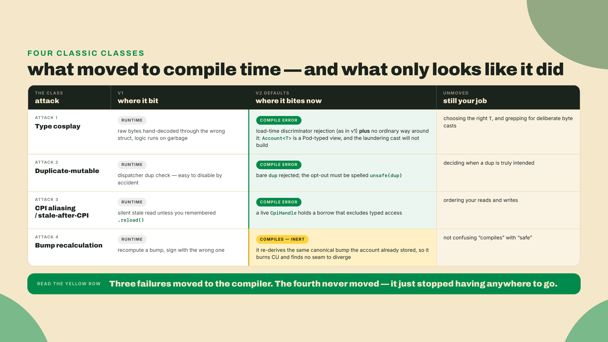
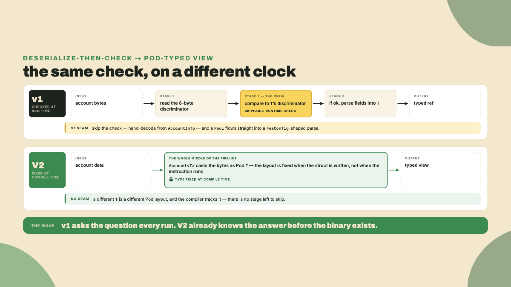
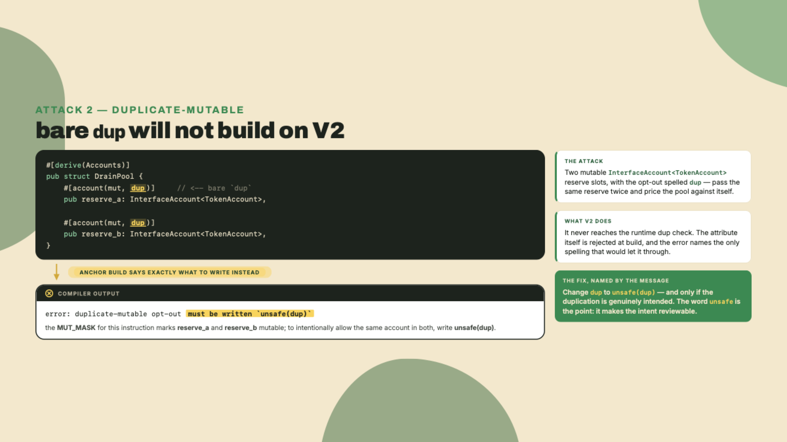
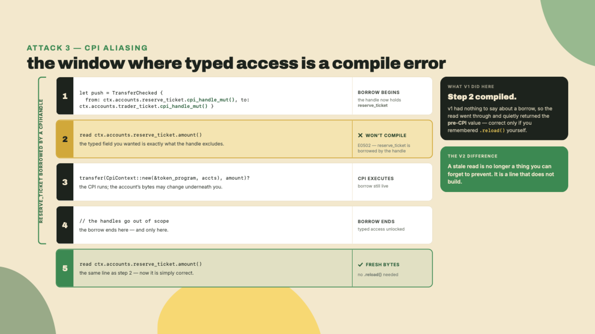
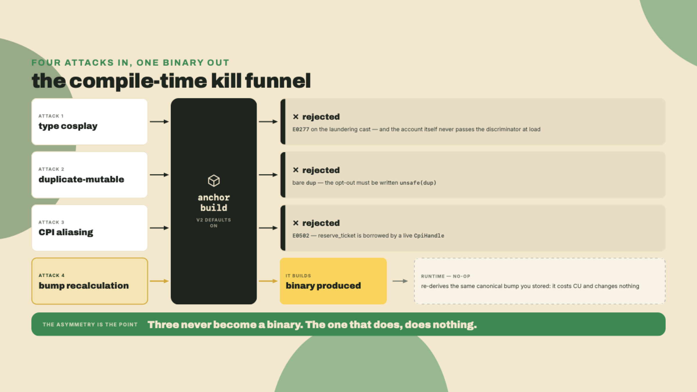
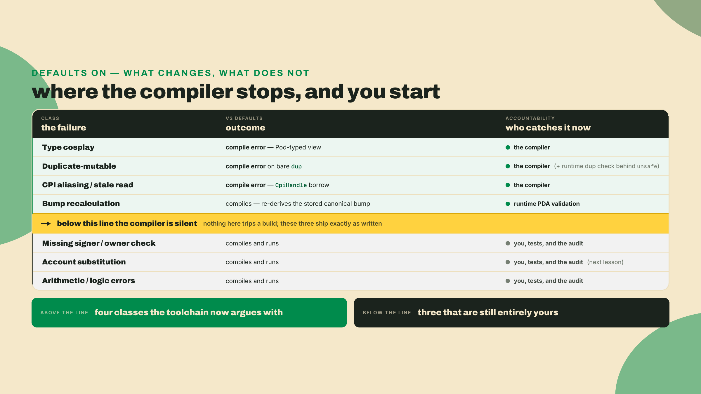
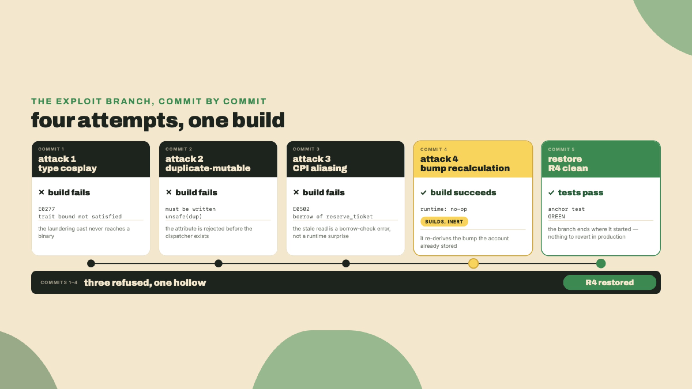

# What V2 kills at compile time

Last lesson you ran the measure-change-remeasure loop on the swap. The guardrails flip measured a delta of exactly zero — anchor-spl's dependency edge held the nets on, and you attributed the zero instead of shipping the flag — while `const-rent` and the rewritten quote produced deltas you could keep, each proved with a number before and a number after. You trusted the compiler to keep the program correct while you made it faster.

Now weaponize that trust. `quarter-vault` is the workspace you have been building in since module 3 — it keeps the name `anchor init` gave it for its first program, and it now holds R2, R3 and R4 — and the token-to-ticket swap inside it is the fourth rung of the Quarters ladder. Open a terminal there, cut an exploit branch off your clean R4, and write the first classic Anchor attack against your own swap.

```bash
cd quarter-vault
git checkout -b exploit/compile-time-kills
```

You are going to author four deliberate attacks, one commit each, against the token-to-ticket swap you already built: the pool read through a config lens, two mutable reserve slots marked plain `dup`, a typed reserve read while a CPI is in flight, and a hand-recomputed pool bump. Then you hit `anchor build`. Three of them never produce a binary. One of them builds fine and does nothing. That gap, between "compiles" and "exploits," is the whole lesson.

This is the lesson that was genuinely impossible to teach before August 2026. The four vulnerability classes below used to need a runtime check, a test, or an auditor with a checklist. On the V2 defaults, three of them die where you write them, in red, at compile time. You get to watch each one die.

One honest caveat before you write a line of malice: this is an unaudited alpha. Everything here is a real compile-time win and none of it is a proof. Hold both.

## Summary

By the end of this lesson you will have re-derived four classes from the Solana Foundation's archived program-security taxonomy (the eleven-directory course a whole generation of auditors trained on) and re-run four of them against the V2 defaults. You will demonstrate that three are now compile errors rather than runtime hazards, and that the fourth compiles but has no seam left to pull.

The four classes:

- **Type cosplay**: loading one account's bytes as a different type.
- **Duplicate-mutable**: passing the same writable account into two slots to double-spend it.
- **CPI aliasing / stale-after-CPI**: reading a typed field whose bytes a cross-program call is about to change under you.
- **Bump recalculation**: recomputing a PDA bump so a wrong one slips through.

Your deliverable is concrete: three named compiler errors, captured with their message text, plus one green `anchor test` run once you restore R4. The register here is caution, not celebration. The compiler is a strong ally and a bad excuse.



## The four classes, and why three become type errors

Here is the fade for the rest of the lesson, said plainly so you know what is coming. I walk the first class, type cosplay, end to end: the v1 hazard, the naive fixes, and the exact reason the V2 default refuses it. The next two, duplicate-mutable and CPI aliasing, you finish from stubs in the Lab. The last class you attack on your own, with a variant nobody handed you, and you predict the outcome before you compile. Support drops on purpose. That is how you find out what you actually understand.

A word on where these four come from, so this does not read as a list I invented. The Solana Foundation ran a program-security course whose repository holds eleven vulnerability directories, one class per directory, and a generation of auditors learned the taxonomy from it. Type cosplay, duplicate-mutable, arbitrary CPI, missing owner and signer checks, account substitution, and the rest each got a vulnerable program and a patched one. What we are doing this lesson is taking four of those eleven and re-running them against the V2 defaults to see which the framework now answers for you. Four of eleven. Keep that ratio in view: it is the honest scope of what a compiler upgrade buys.

Start with the question that sits under all four: what is an account, to a program? In v1 Anchor, an account arrives as raw bytes plus an eight-byte discriminator, and `Account<'info, T>` deserializes those bytes into your struct after checking the discriminator matches `T`. That deserialize step is the seam. Every one of these four classes is a way to make the program act on bytes that are not what the type says they are. The interesting question is not "is there a check," it is "when does the check run, and can I skip it by accident." A runtime check runs when the transaction runs, which is late, and it runs only if the code path reaches it. A compile-time check runs before a binary exists at all. That difference in timing is the entire subject of this lesson.

### Type cosplay, walked end to end

The status quo, in v1: your instruction expects a `FeeConfig`, the attacker hands you a `Pool`, and if the two structs happen to line up in memory, your program reads the pool's bytes through the config lens and trusts fields that mean something else entirely. The discriminator check is what stopped the crude version. The subtle version slipped through when two account types shared a prefix or when a program used `AccountInfo` and hand-deserialized without checking.

The motivating question: if the type is fixed in the struct definition, why is the runtime free to hand me the wrong bytes at all?

Rule out the naive fixes first, because they are what v1 shipped. Naive fix one: add a discriminator and check it every load. It works, but it is a runtime check, which means it is a check you can forget, disable, or route around with `AccountInfo`. Naive fix two: compare a stored type-name string on load. Slower, still runtime, and now you are paying to store a name. Both fixes share the same flaw: they detect the mismatch after the program is already holding a typed reference to the wrong memory.

V2 sharpens the requirement into something the compiler can enforce. On the V2 defaults, `Account<T>` (note the dropped lifetime) is a **zero-copy, Pod-typed view** of the account's data. `T` must implement `Pod`, which means it has no padding and a fully deterministic layout, and the bytes are cast directly to `T` rather than parsed field by field. This is the same design decision that issue #4390 argued for under the banner "zero-copy account deserialization by default," which named the old parse-on-load `Account<T>` as "the slow path" and "the #1 performance complaint." The point worth sitting with: Pod-by-default is a security move as much as a speed move. A deterministic, no-padding layout is exactly what makes "these bytes are a `FeeConfig`" a claim the type system can hold rather than a claim you re-check at runtime.



So when you write the cosplay, the type mismatch has nowhere to hide. One piece of honest setup first, because the shape of your own program matters here: R4 ships exactly **one** account type, the `Pool` you wrote in m05-l2, and cosplay needs two. So the exploit branch adds a second — a `FeeConfig` your swap does not have and is not going to grow. It is a prop, and naming it as one is part of the lesson: what the compile error below proves is a fact about the type system, not a claim about a field your program really holds.

```rust
// programs/token-ticket-swap/src/lib.rs  (R4, clean) - your swap's ONLY account type
#[account]
#[derive(InitSpace)]
pub struct Pool {
    pub arcade_mint: Address,  // 32
    pub ticket_mint: Address,  // 32
    pub bump: u8,              //  1
    pub _pad: [u8; 7],         //  7
}

// programs/token-ticket-swap/src/exploits.rs - the prop, exploit branch only.
// An admin-config shape is the classic cosplay target: it carries an authority
// worth stealing.
#[account]
#[derive(InitSpace)]
pub struct FeeConfig {
    pub authority: Address,  // 32
    pub fee_bps: u16,        //  2
    pub bump: u8,            //  1
    pub _pad: [u8; 5],       //  5
}
```

Now the cosplay. You hold the pool and try to read it as a `FeeConfig` to lift the authority:

```rust
// ATTACK 1: type cosplay - read the pool's bytes through the FeeConfig lens
pub fn cosplay(pool: &Account<Pool>) -> Address {
    let stolen: &FeeConfig = pool.as_ref(); // will not compile
    stolen.authority
}
```

`Account<Pool>` is a `Slab`, and a `Slab` implements `AsRef` for exactly two targets — the raw `AccountView` and the `Address` — never for some *other* Pod type. You asked it for a `&FeeConfig`, an impl that does not exist. The compiler stops cold:

```text
error[E0277]: the trait bound `Slab<Pool>: AsRef<FeeConfig>` is not satisfied
  --> programs/token-ticket-swap/src/exploits.rs
   |
   |     let stolen: &FeeConfig = pool.as_ref();
   |                                   ^^^^^^ the trait `AsRef<FeeConfig>` is not implemented
   |
   = help: the following other types implement trait `AsRef<T>`:
             `Slab<T, H>` implements `AsRef<AccountView>`
             `Slab<T, H>` implements `AsRef<Address>`
```

That is type cosplay converted into `E0277`: the trait surface simply refuses to offer a lens that is not the account's own type. The pool's bytes never get read through the wrong struct, because the wrong struct is a different Pod type and the two do not interconvert. Notice what did the work: not a new runtime check, but the ordinary Rust type system, given a deterministic layout to hold onto.

Now be honest about what that snippet did and did not prove, because on its own it proves less than it looks. Nobody ever shipped that line. `let x: &FeeConfig = y.as_ref()` on a `&Pool` fails to compile on v1, on 0.29, on any Rust ever written; it is a type error, not an exploit. The line is there because it is the *laundering* attempt, the thing an attacker tries first once the typed wrapper is in the way, and it shows the typed wrapper holding. The real v1 attack never wrote that line. It went around the typed wrapper entirely:

```rust
// ATTACK 1, the shape it actually shipped in: hand-read raw bytes through
// the wrong struct, so no wrapper and no discriminator is ever consulted.
pub fn cosplay_v1(any_account: &AccountInfo) -> Result<Pubkey> {
    let data = any_account.try_borrow_data()?;
    let cfg = FeeConfig::try_from_slice(&data[8..])?;  // is this REALLY a FeeConfig?
    Ok(cfg.authority)                                  // whatever bytes sat there, read as one
}
```

Hand it a `Pool` and it happily returns the first 32 bytes — `arcade_mint` — as an `authority`, because `try_from_slice` decodes whatever it is given. Note how plausible the result looks: a mint is a well-formed address, so nothing downstream smells wrong until someone signs against it. That is the class. Two things have to hold for V2 to answer it, and they answer it on two different clocks. At *load*, a `Pool` account passed into a slot declared `Account<FeeConfig>` is rejected by the discriminator check, at runtime, exactly as v1's `Account<T>` rejected it: the tag says `account:Pool` and the wrapper wanted `account:FeeConfig`. That half is not new. What *is* new is that the byte-level escape hatch closed: with `Account<T>` as a Pod view there is no `try_from_slice` on a loose slice to reach for, and the bytemuck cast you would reach for instead, `from_bytes::<FeeConfig>(&data[8..])`, is a cast you have to write deliberately, on bytes you have not proven are a `FeeConfig`, in code a reviewer can grep for in one pass. The discriminator was always the runtime guard. V2's contribution is that the ordinary path no longer offers you a way around it, which is why the `E0277` above is the interesting failure rather than an obvious one.

### Duplicate-mutable

Same engine, different seam. The classic double-spend: an instruction takes two writable accounts and the attacker passes the *same* account for both. The program reads a balance through one name, reads it again through the other, credits the first, debits the second, and writes both back. The two in-memory copies diverge, whichever write lands last wins, and the credit survives while the debit evaporates. That is a mint out of thin air. In v1 the dispatcher ran a duplicate check to stop exactly this, but the check was easy to opt out of by accident, and plenty of programs did, usually by reaching for a raw account type to shave a constraint.

Try to picture it on your swap and something useful happens: you cannot. `SwapArcadeForTickets` carries `token::mint = mint_arcade` on `reserve_arcade` and `token::mint = mint_ticket` on `reserve_ticket`, and no token account holds two mints, so the two writable reserve slots are un-aliasable before the duplicate check gets a vote. A constraint you wrote in m05-l2 for a pricing reason closed this door for a security reason. That is the honest state of R4, and it is why the attack below is a *new* accounts struct you add on the exploit branch rather than an edit to the swap: you have to strip the pins to make the seam exist at all.

On the V2 defaults, the set of writable accounts an instruction touches is a compile-time associated const, the **`MUT_MASK`** bitset. Opting out of the duplicate-mutable protection is a real thing you sometimes need, and it has a name: `unsafe(dup)`. Writing plain `dup` without `unsafe` is a hard compile error whose message tells you the fix. You cannot even build the unsafe spelling by accident, because the safe-looking spelling does not build.

Read that footgun carefully, because it is the one people misremember: the runtime duplicate check still runs in the dispatcher. V2 did not delete it. What V2 added is a compiler gate in front of the unsafe spelling, so you reach the runtime check only on the path you explicitly marked unsafe. "The build is green" now means "I did not disable this by typo."



### CPI aliasing and the death of `.reload()`

This is the class that retires a v1 habit you have muscle memory for. In v1, if you read a token account's balance, then made a CPI that changed that balance, then read the field again, you got the *stale* value unless you remembered to call `.reload()`. The bug was invisible: the code looked correct, the field had a plausible number in it, and the number was simply old. Whole audits existed to find missing `.reload()` calls.

The motivating question: why is the program allowed to hold a typed reference across a call that mutates the same bytes?

Rule out the v1 answers in tiers, because the ecosystem tried all of them. Tier one: remember to call `.reload()` after every CPI. This is discipline, and discipline is the thing that fails at 2am under a deadline. Tier two: document it, put "always reload after CPI" in the contributing guide. Documentation catches the reader who reads it. Tier three: write a linter that greps for CPIs without a following reload. Better, but a linter models a pattern, and the moment the CPI and the read are in different functions the pattern breaks and the linter goes quiet. All three tiers share one flaw: they try to catch a mistake that the type system was already in a position to make impossible.

V2's answer is a borrow, not a reminder. A **`CpiHandle`** is a borrow-tracked handle to the accounts a CPI will touch. While the handle is alive, it holds a Rust borrow over those accounts, and typed access to the same data does not compile until the handle is dropped. You physically cannot read the stale field, because the read does not build while the CPI is pending. The entire stale-after-CPI class collapses into the borrow checker, which is the one part of Rust that never forgets.



### Bump recalculation, the one that compiles

The fourth class is the interesting one, because it does not produce an error. In v1, a program that recomputed a PDA bump on every call, instead of storing the canonical one, could be steered into signing with a non-canonical bump, and the recompute-the-wrong-bump family lived in that seam. On the V2 defaults the seam is tighter, but be precise about the mechanism, because it is easy to overclaim: the macro precomputes a bump as a compile-time const *only when every seed is a byte-string literal* — a `b"..."` written out in the derive and nothing else. Your pool's seed list reads `seeds = [POOL_SEED]`, and `POOL_SEED` is a named `const`, not a literal, so the pool misses that optimization by a hair and the codegen falls back to deriving during validation. (If you want to check rather than take my word: the pinned tag's `lang-v2/derive/src/pda.rs` gates the whole thing on `seeds_as_byte_literals`, which matches a byte-string literal and returns `None` for a path expression — its own unit tests spell that out.) What the framework never does, on any seed shape, is accept a bump you hand it: validation re-derives the canonical result and compares.

So when you hand-recompute a bump in your exploit, it compiles. `Address::find_program_address` is ordinary code. But the framework validates and signs against its own canonical derivation, so your recomputed value is either identical, in which case you changed nothing, or different, in which case PDA validation rejects it at runtime. The attack builds and goes nowhere. Keep that result close, because it is the bridge to the next lesson: compiling is not exploiting, and there is a whole set of classes where code compiles *and* drains an escrow.



That set is where the honesty lives, so let me name the trap now rather than at the end.

Converting four classes to compile errors narrows the attack surface. It does not retire the audit. V2 is an unaudited release candidate, and the "defaults are no substitute for review" posture is one this course asserts on its own authority — the project will not say it for you. Go looking and you find the pinned tag's README striking the opposite tone ("v2 is secure by default for users"), with no caveat page behind it. That is exactly the marketing surface a team quotes to itself while skipping the review, so the skepticism has to be yours. The comfortable misread, "secure by default" heard as "secure," is exactly how a team talks itself out of the review that catches everything in the next lesson. A compile-time guarantee is only as trustworthy as the compiler making it, and this compiler is an alpha. Treat the four kills as design claims you verify against the pinned RC, not as proofs. V2 is not the silver bullet for program security; it is a very good compiler with a very honest changelog.

There is a second-order risk here that is worse than any single bug. A team that internalizes "the compiler catches our security bugs" reviews less, and reviews less precisely in the region where the compiler is silent, which is the region where the money actually leaves. So the discipline is inverted from what it feels like: the classes the compiler kills are the ones you can spend the least attention on in review, and the classes it cannot touch are where the whole audit budget should go. Compile-time wins are a reallocation of where you look, not a reason to look less. The split is worth keeping somewhere you can see it.



That changelog is worth one glance, because it models the posture. PR #4914, merged 2026-08-13, revised the headline benchmarks *down*: bytecode savings from 95% to 94%, and the compute win from 9.9x to 8.8x, with the caveat that "This version is alpha and exact values can move as codegen, pinocchio, and tooling change." Cite the 8.8x as context for how much faster the Pod path runs, never as a security number. The same honesty that revises a benchmark downward is the honesty that forbids treating any V2 default as audited.

One name to file and not develop: the account-substitution class you saw in the bottom band has a canonical war story, the Cashio missing-`.mint` drain, and that is the DeFi and RWA Engineering course's territory. We point there rather than retell it, and we take up the account-substitution class itself in the next lesson.

## Lab: four attacks, one branch

You are on `exploit/compile-time-kills`. First, pin the toolchain, because none of this is real on the V1 line.

```bash
# Install the Anchor V2 release candidate. Freshness note (2026-08-22):
# 2.0.0-rc.1 is the pinned RC for this course, tagged on the `anchor-next` branch. It is an
# UNAUDITED alpha. `avm` CANNOT install the V2 RC: it only tracks published GitHub releases,
# and there is no release object for the v2 tag. Install the CLI straight from the tag:
cargo install --git https://github.com/otter-sec/anchor.git --tag v2.0.0-rc.1 anchor-cli --locked --force
# macOS: prefix with CARGO_PROFILE_RELEASE_LTO=off if the release build fails to link.
# The tag is a fixed point (commit e4878b6d) where the branch head is not, which is what keeps
# this in step with m08-l2's verify Dockerfile. Do NOT verify V2 content on the 1.1.x line.
anchor --version   # expect the 2.0.0-rc.1 line, NOT anchor-cli 1.1.x
```

The autonomy fade begins here. Attack 1 is done for you, so you can see the shape of a captured error. Attacks 2 and 3 arrive as stubs you finish. Attack 4 you already understand from the derivation, so you just run it and read the (non-)result.

**Step 1: land the type-cosplay attack and capture the error.** Create `programs/token-ticket-swap/src/exploits.rs`, paste Attack 1 from the derivation above, wire it into `lib.rs` with `mod exploits;`, and build:

```bash
anchor build 2>&1 | tee /tmp/attack1.log
grep -A6 'E0277' /tmp/attack1.log
```

You should see the `trait bound` block naming `Slab<Pool>: AsRef<FeeConfig>` as unsatisfied, with the help note listing `AccountView` and `Address` as the only `AsRef` targets a `Slab` offers. Commit the failing state so the branch records the attempt:

```bash
git add -A && git commit -m "attack 1: type cosplay (does not compile)"
```

Checkpoint: `git log --oneline` shows one commit, and `/tmp/attack1.log` contains `E0277`. If the build *succeeded*, you accidentally made the two structs the same type, so re-check that `Pool` and `FeeConfig` are distinct.

**Step 2: finish the duplicate-mutable stub.** This is a second accounts struct in `exploits.rs`, not an edit to `SwapArcadeForTickets` — as the derivation said, the real swap's `token::mint` pins make its reserve slots un-aliasable, so the attack has to drop them to have a seam. Complete the second slot so both are mutable and both carry the plain `dup` opt-out:

<!-- verify: expect-fail the V2 default rejects bare `dup`; that compile error IS this lesson's point -->
```rust
// STUB - finish this so both slots are `mut` and marked plain `dup`
#[derive(Accounts)]
pub struct DrainPool {
    pub trader: Signer,
    #[account(seeds = [POOL_SEED], bump = pool.bump)]
    pub pool: Account<Pool>,
    #[account(mut, dup)]
    pub reserve_a: InterfaceAccount<TokenAccount>,
    // TODO: add reserve_b as a second mutable InterfaceAccount<TokenAccount>,
    //       also marked plain `dup`
}
```

Build, and confirm the compiler names the fix. This is the exact line the lesson's verify step looks for:

```bash
anchor build 2>&1 | grep -c 'unsafe(dup)'
# expect: at least 1
```

Checkpoint: the count is at least 1. The error told you to write `unsafe(dup)`, and you are going to leave it as bare `dup`, because the point is the rejection, not the fix. Commit it as a failing attempt.

**Step 3: finish the CPI-aliasing stub.** You have run this experiment once already, in m05-l2's step 3, where moving the reserve reads into the handle's window was a checkpoint. Same move, framed as an attack: complete the stub so a typed read of the ticket reserve sits *between* the handle's creation and its `invoke`:

```rust
// STUB - read reserve_ticket.amount() while the CpiHandles are still live
pub fn drain(ctx: &mut Context<SwapArcadeForTickets>) -> Result<()> {
    let push = TransferChecked {
        from: ctx.accounts.reserve_ticket.cpi_handle_mut(),
        mint: ctx.accounts.mint_ticket.cpi_handle(),
        to: ctx.accounts.trader_ticket.cpi_handle_mut(),
        authority: ctx.accounts.pool.cpi_handle(),
    };
    // TODO: read ctx.accounts.reserve_ticket.amount() HERE, while `push` still holds the handles
    token_interface::transfer_checked(
        CpiContext::new(ctx.accounts.token_program.address(), push),
        1,
        ctx.accounts.mint_ticket.decimals(),
    )?;
    Ok(())
}
```

Build. The borrow checker rejects the read with an `E0502`-class message: `reserve_ticket` is mutably borrowed by the `CpiHandle` inside `push`, so you cannot take a second reference to read its balance. Capture it, commit the failing attempt.

Checkpoint: the build fails on a borrow error that names the handle and `reserve_ticket`. If it *compiled*, your read landed after the handles went out of scope or after the `transfer_checked`, which is the safe ordering, so move the read up.

**Step 4: run the bump attack and read the non-result.** This one compiles. Add the hand-recompute and build:

```rust
// ATTACK 4: hand-recompute the bump instead of trusting the one the pool stored
pub fn wrong_bump(ctx: &mut Context<SwapArcadeForTickets>) -> Result<()> {
    let (_pda, bump) = Address::find_program_address(&[POOL_SEED], &crate::ID);
    msg!("recomputed bump = {}, stored bump = {}", bump, ctx.accounts.pool.bump);
    Ok(())
}
```

```bash
anchor build   # this one succeeds
```

Checkpoint: the build is green, and the two bumps in the log are equal. There was no seam to exploit, only the canonical bump to re-derive at your own CU expense. That green build is the point of the whole exercise: it compiled, and it drained nothing.

**Step 5: restore R4 to clean and prove it.** Take the exploits back out and confirm the swap still passes:

```bash
git checkout main -- programs/token-ticket-swap/src   # restore clean R4 source
rm -f programs/token-ticket-swap/src/exploits.rs
anchor test
```

Checkpoint: `anchor test` is green. Your assessment artifact is now complete: three captured compile errors on the exploit branch (type cosplay, duplicate-mutable, CPI aliasing) plus one green test run on restored R4. The bump attack is the recorded fourth commit that built and did nothing.



## Challenge

The completion work is the Lab you just finished: three attacks expressed from stubs, three captured compiler errors, R4 restored to green. Now the solo rung, where nobody hands you the attack.

Pick one class and write a *new* variant of it against the swap. Some starting points, but invent your own if one occurs to you:

- A different pair of aliased accounts for the CPI class: hold a typed read of `reserve_arcade`, not `reserve_ticket`, while a handle over `reserve_arcade` is live.
- A cosplay in the other direction: read a `FeeConfig` as a `Pool` and try to lift its `ticket_mint`.
- A duplicate-mutable across three slots instead of two.

Before you compile, write down your prediction: does the V2 default kill this at compile time, or does it let it through? Then build and check yourself. The prediction is the graded part, not the compile. If you can call the outcome before you hit build, you have internalized the mechanism instead of memorizing the four examples. If your prediction was wrong, the interesting question is not "what is the fix" but "which of the four mechanisms did I misunderstand," and the derivation section is where you go to find out.

## Where this leaves you

You just did something the ecosystem could not do a month ago: you wrote four textbook Anchor exploits against your own program and watched the compiler refuse three of them by name. That is a real narrowing of the attack surface, and it is worth being genuinely pleased about.

Now hold the other half. Three attacks refused to compile. But you wrote four, and one built fine. The classes the compiler cannot save you from are next, missing signer and owner checks, account substitution, the logic and arithmetic bugs, and those are the ones that actually drain escrows. A green build is a floor, not a finish line. Bring the exploit branch and the same suspicious eye into the next lesson, where we attack exactly what still bites, and where "it compiled" stops being any comfort at all.
