# What still bites you (exploit then patch)

You just watched type cosplay, duplicate-mutable, and CpiHandle aliasing die at compile time: three attacks that would not build. The fourth, bump recalculation, built cleanly and then did nothing, because the framework re-derives the canonical bump during validation and signs with that, so your recomputed byte had nowhere to go. Three refused, one hollow. The compiler was your bodyguard, and it did the job. This lesson the bodyguard goes home.

So do not read yet. You are going to make the vulnerable branch yourself, from the escrow you already built, because the guards you are about to remove are guards *you* wrote and the removal is the first thing worth feeling.

From the same `quarter-vault` workspace as last lesson, on your clean R3/R4:

```bash
git checkout -b vuln/prize-escrow
```

Then open `programs/quarter-prize/src/lib.rs` and peel three pins off the `Redeem` accounts struct — the SPL one you finished in m05-l1, not the lamport draft that preceded it. Delete the `address = escrow.player` on `player`, delete the `address = escrow.maker` on `maker`, and strip `vault` down to a bare `#[account(mut)]` by removing its whole `seeds` / `bump` / `seeds::program` derivation. Leave everything else, the two ATA constraints included. That is a rushed first draft, and it is what half the escrows on this chain shipped as.

The `Escrow` record itself is unchanged from m04-l3, and the exploits below read it, so keep it in view:

```rust
#[account]
#[repr(C)]
#[derive(InitSpace)]
pub struct Escrow {
    pub maker: Address,      // the operator who funded the prize
    pub player: Address,     // the only caller allowed to redeem
    pub vault: Address,      // the R2 vault ledger holding this prize
    pub amount: u64,         // prize size
    pub winning_score: u64,  // the bar the player must clear
    pub bump: u8,
    pub _pad: [u8; 7],
}
```

Now write `drain_as_stranger` (printed in full below, in class 1 — all but its `reserve_prize` setup helper, which the code marks as yours to write in the same file) into `programs/quarter-prize/tests/exploits.rs` and run it:

```bash
anchor build && cargo test --test exploits drain_as_stranger
```

```text
running 1 test
test drain_as_stranger ... ok

test result: ok. 1 passed; 0 failed
```

Read that result for what it is. A stranger, not the player the escrow named, just walked off with the whole prize, and the test that proves it says `ok`. Nothing in that program is a type error. It compiled clean on the V2 toolchain that killed three attack classes last lesson. It ships. And it is drainable. That gap, between "compiles" and "safe," is the entire lesson, and you are going to attack it with working exploits before you close it.

## What this lesson settles

Last lesson answered "what does V2 kill for free." This one answers the harder question: what does V2 still expect you to write, and what can no compiler in any framework ever write for you. The Solana Foundation program-security taxonomy has two halves. You already retired the half that became compile errors. Here is the surviving half, run against your own escrow (R3) and swap (R4). Three of them you land as working exploits and then patch: the signer/owner check, the account substitution, and the arithmetic underflow. The other four you learn to *spot*, because each one is either already closed by a constraint the escrow happens to use or needs a program shaped differently than this one to demonstrate. Which four are which is worth noticing as you read; the lab exploits exactly the three:

1. **Signer and owner checks.** V2 still expects you to assert who is allowed to act. Miss the assertion and anyone acts as the authority.
2. **UncheckedAccount substitution.** `UncheckedAccount` opts out of every framework check by name, so it must be paired with an explicit `address`, `owner`, or `constraint`. Without one, an attacker substitutes their own account. This is the account-substitution class, and it is the one that survives every framework ever written.
3. **The owner-error footgun.** `#[account(owner = X @ MyErr)]` on an `Account<T>` does not surface `MyErr`. It surfaces `ProgramError::IllegalOwner`, because owner and discriminator checks run inside `load`, before your constraint hooks.
4. **init_if_needed reuse.** V2 ships `init_if_needed` ungated and validates space, owner, and discriminator on reuse, but a re-initialize-over-live-state logic bug still survives it.
5. **Arbitrary CPI.** Invoke a program the caller handed you and you invoked whatever they wanted. Validate the target program id.
6. **Close-and-revival.** A closed account can be revived inside the same transaction unless you zero it and guard it.
7. **Arithmetic overflow.** Unsigned subtraction underflows. Use checked math.

The autonomy fades the usual way. I work the signer/owner class end to end, exploit and patch, because I want the drain in your test output and the fix in your fingers once. UncheckedAccount substitution drops to a completion problem: I hand you the patch, you write the exploit that proves the hole was real. The withdraw guard is the last rung, a pure-Rust coding challenge stripped of Anchor entirely, where you get the signature and the return convention and nothing else. Land the exploit, close the hole, prove it stays closed.

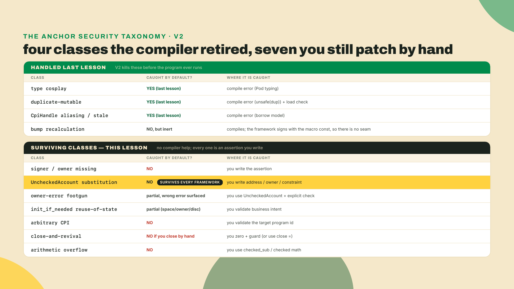

One trap to name before we start, because it is the whole reason this half is dangerous. Every guard you add costs compute and code you have to maintain, and the framework will never tell you which guard is *missing*. It only rejects the spellings it already knows. So "secure by default" is a claim about the classes on the top of that table, not the bottom. Over-trusting it on the bottom half is exactly how escrows get drained.

## The surviving classes, one attack at a time

The method is fixed and it is the point: for each class, land an exploit that succeeds against the current code, name precisely why it works, then patch until the exploit fails and the legitimate path still passes. Read, break, fix, prove.

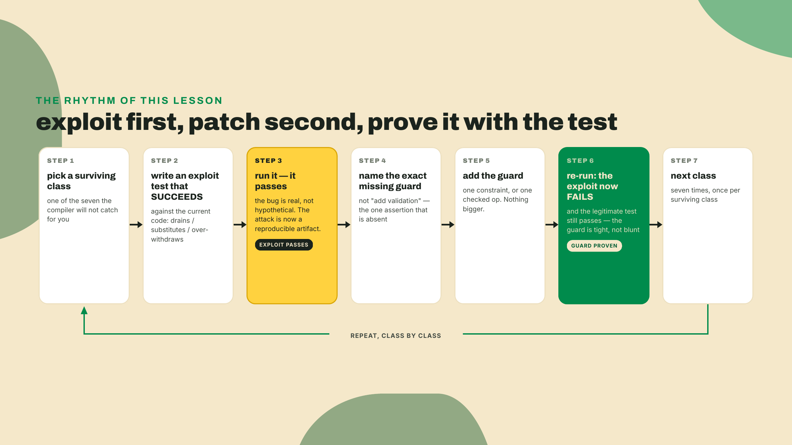

### Class 1: the signer and owner check (worked in full)

Start with the exploit you already ran. Here is the redeem accounts struct on the `vuln` branch, with the guards peeled back to where a rushed first draft leaves them:

```rust
#[derive(Accounts)]
pub struct Redeem {
    pub player: Signer,                    // VULN: any signer, not the recorded player

    #[account(
        mut,
        close = maker,
        seeds = [b"escrow", escrow.maker.as_ref(), escrow.player.as_ref()],
        bump = escrow.bump,
    )]
    pub escrow: Account<Escrow>,

    /// CHECK: pinned by the address constraint the patch adds below
    #[account(mut)]                        // VULN: any account, substitutable rent recipient
    pub maker: UncheckedAccount,

    /// CHECK: pinned by the constraint the patch adds below
    #[account(mut)]                        // VULN: any vault, not the one the escrow recorded
    pub vault: UncheckedAccount,

    pub mint: InterfaceAccount<Mint>,
    #[account(
        mut,
        associated_token::mint = mint,
        associated_token::authority = vault,
        associated_token::token_program = token_program,
    )]
    pub vault_token_account: InterfaceAccount<TokenAccount>,
    #[account(
        mut,
        associated_token::mint = mint,
        associated_token::authority = player,
        associated_token::token_program = token_program,
    )]
    pub winner_token_account: InterfaceAccount<TokenAccount>,
    pub token_program: Interface<'static, TokenInterface>,
    pub quarter_vault_program: Program<QuarterVault>,
    pub system_program: Program<System>,
}
```

Read the two ATA lines before you move on, because they are what makes the exploit *pay*. `winner_token_account` is derived from whoever sits in the `player` seat. Substitute the caller and you substitute the payout destination along with it — one edit, both halves of the theft.

Nothing here is a compile error. `player` is a real `Signer`, so *someone* signed. But the program never checks that the someone is `escrow.player`. The whole conditional release turns on "only the named player may claim," and that sentence appears nowhere in the code. The exploit writes itself. A stranger signs a redeem, clears the score bar (self-reported, remember, this cabinet does not attest scores yet), and the vault pays them. The exploit tests run on LiteSVM, V2's default in-process Rust test harness, so add it to the program if it is not already there:

```bash
# Reach LiteSVM through the harness, never by name. anchor-v2-testing owns the litesvm
# version (0.11.0 at tag v2.0.0-rc.1; the anchor-next head has already moved it to 0.13.1),
# so pinning the tag pins the SVM too. Add litesvm yourself at another version and the
# mismatch surfaces as a baffling compile error — two versions of one crate, identical-looking
# types refusing to unify — instead of never happening at all.
cargo add anchor-v2-testing --dev \
  --git https://github.com/otter-sec/anchor.git --tag v2.0.0-rc.1
# The escrow crate needs the same two SPL client crates the vault's fixture used in
# m05-l1, at the same pins, because the prize is tokens now and the setup has to mint
# and move them.
cargo add spl-token@9 spl-associated-token-account@8 --dev
```

```rust
use anchor_lang::{
    prelude::Address, programs::System, solana_program::instruction::Instruction, Id,
    InstructionData, ToAccountMetas,
};
use anchor_v2_testing::{
    Keypair, LiteSVM, Message, Signer, VersionedMessage, VersionedTransaction,
};

// The SPL client helpers m05-l1 shipped, reached by path instead of copied.
// Each tests/*.rs is its own crate root, so you cannot `use` an item out of a
// sibling test binary — but `#[path]` compiles any file you point it at straight
// into THIS crate, and it can point across packages. Same trick m05-l1's
// spl_setup.rs used to reach spl_helpers.
#[path = "../../quarter-vault/tests/spl_helpers.rs"]
mod spl_helpers;

const ONE_TOKEN: u64 = 1_000_000;   // 6 decimals, same mint shape as m05-l1

// The offset-64 read from m05-l1's spl_setup, restated here because that file
// belongs to the vault's crate: a token account's `amount` is a little-endian
// u64 at byte 64. (spl_helpers above builds instructions; it reads nothing.)
fn token_balance(svm: &LiteSVM, ata: &Address) -> u64 {
    let acct = svm.get_account(ata).expect("token account exists");
    u64::from_le_bytes(acct.data[64..72].try_into().unwrap())
}

#[test]
fn drain_as_stranger() {
    let mut svm = anchor_v2_testing::svm();
    let vault_so = concat!(env!("CARGO_MANIFEST_DIR"), "/../../target/deploy/quarter_vault.so");
    let prize_so = concat!(env!("CARGO_MANIFEST_DIR"), "/../../target/deploy/quarter_prize.so");
    svm.add_program_from_file(quarter_vault::ID, vault_so).unwrap();
    svm.add_program_from_file(quarter_prize::ID, prize_so).unwrap();

    let (maker, player, stranger) = (Keypair::new(), Keypair::new(), Keypair::new());
    for kp in [&maker, &player, &stranger] {
        svm.airdrop(&kp.pubkey(), 1_000_000_000).unwrap();
    }

    let (escrow, _b) = Address::find_program_address(
        &[b"escrow", maker.pubkey().as_ref(), player.pubkey().as_ref()],
        &quarter_prize::ID,
    );
    let (vault, _vb) =
        Address::find_program_address(&[b"vault", escrow.as_ref()], &quarter_vault::ID);

    // Setup seam, and it is YOURS to write in this same file: adapt the SPL reserve
    // flow you built for m05-l1's solo into a local `fn reserve_prize`. It creates a
    // 6-decimal mint, gives the maker, the player and the stranger each an ATA on it,
    // then reserves a 1.0-token prize behind a 5_000 winning score — which means the
    // two-call flow into the escrow's own vault instance, `initialize` then `deposit`.
    // Have it hand back the mint and the ATA addresses so the assertion can read them.
    let f = reserve_prize(&mut svm, &maker, &player, &stranger, escrow, vault, ONE_TOKEN, 5_000);

    // The stranger, NOT escrow.player, redeems with a passing score — and because
    // winner_token_account derives from the player seat, the payout follows them.
    let ix = Instruction {
        program_id: quarter_prize::ID,
        accounts: quarter_prize::accounts::Redeem {
            player: stranger.pubkey(),     // substitute the caller
            escrow,
            maker: maker.pubkey(),
            vault,
            mint: f.mint,
            vault_token_account: f.vault_ata,
            winner_token_account: f.stranger_ata,
            token_program: spl_token::ID,
            quarter_vault_program: quarter_vault::ID,
            system_program: System::id(),
        }
        .to_account_metas(None),
        data: quarter_prize::instruction::Redeem { final_score: 9_999 }.data(),
    };
    let blockhash = svm.latest_blockhash();
    let msg = Message::new_with_blockhash(&[ix], Some(&stranger.pubkey()), &blockhash);
    let tx = VersionedTransaction::try_new(VersionedMessage::Legacy(msg), &[&stranger]).unwrap();

    // On the vuln branch this SUCCEEDS. That is the bug.
    svm.send_transaction(tx).unwrap();
    assert_eq!(
        token_balance(&svm, &f.stranger_ata),
        ONE_TOKEN,
        "the stranger walked off with the whole prize"
    );
}
```

That is a working drain, and the patch is one line. On the `player` field, pin the caller to the pubkey the escrow recorded:

```rust
#[account(address = escrow.player)]
pub player: Signer,
```

`address = escrow.player` says, plainly, the account passed here must equal the player this escrow named. It is the V2 idiom that replaced `has_one`, and it takes any expression, so it reads as what it does. Re-run `drain_as_stranger` and it flips: the transaction now fails at account load, before your handler runs a single line, because the stranger's key does not match `escrow.player`. Re-run the legitimate `conditional_release` test and it is still green. Exploit dead, feature intact. That is the whole loop, and every class below is a variation on it.

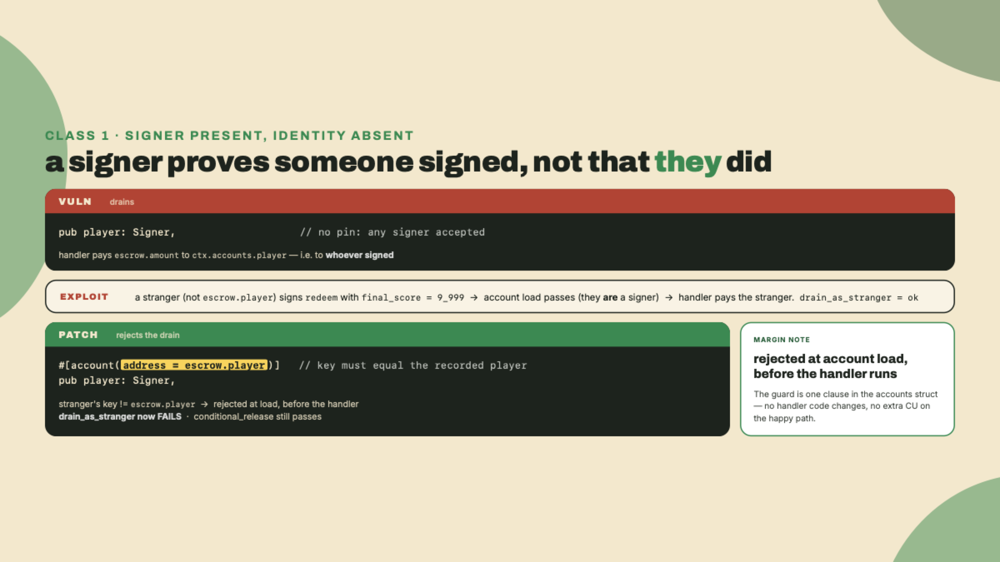

### Class 2: UncheckedAccount substitution (the one that survives every framework)

Look back at that `maker` field. It is an `UncheckedAccount`, and on the vuln branch it carries only `mut`. That word `UncheckedAccount` is not decoration. It is the type opting out of every framework check there is: no owner check, no discriminator check, no identity check. You are telling Anchor "I will validate this myself," and then not doing it.

Here is why that is the deepest class in the lesson. The escrow closes to `maker`, returning the rent. On the vuln branch, `maker` is any account the caller passes. So an attacker passes *their own* account as `maker`, and the rent lamports from `close = maker` land in their wallet instead of the operator's. Small money on one escrow, real money across a thousand. And nothing catches it, because there is nothing to catch: the account is valid, it is mutable, it is writable. It is simply not the account the escrow meant.

This is the account-substitution class, and I want you to sit with a claim: no compiler in any framework, in any language, can catch this one for you. Type cosplay was catchable because the types differed. Duplicate-mutable was catchable because the addresses aliased. Substitution has no signal. A correct account and an attacker's account have identical types, identical owners in the general case, identical everything except *which one the business logic intended*, and intent is not in the type system. It is the one class you own forever.

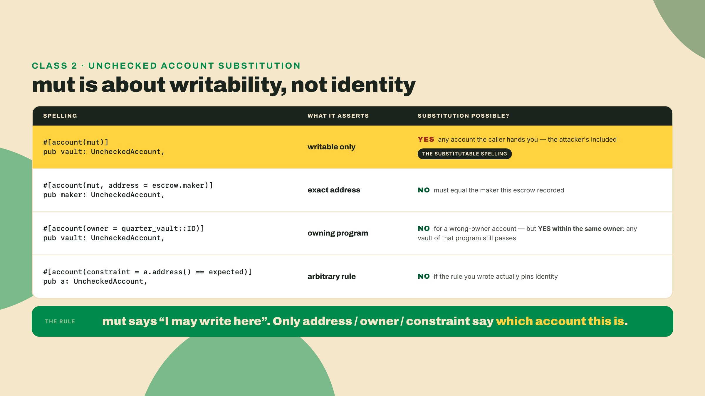

The patch on the escrow restores the pin the frozen version always had:

```rust
#[account(mut, address = escrow.maker)]
pub maker: UncheckedAccount,
```

Now the rent can only return to the recorded maker. Do the same to `vault`, which on the vuln branch carries only `mut` — any account at all — so an attacker substitutes a *different* vault they control, and the `associated_token::authority = vault` line obligingly derives the vault ATA from *their* vault. One thing the patch must *not* do is promote the field to a typed `Account<Vault>`: the vault belongs to `quarter_vault`, a different program, so it could never load as a typed account inside `quarter_prize` — class 3 below derives exactly why, and it is the reason R3 declared the slot `UncheckedAccount` in the first place. Two spellings close it, and both are already in your vocabulary. The frozen escrow pins it by derivation, `seeds` + `bump` + `seeds::program`, which is what you wrote in m05-l1. The shorter one pins it against the record, with a real error while it is at it, and it is the one this lesson uses because it makes the substitution class visible in a single line:

```rust
/// CHECK: pinned to the exact vault this escrow recorded
#[account(mut, address = escrow.vault @ EscrowError::WrongVault)]
pub vault: UncheckedAccount,
```

**Completion problem.** I gave you the two patches above. Now you write the exploit that proves the `maker` hole was real. Fork `drain_as_stranger` into a `steal_rent_on_close` test: the legitimate player redeems correctly, but passes `maker: attacker.pubkey()` instead of the true maker, and you assert the attacker's balance grew by roughly the escrow's rent. Land it red on the peeled-back field, apply the `address = escrow.maker` pin, watch it go green. The accept bar is exactly the loop: the test passes against the vuln field and fails against the patch.

One pointer, because you should know where the flagship version of this class lives: the Cashio drain, where a missing `.mint` check let an attacker mint collateral from nothing, is the DeFi and RWA Engineering course's territory. This course does not develop it; go there for the war story. Here, own the class.

### Class 3: the owner-error footgun (why the check you expected does not fire)

Here is a trap that looks like a fix. Say you want a custom error when someone passes a vault owned by the wrong program. The natural spelling is:

```rust
#[account(owner = quarter_vault::ID @ EscrowError::WrongVault)]
pub vault: Account<Vault>,
```

You write your test, pass a vault owned by some other program, and expect `WrongVault`. You get `ProgramError::IllegalOwner` instead. Your `@ EscrowError::WrongVault` never fired. Why?

(There is a second reason that spelling is wrong for *this* field specifically, and it is worth spotting before the mechanism: the escrow's vault is owned by `quarter_vault`, a different program, so it could never load as a typed `Account<Vault>` inside `quarter_prize` at all. That is why R3 declares it `UncheckedAccount`. The footgun below is what bites when the account genuinely is yours and you just wanted a nicer message.)

This is worth deriving, not just memorizing, because the reason generalizes. An `Account<T>` is a typed wrapper, and before your constraint hooks run, Anchor has to *load* it: read its bytes, check the account is owned by the declaring program, and check the discriminator matches `T`. Those two checks, owner and discriminator, are structural. They happen inside `load`, first, because the framework cannot hand you a typed `T` it has not verified is a `T`. Your `owner = ... @ MyErr` constraint is a *hook*, and hooks run after load. So on a wrong-owner account, load fails first with `IllegalOwner`, and control never reaches the hook that carries your custom error.

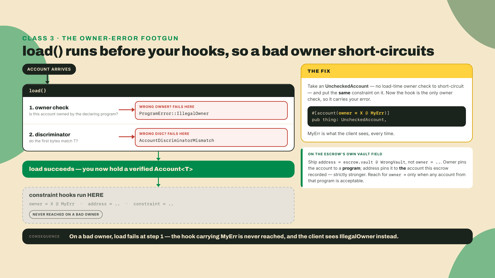

The fix, when you genuinely need the custom error, is to stop asking `Account<T>` to carry it. Take an `UncheckedAccount`, which does no load-time owner check (exactly the type from class 2), and put the *same* `owner = X @ MyErr` constraint on it. Now there is no `load` to short-circuit, so the constraint hook is the only thing checking the owner, and it carries your error:

```rust
#[account(owner = quarter_vault::ID @ EscrowError::WrongVault)]
pub vault: UncheckedAccount,
```

That is the framework's own prescription: the doc comment on V2's `Account<T>` alias says, in as many words, that for a custom error you use `UncheckedAccount` with a derive-level `owner = X @ MyErr`. The trade is that you gave up the typed view, so if the handler needs the vault's fields you now load and validate them yourself.

Notice the shape: the two classes compose. The type that opts out of the framework's checks is the same type that lets you write your own. That is not a coincidence, it is the framework being honest about what it does and does not do for you.

### Class 4: init_if_needed reuse (ungated is not the same as safe)

A teammate remembers `init_if_needed` from the v1 line as the feature-gated one, the one you had to explicitly enable because it was dangerous. Correct the record, because V2 changed it and half-remembering the change is its own hazard.

In V2, `init_if_needed` is no longer behind a feature flag. I checked the V2 feature set against the framework's own docs: the release ships six feature flags, `alloc`, `guardrails`, `idl-build`, `compat`, `const-rent`, and `testing`, and `init-if-needed` is not among them. It is ungated. On top of that, `init_if_needed` accounts have been folded into the duplicate-mutable check since the 1.0 line (#4239) and still are under V2, and the reuse branch re-validates the account's space, owner, and discriminator, which closes the crudest reinitialize tricks.

Here is the part that survives all of that. The framework can verify the account is the right *shape*. It cannot verify that reinitializing *this* account is the right *thing to do*. If your instruction hits the `init` branch over an account that already holds live state, the reuse-validation passes (space matches, owner matches, discriminator matches) and you cheerfully overwrite a funded escrow back to zeros.

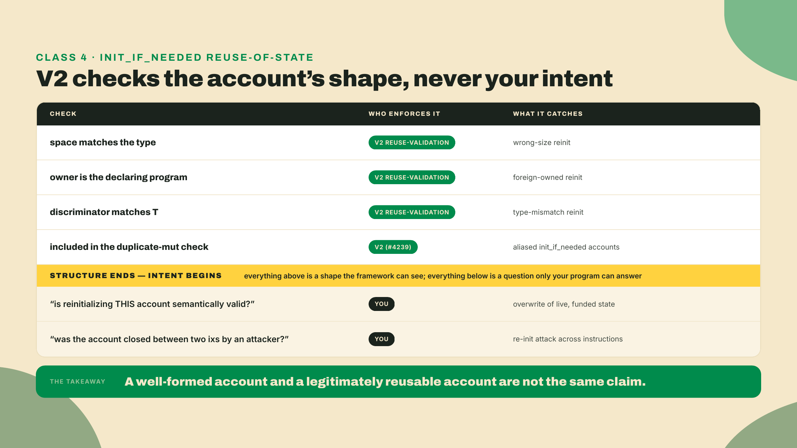

Freshness note: this reflects the Anchor V2 release candidate as of 2026-08-22, verified against the framework's feature-flag docs and changelog. V2 is still an RC with no stable tag, so if you pin a newer RC, re-read its `init_if_needed` reuse-validation behavior before you trust the exact semantics. The mitigation does not change: if an account can hold live state, guard the reinit yourself. Check a stored flag or a nonzero field before you let the `init` branch run, and reject when the account is already live.

### Class 5: arbitrary CPI (validate the target program id)

Your escrow calls the vault. It declares the callee as `quarter_vault_program: Program<QuarterVault>`, and that typed `Program<T>` is doing quiet security work: it checks the account's key equals `QuarterVault::id()` — the marker `declare_program!` generated back in m04-l3 — and, with the default `guardrails` feature on, that the account is executable. You cannot be tricked into calling something else, because the type pins the target.

Now imagine you got lazy and typed it as an `AccountInfo` or `UncheckedAccount`, then invoked it:

```rust
// VULN: the callee is whatever the caller passed.
let cpi_ctx = CpiContext::new(ctx.accounts.some_program.address(), cpi_accounts);
// ... invoke ...
```

An attacker passes their own program as `some_program`, your escrow signs the CPI with the escrow PDA's seeds, and now the attacker's program runs *with your PDA's signature*. That is the arbitrary-CPI class: you did not choose the program that ran, the caller did, and you handed it your authority.

The patch is to let the type pin the target, exactly as the frozen escrow does. For the swap, the same rule applies to the token program: `token_program: Interface<'static, TokenInterface>` pins the callee to a real token program (classic or Token-2022) rather than accepting an arbitrary one.

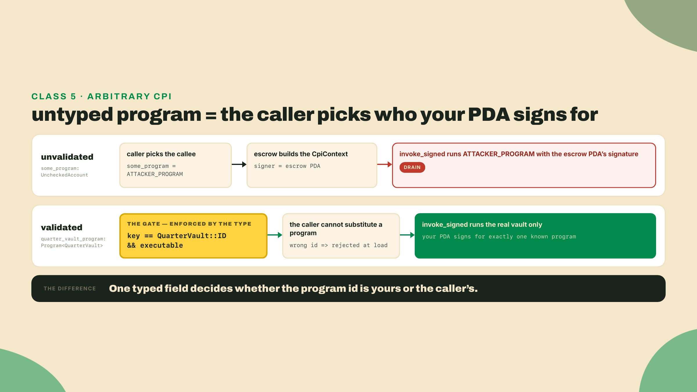

### Class 6: close-and-revival (zero it, or guard it)

Closing an account is not just moving its lamports out. On Solana, an account with zero lamports at the end of a transaction is swept, but *within* the transaction, an account you drained and shrank can be topped back up and reused before the sweep. If your close is hand-rolled, transfer the lamports, realloc to nothing, and stop, you left the door open: a later instruction in the same transaction refunds it and your program's discriminator is still sitting in the (now revived) data, so the account passes validation again on a second call. That is close-and-revival.

The escrow avoids it because it uses the `close = maker` constraint, and V2's close zeroes the data, writes the closed-account sentinel, and assigns the account to the system program. There is nothing left to revive. The class only bites when someone reaches past the constraint and closes by hand. If you ever do, the rule is: zero the discriminator and guard against the revived shape, do not just move the lamports.

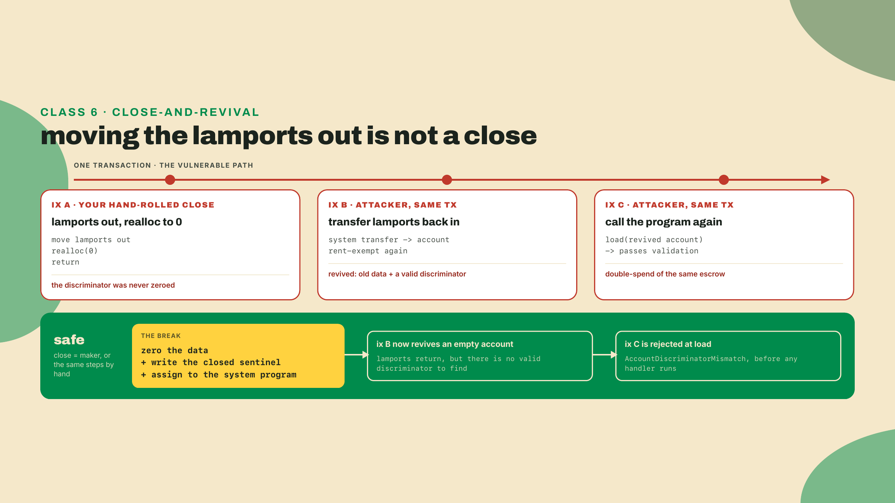

### Class 7: arithmetic overflow (the withdraw guard's real bug)

The last class is the smallest to state and the easiest to ship. The vault's `withdraw` debits its ledger, `vault.credit`, after the token move. On the vuln branch it does it with raw subtraction:

```rust
// VULN: unsigned subtraction underflows.
vault.credit = vault.credit - amount;
```

If `amount > credit`, this does not error. In debug builds it panics; in a build with overflow checks off it *wraps*, so a credit of 30 minus a withdraw of 100 becomes a gigantic positive number and the vault's books believe it holds far more than it does. Neither outcome is "the withdraw was rejected," which is the only correct one.

Reaching that line takes one extra move, and the move is the interesting part. `withdraw` transfers the tokens first and debits the ledger second, so while the ledger and the custody agree, the token program rejects an over-withdraw at the transfer CPI and the subtraction never runs — m05-l1 said exactly that when it had you assert the over-withdraw comes back an `Err`. The ledger guard exists for the case where the two numbers *disagree*, and they disagree the moment anybody transfers tokens straight into the vault's ATA. An associated token account is a public mailbox: `deposit` is not the only way tokens get in, and nothing on chain makes an unsolicited transfer bump `vault.credit`. So over-fund the vault ATA by hand, then withdraw more than `credit` but no more than the ATA actually holds. The transfer succeeds, the raw subtraction wraps, and the books now report a balance nobody ever put there.

Know where your build sits on that, because it decides which of the two you get. Anchor's generated workspace `Cargo.toml` sets `overflow-checks = true` on the release profile, and `cargo build-sbf` uses release, so on an untouched scaffold this panics rather than wraps. Two things make the wrap real anyway. Someone removes that line, which happens the first time a team chases CU. Or someone turns `guardrails` off — the flip you ran yourself in m06-l2, which landed on nothing only because anchor-spl's edge held the feature on; on a crate without that edge, or after one change to the graph, it lands. Either way the wrap is one Cargo edit away, and a guard that only holds because of a profile setting is not a guard.

Access control does not save you here. A perfectly authorized player can still request more than the vault holds. This is not a "who" bug, it is a "how much" bug, and the fix is checked arithmetic:

```rust
// PATCH: checked_sub returns None exactly when amount > credit.
vault.credit = vault
    .credit
    .checked_sub(amount)
    .ok_or(VaultError::Underflow)?;
```

`checked_sub` returns `None` in precisely the case that would underflow, so you convert that `None` into a real error and reject the over-withdraw. It is one method and one `?`. It is also, not coincidentally, the exact patch your coding challenge asks for.

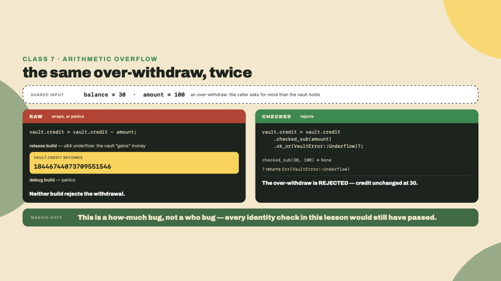

One housekeeping fact for your patches. Anchor's own constraint rejections mostly live in the 2000s — `ConstraintAddress`, the one your pins raise, is Custom(2012) — but not all of them: a handful map straight onto the runtime's builtin errors instead, and `ConstraintOwner` is the sharp case, surfacing as `ProgramError::IllegalOwner` rather than any 2000s number, exactly as class 3 showed you. Your custom `#[error_code]` variants start at 6000 and count up. So an error in the 6000s is one of yours, and *which* one depends on the program: `quarter_prize` and `quarter_vault` each have their own `#[error_code]` enum, each numbered from 6000 by declaration order, so 6001 means one thing in a redeem rejection and another in a withdraw rejection. Read the program the error came from before you read the number. Knowing which band an error lives in tells you at a glance whether the framework rejected the transaction or your own guard did.

### The same loop on the swap

The escrow was the whole taxonomy on one program. The swap (R4) is the same classes wearing token accounts instead of lamport vaults, and running the loop against it is what convinces you these are *classes*, not escrow trivia. `swap_arcade_for_tickets(amount_in, min_out)` pulls the trader's arcade tokens into the pool's arcade reserve and pushes tickets back out. Two of the surviving classes map straight onto it.

First, substitution, class 2 again. The swap's `reserve_arcade` and `reserve_ticket` are the pool's own token accounts, the ones the trades price against. They carry `token::mint` and `token::authority = pool`, and neither of those says *which* account the pool meant: anyone can create a token account on the right mint with the pool as its authority, because SPL's `InitializeAccount` takes the owner as a plain argument and never asks the owner to sign. So an attacker passes their own pair as the reserves, the constant-product math prices against balances they control, and they quote themselves a fill the real pool would never offer. Same shape as the stranger draining the escrow: a valid account of the right type, simply not the one the program meant.

Now the uncomfortable half. The patch is the same *shape* as the escrow's — pin each reserve against what the pool recorded — except R4 as you built it records nothing to pin against: `Pool` holds the two mints and its bump, and the reserves sit at addresses nobody derives. So closing this one is two moves, not one: the pool has to start recording the two reserve addresses at init, and the swap has to pin each field against that record. That is a real, open finding against your own program. Do not patch it here on a hunch — next lesson opens by making you look for exactly this line, and fixing it is the first row of the audit checklist.

Second, arbitrary CPI, class 5. The swap CPIs `transfer_checked` through `token_program`, and the frozen swap types it as `Interface<'static, TokenInterface>`, which pins the callee to a real token program (classic or Token-2022) and nothing else. Type it as an `UncheckedAccount` instead and the trader chooses which program moves the tokens, with the pool's authority behind the call. The type is the guard.

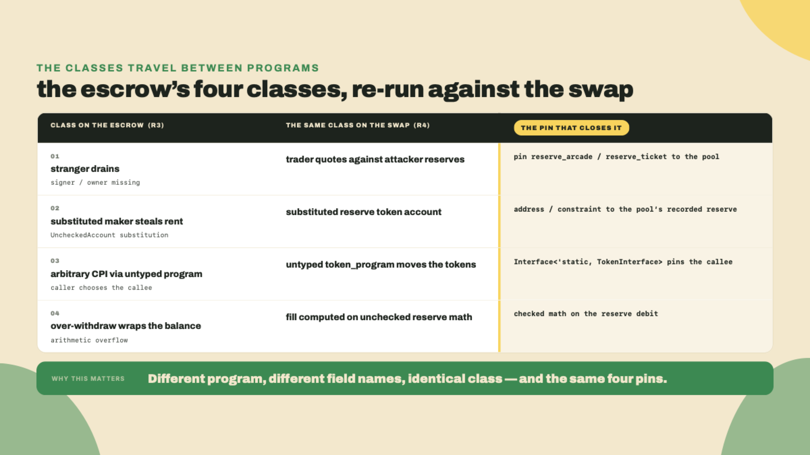

You do not re-derive anything to attack the swap. You carry the same seven questions over and ask them of a different account list. That portability is the reason the taxonomy is worth learning as classes rather than as a checklist for one program.

## Lab: exploit then patch the escrow

You have seen every class. Now run the loop yourself against the escrow, end to end, until every exploit test fails and the suite is green.

**Step 1. Pin the V2 toolchain and get on the vulnerable branch.** This course runs on the Anchor V2 release candidate, not the 1.1.2 V1 line many machines ship by default. `avm install` cannot fetch the V2 RC: it downloads a prebuilt binary from a published GitHub release, and no release was cut for the v2 tag, so the download 404s. Install the CLI directly from the `v2.0.0-rc.1` tag:

```bash
# Anchor V2 RC CLI, built from the tag (no release binary for the v2 tag to download).
cargo install --git https://github.com/otter-sec/anchor.git --tag v2.0.0-rc.1 anchor-cli --locked --force
# macOS: prefix with CARGO_PROFILE_RELEASE_LTO=off if the release build fails to link.
anchor --version              # confirm the V2 line, not 1.1.2

# You cut this branch and peeled the three constraints back at the top of the lesson.
git checkout vuln/prize-escrow
```

Freshness note: as of 2026-08-22 the V2 line ships only as release candidates (2.0.0-rc.1, tagged on `anchor-next`), so there is no stable version to hardcode. The branch head advances, so record the exact commit you built in `Anchor.toml` and CI so a teammate builds the same bytecode. When V2 tags stable, pin that instead.

**Step 2. Land the three exploits.** Your `vuln` branch has `Redeem` with the guards peeled back: `player` with no `address`, `maker` with no `address`, `vault` with no derivation pin. Add the fourth peel now, in the vault, and this one takes two edits — which is itself the lesson: replace the `checked_sub` in `withdraw` with a raw `vault.credit - amount`, *and* comment out the `overflow-checks = true` line under the release profile in the workspace `Cargo.toml`. Class 4 told you why the second edit is mandatory: on an untouched Anchor scaffold, release builds keep overflow checks on, so the raw subtraction would panic-abort the transaction — a crash, not a drain — and `over_withdraw` would fail for the wrong reason. The wrap is one Cargo edit away, said class 4; for this exercise, you are the someone who makes it. Then put all three exploit tests in `programs/quarter-prize/tests/exploits.rs`: `drain_as_stranger` from class 1, `steal_rent_on_close` from the class-2 completion problem, and `over_withdraw`, which sends tokens straight into the vault's ATA to push custody above the ledger, then withdraws more than `credit`. Run all three and watch them pass, which is the wrong result and the whole point:

```bash
anchor build && cargo test --test exploits
```

```text
test drain_as_stranger   ... ok
test steal_rent_on_close ... ok
test over_withdraw       ... ok

test result: ok. 3 passed; 0 failed
```

Three green exploits is three real holes. `drain_as_stranger` is the signer/owner class from the walkthrough. `steal_rent_on_close` is the account-substitution completion problem you wrote in class 2. `over_withdraw` requests more than the *ledger* says the vault holds, backed by an ATA the test over-funded by hand, and — with the profile edit disarming the overflow checks — the raw subtraction wraps and lets it through. Checkpoint: all three report `ok`. If `steal_rent_on_close` fails instead, your test is asserting the wrong thing, not proving the hole is closed, so re-read the accept bar in class 2 before you move on.

**Step 3. Patch, one class at a time.** Apply the four constraints and the one checked op, exactly as derived above:

```rust
// in Redeem accounts:
/// CHECK: pinned to the exact vault this escrow recorded
#[account(mut, address = escrow.vault @ EscrowError::WrongVault)]
pub vault: UncheckedAccount,

#[account(address = escrow.player)]
pub player: Signer,

#[account(mut, address = escrow.maker)]
pub maker: UncheckedAccount,
```

```rust
// in the vault's withdraw handler:
vault.credit = vault
    .credit
    .checked_sub(amount)
    .ok_or(VaultError::Underflow)?;
```

And keep the win-condition guard ahead of the payout CPI, where it gates the release by position:

```rust
require!(final_score >= ctx.accounts.escrow.winning_score, EscrowError::ConditionNotMet);
```

And restore the `overflow-checks = true` release line you commented out in step 2. The `checked_sub` no longer needs the profile to save it — that is the point of the patch — but the profile is the workspace's backstop for every *other* subtraction, and it goes back on.

Checkpoint: `anchor build` is green. Three constraints, one checked op, and the restored profile line is the entire patch set, so if the build fails it is a spelling problem, not a design problem, and the compiler names the field.

**Step 4. Prove the exploits are dead and the feature lives.** Run the exploits and the legitimate path together:

```bash
anchor build && cargo test
```

```text
test drain_as_stranger    ... FAILED (rejected: ConstraintAddress)
test steal_rent_on_close  ... FAILED (rejected: ConstraintAddress)
test over_withdraw        ... FAILED (rejected: custom error 0x1771)
test conditional_release  ... ok

test result: FAILED. 1 passed; 3 failed
```

Read that inverted result carefully, because a failing exploit test is success here. `drain_as_stranger` and `steal_rent_on_close` now fail with `ConstraintAddress`, the framework's 2000s-band rejection at account load: the wrong caller and the substituted maker never reach your handler. `over_withdraw` fails with a custom error in the 6000s, whichever number your `Underflow` variant landed on given its position in `VaultError` (variants are numbered from 6000 by declaration order, so count yours rather than copying mine). The runtime prints it in hex, so a variant at 6001 shows as `0x1771`. And `conditional_release`, the real player clearing the real bar, still passes. Checkpoint: the three exploits flip from pass to fail, and the legitimate release stays green. If any exploit still passes, the culprit is the guard you have not added yet, and the test name tells you which class.

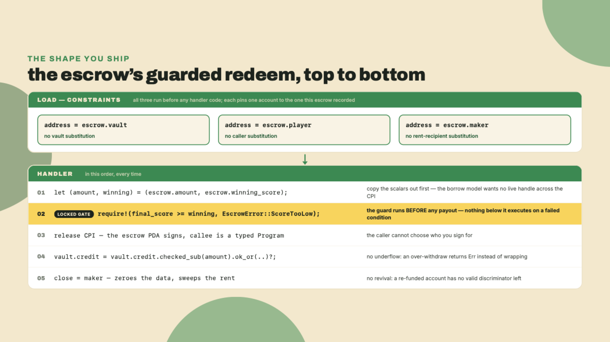

## Challenge: patch the withdraw guard as a pure function

Now cut loose. The escrow and vault payout logic, distilled to a pure function so it grades deterministically, ships vulnerable: no authority check and raw subtraction. Two classes from this lesson live in it, the signer/owner check and the arithmetic underflow. Your job is to add both guards, then port the same two guards back into the escrow instruction so the distillation and the real program agree.

The starter, in a plain `cargo` project (no Anchor, no toolchain, it compiles anywhere `rustc` does). Each guard is its own `const fn` — the m03-l3 compile-time-assertion device, and what compile-only grading actually enforces — with `settle_withdraw` already wired through both, so the two vulnerable bodies are the whole exercise:

```rust
// `Address` is 32 bytes, the shape `pinocchio::address::Address` really has.
//
// Return convention (so the grader can value-compare):
//   >= 0  -> the new balance after a successful withdraw
//     -1  -> rejected: caller is not the authority
//     -2  -> rejected: amount would underflow the balance
type Address = [u8; 32];

/// Gate the withdraw: is `caller` the vault authority?
const fn is_authority(caller: &Address, authority: &Address) -> bool {
    // TODO: true only when ALL 32 bytes match. Right now every caller passes.
    let _ = (caller, authority);
    true
}

/// Settle the arithmetic: the balance left after the withdraw, or -2.
const fn checked_remaining(balance: u64, amount: u64) -> i64 {
    // TODO: checked arithmetic, so an over-withdraw returns -2. This raw `-`
    // is the drain.
    (balance - amount) as i64
}

fn settle_withdraw(balance: u64, amount: u64, caller: Address, authority: Address) -> i64 {
    if !is_authority(&caller, &authority) {
        return -1;
    }
    checked_remaining(balance, amount)
}
```

Two guards, in order. Access control comes first: `settle_withdraw` already returns `-1` the moment `is_authority` says no, before any arithmetic runs on the caller's behalf — your job is to make `is_authority` actually say no. Then the arithmetic: `u64::checked_sub` returns `None` exactly when `amount > balance`, so match on it in `checked_remaining`, return `-2` on `None`, and the new balance on `Some`.

The addresses are full-width on purpose. An address is 32 bytes and carries no meaningful ordering, so the only legal comparison is equality over all 32 of them — in a real handler that is one `caller != authority`. Here the gate is a `const fn` so the compiler can prove it while it builds, and `==` on arrays is a trait call a `const fn` cannot make on stable Rust, so you write the equality the way the machine runs it anyway: walk the bytes, all 32, and reject on the first mismatch. Three of the grader's cases exist to prove you compared everything and nothing cheaper: one where the caller sorts *below* the authority, which an ordering comparison waves through, and two near-misses that match the authority in 31 of 32 bytes — one differing in the first byte, one in the last — which any prefix or single-byte comparison waves through. The reason to care is not that someone will grind 31 matching bytes — that is 2²⁴⁸ of work, and nobody is doing it. It is that a gate comparing a prefix is a gate whose prefix is grindable, and short prefixes are cheap: vanity search sells them by the character.

Acceptance criteria the grader checks directly:

- a non-authority caller is rejected with `-1`, whether their address sorts above or below the authority's
- an address matching the authority in 31 of 32 bytes is still rejected with `-1`, whichever byte differs
- an over-withdraw that would underflow is rejected with `-2`
- an authority withdraw within balance returns the new balance (`100, 30, [7u8; 32], [7u8; 32]` returns 70; an exact-balance `50, 50, [7u8; 32], [7u8; 32]` returns 0)
- the starter does not even build — the open gate fails compile-time assertions whose messages name the caller it let through, and the raw `-` overflows in const evaluation on the over-withdraw case; your solution builds clean and passes every case

When the pure function is green, port it: the byte-walk in `is_authority` is one `caller != authority` in real handler code — the `address = escrow.player` constraint you already added — and the `checked_sub` is the vault debit you already patched. The distillation and the instruction enforce the same two guards. That is the point of the exercise, that the guard is the guard whether it lives in a constraint, a `require!`, or a pure function.

## Did it work?

You should now have a prize-escrow whose three exploit tests all fail, a legitimate release that still passes, and a withdraw guard that rejects both the wrong caller and the over-withdraw as a pure function you can reason about in isolation. The stranger cannot drain it. The substituted maker cannot steal the rent. The over-withdraw cannot wrap the ledger. And every one of those fixes was a single constraint or a single checked operation, added because you *knew to add it*, not because the compiler forced your hand.

Keep the edge from this lesson sharp, because it is the part people get exactly backwards. Last lesson's compile-time wins are real, and this lesson's surviving classes are equally real, and the second set is more dangerous precisely because the first set trains you to trust the framework. The account-substitution class in particular is yours forever: no compiler, in this framework or any other, can tell a correct account from an attacker's when their types match and only the intent differs. If an exploit test still passes for you, it is not a mystery, it is a missing guard, and the test name is the class.

One last thing, and it should leave you a little uneasy in a useful way. If you dig into Anchor's npm `repository` field across this year's releases, custody of the framework moved from `coral-xyz` in January 2026 to `solana-foundation` from March through May to `otter-sec` from June onward, and neither the repository's README, its changelog, nor any release note announces either move. The ecosystem's flagship framework changed hands twice in six months and the registry metadata is where you find out. I am not telling you that to spook you off Anchor, it is excellent and you should use it. I am telling you because "the framework has my back" is a security *assumption*, and this is a lesson about never letting an assumption stand in for a check. The people maintaining your bodyguard can change without you noticing. The guard you wrote yourself does not.

You patched everything you could think to attack. But "everything you could think of" is exactly the wrong audit strategy, because the inputs that drain escrows are the ones nobody thought to test. Next lesson you stop guessing and turn the fuzzer loose, generating the inputs you never imagined and letting it find the guard you are still missing.
