# The audit checklist as a lab, and fuzz as the assessment

Last lesson you drained the escrow with your own exploit tests, then patched it: an `address` pin on the caller, an `address` pin on the substitutable `UncheckedAccount`, and `checked_sub` on the vault debit, until every attack you could think of failed. You did not attack the swap. You mapped the same seven classes onto its fields and left it there. That last clause is the trap. "Every attack you could think of" is a fence built to the exact height of your own imagination, and an attacker's imagination is not yours.

So before you read another paragraph, do this. Open `programs/token-ticket-swap/src/lib.rs`, find `swap_arcade_for_tickets`, and answer one question about its accounts struct: is there a line, an actual line you can point to, that proves `reserve_ticket` is the pool's own reserve and not a token account the caller chose? Not "Anchor probably handles it." A line number, or the word `FAIL`. Write it in a scratch file. That is the first row of your audit checklist, and you just started the lab.

```bash
# Find the swap handler you are about to audit, and start the checklist file.
grep -n "fn swap_arcade_for_tickets" programs/token-ticket-swap/src/lib.rs
: > audit-checklist.txt   # one row per check: write a line number, or the word FAIL
```

If the line you reached for is a `token::authority = pool` constraint, look again, because that is the trap in the question. Anyone can create an SPL token account whose authority is the pool PDA — `InitializeAccount` takes the owner as a plain argument, no signature from the owner required — and both reserves share that authority anyway. Authority says who may spend from an account, not which account the pool meant, which is precisely the substitution class from last lesson. The line that *would* answer the question is the pin last lesson's mapping demanded for R4: the reserve's *address* checked against a reserve the pool recorded at init. Go looking for it and you find something sharper than a missing constraint. `Pool` stores the two mints and its bump and nothing else — m05-l2 said as much when it noted the reserves sit "at addresses nobody derives" — so there is no recorded address on chain to check against. The line does not exist, and it cannot be written until the pool starts recording one. Write `FAIL`. You just made the checklist's first real find before the checklist even started, and it is a two-part fix rather than a one-liner, which is exactly the kind of thing a read-through waves past and a checklist does not. The point is not the difficulty. The point is that you looked, and that you now have one row of a file that says so.

This lesson turns security from a feeling into a two-part procedure. Part one is a checklist you run by hand, row by row, against the swap: it makes your review repeatable and forces you to name the line that satisfies each guarantee. Part two is `anchor fuzz`, which runs the attack for you. You point it at the swap, walk away, and come back to a crash artifact for an input you would never have typed. The reframe that carries the whole lesson: a clean fuzz run is not reassurance, it is silence. A crash is the win, because a crash you found is a bug the attacker did not.

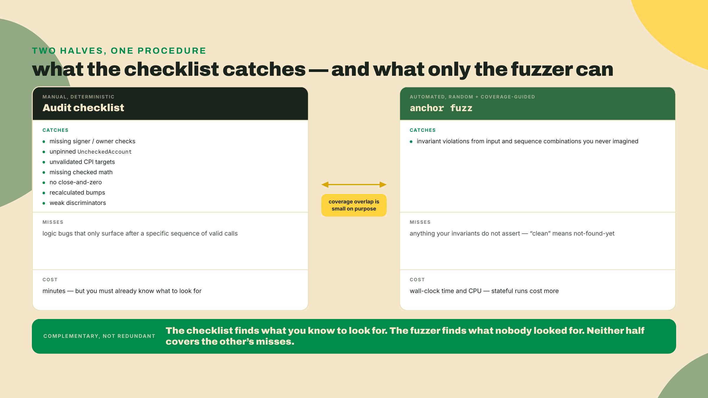

Here is what I hand you and what I do not. I run the full checklist with you and stand up the first fuzz loop step by step, including seeding a bug on purpose so you can watch the fuzzer catch it. The invariant assertion at the center of the harness, you finish yourself from a scaffold with a hole in it. Then seeding a brand-new bug, predicting whether the fuzzer will find it, and replaying the crash to confirm is entirely yours. The deliverable at the end is a filled-in checklist, a crash artifact and its replay, a patch, and a clean re-fuzz with a coverage report.

## Turning security into a procedure

### Running the checklist as a lab

A code review that lives in your head is not repeatable, and it is not reviewable by anyone else. The fix is boring and it works: a fixed set of rows, and for each row you either write the line number that satisfies it or you write `FAIL` and go fix it. Seven rows cover the bug classes that account for most of what real Solana audits find. They are not the same seven as last lesson's surviving classes, and the difference is deliberate: last lesson's list was organized by *class of bug*, this one by *thing you look at in a file*. Two of last lesson's classes fold into row 1 here, `init_if_needed` reuse has no row because the swap has no `init_if_needed`, and two rows below (canonical bumps, discriminators) are checks the compiler mostly makes for you but that cost nothing to confirm. Run them against the swap in order.

| # | Check | Pass condition | Swap line |
|---|-------|----------------|-----------|
| 1 | Signer and owner present | Every authority is a `Signer`; every typed account has an owner check (implicit in `Account<T>`, explicit for `UncheckedAccount`) | ? |
| 2 | Every `UncheckedAccount` pinned | Each raw account carries `address`, `owner`, or a handler-side `constraint` | ? |
| 3 | CPI targets validated | The token program you invoke is a typed `Interface`/`Program`, not a caller-supplied key | ? |
| 4 | Checked math everywhere | No raw `+ - * /` on balances or reserves; only `checked_*` with an error on `None` | ? |
| 5 | Close-and-zero on teardown | Closing an account zeroes its data and reclaims lamports so it cannot be revived | ? |
| 6 | Canonical bumps stored | PDA bumps are read from stored state, never re-found on each call | ? |
| 7 | Discriminators sane | Account discriminators are distinct and non-trivial so type confusion is impossible | ? |

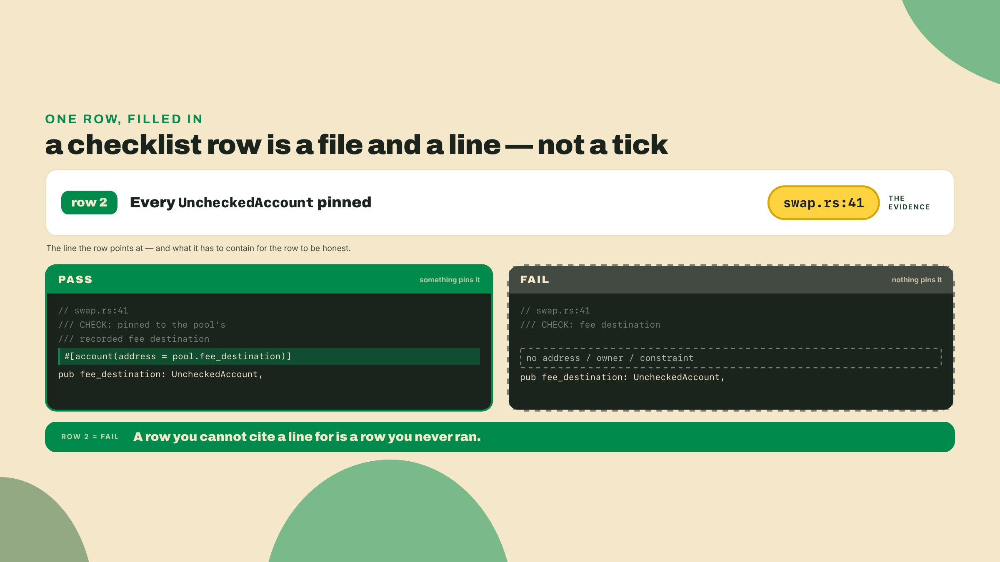

The point of writing the line number is that it defends against the most common self-deception in review, which is assuming the framework did something it did not. Anchor V2 does kill several of these at compile time. `Account<T>` requires `T: Pod` with a no-padding layout, so a type-confusion read fails to compile instead of silently misreading bytes. Duplicate mutable accounts are rejected during account validation unless you opt in with the deliberately ugly `unsafe(dup)`. Those are real guarantees you can cite. But row 2 is exactly the one the framework will not save you on: the V2 docs are blunt that `UncheckedAccount` still does no validation, and you must pair it with `address`, `owner`, or a `constraint` yourself. The checklist exists to make you look at that line and confirm it is there.

A few rows deserve a specific look in the swap, because they are the ones people wave through. Row 3, CPI targets: the swap moves tokens through a CPI, and the token program it invokes must be a typed `Interface` or `Program`, never a bare address the caller passed in, or an attacker hands you a look-alike program and your "transfer" runs their code. Row 5, close-and-zero: if the pool can be torn down, closing it must zero the data as well as reclaim the lamports, otherwise a revival attack reinitializes stale bytes into a new account with old balances. Row 6, canonical bumps: you stored the pool bump in state back when you built the pool; row 6 confirms the `swap` handler reads that stored bump rather than calling `find_program_address` again, which is both a CU cost and a subtle correctness trap if the seeds ever change. Write the line, or write `FAIL`. A row you "are pretty sure about" is a `FAIL` you have not admitted yet.

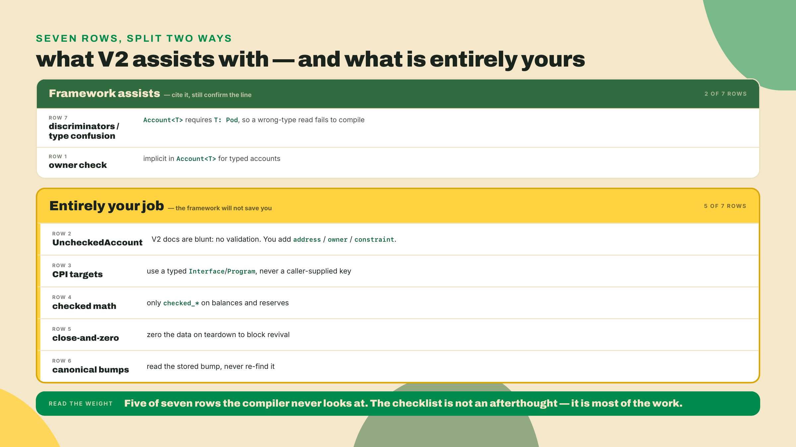

### Why the fuzzer catches what your review cannot

Start from the honest limit of what you just did. The checklist is deterministic and fast, but it can only check for bug classes you already named. The bug that ships is, almost by definition, the one nobody named. So the question is: how do you find a bug you cannot imagine? Walk the naive answers first, because each one fails in a way that points at the real tool.

The first naive answer is "write more tests." It fails for the same reason the checklist has a ceiling: a test asserts a behavior you thought of, so your test suite is exactly as imaginative as you are, and no more. The second naive answer is "throw random inputs at each instruction." Better, because randomness is not bounded by your imagination, but it fails on anything that needs a sequence: fire one random `swap` at a fresh pool ten million times and you will never reach the state where the pool has been drained to a sliver and a trade rounds the wrong way, because that state only exists after a specific chain of earlier trades. The third naive answer, "random sequences of instructions," is closer, but pure randomness wanders: it spends almost all its time re-exploring shallow states and almost never stumbles into the deep, narrow one where the bug lives.

The tool that survives all three failures is coverage-guided, stateful fuzzing, and each word is load-bearing. Stateful, so the world persists across a chain of actions and deep states become reachable at all. Coverage-guided, so the fuzzer is not wandering: it watches which branches of your compiled program each input reached and steers toward inputs that reach new ones, turning a random walk into a directed search. That combination is what `anchor fuzz` gives you, and it is why a machine finds inputs you never would.

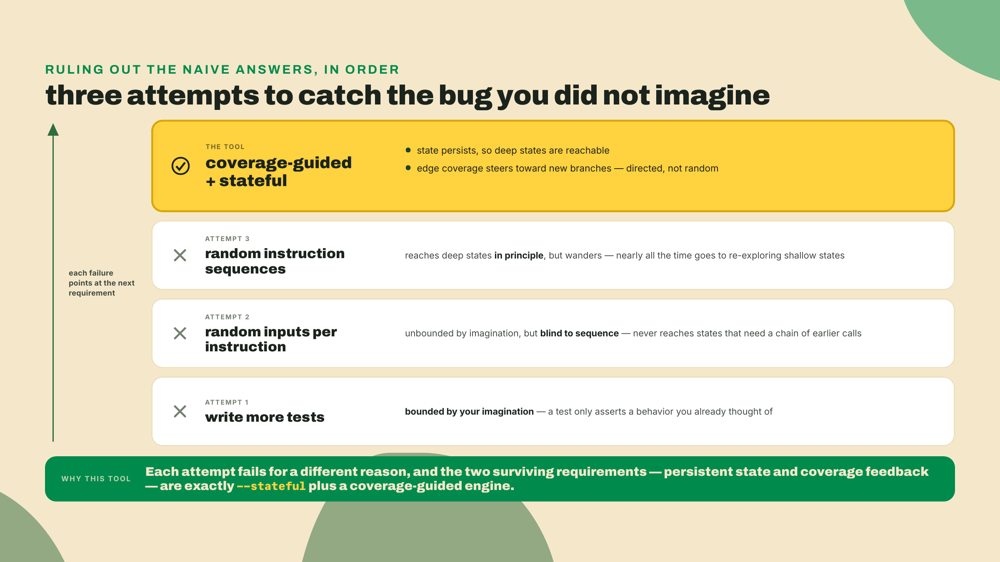

### What actually runs when you type `anchor fuzz`

Before you trust a tool with your program's security, know what it is. `anchor fuzz` is not a thin wrapper around random bytes. It runs Crucible, a coverage-guided fuzzer built by Asymmetric Research and wired into the Anchor CLI as a subcommand. Under Crucible sits a LibAFL fuzzing engine driving a LiteSVM in-process runtime, with sBPF edge coverage feeding back into input selection. That last part is the difference between a fuzzer that flails and one that learns: edge coverage means the fuzzer sees which branches of your compiled program each input reached, and it steers toward inputs that reach new branches. Random becomes directed.

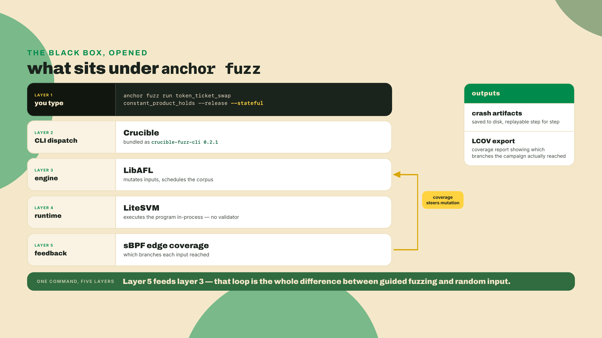

The engine has one job that a unit test cannot do: it generates action sequences, not single inputs. You describe the actions your program supports (deposit, swap, withdraw) and the properties that must always hold (the invariants), and the fuzzer chooses which actions to fire, in which order, with which arguments, then checks every invariant after each action. A bug that needs three specific calls in a specific order to appear is a bug your hand-written tests almost never reach, because you would have to imagine it first to write it.

### Stateless versus stateful, and why the flag matters

Crucible's default is *stateless*, and the name is more precise than it sounds. Stateless does not mean one action per run. Each iteration clones the post-`setup` snapshot and executes a whole mutated sequence against that fresh copy, up to `--max-actions` (default 8), then throws the world away. So sequences are on the table by default. What is *not* on the table is depth: every iteration restarts from the same shallow snapshot, so a state that takes forty trades to reach is forty times further away than the budget allows, and the search re-pays for the first eight steps on every single attempt.

So the real question is narrower than "does the input break it." It is: does any reachable *state* break it, including states that only exist deep down a chain of otherwise-valid calls? A drained-then-refilled pool, a partially-initialized position, a rounding residue that accumulates over forty trades. That is what `--stateful` turns on. In stateful mode Crucible keeps a coverage-indexed pool of live program states (`--pool-size`, default 256,000) and applies one mutated action per iteration to a state it picked out of that pool, so progress compounds instead of resetting: chains grow to `--max-depth` (default 15) and the deep states become reachable at all. Asymmetric Research reports roughly an order-of-magnitude throughput gain for it, paid for in memory as the pool grows with coverage.

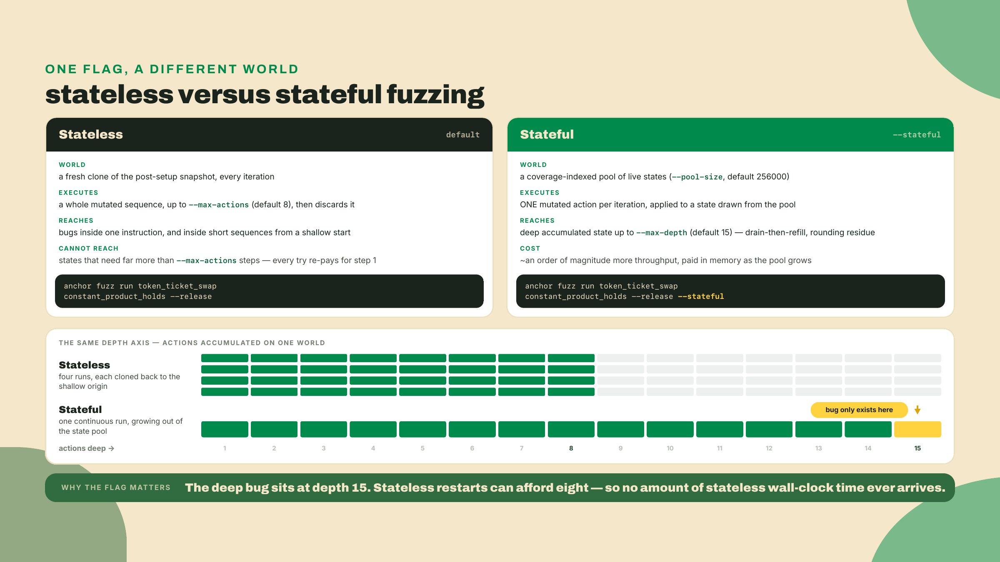

Forgetting `--stateful` is the quiet failure mode. Your run comes back clean, you feel safe, and the deep half of the state space was never in budget. Clean without `--stateful` means "no bug found within eight actions of a fresh pool," which is a much smaller claim than the one you think you are making.

## Lab: the crash-then-clean loop

Everything below runs against the swap, the one program last lesson classified but never actually attacked. Work through it in order. The first six steps I do with you; the invariant hole in step five is where the fade begins.

### 1. Install the CLI that actually carries `anchor fuzz`

Get this toolchain fact right before you type anything, because getting it wrong costs an afternoon. Anchor has two live lines this course keeps naming: the 2.0.0-rc.1 release candidate you have been building against, and the V1 line, which moved past 1.1.2 to **1.2.0, released 2026-09-04**. **`anchor fuzz` rides the V1 line, not the RC.** Checked 2026-09-07 against the published crate: `anchor-cli` 1.2.0's manifest depends on `crucible-fuzz-cli = "0.2.1"` and its command enum dispatches `Command::Fuzz` into it, while the 2.0.0-rc.1 CLI ships `anchor test --profile`, `anchor debugger`, and `anchor coverage` and has no `fuzz` subcommand at all. The 1.1.2 that many machines carry does not have it either: Crucible landed after that tag.

So you install a second CLI. Until 1.2.0 shipped this meant a `--branch master` git build; now it is a pinned release, which is strictly better because a released version cannot move under you. Both builds install a binary called `anchor`, so send this one to its own root instead of letting it overwrite your RC, and put that root first on `PATH` for the duration of this lesson:

```bash
# The CLI that carries `anchor fuzz` (Crucible) is the V1 line, not the V2 RC.
cargo install anchor-cli --version 1.2.0 --locked --root ~/.anchor-fuzz
export PATH="$HOME/.anchor-fuzz/bin:$PATH"   # this shell only; drop it to get the RC back
anchor fuzz --help   # unknown-subcommand error = you are running the wrong CLI
```

Freshness note, and read it before you pin: both lines move, and which one carries the fuzzer is exactly the sort of thing that changes between releases. Re-run `anchor fuzz --help` against whichever CLI you have before you conclude the subcommand is missing; when the V2 tree picks Crucible up, this two-CLI dance collapses back to one. Nothing downstream in this lesson depends on which CLI hosts it, because the harness, the invariants, and the crash artifacts are all Crucible's. If your CLI has no `anchor fuzz`, install Crucible's own CLI and substitute `crucible` for `anchor fuzz` in every command below:

```bash
git clone https://github.com/asymmetric-research/crucible
cd crucible && cargo install --path crates/crucible-fuzz-cli
```

One thing that does *not* change with the CLI you install: Crucible traces sBPF edges on the compiled `.so` and generates its typed call bindings from a standard Anchor IDL, so it does not care which Anchor line built the program you point it at. Which gives you the working rule for the rest of this lesson: build the swap in a shell *without* the `PATH` override, so `anchor build` stays the V2 RC, and run every `anchor fuzz` command in the shell that has it.

### 2. Run the audit checklist and record every row

Go back to the table above and fill the last column. Several rows should already pass on the swap because module 5 built them that way: the token program is a typed `Interface`, the reserve math is `checked_*`, the pool bump is stored. Last lesson only *mapped* the remaining classes onto R4's fields — it patched the escrow, not the swap. Do not take any of that on trust, which is the entire discipline of the row.

Row 1 is the `FAIL` the opener already walked you into, and this is where you fix it, before you fuzz, because the fuzzer is about to lean on exactly this kind of gap. It is three edits, all shapes you have written before:

```rust
// 1. programs/token-ticket-swap/src/lib.rs - the pool records what it owns.
#[account]
#[derive(InitSpace)]
pub struct Pool {
    pub arcade_mint: Address,     // 32
    pub ticket_mint: Address,     // 32
    pub arcade_reserve: Address,  // 32  NEW
    pub ticket_reserve: Address,  // 32  NEW
    pub bump: u8,                 //  1
    pub _pad: [u8; 7],            //  7  explicit Pod padding (129 -> 136)
}

// 2. in init_pool, beside the two mints and ctx.bumps.pool:
pool.arcade_reserve = *ctx.accounts.reserve_arcade.address();
pool.ticket_reserve = *ctx.accounts.reserve_ticket.address();

// 3. in SwapArcadeForTickets, pin each reserve to the record. Keep the token::
//    lines: they say what the account holds, the address says WHICH one it is.
#[account(
    mut,
    address = pool.arcade_reserve @ SwapError::WrongReserve,
    token::mint = mint_arcade,
    token::authority = pool,
)]
pub reserve_arcade: InterfaceAccount<TokenAccount>,
#[account(
    mut,
    address = pool.ticket_reserve @ SwapError::WrongReserve,
    token::mint = mint_ticket,
    token::authority = pool,
)]
pub reserve_ticket: InterfaceAccount<TokenAccount>,
```

Add a `WrongReserve` variant to `SwapError` while you are in there. One consequence to expect rather than discover: `Pool` just grew by 64 bytes, so any pool account created before this edit no longer matches `INIT_SPACE` and will not load. Every pool you have made so far lives inside a LiteSVM test that builds a fresh one each run, so here that costs you nothing — but note the shape of the trap for later, because the pool PDA derives from `[POOL_SEED]` alone and is therefore one fixed address per program: put a pool on a cluster and the only ways back are closing it or deploying to a new program id. There is no in-place resize on this path. Module 8's client lab decodes this record with `fetchPool`, so the two reserve addresses you start storing here are the ones it reads back.

Now the rest. Write the line number that proves each remaining row. Row 2 is the next one to look hard at: find every `UncheckedAccount` in the accounts struct and confirm each has an `address`, `owner`, or `constraint`. If one is bare, that is a `FAIL` too, and it gets fixed here as well.

Checkpoint: `audit-checklist.txt` has seven rows and every row carries a line number, not a blank and not a maybe. Any `FAIL` you wrote is fixed and re-checked before step 3.

A green checklist is the entry ticket, not the finish line. It proves the structural classes are handled. It says nothing about whether your swap math preserves the constant product, and that is what the fuzzer is for.

### 3. Scaffold the fuzz harness

```bash
# Generate a fuzz harness template for the `swap` program.
anchor fuzz init token_ticket_swap
```

This writes a standalone fuzz workspace at `fuzz/token_ticket_swap/` (harness in `src/main.rs`, the program's IDL in `idls/`, crash artifacts later in `crashes/`) with a `Cargo.toml` that depends on the Crucible harness library. Two things in that file to check by hand, because both bite silently:

```toml
# fuzz/token_ticket_swap/Cargo.toml
[dependencies]
crucible-fuzzer = "0.2.1"    # harness library; version-locked with the CLI (crucible-fuzz-cli 0.2.1)

[features]
constant_product_holds = []  # ONE feature per fuzz test, named EXACTLY like the test function
```

The feature line is the one people lose an hour to: every fuzz test must be declared as a feature whose name matches the test function's name character for character, or the CLI will not find the test you are trying to run.

Freshness note: `0.2.1` is the current stable of both `crucible-fuzzer` and `crucible-fuzz-cli` on crates.io as of 2026-08-22, and a `0.3.0-alpha.1` line is already published. They move together, so re-check what the scaffold writes after any CLI rebuild rather than assuming this pin.

Scaffolding also unlocks the rest of the `anchor fuzz` command family, and it is worth seeing the whole map now so you know what each one is for when you need it later in the loop.

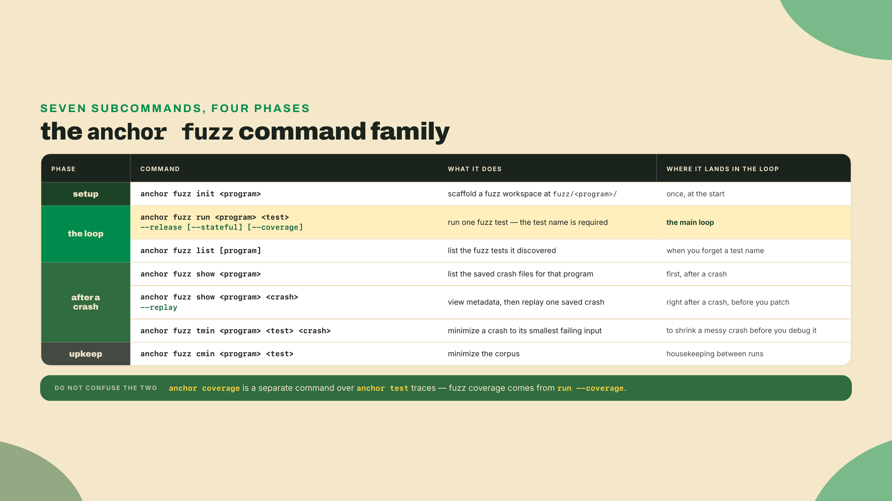

### 4. Seed a known overflow so you can watch the fuzzer earn its keep

Do not fuzz a clean program first. Seed a bug you understand, confirm the fuzzer catches it, and only then trust a clean run. This is the same discipline as watching a test fail before you make it pass.

Here is the swap's constant-product math. This is `swap_out`, the same function you have carried since you built R4, moved into its own `src/math.rs` for this lesson so the seeded edit is a one-line diff in a file nothing else touches. The invariant is `k = reserve_in * reserve_out`, and a trade must never let `k` shrink. Because the swap charges 0.3%, the fee stays in the pool, so in practice `k` grows a little on every trade; `k_now >= k_before` is the assertion that is true either way.

That assertion also collects a debt from module 5. m05-l3 warned that a transfer-fee mint quietly voids the received-what-you-sent assumption, so the pool credits less than the trader sent "and your invariant drifts" — and then dropped the thread, because you had no invariant yet. This is it. Point the swap at an arcade mint carrying a transfer fee and the reserve grows by less than `amount_in` while the ticket side pays out an `out` quoted from the full `amount_in`: `k` genuinely shrinks, and `k_now >= k_before` is the line that goes red. The orphaned warning from module 5 and the assertion you are about to write are the same fact, two modules apart.

```rust
// programs/token-ticket-swap/src/math.rs  (correct: the swap_out you built, with its fee)
pub fn swap_out(reserve_in: u64, reserve_out: u64, amount_in: u64) -> Result<u64> {
    // 997/1000 is the 0.3% fee: the withheld 3/1000 stays in the pool, which is
    // exactly why k grows rather than staying equal.
    let amount_in_with_fee = (amount_in as u128)
        .checked_mul(997)
        .ok_or(SwapError::Overflow)?;

    // The product is held in u128 so it cannot wrap a u64.
    let numerator = amount_in_with_fee
        .checked_mul(reserve_out as u128)
        .ok_or(SwapError::Overflow)?;

    let denominator = (reserve_in as u128)
        .checked_mul(1000)
        .ok_or(SwapError::Overflow)?
        .checked_add(amount_in_with_fee)
        .ok_or(SwapError::Overflow)?;

    let out = numerator
        .checked_div(denominator)
        .ok_or(SwapError::DivByZero)?;

    u64::try_from(out).map_err(|_| SwapError::Overflow.into())
}
```

Now seed the bug. Replace the checked `numerator` line with a raw `u64` multiply:

```rust
// programs/token-ticket-swap/src/math.rs  (seeded bug - DO NOT SHIP)
let numerator = ((amount_in * 997) * reserve_out) as u128; // u64 math wraps FIRST; the cast launders it
```

A `u64 * u64` that exceeds `u64::MAX` wraps rather than promoting, so for large-but-plausible reserves the numerator collapses to a small value, `out` comes back wrong, and the pool's `k` drops. The trailing `as u128` is what keeps the crime quiet: it runs *after* the damage, converting the already-wrapped value into the type the surviving `checked_div(denominator)` expects, so the edit stays one line and the build stays green. A human reading this line sees a multiply and a cast. The fuzzer sees a number line and will walk right off the edge of it.

One build detail decides whether this wraps or panics, and it is the same one from last lesson: Anchor's generated workspace sets `overflow-checks = true` on the release profile, so on an untouched scaffold this panics. A panic still trips the fuzzer, so the exercise works either way, but the crash you get is an abort rather than an invariant violation. To see the silent-wrap version, the one that is genuinely scarier, set `overflow-checks = false` in the workspace `[profile.release]` before you build, and put it back afterwards. Note that as its own line in the checklist file: which of the two you saw is a fact about your build, not about the bug.

Checkpoint: `anchor build` succeeds and your existing swap tests still pass, because they all trade against a 1,000,000 / 1,000,000 pool where nothing gets near `u64::MAX`. That is the unsettling part and the reason you seeded it: the bug is in, the suite is green, and nothing you already wrote noticed. If the build fails instead, you also changed the casts on the lines around it, and the seeded bug needs to be exactly one line.

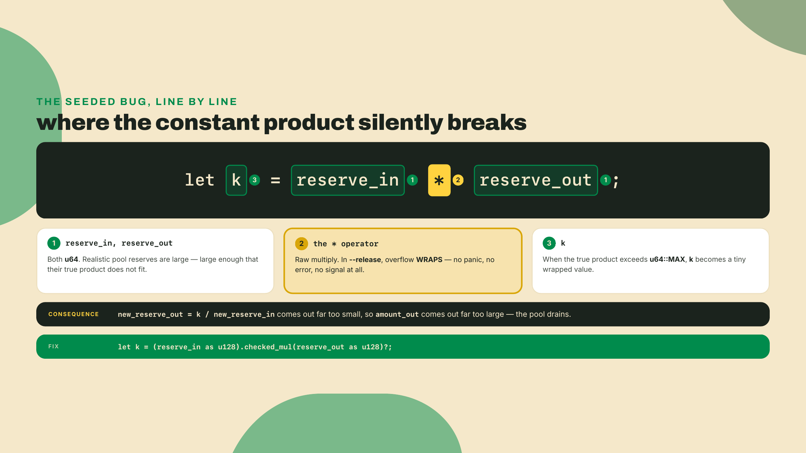

### 5. Complete the invariant and run it (the fade starts here)

Open the harness the scaffold wrote. It has actions already discovered from your program and one invariant with a hole in it. The Crucible shape is small: a fixture struct, an `impl` block where any method named `action_*` becomes a state transition the fuzzer can fire, and an `#[invariant_test]` function that runs after every action.

<!-- verify: expect-fail fuzz scaffold with a deliberate TODO - the reader adds prev_k and its initializer -->
```rust
// fuzz/token_ticket_swap/src/main.rs
use crucible_fuzzer::*;

#[derive(Clone)]
struct SwapFixture {
    ctx: TestContext,
    pool: Pubkey,
    reserve_arcade: Pubkey,
    reserve_ticket: Pubkey,
    prev_k: u128,          // YOU add this field; nothing else in the scaffold needs it
}

#[fuzz_fixture]
impl SwapFixture {
    pub fn setup() -> Self {
        // Deploys the swap, creates a pool with starting reserves, funds traders,
        // and returns the fixture. (scaffolded, except the last line.)
        let mut f = Self { /* scaffolded */ };
        f.prev_k = f.k();      // YOU add this: seed the baseline before any trade
        f
    }

    // Any `action_*` method is auto-discovered as an action the fuzzer can choose.
    pub fn action_swap(&mut self, #[range(0..4)] trader: usize, amount_in: u64) {
        // Fires one swap with a fuzzer-chosen trader and amount. (scaffolded.)
        // The invariant below runs AFTER this returns, so do not update prev_k here;
        // the invariant updates it once it has compared.
    }

    // Reads the two reserve token accounts back and returns their amounts.
    pub fn reserves(&self) -> (u64, u64) {
        let a = self.ctx.token_amount(&self.reserve_arcade);
        let b = self.ctx.token_amount(&self.reserve_ticket);
        (a, b)
    }

    pub fn k(&self) -> u128 {
        let (a, b) = self.reserves();
        (a as u128) * (b as u128)
    }
}

#[invariant_test]
fn constant_product_holds(fixture: &mut SwapFixture) {
    let k_now = fixture.k();

    // TODO (yours): assert the constant product never SHRINKS across a trade,
    // then update prev_k so the next action compares against this one.
    // Use the fuzz_assert_* macros, NOT assert!: a bare assert! panics the whole
    // fuzzer process, while fuzz_assert_* records the violation as a crash and
    // lets the run continue.
    //
    //   fuzz_assert_ge!(k_now, fixture.prev_k);
    //   fixture.prev_k = k_now;
    let _ = k_now;
}
```

The hole is the assertion, and it is the whole point of the harness, so think about what "correct" means before you write it. A swap must never let `k` shrink. Your swap charges 0.3%, so `k` will usually grow; a fee-free one would hold it exactly equal. The assertion that is true under both is `k_now >= k_before`, which is `fuzz_assert_ge!`. Notice where `prev_k` gets updated: in the invariant, after the comparison, not in `action_swap`. Update it in the action and you compare a value against itself and the assertion can never fail, which is the single most common way a fuzz harness comes back clean while doing nothing. Write those two lines, then run the seeded build:

```bash
anchor fuzz run token_ticket_swap constant_product_holds --release --stateful
```

You are watching for the run to stop and report a crash. With the seeded `u64` multiply in place, it will, and fast, because the fuzzer is coverage-guided toward the branch where reserves get large enough to wrap. It hands you a crash artifact: a concrete, minimized, replayable input sequence that violated your invariant.

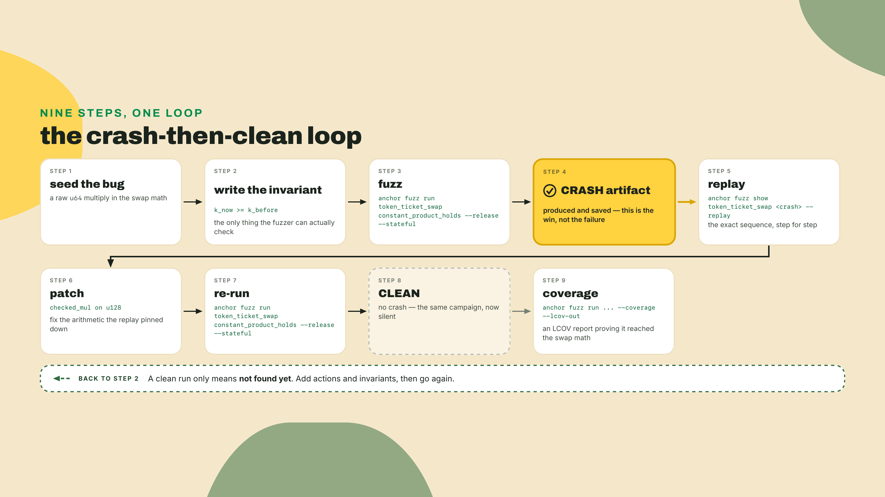

### 6. Replay the crash, patch, and re-fuzz to clean

Replay is not optional. A crash you cannot reproduce is a rumor. Crucible wrote the failing sequence into `fuzz/token_ticket_swap/crashes/constant_product_holds/`, so list what it saved, then replay one exactly:

```bash
anchor fuzz show token_ticket_swap                          # list the saved crashes
anchor fuzz show token_ticket_swap <crash_file> --replay    # re-run that exact sequence
```

Watch it re-run the same trader/amount sequence and trip the same assertion. That is your proof the artifact is real and deterministic. Now patch: put the checked `u128` numerator back exactly as the correct version above, and restore `overflow-checks` if you turned it off. Re-run the same command from step five:

```bash
anchor fuzz run token_ticket_swap constant_product_holds --release --stateful
```

This time it should run without producing a crash. And here is the discipline the whole lesson is built to install: that clean run does not mean "safe." It means "the invariants I wrote, over the actions I defined, for as long as I let it run, found nothing." Say that sentence to yourself every time a run comes back green. Then re-run with coverage on, so you can see how much of the program the fuzzer actually exercised:

```bash
# Same run, with LCOV coverage written out.
anchor fuzz run token_ticket_swap constant_product_holds --release --stateful --coverage \
  --lcov-out ./fuzz-coverage.lcov
```

That LCOV file is a readout of which lines the fuzzer reached, and `genhtml` will turn it into something browsable. Note which command produced it: fuzz coverage comes from `run --coverage`, while the separate `anchor coverage` command reports on `anchor test`'s traces, not the fuzzer's. Either way, coverage tells you where the search has and has not been; low coverage on a critical branch means you have not explored it, not that the branch is safe. Coverage is the map, `--stateful` is the vehicle.

## Challenge

Two parts. The first finishes the loop; the second is you alone.

**Completion.** `k_now >= k_before` is a weak assertion. Your swap charges 0.3%, so it is not merely true that `k` does not shrink, it is true that `k` grows by at least the fee's contribution on any non-zero trade. Tighten the invariant to say that: assert `k_now > k_before` whenever the action actually moved tokens, and `k_now == k_before` when it did not. You will need `action_swap` to record whether the trade succeeded, since a slippage revert is a legitimate no-op.

Then run `anchor fuzz run token_ticket_swap constant_product_holds --release --stateful` and drive it to either a crash you replay and patch, or a clean run with an LCOV report. Watch for the interesting failure mode here: a tighter assertion can crash on a *legitimate* trade, because integer division means a small enough `amount_in` rounds the fee away entirely and `k` genuinely does not move. If that happens, the fuzzer found a bug in your invariant, not in your program, and knowing which one you are looking at is the skill.

**Solo.** Seed exactly one new bug into the swap. Pick something a checklist would not catch: a rounding step that truncates in the pool's favor on every trade, or a fee applied to `amount_out` instead of `amount_in`. Before you run anything, write down your prediction: will the fuzzer find it, and if so, will it need `--stateful`? Then run `anchor fuzz run token_ticket_swap constant_product_holds --release --stateful`, and if it crashes, replay with `anchor fuzz show token_ticket_swap <crash_file> --replay` to confirm the exact sequence. Patch it. Re-fuzz to clean. Compare what happened to your prediction. The rounding bug in particular is a good teacher: a single trade loses a fraction of a lamport, invisible to a single-trade test, but chained across dozens of stateful trades the residue accumulates until your invariant trips.

Accept when: a crash artifact is produced and replayed for your seeded bug, the bug is patched, the target re-fuzzes clean with an LCOV report, and your audit checklist is fully green with a line number on every row.

## Did it work, and what it does not prove

You are done with this lesson when you can show four things: a green checklist, a replayed crash artifact, a clean re-fuzz, and an LCOV report. If your run never crashed on the seeded bug, the usual cause is a missing `--stateful` or an invariant that does not actually assert anything (an `assert!(true)` in disguise). If it crashes and you cannot replay, you patched before you saved the artifact. Fix the order: crash, replay, patch, re-fuzz.

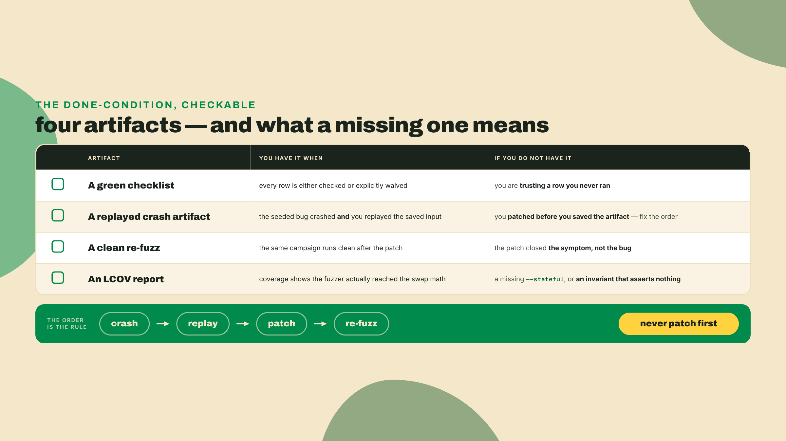

Now the part that keeps you honest, because it is easy to walk away from a green run feeling finished. Fuzzing and a checklist raise your confidence. They never prove the absence of bugs. A clean run means "not found yet," which is a real, useful claim, and a strictly weaker one than "safe." It is worth being precise about the gap. A clean fuzz run is an average-case statement: over the inputs and sequences the fuzzer happened to explore in the time you gave it, no invariant broke. The bug that ruins you is usually a worst-case object, a single narrow input in a corner the search did not reach before you called it a day. Coverage-guided fuzzing narrows that gap by steering toward unexplored branches, but it does not close it, and there is no run length that turns "average-case clean" into "worst-case safe."

The strongest argument for that humility comes from the framework you are standing on. Anchor's own test suite carries Miri witnesses, which check for undefined behavior in unsafe code, and Kani configs, which model-check specific properties. And fuzzing found four correctness bugs in Anchor itself, tracked as issue #4431. The framework is fuzzed and undefined-behavior-checked as hard as it asks you to check your program, and it *still* found four things. If that is true of code written and reviewed by the people who built the framework, assume it is true of yours.

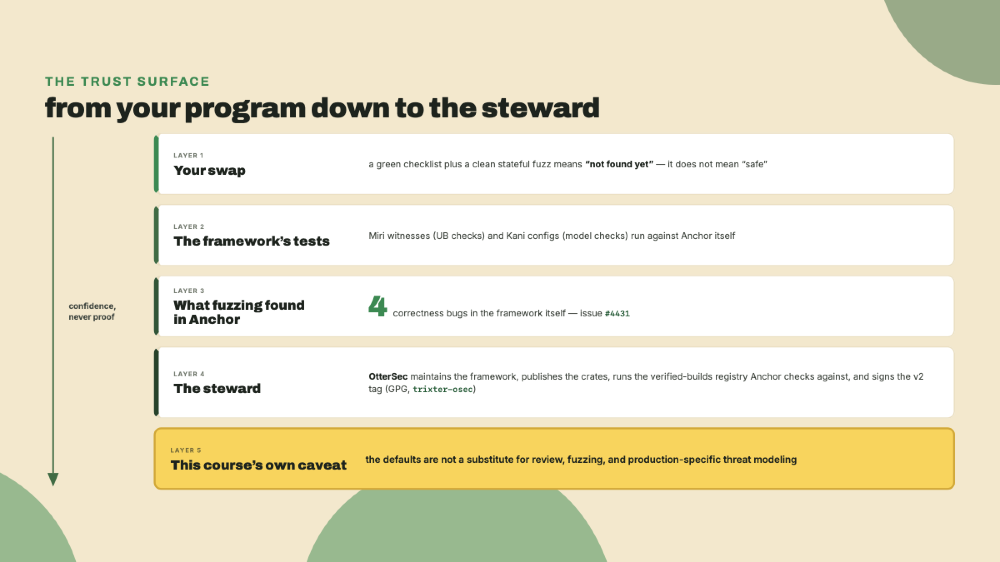

That single steward is itself a fact worth sitting with. OtterSec custodies the framework, publishes the crates, runs the verified-builds registry that `anchor verify` checks against, and signs the v2 tag with a GPG key (trixter-osec). One organization holds a lot of the supply chain, which is efficient and also a concentration you should know about. It pairs with a caveat this course has to supply on its own authority, because the project does not: go looking in the pinned tag and you will find no hedging page at all — the lang-v2 README says "v2 is secure by default for users" and stops. So take the sentence from the audit you just ran rather than from a quote: the defaults are not a substitute for review, fuzzing, and production-specific threat modeling. One steward, an unaudited release candidate, and four fuzzer-found bugs in the framework itself are the whole argument, and they are enough.

Two more honest notes to close the trust surface. First, the guardrails you tried to turn off back in the CU lesson — the flip cargo's feature unification swallowed — are a default-on runtime safety net: they catch things like a wrong-program-id dispatch or mutable access to a read-only account at runtime. Turning them off saves a little binary size and CU, and it removes a net precisely when a fuzzer is most likely to be pushing your program into a bad state. Fuzz with guardrails on. Ship with them off only after fuzzing and review have shown nothing they would have caught is still live. That is a security-versus-speed decision, and now you can make it deliberately instead of by default.

Second, on tooling: you will hear about Trident, Ackee's fuzzer, and it is a real project. But it is not the built-in path, and its release cadence has stalled, the last stable is 0.12.0 from 2025-11-27, with a 0.13.0-rc.4 pre-release sitting since 2026-05-14. Anchor chose Crucible and wired it into the CLI. Reach for `anchor fuzz` first; Trident is a fallback to evaluate, not the default.

The program is now as hard as you can make it by hand and by machine, with the checklist and the fuzzer both green and both honestly labeled as "no bug found yet." That is the right place to leave it, because the next threat is not in the code. Next module, the swap leaves your machine: you generate a typed client so other people can call it, prove a verifiable build so they can trust the bytecode matches the source, and reason about who holds the upgrade key, which is the one attack surface no amount of green fuzzing can close.
