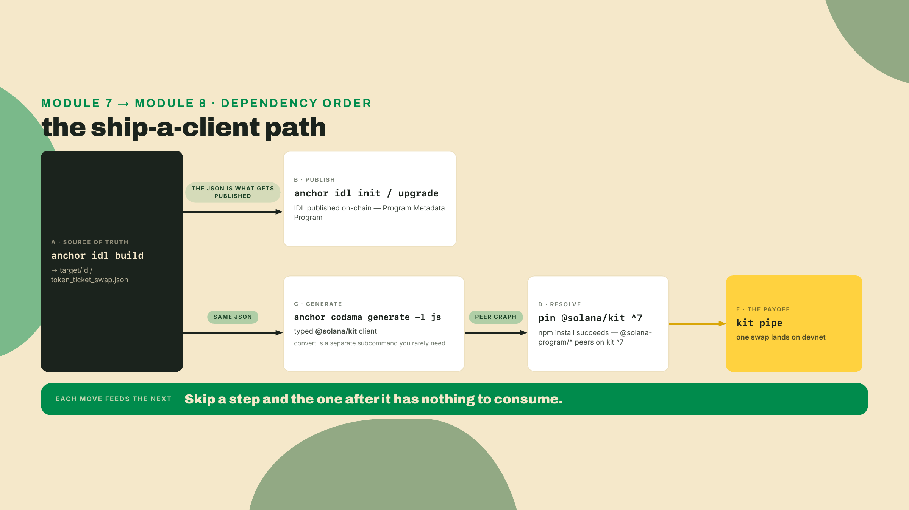
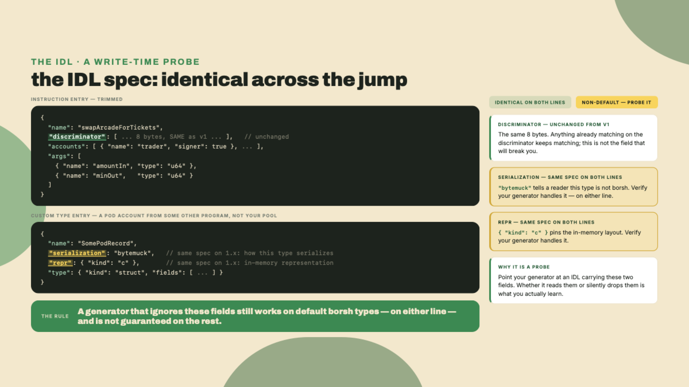
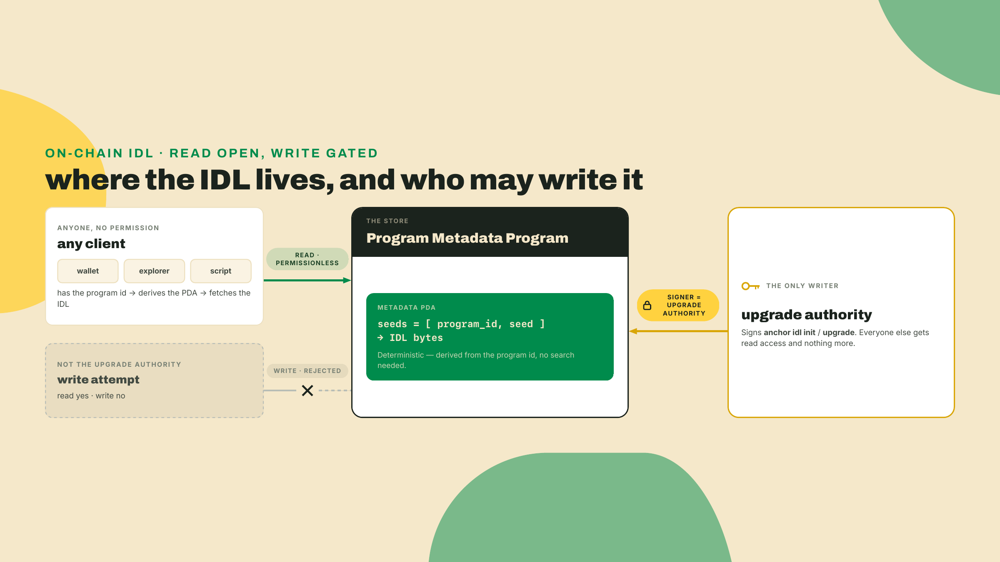
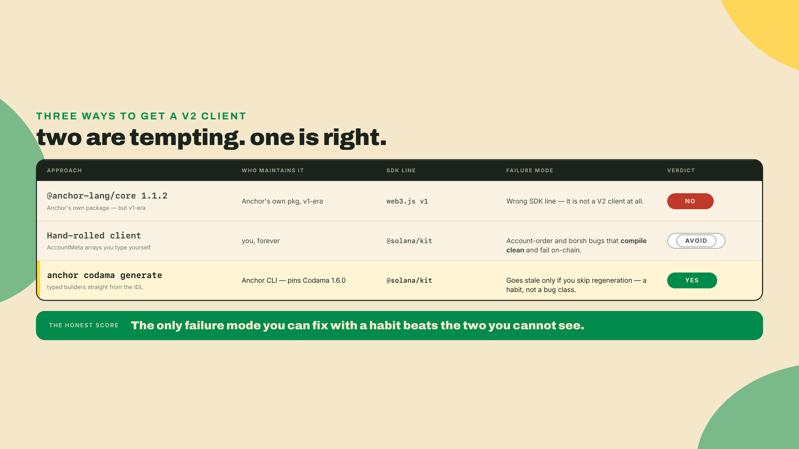
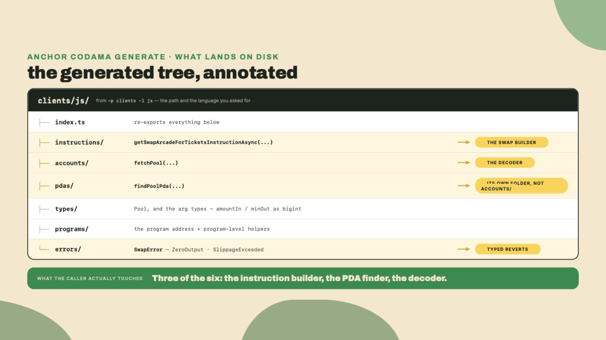
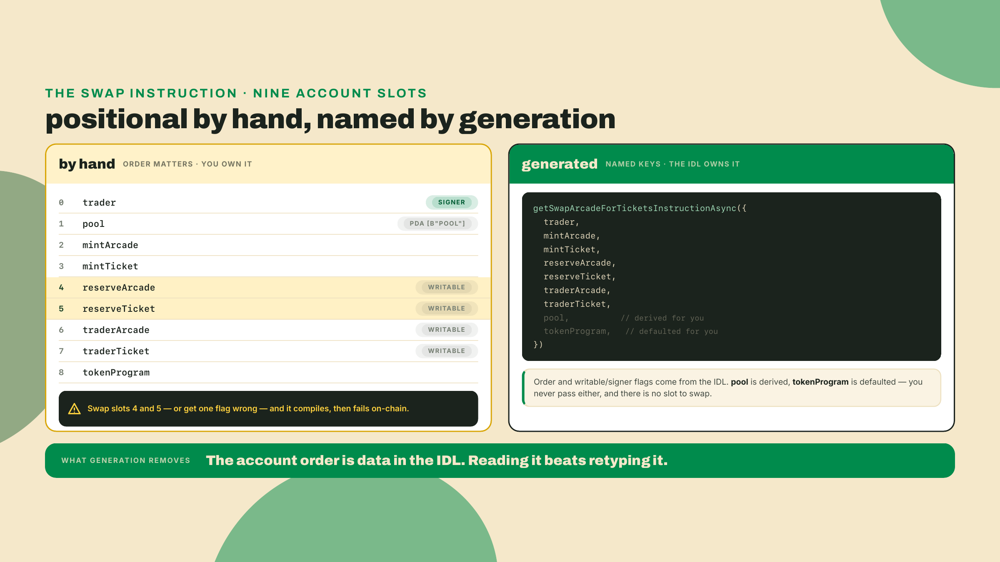
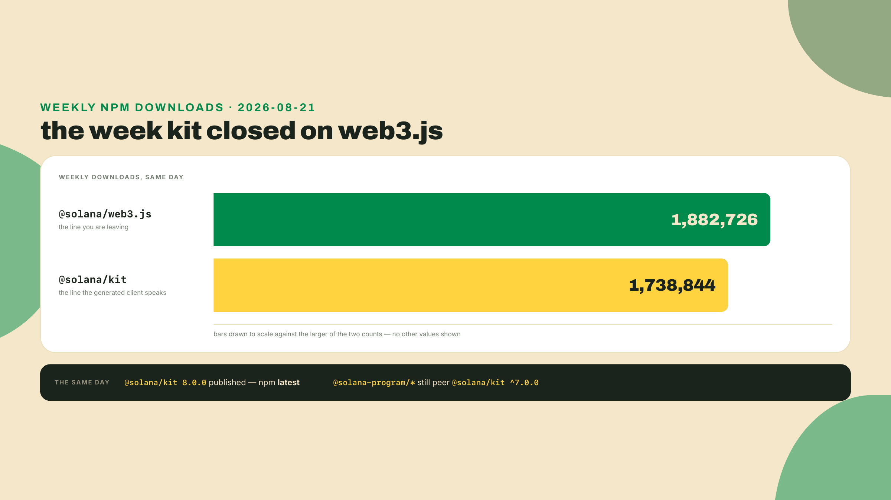
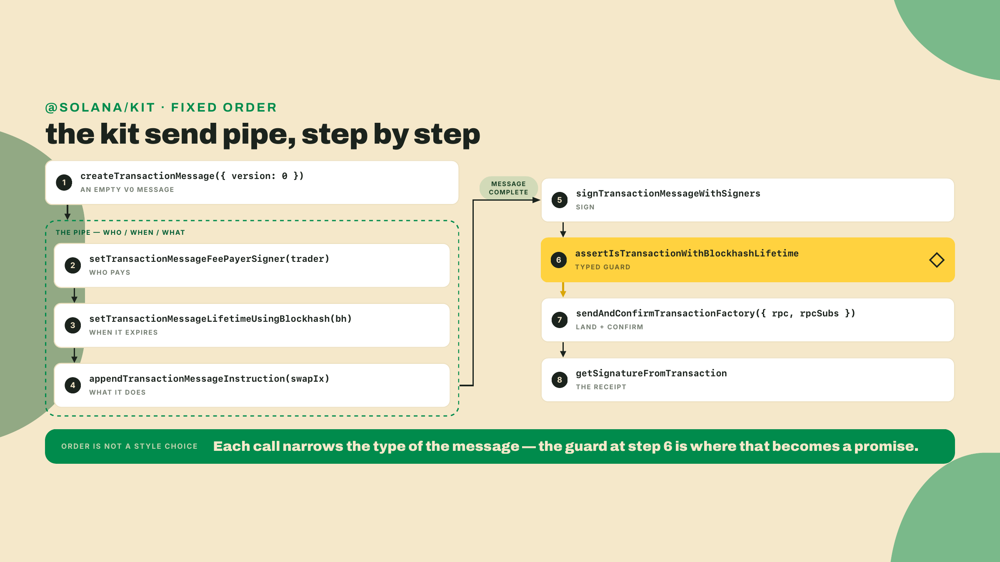

# Ship a client: the IDL, Program Metadata, and a Codama/kit client

Last lesson you ran the audit checklist against the swap with a line number on every row, then drove `anchor fuzz` until a seeded bug produced a crash artifact you replayed, patched, and re-fuzzed clean. R4 is hardened. It survives the trades you throw at it and reverts the ones it should. And it is completely unreachable by anyone who is not you, sitting at this terminal, running a Rust test harness. A hardened program that only your own tests can call is a locked vault with the key still in your pocket.

So the job now is a client. A real caller. And here is the trap you walk into the moment you reach for one, so let me have you feel it before I explain it. Open a terminal in your workspace and run these two commands:

```bash
npm view @solana/kit version
npm view @solana-program/token@0.15.0 peerDependencies
```

The first tells you the newest `@solana/kit` on npm, which as of 2026-08-22 is `8.0.0`, and the second tells you what `@solana-program/token` actually asks for: `{ '@solana/kit': '^7.0.0' }`. Read those two outputs next to each other. The newest kit is the one version your dependencies do not want. Install the number npm calls `latest` and your `npm install` throws a peer-dependency error before you write a single line of client code. That gap, and how to ship anyway without lying to yourself about it, is most of this lesson.

## Summary

You are going to give R4 a caller. Four moves, in dependency order, because each one needs the one before it:

1. Build the program's **IDL**, the JSON contract that describes every instruction and account.
2. **Publish that IDL on-chain** through the Program Metadata Program, so any client can fetch your interface from the cluster instead of from your repo.
3. **Generate a typed `@solana/kit` client** from the IDL with `anchor codama`, because there is no official Anchor V2 TypeScript package and the thing that looks like one is not one.
4. **Pin kit correctly** and send exactly one swap through the generated builder against your devnet deploy.

The fade this lesson runs: steps 1 through 4 of the Lab are fully worked, every command real and every checkpoint checkable. Step 5, the kit send pipe, is a completion problem: you get the whole skeleton with the three load-bearing lines blanked. Then the Challenge is solo, a self-contained file where you resolve the correct kit version to pin from a peer range and assemble the call with no worked answer in front of you.

One honest note up front, because it colors everything: Anchor V2 is a weeks-old release candidate, and the client tooling around it moves faster than the framework. Every version number here carries the date I verified it. When you reach this lesson, re-run the two commands above. The numbers will have moved. The *rule* will not, and the rule is the thing you are here to learn.

## The ship-a-client path

Before you drive the route, look at the map. The four moves are not independent. The IDL is the input to publishing it and the input to generating the client. The generated client is the input to the send. Get them out of order and you will be regenerating a client against an IDL you never refreshed, which is the single most common way a generated client ships a call that no longer matches the program.



Notice the shape. Publishing (B) and generating (C) both branch off the IDL, and they are independent of each other. You can generate a client without ever publishing the IDL on-chain, and you can publish without generating. We do both because they serve different callers: publishing serves *anyone*, generating serves *you*. Keep that split in mind, it is the answer to two of the check questions at the end.

### The IDL is the contract, and v2 deliberately left it alone

An IDL (Interface Description Language) file is a JSON description of your program: its address, its instructions with their arguments and required accounts, its account layouts, its error codes, and the discriminators for each. It is the machine-readable version of everything you would otherwise have to read out of `lib.rs` by hand. Build it with the CLI:

```bash
anchor idl build --program-name token_ticket_swap -o target/idl/token_ticket_swap.json
```

Here is the part that matters for a framework course, because the expectation runs the other way. A ground-up `no_std` rewrite sounds like it should have forked the interface format, and it did not: the v2 IDL keeps the **same 8-byte discriminators** as v1 by default, and the IDL *spec* itself is untouched — the spec source in the pinned v2.0.0-rc.1 tag is byte-for-byte identical to the one in the 1.1.2 baseline. That identity includes the `serialization` and `repr` fields, the ones describing how types serialize and how enums are laid out in memory: both predate V2 (they arrived with the 0.30-era spec rewrite) and both lines carry them at the same place in the same file. V2's actual delta in this module is not in the JSON at all; it is in how the JSON reaches the world — the CLI's publishing path through the Program Metadata Program, which the next section walks. The stability is the feature: a call built against a v1-era IDL still targets the right instruction under a v2 program, and a v2 IDL drops into any tool that already reads the modern spec.

If the discriminator staying stable sounds like a footnote, remember what you did when you computed a discriminator preimage by hand earlier in this course: you hashed the instruction's namespaced name and watched the first eight bytes become the selector the runtime routes on. Those exact eight bytes are what the IDL carries in every instruction's `discriminator` array. That is why a v1-era call still lands against a v2 program: the selector did not move, and neither did the description wrapped around it. A generated client reads those bytes straight out of the IDL, so you never hand-type a discriminator again, and you never fat-finger one into a call that silently targets the wrong instruction.



So this is a write-time probe, not a fact you can freeze from me. Before you trust a generated client for a program that uses non-default serialization or a custom `repr` — fields the modern spec has carried since the 0.30 era, on both lines — confirm your generator version consumes them. For the swap you are shipping, `Pool` is a plain borsh struct and `swap_arcade_for_tickets` takes two `u64`s, so you are safely inside what every generator handles. The moment you ship a program that is not, that probe is on you.

### Put the IDL on-chain so anyone can call you

You have a JSON file. A JSON file in your repo helps exactly the people who have your repo. To let a wallet, an explorer, or a stranger's script resolve your interface from nothing but your program id, the IDL has to live on the chain.

Think of it the way a city handles a building. Anyone can draw a blueprint, but the blueprint that *counts*, the one a contractor can pull and build against, is the one filed with the city under the building's address, amendable only by the owner of record. Solana's version of that filing cabinet is the **Program Metadata Program**. Anchor dropped its own built-in IDL instructions back in 1.0, and V2 inherits that removal: the IDL is stored through this program, at a deterministic address derived from your program id, writable only by the program's upgrade authority. So when you type `anchor idl init` in a moment, the verbs are old but the machinery is not — the 0.x-era commands of the same name wrote to Anchor's own on-chain IDL accounts, the mechanism 1.0 removed, while this CLI reuses the verb names as a front end for the Program Metadata Program, which is why teaching them here does not resurrect the retired path.



The commands are the `idl` subcommand of the Anchor CLI. First publish creates the on-chain account; later edits upgrade it:

```bash
# First time: create the on-chain IDL account and write the IDL into it
anchor idl init -f target/idl/token_ticket_swap.json <YOUR_SWAP_PROGRAM_ID> \
  --provider.cluster devnet

# Later, after any program change that touches the interface
anchor idl upgrade -f target/idl/token_ticket_swap.json <YOUR_SWAP_PROGRAM_ID> \
  --provider.cluster devnet

# Prove it: fetch the IDL back from the chain, by program id alone
anchor idl fetch -o fetched.json <YOUR_SWAP_PROGRAM_ID> --provider.cluster devnet
```

Under the hood these write through the Program Metadata Program. Checkpoint: after `idl init`, that last `idl fetch` command pulls your IDL out of the cluster into `fetched.json` using nothing but the program id. Diff it against `target/idl/token_ticket_swap.json` and it should match. If `idl init` fails saying the account already exists, the usual culprit is not some forgotten session of yours: the RC's `anchor deploy` uploads the IDL by default whenever `target/idl/<name>.json` exists, so a plain deploy has already published for you. Either pass `--no-idl` at deploy time to keep publishing an explicit step (what this course's lab does), or accept the auto-upload and use `idl upgrade` for every later edit. If it fails on authority, the wallet you are signing with is not the program's upgrade authority, and only that key may write.

There is a real trade-off in publishing, and I would rather you hear it from me than a support thread. The IDL account costs rent, and the on-chain copy is only as current as its last publish. On the `--no-idl` flow this lab runs, that means your last `idl upgrade`: publish once, change the program, forget to upgrade the IDL, and now every client that trusts the chain builds calls against a stale interface. On-chain IDL is a commitment to keep it fresh, not a fire-and-forget.

### The honest state of Anchor's TypeScript client

Now the client itself, and this is where I have watched more people lose an afternoon than anywhere else in the V2 story. Let me walk you up the ladder the way you would actually climb it, wrong rung first.

You have written Anchor clients before. In the 0.x world you imported the Anchor TypeScript package, handed it your IDL, and called `program.methods.swap(...)`. So the obvious move is to find the V2 version of that package and do the same. You search, you find `@anchor-lang/core`, npm latest `1.1.2` as of 2026-08-22, it is the renamed successor to the old `@coral-xyz/anchor`, and it looks exactly right.

It is not right. `@anchor-lang/core` at `1.1.2` still depends on `@solana/web3.js` v1. It is the v1-era client wearing a new name. Anchor publishes a TypeScript client, but not a V2 one: `@anchor-lang/core` is real, official, and on the v1 line, and nothing has replaced it for V2. Reach for the thing that looks official and you have quietly pinned yourself back to web3.js v1, the SDK line V2 exists to move off of.

The next-most-obvious move is to hand-write the client: encode the discriminator, borsh-serialize `amountIn` and `minOut`, assemble the `AccountMeta` list in the exact order the program expects, derive the pool PDA yourself. It works. It is also how a swap call ends up carrying the accounts in the wrong order or an off-by-one in the account metas, a class of bug that compiles clean and fails only on-chain. The hand-rolled client is boilerplate you rewrite, and get subtly wrong, for every instruction, and that cost is a big part of why first-party client generation exists at all.

Carry one dissent with you into the path we are about to take, because it is aimed at that path and not at the one you just rejected. ChewingGlass, in Anchor discussion #3742: "Codama doesn't resolve has_ones. Anchor does... I still feel quite boilerplate-y fetching and passing heaps of accounts in codama. Boilerplate kills new devs." That is a fair charge and it is worth holding while you use the tool. A generated kit client still makes you fetch and pass accounts that a v1-era `program.methods` call would have resolved from constraints for you. Generation buys correctness on the account order, the flags, and the encoding. It does not buy back the ergonomics of the old TypeScript client. Take the correctness, and stay annoyed about the rest.

So the real path, the one the Anchor CLI ships, is **Codama**. Codama is a client generator: it reads an IDL and emits a typed client. Anchor's CLI wraps it in two subcommands, so you do not install or configure Codama separately, the CLI pins the version it uses (`CODAMA_VERSION = 1.6.0` inside the CLI as of 2026-08-22) and drives it for you.



Two commands. The first converts the Anchor IDL into Codama's own IDL tree. The second runs that conversion in-process and then renders the client:

```bash
# Convert the Anchor IDL to a Codama IDL (inspect it if you like)
anchor codama convert target/idl/token_ticket_swap.json --out codama-idl.json

# Convert + render a JavaScript/TypeScript client into clients/
anchor codama generate -l js -p clients target/idl/token_ticket_swap.json
```

Two commands, not one, and the split is deliberate. `convert` is the honest half you can inspect: it writes the Codama IDL to a file you can open and diff, so when a generated call looks wrong you can see whether the fault is in the conversion or in your program. `generate` runs that same conversion in-process and then hands it to Codama's renderers, so in day-to-day work you run only `generate`. Reach for `convert` the day a generated builder surprises you and you want to read what Codama thinks your program is.

What lands under `clients/` is not a blob. The `-p` flag names a base directory and the CLI writes each language to `<base>/<language>`, so `-p clients -l js` renders into `clients/js/`. Inside it, Codama emits a directory you can read, one folder per kind of thing in your program:



The builder is named after your instruction. `swap_arcade_for_tickets` becomes `getSwapArcadeForTicketsInstructionAsync`. The `-Async` suffix is Codama's convention for the variant that resolves what it can for you: it derives the `pool` PDA from its seeds and fills default program addresses, so you pass the accounts only you can know (the trader, the mints, the reserve and trader token accounts) and it assembles the rest. That is the whole point of generation. The account order, the discriminator, the borsh encoding of `amountIn` and `minOut`, the PDA derivation, all of it comes out of your IDL instead of out of your memory.

Put the reason on the page, because this is where hand-rolling actually bites. The swap's `#[derive(Accounts)]` lists nine accounts in a fixed order, and the runtime matches them positionally, by slot, not by name. Hand-roll the call and you are retyping that order into an `AccountMeta` array from memory, where swapping `reserve_arcade` and `reserve_ticket`, or marking `trader` read-only when it must sign, compiles clean and fails only when the trade hits the chain. The generated builder reads the order and the writable/signer flags out of the IDL and asks you for each account by name. The two reserves you must never confuse arrive as `reserveArcade` and `reserveTicket`, labeled, in the one place a typo would otherwise be invisible.



### The kit pin: match your peers, never chase latest

Now back to the trap you felt at the top of this lesson, because now you have the pieces to understand it. The generated client is a `@solana/kit` client, and it leans on the `@solana-program/*` packages (`@solana-program/system`, `@solana-program/token`) for the system and token pieces. Those packages declare a peer dependency on kit. As of 2026-08-22, `@solana-program/system@0.13.0` and `@solana-program/token@0.15.0` both peer on `@solana/kit` `^7.0.0`. And npm's `latest` kit is `8.0.0`, published 2026-08-21.

So the newest kit and the kit your dependencies want are different majors. This is not a fluke of one bad week, it is the normal texture of a fast-moving SDK: the core library ships a new major ahead of the ecosystem that peers on it. Look at the week it happened.



Both halves of that chart are true in the same week: the download crossover says kit is where the ecosystem is going, and the peer ranges say do not chase its version number.

So the durable rule, the one thing to carry out of this lesson if you carry nothing else: **pin `@solana/kit` to the major your `@solana-program` dependencies declare, never to `latest`.** It is the same law two sibling courses teach from their own seats — Payments and Commerce applies it per workspace, where two workspaces in one repo legitimately pin different kit majors because each matches its own peers, and Rust & TypeScript Fundamentals derives it from how npm peer ranges resolve in the first place. Today that major is 7. Install it explicitly:

```bash
# Freshness: verified 2026-08-22. kit latest is 8.0.0, but the @solana-program
# packages below peer on ^7, so we pin ^7. Re-run `npm view ... peerDependencies`
# when you reach this; the numbers move, the rule does not.
npm install @solana/kit@^7 @solana-program/system@0.13.0 @solana-program/token@0.15.0
```

Why not just pin `latest` and let npm sort it out? Because of what npm does with a peer dependency. When `@solana-program/token@0.15.0` declares `peerDependencies: { '@solana/kit': '^7.0.0' }`, it is telling your package manager "I will only run against a kit 7". Install kit 8 alongside it and npm cannot satisfy that constraint, so it stops with an `ERESOLVE` peer-conflict error before anything builds. `latest` is a moving target that a kit major bump can turn into exactly that conflict overnight, and it did, the day kit 8 shipped. Pin the number your peers agree on and your install is reproducible until *you* decide to move it, on purpose, after you have checked that the peer ranges moved too. That is the trade you are making everywhere in this course: you give up "always newest" and you get "always resolvable."

### One more interface, already in your hands: declare_program!

There is a second consumer of the IDL that you have already met from the other side. In v1, a program could consume *another* program's IDL at compile time through `declare_program!`, generating a CPI interface from a vendored IDL — one Anchor program calling another by its published interface instead of by matching source versions. That is exactly what your escrow has been doing to the vault since m04-l3, and it is verified working on the 2.0.0-rc.1 line this course pins: the JSON you have been harvesting into `idls/` is an IDL doing the compile-time half of the job this lesson's client-side half describes. The capstone leans on it four rungs wide in m09-l3.

Worth knowing while you are here: the reason the course consumes programs by IDL rather than by source is not taste. The scaffold's source-level `cpi` feature tops out at one consumed program per binary on the RC — a second one collides at link time on an unmangled dispatch symbol — so the IDL path is both V2's own mechanism and the only one that scales to the four-rung floor. Where the same move gets used in anger beyond this course: consuming a live protocol's published IDL directly, which is the DeFi and RWA Engineering course's territory.

## The Lab

Fade check before you start: steps 1 through 4 are worked, you run them and watch each checkpoint go green. Step 5 is the completion problem, the kit pipe with the three load-bearing lines blanked for you to fill. Then the Challenge is solo.

Tooling install at first use. You built the Anchor V2 RC from its git channel back in R0, so this is a confirm, not a fresh install. Remember why there is no `avm use` line here: no GitHub Release was cut for the v2 tag, so the prebuilt binary `avm install` downloads is not there and the fetch 404s.

```bash
# If the RC is not on this machine, rebuild it from the documented channel:
# cargo install --git https://github.com/otter-sec/anchor.git \
#   --tag v2.0.0-rc.1 anchor-cli --locked --force
which anchor       # ~/.cargo/bin/anchor either way (the avm shim lives at the same path) — only proves it's on PATH
anchor --version   # the real check: anchor-cli 2.0.0-rc.1 (freshness 2026-08-22; RC, re-check)
node --version     # anchor codama drives @codama/cli via npx, so Node must be present
```

**1. Deploy the swap, then build and publish its IDL.** R4 has only ever run in LiteSVM and Surfpool, so it needs to be on the cluster before anything here works: the IDL account is keyed to a real program id, and a client needs an address to call. `anchor deploy` uses the workspace program keypair, so the id it prints stays yours for the rest of the course.

```bash
# -p: deploy ONLY the swap. A bare `anchor deploy` loops every program in the
#     workspace, prints one Program Id per program, and pays ProgramData rent for
#     each — far more than one airdrop covers at this point in the course.
# --no-idl: the RC uploads target/idl/<name>.json during deploy by default; skip
#     that here so the publish stays the explicit `idl init` two lines down.
anchor deploy -p token_ticket_swap --no-idl --provider.cluster devnet
                                          # prints Program Id -> <YOUR_SWAP_PROGRAM_ID>
                                          # short on funds? solana airdrop 2 -u devnet, retry
anchor idl build --program-name token_ticket_swap -o target/idl/token_ticket_swap.json
anchor idl init -f target/idl/token_ticket_swap.json <YOUR_SWAP_PROGRAM_ID> \
  --provider.cluster devnet
anchor idl fetch -o fetched.json <YOUR_SWAP_PROGRAM_ID> --provider.cluster devnet
```

Checkpoint: `anchor deploy` prints a Program Id, record it in your pins file as `<YOUR_SWAP_PROGRAM_ID>`; then `fetched.json` exists and diffs clean against `target/idl/token_ticket_swap.json`. Any client on earth can now resolve your swap's interface from the program id alone.

**1b. Stand up a node workspace for the client.** The generated client is TypeScript, and nothing in an Anchor workspace creates one. Do it now, at the repo root, so `npx tsc` has something to look at:

```bash
npm init -y
cat > tsconfig.json <<'JSON'
{
  "compilerOptions": {
    "target": "es2022",
    "module": "es2022",
    "moduleResolution": "bundler",
    "strict": true,
    "noEmit": true,
    "skipLibCheck": true
  },
  "include": ["clients/**/*.ts", "app/**/*.ts"]
}
JSON
mkdir -p app
```

Checkpoint: `tsconfig.json` and `package.json` exist at the repo root. That `include` is what makes step 4's `tsc --noEmit` typecheck the generated client rather than reporting "No inputs were found", and `app/` is where your send script lands in step 5, which is what makes its `../clients/js` import resolve.

**2. Generate the kit client.** Convert and render in one command.

```bash
anchor codama generate -l js -p clients target/idl/token_ticket_swap.json
```

Checkpoint: `clients/js/instructions/` contains a `getSwapArcadeForTicketsInstructionAsync` builder, `clients/js/pdas/` contains `findPoolPda`, `clients/js/accounts/` contains `fetchPool`, and `clients/js/errors/` contains your `SwapError` variants — Codama's JS renderer splits PDA finders into their own `pdas/` folder, so do not go hunting for the finder under `accounts/`. If the folder is empty, `npx` could not fetch `@codama/cli`, check that Node is on your PATH and re-run.

**3. Pin kit to the peer major.** Install the client's runtime dependencies, pinned to the major your `@solana-program` packages peer on.

```bash
npm install @solana/kit@^7 @solana-program/system@0.13.0 @solana-program/token@0.15.0
```

Checkpoint: the install completes with no peer-dependency error. If it throws one mentioning `@solana/kit@8`, something pulled `latest`, fix it back to `^7`.

**4. Typecheck the generated client.** This is the verify gate for the whole client half of the lesson. TypeScript is the one tool this lab has not installed yet, so add it as a dev dependency rather than letting `npx` fetch a floating one:

```bash
npm install -D typescript@5.9.2   # pinned on purpose; use whatever your workspace already pins
npx tsc --noEmit
```

Checkpoint: zero errors. A typed client that does not typecheck is not a client, it is a liability. This is the same `tsc --noEmit` that gates the assignment, so getting it green here is getting it green there.

**5. Send one swap (completion problem).** Here is the kit send pipe, and it goes in `app/send-swap.ts`. Three load-bearing lines are blanked. Fill them: the fee payer is the caller, the lifetime is the recent blockhash, and the single appended instruction is the one your generated client builds. This is the exact skeleton the send follows.

Before it can run, six of those addresses have to exist on devnet, and nothing so far created them. Do that first, with the same `spl-token` CLI you used for the Token-2022 read in module 5, then one call to the swap's own `init_pool`:

```bash
solana config set --url devnet

# The two mints, and the trader's token accounts.
spl-token create-token --decimals 6            # -> <ARCADE_MINT>
spl-token create-token --decimals 6            # -> <TICKET_MINT>
spl-token create-account <ARCADE_MINT>         # -> <TRADER_ARCADE_ATA>
spl-token create-account <TICKET_MINT>         # -> <TRADER_TICKET_ATA>
spl-token mint <ARCADE_MINT> 1000              # give the trader something to swap
# Read that last line precisely: `spl-token mint` takes an optional third argument,
# the recipient TOKEN ACCOUNT, and its default is "the mint authority's own ATA" —
# you. Nothing you have typed so far puts a single token inside the pool.

# The pool and its two reserves. `init_pool` is the instruction you wrote in the
# swap lab; the generated client has a builder for it too, so send it the same way
# the pipe below sends the swap — same pipe, different builder. It prints nothing:
# prove it landed by deriving the pool with findPoolPda and decoding it with
# fetchPool, which is the extra checkpoint at the end of this lab.

# Now fund the reserves, because `init_pool` CREATES the two reserve token accounts
# and leaves them empty, and R4 has no deposit instruction — you never wrote one.
# An empty reserve makes swap_out return 0 and the `require!(out > 0, ZeroOutput)`
# guard reject every trade, so skip these two lines and the swap below cannot land.
# You are still both mints' authority, so mint straight in by naming the reserve as
# the recipient: the third argument the line above deliberately left off.
spl-token mint <ARCADE_MINT> 1 <POOL_ARCADE_RESERVE>   # 1.000000 -> 1_000_000 base units
spl-token mint <TICKET_MINT> 1 <POOL_TICKET_RESERVE>   # the same, so the pool starts balanced
```

`<POOL_ARCADE_RESERVE>` and `<POOL_TICKET_RESERVE>` are the two reserve token accounts `init_pool` created, and you can read both straight back off the pool record with `fetchPool` — m07-l3's audit fix is what made the pool store the two reserve addresses alongside the mints and the bump, and that record is what the checkpoint at the end decodes.

Those two mint lines leave the pool holding 1,000,000 / 1,000,000 base units, which is deliberately the reserve pair m05-l2's worked example used: an `amountIn` of `10_000` quotes 9,871 tickets out, comfortably clear of the `minOut` floor of `9_800` in the send below. Seed a different depth and recompute that floor before you send, or your own slippage guard will reject you — which is the guard working, not a bug. Also: `secretKey` in the signature below is the 64 bytes of your devnet keypair file, which you can load with `new Uint8Array(JSON.parse(fs.readFileSync(process.env.HOME + '/.config/solana/id.json', 'utf8')))`.

```typescript
import {
  createSolanaRpc,
  createSolanaRpcSubscriptions,
  createKeyPairSignerFromBytes,
  pipe,
  createTransactionMessage,
  setTransactionMessageFeePayerSigner,
  setTransactionMessageLifetimeUsingBlockhash,
  appendTransactionMessageInstruction,
  signTransactionMessageWithSigners,
  sendAndConfirmTransactionFactory,
  getSignatureFromTransaction,
  assertIsTransactionWithBlockhashLifetime,
  address,
} from '@solana/kit';
import { getSwapArcadeForTicketsInstructionAsync } from '../clients/js';

async function sendSwap(secretKey: Uint8Array): Promise<string> {
  const rpc = createSolanaRpc('https://api.devnet.solana.com');
  const rpcSubscriptions = createSolanaRpcSubscriptions('wss://api.devnet.solana.com');
  const trader = await createKeyPairSignerFromBytes(secretKey);

  // The generated async builder derives the pool PDA and default programs for us.
  const swapIx = await getSwapArcadeForTicketsInstructionAsync({
    trader,
    mintArcade: address('<ARCADE_MINT>'),
    mintTicket: address('<TICKET_MINT>'),
    reserveArcade: address('<POOL_ARCADE_RESERVE>'),
    reserveTicket: address('<POOL_TICKET_RESERVE>'),
    traderArcade: address('<TRADER_ARCADE_ATA>'),
    traderTicket: address('<TRADER_TICKET_ATA>'),
    amountIn: 10_000n,
    minOut: 9_800n,
  });

  const { value: latestBlockhash } = await rpc.getLatestBlockhash().send();

  const message = pipe(
    createTransactionMessage({ version: 0 }),
    (m) => /* FILL: set the fee payer to the trader */ m,
    (m) => /* FILL: set the lifetime to latestBlockhash */ m,
    (m) => /* FILL: append the generated swapIx */ m,
  );

  const signedTx = await signTransactionMessageWithSigners(message);
  assertIsTransactionWithBlockhashLifetime(signedTx);

  const sendAndConfirm = sendAndConfirmTransactionFactory({ rpc, rpcSubscriptions });
  await sendAndConfirm(signedTx, { commitment: 'confirmed' });
  return getSignatureFromTransaction(signedTx);
}
```

The three fills, so you can check yourself once you have tried them: `(m) => setTransactionMessageFeePayerSigner(trader, m)`, then `(m) => setTransactionMessageLifetimeUsingBlockhash(latestBlockhash, m)`, then `(m) => appendTransactionMessageInstruction(swapIx, m)`. Notice `amountIn` and `minOut` are `bigint`s, not numbers, that `n` suffix is not decoration, it is how kit carries a `u64` without losing precision above 2^53.

Two kit specifics worth naming while they are in front of you. `sendAndConfirmTransactionFactory` takes both `rpc` and `rpcSubscriptions`, because kit confirms by listening on a websocket for the signature rather than polling, which is why you created a subscriptions client next to the RPC one. And `assertIsTransactionWithBlockhashLifetime` is not ceremony: it is a type guard that refuses to compile the send unless the message actually carries a blockhash lifetime, so forgetting the lifetime line becomes a type error at your desk instead of a dropped transaction on devnet. Getting the trade to *land* reliably under real load is a separate craft, and it belongs to the Client-Side Mastery course. Here you are proving the call is well-formed and confirmable, not tuning it for a congested leader.



Checkpoint for the whole lab: `sendSwap` returns a signature, and that signature resolves on a devnet explorer as a confirmed swap. That is a caller, other than you, moving R4. The vault key is out of your pocket.

One extra checkpoint that costs you two lines and proves the read half. The same generation gave you `fetchPool` in `accounts/` and `findPoolPda` in `pdas/`, both re-exported from the client root. Derive the pool address and decode it, no manual borsh:

```typescript
import { fetchPool, findPoolPda } from '../clients/js';

const [poolPda] = await findPoolPda();
const pool = await fetchPool(rpc, poolPda);
// pool.data.arcadeMint / .ticketMint / .arcadeReserve / .ticketReserve / .bump, all typed
```

If `pool.data.bump` reads back as the stored canonical bump, the two mints match what you deployed, and the two reserve addresses match the accounts you just funded, your generated decoder is reading the same bytes your program wrote. The builder writes calls, the decoder reads state, and both came out of the one IDL.

## The Challenge

Now solo, with no worked answer in front of you. The challenge is `wire-kit-swap-client`, a self-contained TypeScript file (`starter.ts` and its `tests.json` under this lesson's challenge directory). It strips the send down to the two decisions that are actually yours, so it grades deterministically with no RPC and no signing.

Your `planSwapClient` takes six positional arguments, in this order: `owner`, the caller's address; the two trade numbers, `amountIn` and `minOut` (both `bigint`); `recentBlockhash`; `splPeer`, a string like `"^7.0.0"` (the range `@solana-program/token` declares); and `kitLatest`, a string like `"8.0.0"` (npm's `latest`, the trap). Below it in the same file sits `swapInstruction(owner, amountIn, minOut)`, a provided builder standing in for the generated one — treat it as a given. You return four things:

- `pinnedKitMajor`: the major from `splPeer`, even when `kitLatest` is newer. The pin comes from the peer range, never from latest.
- `feePayer`: the caller (`owner`).
- `lifetime`: the recent blockhash.
- `instructions`: exactly one, the swap from the provided `swapInstruction(owner, amountIn, minOut)` builder, carrying both `amountIn` and `minOut`.

Do not rebuild the swap instruction by hand, that is the whole reason you generated a client. Call the provided builder. Acceptance: `pinnedKitMajor` equals the major in `splPeer` even when `kitLatest` is `9.9.9`, the fee payer is the owner and the lifetime is the recent blockhash, and exactly one instruction is appended carrying both the input amount and the slippage floor. The tests check each of the four returned fields separately, so a half-filled answer tells you exactly which subgoal you missed rather than just going red.

## Before you move on

Stop and check the answer shape you were supposed to produce: a `clients/` directory that typechecks under `npx tsc --noEmit`, a `package.json` pinning `@solana/kit` to `^7`, and one confirmed devnet swap signature from the generated builder. If you have those three, you shipped a client honestly on frontier tooling. If you only read this lesson, you have not, this is a build, and the swap has to land.

The trade you made, stated plainly so you carry it forward: a generated client is only ever as fresh as the IDL you published and the Codama version you pinned. Skip an `idl upgrade` after a program change and callers build against a stale interface. Chase `latest` on kit and you break the `@solana-program` peer graph the day a new major ships. You traded hand-written control for regeneration discipline, and that discipline is the `verified` date on every pin.

One more direction, so you know where this client goes next. Getting a well-formed transaction *built* is this lesson. Getting it to *land* reliably under load, priority fees, retries, the whole art of transaction landing, is the Client-Side Mastery course's job. This course owns the framework and the interface, it hands landing strategy to the course that owns it.

You can call the swap now. But can anyone prove the bytes running on devnet were built from your source, and not swapped for something else after you looked away? Next lesson you run a deterministic build in Docker, deploy it, and verify the on-chain bytes against your source with one command, then meet the uncomfortable fact that the whole verify chain leans on a single steward.
